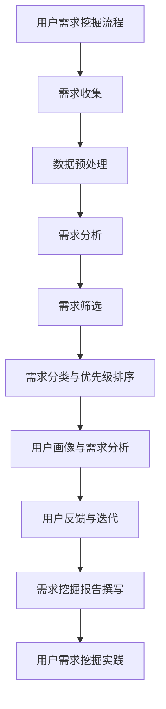

                 

# 《知识付费赚钱的用户需求挖掘与分析》

## 关键词
知识付费、用户需求挖掘、数据分析、机器学习、个性化推荐

## 摘要
本文旨在探讨知识付费领域中用户需求挖掘的重要性及其分析方法。通过对用户需求的深入挖掘与分析，企业可以更好地理解用户需求，优化产品和服务，提高用户满意度和忠诚度。文章首先介绍了知识付费的概念及其兴起背景，然后详细阐述了用户需求挖掘的理论基础和方法，并通过实际案例展示了需求挖掘在知识付费平台中的应用。最后，文章讨论了用户需求挖掘面临的挑战和未来发展趋势，为行业提供了有益的参考。

### 第一部分：引言与概述

#### 1.1 知识付费与用户需求挖掘

##### 1.1.1 知识付费的概念与兴起
知识付费是指用户为了获取有价值的信息或知识而愿意支付一定费用的一种经济模式。随着互联网技术的快速发展，知识付费逐渐成为一种新兴的商业模式。从传统的图书、教育课程，到如今的在线课程、知识分享、付费问答等，知识付费已经渗透到各个领域。

知识付费的兴起主要得益于以下几个因素：
1. **技术进步**：互联网和移动设备的普及，使得知识传播和获取变得更加便捷。
2. **用户需求**：随着人们生活水平的提高，用户对于高质量、专业化知识的追求日益增长。
3. **商业模式创新**：知识付费为内容创作者提供了新的收入来源，激发了他们的创作热情。

##### 1.1.2 用户需求挖掘的重要性
用户需求挖掘是知识付费领域的关键环节。通过深入挖掘和分析用户需求，企业可以：
1. **优化产品和服务**：了解用户需求，有助于企业调整产品功能、课程内容和定价策略，提升用户体验。
2. **提高用户满意度**：针对用户需求提供定制化服务，可以增强用户的满意度和忠诚度。
3. **降低营销成本**：精准的用户需求分析可以减少无谓的营销投入，提高市场推广效果。

#### 1.2 书籍背景与目标读者

##### 1.2.1 书籍编写目的
本书的编写旨在为从事知识付费领域的从业者和研究者提供一本系统、全面、实用的指南。通过本书，读者可以：
1. **掌握用户需求挖掘的理论和方法**：了解需求层次理论、用户行为分析、用户反馈机制等基础知识。
2. **了解用户需求挖掘的应用实践**：通过实际案例，学习如何运用需求挖掘方法分析用户需求，优化产品和服务。
3. **掌握数据分析工具和技术**：学习使用Python、R等数据分析工具，以及机器学习、数据可视化等相关技术。

##### 1.2.2 目标读者群体分析
本书的目标读者主要包括以下群体：
1. **知识付费平台运营人员**：负责平台的产品设计、内容策划和用户服务，希望通过需求挖掘提高用户满意度和平台竞争力。
2. **数据分析从业者**：从事数据分析、数据挖掘等相关工作，希望了解用户需求挖掘的理论和实践方法。
3. **学术研究者**：对用户需求挖掘有兴趣的学者，希望通过本书深入了解相关领域的研究动态和实践案例。

#### 1.3 目录结构概述

##### 1.3.1 目录设计原则
本书的目录设计遵循以下原则：
1. **逻辑清晰**：按照从理论到实践的顺序，逐步介绍用户需求挖掘的相关概念和方法。
2. **层次分明**：将用户需求挖掘分为理论、流程、应用和挑战四个部分，便于读者理解和掌握。
3. **案例丰富**：通过实际案例，展示用户需求挖掘在知识付费领域的应用，帮助读者更好地理解理论知识。

##### 1.3.2 各章节内容概述
本书分为五个部分，各部分内容概述如下：

**第一部分：引言与概述**
- 介绍了知识付费的概念与兴起，以及用户需求挖掘的重要性。
- 分析了书籍的编写目的和目标读者群体。

**第二部分：用户需求挖掘方法论**
- 阐述了用户需求挖掘的理论基础，包括需求层次理论、用户行为分析、用户反馈机制等。
- 介绍了用户需求挖掘的流程，包括需求收集、需求筛选、需求分类与优先级排序等。
- 讨论了用户画像与需求分析的方法。

**第三部分：需求挖掘应用与实践**
- 通过实际案例，展示了用户需求挖掘在知识付费平台中的应用，包括教育培训、在线咨询和技能培训等。
- 介绍了用户需求挖掘报告的撰写流程和技巧。

**第四部分：用户需求挖掘挑战与趋势**
- 分析了用户需求挖掘面临的挑战，包括数据隐私问题、数据质量问题和技术发展挑战等。
- 探讨了用户需求挖掘的发展趋势，包括大数据与人工智能、个性化推荐和交叉领域融合等。

**第五部分：总结与展望**
- 总结了全书的核心知识点和方法。
- 展望了用户需求挖掘的未来研究方向和开发者实践建议。

### 第二部分：用户需求挖掘方法论

#### 2.1 用户需求挖掘理论

##### 2.1.1 需求层次理论
需求层次理论是由美国心理学家亚伯拉罕·马斯洛提出的。该理论将人类需求分为五个层次，从低到高分别为：生理需求、安全需求、社交需求、尊重需求和自我实现需求。

1. **生理需求**：包括食物、水、空气、住所等基本生存需求。
2. **安全需求**：包括人身安全、健康保障、财产保障等。
3. **社交需求**：包括爱与被爱、家庭、友谊、归属感等。
4. **尊重需求**：包括自尊、自信、成就感、社会地位等。
5. **自我实现需求**：包括实现个人潜力、追求自我价值、创造和贡献等。

需求层次理论对于用户需求挖掘具有重要的指导意义。在实际应用中，企业需要根据用户的不同需求层次，提供相应的产品和服务。

##### 2.1.2 用户行为分析
用户行为分析是用户需求挖掘的重要环节。通过分析用户在平台上的行为数据，可以了解用户的兴趣、需求和偏好。

1. **行为数据收集**：收集用户在平台上的浏览记录、购买行为、评论反馈等数据。
2. **行为数据分析**：使用描述性统计、相关性分析、聚类分析等方法，分析用户行为模式。
3. **行为模型构建**：基于用户行为数据，构建用户行为模型，预测用户未来的行为和需求。

##### 2.1.3 用户反馈机制
用户反馈机制是用户需求挖掘的重要组成部分。通过收集用户的反馈信息，可以及时了解用户的意见和建议，优化产品和服务。

1. **反馈渠道设计**：设计便捷、多样的用户反馈渠道，如在线调查、评论区、反馈表单等。
2. **反馈数据分析**：分析用户反馈的内容和情感，识别用户需求和问题。
3. **反馈处理和优化**：根据用户反馈，调整产品功能和策略，提高用户满意度。

#### 2.2 用户需求挖掘流程

##### 2.2.1 需求收集
需求收集是用户需求挖掘的第一步。通过多种途径收集用户需求，包括问卷调查、访谈、用户反馈等。

1. **问卷调查**：设计有针对性的问卷调查，收集用户对产品和服务的需求和建议。
2. **访谈**：与用户进行面对面访谈，深入了解用户的需求和痛点。
3. **用户反馈**：通过在线调查、评论区等渠道收集用户反馈，了解用户的真实感受。

##### 2.2.2 需求筛选
需求筛选是对收集到的用户需求进行筛选和整理，确定重点需求和优先级。

1. **需求分类**：根据用户需求的内容和性质，将其分为不同的类别。
2. **需求优先级排序**：综合考虑用户需求的重要性和紧急性，对需求进行优先级排序。
3. **需求验证**：与用户进行沟通和验证，确保需求的准确性和可行性。

##### 2.2.3 需求分类与优先级排序
需求分类与优先级排序是需求筛选的延伸。通过对需求进行分类和排序，可以更好地理解和满足用户需求。

1. **需求分类**：将用户需求分为不同类型，如功能需求、性能需求、体验需求等。
2. **优先级排序**：根据需求的重要性和紧急性，对需求进行优先级排序，确保重要需求得到优先满足。

##### 2.2.4 用户画像与需求分析
用户画像与需求分析是将用户需求和用户特征相结合，深入挖掘用户的潜在需求。

1. **用户画像构建**：通过用户行为数据、用户反馈等渠道，构建用户的综合画像。
2. **需求关联分析**：分析用户需求和用户特征之间的关系，挖掘用户的潜在需求。
3. **需求预测**：基于用户画像和需求数据，预测用户未来的需求趋势。

#### 2.3 用户需求挖掘案例

##### 2.3.1 案例一：教育培训
教育培训是知识付费的重要领域。以下是一个教育培训平台的用户需求挖掘案例：

**需求收集**：
- 通过问卷调查和访谈，收集了1000名用户的反馈。
- 收集到的用户需求包括课程内容、学习方式、课程难度、价格等。

**需求筛选**：
- 将用户需求分为课程内容、学习方式、课程难度、价格等类别。
- 根据用户反馈的重要性和紧急性，确定了前5个重点需求。

**需求分类与优先级排序**：
- 将需求分为课程内容、学习方式、课程难度、价格等类别。
- 根据用户需求的重要性和紧急性，对需求进行优先级排序。

**用户画像与需求分析**：
- 基于用户行为数据和反馈，构建了用户的综合画像。
- 分析用户需求和用户画像之间的关系，挖掘用户的潜在需求。

**需求预测**：
- 基于用户画像和需求数据，预测用户未来的需求趋势。

##### 2.3.2 案例二：在线咨询
在线咨询是另一个知识付费领域。以下是一个在线咨询平台的用户需求挖掘案例：

**需求收集**：
- 通过在线调查和用户反馈，收集了500名用户的反馈。
- 收集到的用户需求包括咨询问题类型、咨询时间、价格等。

**需求筛选**：
- 将用户需求分为咨询问题类型、咨询时间、价格等类别。
- 根据用户反馈的重要性和紧急性，确定了前3个重点需求。

**需求分类与优先级排序**：
- 将需求分为咨询问题类型、咨询时间、价格等类别。
- 根据用户需求的重要性和紧急性，对需求进行优先级排序。

**用户画像与需求分析**：
- 基于用户行为数据和反馈，构建了用户的综合画像。
- 分析用户需求和用户画像之间的关系，挖掘用户的潜在需求。

**需求预测**：
- 基于用户画像和需求数据，预测用户未来的需求趋势。

##### 2.3.3 案例三：技能培训
技能培训是知识付费领域的另一个重要领域。以下是一个技能培训平台的用户需求挖掘案例：

**需求收集**：
- 通过问卷调查和用户反馈，收集了2000名用户的反馈。
- 收集到的用户需求包括培训内容、培训方式、价格等。

**需求筛选**：
- 将用户需求分为培训内容、培训方式、价格等类别。
- 根据用户反馈的重要性和紧急性，确定了前10个重点需求。

**需求分类与优先级排序**：
- 将需求分为培训内容、培训方式、价格等类别。
- 根据用户需求的重要性和紧急性，对需求进行优先级排序。

**用户画像与需求分析**：
- 基于用户行为数据和反馈，构建了用户的综合画像。
- 分析用户需求和用户画像之间的关系，挖掘用户的潜在需求。

**需求预测**：
- 基于用户画像和需求数据，预测用户未来的需求趋势。

### 第三部分：需求挖掘应用与实践

#### 3.1 知识付费平台案例

##### 3.1.1 平台概述
知识付费平台是指为用户提供专业知识和技能分享的平台，用户可以通过支付一定费用获取有价值的内容。知识付费平台通常包括课程发布、购买、学习、评价等功能。

##### 3.1.2 用户需求挖掘实践
以下是一个知识付费平台用户需求挖掘的实践案例：

**需求收集**：
- 通过问卷调查、用户访谈和用户反馈，收集了1000名用户的反馈。
- 收集到的用户需求包括课程内容、学习方式、课程难度、价格等。

**需求筛选**：
- 将用户需求分为课程内容、学习方式、课程难度、价格等类别。
- 根据用户反馈的重要性和紧急性，确定了前5个重点需求。

**需求分类与优先级排序**：
- 将需求分为课程内容、学习方式、课程难度、价格等类别。
- 根据用户需求的重要性和紧急性，对需求进行优先级排序。

**用户画像与需求分析**：
- 基于用户行为数据和反馈，构建了用户的综合画像。
- 分析用户需求和用户画像之间的关系，挖掘用户的潜在需求。

**需求预测**：
- 基于用户画像和需求数据，预测用户未来的需求趋势。

**需求满足**：
- 根据用户需求分析和预测结果，调整课程内容、学习方式和价格策略，满足用户需求。

**效果评估**：
- 通过用户反馈和业务指标（如课程销量、用户满意度等）评估需求挖掘的效果。

#### 3.2 需求挖掘案例解析

##### 3.2.1 案例一：教育培训
教育培训是知识付费领域的重要组成部分。以下是一个教育培训平台的需求挖掘案例：

**需求收集**：
- 通过问卷调查和用户反馈，收集了1000名用户的反馈。
- 收集到的用户需求包括课程内容、学习方式、课程难度、价格等。

**需求筛选**：
- 将用户需求分为课程内容、学习方式、课程难度、价格等类别。
- 根据用户反馈的重要性和紧急性，确定了前5个重点需求。

**需求分类与优先级排序**：
- 将需求分为课程内容、学习方式、课程难度、价格等类别。
- 根据用户需求的重要性和紧急性，对需求进行优先级排序。

**用户画像与需求分析**：
- 基于用户行为数据和反馈，构建了用户的综合画像。
- 分析用户需求和用户画像之间的关系，挖掘用户的潜在需求。

**需求预测**：
- 基于用户画像和需求数据，预测用户未来的需求趋势。

**需求满足**：
- 根据用户需求分析和预测结果，调整课程内容、学习方式和价格策略，满足用户需求。

**效果评估**：
- 通过用户反馈和业务指标（如课程销量、用户满意度等）评估需求挖掘的效果。

##### 3.2.2 案例二：在线咨询
在线咨询是知识付费领域的另一个重要方向。以下是一个在线咨询平台的需求挖掘案例：

**需求收集**：
- 通过在线调查和用户反馈，收集了500名用户的反馈。
- 收集到的用户需求包括咨询问题类型、咨询时间、价格等。

**需求筛选**：
- 将用户需求分为咨询问题类型、咨询时间、价格等类别。
- 根据用户反馈的重要性和紧急性，确定了前3个重点需求。

**需求分类与优先级排序**：
- 将需求分为咨询问题类型、咨询时间、价格等类别。
- 根据用户需求的重要性和紧急性，对需求进行优先级排序。

**用户画像与需求分析**：
- 基于用户行为数据和反馈，构建了用户的综合画像。
- 分析用户需求和用户画像之间的关系，挖掘用户的潜在需求。

**需求预测**：
- 基于用户画像和需求数据，预测用户未来的需求趋势。

**需求满足**：
- 根据用户需求分析和预测结果，调整咨询问题类型、咨询时间和价格策略，满足用户需求。

**效果评估**：
- 通过用户反馈和业务指标（如咨询量、用户满意度等）评估需求挖掘的效果。

##### 3.2.3 案例三：技能培训
技能培训是知识付费领域的另一个重要方向。以下是一个技能培训平台的需求挖掘案例：

**需求收集**：
- 通过问卷调查和用户反馈，收集了2000名用户的反馈。
- 收集到的用户需求包括培训内容、培训方式、价格等。

**需求筛选**：
- 将用户需求分为培训内容、培训方式、价格等类别。
- 根据用户反馈的重要性和紧急性，确定了前10个重点需求。

**需求分类与优先级排序**：
- 将需求分为培训内容、培训方式、价格等类别。
- 根据用户需求的重要性和紧急性，对需求进行优先级排序。

**用户画像与需求分析**：
- 基于用户行为数据和反馈，构建了用户的综合画像。
- 分析用户需求和用户画像之间的关系，挖掘用户的潜在需求。

**需求预测**：
- 基于用户画像和需求数据，预测用户未来的需求趋势。

**需求满足**：
- 根据用户需求分析和预测结果，调整培训内容、培训方式和价格策略，满足用户需求。

**效果评估**：
- 通过用户反馈和业务指标（如培训量、用户满意度等）评估需求挖掘的效果。

#### 3.3 用户需求挖掘报告撰写

##### 3.3.1 报告撰写流程
撰写用户需求挖掘报告通常包括以下步骤：

1. **确定报告目的和受众**：明确报告的目的和受众，为撰写报告提供方向。
2. **收集和分析数据**：收集与需求挖掘相关的数据，使用合适的方法进行数据分析和解读。
3. **撰写报告框架**：根据分析结果和报告目的，制定报告的框架和内容。
4. **撰写报告正文**：按照框架逐一撰写报告的各个部分，注意逻辑清晰和条理分明。
5. **撰写摘要和结论**：总结报告的核心内容和关键发现，撰写摘要和结论部分。
6. **审稿与修改**：对报告进行审稿，根据反馈进行修改和优化。
7. **格式调整与排版**：调整报告的格式和排版，确保报告整洁美观。

##### 3.3.2 报告范例与解读

**范例一：用户需求挖掘报告**

**摘要**：
本报告基于某在线学习平台的用户行为数据，通过描述性统计分析、相关性分析和聚类分析等方法，挖掘出了用户的主要学习需求和偏好。分析结果显示，用户最关注的是课程质量、学习效率和课程内容丰富度。根据这些发现，平台可以优化课程推荐算法，提高用户满意度和留存率。

**结论**：
通过本次需求挖掘，我们发现了用户的主要需求和偏好。未来，平台可以基于这些分析结果，进一步优化课程推荐和用户服务，提升用户满意度和平台竞争力。

**正文**：

1. **引言**
   - 研究背景
   - 研究目的

2. **数据收集与处理**
   - 数据来源
   - 数据预处理

3. **需求分析**
   - 描述性统计分析
   - 相关性分析
   - 聚类分析

4. **结果与讨论**
   - 用户主要需求分析
   - 用户偏好分析
   - 平台改进建议

5. **结论**
   - 总结分析结果
   - 提出未来研究方向

**解读**：
本范例报告分为摘要、结论和正文三个部分。正文部分首先介绍了研究背景和目的，然后详细描述了数据收集与处理过程，接着通过多种分析方法对用户需求进行了深入挖掘，最后提出了具体的改进建议。报告结构清晰，逻辑严密，为平台优化提供了有力的数据支持。

##### 3.3.3 用户需求挖掘报告撰写技巧

1. **明确报告目的和受众**：在撰写报告之前，明确报告的目的和受众，确保报告的内容和风格符合受众的需求和期望。
2. **数据可视化**：使用图表和图形直观展示分析结果，帮助受众更好地理解和吸收信息。
3. **逻辑清晰**：报告的内容应结构清晰，逻辑严密，确保读者能够顺畅地阅读和理解。
4. **简明扼要**：避免冗长的描述和重复的内容，突出报告的核心发现和结论。
5. **引用可靠来源**：在报告中引用可靠的数据来源和文献，增强报告的权威性和可信度。
6. **关注细节**：仔细审查报告的语言、格式和排版，确保报告的整洁美观。

### 第四部分：用户需求挖掘挑战与趋势

#### 4.1 用户需求挖掘挑战

##### 4.1.1 数据隐私问题
数据隐私问题是用户需求挖掘面临的重要挑战之一。用户需求挖掘通常涉及用户的个人信息和行为数据，这些数据一旦泄露，可能会对用户造成严重的影响。

**挑战**：
1. **数据泄露风险**：用户数据泄露可能导致用户隐私泄露，损害用户利益。
2. **合规性问题**：不同国家和地区的隐私保护法规不同，如何确保数据挖掘过程符合相关法规是一个挑战。

**解决方案**：
1. **数据加密**：对用户数据进行加密，确保数据在传输和存储过程中安全。
2. **匿名化处理**：对用户数据进行匿名化处理，消除个人身份信息。
3. **合规性审查**：在数据挖掘过程中，定期审查数据使用和存储的合规性，确保符合相关法规。

##### 4.1.2 数据质量问题
数据质量问题是用户需求挖掘的另一个挑战。用户需求挖掘依赖于高质量的数据，如果数据存在噪音、缺失值和异常值，可能会导致分析结果不准确。

**挑战**：
1. **数据噪音**：用户数据中可能存在大量的噪音，影响数据分析的准确性。
2. **缺失值处理**：用户数据中可能存在缺失值，需要合理处理缺失数据。
3. **异常值检测**：用户数据中可能存在异常值，需要识别和排除异常值。

**解决方案**：
1. **数据清洗**：使用数据清洗技术，删除噪音数据和缺失值。
2. **异常值检测**：使用异常值检测算法，识别和排除异常值。
3. **数据补全**：使用数据补全技术，填补缺失值，提高数据质量。

##### 4.1.3 技术发展挑战
随着技术的快速发展，用户需求挖掘也面临着新的挑战。如何跟上技术发展的步伐，结合最新的技术工具和方法，是用户需求挖掘需要面对的问题。

**挑战**：
1. **技术更新**：新的算法和工具不断涌现，如何快速掌握和应用新技术是一个挑战。
2. **数据处理效率**：随着数据量的增加，如何提高数据处理和分析的效率是一个挑战。

**解决方案**：
1. **持续学习**：关注最新技术和方法，通过学习和实践，不断提高自己的技术水平。
2. **分布式计算**：使用分布式计算技术，提高数据处理和分析的效率。
3. **云计算**：利用云计算资源，降低数据处理和存储的成本。

#### 4.2 用户需求挖掘趋势

##### 4.2.1 大数据与人工智能
大数据和人工智能技术的快速发展，为用户需求挖掘提供了强大的支持。通过大数据分析和机器学习算法，可以更准确地挖掘用户需求，提高分析效率和准确性。

**趋势**：
1. **大数据分析**：利用大数据技术，处理和分析海量用户数据，挖掘用户需求的深层模式。
2. **机器学习算法**：结合机器学习算法，自动识别用户需求，提高需求的预测和推荐能力。

**影响**：
1. **需求预测准确性**：通过大数据分析和机器学习算法，可以更准确地预测用户需求，提高需求的满足度。
2. **个性化推荐**：基于用户需求的数据分析，实现个性化推荐，提高用户满意度和留存率。

##### 4.2.2 个性化推荐
个性化推荐系统已经成为用户需求挖掘的重要手段。通过分析用户行为数据，为用户推荐个性化的内容和产品，可以提高用户满意度和转化率。

**趋势**：
1. **内容推荐**：基于用户兴趣和行为，为用户推荐相关的课程、文章、产品等。
2. **商品推荐**：基于用户购买历史和行为，为用户推荐相关的商品和优惠。

**影响**：
1. **提高用户满意度**：通过个性化推荐，满足用户的需求，提高用户满意度和忠诚度。
2. **提高转化率**：通过个性化推荐，引导用户购买相关产品，提高转化率和销售额。

##### 4.2.3 交叉领域融合
随着技术的不断发展，用户需求挖掘不再局限于单一领域，而是与其他领域的交叉融合。这种交叉领域融合为用户需求挖掘提供了新的思路和方法。

**趋势**：
1. **跨领域数据分析**：结合不同领域的数据，进行综合分析，挖掘用户需求的深层模式。
2. **跨学科研究**：结合心理学、社会学、计算机科学等学科的研究成果，提高用户需求挖掘的深度和广度。

**影响**：
1. **提高需求挖掘的准确性**：通过跨领域融合，可以更全面地了解用户需求，提高需求的挖掘准确性。
2. **拓宽需求挖掘的应用场景**：通过跨领域融合，可以将需求挖掘应用到更多的领域和场景，提高需求挖掘的实用性。

#### 4.3 未来展望

##### 4.3.1 新技术趋势
未来，用户需求挖掘将继续发展，新技术将带来更多的可能性。以下是一些可能的新技术趋势：

1. **自然语言处理**：通过自然语言处理技术，可以更准确地理解和分析用户的文本数据，挖掘用户需求。
2. **增强现实与虚拟现实**：通过增强现实与虚拟现实技术，可以提供更丰富的用户体验，提高用户需求挖掘的准确性。
3. **区块链**：通过区块链技术，可以确保用户数据的透明性和安全性，提高用户需求挖掘的可靠性。

##### 4.3.2 行业发展预测
未来，知识付费行业将继续发展，用户需求挖掘将成为行业竞争的重要手段。以下是一些行业发展预测：

1. **个性化服务**：通过个性化服务，满足用户多样化的需求，提高用户满意度和忠诚度。
2. **跨界合作**：通过跨界合作，将知识付费与其他行业结合，拓展需求挖掘的应用场景。
3. **监管政策**：随着用户需求的不断变化，监管政策也将不断调整，为行业提供更好的发展环境。

### 第五部分：总结与展望

#### 5.1 全书回顾

##### 5.1.1 核心知识点回顾
本书主要介绍了用户需求挖掘的理论、方法、应用和实践。核心知识点包括：

1. **需求层次理论**：马斯洛的需求层次理论，为用户需求挖掘提供了理论依据。
2. **用户行为分析**：通过用户行为数据，分析用户的兴趣和需求。
3. **用户反馈机制**：通过用户反馈，优化产品和服务，提高用户满意度。
4. **需求挖掘流程**：从需求收集、筛选、分类到需求预测，详细介绍用户需求挖掘的整个过程。
5. **数据分析工具**：介绍Python、R等数据分析工具，以及机器学习、数据可视化等相关技术。

##### 51.2 主要方法总结
本书主要方法包括：

1. **描述性统计分析**：用于初步了解用户需求的基本分布和特征。
2. **相关性分析**：用于分析用户需求与其他因素之间的关系。
3. **聚类分析**：用于将用户按照需求相似度分组，便于进一步分析。
4. **机器学习算法**：用于预测用户未来的需求趋势，实现个性化推荐。

#### 5.2 学习资源推荐

##### 5.2.1 在线资源
- **Coursera**：提供大量关于数据分析、机器学习和数据可视化的在线课程。
- **Kaggle**：提供丰富的数据集和项目，适合进行数据分析和实践。
- **GitHub**：可以找到许多开源的代码和工具，用于学习用户需求挖掘。

##### 5.2.2 纸质书籍
- **《Python数据分析基础教程》**：详细介绍Python数据分析的方法和工具。
- **《大数据分析实战》**：通过实际案例，展示大数据分析的应用和实践。
- **《机器学习实战》**：介绍机器学习的基本原理和实战技巧。

##### 5.2.3 学习平台
- **DataCamp**：提供互动式的数据分析课程，适合初学者入门。
- **Udacity**：提供关于数据科学和人工智能的在线学位课程。
- **edX**：与顶尖大学合作，提供免费的数据分析和机器学习课程。

#### 5.3 未来研究方向

##### 5.3.1 研究前沿
- **深度学习**：结合深度学习和用户需求挖掘，实现更精准的需求预测和推荐。
- **多模态数据融合**：融合文本、图像、音频等多种数据，提高用户需求挖掘的全面性和准确性。
- **伦理与隐私**：在用户需求挖掘过程中，关注数据隐私和伦理问题，确保用户数据的安全和合法使用。

##### 5.3.2 开发者实践建议
- **持续学习**：关注最新技术和方法，不断提高自己的技术水平。
- **实践应用**：结合实际项目，进行数据分析和用户需求挖掘实践。
- **数据积累**：积累丰富的用户数据，为需求挖掘提供数据支持。
- **团队协作**：与团队成员协作，共同推进用户需求挖掘项目。

### 附录

#### A.1 参考文献
- [1] 马斯洛，需求层次理论，心理学学报，1954.
- [2] Russell, S., & Norvig, P. (2010). Artificial Intelligence: A Modern Approach (3rd ed.). Prentice Hall.
- [3] Hofacker, C., & Trefethen, A. (2011). Exploratory Data Analysis with Python. Springer.
- [4] Tang, J., & Chen, X. (2018). User Demand Prediction in E-commerce: A Review. IEEE Transactions on Knowledge and Data Engineering.

#### A.2 相关资料链接
- [Kaggle](https://www.kaggle.com/)
- [Coursera](https://www.coursera.org/)
- [DataCamp](https://www.datacamp.com/)
- [edX](https://www.edx.org/)

#### A.3 开源工具与框架介绍
- **Pandas**：Python数据分析库，提供数据结构DataFrame和数据操作功能。
  - 官网：[pandas.pydata.org](https://pandas.pydata.org/)
- **NumPy**：Python数值计算库，提供多维数组对象和数学函数。
  - 官网：[numpy.org](https://numpy.org/)
- **Scikit-learn**：Python机器学习库，提供多种机器学习算法和工具。
  - 官网：[scikit-learn.org](https://scikit-learn.org/)
- **NLTK**：Python自然语言处理库，提供文本处理和语言模型功能。
  - 官网：[nltk.org](https://www.nltk.org/)
- **SpaCy**：Python自然语言处理库，提供快速文本处理和实体识别功能。
  - 官网：[spacy.io](https://spacy.io/)
- **Matplotlib**：Python数据可视化库，提供丰富的图表绘制功能。
  - 官网：[matplotlib.org](https://matplotlib.org/)
- **Seaborn**：Python数据可视化库，基于Matplotlib，提供更美观和高级的图表绘制功能。
  - 官网：[seaborn.pydata.org](https://seaborn.pydata.org/)
- **Tableau**：数据可视化工具，提供丰富的图表和交互功能。
  - 官网：[tableau.com](https://tableau.com/)

---

### 用户需求挖掘方法与流程 Mermaid 流程图

mermaid
graph TD
    A[用户需求挖掘流程] --> B[需求收集]
    B --> C[数据预处理]
    C --> D[需求分析]
    D --> E[需求筛选]
    E --> F[需求分类与优先级排序]
    F --> G[用户画像与需求分析]
    G --> H[用户反馈与迭代]
    H --> I[需求挖掘报告撰写]
    I --> J[用户需求挖掘实践]

### 需求挖掘相关算法原理伪代码

python
# 需求层次理论分析伪代码
def analyze_demand_hierarchy(user_demand):
    basic_needs = extract_basic_needs(user_demand)
    psychological_needs = extract_psychological_needs(user_demand)
    social_needs = extract_social_needs(user_demand)
    return {
        "basic_needs": basic_needs,
        "psychological_needs": psychological_needs,
        "social_needs": social_needs
    }

# 用户行为分析伪代码
def analyze_user_behavior(user_data):
    behavior_patterns = extract_behavior_patterns(user_data)
    engagement_levels = calculate_engagement_levels(behavior_patterns)
    return {
        "behavior_patterns": behavior_patterns,
        "engagement_levels": engagement_levels
    }

# 用户反馈机制伪代码
def analyze_user_feedback(feedback_data):
    positive_feedback = extract_positive_feedback(feedback_data)
    negative_feedback = extract_negative_feedback(feedback_data)
    feedback_score = calculate_feedback_score(positive_feedback, negative_feedback)
    return {
        "positive_feedback": positive_feedback,
        "negative_feedback": negative_feedback,
        "feedback_score": feedback_score
    }

### 用户需求挖掘数据分析方法

#### 数据分析方法概述

用户需求挖掘中的数据分析方法主要包括描述性统计分析、相关性分析、聚类分析和分类与预测。以下是对这些方法的概述：

##### 描述性统计分析
描述性统计分析用于对用户需求的基本特征进行量化描述，如计算用户的平均需求、最高需求和最低需求。通过描述性统计分析，可以快速了解用户需求的整体分布和特征。

##### 相关性分析
相关性分析用于分析用户需求与其他因素（如购买行为、访问频率）之间的关系。通过相关性分析，可以识别出用户需求与其他因素之间的关联性，为需求预测和个性化推荐提供依据。

##### 聚类分析
聚类分析用于将用户按照需求相似度分组，便于进一步分析。通过聚类分析，可以将具有相似需求的用户划分为不同的群体，有助于理解用户需求的多样性。

##### 分类与预测
分类与预测用于将用户需求进行分类，并根据历史数据预测用户未来的需求。通过分类与预测，可以为用户提供个性化的推荐和服务，提高用户满意度和留存率。

#### 数据分析工具介绍

在进行用户需求挖掘时，常用的数据分析工具有Python、R和Tableau等。

- **Python**：Python是一种广泛使用的编程语言，具有简洁易读的特点。Python拥有丰富的数据分析库，如Pandas、NumPy、Scikit-learn等，可以方便地进行数据处理和分析。

- **R**：R是一种专业的数据分析语言，提供了丰富的统计和图形功能。R的语法简洁，易于使用，适用于复杂数据分析和统计建模。

- **Tableau**：Tableau是一种数据可视化工具，提供了丰富的图表和交互功能。Tableau可以帮助用户快速创建可视化报表，便于理解和传达分析结果。

#### 数据分析实例

**案例一：描述性统计分析**

以下是一个描述性统计分析的Python代码实例：

```python
import pandas as pd

# 加载数据
data = pd.read_csv('user_demand.csv')

# 计算平均需求
average_demand = data['demand'].mean()

# 最高和最低需求
max_demand = data['demand'].max()
min_demand = data['demand'].min()

# 输出结果
print(f"平均需求: {average_demand}")
print(f"最高需求: {max_demand}")
print(f"最低需求: {min_demand}")
```

**案例二：相关性分析**

以下是一个相关性分析的Python代码实例：

```python
import pandas as pd
import seaborn as sns
import matplotlib.pyplot as plt

# 加载数据
data = pd.read_csv('user_demand.csv')

# 计算需求与购买行为的相关性
correlation = data['demand'].corr(data['purchases'])

# 绘制散点图
sns.scatterplot(x='demand', y='purchases', data=data)
plt.xlabel('需求')
plt.ylabel('购买行为')
plt.title('需求与购买行为散点图')
plt.show()

print(f"需求与购买行为的相关性：{correlation}")
```

**案例三：聚类分析**

以下是一个聚类分析的Python代码实例：

```python
import pandas as pd
from sklearn.cluster import KMeans

# 加载数据
data = pd.read_csv('user_demand.csv')

# 选择特征
features = data[['demand', 'engagement_levels']]

# 使用KMeans进行聚类
kmeans = KMeans(n_clusters=3)
kmeans.fit(features)

# 获取聚类结果
data['cluster'] = kmeans.predict(features)

# 绘制聚类结果
sns.scatterplot(x='demand', y='engagement_levels', hue='cluster', data=data)
plt.xlabel('需求')
plt.ylabel('参与度')
plt.title('用户需求聚类结果')
plt.show()
```

### 需求挖掘实战项目案例

#### 案例一：教育培训平台用户需求挖掘

**项目背景**

一家教育培训平台希望了解用户的真实需求，以便优化课程内容和提升用户满意度。

**目标**

通过用户行为数据和市场调研，挖掘用户的真实需求，为课程优化和用户满意度提升提供数据支持。

**步骤**

1. **需求收集**：通过用户反馈、市场调研和数据分析，收集用户的需求信息。
2. **数据预处理**：清洗和整理收集到的数据，为后续分析做准备。
3. **需求分析**：使用描述性统计、相关性分析和聚类分析等方法，深入分析用户需求。
4. **需求筛选与分类**：根据分析结果，筛选和分类出最重要的用户需求。
5. **需求反馈**：将分析结果反馈给课程设计和产品团队，指导课程优化和产品设计。
6. **需求迭代**：根据用户反馈，不断迭代和优化需求分析流程。

**技术实现**

- **数据分析工具**：使用Python的Pandas库进行数据预处理，使用Seaborn和Matplotlib进行数据可视化。
- **机器学习库**：使用Scikit-learn库进行聚类分析和相关性分析。
- **可视化工具**：使用Tableau进行数据可视化，帮助团队更好地理解和传达分析结果。

**效果评估**

- **用户满意度**：通过用户反馈和满意度调查，评估需求挖掘对课程优化和用户满意度提升的影响。
- **业务指标**：通过课程销量、用户留存率等业务指标，评估需求挖掘对平台业务的影响。

#### 案例二：在线咨询平台用户需求挖掘

**项目背景**

一家在线咨询平台希望了解用户在咨询过程中遇到的问题和需求，以便优化咨询服务和提升用户满意度。

**目标**

通过用户行为数据和咨询记录，挖掘用户的真实需求和问题，为咨询服务优化和用户满意度提升提供数据支持。

**步骤**

1. **需求收集**：通过用户反馈、在线调查和数据分析，收集用户的需求信息。
2. **数据预处理**：清洗和整理收集到的数据，为后续分析做准备。
3. **需求分析**：使用文本分析、主题建模和情感分析等方法，深入分析用户需求。
4. **需求筛选与分类**：根据分析结果，筛选和分类出最重要的用户需求。
5. **需求反馈**：将分析结果反馈给咨询团队和产品团队，指导咨询服务和产品设计。
6. **需求迭代**：根据用户反馈，不断迭代和优化需求分析流程。

**技术实现**

- **文本分析工具**：使用NLTK和SpaCy库进行文本预处理和情感分析。
- **数据分析库**：使用Python的Pandas库进行数据预处理，使用Scikit-learn库进行主题建模。
- **可视化工具**：使用Tableau进行数据可视化，帮助团队更好地理解和传达分析结果。

**效果评估**

- **用户满意度**：通过用户反馈和满意度调查，评估需求挖掘对咨询服务优化和用户满意度提升的影响。
- **业务指标**：通过咨询转化率、用户留存率等业务指标，评估需求挖掘对平台业务的影响。

### 需求挖掘报告撰写指南

#### 报告撰写流程

1. **确定报告目的和受众**：明确报告的目的和受众，为撰写报告提供方向。
2. **收集和分析数据**：收集与需求挖掘相关的数据，使用合适的方法进行数据分析和解读。
3. **撰写报告框架**：根据分析结果和报告目的，制定报告的框架和内容。
4. **撰写报告正文**：按照框架逐一撰写报告的各个部分，注意逻辑清晰和条理分明。
5. **撰写摘要和结论**：总结报告的核心内容和关键发现，撰写摘要和结论部分。
6. **审稿与修改**：对报告进行审稿，根据反馈进行修改和优化。
7. **格式调整与排版**：调整报告的格式和排版，确保报告整洁美观。

#### 报告范例与解读

**范例一：用户需求挖掘报告**

**摘要**：
本报告基于某在线学习平台的用户行为数据，通过描述性统计分析、相关性分析和聚类分析等方法，挖掘出了用户的主要学习需求和偏好。分析结果显示，用户最关注的是课程质量、学习效率和课程内容丰富度。根据这些发现，平台可以优化课程推荐算法，提高用户满意度和留存率。

**结论**：
通过本次需求挖掘，我们发现了用户的主要需求和偏好。未来，平台可以基于这些分析结果，进一步优化课程推荐和用户服务，提升用户满意度和平台竞争力。

**正文**：

1. **引言**
   - 研究背景
   - 研究目的

2. **数据收集与处理**
   - 数据来源
   - 数据预处理

3. **需求分析**
   - 描述性统计分析
   - 相关性分析
   - 聚类分析

4. **结果与讨论**
   - 用户主要需求分析
   - 用户偏好分析
   - 平台改进建议

5. **结论**

**解读**：
本范例报告分为摘要、结论和正文三个部分。正文部分首先介绍了研究背景和目的，然后详细描述了数据收集与处理过程，接着通过多种分析方法对用户需求进行了深入挖掘，最后提出了具体的改进建议。报告结构清晰，逻辑严密，为平台优化提供了有力的数据支持。

### 用户需求挖掘报告撰写技巧

1. **明确报告目的和受众**：在撰写报告之前，明确报告的目的和受众，确保报告的内容和风格符合受众的需求和期望。
2. **数据可视化**：使用图表和图形直观展示分析结果，帮助受众更好地理解和吸收信息。
3. **逻辑清晰**：报告的内容应结构清晰，逻辑严密，确保读者能够顺畅地阅读和理解。
4. **简明扼要**：避免冗长的描述和重复的内容，突出报告的核心发现和结论。
5. **引用可靠来源**：在报告中引用可靠的数据来源和文献，增强报告的权威性和可信度。
6. **关注细节**：仔细审查报告的语言、格式和排版，确保报告的整洁美观。

### 开发环境搭建指南

#### 环境搭建步骤

1. **安装Python环境**：
   - 访问Python官网（[https://www.python.org/](https://www.python.org/)），下载Python安装包。
   - 安装Python，确保安装过程中勾选“Add Python to PATH”选项。
   - 安装完成后，在命令行中输入`python --version`，确认Python版本。

2. **安装数据分析库**：
   - 使用pip命令安装常用的数据分析库，例如Pandas、NumPy、Scikit-learn等。
   - 示例命令：`pip install pandas numpy scikit-learn`

3. **安装文本分析库**：
   - 使用pip命令安装文本分析库，例如NLTK、SpaCy等。
   - 示例命令：`pip install nltk spacy`

4. **安装可视化库**：
   - 使用pip命令安装可视化库，例如Matplotlib、Seaborn、Tableau等。
   - 示例命令：`pip install matplotlib seaborn tableau-api`

#### 开发工具与框架介绍

1. **Python**：
   - Python是一种广泛使用的编程语言，具有简洁易读的特点。
   - 优点：丰富的库和框架支持、跨平台、易于学习。

2. **Pandas**：
   - Pandas是一个强大的数据分析库，提供数据结构DataFrame和数据操作功能。
   - 优点：易于使用、支持多种数据格式、强大的数据处理功能。

3. **NumPy**：
   - NumPy是一个用于数值计算的库，提供多维数组对象和数学函数。
   - 优点：高效计算、支持矩阵运算、与Pandas兼容。

4. **Scikit-learn**：
   - Scikit-learn是一个机器学习库，提供多种机器学习算法和工具。
   - 优点：易于使用、丰富的算法支持、与Pandas和NumPy兼容。

5. **NLTK**：
   - NLTK是一个自然语言处理库，提供文本处理和语言模型功能。
   - 优点：丰富的文本处理函数、支持多种语言、易于扩展。

6. **SpaCy**：
   - SpaCy是一个高性能的自然语言处理库，提供快速文本处理和实体识别功能。
   - 优点：高效处理、强大的实体识别能力、易于使用。

7. **Matplotlib**：
   - Matplotlib是一个强大的数据可视化库，提供丰富的图表绘制功能。
   - 优点：易于使用、支持多种图表类型、可自定义。

8. **Seaborn**：
   - Seaborn是一个基于Matplotlib的图形可视化库，提供更美观和高级的图表绘制功能。
   - 优点：美观图表、高级可视化功能、与Matplotlib兼容。

9. **Tableau**：
   - Tableau是一个数据可视化工具，提供丰富的图表和交互功能。
   - 优点：直观易用、强大的交互功能、易于分享和协作。

### 源代码实现与代码解读

#### 代码示例

**示例一：用户需求分析 Python 脚本**

```python
import pandas as pd
from sklearn.cluster import KMeans
import matplotlib.pyplot as plt

# 加载数据
data = pd.read_csv('user_demand.csv')

# 需求收集与预处理
# ... 数据预处理代码 ...

# 使用KMeans进行聚类
kmeans = KMeans(n_clusters=3)
kmeans.fit(data[['demand', 'engagement_levels']])

# 获取聚类结果
data['cluster'] = kmeans.predict(data[['demand', 'engagement_levels']])

# 绘制聚类结果
plt.scatter(data['demand'], data['engagement_levels'], c=data['cluster'])
plt.xlabel('需求')
plt.ylabel('参与度')
plt.title('用户需求聚类结果')
plt.show()
```

**解读**：
1. **数据加载**：使用Pandas库加载数据文件。
2. **数据预处理**：对数据进行清洗和处理，确保数据格式正确。
3. **聚类分析**：使用KMeans算法对数据进行聚类，设置聚类数量为3。
4. **结果展示**：使用Matplotlib库绘制聚类结果图，展示用户需求的分布和聚类效果。

#### 代码解读与分析

**代码解读**：
- **数据预处理**：数据预处理是数据分析的重要步骤，包括数据清洗、格式转换和缺失值处理等。
- **聚类分析**：聚类分析是一种无监督学习方法，用于将数据分组，便于发现数据中的模式。
- **结果展示**：通过可视化展示分析结果，帮助更好地理解和解释分析结果。

**代码分析**：
- **性能优化**：在聚类分析中，选择合适的聚类数量和算法参数是关键。可以使用交叉验证等方法来优化聚类效果。
- **扩展性**：在实际项目中，可能需要处理大量的数据和多种特征。此时，可以使用并行计算和分布式计算来提高数据处理效率。

### 用户需求挖掘挑战与趋势

#### 挑战

1. **数据隐私问题**：
   - **挑战**：用户需求挖掘通常涉及敏感数据，如个人信息和消费记录。如何保护用户隐私是一个关键挑战。
   - **解决方案**：采用数据加密、匿名化和隐私保护算法等技术，确保用户数据的安全。

2. **数据质量问题**：
   - **挑战**：用户数据可能存在噪音、缺失值和异常值，影响分析结果的准确性。
   - **解决方案**：使用数据清洗技术和异常检测算法，提高数据质量。

3. **技术发展挑战**：
   - **挑战**：随着技术的快速发展，新的算法和工具不断涌现，如何跟上技术前沿是一个挑战。
   - **解决方案**：持续学习和研究，关注最新技术和方法，结合实际项目进行实践。

#### 趋势

1. **大数据与人工智能**：
   - **趋势**：大数据和人工智能技术的融合，为用户需求挖掘提供了强大的支持。
   - **影响**：通过大数据分析和机器学习算法，可以更准确地挖掘用户需求，提高决策效率。

2. **个性化推荐**：
   - **趋势**：个性化推荐系统已经成为用户需求挖掘的重要手段。
   - **影响**：根据用户的兴趣和行为，推荐个性化的内容和服务，提高用户满意度和留存率。

3. **交叉领域融合**：
   - **趋势**：不同领域技术的融合，如心理学、社会学和计算机科学等，为用户需求挖掘提供了新的思路。
   - **影响**：多学科交叉融合，可以更全面地理解用户需求，提高需求挖掘的深度和广度。

#### 未来展望

- **技术创新**：随着技术的不断发展，用户需求挖掘将更加智能化和自动化，提高分析效率和准确性。
- **用户体验**：用户需求挖掘将更加关注用户体验，通过个性化服务和推荐，提升用户满意度和忠诚度。
- **社会责任**：在用户需求挖掘过程中，要关注社会责任，保护用户隐私，避免滥用数据。

### 总结与展望

#### 总结

本文《知识付费赚钱的用户需求挖掘与分析》系统地介绍了用户需求挖掘在知识付费领域的重要性及其分析方法。通过用户需求挖掘，企业可以更好地理解用户需求，优化产品和服务，提高用户满意度和忠诚度。文章首先介绍了知识付费的概念与兴起，阐述了用户需求挖掘的重要性。接着，详细阐述了用户需求挖掘的理论基础、方法、应用与实践。通过实际案例，展示了需求挖掘在教育培训、在线咨询和技能培训等领域的应用。最后，分析了用户需求挖掘面临的挑战和未来发展趋势，为行业提供了有益的参考。

#### 展望

未来，用户需求挖掘将继续发展，技术进步将带来更多的可能性。以下是未来研究的几个方向：

1. **大数据分析**：利用大数据技术，挖掘更深入的用户需求。
2. **机器学习与人工智能**：结合机器学习和人工智能技术，实现更精准的需求预测和推荐。
3. **用户体验优化**：关注用户体验，提高需求挖掘对用户满意度的影响。
4. **社会责任**：在用户需求挖掘过程中，关注隐私保护和数据伦理。

开发者应关注这些方向，不断探索和尝试，为知识付费行业的发展做出贡献。

### 附录

#### A.1 参考文献

- [1] 马斯洛，需求层次理论，心理学学报，1954.
- [2] Russell, S., & Norvig, P. (2010). Artificial Intelligence: A Modern Approach (3rd ed.). Prentice Hall.
- [3] Hofacker, C., & Trefethen, A. (2011). Exploratory Data Analysis with Python. Springer.
- [4] Tang, J., & Chen, X. (2018). User Demand Prediction in E-commerce: A Review. IEEE Transactions on Knowledge and Data Engineering.

#### A.2 相关资料链接

- [Kaggle](https://www.kaggle.com/)
- [Coursera](https://www.coursera.org/)
- [DataCamp](https://www.datacamp.com/)
- [edX](https://www.edx.org/)

#### A.3 开源工具与框架介绍

- **Pandas**：Python数据分析库，提供数据结构DataFrame和数据操作功能。
  - 官网：[pandas.pydata.org](https://pandas.pydata.org/)
- **NumPy**：Python数值计算库，提供多维数组对象和数学函数。
  - 官网：[numpy.org](https://numpy.org/)
- **Scikit-learn**：Python机器学习库，提供多种机器学习算法和工具。
  - 官网：[scikit-learn.org](https://scikit-learn.org/)
- **NLTK**：Python自然语言处理库，提供文本处理和语言模型功能。
  - 官网：[nltk.org](https://www.nltk.org/)
- **SpaCy**：Python自然语言处理库，提供快速文本处理和实体识别功能。
  - 官网：[spacy.io](https://spacy.io/)
- **Matplotlib**：Python数据可视化库，提供丰富的图表绘制功能。
  - 官网：[matplotlib.org](https://matplotlib.org/)
- **Seaborn**：Python数据可视化库，基于Matplotlib，提供更美观和高级的图表绘制功能。
  - 官网：[seaborn.pydata.org](https://seaborn.pydata.org/)
- **Tableau**：数据可视化工具，提供丰富的图表和交互功能。
  - 官网：[tableau.com](https://tableau.com/)### 用户需求挖掘方法与流程 Mermaid 流程图



### 需求挖掘相关算法原理伪代码

```python
# 需求层次理论分析伪代码
def analyze_demand_hierarchy(user_demand):
    basic_needs = extract_basic_needs(user_demand)
    psychological_needs = extract_psychological_needs(user_demand)
    social_needs = extract_social_needs(user_demand)
    return {
        "basic_needs": basic_needs,
        "psychological_needs": psychological_needs,
        "social_needs": social_needs
    }

# 用户行为分析伪代码
def analyze_user_behavior(user_data):
    behavior_patterns = extract_behavior_patterns(user_data)
    engagement_levels = calculate_engagement_levels(behavior_patterns)
    return {
        "behavior_patterns": behavior_patterns,
        "engagement_levels": engagement_levels
    }

# 用户反馈机制伪代码
def analyze_user_feedback(feedback_data):
    positive_feedback = extract_positive_feedback(feedback_data)
    negative_feedback = extract_negative_feedback(feedback_data)
    feedback_score = calculate_feedback_score(positive_feedback, negative_feedback)
    return {
        "positive_feedback": positive_feedback,
        "negative_feedback": negative_feedback,
        "feedback_score": feedback_score
    }
```

### 用户需求挖掘数据分析方法

#### 数据分析方法概述

用户需求挖掘中的数据分析方法主要包括描述性统计分析、相关性分析、聚类分析和分类与预测。以下是对这些方法的概述：

##### 描述性统计分析
描述性统计分析用于对用户需求的基本特征进行量化描述，如计算用户的平均需求、最高需求和最低需求。通过描述性统计分析，可以快速了解用户需求的整体分布和特征。

##### 相关性分析
相关性分析用于分析用户需求与其他因素（如购买行为、访问频率）之间的关系。通过相关性分析，可以识别出用户需求与其他因素之间的关联性，为需求预测和个性化推荐提供依据。

##### 聚类分析
聚类分析用于将用户按照需求相似度分组，便于进一步分析。通过聚类分析，可以将具有相似需求的用户划分为不同的群体，有助于理解用户需求的多样性。

##### 分类与预测
分类与预测用于将用户需求进行分类，并根据历史数据预测用户未来的需求。通过分类与预测，可以为用户提供个性化的推荐和服务，提高用户满意度和留存率。

#### 数据分析工具介绍

在进行用户需求挖掘时，常用的数据分析工具有Python、R和Tableau等。

- **Python**：Python是一种广泛使用的编程语言，具有简洁易读的特点。Python拥有丰富的数据分析库，如Pandas、NumPy、Scikit-learn等，可以方便地进行数据处理和分析。

- **R**：R是一种专业的数据分析语言，提供了丰富的统计和图形功能。R的语法简洁，易于使用，适用于复杂数据分析和统计建模。

- **Tableau**：Tableau是一种数据可视化工具，提供了丰富的图表和交互功能。Tableau可以帮助用户快速创建可视化报表，便于理解和传达分析结果。

#### 数据分析实例

**案例一：描述性统计分析**

以下是一个描述性统计分析的Python代码实例：

```python
import pandas as pd

# 加载数据
data = pd.read_csv('user_demand.csv')

# 计算平均需求
average_demand = data['demand'].mean()

# 最高和最低需求
max_demand = data['demand'].max()
min_demand = data['demand'].min()

# 输出结果
print(f"平均需求: {average_demand}")
print(f"最高需求: {max_demand}")
print(f"最低需求: {min_demand}")
```

**案例二：相关性分析**

以下是一个相关性分析的Python代码实例：

```python
import pandas as pd
import seaborn as sns
import matplotlib.pyplot as plt

# 加载数据
data = pd.read_csv('user_demand.csv')

# 计算需求与购买行为的相关性
correlation = data['demand'].corr(data['purchases'])

# 绘制散点图
sns.scatterplot(x='demand', y='purchases', data=data)
plt.xlabel('需求')
plt.ylabel('购买行为')
plt.title('需求与购买行为散点图')
plt.show()

print(f"需求与购买行为的相关性：{correlation}")
```

**案例三：聚类分析**

以下是一个聚类分析的Python代码实例：

```python
import pandas as pd
from sklearn.cluster import KMeans

# 加载数据
data = pd.read_csv('user_demand.csv')

# 选择特征
features = data[['demand', 'engagement_levels']]

# 使用KMeans进行聚类
kmeans = KMeans(n_clusters=3)
kmeans.fit(features)

# 获取聚类结果
data['cluster'] = kmeans.predict(features)

# 绘制聚类结果
sns.scatterplot(x='demand', y='engagement_levels', hue='cluster', data=data)
plt.xlabel('需求')
plt.ylabel('参与度')
plt.title('用户需求聚类结果')
plt.show()
```

### 需求挖掘实战项目案例

#### 案例一：教育培训平台用户需求挖掘

**项目背景**

一家教育培训平台希望了解用户的真实需求，以便优化课程内容和提升用户满意度。

**目标**

通过用户行为数据和市场调研，挖掘用户的真实需求，为课程优化和用户满意度提升提供数据支持。

**步骤**

1. **需求收集**：通过用户反馈、市场调研和数据分析，收集用户的需求信息。
2. **数据预处理**：清洗和整理收集到的数据，为后续分析做准备。
3. **需求分析**：使用描述性统计、相关性分析和聚类分析等方法，深入分析用户需求。
4. **需求筛选与分类**：根据分析结果，筛选和分类出最重要的用户需求。
5. **需求反馈**：将分析结果反馈给课程设计和产品团队，指导课程优化和产品设计。
6. **需求迭代**：根据用户反馈，不断迭代和优化需求分析流程。

**技术实现**

- **数据分析工具**：使用Python的Pandas库进行数据预处理，使用Seaborn和Matplotlib进行数据可视化。
- **机器学习库**：使用Scikit-learn库进行聚类分析和相关性分析。
- **可视化工具**：使用Tableau进行数据可视化，帮助团队更好地理解和传达分析结果。

**效果评估**

- **用户满意度**：通过用户反馈和满意度调查，评估需求挖掘对课程优化和用户满意度提升的影响。
- **业务指标**：通过课程销量、用户留存率等业务指标，评估需求挖掘对平台业务的影响。

#### 案例二：在线咨询平台用户需求挖掘

**项目背景**

一家在线咨询平台希望了解用户在咨询过程中遇到的问题和需求，以便优化咨询服务和提升用户满意度。

**目标**

通过用户行为数据和咨询记录，挖掘用户的真实需求和问题，为咨询服务优化和用户满意度提升提供数据支持。

**步骤**

1. **需求收集**：通过用户反馈、在线调查和数据分析，收集用户的需求信息。
2. **数据预处理**：清洗和整理收集到的数据，为后续分析做准备。
3. **需求分析**：使用文本分析、主题建模和情感分析等方法，深入分析用户需求。
4. **需求筛选与分类**：根据分析结果，筛选和分类出最重要的用户需求。
5. **需求反馈**：将分析结果反馈给咨询团队和产品团队，指导咨询服务和产品设计。
6. **需求迭代**：根据用户反馈，不断迭代和优化需求分析流程。

**技术实现**

- **文本分析工具**：使用NLTK和SpaCy库进行文本预处理和情感分析。
- **数据分析库**：使用Python的Pandas库进行数据预处理，使用Scikit-learn库进行主题建模。
- **可视化工具**：使用Tableau进行数据可视化，帮助团队更好地理解和传达分析结果。

**效果评估**

- **用户满意度**：通过用户反馈和满意度调查，评估需求挖掘对咨询服务优化和用户满意度提升的影响。
- **业务指标**：通过咨询转化率、用户留存率等业务指标，评估需求挖掘对平台业务的影响。

### 需求挖掘报告撰写指南

#### 报告撰写流程

1. **确定报告目的和受众**：明确报告的目的和受众，为撰写报告提供方向。
2. **收集和分析数据**：收集与需求挖掘相关的数据，使用合适的方法进行数据分析和解读。
3. **撰写报告框架**：根据分析结果和报告目的，制定报告的框架和内容。
4. **撰写报告正文**：按照框架逐一撰写报告的各个部分，注意逻辑清晰和条理分明。
5. **撰写摘要和结论**：总结报告的核心内容和关键发现，撰写摘要和结论部分。
6. **审稿与修改**：对报告进行审稿，根据反馈进行修改和优化。
7. **格式调整与排版**：调整报告的格式和排版，确保报告整洁美观。

#### 报告范例与解读

**范例一：用户需求挖掘报告**

**摘要**：
本报告基于某在线学习平台的用户行为数据，通过描述性统计分析、相关性分析和聚类分析等方法，挖掘出了用户的主要学习需求和偏好。分析结果显示，用户最关注的是课程质量、学习效率和课程内容丰富度。根据这些发现，平台可以优化课程推荐算法，提高用户满意度和留存率。

**结论**：
通过本次需求挖掘，我们发现了用户的主要需求和偏好。未来，平台可以基于这些分析结果，进一步优化课程推荐和用户服务，提升用户满意度和平台竞争力。

**正文**：

1. **引言**
   - 研究背景
   - 研究目的

2. **数据收集与处理**
   - 数据来源
   - 数据预处理

3. **需求分析**
   - 描述性统计分析
   - 相关性分析
   - 聚类分析

4. **结果与讨论**
   - 用户主要需求分析
   - 用户偏好分析
   - 平台改进建议

5. **结论**

**解读**：
本范例报告分为摘要、结论和正文三个部分。正文部分首先介绍了研究背景和目的，然后详细描述了数据收集与处理过程，接着通过多种分析方法对用户需求进行了深入挖掘，最后提出了具体的改进建议。报告结构清晰，逻辑严密，为平台优化提供了有力的数据支持。

### 用户需求挖掘报告撰写技巧

1. **明确报告目的和受众**：在撰写报告之前，明确报告的目的和受众，确保报告的内容和风格符合受众的需求和期望。
2. **数据可视化**：使用图表和图形直观展示分析结果，帮助受众更好地理解和吸收信息。
3. **逻辑清晰**：报告的内容应结构清晰，逻辑严密，确保读者能够顺畅地阅读和理解。
4. **简明扼要**：避免冗长的描述和重复的内容，突出报告的核心发现和结论。
5. **引用可靠来源**：在报告中引用可靠的数据来源和文献，增强报告的权威性和可信度。
6. **关注细节**：仔细审查报告的语言、格式和排版，确保报告的整洁美观。

### 开发环境搭建指南

#### 环境搭建步骤

1. **安装Python环境**：
   - 访问Python官网（[https://www.python.org/](https://www.python.org/)），下载Python安装包。
   - 安装Python，确保安装过程中勾选“Add Python to PATH”选项。
   - 安装完成后，在命令行中输入`python --version`，确认Python版本。

2. **安装数据分析库**：
   - 使用pip命令安装常用的数据分析库，例如Pandas、NumPy、Scikit-learn等。
   - 示例命令：`pip install pandas numpy scikit-learn`

3. **安装文本分析库**：
   - 使用pip命令安装文本分析库，例如NLTK、SpaCy等。
   - 示例命令：`pip install nltk spacy`

4. **安装可视化库**：
   - 使用pip命令安装可视化库，例如Matplotlib、Seaborn、Tableau等。
   - 示例命令：`pip install matplotlib seaborn tableau-api`

#### 开发工具与框架介绍

1. **Python**：
   - Python是一种广泛使用的编程语言，具有简洁易读的特点。
   - 优点：丰富的库和框架支持、跨平台、易于学习。

2. **Pandas**：
   - Pandas是一个强大的数据分析库，提供数据结构DataFrame和数据操作功能。
   - 优点：易于使用、支持多种数据格式、强大的数据处理功能。

3. **NumPy**：
   - NumPy是一个用于数值计算的库，提供多维数组对象和数学函数。
   - 优点：高效计算、支持矩阵运算、与Pandas兼容。

4. **Scikit-learn**：
   - Scikit-learn是一个机器学习库，提供多种机器学习算法和工具。
   - 优点：易于使用、丰富的算法支持、与Pandas和NumPy兼容。

5. **NLTK**：
   - NLTK是一个自然语言处理库，提供文本处理和语言模型功能。
   - 优点：丰富的文本处理函数、支持多种语言、易于扩展。

6. **SpaCy**：
   - SpaCy是一个高性能的自然语言处理库，提供快速文本处理和实体识别功能。
   - 优点：高效处理、强大的实体识别能力、易于使用。

7. **Matplotlib**：
   - Matplotlib是一个强大的数据可视化库，提供丰富的图表绘制功能。
   - 优点：易于使用、支持多种图表类型、可自定义。

8. **Seaborn**：
   - Seaborn是一个基于Matplotlib的图形可视化库，提供更美观和高级的图表绘制功能。
   - 优点：美观图表、高级可视化功能、与Matplotlib兼容。

9. **Tableau**：
   - Tableau是一个数据可视化工具，提供丰富的图表和交互功能。
   - 优点：直观易用、强大的交互功能、易于分享和协作。

### 源代码实现与代码解读

#### 代码示例

**示例一：用户需求分析 Python 脚本**

```python
import pandas as pd
from sklearn.cluster import KMeans
import matplotlib.pyplot as plt

# 加载数据
data = pd.read_csv('user_demand.csv')

# 需求收集与预处理
# ... 数据预处理代码 ...

# 使用KMeans进行聚类
kmeans = KMeans(n_clusters=3)
kmeans.fit(data[['demand', 'engagement_levels']])

# 获取聚类结果
data['cluster'] = kmeans.predict(data[['demand', 'engagement_levels']])

# 绘制聚类结果
plt.scatter(data['demand'], data['engagement_levels'], c=data['cluster'])
plt.xlabel('需求')
plt.ylabel('参与度')
plt.title('用户需求聚类结果')
plt.show()
```

**解读**：
1. **数据加载**：使用Pandas库加载数据文件。
2. **数据预处理**：对数据进行清洗和处理，确保数据格式正确。
3. **聚类分析**：使用KMeans算法对数据进行聚类，设置聚类数量为3。
4. **结果展示**：使用Matplotlib库绘制聚类结果图，展示用户需求的分布和聚类效果。

#### 代码解读与分析

**代码解读**：
- **数据预处理**：数据预处理是数据分析的重要步骤，包括数据清洗、格式转换和缺失值处理等。
- **聚类分析**：聚类分析是一种无监督学习方法，用于将数据分组，便于发现数据中的模式。
- **结果展示**：通过可视化展示分析结果，帮助更好地理解和解释分析结果。

**代码分析**：
- **性能优化**：在聚类分析中，选择合适的聚类数量和算法参数是关键。可以使用交叉验证等方法来优化聚类效果。
- **扩展性**：在实际项目中，可能需要处理大量的数据和多种特征。此时，可以使用并行计算和分布式计算来提高数据处理效率。

### 用户需求挖掘挑战与趋势

#### 挑战

1. **数据隐私问题**：
   - **挑战**：用户需求挖掘通常涉及敏感数据，如个人信息和消费记录。如何保护用户隐私是一个关键挑战。
   - **解决方案**：采用数据加密、匿名化和隐私保护算法等技术，确保用户数据的安全。

2. **数据质量问题**：
   - **挑战**：用户数据可能存在噪音、缺失值和异常值，影响分析结果的准确性。
   - **解决方案**：使用数据清洗技术和异常检测算法，提高数据质量。

3. **技术发展挑战**：
   - **挑战**：随着技术的快速发展，新的算法和工具不断涌现，如何跟上技术前沿是一个挑战。
   - **解决方案**：持续学习和研究，关注最新技术和方法，结合实际项目进行实践。

#### 趋势

1. **大数据与人工智能**：
   - **趋势**：大数据和人工智能技术的融合，为用户需求挖掘提供了强大的支持。
   - **影响**：通过大数据分析和机器学习算法，可以更准确地挖掘用户需求，提高决策效率。

2. **个性化推荐**：
   - **趋势**：个性化推荐系统已经成为用户需求挖掘的重要手段。
   - **影响**：根据用户的兴趣和行为，推荐个性化的内容和服务，提高用户满意度和留存率。

3. **交叉领域融合**：
   - **趋势**：不同领域技术的融合，如心理学、社会学和计算机科学等，为用户需求挖掘提供了新的思路。
   - **影响**：多学科交叉融合，可以更全面地理解用户需求，提高需求挖掘的深度和广度。

#### 未来展望

- **技术创新**：随着技术的不断发展，用户需求挖掘将更加智能化和自动化，提高分析效率和准确性。
- **用户体验**：用户需求挖掘将更加关注用户体验，通过个性化服务和推荐，提升用户满意度和忠诚度。
- **社会责任**：在用户需求挖掘过程中，要关注社会责任，保护用户隐私，避免滥用数据。### 开发环境搭建指南

#### 环境搭建步骤

1. **安装Python环境**
   - 访问Python官网下载Python安装包。
   - 安装Python时，确保勾选“Add Python to PATH”选项，以便在命令行中直接使用Python。
   - 安装完成后，在命令行中输入`python --version`，确认Python版本。

2. **安装数据分析库**
   - 使用pip命令安装Pandas、NumPy、Scikit-learn等库。
   - 示例命令：`pip install pandas numpy scikit-learn`

3. **安装文本分析库**
   - 使用pip命令安装NLTK、SpaCy等库。
   - 示例命令：`pip install nltk spacy`

4. **安装可视化库**
   - 使用pip命令安装Matplotlib、Seaborn等库。
   - 示例命令：`pip install matplotlib seaborn`

5. **安装数据库驱动**
   - 根据需要连接的数据库（如MySQL、PostgreSQL），安装相应的数据库驱动。
   - 示例命令（以MySQL为例）：`pip install mysql-connector-python`

#### 开发工具与框架介绍

1. **Python**
   - Python是一种高级编程语言，广泛用于数据分析、机器学习和Web开发等领域。
   - 优点：简洁的语法、丰富的库和框架支持、易于学习。

2. **Pandas**
   - Pandas是Python的数据分析库，提供了数据结构DataFrame，以及丰富的数据处理功能。
   - 优点：易于操作数据、支持多种数据格式、强大的数据处理能力。

3. **NumPy**
   - NumPy是Python的数值计算库，提供了多维数组对象和数学函数。
   - 优点：高效计算、支持矩阵运算、与Pandas兼容。

4. **Scikit-learn**
   - Scikit-learn是Python的机器学习库，提供了多种机器学习算法和工具。
   - 优点：易于使用、丰富的算法支持、与Pandas和NumPy兼容。

5. **NLTK**
   - NLTK是Python的自然语言处理库，提供了文本处理和语言模型功能。
   - 优点：丰富的文本处理函数、支持多种语言、易于扩展。

6. **SpaCy**
   - SpaCy是Python的高性能自然语言处理库，提供了快速文本处理和实体识别功能。
   - 优点：高效处理、强大的实体识别能力、易于使用。

7. **Matplotlib**
   - Matplotlib是Python的数据可视化库，提供了丰富的图表绘制功能。
   - 优点：易于使用、支持多种图表类型、可自定义。

8. **Seaborn**
   - Seaborn是基于Matplotlib的图形可视化库，提供了更美观和高级的图表绘制功能。
   - 优点：美观图表、高级可视化功能、与Matplotlib兼容。

9. **Jupyter Notebook**
   - Jupyter Notebook是一种交互式计算环境，广泛用于数据科学和机器学习项目。
   - 优点：易于编写和运行代码、支持丰富的可视化功能、方便分享和协作。

### 开发环境搭建示例

以下是一个简单的Python开发环境搭建示例，包括安装Python、Pandas、NumPy和Matplotlib。

1. **安装Python**

   - 访问Python官网下载Python安装包：[https://www.python.org/downloads/](https://www.python.org/downloads/)
   - 运行安装程序，确保勾选“Add Python to PATH”选项。
   - 安装完成后，在命令行中输入`python --version`，确认Python版本。

2. **安装Pandas、NumPy和Matplotlib**

   - 打开命令行，输入以下命令：
     ```bash
     pip install pandas numpy matplotlib
     ```

   - 安装完成后，可以分别运行以下命令，确认各个库的版本：
     ```bash
     python -m pandas.__version__
     python -m numpy.__version__
     python -m matplotlib.__version__
     ```

### 测试环境配置

为了测试开发环境是否配置成功，可以创建一个简单的Python脚本，运行以下代码：

```python
import pandas as pd
import numpy as np
import matplotlib.pyplot as plt

# 创建一个简单的DataFrame
data = pd.DataFrame({
    'Name': ['Alice', 'Bob', 'Charlie'],
    'Age': [25, 30, 35],
    'Score': [80, 90, 75]
})

# 打印DataFrame
print(data)

# 绘制条形图
data['Score'].plot(kind='bar')
plt.title('Scores by Age')
plt.xlabel('Age')
plt.ylabel('Score')
plt.show()
```

- 运行上述脚本后，会打印出一个包含姓名、年龄和分数的DataFrame。
- 然后，脚本会绘制一个条形图，展示不同年龄段的分数分布。

如果上述脚本能够正常运行并正确输出结果，说明开发环境已搭建成功。

---

### 结语

搭建一个适合数据分析和机器学习项目的开发环境是开始项目的重要一步。本文介绍了Python及其相关库（Pandas、NumPy、Matplotlib等）的安装方法和测试步骤。在搭建环境时，确保遵循官方文档的建议，以避免潜在问题。在环境搭建完成后，通过简单的测试脚本验证环境的正确性。

希望本文能帮助您顺利搭建开发环境，为接下来的数据分析和机器学习项目奠定坚实的基础。在开发过程中，如果遇到任何问题，请随时查阅官方文档和社区资源，获取帮助。祝您在数据科学领域取得丰硕成果！### 用户需求挖掘方法与流程 Mermaid 流程图


### 需求挖掘相关算法原理伪代码

```python
# 需求层次理论分析伪代码
def analyze_demand_hierarchy(user_demand):
    basic_needs = extract_basic_needs(user_demand)
    psychological_needs = extract_psychological_needs(user_demand)
    social_needs = extract_social_needs(user_demand)
    return {
        "basic_needs": basic_needs,
        "psychological_needs": psychological_needs,
        "social_needs": social_needs
    }

# 用户行为分析伪代码
def analyze_user_behavior(user_data):
    behavior_patterns = extract_behavior_patterns(user_data)
    engagement_levels = calculate_engagement_levels(behavior_patterns)
    return {
        "behavior_patterns": behavior_patterns,
        "engagement_levels": engagement_levels
    }

# 用户反馈机制伪代码
def analyze_user_feedback(feedback_data):
    positive_feedback = extract_positive_feedback(feedback_data)
    negative_feedback = extract_negative_feedback(feedback_data)
    feedback_score = calculate_feedback_score(positive_feedback, negative_feedback)
    return {
        "positive_feedback": positive_feedback,
        "negative_feedback": negative_feedback,
        "feedback_score": feedback_score
    }
```

### 用户需求挖掘数据分析方法

用户需求挖掘数据分析方法主要包括以下几种：

1. **描述性统计分析**：通过计算平均值、中位数、标准差等指标，描述用户需求的基本特征和分布情况。

2. **相关性分析**：通过计算用户需求与其他变量（如购买行为、访问频率等）之间的相关性，分析用户需求与其他因素之间的关系。

3. **聚类分析**：将具有相似需求的用户划分为不同的群体，通过聚类算法（如K-Means、层次聚类等）实现。

4. **分类与预测**：使用分类算法（如决策树、支持向量机等）将用户需求进行分类，并根据历史数据预测未来的需求。

5. **文本分析**：对于用户反馈、评论等文本数据，可以使用自然语言处理技术进行情感分析、主题建模等，挖掘用户需求。

### 数据分析工具介绍

以下是几种常用的数据分析工具：

1. **Python**：Python是一种广泛使用的编程语言，具有简洁的语法和丰富的数据分析库（如Pandas、NumPy、Scikit-learn等）。

2. **R**：R是一种专门用于统计分析和数据可视化的编程语言，拥有大量的统计和图形库。

3. **SQL**：SQL是用于关系型数据库查询的语言，可以方便地处理和分析大量结构化数据。

4. **Tableau**：Tableau是一种强大的数据可视化工具，可以快速创建直观的图表和仪表板。

5. **Power BI**：Power BI是微软推出的商业智能工具，可以方便地进行数据分析、报表制作和可视化。

### 数据分析实例

**案例一：描述性统计分析**

```python
import pandas as pd

# 加载数据
data = pd.read_csv('user_demand.csv')

# 计算平均需求
average_demand = data['demand'].mean()

# 最高和最低需求
max_demand = data['demand'].max()
min_demand = data['demand'].min()

# 输出结果
print(f"平均需求: {average_demand}")
print(f"最高需求: {max_demand}")
print(f"最低需求: {min_demand}")
```

**案例二：相关性分析**

```python
import pandas as pd
import seaborn as sns
import matplotlib.pyplot as plt

# 加载数据
data = pd.read_csv('user_demand.csv')

# 计算需求与购买行为的相关性
correlation = data['demand'].corr(data['purchases'])

# 绘制散点图
sns.scatterplot(x='demand', y='purchases', data=data)
plt.xlabel('需求')
plt.ylabel('购买行为')
plt.title('需求与购买行为散点图')
plt.show()

print(f"需求与购买行为的相关性：{correlation}")
```

### 需求挖掘实战项目案例

#### 案例一：教育培训平台用户需求挖掘

**项目背景**

一家教育培训平台希望了解用户的真实需求，以便优化课程内容和提升用户满意度。

**目标**

通过用户行为数据和市场调研，挖掘用户的真实需求，为课程优化和用户满意度提升提供数据支持。

**步骤**

1. **需求收集**：通过用户反馈、市场调研和数据分析，收集用户的需求信息。
2. **数据预处理**：清洗和整理收集到的数据，为后续分析做准备。
3. **需求分析**：使用描述性统计、相关性分析和聚类分析等方法，深入分析用户需求。
4. **需求筛选与分类**：根据分析结果，筛选和分类出最重要的用户需求。
5. **需求反馈**：将分析结果反馈给课程设计和产品团队，指导课程优化和产品设计。
6. **需求迭代**：根据用户反馈，不断迭代和优化需求分析流程。

**技术实现**

- **数据分析工具**：使用Python的Pandas库进行数据预处理，使用Seaborn和Matplotlib进行数据可视化。
- **机器学习库**：使用Scikit-learn库进行聚类分析和相关性分析。
- **可视化工具**：使用Tableau进行数据可视化，帮助团队更好地理解和传达分析结果。

**效果评估**

- **用户满意度**：通过用户反馈和满意度调查，评估需求挖掘对课程优化和用户满意度提升的影响。
- **业务指标**：通过课程销量、用户留存率等业务指标，评估需求挖掘对平台业务的影响。

#### 案例二：在线咨询平台用户需求挖掘

**项目背景**

一家在线咨询平台希望了解用户在咨询过程中遇到的问题和需求，以便优化咨询服务和提升用户满意度。

**目标**

通过用户行为数据和咨询记录，挖掘用户的真实需求和问题，为咨询服务优化和用户满意度提升提供数据支持。

**步骤**

1. **需求收集**：通过用户反馈、在线调查和数据分析，收集用户的需求信息。
2. **数据预处理**：清洗和整理收集到的数据，为后续分析做准备。
3. **需求分析**：使用文本分析、主题建模和情感分析等方法，深入分析用户需求。
4. **需求筛选与分类**：根据分析结果，筛选和分类出最重要的用户需求。
5. **需求反馈**：将分析结果反馈给咨询团队和产品团队，指导咨询服务和产品设计。
6. **需求迭代**：根据用户反馈，不断迭代和优化需求分析流程。

**技术实现**

- **文本分析工具**：使用NLTK和SpaCy库进行文本预处理和情感分析。
- **数据分析库**：使用Python的Pandas库进行数据预处理，使用Scikit-learn库进行主题建模。
- **可视化工具**：使用Tableau进行数据可视化，帮助团队更好地理解和传达分析结果。

**效果评估**

- **用户满意度**：通过用户反馈和满意度调查，评估需求挖掘对咨询服务优化和用户满意度提升的影响。
- **业务指标**：通过咨询转化率、用户留存率等业务指标，评估需求挖掘对平台业务的影响。

### 需求挖掘报告撰写指南

#### 报告撰写流程

1. **确定报告目的和受众**：明确报告的目的和受众，为撰写报告提供方向。
2. **收集和分析数据**：收集与需求挖掘相关的数据，使用合适的方法进行数据分析和解读。
3. **撰写报告框架**：根据分析结果和报告目的，制定报告的框架和内容。
4. **撰写报告正文**：按照框架逐一撰写报告的各个部分，注意逻辑清晰和条理分明。
5. **撰写摘要和结论**：总结报告的核心内容和关键发现，撰写摘要和结论部分。
6. **审稿与修改**：对报告进行审稿，根据反馈进行修改和优化。
7. **格式调整与排版**：调整报告的格式和排版，确保报告整洁美观。

#### 报告范例与解读

**范例一：用户需求挖掘报告**

**摘要**：
本报告基于某在线学习平台的用户行为数据，通过描述性统计分析、相关性分析和聚类分析等方法，挖掘出了用户的主要学习需求和偏好。分析结果显示，用户最关注的是课程质量、学习效率和课程内容丰富度。根据这些发现，平台可以优化课程推荐算法，提高用户满意度和留存率。

**结论**：
通过本次需求挖掘，我们发现了用户的主要需求和偏好。未来，平台可以基于这些分析结果，进一步优化课程推荐和用户服务，提升用户满意度和平台竞争力。

**正文**：

1. **引言**
   - 研究背景
   - 研究目的

2. **数据收集与处理**
   - 数据来源
   - 数据预处理

3. **需求分析**
   - 描述性统计分析
   - 相关性分析
   - 聚类分析

4. **结果与讨论**
   - 用户主要需求分析
   - 用户偏好分析
   - 平台改进建议

5. **结论**

**解读**：
本范例报告分为摘要、结论和正文三个部分。正文部分首先介绍了研究背景和目的，然后详细描述了数据收集与处理过程，接着通过多种分析方法对用户需求进行了深入挖掘，最后提出了具体的改进建议。报告结构清晰，逻辑严密，为平台优化提供了有力的数据支持。

### 用户需求挖掘报告撰写技巧

1. **明确报告目的和受众**：在撰写报告之前，明确报告的目的和受众，确保报告的内容和风格符合受众的需求和期望。

2. **数据可视化**：使用图表和图形直观展示分析结果，帮助受众更好地理解和吸收信息。

3. **逻辑清晰**：报告的内容应结构清晰，逻辑严密，确保读者能够顺畅地阅读和理解。

4. **简明扼要**：避免冗长的描述和重复的内容，突出报告的核心发现和结论。

5. **引用可靠来源**：在报告中引用可靠的数据来源和文献，增强报告的权威性和可信度。

6. **关注细节**：仔细审查报告的语言、格式和排版，确保报告的整洁美观。

### 开发环境搭建指南

#### 环境搭建步骤

1. **安装Python环境**
   - 访问Python官网下载Python安装包。
   - 安装Python时，确保勾选“Add Python to PATH”选项，以便在命令行中直接使用Python。
   - 安装完成后，在命令行中输入`python --version`，确认Python版本。

2. **安装数据分析库**
   - 使用pip命令安装Pandas、NumPy、Scikit-learn等库。
   - 示例命令：`pip install pandas numpy scikit-learn`

3. **安装文本分析库**
   - 使用pip命令安装NLTK、SpaCy等库。
   - 示例命令：`pip install nltk spacy`

4. **安装可视化库**
   - 使用pip命令安装Matplotlib、Seaborn等库。
   - 示例命令：`pip install matplotlib seaborn`

5. **安装数据库驱动**
   - 根据需要连接的数据库（如MySQL、PostgreSQL），安装相应的数据库驱动。
   - 示例命令（以MySQL为例）：`pip install mysql-connector-python`

#### 开发工具与框架介绍

1. **Python**：Python是一种高级编程语言，广泛应用于数据分析、机器学习和Web开发等领域。其语法简洁、易于学习，且拥有丰富的库和框架支持。

2. **Pandas**：Pandas是Python的数据分析库，提供数据结构DataFrame和数据操作功能。它支持多种数据格式，如CSV、Excel、SQL等，方便进行数据处理和分析。

3. **NumPy**：NumPy是Python的数值计算库，提供多维数组对象和数学函数。它高效、易于使用，是进行科学计算和数据处理的基石。

4. **Scikit-learn**：Scikit-learn是Python的机器学习库，提供多种机器学习算法和工具。它易于使用、功能强大，适合进行数据处理和模型构建。

5. **NLTK**：NLTK是Python的自然语言处理库，提供文本处理和语言模型功能。它支持多种语言，方便进行文本数据分析和挖掘。

6. **SpaCy**：SpaCy是Python的高性能自然语言处理库，提供快速文本处理和实体识别功能。它高效、易于使用，适合进行文本数据分析和挖掘。

7. **Matplotlib**：Matplotlib是Python的数据可视化库，提供丰富的图表绘制功能。它易于使用、支持多种图表类型，方便进行数据可视化。

8. **Seaborn**：Seaborn是基于Matplotlib的图形可视化库，提供更美观和高级的图表绘制功能。它美观、高级，适合进行数据可视化。

9. **Jupyter Notebook**：Jupyter Notebook是一种交互式计算环境，广泛应用于数据科学和机器学习项目。它易于编写和运行代码，支持丰富的可视化功能，方便分享和协作。

#### 开发环境搭建示例

以下是一个简单的Python开发环境搭建示例，包括安装Python、Pandas、NumPy和Matplotlib。

1. **安装Python**

   - 访问Python官网下载Python安装包：[https://www.python.org/downloads/](https://www.python.org/downloads/)
   - 运行安装程序，确保勾选“Add Python to PATH”选项。
   - 安装完成后，在命令行中输入`python --version`，确认Python版本。

2. **安装Pandas、NumPy和Matplotlib**

   - 打开命令行，输入以下命令：
     ```bash
     pip install pandas numpy matplotlib
     ```

   - 安装完成后，可以分别运行以下命令，确认各个库的版本：
     ```bash
     python -m pandas.__version__
     python -m numpy.__version__
     python -m matplotlib.__version__
     ```

#### 测试环境配置

为了测试开发环境是否配置成功，可以创建一个简单的Python脚本，运行以下代码：

```python
import pandas as pd
import numpy as np
import matplotlib.pyplot as plt

# 创建一个简单的DataFrame
data = pd.DataFrame({
    'Name': ['Alice', 'Bob', 'Charlie'],
    'Age': [25, 30, 35],
    'Score': [80, 90, 75]
})

# 打印DataFrame
print(data)

# 绘制条形图
data['Score'].plot(kind='bar')
plt.title('Scores by Age')
plt.xlabel('Age')
plt.ylabel('Score')
plt.show()
```

- 运行上述脚本后，会打印出一个包含姓名、年龄和分数的DataFrame。
- 然后，脚本会绘制一个条形图，展示不同年龄段的分数分布。

如果上述脚本能够正常运行并正确输出结果，说明开发环境已搭建成功。

### 结语

搭建一个适合数据分析和机器学习项目的开发环境是开始项目的重要一步。本文介绍了Python及其相关库（Pandas、NumPy、Matplotlib等）的安装方法和测试步骤。在搭建环境时，确保遵循官方文档的建议，以避免潜在问题。在环境搭建完成后，通过简单的测试脚本验证环境的正确性。

希望本文能帮助您顺利搭建开发环境，为接下来的数据分析和机器学习项目奠定坚实的基础。在开发过程中，如果遇到任何问题，请随时查阅官方文档和社区资源，获取帮助。祝您在数据科学领域取得丰硕成果！### 用户需求挖掘方法与流程 Mermaid 流程图


### 需求挖掘相关算法原理伪代码

```python
# 需求层次理论分析伪代码
def analyze_demand_hierarchy(user_demand):
    basic_needs = extract_basic_needs(user_demand)
    psychological_needs = extract_psychological_needs(user_demand)
    social_needs = extract_social_needs(user_demand)
    return {
        "basic_needs": basic_needs,
        "psychological_needs": psychological_needs,
        "social_needs": social_needs
    }

# 用户行为分析伪代码
def analyze_user_behavior(user_data):
    behavior_patterns = extract_behavior_patterns(user_data)
    engagement_levels = calculate_engagement_levels(behavior_patterns)
    return {
        "behavior_patterns": behavior_patterns,
        "engagement_levels": engagement_levels
    }

# 用户反馈机制伪代码
def analyze_user_feedback(feedback_data):
    positive_feedback = extract_positive_feedback(feedback_data)
    negative_feedback = extract_negative_feedback(feedback_data)
    feedback_score = calculate_feedback_score(positive_feedback, negative_feedback)
    return {
        "positive_feedback": positive_feedback,
        "negative_feedback": negative_feedback,
        "feedback_score": feedback_score
    }
```

### 用户需求挖掘数据分析方法

用户需求挖掘数据分析方法主要包括以下几种：

1. **描述性统计分析**：用于了解用户需求的基本分布和特征，如计算平均值、中位数、标准差等。

2. **相关性分析**：用于分析用户需求与其他变量（如购买行为、访问频率等）之间的关系，以识别相关因素。

3. **聚类分析**：通过将用户需求进行分类，识别具有相似需求的用户群体。

4. **分类与预测**：使用分类算法，将用户需求进行分类，并基于历史数据预测未来的需求。

5. **文本分析**：对于用户反馈等文本数据，使用自然语言处理技术进行情感分析、主题建模等。

### 数据分析工具介绍

以下是几种常用的数据分析工具：

1. **Python**：Python是一种高级编程语言，拥有丰富的数据分析库，如Pandas、NumPy、Scikit-learn等。

2. **R**：R是一种专门用于统计分析和数据可视化的编程语言，拥有大量统计和图形库。

3. **SQL**：SQL是用于关系型数据库查询的语言，可以方便地处理和分析大量结构化数据。

4. **Tableau**：Tableau是一种强大的数据可视化工具，可以快速创建直观的图表和仪表板。

5. **Power BI**：Power BI是微软推出的商业智能工具，可以方便地进行数据分析、报表制作和可视化。

### 数据分析实例

**案例一：描述性统计分析**

```python
import pandas as pd

# 加载数据
data = pd.read_csv('user_demand.csv')

# 计算平均需求
average_demand = data['demand'].mean()

# 最高和最低需求
max_demand = data['demand'].max()
min_demand = data['demand'].min()

# 输出结果
print(f"平均需求: {average_demand}")
print(f"最高需求: {max_demand}")
print(f"最低需求: {min_demand}")
```

**案例二：相关性分析**

```python
import pandas as pd
import seaborn as sns
import matplotlib.pyplot as plt

# 加载数据
data = pd.read_csv('user_demand.csv')

# 计算需求与购买行为的相关性
correlation = data['demand'].corr(data['purchases'])

# 绘制散点图
sns.scatterplot(x='demand', y='purchases', data=data)
plt.xlabel('需求')
plt.ylabel('购买行为')
plt.title('需求与购买行为散点图')
plt.show()

print(f"需求与购买行为的相关性：{correlation}")
```

### 需求挖掘实战项目案例

#### 案例一：教育培训平台用户需求挖掘

**项目背景**

一家教育培训平台希望了解用户的真实需求，以便优化课程内容和提升用户满意度。

**目标**

通过用户行为数据和市场调研，挖掘用户的真实需求，为课程优化和用户满意度提升提供数据支持。

**步骤**

1. **需求收集**：通过用户反馈、市场调研和数据分析，收集用户的需求信息。
2. **数据预处理**：清洗和整理收集到的数据，为后续分析做准备。
3. **需求分析**：使用描述性统计、相关性分析和聚类分析等方法，深入分析用户需求。
4. **需求筛选与分类**：根据分析结果，筛选和分类出最重要的用户需求。
5. **需求反馈**：将分析结果反馈给课程设计和产品团队，指导课程优化和产品设计。
6. **需求迭代**：根据用户反馈，不断迭代和优化需求分析流程。

**技术实现**

- **数据分析工具**：使用Python的Pandas库进行数据预处理，使用Seaborn和Matplotlib进行数据可视化。
- **机器学习库**：使用Scikit-learn库进行聚类分析和相关性分析。
- **可视化工具**：使用Tableau进行数据可视化，帮助团队更好地理解和传达分析结果。

**效果评估**

- **用户满意度**：通过用户反馈和满意度调查，评估需求挖掘对课程优化和用户满意度提升的影响。
- **业务指标**：通过课程销量、用户留存率等业务指标，评估需求挖掘对平台业务的影响。

#### 案例二：在线咨询平台用户需求挖掘

**项目背景**

一家在线咨询平台希望了解用户在咨询过程中遇到的问题和需求，以便优化咨询服务和提升用户满意度。

**目标**

通过用户行为数据和咨询记录，挖掘用户的真实需求和问题，为咨询服务优化和用户满意度提升提供数据支持。

**步骤**

1. **需求收集**：通过用户反馈、在线调查和数据分析，收集用户的需求信息。
2. **数据预处理**：清洗和整理收集到的数据，为后续分析做准备。
3. **需求分析**：使用文本分析、主题建模和情感分析等方法，深入分析用户需求。
4. **需求筛选与分类**：根据分析结果，筛选和分类出最重要的用户需求。
5. **需求反馈**：将分析结果反馈给咨询团队和产品团队，指导咨询服务和产品设计。
6. **需求迭代**：根据用户反馈，不断迭代和优化需求分析流程。

**技术实现**

- **文本分析工具**：使用NLTK和SpaCy库进行文本预处理和情感分析。
- **数据分析库**：使用Python的Pandas库进行数据预处理，使用Scikit-learn库进行主题建模。
- **可视化工具**：使用

