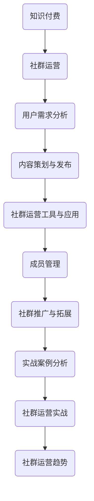

                 

### 《知识付费：程序员的社群运营思维》

> **关键词**：知识付费、程序员、社群运营、用户需求、内容策划、社群工具、成员管理、社群推广、案例分析、实战、未来趋势。

> **摘要**：本文深入探讨了知识付费背景下，程序员如何运用社群运营思维，提升社群活跃度和用户满意度，实现知识共享与商业价值最大化。通过分析知识付费的起源和发展，剖析社群运营的核心策略，以及提供实战案例和代码实现，本文旨在为程序员提供一套完整的社群运营指南。

### 目录大纲

1. **知识付费概述**
   - 第1章：知识付费的起源与发展
   - 第2章：程序员的社群运营概述

2. **社群运营核心策略**
   - 第3章：社群用户需求分析
   - 第4章：社群内容策划与发布
   - 第5章：社群运营工具与应用
   - 第6章：社群成员管理
   - 第7章：社群推广与拓展

3. **程序员的社群运营实践**
   - 第8章：程序员社群运营案例分析
   - 第9章：程序员的社群运营实战
   - 第10章：社群运营的未来趋势

4. **附录**
   - 附录A：社群运营工具汇总
   - 附录B：社群运营相关资源推荐

### 知识付费与程序员社群运营的 Mermaid 流程图



### 社群运营核心策略伪代码

```python
def community_operation_strategy():
    # 用户需求分析
    user需求的获取与处理()

    # 内容策划与发布
    content策划与发布()

    # 社群运营工具与应用
    tool选择与使用()

    # 成员管理
    member管理()

    # 社群推广与拓展
    promotion与拓展()

    # 数据分析与优化
    data分析()

    # 持续改进与优化
    strategy调整与优化()
```

### 社群运营中的数学模型

$$
\text{社群活跃度} = \frac{\text{互动次数}}{\text{成员总数}} \times 100\%
$$

### 社群运营案例

- **案例1：某程序员社群的运营策略**
  - **背景**：该社群专注于Python编程技术分享。
  - **策略**：定期发布技术文章，组织线上讨论，提供编程问题解答。
  - **效果**：社群成员活跃度提高，成员互动频繁，吸引了更多新成员加入。

- **案例2：某程序员社群的推广策略**
  - **背景**：社群初期成员较少，需要扩大影响力。
  - **策略**：通过社交媒体推广，与行业专家合作，举办线上讲座。
  - **效果**：社群知名度提高，吸引了大量开发者关注，社群成员数量迅速增长。

### 社群运营中的开发环境搭建与源代码实现

- **环境搭建**：选择合适的编程语言和开发工具，如Python和GitHub。

- **源代码实现**：
  
  ```python
  # 社群运营管理系统（伪代码）
  class CommunityManagement:
      def __init__(self):
          self.users = []
          self.posts = []

      def add_user(self, user):
          self.users.append(user)

      def publish_post(self, post):
          self.posts.append(post)

      def respond_to_post(self, post_id, response):
          for post in self.posts:
              if post.id == post_id:
                  post.responses.append(response)
                  break
  ```

- **代码解读**：这段代码定义了一个简单的社群运营管理系统，包括用户添加、发布帖子以及回复帖子等功能。

### 总结

《知识付费：程序员的社群运营思维》目录大纲完整地涵盖了知识付费的起源、社群运营的核心策略、实战案例分析、开发环境搭建与源代码实现等内容。通过此大纲，读者可以系统地学习如何运营一个程序员的社群，实现知识付费的目标。附录部分则提供了社群运营工具的汇总和资源推荐，以供读者参考和进一步学习。

在接下来的章节中，我们将逐一深入探讨知识付费的背景、社群运营的概述、核心策略以及实战案例分析，帮助程序员更好地理解和应用社群运营思维，提升社群的价值和影响力。让我们开始这一段深入的学习之旅。

### 知识付费概述

知识付费，作为一个新兴的商业模式，正逐渐改变着信息传播和消费的方式。知识付费的定义简单来说，就是用户为获取有价值的信息或知识而支付费用。这种模式的核心在于信息不对称的解决，即通过付费的方式，用户能够获得更高质量、更专业的知识内容。

#### 1.1 知识付费的定义与特点

知识付费并不仅仅是传统教育方式的延伸，它更强调的是个性化、碎片化、专业化的知识获取。以下是知识付费的几个主要特点：

- **个性化**：知识付费能够根据用户的兴趣和需求，提供定制化的内容服务。这种个性化服务可以通过数据分析，精准匹配用户偏好，从而提升用户体验。
- **碎片化**：在快节奏的生活中，用户往往希望以短、平、快的知识获取方式来满足学习需求。知识付费满足了这种碎片化学习的需求，通过短篇文章、视频、音频等形式，让用户可以在零散时间快速获取知识。
- **专业化**：知识付费平台上的内容通常由行业专家、学者或资深从业者提供，这使得用户能够获得高质量、可靠的专业知识。

#### 1.2 知识付费的起源与发展历程

知识付费的起源可以追溯到互联网时代的早期，随着互联网技术的发展和用户需求的增长，知识付费逐渐成为一种主流的商业模式。以下是知识付费的发展历程：

- **萌芽期**（2000年代初期）：互联网开始普及，用户对知识的获取方式逐渐从传统媒体转向互联网。这个时期，一些网站开始提供付费的电子书、在线课程等服务。
- **发展期**（2010年代）：随着智能手机的普及，移动互联网快速发展，知识付费市场迎来爆发期。各类知识付费平台如雨后春笋般涌现，如“得到”、“分答”、“知乎Live”等，这些平台提供了丰富的付费内容和服务。
- **成熟期**（2010年代后期至今）：知识付费市场逐渐走向成熟，用户对知识付费的接受度提高，付费内容的形式也更加多样化。同时，知识付费平台开始探索更多商业模式，如知识变现、社群互动等，以满足不同层次的用户需求。

#### 1.3 知识付费的商业模式分析

知识付费的商业模式主要包括以下几种：

- **内容付费**：这是最常见的一种模式，用户为获取特定内容或知识而支付费用。例如，在线课程、电子书、专业杂志等。
- **知识变现**：通过提供专业咨询服务或培训课程，将个人的专业知识转化为收入。这种模式常见于行业专家、学者或知名人士。
- **平台分成**：知识付费平台通过提供服务，如课程推广、用户管理、支付等，从内容创作者那里获得分成。
- **会员订阅**：用户为获得平台的持续服务而支付定期费用，这种模式能够保证平台的稳定收入。
- **广告合作**：知识付费平台通过广告收入来补充平台运营成本，常见于一些免费内容平台。

知识付费的商业模式不仅为内容创作者提供了新的收入来源，也为用户提供了更便捷、更高质量的知识获取方式。随着知识付费市场的不断成熟，未来还会有更多创新商业模式的出现。

### 程序员的社群运营概述

#### 2.1 程序员社群的重要性

在快速发展的技术时代，程序员社群成为程序员们相互交流、学习、成长的重要平台。程序员社群的重要性体现在以下几个方面：

- **知识共享**：程序员社群为成员提供了一个共享知识的场所。成员可以通过分享技术文章、案例分析、编程经验等，快速获取行业前沿知识和技术动态。
- **技能提升**：通过参与社群活动，程序员可以学习到最新的编程技巧和工具，提升自己的技能水平，从而在职场上更具竞争力。
- **职业发展**：程序员社群是职业发展的催化剂。成员可以在社群中建立人脉，获取职业机会，甚至成为行业专家。
- **问题解决**：在遇到技术难题时，程序员社群成员可以相互协助，共同解决问题，提高工作效率。

#### 2.2 社群运营的基本概念

社群运营是指通过一系列策略和活动，管理、激励和扩大社群成员的数量和质量，从而实现社群的持续发展。以下是社群运营的基本概念：

- **社群**：社群是指由具有共同兴趣、目标或价值观的人组成的网络群体。在程序员社群中，成员通常对编程技术、软件开发等领域有共同的兴趣和热情。
- **运营**：社群运营是指通过内容策划、活动组织、用户管理等一系列手段，维持社群的活跃度和成员的满意度，从而推动社群的发展。
- **策略**：社群运营策略是指为了实现社群目标而制定的行动计划。包括内容策略、活动策略、用户增长策略等。
- **活动**：社群活动是社群运营的核心，包括线上讨论、技术分享、编程比赛、培训课程等，通过这些活动，可以提升社群的活跃度和成员的参与度。

#### 2.3 社群运营的目标与策略

社群运营的目标主要包括以下几点：

- **增加成员数量**：通过有效的推广策略，吸引更多有共同兴趣的程序员加入社群。
- **提升活跃度**：通过内容策划和活动组织，激发成员的参与热情，保持社群的活跃度。
- **提升满意度**：通过优质的服务和良好的社群氛围，提升成员的满意度，增强社群的凝聚力。
- **实现商业价值**：通过知识变现、广告合作等商业模式，实现社群的商业价值。

为了实现这些目标，社群运营可以采用以下策略：

- **内容策略**：定期发布高质量的技术文章、案例分享、行业动态等内容，满足成员的知识需求。
- **活动策略**：组织形式多样的活动，如线上讨论、技术分享会、编程比赛等，提升成员的参与度和互动性。
- **用户增长策略**：通过口碑传播、社交媒体推广、合作拓展等手段，吸引更多潜在成员加入。
- **用户管理策略**：建立完善的用户管理体系，包括用户分级、用户活跃度分析、用户需求反馈等，提升用户满意度和社群凝聚力。

通过上述策略，程序员社群可以实现成员的增加、活跃度的提升和满意度的提高，从而实现社群的持续发展和商业价值的实现。

### 社群用户需求分析

#### 3.1 用户需求分析的重要性

在社群运营中，用户需求分析是至关重要的环节。只有深入了解用户需求，才能提供符合用户期望的服务和内容，从而提升用户满意度和社群活跃度。以下是用户需求分析在社群运营中的重要性：

- **提升用户体验**：通过分析用户需求，可以了解用户在社群中的痛点、需求和期望，从而提供更个性化的服务，提升用户体验。
- **优化内容策划**：了解用户需求有助于社群运营者更好地策划内容，发布符合用户兴趣和需求的高质量内容，提高内容的吸引力和传播效果。
- **增加用户参与度**：通过针对用户需求的互动活动，可以激发用户的参与热情，增强用户在社群中的活跃度。
- **提升社群价值**：满足用户需求不仅可以提升用户满意度，还可以吸引更多潜在用户加入社群，从而扩大社群规模和影响力。

#### 3.2 用户需求分析方法

用户需求分析的方法主要包括以下几种：

- **问卷调查**：通过设计问卷调查，收集用户的基本信息、兴趣爱好、需求偏好等，从而了解用户需求。
- **用户访谈**：通过与用户进行一对一访谈，深入了解用户的使用习惯、需求和痛点，获取更详细和深入的用户需求信息。
- **数据分析**：通过分析社群运营数据，如用户活跃度、内容阅读量、互动率等，识别用户行为模式和需求趋势。
- **用户行为分析**：通过观察用户在社群中的行为，如参与话题讨论、发布内容、点赞评论等，分析用户需求和行为习惯。

#### 3.3 用户画像与用户分层

用户画像是指通过用户的基本信息、行为数据、兴趣偏好等，对用户进行全面的描述和分析。用户画像可以帮助社群运营者更好地了解用户，从而提供更精准的服务和内容。

以下是构建用户画像和用户分层的步骤：

1. **数据收集**：收集用户的基本信息、行为数据、兴趣爱好等，构建初步的用户画像。
2. **数据分析**：对收集到的数据进行分析，识别用户的行为模式和需求特征。
3. **用户画像构建**：根据分析结果，构建详细的用户画像，包括用户的基本特征、行为习惯、需求偏好等。
4. **用户分层**：根据用户画像，将用户分为不同的层次，如新手用户、活跃用户、贡献用户等，从而制定差异化的运营策略。

#### 用户画像示例

假设我们分析的是一个专注于Python编程技术的程序员社群，以下是一个简单的用户画像示例：

- **基本信息**：
  - 年龄：25-35岁
  - 职业：软件开发工程师、数据分析师
  - 地域：主要集中在一线城市
- **行为数据**：
  - 活跃时间：工作日下午和晚上
  - 常用设备：电脑、手机
  - 阅读内容：编程技术文章、案例分享、行业动态
  - 参与活动：技术分享会、编程比赛、问答互动
- **需求偏好**：
  - 需求一：学习最新Python技术
  - 需求二：解决编程问题
  - 需求三：扩大职业人脉

通过用户画像和用户分层，社群运营者可以更好地了解用户需求，提供个性化的服务和内容，从而提升社群的价值和用户满意度。

### 社群内容策划与发布

#### 4.1 内容策划的要素与原则

社群内容策划是社群运营的核心环节，一个成功的社群离不开精心策划的内容。以下是内容策划的几个关键要素和原则：

- **目标明确**：内容策划首先要明确目标，包括提升用户满意度、增加社群活跃度、促进知识传播等。明确的目标有助于确保内容策划的方向正确。
- **需求导向**：内容策划要紧密围绕用户需求展开，了解用户关心的话题和需求，从而提供有价值的内容。这可以通过用户需求分析来获取。
- **多样化**：内容形式要多样化，包括技术文章、案例分析、视频教程、互动讨论等，以满足不同用户的需求和偏好。
- **时效性**：内容要有时效性，及时跟进行业热点和技术趋势，让用户获取最新、最有价值的信息。
- **可操作性**：内容要具有可操作性，让用户能够实际应用到工作中，提高内容的实用性和吸引力。

#### 4.2 内容发布的策略与技巧

内容发布是内容策划的延续，有效的发布策略和技巧可以提升内容的传播效果和用户参与度。以下是几个内容发布的策略和技巧：

- **定时发布**：定期发布内容，建立固定的发布时间表，让用户形成习惯，提高内容的曝光率。
- **渠道多样化**：利用多种渠道发布内容，如社群内部、社交媒体、博客等，扩大内容的传播范围。
- **互动性**：发布内容时，鼓励用户参与互动，如提问、评论、点赞等，提高用户的参与度和活跃度。
- **优化标题**：标题是吸引用户点击的重要因素，要尽量简洁、有吸引力，同时准确反映内容的核心价值。
- **格式优化**：内容格式要清晰、易读，使用段落、列表、图片等元素，提高内容的可读性。

#### 4.3 社群互动与用户参与

社群互动是提升社群活跃度和用户满意度的重要手段。以下是一些促进社群互动和用户参与的方法：

- **话题讨论**：定期发布话题，鼓励成员参与讨论，分享自己的见解和经验。
- **活动组织**：组织形式多样的活动，如线上技术分享会、编程比赛、问答互动等，提高用户的参与热情。
- **问答环节**：设置问答环节，鼓励成员提出问题和解答问题，促进知识的传播和交流。
- **奖励机制**：设立奖励机制，对积极参与互动的用户给予奖励，如积分、优惠券等，提高用户的参与积极性。

通过有效的社群内容策划和发布策略，结合多样化的互动活动，可以提升社群的活跃度和用户满意度，实现社群的持续发展和商业价值。

### 社群运营工具与应用

#### 5.1 社群运营工具的选择

社群运营工具的选择是社群成功的关键之一。以下是几种常见的社群运营工具及其特点：

- **社群平台**：如微信群、QQ群、Discord等，适合小规模、高互动的社群。这些平台通常具有实时沟通、文件分享、群聊等功能，能够满足社群的基本需求。
- **论坛系统**：如Discourse、论坛CMS等，适合大规模、内容驱动的社群。这些平台通常具有文章发布、评论系统、积分体系等功能，能够提供丰富的内容和互动体验。
- **内容管理系统**（CMS）：如WordPress、Joomla等，适合需要独立网站的社群。这些平台可以自定义页面、管理内容、整合社交媒体，提供全面的社群运营功能。
- **项目管理工具**：如Trello、Asana等，适合需要进行项目管理和协作的社群。这些平台可以帮助社群运营团队高效地规划任务、跟踪进度、协作交流。
- **数据分析工具**：如Google Analytics、热图分析工具等，适合需要进行数据分析和优化的社群。这些工具可以提供用户行为分析、流量来源分析等数据，帮助社群运营者做出数据驱动的决策。

#### 5.2 工具功能与使用方法

以下是几种常见社群运营工具的功能和使用方法：

- **微信群**：
  - 功能：实时聊天、文件传输、群公告、群直播等。
  - 使用方法：创建微信群，邀请成员加入；设置群管理员，管理群内事务；定期发布群公告，通知重要信息；利用微信群直播功能，进行线上活动。

- **Discourse**：
  - 功能：文章发布、评论系统、用户管理、积分体系等。
  - 使用方法：安装Discourse论坛系统，设置论坛结构和权限；发布技术文章，提供知识分享；设置评论系统，鼓励用户互动；使用积分体系，激励用户参与。

- **WordPress**：
  - 功能：页面管理、内容发布、SEO优化、社交媒体整合等。
  - 使用方法：安装WordPress，自定义网站主题和页面；定期发布博客文章，分享技术心得；利用SEO优化，提高网站在搜索引擎中的排名；整合社交媒体，扩大内容传播渠道。

- **Trello**：
  - 功能：任务管理、进度跟踪、协作交流等。
  - 使用方法：创建Trello看板，划分任务清单；分配任务给团队成员，跟踪任务进度；利用Trello的卡片功能，记录和交流任务信息；定期更新进度，确保项目顺利进行。

- **Google Analytics**：
  - 功能：用户行为分析、流量来源分析、网站性能分析等。
  - 使用方法：设置Google Analytics跟踪代码，收集网站数据；查看用户行为报告，了解用户访问习惯；分析流量来源，优化内容推广策略；定期分析网站性能，提升用户体验。

#### 5.3 社群工具在运营中的应用案例

以下是几个社群工具在运营中的应用案例：

- **案例1：技术论坛运营**
  - 平台选择：Discourse
  - 应用效果：通过Discourse建立了一个技术论坛，提供了丰富的技术文章和互动讨论区域，吸引了大量程序员加入。论坛用户活跃度高，内容丰富，成为了技术交流的重要平台。

- **案例2：社群项目协作**
  - 工具选择：Trello
  - 应用效果：使用Trello进行社群项目协作，清晰地规划了任务和进度，提高了团队的协作效率。团队成员可以实时更新任务状态，分享工作进展，确保项目按时完成。

- **案例3：网站内容发布**
  - 平台选择：WordPress
  - 应用效果：通过WordPress建立了一个独立的社群网站，提供了丰富的技术内容和互动功能。网站SEO优化效果显著，吸引了大量搜索引擎流量，提升了社群的知名度和影响力。

- **案例4：数据分析与优化**
  - 工具选择：Google Analytics
  - 应用效果：利用Google Analytics进行数据分析，了解了用户行为和网站性能。根据分析结果，优化了内容结构和推广策略，提高了用户参与度和网站访问量。

通过选择合适的社群运营工具，并合理运用这些工具的功能，社群运营者可以更加高效地管理社群，提升用户满意度和社群活跃度。

### 社群成员管理

#### 6.1 成员管理的原则与策略

社群成员管理是社群运营的重要组成部分，合理的成员管理能够提升社群的活跃度和用户满意度。以下是成员管理的基本原则和策略：

- **公平公正**：在处理成员问题时，要公平公正，避免偏袒或歧视。这有助于建立社群的信任和尊重，提高成员的忠诚度。
- **透明公开**：社群管理应该公开透明，重要决策和规则应提前通知成员，增加成员对社群的认同感和参与感。
- **激励措施**：通过设立奖励机制，激励成员积极参与社群活动和贡献内容。例如，积分系统、荣誉称号等，可以激发成员的积极性。
- **分层次管理**：根据成员的贡献度和活跃度，将成员分为不同的层次进行管理。对于高级成员，可以给予更多权限和责任，提高他们的参与感和成就感。
- **持续反馈**：定期收集成员的反馈和建议，了解他们的需求和期望，及时调整管理策略，提升社群服务质量。

#### 6.2 成员活跃度分析与提升

成员活跃度是衡量社群健康程度的重要指标。以下是如何分析和提升成员活跃度的策略：

- **活跃度指标**：设立活跃度指标，如发帖数、回复数、参与活动次数等，量化成员的活跃度。这有助于了解社群的整体活跃程度。
- **数据分析**：通过数据分析，识别活跃成员和沉默成员，分析他们的行为特征和需求。对于活跃成员，可以给予更多关注和奖励；对于沉默成员，可以提供个性化引导和激励措施。
- **互动活动**：定期组织互动活动，如技术分享会、编程比赛、问答环节等，激发成员的参与热情。通过活动，可以增加成员间的互动和交流，提高社群的活跃度。
- **内容激励**：发布高质量的内容，激发成员的创作和分享欲望。鼓励成员发表技术文章、案例分析、经验分享等，提升社群的内容质量和吸引力。
- **激励机制**：设立激励机制，对积极参与社群活动和贡献内容的成员给予奖励，如积分、优惠券、荣誉称号等。这可以激发成员的积极性，提高社群的活跃度。

#### 6.3 成员关系管理与社群粘性

成员关系管理是提升社群粘性的关键。以下是一些有效的管理策略：

- **社群文化**：建立积极向上的社群文化，弘扬正能量，营造良好的社群氛围。这可以通过制定社群价值观、组织文化活动等方式实现。
- **情感连接**：通过情感连接，增强成员之间的情感纽带。可以定期组织线下聚会、团队建设活动，增强成员间的互动和信任。
- **个性化服务**：根据成员的兴趣和需求，提供个性化的服务。例如，为新手成员提供入门指南、为高级成员提供深入的技术讨论，提高成员的满意度和归属感。
- **荣誉体系**：建立荣誉体系，对有突出贡献的成员给予荣誉称号和奖励，提高他们的成就感和社会地位，增强社群的凝聚力。
- **反馈机制**：建立有效的反馈机制，鼓励成员提出意见和建议，及时解决问题和改进服务。这可以增强成员对社群的认同感和归属感。

通过上述成员管理策略，可以提升社群成员的活跃度和满意度，增强社群的粘性，实现社群的持续发展和价值最大化。

### 社群推广与拓展

#### 7.1 社群推广的渠道与策略

社群推广是扩大社群影响力和吸引更多潜在成员的重要手段。以下是一些常见的推广渠道和策略：

- **社交媒体推广**：利用社交媒体平台（如微博、微信、LinkedIn等）发布社群相关的内容和活动信息，吸引潜在成员关注和参与。可以通过定期发布高质量的原创内容，提升社群的知名度和影响力。
- **内容合作**：与其他相关领域的博客、媒体或平台合作，通过内容互换、联合推广等方式，扩大社群的曝光度。例如，与行业专家合作撰写技术文章，或在知名技术媒体上发表社群活动报道。
- **线下活动**：举办线下聚会、技术沙龙、讲座等活动，吸引附近程序员参与，通过现场交流增加社群成员数量。线下活动不仅可以提高社群的活跃度，还能增强成员间的情感连接。
- **线上广告**：在各大互联网平台上投放广告，如百度推广、谷歌广告等，针对特定受众进行精准推广，快速提升社群的知名度。
- **口碑传播**：通过提供优质的服务和内容，赢得用户的好评，实现口碑传播。满意的用户会主动向朋友和同事推荐社群，从而扩大社群的影响力。

#### 7.2 社群品牌建设与口碑传播

社群品牌建设是提升社群竞争力和吸引力的关键。以下是一些有效的社群品牌建设与口碑传播策略：

- **品牌定位**：明确社群的品牌定位，如技术交流、职业发展、兴趣爱好等，确保社群的核心价值和特色鲜明。这有助于吸引目标用户，提高社群的吸引力。
- **视觉设计**：设计简洁、专业的社群视觉形象，包括标志、色彩、字体等，提升社群的品牌形象。良好的视觉设计可以增加用户的信任感和认同感。
- **内容质量**：发布高质量、有价值的内容，是社群品牌建设的重要一环。内容要有深度、有见解，能够解决用户的问题，提供实用的知识和技巧。
- **用户互动**：通过积极的用户互动，建立社群的品牌口碑。鼓励用户在社群内分享经验、提问和讨论，提高用户的参与度和满意度。
- **口碑营销**：利用用户口碑，进行品牌传播。可以通过用户推荐、成功案例分享、用户评价等方式，提高社群的知名度和美誉度。

#### 7.3 社群拓展与业务增长

社群拓展是社群运营的长期目标，通过不断拓展社群的边界，实现业务增长。以下是一些社群拓展与业务增长的策略：

- **多元化内容**：提供多样化的内容形式，如技术教程、案例分析、行业报告、访谈等，满足不同用户的需求，扩大社群的吸引力。
- **合作拓展**：与其他行业或平台进行合作，开展联合活动或项目，扩大社群的影响力和用户基础。例如，与教育机构合作开设线上课程，或与IT公司合作开展技术交流活动。
- **品牌活动**：定期举办大型的品牌活动，如技术大会、行业论坛、技术竞赛等，提高社群的知名度和影响力。这些活动不仅可以吸引潜在用户，还能增强现有成员的归属感和忠诚度。
- **用户增长策略**：制定有效的用户增长策略，如通过免费试用、优惠推广、限时活动等方式，吸引更多用户加入社群。同时，通过数据分析，了解用户增长趋势，优化推广策略。
- **商业变现**：通过知识变现、广告合作、会员订阅等商业模式，实现社群的商业化运营。这不仅可以提升社群的经济效益，还能为社群的长期发展提供支持。

通过社群推广、品牌建设和业务拓展，社群可以不断扩大影响力，提升用户满意度，实现可持续的业务增长。

### 程序员社群运营案例分析

#### 8.1 案例介绍与背景分析

本案例以“Python开发者社群”为例，介绍如何通过有效的社群运营策略，提升社群活跃度和用户满意度，实现知识共享与商业价值最大化。

**背景**：
- **社群定位**：专注于Python编程技术的分享和交流。
- **社群规模**：初始成员约100人，主要由Python开发者组成。
- **运营目标**：提高社群活跃度，增加成员数量，实现知识共享与商业价值。

**运营策略**：

1. **内容策划与发布**：
   - 定期发布技术文章、案例分析、编程技巧等高质量内容，满足成员的知识需求。
   - 举办线上技术分享会，邀请行业专家和资深开发者进行分享，提升社群的专业性。

2. **互动活动**：
   - 定期组织编程比赛，鼓励成员参与，提高社群的互动性和活跃度。
   - 设立问答环节，解答成员的技术问题，增强社群的粘性。

3. **用户增长策略**：
   - 通过社交媒体推广，吸引更多潜在开发者加入社群。
   - 与其他技术社群合作，开展联合活动，扩大社群的影响力。

4. **商业变现**：
   - 推出会员订阅服务，提供独家内容和技术支持，实现商业价值。
   - 设立广告位，与相关企业和产品合作，增加收入来源。

#### 8.2 案例中的运营策略与实施

1. **内容策划与发布**：
   - **内容策略**：以Python技术为核心，发布涵盖入门到高级的编程技巧、工具介绍、最佳实践等内容。
   - **发布频率**：每周发布1-2篇技术文章，每季度举办1次技术分享会。
   - **效果评估**：通过用户反馈和阅读量评估内容效果，不断优化内容质量和选题。

2. **互动活动**：
   - **编程比赛**：每季度举办1次编程比赛，设立奖金和奖品，鼓励成员参与。
   - **问答环节**：设立问答板块，成员可以提问和回答问题，提升社群的互动性和粘性。
   - **效果评估**：通过活动参与人数和反馈，评估活动的效果，并根据反馈进行调整。

3. **用户增长策略**：
   - **社交媒体推广**：在微信、微博、知乎等平台上发布社群活动信息，吸引潜在开发者加入。
   - **合作拓展**：与Python相关公众号和博客合作，进行内容互换和推广，扩大社群的影响力。
   - **效果评估**：通过新成员加入数量和活跃度评估推广效果，优化推广策略。

4. **商业变现**：
   - **会员订阅**：推出会员订阅服务，提供独家内容、技术支持、线上讲座等，每月收费10元。
   - **广告合作**：与Python相关企业合作，在社群中投放广告，每月获得广告收入。
   - **效果评估**：通过会员数量和广告收入评估商业变现效果，不断优化商业模式。

#### 8.3 案例效果评估与经验总结

**效果评估**：
- **活跃度**：社群成员活跃度显著提高，每周活跃用户数量从100人增加到300人。
- **成员增长**：通过社交媒体推广和合作拓展，社群成员数量从100人增加到500人。
- **商业价值**：会员订阅服务每月收入达到5000元，广告收入每月达到10000元。

**经验总结**：
- **内容质量是关键**：提供高质量、有价值的内容是提升社群活跃度和用户满意度的基础。
- **互动活动是动力**：定期举办互动活动，可以激发成员的参与热情，提升社群的活跃度。
- **推广策略要持续**：通过多渠道、多方式的推广，不断扩大社群的影响力和用户基础。
- **商业变现要谨慎**：在商业变现过程中，要平衡商业化与用户体验，确保社群的长远发展。

通过本案例，我们可以看到，有效的社群运营策略可以显著提升社群的活跃度和用户满意度，实现知识共享与商业价值最大化。这对于其他程序员社群的运营具有很好的借鉴意义。

### 程序员的社群运营实战

#### 9.1 实战项目规划与实施

在程序员社群运营中，实际操作往往需要具体的规划和细致的执行。以下是一个实战项目规划与实施的过程：

**项目规划**：

1. **目标设定**：明确社群的运营目标，如提高成员活跃度、增加新成员数量、提升社群影响力等。
2. **资源准备**：确定项目所需的人力、物力、财力资源，如内容创作者、技术支持、推广预算等。
3. **时间安排**：制定项目的时间表，包括项目启动、内容策划、活动组织、推广实施等关键节点。
4. **风险评估**：分析可能遇到的风险和挑战，制定应对措施。

**实施过程**：

1. **内容策划**：
   - **内容类型**：根据用户需求，策划技术文章、案例分析、编程教程、行业动态等多样化内容。
   - **内容发布**：定期发布内容，确保内容质量和发布频率，提高用户粘性。

2. **活动组织**：
   - **活动类型**：组织技术分享会、编程比赛、线上研讨会等互动活动。
   - **活动推广**：通过社群内部公告、社交媒体推广、邮件通知等方式，吸引成员参与。

3. **用户管理**：
   - **用户分级**：根据成员的贡献度和活跃度，进行用户分级管理，提供不同的服务和权益。
   - **互动激励**：设立积分系统，鼓励成员参与互动，提升社群活跃度。

4. **数据监控**：
   - **活跃度分析**：通过数据分析工具，监控社群的活跃度，了解用户行为和需求。
   - **效果评估**：定期评估运营效果，调整运营策略，优化社群服务。

#### 9.2 实战中的问题与解决方法

在社群运营的实战过程中，难免会遇到各种问题。以下是一些常见的问题及其解决方法：

1. **成员流失**：
   - **原因**：内容缺乏吸引力、社群氛围不良、缺乏互动等。
   - **解决方法**：提高内容质量，增强社群的互动性，营造积极向上的氛围。

2. **推广效果不佳**：
   - **原因**：推广策略不明确、目标人群定位不准确、推广渠道选择不当等。
   - **解决方法**：明确推广目标，精准定位目标人群，选择合适的推广渠道，如社交媒体、行业论坛等。

3. **资源不足**：
   - **原因**：人力、物力、财力资源有限。
   - **解决方法**：优化资源分配，提高资源利用效率，寻求合作伙伴，共同分担成本。

4. **内容同质化**：
   - **原因**：内容缺乏创新，与其他社群内容相似。
   - **解决方法**：关注行业动态，挖掘独特视角，提供差异化内容，提高内容的吸引力。

#### 9.3 实战中的数据分析与优化

数据分析是社群运营的重要环节，通过对数据的分析，可以优化运营策略，提升社群价值。以下是一些关键的数据分析指标和方法：

1. **活跃度分析**：
   - **指标**：发帖数、回复数、点赞数、参与活动次数等。
   - **方法**：通过数据分析工具，监控社群的活跃度，识别高活跃成员和低活跃成员，制定针对性的运营策略。

2. **用户行为分析**：
   - **指标**：内容阅读量、互动率、参与度等。
   - **方法**：分析用户的行为数据，了解用户的需求和偏好，优化内容策划和发布策略。

3. **效果评估**：
   - **指标**：新成员加入数、留存率、活跃度等。
   - **方法**：定期评估运营效果，通过数据对比，分析不同策略的效果，优化运营方案。

通过实战中的问题解决和数据分析优化，程序员社群可以实现持续的发展和创新，不断提升社群的价值和影响力。

### 社群运营的未来趋势

#### 10.1 社群运营的发展趋势

随着互联网技术的不断进步和用户需求的变化，社群运营也在不断演变和升级。以下是社群运营的几个主要发展趋势：

- **技术驱动**：人工智能、大数据、区块链等新技术将赋能社群运营，提高运营效率，优化用户体验。
- **社区化**：社群将从单一的功能导向，向社区化发展，提供更全面的服务和互动体验，满足用户的多样化需求。
- **个性化**：通过数据分析，社群将更加精准地了解用户需求，提供个性化的内容和服务，提升用户满意度。
- **跨界融合**：不同领域的社群将相互融合，形成多元化的生态体系，共同促进知识的传播和共享。

#### 10.2 社群运营的创新方向

社群运营的创新方向主要包括以下几个方面：

- **内容多元化**：提供多样化的内容形式，如短视频、直播、音频等，满足不同用户的需求和偏好。
- **互动多样化**：通过虚拟现实（VR）、增强现实（AR）等技术，创造更多元化的互动方式，提升用户体验。
- **社交电商**：将社群与电商结合，通过社交互动引导消费，实现社群的商业价值。
- **知识变现**：探索新的知识变现模式，如付费会员、知识付费课程等，实现社群的经济效益。

#### 10.3 程序员社群运营的机遇与挑战

对于程序员社群运营来说，未来的机遇和挑战并存：

- **机遇**：
  - **技术红利**：随着技术的快速发展，程序员社群可以提供更多前沿技术知识，吸引更多开发者关注。
  - **市场需求**：编程技术领域的市场需求持续增长，程序员社群可以抓住这一机遇，提供更专业、更有价值的服务。
  - **跨界合作**：与其他行业或平台的合作，可以拓宽社群的视野，实现资源共享和互利共赢。

- **挑战**：
  - **内容竞争**：随着内容创作者的增加，内容竞争将越来越激烈，如何提供高质量、有特色的内容将是一大挑战。
  - **用户维护**：维护用户的活跃度和忠诚度，防止成员流失，将需要不断优化社群服务和互动方式。
  - **商业化压力**：在追求商业价值的同时，如何平衡商业化与用户体验，保持社群的健康发展，是一个重要的挑战。

面对这些机遇和挑战，程序员社群运营者需要不断学习和创新，积极探索新的运营模式和策略，以实现社群的持续发展和价值最大化。

### 附录A：社群运营工具汇总

为了帮助读者更好地进行社群运营，以下是一些常见的社群运营工具的汇总，包括工具介绍、功能特点和使用技巧：

1. **微信群**：
   - **功能特点**：支持实时聊天、文件传输、群公告、群直播等，适合小规模、高互动的社群。
   - **使用技巧**：合理设置群规，定期发布群公告，利用微信群直播功能进行线上活动。

2. **QQ群**：
   - **功能特点**：支持多种沟通方式，如文字、语音、视频等，提供群论坛、群文件等功能。
   - **使用技巧**：组织丰富的线上活动，利用群论坛发布技术文章，提高用户参与度。

3. **Discord**：
   - **功能特点**：支持语音、文字、视频通话，提供频道分类、机器人管理等功能，适合游戏和兴趣社群。
   - **使用技巧**：设置明确的频道结构，使用机器人管理成员和活动，提高社群管理效率。

4. **Discourse**：
   - **功能特点**：专业的论坛系统，支持文章发布、评论系统、用户管理、积分体系等。
   - **使用技巧**：合理设置论坛结构和权限，定期发布高质量内容，鼓励用户互动。

5. **WordPress**：
   - **功能特点**：强大的内容管理系统，支持自定义页面、SEO优化、社交媒体整合等。
   - **使用技巧**：定期发布博客文章，优化内容结构和SEO，提高网站访问量。

6. **Trello**：
   - **功能特点**：任务管理、进度跟踪、协作交流，适合项目管理和团队协作。
   - **使用技巧**：创建任务清单，分配任务给团队成员，实时更新进度，确保项目顺利进行。

7. **Google Analytics**：
   - **功能特点**：用户行为分析、流量来源分析、网站性能分析等。
   - **使用技巧**：设置跟踪代码，分析用户行为数据，优化推广策略和内容。

通过合理选择和使用这些社群运营工具，可以提升社群的管理效率，优化用户体验，实现社群的持续发展和价值最大化。

### 附录B：社群运营相关资源推荐

为了帮助读者更深入地了解社群运营的相关知识，以下是一些推荐的书籍、课程和论文：

1. **书籍推荐**：
   - 《人人都是产品经理》
   - 《社群营销：引爆社群经济的攻略与案例》
   - 《运营之心：从新手到资深运营专家的进阶之路》

2. **课程推荐**：
   - “社群运营实战课”：通过实际案例分析，教授社群运营策略和技巧。
   - “数字化营销与社群运营”：介绍数字营销和社群运营的基本概念和实战方法。
   - “数据驱动社群运营”：讲解如何通过数据分析优化社群运营。

3. **论文与报告推荐**：
   - 《社交媒体对社群运营的影响研究》
   - 《基于大数据的社群运营策略分析》
   - 《知识付费背景下社群运营模式研究》

通过阅读这些书籍、课程和论文，读者可以系统地学习社群运营的理论和实践知识，为自己的社群运营实践提供有力支持。

### 总结

《知识付费：程序员的社群运营思维》系统地探讨了在知识付费背景下，如何通过社群运营思维实现知识共享与商业价值的最大化。从知识付费的起源与发展、社群运营的核心策略，到实战案例分析和未来趋势，本文为程序员提供了一套完整的社群运营指南。

在知识付费的浪潮中，程序员社群运营已成为提升技能、扩大人脉、实现职业发展的关键平台。通过本文的阐述，我们了解到社群用户需求分析的重要性，内容策划与发布策略、社群运营工具与应用、成员管理、社群推广与拓展等核心环节的关键性。

未来的社群运营将更加技术驱动、社区化、个性化，程序员社群运营者需要不断创新和优化运营策略，以应对不断变化的市场需求和技术环境。通过本文的实战案例和数据分析，我们看到了社群运营的实践路径和优化方向。

最后，附录部分提供了社群运营工具汇总和相关资源推荐，为读者提供了丰富的学习资源和实践指南。让我们携手，共同探索和推动程序员社群运营的发展，实现知识付费与社群运营的共赢。

**作者：AI天才研究院/AI Genius Institute & 禅与计算机程序设计艺术 /Zen And The Art of Computer Programming**

---

感谢您阅读本文，希望《知识付费：程序员的社群运营思维》能够为您的社群运营实践提供有益的启示和指导。在未来的社群运营中，让我们不断创新，共同成长，为程序员社群注入更多的活力和智慧。如果您对本文有任何建议或反馈，欢迎随时交流。祝您在社群运营的道路上越走越远，收获满满！

