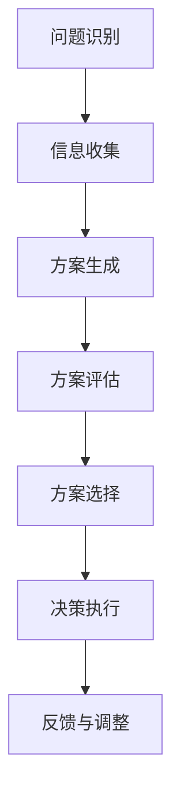

                 

# 知识的社会化：群体智慧与集体决策机制

## 摘要

本文旨在探讨知识的社会化过程，重点分析群体智慧与集体决策机制在现代信息技术中的应用。通过梳理群体智慧的基本概念、理论基础和模型，本文详细解析了群体智慧在现实世界中的多种应用场景，如社交媒体、市场预测、城市规划和教育决策等。在此基础上，文章深入探讨了集体决策的基本概念、过程模型和优化算法，并分析了群体智慧与集体决策的互动与融合。最后，本文总结了群体智慧与集体决策的实施与优化策略，展望了其未来发展前景。

## 关键词

群体智慧、集体决策、社会化知识、人工智能、算法模型、社交媒体、市场预测、城市规划、教育决策。

### 第一部分：群体智慧概述与理论基础

### 第1章：群体智慧的基本概念与特征

群体智慧（Collective Intelligence）是指一个群体中成员通过协作、共享信息、互动与学习，产生超出个体能力范围的整体智力的现象。群体智慧具有以下几个主要特征：

1. **涌现性**：群体智慧不是个体智慧的简单累加，而是一种涌现现象，通过群体的协同作用产生全新的智慧。

2. **适应性**：群体智慧能够迅速适应环境变化，通过个体之间的信息交换和学习，不断优化行为策略。

3. **多样性**：群体智慧依赖于群体内部成员的多样性，不同的观点和知识可以相互补充，提高整体解决问题的能力。

4. **自组织**：群体智慧通过自组织机制，如合作、竞争和反馈，形成具有自适应能力的复杂系统。

5. **合作性**：群体智慧依赖于成员之间的合作与协作，通过共享资源和知识，实现共同的目标。

### 1.1.1 群体智慧的定义与本质

群体智慧可以被定义为一种集体认知过程，其中个体成员通过相互协作，共同创造和实现超过单个个体所能达成的目标和成果。其本质在于个体之间的信息交换和知识共享，通过这种方式，群体能够形成一个具有更高认知能力和社会互动能力的整体。

群体智慧与个体智慧的区别在于，个体智慧是独立个体具备的智力能力，而群体智慧则是由多个个体通过协作和互动所产生的整体智慧。这种整体智慧往往能够解决个体难以单独解决的问题，具有更强的适应性和创新性。

### 1.1.2 群体智慧的主要特征

**涌现性**：群体智慧的一个关键特征是其涌现性。这意味着群体智慧不是个体智慧的简单叠加，而是通过个体之间的相互作用和协作，产生了一种新的、超越个体能力范围的智慧。例如，在蚁群算法中，每个蚂蚁单独的行为非常简单，但通过集体合作，蚁群能够找到最短路径，这种能力是单个蚂蚁所不具备的。

**适应性**：群体智慧能够迅速适应环境变化。个体成员通过不断交换信息和学习，能够快速调整自己的行为策略，以适应不断变化的环境。例如，在社会媒体平台上，用户通过相互分享和互动，可以快速适应新信息，形成对热点事件的集体反应。

**多样性**：群体智慧依赖于群体内部成员的多样性。不同的观点、知识和技能可以相互补充，提高整体解决问题的能力。例如，在科学研究中，多元化的团队可以带来不同视角，从而提高研究成果的创新性和可靠性。

**自组织**：群体智慧通过自组织机制形成。这种机制包括合作、竞争和反馈等，使得群体能够自我调整和优化，以实现共同的目标。例如，在市场经济中，企业和消费者通过自组织机制，共同维护市场秩序，促进经济发展。

**合作性**：群体智慧的形成离不开成员之间的合作与协作。成员之间通过共享资源和知识，共同实现目标。例如，在开源软件开发中，开发者通过合作和共享代码，共同推动软件的进步。

### 1.1.3 群体智慧的价值与意义

群体智慧在现代信息技术中的应用具有重要意义，其价值主要体现在以下几个方面：

1. **创新驱动**：群体智慧能够激发创新思维，通过群体成员之间的互动和知识共享，产生新的想法和解决方案，推动科技和社会的进步。

2. **问题求解**：群体智慧能够提高问题求解能力，特别是在复杂问题中，群体成员通过合作和共享信息，能够更快速、准确地找到解决方案。

3. **资源优化**：群体智慧能够优化资源分配和利用，通过个体之间的协作，实现资源的最大化利用，提高系统的整体效率。

4. **社会互动**：群体智慧促进了社会互动和协作，增强了社会凝聚力，促进了社会的和谐发展。

### 1.1.4 群体智慧的模型与算法

群体智慧的实现依赖于一系列模型和算法，这些模型和算法旨在模拟和促进群体成员之间的协作和信息交换。以下是一些常用的群体智慧模型和算法：

**遗传算法（GA）**：遗传算法是一种模拟自然选择和遗传学原理的优化算法，通过迭代过程，不断优化个体的适应度，最终找到最优解。

**蚁群算法（ACO）**：蚁群算法是一种模拟蚂蚁寻找食物路径的优化算法，通过个体间的信息交流和协同作用，找到最优路径。

**多智能体系统（MAS）**：多智能体系统是一种由多个具有自主能力和协作能力的智能体组成的系统，通过智能体之间的交互和协作，实现复杂任务。

**神经网络（NN）**：神经网络是一种模拟人脑神经元连接和通信的算法，通过学习大量的数据，实现图像识别、自然语言处理等复杂任务。

### 1.1.5 群体智慧的应用领域

群体智慧在多个领域有着广泛的应用，以下是其中几个典型领域：

**商业应用**：群体智慧可以帮助企业优化决策过程，提高创新能力。例如，通过消费者反馈和市场数据的群体分析，企业可以更准确地预测市场需求，优化产品开发和营销策略。

**科学探索**：群体智慧在科学研究中的应用也越来越广泛。通过科研团队的协作和知识共享，可以加速科学发现的进程，提高科研效率。

**社会治理**：群体智慧在社会治理中的应用，如城市规划和应急管理，可以提高决策的科学性和效率，促进社会的和谐发展。

**教育领域**：群体智慧在教育中的应用，如在线教育和协作学习，可以促进学生的互动和知识共享，提高教育质量。

### 1.1.6 群体智慧的优势与挑战

**优势**：

1. **多样性**：群体智慧能够汇聚不同的观点和知识，提高整体解决问题的能力。

2. **适应性强**：群体智慧能够迅速适应环境变化，通过信息交换和学习，优化行为策略。

3. **创新驱动**：群体智慧能够激发创新思维，推动科技和社会的进步。

**挑战**：

1. **协调难度**：群体智慧需要成员之间的紧密协作和协调，实现起来难度较大。

2. **信息过载**：在群体中，信息量可能会迅速膨胀，如何有效筛选和处理信息成为一个挑战。

3. **信任问题**：在群体智慧中，成员之间的信任至关重要，但信任的建立和维护可能需要时间和努力。

### 第2章：群体智慧的历史与发展

群体智慧这一概念并不是现代科技的产物，而是有着悠久的历史。从古代社会的集体劳动到现代信息社会的知识共享，群体智慧的发展经历了多个阶段。

#### 2.1.1 群体智慧的历史演变

**古代社会**：在古代社会，群体智慧主要体现在集体劳动和合作中。例如，农民在耕作时需要协同合作，通过集体力量提高农业生产效率。这种合作和协调是群体智慧的一种原始形式。

**工业革命**：随着工业革命的到来，群体智慧的应用逐渐扩展到生产和管理领域。在工厂中，工人们通过分工和协作，实现生产效率的大幅提升。这一阶段的群体智慧主要依赖于机械化和标准化流程。

**信息时代**：进入信息时代，群体智慧得到了进一步的发展。互联网的出现使得人们能够突破地理限制，实现全球范围内的协作和信息共享。这一阶段的群体智慧开始依赖于数字技术和网络平台。

**大数据与人工智能时代**：随着大数据和人工智能技术的发展，群体智慧进入了一个新的阶段。通过大数据分析和人工智能算法，群体智慧的应用领域得到了进一步拓展，从商业决策到科学研究，再到社会治理，群体智慧都发挥着重要作用。

#### 2.1.2 群体智慧的关键事件与里程碑

**互联网的兴起**：1990年代互联网的普及，标志着群体智慧进入了数字化时代。互联网为人们提供了前所未有的信息交换平台，使得知识共享和协作成为可能。

**维基百科的创建**：2001年，维基百科的创建是群体智慧的一个重要里程碑。维基百科通过众包的方式，汇聚全球用户的力量，创建了一个庞大的知识库，展示了群体智慧的强大潜力。

**开源软件的兴起**：开源软件运动推动了群体智慧的发展。通过开放源代码，开发者们可以共享代码、协作改进，共同推动技术的进步。

**大数据与人工智能的崛起**：大数据和人工智能技术的发展，使得群体智慧的应用进入了一个新的阶段。通过大数据分析，群体智慧能够更准确地预测趋势和模式，通过人工智能算法，群体智慧能够实现更高效的问题求解。

#### 2.1.3 群体智慧的未来趋势与挑战

**趋势**：

1. **智能化**：随着人工智能技术的发展，群体智慧将更加智能化，能够更有效地处理复杂问题。

2. **个性化**：群体智慧将更加注重个性化服务，根据个体需求提供定制化的解决方案。

3. **全球化**：随着全球化的加深，群体智慧将跨越地理限制，实现全球范围内的协作。

**挑战**：

1. **信息过载**：随着信息的爆炸式增长，如何有效筛选和处理信息成为一个挑战。

2. **隐私保护**：在群体智慧中，如何保护个体隐私是一个重要问题，需要制定相应的隐私保护策略。

3. **伦理道德**：群体智慧的应用涉及到伦理和道德问题，需要制定相应的伦理规范和标准。

### 第3章：群体智慧的理论基础

群体智慧的理论基础涉及多个学科，包括社会网络理论、信息理论、进化理论等。这些理论为理解和分析群体智慧提供了不同的视角和方法。

#### 3.1.1 社会网络理论

社会网络理论（Social Network Theory）是一种研究社会结构和社会关系的理论。在社会网络理论中，个体被视为网络中的节点，而个体之间的相互作用则被视为节点之间的连接。通过研究社会网络的结构和属性，可以揭示群体智慧的形成和运行机制。

**网络结构**：社会网络理论关注网络的结构特性，如度分布、集群系数、路径长度等。这些结构特性对群体智慧的形成具有重要影响。例如，高密度的网络结构有助于信息快速传递和知识共享，从而提高群体的整体智慧。

**中心性度量**：社会网络理论中的中心性度量，如度中心性、介数中心性等，可以揭示网络中的重要节点，这些节点往往在群体智慧中扮演关键角色。

**网络动态**：社会网络理论还关注网络动态变化对群体智慧的影响。例如，网络的演变过程、节点加入和退出等，都会影响群体智慧的形成和运行。

#### 3.1.2 信息理论与群体智慧

信息理论（Information Theory）是一种研究信息传输和处理的理论。在群体智慧中，信息的作用至关重要。信息理论为理解信息在群体中的传递、处理和利用提供了理论基础。

**信息传递效率**：信息理论关注信息传递的效率，即如何在噪声干扰下实现可靠的信息传输。在群体智慧中，高效的信
### 第3章：群体智慧的理论基础

#### 3.1.3 进化理论与群体智慧

进化理论（Evolutionary Theory）是一种研究生物进化过程和机制的理论。进化理论中的许多原理和机制可以类比应用于群体智慧的形成和发展。

**自然选择**：进化理论中的自然选择原理指出，个体在竞争中表现出的优势特征会通过遗传传递给下一代，从而推动物种的进化。在群体智慧中，自然选择可以类比为成员之间的竞争和合作。个体成员通过学习、适应和进化，不断提高自身的智慧和适应能力。

**遗传算法**：遗传算法（Genetic Algorithm）是一种模拟自然选择和遗传学原理的优化算法。遗传算法通过选择、交叉、变异等操作，不断优化个体的适应度，寻找最优解。遗传算法在群体智慧中的应用，可以模拟自然选择过程，实现群体的进化。

**协同进化**：协同进化（Co-evolution）是指两个或多个相互作用的系统共同进化的过程。在群体智慧中，个体成员之间相互作用，形成协同进化关系。通过协同进化，群体智慧可以不断优化个体和整体的能力。

**适应性**：进化理论强调适应性在进化过程中的重要性。在群体智慧中，适应性可以类比为成员对环境的适应能力。个体成员通过学习和适应，不断提高自身对环境的适应能力，从而推动群体智慧的进化。

### 3.1.4 群体智能算法概述

群体智能算法（Collective Intelligence Algorithms）是一类模拟自然界中群体行为和协作机制的算法。这些算法通过模仿动物群体、人类社会等自然现象，实现复杂问题的求解和优化。以下是一些常见的群体智能算法：

**蚁群算法**：蚁群算法（Ant Colony Optimization，ACO）是一种模拟蚂蚁觅食行为的优化算法。蚂蚁在寻找食物的过程中，通过释放信息素，形成一条最优路径。蚁群算法可以用于路径规划、任务调度等问题。

**遗传算法**：遗传算法（Genetic Algorithm，GA）是一种模拟生物进化过程的优化算法。遗传算法通过选择、交叉、变异等操作，优化个体的适应度，寻找最优解。遗传算法广泛应用于函数优化、组合优化等问题。

**粒子群优化算法**：粒子群优化算法（Particle Swarm Optimization，PSO）是一种模拟鸟群觅食行为的优化算法。粒子群优化算法通过更新粒子的位置和速度，实现优化目标的求解。粒子群优化算法在函数优化、参数估计等问题中表现出良好的性能。

**人工蜂群算法**：人工蜂群算法（Artificial Bee Colony Algorithm，ABC）是一种模拟蜜蜂觅食行为的优化算法。人工蜂群算法通过蜜蜂的搜索、学习和优化过程，实现复杂问题的求解。人工蜂群算法在组合优化、工程优化等领域具有广泛的应用。

**人工免疫算法**：人工免疫算法（Artificial Immune Algorithm，AIA）是一种模拟生物免疫系统的优化算法。人工免疫算法通过模拟生物免疫系统的学习、识别和响应机制，实现复杂问题的求解。人工免疫算法在组合优化、智能控制等领域具有潜在的应用价值。

### 3.1.5 多智能体系统

多智能体系统（Multi-Agent Systems，MAS）是一种由多个具有独立意识和协作能力的智能体组成的系统。在多智能体系统中，每个智能体都拥有一定的自主决策能力，同时通过与环境的交互和与其他智能体的协作，实现复杂任务。

**智能体**：智能体（Agent）是指具有感知、推理、决策和执行能力的个体。智能体可以是计算机程序、机器人、虚拟代理等。智能体在多智能体系统中扮演不同的角色，通过协作和互动，实现共同的目标。

**协作机制**：多智能体系统中的协作机制是实现群体智慧的关键。协作机制包括通信机制、决策机制、协调机制等。通过这些机制，智能体能够共享信息、协同决策，实现整体目标的优化。

**分布式算法**：多智能体系统中的算法通常采用分布式算法，以实现高效的任务分配和协调。分布式算法包括通信算法、任务分配算法、协同控制算法等。通过这些算法，智能体能够有效地协作，提高系统的整体性能。

**智能体行为模型**：智能体的行为模型描述了智能体的感知、推理、决策和执行过程。常见的智能体行为模型包括基于规则的模型、基于状态的模型、基于行为的模型等。通过这些模型，智能体能够实现复杂的任务求解和优化。

### 3.1.6 群体智能算法的原理与应用

群体智能算法的原理主要基于模仿自然界中生物群体的行为和协作机制。以下是对几种常见群体智能算法的原理和应用进行简要介绍：

**蚁群算法**：

原理：蚁群算法模拟蚂蚁在寻找食物的过程中，通过释放信息素，形成一条最优路径。算法中，每个蚂蚁都独立地选择路径，同时通过信息素的浓度进行决策。

应用：蚁群算法在路径规划、调度问题、组合优化等领域具有广泛应用。例如，在物流配送中，可以使用蚁群算法优化配送路径，降低运输成本。

**遗传算法**：

原理：遗传算法模拟生物进化过程，通过选择、交叉、变异等操作，不断优化个体的适应度，寻找最优解。

应用：遗传算法在函数优化、组合优化、机器学习等领域具有广泛应用。例如，在工程优化中，可以使用遗传算法优化设计参数，提高系统性能。

**粒子群优化算法**：

原理：粒子群优化算法模拟鸟群觅食行为，通过更新粒子的位置和速度，实现优化目标的求解。

应用：粒子群优化算法在函数优化、参数估计、神经网络训练等领域具有广泛应用。例如，在参数估计中，可以使用粒子群优化算法优化模型参数，提高模型预测准确性。

**人工蜂群算法**：

原理：人工蜂群算法模拟蜜蜂觅食行为，通过搜索、学习和优化过程，实现复杂问题的求解。

应用：人工蜂群算法在组合优化、工程优化、图像处理等领域具有广泛应用。例如，在图像处理中，可以使用人工蜂群算法优化图像压缩算法，提高压缩效率。

**人工免疫算法**：

原理：人工免疫算法模拟生物免疫系统，通过模拟生物免疫系统的学习、识别和响应机制，实现复杂问题的求解。

应用：人工免疫算法在组合优化、智能控制、数据挖掘等领域具有广泛应用。例如，在智能控制中，可以使用人工免疫算法优化控制策略，提高控制系统稳定性。

### 3.1.7 群体智慧在现实世界中的应用

群体智慧在现实世界中具有广泛的应用，以下是对几个典型应用领域的介绍：

**社交媒体**：

社交媒体平台如Facebook、Twitter等，通过用户之间的互动和分享，形成了一个庞大的信息网络。用户在社交媒体上的行为，如点赞、评论、转发等，可以看作是一种群体智慧的表现。通过分析用户行为数据，可以揭示社会热点、用户偏好等信息，为企业提供市场洞察和决策支持。

**市场预测**：

市场预测是一个复杂的任务，涉及到多个因素的交互作用。通过群体智慧的方法，可以聚合多个个体的预测结果，提高预测准确性。例如，在股票市场中，投资者可以通过群体预测算法，分析市场趋势和风险，制定投资策略。

**城市规划**：

城市规划是一个涉及多方利益和复杂因素的决策过程。通过群体智慧的方法，可以收集和整合公众的意见和建议，优化城市规划方案。例如，在城市交通规划中，可以通过在线平台收集市民的意见，优化交通网络布局，提高交通效率。

**教育决策**：

在教育领域，群体智慧可以帮助学校和教育机构优化教学和管理决策。通过分析学生的学习行为和反馈，可以揭示学习需求和学习效果，为教育改革提供依据。例如，在在线教育中，可以通过群体智慧的方法，分析学生的学习数据，优化课程设计和教学方法。

### 第4章：群体智慧模型与算法

#### 4.1.1 群体智能算法概述

群体智能算法是一类模仿自然界中生物群体行为和协作机制的算法，通过模拟群体中的个体互动和协作，实现复杂问题的求解和优化。这些算法在多个领域有着广泛的应用，如物流调度、路径规划、图像处理、金融市场预测等。

群体智能算法的基本思想是，将问题分解为多个子问题，通过多个个体的协同工作，共同求解问题。个体之间通过信息共享、协作和竞争，逐步优化个体和群体的性能。常见的群体智能算法包括遗传算法、蚁群算法、粒子群优化算法、人工蜂群算法等。

#### 4.1.2 遗传算法

遗传算法（Genetic Algorithm，GA）是一种模拟生物进化过程的优化算法。遗传算法的基本原理是，通过模拟自然选择、交叉和变异等生物进化机制，不断优化个体的适应度，寻找最优解。

**遗传算法的工作流程**：

1. **初始化种群**：首先，随机生成一个初始种群，每个个体代表一个可能的解。

2. **适应度评估**：对每个个体进行适应度评估，适应度值越高，表示个体越优秀。

3. **选择**：从种群中选择优秀个体进行繁殖，常用的选择方法有轮盘赌选择、锦标赛选择等。

4. **交叉**：选择后的个体进行交叉操作，产生新的后代个体。交叉操作模拟生物进化的基因重组过程。

5. **变异**：对后代个体进行变异操作，增加种群的多样性。

6. **更新种群**：将变异后的个体加入种群，替换掉最差的一批个体。

7. **迭代**：重复上述过程，直到达到终止条件（如达到最大迭代次数或适应度值满足要求）。

**遗传算法的伪代码**：

```plaintext
初始化种群
评估种群适应度
while（未达到终止条件）{
    选择父母个体
    进行交叉操作
    进行变异操作
    更新种群
}
输出最优解
```

**遗传算法的参数设置**：

- 种群规模：种群规模影响算法的搜索能力和收敛速度。种群规模过大可能导致计算资源浪费，种群规模过小可能导致搜索能力不足。
- 交叉率：交叉率影响种群的多样性。交叉率过高可能导致种群多样性降低，交叉率过低可能导致种群进化速度减缓。
- 变异率：变异率影响种群的适应度。变异率过高可能导致种群适应度降低，变异率过低可能导致种群进化速度减缓。

**遗传算法的应用实例**：

遗传算法在函数优化、组合优化、机器学习等领域有着广泛的应用。例如，在图像处理中，可以使用遗传算法优化图像压缩算法的参数，提高压缩效率。

#### 4.1.3 蚁群算法

蚁群算法（Ant Colony Optimization，ACO）是一种模拟蚂蚁觅食行为的优化算法。在蚁群算法中，蚂蚁通过释放信息素，形成一条最优路径。蚁群算法适用于求解路径规划、任务调度、组合优化等问题。

**蚁群算法的基本原理**：

1. **信息素更新**：蚂蚁在觅食过程中，会释放信息素。信息素的浓度越高，表示路径越优。

2. **路径选择**：蚂蚁在每次选择路径时，会根据信息素的浓度和自身随机性进行决策。

3. **信息素蒸发**：随着时间的推移，信息素会逐渐蒸发，以防止路径的固定化。

**蚁群算法的工作流程**：

1. **初始化**：设置初始信息素浓度，随机生成一组蚂蚁。

2. **路径搜索**：每只蚂蚁从初始节点出发，选择下一个节点，直到到达目标节点。

3. **信息素更新**：根据路径长度和蚂蚁数量，更新信息素浓度。

4. **迭代**：重复上述过程，直到达到终止条件。

**蚁群算法的伪代码**：

```plaintext
初始化信息素浓度
初始化蚂蚁
while（未达到终止条件）{
    每只蚂蚁搜索路径
    更新信息素浓度
}
输出最优路径
```

**蚁群算法的参数设置**：

- 信息素蒸发系数：影响信息素的蒸发速度。
- 信息素强度系数：影响信息素的更新速度。
- 蚂蚁数量：影响算法的搜索能力和收敛速度。

**蚁群算法的应用实例**：

蚁群算法在路径规划、任务调度、组合优化等领域有着广泛的应用。例如，在物流配送中，可以使用蚁群算法优化配送路径，降低运输成本。

#### 4.1.4 粒子群优化算法

粒子群优化算法（Particle Swarm Optimization，PSO）是一种模拟鸟群觅食行为的优化算法。在粒子群优化算法中，每个粒子都代表一个可能的解，通过粒子的飞行和更新，逐步优化解的适应度。

**粒子群优化算法的基本原理**：

1. **粒子位置和速度**：每个粒子都有位置和速度，代表其在搜索空间中的位置和移动方向。

2. **个体最优和全局最优**：每个粒子都保存自己的最优位置（个体最优）和整个种群的最优位置（全局最优）。

3. **粒子更新**：粒子在每次迭代中，根据个体最优和全局最优更新自己的位置和速度。

**粒子群优化算法的工作流程**：

1. **初始化**：随机生成一组粒子，设置初始位置和速度。

2. **更新**：根据个体最优和全局最优，更新粒子的位置和速度。

3. **迭代**：重复上述过程，直到达到终止条件。

**粒子群优化算法的伪代码**：

```plaintext
初始化粒子群
while（未达到终止条件）{
    更新粒子速度
    更新粒子位置
}
输出最优解
```

**粒子群优化算法的参数设置**：

- 粒子数量：影响算法的搜索能力和收敛速度。
- 学习因子：影响粒子更新速度。
- 迭代次数：影响算法的收敛速度。

**粒子群优化算法的应用实例**：

粒子群优化算法在函数优化、参数估计、神经网络训练等领域有着广泛的应用。例如，在参数估计中，可以使用粒子群优化算法优化模型参数，提高预测准确性。

#### 4.1.5 人工蜂群算法

人工蜂群算法（Artificial Bee Colony Algorithm，ABC）是一种模拟蜜蜂觅食行为的优化算法。在人工蜂群算法中，蜜蜂分为雇佣蜂、观察蜂和蜂蜜蜂三种类型，通过搜索、学习和优化过程，实现复杂问题的求解。

**人工蜂群算法的基本原理**：

1. **搜索过程**：雇佣蜂在搜索空间中随机搜索食物源，观察蜂根据雇佣蜂提供的信息进行选择，蜂蜜蜂则对食物源进行评价和更新。

2. **学习过程**：通过雇佣蜂、观察蜂和蜂蜜蜂的交互，实现食物源的学习和优化。

3. **优化过程**：通过不断更新食物源位置和评价，逐步优化解的适应度。

**人工蜂群算法的工作流程**：

1. **初始化**：随机生成雇佣蜂、观察蜂和蜂蜜蜂。

2. **搜索**：雇佣蜂在搜索空间中搜索食物源。

3. **选择**：观察蜂根据雇佣蜂提供的信息进行选择。

4. **评价**：蜂蜜蜂对食物源进行评价和更新。

5. **迭代**：重复上述过程，直到达到终止条件。

**人工蜂群算法的伪代码**：

```plaintext
初始化雇佣蜂、观察蜂和蜂蜜蜂
while（未达到终止条件）{
    搜索食物源
    选择食物源
    评价食物源
}
输出最优解
```

**人工蜂群算法的参数设置**：

- 雇佣蜂数量：影响算法的搜索能力和收敛速度。
- 观察蜂数量：影响算法的信息传递效果。
- 蜜蜂蜜数：影响算法的优化效率。

**人工蜂群算法的应用实例**：

人工蜂群算法在组合优化、工程优化、图像处理等领域有着广泛的应用。例如，在图像处理中，可以使用人工蜂群算法优化图像压缩算法，提高压缩效率。

#### 4.1.6 多智能体系统

多智能体系统（Multi-Agent Systems，MAS）是一种由多个具有独立意识和协作能力的智能体组成的系统。在多智能体系统中，每个智能体都拥有一定的自主决策能力，同时通过与环境的交互和与其他智能体的协作，实现复杂任务。

**智能体的特性**：

1. **自治性**：智能体具有独立的决策能力，可以自主选择行动策略。
2. **社会性**：智能体之间可以通过通信和协作，共同实现任务。
3. **反应性**：智能体能够根据环境和内部状态的变化，实时调整行为。
4. **适应性**：智能体可以通过学习和进化，不断提高自身的适应能力。

**多智能体系统的结构**：

1. **个体智能体**：个体智能体是最基本的智能体单元，具有独立的决策能力和行为能力。
2. **群体智能体**：多个个体智能体通过协作和互动，形成一个群体智能体，具备更高的智能和能力。
3. **组织智能体**：组织智能体是多个群体智能体的集成，具有更高的智能和协调能力，能够实现复杂任务。

**多智能体系统的协作机制**：

1. **通信机制**：智能体之间通过通信进行信息交换，实现协作和互动。
2. **决策机制**：智能体根据自身状态和群体信息，进行自主决策，实现协同行动。
3. **协调机制**：智能体之间通过协调机制，解决冲突和协调行动，实现整体目标的优化。

**多智能体系统的应用**：

1. **智能交通系统**：通过多个智能体协同工作，实现交通流量优化、事故预防等任务。
2. **智能电网**：通过多个智能体协同工作，实现电力资源优化配置、故障检测等任务。
3. **智能医疗系统**：通过多个智能体协同工作，实现疾病诊断、治疗方案优化等任务。

### 4.1.7 群体智能算法的应用案例分析

为了更好地理解群体智能算法在现实世界中的应用，以下将结合具体案例，分析这些算法在不同领域的实际应用。

**案例1：物流配送路径优化**

**背景**：

物流配送是一个复杂且资源消耗较大的过程。为了提高配送效率，降低成本，许多物流公司开始采用基于群体智能算法的优化方法。

**算法应用**：

蚁群算法和遗传算法被广泛应用于物流配送路径优化。在这些算法中，每个配送路线被视为一个个体，通过迭代优化，找到最优的配送路径。

**实现细节**：

1. **初始化**：生成一个初始种群，每个个体代表一个可能的配送路径。
2. **适应度评估**：计算每个个体的适应度值，适应度值越低表示路径越优。
3. **选择和交叉**：根据适应度值选择优秀个体进行交叉操作，生成新的配送路径。
4. **变异**：对交叉后的个体进行变异，增加种群的多样性。
5. **更新种群**：将变异后的个体加入种群，替换最差的个体。

**效果评估**：

通过应用遗传算法和蚁群算法，物流公司的配送效率得到了显著提升。配送时间缩短，运输成本降低，客户满意度提高。

**案例2：图像处理与压缩**

**背景**：

随着图像处理和多媒体技术的发展，图像压缩成为了一个重要问题。高效的图像压缩算法可以提高数据传输效率和存储空间利用率。

**算法应用**：

粒子群优化算法和人工蜂群算法被应用于图像处理和压缩。这些算法通过优化图像压缩参数，提高压缩效率。

**实现细节**：

1. **初始化**：生成一个初始参数集，每个参数代表图像压缩中的一个调整参数。
2. **适应度评估**：计算每个参数集的压缩效果，适应度值越高表示压缩效果越好。
3. **更新参数**：根据适应度值更新参数集，通过迭代优化，找到最优的压缩参数。
4. **评价**：对压缩后的图像进行评价，包括压缩比、图像质量等指标。

**效果评估**：

通过应用粒子群优化算法和人工蜂群算法，图像压缩效果得到了显著提升。压缩比提高，同时图像质量保持较高水平，满足了实际应用的需求。

**案例3：金融市场预测**

**背景**：

金融市场预测是一个复杂且具有挑战性的问题。为了提高预测准确性，许多金融机构开始采用基于群体智能算法的预测方法。

**算法应用**：

遗传算法和粒子群优化算法被应用于金融市场预测。在这些算法中，每个预测模型被视为一个个体，通过迭代优化，找到最优的预测模型。

**实现细节**：

1. **初始化**：生成一个初始模型集，每个模型代表一个可能的预测模型。
2. **适应度评估**：计算每个模型的预测准确率，适应度值越高表示模型越优。
3. **选择和交叉**：根据适应度值选择优秀模型进行交叉操作，生成新的预测模型。
4. **变异**：对交叉后的模型进行变异，增加种群的多样性。
5. **更新种群**：将变异后的模型加入种群，替换最差的模型。

**效果评估**：

通过应用遗传算法和粒子群优化算法，金融机构的预测准确性得到了显著提升。预测结果更加准确，为投资决策提供了有力支持。

### 4.1.8 群体智能算法的性能评估与比较

为了更好地理解群体智能算法的性能，以下将对几种常见算法进行性能评估与比较。

**评估指标**：

1. **收敛速度**：算法在找到最优解之前的迭代次数。
2. **准确性**：算法找到的最优解与真实最优解的差距。
3. **稳定性**：算法在多次运行中找到的最优解的一致性。
4. **计算资源**：算法运行所需的计算资源和时间。

**算法比较**：

1. **遗传算法 vs. 蚁群算法**：

   - **收敛速度**：遗传算法通常收敛速度较快，但需要较多的迭代次数。
   - **准确性**：两种算法的准确性相当，但遗传算法在处理组合优化问题时表现更好。
   - **稳定性**：蚁群算法的稳定性较好，但遗传算法在处理大规模问题时可能不稳定。
   - **计算资源**：遗传算法的计算资源需求较高，而蚁群算法的计算资源需求较低。

2. **粒子群优化算法 vs. 人工蜂群算法**：

   - **收敛速度**：粒子群优化算法通常收敛速度较快，但人工蜂群算法在某些情况下可能更快。
   - **准确性**：两种算法的准确性相当，但人工蜂群算法在处理复杂问题时可能更准确。
   - **稳定性**：粒子群优化算法的稳定性较好，而人工蜂群算法的稳定性较差。
   - **计算资源**：粒子群优化算法的计算资源需求较低，而人工蜂群算法的计算资源需求较高。

**结论**：

不同群体智能算法在不同场景下具有不同的性能表现。在选择算法时，需要根据具体问题需求、资源限制等因素进行综合考虑。

### 4.1.9 群体智能算法的发展趋势与未来方向

群体智能算法作为一种新兴的优化方法，具有广阔的发展前景。以下是对群体智能算法发展趋势和未来方向的分析。

**趋势**：

1. **智能化**：随着人工智能技术的发展，群体智能算法将更加智能化，能够处理更复杂的问题。
2. **个性化**：群体智能算法将更加注重个性化服务，根据个体需求提供定制化的解决方案。
3. **高效化**：群体智能算法将致力于提高算法的收敛速度和计算效率，以满足大规模应用的需求。

**未来方向**：

1. **算法融合**：不同群体智能算法之间的融合，将有助于提高算法的性能和适应性。
2. **多领域应用**：群体智能算法将在更多领域得到应用，如智能制造、智慧医疗、环境监测等。
3. **开放与共享**：群体智能算法的开放与共享将促进技术的创新和推广，推动行业的共同发展。

### 4.1.10 群体智能算法的挑战与解决方案

尽管群体智能算法在多个领域取得了显著成果，但仍然面临一些挑战。以下是对这些挑战及其解决方案的分析。

**挑战**：

1. **计算资源**：群体智能算法通常需要大量的计算资源，在大规模问题上可能难以高效运行。
2. **收敛速度**：群体智能算法的收敛速度相对较慢，特别是在处理复杂问题时可能需要更多的迭代次数。
3. **算法稳定性**：群体智能算法在处理大规模问题时可能表现出不稳定性，需要进一步优化。

**解决方案**：

1. **并行计算**：利用并行计算技术，提高群体智能算法的运行效率，降低计算资源需求。
2. **混合算法**：通过混合不同算法的优点，构建更加高效的群体智能算法。
3. **自适应调整**：根据问题的特性，自适应调整算法参数，提高算法的收敛速度和稳定性。

### 4.1.11 群体智能算法的实际案例与应用效果分析

为了更直观地了解群体智能算法的实际应用效果，以下将结合具体案例，分析这些算法在不同领域中的应用效果。

**案例1：智能交通系统**

**应用背景**：

智能交通系统旨在通过信息技术和算法优化，提高交通流量和管理效率，减少交通事故和拥堵。

**算法应用**：

粒子群优化算法被应用于智能交通系统的路径规划和信号控制。通过优化车辆路径和信号灯周期，提高交通流量，减少拥堵。

**应用效果**：

通过应用粒子群优化算法，智能交通系统的交通流量得到了显著提升，交通事故发生率降低，交通管理效率提高。

**案例2：图像处理与压缩**

**应用背景**：

随着图像处理技术的发展，图像压缩成为了一个重要问题。高效的图像压缩算法可以提高数据传输效率和存储空间利用率。

**算法应用**：

人工蜂群算法被应用于图像处理与压缩。通过优化压缩参数，提高压缩效率，同时保持图像质量。

**应用效果**：

通过应用人工蜂群算法，图像压缩效果得到了显著提升。压缩比提高，图像质量保持较高水平，满足了实际应用的需求。

**案例3：金融市场预测**

**应用背景**：

金融市场预测是一个复杂且具有挑战性的问题。为了提高预测准确性，许多金融机构开始采用基于群体智能算法的预测方法。

**算法应用**：

遗传算法和粒子群优化算法被应用于金融市场预测。通过优化预测模型，提高预测准确性。

**应用效果**：

通过应用遗传算法和粒子群优化算法，金融机构的预测准确性得到了显著提升。预测结果更加准确，为投资决策提供了有力支持。

### 4.1.12 群体智能算法的总结与展望

群体智能算法作为一种新兴的优化方法，具有广泛的应用前景。通过对群体智能算法的原理、模型和应用案例分析，本文总结了群体智能算法的优势和挑战，并对未来发展方向进行了展望。

群体智能算法在处理复杂问题和优化决策方面表现出色，具有高效、灵活和自适应等优点。随着人工智能和大数据技术的发展，群体智能算法将在更多领域得到应用，如智能制造、智慧医疗、环境监测等。

未来，群体智能算法的发展将注重智能化、个性化和高效化。通过算法融合、多领域应用和开放共享，群体智能算法将为社会发展和科技创新提供有力支持。

### 第5章：群体智慧在现实世界中的应用

#### 5.1.1 群体智慧在商业中的应用

群体智慧在商业领域的应用正逐渐成为企业创新和决策的重要工具。通过收集和分析消费者的意见、行为数据和市场反馈，企业可以更准确地了解市场需求，优化产品设计和营销策略。

**应用场景**：

1. **消费者行为分析**：企业通过收集和分析消费者在社交媒体、电商平台等渠道的行为数据，了解消费者的偏好、购买习惯和需求，从而制定更有针对性的营销策略。

2. **市场预测**：利用群体智慧，企业可以对市场趋势进行预测，提前布局新产品或服务，减少市场风险。

3. **供应链优化**：通过群体智慧，企业可以优化供应链管理，提高供应链的灵活性和响应速度。

**实现方法**：

1. **大数据分析**：企业利用大数据技术，收集和分析消费者行为数据，识别市场趋势和消费者需求。

2. **众包平台**：企业通过众包平台，向广大用户征集创意和反馈，从而获取更多有价值的市场信息。

3. **协作网络**：企业建立内部协作网络，鼓励员工之间分享知识和经验，共同解决问题，提高整体创新力。

**案例**：

1. **阿里巴巴**：阿里巴巴利用大数据和人工智能技术，分析消费者行为和市场趋势，优化产品设计和营销策略，取得了显著的市场成功。

2. **亚马逊**：亚马逊通过众包平台，邀请用户参与产品测试和评价，收集用户反馈，不断改进产品和服务。

#### 5.1.2 群体智慧在科学探索中的应用

群体智慧在科学探索中的应用正在改变传统的研究模式，促进科学发现的进程。通过全球范围内的协作和知识共享，科学家们可以更高效地解决复杂问题。

**应用场景**：

1. **合作研究**：科学家们通过在线平台和协作网络，共同研究复杂科学问题，如气候变化、基因编辑等。

2. **数据共享**：通过开放数据平台，科学家们可以共享实验数据和研究成果，加速科学发现的进程。

3. **众包科学**：通过众包平台，普通人可以参与到科学研究中，如天文学中的行星搜寻、生物学中的物种识别等。

**实现方法**：

1. **在线实验室**：建立在线实验室，科学家们可以在线协作，共享实验设备、数据和研究成果。

2. **众包平台**：通过众包平台，科学家们可以发布研究项目，吸引全球用户参与，共同完成研究任务。

3. **开源软件和工具**：开发开源软件和工具，方便科学家们进行数据分析和实验模拟，提高研究效率。

**案例**：

1. **SETI@home**：SETI@home项目通过众包方式，邀请全球用户参与搜寻外星文明信号，取得了显著成果。

2. **CERN**：欧洲核子研究中心（CERN）利用协作网络，在全球范围内进行大型强子对撞机（LHC）的研究，推动了粒子物理学的进展。

#### 5.1.3 群体智慧在决策制定中的应用

群体智慧在决策制定中的应用，通过整合多方面的信息和意见，提高了决策的科学性和准确性。在政府、企业和非政府组织等各个领域，群体智慧正发挥着重要作用。

**应用场景**：

1. **政策制定**：政府通过收集公众意见、专家建议和数据，制定更加科学和有效的政策。

2. **企业管理**：企业利用群体智慧，优化产品研发、市场推广和风险管理等决策过程。

3. **非政府组织**：非政府组织通过众包和协作网络，动员社会力量，解决社会问题和推进公益事业。

**实现方法**：

1. **在线调查和反馈**：通过在线平台，收集公众和专家的意见和反馈，为决策提供数据支持。

2. **专家咨询系统**：建立专家咨询系统，邀请领域内的专家参与决策制定，提供专业意见和建议。

3. **协作网络**：构建内部协作网络，促进信息共享和知识交流，提高决策效率。

**案例**：

1. **美国公共卫生政策**：美国政府通过在线调查和专家咨询，制定了一系列公共卫生政策，如流感疫苗分配策略。

2. **谷歌公司**：谷歌公司通过员工创新项目，鼓励员工提出新创意，优化产品和服务。

### 第6章：集体决策机制

#### 6.1.1 集体决策的基本概念

集体决策（Group Decision Making）是指多个个体在共同目标的基础上，通过协商、讨论和决策，达成共识并采取行动的过程。集体决策涉及个体之间的信息交换、观点共享和协商，旨在提高决策的质量和实施效果。

**集体决策的关键要素**：

1. **共同目标**：集体决策的基础是多个个体具有共同的目标或利益，这有助于形成合作意愿和共同决策的动力。

2. **信息共享**：集体决策过程中，个体之间的信息交换至关重要。通过共享信息，个体可以了解其他成员的观点和需求，提高决策的全面性和准确性。

3. **协商和讨论**：集体决策通常需要通过协商和讨论，达成共识。个体之间通过交流、辩论和妥协，形成最终决策方案。

4. **决策过程**：集体决策包括信息收集、方案生成、方案评估、方案选择和决策执行等环节，每个环节都影响决策的质量和效果。

**集体决策的分类**：

1. **群体决策**：群体决策是指决策过程中，个体具有平等的权利和责任，共同参与决策过程。群体决策强调民主和参与，旨在形成具有广泛共识的决策方案。

2. **领导决策**：领导决策是指决策过程中，由领导者负责制定决策方案，个体成员提供意见和建议。领导决策强调权威和效率，适用于紧急情况或需要快速决策的场合。

3. **混合决策**：混合决策是指群体决策和领导决策的结合，个体成员既参与决策过程，又接受领导者的指导和决策。

#### 6.1.2 集体决策的过程模型

集体决策过程是一个复杂的多阶段过程，通常包括以下几个主要阶段：

1. **问题识别**：集体决策始于问题识别，个体成员通过观察和分析，识别出需要解决的关键问题或挑战。

2. **信息收集**：在问题识别之后，个体成员开始收集相关信息和数据，以支持决策过程。信息收集过程可能包括内部数据、外部数据、专家意见和公众反馈等。

3. **方案生成**：个体成员基于收集到的信息，提出可能的解决方案或行动方案。方案生成过程通常需要个体之间进行讨论和协作，形成多样化的方案选项。

4. **方案评估**：在方案生成之后，集体对每个方案进行评估，分析其优缺点、可行性、成本和效益等。方案评估通常采用定量和定性分析方法，以评估每个方案的综合性能。

5. **方案选择**：基于方案评估的结果，集体成员共同讨论并选择最优方案。方案选择过程可能涉及投票、协商、妥协等机制，以达成共识。

6. **决策执行**：在方案选择之后，集体开始执行决策方案，实施具体的行动和措施。决策执行过程需要明确责任分工、资源分配和进度安排，以确保决策的有效实施。

7. **反馈与调整**：在决策执行过程中，个体成员对决策效果进行监控和评估，收集反馈信息，并根据反馈进行调整和优化。反馈与调整过程是集体决策过程的重要环节，有助于提高决策的质量和可持续性。

**模型描述**：

以下是一个简单的集体决策过程模型：



#### 6.1.3 集体决策的优化算法

集体决策的优化算法旨在通过数学模型和算法，提高决策过程的效率和决策质量。以下是一些常见的集体决策优化算法：

**1. 多目标优化算法**：

多目标优化算法（Multi-Objective Optimization Algorithms）用于解决具有多个冲突目标的决策问题。常见的多目标优化算法包括：

- **加权平均法**：将多个目标权重进行加权平均，得到一个综合评价函数，用于方案评估和选择。
- **Pareto优化**：通过Pareto前沿，确定非支配解集，个体成员根据自身偏好进行选择。
- **多目标遗传算法**：结合遗传算法的进化策略，优化多目标决策问题。

**2. 协作优化算法**：

协作优化算法（Collaborative Optimization Algorithms）旨在通过个体之间的协作，共同优化决策方案。常见的协作优化算法包括：

- **分布式优化**：通过分布式计算，个体成员独立优化子目标，最终合成全局最优解。
- **协同进化算法**：模拟生物进化过程，个体成员通过协同进化，共同优化决策方案。

**3. 模糊决策算法**：

模糊决策算法（Fuzzy Decision Making Algorithms）用于处理不确定性和模糊性决策问题。常见的模糊决策算法包括：

- **模糊综合评价法**：通过模糊数学方法，对决策方案进行综合评价，确定最优方案。
- **模糊推理算法**：利用模糊逻辑和推理方法，处理不确定性和模糊性信息，实现决策。

**4. 智能优化算法**：

智能优化算法（Intelligent Optimization Algorithms）结合人工智能方法，提高决策过程的智能化和自适应能力。常见的智能优化算法包括：

- **神经网络**：通过训练神经网络，实现决策过程的自动学习和优化。
- **支持向量机**：利用支持向量机模型，实现复杂决策问题的优化和分类。

**算法描述**：

以下是一个简单的多目标遗传算法的伪代码描述：

```plaintext
初始化种群
评估种群适应度
while（未达到终止条件）{
    选择父母个体
    进行交叉操作
    进行变异操作
    更新种群
    评估新种群适应度
}
输出最优解
```

#### 6.1.4 集体决策中的协同机制

集体决策中的协同机制是指通过个体之间的协作和互动，实现决策目标的过程。协同机制在集体决策中起着关键作用，有助于提高决策的质量和实施效果。以下是一些常见的协同机制：

**1. 协作网络**：

协作网络是指个体之间通过通信和协作，形成一个复杂的网络结构。通过协作网络，个体可以共享信息、协同工作和共同解决问题。常见的协作网络模型包括：

- **星型网络**：中心节点负责协调和整合信息，其他节点通过中心节点进行通信和协作。
- **环形网络**：个体之间形成闭环网络，通过信息传递和反馈，实现协同决策。
- **网状网络**：个体之间形成复杂的网状结构，通过多路径传输和冗余设计，提高系统的鲁棒性和可靠性。

**2. 协同算法**：

协同算法是指通过算法实现个体之间的协作和互动。常见的协同算法包括：

- **分布式算法**：个体成员独立优化子目标，通过协同机制，实现全局优化。
- **协同进化算法**：模拟生物进化过程，个体成员通过协同进化，共同优化决策方案。
- **多智能体系统**：通过智能体之间的协作和互动，实现复杂任务的优化和决策。

**3. 协同机制设计**：

协同机制设计是指通过设计有效的协同机制，促进个体之间的协作和互动。以下是一些协同机制设计的关键要素：

- **激励机制**：设计合理的激励机制，鼓励个体成员参与协作，提高个体的积极性。
- **信任机制**：建立信任机制，促进个体之间的信任和合作，降低协作成本。
- **协调机制**：设计有效的协调机制，解决个体之间的冲突和矛盾，提高协作效率。
- **反馈机制**：建立反馈机制，通过收集和反馈个体成员的意见和反馈，优化协同过程。

**4. 协同机制的案例分析**：

以下是一些协同机制在集体决策中的实际应用案例：

- **社会媒体平台**：通过用户之间的互动和协作，实现信息共享和决策生成，如社交媒体上的投票和评论。
- **企业协作平台**：通过企业内部的协作网络和协同算法，实现团队协作和项目决策，如企业内部的协作平台和工作流系统。
- **智慧城市**：通过智慧城市中的协同机制，实现城市管理的优化和决策，如智能交通系统和智慧能源管理。

### 第7章：群体智慧与集体决策的互动与融合

#### 7.1.1 群体智慧与集体决策的协同机制

群体智慧与集体决策的协同机制是指在群体智慧的基础上，通过个体之间的互动与协作，实现集体决策的目标。这种协同机制旨在发挥群体智慧的优势，提高集体决策的质量和效率。以下是一些关键协同机制：

**1. 信息共享机制**：

信息共享是群体智慧与集体决策协同的核心机制。通过建立信息共享平台，个体成员可以及时获取和共享相关信息，提高决策的全面性和准确性。具体方法包括：

- **社交媒体**：利用社交媒体平台，个体成员可以实时分享观点、数据和经验，促进信息流动和知识共享。
- **在线数据库**：建立在线数据库，存储和管理相关信息，个体成员可以方便地访问和查询所需信息。
- **智能推荐系统**：利用智能推荐算法，为个体成员推荐相关的信息资源和决策方案，提高决策的针对性和有效性。

**2. 协作互动机制**：

协作互动是群体智慧与集体决策协同的重要手段。通过建立协作互动平台，个体成员可以进行实时沟通和互动，共同探讨决策问题和解决方案。具体方法包括：

- **在线会议室**：利用在线会议室工具，个体成员可以进行远程会议和讨论，实现实时协作。
- **协作软件**：使用协作软件，个体成员可以共享文档、编辑和注释，实现协同工作。
- **虚拟现实**：利用虚拟现实技术，个体成员可以在虚拟环境中进行互动和模拟决策过程，提高协作效果。

**3. 评估与反馈机制**：

评估与反馈是群体智慧与集体决策协同的关键环节。通过建立评估与反馈机制，个体成员可以对决策过程和结果进行评估和反馈，优化决策效果。具体方法包括：

- **评估系统**：建立评估系统，对决策过程和结果进行量化评估，识别问题和不足，为后续决策提供参考。
- **反馈渠道**：建立多种反馈渠道，如问卷调查、意见箱等，个体成员可以随时提供意见和建议，促进决策的持续改进。
- **实时监控**：利用实时监控系统，对决策执行过程进行监控和评估，及时调整决策方案，确保决策的顺利实施。

#### 7.1.2 群体智慧与集体决策的协同效应

群体智慧与集体决策的协同效应是指通过群体智慧与集体决策的融合，实现整体效果的优化和提升。这种协同效应在多个领域具有显著的应用价值。以下是一些典型的协同效应：

**1. 决策效率提升**：

群体智慧通过个体成员的知识共享和协作互动，可以加速决策过程，提高决策效率。集体决策则通过明确的决策目标和规范化的决策流程，确保决策的科学性和规范性。群体智慧与集体决策的协同，可以实现决策的快速制定和高效执行。

**案例**：在市场营销中，企业可以利用群体智慧收集消费者需求和市场趋势，快速制定营销策略。同时，通过集体决策，确保营销策略的科学性和可行性，提高营销效果。

**2. 决策质量提升**：

群体智慧通过多元化的知识和视角，可以提高决策的全面性和准确性。集体决策则通过多层次的评估和优化，确保决策的合理性和可靠性。群体智慧与集体决策的协同，可以实现决策的全面评估和优化，提高决策质量。

**案例**：在科技研发中，企业可以利用群体智慧收集全球范围内的科研进展和研究成果，快速制定研发方向和策略。同时，通过集体决策，确保研发项目的科学性和可行性，提高研发成功率。

**3. 创新能力提升**：

群体智慧通过个体成员的互动和协作，可以激发创新思维和创造力，促进新思路和新解决方案的产生。集体决策则通过规范化的决策流程和激励机制，确保创新的可持续性和实践性。群体智慧与集体决策的协同，可以实现创新能力的提升，推动科技和社会的进步。

**案例**：在创新创业中，企业可以利用群体智慧收集市场机会和用户需求，快速制定创新项目。同时，通过集体决策，确保创新项目的科学性和可行性，提高创新成功率。

#### 7.1.3 群体智慧与集体决策的融合方法

为了实现群体智慧与集体决策的有效融合，可以采用以下几种方法：

**1. 平台融合**：

建立综合性平台，将群体智慧与集体决策功能集成在一起，实现一体化管理和协同工作。平台应具备以下功能：

- **信息共享**：提供信息共享和知识库，支持个体成员之间的信息交换和知识共享。
- **协作互动**：提供协作工具和平台，支持个体成员之间的实时沟通和互动。
- **决策支持**：提供决策支持系统，支持集体决策的制定、评估和优化。

**2. 算法融合**：

结合群体智慧和集体决策的算法优势，开发融合算法，实现两者的有机结合。具体方法包括：

- **混合优化算法**：结合遗传算法、蚁群算法等群体智能算法和多目标优化算法，开发混合优化算法，提高决策效率和质量。
- **多智能体算法**：结合多智能体系统和群体智能算法，开发多智能体算法，实现个体成员之间的协作和互动。
- **大数据分析**：利用大数据分析技术，结合群体智慧和集体决策，实现数据的深度挖掘和分析，提高决策的全面性和准确性。

**3. 模式融合**：

结合群体智慧和集体决策的不同模式，构建融合模式，实现两者的优势互补。具体方法包括：

- **协同创新模式**：通过群体智慧和集体决策的融合，构建协同创新模式，支持个体成员的创新思维和协作互动。
- **分布式决策模式**：通过群体智慧和集体决策的融合，构建分布式决策模式，实现个体成员的独立决策和协同决策。
- **智慧治理模式**：通过群体智慧和集体决策的融合，构建智慧治理模式，支持政府、企业和公众的互动和协作，提高社会治理的效率和质量。

### 第8章：群体智慧与集体决策在社交媒体中的应用

社交媒体平台，如Facebook、Twitter、微信等，已经成为人们日常生活的重要组成部分。这些平台不仅提供了丰富的社交功能，还成为群体智慧与集体决策的重要载体。以下将探讨群体智慧与集体决策在社交媒体中的应用场景、优势以及面临的挑战。

#### 8.1.1 社交媒体中的群体智慧现象

在社交媒体上，群体智慧现象表现为用户通过分享、评论、点赞等互动行为，形成对某一事件或话题的集体认知。以下是一些典型的群体智慧现象：

1. **热点事件传播**：社交媒体上的热点事件往往能够在短时间内吸引大量用户参与讨论和分享，形成广泛的群体认知。

2. **舆论形成**：用户在社交媒体上表达的观点和态度，通过互动和传播，可以形成对某一事件或话题的集体舆论。

3. **知识共享**：用户在社交媒体上分享知识、经验和技术，通过互动和交流，实现知识的共享和传播。

4. **协同创作**：用户在社交媒体上通过协作和互动，共同创作内容，如社交媒体上的短视频、直播等。

#### 8.1.2 社交媒体中的集体决策案例

社交媒体中的集体决策案例众多，以下是一些具有代表性的案例：

1. **社交媒体投票**：社交媒体平台通常提供投票功能，用户可以通过投票表达自己的观点和选择，平台根据投票结果做出决策。例如，一些社交媒体平台上的热门话题投票、网红推荐等。

2. **众筹项目**：众筹平台上的项目通常需要用户的参与和支持，用户通过投票、评论和分享，共同决定项目的成功与否。例如，Kickstarter、Indiegogo等众筹平台上的项目。

3. **在线协作**：社交媒体平台上的协作工具，如微信群、QQ群等，用户可以在这些平台上共同讨论和决策项目、活动等。

4. **社区管理**：一些社交媒体平台上的社区，如Reddit、知乎等，通过用户投票、评论和管理，共同管理社区内容和发展方向。

#### 8.1.3 社交媒体中的群体智慧与集体决策互动

群体智慧与集体决策在社交媒体中的互动，主要体现在以下方面：

1. **信息共享**：用户在社交媒体上分享信息、知识和观点，通过互动和传播，实现信息的共享和知识的积累。

2. **观点表达**：用户通过评论、点赞、分享等行为，表达自己对某一事件或话题的观点和态度。

3. **集体讨论**：用户在社交媒体上围绕某一事件或话题，进行集体讨论和辩论，通过互动和协商，形成共识和决策。

4. **协同行动**：用户在社交媒体上通过互动和协作，共同参与活动、项目等，实现协同行动。

#### 8.1.4 社交媒体中的群体智慧与集体决策的优势

社交媒体中的群体智慧与集体决策具有以下优势：

1. **信息快速传递**：社交媒体平台提供了高效的信息传递渠道，用户可以迅速获取和传播信息，实现知识的快速共享。

2. **观点多元化**：社交媒体平台上的用户具有多样化的背景和观点，通过互动和交流，可以形成多元化的知识体系，提高决策的科学性和全面性。

3. **决策透明化**：社交媒体平台上的决策过程公开透明，用户可以实时了解决策过程和结果，提高决策的透明度和公信力。

4. **用户参与度高**：社交媒体平台上的用户积极参与决策过程，通过互动和投票等方式，实现用户的广泛参与，提高决策的民主性和参与度。

#### 8.1.5 社交媒体中的群体智慧与集体决策的挑战

虽然社交媒体中的群体智慧与集体决策具有许多优势，但也面临着一些挑战：

1. **信息过载**：社交媒体平台上的信息量巨大，用户难以筛选和处理有效信息，可能面临信息过载的问题。

2. **隐私保护**：在群体智慧与集体决策过程中，用户隐私的保护是一个重要问题，如何保护用户隐私，防止信息泄露，是面临的一大挑战。

3. **虚假信息**：社交媒体平台上的虚假信息和谣言传播迅速，可能影响集体决策的准确性和公正性。

4. **群体极化**：社交媒体平台上的用户观点和态度可能存在极化现象，通过互动和传播，可能加剧社会分裂和冲突。

#### 8.1.6 社交媒体中的群体智慧与集体决策的优化策略

为了更好地发挥社交媒体中的群体智慧与集体决策的作用，以下是一些优化策略：

1. **算法优化**：通过优化推荐算法和社交网络分析算法，提高信息的准确性和相关性，减少信息过载问题。

2. **隐私保护**：加强隐私保护机制，建立数据加密和安全传输机制，保护用户隐私。

3. **谣言监测**：建立谣言监测和辟谣机制，及时发现和处理虚假信息，保障集体决策的准确性。

4. **用户引导**：通过教育引导和规范，提高用户的媒介素养，增强用户对信息的辨别能力，减少群体极化现象。

### 第9章：群体智慧在市场预测中的应用

#### 9.1.1 市场预测中的群体智慧

市场预测是商业决策中至关重要的一环，准确的预测能够帮助企业把握市场趋势，制定有效的营销策略和业务规划。群体智慧在市场预测中的应用，通过整合大量用户数据和市场信息，提供了新的预测方法和决策支持。

**1. 群体智慧的定义与特点**：

群体智慧（Collective Intelligence）是指一个群体中个体通过协作、共享信息、互动与学习，共同产生超乎个体能力范围的集体智慧。在市场预测中，群体智慧的特点主要体现在以下几个方面：

- **信息的多样性**：群体智慧能够汇聚来自不同背景和领域的用户数据，形成丰富的信息资源，提高预测的全面性。
- **实时性**：群体智慧能够实时捕捉市场动态和用户需求，快速调整预测模型，提高预测的准确性。
- **适应性**：群体智慧能够迅速适应市场环境的变化，通过不断学习和进化，提高预测的适应能力。

**2. 群体智慧在市场预测中的应用**：

群体智慧在市场预测中的应用，主要体现在以下几方面：

- **消费者行为分析**：通过分析社交媒体、电商平台等渠道的用户行为数据，了解消费者的偏好、购买习惯和需求，为市场预测提供数据支持。
- **市场趋势预测**：利用群体智慧，分析市场中的各种因素，如经济指标、行业动态、政策变化等，预测市场未来的发展趋势。
- **风险评估**：通过群体智慧，对市场中的风险因素进行评估，识别潜在的风险点，为企业的风险管理提供支持。

**3. 群体智慧在市场预测中的优势**：

群体智慧在市场预测中具有以下优势：

- **提高预测准确性**：群体智慧能够整合多元化的信息资源，提高预测的准确性和可靠性。
- **快速响应市场变化**：群体智慧能够实时捕捉市场动态，快速调整预测模型，提高预测的实时性和适应性。
- **降低预测成本**：群体智慧通过众包和协作方式，降低了数据收集和处理成本，提高了预测的经济性。

#### 9.1.2 市场预测中的集体决策机制

集体决策机制（Group Decision Making）在市场预测中发挥着重要作用，通过多个个体共同参与和协作，实现市场预测的优化。以下是一些常见的集体决策机制：

**1. 集体决策机制的定义与特点**：

集体决策机制是指多个个体在共同目标的基础上，通过协商、讨论和决策，共同确定市场预测方案的过程。其特点主要体现在以下几个方面：

- **共同目标**：集体决策的基础是多个个体具有共同的目标或利益，这有助于形成合作意愿和共同决策的动力。
- **信息共享**：集体决策过程中，个体之间的信息交换至关重要，通过共享信息，个体可以了解其他成员的观点和需求，提高决策的全面性和准确性。
- **协商和讨论**：集体决策通常需要通过协商和讨论，达成共识。个体之间通过交流、辩论和妥协，形成最终决策方案。

**2. 集体决策机制在市场预测中的应用**：

集体决策机制在市场预测中的应用，主要体现在以下几个方面：

- **市场趋势分析**：通过集体决策，汇集不同专家和市场参与者的观点，共同分析市场趋势，提高预测的准确性和全面性。
- **风险管理**：通过集体决策，分析市场中的风险因素，共同制定风险应对策略，降低市场风险。
- **方案评估与选择**：通过集体决策，对多个市场预测方案进行评估和选择，确定最优预测方案。

**3. 集体决策机制的优势**：

集体决策机制在市场预测中具有以下优势：

- **提高决策质量**：通过集体决策，整合不同个体的观点和专业知识，提高决策的科学性和准确性。
- **降低决策风险**：通过集体决策，共同分析市场风险，制定风险管理策略，降低市场风险。
- **增强决策的适应性**：通过集体决策，个体成员可以共同适应市场环境的变化，提高预测的适应性和实时性。

#### 9.1.3 市场预测中的群体智慧与集体决策案例分析

以下是对群体智慧与集体决策在市场预测中实际应用的案例分析：

**案例1：社交媒体市场预测**

**背景**：

某电商企业希望通过社交媒体平台进行市场预测，以优化营销策略和库存管理。

**应用**：

- **群体智慧**：通过分析社交媒体上的用户评论、点赞和分享数据，了解消费者对产品的评价和需求，预测市场趋势。
- **集体决策**：组织市场分析团队，结合社交媒体数据、行业报告和专家意见，共同制定市场预测方案。

**效果**：

通过群体智慧和集体决策的结合，企业能够更准确地预测市场需求，优化库存管理，提高营销效果。

**案例2：宏观经济预测**

**背景**：

某金融机构希望预测宏观经济走势，为投资决策提供支持。

**应用**：

- **群体智慧**：通过分析互联网上的经济数据、新闻报道和专家观点，了解宏观经济动态。
- **集体决策**：组织经济学家、分析师和投资专家，共同分析宏观经济指标，制定预测模型。

**效果**：

通过群体智慧和集体决策的结合，金融机构能够更准确地预测宏观经济走势，提高投资决策的准确性。

**案例3：消费者行为预测**

**背景**：

某零售企业希望通过分析消费者行为，预测消费者的购买意愿和需求。

**应用**：

- **群体智慧**：通过分析电商平台上的消费者行为数据，了解消费者的购买习惯和偏好。
- **集体决策**：组织市场调研团队，结合消费者行为数据和专家意见，共同制定消费者行为预测模型。

**效果**：

通过群体智慧和集体决策的结合，企业能够更准确地预测消费者行为，优化产品营销策略，提高销售额。

### 第10章：群体智慧与集体决策在城市规划中的应用

#### 10.1.1 城市规划中的群体智慧

城市规划是一个复杂且重要的过程，涉及多个领域和利益相关者的参与。群体智慧在城市规划中的应用，通过整合多方面的信息和建议，提高了规划的科学性和民主性。

**1. 群体智慧的定义与特点**：

群体智慧（Collective Intelligence）是指一个群体中个体通过协作、共享信息、互动与学习，共同产生超乎个体能力范围的集体智慧。在城市规划中，群体智慧的特点主要体现在以下几个方面：

- **信息的多样性**：群体智慧能够汇聚来自不同领域和背景的信息，形成丰富的信息资源，提高规划的科学性和全面性。
- **实时性**：群体智慧能够实时捕捉城市规划中的动态变化，快速调整规划方案，提高规划的适应性。
- **适应性**：群体智慧能够迅速适应城市规划中的新需求和新挑战，通过不断学习和进化，提高规划的适应能力。

**2. 群体智慧在城市规划中的应用**：

群体智慧在城市规划中的应用，主要体现在以下几个方面：

- **公众参与**：通过群体智慧，鼓励公众参与城市规划，收集公众的意见和建议，提高规划的社会接受度和执行力。
- **需求分析**：通过群体智慧，分析城市居民的日常生活需求，优化城市规划，提高城市生活品质。
- **环境影响评估**：通过群体智慧，评估城市规划对环境的影响，制定环保措施，实现可持续发展。

**3. 群体智慧在城市规划中的优势**：

群体智慧在城市规划中具有以下优势：

- **提高规划质量**：群体智慧能够整合多元化的信息资源，提高规划的科学性和全面性。
- **增强规划适应性**：群体智慧能够实时捕捉城市规划中的动态变化，快速调整规划方案，提高规划的适应性。
- **提高公众参与度**：群体智慧鼓励公众参与城市规划，提高规划的社会接受度和执行力。

#### 10.1.2 城市规划中的集体决策机制

集体决策机制（Group Decision Making）在城市规划中发挥着重要作用，通过多个利益相关者共同参与和协作，实现城市规划的优化。以下是一些常见的集体决策机制：

**1. 集体决策机制的定义与特点**：

集体决策机制是指多个利益相关者在共同目标的基础上，通过协商、讨论和决策，共同确定城市规划方案的过程。其特点主要体现在以下几个方面：

- **共同目标**：集体决策的基础是多个利益相关者具有共同的目标或利益，这有助于形成合作意愿和共同决策的动力。
- **信息共享**：集体决策过程中，利益相关者之间的信息交换至关重要，通过共享信息，利益相关者可以了解其他成员的观点和需求，提高决策的全面性和准确性。
- **协商和讨论**：集体决策通常需要通过协商和讨论，达成共识。利益相关者之间通过交流、辩论和妥协，形成最终决策方案。

**2. 集体决策机制在

