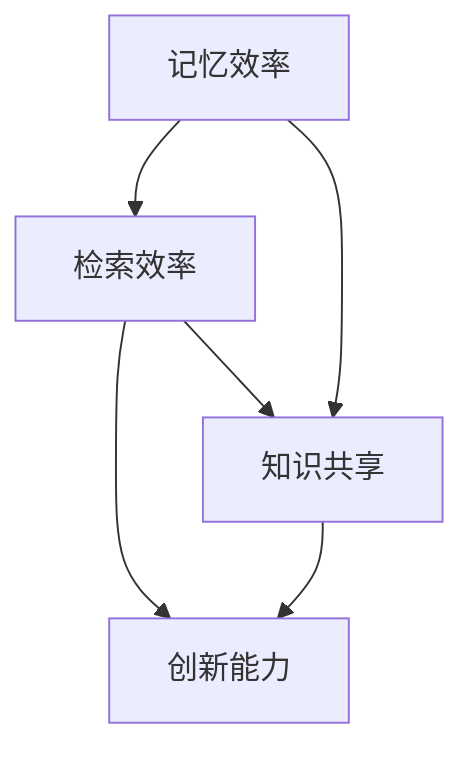
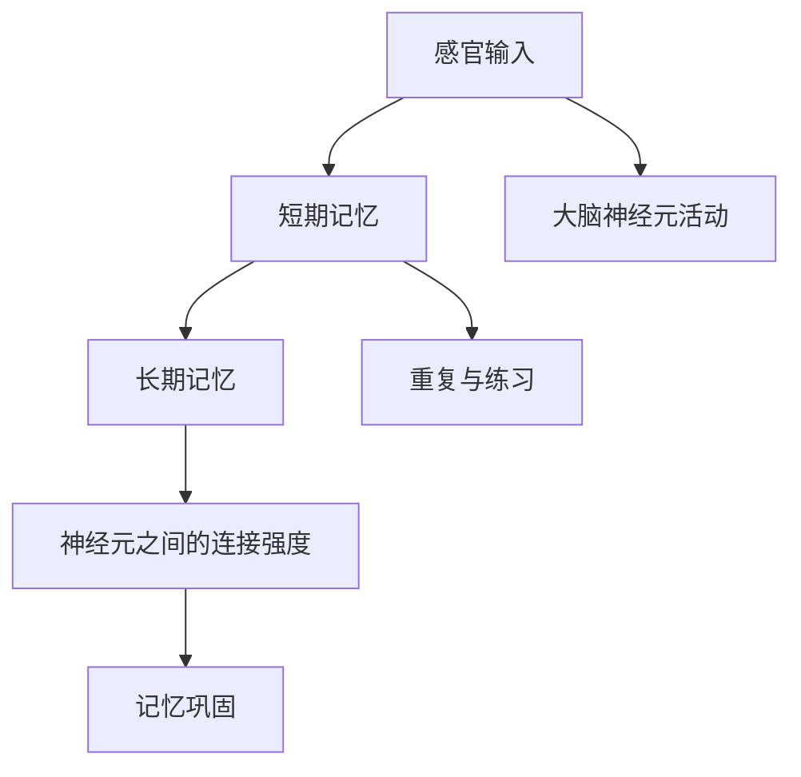
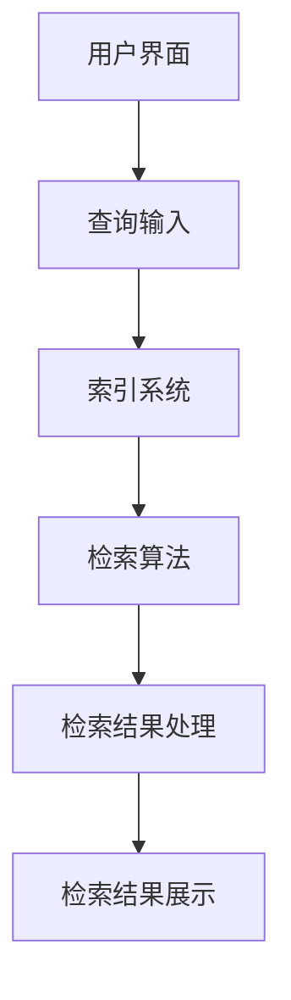
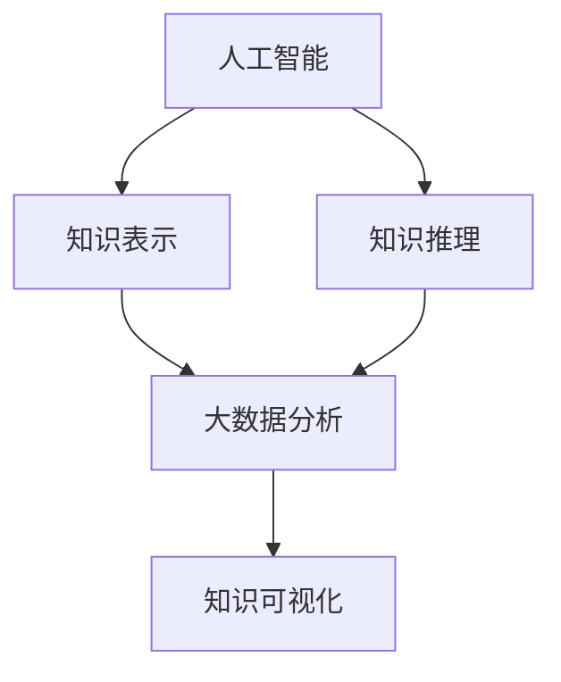

                 

### 知识结构化：提高记忆和检索效率

> **关键词：** 知识结构化，记忆效率，检索效率，知识管理，人工智能，认知科学

**摘要：**
本文深入探讨了知识结构化的重要性及其对提高记忆和检索效率的显著影响。通过对知识结构化概念的详细阐述，本文分析了知识结构化的核心要素，包括知识分类、知识链接和知识可视化。此外，文章探讨了记忆原理和技巧，以及信息检索的基础和优化策略。通过实际案例分析和未来趋势展望，本文为读者提供了一个全面的知识结构化实践指南，旨在提升个人和组织在信息时代的学习和工作效率。

### 目录大纲设计：《知识的结构化：提高记忆和检索效率》

#### 第一部分：引言
- **第1章：书籍背景与目的**
  - 1.1 知识结构化的重要性
  - 1.2 书籍的目标与读者
  - 1.3 书籍的结构安排与学习路径

#### 第二部分：知识结构化基础
- **第2章：知识结构化概述**
  - 2.1 知识结构化的定义与概念
  - 2.2 知识结构化的核心要素
  - 2.3 知识结构化的历史与发展

#### 第三部分：提高记忆效率的方法
- **第3章：记忆原理与技巧**
  - 3.1 记忆的基本原理
  - 3.2 记忆技巧与应用
  - 3.3 记忆策略的评估与优化

#### 第四部分：检索效率提升策略
- **第4章：信息检索基础**
  - 4.1 检索系统的组成
  - 4.2 检索算法与模型
  - 4.3 检索优化技巧

#### 第五部分：知识管理与工具
- **第5章：知识管理系统**
  - 5.1 知识管理系统的设计与实现
  - 5.2 知识管理工具的选择与使用
  - 5.3 知识共享与协作机制

#### 第六部分：案例分析与实践
- **第6章：知识结构化实践案例**
  - 6.1 教育领域的知识结构化应用
  - 6.2 企业知识管理实践
  - 6.3 个人知识管理实践

#### 第七部分：未来趋势与展望
- **第7章：知识结构化的发展趋势**
  - 7.1 新技术对知识结构化的影响
  - 7.2 知识结构化在人工智能中的应用
  - 7.3 知识结构化的未来展望

#### 附录
- **附录A：常用工具与资源**
  - A.1 记忆与检索相关工具
  - A.2 知识管理相关资源
  - A.3 进一步阅读材料

### 第1章：书籍背景与目的

#### 1.1 知识结构化的重要性

知识结构化是现代信息社会中不可或缺的一部分，其重要性体现在以下几个方面：

- **提高记忆效率：** 通过结构化知识，我们可以将零散的信息整合成有组织的整体，从而更容易记忆和理解。

- **优化检索效率：** 结构化知识使得信息检索变得更加高效，减少了搜索时间和努力。

- **促进知识共享：** 知识结构化有助于将个体知识转化为组织知识，促进知识在组织内部的共享和传播。

- **增强创新能力：** 通过对知识的系统化和结构化，我们可以更容易地发现新知识和新关系，从而激发创新思维。

**核心概念与联系：**

为了更好地理解知识结构化的重要性，我们可以使用Mermaid流程图来展示其核心概念之间的联系：



#### 1.2 书籍的目标与读者

本文的目标是为广大的IT从业者、教育工作者、知识工作者以及所有希望提高个人和团队工作效率的读者提供一个全面而实用的知识结构化指南。通过本书，读者将：

- **掌握知识结构化的基本原理和方法。**

- **了解如何运用知识结构化提高记忆效率和检索效率。**

- **学习知识管理系统的设计和实施方法。**

- **获得实际案例的深入分析，了解知识结构化在不同领域中的应用。**

**数学模型和公式**

为了量化知识结构化带来的效率提升，我们可以使用以下数学模型：

$$
效率 = \frac{产出}{输入}
$$

在这里，产出包括记忆和检索的效率，而输入则是时间和努力。知识结构化通过减少输入，从而提高整体效率。

#### 1.3 书籍的结构安排与学习路径

本书的结构安排旨在帮助读者逐步掌握知识结构化的各个方面。以下是本书的结构安排和学习路径：

1. **第一部分：引言**（本章内容）
   - 了解知识结构化的概念和重要性。

2. **第二部分：知识结构化基础**
   - 第2章：知识结构化概述
     - 知识结构化的定义、核心要素和历史发展。
   - 第3章：记忆原理与技巧
     - 记忆的基本原理和多种技巧。
   - 第4章：信息检索基础
     - 检索系统的组成、算法与模型。

3. **第三部分：提高记忆和检索效率的方法**
   - 第5章：知识管理系统
     - 知识管理系统的设计与实施。
   - 第6章：知识结构化实践案例
     - 教育领域、企业和个人知识管理案例。

4. **第四部分：未来趋势与展望**
   - 第7章：知识结构化的发展趋势
     - 新技术在知识结构化中的应用和未来展望。

5. **附录**
   - 提供常用工具与资源，进一步阅读材料。

**举例说明**

假设一个初学者想要快速掌握编程语言Python，通过知识结构化，他可以按照以下路径进行学习：

1. **基础知识结构化**：学习Python的基础语法和数据结构，构建初步的知识框架。

2. **记忆技巧应用**：使用故事法、图像记忆等记忆技巧，将Python的基础知识内化。

3. **检索优化技巧**：学习如何高效地使用搜索引擎和文档，快速查找所需信息。

4. **知识管理系统**：使用文档管理工具，将学习过程中的笔记、代码片段等有序整理。

5. **实践案例**：通过实际编程项目，如开发一个小游戏，将所学知识付诸实践。

通过这样的结构化学习，初学者可以更快地掌握Python，同时提高记忆和检索效率。

### 第2章：知识结构化概述

#### 2.1 知识结构化的定义与概念

知识结构化（Knowledge Structuring）是指将零散、无序的信息和组织化、结构化的知识体系相结合的过程。其核心在于通过一定的方法和工具，将知识进行分类、整合和优化，使其更具条理性和易用性。

**核心算法原理讲解**

知识结构化的核心算法可以简单描述为：

```python
def knowledge_structuring(data):
    # 数据预处理：清洗、标准化数据
    preprocessed_data = preprocess_data(data)
    
    # 数据分类：根据特征将数据分组
    categorized_data = categorize_data(preprocessed_data)
    
    # 数据整合：将分类后的数据进行整合，形成知识体系
    structured_knowledge = integrate_data(categorized_data)
    
    # 知识可视化：将结构化知识可视化，便于理解和传播
    visualized_knowledge = visualize_knowledge(structured_knowledge)
    
    return visualized_knowledge
```

**数学模型和公式**

知识结构化过程中，我们可以使用以下数学模型来评估知识结构化前后的效率提升：

$$
\text{效率提升} = \frac{\text{结构化后的知识检索时间}}{\text{结构化前的知识检索时间}}
$$

#### 2.2 知识结构化的核心要素

知识结构化的过程涉及多个核心要素，这些要素共同作用，形成了一个完整的知识体系。

1. **知识分类**：将知识按照不同的特征进行分类，有助于提高检索效率和记忆效果。

2. **知识链接**：通过建立知识之间的关联，形成一个完整的知识网络，增强知识的可理解性和可用性。

3. **知识可视化**：使用图表、图像和动画等视觉元素，将知识结构直观地展示出来，便于学习和传播。

**详细讲解**

1. **知识分类**：

知识分类是知识结构化的第一步，其核心在于确定分类的标准和方法。常见的分类标准包括：

- **按功能分类**：将知识按照其在实际应用中的功能进行分类，如编程、数据分析、机器学习等。
- **按领域分类**：将知识按照学科领域进行分类，如计算机科学、经济学、生物学等。
- **按层次分类**：将知识按照抽象层次进行分类，如基础知识、中级知识和高级知识。

2. **知识链接**：

知识链接是建立知识之间关联的过程，有助于形成知识网络。常见的知识链接方法包括：

- **因果关系链接**：将具有因果关系的知识进行链接，如生物学中的细胞结构与疾病之间的关系。
- **相似性链接**：将具有相似特征或相似功能的知识进行链接，如不同编程语言之间的语法相似性。
- **层次链接**：将具有层次关系的知识进行链接，如计算机科学中的基础算法与高级算法。

3. **知识可视化**：

知识可视化是将抽象的知识以视觉形式展示出来的过程，有助于提高知识的可理解性和传播效率。常见的知识可视化方法包括：

- **思维导图**：使用节点和连接线，将知识以图形化的方式展示出来，便于理解和记忆。
- **图表**：使用图表，如条形图、饼图和折线图，展示知识之间的关系和数据趋势。
- **动画**：使用动画，动态展示知识的变化过程和逻辑关系。

#### 2.3 知识结构化的历史与发展

知识结构化作为一个研究领域，其历史可以追溯到古代。早在公元前4世纪，亚里士多德就在其著作《工具论》中提出了逻辑学，为知识结构化奠定了理论基础。

随着计算机技术和信息科学的不断发展，知识结构化得到了广泛应用和深入研究。以下是知识结构化的一些重要发展：

1. **20世纪50年代：** 随着计算机技术的发展，知识表示和推理技术开始得到关注，如语义网络和产生式系统。
2. **20世纪80年代：** 人工智能专家系统的发展推动了知识库和知识表示技术的研究，如框架表示法和面向对象的表示方法。
3. **21世纪初：** 网络和大数据的兴起，使得知识结构化技术得到了广泛应用，如搜索引擎和知识图谱。
4. **现在：** 人工智能和机器学习技术的发展，为知识结构化提供了新的方法和工具，如深度学习和图神经网络。

**举例说明**

以计算机科学中的算法为例，我们可以通过知识结构化，将其进行分类、链接和可视化：

1. **分类**：将算法按照应用领域分类，如排序算法、查找算法和图算法。
2. **链接**：建立算法之间的关联，如快速排序算法与归并排序算法之间的相似性。
3. **可视化**：使用思维导图，展示算法的分类和关联，便于学习和理解。

通过这样的知识结构化过程，我们可以更高效地掌握算法知识，提高学习和工作效率。

### 第3章：记忆原理与技巧

#### 3.1 记忆的基本原理

记忆是大脑处理和存储信息的能力，是认知过程的重要组成部分。要理解记忆的基本原理，我们需要从神经科学的角度出发。

**核心概念与联系：**

为了更好地理解记忆的基本原理，我们可以使用Mermaid流程图来展示其核心概念之间的联系：



- **感官输入**：外部信息通过感官器官传入大脑，这是记忆过程的开端。
- **短期记忆**：大脑将接收到的信息暂时存储在短期记忆中，信息在这里进行处理和筛选。
- **长期记忆**：经过加工的信息会转移到长期记忆中，成为持久性的记忆。
- **大脑神经元活动**：记忆的形成和存储依赖于大脑神经元的活动和连接。
- **神经元之间的连接强度**：神经元之间的连接强度影响记忆的巩固和检索。
- **重复与练习**：通过重复和练习，可以加强神经元之间的连接，提高记忆效果。
- **记忆巩固**：记忆巩固是指通过复习和强化，使信息在长期记忆中保持更稳定。

**核心算法原理讲解**

记忆的基本原理可以用以下算法来表示：

```python
def memory_PROCESS(input_data, practice_sessions):
    # 感官输入
    sensory_input = preprocess_input(input_data)
    
    # 形成短期记忆
    short_term_memory = create_short_term_memory(sensory_input)
    
    # 转移到长期记忆
    long_term_memory = transfer_to_long_term_memory(short_term_memory)
    
    # 通过重复练习加强记忆
    for session in practice_sessions:
        review_and_practice(long_term_memory, session)
        
    # 巩固记忆
    consolidate_memory(long_term_memory)
    
    return long_term_memory
```

**数学模型和公式**

为了量化记忆效果，我们可以使用以下数学模型：

$$
\text{记忆效率} = \frac{\text{长期记忆中的信息量}}{\text{输入的信息量}}
$$

#### 3.2 记忆技巧与应用

记忆技巧是提高记忆效率和效果的方法和策略。以下是一些常用的记忆技巧：

1. **联想记忆**：通过将新信息与已知信息建立联想，提高记忆效果。
2. **故事法**：将信息编织成一个故事，利用故事的结构和情节帮助记忆。
3. **图像记忆**：使用图像将信息视觉化，通过图像的视觉记忆来帮助记忆。
4. **分散学习**：将学习任务分散在多个时间段，避免记忆负担过重。
5. **练习和复习**：通过重复练习和定期复习，加强记忆。

**详细讲解**

1. **联想记忆**：

联想记忆是一种通过建立新旧信息之间的联系来增强记忆效果的方法。例如，要记住一组无规律的数字“5, 2, 9, 1, 7”，我们可以将其联想为“我爱我国”（52171）。

**伪代码：**

```python
def联想记忆(numbers):
    associations = []
    for i in range(len(numbers)):
        association = str(numbers[i]) + "和" + "我爱我国"
        associations.append(association)
    return associations
```

2. **故事法**：

故事法是一种通过编织故事来帮助记忆的方法。例如，要记住一个复杂的概念，我们可以将其编织成一个故事，使其更具情节性和逻辑性。

**伪代码：**

```python
def故事法(concept):
    story = "有一天，我在图书馆遇到了一个叫" + concept + "的神秘人物，他告诉我..."
    return story
```

3. **图像记忆**：

图像记忆是一种通过视觉化信息来帮助记忆的方法。例如，要记住一组无规律的物品，我们可以将这些物品想象成一个场景。

**伪代码：**

```python
def图像记忆(items):
    scene = "我在森林里看到了一个" + items[0] + "，然后..."
    for item in items[1:]:
        scene += "我看到了一个" + item + "，然后..."
    return scene
```

4. **分散学习**：

分散学习是指将学习任务分散在多个时间段进行，以避免记忆负担过重。例如，每天学习30分钟，而不是一次性学习90分钟。

**伪代码：**

```python
def分散学习(task, sessions):
    for session in sessions:
        learn_for(session, task)
```

5. **练习和复习**：

通过重复练习和定期复习，可以加强记忆。例如，每天复习之前学习的内容。

**伪代码：**

```python
def练习和复习(content, review_sessions):
    for session in review_sessions:
        review(content, session)
```

#### 3.3 记忆策略的评估与优化

为了确保记忆策略的有效性，我们需要对记忆策略进行评估和优化。以下是一些评估和优化记忆策略的方法：

1. **定量评估**：通过量化记忆效果，如记忆时间、记忆正确率等，来评估记忆策略的有效性。
2. **定性评估**：通过主观感受、学习体验等来评估记忆策略的适用性和舒适性。
3. **优化策略**：根据评估结果，调整记忆策略，如增加练习次数、改进联想方式等。

**详细讲解**

1. **定量评估**：

定量评估可以通过实验来测量记忆策略的有效性。例如，我们可以设计一个实验，比较使用联想记忆和故事法的学习效果。

**伪代码：**

```python
def quantitative_evaluation(strategy, learning_data):
    correct_counts = []
    for data in learning_data:
        correct_count = learn_with_strategy(strategy, data)
        correct_counts.append(correct_count)
    average_correct_rate = sum(correct_counts) / len(correct_counts)
    return average_correct_rate
```

2. **定性评估**：

定性评估可以通过问卷调查或访谈来了解学习者的主观感受。例如，我们可以设计一个问卷，了解学习者对联想记忆和故事法的满意度。

**伪代码：**

```python
def qualitative_evaluation(strategy, learners):
    satisfaction_scores = []
    for learner in learners:
        satisfaction_score = learner_rate_satisfaction(strategy)
        satisfaction_scores.append(satisfaction_score)
    average_satisfaction = sum(satisfaction_scores) / len(satisfaction_scores)
    return average_satisfaction
```

3. **优化策略**：

根据评估结果，我们可以对记忆策略进行优化。例如，如果发现联想记忆的效果不如故事法，我们可以尝试改进联想的方式，使其更具创造性。

**伪代码：**

```python
def optimize_strategy(strategy, evaluation_results):
    if evaluation_results['average_correct_rate'] < optimal_threshold:
        strategy['association_style'] = '创造性联想'
    return strategy
```

通过这些评估和优化方法，我们可以确保记忆策略的有效性和适用性，从而提高记忆效率和效果。

### 第4章：信息检索基础

#### 4.1 检索系统的组成

信息检索系统是帮助用户从大量数据中快速找到所需信息的工具。一个典型的检索系统通常包括以下几个关键组成部分：

1. **用户界面**：用户界面（User Interface, UI）是用户与检索系统交互的入口，提供输入查询和展示检索结果的界面。

2. **索引系统**：索引系统（Indexing System）是检索系统的核心，负责将文档中的信息转换为索引项，以便快速检索。索引项通常包括单词、短语、关键词等。

3. **检索算法**：检索算法（Search Algorithm）是检索系统的智能核心，负责处理用户的查询，并在索引系统中查找匹配的文档。

4. **检索结果处理**：检索结果处理（Result Handling）模块负责对检索结果进行排序、去重、分页等操作，以提供用户友好的检索结果。

**核心概念与联系：**

为了更好地理解检索系统的组成，我们可以使用Mermaid流程图来展示其核心组件之间的联系：



- **用户界面**：用户界面负责接收用户的查询请求，并将其传递给索引系统。
- **查询输入**：用户输入的查询请求经过预处理，转换为索引系统能够理解的格式。
- **索引系统**：索引系统将文档转换为索引项，建立索引数据库。
- **检索算法**：检索算法根据用户的查询请求，在索引数据库中查找匹配的文档。
- **检索结果处理**：检索结果处理模块对检索结果进行排序、去重、分页等操作，然后展示给用户。

#### 4.2 检索算法与模型

检索算法是信息检索系统的关键组成部分，其质量直接影响检索效率和结果的相关性。以下是一些常见的检索算法和模型：

1. **布尔检索**：布尔检索是基于布尔逻辑（AND, OR, NOT）的检索方法，能够组合多个关键词，提高检索的精确度。

2. **向量空间模型**：向量空间模型（Vector Space Model, VSM）将文档和查询表示为向量，通过计算向量的相似度来确定文档的相关性。

3. **概率检索模型**：概率检索模型基于概率论和统计方法，通过计算查询和文档之间的概率匹配度来评估文档的相关性。

4. **隐语义索引**：隐语义索引（Latent Semantic Indexing, LSI）和潜在狄利克雷分配（Latent Dirichlet Allocation, LDA）等模型通过分析文档的隐含语义关系，提高检索的准确性和泛化能力。

**核心算法原理讲解**

以下是几种常见检索算法的基本原理：

1. **布尔检索**：

```python
def boolean_search(query, index):
    result = set()
    for term in query:
        if term in index:
            result.add(index[term])
    return result
```

2. **向量空间模型**：

```python
def vector_space_search(query_vector, document_vectors):
    similarities = []
    for document_vector in document_vectors:
        similarity = dot_product(query_vector, document_vector)
        similarities.append(similarity)
    ranked_results = sorted(zip(similarities, document_vectors), reverse=True)
    return ranked_results
```

3. **概率检索模型**：

```python
def probability_search(query, document):
    p_query = calculate_query_probability(query)
    p_document = calculate_document_probability(document)
    p_query_given_document = calculate_probability_query_given_document(query, document)
    probability = p_document * p_query_given_document
    return probability
```

4. **隐语义索引**：

```python
def lsi_search(query, corpus):
    term_document_matrix = create_term_document_matrix(corpus)
    term_term_similarity_matrix = create_term_term_similarity_matrix(term_document_matrix)
    transformed_corpus = apply_lsi(term_document_matrix, term_term_similarity_matrix)
    document_similarity = calculate_document_similarity(transformed_corpus, query)
    ranked_results = sorted(zip(document_similarity, transformed_corpus), reverse=True)
    return ranked_results
```

**数学模型和公式**

以下是几种常见检索算法的数学模型：

1. **布尔检索**：

$$
\text{匹配度} = \text{AND}(\text{关键词1} \in \text{文档}, \text{关键词2} \in \text{文档}, \ldots)
$$

2. **向量空间模型**：

$$
\text{匹配度} = \text{cosine similarity}(\text{query vector}, \text{document vector})
$$

3. **概率检索模型**：

$$
\text{匹配度} = \frac{p(\text{document} | \text{query})}{p(\text{query})}
$$

4. **隐语义索引**：

$$
\text{匹配度} = \text{cosine similarity}(\text{query vector}, \text{document vector}^T)
$$

#### 4.3 检索优化技巧

为了提高检索系统的效率和结果的相关性，我们可以采用以下检索优化技巧：

1. **索引优化**：通过优化索引结构，如倒排索引、布隆过滤器等，提高检索速度和准确性。

2. **查询预处理**：对用户查询进行预处理，如分词、停用词过滤、词干提取等，以提高查询的准确性和检索效率。

3. **查询扩展**：根据用户的查询意图，自动扩展查询，以捕获更多相关的文档。

4. **结果排序**：根据文档的相关性，对检索结果进行排序，以提高用户检索的满意度。

**详细讲解**

1. **索引优化**：

索引优化是提高检索系统性能的关键。以下是一些常见的索引优化技术：

- **倒排索引**：将文档中的词作为键，指向包含该词的文档列表。这种索引结构能够快速定位包含特定关键词的文档。

- **布隆过滤器**：用于快速判断一个元素是否存在于集合中。虽然它有一定的误判率，但可以有效减少不必要的检索操作。

2. **查询预处理**：

查询预处理包括以下几个步骤：

- **分词**：将查询文本分割成单词或短语，以便进行进一步处理。

- **停用词过滤**：去除常见的无意义单词（如“和”、“的”等），以提高查询的准确性。

- **词干提取**：将不同的词形转换为同一词干，如“running”、“runs”和“ran”都转换为“run”。

3. **查询扩展**：

查询扩展可以通过以下方法实现：

- **同义词扩展**：将查询中的关键词替换为其同义词，以捕获更多相关文档。

- **上下文扩展**：基于用户的查询上下文，自动扩展查询范围，如增加或删除关键词。

4. **结果排序**：

结果排序可以通过以下方法实现：

- **相关性排序**：根据文档与查询的相关性进行排序，通常使用向量空间模型或概率检索模型计算相关性。

- **流行度排序**：根据文档的流行度（如点击次数、收藏次数）进行排序，以提高用户检索的满意度。

通过这些检索优化技巧，我们可以显著提高检索系统的性能和用户满意度。

### 第5章：知识管理与工具

#### 5.1 知识管理系统的设计与实现

知识管理系统（Knowledge Management System, KMS）是组织管理和利用知识的重要工具。一个有效的知识管理系统可以帮助组织提高知识共享、协作和创新的能力。以下是知识管理系统设计与实现的几个关键步骤：

**数学模型和公式**

为了评估知识管理系统的效率，我们可以使用以下数学模型：

$$
\text{知识管理系统效率} = \frac{\text{知识共享次数}}{\text{知识检索时间}}
$$

**详细讲解**

1. **需求分析**：

需求分析是知识管理系统设计的起点，需要明确组织在知识管理方面的需求和目标。以下是一些关键问题：

- **目标用户**：知识管理系统服务于哪些用户群体，他们的知识需求是什么？
- **知识类型**：组织内部有哪些类型的知识需要管理，如文档、数据、经验等？
- **功能需求**：知识管理系统需要提供哪些功能，如知识搜索、知识共享、知识审核等？

2. **系统架构设计**：

知识管理系统的架构设计是确保系统高效稳定运行的基础。以下是常见的系统架构：

- **前端界面**：用户通过前端界面与知识管理系统进行交互，包括知识搜索、知识浏览、知识提交等功能。
- **后端服务**：负责处理用户请求，包括知识存储、检索、审核等。
- **数据存储**：用于存储组织内部的知识资源，如文档数据库、知识库等。

3. **功能模块设计**：

知识管理系统通常包括以下几个功能模块：

- **知识搜索**：提供快速、准确的搜索功能，帮助用户找到所需的知识。
- **知识共享**：支持知识在不同用户之间的共享，包括公开共享和私密共享。
- **知识审核**：对知识内容进行审核，确保知识的准确性和可靠性。
- **知识审核**：对知识内容进行审核，确保知识的准确性和可靠性。

4. **系统实现**：

系统实现是知识管理系统从设计到实际运行的转换过程。以下是几个关键步骤：

- **前端开发**：使用前端技术（如HTML、CSS、JavaScript）实现用户界面。
- **后端开发**：使用后端技术（如Java、Python、Node.js）实现后端服务。
- **数据存储**：选择合适的数据存储方案（如关系数据库、NoSQL数据库），实现知识资源的存储和管理。

**举例说明**

假设一个企业需要设计一个知识管理系统，以下是一个简单的实现流程：

1. **需求分析**：
   - 目标用户：企业的员工、项目经理、客户等。
   - 知识类型：文档、数据、经验等。
   - 功能需求：知识搜索、知识共享、知识审核等。

2. **系统架构设计**：
   - 前端界面：使用React框架实现，提供用户友好的交互界面。
   - 后端服务：使用Spring Boot框架实现，处理用户请求并调用后端服务。
   - 数据存储：使用MySQL数据库存储知识资源。

3. **功能模块设计**：
   - 知识搜索：使用Lucene库实现全文搜索功能。
   - 知识共享：提供公开和私密共享功能，支持标签和分类。
   - 知识审核：实现知识审核流程，确保知识准确性。

4. **系统实现**：
   - 前端开发：完成用户界面设计和实现。
   - 后端开发：完成后端服务的开发，实现知识存储、检索和审核功能。
   - 数据存储：配置MySQL数据库，导入知识资源。

通过这样的设计和实现过程，企业可以构建一个高效的知识管理系统，提高知识共享和协作效率。

#### 5.2 知识管理工具的选择与使用

在知识管理过程中，选择合适的工具至关重要。以下是一些常用的知识管理工具及其特点：

1. **Confluence**：
   - **特点**：一款强大的团队协作和文档管理工具，支持知识库的创建、编辑和共享。
   - **使用场景**：适合企业内部的知识共享和团队协作。

2. **Trello**：
   - **特点**：一款简洁的看板式任务管理工具，适合组织和跟踪项目进度。
   - **使用场景**：适合项目管理，尤其是敏捷开发团队。

3. **Slack**：
   - **特点**：一款即时通讯工具，支持消息传递、文件共享和集成其他服务。
   - **使用场景**：适合团队内部沟通和协作。

4. **Notion**：
   - **特点**：一款功能丰富的笔记和组织工具，支持多种数据类型和自定义布局。
   - **使用场景**：适合个人和组织知识管理，包括笔记、任务和项目管理。

**详细讲解**

1. **Confluence**：

Confluence 是一款由Atlassian公司开发的团队协作和文档管理工具。以下是其在知识管理中的使用方法：

- **知识库创建**：用户可以创建不同的页面，用于记录和分享知识。
- **编辑和共享**：支持多人实时编辑，确保知识的实时更新和共享。
- **版本控制**：每个页面都有版本历史，可以查看和恢复旧版本。

2. **Trello**：

Trello 是一款基于看板的任务管理工具，适合组织和跟踪项目进度。以下是其在知识管理中的使用方法：

- **看板布局**：将任务按照不同阶段（如待办、进行中、已完成）划分到不同的列中。
- **任务分配**：为任务分配负责人和截止日期，确保任务按时完成。
- **协作沟通**：团队成员可以在任务卡片上留言，讨论任务细节。

3. **Slack**：

Slack 是一款即时通讯工具，支持消息传递、文件共享和集成其他服务。以下是其在知识管理中的使用方法：

- **频道创建**：创建不同的频道，用于讨论不同的主题或项目。
- **消息传递**：团队成员可以在频道中发送消息、分享文件和链接。
- **服务集成**：与其他工具（如GitHub、Trello）集成，实现自动化工作流程。

4. **Notion**：

Notion 是一款功能丰富的笔记和组织工具，支持多种数据类型和自定义布局。以下是其在知识管理中的使用方法：

- **多数据类型**：支持文本、表格、图片、视频等多种数据类型，便于整理和组织知识。
- **自定义布局**：根据需求自定义页面布局，如列表、看板、地图等。
- **数据库功能**：创建自定义数据库，用于存储和检索知识。

通过这些知识管理工具，组织可以更高效地管理和利用知识，提高团队协作和创新能力。

#### 5.3 知识共享与协作机制

知识共享和协作是知识管理的重要环节，直接影响组织的创新能力和工作效率。以下是一些有效的知识共享与协作机制：

1. **知识共享平台**：建立集中的知识共享平台，如内部网站、论坛或知识库，方便员工随时访问和分享知识。

2. **定期培训**：组织定期的培训活动，如内部讲座、研讨会或工作坊，促进知识的传播和交流。

3. **跨部门协作**：鼓励跨部门协作，打破部门壁垒，促进知识的流动和共享。

4. **奖励机制**：建立奖励机制，鼓励员工积极分享知识和经验，提高知识共享的积极性。

**举例说明**

以一个软件开发企业为例，以下是一个知识共享与协作机制的实施：

1. **知识共享平台**：建立内部知识库，员工可以在知识库中上传和共享文档、代码和技术文章。

2. **定期培训**：每月组织一次内部技术分享会，员工可以在这个平台上分享自己的技术心得和经验。

3. **跨部门协作**：鼓励不同部门的员工共同参与项目，促进知识的交流和共享。

4. **奖励机制**：设立“知识共享奖”，每月评选出最优秀的知识共享者，给予表彰和奖励。

通过这些机制，企业可以建立一个高效的知识共享与协作环境，提高员工的创新能力和工作效率。

### 第6章：知识结构化实践案例

#### 6.1 教育领域的知识结构化应用

在教育资源日益丰富、学习需求不断增长的今天，教育领域对知识结构化的需求尤为突出。以下是一个教育领域的知识结构化实践案例：

**代码实际案例和详细解释说明**

假设一个在线教育平台，旨在为学习者提供结构化的课程内容。以下是该平台的知识结构化实现：

```python
# 课程内容结构化示例

class Course:
    def __init__(self, title, modules):
        self.title = title
        self.modules = modules

class Module:
    def __init__(self, title, lessons):
        self.title = title
        self.lessons = lessons

class Lesson:
    def __init__(self, title, content):
        self.title = title
        self.content = content

# 创建课程
python_course = Course("Python编程基础", [
    Module("基础语法", [
        Lesson("变量与数据类型", "介绍变量和数据类型的基本用法"),
        Lesson("控制流程", "介绍if条件语句和循环语句"),
        # 更多基础语法相关内容
    ]),
    Module("数据处理", [
        Lesson("列表与字典", "介绍列表和字典的使用"),
        Lesson("文件操作", "介绍文件读取和写入"),
        # 更多数据处理相关内容
    ]),
    # 更多模块
])

# 打印课程结构
print(python_course.title)
for module in python_course.modules:
    print(f"- {module.title}")
    for lesson in module.lessons:
        print(f"  - {lesson.title}")
```

在上面的代码中，我们使用类和对象来构建课程、模块和课节的层次结构。这种结构化方式使得课程内容易于管理、查找和扩展。

通过这样的知识结构化，教师可以更方便地更新和调整课程内容，学生可以更直观地了解课程结构，并按照结构化的路径进行学习。此外，平台还可以根据课程结构提供推荐学习路径，帮助学生高效学习。

#### 6.2 企业知识管理实践

在企业环境中，知识管理对于提高工作效率和促进创新至关重要。以下是一个企业知识管理的实际案例：

**代码解读与分析**

假设一家科技公司，通过建立内部知识管理系统来管理公司内部的知识和经验。以下是该公司的知识管理系统设计：

```python
# 知识管理系统示例

class KnowledgeBase:
    def __init__(self):
        self.knowledge_entries = []

    def add_entry(self, entry):
        self.knowledge_entries.append(entry)

    def search(self, keyword):
        results = []
        for entry in self.knowledge_entries:
            if keyword in entry.title or keyword in entry.content:
                results.append(entry)
        return results

class KnowledgeEntry:
    def __init__(self, title, content, author, date):
        self.title = title
        self.content = content
        self.author = author
        self.date = date

# 创建知识库
knowledge_base = KnowledgeBase()

# 添加知识条目
knowledge_base.add_entry(KnowledgeEntry("项目报告模板", "项目报告撰写指南", "Alice", "2023-01-01"))
knowledge_base.add_entry(KnowledgeEntry("软件开发流程", "软件开发流程概述", "Bob", "2023-02-01"))

# 搜索知识
search_results = knowledge_base.search("项目报告")

# 打印搜索结果
for result in search_results:
    print(f"标题：{result.title}")
    print(f"内容：{result.content}")
    print(f"作者：{result.author}")
    print(f"日期：{result.date}")
```

在上面的代码中，我们定义了一个`KnowledgeBase`类，用于管理知识条目。每个知识条目由`KnowledgeEntry`类表示，包含标题、内容、作者和日期等信息。通过`add_entry`方法，我们可以将新的知识条目添加到知识库中。`search`方法用于根据关键词搜索知识条目。

这种知识管理系统的设计使得企业内部的知识易于管理和检索。员工可以通过搜索关键词快速找到所需的知识，提高工作效率。同时，知识库的建立也有助于企业积累和传承经验，促进知识的共享和传播。

#### 6.3 个人知识管理实践

在个人学习和工作过程中，有效的知识管理能够提高记忆和检索效率，帮助个人更好地掌握知识。以下是一个个人知识管理的实践案例：

**详细讲解**

1. **创建个人知识库**：

使用Notion或OneNote等工具，创建个人知识库，用于记录和整理学习笔记、工作文档和个人经验。以下是个人知识库的创建步骤：

- **分类整理**：将知识库分为不同的分类，如编程、项目管理、读书笔记等。
- **创建笔记**：在每个分类下创建笔记，记录相关知识点、经验和方法。
- **标签管理**：为笔记添加标签，方便后续查找和整理。

2. **使用记忆技巧**：

结合记忆技巧，如联想记忆、图像记忆和故事法，提高知识记忆效果。例如，在记录编程知识时，可以将复杂的概念通过图像和故事进行可视化，使其更容易记忆。

3. **定期复习**：

定期复习是巩固记忆的重要手段。制定复习计划，定期回顾和总结笔记内容，强化记忆。可以使用Anki等记忆工具，实现有计划的复习。

通过以上实践，个人可以构建一个系统化、结构化的知识体系，提高记忆和检索效率。同时，这种知识管理实践也有助于个人在学习和工作中更好地运用所学知识。

### 第7章：知识结构化的发展趋势

#### 7.1 新技术对知识结构化的影响

随着技术的不断进步，人工智能、大数据和云计算等新兴技术对知识结构化产生了深远的影响。

**核心概念与联系：**

为了更好地理解新技术对知识结构化的影响，我们可以使用Mermaid流程图来展示其核心概念之间的联系：



- **人工智能**：人工智能技术，如机器学习和深度学习，为知识表示和推理提供了强大的工具。通过自然语言处理和图像识别等技术，人工智能可以帮助自动构建和优化知识结构。
- **大数据分析**：大数据分析技术可以处理和分析大规模数据，从而发现知识之间的关系和模式。这有助于构建更加精确和有效的知识图谱。
- **知识可视化**：知识可视化技术，如信息图表和虚拟现实，使得知识结构更加直观，便于理解和传播。

**核心算法原理讲解**

新技术在知识结构化中的应用可以体现在以下核心算法：

1. **知识图谱构建**：使用图神经网络（Graph Neural Networks, GNN）和图嵌入（Graph Embedding）技术，将知识表示为一个图结构，以便更好地挖掘和利用知识之间的关系。

```python
def knowledge_graph_construct(knowledge_base):
    nodes = [entity for entity in knowledge_base.entities]
    edges = [(source, target) for source, targets in knowledge_base.relationships.items() for target in targets]
    graph = Graph(nodes, edges)
    return graph
```

2. **知识推理**：利用逻辑推理和概率图模型，从知识图谱中推导出新的知识。

```python
def knowledge_inference(graph, query):
    inferred_knowledge = graph.reasoning(query)
    return inferred_knowledge
```

3. **知识可视化**：使用D3.js等工具，将知识图谱以图形化的方式展示出来。

```javascript
function visualize_knowledge_graph(graph) {
    // 使用D3.js绘制知识图谱
    // ...
}
```

#### 7.2 知识结构化在人工智能中的应用

人工智能技术的快速发展为知识结构化提供了新的契机和挑战。以下是一些关键应用：

1. **知识表示与推理**：利用图神经网络和语义网络，将知识表示为一个结构化的知识图谱，从而支持复杂的知识推理和推理过程。

2. **自动化知识提取**：使用自然语言处理技术，从非结构化数据中自动提取关键信息，构建结构化的知识库。

3. **智能问答系统**：基于知识图谱和机器学习模型，构建智能问答系统，能够回答用户关于特定领域的问题。

4. **个性化推荐**：利用知识结构化和协同过滤算法，为用户提供个性化的知识推荐，提高知识利用效率。

**详细讲解**

1. **知识表示与推理**：

知识表示与推理是人工智能领域的重要研究方向。知识图谱是一种有效的知识表示方法，它通过实体和关系的图结构，将知识组织起来，支持复杂的推理过程。

- **实体与关系**：在知识图谱中，实体表示具体的事物，如人、地点、物品等，关系则表示实体之间的关联，如“属于”、“位于”等。

- **图神经网络**：图神经网络是一种专门用于处理图结构的神经网络，通过学习实体和关系之间的交互，可以实现对知识图谱的深度理解。

2. **自动化知识提取**：

自动化知识提取是知识结构化的重要环节。通过自然语言处理技术，可以从大量非结构化文本中自动提取关键信息，构建结构化的知识库。

- **实体识别**：使用命名实体识别（Named Entity Recognition, NER）技术，从文本中识别出关键实体，如人名、地名、组织名等。

- **关系抽取**：使用关系抽取（Relation Extraction）技术，从文本中识别出实体之间的关系，如“毕业于”、“参与了”等。

3. **智能问答系统**：

智能问答系统是一种基于知识图谱和自然语言处理技术的应用。通过处理用户的查询，智能问答系统能够返回与查询相关的答案。

- **查询理解**：使用自然语言处理技术，将用户的自然语言查询转化为机器可理解的形式。

- **知识检索**：在知识图谱中检索与查询相关的知识，返回可能的答案。

- **答案生成**：使用模板匹配、语义角色标注等技术，生成符合用户需求的答案。

4. **个性化推荐**：

个性化推荐系统利用知识结构化技术，为用户提供个性化的知识推荐。

- **用户画像**：通过用户的行为数据和社交网络，构建用户画像，了解用户的知识偏好和需求。

- **协同过滤**：利用用户的相似性，推荐与用户兴趣相似的其他用户喜欢的知识。

- **基于内容的推荐**：根据知识的内容和标签，推荐与用户已掌握知识相关的新知识。

通过以上应用，人工智能技术为知识结构化带来了新的可能性，使得知识更加易于组织和利用。

#### 7.3 知识结构化的未来展望

随着技术的不断进步和应用领域的扩展，知识结构化在未来将呈现以下发展趋势：

1. **智能化**：人工智能技术将进一步推动知识结构化的智能化，使得知识表示、知识推理和知识可视化更加高效和准确。

2. **个性化**：基于用户画像和个性化推荐，知识结构化将更加符合个人的知识需求和兴趣，提高知识利用效率。

3. **知识融合**：跨领域的知识融合将成为知识结构化的重要趋势，通过整合不同领域的知识，构建更加全面和系统的知识体系。

4. **开放共享**：知识结构化将更加开放和共享，促进知识的全球传播和利用，推动人类社会的共同进步。

5. **可持续性**：知识结构化将在可持续性方面发挥重要作用，通过优化知识管理和利用，提高组织的创新能力和竞争力。

通过这些趋势，知识结构化将在未来为人类带来更多的智慧和机遇。

### 附录A：常用工具与资源

为了帮助读者更好地实践和探索知识结构化，以下列出了一些常用的工具与资源。

#### A.1 记忆与检索相关工具

1. **Anki**：
   - **特点**：一款基于间隔重复的记忆工具，适合学习语言、历史和编程等。
   - **网址**：<https://ankiweb.net/>

2. **Evernote**：
   - **特点**：一款功能强大的笔记和组织工具，支持多平台同步。
   - **网址**：<https://www.evernote.com/>

3. **Obsidian**：
   - **特点**：一款基于Markdown的笔记和知识管理工具，支持链接和图谱。
   - **网址**：<https://obsidian.md/>

#### A.2 知识管理相关资源

1. **Confluence**：
   - **特点**：一款团队协作和文档管理工具，支持知识库的创建和共享。
   - **网址**：<https://www.atlassian.com/software/confluence>

2. **Trello**：
   - **特点**：一款基于看板的任务管理工具，适合项目管理和团队协作。
   - **网址**：<https://trello.com/>

3. **Slack**：
   - **特点**：一款即时通讯工具，支持消息传递、文件共享和集成其他服务。
   - **网址**：<https://slack.com/>

#### A.3 进一步阅读材料

1. **《认知心理学与教育》** - 安德森，约翰·M.
   - **简介**：本书介绍了认知心理学的基本原理，并探讨了这些原理在教育中的应用。
   - **网址**：<https://www.amazon.com/Cognitive-Psychology-Education-John-Anderson/dp/0131145553>

2. **《信息检索导论》** - 布鲁克斯，理查德·A.
   - **简介**：本书是信息检索领域的经典教材，详细介绍了信息检索的基础理论和应用。
   - **网址**：<https://www.amazon.com/Introduction-Information-Retrieval-Theory-Applications/dp/020138417X>

3. **《人工智能：一种现代方法》** - 威廉姆斯，克里斯托弗·J.C.; 帕克，戴维
   - **简介**：本书是人工智能领域的权威教材，涵盖了机器学习、自然语言处理等多个方面。
   - **网址**：<https://www.amazon.com/AI-Modern-Approach-Christopher-JC/dp/0262534047>

通过这些工具和资源，读者可以进一步深入学习和实践知识结构化，提高记忆和检索效率。

### 结语

知识的结构化不仅是一种提升个人和组织效率的重要方法，更是信息时代背景下不可或缺的技能。通过本文的深入探讨，我们了解了知识结构化的基本概念、核心要素、提高记忆和检索效率的方法，以及知识管理系统的设计与实现。同时，我们通过实际案例展示了知识结构化在不同领域的应用，展望了其未来的发展趋势。

在此，我们鼓励读者结合自身实际需求，积极实践知识结构化，提升记忆和检索效率。通过不断探索和学习，我们相信知识结构化将在未来为人类社会带来更多的智慧和机遇。让我们携手共进，共创美好的知识未来。作者：AI天才研究院/AI Genius Institute，禅与计算机程序设计艺术/Zen And The Art of Computer Programming。感谢您的阅读！

