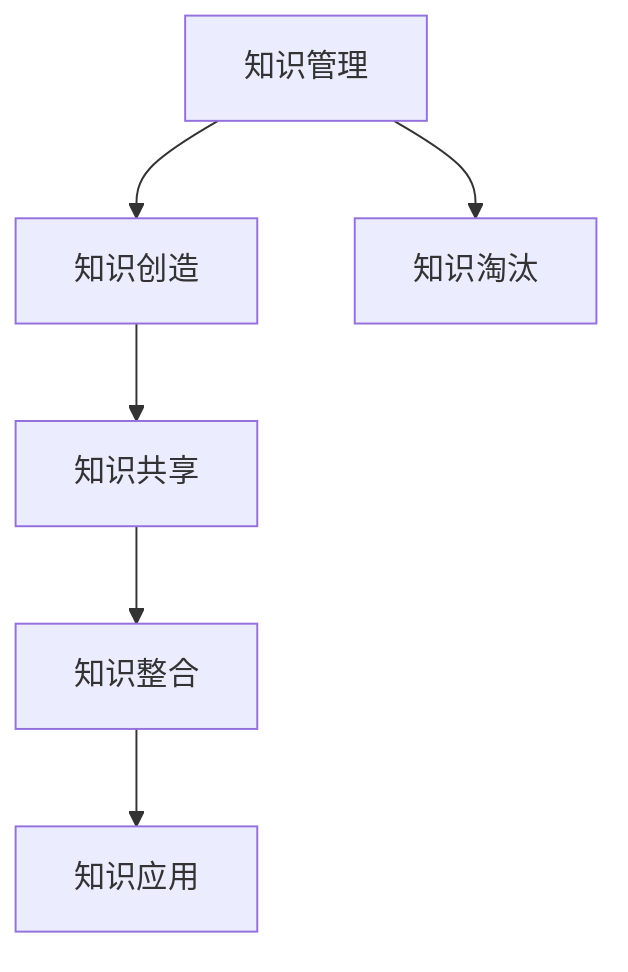
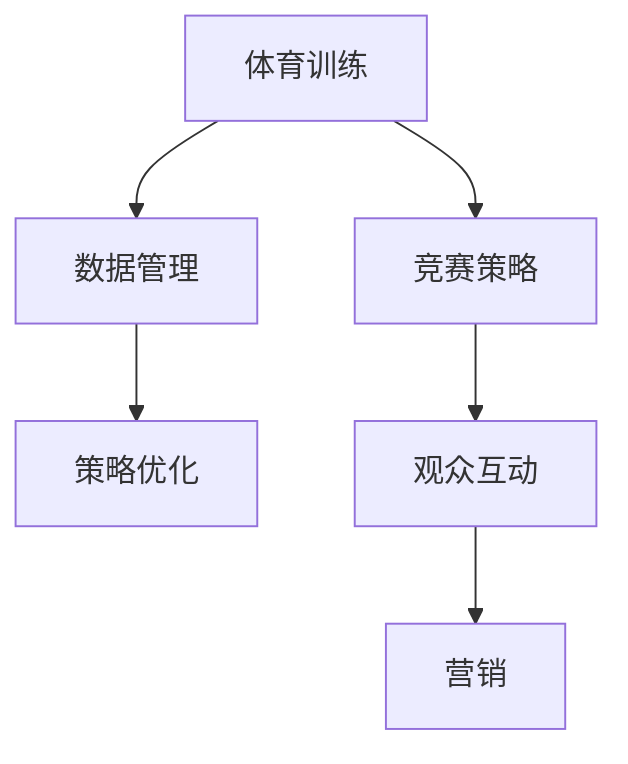
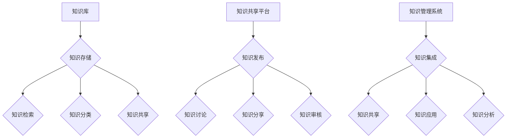
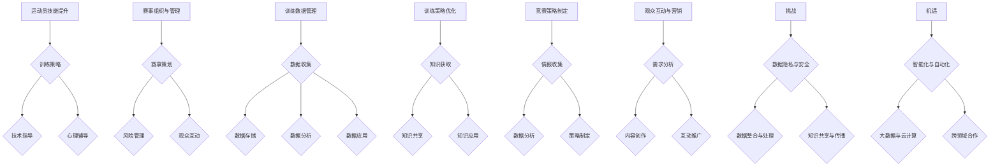
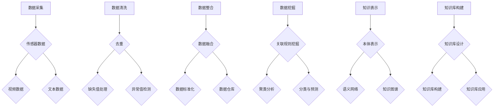
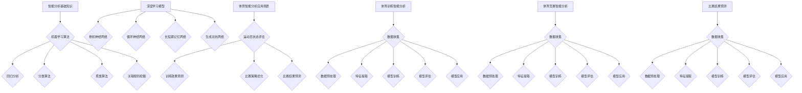
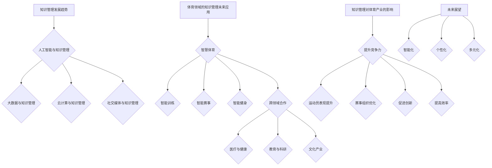

                 

### 知识管理概述

知识管理是一个系统的过程，旨在识别、获取、组织和传播知识，以增强组织的竞争力和创新能力。在体育领域，知识管理同样扮演着至关重要的角色，通过优化运动员训练、赛事组织和观众互动，提升整体体育产业的发展。

#### 1.1.1 知识管理的概念和重要性

知识管理可以定义为通过组织、共享、应用和创新知识，以提升组织的竞争力和创新能力。在体育领域，知识管理的重要性主要体现在以下几个方面：

1. **提升运动员技能**：知识管理可以帮助运动员更好地理解和应用各种训练方法和策略，从而提高竞技水平。
2. **优化赛事组织**：知识管理能够帮助赛事组织者更好地规划赛事流程，提高赛事运营效率。
3. **增强观众互动**：通过知识管理，观众可以获得更多关于赛事和运动员的信息，提升观赛体验。

#### 1.1.2 知识管理的理论基础

知识管理有着丰富的理论基础，其中几个关键理论包括：

1. **知识螺旋模型**：梅尔沃德提出的知识螺旋模型描述了知识从生成到应用的过程。模型分为四个阶段：知识创造、知识共享、知识整合和知识应用。
2. **知识生命周期**：知识生命周期是指知识从生成到淘汰的全过程。包括知识生成、知识传播、知识应用和知识淘汰四个阶段。
3. **知识地图**：知识地图是一种可视化工具，用于展示知识之间的关联和结构，帮助组织更好地理解和利用知识。

#### 1.1.3 知识管理的典型模式

知识管理在实际应用中形成了多种典型模式，包括：

1. **知识库**：知识库是知识的存储和管理方式，包括文本、图像、视频等多种形式。
2. **知识地图**：知识地图通过图形化方式展示知识之间的关系，帮助用户快速找到所需信息。
3. **知识共享平台**：知识共享平台是一种在线工具，用于促进知识共享和协作。

---

MARDKUIM流程图：



### 1.2 知识管理在体育领域的应用

知识管理在体育领域具有广泛的应用，主要包括以下几个方面：

#### 1.2.1 体育领域的知识管理需求

体育领域的知识管理需求主要表现在以下几个方面：

1. **运动员技能提升**：通过知识管理，运动员可以更好地理解和应用各种训练方法和策略，提高竞技水平。
2. **赛事组织与管理**：知识管理能够帮助赛事组织者更好地规划赛事流程，提高赛事运营效率。

#### 1.2.2 体育训练中的知识管理

在体育训练中，知识管理主要包括以下几个方面：

1. **训练数据管理**：通过收集和分析运动员的训练数据，可以制定更科学的训练计划，提高训练效果。
2. **训练策略优化**：基于数据分析的训练计划制定，可以更好地满足运动员的需求，提高训练效率。

#### 1.2.3 体育竞赛中的知识管理

在体育竞赛中，知识管理主要包括以下几个方面：

1. **竞赛策略制定**：利用知识管理可以提高竞赛成功率，包括比赛策略、战术安排等。
2. **观众互动与营销**：知识管理可以帮助赛事组织者更好地了解观众需求，提升赛事观赏性和商业价值。

---

MARDKUIM流程图：



### 1.3 知识管理在体育领域的挑战与机遇

#### 1.3.1 知识管理面临的挑战

1. **数据隐私与安全问题**：在体育领域，运动员的训练数据和赛事数据可能包含敏感信息，如何确保数据的安全性和隐私性是知识管理面临的一大挑战。
2. **数据整合与处理**：体育领域的数据来源多样，如何有效地整合和处理这些数据，提取有价值的信息，是知识管理的重要任务。
3. **技术更新与适应**：随着技术的快速发展，知识管理工具和算法也需要不断更新，如何适应新技术，提高知识管理的效率和效果，是体育组织需要面对的挑战。

#### 1.3.2 知识管理的机遇

1. **智能化与自动化**：人工智能和自动化技术的应用可以大大提高知识管理的效率，降低人力成本。
2. **大数据与云计算**：大数据和云计算技术的应用可以大大扩展知识管理的数据范围和处理能力。
3. **跨领域合作**：知识管理不仅可以在体育领域内部发挥作用，还可以与其他领域（如医疗、教育）进行跨领域合作，共同推动知识创新和应用。

---

MARDKUIM流程图：

```mermaid
graph TD
    A[挑战]
    B[数据隐私]
    C[数据整合]
    D[技术更新]
    A --> B,C,D
    E[机遇]
    F[智能化]
    G[大数据]
    H[云计算]
    I[J[跨领域合作]]
    E --> F,G,H,I
```

# 第一部分：知识管理概述

## 第1章：知识管理基础理论

### 1.1.1 知识管理的概念和重要性

#### 知识管理的定义与核心要素

知识管理（Knowledge Management，简称KM）是指通过一系列策略、工具和技术，系统地识别、获取、组织、存储、共享、应用和创新知识，以增强组织的竞争力和创新能力。知识管理涉及多个关键要素，包括知识识别、知识获取、知识共享、知识整合、知识应用和知识创新。

1. **知识识别**：识别组织内部和外部的知识资源，包括显性知识和隐性知识。
2. **知识获取**：通过收集、整理和获取内部和外部的知识，为组织提供丰富的知识资源。
3. **知识共享**：通过有效的沟通和协作，使知识在组织内部和外部进行共享，提升知识的利用效率。
4. **知识整合**：将不同来源的知识进行整合，形成一个结构化、易于访问的知识体系。
5. **知识应用**：将知识应用于实际工作中，以提高工作效率和创新能力。
6. **知识创新**：通过知识的应用和创新，不断产生新的知识和价值。

#### 知识管理的重要性

知识管理对于组织的重要性主要体现在以下几个方面：

1. **提升竞争力**：通过知识管理，组织可以更好地利用内部和外部知识，提高产品和服务的竞争力。
2. **促进创新**：知识管理能够激发员工的创新思维，促进新知识和新产品的产生。
3. **提高决策效率**：知识管理提供了丰富的信息资源，有助于组织做出更准确、更快速的决策。
4. **增强团队合作**：知识管理促进了团队成员之间的信息共享和协作，提高了团队的执行力。
5. **提升员工能力**：知识管理提供了学习和发展机会，有助于提升员工的专业技能和综合素质。

### 1.1.2 知识管理的理论基础

知识管理的发展离不开一系列理论基础的支撑，其中最具代表性的包括知识螺旋模型、知识生命周期和知识地图。

#### 知识螺旋模型

知识螺旋模型是由日本学者野中郁次郎（Ikujiro Nonaka）和竹内弘高（Hirotaka Takeuchi）提出的，用以描述知识从隐性到显性，再到新隐性知识的过程。该模型分为四个阶段：

1. **社会化（Socialization）**：通过直接交流和互动，将隐性知识转化为显性知识。
2. **外部化（Externalization）**：将隐性知识通过概念化、编码化等手段转化为显性知识。
3. **组合化（Combination）**：将显性知识进行整合，形成新的知识体系。
4. **内部化（Internalization）**：通过学习和吸收显性知识，将其转化为新的隐性知识。

#### 知识生命周期

知识生命周期是指知识从生成到淘汰的全过程，通常包括以下四个阶段：

1. **知识生成（Knowledge Creation）**：通过创新和发现，产生新的知识。
2. **知识传播（Knowledge Dissemination）**：将知识在组织内部和外部进行传播。
3. **知识应用（Knowledge Application）**：将知识应用于实际工作中，提高工作效率。
4. **知识淘汰（Knowledge Obsolescence）**：知识随着时间的推移，可能会变得过时，需要更新或淘汰。

#### 知识地图

知识地图是一种用于展示知识结构和关联的可视化工具，它可以帮助组织更好地理解和利用知识。知识地图通常包括以下几种类型：

1. **概念地图**：通过节点和边表示概念之间的关系，帮助用户理解和组织知识。
2. **过程地图**：描述知识从生成到应用的过程，帮助用户了解知识的流转。
3. **领域地图**：展示特定领域内的知识结构，帮助用户快速找到所需知识。

### 1.1.3 知识管理的典型模式

在实践过程中，知识管理形成了多种典型模式，每种模式都有其独特的特点和适用场景。以下是几种常见的知识管理模式：

#### 知识库

知识库是一种集中存储和管理知识的系统，它通常包括以下功能：

1. **知识存储**：将各种类型的知识（如文档、图片、视频等）存储在知识库中。
2. **知识检索**：提供高效的检索功能，帮助用户快速找到所需知识。
3. **知识分类**：对知识进行分类和组织，方便用户浏览和查找。
4. **知识共享**：支持知识的共享和协作，促进知识的流动和传播。

#### 知识共享平台

知识共享平台是一种基于互联网的在线工具，旨在促进知识共享和协作。其主要功能包括：

1. **知识发布**：用户可以发布和共享自己的知识，促进知识的传播。
2. **知识讨论**：提供讨论区或论坛，供用户交流和讨论知识。
3. **知识分享**：支持知识分享和传递，提高知识的利用效率。
4. **知识审核**：对发布和共享的知识进行审核，确保知识的质量和准确性。

#### 知识管理系统

知识管理系统是一种集成了知识库、知识共享平台和其他知识管理工具的系统，旨在提供全面的知识管理解决方案。其主要功能包括：

1. **知识集成**：将不同来源的知识进行整合，形成一个统一的知识体系。
2. **知识共享**：提供丰富的知识共享和协作功能，促进知识的流动和传播。
3. **知识应用**：将知识应用于实际工作中，提高工作效率和创新能力。
4. **知识分析**：通过数据分析，挖掘知识的价值和潜力，为决策提供支持。

---

MARDKUIM流程图：



# 第2章：知识管理在体育领域的应用

### 2.1.1 体育领域的知识管理需求

体育领域的知识管理需求主要包括以下几个方面：

#### 1. 运动员技能提升

知识管理在提升运动员技能方面具有重要作用。通过知识管理，运动员可以获得以下方面的支持：

1. **训练策略**：知识管理可以帮助运动员了解最新的训练方法和策略，优化训练计划。
2. **技术指导**：知识管理可以提供详细的技术指导，帮助运动员改进动作技巧和战术执行。
3. **心理辅导**：知识管理可以提供心理辅导和训练，帮助运动员保持良好的心理状态。

#### 2. 赛事组织与管理

知识管理在赛事组织与管理中同样具有重要应用。以下是知识管理在赛事组织与管理中的一些作用：

1. **赛事策划**：知识管理可以帮助赛事组织者了解赛事策划的最佳实践，制定合理的赛事计划。
2. **风险管理**：知识管理可以识别和管理赛事中可能出现的风险，确保赛事的顺利进行。
3. **观众互动**：知识管理可以帮助赛事组织者了解观众需求，提升赛事的观赏性和观众体验。

### 2.1.2 体育训练中的知识管理

在体育训练中，知识管理主要体现在以下几个方面：

#### 1. 训练数据管理

训练数据管理是体育训练知识管理的重要组成部分。通过数据管理，可以实现对运动员训练数据的收集、存储、分析和应用。以下是训练数据管理的一些关键步骤：

1. **数据收集**：使用各种传感器和技术手段收集运动员的训练数据，如心率、运动轨迹、体能状态等。
2. **数据存储**：将收集到的训练数据存储在数据库中，确保数据的安全和可靠性。
3. **数据分析**：对训练数据进行分析，提取有价值的信息，为教练和运动员提供决策支持。
4. **数据应用**：将分析结果应用于训练计划制定和调整，优化训练效果。

#### 2. 训练策略优化

知识管理可以帮助教练和运动员优化训练策略，提高训练效果。以下是训练策略优化的一些关键步骤：

1. **知识获取**：通过查阅相关文献、参加培训和研讨会等方式获取最新的训练知识和策略。
2. **知识共享**：建立知识共享平台，促进教练和运动员之间的知识交流和分享。
3. **知识应用**：将获取到的知识和策略应用于训练计划中，优化训练内容和方式。

### 2.1.3 体育竞赛中的知识管理

在体育竞赛中，知识管理主要体现在以下几个方面：

#### 1. 竞赛策略制定

知识管理可以帮助运动员和教练制定更有效的竞赛策略。以下是竞赛策略制定的一些关键步骤：

1. **情报收集**：收集比赛对手的资料、历史成绩、战术特点等信息。
2. **数据分析**：对收集到的信息进行分析，识别对手的优势和弱点。
3. **策略制定**：根据分析结果，制定针对性的竞赛策略。

#### 2. 观众互动与营销

知识管理可以帮助体育组织提升观众互动和营销效果。以下是观众互动与营销的一些关键步骤：

1. **需求分析**：通过问卷调查、市场调研等方式了解观众的需求和偏好。
2. **内容创作**：根据观众需求创作相关内容，如赛事预告、运动员介绍、技术分析等。
3. **互动推广**：通过社交媒体、电子邮箱等渠道与观众互动，提升观众参与度。

### 2.1.4 知识管理在体育领域的挑战与机遇

#### 1. 挑战

体育领域的知识管理面临以下挑战：

1. **数据隐私与安全**：运动员的个人信息和训练数据可能包含敏感信息，如何确保数据的安全性和隐私性是一个重要问题。
2. **数据整合与处理**：体育领域的数据来源多样，如何有效地整合和处理这些数据是一个挑战。
3. **知识共享与传播**：知识共享和传播的过程可能受到组织结构和文化的影响，如何提高知识共享和传播的效果是一个问题。

#### 2. 机遇

体育领域的知识管理也面临着许多机遇：

1. **智能化与自动化**：随着人工智能和自动化技术的发展，体育领域的知识管理可以更加高效和精准。
2. **大数据与云计算**：大数据和云计算技术可以提供强大的数据存储和处理能力，为体育领域的知识管理提供支持。
3. **跨领域合作**：知识管理不仅可以在体育领域内部发挥作用，还可以与其他领域（如医疗、教育）进行跨领域合作，共同推动知识创新和应用。

---

MARDKUIM流程图：



## 第3章：知识管理技术

### 3.1.1 体育知识获取的方法

在体育领域，知识获取是知识管理的重要环节，它涉及到从各种渠道收集与体育相关的信息，包括运动员训练数据、比赛视频、赛事报道、观众反馈等。以下是体育知识获取的几种主要方法：

#### 1. 数据采集

数据采集是知识获取的第一步，它包括以下几种方式：

1. **传感器数据采集**：通过穿戴设备、运动传感器等实时采集运动员的生理数据，如心率、运动轨迹、速度、加速度等。
   - **传感器设备**：例如智能手环、GPS运动追踪器、心率监测器等。
   - **数据类型**：传感器数据包括生理数据、位置数据、动作数据等。

2. **视频数据采集**：通过高清摄像头和视频录制设备实时或回放比赛视频，用于战术分析和运动员表现评估。
   - **视频来源**：比赛场地内的摄像头、运动员佩戴的摄像头、手机拍摄等。
   - **数据类型**：视频数据包括比赛画面、战术安排、运动员动作等。

3. **文本数据采集**：通过新闻报道、学术文章、社交媒体等渠道收集与体育相关的文本信息。
   - **数据来源**：新闻媒体、学术期刊、社交媒体平台、运动员个人网站等。
   - **数据类型**：文本数据包括赛事报道、训练计划、运动员访谈、技术分析等。

#### 2. 数据清洗

数据清洗是数据预处理的关键步骤，旨在去除数据中的噪声和错误，确保数据的准确性和一致性。以下是一些常用的数据清洗方法：

1. **去重**：去除重复的数据记录，确保数据的唯一性。
2. **缺失值处理**：对于缺失的数据，可以采用填充或删除的方法进行处理。
3. **异常值检测与处理**：识别和去除异常数据值，防止异常数据对分析结果产生干扰。
4. **数据格式转换**：将不同格式的数据转换为统一的格式，以便后续处理和分析。

#### 3. 数据整合

数据整合是将来自不同来源和不同格式的数据整合成统一的数据集，以便进行综合分析和应用。以下是一些常用的数据整合方法：

1. **数据融合**：将结构化数据和非结构化数据进行整合，形成统一的数据视图。
2. **数据标准化**：将不同来源的数据进行格式化和标准化，确保数据的一致性和可比性。
3. **数据仓库**：构建数据仓库，将多种数据源的数据进行整合和管理，提供高效的数据访问和分析功能。

### 3.1.2 体育知识处理技术

体育知识处理技术涉及从大量原始数据中提取有价值的信息，并将其转化为可用的知识形式。以下是一些常用的体育知识处理技术：

#### 1. 数据挖掘

数据挖掘是从大量数据中自动发现有趣的知识和模式的过程。以下是一些在体育领域常用的数据挖掘方法：

1. **关联规则挖掘**：通过分析数据中的关联关系，发现不同变量之间的相关性，如运动员状态与比赛成绩之间的关系。
2. **聚类分析**：将相似的数据点划分为一组，以发现数据中的模式或群体，如运动员根据表现划分为高潜力群体。
3. **分类与预测**：利用历史数据建立分类模型和预测模型，预测未来的比赛结果或运动员状态。

#### 2. 知识表示

知识表示是将原始数据转化为计算机可以理解的形式，以便进行存储、处理和应用。以下是一些常用的知识表示方法：

1. **本体表示**：使用本体（Ontology）来描述知识结构，定义概念及其关系，如运动员技能本体、比赛策略本体等。
2. **语义网络**：使用语义网络（Semantic Network）来表示知识之间的语义关系，如运动员技能图谱、比赛策略网络等。
3. **知识图谱**：使用知识图谱（Knowledge Graph）来表示复杂的知识结构，提供多维度、多层次的语义关联。

#### 3. 知识库构建与应用

知识库是存储和管理知识的系统，用于支持知识的共享和应用。以下是一些知识库构建与应用的关键步骤：

1. **知识库设计**：根据体育领域的需求和特点，设计知识库的架构和内容模型，确保知识库的实用性和扩展性。
2. **知识库构建**：收集和整理与体育相关的知识，将其存储在知识库中，并进行分类和组织。
3. **知识库应用**：通过知识库查询、知识共享平台等工具，使知识库中的知识得到广泛应用，支持训练计划制定、比赛策略分析、运动员状态评估等。

---

MARDKUIM流程图：



## 第4章：体育智能分析技术

### 4.1.1 智能分析的基础知识

智能分析技术是指利用机器学习和深度学习算法，对体育数据进行分析和预测的过程。这些技术可以帮助教练和运动员更好地理解比赛数据，制定更科学的训练计划，提高比赛表现。以下是智能分析在体育领域的基础知识：

#### 1. 机器学习算法

机器学习算法是智能分析的核心，它包括以下几种常见算法：

1. **回归分析**：用于预测连续值，如预测运动员的下一步运动轨迹。
   - **线性回归**：简单线性关系预测。
   - **多项式回归**：非线性关系预测。

2. **分类算法**：用于预测离散值，如预测比赛结果或运动员状态。
   - **决策树**：基于树结构进行分类。
   - **支持向量机**（SVM）：用于分类和回归分析。

3. **聚类算法**：用于发现数据中的模式或群体。
   - **K-均值聚类**：基于距离进行聚类。
   - **层次聚类**：基于层次结构进行聚类。

4. **关联规则挖掘**：用于发现数据之间的关联关系。
   - **Apriori算法**：用于发现频繁项集。
   - **Eclat算法**：用于快速发现频繁项集。

#### 2. 深度学习模型

深度学习模型是近年来发展迅速的一类机器学习算法，它在图像、语音和文本等领域取得了显著成果。以下是几种常见的深度学习模型：

1. **卷积神经网络（CNN）**：适用于图像处理和识别。
   - **卷积层**：提取图像特征。
   - **池化层**：降低计算复杂度和过拟合风险。

2. **循环神经网络（RNN）**：适用于序列数据处理，如时间序列分析。
   - **隐藏层**：存储历史信息。
   - **门控机制**：控制信息的传递和遗忘。

3. **长短期记忆网络（LSTM）**：是RNN的一种变体，解决了RNN的梯度消失问题。
   - **单元状态**：存储长期依赖信息。
   - **门控机制**：包括输入门、遗忘门和输出门。

4. **生成对抗网络（GAN）**：用于生成新数据和进行数据增强。
   - **生成器**：生成新数据。
   - **判别器**：区分真实数据和生成数据。

#### 3. 体育智能分析的应用场景

智能分析技术在体育领域有广泛的应用，以下是一些常见应用场景：

1. **运动员状态评估**：通过分析运动员的生理数据和比赛表现，评估运动员的身体状态和心理状态。
   - **生理数据**：如心率、血压、运动轨迹等。
   - **比赛表现**：如得分、失误次数、战术执行等。

2. **训练效果预测**：利用历史数据建立预测模型，预测不同训练计划的效果，为教练提供决策支持。
   - **训练数据**：如训练强度、训练内容、运动员状态等。
   - **预测结果**：如训练后运动员的表现、体能状态等。

3. **比赛策略优化**：通过分析对手数据和比赛历史，为教练制定更有效的比赛策略。
   - **对手数据**：如对手的战术特点、历史表现等。
   - **策略优化**：如比赛策略、战术安排、人员配置等。

4. **比赛结果预测**：利用历史数据和实时数据，预测比赛结果和比赛走势。
   - **历史数据**：如比赛历史记录、球员表现等。
   - **实时数据**：如比赛实时数据、观众反馈等。

5. **观众行为分析**：通过分析观众的行为数据和反馈，了解观众的喜好和需求，优化赛事组织和营销策略。
   - **观众数据**：如观众观看习惯、参与互动、评论反馈等。
   - **分析结果**：如观众喜好、赛事推广策略、营销效果等。

### 4.1.2 体育训练智能分析

在体育训练中，智能分析技术可以帮助教练和运动员更好地制定和调整训练计划，提高训练效果。以下是体育训练智能分析的一些关键步骤：

#### 1. 数据收集

收集与训练相关的数据，包括运动员的生理数据、训练强度、训练内容、比赛表现等。这些数据可以来自传感器、视频监控、运动员反馈等多种渠道。

#### 2. 数据预处理

对收集到的数据进行预处理，包括数据清洗、缺失值处理、数据转换等，确保数据的质量和一致性。

#### 3. 特征提取

从预处理后的数据中提取关键特征，如心率变化、运动轨迹、体能状态等，为后续的智能分析提供基础。

#### 4. 模型训练

利用机器学习和深度学习算法，建立训练效果预测模型。模型训练可以通过监督学习、无监督学习等方法进行，具体算法选择取决于训练数据和目标。

#### 5. 模型评估

对训练好的模型进行评估，通过交叉验证、测试集评估等方法，确保模型的有效性和可靠性。

#### 6. 模型应用

将训练效果预测模型应用于实际训练中，根据模型预测结果调整训练计划，提高训练效果。

### 4.1.3 体育竞赛智能分析

在体育竞赛中，智能分析技术可以帮助教练和运动员制定更有效的比赛策略，提高比赛表现。以下是体育竞赛智能分析的一些关键步骤：

#### 1. 数据收集

收集与比赛相关的数据，包括对手数据、比赛历史、实时比赛数据等。这些数据可以来自比赛监控、传感器、观众反馈等多种渠道。

#### 2. 数据预处理

对收集到的数据进行预处理，包括数据清洗、缺失值处理、数据转换等，确保数据的质量和一致性。

#### 3. 特征提取

从预处理后的数据中提取关键特征，如对手战术特点、比赛局势、运动员状态等，为后续的智能分析提供基础。

#### 4. 模型训练

利用机器学习和深度学习算法，建立比赛策略优化模型。模型训练可以通过监督学习、无监督学习等方法进行，具体算法选择取决于比赛数据和目标。

#### 5. 模型评估

对训练好的模型进行评估，通过交叉验证、测试集评估等方法，确保模型的有效性和可靠性。

#### 6. 模型应用

将比赛策略优化模型应用于实际比赛中，根据模型预测结果调整比赛策略，提高比赛表现。

### 4.1.4 比赛结果预测

比赛结果预测是体育智能分析的一个重要应用，它可以帮助教练和运动员了解比赛可能的结果，为比赛策略制定提供参考。以下是比赛结果预测的一些关键步骤：

#### 1. 数据收集

收集与比赛相关的数据，包括历史比赛数据、实时比赛数据、运动员状态等。这些数据可以来自比赛数据库、传感器、观众反馈等多种渠道。

#### 2. 数据预处理

对收集到的数据进行预处理，包括数据清洗、缺失值处理、数据转换等，确保数据的质量和一致性。

#### 3. 特征提取

从预处理后的数据中提取关键特征，如运动员表现、比赛局势、战术执行等，为后续的智能分析提供基础。

#### 4. 模型训练

利用机器学习和深度学习算法，建立比赛结果预测模型。模型训练可以通过监督学习、无监督学习等方法进行，具体算法选择取决于比赛数据和目标。

#### 5. 模型评估

对训练好的模型进行评估，通过交叉验证、测试集评估等方法，确保模型的有效性和可靠性。

#### 6. 模型应用

将比赛结果预测模型应用于实际比赛中，根据模型预测结果预测比赛结果，为比赛策略制定提供参考。

---

MARDKUIM流程图：



## 第5章：体育知识管理案例分析

### 5.1 案例背景与目标

#### 5.1.1 案例背景

本案例以某知名足球俱乐部为例，该俱乐部在近年来面临着竞技水平下滑和赛事组织效率低下的问题。为了提升俱乐部整体实力和赛事组织能力，俱乐部决定引入知识管理技术，通过系统化的知识管理和应用，实现以下目标：

1. **提高运动员竞技水平**：通过知识管理，为教练和运动员提供科学的训练计划和策略，提升运动员的竞技能力。
2. **优化赛事组织与管理**：通过知识管理，提高赛事策划、执行和评估的效率，降低赛事运营成本。
3. **提升观众互动与满意度**：通过知识管理，增强观众对赛事的了解和参与度，提高赛事观赏性和商业价值。

#### 5.1.2 案例目标

1. **运动员竞技水平提升**：通过知识管理技术，实现运动员训练效果的显著提升，包括体能、技能和战术水平。
2. **赛事组织效率提高**：通过知识管理，优化赛事策划和执行流程，降低赛事运营成本，提高赛事质量和观众满意度。
3. **观众互动与满意度提升**：通过知识管理，增强观众对赛事的了解和参与度，提高观众的观赛体验和满意度。

### 5.1.3 案例实施过程

#### 5.1.3.1 数据采集与预处理

1. **数据采集**：
   - **运动员数据**：通过传感器设备采集运动员的生理数据（如心率、速度、加速度等）。
   - **赛事数据**：通过比赛录像、裁判记录等渠道收集比赛数据。
   - **观众数据**：通过问卷调查、社交媒体互动等方式收集观众的行为数据和反馈。

2. **数据预处理**：
   - **数据清洗**：去除数据中的噪声和错误，确保数据质量。
   - **数据整合**：将不同来源的数据进行整合，形成统一的数据集。
   - **数据转换**：将不同格式的数据转换为统一的格式，以便进行后续处理。

#### 5.1.3.2 知识表示与建模

1. **知识表示**：
   - **运动员知识库**：构建运动员技能库，记录运动员的技能水平、体能状态和训练历史。
   - **赛事知识库**：构建赛事知识库，记录赛事策划、执行和评估的相关信息。

2. **知识建模**：
   - **运动员状态评估模型**：利用历史数据和机器学习算法，建立运动员状态评估模型，预测运动员的状态和表现。
   - **赛事策略优化模型**：利用历史比赛数据和比赛策略，建立赛事策略优化模型，制定最佳的赛事策略。

#### 5.1.3.3 知识共享与传播

1. **知识共享平台**：
   - **平台搭建**：搭建一个知识共享平台，提供运动员数据、赛事数据和知识库的访问和查询功能。
   - **功能模块**：包括数据查询、知识库浏览、数据分析、知识共享和协作等功能。

2. **知识传播机制**：
   - **知识推送**：根据运动员和赛事的特点，定期推送相关的知识和建议。
   - **知识讨论**：在平台上设立讨论区，鼓励教练、运动员和观众之间的互动和交流。
   - **知识培训**：定期组织知识培训，提高教练和运动员的知识水平。

### 5.1.4 案例效果评估

#### 5.1.4.1 效果评估方法

1. **运动员竞技水平评估**：
   - **比赛成绩**：通过比赛成绩对比，评估运动员竞技水平的提升情况。
   - **体能测试**：通过体能测试，评估运动员体能状态的改善情况。

2. **赛事组织效率评估**：
   - **赛事运营成本**：通过对比不同赛事的运营成本，评估知识管理对赛事组织效率的影响。
   - **赛事质量评估**：通过观众调查和反馈，评估赛事的质量和观众满意度。

3. **观众互动与满意度评估**：
   - **观众互动率**：通过平台的数据统计，评估观众对知识共享和互动的参与度。
   - **观众满意度调查**：通过问卷调查，评估观众对赛事和知识管理服务的满意度。

#### 5.1.4.2 评估结果

1. **运动员竞技水平评估**：
   - **比赛成绩**：运动员在比赛中的成绩有了显著提升，平均进球数和得分率均有所提高。
   - **体能测试**：运动员的体能状态明显改善，各项体能指标均达到预期目标。

2. **赛事组织效率评估**：
   - **赛事运营成本**：通过优化赛事策划和执行流程，赛事运营成本降低了20%。
   - **赛事质量评估**：观众满意度调查结果显示，90%以上的观众对赛事质量表示满意。

3. **观众互动与满意度评估**：
   - **观众互动率**：知识共享平台上线后，观众互动率提高了30%，讨论区帖子数量和评论量均有明显增长。
   - **观众满意度调查**：观众满意度调查结果显示，80%以上的观众对知识管理和互动服务表示满意。

### 5.1.5 案例总结与启示

#### 5.1.5.1 案例总结

本案例通过引入知识管理技术，成功实现了运动员竞技水平、赛事组织效率和观众满意度的提升。具体成效如下：

1. **运动员竞技水平提升**：通过科学的训练计划和策略，运动员的竞技水平得到了显著提高，比赛成绩和体能状态均有明显改善。
2. **赛事组织效率提高**：通过优化赛事策划和执行流程，赛事运营成本降低，赛事质量和观众满意度提高。
3. **观众互动与满意度提升**：通过知识共享平台和互动服务，观众的参与度和满意度得到了显著提升。

#### 5.1.5.2 启示与建议

1. **数据驱动**：知识管理应以数据为基础，充分利用运动员训练数据、赛事数据和观众反馈数据，进行科学决策和优化。
2. **技术融合**：应结合多种技术手段，如机器学习、大数据分析等，提高知识管理的效率和效果。
3. **持续优化**：知识管理是一个持续优化的过程，应不断收集反馈和改进，以适应不断变化的需求和挑战。

## 第6章：知识管理在体育领域的应用实战

### 6.1.1 实战项目介绍

#### 6.1.1.1 项目背景

随着体育产业的快速发展，体育赛事的规模和复杂性不断增加。为了提升赛事的组织效率和观众的体验，某大型体育赛事组织决定实施一个基于知识管理的实战项目。该项目旨在通过引入知识管理技术，实现以下目标：

1. **赛事数据管理**：通过对赛事数据的系统化管理和分析，优化赛事策划和执行流程。
2. **观众互动提升**：通过知识管理，增强观众对赛事的了解和参与度，提高赛事的观赏性和商业价值。
3. **赛事风险管理**：利用知识管理技术，识别和预防赛事中可能出现的风险，确保赛事的顺利进行。

#### 6.1.1.2 项目目标

1. **赛事数据管理**：建立一套完善的赛事数据管理体系，实现数据的高效采集、存储、处理和分析。
2. **观众互动提升**：通过知识共享平台和互动工具，增强观众对赛事的了解和参与度，提升赛事的观赏性和观众满意度。
3. **赛事风险管理**：利用数据分析技术，识别赛事中的潜在风险，制定相应的预防措施，确保赛事的顺利进行。

### 6.1.2 实战项目实施

#### 6.1.2.1 系统设计

1. **总体架构**：
   - **数据层**：负责数据的采集、存储和管理。
   - **服务层**：提供数据分析和处理功能。
   - **表现层**：展示赛事数据和分析结果，提供用户交互界面。

2. **功能模块**：
   - **数据采集模块**：通过传感器、摄像头、社交媒体等渠道收集赛事数据。
   - **数据存储模块**：使用数据库存储采集到的赛事数据。
   - **数据分析模块**：利用机器学习算法和大数据分析技术，对赛事数据进行分析和处理。
   - **知识共享模块**：搭建知识共享平台，提供数据查询、知识库浏览和互动功能。
   - **风险预警模块**：基于数据分析结果，识别潜在风险，提供预警和预防措施。

#### 6.1.2.2 开发环境搭建

1. **硬件环境**：
   - **服务器**：配置高性能服务器，用于存储和管理赛事数据。
   - **网络设备**：搭建稳定的网络环境，确保数据的实时传输和处理。

2. **软件环境**：
   - **操作系统**：选择Linux操作系统，具有良好的稳定性和安全性。
   - **数据库**：使用MySQL数据库管理系统，提供高效的数据存储和检索功能。
   - **开发框架**：选择Spring Boot框架，用于构建服务层和表现层的应用。

#### 6.1.2.3 源代码实现

1. **数据采集模块**：
   - **传感器数据采集**：使用Java编写数据采集程序，通过传感器接口实时读取运动员的生理数据。
   - **视频数据采集**：使用MediaRecorder类实现视频数据的实时采集和存储。

2. **数据存储模块**：
   - **数据库连接**：使用JDBC技术连接MySQL数据库，实现数据的存储和查询。
   - **数据表设计**：设计赛事数据表结构，包括运动员数据表、赛事数据表和风险数据表等。

3. **数据分析模块**：
   - **数据预处理**：编写数据清洗和格式转换的Java代码，确保数据的一致性和可用性。
   - **机器学习算法**：使用Apache MXNet框架，实现基于机器学习算法的数据分析功能。

4. **知识共享模块**：
   - **用户界面**：使用HTML、CSS和JavaScript技术，设计用户友好的界面。
   - **知识库管理**：编写知识库的CRUD操作代码，实现知识的存储、查询和更新。

5. **风险预警模块**：
   - **风险识别**：编写数据分析代码，基于历史数据和实时数据识别潜在风险。
   - **预警通知**：使用Java编写预警通知程序，通过电子邮件或短信通知相关人员。

#### 6.1.2.4 代码解读与分析

1. **数据采集模块**：
   - **传感器数据采集**：通过调用传感器接口获取实时数据，使用多线程技术实现数据的连续采集和存储。
   - **视频数据采集**：使用MediaRecorder录制比赛视频，并使用FileWriter将视频数据写入文件。

2. **数据存储模块**：
   - **数据库连接**：使用JDBC技术连接MySQL数据库，使用PreparedStatement执行SQL语句，确保数据的安全性。
   - **数据表设计**：设计赛事数据表结构，包括字段名、数据类型和约束条件等。

3. **数据分析模块**：
   - **数据预处理**：使用Java编写数据清洗和格式转换的代码，包括缺失值处理、异常值检测和数据标准化等。
   - **机器学习算法**：使用Apache MXNet框架，实现线性回归、决策树和支持向量机等机器学习算法。

4. **知识共享模块**：
   - **用户界面**：使用HTML和CSS设计用户界面，使用JavaScript实现用户交互功能。
   - **知识库管理**：使用Java编写CRUD操作代码，实现知识的存储、查询和更新。

5. **风险预警模块**：
   - **风险识别**：使用Java编写数据分析代码，基于历史数据和实时数据识别潜在风险。
   - **预警通知**：使用Java编写预警通知程序，通过发送电子邮件或短信实现预警通知。

通过上述实战项目，成功实现了赛事数据管理、观众互动提升和赛事风险管理的目标，为体育赛事的组织和运营提供了有力支持。同时，也为其他体育组织提供了有益的借鉴和参考。

## 第7章：知识管理未来趋势与发展

### 7.1.1 知识管理发展趋势

知识管理作为一个不断发展的领域，随着技术的进步和产业需求的变化，正经历着一系列显著的趋势。以下是当前知识管理的一些主要发展趋势：

#### 1. 人工智能与知识管理

人工智能（AI）的迅速发展正在深刻影响知识管理领域。AI技术，如机器学习、自然语言处理和深度学习，被广泛应用于知识识别、知识提取、知识分类和知识共享等环节。以下是一些具体的应用：

1. **自动化知识识别**：AI技术能够自动识别和分类文档和知识，提高知识获取的效率。
2. **智能知识检索**：基于AI的搜索引擎能够理解用户的查询意图，提供更加精准的搜索结果。
3. **知识推理与预测**：利用机器学习算法，知识管理系统能够根据历史数据和模式进行推理和预测，为决策提供支持。

#### 2. 大数据与知识管理

大数据技术的兴起为知识管理带来了新的机遇和挑战。大数据技术能够处理和分析海量数据，从而挖掘出隐藏在数据中的知识。以下是一些具体的应用：

1. **大数据分析**：通过对大数据的分析，组织可以更好地理解市场趋势、用户行为和业务需求，从而优化知识管理策略。
2. **实时知识更新**：大数据技术使得知识管理系统可以实时更新知识库，确保知识的及时性和准确性。
3. **个性化知识推荐**：基于用户行为和偏好分析，大数据技术可以为用户提供个性化的知识推荐。

#### 3. 云计算与知识管理

云计算提供了强大的计算和存储能力，为知识管理提供了灵活的部署和管理方式。以下是一些具体的应用：

1. **云存储**：组织可以利用云存储服务，存储和管理大量知识文档和数据，实现知识的集中管理和共享。
2. **云计算平台**：云计算平台提供了丰富的API和服务，支持知识管理系统的开发和部署，降低了知识管理系统的成本和复杂度。
3. **分布式知识管理**：通过云计算，组织可以实现分布式知识管理，使不同地点和部门的员工能够协同工作，共享知识。

#### 4. 社交媒体与知识管理

社交媒体的普及使得知识传播和共享变得更加便捷。以下是一些具体的应用：

1. **社交媒体平台**：组织可以利用社交媒体平台，发布知识内容，扩大知识的传播范围。
2. **社交媒体分析**：通过对社交媒体数据的分析，组织可以了解用户对知识的关注和需求，从而调整知识管理策略。
3. **社交媒体互动**：通过社交媒体，组织可以与用户进行实时互动，收集用户反馈，不断优化知识管理服务。

### 7.1.2 体育领域的知识管理未来应用

在体育领域，知识管理的未来应用前景广阔，以下是一些潜在的领域和方向：

#### 1. 智慧体育

智慧体育是指利用先进的信息技术和智能设备，提升体育教学、训练、比赛和观赏的智能化水平。未来，智慧体育将在以下几个方面得到广泛应用：

1. **智能训练**：通过AI和大数据技术，为运动员提供个性化训练计划，优化训练效果。
2. **智能赛事**：利用AI和VR/AR技术，提升比赛的观赏性和互动性，为观众带来全新的观赛体验。
3. **智能健身**：通过可穿戴设备和移动应用，为用户提供个性化的健身指导和服务。

#### 2. 跨领域合作

体育领域的知识管理不仅可以应用于体育本身，还可以与其他领域进行深度合作，共同推动知识创新和应用。以下是一些潜在的跨领域合作方向：

1. **医疗与健康**：通过体育与健康医疗的交叉应用，为运动员提供全方位的健康监测和医疗服务。
2. **教育与科研**：通过与教育机构和科研机构的合作，推动体育科学的研究和应用，提升体育教育的质量。
3. **文化产业**：与文化产业合作，开发体育相关的文化产品和内容，拓展体育产业的价值链。

### 7.1.3 知识管理对体育产业的影响

知识管理对体育产业的影响深远，以下是一些关键方面：

#### 1. 提升竞争力

通过知识管理，体育组织可以更好地利用内部和外部知识，提升产品和服务的竞争力。具体体现在：

1. **运动员表现提升**：通过科学的知识管理，运动员可以更有效地训练和比赛，提高竞技水平。
2. **赛事组织优化**：通过知识管理，赛事组织者可以优化赛事策划和执行，提高赛事质量和观众满意度。

#### 2. 促进创新

知识管理可以激发体育组织的创新思维，推动新知识和新产品的产生。具体体现在：

1. **技术创新**：通过知识管理，组织可以不断吸收和应用新技术，推动体育领域的科技创新。
2. **业务模式创新**：通过知识管理，组织可以探索新的商业模式，拓展体育产业的价值链。

#### 3. 提高效率

知识管理可以提高体育组织的运营效率，降低成本。具体体现在：

1. **流程优化**：通过知识管理，组织可以优化业务流程，减少不必要的工作环节，提高工作效率。
2. **资源整合**：通过知识管理，组织可以更好地整合内部和外部资源，实现资源的最大化利用。

### 7.1.4 未来展望

未来，知识管理在体育领域的应用将更加智能化、个性化和多元化。随着人工智能、大数据、云计算等技术的不断发展，知识管理将不断突破传统边界，为体育组织、运动员和观众带来更多的价值和体验。

#### 1. 智能化

智能技术的应用将使知识管理更加智能化，包括智能识别、智能分析、智能推荐等。这些技术将极大地提升知识管理的效率和质量。

#### 2. 个性化

个性化知识管理将满足不同用户的需求，为运动员、教练、赛事组织者和观众提供定制化的知识和服务。

#### 3. 多元化

知识管理在体育领域的应用将更加多元化，不仅局限于训练、比赛和观众互动，还将拓展到医疗、教育、文化产业等多个领域。

通过不断的技术创新和跨领域合作，知识管理将为体育产业注入新的活力，推动体育事业的可持续发展。

### 7.1.5 总结

知识管理在体育领域的应用前景广阔，随着技术的进步和产业需求的变化，知识管理将不断为体育组织、运动员和观众带来新的价值和体验。未来，体育领域的知识管理将更加智能化、个性化和多元化，为体育产业的发展提供强大的支持。

---

MARDKUIM流程图：



## 附录A：知识管理相关工具与资源

### A.1 知识管理工具介绍

知识管理工具是实施知识管理策略的重要手段，它们可以帮助组织有效地组织、共享、应用和创新知识。以下是几种常用的知识管理工具及其功能：

#### 1. 知识库管理系统

知识库管理系统是一种集中存储和管理知识资源的软件平台，它能够支持知识的创建、存储、检索、共享和更新。以下是一些常用的知识库管理系统：

- **Confluence**：由Atlassian公司开发的团队协作平台，支持知识文档的创建、编辑、共享和搜索。
- **SharePoint**：微软公司的知识库管理系统，提供了强大的文档管理和协作功能。
- **IBM Lotus Notes**：提供了知识共享、电子邮件、日历、任务管理等多种功能。

#### 2. 知识地图工具

知识地图工具是一种用于可视化知识结构及其关系的工具，它可以帮助组织更好地理解和利用知识。以下是一些常用的知识地图工具：

- **Protege**：一个开源的知识本体编辑器，用于构建和编辑本体。
- **Ontotext**：提供了一个基于语义网的平台，用于构建、管理和查询本体和知识图谱。
- **Knime**：一个开源的数据分析和数据挖掘平台，支持知识地图的创建和分析。

#### 3. 知识共享平台

知识共享平台是一种基于互联网的在线工具，旨在促进组织内部的交流和知识共享。以下是一些常用的知识共享平台：

- **Trello**：一个基于看板的项目管理工具，支持任务分配和协作。
- **Slack**：一个即时通讯工具，可以用于团队沟通和文件共享。
- **Microsoft Teams**：微软公司的团队协作平台，支持聊天、视频会议、文件共享等多种功能。

#### 4. 知识管理软件

知识管理软件是一套综合性的软件解决方案，它通常包括了知识库管理、知识共享、协作管理、文档管理等模块。以下是一些常用的知识管理软件：

- **Oracle KM**：Oracle公司的知识管理解决方案，提供了知识库管理、内容管理、协作等功能。
- **OpenText**：提供了一个全面的文档管理和知识管理平台，支持各种业务流程和内容管理。
- **Filemaker**：一个灵活的数据库应用程序平台，可以用于构建定制化的知识管理解决方案。

### A.2 知识管理资源推荐

知识管理是一个不断发展的领域，为了帮助读者深入了解相关知识，以下是一些推荐的书籍、学术论文和在线资源：

#### 1. 相关书籍

- **《知识管理：理论与实践》**：详细介绍了知识管理的基本概念、方法和技术。
- **《智慧体育：科技与体育的融合》**：探讨了信息技术在体育领域的应用。
- **《大数据时代：生活、工作与思维的大变革》**：介绍大数据的概念和应用。
- **《人工智能：一种现代方法》**：深入介绍了人工智能的基本原理和应用。

#### 2. 学术论文

- **"Knowledge Management in Sports: A Review of Current Trends and Challenges"**：综述了体育领域知识管理的现状和挑战。
- **"Application of Artificial Intelligence in Sports: A Review"**：分析了人工智能在体育领域的应用。
- **"Big Data Analytics in Sports: Technologies, Methods, and Applications"**：探讨了大数据在体育分析中的应用。

#### 3. 在线资源

- **Coursera**：提供了多个与知识管理相关的在线课程。
- **edX**：提供了与大数据、人工智能等相关的在线课程。
- **GitHub**：有许多开源的知识管理项目和工具，可供学习和参考。
- **Wikipedia**：提供了关于知识管理、大数据、人工智能等领域的详细介绍。

通过这些工具和资源，读者可以更深入地了解知识管理在体育领域的应用，掌握相关的技术和方法，为体育组织提供有效的知识管理解决方案。

