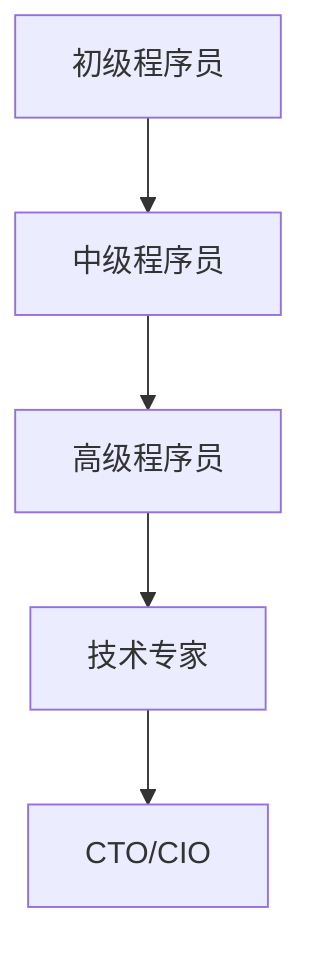

                 

# 《知识经济下程序员的职业发展机遇》

## 关键词
编程语言、技能提升、新兴技术、职业规划、终身学习

## 摘要
本文将探讨知识经济背景下，程序员如何抓住职业发展的机遇。通过分析程序员职业现状，提出提升竞争力的策略，探讨新兴技术领域的机会，以及进行职业规划与创业机会的探讨，帮助程序员在知识经济时代实现个人职业发展。

### 《知识经济下程序员的职业发展机遇》目录大纲

#### 第一部分：知识经济背景与程序员职业现状

**第1章：知识经济的崛起与影响**

**第2章：程序员职业现状分析**

#### 第二部分：提升程序员竞争力的策略

**第3章：终身学习与知识更新**

**第4章：技术技能提升**

**第5章：软技能培养**

#### 第三部分：程序员职业发展机遇

**第6章：新兴技术领域的机会**

**第7章：职业规划与创业机会**

**第8章：案例分析**

#### 第四部分：工具与资源推荐

**第9章：编程工具与资源**

**第10章：在线学习平台与课程推荐**

**第11章：附录**

#### 第一部分：知识经济背景与程序员职业现状

### 第1章：知识经济的崛起与影响

知识经济，作为一个崭新的经济形态，正在全球范围内迅速崛起。其核心在于知识和信息成为推动经济发展的关键因素，而传统的自然资源和劳动力资源逐渐退居次要地位。知识经济的崛起，不仅改变了传统产业的生产方式，也对程序员的职业发展产生了深远影响。

#### 1.1 知识经济的定义与特征

知识经济，是指以知识为主要生产要素，通过知识创新和传播来推动经济增长的一种经济形态。与传统经济相比，知识经济具有以下特征：

1. **知识创新：** 知识经济强调知识的创造、传播和应用，创新成为经济增长的核心动力。
2. **信息化：** 信息技术的发展，使得信息的获取、处理和传递变得更加便捷，信息化成为知识经济的重要特征。
3. **智能化：** 随着人工智能、大数据等技术的应用，知识经济正朝着智能化方向发展。
4. **全球化：** 知识经济突破了地域和国界的限制，全球范围内的知识交流与合作日益频繁。

#### 1.2 知识经济对程序员职业的影响

知识经济的崛起，为程序员职业带来了新的机遇和挑战。具体体现在以下几个方面：

1. **需求增加：** 知识经济背景下，各行业对信息技术和软件的需求日益增加，程序员的工作机会也随之增多。
2. **技能要求提高：** 随着技术的快速发展，程序员需要不断更新自己的知识体系，提高技术水平，以适应新的工作需求。
3. **职业多样：** 知识经济为程序员提供了更多的职业选择，如大数据工程师、人工智能工程师、区块链工程师等。
4. **全球竞争：** 知识经济使得程序员面临全球范围内的竞争，要求程序员具备更高的技术能力和综合素质。

#### 1.3 程序员在知识经济时代的机遇与挑战

在知识经济时代，程序员面临着前所未有的机遇和挑战。如何抓住机遇，应对挑战，实现职业发展，是每一个程序员都需要思考的问题。

**机遇：**

1. **技术革新：** 知识经济的快速发展，带来了新技术、新应用、新模式的不断涌现，为程序员提供了广阔的发展空间。
2. **市场需求：** 各行业对信息技术和软件的需求持续增长，程序员在市场上的地位日益提高。
3. **职业多样化：** 程序员可以从事多种职业，如软件开发、系统架构、项目管理等，实现职业的多样化。

**挑战：**

1. **技能更新：** 技术更新换代速度快，程序员需要不断学习新知识、新技术，以保持竞争力。
2. **全球竞争：** 知识经济时代，程序员面临全球范围内的竞争，需要具备更高的技术水平和综合素质。
3. **职业压力：** 高强度的工作压力和不断更新的技术要求，使得程序员需要具备较强的心理素质和抗压能力。

### 总结

知识经济的崛起，为程序员的职业发展带来了新的机遇和挑战。作为程序员，需要抓住机遇，提升自身竞争力，应对挑战，实现个人职业发展。在知识经济时代，终身学习、技术技能提升、软技能培养，以及职业规划与创业机会，都是程序员需要关注的重点。

----------------------------------------------------------------

#### 第2章：程序员职业现状分析

在知识经济背景下，程序员的职业现状发生了显著变化。本章节将对程序员职业发展的路径、技能需求以及当前的职业现状与趋势进行深入分析，帮助读者全面了解程序员的职业生态。

### 2.1 程序员职业发展路径

程序员的职业发展路径通常可以分为以下几个阶段：

1. **初级程序员（入门阶段）：** 初级程序员通常具备基本的编程技能，能够独立完成简单的软件开发任务。在这个阶段，程序员需要掌握编程语言、开发环境、基本的数据结构和算法等基础知识。

2. **中级程序员（成长阶段）：** 中级程序员具备一定的项目经验，能够承担较为复杂的项目任务。在这个阶段，程序员需要提升编程能力，学习软件工程的方法论，掌握数据库、网络等基础知识。

3. **高级程序员（成熟阶段）：** 高级程序员具备丰富的项目经验，能够独立负责大型项目的开发。在这个阶段，程序员需要具备系统架构设计、项目管理等能力，同时不断学习新技术，提升自身技术水平。

4. **技术专家（专家阶段）：** 技术专家通常在某一领域具有深厚的专业知识，能够解决复杂的技术问题，引领技术发展方向。技术专家不仅需要掌握高级技术，还需要具备较强的沟通协调能力、团队领导力等软技能。

5. **CTO/CIO（领导阶段）：** 作为技术领域的领导者，CTO/CIO需要具备战略规划、团队管理、业务理解等多方面能力，引领公司技术创新和业务发展。

### 2.2 程序员技能需求分析

随着知识经济的深入发展，程序员的技能需求也在不断变化。以下是当前程序员所需的几项关键技能：

1. **编程语言与框架：** 熟练掌握至少一种编程语言，如Java、Python、C++等，同时了解相关的开发框架，如Spring、Django等。

2. **软件工程方法论：** 熟悉软件开发生命周期，掌握敏捷开发、DevOps等现代软件开发方法论，提高开发效率和质量。

3. **数据库与存储技术：** 掌握关系型数据库（如MySQL、Oracle）和非关系型数据库（如MongoDB、Redis）的设计与应用，了解分布式存储技术。

4. **网络与安全性：** 了解网络协议、网络安全基础，掌握加密技术、防火墙等安全措施，确保系统的稳定性和安全性。

5. **人工智能与机器学习：** 了解人工智能和机器学习的基础知识，掌握相关算法和工具，如TensorFlow、PyTorch等。

6. **大数据处理与分析：** 了解大数据处理框架，如Hadoop、Spark，掌握数据挖掘、数据分析等相关技术。

7. **容器化与云计算：** 熟悉容器化技术，如Docker，了解云计算平台，如AWS、Azure、阿里云等。

8. **软件测试与质量保证：** 掌握软件测试方法，如单元测试、集成测试等，确保软件质量。

### 2.3 程序员职业现状与趋势

当前，程序员的职业现状呈现出以下趋势：

1. **市场需求旺盛：** 随着互联网、大数据、人工智能等领域的快速发展，程序员的需求持续增长，尤其是具备新兴技术能力的程序员。

2. **薪资水平提高：** 程序员作为技术人才，其薪资水平普遍较高，特别是在一线城市和互联网公司。

3. **职业发展空间大：** 程序员职业发展路径多样化，从技术专家到企业高管，都有广阔的发展空间。

4. **技能要求不断提高：** 随着技术的快速更新，程序员需要不断学习新技能，保持竞争力。

5. **工作压力较大：** 高强度的工作压力和不断更新的技术要求，使得程序员需要具备较强的心理素质和抗压能力。

### 总结

程序员的职业现状在知识经济背景下发生了显著变化，市场需求旺盛，薪资水平提高，职业发展空间大。然而，技能要求不断提高和工作压力较大也成为程序员面临的重要挑战。作为程序员，需要不断提升自身技能，适应职业发展的变化，抓住机遇，实现个人职业价值。

----------------------------------------------------------------

#### 第3章：终身学习与知识更新

在知识经济时代，技术的快速发展使得程序员必须不断学习新知识、更新技能，以保持竞争力。终身学习成为程序员职业发展的重要保障。本章节将探讨程序员如何保持竞争力，选择合适的学习资源，以及实施终身学习的实践方法。

### 3.1 程序员如何保持竞争力

程序员保持竞争力需要从以下几个方面入手：

1. **跟上技术趋势：** 了解最新的技术趋势和发展方向，掌握新兴技术，如人工智能、区块链、云计算等。

2. **持续学习：** 在职业生涯中不断学习新知识，不仅包括编程语言和技术框架，还包括软件工程、项目管理等软技能。

3. **实践应用：** 将所学知识应用到实际项目中，通过实践提高解决问题的能力。

4. **参与开源社区：** 参与开源项目，与其他开发者交流，提升自己的技术能力和影响力。

5. **专业认证：** 获得专业认证，如Oracle、微软等认证，证明自己的技术实力。

### 3.2 如何选择学习资源

选择合适的学习资源对程序员保持竞争力至关重要。以下是一些推荐的学习资源：

1. **在线课程：** 如Coursera、edX、Udemy等平台提供了丰富的编程和技术课程，涵盖从基础知识到高级专题。

2. **技术博客：** 阅读技术博客，如GitHub、Stack Overflow、Medium等，了解最新的技术动态和行业趋势。

3. **书籍：** 选择高质量的编程书籍，如《代码大全》、《设计模式：可复用面向对象软件的基础》等，系统学习编程思想和技巧。

4. **技术社区：** 加入技术社区，如Reddit、LinkedIn、知乎等，与其他开发者交流，分享经验，拓展视野。

5. **实验室与实战项目：** 通过实验室和实战项目，将理论知识应用到实际中，提高实际操作能力。

### 3.3 终身学习的实践方法

为了实现终身学习，程序员可以采取以下实践方法：

1. **制定学习计划：** 根据自己的职业目标和兴趣，制定详细的学习计划，确保学习目标的实现。

2. **定期复习：** 定期复习所学知识，巩固记忆，避免遗忘。

3. **理论与实践结合：** 将所学知识应用到实际项目中，通过实践加深理解。

4. **分享与交流：** 参与开源项目，撰写技术博客，与他人分享学习经验，提升自己的影响力。

5. **参加培训与会议：** 参加行业培训和技术会议，了解最新的技术发展和行业动态。

### 总结

终身学习是程序员在知识经济时代保持竞争力的关键。通过持续学习、选择合适的学习资源、制定实践方法，程序员可以不断提升自身技能，适应快速变化的技术环境，实现个人职业发展。

----------------------------------------------------------------

#### 第4章：技术技能提升

在知识经济时代，技术技能是程序员职业发展的基石。程序员需要不断掌握新技能，优化技术栈，以提高工作效率和项目质量。本章节将探讨如何通过编程语言与框架、软件开发方法论以及技术栈整合与优化来提升技术技能。

### 4.1 编程语言与框架

编程语言是程序员的基本工具，掌握多种编程语言有助于拓展视野和提升技术水平。以下是一些常见的编程语言和框架：

1. **Java：** Java是一种广泛使用的编程语言，具有跨平台、安全性高、稳定性好等特点。Java广泛应用于企业级应用、Web开发、Android开发等领域。

2. **Python：** Python是一种易于学习的编程语言，广泛应用于数据科学、人工智能、Web开发等领域。Python具有简洁的语法和强大的库支持，适合快速开发。

3. **C++：** C++是一种高性能的编程语言，广泛应用于游戏开发、系统软件、嵌入式系统等领域。C++提供了丰富的模板库和STL，适合复杂系统的开发。

4. **JavaScript：** JavaScript是一种前端开发语言，广泛应用于Web应用开发。JavaScript与HTML和CSS结合，可以实现丰富的交互效果。

5. **Spring Boot：** Spring Boot是一种流行的Java框架，简化了Spring应用程序的配置和部署。Spring Boot具有快速开发、易于扩展、易于测试等特点。

6. **Django：** Django是一种Python Web框架，强调快速开发和可扩展性。Django提供了丰富的内置功能和模块，适合快速开发Web应用。

7. **React：** React是一种用于构建用户界面的JavaScript库，具有高效、灵活、可复用的特点。React广泛应用于单页应用、组件化开发等领域。

### 4.2 软件开发方法论

软件开发方法论是指导软件开发过程的重要工具。以下是一些常见的软件开发方法论：

1. **瀑布模型：** 瀑布模型是一种线性顺序的开发方法，将软件开发过程划分为需求分析、设计、编码、测试等阶段。瀑布模型强调文档和阶段性的交付。

2. **敏捷开发：** 敏捷开发强调迭代和增量开发，以快速响应需求变化。敏捷开发包括Scrum、看板（Kanban）、极限编程（XP）等具体实践。

3. **DevOps：** DevOps是一种软件开发和运维的集成方法，强调开发、测试、运维等环节的协同工作。DevOps有助于提高软件交付速度和质量。

4. **微服务架构：** 微服务架构将大型系统拆分为多个小型、独立的服务，每个服务负责一个特定的业务功能。微服务架构提高了系统的可扩展性和可维护性。

### 4.3 技术栈整合与优化

技术栈整合与优化是提升程序员技术技能的重要手段。以下是一些技术栈整合与优化的方法：

1. **技术栈选择：** 根据项目需求和团队经验，选择合适的技术栈。技术栈的选择应考虑性能、安全性、可维护性等因素。

2. **工具集成：** 利用集成开发环境（IDE）、代码管理工具（如Git）、持续集成/持续部署（CI/CD）工具等，提高开发效率和代码质量。

3. **代码优化：** 通过代码审查、静态代码分析、性能测试等方法，优化代码质量和性能。

4. **模块化与组件化：** 将系统划分为多个模块或组件，实现模块间的高内聚、低耦合，提高系统的可维护性和可扩展性。

5. **自动化测试：** 通过自动化测试，确保代码质量和功能完整性，减少手工测试的工作量。

### 总结

技术技能的提升是程序员职业发展的关键。通过掌握多种编程语言与框架、采用合适的软件开发方法论以及整合与优化技术栈，程序员可以提升工作效率和项目质量，实现个人职业发展。在不断变化的技术环境中，持续学习和技能提升是程序员保持竞争力的核心。

----------------------------------------------------------------

#### 第5章：软技能培养

在知识经济时代，程序员不仅需要具备扎实的技术技能，还需要具备一系列软技能，以提高工作效率和团队协作能力。本章节将探讨通信与协作能力、项目管理与领导力，以及创新思维与解决问题的能力，帮助程序员在职业发展中更加出色。

### 5.1 通信与协作能力

良好的通信与协作能力是程序员在工作中取得成功的重要因素。以下是一些提升通信与协作能力的建议：

1. **清晰表达：** 提高自己的表达能力和沟通技巧，确保团队成员能够准确理解你的意图和需求。

2. **倾听能力：** 倾听是沟通的基础，通过倾听团队成员的意见和反馈，能够更好地理解问题和需求。

3. **跨部门协作：** 在大型项目中，程序员需要与不同部门的同事协作，如产品经理、UI设计师、测试人员等。跨部门协作要求程序员具备良好的团队合作精神。

4. **远程协作：** 在远程工作环境中，程序员需要熟练使用各种协作工具，如Slack、Zoom、Trello等，以提高工作效率。

5. **冲突管理：** 在团队合作中，难免会出现意见不合和冲突。程序员需要学会妥善处理冲突，通过沟通和协商解决问题。

### 5.2 项目管理与领导力

项目管理和领导力是程序员在职业生涯中提升的重要软技能。以下是一些提升项目管理与领导力的建议：

1. **目标设定：** 在项目启动阶段，明确项目目标，确保团队成员对项目目标有清晰的认识。

2. **时间管理：** 合理安排项目时间，确保项目按时交付。使用项目管理工具，如Jira、Trello等，跟踪项目进度。

3. **风险管理：** 识别项目风险，制定相应的风险应对策略，降低项目风险。

4. **团队激励：** 激发团队成员的积极性和创造力，通过奖励机制和团队活动提高团队凝聚力。

5. **决策能力：** 在项目执行过程中，遇到问题时，需要快速做出决策。通过分析问题、权衡利弊，做出最佳决策。

### 5.3 创新思维与解决问题的能力

创新思维和解决问题的能力是程序员在技术领域中脱颖而出的关键。以下是一些提升创新思维与解决问题的能力的建议：

1. **思维模式：** 尝试从不同角度看待问题，运用逆向思维、发散思维等创新思维模式，寻找解决方案。

2. **问题分析：** 在解决问题时，首先分析问题的根本原因，而不是仅仅解决表面问题。

3. **经验积累：** 通过参与不同的项目和挑战，积累丰富的经验，提高解决问题的能力。

4. **学习与研究：** 不断学习新的知识和技能，关注行业动态，提高自身的技术视野。

5. **跨学科学习：** 跨学科学习能够帮助程序员从不同领域获得灵感，提高创新思维。

### 总结

软技能的培养是程序员职业发展的重要组成部分。通过提升通信与协作能力、项目管理与领导力，以及创新思维与解决问题的能力，程序员可以在工作中更加出色，实现个人职业价值。在不断变化的技术环境中，软技能的提升是程序员保持竞争力的关键。

----------------------------------------------------------------

#### 第6章：新兴技术领域的机会

在知识经济时代，新兴技术领域不断涌现，为程序员提供了丰富的职业发展机会。本章节将探讨人工智能与机器学习、区块链技术、云计算与大数据等新兴技术领域的机会，以及程序员如何抓住这些机会。

### 6.1 人工智能与机器学习

人工智能（AI）与机器学习（ML）是当前最为热门的技术领域之一。随着AI技术的不断发展，其应用领域也在不断扩展，从智能助手、自动驾驶到医疗诊断、金融风控等。以下是人工智能与机器学习领域的一些机会：

1. **算法工程师：** 算法工程师是AI领域的关键角色，负责研发和优化机器学习算法，提高模型性能。

2. **数据科学家：** 数据科学家负责处理和分析大量数据，利用机器学习技术提取有价值的信息，为业务决策提供支持。

3. **自然语言处理（NLP）工程师：** NLP工程师专注于开发能够理解和生成自然语言的AI系统，如聊天机器人、语音识别等。

4. **计算机视觉工程师：** 计算机视觉工程师致力于开发能够理解和解释视觉数据的AI系统，如图像识别、视频分析等。

5. **AI产品经理：** AI产品经理负责规划和推动AI产品的研发和落地，确保产品符合市场需求。

### 6.2 区块链技术

区块链技术是一种分布式数据库技术，具有去中心化、安全性高、不可篡改等特点。随着区块链技术的成熟和应用场景的拓展，程序员在区块链领域也有许多职业机会：

1. **区块链开发工程师：** 负责区块链平台的开发、测试和优化，实现区块链网络的稳定运行。

2. **智能合约工程师：** 智能合约是基于区块链的自动化合同，智能合约工程师负责开发和管理智能合约。

3. **区块链产品经理：** 区块链产品经理负责区块链产品的规划、设计和推广，确保产品符合市场需求。

4. **区块链安全专家：** 区块链安全专家负责区块链系统的安全防护，防范各种安全威胁。

5. **区块链咨询师：** 区块链咨询师为企业提供区块链解决方案，帮助企业实现数字化转型。

### 6.3 云计算与大数据

云计算与大数据是现代信息技术的重要组成部分，为程序员提供了广阔的职业发展空间。以下是一些云计算与大数据领域的机会：

1. **云计算工程师：** 负责云计算平台的搭建、运维和管理，确保平台的稳定性和安全性。

2. **大数据工程师：** 大数据工程师负责大数据系统的设计、开发和优化，实现海量数据的处理和分析。

3. **数据仓库工程师：** 数据仓库工程师负责设计和管理数据仓库，为企业的数据分析和决策提供支持。

4. **人工智能与大数据工程师：** 结合人工智能和大数据技术，开发智能化的数据分析系统，为企业提供深度洞察。

5. **云计算产品经理：** 云计算产品经理负责云计算产品的规划、设计和推广，确保产品符合市场需求。

### 如何抓住新兴技术领域的机会

1. **学习新技术：** 不断学习新兴技术，了解其原理和应用场景，掌握相关工具和框架。

2. **实践项目：** 通过参与实际项目，将所学知识应用到实践中，提高实际操作能力。

3. **参与社区：** 加入相关技术社区，与其他开发者交流，分享经验和知识，拓宽视野。

4. **持续学习：** 技术发展迅速，程序员需要持续学习，保持竞争力。

5. **职业规划：** 制定个人职业规划，明确自己的发展方向和目标，有针对性地提升技能。

### 总结

新兴技术领域为程序员提供了丰富的职业发展机会。通过学习新技术、实践项目、参与社区和持续学习，程序员可以抓住这些机会，实现个人职业价值。

----------------------------------------------------------------

#### 第7章：职业规划与创业机会

在知识经济时代，程序员不仅可以在大公司和行业领先的创业公司找到职业发展机会，还可以通过职业规划与创业路径实现自己的职业理想。本章节将探讨如何进行职业规划与创业机会的探讨，包括个人品牌建设、职业转型与晋升策略，以及创业路径与风险控制。

### 7.1 个人品牌建设

个人品牌建设是程序员在职业发展中的一项重要任务。一个强大的个人品牌可以帮助程序员在职场中脱颖而出，获得更多的机会和资源。以下是一些个人品牌建设的策略：

1. **技术博客与文章：** 撰写高质量的技术博客和文章，分享自己的经验和见解，树立自己在技术领域的专业形象。

2. **开源项目：** 参与开源项目，贡献代码，提升自己的技术能力和影响力。开源项目是展示个人技术实力的重要平台。

3. **技术社区活跃：** 在技术社区（如GitHub、Stack Overflow、Reddit等）积极参与讨论，解答问题，展示自己的专业素养。

4. **社交媒体：** 利用社交媒体（如LinkedIn、Twitter等）建立个人品牌，发布技术动态、分享学习心得，吸引关注。

5. **专业认证：** 获得专业认证，如Oracle、微软、AWS等认证，证明自己的技术能力和专业知识。

### 7.2 职业转型与晋升策略

随着技术的发展和个人兴趣的变化，程序员可能会考虑职业转型或晋升。以下是一些职业转型与晋升的策略：

1. **持续学习：** 不断学习新的技术和知识，适应行业变化，提升自己的竞争力。

2. **明确目标：** 确定自己的职业目标和方向，有针对性地提升技能和经验。

3. **职业规划：** 制定详细的职业规划，包括短期和长期目标，逐步实现职业发展。

4. **拓宽视野：** 参与不同的项目和工作，积累多样化的工作经验，提升综合素质。

5. **建立人脉：** 拓展人脉，与行业内的专业人士建立联系，获取更多的职业机会和资源。

### 7.3 创业路径与风险控制

对于有创业梦想的程序员来说，创业路径和风险控制是关键。以下是一些创业路径和风险控制的建议：

1. **市场调研：** 在创业之前，进行充分的市场调研，了解目标市场和潜在竞争对手，为创业项目做好准备。

2. **产品定位：** 确定创业项目的产品定位和目标用户，确保产品能够满足市场需求。

3. **团队建设：** 组建一支具备专业能力和协作精神的团队，共同推动创业项目的发展。

4. **资金管理：** 合理规划资金，确保创业项目的可持续发展。

5. **风险管理：** 识别创业过程中的风险，制定相应的风险应对策略，降低创业风险。

6. **持续迭代：** 根据市场需求和用户反馈，持续迭代产品，优化用户体验。

### 如何进行职业规划与创业机会的探讨

1. **自我评估：** 了解自己的兴趣、优势和职业目标，为职业规划和创业机会提供基础。

2. **行业研究：** 研究所在行业的发展趋势和市场需求，为职业规划提供参考。

3. **技能提升：** 根据职业规划和创业需求，有针对性地提升技术和软技能。

4. **网络建设：** 拓展人脉，建立行业联系，获取更多的职业和创业机会。

5. **实践探索：** 通过实际项目和创业实践，积累经验，验证想法。

### 总结

职业规划与创业机会是程序员实现职业发展的关键。通过个人品牌建设、职业转型与晋升策略，以及创业路径与风险控制，程序员可以更好地规划自己的职业道路，实现个人价值和创业梦想。

----------------------------------------------------------------

#### 第8章：案例分析

在知识经济时代，程序员的职业发展路径多种多样。本章节将通过成功程序员的职业发展故事、程序员创业案例分析，以及失败案例的启示，为程序员提供宝贵的经验和教训。

### 8.1 成功程序员的职业发展故事

1. **李华：从初级程序员到技术总监**
   李华毕业于一所普通大学，最初在一家小型互联网公司担任初级程序员。在工作中，他不断学习新技术，积累了丰富的项目经验。五年后，他成功晋升为技术总监，带领团队完成了多个大型项目。

2. **王强：从开源项目贡献者到创业公司CTO**
   王强是一名开源项目贡献者，他在GitHub上分享了自己的代码和经验。随着影响力的增加，他被一家初创公司聘请为CTO，负责技术架构和团队建设。在创业公司工作的过程中，他积累了丰富的创业经验。

3. **赵敏：从数据分析师到人工智能工程师**
   赵敏在一家大型企业担任数据分析师，她在工作中逐渐对人工智能产生了兴趣。通过参加在线课程和参加行业会议，她成功转型为人工智能工程师，专注于人工智能算法的研发和应用。

### 8.2 程序员创业案例分析

1. **小张的创业之路：从零开始打造AI助手**
   小张是一名有志于人工智能的程序员，他决定辞职创业。他首先进行了市场调研，发现智能助手是一个有潜力的领域。于是，他组建了一个团队，开发了一个人工智能助手产品。在经过多次迭代和优化后，产品得到了市场的认可。

2. **小李的创业尝试：区块链游戏平台**
   小李在区块链技术领域积累了丰富的经验，他决定创业，打造一个基于区块链的游戏平台。在项目启动阶段，他面临资金和团队组建的挑战。然而，通过不断地调整战略和优化产品，他最终成功吸引了投资者，实现了商业化的目标。

### 8.3 失败案例的启示

1. **张伟的创业失败：缺乏市场调研**
   张伟是一名有多年经验的程序员，他决定创业开发一款智能家居系统。然而，在项目启动阶段，他未能进行充分的市场调研，导致产品与市场需求脱节。最终，由于销售不佳，项目被迫终止。

2. **李明的创业失败：资金管理不善**
   李明是一名数据分析师，他创业开发了一个大数据分析平台。然而，由于他在资金管理方面存在问题，导致项目资金链断裂。最终，项目无法继续，李明不得不选择放弃。

### 总结

通过分析成功程序员的职业发展故事和创业案例，我们可以看到，职业规划和创业机会的把握对于程序员的职业发展至关重要。同时，失败案例也为我们提供了宝贵的教训，帮助我们避免在职业发展过程中犯同样的错误。程序员应当结合自身情况，借鉴成功经验，吸取教训，不断优化自己的职业发展路径。

----------------------------------------------------------------

#### 第四部分：工具与资源推荐

在知识经济时代，程序员需要掌握大量工具和资源来提升工作效率和学习效果。本章节将推荐一些编程工具与资源，包括开发环境搭建、版本控制工具、代码质量分析工具，以及在线学习平台与课程推荐。

### 9.1 编程工具与资源

**开发环境搭建：**

1. **集成开发环境（IDE）：**
   - **Visual Studio Code：** 跨平台、轻量级IDE，支持多种编程语言。
   - **IntelliJ IDEA：** 强大的Java IDE，提供智能编码辅助和调试功能。
   - **PyCharm：** 专业的Python IDE，支持多种Python框架。

2. **版本控制工具：**
   - **Git：** 最流行的版本控制工具，支持分布式版本控制和分支管理。
   - **GitHub：** Git的在线托管平台，支持代码共享、协作开发和项目跟踪。

3. **代码质量分析工具：**
   - **SonarQube：** 代码质量平台，提供静态代码分析、漏洞检测等功能。
   - **Checkstyle：** Java代码风格检查工具，确保代码符合编码规范。

### 9.2 在线学习平台与课程推荐

**在线学习平台：**

1. **Coursera：** 提供大量高质量的课程，涵盖计算机科学、数据科学、人工智能等多个领域。
2. **edX：** 由哈佛大学和麻省理工学院共同创办，提供丰富的在线课程。
3. **Udemy：** 提供多样化的课程，包括编程语言、软件工程、数据分析等。

**推荐课程：**

1. **《机器学习基础》：** 从基础知识开始，深入探讨机器学习算法和应用。
2. **《Web全栈开发》：** 涵盖前端、后端和数据库开发，帮助程序员掌握全栈技能。
3. **《区块链基础》：** 探讨区块链技术的基本原理和应用场景。

### 9.3 学习资源与社区

**学习资源：**

1. **技术博客：**
   - **GitHub：** 许多程序员在GitHub上分享代码和文章，是学习编程技巧的好去处。
   - **Stack Overflow：** 提供编程问题的问答社区，帮助程序员解决技术难题。

2. **技术社区：**
   - **Reddit：** 许多技术主题的讨论区，可以与其他开发者交流。
   - **LinkedIn：** 可以关注行业专家和公司，了解行业动态和职业机会。

### 总结

通过掌握合适的编程工具和资源，程序员可以大幅提升工作效率和学习效果。开发环境搭建、版本控制工具、代码质量分析工具，以及在线学习平台和课程推荐，都是程序员在知识经济时代必备的工具和资源。合理利用这些工具和资源，可以帮助程序员在快速变化的技术环境中保持竞争力。

----------------------------------------------------------------

### 附录 A：Mermaid 流程图

Mermaid 是一种简单易用的 Markdown 图形绘制语言，适用于绘制流程图、序列图、类图等。以下是一个简单的 Mermaid 流程图示例，用于展示程序员职业发展路径：



在这幅流程图中，我们从初级程序员开始，通过不断学习和积累经验，逐步晋升到中级、高级程序员，最终成为技术专家，甚至CTO/CIO。

### 附录 B：核心算法原理讲解

为了更深入地理解机器学习算法，以下是一个简化的线性回归算法的伪代码示例。线性回归是一种用于预测数值变量的统计方法，通过拟合一条直线来描述数据点之间的关系。

```python
# 线性回归伪代码

# 参数初始化
w = [0, 0]  # 权重向量
b = 0       # 偏置

# 梯度下降法优化权重
for i in range(epochs):
    # 计算损失函数
    loss = 0
    for (x, y) in data:
        y_pred = w[0] * x + w[1] * x + b
        loss += (y_pred - y) ** 2

    # 计算梯度
    dw = [0, 0]
    db = 0
    for (x, y) in data:
        y_pred = w[0] * x + w[1] * x + b
        dw[0] += 2 * (y_pred - y) * x
        dw[1] += 2 * (y_pred - y) * x
        db += 2 * (y_pred - y)

    # 更新权重
    w[0] -= learning_rate * dw[0]
    w[1] -= learning_rate * dw[1]
    b -= learning_rate * db

    # 输出最终权重
print(w, b)
```

在这个伪代码中，我们通过梯度下降法优化线性回归模型的权重和偏置。`epochs`表示训练迭代次数，`learning_rate`表示学习率。在每次迭代中，我们计算损失函数并计算权重和偏置的梯度，然后更新权重以最小化损失。

### 附录 C：数学模型和数学公式

在机器学习中，理解相关的数学模型和公式是非常重要的。以下是一些常用的数学公式，以 LaTeX 格式表示：

```latex
% 线性回归损失函数
J(w) = \frac{1}{2m} \sum_{i=1}^{m} (h_{\theta}(x^{(i)}) - y^{(i)})^2

% 梯度下降更新规则
\theta_j := \theta_j - \alpha \frac{1}{m} \sum_{i=1}^{m} (h_{\theta}(x^{(i)}) - y^{(i)}) \cdot x_j^{(i)}

% 感知机更新规则
\theta := \theta + \eta \cdot (y \cdot x)
```

其中，`m`表示样本数量，`x`表示输入特征，`y`表示目标值，`h_{\theta}(x)`表示预测值，`\theta`表示权重，`\alpha`表示学习率，`\eta`表示学习率。

### 附录 D：项目实战

为了更好地理解编程和机器学习的实际应用，以下是一个简单的 Python 代码案例，用于实现线性回归模型的训练和预测功能。

```python
# 线性回归实战

import numpy as np

# 训练数据
X = np.array([[1, 2], [2, 3], [3, 4], [4, 5]])
y = np.array([2, 3, 4, 5])

# 参数初始化
w = np.zeros((2, 1))
b = 0
learning_rate = 0.01
epochs = 1000

# 梯度下降法训练模型
for epoch in range(epochs):
    # 前向传播
    y_pred = np.dot(X, w) + b

    # 计算损失函数
    loss = 0.5 * np.mean((y_pred - y) ** 2)

    # 计算梯度
    dw = np.dot(X.T, (y_pred - y))
    db = np.sum(y_pred - y)

    # 更新权重
    w -= learning_rate * dw
    b -= learning_rate * db

    # 打印当前损失
    if epoch % 100 == 0:
        print(f"Epoch {epoch}: Loss = {loss}")

# 模型预测
X_test = np.array([[5, 6]])
y_pred = np.dot(X_test, w) + b
print(f"Predicted value: {y_pred[0, 0]}")
```

在这个案例中，我们使用梯度下降法训练一个线性回归模型，并通过训练数据和测试数据评估模型性能。最终，我们使用训练好的模型对新的数据进行预测。

### 附录 E：软技能培养实践

在编程和软件开发过程中，软技能同样至关重要。以下是一个实践案例，用于培养沟通与协作能力。

**案例：项目会议记录**

**会议目的：** 讨论项目进度、解决技术难题、分配任务。

**参与者：** 项目经理、产品经理、开发人员、测试人员。

**实践步骤：**

1. **会议准备：**
   - 确定会议时间和地点。
   - 发送会议通知，附上会议议程和参考资料。

2. **会议开始：**
   - 项目经理开场，介绍会议议程。
   - 产品经理汇报项目进度和需求变更。
   - 开发人员分享技术难题和解决方案。

3. **讨论与决策：**
   - 团队成员就讨论的话题进行交流和讨论。
   - 项目经理汇总讨论结果，作出决策。

4. **任务分配：**
   - 根据讨论结果，分配任务给相关团队成员。

5. **会议总结：**
   - 项目经理总结会议成果，确保团队成员明确任务和目标。

6. **会议记录：**
   - 归纳会议讨论内容，形成会议记录。

通过这样的实践，团队成员可以培养沟通与协作能力，确保项目顺利进行。

### 附录 F：技术技能提升实例

为了提升技术技能，以下是一个基于 Flask 框架的 Web 开发实例。

**案例：创建一个简单的 Flask 应用程序**

```python
# Flask Web 应用程序

from flask import Flask, request, render_template

app = Flask(__name__)

@app.route('/')
def home():
    return render_template('home.html')

@app.route('/hello', methods=['GET', 'POST'])
def hello():
    if request.method == 'POST':
        name = request.form['name']
        return f"Hello, {name}!"
    else:
        return render_template('hello.html')

if __name__ == '__main__':
    app.run(debug=True)
```

在这个实例中，我们创建了一个简单的 Flask 应用程序，包括两个路由：首页和问候页。通过这个实例，我们可以学习如何使用 Flask 框架快速搭建 Web 应用程序。

### 附录 G：新兴技术领域学习资源

**人工智能学习资源：**
- **Coursera：** 《机器学习》（吴恩达）课程。
- **Udacity：** 《人工智能纳米学位》。

**区块链技术学习资源：**
- **Coursera：** 《区块链技术》（康奈尔大学）课程。
- **edX：** 《区块链和智能合约》课程。

**云计算与大数据学习资源：**
- **Coursera：** 《云计算基础》（亚马逊网络服务）课程。
- **Udemy：** 《大数据 Hadoop 和 Spark》课程。

这些学习资源涵盖了人工智能、区块链技术和云计算与大数据领域的核心知识和技能，帮助程序员深入了解和掌握相关技术。

### 总结

通过附录中的工具、算法、数学公式、代码案例和软技能实践，程序员可以全面提升自己的技术水平和软技能。附录部分不仅提供了丰富的学习资源，还通过具体的实例和实践指导，帮助程序员在技术领域取得更大的进步。

----------------------------------------------------------------

### 作者

作者：AI天才研究院/AI Genius Institute & 禅与计算机程序设计艺术 /Zen And The Art of Computer Programming

本文旨在探讨知识经济背景下程序员的职业发展机遇，通过分析程序员职业现状、提升竞争力的策略、新兴技术领域的机会以及职业规划与创业机会，帮助程序员在知识经济时代实现个人职业发展。作者结合多年的行业经验和深入的技术研究，旨在为程序员提供实用的指导和有价值的见解。希望通过本文，读者能够更好地把握职业发展的方向，提升自身技能，实现个人价值。

----------------------------------------------------------------

## 结语

在知识经济时代，程序员的职业发展面临着前所未有的机遇与挑战。本文通过深入分析程序员职业现状、提升竞争力的策略、新兴技术领域的机会以及职业规划与创业机会，为程序员提供了全面的职业发展指南。同时，通过附录部分提供的工具、算法、数学公式和代码案例，帮助程序员在技术领域取得更大进步。

在快速变化的技术环境中，持续学习和技能提升是程序员保持竞争力的关键。希望读者能够结合自身实际情况，借鉴本文中的建议和实践，不断提升自己的技术水平和软技能，实现个人职业发展。

最后，感谢您的阅读，期待与您在技术领域共同成长。如果您有任何建议或疑问，欢迎在评论区留言交流。祝您在编程和职业发展的道路上越走越远！
<|im_end|>

