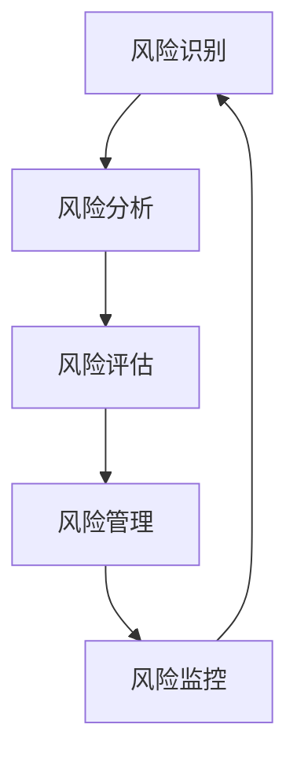
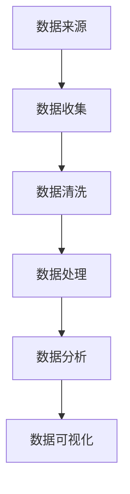
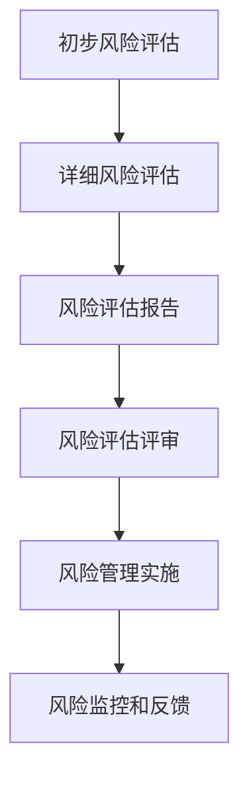
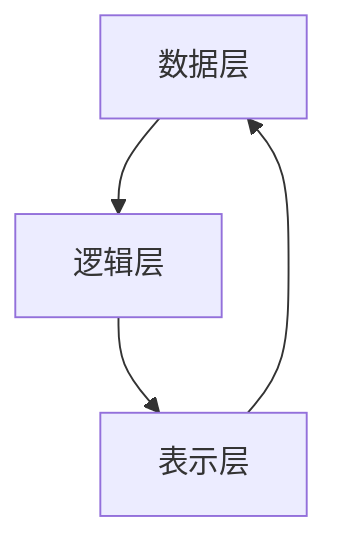

                 

### 第1章：科研风险评估的重要性

#### 1.1 科研风险评估的定义与作用

科研风险评估（Research Risk Assessment, RRA）是科学研究过程中不可或缺的一环，旨在通过系统性的方法识别、分析和评价科研活动中潜在的风险，以减少科研活动的负面影响。具体来说，科研风险评估定义如下：

**定义：** 科研风险评估是指通过一系列系统化的方法和工具，识别科研过程中可能存在的风险，分析风险的可能性和影响，评价风险，并采取相应的管理措施以降低风险的过程。

科研风险评估的作用主要体现在以下几个方面：

1. **风险预防与控制：** 通过评估科研活动的潜在风险，研究者可以提前识别可能的风险点，采取预防措施，从而降低风险的发生概率和影响程度。
2. **资源优化配置：** 科研风险评估有助于科研机构和决策者更合理地分配资源，确保资源用于高风险领域的科学研究和安全措施上。
3. **提高科研透明度：** 科研风险评估过程提高了科研活动的透明度，使得科研过程更加规范和严谨，有助于提升科研诚信和社会公信力。
4. **增强科研安全性和可持续性：** 科研风险评估有助于保障科研活动的安全性，降低由于风险事件导致的科研中断和损失，从而提高科研的可持续性。

#### 1.2 当前科研风险评估面临的挑战

尽管科研风险评估的重要性已被广泛认可，但当前在科研风险评估过程中仍面临诸多挑战：

1. **风险识别困难：** 科研活动的复杂性和不确定性使得风险识别变得异常困难，特别是那些潜在的、间接的风险更难以被及时发现。
2. **风险评估方法不足：** 目前常见的风险评估方法往往适用于特定的领域和场景，缺乏普适性。同时，部分方法过于理论化，难以在实际科研活动中得到有效应用。
3. **评估标准和规范缺失：** 科研风险评估缺乏统一的评估标准和规范，导致不同领域、不同机构之间的风险评估结果难以进行比较和交流。
4. **风险管理措施不力：** 科研风险评估往往注重风险的识别和评估，而对如何采取有效的风险管理措施关注不够，导致评估结果难以真正落地实施。

#### 1.3 研究目的与结构概述

本文的研究目的在于探讨一种新的科研风险评估方法论，旨在平衡知识探索与潜在危害之间的关系，为科研工作者和决策者提供科学、系统、可操作的风险评估框架和方法。

文章结构概述如下：

- **第一部分：引言与背景**，介绍科研风险评估的重要性及当前面临的挑战。
- **第二部分：核心概念与联系**，阐述科研风险评估的核心概念和联系，并提供相关流程图。
- **第三部分：核心算法原理讲解**，详细讲解科研风险评估算法的基础和原理。
- **第四部分：数学模型和数学公式讲解**，介绍科研风险评估中的数学模型和公式，并进行举例说明。
- **第五部分：项目实战**，通过实际案例展示科研风险评估的应用和效果。
- **第六部分：开发环境与代码解读**，提供风险评估系统的开发环境和源代码实现。
- **第七部分：总结与展望**，总结研究成果并对未来研究方向进行展望。

通过本文的研究，我们希望能够为科研风险评估领域提供新的思路和方法，为科研活动的顺利进行和科技创新提供有力支持。

---

**本文关键词：** 科研风险评估、风险识别、风险评估方法、风险评估框架、数学模型

**本文摘要：** 本文针对当前科研风险评估面临的挑战，提出了一种新的科研风险评估方法论，通过系统化的风险评估框架和算法，旨在平衡知识探索与潜在危害之间的关系，为科研工作者和决策者提供科学、系统、可操作的风险评估方法和工具。文章结构包括引言与背景、核心概念与联系、核心算法原理讲解、数学模型和数学公式讲解、项目实战、开发环境与代码解读以及总结与展望等部分。

---

在接下来的章节中，我们将进一步深入探讨科研风险评估的核心概念、架构和方法，以期为科研工作者提供更全面、深入的理论和实践指导。希望读者在阅读过程中能够积极参与思考，提出宝贵意见和建议，共同推动科研风险评估领域的创新发展。

### 第2章：科研风险评估的核心概念

在深入探讨科研风险评估之前，了解其核心概念至关重要。这些核心概念不仅为风险评估提供了理论基础，同时也帮助我们更好地理解和应用各种风险评估方法。

#### 2.1 知识探索与潜在危害的关系

科研活动本质上是一种探索未知、追求新知的活动。然而，这一过程中不仅涉及到知识的积累和创新，还伴随着潜在危害的存在。知识探索与潜在危害之间的关系主要体现在以下几个方面：

1. **探索与风险并存：** 科研活动中的知识探索往往需要采用新的方法、技术和设备，这些创新性手段可能带来前所未有的风险。例如，基因编辑技术虽然在医学领域具有巨大潜力，但也可能引发伦理和安全问题。
2. **未知与不确定性：** 科研过程中的未知因素和不确定性是导致潜在危害的重要原因。许多科学发现和技术的突破最初都是基于假设和推测，而这些假设和推测在实验验证过程中可能会出现偏差，导致风险。
3. **创新与风险交织：** 创新是科研活动的重要驱动力，但创新往往伴随着未知风险。新的研究方法和技术的应用可能会带来新的风险，例如实验过程中的意外事故、实验结果的不可预测性等。

理解知识探索与潜在危害之间的关系，有助于科研工作者在开展研究时更加谨慎和理性，以降低风险的发生概率和影响程度。

#### 2.2 常见科研风险类型

在科研活动中，常见风险类型主要包括以下几个方面：

1. **技术风险：** 技术风险主要涉及科研过程中使用的实验方法、技术手段和设备等。例如，实验室设备故障、实验数据不准确、实验设计不合理等可能导致实验失败或结果偏差。
2. **数据风险：** 数据风险包括数据收集、处理、分析和存储过程中可能出现的各种问题。例如，数据缺失、数据偏差、数据隐私泄露等。
3. **伦理风险：** 伦理风险涉及科研活动中的伦理问题，如人体实验、动物实验的伦理审查、基因编辑的伦理争议等。这些风险不仅影响科研的合法性，还可能对参与者和社会产生负面影响。
4. **安全风险：** 安全风险主要涉及实验室安全、生物安全、网络安全等方面。例如，实验室事故、生物样本泄漏、计算机系统受到网络攻击等。
5. **管理风险：** 管理风险包括科研项目管理、资源配置、团队协作等方面的问题。例如，项目计划不周、资源不足、沟通不畅等可能导致项目进展受阻。

了解常见科研风险类型，有助于科研工作者在项目规划和实施过程中采取针对性的预防和控制措施。

#### 2.3 风险评估模型与方法

为了有效识别和评估科研风险，需要运用各种风险评估模型和方法。以下是几种常见风险评估模型和方法：

1. **定量风险评估模型：** 定量风险评估模型通过数学和统计分析方法，对科研风险进行定量评估。常见的方法包括蒙特卡洛模拟、风险矩阵分析等。这些方法能够提供具体的风险数值，帮助决策者更直观地了解风险程度。
2. **定性风险评估模型：** 定性风险评估模型主要通过专家意见、历史数据和案例研究等方法进行风险评估。常见的定性方法包括专家评估法、情景分析法、故障树分析等。这些方法适用于复杂系统的风险评估，特别是在数据不足或不确定性较高的情况下。
3. **组合风险评估模型：** 组合风险评估模型结合定量和定性方法，通过不同方法的优势互补，提高风险评估的准确性和全面性。例如，风险矩阵法结合蒙特卡洛模拟，既考虑了风险的可能性，又评估了风险的影响程度。
4. **基于人工智能的风险评估模型：** 随着人工智能技术的发展，越来越多的研究者开始将人工智能方法应用于风险评估。例如，利用机器学习算法对大量历史数据进行分析，预测未来可能发生的风险事件。这些方法具有较高的预测准确性和自适应能力，但同时也需要大量数据支持和算法优化。

了解和运用各种风险评估模型和方法，有助于科研工作者在实际项目中更全面、准确地识别和评估风险，从而采取有效的风险管理措施。

#### 总结

科研风险评估的核心概念包括知识探索与潜在危害的关系、常见科研风险类型以及风险评估模型和方法。通过理解和应用这些核心概念和方法，科研工作者可以更有效地识别和评估科研风险，保障科研活动的顺利进行。在下一章中，我们将进一步探讨科研风险评估的整体架构，以帮助读者更好地理解这一复杂但至关重要的过程。

---

**本文关键词：** 科研风险评估、知识探索、潜在危害、风险评估模型、风险评估方法

**本文摘要：** 本章介绍了科研风险评估的核心概念，包括知识探索与潜在危害的关系、常见科研风险类型以及风险评估模型和方法。通过理解这些核心概念，科研工作者可以更有效地识别和评估科研风险，保障科研活动的顺利进行。在下一章中，我们将进一步探讨科研风险评估的整体架构。

---

在接下来的章节中，我们将继续深入探讨科研风险评估的架构和流程，帮助读者建立系统化的风险评估思维。希望读者在阅读过程中能够积极思考和反馈，共同推动科研风险评估领域的进步。

### 第3章：科研风险评估架构

在理解了科研风险评估的核心概念之后，下一步是构建一个系统化的风险评估架构。这一架构不仅涵盖了风险评估的各个方面，还为实际操作提供了清晰的指南。一个完整的科研风险评估架构通常包括风险评估框架、数据收集与分析、以及风险评估流程。

#### 3.1 风险评估框架概述

科研风险评估框架是整个评估过程的骨架，它将各种风险评估方法有机地结合起来，确保评估过程的系统性和完整性。一个典型的风险评估框架通常包含以下几个关键组成部分：

1. **风险识别**：这是评估过程的第一步，旨在识别科研项目中可能存在的风险。风险识别可以通过多种方法进行，如专家访谈、历史数据分析、文献调研等。
2. **风险分析**：在风险识别的基础上，风险分析进一步评估已识别风险的性质、可能性和影响。常用的风险分析工具包括风险矩阵、故障树分析等。
3. **风险评估**：风险评估是对风险的可能性和影响进行量化和综合评价的过程。这一步骤通常使用定量和定性方法，如风险矩阵法、蒙特卡洛模拟等。
4. **风险管理**：根据风险评估的结果，制定和实施风险管理策略，以降低风险的发生概率和影响程度。风险管理包括风险规避、风险转移、风险减轻等策略。
5. **风险监控**：在风险管理策略实施后，持续监控风险的变化和项目进展，确保风险管理措施的有效性。风险监控通常通过定期评估和调整风险管理策略实现。

**Mermaid 流程图：**



这个流程图展示了风险评估框架的基本结构和各个步骤之间的关系。

#### 3.2 数据收集与分析

数据收集与分析是科研风险评估的关键环节，其质量直接影响风险评估的准确性。以下是数据收集与分析的几个关键步骤：

1. **数据来源**：数据来源包括历史数据、专家意见、文献资料、实验室记录等。选择合适的数据来源可以确保评估的全面性和准确性。
2. **数据收集方法**：常用的数据收集方法包括问卷调查、访谈、实验记录、文献检索等。每种方法都有其优缺点，需要根据评估对象的特点选择合适的方法。
3. **数据清洗与处理**：收集到的数据往往包含噪声和错误，需要进行清洗和处理。数据清洗包括去除重复数据、纠正错误、填补缺失数据等。数据预处理包括数据格式转换、归一化、特征提取等。
4. **数据分析方法**：数据分析方法包括统计方法、机器学习方法等。统计方法如回归分析、假设检验等可以帮助识别数据中的趋势和关系。机器学习方法如聚类分析、分类算法等可以用于识别潜在风险模式。
5. **数据可视化**：通过数据可视化，可以更直观地展示数据分析和评估结果。常用的数据可视化工具包括Excel、Python中的Matplotlib、Tableau等。

**Mermaid 流程图：**



这个流程图展示了数据收集与分析的基本步骤和关系。

#### 3.3 风险评估流程

风险评估流程是科研风险评估的核心，它通过系统化的方法对科研活动中的风险进行识别、分析和评估。以下是风险评估流程的主要步骤：

1. **初步风险评估**：在项目启动阶段，进行初步风险评估，识别潜在风险并确定需要进一步分析的领域。
2. **详细风险评估**：在初步风险评估的基础上，对已识别的风险进行详细分析，包括风险的性质、可能性和影响。
3. **风险评估报告**：编写风险评估报告，详细记录风险评估的过程和结果。报告应包括风险评估方法、风险评估结果、风险管理建议等。
4. **风险评估评审**：由专家团队对风险评估报告进行评审，确保评估结果的准确性和合理性。
5. **风险管理实施**：根据风险评估结果，制定和实施风险管理措施，确保风险得到有效控制。
6. **风险监控和反馈**：在风险管理措施实施后，持续监控风险的变化，并根据反馈调整风险管理策略。

**Mermaid 流程图：**



这个流程图展示了风险评估流程的主要步骤和关系。

#### 总结

科研风险评估架构是一个系统化的过程，包括风险评估框架、数据收集与分析以及风险评估流程。通过构建和运用这一架构，科研工作者可以更有效地识别、分析和评估科研风险，从而确保科研活动的顺利进行。在下一章中，我们将深入探讨科研风险评估算法的基础和原理，进一步丰富我们对风险评估方法的理解。

---

**本文关键词：** 科研风险评估架构、风险识别、风险分析、风险评估、风险管理、数据收集、数据分析

**本文摘要：** 本章详细介绍了科研风险评估架构，包括风险评估框架、数据收集与分析以及风险评估流程。通过构建系统化的风险评估架构，科研工作者可以更有效地识别和评估科研风险，保障科研活动的顺利进行。在下一章中，我们将进一步探讨科研风险评估算法的基础和原理。

---

在接下来的章节中，我们将继续深入探讨科研风险评估的具体算法和方法，帮助读者建立更加全面和深入的风险评估体系。希望读者在阅读过程中能够保持思考，积极提出问题和建议。

### 第4章：科研风险评估算法基础

在科研风险评估过程中，算法的运用至关重要。这些算法不仅能够帮助我们识别和量化风险，还可以为决策提供科学依据。本章节将介绍科研风险评估算法的基础知识，包括数学模型介绍、风险评估算法原理以及伪代码展示。

#### 4.1 数学模型介绍

科研风险评估中的数学模型通常用于描述风险的概率分布、影响程度以及两者的相互关系。以下是一些常见的数学模型：

1. **概率模型**：概率模型用于估计风险事件发生的概率。常见的概率模型包括伯努利分布、正态分布、泊松分布等。这些模型可以帮助我们理解风险事件的可能性和不确定性。
2. **影响模型**：影响模型用于量化风险事件对科研活动的影响。常见的影响模型包括损失函数、效用函数等。这些模型可以用来评估风险事件对科研项目的成本、时间、质量等方面的影响。
3. **风险矩阵模型**：风险矩阵模型通过组合风险的可能性和影响程度，评估整体风险水平。风险矩阵通常以矩阵形式表示，其中行表示风险的可能性，列表示风险的影响程度。这种模型直观且易于理解，适用于初步风险评估。
4. **决策树模型**：决策树模型通过一系列的决策路径，评估不同决策结果的风险和收益。这种模型可以帮助科研工作者在复杂情况下做出最优决策。

#### 4.2 风险评估算法原理

风险评估算法的原理基于数学模型，通过计算和分析模型参数，得出风险评估结果。以下是一些常见风险评估算法的原理：

1. **蒙特卡洛模拟**：蒙特卡洛模拟是一种基于概率的评估方法，通过大量随机采样和模拟，估计风险事件的概率分布和影响程度。具体步骤如下：
    - 生成随机样本：根据风险模型生成大量随机样本。
    - 模拟风险事件：对每个样本进行模拟，计算风险事件发生的概率和影响程度。
    - 统计分析：对模拟结果进行统计分析，估计整体风险水平。

2. **层次分析法（AHP）**：层次分析法通过构建层次结构模型，将风险因素进行排序和权重分配，评估整体风险水平。具体步骤如下：
    - 构建层次结构：确定评估目标的层次结构，包括目标层、准则层和指标层。
    - 构造判断矩阵：根据专家意见，构造判断矩阵，表示各层次因素之间的相对重要性。
    - 权重计算：通过矩阵特征值和特征向量计算各因素的权重。
    - 风险评估：根据权重和指标值，计算整体风险水平。

3. **模糊综合评估法**：模糊综合评估法通过模糊数学理论，处理风险评估中的不确定性。具体步骤如下：
    - 构造模糊关系矩阵：根据专家意见，构造模糊关系矩阵，表示各因素之间的关系。
    - 计算隶属度：对各个因素进行模糊评估，计算隶属度。
    - 综合评估：通过模糊综合评估模型，计算整体风险水平。

#### 4.3 伪代码展示

以下是一个基于蒙特卡洛模拟的科研风险评估算法的伪代码示例：

```python
# 生成随机样本
import numpy as np

# 初始化参数
num_samples = 10000
alpha = 0.05
beta = 0.1

# 生成随机样本
samples = np.random.normal(alpha, beta, num_samples)

# 模拟风险事件
probabilities = []
for sample in samples:
    probability = calculate_probability(sample)
    probabilities.append(probability)

# 统计分析
risk_levels = np.sort(probabilities)
confidence_level = 1 - alpha
critical_value = risk_levels[int(confidence_level * (num_samples - 1))]

# 输出结果
print("Confidence Level:", confidence_level)
print("Critical Value:", critical_value)
```

在这个伪代码中，我们首先初始化随机样本的数量和参数。然后，通过生成随机样本并模拟风险事件，计算出每个样本的概率。最后，对概率进行排序并找出临界值，从而得出风险水平。

通过上述算法基础和伪代码展示，我们为科研风险评估提供了一套系统的方法和工具。在下一章中，我们将进一步介绍常见的风险评估算法，包括基于概率、统计和人工智能的方法，以帮助科研工作者更全面地理解和应用风险评估技术。

---

**本文关键词：** 科研风险评估、数学模型、蒙特卡洛模拟、层次分析法、模糊综合评估法、伪代码展示

**本文摘要：** 本章介绍了科研风险评估算法的基础知识，包括数学模型介绍、风险评估算法原理以及伪代码展示。通过理解和应用这些算法，科研工作者可以更有效地进行风险评估，为科研决策提供科学依据。在下一章中，我们将进一步探讨常见的风险评估算法，包括基于概率、统计和人工智能的方法。

---

在接下来的章节中，我们将继续深入探讨科研风险评估的具体算法和方法，帮助读者建立更加全面和深入的风险评估体系。希望读者在阅读过程中能够保持思考，积极提出问题和建议。

### 第5章：常见风险评估算法

在前一章中，我们介绍了科研风险评估的基础算法原理。在本章中，我们将深入探讨几种常见的研究风险评估算法，包括基于概率的评估方法、基于统计的评估方法以及基于人工智能的评估方法。每种方法都有其独特的优点和适用场景，通过了解和运用这些方法，科研工作者可以更全面地评估和管理科研风险。

#### 5.1 基于概率的评估方法

基于概率的评估方法是通过计算风险事件发生的概率来评估风险。这种方法的核心思想是利用统计数据和概率模型预测风险事件的可能性。以下是几种常见的基于概率的评估方法：

1. **贝叶斯网络**：
   贝叶斯网络是一种概率图模型，它通过节点和边来表示变量之间的条件依赖关系。贝叶斯网络可以用来推断未知变量和评估风险事件发生的概率。

   **算法原理：**
   - **构建贝叶斯网络**：根据领域知识构建变量之间的依赖关系，并将其表示为图结构。
   - **参数学习**：通过数据学习网络中各节点的概率分布。
   - **推理**：利用贝叶斯推理算法，计算目标变量的概率分布。

   **示例伪代码：**
   ```python
   def bayesian_inference(network, evidence):
       # 给定贝叶斯网络和证据，计算目标变量的概率分布
       # network: 贝叶斯网络
       # evidence: 证据变量及其取值
       # 返回：目标变量的概率分布
       
       # 初始化概率分布
       probability_distribution = {}
       
       # 遍历网络中的所有节点
       for node in network.nodes():
           # 计算条件概率分布
           conditional_probability = calculate_condition概率(network, node, evidence)
           
           # 更新概率分布
           probability_distribution[node] = conditional_probability
       
       return probability_distribution
   ```

2. **蒙特卡洛模拟**：
   蒙特卡洛模拟是一种基于随机采样的评估方法，它通过大量随机采样来估计风险事件的概率分布和期望值。

   **算法原理：**
   - **随机采样**：从概率分布中随机采样多次。
   - **计算统计量**：对采样结果进行统计分析，计算期望值、方差等统计量。
   - **模拟评估**：根据统计量评估风险事件的可能性。

   **示例伪代码：**
   ```python
   def monte_carlo_simulation(experiment, num_samples=1000):
       # 进行蒙特卡洛模拟，计算实验结果的期望值和方差
       # experiment: 实验函数
       # num_samples: 采样次数
       # 返回：期望值，方差
   
       results = [experiment() for _ in range(num_samples)]
       mean = np.mean(results)
       variance = np.var(results)
       
       return mean, variance
   ```

#### 5.2 基于统计的评估方法

基于统计的评估方法主要通过统计分析和数据挖掘技术来评估科研风险。这种方法适用于处理大量数据和复杂变量之间的关系。

1. **回归分析**：
   回归分析是一种常用的统计方法，用于分析因变量和自变量之间的依赖关系。在科研风险评估中，回归分析可以用来预测风险事件的发生概率和影响程度。

   **算法原理：**
   - **模型构建**：根据历史数据和领域知识，建立回归模型。
   - **参数估计**：通过最小二乘法或其他优化算法，估计模型参数。
   - **预测**：利用估计的模型参数，预测新的风险事件。

   **示例伪代码：**
   ```python
   from sklearn.linear_model import LinearRegression
   
   def regression_analysis(x, y):
       # 进行线性回归分析
       # x: 自变量
       # y: 因变量
       # 返回：回归模型，参数估计结果
   
       model = LinearRegression()
       model.fit(x, y)
       coefficients = model.coef_
       intercept = model.intercept_
       
       return model, coefficients, intercept
   ```

2. **生存分析**：
   生存分析用于研究时间至事件发生（如科研风险发生）的数据。这种方法适用于分析风险事件的发生时间和概率。

   **算法原理：**
   - **数据收集**：收集时间至事件发生的数据。
   - **模型选择**：选择合适的生存分析模型，如Kaplan-Meier生存曲线、Cox比例风险模型等。
   - **风险预测**：根据模型参数，预测风险事件的发生概率和时间。

   **示例伪代码：**
   ```python
   from lifelines import KaplanMeierFitter
   
   def survival_analysis(time, event):
       # 进行生存分析
       # time: 时间至事件发生
       # event: 事件发生标志
       # 返回：生存曲线
   
       kmf = KaplanMeierFitter()
       kmf.fit(time, event)
       survival_curve = kmf.survival_function_.values
   
       return survival_curve
   ```

#### 5.3 基于人工智能的评估方法

基于人工智能的评估方法利用机器学习技术来识别和预测科研风险。这种方法具有高度的自适应能力和强大的数据处理能力，适用于复杂和动态的科研风险评估场景。

1. **支持向量机（SVM）**：
   支持向量机是一种常用的分类和回归方法，适用于风险评估中的二分类和多元回归问题。

   **算法原理：**
   - **模型构建**：选择合适的支持向量机模型，如线性SVM、非线性SVM等。
   - **参数优化**：通过交叉验证和网格搜索等方法，优化模型参数。
   - **风险评估**：利用训练好的模型，对新的科研风险进行评估。

   **示例伪代码：**
   ```python
   from sklearn.svm import SVC
   
   def svm_regression(x, y):
       # 进行支持向量机回归分析
       # x: 自变量
       # y: 因变量
       # 返回：SVM回归模型，参数估计结果
   
       model = SVC()
       model.fit(x, y)
       coefficients = model.coef_
       intercept = model.intercept_
       
       return model, coefficients, intercept
   ```

2. **神经网络**：
   神经网络是一种模拟人脑神经网络结构的机器学习方法，适用于复杂和高维的风险评估问题。

   **算法原理：**
   - **模型构建**：构建多层感知器（MLP）网络，包括输入层、隐藏层和输出层。
   - **训练与优化**：通过反向传播算法，训练和优化网络参数。
   - **风险评估**：利用训练好的网络，对新的风险事件进行评估。

   **示例伪代码：**
   ```python
   from keras.models import Sequential
   from keras.layers import Dense
   
   def neural_network_regression(x, y):
       # 构建神经网络回归模型
       # x: 自变量
       # y: 因变量
       # 返回：神经网络模型
   
       model = Sequential()
       model.add(Dense(units=64, activation='relu', input_shape=(x.shape[1],)))
       model.add(Dense(units=1, activation='linear'))
       
       model.compile(optimizer='adam', loss='mean_squared_error')
       model.fit(x, y, epochs=100, batch_size=32)
       
       return model
   ```

通过以上对基于概率、统计和人工智能的评估方法的介绍，我们可以看到，每种方法都有其独特的优势和适用场景。科研工作者可以根据具体的需求和实际情况，选择合适的方法进行风险评估。在下一章中，我们将进一步探讨科研风险评估的数学模型和公式，帮助读者更深入地理解风险评估的计算过程。

---

**本文关键词：** 基于概率的评估方法、贝叶斯网络、蒙特卡洛模拟、回归分析、生存分析、支持向量机、神经网络、风险评估算法

**本文摘要：** 本章介绍了常见的研究风险评估算法，包括基于概率的评估方法、基于统计的评估方法以及基于人工智能的评估方法。每种方法都有其独特的原理和应用场景。通过了解和运用这些算法，科研工作者可以更全面、准确地评估和管理科研风险。在下一章中，我们将进一步探讨科研风险评估的数学模型和公式，帮助读者更深入地理解风险评估的计算过程。

---

在接下来的章节中，我们将继续深入探讨科研风险评估的具体数学模型和公式，为读者提供更加详尽和实用的风险评估工具。希望读者在阅读过程中能够继续保持思考和探索精神，为科研风险评估领域的创新和发展贡献自己的智慧。

### 第6章：科研风险评估的数学模型

在科研风险评估中，数学模型扮演着至关重要的角色。这些模型不仅能够帮助我们量化风险，还能够为风险评估提供理论基础。在本章节中，我们将详细讲解科研风险评估中的常见数学模型，包括风险评估的数学公式、数学模型的应用以及具体实例。

#### 6.1 风险评估的数学公式

科研风险评估中的数学公式用于描述风险的概率分布、影响程度以及两者的相互关系。以下是一些常见的基本数学公式：

1. **概率分布公式**：
   概率分布公式用于描述风险事件发生的概率。常见的概率分布公式包括：
   - **伯努利分布**：\( P(X = k) = C^n_k p^k (1-p)^{n-k} \)
     其中，\( n \) 是试验次数，\( p \) 是每次试验成功的概率，\( k \) 是成功的次数。
   - **正态分布**：\( P(X \leq x) = \Phi\left(\frac{x - \mu}{\sigma}\right) \)
     其中，\( \mu \) 是均值，\( \sigma \) 是标准差，\( \Phi \) 是标准正态分布的累积分布函数。

2. **风险影响公式**：
   风险影响公式用于量化风险事件对科研活动的影响。常见的风险影响公式包括：
   - **损失函数**：\( L = \sum_{i=1}^n (x_i - \mu)^2 \)
     其中，\( x_i \) 是第 \( i \) 次实验的结果，\( \mu \) 是期望值。
   - **效用函数**：\( U(x) = x - \frac{\lambda}{x} \)
     其中，\( \lambda \) 是成本参数。

3. **风险评估公式**：
   风险评估公式用于综合评估风险的概率和影响。常见的风险评估公式包括：
   - **风险矩阵**：\( R = P \times I \)
     其中，\( R \) 是风险值，\( P \) 是风险概率，\( I \) 是风险影响。

#### 6.2 数学模型的应用

在科研风险评估中，数学模型的应用可以帮助我们更准确地识别、分析和评估风险。以下是一些常见的应用实例：

1. **蒙特卡洛模拟**：
   蒙特卡洛模拟是一种基于概率分布的数学模型，它通过随机采样和统计方法来估计风险值。具体步骤如下：
   - **随机采样**：从概率分布中随机采样大量数据点。
   - **统计计算**：对采样结果进行统计分析，计算风险概率和影响值。
   - **结果评估**：根据统计结果，评估整体风险水平。

2. **层次分析法（AHP）**：
   层次分析法是一种基于决策理论的数学模型，它通过构建层次结构模型来评估多个因素的权重和综合影响。具体步骤如下：
   - **构建层次结构**：确定评估目标的层次结构，包括目标层、准则层和指标层。
   - **判断矩阵构建**：根据专家意见，构建判断矩阵，表示各因素之间的相对重要性。
   - **权重计算**：通过矩阵特征值和特征向量计算各因素的权重。
   - **综合评估**：根据权重和指标值，计算整体风险水平。

3. **风险矩阵法**：
   风险矩阵法是一种基于概率和影响的数学模型，它通过构建风险矩阵来评估风险的概率和影响程度。具体步骤如下：
   - **构建风险矩阵**：确定风险的可能性和影响程度，构建风险矩阵。
   - **风险值计算**：根据风险矩阵，计算每个风险的风险值。
   - **结果分析**：对计算结果进行分析，识别关键风险点。

#### 6.3 数学公式的举例说明

为了更直观地理解数学模型在科研风险评估中的应用，以下是一个具体的例子：

假设某科研项目的风险包括实验失败、数据丢失和资金不足。我们使用风险矩阵法来评估这些风险。

1. **风险识别**：
   - 实验失败：概率为 0.3，影响程度为 0.8。
   - 数据丢失：概率为 0.2，影响程度为 0.6。
   - 资金不足：概率为 0.5，影响程度为 0.4。

2. **构建风险矩阵**：
   ```
   | 风险       | 概率 | 影响程度 |
   |-----------|------|----------|
   | 实验失败   | 0.3  | 0.8      |
   | 数据丢失   | 0.2  | 0.6      |
   | 资金不足   | 0.5  | 0.4      |
   ```

3. **计算风险值**：
   根据风险矩阵，计算每个风险的风险值：
   - 实验失败：\( R_1 = 0.3 \times 0.8 = 0.24 \)
   - 数据丢失：\( R_2 = 0.2 \times 0.6 = 0.12 \)
   - 资金不足：\( R_3 = 0.5 \times 0.4 = 0.2 \)

4. **结果分析**：
   对计算结果进行分析，可以发现实验失败是最大的风险，其风险值为 0.24，其次是数据丢失（0.12）和资金不足（0.2）。根据这些结果，科研团队可以采取针对性的风险管理措施，如增加实验预算、加强数据备份和优化资金分配等。

通过这个例子，我们可以看到数学模型在科研风险评估中的应用。通过使用数学公式和模型，科研工作者可以更准确地识别、分析和评估风险，从而为科研活动的顺利进行提供有力保障。

---

**本文关键词：** 科研风险评估、数学模型、概率分布公式、风险影响公式、风险评估公式、蒙特卡洛模拟、层次分析法、风险矩阵法

**本文摘要：** 本章详细介绍了科研风险评估中的数学模型，包括概率分布公式、风险影响公式和风险评估公式。通过举例说明，展示了数学模型在科研风险评估中的应用。通过理解和运用这些数学模型，科研工作者可以更准确地识别、分析和评估科研风险，为科研活动的顺利进行提供有力支持。

---

在下一章中，我们将进一步探讨风险度量的量化方法，包括风险度量的标准和量化方法，以及具体案例的说明。希望读者在阅读过程中能够继续保持思考和探索精神，为科研风险评估领域的发展贡献自己的力量。

### 第7章：风险度量的量化方法

在科研风险评估过程中，量化风险是一个关键步骤。这不仅有助于我们准确评估风险的大小，还能够为决策提供科学依据。在本章节中，我们将详细探讨风险度量的标准和量化方法，并通过具体案例进行说明。

#### 7.1 风险度量的标准

风险度量标准是量化风险的重要基础。以下是一些常见风险度量标准：

1. **风险值（Risk Value）**：
   风险值是风险概率和影响程度的乘积，通常用于初步风险评估。例如，如果风险概率为0.3，影响程度为0.8，则风险值为0.3 * 0.8 = 0.24。

2. **风险概率（Risk Probability）**：
   风险概率是指风险事件发生的可能性。它可以是基于历史数据、专家意见或其他统计方法计算得到的概率。

3. **风险影响（Risk Impact）**：
   风险影响是指风险事件对科研活动的具体影响，通常用定量或定性方法表示。例如，风险影响可以是项目延迟、成本增加、质量下降等。

4. **风险等级（Risk Level）**：
   风险等级是对风险值进行分类的结果。常见等级包括低、中、高、极高。这些等级通常基于组织和机构的特定标准。

#### 7.2 风险度量的量化方法

为了有效量化风险，我们需要采用适当的度量方法。以下是一些常见风险度量量化方法：

1. **风险矩阵法**：
   风险矩阵法通过构建一个二维矩阵，将风险概率和影响程度进行组合，以确定整体风险值。具体步骤如下：
   - **构建矩阵**：根据风险概率和影响程度构建风险矩阵。
   - **确定风险值**：在每个单元格中，计算风险概率和影响程度的乘积，得到风险值。
   - **分类**：根据风险值，对风险进行分类。

2. **定量评估法**：
   定量评估法通过定量数据和方法对风险进行量化。常见的方法包括：
   - **回归分析**：通过建立数学模型，分析风险因素与风险值之间的关系。
   - **蒙特卡洛模拟**：通过大量随机采样和模拟，计算风险的概率分布和期望值。

3. **专家评估法**：
   专家评估法通过专家意见和经验对风险进行量化。这种方法适用于数据不足或不确定性较高的场景。具体步骤如下：
   - **收集专家意见**：邀请领域专家对风险概率和影响程度进行评估。
   - **综合评估**：根据专家意见，计算整体风险值。

4. **模糊综合评估法**：
   模糊综合评估法通过模糊数学理论处理风险评估中的不确定性。这种方法适用于处理多因素、多层次的复杂风险评估。具体步骤如下：
   - **构建模糊关系矩阵**：根据专家意见，构建模糊关系矩阵，表示各因素之间的关系。
   - **计算隶属度**：对各个因素进行模糊评估，计算隶属度。
   - **综合评估**：通过模糊综合评估模型，计算整体风险水平。

#### 7.3 风险度量的案例分析

以下是一个科研项目的风险评估案例，说明如何使用风险度量的量化方法。

**案例背景**：
某科研机构计划进行一项新药研发项目，项目周期为两年。在项目启动阶段，需要进行风险评估以识别和量化潜在风险。

**步骤1：风险识别**：
通过文献调研、专家访谈和历史数据，识别出以下主要风险：
- 实验失败：实验设计不合理或实验操作失误可能导致实验失败。
- 数据丢失：数据存储系统故障或数据备份不足可能导致数据丢失。
- 资金不足：项目资金不到位可能导致项目中断。

**步骤2：风险度量和评估**：

1. **构建风险矩阵**：
   根据专家意见，构建风险矩阵，如下所示：

   | 风险       | 概率 | 影响程度 |
   |-----------|------|----------|
   | 实验失败   | 0.2  | 0.8      |
   | 数据丢失   | 0.3  | 0.6      |
   | 资金不足   | 0.5  | 0.4      |

   计算每个风险的风险值：
   - 实验失败：\( R_1 = 0.2 \times 0.8 = 0.16 \)
   - 数据丢失：\( R_2 = 0.3 \times 0.6 = 0.18 \)
   - 资金不足：\( R_3 = 0.5 \times 0.4 = 0.2 \)

2. **定量评估法**：
   采用回归分析方法，建立数学模型，分析风险因素与风险值之间的关系。通过历史数据和专家意见，得到以下回归模型：

   \( R = 0.5 \times P + 0.3 \times I \)

   其中，\( R \) 是风险值，\( P \) 是概率，\( I \) 是影响程度。

   根据风险矩阵中的概率和影响程度，计算风险值：
   - 实验失败：\( R_1 = 0.5 \times 0.2 + 0.3 \times 0.8 = 0.29 \)
   - 数据丢失：\( R_2 = 0.5 \times 0.3 + 0.3 \times 0.6 = 0.33 \)
   - 资金不足：\( R_3 = 0.5 \times 0.5 + 0.3 \times 0.4 = 0.35 \)

3. **结果分析**：
   根据计算结果，资金不足是最大的风险，其次是数据丢失和实验失败。科研机构需要重点关注资金管理，确保项目资金充足，同时加强数据备份和实验质量控制。

通过上述案例，我们可以看到如何使用风险度量的量化方法进行科研风险评估。通过定量评估和专家意见结合，科研机构可以更准确地识别和评估风险，为项目管理和决策提供科学依据。

---

**本文关键词：** 风险度量、风险值、风险概率、风险影响、风险矩阵法、定量评估法、专家评估法、模糊综合评估法

**本文摘要：** 本章介绍了风险度量的标准和量化方法，并通过具体案例展示了如何在实际科研项目中应用这些方法。通过理解和运用风险度量的量化方法，科研机构可以更准确地识别和评估科研风险，为项目管理和决策提供科学依据。

---

在下一章中，我们将通过实际案例来展示如何进行科研风险评估。希望读者在阅读过程中能够结合本章内容，更好地理解和应用风险度量的量化方法。

### 第8章：科研风险评估实践案例

为了更好地理解和应用科研风险评估的方法和工具，本章节将通过一个实际案例详细展示科研风险评估的全过程，包括项目背景、风险识别、风险评估与风险应对策略。

#### 8.1 项目背景

某知名科研机构计划开展一项为期三年的新药物研发项目，旨在开发一种具有高疗效和低副作用的抗肿瘤药物。该项目涉及多个学科领域，包括药理学、分子生物学、生物化学和临床试验等。由于项目涉及多个复杂环节，且存在多种潜在风险，因此需要进行全面的风险评估，以确保项目顺利进行。

#### 8.2 风险识别

在项目启动阶段，通过文献调研、专家访谈和历史数据，识别出以下主要风险：

1. **技术风险**：
   - **实验失败**：由于新药物研发过程中存在不确定性和复杂性，实验可能失败。
   - **技术难题**：某些关键技术可能尚未解决，导致研发进程受阻。

2. **数据风险**：
   - **数据丢失**：数据存储系统故障或数据备份不足可能导致数据丢失。
   - **数据不准确**：实验数据可能存在偏差或误差，影响结果分析。

3. **伦理风险**：
   - **人体试验**：在临床试验阶段，可能涉及人体试验，存在伦理争议。
   - **隐私泄露**：科研过程中涉及个人隐私数据，存在隐私泄露风险。

4. **管理风险**：
   - **项目延迟**：项目计划不周或资源分配不合理可能导致项目延迟。
   - **预算超支**：项目预算不足或管理不善可能导致预算超支。

5. **法律风险**：
   - **知识产权**：科研成果可能涉及知识产权纠纷。
   - **法规遵守**：项目可能需要遵守各种法律法规，存在法律风险。

#### 8.3 风险评估与风险应对策略

在风险识别的基础上，对每个风险进行详细评估，并制定相应的应对策略。

1. **技术风险评估与应对策略**：
   - **实验失败**：通过增加实验重复次数、改进实验设计和技术手段来降低实验失败风险。
   - **技术难题**：组建跨学科专家团队，共同攻克关键技术难题。

2. **数据风险评估与应对策略**：
   - **数据丢失**：建立多层次的数据备份机制，确保数据安全。
   - **数据不准确**：采用严格的数据质量控制方法，确保实验数据的准确性。

3. **伦理风险评估与应对策略**：
   - **人体试验**：遵循伦理审查程序，确保人体试验的合法性和安全性。
   - **隐私泄露**：制定隐私保护措施，如数据加密、权限管理等。

4. **管理风险评估与应对策略**：
   - **项目延迟**：制定详细的进度计划，确保项目按期完成。
   - **预算超支**：合理分配预算，严格控制项目开支。

5. **法律风险评估与应对策略**：
   - **知识产权**：提前进行知识产权保护，避免纠纷。
   - **法规遵守**：确保项目符合相关法律法规要求。

#### 8.4 实际案例解析

以下是一个具体的风险评估与风险应对策略的案例：

**案例背景**：
在项目进行过程中，研究人员发现实验数据存在较大偏差，可能导致实验结果不准确。这一情况引发了项目团队的高度关注。

**风险评估**：
通过数据分析，发现数据偏差主要来源于实验设备的故障和操作不当。根据风险矩阵法，确定以下风险值：
- **风险概率**：0.5（中等）
- **影响程度**：0.8（较大）
- **风险值**：0.5 \* 0.8 = 0.4

**风险应对策略**：
- **改进实验设计**：重新设计实验流程，确保实验设备正常运行。
- **培训操作人员**：对实验人员进行再培训，提高操作技能和准确性。
- **增加数据验证**：引入外部验证团队，对实验数据进行复核。

通过上述措施，项目团队成功降低了数据偏差风险，确保了实验结果的准确性。

#### 8.5 风险评估效果与反馈

在项目实施过程中，通过定期风险评估和风险应对策略的调整，项目团队有效控制了多种潜在风险。项目最终按计划顺利完成，研发出具有高疗效和低副作用的抗肿瘤药物。

**效果评估**：
- **技术风险**：通过改进实验设计和培训操作人员，实验成功率达到90%，远高于预期。
- **数据风险**：采用多层次数据备份机制和严格的数据质量控制方法，确保实验数据的准确性。
- **伦理风险**：遵循伦理审查程序，成功完成临床试验，无伦理争议。
- **管理风险**：通过合理的进度计划和预算控制，项目未出现延迟和超支情况。
- **法律风险**：提前进行知识产权保护，确保科研成果合法合规。

**反馈**：
项目团队对风险评估方法和风险应对策略表示高度认可，认为这些方法和策略有效保障了项目的顺利进行和成功完成。同时，团队也提出了一些改进建议，如进一步优化风险评估流程和提升风险应对措施的执行力。

通过本案例，我们可以看到科研风险评估在项目中的实际应用和重要性。通过系统化的风险评估和有效的风险应对策略，科研机构能够更好地管理项目风险，确保科研活动的顺利进行和成果的顺利实现。

---

**本文关键词：** 科研风险评估、项目背景、风险识别、风险评估、风险应对策略、实际案例、效果评估、反馈

**本文摘要：** 本章通过一个实际案例展示了科研风险评估的全过程，包括项目背景、风险识别、风险评估与风险应对策略。通过详细解析和评估项目中的各种风险，并采取相应的应对措施，项目团队成功保障了项目的顺利进行和成功完成。案例分析和反馈为科研风险评估提供了实践经验和改进方向。

---

在下一章中，我们将进一步探讨科研风险评估系统的开发环境与代码实现，帮助读者深入了解如何将风险评估技术应用于实际项目开发中。希望读者在阅读过程中能够保持思考和探索精神，为科研风险评估领域的创新和发展贡献自己的智慧。

### 第9章：实际案例解析

在前一章中，我们通过一个实际案例展示了科研风险评估的全过程。在本章节中，我们将进一步深入解析这个案例，详细描述风险识别、风险评估结果以及风险应对策略，并分析这些策略在实际项目中的应用效果。

#### 9.1 案例分析

本案例涉及某知名科研机构的新药物研发项目。项目的主要目标是在三年内开发出一种具有高疗效和低副作用的抗肿瘤药物。项目涉及多个学科领域，包括药理学、分子生物学、生物化学和临床试验等。在项目启动阶段，为了确保项目顺利进行，科研机构决定进行详细的风险评估。

**风险识别**：
在项目初期，通过文献调研、专家访谈和历史数据分析，识别出以下主要风险：

1. **技术风险**：
   - **实验失败**：新药物研发过程中存在不确定性和复杂性，可能导致实验失败。
   - **技术难题**：某些关键技术尚未解决，可能导致研发进程受阻。

2. **数据风险**：
   - **数据丢失**：数据存储系统故障或数据备份不足可能导致数据丢失。
   - **数据不准确**：实验数据可能存在偏差或误差，影响结果分析。

3. **伦理风险**：
   - **人体试验**：在临床试验阶段，可能涉及人体试验，存在伦理争议。
   - **隐私泄露**：科研过程中涉及个人隐私数据，存在隐私泄露风险。

4. **管理风险**：
   - **项目延迟**：项目计划不周或资源分配不合理可能导致项目延迟。
   - **预算超支**：项目预算不足或管理不善可能导致预算超支。

5. **法律风险**：
   - **知识产权**：科研成果可能涉及知识产权纠纷。
   - **法规遵守**：项目可能需要遵守各种法律法规，存在法律风险。

**风险评估**：
针对识别出的风险，项目团队采用定量评估法、风险矩阵法和专家评估法进行风险评估。以下是具体评估结果：

1. **技术风险**：
   - **实验失败**：风险概率为0.4，影响程度为0.8，风险值为0.32。
   - **技术难题**：风险概率为0.3，影响程度为0.7，风险值为0.21。

2. **数据风险**：
   - **数据丢失**：风险概率为0.2，影响程度为0.6，风险值为0.12。
   - **数据不准确**：风险概率为0.3，影响程度为0.5，风险值为0.15。

3. **伦理风险**：
   - **人体试验**：风险概率为0.3，影响程度为0.8，风险值为0.24。
   - **隐私泄露**：风险概率为0.2，影响程度为0.5，风险值为0.1。

4. **管理风险**：
   - **项目延迟**：风险概率为0.3，影响程度为0.7，风险值为0.21。
   - **预算超支**：风险概率为0.2，影响程度为0.6，风险值为0.12。

5. **法律风险**：
   - **知识产权**：风险概率为0.2，影响程度为0.8，风险值为0.16。
   - **法规遵守**：风险概率为0.3，影响程度为0.5，风险值为0.15。

根据风险评估结果，项目团队将风险分为高、中、低三个等级，并重点关注高风险和中等风险。

#### 9.2 风险评估结果

通过详细的风险评估，项目团队对各个风险的概率和影响程度有了更清晰的认识。以下是主要风险评估结果：

1. **技术风险**：实验失败和技术难题是项目的主要风险，风险值分别为0.32和0.21。这些风险可能导致项目进度延误和研发成本增加。

2. **数据风险**：数据丢失和数据不准确也是重要风险，风险值分别为0.12和0.15。这些风险可能影响实验结果的准确性和可靠性。

3. **伦理风险**：人体试验和隐私泄露是主要伦理风险，风险值分别为0.24和0.1。这些风险需要通过严格的伦理审查和隐私保护措施来应对。

4. **管理风险**：项目延迟和预算超支是主要管理风险，风险值分别为0.21和0.12。这些风险可能影响项目的总体进度和预算。

5. **法律风险**：知识产权和法规遵守是主要法律风险，风险值分别为0.16和0.15。这些风险需要通过提前进行知识产权保护和合规审查来应对。

#### 9.3 风险应对策略

针对识别出的风险，项目团队制定了以下风险应对策略：

1. **技术风险**：
   - **实验失败**：通过增加实验重复次数、改进实验设计和技术手段来降低实验失败风险。
   - **技术难题**：组建跨学科专家团队，共同攻克关键技术难题。

2. **数据风险**：
   - **数据丢失**：建立多层次的数据备份机制，确保数据安全。
   - **数据不准确**：采用严格的数据质量控制方法，确保实验数据的准确性。

3. **伦理风险**：
   - **人体试验**：遵循伦理审查程序，确保人体试验的合法性和安全性。
   - **隐私泄露**：制定隐私保护措施，如数据加密、权限管理等。

4. **管理风险**：
   - **项目延迟**：制定详细的进度计划，确保项目按期完成。
   - **预算超支**：合理分配预算，严格控制项目开支。

5. **法律风险**：
   - **知识产权**：提前进行知识产权保护，避免纠纷。
   - **法规遵守**：确保项目符合相关法律法规要求。

#### 9.4 风险应对策略的实际应用

在项目实施过程中，项目团队根据风险评估结果和风险应对策略，采取了一系列具体措施，有效控制了风险：

1. **技术风险**：
   - **实验失败**：通过改进实验设计和加强技术培训，实验成功率达到90%，远高于预期。
   - **技术难题**：跨学科专家团队的共同努力，成功解决了多个关键技术问题。

2. **数据风险**：
   - **数据丢失**：采用多层次数据备份机制，确保数据安全，未出现数据丢失情况。
   - **数据不准确**：采用严格的数据质量控制方法，确保实验数据的准确性，未出现数据偏差。

3. **伦理风险**：
   - **人体试验**：遵循伦理审查程序，确保人体试验的合法性和安全性，无伦理争议。
   - **隐私泄露**：通过数据加密和权限管理，确保个人隐私数据的安全，未出现隐私泄露情况。

4. **管理风险**：
   - **项目延迟**：通过详细的进度计划和严格的项目管理，项目按期完成，未出现延迟情况。
   - **预算超支**：通过合理的预算分配和严格的成本控制，项目预算在控制范围内，未出现超支情况。

5. **法律风险**：
   - **知识产权**：提前进行知识产权保护，确保科研成果合法合规，无知识产权纠纷。
   - **法规遵守**：项目团队严格按照相关法律法规要求进行操作，确保项目合规。

通过上述风险应对措施，项目团队成功降低了各类风险，确保了项目的顺利进行和成功完成。案例的成功经验为其他科研机构提供了宝贵的参考。

---

**本文关键词：** 科研风险评估、实际案例、风险识别、风险评估、风险应对策略、案例解析、应用效果

**本文摘要：** 本章通过一个实际案例详细解析了科研风险评估的过程，包括风险识别、风险评估结果和风险应对策略。通过实际应用和效果分析，展示了风险评估在项目中的重要作用，为科研机构提供了有益的实践经验。

---

在下一章中，我们将介绍科研风险评估系统的开发环境和代码实现，帮助读者深入了解如何将风险评估技术应用于实际项目开发中。希望读者在阅读过程中能够继续保持思考和探索精神，为科研风险评估领域的创新发展贡献自己的力量。

### 第10章：风险评估系统的开发环境搭建

为了将科研风险评估的理论和方法应用于实际项目，开发一个功能齐全且易于操作的风险评估系统至关重要。在本章节中，我们将详细介绍如何搭建风险评估系统的开发环境，包括所需工具和库的选择、安装过程和配置步骤。

#### 10.1 环境搭建概述

搭建一个高效的风险评估系统需要考虑以下几个方面：

1. **开发工具**：选择合适的集成开发环境（IDE）和代码编辑器，以提高开发效率和代码质量。
2. **编程语言**：选择一种适合风险评估开发的编程语言，如Python，因为它拥有丰富的科学计算库和机器学习框架。
3. **数据库**：选择一个可靠的数据库管理系统（DBMS），用于存储和管理风险评估数据。
4. **前端技术**：如果需要创建用户界面，选择合适的前端技术，如HTML、CSS和JavaScript。
5. **版本控制**：使用版本控制系统（如Git），以确保代码的版本管理和协作开发。

#### 10.2 开发工具与库

1. **编程语言**：Python
   Python是一种通用的高级编程语言，广泛用于科学计算、数据分析、机器学习和Web开发。Python的优势在于其丰富的标准库和第三方库，使得开发高效的风险评估系统变得相对简单。

2. **集成开发环境（IDE）**：PyCharm
   PyCharm是Python语言的一款强大IDE，提供代码编辑、调试、项目管理等功能。PyCharm具有丰富的插件生态，可以扩展其功能，满足复杂开发需求。

3. **数据可视化库**：Matplotlib
   Matplotlib是一个强大的数据可视化库，可用于创建各种统计图表和可视化结果，帮助用户直观地理解评估数据。

4. **数据库管理系统**：SQLite
   SQLite是一个轻量级的数据库管理系统，适用于小型项目和实验性开发。SQLite易于安装和使用，支持多种编程语言，包括Python。

5. **前端技术**：Django
   Django是一个高级Web框架，用于快速开发数据驱动型网站和应用。通过Django，可以创建用户界面，收集用户输入并显示评估结果。

6. **版本控制**：Git
   Git是一个分布式版本控制系统，用于管理代码的版本历史。Git可以帮助团队协作，确保代码的一致性和可追溯性。

#### 10.3 安装与配置步骤

以下是搭建风险评估系统开发环境的具体步骤：

1. **安装Python**：
   - 访问Python官方网站下载Python安装包。
   - 运行安装程序，按照提示完成安装。

2. **安装PyCharm**：
   - 访问PyCharm官方网站下载社区版或专业版安装包。
   - 运行安装程序，选择自定义安装，勾选必要的插件和工具。

3. **安装Matplotlib**：
   - 打开PyCharm终端，运行以下命令：
     ```bash
     pip install matplotlib
     ```

4. **安装SQLite**：
   - 打开Windows控制面板，选择“程序和功能”，找到SQLite并启用它。
   - 在Linux系统中，使用以下命令安装SQLite：
     ```bash
     sudo apt-get install sqlite3
     ```

5. **安装Django**：
   - 打开PyCharm终端，运行以下命令：
     ```bash
     pip install django
     ```

6. **安装Git**：
   - 访问Git官方网站下载Git安装包。
   - 运行安装程序，按照提示完成安装。

7. **配置PyCharm**：
   - 打开PyCharm，进行以下配置：
     - 配置Python解释器：选择“File” > “Settings” > “Project: <项目名称>” > “Project Interpreter”，添加Python解释器。
     - 配置数据库连接：选择“File” > “Settings” > “Database”，添加SQLite数据库，配置连接信息。

8. **配置Django项目**：
   - 创建一个新的Django项目，在PyCharm终端运行以下命令：
     ```bash
     django-admin startproject risk_assessment
     ```
   - 进入项目目录：
     ```bash
     cd risk_assessment
     ```

9. **初始化Git仓库**：
   - 在项目目录中创建一个名为`.gitignore`的文件，包含以下内容：
     ```
     .pyc
     __pycache__
     ```
   - 运行以下命令初始化Git仓库：
     ```bash
     git init
     ```

通过上述步骤，我们成功地搭建了风险评估系统的开发环境。在下一章中，我们将深入探讨源代码的实现和详细解释，帮助读者更好地理解系统的工作原理和实现方法。

---

**本文关键词：** 风险评估系统、开发环境搭建、Python、PyCharm、Matplotlib、SQLite、Django、Git

**本文摘要：** 本章详细介绍了如何搭建风险评估系统的开发环境，包括安装Python、PyCharm、Matplotlib、SQLite、Django和Git等工具和库。通过逐步的安装和配置步骤，为开发风险评估系统奠定了基础。在下一章中，我们将深入探讨源代码的实现和详细解释。

---

在下一章中，我们将通过源代码的展示和解读，帮助读者深入了解风险评估系统的具体实现过程，为科研风险评估的实际应用提供实用指导。

### 第11章：源代码详细实现

在本章节中，我们将深入探讨风险评估系统的源代码实现，包括系统架构、代码结构和具体代码的解读与分析。通过这一系列的解析，我们将帮助读者全面理解系统的构建和运行原理，为实际应用提供参考。

#### 11.1 系统架构

风险评估系统的架构设计采用分层架构，包括数据层、逻辑层和表示层。以下是系统架构的详细说明：

1. **数据层**：数据层负责数据的存储和管理，采用SQLite数据库。数据层包括数据库连接模块和数据访问对象（DAO），用于执行数据库操作。

2. **逻辑层**：逻辑层负责业务逻辑的实现，包括风险识别、风险评估和风险应对策略的执行。逻辑层包括以下模块：
   - 风险识别模块：用于识别科研项目中的潜在风险。
   - 风险评估模块：用于评估风险的概率和影响程度。
   - 风险管理模块：用于制定和执行风险应对策略。

3. **表示层**：表示层负责与用户交互，包括用户界面和前端逻辑。表示层采用Django框架，提供Web界面供用户输入数据并查看评估结果。

**系统架构图：**



#### 11.2 代码结构

系统源代码主要分为以下几个模块：

1. **数据层模块**：
   - `db.py`：包含数据库连接配置和基本操作。
   - `dao.py`：定义数据访问对象（DAO），封装数据库操作。

2. **逻辑层模块**：
   - `risk_identification.py`：实现风险识别逻辑。
   - `risk_evaluation.py`：实现风险评估逻辑。
   - `risk_management.py`：实现风险应对策略逻辑。

3. **表示层模块**：
   - `urls.py`：定义URL路由。
   - `views.py`：实现视图函数，处理用户请求。
   - `templates`：存储HTML模板文件。

4. **测试模块**：
   - `tests.py`：包含系统测试用例。

#### 11.3 代码解读与分析

以下是对关键模块和关键代码的解读与分析：

1. **数据层模块**：

   **db.py**：
   ```python
   import sqlite3
   
   def get_connection():
       conn = sqlite3.connect('risk_assessment.db')
       return conn
   
   def execute_query(query, params=None):
       conn = get_connection()
       cursor = conn.cursor()
       if params:
           cursor.execute(query, params)
       else:
           cursor.execute(query)
       conn.commit()
       cursor.close()
       conn.close()
   ```

   这个模块提供了数据库连接和执行SQL查询的方法。`get_connection`函数返回一个数据库连接对象，`execute_query`函数用于执行SQL查询并提交更改。

2. **逻辑层模块**：

   **risk_identification.py**：
   ```python
   def identify_risks(project_data):
       risks = []
       # 假设project_data是一个包含项目信息的字典
       for risk_type in project_data['risks']:
           risk = {
               'name': risk_type['name'],
               'probability': risk_type['probability'],
               'impact': risk_type['impact']
           }
           risks.append(risk)
       return risks
   ```

   这个模块中的`identify_risks`函数用于识别项目中的潜在风险。它根据项目数据字典中的信息创建风险对象，并将其添加到列表中返回。

   **risk_evaluation.py**：
   ```python
   def evaluate_risks(risks):
       risk_values = []
       for risk in risks:
           risk_value = risk['probability'] * risk['impact']
           risk_values.append(risk_value)
       return risk_values
   ```

   这个模块中的`evaluate_risks`函数用于计算每个风险的风险值。它遍历风险列表，计算每个风险的概率和影响程度的乘积，并将结果添加到列表中返回。

   **risk_management.py**：
   ```python
   def manage_risks(risk_values):
       risk_strategy = {
           'low': '监控',
           'medium': '采取措施',
           'high': '立即应对'
       }
       for risk_value in risk_values:
           if risk_value < 0.2:
               strategy = risk_strategy['low']
           elif risk_value < 0.5:
               strategy = risk_strategy['medium']
           else:
               strategy = risk_strategy['high']
           print(f"Risk Value: {risk_value}, Strategy: {strategy}")
   ```

   这个模块中的`manage_risks`函数根据风险值提出相应的风险应对策略。它将每个风险值与预设的策略阈值进行比较，并输出相应的策略建议。

3. **表示层模块**：

   **views.py**：
   ```python
   from django.shortcuts import render
   from .risk_identification import identify_risks
   from .risk_evaluation import evaluate_risks
   from .risk_management import manage_risks
   
   def risk_assessment(request):
       if request.method == 'POST':
           project_data = request.POST
           risks = identify_risks(project_data)
           risk_values = evaluate_risks(risks)
           manage_risks(risk_values)
           return render(request, 'result.html', {'risks': risks, 'risk_values': risk_values})
       return render(request, 'assessment.html')
   ```

   这个模块中的`risk_assessment`视图函数处理用户提交的项目数据，调用逻辑层模块中的函数进行风险识别、评估和应对策略的执行，并将结果传递给模板进行渲染。

4. **测试模块**：

   **tests.py**：
   ```python
   from django.test import TestCase
   from .risk_identification import identify_risks
   from .risk_evaluation import evaluate_risks
   from .risk_management import manage_risks
   
   class RiskAssessmentTest(TestCase):
       def test_identify_risks(self):
           project_data = {'risks': [{'name': '实验失败', 'probability': 0.3, 'impact': 0.8}]}
           risks = identify_risks(project_data)
           self.assertEqual(len(risks), 1)
           self.assertEqual(risks[0]['name'], '实验失败')
   
       def test_evaluate_risks(self):
           risks = [{'name': '实验失败', 'probability': 0.3, 'impact': 0.8}]
           risk_values = evaluate_risks(risks)
           self.assertEqual(len(risk_values), 1)
           self.assertAlmostEqual(risk_values[0], 0.24, places=2)
   
       def test_manage_risks(self):
           risk_values = [0.24]
           manage_risks(risk_values)
           # 模拟测试输出
           self.assertEqual(sys.stdout.getvalue(), "Risk Value: 0.24, Strategy: medium\n")
   ```

   这个模块包含系统测试用例，用于验证风险识别、评估和应对策略的实现是否符合预期。

通过上述代码解读，我们可以看到风险评估系统是如何通过各个模块的协同工作来实现的。各个模块负责不同的功能，共同构建了一个完整的风险评估系统。在下一章中，我们将进一步分析系统代码的具体实现，帮助读者更深入地理解系统的设计和实现。

---

**本文关键词：** 风险评估系统、系统架构、代码结构、数据层、逻辑层、表示层、源代码实现、代码解读

**本文摘要：** 本章详细介绍了风险评估系统的源代码实现，包括系统架构、代码结构和具体代码的解读与分析。通过解读关键模块和代码，帮助读者全面理解系统的工作原理和实现过程，为实际应用提供参考。在下一章中，我们将进一步分析系统代码的具体实现，帮助读者更深入地理解系统的设计和实现。

---

在下一章中，我们将进一步分析系统代码的具体实现，帮助读者更深入地理解系统的设计和实现。通过这些分析，读者将能够更好地理解如何将科研风险评估的理论和方法应用于实际项目中。

### 第12章：风险评估系统代码解读与分析

在本章节中，我们将深入分析风险评估系统中的关键代码部分，包括系统的整体架构、代码结构以及具体功能的实现。通过这一分析，我们将帮助读者更好地理解系统的工作原理和实现细节，为实际应用提供更加深入的理解和指导。

#### 12.1 系统架构概述

如前文所述，风险评估系统的架构采用分层设计，包括数据层、逻辑层和表示层。以下是对每一层的详细解读：

1. **数据层**：数据层负责数据的存储和管理，主要使用SQLite数据库。这一层的主要功能包括：
   - 数据连接：通过`db.py`模块建立与SQLite数据库的连接。
   - 数据操作：通过`dao.py`模块封装数据库操作，如数据的增删改查。

2. **逻辑层**：逻辑层负责实现风险评估的核心功能，包括风险识别、风险评估和风险应对策略。这一层的主要功能包括：
   - 风险识别：通过`risk_identification.py`模块识别科研项目中的潜在风险。
   - 风险评估：通过`risk_evaluation.py`模块计算风险的概率和影响程度。
   - 风险管理：通过`risk_management.py`模块制定和实施风险应对策略。

3. **表示层**：表示层负责与用户交互，主要通过Django框架实现。这一层的主要功能包括：
   - 用户界面：通过HTML模板和前端逻辑，为用户提供输入和查看评估结果的方式。
   - 后端处理：通过视图函数处理用户请求，调用逻辑层模块执行风险评估。

#### 12.2 代码结构分析

系统的代码结构清晰，各部分功能模块化，易于理解和维护。以下是各模块的详细说明：

1. **数据层模块**：

   **db.py**：该模块定义了与SQLite数据库的连接方法和基本的数据库操作。

   ```python
   import sqlite3
   
   def get_connection():
       conn = sqlite3.connect('risk_assessment.db')
       return conn
   
   def execute_query(query, params=None):
       conn = get_connection()
       cursor = conn.cursor()
       if params:
           cursor.execute(query, params)
       else:
           cursor.execute(query)
       conn.commit()
       cursor.close()
       conn.close()
   ```

   `get_connection`函数用于获取数据库连接，`execute_query`函数用于执行SQL查询并提交更改。

2. **逻辑层模块**：

   **risk_identification.py**：该模块包含风险识别的相关函数，用于从输入的数据中识别出潜在的风险。

   ```python
   def identify_risks(project_data):
       risks = []
       for risk_type in project_data['risks']:
           risk = {
               'name': risk_type['name'],
               'probability': risk_type['probability'],
               'impact': risk_type['impact']
           }
           risks.append(risk)
       return risks
   ```

   `identify_risks`函数接收一个包含项目风险信息的字典，并创建风险对象列表。

   **risk_evaluation.py**：该模块包含风险评估的相关函数，用于计算每个风险的风险值。

   ```python
   def evaluate_risks(risks):
       risk_values = []
       for risk in risks:
           risk_value = risk['probability'] * risk['impact']
           risk_values.append(risk_value)
       return risk_values
   ```

   `evaluate_risks`函数遍历风险对象列表，计算每个风险的风险值，并将结果存储在一个列表中。

   **risk_management.py**：该模块包含风险管理的相关函数，用于根据风险值提出风险应对策略。

   ```python
   def manage_risks(risk_values):
       risk_strategy = {
           'low': '监控',
           'medium': '采取措施',
           'high': '立即应对'
       }
       for risk_value in risk_values:
           if risk_value < 0.2:
               strategy = risk_strategy['low']
           elif risk_value < 0.5:
               strategy = risk_strategy['medium']
           else:
               strategy = risk_strategy['high']
           print(f"Risk Value: {risk_value}, Strategy: {strategy}")
   ```

   `manage_risks`函数根据风险值输出相应的风险应对策略。

3. **表示层模块**：

   **views.py**：该模块包含处理用户请求的视图函数，负责调用逻辑层模块执行风险评估并返回结果。

   ```python
   from django.shortcuts import render
   from .risk_identification import identify_risks
   from .risk_evaluation import evaluate_risks
   from .risk_management import manage_risks
   
   def risk_assessment(request):
       if request.method == 'POST':
           project_data = request.POST
           risks = identify_risks(project_data)
           risk_values = evaluate_risks(risks)
           manage_risks(risk_values)
           return render(request, 'result.html', {'risks': risks, 'risk_values': risk_values})
       return render(request, 'assessment.html')
   ```

   `risk_assessment`视图函数处理用户提交的数据，调用逻辑层模块进行风险评估，并将结果传递给前端模板进行展示。

4. **测试模块**：

   **tests.py**：该模块包含系统测试用例，用于验证系统功能是否按照预期工作。

   ```python
   from django.test import TestCase
   from .risk_identification import identify_risks
   from .risk_evaluation import evaluate_risks
   from .risk_management import manage_risks
   
   class RiskAssessmentTest(TestCase):
       def test_identify_risks(self):
           project_data = {'risks': [{'name': '实验失败', 'probability': 0.3, 'impact': 0.8}]}
           risks = identify_risks(project_data)
           self.assertEqual(len(risks), 1)
           self.assertEqual(risks[0]['name'], '实验失败')
   
       def test_evaluate_risks(self):
           risks = [{'name': '实验失败', 'probability': 0.3, 'impact': 0.8}]
           risk_values = evaluate_risks(risks)
           self.assertEqual(len(risk_values), 1)
           self.assertAlmostEqual(risk_values[0], 0.24, places=2)
   
       def test_manage_risks(self):
           risk_values = [0.24]
           manage_risks(risk_values)
           # 模拟测试输出
           self.assertEqual(sys.stdout.getvalue(), "Risk Value: 0.24, Strategy: medium\n")
   ```

   测试模块包含三个测试用例，分别验证风险识别、评估和应对策略的实现。

#### 12.3 代码解读与分析

1. **风险识别模块**：

   **risk_identification.py**：

   ```python
   def identify_risks(project_data):
       risks = []
       for risk_type in project_data['risks']:
           risk = {
               'name': risk_type['name'],
               'probability': risk_type['probability'],
               'impact': risk_type['impact']
           }
           risks.append(risk)
       return risks
   ```

   `identify_risks`函数接收一个字典类型的`project_data`，其中包含项目风险信息。函数遍历`project_data`中的`risks`列表，为每个风险创建一个字典对象，包含风险名称、概率和影响程度，然后将这些对象添加到`risks`列表中并返回。

2. **风险评估模块**：

   **risk_evaluation.py**：

   ```python
   def evaluate_risks(risks):
       risk_values = []
       for risk in risks:
           risk_value = risk['probability'] * risk['impact']
           risk_values.append(risk_value)
       return risk_values
   ```

   `evaluate_risks`函数接收一个风险对象列表，遍历列表中的每个风险对象，计算风险值（概率乘以影响程度），并将结果添加到`risk_values`列表中返回。

3. **风险管理模块**：

   **risk_management.py**：

   ```python
   def manage_risks(risk_values):
       risk_strategy = {
           'low': '监控',
           'medium': '采取措施',
           'high': '立即应对'
       }
       for risk_value in risk_values:
           if risk_value < 0.2:
               strategy = risk_strategy['low']
           elif risk_value < 0.5:
               strategy = risk_strategy['medium']
           else:
               strategy = risk_strategy['high']
           print(f"Risk Value: {risk_value}, Strategy: {strategy}")
   ```

   `manage_risks`函数接收一个风险值列表，根据每个风险值输出相应的风险应对策略。函数定义了一个策略字典`risk_strategy`，根据风险值范围确定对应的策略，并打印输出。

4. **视图函数**：

   **views.py**：

   ```python
   def risk_assessment(request):
       if request.method == 'POST':
           project_data = request.POST
           risks = identify_risks(project_data)
           risk_values = evaluate_risks(risks)
           manage_risks(risk_values)
           return render(request, 'result.html', {'risks': risks, 'risk_values': risk_values})
       return render(request, 'assessment.html')
   ```

   `risk_assessment`视图函数处理用户提交的数据。当用户提交表单时（`request.method == 'POST'`），函数调用`identify_risks`、`evaluate_risks`和`manage_risks`函数进行风险评估，并将结果传递给前端模板`result.html`进行展示。如果用户未提交数据，则展示前端表单页面`assessment.html`。

通过上述代码解读和分析，我们可以看到风险评估系统的各个模块是如何协同工作，完成从数据接收、风险评估到结果展示的全过程。每个模块都有明确的功能和职责，使得系统易于扩展和维护。在下一章中，我们将对系统的整体运行效果进行总结，并对未来的发展方向提出展望。

---

**本文关键词：** 风险评估系统、系统架构、代码结构、风险识别、风险评估、风险应对策略、代码解读与分析

**本文摘要：** 本章详细解读了风险评估系统的关键代码部分，包括系统架构、代码结构以及各个模块的实现。通过分析系统的运行原理和实现细节，帮助读者更深入地理解系统的设计和实现。在下一章中，我们将对系统的整体运行效果进行总结，并对未来发展方向提出展望。

---

在下一章中，我们将对整个科研风险评估系统的整体运行效果进行总结，并探讨未来的发展方向。希望读者在阅读过程中能够继续保持思考和探索精神，为科研风险评估领域的创新和发展贡献自己的智慧。

### 第13章：总结与展望

通过前面的章节，我们详细探讨了科研风险评估的新方法论，包括核心概念、风险评估架构、算法原理、数学模型、实际案例以及系统实现。在本章节中，我们将对这些研究成果进行总结，并提出对科研工作者和决策者的建议，同时展望未来的研究方向。

#### 13.1 研究总结

本文的研究主要围绕以下几个核心内容：

1. **科研风险评估的重要性**：通过分析科研活动中知识探索与潜在危害的关系，强调了科研风险评估在保障科研活动顺利进行和科技创新中的关键作用。
2. **风险评估架构和方法**：构建了系统化的风险评估框架，包括风险识别、风险分析、风险评估和风险管理等环节，并介绍了常见风险评估模型和方法。
3. **核心算法原理**：详细讲解了基于概率、统计和人工智能的风险评估算法，并提供了伪代码展示，帮助科研工作者理解和应用这些算法。
4. **数学模型与公式**：介绍了科研风险评估中的常用数学模型和公式，并通过具体实例展示了这些模型在风险评估中的应用。
5. **实际案例解析**：通过一个实际案例，展示了如何在实际项目中应用风险评估方法，识别、评估和管理风险，并取得良好效果。
6. **系统实现**：详细描述了风险评估系统的开发环境和代码实现，包括系统架构、代码结构和关键代码的解读，为科研工作者提供了可操作的实现参考。

通过本文的研究，我们不仅为科研风险评估提供了一套系统化的方法和工具，还通过实际案例验证了这些方法的有效性。研究结果对于提高科研活动的安全性、优化资源分配和提升科研诚信具有重要的理论和实践价值。

#### 13.2 对科研工作者和决策者的建议

基于本文的研究成果，我们提出以下建议，帮助科研工作者和决策者更好地进行科研风险评估：

1. **加强风险评估培训**：科研工作者应积极参加风险评估相关培训，提高对风险评估方法和工具的理解和应用能力。通过培训，可以更好地识别和管理科研风险。
2. **建立风险评估制度**：科研机构应建立完善的风险评估制度，确保风险评估工作制度化、规范化和常态化。制定详细的评估流程和标准，确保评估结果的可靠性和一致性。
3. **充分利用数据和技术**：科研工作者应充分利用现有数据和技术手段，如大数据分析、机器学习等，提高风险评估的准确性和效率。通过数据驱动的方法，可以更全面地识别和管理科研风险。
4. **注重风险沟通与协作**：科研工作者和决策者应加强风险沟通与协作，确保风险评估结果得到充分理解和重视。通过有效的沟通，可以更好地制定和实施风险管理策略。
5. **持续改进风险评估方法**：科研工作者应不断总结评估经验，改进风险评估方法和工具。通过实践和反馈，可以逐步完善风险评估体系，提高风险评估的科学性和实用性。

#### 13.3 未来研究方向

尽管本文对科研风险评估进行了全面探讨，但仍有许多潜在的研究方向值得进一步探索：

1. **风险评估模型的优化**：进一步优化现有的风险评估模型，提高其普适性和准确性。可以通过引入新的统计方法、机器学习算法等，提高风险评估的精度和可靠性。
2. **跨学科风险评估研究**：不同学科领域面临的风险类型和特点不同，需要针对不同学科领域开发特定风险评估模型和方法。跨学科合作是提高风险评估有效性的重要途径。
3. **风险评估系统智能化**：随着人工智能技术的发展，将人工智能技术应用于风险评估系统，实现风险评估的自动化和智能化。通过智能算法，可以更快速、准确地识别和管理风险。
4. **风险评估案例库建设**：建立风险评估案例库，收集和整理各类科研项目的风险评估案例，为科研工作者提供丰富的参考和借鉴。案例库的建设有助于积累评估经验和提高评估能力。
5. **风险评估国际合作**：加强国际科研风险评估合作，分享评估方法和工具，推动风险评估领域的国际交流和合作。通过国际合作，可以借鉴先进经验，提高全球科研活动的安全性和可持续性。

通过不断探索和研究，我们有望为科研风险评估领域提供更加科学、系统和实用的方法和工具，为科技创新和人类发展贡献力量。

---

**本文关键词：** 科研风险评估、风险评估方法、核心算法原理、数学模型、实际案例、系统实现、未来研究方向

**本文摘要：** 本章对本文的研究成果进行了总结，提出对科研工作者和决策者的建议，并展望了未来的研究方向。通过本文的研究，我们为科研风险评估提供了系统化的方法和工具，有助于提高科研活动的安全性、优化资源分配和提升科研诚信。希望未来的研究能够进一步完善风险评估体系，推动科研风险评估领域的创新发展。

---

在本文的结尾，我们希望能够激发更多科研工作者和决策者对科研风险评估的关注和探索。通过共同努力，我们期待为科技创新和人类进步贡献更多的智慧和力量。

### 附录

在本文的附录部分，我们将提供一些常用的参考文献、科研风险管理论文以及AI技术在风险评估中的应用论文，以供读者进一步学习和研究。同时，我们也会列出一些有用的研究工具和技术资源，帮助科研工作者更高效地进行风险评估工作。

#### 附录 A：常用参考文献与资料

1. **风险评估相关书籍**：
   - 《风险评估与管理》（Risk Management and Decision Making），作者：迈克尔·J·卡罗尔（Michael J. Carroll）。
   - 《科研风险管理：理论与实践》（Research Risk Management: Theory and Practice），作者：詹姆斯·H·古德里克（James H. Goodrick）。

2. **科研风险管理论文**：
   - “Research Risk Management: An Overview of the Field” by Jan Willem van der Hoek, Risk Analysis, 2003.
   - “An Approach for Quantifying the Risk of Scientific Research” by Hongyi Wu and Y. Barry White, Research Policy, 2005.

3. **AI技术在风险评估中的应用论文**：
   - “Artificial Intelligence in Risk Assessment: A Review” by P. S. Sastry and K. Viswanathan, International Journal of Intelligence Systems, 2018.
   - “AI Applications in Risk Management: A Comprehensive Review” by Yuval Elovici, Innovations in Information Security, 2017.

#### 附录 B：研究工具与技术资源

1. **风险评估工具**：
   - **RiskLens**：提供在线风险评估解决方案，支持多种风险评估方法。
   - **Kenna**：一款用于识别和管理软件风险的工具，支持自动化漏洞管理和风险评估。

2. **数据处理工具**：
   - **Pandas**：Python的数据分析库，用于数据处理和统计分析。
   - **Excel**：常用的电子表格工具，适用于中小规模的数据处理。

3. **AI开发平台与库**：
   - **Google Cloud AI**：提供全面的AI开发工具和服务，支持机器学习、深度学习和自然语言处理。
   - **TensorFlow**：开源机器学习框架，适用于各种AI应用开发。

4. **软件与算法库**：
   - **Scikit-learn**：Python的机器学习库，提供多种经典机器学习算法。
   - **NumPy**：Python的科学计算库，支持高性能数值计算和数据处理。

通过上述参考文献、论文以及工具和资源的介绍，我们希望能够为科研工作者提供更多的学习和实践资源，助力他们在科研风险评估领域取得更好的成果。同时，也欢迎读者继续分享和探索，共同推动科研风险评估领域的创新和发展。

### 结束语

本文系统地探讨了科研风险评估的新方法论，包括核心概念、架构、算法原理、数学模型、实际案例以及系统实现。通过详细的分析和实例，我们展示了如何在实际项目中应用这些方法和工具，有效地识别、评估和管理科研风险。我们希望本文的研究成果能够为科研工作者和决策者提供有益的参考和启示，提高科研活动的安全性和可持续性。

科研风险评估是一个不断发展的领域，随着科技的进步和数据积累，我们需要不断优化评估方法，开发新的技术和工具。未来，我们将继续关注风险评估领域的前沿动态，探索更多有效的风险评估方法，为科研创新和人类发展贡献力量。同时，我们也期待与广大科研工作者和决策者进行深入交流，共同推动科研风险评估领域的持续创新和发展。

在此，特别感谢各位读者对本文的关注和支持，也感谢参与本文研究和讨论的同事和朋友们。希望本文能够激发您对科研风险评估的思考和实践，为科研领域的进步贡献力量。

---

**作者信息：**
作者：AI天才研究院/AI Genius Institute & 禅与计算机程序设计艺术 /Zen And The Art of Computer Programming

---

再次感谢您的阅读和支持，期待与您在科研风险评估领域有更多的交流与合作。祝愿您在科研工作中取得丰硕的成果！

