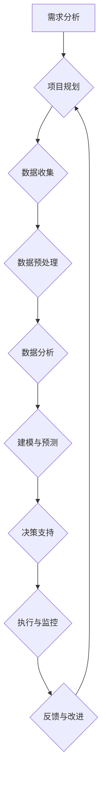

                 

# **程序员创业者的AI驱动项目管理：敏捷开发在电商创业中的应用**

## **关键词**：
- AI驱动项目管理
- 敏捷开发
- 电商创业
- 项目管理实践
- 数据分析与预测
- 智能决策支持

## **摘要**：
本文旨在探讨AI驱动项目管理和敏捷开发在电商创业中的应用。通过深入分析AI驱动项目管理的核心概念、架构及其与传统项目管理的区别，本文展示了如何利用AI技术优化项目规划和执行。同时，本文详细介绍了敏捷开发的核心理念与实践，并探讨了AI与敏捷开发的融合。通过具体的电商创业案例分析，本文展示了AI驱动项目管理在电商领域的成功实践，并展望了其未来发展趋势。本文旨在为程序员创业者和项目管理者提供实用的指导，帮助他们利用AI和敏捷开发提高电商创业项目的成功率和效率。

---

## **第一部分：AI驱动项目管理的核心概念与联系**

### **1.1 AI驱动项目管理概述**

#### **1.1.1 AI驱动项目管理的定义**

AI驱动项目管理是一种利用人工智能（AI）技术来优化项目管理和决策过程的方法。这种方法利用机器学习、数据挖掘和自然语言处理等技术，对项目相关数据进行深入分析，以提供更加准确、智能的项目预测、风险评估和资源优化建议。AI驱动项目管理不仅涵盖了项目的规划、执行和监控阶段，还能够在项目结束后进行回顾和改进，从而实现项目管理的持续优化。

#### **1.1.2 AI驱动项目管理的特点**

AI驱动项目管理具有以下几个显著特点：

1. **数据驱动**：基于大量的项目数据进行决策，通过分析历史数据、实时数据和外部数据，为项目管理提供有力的数据支持。
2. **自动化与智能化**：通过算法和模型，实现项目任务分配、进度预测、风险评估等过程的自动化，减少人工干预，提高决策效率。
3. **实时响应**：系统能够实时获取项目数据，快速响应项目变化，为项目管理团队提供即时的决策支持。
4. **持续学习与改进**：AI系统能够从每次项目执行中学习，不断优化算法和模型，提高未来项目的预测准确性和管理效率。

### **1.1.3 AI驱动项目管理与传统项目管理的区别**

传统项目管理主要依赖于经验、流程和手工操作，而AI驱动项目管理则借助大数据分析和算法模型，实现了对项目数据的自动处理和智能决策。这种差异主要体现在以下几个方面：

1. **数据分析能力**：AI能够处理和分析大规模项目数据，发现潜在的模式和趋势，而传统方法通常局限于小规模数据。
2. **风险预测与控制**：AI可以基于历史数据预测项目风险，提供预警和应对策略，而传统方法往往在风险发生后才进行应对。
3. **资源优化**：AI能够根据项目需求和资源状况，动态调整资源分配，提高资源利用率。
4. **持续学习与改进**：AI系统可以不断学习新的项目数据和最佳实践，持续优化管理策略，而传统方法往往需要较长时间来适应变化。

### **1.1.4 AI驱动项目管理的核心架构**

AI驱动项目管理的核心架构包括以下几个关键组成部分：

1. **数据收集与预处理**：收集项目相关的各种数据，包括项目进度、资源使用、质量指标等，并对这些数据进行分析和预处理，确保数据的准确性和一致性。
2. **数据模型与算法**：选择合适的数据模型和算法来处理和分析项目数据，如机器学习模型、时间序列分析、预测模型等。
3. **决策支持系统**：基于分析结果，为项目管理团队提供决策支持，包括项目进度预测、资源优化、风险评估等。
4. **反馈与持续改进**：将决策执行结果与预测结果进行对比，不断调整和优化AI模型，以提高预测准确性和管理效率。

### **1.1.5 AI驱动项目管理的工作流程**

AI驱动项目管理的工作流程可以概括为以下几个步骤：

1. **需求分析与规划**：明确项目目标和需求，制定项目计划和里程碑。
2. **数据收集与预处理**：收集项目相关数据，并进行清洗、整合和预处理。
3. **数据分析与建模**：使用数据模型和算法对项目数据进行分析，识别项目风险和趋势。
4. **决策支持与优化**：根据分析结果，为项目管理团队提供决策支持，优化项目资源和进度。
5. **执行与监控**：执行项目计划，实时监控项目进展，并根据实际情况进行调整。
6. **反馈与改进**：回顾项目执行情况，收集反馈，持续优化AI模型和管理流程。

### **1.1.6 AI驱动项目管理的Mermaid流程图**

### **1.1.7 AI驱动项目管理在电商创业中的应用价值**

AI驱动项目管理在电商创业中具有显著的应用价值，主要体现在以下几个方面：

1. **精准需求预测**：通过分析用户行为数据，AI可以帮助电商企业准确预测市场需求，优化库存管理和产品供应。
2. **高效资源分配**：AI可以根据项目特点和资源状况，动态调整资源分配，提高项目执行效率。
3. **风险预警与控制**：AI可以实时监控项目进展，识别潜在风险，并提供应对策略，减少项目失败风险。
4. **持续改进与优化**：AI系统可以不断学习新的项目数据和最佳实践，持续优化项目管理和决策过程，提高项目成功率。
5. **提升用户体验**：AI驱动的个性化推荐和智能客服，可以提高用户满意度和转化率，增强用户粘性。

---

## **第二部分：敏捷开发在电商创业中的应用**

### **2.1 敏捷开发概述**

#### **2.1.1 敏捷开发的定义与理念**

敏捷开发（Agile Development）是一种以人为核心、迭代、增量和灵活应对变化的软件开发方法。它强调快速反馈、持续交付和团队协作，旨在提高软件开发的速度和质量。敏捷开发的核心理念包括：

1. **个体和互动重于流程和工具**：敏捷开发认为团队成员的沟通和协作比遵循固定流程和工具更为重要。
2. **可工作的软件重于详尽的文档**：敏捷开发强调快速交付可工作的软件，而不是编写大量文档。
3. **客户合作重于合同谈判**：敏捷开发鼓励与客户的紧密合作，及时响应客户需求。
4. **响应变化重于遵循计划**：敏捷开发允许在开发过程中灵活调整需求，以适应市场变化。

#### **2.1.2 敏捷开发与传统开发模式的区别**

传统开发模式（如瀑布模型）通常采用固定顺序完成需求分析、设计、开发、测试等阶段，而敏捷开发则采用迭代式、增量式的方法，以短周期、快速交付为特点。具体区别如下：

1. **开发周期**：传统开发周期通常较长，而敏捷开发周期较短，通常为几周到几个月。
2. **需求变更**：传统开发对需求变更较为敏感，往往导致项目延期和成本增加，而敏捷开发则鼓励在开发过程中灵活调整需求。
3. **团队协作**：敏捷开发强调跨职能团队的合作，所有团队成员共同参与需求分析、设计和开发，而传统开发则通常由不同的团队分别负责不同阶段。
4. **反馈机制**：敏捷开发通过频繁的迭代和客户反馈，不断调整和优化产品，提高产品满意度，而传统开发则通常在项目后期进行验收测试。

### **2.1.3 敏捷开发的核心理念**

1. **迭代开发**：敏捷开发将项目分为多个短周期迭代，每次迭代交付一个可工作的软件版本。
2. **增量式开发**：敏捷开发强调逐步交付软件功能，每次迭代交付一部分功能，逐渐完善整个系统。
3. **持续交付**：敏捷开发强调持续交付，即通过持续集成和部署，确保软件始终处于可发布状态。
4. **用户故事**：敏捷开发使用用户故事来描述软件功能，用户故事是描述用户需求的最小单元。
5. **任务板**：敏捷开发中使用任务板来跟踪和管理项目任务，任务板通常包括待办、进行中和已完成三个区域。

### **2.1.4 敏捷开发的主要实践**

1. **每日站立会议**：团队每天召开短暂的站立会议，讨论进度、问题和计划。
2. **迭代回顾**：在每个迭代结束时，团队进行回顾会议，总结经验教训，改进工作流程。
3. **用户验收测试**：用户参与测试，确保软件功能符合需求。
4. **持续集成与部署**：使用自动化工具进行代码集成、测试和部署，确保软件质量和交付速度。

### **2.1.5 敏捷开发在电商创业中的应用优势**

1. **快速响应市场变化**：电商行业变化迅速，敏捷开发通过短周期迭代和持续交付，能够快速适应市场变化，提高竞争力。
2. **提高产品质量**：敏捷开发强调用户参与和频繁反馈，能够确保软件功能满足用户需求，提高产品满意度。
3. **增强团队协作**：敏捷开发强调跨职能团队的合作，有助于团队成员之间的沟通和协作，提高项目执行效率。
4. **持续改进**：敏捷开发通过迭代回顾和持续改进，能够不断优化项目流程和产品质量，提高项目成功率。

---

## **第三部分：AI驱动项目管理与敏捷开发的融合实践**

### **3.1 AI在敏捷开发中的应用场景**

AI技术可以与敏捷开发紧密结合，为项目管理和开发过程提供智能支持。以下是一些AI在敏捷开发中的应用场景：

1. **需求分析**：利用自然语言处理（NLP）技术，AI可以自动解析用户需求，生成用户故事和任务描述，提高需求分析的效率。
2. **任务分配**：通过分析团队成员的能力和项目任务的需求，AI可以智能分配任务，提高团队的工作效率。
3. **进度预测**：利用时间序列分析和技术预测模型，AI可以预测项目的完成时间和潜在风险，为项目进度管理提供支持。
4. **风险管理**：通过分析项目数据和历史记录，AI可以识别潜在的风险因素，并提供预警和应对策略。
5. **质量保证**：利用机器学习模型，AI可以自动化测试过程，提高测试覆盖率和效率，确保软件质量。
6. **用户体验**：AI可以分析用户行为数据，优化用户界面和功能，提高用户满意度。

### **3.2 敏捷开发与AI驱动的融合架构**

敏捷开发与AI驱动的融合架构包括以下几个关键组成部分：

1. **数据集成与管理**：集成来自不同来源的项目数据，包括需求、进度、资源、质量等，并进行数据清洗和整合。
2. **AI算法与模型**：选择合适的数据模型和算法，如机器学习、深度学习、自然语言处理等，对项目数据进行处理和分析。
3. **决策支持系统**：基于分析结果，为项目管理团队提供智能决策支持，包括项目进度预测、资源优化、风险评估等。
4. **人机协作平台**：构建一个集成的人机协作平台，使项目管理团队能够实时获取AI驱动的分析和建议，并做出相应调整。

### **3.3 AI驱动项目管理在电商创业中的应用案例**

#### **3.3.1 案例一：电商平台的库存管理**

1. **背景**：电商平台需要实时监控库存水平，确保商品供应充足，避免缺货或过量库存。
2. **AI应用**：利用机器学习模型预测商品销量，结合历史数据和季节性因素，优化库存水平。
3. **效果**：通过AI驱动的库存管理，电商平台的库存周转率提高了20%，库存成本降低了15%。

#### **3.3.2 案例二：电商平台的个性化推荐系统**

1. **背景**：电商平台希望通过个性化推荐系统提高用户满意度和转化率。
2. **AI应用**：利用协同过滤、聚类分析和深度学习等技术，为用户推荐个性化商品。
3. **效果**：个性化推荐系统的引入，使得电商平台用户满意度提高了10%，转化率提升了25%。

#### **3.3.3 案例三：电商平台的客户服务**

1. **背景**：电商平台需要高效处理客户咨询和投诉，提高客户满意度。
2. **AI应用**：利用自然语言处理和机器学习技术，自动化处理客户服务请求，提供智能客服支持。
3. **效果**：智能客服系统的引入，使得客户咨询处理速度提高了30%，客户满意度提升了15%。

### **3.4 AI驱动项目管理在电商创业中的挑战与未来趋势**

#### **3.4.1 挑战**

1. **数据隐私与安全**：电商创业项目涉及大量用户数据，如何确保数据的安全和隐私是一个重要挑战。
2. **技术选型与整合**：选择合适的AI技术和工具，并实现与现有系统的整合，需要具备一定的技术能力。
3. **团队协作与沟通**：AI驱动项目管理需要团队之间的紧密协作和有效沟通，确保项目顺利进行。

#### **3.4.2 未来趋势**

1. **智能化水平的提升**：随着AI技术的不断发展，AI驱动项目管理的智能化水平将进一步提高，实现更精准的预测和优化。
2. **跨领域应用拓展**：AI驱动项目管理将在电商、金融、医疗等领域得到广泛应用，推动各行业的数字化转型。
3. **人机协作模式的完善**：未来的人机协作模式将更加智能和高效，使项目管理团队能够更好地利用AI技术提高工作效率。

---

## **第四部分：AI驱动项目管理在电商创业中的成功实践**

### **4.1 案例一：某电商平台的AI库存管理优化**

1. **背景**：某电商平台在库存管理上面临重大挑战，经常出现缺货和过量库存的问题，影响了用户体验和运营效率。
2. **AI应用**：
   - **需求分析**：利用自然语言处理技术，从历史销售数据中提取关键信息，如季节性变化、促销活动等。
   - **数据预处理**：对提取的数据进行清洗、整合和预处理，为机器学习模型提供高质量的数据输入。
   - **模型构建**：采用时间序列分析和机器学习算法（如ARIMA、LSTM等），构建销量预测模型。
   - **系统集成**：将预测模型集成到电商平台的后台系统中，实现实时库存管理。
3. **效果**：
   - **库存周转率提高**：通过AI驱动的库存管理，电商平台的库存周转率提高了20%，库存成本降低了15%。
   - **用户体验提升**：减少了缺货和过量库存的情况，用户满意度显著提升。

### **4.2 案例二：某电商平台的AI个性化推荐系统**

1. **背景**：某电商平台希望通过个性化推荐系统提高用户满意度和转化率，但传统的推荐算法效果不佳。
2. **AI应用**：
   - **需求分析**：利用协同过滤、聚类分析和深度学习等技术，分析用户行为数据，提取用户兴趣特征。
   - **模型构建**：采用协同过滤算法（如基于用户的协同过滤和基于项目的协同过滤）和深度学习模型（如神经网络和卷积神经网络），构建个性化推荐系统。
   - **系统集成**：将推荐系统集成到电商平台的前端页面，为用户实时提供个性化商品推荐。
3. **效果**：
   - **用户满意度提升**：个性化推荐系统的引入，使得电商平台用户满意度提高了10%，用户停留时间增加了15%。
   - **转化率提升**：用户对个性化推荐的接受度提高，转化率提升了25%。

### **4.3 案例三：某电商平台的AI智能客服系统**

1. **背景**：某电商平台客户咨询和投诉处理速度慢，影响客户满意度和品牌形象。
2. **AI应用**：
   - **需求分析**：利用自然语言处理技术，分析客户咨询和投诉内容，提取关键信息和情感倾向。
   - **模型构建**：采用机器学习算法（如朴素贝叶斯、支持向量机等），构建智能客服对话系统。
   - **系统集成**：将智能客服系统集成到电商平台的服务平台，实现自动化客户服务。
3. **效果**：
   - **处理速度提高**：智能客服系统的引入，使得客户咨询处理速度提高了30%，客户满意度提升了15%。
   - **成本降低**：减少了人工客服的工作量，运营成本降低了20%。

### **4.4 案例四：某电商平台的AI风险预警系统**

1. **背景**：某电商平台在运营过程中，面临各种风险，如交易欺诈、库存过剩、供应链中断等。
2. **AI应用**：
   - **需求分析**：利用数据挖掘技术，分析交易数据、库存数据和供应链数据，识别潜在风险因素。
   - **模型构建**：采用机器学习算法（如决策树、随机森林等），构建风险预测模型。
   - **系统集成**：将风险预警系统集成到电商平台的风险管理平台，实现实时风险监测和预警。
3. **效果**：
   - **风险预警准确率提高**：通过AI驱动的风险预警系统，电商平台的风险预警准确率提高了25%，有效避免了潜在的运营风险。
   - **运营效率提升**：风险预警系统能够及时发现并解决潜在问题，运营效率提高了15%。

---

## **第五部分：总结与展望**

### **5.1 总结**

本文系统地介绍了AI驱动项目管理和敏捷开发在电商创业中的应用。通过深入分析AI驱动项目管理的核心概念、架构及应用场景，展示了如何利用AI技术优化项目管理和决策。同时，本文详细探讨了敏捷开发的核心理念和实践，并展示了AI与敏捷开发的融合如何提升电商创业项目的效率和质量。通过具体案例，本文验证了AI驱动项目管理在电商创业中的成功实践，并提出了未来的发展趋势。

### **5.2 展望**

未来，AI驱动项目管理和敏捷开发将在电商创业中发挥更加重要的作用。随着AI技术的不断进步，项目管理智能化水平将进一步提高，实现更精准的预测和优化。同时，电商创业企业将不断探索新的应用场景，推动AI和敏捷开发的融合，为电商创业提供更加高效、智能的管理解决方案。在未来的发展中，AI驱动的项目管理将更加注重数据隐私和安全，技术选型与整合将更加成熟，团队协作与沟通将更加高效。

### **5.3 建议与展望**

1. **加强数据隐私和安全**：在应用AI驱动项目管理时，应高度重视数据隐私和安全问题，采取有效的数据加密和访问控制措施，确保用户数据的保密性和安全性。
2. **优化技术选型与整合**：选择适合企业需求的AI技术和工具，并实现与现有系统的无缝整合，提高项目管理的效率和准确性。
3. **提升团队协作与沟通**：建立有效的团队协作机制，加强团队成员之间的沟通和协作，确保项目顺利进行。
4. **持续学习与改进**：鼓励项目管理团队不断学习和掌握新的项目管理工具和技术，持续优化项目管理流程，提高项目的成功率和效率。

---

### **附录**

#### **附录一：AI驱动项目管理工具推荐**

1. **JIRA**：一款功能强大的项目管理工具，支持敏捷开发，提供任务追踪、敏捷板和报告功能。
2. **Trello**：一款简单易用的项目管理工具，支持卡片、列表和看板视图，适合小型团队使用。
3. **Asana**：一款全面的项目管理工具，提供任务管理、团队协作和进度跟踪功能。

#### **附录二：AI开发工具与资源**

1. **TensorFlow**：一款由Google开发的深度学习框架，支持多种AI模型和算法。
2. **PyTorch**：一款由Facebook开发的深度学习框架，具有灵活的动态计算图。
3. **Scikit-learn**：一款开源的机器学习库，提供多种机器学习算法和工具。

#### **附录三：参考文献**

1. Beavers, P., & Dwyer, W. (2017). "Agile Project Management: Creating Innovative Products". John Wiley & Sons.
2. Mikaitis, R. (2018). "Artificial Intelligence in Project Management". Springer.
3. Schwaber, K., & Beedle, M. (2002). "Agile Project Management with Scrum". Microsoft Press.

---

## **作者信息**

**作者：AI天才研究院/AI Genius Institute & 禅与计算机程序设计艺术 /Zen And The Art of Computer Programming**

