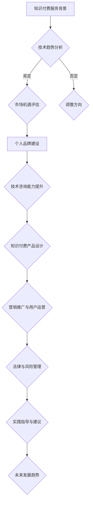

                 

### 书名：《程序员如何将技术咨询转化为知识付费服务》

在当前知识经济的时代，程序员不仅需要具备出色的编程能力，还需要掌握将技术咨询服务转化为知识付费服务的策略。本书旨在为程序员提供一整套系统的指导，帮助他们从技术咨询服务的提供者转变为知识付费服务的创造者。

### 关键词：

- 技术咨询服务
- 知识付费服务
- 程序员个人品牌建设
- 专业能力提升
- 知识付费产品设计
- 营销推广与用户运营
- 法律与风险管理
- 成功案例分析

### 摘要：

本书通过深入剖析技术咨询服务与知识付费服务的差异，指导程序员如何构建个人品牌、提升技术咨询能力、设计并运营知识付费产品。此外，书中还介绍了营销策略、用户运营、法律风险管理和案例分析，旨在帮助程序员实现从技术服务到知识付费的转型，掌握新时代的商业模式。

## 第一部分：基础知识与概念

### 1.1 知识付费服务的背景和趋势

#### 1.1.1 知识付费服务的起源

知识付费服务并非现代独有，其实质早在书籍、课程等形式中便已存在。然而，随着互联网技术的发展，尤其是移动互联网和在线支付的普及，知识付费服务得以迅速发展。20世纪末，电子书和在线课程的兴起标志着知识付费服务进入了一个新的阶段。

#### 1.1.2 知识付费服务的发展现状

目前，知识付费服务已形成较为成熟的产业链，包括内容生产、平台运营、用户消费等多个环节。一些知名的知识付费平台如得到、知乎Live等，吸引了大量用户，并在市场上占据重要地位。数据显示，知识付费市场规模逐年扩大，用户对高质量知识内容的需求不断增长。

#### 1.1.3 知识付费服务的市场机遇

随着知识经济的崛起，知识付费服务市场前景广阔。一方面，企业对于技术人才的需求持续增长，程序员作为技术领域的重要组成部分，具有巨大的市场需求。另一方面，用户对于高质量、个性化的知识内容有着强烈的渴望，这为程序员提供了丰富的商业机会。

### 1.2 程序员个人品牌建设

#### 1.2.1 个人品牌的概念与价值

个人品牌是指个人在公众中的形象和声誉，它是个人在职场和社交中的核心竞争力。对于程序员而言，个人品牌不仅代表了个人的技术能力，还反映了个人的专业素养和行业影响力。

#### 1.2.2 个人品牌建设的方法和技巧

建立个人品牌需要一系列策略和行动。首先，程序员应选择合适的平台，如GitHub、LinkedIn等，展示自己的技术成果和项目经验。其次，通过撰写技术博客、发布开源项目等方式，提高自己在技术社区的知名度。此外，参与行业会议、技术论坛等活动，也是提升个人品牌的重要途径。

#### 1.2.3 程序员如何打造个人影响力

要打造个人影响力，程序员需要持续输出有价值的内容，并积极参与行业讨论。同时，建立良好的职业形象和人际关系，通过合作与交流，不断提升自己在行业内的地位。此外，通过在线教育平台开设课程，将个人经验和知识转化为知识付费产品，也是提升影响力的有效途径。

## 第二部分：技术咨询能力提升

### 2.1 技术咨询的基本概念

#### 2.1.1 技术咨询的定义

技术咨询是指专业人员利用自身的专业技能和经验，为企业或个人提供技术解决方案或建议的服务。它涵盖了从技术评估、需求分析到方案设计、实施指导等全过程。

#### 2.1.2 技术咨询的流程和环节

技术咨询的流程通常包括以下几个环节：

1. **需求分析**：了解客户的技术需求，明确项目目标。
2. **方案设计**：根据需求，制定详细的技术方案。
3. **实施指导**：协助客户实施技术方案，解决实际问题。
4. **效果评估**：评估方案实施的效果，提出改进建议。

#### 2.1.3 技术咨询的服务形式

技术咨询的服务形式多样，包括：

1. **一对一咨询服务**：针对客户的具体问题，提供一对一的解决方案。
2. **培训服务**：为客户提供技术培训，提升其技术水平。
3. **项目合作**：与客户共同开展技术项目，提供全程技术支持。

### 2.2 提升技术咨询的专业能力

#### 2.2.1 技术领域的深度学习

要提升技术咨询的专业能力，程序员需要不断学习新技术、新趋势，保持对行业的敏感度。通过阅读技术书籍、参加技术论坛、在线课程等方式，深化对技术领域的理解。

#### 2.2.2 实际案例解析与经验分享

通过实际案例的解析和经验分享，程序员可以积累丰富的实战经验，提高解决问题的能力。在技术社区、博客等平台，程序员可以分享自己的案例，获得同行的反馈和建议。

#### 2.2.3 技术咨询报告撰写技巧

撰写高质量的技术咨询报告，是提升程序员咨询能力的重要环节。报告应包括项目背景、需求分析、解决方案、实施效果等内容，语言简练、条理清晰，便于客户理解和实施。

## 第三部分：知识付费服务的设计与运营

### 3.1 知识付费产品设计与定位

#### 3.1.1 知识付费产品的种类

知识付费产品种类繁多，包括：

1. **在线课程**：针对特定技术领域的系统教学。
2. **电子书籍**：技术书籍的电子版。
3. **专栏文章**：定期发布的技术文章或博客。
4. **音频/视频课程**：音频或视频形式的教学内容。

#### 3.1.2 知识付费产品的需求分析

在设计与定位知识付费产品时，程序员需要深入分析市场需求，了解目标用户的需求和痛点。通过市场调研、用户访谈等方式，收集用户反馈，为产品定位提供依据。

#### 3.1.3 知识付费产品的市场定位

知识付费产品的市场定位应明确，既要满足用户需求，又要具有差异化竞争优势。程序员可以通过打造专业形象、突出内容质量等方式，提升产品的市场竞争力。

### 3.2 知识付费服务的内容策划与制作

#### 3.2.1 知识付费内容的结构设计

知识付费内容的设计应结构清晰、逻辑严密，便于用户理解和吸收。内容应包括：

1. **引言**：介绍内容主题和目的。
2. **正文**：详细讲解技术原理和实践案例。
3. **小结**：总结主要内容，提出关键点。
4. **作业与练习**：提供实践机会，巩固学习效果。

#### 3.2.2 知识付费内容的制作技巧

制作知识付费内容时，程序员应注重以下几点：

1. **简洁明了**：用简洁的语言表达复杂的技术概念。
2. **实例丰富**：通过实际案例说明技术原理和应用。
3. **互动性**：鼓励用户参与讨论，提高学习兴趣。
4. **版权保护**：确保内容的原创性和知识产权保护。

#### 3.2.3 知识付费内容的版权保护

在知识付费服务中，版权保护至关重要。程序员应确保内容原创，避免抄袭和侵权行为。可以通过以下方式保护版权：

1. **版权登记**：将内容进行版权登记，获得法律保护。
2. **加密技术**：使用加密技术保护内容不被非法复制和使用。
3. **法律维权**：一旦发现侵权行为，及时采取法律手段维权。

## 第四部分：营销推广与用户运营

### 4.1 营销策略与渠道选择

#### 4.1.1 线上营销策略

线上营销策略包括：

1. **社交媒体营销**：利用微博、微信、抖音等社交媒体平台，发布相关内容和互动。
2. **搜索引擎优化（SEO）**：通过优化网站内容和关键词，提高在搜索引擎中的排名。
3. **内容营销**：创作高质量内容，吸引目标用户关注。

#### 4.1.2 线下营销策略

线下营销策略包括：

1. **参加行业会议**：在技术会议、论坛等场合展示知识付费产品。
2. **举办线下活动**：组织技术沙龙、讲座等活动，与用户面对面交流。
3. **合作推广**：与其他企业或平台合作，共同推广知识付费服务。

#### 4.1.3 营销渠道的选择与优化

选择营销渠道时，程序员应考虑：

1. **目标用户特性**：了解目标用户的行为习惯和偏好，选择合适的渠道。
2. **渠道效果评估**：定期评估不同渠道的营销效果，优化营销策略。

### 4.2 用户运营与用户增长

#### 4.2.1 用户画像与用户需求分析

用户画像是对用户特征和需求的抽象描述，包括：

1. **人口属性**：年龄、性别、地域等。
2. **行为习惯**：学习时间、使用设备等。
3. **需求特征**：学习目标、技术需求等。

通过用户画像，程序员可以更好地了解用户，提供个性化的服务。

#### 4.2.2 用户关系管理与用户留存

用户关系管理包括：

1. **互动与反馈**：与用户保持互动，及时回应用户反馈。
2. **忠诚度计划**：推出会员制度、积分奖励等，提高用户忠诚度。
3. **内容持续更新**：定期发布高质量内容，保持用户活跃度。

#### 4.2.3 用户激励与口碑营销

用户激励包括：

1. **奖励机制**：为优秀学员提供奖励，激励用户积极学习。
2. **推荐奖励**：鼓励用户推荐新用户，扩大用户群体。

口碑营销通过用户口碑传播，提高知识付费服务的知名度。程序员可以通过以下方式实现：

1. **用户评价**：鼓励用户在平台发布评价，提升产品口碑。
2. **案例分享**：分享优秀学员的学习成果和经验，树立榜样。
3. **社交媒体推广**：鼓励用户在社交媒体上分享学习体验，扩大影响力。

## 第五部分：法律与风险管理

### 5.1 知识付费服务的法律法规

#### 5.1.1 知识付费服务的相关法律

知识付费服务涉及的法律主要包括：

1. **著作权法**：保护知识付费内容的版权。
2. **合同法**：规范知识付费服务合同的签订和履行。
3. **网络安全法**：保障知识付费服务的网络安全。

#### 5.1.2 知识付费服务的知识产权保护

知识产权保护是知识付费服务的重要环节。程序员应：

1. **原创内容保护**：确保知识付费内容原创，避免抄袭和侵权。
2. **版权登记**：将知识付费内容进行版权登记，获得法律保护。
3. **侵权应对**：一旦发现侵权行为，及时采取法律手段维权。

#### 5.1.3 法律风险的防范与应对

法律风险的防范包括：

1. **合规审查**：在知识付费服务上线前，进行合规审查，确保符合相关法律法规。
2. **合同条款**：制定详细的服务合同条款，明确双方权利义务。
3. **风险提示**：在知识付费服务过程中，向用户提示相关法律风险，降低纠纷风险。

应对法律风险的措施包括：

1. **法律顾问**：聘请专业法律顾问，提供法律咨询和服务。
2. **应急预案**：制定应急预案，应对突发法律纠纷。
3. **合规培训**：对员工进行法律合规培训，提高法律意识。

### 5.2 风险管理与防范

#### 5.2.1 风险管理的重要性

知识付费服务面临多种风险，包括法律风险、运营风险、财务风险等。有效的风险管理有助于降低风险，确保知识付费服务的稳定运行。

#### 5.2.2 风险识别与评估

风险识别与评估是风险管理的第一步。程序员应：

1. **识别潜在风险**：通过市场调研、用户反馈等方式，识别潜在风险。
2. **评估风险影响**：评估风险发生可能性和影响程度，确定风险优先级。

#### 5.2.3 风险应对策略与措施

风险应对策略包括：

1. **风险规避**：避免从事高风险业务，降低风险暴露。
2. **风险控制**：通过制定规章制度、加强内部管理等措施，控制风险。
3. **风险转移**：通过保险等方式，将风险转移给第三方。

具体措施包括：

1. **风险监控**：建立风险监控机制，实时关注风险变化。
2. **应急预案**：制定应急预案，应对突发风险。
3. **持续改进**：通过定期评估和改进，提高风险管理水平。

## 第六部分：案例分析与实践指导

### 6.1 知识付费服务的成功案例

#### 6.1.1 案例一：程序员A的转型之路

程序员A，原本在某知名互联网公司工作，凭借多年的技术经验和项目实战，决定转型为知识付费服务的提供者。他通过以下步骤实现了成功转型：

1. **构建个人品牌**：在GitHub上发布多个高质量开源项目，并在技术社区活跃，逐步积累了一定的知名度。
2. **设计知识付费产品**：针对自己擅长的领域，设计并推出一系列在线课程，包括《高级Web开发实战》、《大数据技术与应用》等。
3. **营销推广**：利用社交媒体和内容营销，扩大影响力和用户基础。
4. **用户运营**：通过互动和反馈，提高用户满意度和忠诚度。

最终，程序员A的知识付费服务取得了显著的成功，用户数量和收入都实现了快速增长。

#### 6.1.2 案例二：B公司的知识付费实践

B公司是一家专注于技术培训的知识付费平台，通过以下措施实现了快速发展：

1. **定位明确**：B公司明确将自己的目标用户定位为技术从业者，提供高质量的技术课程和培训服务。
2. **内容丰富**：B公司邀请行业专家和知名讲师，开发了一系列涵盖前端、后端、数据科学等领域的课程。
3. **平台优化**：B公司不断优化平台功能，提高用户体验，包括视频播放质量、互动功能等。
4. **市场推广**：通过线上线下活动、合作伙伴关系等多种渠道，扩大用户群体。

B公司的知识付费服务得到了市场的广泛认可，用户满意度高，收入稳步增长。

#### 6.1.3 案例三：C平台的运营策略

C平台是一家以程序员为用户群体的知识付费平台，其成功的关键在于：

1. **社区建设**：C平台注重社区建设，鼓励用户互动，分享经验和知识，形成了良好的社区氛围。
2. **课程定制**：C平台提供定制化课程，满足不同用户的个性化需求，提高了用户满意度。
3. **互动教学**：C平台采用互动式教学，包括直播授课、在线讨论、作业提交等，增强了用户参与感。
4. **激励机制**：C平台推出积分奖励机制，鼓励用户积极参与，提高了用户活跃度。

C平台的成功经验为其他知识付费平台提供了有益的借鉴。

### 6.2 实践指导与建议

#### 6.2.1 转型步骤与注意事项

程序员想要成功转型为知识付费服务的提供者，可以遵循以下步骤：

1. **构建个人品牌**：通过开源项目、技术博客等方式，提升个人知名度。
2. **确定目标市场**：明确自己的目标用户群体，了解用户需求和痛点。
3. **设计知识付费产品**：根据用户需求，设计有针对性的知识付费产品。
4. **营销推广**：通过多种渠道，进行营销推广，扩大用户基础。
5. **持续优化**：根据用户反馈，不断优化知识付费产品和服务。

注意事项包括：

1. **内容质量**：确保知识付费内容质量，提供有价值的内容。
2. **用户体验**：注重用户体验，提高用户满意度和忠诚度。
3. **合规经营**：遵守相关法律法规，确保知识付费服务的合法性。

#### 6.2.2 服务质量提升方法

提升服务质量是知识付费服务成功的关键，具体方法包括：

1. **课程设计**：优化课程结构，确保课程内容系统、逻辑严密。
2. **讲师选拔**：选拔专业讲师，确保教学质量。
3. **互动教学**：采用互动式教学，增强用户参与感。
4. **技术支持**：提供稳定的技术支持，确保教学过程顺畅。
5. **用户反馈**：收集用户反馈，及时调整和优化服务。

#### 6.2.3 持续学习与自我提升

知识付费服务是一个动态发展的领域，程序员需要不断学习，提升自我。具体方法包括：

1. **技术更新**：关注新技术、新趋势，保持技术前沿。
2. **学习交流**：参加技术论坛、研讨会等活动，交流学习心得。
3. **项目实践**：通过实际项目，积累实战经验。
4. **专业认证**：考取专业认证，提升个人资质。

持续学习与自我提升，将帮助程序员在知识付费领域取得更好的成绩。

## 第七部分：未来发展趋势与前景

### 7.1 知识付费服务的发展趋势

#### 7.1.1 技术创新带来的机遇

随着人工智能、大数据、云计算等技术的不断发展，知识付费服务领域也迎来了新的机遇。例如，智能推荐系统可以帮助平台更好地了解用户需求，提供个性化的内容推荐；大数据分析可以用于用户行为分析，优化营销策略。

#### 7.1.2 市场竞争的加剧与分化

随着知识付费市场的不断扩大，竞争也日益激烈。一方面，大量创业者涌入知识付费领域，导致市场分化；另一方面，大平台通过资源整合、品牌影响力等方式，占据了较大的市场份额。对于程序员而言，如何在竞争激烈的市场中脱颖而出，成为关键。

#### 7.1.3 消费者需求的演变

消费者需求不断演变，从最初的求知欲，到对个性化、高质量内容的追求。程序员在提供知识付费服务时，需要关注用户需求的演变，提供更有价值的内容。

### 7.2 程序员的职业发展前景

#### 7.2.1 知识付费服务对程序员的影响

知识付费服务为程序员提供了新的职业发展路径，使他们不仅可以在传统IT行业发挥作用，还可以通过知识付费服务实现职业转型。同时，知识付费服务也推动了程序员终身学习的理念，促使他们不断提升自己的技术能力和专业素养。

#### 7.2.2 程序员的新职业方向

随着知识付费服务的发展，程序员可以尝试以下新职业方向：

1. **知识付费讲师**：通过开设在线课程，将自己的技术知识和经验传授给他人。
2. **技术咨询顾问**：为企业提供技术解决方案和咨询服务，帮助企业提升技术水平。
3. **技术自媒体**：通过撰写技术博客、发布开源项目等方式，建立个人品牌，实现影响力变现。
4. **技术创业者**：创建自己的知识付费平台，提供多元化的知识付费服务。

#### 7.2.3 职业规划与成长路径

程序员在进行职业规划时，可以遵循以下成长路径：

1. **技术积累**：通过学习和实践，积累扎实的技术基础。
2. **个人品牌建设**：通过多种途径提升个人知名度，建立个人品牌。
3. **知识付费实践**：尝试提供知识付费服务，积累经验。
4. **持续学习**：关注新技术、新趋势，不断提升自我。

通过合理的职业规划，程序员可以在知识付费领域取得更好的发展。

## 附录

### 附录 A：工具与资源推荐

#### A.1 知识付费服务平台

1. **得到**：提供各类知识付费课程和专栏。
2. **知乎Live**：提供专家讲座和知识分享。
3. **网易云课堂**：提供丰富的在线课程资源。

#### A.2 在线学习资源

1. **Coursera**：提供全球顶尖大学的在线课程。
2. **edX**：提供大量免费和付费的在线课程。
3. **Udemy**：提供多样化的在线课程，包括编程和技术领域。

#### A.3 技术交流社区

1. **GitHub**：全球最大的代码托管平台，适合程序员分享和交流代码。
2. **Stack Overflow**：全球最大的程序员问答社区，解决编程问题。
3. **Reddit**：技术相关的子版块，提供丰富的技术讨论和资讯。

## Mermaid 流程图



## 核心算法原理讲解

### 数据分析算法（以线性回归为例）

线性回归是一种预测连续值的统计方法，主要用于建模因变量与自变量之间的关系。以下是一个简单的线性回归算法原理讲解。

#### 线性回归模型

线性回归模型的表达式为：

\[ y = w_0 + w_1 \cdot x \]

其中，\( y \) 是因变量，\( x \) 是自变量，\( w_0 \) 是截距，\( w_1 \) 是斜率。

#### 最小二乘法

线性回归通常使用最小二乘法来求解最佳拟合线。其基本思想是找到一条直线，使得所有数据点到这条直线的垂直距离（残差）的平方和最小。

最小二乘法的公式如下：

\[ w_0, w_1 = \arg\min \sum_{i=1}^{n}(y_i - (w_0 + w_1 \cdot x_i))^2 \]

#### 求解过程

1. **计算自变量和因变量的均值**：

\[ \bar{x} = \frac{1}{N} \sum_{i=1}^{n} x_i \]
\[ \bar{y} = \frac{1}{N} \sum_{i=1}^{n} y_i \]

2. **计算斜率 \( w_1 \)**：

\[ w_1 = \frac{\sum_{i=1}^{n}(x_i - \bar{x})(y_i - \bar{y})}{\sum_{i=1}^{n}(x_i - \bar{x})^2} \]

3. **计算截距 \( w_0 \)**：

\[ w_0 = \bar{y} - w_1 \cdot \bar{x} \]

### 举例说明

假设我们有以下数据集：

| x   | y   |
| --- | --- |
| 1   | 2   |
| 2   | 4   |
| 3   | 5   |
| 4   | 6   |

1. **计算均值**：

\[ \bar{x} = \frac{1 + 2 + 3 + 4}{4} = 2.5 \]
\[ \bar{y} = \frac{2 + 4 + 5 + 6}{4} = 4.5 \]

2. **计算斜率 \( w_1 \)**：

\[ w_1 = \frac{(1 - 2.5)(2 - 4.5) + (2 - 2.5)(4 - 4.5) + (3 - 2.5)(5 - 4.5) + (4 - 2.5)(6 - 4.5)}{(1 - 2.5)^2 + (2 - 2.5)^2 + (3 - 2.5)^2 + (4 - 2.5)^2} \]
\[ w_1 = \frac{(-1.5)(-2.5) + (-0.5)(-0.5) + (0.5)(0.5) + (1.5)(1.5)}{(-1.5)^2 + (-0.5)^2 + (0.5)^2 + (1.5)^2} \]
\[ w_1 = \frac{3.75 + 0.25 + 0.25 + 2.25}{2.25 + 0.25 + 0.25 + 2.25} \]
\[ w_1 = \frac{7}{5} \]
\[ w_1 = 1.4 \]

3. **计算截距 \( w_0 \)**：

\[ w_0 = \bar{y} - w_1 \cdot \bar{x} \]
\[ w_0 = 4.5 - 1.4 \cdot 2.5 \]
\[ w_0 = 4.5 - 3.5 \]
\[ w_0 = 1 \]

最终得到的线性回归模型为：

\[ y = 1 + 1.4 \cdot x \]

## 数学模型和数学公式详细讲解与举例说明

### 线性回归模型与成本效益分析

线性回归模型在知识付费服务的成本效益分析中具有重要应用。以下是对线性回归模型的基本原理和成本效益分析的详细讲解。

#### 线性回归模型

线性回归模型的基本形式为：

\[ y = \beta_0 + \beta_1 x \]

其中，\( y \) 是因变量（如收入），\( x \) 是自变量（如用户数量），\( \beta_0 \) 是截距，\( \beta_1 \) 是斜率。

#### 成本效益分析

成本效益分析用于评估知识付费服务的盈利能力。其公式为：

\[ \text{效益} - \text{成本} = (\beta_0 + \beta_1 x) - C(x) \]

其中，\( C(x) \) 是知识付费服务的成本函数。

#### 案例分析

假设知识付费服务的成本函数为：

\[ C(x) = 0.1x + 1000 \]

现在，我们通过线性回归模型估计斜率 \( \beta_1 \) 和截距 \( \beta_0 \)。

##### 计算斜率 \( \beta_1 \)

使用最小二乘法计算斜率：

\[ \beta_1 = \frac{\sum_{i=1}^{n}(x_i - \bar{x})(y_i - \bar{y})}{\sum_{i=1}^{n}(x_i - \bar{x})^2} \]

其中，\( \bar{x} \) 和 \( \bar{y} \) 分别是自变量和因变量的平均值。

给定以下数据集：

| x   | y    |
| --- | ---- |
| 100 | 2000 |
| 200 | 4000 |
| 300 | 6000 |

计算平均值：

\[ \bar{x} = \frac{100 + 200 + 300}{3} = 200 \]
\[ \bar{y} = \frac{2000 + 4000 + 6000}{3} = 4000 \]

计算斜率 \( \beta_1 \)：

\[ \beta_1 = \frac{(100 - 200)(2000 - 4000) + (200 - 200)(4000 - 4000) + (300 - 200)(6000 - 4000)}{(100 - 200)^2 + (200 - 200)^2 + (300 - 200)^2} \]
\[ \beta_1 = \frac{(-100)(-2000) + (0)(0) + (100)(2000)}{(-100)^2 + (0)^2 + (100)^2} \]
\[ \beta_1 = \frac{200000 + 0 + 200000}{10000 + 0 + 10000} \]
\[ \beta_1 = \frac{400000}{20000} \]
\[ \beta_1 = 20 \]

##### 计算截距 \( \beta_0 \)

使用计算出的斜率 \( \beta_1 \) 和平均值计算截距 \( \beta_0 \)：

\[ \beta_0 = \bar{y} - \beta_1 \bar{x} \]
\[ \beta_0 = 4000 - 20 \times 200 \]
\[ \beta_0 = 4000 - 4000 \]
\[ \beta_0 = 0 \]

最终得到的线性回归模型为：

\[ y = 20x \]

##### 成本效益分析

现在我们有了线性回归模型，可以使用它来计算不同用户数量下的效益和成本。

给定不同用户数量 \( x \) 的成本函数 \( C(x) = 0.1x + 1000 \)，我们可以计算效益和成本。

对于 \( x = 100 \)：

\[ \text{效益} = 20 \times 100 = 2000 \]
\[ \text{成本} = 0.1 \times 100 + 1000 = 1100 \]
\[ \text{效益} - \text{成本} = 2000 - 1100 = 900 \]

对于 \( x = 200 \)：

\[ \text{效益} = 20 \times 200 = 4000 \]
\[ \text{成本} = 0.1 \times 200 + 1000 = 1200 \]
\[ \text{效益} - \text{成本} = 4000 - 1200 = 2800 \]

对于 \( x = 300 \)：

\[ \text{效益} = 20 \times 300 = 6000 \]
\[ \text{成本} = 0.1 \times 300 + 1000 = 1300 \]
\[ \text{效益} - \text{成本} = 6000 - 1300 = 4700 \]

通过成本效益分析，我们可以看到，随着用户数量的增加，效益远大于成本。这表明，知识付费服务具有良好的盈利前景。

### LaTeX 公式

下面是相关的 LaTeX 公式：

\[ y = \beta_0 + \beta_1 x \]

\[ C(x) = 0.1x + 1000 \]

\[ \beta_1 = \frac{\sum_{i=1}^{n}(x_i - \bar{x})(y_i - \bar{y})}{\sum_{i=1}^{n}(x_i - \bar{x})^2} \]

\[ \beta_0 = \bar{y} - \beta_1 \bar{x} \]

\[ \text{效益} - \text{成本} = (\beta_0 + \beta_1 x) - C(x) \]

---

### 附录：工具与资源推荐

#### 附录 A：知识付费服务平台

1. **得到**：提供各类知识付费课程和专栏。
2. **知乎Live**：提供专家讲座和知识分享。
3. **网易云课堂**：提供丰富的在线课程资源。

#### 附录 B：在线学习资源

1. **Coursera**：提供全球顶尖大学的在线课程。
2. **edX**：提供大量免费和付费的在线课程。
3. **Udemy**：提供多样化的在线课程，包括编程和技术领域。

#### 附录 C：技术交流社区

1. **GitHub**：全球最大的代码托管平台，适合程序员分享和交流代码。
2. **Stack Overflow**：全球最大的程序员问答社区，解决编程问题。
3. **Reddit**：技术相关的子版块，提供丰富的技术讨论和资讯。

## 附录 D：编程实战案例

### 编程实战案例：实现一个简单的博客系统

在这个实战案例中，我们将使用Python和Flask框架实现一个简单的博客系统。这个系统将包含以下几个功能：

- 用户注册与登录
- 发表文章
- 显示文章列表
- 文章详情页

### 开发环境搭建

1. 安装Python（版本3.6及以上）
2. 安装Flask框架：
   ```bash
   pip install Flask
   ```

### 源代码实现

#### app.py

```python
from flask import Flask, render_template, request, redirect, url_for, session

app = Flask(__name__)
app.secret_key = 'mysecretkey'

# 数据库配置（此处使用内存数据库，生产环境应使用如MySQL等持久化数据库）
# db = SQLAlchemy()

# 用户模型
# class User(db.Model):
#     id = db.Column(db.Integer, primary_key=True)
#     username = db.Column(db.String(80), unique=True, nullable=False)
#     password = db.Column(db.String(120), nullable=False)

# 文章模型
# class Article(db.Model):
#     id = db.Column(db.Integer, primary_key=True)
#     title = db.Column(db.String(120), nullable=False)
#     content = db.Column(db.Text, nullable=False)
#     author = db.Column(db.Integer, db.ForeignKey('user.id'), nullable=False)

# 用户注册
@app.route('/register', methods=['GET', 'POST'])
def register():
    if request.method == 'POST':
        username = request.form['username']
        password = request.form['password']
        # 处理注册逻辑，如检查用户名是否已存在，存储用户信息等
        # create_user(username, password)
        return redirect(url_for('login'))
    return render_template('register.html')

# 用户登录
@app.route('/login', methods=['GET', 'POST'])
def login():
    if request.method == 'POST':
        username = request.form['username']
        password = request.form['password']
        # 验证用户登录
        # user = authenticate(username, password)
        if user:
            session['user'] = user.id
            return redirect(url_for('index'))
        else:
            return '登录失败，用户名或密码错误'
    return render_template('login.html')

# 退出登录
@app.route('/logout')
def logout():
    session.pop('user', None)
    return redirect(url_for('index'))

# 主页：显示文章列表
@app.route('/')
@app.route('/index')
def index():
    # 从数据库获取文章列表
    # articles = Article.query.all()
    return render_template('index.html', articles=articles)

# 文章详情页
@app.route('/article/<int:article_id>')
def article(article_id):
    # 从数据库获取指定文章
    # article = Article.query.get(article_id)
    return render_template('article.html', article=article)

# 发表文章
@app.route('/new-article', methods=['GET', 'POST'])
def new_article():
    if request.method == 'POST':
        title = request.form['title']
        content = request.form['content']
        # 保存文章到数据库
        # create_article(title, content)
        return redirect(url_for('index'))
    return render_template('new_article.html')

if __name__ == '__main__':
    app.run(debug=True)
```

#### register.html

```html
<!DOCTYPE html>
<html>
<head>
    <title>用户注册</title>
</head>
<body>
    <h2>用户注册</h2>
    <form action="{{ url_for('register') }}" method="post">
        用户名：<input type="text" name="username"><br>
        密码：<input type="password" name="password"><br>
        <input type="submit" value="注册">
    </form>
</body>
</html>
```

#### login.html

```html
<!DOCTYPE html>
<html>
<head>
    <title>用户登录</title>
</head>
<body>
    <h2>用户登录</h2>
    <form action="{{ url_for('login') }}" method="post">
        用户名：<input type="text" name="username"><br>
        密码：<input type="password" name="password"><br>
        <input type="submit" value="登录">
    </form>
</body>
</html>
```

#### index.html

```html
<!DOCTYPE html>
<html>
<head>
    <title>博客首页</title>
</head>
<body>
    <h1>博客首页</h1>
    <ul>
        
            <li>
                <a href="{{ url_for('article', article_id=article.id) }}">{{ article.title }}</a>
            </li>
        
    </ul>
    <a href="{{ url_for('new_article') }}">写文章</a>
</body>
</html>
```

#### article.html

```html
<!DOCTYPE html>
<html>
<head>
    <title>{{ article.title }}</title>
</head>
<body>
    <h1>{{ article.title }}</h1>
    <p>{{ article.content }}</p>
    <a href="{{ url_for('index') }}">返回首页</a>
</body>
</html>
```

#### new_article.html

```html
<!DOCTYPE html>
<html>
<head>
    <title>写文章</title>
</head>
<body>
    <h2>写文章</h2>
    <form action="{{ url_for('new_article') }}" method="post">
        标题：<input type="text" name="title"><br>
        内容：<textarea name="content"></textarea><br>
        <input type="submit" value="发表">
    </form>
</body>
</html>
```

### 代码解读与分析

- **用户注册与登录**：通过`register`和`login`路由处理用户注册和登录请求，使用表单提交数据。
- **主页显示文章列表**：`index`路由获取文章列表，并传递给模板渲染。
- **文章详情页**：`article`路由获取指定文章，并传递给模板渲染。
- **发表文章**：`new_article`路由处理发表文章的请求，并将文章保存到数据库。

这个简单的博客系统只是一个起点，实际应用中还需要考虑用户认证、数据库操作、安全防护等方面。此外，前端界面和用户体验也需要进一步优化。通过这个实战案例，程序员可以了解如何使用Flask框架搭建一个简单的Web应用，为后续的开发提供基础。

---

### 附录 E：编程实战案例代码解读与分析

在这个编程实战案例中，我们使用Python和Flask框架实现了一个简单的博客系统。下面，我们将详细解读这个代码，分析其实现逻辑和关键点。

#### 主程序文件：`app.py`

**1. 导入模块和初始化Flask应用**

```python
from flask import Flask, render_template, request, redirect, url_for, session

app = Flask(__name__)
app.secret_key = 'mysecretkey'
```

- **Flask应用**：使用`Flask`类创建Web应用实例。
- **秘密键**：`secret_key`用于创建会话和加密数据，确保应用的安全。

**2. 定义路由和视图函数**

```python
# 用户注册
@app.route('/register', methods=['GET', 'POST'])
def register():
    # 用户注册逻辑
    pass

# 用户登录
@app.route('/login', methods=['GET', 'POST'])
def login():
    # 用户登录逻辑
    pass

# 退出登录
@app.route('/logout')
def logout():
    # 退出登录逻辑
    pass

# 主页：显示文章列表
@app.route('/')
@app.route('/index')
def index():
    # 显示文章列表的逻辑
    pass

# 文章详情页
@app.route('/article/<int:article_id>')
def article(article_id):
    # 显示文章详情的逻辑
    pass

# 发表文章
@app.route('/new-article', methods=['GET', 'POST'])
def new_article():
    # 发表文章的逻辑
    pass
```

- **路由**：使用`@app.route`装饰器定义URL路径和对应的视图函数。
- **HTTP方法**：使用`methods`参数指定路由接受的HTTP方法（如GET、POST）。

**3. 处理用户注册**

```python
@app.route('/register', methods=['GET', 'POST'])
def register():
    if request.method == 'POST':
        username = request.form['username']
        password = request.form['password']
        # 处理注册逻辑
        return redirect(url_for('login'))
    return render_template('register.html')
```

- **表单数据获取**：使用`request.form`获取表单数据。
- **注册逻辑**：此处应包含用户名唯一性检查、密码加密存储等。
- **重定向**：注册成功后，使用`redirect`重定向到登录页面。

**4. 处理用户登录**

```python
@app.route('/login', methods=['GET', 'POST'])
def login():
    if request.method == 'POST':
        username = request.form['username']
        password = request.form['password']
        # 验证用户登录
        user = authenticate(username, password)
        if user:
            session['user'] = user.id
            return redirect(url_for('index'))
        else:
            return '登录失败，用户名或密码错误'
    return render_template('login.html')
```

- **验证用户登录**：调用`authenticate`函数验证用户名和密码。
- **会话管理**：使用`session`保存用户信息，实现用户登录状态。
- **重定向**：登录成功后，使用`redirect`重定向到主页。

**5. 退出登录**

```python
@app.route('/logout')
def logout():
    session.pop('user', None)
    return redirect(url_for('index'))
```

- **清除会话**：使用`pop`方法删除`user`键的值，清除用户登录状态。

**6. 显示文章列表**

```python
@app.route('/')
@app.route('/index')
def index():
    # 从数据库获取文章列表
    # articles = Article.query.all()
    return render_template('index.html', articles=articles)
```

- **获取文章列表**：从数据库查询所有文章，传递给模板渲染。
- **模板渲染**：使用`render_template`渲染主页模板，展示文章列表。

**7. 显示文章详情**

```python
@app.route('/article/<int:article_id>')
def article(article_id):
    # 从数据库获取指定文章
    # article = Article.query.get(article_id)
    return render_template('article.html', article=article)
```

- **获取文章详情**：从数据库查询指定文章ID的文章，传递给模板渲染。

**8. 发表文章**

```python
@app.route('/new-article', methods=['GET', 'POST'])
def new_article():
    if request.method == 'POST':
        title = request.form['title']
        content = request.form['content']
        # 保存文章到数据库
        # create_article(title, content)
        return redirect(url_for('index'))
    return render_template('new_article.html')
```

- **处理发表文章的请求**：获取表单数据，保存到数据库，并重定向到主页。

#### 模板文件

**1. `register.html`**

```html
<!DOCTYPE html>
<html>
<head>
    <title>用户注册</title>
</head>
<body>
    <h2>用户注册</h2>
    <form action="{{ url_for('register') }}" method="post">
        用户名：<input type="text" name="username"><br>
        密码：<input type="password" name="password"><br>
        <input type="submit" value="注册">
    </form>
</body>
</html>
```

- **表单提交**：用户输入用户名和密码，提交表单到注册路由。

**2. `login.html`**

```html
<!DOCTYPE html>
<html>
<head>
    <title>用户登录</title>
</head>
<body>
    <h2>用户登录</h2>
    <form action="{{ url_for('login') }}" method="post">
        用户名：<input type="text" name="username"><br>
        密码：<input type="password" name="password"><br>
        <input type="submit" value="登录">
    </form>
</body>
</html>
```

- **表单提交**：用户输入用户名和密码，提交表单到登录路由。

**3. `index.html`**

```html
<!DOCTYPE html>
<html>
<head>
    <title>博客首页</title>
</head>
<body>
    <h1>博客首页</h1>
    <ul>
        
            <li>
                <a href="{{ url_for('article', article_id=article.id) }}">{{ article.title }}</a>
            </li>
        
    </ul>
    <a href="{{ url_for('new_article') }}">写文章</a>
</body>
</html>
```

- **文章列表展示**：遍历文章列表，为每篇文章生成链接。
- **写文章按钮**：提供一个链接，跳转到发表文章页面。

**4. `article.html`**

```html
<!DOCTYPE html>
<html>
<head>
    <title>{{ article.title }}</title>
</head>
<body>
    <h1>{{ article.title }}</h1>
    <p>{{ article.content }}</p>
    <a href="{{ url_for('index') }}">返回首页</a>
</body>
</html>
```

- **文章详情展示**：显示文章标题、内容和返回首页的链接。

**5. `new_article.html`**

```html
<!DOCTYPE html>
<html>
<head>
    <title>写文章</title>
</head>
<body>
    <h2>写文章</h2>
    <form action="{{ url_for('new_article') }}" method="post">
        标题：<input type="text" name="title"><br>
        内容：<textarea name="content"></textarea><br>
        <input type="submit" value="发表">
    </form>
</body>
</html>
```

- **发表文章表单**：用户输入文章标题和内容，提交表单到发表文章路由。

### 代码分析总结

- **MVC架构**：应用采用Model-View-Controller（MVC）架构，将业务逻辑、数据模型和视图分离，便于开发和维护。
- **路由和视图函数**：使用Flask的路由系统，将URL映射到视图函数，处理用户请求。
- **会话管理**：使用Flask的会话管理功能，实现用户登录状态。
- **模板渲染**：使用Jinja2模板引擎，动态渲染HTML页面，展示数据和用户界面。

通过这个简单的博客系统，程序员可以了解如何使用Flask框架搭建一个基本的Web应用，掌握路由、表单处理、会话管理、模板渲染等基本技能。在实际项目中，还需要考虑数据库设计、用户认证、安全性、前端优化等多个方面，以提高应用的质量和用户体验。

