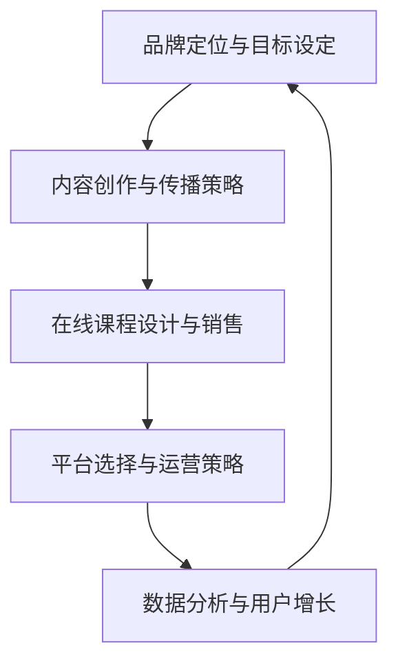

                 

# 《程序员如何进行知识付费的品牌营销》

## > 关键词：
- 知识付费
- 品牌营销
- 程序员
- 在线课程
- 内容创作
- 搜索引擎优化（SEO）

> 摘要：
在数字化时代，知识付费已经成为一个重要的商业模式，而程序员作为技术领域的专业人士，也在这一领域中找到了自己的定位。本文将探讨程序员如何利用品牌营销策略进行知识付费，包括个人知识品牌的构建、内容创作与传播、在线课程设计与销售以及知识付费平台的运营等方面。通过案例分析与实践指导，帮助程序员实现知识价值的最大化。

## 目录大纲

### 第一部分：知识付费与品牌营销基础

##### 第1章：知识付费概述

- **1.1 知识付费的概念与演变**
  - 知识付费的定义
  - 知识付费的发展历程
  - 知识付费的主要形式

- **1.2 知识付费市场现状与趋势**
  - 全球知识付费市场现状
  - 知识付费行业的挑战与机遇
  - 未来发展趋势预测

##### 第2章：品牌营销基本理论

- **2.1 品牌营销的核心要素**
  - 品牌的定义与价值
  - 品牌定位与目标受众
  - 品牌传播策略

- **2.2 品牌营销策略与渠道**
  - 品牌营销组合策略
  - 数字营销与社交媒体渠道
  - 内容营销与影响力营销

### 第二部分：程序员知识付费的品牌营销策略

##### 第3章：构建个人知识品牌

- **3.1 个人知识品牌的定义与价值**
  - 个人知识品牌的构建
  - 个人知识品牌的价值体现
  - 个人知识品牌的成功案例

- **3.2 个人知识品牌定位与规划**
  - 确定个人知识品牌定位
  - 设定个人知识品牌目标
  - 个人知识品牌规划步骤

##### 第4章：内容创作与传播策略

- **4.1 内容创作策略**
  - 内容创作的原则与技巧
  - 内容形式的多样化
  - 如何写出高质量的内容

- **4.2 内容传播策略**
  - 利用社交媒体进行内容传播
  - 优化搜索引擎（SEO）策略
  - 合作推广与影响者营销

##### 第5章：在线课程设计与销售

- **5.1 在线课程的设计与制作**
  - 确定课程目标与受众
  - 课程内容的结构化
  - 多媒体教学素材的应用

- **5.2 在线课程营销与销售**
  - 营销策略与推广手段
  - 销售渠道的选择
  - 课程定价策略与销售转化

##### 第6章：知识付费平台的选择与运营

- **6.1 知识付费平台概述**
  - 常见知识付费平台介绍
  - 平台选择的标准与考虑因素

- **6.2 平台运营策略**
  - 用户互动与社群管理
  - 用户反馈与持续改进
  - 数据分析与用户增长策略

##### 第7章：案例分析与实践指导

- **7.1 知识付费品牌营销案例分析**
  - 成功案例分析
  - 失败案例分析
  - 经验与教训总结

- **7.2 程序员知识付费品牌营销实践指导**
  - 实践步骤与方法
  - 实战技巧与工具推荐
  - 遇到问题的解决策略

### 第三部分：附录

##### 附录A：知识付费与品牌营销资源列表

- **A.1 知识付费相关资源**
  - 学习平台推荐
  - 知识付费论坛和社群
  - 常用工具与平台

- **A.2 品牌营销相关资源**
  - 品牌建设书籍推荐
  - 品牌营销案例集
  - 行业报告与数据来源

##### 附录B：Mermaid流程图

- **B.1 程序员知识付费品牌营销流程图**
  - 品牌定位与目标设定
  - 内容创作与传播策略
  - 在线课程设计与销售
  - 平台选择与运营策略

##### 附录C：核心算法原理讲解与伪代码

- **C.1 品牌营销策略优化算法**
  - 伪代码示例
  - 算法详细解读

- **C.2 搜索引擎优化（SEO）算法**
  - 伪代码示例
  - 算法详细解读

##### 附录D：数学模型和数学公式

- **D.1 品牌影响力评估模型**
  - 数学公式
  - 详细讲解
  - 举例说明

- **D.2 用户行为分析模型**
  - 数学公式
  - 详细讲解
  - 举例说明

##### 附录E：项目实战案例

- **E.1 在线课程销售系统搭建**
  - 开发环境搭建
  - 源代码实现
  - 代码解读与分析

- **E.2 程序员知识付费平台运营**
  - 用户互动与社群管理
  - 数据分析与用户增长策略
  - 运营技巧与案例分析

---

接下来，我们将按照上述目录大纲，逐步深入探讨程序员如何进行知识付费的品牌营销。让我们开始第一部分的阅读。

---

### 第一部分：知识付费与品牌营销基础

#### 第1章：知识付费概述

在数字化时代，知识付费已经成为一个重要的商业模式。程序员作为技术领域的专业人士，在这个领域中找到了自己的定位。本节将介绍知识付费的概念与演变、知识付费市场现状与趋势以及未来发展趋势预测。

##### 1.1 知识付费的概念与演变

知识付费，顾名思义，是指用户为了获取有价值的信息、技能或知识而支付的费用。这种模式在互联网普及之前就已经存在，但当时主要依赖于传统的教育机构和出版社。随着互联网的兴起，知识付费逐渐从线下转移到线上，形成了新的商业模式。

- **知识付费的定义**：知识付费是指通过互联网平台，用户为获取有价值的信息、技能或知识而支付的费用。
- **知识付费的发展历程**：
  - 初期（2000-2005年）：互联网平台开始兴起，但知识付费的概念尚未普及。
  - 成长期（2006-2010年）：知识付费开始逐渐被接受，主要形式为在线教育和电子书。
  - 高速发展期（2011年至今）：随着互联网的普及和移动设备的普及，知识付费市场进入高速发展期，各类在线教育平台、知识分享社区和自媒体纷纷涌现。

- **知识付费的主要形式**：
  - 在线课程：用户通过支付费用，在线学习各种课程，如编程、设计、语言等。
  - 电子书：用户购买电子版书籍，通过电子设备阅读。
  - 专业咨询：用户付费获取专业人士的咨询服务。
  - 知识分享：用户通过付费获取其他用户分享的宝贵经验和知识。

##### 1.2 知识付费市场现状与趋势

知识付费市场在全球范围内呈现出快速增长的趋势。以下是对当前知识付费市场现状的概述：

- **全球知识付费市场现状**：
  - 在线教育市场规模不断扩大：根据市场研究报告，全球在线教育市场规模逐年增长，预计未来几年仍将保持高速增长。
  - 用户需求多样化：用户对知识的需求越来越多样化，不仅限于传统教育领域，还包括职业发展、兴趣爱好、个人成长等方面。
  - 行业竞争激烈：随着知识付费市场的不断扩大，各类平台和机构纷纷涌入，导致市场竞争日益激烈。

- **知识付费行业的挑战与机遇**：
  - 挑战：
    - 内容质量参差不齐：由于市场准入门槛低，导致内容质量参差不齐，用户难以辨别优质内容。
    - 盗版问题：知识付费行业的盗版问题较为严重，影响平台的盈利能力和用户体验。
    - 资金和人力投入：知识付费平台需要投入大量资金和人力进行内容创作和运营，对于初创企业来说是一项巨大的挑战。
  - 机遇：
    - 市场需求持续增长：随着数字化进程的加速，用户对知识的需求将不断增加。
    - 技术创新：人工智能、大数据等新技术在知识付费领域的应用，将提高内容创作和传播的效率，优化用户体验。
    - 跨界合作：知识付费与各行各业（如金融、医疗、电商等）的结合，将为知识付费行业带来新的发展机遇。

- **未来发展趋势预测**：
  - 在线教育将继续占据主导地位：随着在线教育技术的发展，用户将更倾向于在线学习，在线教育市场规模将持续增长。
  - 个性化学习成为趋势：人工智能和大数据技术的发展，将使得个性化学习成为可能，满足用户多样化的学习需求。
  - 知识付费平台将更加专业化：未来，知识付费平台将更加注重专业化和垂直化发展，满足不同领域用户的需求。
  - 跨界合作将增多：知识付费将与更多行业进行跨界合作，拓展业务范围，实现共赢。

在本节的探讨中，我们了解了知识付费的概念与演变、市场现状与趋势以及未来发展趋势预测。接下来，我们将进入第二部分，探讨品牌营销的基本理论。请继续阅读。

---

### 第二部分：品牌营销基本理论

#### 第2章：品牌营销基本理论

品牌营销是企业在竞争激烈的市场中脱颖而出的关键因素之一。作为程序员进行知识付费的品牌营销，了解品牌营销的基本理论至关重要。本节将介绍品牌营销的核心要素、品牌营销策略与渠道。

##### 2.1 品牌营销的核心要素

品牌营销的核心要素包括品牌、品牌定位、目标受众和品牌传播策略。

- **品牌**：
  - 品牌的定义：品牌是一种识别标志，它代表了一个企业、产品或服务的独特性、价值和质量。
  - 品牌的价值：品牌可以提升企业的知名度、美誉度和忠诚度，从而带来长期的商业价值。

- **品牌定位**：
  - 品牌定位的定义：品牌定位是指企业在市场中的定位，包括目标市场、目标客户群体、产品特点和价值主张等。
  - 品牌定位的重要性：正确的品牌定位有助于企业在市场中找到自己的独特优势，与竞争对手形成差异化，吸引目标客户。

- **目标受众**：
  - 目标受众的定义：目标受众是指企业希望影响和吸引的群体，通常是根据年龄、性别、收入、兴趣等因素来划分的。
  - 目标受众的重要性：了解目标受众的需求和偏好，有助于企业制定有针对性的营销策略，提高营销效果。

- **品牌传播策略**：
  - 品牌传播策略的定义：品牌传播策略是指企业通过各种渠道和方式，将品牌信息传递给目标受众，提升品牌知名度和美誉度。
  - 品牌传播策略的重要性：有效的品牌传播策略可以扩大品牌影响力，提升品牌形象，增强用户对品牌的认知和信任。

##### 2.2 品牌营销策略与渠道

品牌营销策略包括品牌营销组合策略、数字营销与社交媒体渠道、内容营销与影响力营销。

- **品牌营销组合策略**：
  - 品牌营销组合策略的定义：品牌营销组合策略是指企业在品牌传播过程中，根据目标受众和市场需求，选择合适的营销手段和渠道。
  - 品牌营销组合策略的要素：品牌营销组合策略包括产品（Product）、价格（Price）、渠道（Place）和促销（Promotion）四个要素。

    - 产品（Product）：企业需要提供有价值的产品或服务，满足目标受众的需求。
    - 价格（Price）：企业需要制定合理的价格策略，使产品或服务具有竞争力。
    - 渠道（Place）：企业需要选择合适的销售渠道，方便用户购买产品或服务。
    - 促销（Promotion）：企业需要通过各种促销手段，提升品牌知名度和销售量。

- **数字营销与社交媒体渠道**：
  - 数字营销的定义：数字营销是指利用互联网和数字技术进行营销活动，包括搜索引擎营销、社交媒体营销、电子邮件营销等。
  - 社交媒体渠道的作用：社交媒体渠道具有广泛的影响力，可以帮助企业快速传播品牌信息，吸引潜在客户。

- **内容营销与影响力营销**：
  - 内容营销的定义：内容营销是指通过创造和传播有价值的内容，吸引潜在客户，建立品牌信任和忠诚度。
  - 影响力营销的定义：影响力营销是指利用具有影响力的个人或机构，帮助企业传播品牌信息，提升品牌知名度。

在本节的探讨中，我们了解了品牌营销的核心要素、品牌营销策略与渠道。接下来，我们将进入第三部分，探讨程序员知识付费的品牌营销策略。请继续阅读。

---

### 第三部分：程序员知识付费的品牌营销策略

在知识付费市场中，程序员拥有独特的优势，因为他们拥有丰富的技术知识和实践经验。本部分将详细介绍程序员如何构建个人知识品牌、内容创作与传播策略、在线课程设计与销售以及知识付费平台的运营。

##### 第3章：构建个人知识品牌

构建个人知识品牌是程序员进行知识付费的基础。一个强大的个人知识品牌可以提升程序员的知名度、吸引更多的付费用户，并增加收入的潜力。

- **3.1 个人知识品牌的定义与价值**
  - 个人知识品牌的定义：个人知识品牌是指个人在特定领域内的专业知识、技能和经验的体现，通过品牌化的方式呈现给外界。
  - 个人知识品牌的价值：
    - 提升个人影响力：通过建立个人知识品牌，程序员可以在行业内建立权威地位，提高个人影响力。
    - 增加收入机会：个人知识品牌有助于程序员吸引付费用户，提供在线课程、咨询服务或电子书销售。
    - 建立长期客户关系：通过个人知识品牌，程序员可以与用户建立信任关系，实现长期合作。

- **3.2 个人知识品牌定位与规划**
  - 个人知识品牌定位的步骤：
    - 确定领域和细分市场：根据个人的专业背景和兴趣爱好，选择一个明确的领域和细分市场，如前端开发、数据科学、人工智能等。
    - 分析竞争对手：研究同领域内的知名专家和竞争对手，了解他们的优势和劣势，找到自己的差异化定位。
    - 设定目标受众：明确目标受众，了解他们的需求、痛点和偏好，确保内容创作和传播策略能够满足他们的需求。
  - 设定个人知识品牌目标：
    - 短期目标：在短期内，目标可能是建立个人知识品牌的基本框架，如搭建个人网站、开设社交媒体账号等。
    - 中期目标：在中期，目标可能是扩大影响力，如增加粉丝数量、发布高质量内容等。
    - 长期目标：在长期，目标可能是实现商业化，如开设在线课程、提供咨询服务等。

- **3.3 个人知识品牌规划步骤**
  - 创建个人网站：建立一个专业的个人网站，展示个人背景、专业领域、成就和作品。
  - 开设社交媒体账号：在Twitter、LinkedIn、GitHub等社交媒体平台上建立账号，发布专业内容和互动。
  - 制作个人品牌标识：设计独特的个人品牌标识，如Logo、头像等，提升品牌认知度。
  - 持续更新内容：定期发布高质量的内容，如技术博客、教程、视频等，保持品牌的活跃度。

##### 第4章：内容创作与传播策略

内容创作和传播是个人知识品牌的重要组成部分。有效的内容创作和传播策略可以吸引更多的关注和付费用户。

- **4.1 内容创作策略**
  - 内容创作的原则：
    - 实用性：内容应具有实用性，解决用户的问题和需求。
    - 可读性：内容应具备良好的可读性，易于理解。
    - 独特性：内容应具有独特性，避免与他人的内容重复。
  - 内容创作的技巧：
    - 深度分析：对技术主题进行深度分析，提供详细的技术解读和解决方案。
    - 图文并茂：结合图表、代码示例和视频等多媒体形式，提高内容的吸引力。
    - 互动性：鼓励读者参与讨论，提高内容的价值。

- **4.2 内容传播策略**
  - 利用社交媒体进行内容传播：
    - 选择合适的平台：根据目标受众的特点，选择适合的社交媒体平台，如Twitter、LinkedIn、GitHub等。
    - 定期发布内容：制定内容发布计划，保持内容更新的频率。
    - 与受众互动：积极回复读者的评论和提问，建立良好的互动关系。
  - 优化搜索引擎（SEO）策略：
    - 关键词研究：研究目标受众可能使用的关键词，并将其合理地融入内容中。
    - 内容优化：优化文章结构、标题和描述，提高搜索引擎的友好性。
    - 外部链接：通过在其他网站上的外部链接，提高内容的可见性。
  - 合作推广与影响者营销：
    - 寻找合适的合作伙伴：与其他领域的专业人士合作，扩大影响力。
    - 利用影响者资源：与具有大量粉丝的影响者合作，通过他们的推荐和推广，提高内容的传播范围。

##### 第5章：在线课程设计与销售

在线课程是程序员进行知识付费的重要途径之一。设计高质量的在线课程，并通过有效的营销策略进行销售，可以带来可观的收入。

- **5.1 在线课程的设计与制作**
  - 确定课程目标与受众：明确课程的目标和学习对象，如初学者、中级程序员或高级专家。
  - 课程内容的结构化：将课程内容划分为模块、章节和知识点，确保内容的逻辑性和系统性。
  - 多媒体教学素材的应用：结合视频、代码示例、练习题等多种教学素材，提高学生的学习效果。

- **5.2 在线课程营销与销售**
  - 营销策略与推广手段：
    - 内容营销：通过发布相关博客文章、教程和案例，吸引潜在学员。
    - 社交媒体推广：利用社交媒体平台，发布课程宣传信息和用户评价。
    - KOL推广：与行业内的知名专家合作，通过他们的推荐和推广，提高课程的知名度。
  - 销售渠道的选择：
    - 自有平台：建立自己的在线课程平台，提供多种支付方式和课程订阅服务。
    - 第三方平台：选择知名的在线教育平台，如Udemy、Coursera等，发布自己的课程。
  - 课程定价策略与销售转化：
    - 定价策略：根据课程的内容、受众和竞争对手，制定合理的定价策略。
    - 销售转化策略：通过优惠活动、限时折扣等方式，提高销售转化率。

##### 第6章：知识付费平台的选择与运营

选择合适的知识付费平台，并进行有效的运营，是程序员进行知识付费成功的关键。

- **6.1 知识付费平台概述**
  - 平台的选择标准：
    - 用户基础：选择用户数量较多、活跃度较高的平台，可以提高课程的曝光率和销售量。
    - 功能与扩展性：选择功能齐全、易于扩展的平台，方便课程设计和销售管理。
    - 用户评价：参考其他用户对平台的评价，了解平台的服务质量和技术支持。
  - 平台介绍：
    - 常见知识付费平台介绍：如Udemy、Coursera、Teachable等。
    - 平台选择的标准与考虑因素：包括用户基础、功能与扩展性、用户评价等方面。

- **6.2 平台运营策略**
  - 用户互动与社群管理：
    - 互动形式：通过在线问答、讨论区、直播等方式，与用户进行互动。
    - 社群管理：建立学习社群，鼓励用户分享学习经验和心得，提高用户的参与度和忠诚度。
  - 用户反馈与持续改进：
    - 收集用户反馈：通过问卷调查、用户访谈等方式，收集用户的反馈和建议。
    - 持续改进：根据用户反馈，不断优化课程内容和教学方式，提高用户满意度。
  - 数据分析与用户增长策略：
    - 数据分析：通过分析用户数据，了解用户的行为习惯、兴趣偏好等，优化营销策略。
    - 用户增长策略：通过内容营销、社交媒体推广、合作伙伴等方式，吸引更多的用户。

在本部分的探讨中，我们详细介绍了程序员如何构建个人知识品牌、内容创作与传播策略、在线课程设计与销售以及知识付费平台的运营。通过这些策略的实施，程序员可以有效地进行知识付费，实现个人价值和经济收益。接下来，我们将通过实际案例和项目实战，进一步探讨程序员知识付费品牌营销的实践方法。请继续阅读。

---

### 第四部分：案例分析与实践指导

在实际操作中，了解成功的知识付费品牌营销案例以及避免失败的教训对于程序员来说至关重要。本部分将分析一些成功的案例，并给出实践指导。

#### 第7章：知识付费品牌营销案例分析

**7.1 成功案例分析**

- **案例：Udacity的在线课程平台**
  - **背景**：Udacity是一个在线教育平台，专注于提供技术相关的在线课程。
  - **成功原因**：
    - **精准定位**：Udacity明确了其目标市场为职业发展和技术学习的用户，并专注于提供高质量的课程内容。
    - **用户互动**：Udacity通过实时问答、讨论区和社区互动，提高了用户的参与度和满意度。
    - **品牌合作**：与知名企业合作，提供定制化的课程，增加了课程的专业性和吸引力。
  - **经验总结**：
    - **明确目标市场**：明确目标受众，提供针对性强的课程内容。
    - **注重用户互动**：建立良好的用户互动机制，提高用户满意度和忠诚度。
    - **品牌合作**：与行业内的知名企业合作，提升品牌的专业性和影响力。

**7.2 失败案例分析**

- **案例：某小型编程教育平台的倒闭**
  - **背景**：该平台是一家小型在线编程教育平台，提供各种编程语言和技术的在线课程。
  - **失败原因**：
    - **内容质量参差不齐**：由于缺乏严格的内容审核机制，导致课程质量不稳定，用户满意度下降。
    - **营销策略不当**：过度依赖价格战和折扣促销，导致品牌形象受损，用户忠诚度低。
    - **用户反馈忽视**：缺乏有效的用户反馈机制，无法及时调整课程内容和营销策略。
  - **教训总结**：
    - **重视内容质量**：建立严格的内容审核机制，确保课程质量。
    - **合理营销策略**：避免过度依赖价格战和折扣促销，建立长期的品牌价值。
    - **重视用户反馈**：建立有效的用户反馈机制，及时调整课程内容和营销策略。

**7.3 经验与教训总结**

- **成功经验**：
  - **明确目标市场**：了解目标受众的需求和偏好，提供针对性强的课程内容。
  - **高质量内容**：确保课程内容的实用性、准确性和专业性。
  - **用户互动**：建立良好的用户互动机制，提高用户满意度和忠诚度。
  - **品牌合作**：与行业内的知名企业合作，提升品牌的专业性和影响力。

- **失败教训**：
  - **忽视内容质量**：缺乏严格的内容审核机制，导致用户满意度下降。
  - **不当营销策略**：过度依赖价格战和折扣促销，损害品牌形象。
  - **忽视用户反馈**：缺乏有效的用户反馈机制，无法及时调整课程内容和营销策略。

#### 第8章：程序员知识付费品牌营销实践指导

**8.1 实践步骤**

- **1. 确定目标市场**：
  - 调研目标受众的需求和偏好。
  - 根据受众特点，确定课程的主题和方向。

- **2. 构建个人知识品牌**：
  - 创建个人网站和社交媒体账号。
  - 设计独特的个人品牌标识。
  - 定期发布高质量的内容。

- **3. 内容创作与传播**：
  - 制定内容创作计划。
  - 利用社交媒体平台进行内容传播。
  - 优化搜索引擎（SEO）策略。

- **4. 在线课程设计与销售**：
  - 确定课程目标与受众。
  - 结构化课程内容。
  - 设计多媒体教学素材。

- **5. 选择知识付费平台**：
  - 考虑平台用户基础、功能与扩展性、用户评价等因素。
  - 在自有平台和第三方平台之间进行选择。

- **6. 平台运营策略**：
  - 管理用户互动与社群。
  - 收集用户反馈，持续改进课程。
  - 分析用户数据，优化营销策略。

**8.2 实战技巧与工具推荐**

- **内容创作工具**：
  - Markdown编辑器：如Typora、MacDown等，方便快速编写和格式化内容。
  - 版本控制工具：如Git、GitHub等，方便多人协作和版本管理。

- **营销工具**：
  - 社交媒体管理工具：如Hootsuite、Buffer等，方便批量发布和管理社交媒体内容。
  - 电子邮件营销工具：如Mailchimp、SendinBlue等，方便发送邮件通知和推广活动。

- **数据分析工具**：
  - Google Analytics：分析网站流量和用户行为。
  - Mixpanel：分析用户行为和用户增长。

**8.3 遇到问题的解决策略**

- **内容质量不高**：
  - **解决策略**：建立严格的内容审核机制，确保内容的专业性和准确性。

- **用户参与度低**：
  - **解决策略**：增加互动环节，如在线问答、讨论区等，提高用户的参与度。

- **销售转化率低**：
  - **解决策略**：优化营销策略，如提供限时优惠、推荐系统等，提高用户的购买意愿。

- **品牌形象受损**：
  - **解决策略**：重新审视品牌定位和营销策略，修复品牌形象。

通过本部分的案例分析与实践指导，程序员可以更好地理解知识付费品牌营销的实践方法，避免常见的错误，并制定有效的策略。接下来，我们将提供一些知识付费与品牌营销的相关资源，帮助程序员在实践过程中更好地运用所学知识。请继续阅读。

---

### 附录A：知识付费与品牌营销资源列表

在进行知识付费与品牌营销的过程中，程序员可以参考以下资源，以便更好地理解和应用相关概念和策略。

#### **A.1 知识付费相关资源**

- **学习平台推荐**：
  - Coursera：提供各种在线课程，涵盖计算机科学、数据科学等领域。
  - Udemy：提供大量实用课程，包括编程、设计、商务等。
  - edX：由多家知名大学合作，提供高质量的在线课程。
  
- **知识付费论坛和社群**：
  - Stack Overflow：技术问答社区，程序员可以在此寻找技术问题和解决方案。
  - GitHub：代码托管平台，程序员可以在此分享和协作代码。
  - Reddit：技术社区，程序员可以在此讨论各种技术话题。

- **常用工具与平台**：
  - Teachable：用于创建和销售在线课程的平台。
  - Thinkific：提供在线课程制作和销售工具。
  - Gumroad：用于销售数字产品，如电子书、代码库等。

#### **A.2 品牌营销相关资源**

- **品牌建设书籍推荐**：
  - 《定位》（Al Ries & Jack Trout）：关于品牌定位的经典著作。
  - 《营销管理》（Philip Kotler）：全面介绍营销理论和方法。
  - 《内容营销》（Joe Pulizzi）：关于内容营销的实用指南。

- **品牌营销案例集**：
  - Branding in the Digital Age：介绍数字时代品牌建设的案例。
  - Branding for Dummies：适合初学者的品牌建设指南。
  - The Brand Gap：关于品牌设计的方法和案例。

- **行业报告与数据来源**：
  - Market Research Report：提供行业研究报告和数据。
  - eMarketer：提供数字营销相关的数据和分析。
  - Statista：提供各种行业的数据和统计分析。

通过以上资源，程序员可以深入了解知识付费与品牌营销的相关知识和实践方法，为自己的品牌营销策略提供参考和指导。

---

### 附录B：Mermaid流程图

以下是一个简单的Mermaid流程图示例，展示了程序员知识付费品牌营销的流程。



这个流程图显示了从品牌定位到内容创作、在线课程设计和平台运营的策略，并强调数据分析和用户增长的重要性。通过这个流程图，程序员可以清晰地看到知识付费品牌营销的关键步骤和相互作用。

---

### 附录C：核心算法原理讲解与伪代码

在品牌营销策略优化和搜索引擎优化（SEO）方面，一些核心算法和技术可以帮助程序员提升营销效果和网站排名。以下是对这些算法的简要介绍和伪代码示例。

#### **C.1 品牌营销策略优化算法**

**算法简介**：
品牌营销策略优化算法旨在通过分析用户数据和市场环境，自动调整营销策略，以最大化品牌影响力或收益。

**伪代码示例**：

```python
function brandMarketingOptimization(user_data, market_environment):
    # 分析用户数据
    user_interests = extract_user_interests(user_data)
    user_behavior = extract_user_behavior(user_data)

    # 分析市场环境
    competitor_data = extract_competitor_data(market_environment)
    market_trends = extract_market_trends(market_environment)

    # 构建营销策略
    marketing_strategy = construct_marketing_strategy(user_interests, user_behavior, competitor_data, market_trends)

    # 调整策略
    optimized_strategy = adjust_strategy_based_on_results(marketing_strategy, user_data, market_environment)

    return optimized_strategy
```

**详细解读**：
这个算法首先从用户数据和市场环境中提取关键信息，如用户兴趣、用户行为、竞争对手数据和市场需求趋势。然后，基于这些信息构建一个初始的营销策略。最后，通过不断调整策略以优化结果，例如通过测试不同的营销手段和内容，分析其效果，并据此进行调整。

#### **C.2 搜索引擎优化（SEO）算法**

**算法简介**：
SEO算法旨在通过优化网站内容和结构，提高网站在搜索引擎结果页面（SERP）中的排名，从而增加网站流量。

**伪代码示例**：

```python
function SEO_Optimization(web_content, target_keywords):
    # 分析网站内容
    content_analysis = analyze_website_content(web_content)

    # 确定关键词
    selected_keywords = select_target_keywords(target_keywords, content_analysis)

    # 优化网站内容
    optimized_content = optimize_content_for_keywords(selected_keywords)

    # 提交搜索引擎
    submit_to_search_engine(optimized_content)

    return optimized_content
```

**详细解读**：
这个算法首先对网站内容进行分析，以确定现有内容的不足和优化点。然后，根据目标关键词和内容分析结果，选择合适的关键词进行优化。接着，对网站内容进行相应的调整和优化，以提高搜索引擎的友好度。最后，将优化后的内容提交给搜索引擎，以便重新索引和排名。

---

### 附录D：数学模型和数学公式

在品牌营销和数据分析中，一些数学模型和公式可以帮助程序员更好地理解市场动态和用户行为。

#### **D.1 品牌影响力评估模型**

**数学公式**：

$$
CI = \frac{A \times R \times S}{1000}
$$

**详细讲解**：
这个公式用于评估品牌的影响力（CI），其中：
- **A**：受众规模，即品牌触及的潜在用户数量。
- **R**：影响力系数，衡量品牌对用户的吸引力和说服力。
- **S**：社交系数，衡量品牌在社交媒体上的互动和传播效果。

**举例说明**：
假设一个品牌有100,000名受众，影响力系数为1.2，社交系数为0.8，那么品牌的影响力评估为：

$$
CI = \frac{100,000 \times 1.2 \times 0.8}{1000} = 960
$$

品牌影响力得分为960。

#### **D.2 用户行为分析模型**

**数学公式**：

$$
C = \frac{ET \times AV \times UF}{1000}
$$

**详细讲解**：
这个公式用于分析用户行为（C），其中：
- **ET**：用户浏览时间，即用户在网站或应用上的平均浏览时间。
- **AV**：访问频率，即用户平均访问网站或应用的次数。
- **UF**：用户忠诚度，即用户对品牌或服务的忠诚程度。

**举例说明**：
假设一个用户在网站上的平均浏览时间为10分钟，访问频率为每周3次，忠诚度为0.75，那么用户行为得分为：

$$
C = \frac{10 \times 3 \times 0.75}{1000} = 0.225
$$

用户行为得分为0.225。

通过这些数学模型和公式，程序员可以更准确地评估品牌影响力和用户行为，从而制定更有效的营销策略。

---

### 附录E：项目实战案例

**E.1 在线课程销售系统搭建**

以下是一个简单的在线课程销售系统的搭建案例，包括开发环境搭建、源代码实现和代码解读与分析。

#### **1. 开发环境搭建**

**工具与软件**：
- 开发语言：Python
- 服务器：Apache
- 数据库：MySQL
- 版本控制：Git

**步骤**：
1. 安装Python和相关的开发工具（如PyCharm或Visual Studio Code）。
2. 安装Apache服务器和MySQL数据库。
3. 配置开发环境，确保所有工具和软件可以正常运行。

#### **2. 源代码实现**

**伪代码示例**：

```python
class Course:
    def __init__(self, title, description, price):
        self.title = title
        self.description = description
        self.price = price

class User:
    def __init__(self, username, email):
        self.username = username
        self.email = email

class ShoppingCart:
    def __init__(self):
        self.items = []

    def add_item(self, course):
        self.items.append(course)

    def remove_item(self, course):
        self.items.remove(course)

    def total_price(self):
        return sum(course.price for course in self.items)

class Order:
    def __init__(self, user, cart):
        self.user = user
        self.cart = cart
        self.total_price = cart.total_price()

    def place_order(self):
        # 插入订单到数据库
        db.insert_order(self.user, self.cart, self.total_price)

# 系统主程序
def main():
    # 创建课程
    python_course = Course("Python基础教程", "本课程介绍Python编程的基础知识", 99.99)
    java_course = Course("Java核心编程", "深入理解Java编程语言的核心概念", 129.99)

    # 创建用户
    user = User("john_doe", "john.doe@example.com")

    # 创建购物车
    cart = ShoppingCart()

    # 添加课程到购物车
    cart.add_item(python_course)
    cart.add_item(java_course)

    # 计算总价格
    total_price = cart.total_price()

    # 下单
    order = Order(user, cart)
    order.place_order()

    # 打印订单信息
    print(f"订单已提交。用户：{user.username}，总价：{total_price}")

if __name__ == "__main__":
    main()
```

#### **3. 代码解读与分析**

- **Course类**：代表课程的基本信息，包括课程标题、描述和价格。
- **User类**：代表用户的基本信息，包括用户名和电子邮件。
- **ShoppingCart类**：代表购物车，可以添加和删除课程，计算总价格。
- **Order类**：代表订单，包括用户、购物车和总价格，可以提交订单到数据库。
- **主程序**：创建课程、用户和购物车，添加课程到购物车，计算总价格，提交订单，并打印订单信息。

通过这个案例，程序员可以了解如何使用Python构建一个简单的在线课程销售系统，包括类的定义和对象的使用。

**E.2 程序员知识付费平台运营**

以下是一个程序员知识付费平台运营的案例，包括用户互动与社群管理、数据分析与用户增长策略、运营技巧与案例分析。

#### **1. 用户互动与社群管理**

**技巧**：
- **建立互动平台**：使用Discord、Telegram或WhatsApp等即时通讯工具，建立程序员社群，方便用户交流和讨论。
- **定期举办活动**：举办线上研讨会、代码挑战或问答活动，增加用户参与度。
- **鼓励用户反馈**：通过问卷调查、评论和反馈表，收集用户对课程和平台的反馈，及时进行改进。

#### **2. 数据分析与用户增长策略**

**策略**：
- **用户行为分析**：通过Google Analytics等工具，分析用户访问行为、停留时间和转化率，优化网站结构和内容。
- **用户细分**：根据用户的行为和兴趣，将用户分为不同的细分群体，提供个性化的内容和推荐。
- **增长黑客**：利用SEO、社交媒体广告和合作伙伴推广，快速增加用户数量。

#### **3. 运营技巧与案例分析**

**技巧**：
- **内容营销**：定期发布高质量的博客文章、教程和案例，吸引潜在用户。
- **品牌合作**：与知名企业、技术社区和KOL合作，提升品牌知名度。
- **数据驱动**：根据数据分析结果，不断调整运营策略，提高用户满意度和留存率。

**案例分析**：

**案例1**：某程序员知识付费平台通过定期举办代码挑战活动，吸引了大量用户参与。活动结束后，平台对参与者进行问卷调查，了解他们的反馈和建议。根据这些反馈，平台优化了课程内容，增加了练习题和互动环节，用户满意度显著提高。

**案例2**：某程序员知识付费平台利用SEO策略，优化网站内容和关键字，提高了搜索引擎排名。通过这一策略，平台吸引了更多的有机流量，课程销售量也随之增加。

通过这些实战案例，程序员可以了解如何运营一个知识付费平台，提高用户参与度和留存率，从而实现平台的长期发展。

