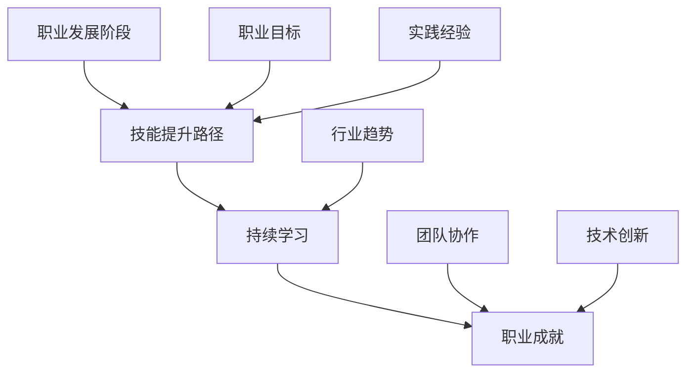
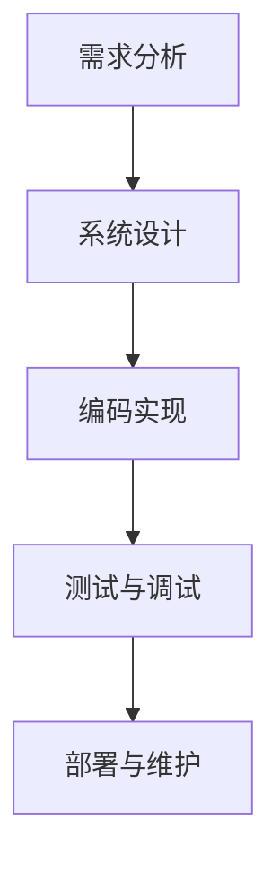
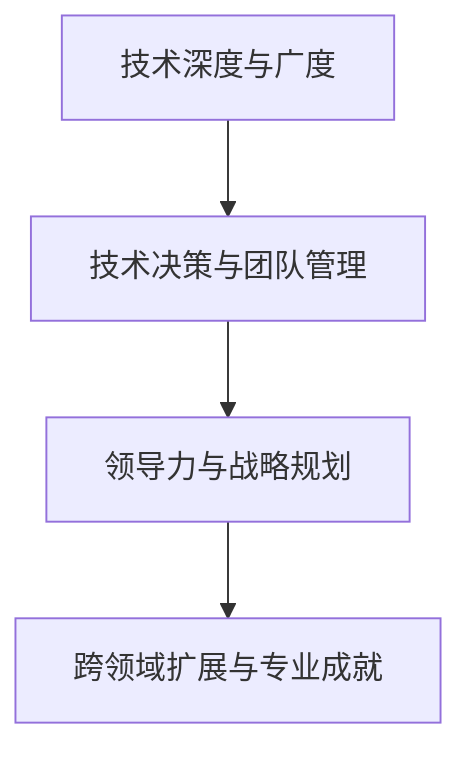
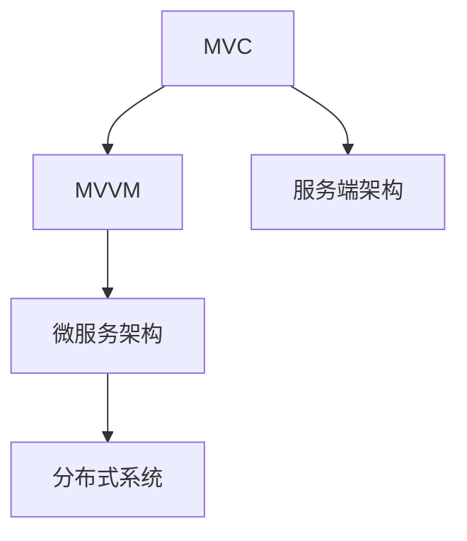
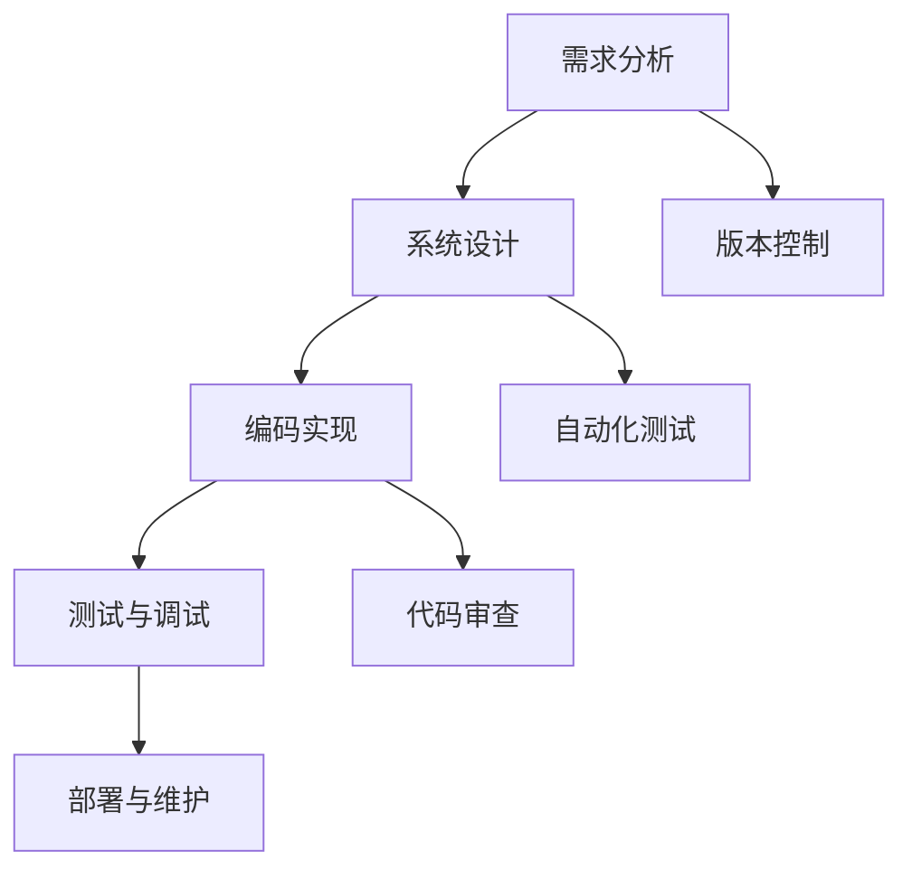
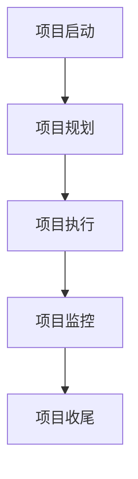
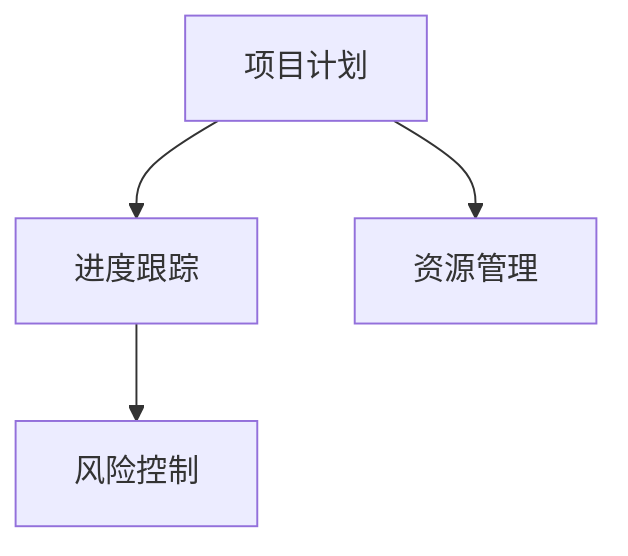
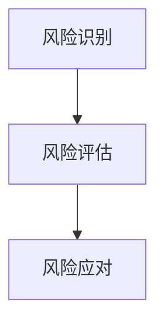

                 

### 第1章：引言与概述

在快速发展的技术时代，程序员的职业生涯规划显得尤为重要。本章节旨在为您介绍本书的整体结构和内容，帮助您更好地理解本书对程序员职业生涯的深远影响。

#### 1.1 本书的重要性

作为一名程序员，从新手到专家，职业生涯的每个阶段都需要精确的规划和持续的精进。本书不仅仅是一本书，它是一张30年的职业路线图，为不同阶段的程序员提供系统性的指导和实用的策略。

- **初学者**：从编程基础开始，为您铺设通往编程世界的第一步。
- **中级程序员**：提供系统设计与开发、项目管理等技能提升路径。
- **高级程序员**：涵盖技术领导力、管理能力等高级技能的培养。
- **职业转型者**：探讨如何在技术不断变革的时代保持竞争力。

#### 1.2 目标读者

本书的目标读者包括但不限于以下几类人群：

- **编程新手**：对编程有浓厚兴趣，但不知道如何开始的人。
- **中级程序员**：希望提升技能，进入中级甚至高级开发角色的程序员。
- **高级程序员**：寻求职业生涯深层次发展的专业人士。
- **技术管理者**：想要了解程序员职业成长过程，提升团队领导力的管理者。

#### 1.3 书的结构与内容安排

本书共分为八个章节，每个章节都针对程序员职业生涯的某个关键方面进行深入探讨：

1. **引言与概述**：介绍本书的重要性和目标读者。
2. **职业生涯规划基础**：讲解职业生涯规划的初步步骤。
3. **初级阶段：基础知识与技能**：从编程语言基础开始，覆盖数据结构与算法。
4. **中级阶段：专业技能提升**：深入系统设计与开发、项目管理等技能。
5. **高级阶段：职业成长与领导力**：探讨技术领导力、管理能力的提升。
6. **不断学习与适应**：分析技术趋势与行业动态，提供学习方法与技巧。
7. **案例分析与经验分享**：通过成功与失败案例，总结经验教训。
8. **未来展望与持续成长**：探讨AI技术对程序员的影响，制定持续成长策略。

接下来的章节将逐步引导您了解如何在这30年的职业生涯中不断提升自己，实现职业目标。

### 1.4 核心概念与联系

在程序员的职业生涯规划中，以下几个核心概念至关重要：

- **职业发展阶段**：初级、中级和高级，每个阶段都需要不同的技能和规划。
- **技能提升路径**：从基础知识到专业技能，再到领导力培养，每个阶段都有明确的提升路径。
- **持续学习**：在快速变化的技术环境中，终身学习是保持竞争力的关键。

为了更好地理解这些核心概念，我们可以使用Mermaid流程图来展示它们之间的关系：



通过这个流程图，我们可以清晰地看到职业发展阶段、技能提升路径、持续学习、职业成就、行业趋势、职业目标、实践经验和团队协作之间的相互影响和联系。

### 1.5 摘要

本书旨在为程序员提供一个全面的职业生涯规划指南，涵盖从初学者到高级开发者的各个阶段。通过深入探讨基础知识与技能、系统设计与开发、项目管理、技术领导力、管理能力提升、持续学习和职业规划，本书帮助程序员制定清晰的职业发展路径，实现个人和职业成长。通过案例分析和经验分享，读者可以从成功和失败中汲取教训，不断完善自己的职业生涯。随着AI技术的兴起，本书还探讨了未来技术对程序员职业发展的影响，帮助程序员制定持续成长策略，保持竞争力。

---

## 第2章：职业生涯规划基础

在开始具体的职业生涯规划之前，理解职业发展的阶段和关键要素是至关重要的。本章将探讨职业发展的不同阶段，包括初级阶段、中级阶段和高级阶段，并详细讲解个人发展规划的过程。

### 2.1 职业发展的阶段

程序员的职业发展可以分为三个主要阶段：初级阶段、中级阶段和高级阶段。每个阶段都有其特定的任务和目标。

#### 2.1.1 初级阶段

初级阶段是程序员职业生涯的起点，这一阶段的重点是掌握编程语言基础、数据结构与算法。以下是初级阶段的几个关键点：

- **学习编程语言**：选择一种主流编程语言，如Python、Java或C/C++，深入学习语言的基本语法和特性。
- **掌握基础算法**：了解并练习基本算法，如排序、查找和图算法，为后续阶段打下坚实的基础。
- **实践项目**：通过实际项目锻炼编程能力，将理论知识应用于实践。

**伪代码示例：**（冒泡排序算法）

```c
function bubbleSort(arr) {
    n = length(arr)
    for i from 0 to n-1 {
        for j from 0 to n-i-1 {
            if arr[j] > arr[j+1] {
                swap(arr[j], arr[j+1])
            }
        }
    }
    return arr
}
```

#### 2.1.2 中级阶段

中级阶段的目标是提升专业技能，掌握系统设计与开发、项目管理等高级技能。以下是中级阶段的几个关键点：

- **系统设计与开发**：学习设计模式、架构模式等，了解如何设计高性能、可扩展的系统。
- **项目管理**：掌握项目生命周期管理、进度控制、风险管理等项目管理技能。
- **实践应用**：参与实际项目，将所学技能应用于实际开发过程中。

**Mermaid流程图：**（系统设计与开发的关键要素）



#### 2.1.3 高级阶段

高级阶段的目标是提升技术领导力和管理能力，成为技术专家或团队领导。以下是高级阶段的几个关键点：

- **技术领导力**：学习技术决策、团队协作、技术创新等，提升技术领导力。
- **管理能力**：掌握团队管理、绩效评估、冲突管理等管理技能。
- **职业成长**：通过不断学习和实践，实现职业生涯的进一步提升。

**Mermaid流程图：**（高级阶段技能提升路径）



### 2.2 个人发展规划

个人发展规划是职业生涯规划的重要组成部分。以下是如何制定个人发展规划的步骤：

#### 2.2.1 职业规划与人生规划

职业规划与人生规划密切相关。以下步骤可以帮助您制定职业规划：

- **设定短期和长期目标**：明确您的职业目标和人生目标，制定具体的计划和时间表。
- **结合个人兴趣**：选择与个人兴趣和价值观相符的职业方向，提高工作满意度。
- **持续评估与调整**：定期评估职业发展进度，根据实际情况调整目标。

**数学公式：**（职业目标优化模型）

$$
\max Z = \sum_{i=1}^{n} w_i \cdot t_i
$$

其中，$w_i$为目标的权重，$t_i$为目标的完成时间。

#### 2.2.2 自我评估与定位

自我评估是了解自己的技能和优势的重要步骤。以下方法可以帮助您进行自我评估：

- **技能评估**：列出您的技能，评估每个技能的熟练程度。
- **兴趣分析**：分析您对哪些领域感兴趣，哪些技能可以与您的兴趣相结合。
- **职业趋势**：了解当前市场的需求，确定哪些技能更具竞争力。

**表格示例：**（自我评估表）

| 技能         | 熟练度 | 自我评价 |
| ------------ | ------ | -------- |
| Python编程   | 高     | 非常熟练 |
| Java开发     | 中     | 有一定经验 |
| 数据库管理   | 初级   | 需要学习 |

#### 2.2.3 职业目标设定与时间规划

设定具体的职业目标和时间规划是实现职业发展的重要步骤。以下是如何设定职业目标和时间规划的步骤：

- **设定具体目标**：确保您的目标是具体、可衡量的。
- **制定时间表**：为每个目标设定完成的时间表，确保目标的可实现性。
- **行动计划**：制定具体的行动计划，确保目标的实现。

**示例：**（职业目标设定与时间规划）

| 目标               | 时间表                   | 行动计划                      |
| ------------------ | ------------------------ | ----------------------------- |
| 掌握Python高级特性 | 6个月                    | 参加在线课程，完成实战项目   |
| 通过PMP认证       | 12个月                   | 学习PMP知识体系，参加培训课程 |

通过以上步骤，您可以制定一个清晰的个人发展规划，为实现职业目标打下坚实的基础。

### 2.3 职业规划的重要性

职业规划对程序员的职业生涯至关重要，以下是一些关键原因：

- **明确目标**：职业规划帮助您明确职业目标，提高工作效率和职业满意度。
- **技能提升**：通过职业规划，您可以有针对性地提升技能，提高职业竞争力。
- **持续发展**：职业规划帮助您在不断变化的技术环境中保持竞争力，实现持续发展。
- **工作与生活平衡**：合理的职业规划有助于您在工作和生活之间找到平衡，提高生活质量。

总之，职业规划是程序员职业生涯的重要组成部分，通过科学合理的规划，您可以更好地实现个人和职业目标。

---

## 第3章：初级阶段：基础知识与技能

### 3.1 编程语言基础

在程序员的职业生涯中，掌握编程语言是初级阶段的重要任务。本节将介绍几种主流编程语言的基础知识，包括Python、Java和C/C++，帮助您为未来的发展打下坚实的基础。

#### 3.1.1 Python基础

Python是一种高级编程语言，以其简洁明了的语法和强大的功能而广受欢迎。以下是Python基础知识的概述：

- **变量和数据类型**：Python中的变量不需要显式声明，数据类型可以是整数、浮点数、字符串等。
  ```python
  x = 10
  y = 3.14
  name = "Alice"
  ```
- **运算符**：Python支持多种运算符，包括算术运算符、比较运算符和逻辑运算符。
  ```python
  result = x + y  # 算术运算
  is_equal = x == y  # 比较运算
  and_result = True and False  # 逻辑运算
  ```
- **控制流程**：Python提供了if-else条件语句、循环语句等控制流程。
  ```python
  if x > y:
      print("x is greater")
  else:
      print("y is greater")
  
  for i in range(5):
      print(i)
  ```

#### 3.1.2 Java基础

Java是一种面向对象的编程语言，广泛应用于企业级应用和Android开发。以下是Java基础知识的概述：

- **类和对象**：Java通过类和对象实现面向对象编程，类是对象的蓝图。
  ```java
  class Animal {
      String name;
      int age;
      
      void eat() {
          System.out.println(name + " is eating.");
      }
  }
  
  Animal animal = new Animal();
  animal.name = "Dog";
  animal.age = 5;
  animal.eat();
  ```
- **继承和多态**：Java支持继承和多态，可以扩展和复用代码。
  ```java
  class Dog extends Animal {
      void bark() {
          System.out.println(name + " is barking.");
      }
  }
  
  Dog dog = new Dog();
  dog.name = "Buddy";
  dog.age = 5;
  dog.eat();
  dog.bark();
  ```
- **异常处理**：Java通过try-catch块实现异常处理，提高程序健壮性。
  ```java
  try {
      int result = 10 / 0;
  } catch (ArithmeticException e) {
      System.out.println("Division by zero error.");
  }
  ```

#### 3.1.3 C/C++基础

C/C++是一种高效的编程语言，广泛应用于操作系统、嵌入式系统和游戏开发。以下是C/C++基础知识的概述：

- **指针和内存管理**：C/C++中的指针是操作内存的重要工具。
  ```c
  int* ptr = malloc(sizeof(int));
  *ptr = 10;
  printf("%d\n", *ptr);
  free(ptr);
  ```
- **结构体与位运算**：结构体用于存储不同类型的数据，位运算用于操作二进制位。
  ```c
  struct Person {
      char name[20];
      int age;
  };
  
  Person p;
  strcpy(p.name, "Alice");
  p.age = 30;
  
  unsigned int x = 0b10101010;
  unsigned int y = 0b11001100;
  unsigned int result = x & y;
  ```
- **文件操作**：C/C++提供了丰富的文件操作函数，用于读写文件。
  ```c
  FILE* file = fopen("example.txt", "r");
  char line[100];
  while (fgets(line, sizeof(line), file) != NULL) {
      printf("%s", line);
  }
  fclose(file);
  ```

通过掌握Python、Java和C/C++的基础知识，您将为未来的编程实践奠定坚实的基础。

### 3.2 数据结构与算法

数据结构与算法是计算机科学的核心，它们在程序设计中的应用至关重要。以下是常见的数据结构和算法的概述。

#### 3.2.1 常见数据结构

数据结构是用于存储和组织数据的方式，常见的有数组、链表、栈和队列。

- **数组**：数组是一种固定大小的数据集合，元素存储在连续的内存空间中。
  ```c
  int arr[5] = {1, 2, 3, 4, 5};
  ```
- **链表**：链表由节点组成，每个节点包含数据和指向下一个节点的指针。
  ```c
  struct Node {
      int data;
      Node* next;
  };
  
  Node* head = NULL;
  Node* tail = NULL;
  
  void insert_at_end(int data) {
      Node* newNode = (Node*)malloc(sizeof(Node));
      newNode->data = data;
      newNode->next = NULL;
      
      if (head == NULL) {
          head = newNode;
          tail = newNode;
      } else {
          tail->next = newNode;
          tail = newNode;
      }
  }
  ```
- **栈**：栈是一种后进先出（LIFO）的数据结构，常用于函数调用和递归。
  ```c
  struct Stack {
      int top;
      int* arr;
  };
  
  void push(Stack* s, int data) {
      s->top++;
      s->arr[s->top] = data;
  }
  
  int pop(Stack* s) {
      if (s->top == -1) {
          return -1;
      }
      int data = s->arr[s->top];
      s->top--;
      return data;
  }
  ```
- **队列**：队列是一种先进先出（FIFO）的数据结构，常用于任务调度和缓冲。
  ```c
  struct Queue {
      int front;
      int rear;
      int* arr;
  };
  
  void enqueue(Queue* q, int data) {
      q->rear++;
      q->arr[q->rear] = data;
  }
  
  int dequeue(Queue* q) {
      if (q->front == -1) {
          return -1;
      }
      int data = q->arr[q->front];
      q->front++;
      return data;
  }
  ```

#### 3.2.2 常见算法

算法是解决问题的步骤和规则，常见的有排序算法、查找算法和图算法。

- **排序算法**：排序算法用于对数组中的元素进行排序。
  ```c
  void bubble_sort(int arr[], int n) {
      for (int i = 0; i < n - 1; i++) {
          for (int j = 0; j < n - i - 1; j++) {
              if (arr[j] > arr[j + 1]) {
                  swap(&arr[j], &arr[j + 1]);
              }
          }
      }
  }
  ```
- **查找算法**：查找算法用于在数组中查找特定元素。
  ```c
  int binary_search(int arr[], int l, int r, int x) {
      while (l <= r) {
          int m = l + (r - l) / 2;
  
          if (arr[m] == x)
              return m;
  
          if (arr[m] < x)
              l = m + 1;
          else
              r = m - 1;
      }
  
      return -1;
  }
  ```
- **图算法**：图算法用于解决与图相关的问题，如最短路径、图遍历等。
  ```c
  void dfs(int graph[][] , int v, bool visited[]) {
      visited[v] = true;
      cout << v << " ";
  
      for (int i = 0; i < V; i++)
          if (graph[v][i] && !visited[i])
              dfs(graph, i, visited);
  }
  ```

通过掌握这些常见的数据结构和算法，您将能够在编程实践中更加高效地解决问题。

### 3.2.3 算法分析

算法分析是评估算法性能的重要方法，主要包括时间复杂度和空间复杂度。

- **时间复杂度**：时间复杂度表示算法执行时间与输入数据规模的关系。常见的复杂度有O(1)、O(log n)、O(n)、O(n log n)等。
  ```latex
  \text{时间复杂度} = O(n \log n)
  ```
- **空间复杂度**：空间复杂度表示算法执行过程中所需额外内存空间与输入数据规模的关系。常见的复杂度有O(1)、O(n)等。
  ```latex
  \text{空间复杂度} = O(n)
  ```

通过算法分析，您可以更准确地评估不同算法的效率和适用场景。

### 3.3 实践项目

为了巩固所学的编程语言和数据结构知识，以下是一个简单的实践项目——实现一个简单的银行管理系统。

**项目目标：** 创建一个能够存储账户信息、存款、取款和查询余额的银行管理系统。

**开发环境：** Python 3.8

**实现步骤：**

1. 定义账户类，包含账户基本信息和操作方法。
2. 创建账户存储结构，用于存储账户信息。
3. 实现存款、取款和查询余额功能。
4. 编写主程序，使用账户操作功能。

**源代码：**

```python
class Account:
    def __init__(self, account_number, balance):
        self.account_number = account_number
        self.balance = balance
    
    def deposit(self, amount):
        self.balance += amount
        print(f"Deposit successful. New balance: ${self.balance:.2f}")
    
    def withdraw(self, amount):
        if amount > self.balance:
            print("Insufficient funds.")
        else:
            self.balance -= amount
            print(f"Withdrawal successful. New balance: ${self.balance:.2f}")
    
    def get_balance(self):
        print(f"Account balance: ${self.balance:.2f}")

def main():
    accounts = []

    while True:
        print("\nBank Management System")
        print("1. Create account")
        print("2. Deposit")
        print("3. Withdraw")
        print("4. Check balance")
        print("5. Exit")
        choice = input("Enter your choice: ")
        
        if choice == "1":
            account_number = input("Enter account number: ")
            balance = float(input("Enter initial balance: "))
            account = Account(account_number, balance)
            accounts.append(account)
            print("Account created successfully.")
        
        elif choice == "2":
            account_number = input("Enter account number: ")
            amount = float(input("Enter deposit amount: "))
            found = False
            for account in accounts:
                if account.account_number == account_number:
                    account.deposit(amount)
                    found = True
                    break
            if not found:
                print("Account not found.")
        
        elif choice == "3":
            account_number = input("Enter account number: ")
            amount = float(input("Enter withdrawal amount: "))
            found = False
            for account in accounts:
                if account.account_number == account_number:
                    account.withdraw(amount)
                    found = True
                    break
            if not found:
                print("Account not found.")
        
        elif choice == "4":
            account_number = input("Enter account number: ")
            found = False
            for account in accounts:
                if account.account_number == account_number:
                    account.get_balance()
                    found = True
                    break
            if not found:
                print("Account not found.")
        
        elif choice == "5":
            print("Exiting system.")
            break

if __name__ == "__main__":
    main()
```

**代码解读：**

1. **账户类（Account）**：定义账户类，包含账户号、余额和操作方法（存款、取款、查询余额）。
2. **主程序（main）**：实现菜单界面，根据用户输入执行相应操作，管理账户列表。

通过这个项目，您可以巩固所学知识，并理解实际编程中的常见操作。

---

## 第4章：中级阶段：专业技能提升

在初级阶段掌握了编程语言和数据结构的基础上，中级阶段的目标是提升专业技能，掌握系统设计与开发、项目管理等高级技能。本章节将详细探讨这些领域，帮助您在职业生涯中取得更大的成就。

### 4.1 系统设计与开发

系统设计与开发是程序员职业生涯中的重要环节，涉及系统架构、设计模式、开发流程等多个方面。以下是对这些关键要素的深入探讨。

#### 4.1.1 系统设计原则

在进行系统设计时，遵循以下原则可以提高系统的可靠性、可维护性和可扩展性：

1. **模块化设计**：将系统划分为独立的模块，每个模块具有明确的功能和接口，便于管理和维护。
2. **高内聚低耦合**：模块之间应保持低耦合，减少模块间的依赖，提高系统的灵活性和可测试性。
3. **可扩展性**：系统设计应考虑未来需求的变化，允许在不影响现有功能的情况下进行扩展。
4. **可维护性**：系统设计应易于理解、修改和升级，降低维护成本。

#### 4.1.2 常见架构模式

在系统设计中，常见的架构模式包括MVC、MVVM和微服务架构。以下是这些架构模式的基本概念和特点：

1. **MVC（Model-View-Controller）**：
   - **Model**：表示应用程序的数据和业务逻辑。
   - **View**：表示用户界面，用于展示数据。
   - **Controller**：处理用户输入，更新模型和视图。

2. **MVVM（Model-View-ViewModel）**：
   - **Model**：与MVC相同。
   - **View**：与MVC相同。
   - **ViewModel**：负责将模型数据转换为视图可识别的数据格式，并处理用户交互。

3. **微服务架构**：
   - **微服务**：将应用程序划分为多个独立的服务，每个服务实现特定的业务功能。
   - **服务注册与发现**：服务启动时注册到注册中心，需要时通过注册中心发现其他服务。
   - **分布式通信**：服务之间通过RESTful API或其他分布式通信协议进行通信。

**Mermaid流程图：**（常见架构模式）



#### 4.1.3 开发流程与工具

成功的系统开发离不开良好的开发流程和工具支持。以下是一些常用的开发流程和工具：

1. **软件开发生命周期（SDLC）**：
   - **需求分析**：明确系统需求，制定项目计划。
   - **系统设计**：设计系统架构，定义模块和接口。
   - **编码实现**：编写代码，实现系统功能。
   - **测试与调试**：对代码进行单元测试、集成测试和系统测试，确保系统的稳定性。
   - **部署与维护**：将系统部署到生产环境，进行日常维护和更新。

2. **版本控制系统（VCS）**：
   - **Git**：分布式版本控制系统，支持多分支开发和快速合并。
   - **SVN**：集中式版本控制系统，适合小团队和单分支开发。

3. **自动化工具**：
   - **持续集成（CI）**：自动化构建、测试和部署，提高开发效率和代码质量。
   - **持续部署（CD）**：自动化部署代码到生产环境，缩短发布周期。

**Mermaid流程图：**（软件开发生命周期）



通过掌握系统设计与开发的原则、架构模式、开发流程和工具，您将能够在项目中设计出高质量的系统，提升专业技能。

### 4.2 项目管理

项目管理是确保项目按时、按预算和按质量完成的关键。以下将探讨项目管理的关键要素和最佳实践。

#### 4.2.1 项目生命周期

项目生命周期包括以下阶段：

1. **项目启动**：明确项目目标和范围，组建项目团队。
2. **项目规划**：制定详细的项目计划，包括任务分配、时间表和预算。
3. **项目执行**：按照计划执行项目任务，监控进度和资源使用。
4. **项目监控**：定期评估项目进展，识别和解决潜在问题。
5. **项目收尾**：完成项目交付，进行项目总结和评估。

**Mermaid流程图：**（项目生命周期）



#### 4.2.2 项目计划与进度控制

项目计划是项目管理的核心，以下是一些关键要素：

1. **任务分配**：明确项目任务，分配给合适的团队成员。
2. **时间表**：制定详细的项目时间表，包括关键里程碑和交付日期。
3. **资源管理**：确保项目所需资源（人力、资金、设备等）充足。
4. **进度控制**：监控项目进度，及时调整计划以应对变化。

**Mermaid流程图：**（项目计划与进度控制）



#### 4.2.3 项目风险管理

风险管理是项目管理的重要方面，以下是一些关键要素：

1. **风险识别**：识别项目中的潜在风险，包括技术风险、市场风险等。
2. **风险评估**：评估风险的可能性和影响，制定相应的应对策略。
3. **风险应对**：实施风险管理计划，降低风险对项目的影响。

**Mermaid流程图：**（项目风险管理）



通过掌握项目生命周期的各个阶段、项目计划与进度控制、项目风险管理，您将能够有效地管理项目，确保项目的成功完成。

### 4.3 实践项目

为了巩固所学的系统设计与开发和项目管理知识，以下是一个简单的实践项目——实现一个图书管理系统。

**项目目标：** 创建一个能够实现图书信息管理、借阅管理和库存管理的图书管理系统。

**开发环境：** Python 3.8

**实现步骤：**

1. 定义图书类，包含图书基本信息和操作方法。
2. 创建数据库连接，存储和管理图书信息。
3. 实现图书借阅功能，包括借阅和归还。
4. 实现库存管理功能，包括图书新增和删除。
5. 编写主程序，实现用户交互和功能调用。

**源代码：**

```python
import sqlite3

# 连接数据库
conn = sqlite3.connect("books.db")
cursor = conn.cursor()

# 创建图书表
cursor.execute('''CREATE TABLE IF NOT EXISTS books
                  (id INTEGER PRIMARY KEY AUTOINCREMENT,
                  title TEXT NOT NULL,
                  author TEXT NOT NULL,
                  isbn TEXT NOT NULL UNIQUE,
                  published_date TEXT NOT NULL,
                  price REAL NOT NULL)''')

# 定义图书类
class Book:
    def __init__(self, title, author, isbn, published_date, price):
        self.title = title
        self.author = author
        self.isbn = isbn
        self.published_date = published_date
        self.price = price

    def add_book(self):
        cursor.execute("INSERT INTO books (title, author, isbn, published_date, price) VALUES (?, ?, ?, ?, ?)",
                       (self.title, self.author, self.isbn, self.published_date, self.price))
        conn.commit()
        print("Book added successfully.")

    def remove_book(self, isbn):
        cursor.execute("DELETE FROM books WHERE isbn = ?", (isbn,))
        conn.commit()
        print("Book removed successfully.")

    def borrow_book(self, isbn):
        cursor.execute("SELECT * FROM books WHERE isbn = ?", (isbn,))
        book = cursor.fetchone()
        if book:
            cursor.execute("UPDATE books SET price = price + 10 WHERE isbn = ?", (isbn,))
            conn.commit()
            print(f"{book[1]} borrowed successfully. New price: ${book[5] + 10:.2f}")
        else:
            print("Book not found.")

    def return_book(self, isbn):
        cursor.execute("UPDATE books SET price = price - 10 WHERE isbn = ?", (isbn,))
        conn.commit()
        print("Book returned successfully.")

# 主程序
def main():
    while True:
        print("\nLibrary Management System")
        print("1. Add book")
        print("2. Remove book")
        print("3. Borrow book")
        print("4. Return book")
        print("5. Exit")
        choice = input("Enter your choice: ")
        
        if choice == "1":
            title = input("Enter book title: ")
            author = input("Enter author name: ")
            isbn = input("Enter ISBN: ")
            published_date = input("Enter published date (YYYY-MM-DD): ")
            price = float(input("Enter price: "))
            book = Book(title, author, isbn, published_date, price)
            book.add_book()
        
        elif choice == "2":
            isbn = input("Enter ISBN of the book to remove: ")
            book = Book(None, None, isbn, None, None)
            book.remove_book(isbn)
        
        elif choice == "3":
            isbn = input("Enter ISBN of the book to borrow: ")
            book = Book(None, None, isbn, None, None)
            book.borrow_book(isbn)
        
        elif choice == "4":
            isbn = input("Enter ISBN of the book to return: ")
            book = Book(None, None, isbn, None, None)
            book.return_book(isbn)
        
        elif choice == "5":
            print("Exiting system.")
            break

if __name__ == "__main__":
    main()
```

**代码解读：**

1. **数据库连接**：创建数据库连接，并创建图书表。
2. **图书类（Book）**：定义图书类，包含图书基本信息和操作方法（添加图书、删除图书、借阅图书、归还图书）。
3. **主程序**：实现用户交互，调用图书类的操作方法。

通过这个项目，您可以巩固系统设计与开发和项目管理的知识，并理解实际开发中的常见操作。

---

## 第5章：高级阶段：职业成长与领导力

在达到中级阶段后，程序员的职业生涯进入高级阶段。这个阶段不仅要求技术上的深度和广度，还需要在领导力和管理能力上有所提升。本章将探讨技术领导力、管理能力提升以及如何成为一名优秀的技术领导者。

### 5.1 技术领导力

技术领导力是高级程序员必备的能力，它涉及技术决策、团队协作和技术创新等方面。

#### 5.1.1 技术决策与团队协作

技术领导者在项目中扮演决策者的角色，需要做出以下关键决策：

1. **技术选型**：根据项目需求和团队技能选择合适的技术栈和工具。
2. **技术评审**：对开发中的技术方案进行评审，确保方案的可行性和高质量。
3. **代码审查**：定期审查代码，提高代码质量和团队协作效率。

**伪代码示例：**（技术评审流程）

```python
def review_code(code, reviewer):
    if not code:
        return "Code review skipped."
    errors = []
    for line in code:
        if not line.strip():
            errors.append("Empty line found.")
        elif not line.startswith("//"):
            errors.append("Line should start with a comment.")
    if errors:
        return "Code review failed: " + ", ".join(errors)
    else:
        return "Code review passed."

reviewer = "TechLead"
code = ["// This is a comment.", "variable = 10;", ""]
print(review_code(code, reviewer))
```

#### 5.1.2 技术创新与引领

技术创新是保持团队竞争力的重要手段，技术领导者需要：

1. **跟踪技术趋势**：关注行业最新技术动态，了解新兴技术和工具。
2. **推动技术升级**：评估现有技术，提出升级方案，推动团队采用新技术。
3. **培养创新文化**：鼓励团队成员提出创新想法，并支持实践。

**伪代码示例：**（技术升级评估）

```python
def evaluate_technology(currentTech, newTech):
    if not currentTech or not newTech:
        return "Invalid input."
    if newTech.has_feature(currentTech):
        return "No need to upgrade."
    else:
        return "Upgrade recommended."

newTech = "AI Framework"
currentTech = "Standard Library"
print(evaluate_technology(currentTech, newTech))
```

#### 5.1.3 技术演讲与交流

技术演讲与交流是技术领导者展示技术能力、传递知识的重要方式。以下是一些关键技巧：

1. **准备充分**：提前准备演讲内容，熟悉技术细节和案例。
2. **清晰表达**：使用简单明了的语言，避免过于专业的术语。
3. **互动引导**：鼓励观众提问，互动交流，增加演讲的吸引力。

**示例：**（技术演讲框架）

```
Title: AI技术在软件开发中的应用

Introduction:
- 简要介绍AI技术及其在软件开发中的应用场景。
- 引出演讲主题。

Content:
- 案例一：使用AI进行代码审查。
- 案例二：使用AI进行自然语言处理。
- 案例三：使用AI进行自动化测试。

Conclusion:
- 总结AI技术在软件开发中的应用和优势。
- 提出未来发展方向。
- 鼓励观众提问和交流。
```

### 5.2 管理能力提升

在高级阶段，程序员需要提升管理能力，以更好地带领团队和项目。

#### 5.2.1 管理心理学

管理心理学涉及团队沟通、员工激励和冲突管理等方面。以下是一些建议：

1. **团队沟通**：建立有效的沟通机制，确保信息流畅传递，提高团队协作效率。
2. **员工激励**：关注员工需求，提供成长机会和奖励机制，提高员工满意度。
3. **冲突管理**：及时处理冲突，避免影响团队氛围和工作效率。

**示例：**（团队沟通策略）

```
Weekly Meeting:
- 会议前准备：明确会议议程，提前通知参会人员。
- 会议中：确保每个人都能够发言，讨论问题，达成共识。
- 会议后：总结会议成果，跟进行动计划。
```

#### 5.2.2 团队管理

团队管理涉及人员配置、绩效评估和团队建设等方面。以下是一些建议：

1. **人员配置**：根据项目需求和员工技能进行合理配置，确保团队能力均衡。
2. **绩效评估**：定期评估团队成员的工作表现，提供反馈和改进建议。
3. **团队建设**：组织团队活动，增强团队凝聚力和归属感。

**示例：**（绩效评估流程）

```
绩效评估周期：每季度一次

评估步骤：
1. 设定评估标准和目标。
2. 收集团队成员的工作表现数据。
3. 与团队成员进行一对一评估会议，讨论工作成果和改进点。
4. 提供反馈和建议，制定个人发展计划。
```

#### 5.2.3 领导力培养

领导力培养是高级程序员不断提升自身能力的必要步骤。以下是一些建议：

1. **自我反思**：定期反思自己的行为和决策，识别不足并改进。
2. **学习与实践**：学习领导力理论，结合实际工作场景进行实践。
3. **接受反馈**：积极接受团队成员和上级的反馈，不断提升领导力。

**示例：**（领导力培养计划）

```
每月领导力发展活动：
- 阅读领导力书籍。
- 参加领导力培训课程。
- 与团队成员分享领导力心得。
- 反思领导力实践中的问题。
```

通过不断提升技术领导力和管理能力，程序员可以在职业生涯中取得更大的成功。

### 5.3 实践项目

为了巩固高级阶段的知识和技能，以下是一个简单的实践项目——实现一个基于微服务架构的博客系统。

**项目目标：** 创建一个能够实现博客文章发布、评论管理和用户认证的博客系统。

**开发环境：** Spring Boot 2.2.5, MySQL 8.0, Docker

**实现步骤：**

1. 设计微服务架构，划分博客文章服务、评论服务和用户认证服务。
2. 创建数据库，设计数据库表结构。
3. 实现每个微服务，包括API接口、业务逻辑和数据库操作。
4. 使用Docker容器化每个微服务，并配置服务注册与发现。
5. 编写主程序，实现用户交互和功能调用。

**源代码：**

**博客文章服务（blog-service）**

```java
// Spring Boot application class for blog service
@SpringBootApplication
public class BlogServiceApplication {
    public static void main(String[] args) {
        SpringApplication.run(BlogServiceApplication.class, args);
    }
}

// Controller for blog posts
@RestController
@RequestMapping("/api/posts")
public class PostController {
    @Autowired
    private PostService postService;

    @GetMapping
    public List<Post> getAllPosts() {
        return postService.getAllPosts();
    }

    @PostMapping
    public Post createPost(@RequestBody Post post) {
        return postService.createPost(post);
    }

    @GetMapping("/{id}")
    public Post getPostById(@PathVariable Long id) {
        return postService.getPostById(id);
    }

    @PutMapping("/{id}")
    public Post updatePost(@PathVariable Long id, @RequestBody Post post) {
        return postService.updatePost(id, post);
    }

    @DeleteMapping("/{id}")
    public void deletePost(@PathVariable Long id) {
        postService.deletePost(id);
    }
}

// Service for blog posts
@Service
public class PostService {
    // Database operations for posts
    // ...
}
```

**评论服务（comment-service）**

```java
// Spring Boot application class for comment service
@SpringBootApplication
public class CommentServiceApplication {
    public static void main(String[] args) {
        SpringApplication.run(CommentServiceApplication.class, args);
    }
}

// Controller for comments
@RestController
@RequestMapping("/api/comments")
public class CommentController {
    @Autowired
    private CommentService commentService;

    @GetMapping
    public List<Comment> getAllComments() {
        return commentService.getAllComments();
    }

    @PostMapping
    public Comment createComment(@RequestBody Comment comment) {
        return commentService.createComment(comment);
    }

    @GetMapping("/{id}")
    public Comment getCommentById(@PathVariable Long id) {
        return commentService.getCommentById(id);
    }

    @PutMapping("/{id}")
    public Comment updateComment(@PathVariable Long id, @RequestBody Comment comment) {
        return commentService.updateComment(id, comment);
    }

    @DeleteMapping("/{id}")
    public void deleteComment(@PathVariable Long id) {
        commentService.deleteComment(id);
    }
}

// Service for comments
@Service
public class CommentService {
    // Database operations for comments
    // ...
}
```

**用户认证服务（auth-service）**

```java
// Spring Boot application class for authentication service
@SpringBootApplication
public class AuthServiceApplication {
    public static void main(String[] args) {
        SpringApplication.run(AuthServiceApplication.class, args);
    }
}

// Controller for authentication
@RestController
@RequestMapping("/api/auth")
public class AuthController {
    @Autowired
    private AuthenticationService authenticationService;

    @PostMapping("/register")
    public ResponseEntity<?> registerUser(@RequestBody UserRequest userRequest) {
        return authenticationService.registerUser(userRequest);
    }

    @PostMapping("/login")
    public ResponseEntity<?> authenticateUser(@RequestBody LoginRequest loginRequest) {
        return authenticationService.authenticateUser(loginRequest);
    }
}

// Service for authentication
@Service
public class AuthenticationService {
    // Authentication logic
    // ...
}
```

**主程序（main）**

```java
// Main application class for the blog system
@SpringBootApplication
public class BlogSystemApplication {
    public static void main(String[] args) {
        SpringApplication.run(BlogSystemApplication.class, args);
    }
}

// Main controller for the blog system
@RestController
@RequestMapping("/api/blog")
public class BlogController {
    @Autowired
    private BlogService blogService;

    @Autowired
    private CommentService commentService;

    @Autowired
    private AuthService authService;

    // Define API endpoints for blog posts, comments, and user authentication
    // ...
}
```

**代码解读：**

1. **博客文章服务（blog-service）**：实现博客文章的增删改查功能。
2. **评论服务（comment-service）**：实现评论的增删改查功能。
3. **用户认证服务（auth-service）**：实现用户注册和登录功能。
4. **主程序**：集成博客文章服务、评论服务和用户认证服务，提供统一的API接口。

通过这个项目，您可以巩固高级阶段的知识，并理解微服务架构的实际应用。

---

## 第6章：不断学习与适应

在技术快速发展的今天，持续学习与适应成为程序员职业生涯成功的关键。本章将探讨技术趋势与行业动态、学习方法与技巧以及个人成长与职业规划，帮助您在不断变化的环境中保持竞争力。

### 6.1 技术趋势与行业动态

技术领域日新月异，了解最新的技术趋势和行业动态对于程序员的职业发展至关重要。以下是一些重要的技术趋势和行业动态：

#### 6.1.1 新技术介绍

1. **人工智能（AI）**：AI技术在各个领域的应用日益广泛，包括自然语言处理、计算机视觉、机器学习和深度学习等。了解AI的基本原理和常用框架（如TensorFlow、PyTorch）对于程序员来说至关重要。
2. **区块链**：区块链技术以其去中心化和安全性在金融、供应链管理、身份验证等领域得到广泛应用。了解区块链的基本概念和工作原理对于拓展技术视野很有帮助。
3. **物联网（IoT）**：IoT技术的快速发展使得设备互联成为可能，为智能城市、智能家居、工业自动化等领域带来了新的机遇。了解物联网的基本架构和通信协议（如MQTT、HTTP）是必不可少的。

#### 6.1.2 行业发展趋势

1. **云计算**：随着云计算技术的普及，越来越多的企业将业务转移到云平台，这为程序员提供了丰富的就业机会。了解云服务提供商（如AWS、Azure、Google Cloud）的架构和服务对于职业发展非常有帮助。
2. **DevOps**：DevOps文化的兴起推动了软件开发和运维的融合，自动化部署、持续集成和持续交付成为软件开发的新常态。掌握DevOps工具（如Jenkins、Docker、Kubernetes）对于提高开发效率和项目质量至关重要。
3. **大数据**：大数据技术的应用越来越广泛，企业需要处理和分析海量数据来获得业务洞察。了解大数据技术（如Hadoop、Spark、Hive）对于数据处理和业务分析能力有很大提升。

#### 6.1.3 跨界融合与新兴领域

1. **生物信息学**：随着基因编辑技术的进步，生物信息学在医疗健康领域发挥着越来越重要的作用。了解生物信息学的基本原理和常用工具（如BioPython、BioJava）对于跨领域发展非常有益。
2. **量子计算**：量子计算是一种基于量子力学原理的计算技术，具有极高的计算速度。虽然目前仍处于研究阶段，但了解量子计算的基本原理和潜在应用对于未来职业规划有很大帮助。
3. **边缘计算**：边缘计算将计算能力推向网络边缘，提高实时数据处理和响应速度。了解边缘计算的基本概念和通信协议（如MQTT、CoAP）对于智能设备互联和网络优化具有重要意义。

### 6.2 个人成长与职业规划

个人成长与职业规划是程序员职业生涯中不可或缺的一部分。以下是一些关键步骤和方法：

#### 6.2.1 学习方法与技巧

1. **有效学习**：选择适合自己的学习方式，如在线课程、实践项目和研讨会。制定学习计划，确保学习效率。
2. **实践应用**：将所学知识应用于实际项目中，通过实践提高技能和解决问题的能力。
3. **持续迭代**：不断更新和调整学习计划，根据反馈和实际情况进行调整，以适应不断变化的技术环境。

#### 6.2.2 职业发展路径规划

1. **设定职业目标**：明确短期和长期职业目标，如成为某项技术的专家、团队领导或创业。
2. **评估自身能力**：了解自己的优势和不足，评估当前职业市场对各类技能的需求。
3. **制定行动计划**：根据职业目标和学习评估结果，制定具体的行动计划，包括技能提升、项目实践和职业转型等。

#### 6.2.3 跨界发展与职业转型

1. **跨领域学习**：了解并学习其他领域的知识，如商业管理、市场营销等，以拓宽职业发展路径。
2. **职业转型策略**：根据个人兴趣和市场需求，制定职业转型计划，如从开发转向产品管理或数据分析。
3. **自我品牌建设**：通过社交媒体、技术博客、演讲和参与社区活动等方式建立个人品牌，提高知名度和影响力。

### 6.3 持续学习的重要性

持续学习是程序员保持竞争力的重要保障。以下是一些原因和方法：

#### 6.3.1 终身学习的重要性

1. **技术更新迅速**：随着技术的发展，新工具、新框架和新语言不断涌现，程序员需要不断学习以跟上技术步伐。
2. **职业发展需求**：持续学习是职业发展的重要驱动力，能够帮助程序员在竞争激烈的职场中脱颖而出。

#### 6.3.2 学习方法

1. **在线课程**：利用在线课程平台（如Coursera、

