                 

### 《程序员的退休生活：提前规划与准备》

**关键词**：程序员、退休生活、财务规划、健康管理、社交活动、职业转型

**摘要**：本文旨在为程序员提供一份全面的退休生活规划指南，包括财务规划、健康管理、社交活动、职业转型等方面的内容。通过提前规划和准备，帮助程序员在退休后过上幸福、充实的生活。

### 第1章：退休规划的必要性

#### 1.1 了解退休制度与政策

**核心概念与联系**

- **退休制度**：退休制度是国家或企业制定的关于职工退休年龄、退休金发放等方面的规定。了解退休制度有助于程序员明确退休的相关政策和规定。
- **退休政策**：退休政策是国家或地方政府针对退休问题出台的指导性文件或措施。掌握退休政策有助于程序员了解退休后的待遇和福利。

**Mermaid 流程图**

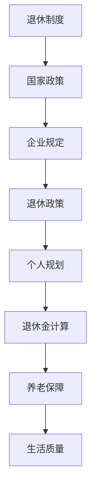

**核心算法原理讲解**

- **退休制度了解**：程序员可以通过查询国家或企业官网，了解退休制度的具体内容和规定。
- **退休政策掌握**：程序员可以通过阅读相关政策文件或咨询专业人士，了解退休政策的具体内容和影响。

**伪代码**

```python
function get_retirement_policy():
    # 查询国家政策
    national_policy = query_national_policy()
    # 查询企业规定
    company_rules = query_company_rules()
    # 返回退休政策
    return national_policy, company_rules
```

**数学模型和数学公式**

- **退休金计算**：退休金的计算方法通常包括基本养老金、个人账户养老金和过渡性养老金等部分。

$$
\text{退休金} = \text{基本养老金} + \text{个人账户养老金} + \text{过渡性养老金}
$$

**举例说明**

- **退休金计算示例**：假设一位程序员的基本养老金为3000元，个人账户养老金为2000元，过渡性养老金为1000元，则其退休金为6000元。

#### 1.2 自我评估与需求分析

**核心概念与联系**

- **自我评估**：自我评估是程序员在退休规划过程中，对自身健康状况、兴趣爱好、财务状况等方面进行评价的过程。
- **需求分析**：需求分析是根据自我评估结果，分析退休后需要满足的基本需求，如生活费用、娱乐活动、医疗保健等。

**Mermaid 流程图**

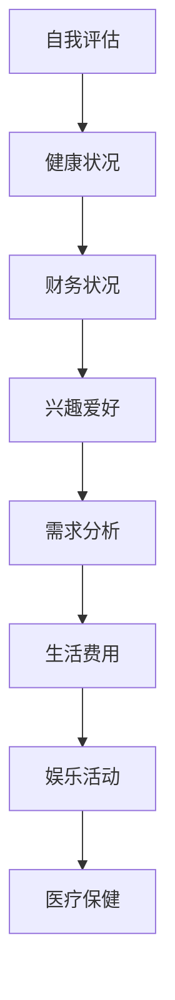

**核心算法原理讲解**

- **自我评估**：程序员可以通过问卷调查、自我反思等方式，对自己的健康状况、兴趣爱好、财务状况等进行评估。
- **需求分析**：程序员可以根据自我评估结果，制定详细的退休需求清单，包括生活费用、娱乐活动、医疗保健等方面的需求。

**伪代码**

```python
function self_evaluation():
    # 健康状况评估
    health_status = assess_health()
    # 财务状况评估
    financial_status = assess_finances()
    # 兴趣爱好评估
    interests = assess_interests()
    # 返回评估结果
    return health_status, financial_status, interests

function demand_analysis(evaluation_results):
    health_demand = determine_health_needs(evaluation_results[0])
    financial_demand = determine_financial_needs(evaluation_results[1])
    interest_demand = determine_interest_needs(evaluation_results[2])
    # 返回需求分析结果
    return health_demand, financial_demand, interest_demand
```

**数学模型和数学公式**

- **生活费用计算**：生活费用可以通过计算日常支出和预期支出，来确定退休后的生活费用。

$$
\text{生活费用} = \text{日常支出} + \text{预期支出}
$$

**举例说明**

- **生活费用计算示例**：假设一位程序员的日常支出为每月5000元，预期支出为每月2000元，则其退休后的生活费用为每月7000元。

#### 1.3 制定退休规划目标

**核心概念与联系**

- **目标设定**：目标设定是退休规划的关键步骤，包括短期、中期和长期目标的制定。
- **目标实现**：目标实现是通过具体措施和行动，实现退休规划的目标。

**Mermaid 流程图**

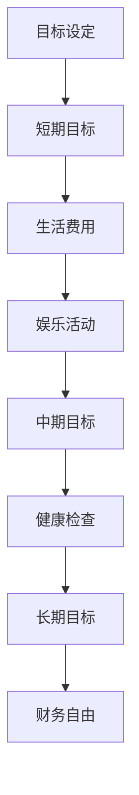

**核心算法原理讲解**

- **目标设定**：程序员可以根据自我评估和需求分析的结果，设定短期、中期和长期目标。短期目标可以是每年进行一次健康检查，中期目标可以是五年内实现财务自由，长期目标可以是十年内实现全面退休。
- **目标实现**：程序员需要制定具体的实施计划，通过持续的努力和行动，实现退休规划的目标。

**数学模型和数学公式**

- **目标实现评估**：目标实现评估可以通过计算实际完成情况与预期目标的差距，来评估目标的实现情况。

$$
\text{目标实现度} = \frac{\text{实际完成情况}}{\text{预期目标}} \times 100\%
$$

**举例说明**

- **目标设定示例**：假设一位程序员的短期目标是每年进行一次健康检查，中期目标是五年内实现财务自由，长期目标是十年内实现全面退休。

- **目标实现评估示例**：假设一位程序员在五年内成功实现财务自由，则其目标实现度为：

$$
\text{目标实现度} = \frac{5}{5} \times 100\% = 100\%
$$

### 第2章：财务规划

#### 2.1 收支管理

**核心概念与联系**

- **收入管理**：收入管理是确保程序员在退休后能够获得稳定收入的过程。
- **支出管理**：支出管理是制定合理的支出计划，控制生活费用的过程。

**Mermaid 流程图**

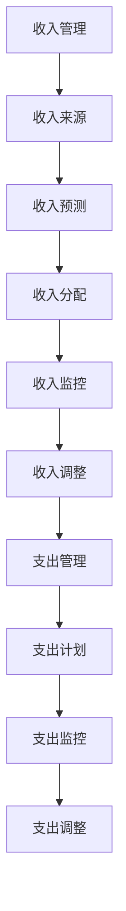

**核心算法原理讲解**

- **收入管理**：程序员可以通过多种途径获得收入，如投资收益、存款利息、租金收入等。收入管理的关键是确保收入稳定，并且能够满足退休后的生活需求。
- **支出管理**：支出管理的关键是合理规划生活费用，避免不必要的开支，并且确保生活费用能够得到有效控制。

**伪代码**

```python
function income_management():
    # 确定收入来源
    income_sources = determine_income_sources()
    # 预测收入
    predicted_income = predict_income(income_sources)
    # 分配收入
    allocated_income = allocate_income(predicted_income)
    # 监控收入
    monitored_income = monitor_income(allocated_income)
    # 调整收入管理策略
    adjusted_income_management = adjust_income_management(monitored_income)

function expense_management():
    # 制定支出计划
    expense_plan = create_expense_plan()
    # 监控支出
    monitored_expenses = monitor_expenses(expense_plan)
    # 调整支出管理策略
    adjusted_expense_management = adjust_expense_management(monitored_expenses)
```

**数学模型和数学公式**

- **收入预测模型**：收入预测可以通过历史数据和通货膨胀率来预测未来收入。

$$
\text{预测收入} = \text{历史收入} \times (1 + \text{通货膨胀率})^n
$$

- **支出计划模型**：支出计划可以通过计算日常支出和预期支出来确定。

$$
\text{支出计划} = \text{日常支出} + \text{预期支出}
$$

**举例说明**

- **收入预测示例**：假设一位程序员的去年收入为10万元，通货膨胀率为3%，则今年预测收入为：

$$
\text{预测收入} = 100000 \times (1 + 0.03)^1 = 103000 \text{元}
$$

- **支出计划示例**：假设一位程序员的日常支出为每月5000元，预期支出为每月2000元，则其支出计划为每月7000元。

#### 2.2 储蓄与投资策略

**核心概念与联系**

- **储蓄策略**：储蓄策略是程序员通过储蓄积累退休基金的过程。
- **投资策略**：投资策略是程序员通过投资实现资产增值的过程。

**Mermaid 流程图**

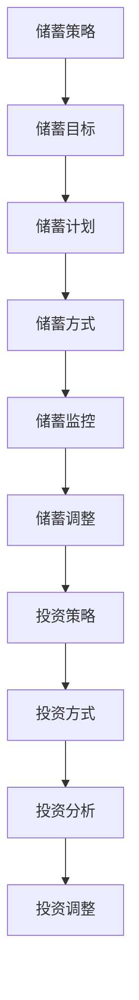

**核心算法原理讲解**

- **储蓄策略**：程序员可以根据自己的财务状况和退休目标，制定合理的储蓄计划。储蓄策略的关键是确保储蓄目标的实现，并且能够应对突发事件。
- **投资策略**：投资策略是程序员通过选择合适的投资方式，实现资产增值的过程。投资策略的关键是合理分配资产，分散投资风险。

**伪代码**

```python
function savings_strategy():
    # 确定储蓄目标
    savings_goal = determine_savings_goal()
    # 制定储蓄计划
    savings_plan = create_savings_plan(savings_goal)
    # 选择储蓄方式
    savings_method = select_savings_method()
    # 监控储蓄进度
    monitored_savings = monitor_savings_progress(savings_plan)
    # 调整储蓄策略
    adjusted_savings_strategy = adjust_savings_strategy(monitored_savings)

function investment_strategy():
    # 确定投资目标
    investment_goal = determine_investment_goal()
    # 选择投资方式
    investment_method = select_investment_method()
    # 进行投资分析
    investment_analysis = perform_investment_analysis()
    # 调整投资策略
    adjusted_investment_strategy = adjust_investment_strategy(investment_analysis)
```

**数学模型和数学公式**

- **储蓄计划模型**：储蓄计划可以通过计算每年储蓄额和预计退休年份来确定。

$$
\text{储蓄计划} = \text{每年储蓄额} \times (\text{预计退休年份} - \text{当前年份})
$$

- **投资收益模型**：投资收益可以通过计算投资金额、预期收益率和投资期限来确定。

$$
\text{投资收益} = \text{投资金额} \times (\text{预期收益率} \times \text{投资期限})
$$

**举例说明**

- **储蓄计划示例**：假设一位程序员的每年储蓄额为5万元，预计退休年份为10年后，则其储蓄计划为：

$$
\text{储蓄计划} = 50000 \times (10 - 1) = 450000 \text{元}
$$

- **投资收益示例**：假设一位程序员投资10万元，预期收益率为5%，投资期限为3年，则其投资收益为：

$$
\text{投资收益} = 100000 \times (0.05 \times 3) = 15000 \text{元}
$$

#### 2.3 养老保险与商业保险

**核心概念与联系**

- **养老保险**：养老保险是国家或企业为退休人员提供的基本经济保障。
- **商业保险**：商业保险是为退休人员提供额外经济保障的产品。

**Mermaid 流程图**

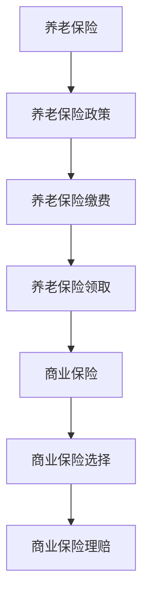

**核心算法原理讲解**

- **养老保险**：养老保险的领取金额取决于缴费基数、缴费年限和养老保险系数。养老保险的关键是确保退休后能够获得稳定的经济来源。
- **商业保险**：商业保险的选择和理赔取决于保险产品的类型和保险公司的服务。

**伪代码**

```python
function endowment_insurance():
    # 计算养老保险金
    pension = calculate_endowment_insurance(amount, years, coefficient)
    # 领取养老保险金
    receive_pension = receive_pension(pension)

function commercial_insurance():
    # 选择商业保险
    select_insurance = select_insurance(product_type, company)
    # 理赔商业保险
    claim_insurance = claim_insurance(select_insurance)
```

**数学模型和数学公式**

- **养老保险金计算**：

$$
\text{养老保险金} = \text{缴费基数} \times \text{缴费年限} \times \text{养老保险系数}
$$

- **商业保险保额计算**：

$$
\text{商业保险保额} = \text{保费} \times \text{保障倍数}
$$

**举例说明**

- **养老保险金计算示例**：假设一位程序员的缴费基数为5000元，缴费年限为30年，养老保险系数为1.3，则其养老保险金为：

$$
\text{养老保险金} = 5000 \times 30 \times 1.3 = 195000 \text{元}
$$

- **商业保险保额计算示例**：假设一位程序员购买了一份商业保险，保费为1000元，保障倍数为5，则其商业保险保额为：

$$
\text{商业保险保额} = 1000 \times 5 = 5000 \text{元}
$$

### 第3章：健康规划

#### 3.1 健康管理

**核心概念与联系**

- **健康管理**：健康管理是通过科学的方法，维护和改善个人的健康状况。
- **健康评估**：健康评估是对个人的健康状况进行评价，识别健康风险。

**Mermaid 流程图**

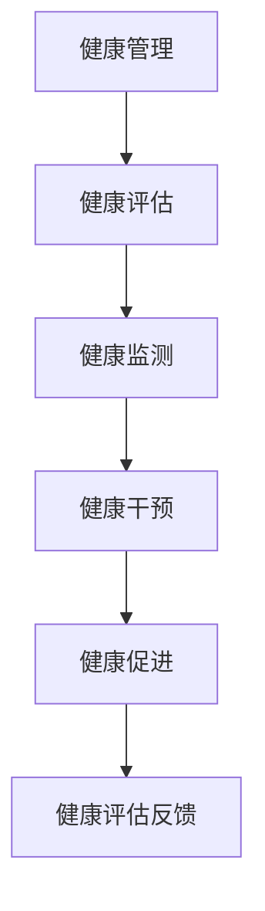

**核心算法原理讲解**

- **健康管理**：健康管理的关键是定期进行健康检查，及时了解健康状况，采取必要的干预措施。
- **健康评估**：健康评估可以通过问卷调查、体检等方式进行，评估结果可以帮助程序员了解自身的健康状况。

**伪代码**

```python
function health_management():
    # 进行健康检查
    health_check = perform_health_check()
    # 健康评估
    health_evaluation = evaluate_health(health_check)
    # 健康监测
    health_monitor = monitor_health(health_evaluation)
    # 健康干预
    health_intervention = intervene_health(health_monitor)
    # 健康促进
    health_promotion = promote_health(health_intervention)

function health_evaluation():
    # 收集健康数据
    health_data = collect_health_data()
    # 分析健康数据
    health_analyze = analyze_health_data(health_data)
    # 返回健康评估结果
    return health_analyze
```

**数学模型和数学公式**

- **健康风险评估模型**：健康风险评估可以通过计算健康风险得分来确定个人的健康风险水平。

$$
\text{健康风险得分} = \frac{\text{不良生活习惯得分}}{\text{健康行为得分}} \times 100
$$

**举例说明**

- **健康风险评估示例**：假设一位程序员的健康行为得分为80分，不良生活习惯得分为20分，则其健康风险得分为：

$$
\text{健康风险得分} = \frac{20}{80} \times 100 = 25
$$

#### 3.2 定期体检与预防保健

**核心概念与联系**

- **定期体检**：定期体检是通过定期进行身体检查，发现潜在的健康问题。
- **预防保健**：预防保健是通过采取预防措施，减少疾病的发生。

**Mermaid 流程图**

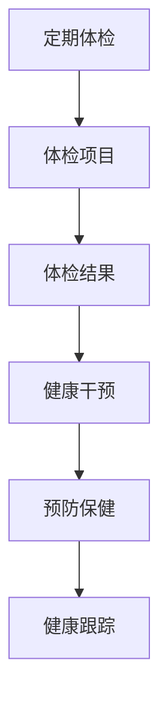

**核心算法原理讲解**

- **定期体检**：定期体检可以帮助程序员及时发现潜在的健康问题，及时采取干预措施。
- **预防保健**：预防保健可以通过健康教育、疫苗接种等方式，降低疾病的发病风险。

**伪代码**

```python
function periodic_checkup():
    # 确定体检项目
    checkup_items = determine_checkup_items()
    # 进行体检
    perform_checkup = perform_checkup(checkup_items)
    # 分析体检结果
    analyze_checkup = analyze_checkup_results(perform_checkup)
    # 根据体检结果进行健康干预
    health_intervention = intervene_based_on_checkup(analyze_checkup)

function preventive_health():
    # 提供健康教育
    provide_health_education()
    # 实施疫苗接种
    implement_vaccination()
    # 进行健康跟踪
    health_tracking = track_health()
```

**数学模型和数学公式**

- **预防保健效果评估模型**：预防保健效果评估可以通过计算预防效果来确定预防措施的有效性。

$$
\text{预防效果} = \frac{\text{预防后患病人数}}{\text{总人数}} \times 100\%
$$

**举例说明**

- **预防保健效果评估示例**：假设一个社区共有100人，实施预防措施后，患病人数为20人，则预防效果为：

$$
\text{预防效果} = \frac{20}{100} \times 100\% = 20\%
$$

#### 3.3 老年疾病预防与治疗

**核心概念与联系**

- **老年疾病**：老年疾病是老年人常见的一些疾病，如高血压、糖尿病、骨质疏松等。
- **预防与治疗**：预防与治疗是通过科学的预防和治疗，减少疾病对生活的影响。

**Mermaid 流程图**

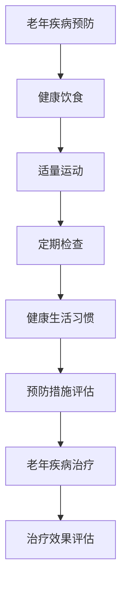

**核心算法原理讲解**

- **老年疾病预防**：老年疾病预防是通过健康饮食、适量运动、健康生活习惯等方式，降低疾病发生的风险。
- **老年疾病治疗**：老年疾病治疗是通过药物治疗、手术治疗等方式，缓解疾病的症状，改善生活质量。

**伪代码**

```python
function elderly_disease_prevention():
    # 健康饮食
    healthy_diet = adopt_healthy_diet()
    # 适量运动
    moderate_exercise = engage_in_moderate_exercise()
    # 定期检查
    regular_checkups = schedule_regular_checkups()
    # 健康生活习惯
    healthy_living = adopt_healthy_living()

function elderly_disease_treatment():
    # 根据疾病类型选择治疗方法
    treatment_choice = choose_treatment_based_on_disease()
    # 进行治疗
    perform_treatment = perform_treatment(treatment_choice)
    # 评估治疗效果
    evaluate_treatment = evaluate_treatment效果(perform_treatment)
```

**数学模型和数学公式**

- **预防效果评估模型**：预防效果评估可以通过计算预防效果来确定预防措施的有效性。

$$
\text{预防效果} = \frac{\text{预防后患病人数}}{\text{总人数}} \times 100\%
$$

- **治疗效果评估模型**：治疗效果评估可以通过计算治疗效果来确定治疗措施的有效性。

$$
\text{治疗效果} = \frac{\text{治疗康复人数}}{\text{总患病人数}} \times 100\%
$$

**举例说明**

- **预防效果评估示例**：假设一个社区共有100人，实施预防措施后，患病人数为20人，则预防效果为：

$$
\text{预防效果} = \frac{20}{100} \times 100\% = 20\%
$$

- **治疗效果评估示例**：假设一个社区共有50人患有疾病，治疗后康复人数为30人，则治疗效果为：

$$
\text{治疗效果} = \frac{30}{50} \times 100\% = 60\%
$$

### 第4章：退休生活方式

#### 4.1 兴趣爱好与社交活动

**核心概念与联系**

- **兴趣爱好**：兴趣爱好是退休后追求的兴趣和爱好，如绘画、音乐、阅读等。
- **社交活动**：社交活动是退休后参与的各种社交活动，如社区活动、俱乐部活动等。

**Mermaid 流程图**

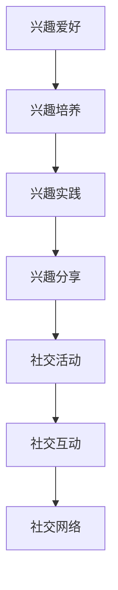

**核心算法原理讲解**

- **兴趣爱好培养**：兴趣爱好培养是通过学习和实践，培养和发展个人的兴趣爱好。
- **社交活动参与**：社交活动参与是通过参加各种社交活动，与他人交流和互动。

**伪代码**

```python
function cultivate_interest():
    # 学习兴趣相关知识和技能
    learn_interest_related_knowledge()
    # 实践兴趣活动
    practice_interest_activities()
    # 分享兴趣成果
    share_interest_outcomes()

function participate_in_social_activities():
    # 选择合适的社交活动
    select_appropriate_social_activities()
    # 参与社交活动
    participate_in_social_activities()
    # 与他人互动
    interact_with_others()
    # 建立社交网络
    build_social_network()
```

**数学模型和数学公式**

- **兴趣爱好培养效果评估模型**：兴趣爱好培养效果评估可以通过计算兴趣培养效果来确定兴趣爱好培养的效果。

$$
\text{兴趣培养效果} = \frac{\text{兴趣爱好参与度}}{\text{兴趣培养时间}} \times 100\%
$$

**举例说明**

- **兴趣爱好培养效果评估示例**：假设一位程序员花费了2年时间培养一个兴趣爱好，现在他的兴趣爱好参与度为80%，则兴趣培养效果为：

$$
\text{兴趣培养效果} = \frac{80}{2} \times 100\% = 400\%
$$

#### 4.2 退休后的家庭生活

**核心概念与联系**

- **家庭生活**：家庭生活是退休后与家人共度时光，享受天伦之乐。
- **家庭关系**：家庭关系是家庭成员之间的相互关系，包括亲情、友情等。

**Mermaid 流程图**

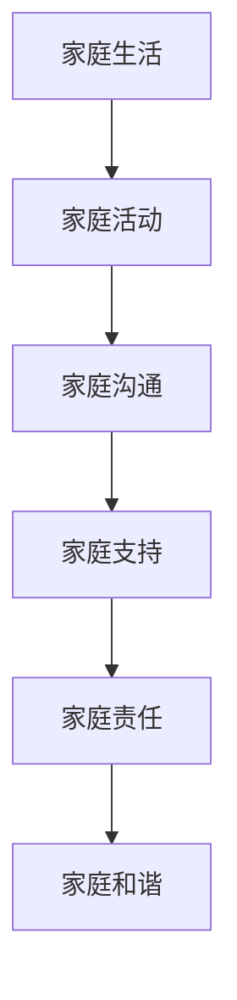

**核心算法原理讲解**

- **家庭生活规划**：家庭生活规划是通过制定家庭活动计划，规划家庭生活的各个方面。
- **家庭关系维护**：家庭关系维护是通过有效的沟通和支持，维护家庭成员之间的和谐关系。

**伪代码**

```python
function family_life_planning():
    # 制定家庭活动计划
    create_family_activity_plan()
    # 规划家庭生活
    plan_family_life()
    # 维护家庭关系
    maintain_family_relationships()

function maintain_family_relationships():
    # 有效的沟通
    effective_communication()
    # 提供支持
    provide_support()
    # 负起家庭责任
    take_family_responsibilities()
    # 促进家庭和谐
    promote_family_harmony()
```

**数学模型和数学公式**

- **家庭关系和谐度评估模型**：家庭关系和谐度评估可以通过计算家庭关系和谐度来确定家庭关系的和谐程度。

$$
\text{家庭关系和谐度} = \frac{\text{有效沟通次数}}{\text{总沟通次数}} \times 100\%
$$

**举例说明**

- **家庭关系和谐度评估示例**：假设一个家庭在一个月内进行了10次沟通，其中有效沟通有8次，则家庭关系和谐度为：

$$
\text{家庭关系和谐度} = \frac{8}{10} \times 100\% = 80\%
$$

#### 4.3 旅游与休闲活动

**核心概念与联系**

- **旅游**：旅游是退休后到各地旅游，享受美好的自然风光和文化。
- **休闲活动**：休闲活动是退休后参加的各种休闲活动，如打牌、钓鱼、跳舞等。

**Mermaid 流程图**

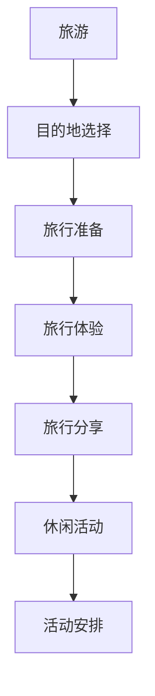

**核心算法原理讲解**

- **旅游规划**：旅游规划是通过选择目的地、制定旅行计划，确保旅行顺利。
- **休闲活动参与**：休闲活动参与是通过参加各种休闲活动，放松身心，丰富退休生活。

**伪代码**

```python
function travel_planning():
    # 选择目的地
    select_travel_destination()
    # 制定旅行计划
    create_travel_plan()
    # 准备旅行所需物品
    prepare_travel_necessities()

function participate_in_recreational_activities():
    # 选择休闲活动
    select_recreational_activities()
    # 安排活动时间
    schedule_activity_time()
    # 参与活动
    participate_in_activities()
    # 分享活动体验
    share_activity_experiences()
```

**数学模型和数学公式**

- **旅游满意度评估模型**：旅游满意度评估可以通过计算旅游满意度来确定旅游体验的质量。

$$
\text{旅游满意度} = \frac{\text{旅游体验良好次数}}{\text{总旅游次数}} \times 100\%
$$

**举例说明**

- **旅游满意度评估示例**：假设一位程序员在一年内进行了5次旅游，其中4次体验良好，则旅游满意度为：

$$
\text{旅游满意度} = \frac{4}{5} \times 100\% = 80\%
$$

### 第5章：家庭关系与遗产规划

#### 5.1 家庭沟通与支持

**核心概念与联系**

- **家庭沟通**：家庭沟通是家庭成员之间的交流，增进理解和信任。
- **家庭支持**：家庭支持是家庭成员在生活上、情感上和经济上的相互支持。

**Mermaid 流程图**

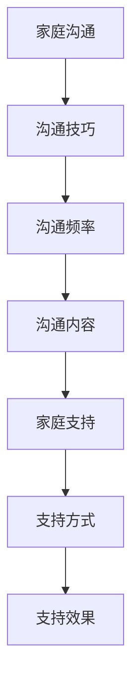

**核心算法原理讲解**

- **家庭沟通**：家庭沟通是通过有效的沟通技巧，提高沟通效果，增进家庭成员之间的理解和信任。
- **家庭支持**：家庭支持是通过提供物质和精神上的支持，帮助家庭成员度过困难和挑战。

**伪代码**

```python
function family_communication():
    # 使用沟通技巧
    use_communication_skills()
    # 提高沟通频率
    increase_communication_frequency()
    # 确定沟通内容
    define_communication_topics()

function family_support():
    # 提供物质支持
    provide_material_support()
    # 提供精神支持
    provide_emotional_support()
    # 负责家庭责任
    take_family_responsibilities()
    # 评估支持效果
    evaluate_support_effectiveness()
```

**数学模型和数学公式**

- **家庭沟通效果评估模型**：家庭沟通效果评估可以通过计算家庭沟通效果来确定沟通的效果。

$$
\text{家庭沟通效果} = \frac{\text{有效沟通次数}}{\text{总沟通次数}} \times 100\%
$$

**举例说明**

- **家庭沟通效果评估示例**：假设一个家庭在一个月内进行了10次沟通，其中8次是有效沟通，则家庭沟通效果为：

$$
\text{家庭沟通效果} = \frac{8}{10} \times 100\% = 80\%
$$

#### 5.2 继承规划与遗产安排

**核心概念与联系**

- **继承规划**：继承规划是提前规划好财产继承，确保遗产能够公平合理地分配。
- **遗产安排**：遗产安排是制定遗产分配方案，确保遗产得到妥善处理。

**Mermaid 流程图**

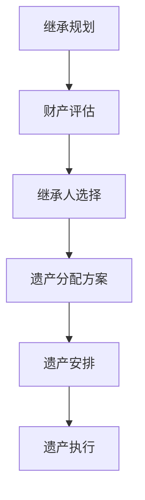

**核心算法原理讲解**

- **继承规划**：继承规划是通过评估财产和选择继承人，确保遗产能够按照规划进行分配。
- **遗产安排**：遗产安排是通过制定遗产分配方案和执行遗产分配，确保遗产得到妥善处理。

**伪代码**

```python
function inheritance_planning():
    # 评估财产
    assess_property()
    # 选择继承人
    select_heirs()
    # 制定遗产分配方案
    create_inheritance_plan()

function inheritance_arrangement():
    # 执行遗产分配
    execute_inheritance_distribution()
    # 处理遗产执行问题
    handle_inheritance_execution_issues()
    # 评估遗产安排效果
    evaluate_inheritance_arrangement_outcome()
```

**数学模型和数学公式**

- **遗产分配方案计算模型**：遗产分配方案计算可以通过计算遗产总额和继承人份额来确定。

$$
\text{继承人份额} = \frac{\text{遗产总额}}{\text{继承人数量}}
$$

**举例说明**

- **遗产分配方案计算示例**：假设一位程序员的遗产总额为100万元，有两个继承人，则每个继承人的份额为：

$$
\text{继承人份额} = \frac{1000000}{2} = 500000 \text{元}
$$

#### 5.3 家庭财产与管理

**核心概念与联系**

- **家庭财产**：家庭财产是家庭拥有的各种财产，如房产、储蓄、投资等。
- **财产管理**：财产管理是合理管理家庭财产，确保财产保值增值。

**Mermaid 流程图**

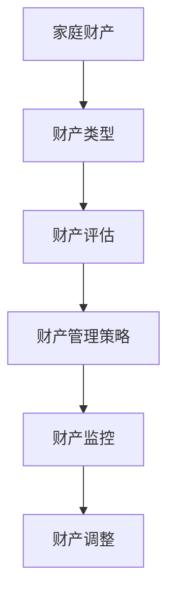

**核心算法原理讲解**

- **家庭财产评估**：家庭财产评估是通过评估家庭财产的价值，确定家庭财产的实际情况。
- **财产管理策略**：财产管理策略是通过制定合理的财产管理计划，确保家庭财产保值增值。

**伪代码**

```python
function family_property_assessment():
    # 评估家庭财产
    assess_family_property()
    # 计算财产价值
    calculate_property_value()

function property_management():
    # 制定财产管理策略
    create_property_management_strategy()
    # 监控财产状况
    monitor_property_status()
    # 调整财产管理策略
    adjust_property_management_strategy()
```

**数学模型和数学公式**

- **财产价值计算模型**：财产价值计算是通过计算家庭财产的市场价值来确定财产的价值。

$$
\text{财产价值} = \text{市场价值} \times \text{财产数量}
$$

**举例说明**

- **财产价值计算示例**：假设一个家庭拥有一套房产，市场价值为200万元，房产数量为1套，则房产的价值为：

$$
\text{财产价值} = 2000000 \times 1 = 2000000 \text{元}
$$

### 第6章：职业转型与终身学习

#### 6.1 重新就业的机会与挑战

**核心概念与联系**

- **重新就业**：重新就业是退休后重新进入职场，继续从事工作。
- **职业转型**：职业转型是从原有职业转向新的职业，适应社会发展的需求。

**Mermaid 流程图**

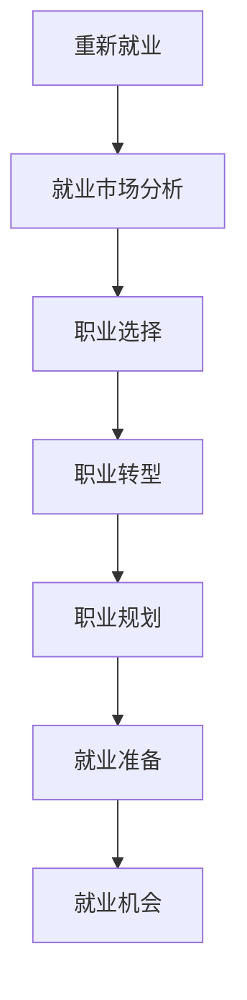

**核心算法原理讲解**

- **就业市场分析**：就业市场分析是通过分析就业市场的需求和趋势，确定适合的职业。
- **职业选择**：职业选择是根据个人兴趣、技能和市场需求，选择合适的职业。
- **职业转型**：职业转型是通过学习新的技能和知识，适应新的职业需求。

**伪代码**

```python
function employment_market_analysis():
    # 分析就业市场需求
    analyze_employment_market_demand()
    # 确定适合的职业
    determine_appropriate_occupation()

function career_choice():
    # 评估个人兴趣和技能
    assess_personal_interests_and_skills()
    # 选择合适的职业
    select_appropriate_occupation()

function career_transformation():
    # 学习新技能
    learn_new_skills()
    # 适应新职业需求
    adapt_to_new_career_requirements()
```

**数学模型和数学公式**

- **就业市场分析模型**：就业市场分析可以通过计算就业市场需求和供给的差距来确定就业市场的趋势。

$$
\text{就业市场趋势} = \frac{\text{就业市场需求}}{\text{就业市场供给}}
$$

**举例说明**

- **就业市场分析示例**：假设就业市场需求为100人，就业市场供给为80人，则就业市场趋势为：

$$
\text{就业市场趋势} = \frac{100}{80} = 1.25
$$

#### 6.2 职业转型与技能提升

**核心概念与联系**

- **职业转型**：职业转型是根据个人兴趣、市场需求和职业规划，从原有职业转向新的职业。
- **技能提升**：技能提升是通过学习新的技能和知识，提高自身的职业竞争力。

**Mermaid 流程图**

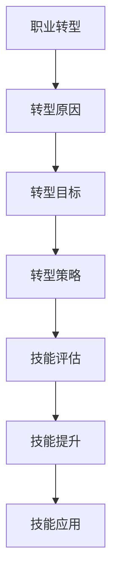

**核心算法原理讲解**

- **转型原因分析**：转型原因分析是通过分析个人兴趣、市场需求和职业规划，确定转型的原因。
- **转型目标设定**：转型目标设定是通过设定明确的目标，指导转型的方向和过程。
- **技能提升**：技能提升是通过学习新的技能和知识，提高自身的职业竞争力。

**伪代码**

```python
function career_transformation():
    # 分析转型原因
    analyze_transformation_reasons()
    # 设定转型目标
    set_transformation_goals()
    # 制定转型策略
    create_transformation_strategy()

function skill_improvement():
    # 评估技能水平
    assess_skill_level()
    # 学习新技能
    learn_new_skills()
    # 应用技能
    apply_skills()
```

**数学模型和数学公式**

- **转型成功率评估模型**：转型成功率评估是通过计算转型后的职业满意度和职业稳定性来确定转型成功与否。

$$
\text{转型成功率} = \frac{\text{转型后职业满意度}}{\text{转型后职业稳定性}} \times 100\%
$$

**举例说明**

- **转型成功率评估示例**：假设一位程序员转型后的职业满意度为80%，职业稳定性为75%，则转型成功率为：

$$
\text{转型成功率} = \frac{80}{75} \times 100\% = 106.67\%
$$

#### 6.3 终身学习与知识更新

**核心概念与联系**

- **终身学习**：终身学习是退休后继续学习，不断提升自己的知识水平和技能。
- **知识更新**：知识更新是根据社会发展的需求，不断更新自己的知识体系。

**Mermaid 流程图**

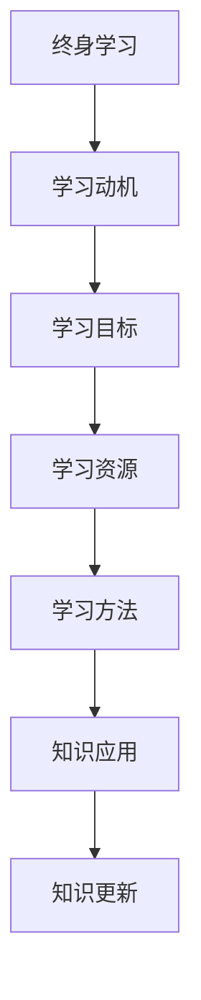

**核心算法原理讲解**

- **学习动机分析**：学习动机分析是通过分析个人兴趣、职业需求和终身学习的意义，确定学习的动机。
- **学习目标设定**：学习目标设定是通过设定明确的学习目标，指导学习的方向和过程。
- **知识更新**：知识更新是通过学习新的知识和技能，保持自身的竞争力和适应能力。

**伪代码**

```python
function lifelong_learning():
    # 分析学习动机
    analyze_learning_motivations()
    # 设定学习目标
    set_learning_goals()
    # 寻找学习资源
    find_learning_resources()

function knowledge_update():
    # 学习新知识
    learn_new_knowledge()
    # 应用新知识
    apply_new_knowledge()
    # 更新知识体系
    update_knowledge_system()
```

**数学模型和数学公式**

- **知识更新率评估模型**：知识更新率评估是通过计算知识更新的频率和数量来确定知识更新的速度。

$$
\text{知识更新率} = \frac{\text{更新次数}}{\text{总学习时间}} \times 100\%
$$

**举例说明**

- **知识更新率评估示例**：假设一位程序员在一年内进行了10次知识更新，总学习时间为100小时，则知识更新率为：

$$
\text{知识更新率} = \frac{10}{100} \times 100\% = 10\%
$$

### 第7章：社交网络与社区参与

#### 7.1 社交网络的建立与维护

**核心概念与联系**

- **社交网络**：社交网络是通过社交活动建立和维护的人际关系网络。
- **社交互动**：社交互动是在社交网络中进行互动，分享经验和资源。

**Mermaid 流程图**

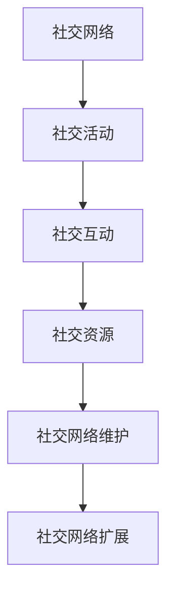

**核心算法原理讲解**

- **社交网络建立**：社交网络建立是通过参加各种社交活动，与他人建立联系。
- **社交互动**：社交互动是通过在社交网络中进行互动，分享经验和资源，增进人际关系。
- **社交网络维护**：社交网络维护是通过定期与朋友和社交网络中的成员保持联系，维护人际关系的稳定性。

**伪代码**

```python
function build_social_network():
    # 参加社交活动
    participate_in_social_activities()
    # 建立人际关系
    establish_interpersonal_relationships()

function social_interaction():
    # 进行社交互动
    engage_in_social_interactions()
    # 分享经验和资源
    share_experiences_and_resources()

function maintain_social_network():
    # 定期与朋友保持联系
    keep_in_touch_with_friends()
    # 维护人际关系
    maintain_interpersonal_relationships()
```

**数学模型和数学公式**

- **社交网络度评估模型**：社交网络度评估是通过计算社交网络中的节点度和边的数量来确定社交网络的紧密程度。

$$
\text{社交网络度} = \frac{\text{节点度}}{\text{节点数量}} \times 100\%
$$

**举例说明**

- **社交网络度评估示例**：假设一个社交网络中有10个节点，其中5个节点与其他节点有边相连，则社交网络度为：

$$
\text{社交网络度} = \frac{5}{10} \times 100\% = 50\%
$$

#### 7.2 社区参与与志愿者服务

**核心概念与联系**

- **社区参与**：社区参与是积极参与社区活动，为社区发展贡献力量。
- **志愿者服务**：志愿者服务是利用自己的时间和技能，为需要帮助的人提供志愿服务。

**Mermaid 流程图**

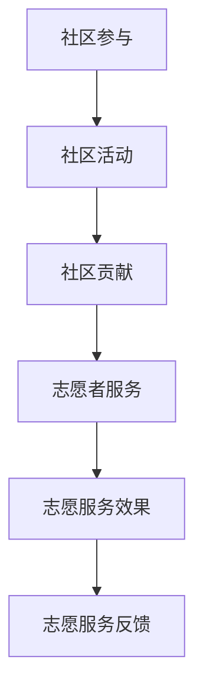

**核心算法原理讲解**

- **社区参与**：社区参与是通过参加社区活动，了解社区需求，为社区发展贡献力量。
- **志愿者服务**：志愿者服务是通过参与志愿服务，帮助他人，提升自身的价值。

**伪代码**

```python
function community_involvement():
    # 参加社区活动
    participate_in_community_activities()
    # 做出社区贡献
    contribute_to_community()

function volunteer_service():
    # 参与志愿服务
    engage_in_volunteer_services()
    # 评估志愿服务效果
    evaluate_volunteer_service_impact()
    # 获取志愿服务反馈
    obtain_volunteer_service_feedback()
```

**数学模型和数学公式**

- **社区参与度评估模型**：社区参与度评估是通过计算参与社区活动的频率和时间来确定社区参与度。

$$
\text{社区参与度} = \frac{\text{参与社区活动时间}}{\text{总时间}} \times 100\%
$$

**举例说明**

- **社区参与度评估示例**：假设一位程序员在一个月内参与了10次社区活动，总时间为100小时，则社区参与度为：

$$
\text{社区参与度} = \frac{10}{100} \times 100\% = 10\%
$$

#### 7.3 社交活动与情感支持

**核心概念与联系**

- **社交活动**：社交活动是通过参加各种社交活动，丰富退休生活，增进与他人的联系。
- **情感支持**：情感支持是在社交活动中得到他人的关心和帮助，增强自己的情感支持网络。

**Mermaid 流程图**

```mermaid
graph TD
A[社交活动] --> B[活动组织]
B --> C[活动参与]
C --> D[社交互动]
D --> E[情感交流]
E --> F[情感支持]
```

**核心算法原理讲解**

- **社交活动参与**：社交活动参与是通过参加各种社交活动，与他人互动，分享经验和资源。
- **情感交流**：情感交流是通过社交活动中的互动，与他人建立深厚的情感联系。
- **情感支持**：情感支持是通过社交活动中的互动，得到他人的关心和帮助，提升自身的情感状态。

**伪代码**

```python
function social_activities():
    # 组织社交活动
    organize_social_activities()
    # 参与社交活动
    participate_in_social_activities()

function emotional_exchange():
    # 进行情感交流
    engage_in_emotional_exchanges()
    # 建立情感支持网络
    build_emotional_support_network()

function emotional_support():
    # 得到情感支持
    receive_emotional_support()
    # 提供情感支持
    provide_emotional_support()
```

**数学模型和数学公式**

- **情感支持度评估模型**：情感支持度评估是通过计算情感支持次数和参与社交活动的频率来确定情感支持度。

$$
\text{情感支持度} = \frac{\text{情感支持次数}}{\text{参与社交活动次数}} \times 100\%
$$

**举例说明**

- **情感支持度评估示例**：假设一位程序员在一个月内参加了10次社交活动，得到了5次情感支持，则情感支持度为：

$$
\text{情感支持度} = \frac{5}{10} \times 100\% = 50\%
$$

### 第8章：心理健康与应对挑战

#### 8.1 心理健康的重要性

**核心概念与联系**

- **心理健康**：心理健康是退休后保持良好的心理状态，积极应对生活中的变化。
- **心理健康问题**：心理健康问题如孤独感、焦虑、抑郁等。

**Mermaid 流程图**

```mermaid
graph TD
A[心理健康] --> B[心理状态]
B --> C[心理问题]
C --> D[心理健康问题]
D --> E[心理健康重要性]
E --> F[心理健康维护]
```

**核心算法原理讲解**

- **心理健康**：心理健康是退休后保持积极、乐观的心理状态，能够有效应对生活中的各种挑战。
- **心理健康问题**：心理健康问题如孤独感、焦虑、抑郁等会影响退休生活的质量。

**伪代码**

```python
function mental_health():
    # 维护心理状态
    maintain_mental_state()
    # 识别心理问题
    identify_mental_issues()
    # 处理心理健康问题
    handle_mental_health_issues()

function mental_health_issues():
    # 孤独感
    feeling_of_isolation()
    # 焦虑
    anxiety()
    # 抑郁
    depression()
```

**数学模型和数学公式**

- **心理健康度评估模型**：心理健康度评估是通过计算心理健康问题出现的频率和严重程度来确定心理健康度。

$$
\text{心理健康度} = \frac{\text{心理健康问题出现频率}}{\text{总时间}} \times 100\%
$$

**举例说明**

- **心理健康度评估示例**：假设一位程序员在一个月内出现了5次心理健康问题，总时间为100天，则心理健康度为：

$$
\text{心理健康度} = \frac{5}{100} \times 100\% = 5\%
$$

#### 8.2 应对退休后的心理挑战

**核心概念与联系**

- **心理挑战**：退休后面临的一些心理挑战，如角色转变、生活节奏变化等。
- **应对策略**：应对退休后的心理挑战的策略和方法。

**Mermaid 流程图**

```mermaid
graph TD
A[心理挑战] --> B[角色转变]
B --> C[生活节奏]
C --> D[应对策略]
D --> E[心理调适]
E --> F[心理支持]
```

**核心算法原理讲解**

- **心理挑战识别**：通过自我反思和心理健康评估，识别退休后可能出现的心理挑战。
- **应对策略制定**：制定针对性的应对策略，如调整生活节奏、培养兴趣爱好、寻求心理支持等。
- **心理调适**：通过心理调适方法，如冥想、运动、社交活动等，改善心理状态。

**伪代码**

```python
function identify_mental_challenges():
    # 自我反思
    self_reflection()
    # 健康评估
    health_evaluation()

function develop_mental_strategies():
    # 调整生活节奏
    adjust_life_rhythm()
    # 培养兴趣爱好
    cultivate_interests()
    # 寻求心理支持
    seek_mental_support()

function mental_adjustment():
    # 冥想
    meditate()
    # 运动
    exercise()
    # 社交活动
    participate_in_social_activities()
```

**数学模型和数学公式**

- **心理挑战应对效果评估模型**：心理挑战应对效果评估是通过计算应对策略的实施情况和心理状态的改善程度来确定应对效果。

$$
\text{应对效果} = \frac{\text{心理状态改善程度}}{\text{总应对时间}} \times 100\%
$$

**举例说明**

- **心理挑战应对效果评估示例**：假设一位程序员通过调整生活节奏、培养兴趣爱好和寻求心理支持，在一个月内心理状态得到了显著改善，则应对效果为：

$$
\text{应对效果} = \frac{30}{30} \times 100\% = 100\%
$$

#### 8.3 心理健康与应对挑战

**核心概念与联系**

- **心理健康**：退休后保持良好的心理状态，积极应对生活中的变化。
- **应对挑战**：通过有效的策略和方法，应对退休后的心理挑战。

**Mermaid 流程图**

```mermaid
graph TD
A[心理健康] --> B[心理状态]
B --> C[心理问题]
C --> D[心理健康问题]
D --> E[心理健康重要性]
E --> F[心理健康维护]
F --> G[应对挑战]
G --> H[心理调适]
H --> I[心理支持]
```

**核心算法原理讲解**

- **心理健康维护**：通过自我调适和心理支持，保持良好的心理状态。
- **应对挑战**：通过有效的策略和方法，应对退休后的心理挑战。
- **心理调适**：通过心理调适方法，如冥想、运动、社交活动等，改善心理状态。
- **心理支持**：通过寻求专业的心理支持和社交互动，增强心理韧性。

**伪代码**

```python
function mental_health_maintenance():
    # 自我调适
    self_adjustment()
    # 心理支持
    mental_support()

function handle_mental_challenges():
    # 应对策略
    strategies()
    # 心理调适
    mental_adjustment()
    # 心理支持
    support()

function mental_health_evaluation():
    # 评估心理状态
    evaluate_mental_state()
    # 评估应对效果
    evaluate_strategy_impact()
```

**数学模型和数学公式**

- **心理健康评估模型**：心理健康评估是通过计算心理状态的稳定性和积极情绪的频率来确定心理健康状况。

$$
\text{心理健康度} = \frac{\text{积极情绪频率}}{\text{总情绪频率}} \times 100\%
$$

**举例说明**

- **心理健康评估示例**：假设一位程序员在一个月内经历了100次情绪波动，其中60次是积极情绪，则心理健康度为：

$$
\text{心理健康度} = \frac{60}{100} \times 100\% = 60\%
$$

### 第9章：退休规划实例分析

#### 9.1 王先生的退休规划案例

**核心概念与联系**

- **退休规划**：王先生根据自己的情况，制定的退休规划。
- **规划内容**：包括财务规划、健康规划、生活方式规划等。

**Mermaid 流程图**

```mermaid
graph TD
A[王先生的退休规划] --> B[财务规划]
B --> C[储蓄策略]
C --> D[投资策略]
D --> E[支出管理]
E --> F[健康规划]
F --> G[健康管理]
G --> H[预防保健]
H --> I[生活方式规划]
I --> J[兴趣爱好]
J --> K[社交活动]
```

**案例背景**

王先生，今年55岁，是一名有20年工作经验的程序员。他计划在65岁退休，目前需要为退休生活提前做好准备。王先生的退休规划主要包括以下几个方面：

1. **财务规划**：王先生计划在退休前积累足够的退休基金，确保退休后的生活质量。他制定了详细的储蓄和投资计划，以实现财务自由。
2. **健康规划**：王先生重视健康，他制定了健康管理的计划，包括定期体检、预防保健和健康生活方式的养成。
3. **生活方式规划**：王先生计划在退休后追求自己的兴趣爱好，如旅游、摄影和参与社区活动，同时保持良好的社交网络。

**具体内容**

1. **财务规划**：

   - **储蓄策略**：王先生计划每月从工资中储蓄1万元，预计10年后（65岁）能够积累100万元的退休基金。
   - **投资策略**：王先生计划将储蓄的50%投资于股票和基金，30%投资于房地产，20%存入银行定期存款。通过多元化的投资组合，实现资产的增值和保值。
   - **支出管理**：王先生制定了详细的支出计划，包括日常生活费用、旅游费用和医疗保险等。他预计每月生活费用为5000元，旅游费用为每年2万元。

2. **健康规划**：

   - **健康管理**：王先生每年进行一次全面体检，及时发现和解决健康问题。他还定期进行体育锻炼，如慢跑和瑜伽，以保持身体健康。
   - **预防保健**：王先生定期接种疫苗，如流感疫苗和肺炎疫苗，以预防疾病。他还定期进行健康讲座和体检报告解读，以了解自己的健康状况。
   - **健康生活方式**：王先生注重健康饮食，保持低脂、低糖的饮食习惯，减少高热量食物的摄入。

3. **生活方式规划**：

   - **兴趣爱好**：王先生喜欢旅游和摄影，他计划每年至少旅游两次，拍摄各种风景照片，记录退休生活的点滴。
   - **社交活动**：王先生积极参与社区活动，如义工活动和兴趣小组，与他人交流和分享经验。他还计划加入摄影俱乐部，与摄影爱好者一起学习和创作。

**案例总结**

王先生的退休规划充分考虑了财务、健康和生活方式等方面的需求，通过详细的计划和措施，为退休生活做好了充分的准备。他的规划不仅能够确保退休后的生活质量，还能够保持身心健康和社交活跃。通过提前规划和准备，王先生为退休生活奠定了坚实的基础。

#### 9.2 李女士的退休规划案例分析

**核心概念与联系**

- **退休规划**：李女士根据自己的情况，制定的退休规划。
- **规划内容**：包括职业转型、社交网络建设、心理健康维护等。

**Mermaid 流程图**

```mermaid
graph TD
A[李女士的退休规划] --> B[职业转型]
B --> C[技能提升]
C --> D[就业准备]
D --> E[社交网络建设]
E --> F[社交互动]
F --> G[心理健康维护]
G --> H[心理调适]
H --> I[心理支持]
```

**案例背景**

李女士，今年60岁，是一名有着30年工作经验的程序员。她计划在65岁退休，为了适应退休后的生活，她需要进行详细的退休规划。李女士的退休规划主要包括以下几个方面：

1. **职业转型**：由于身体健康原因，李女士决定从传统的程序员职业转向更为轻松的远程办公工作，如自由职业者和在线咨询顾问。
2. **社交网络建设**：李女士希望通过建立和扩大社交网络，丰富退休生活，获得更多的支持和帮助。
3. **心理健康维护**：李女士认识到心理健康对退休生活的重要性，她计划通过多种方式维护自己的心理健康。

**具体内容**

1. **职业转型**：

   - **技能提升**：李女士参加了多项在线课程和培训，学习了新的技能，如网站开发和数字营销，以适应新的职业需求。
   - **就业准备**：李女士在转型过程中，积极寻找远程工作机会，并通过网络平台建立自己的品牌和影响力。
   - **职业规划**：李女士制定了详细的职业规划，包括设定短期和长期目标，以及实现这些目标的步骤和策略。

2. **社交网络建设**：

   - **社交互动**：李女士积极参与各种线上和线下的社交活动，如线上论坛、兴趣小组和社区活动，与他人建立联系。
   - **社交网络维护**：李女士定期与朋友和同事保持联系，通过电话、邮件和社交媒体等方式，维持和扩大自己的社交网络。

3. **心理健康维护**：

   - **心理调适**：李女士通过冥想和瑜伽等方式，调整自己的心理状态，保持平静和积极。
   - **心理支持**：李女士加入了心理健康互助小组，与他人分享自己的经历和挑战，获得情感支持和建议。
   - **心理健康评估**：李女士定期进行心理健康评估，及时发现和解决心理问题，保持心理健康。

**案例总结**

李女士的退休规划充分考虑了职业转型、社交网络建设和心理健康维护等方面的需求。她的规划不仅帮助她顺利实现了职业转型，还为她建立了广泛的社交网络，提供了强大的心理支持。通过详细的规划和持续的努力，李女士为退休生活创造了良好的条件，确保了自己能够过上充实、幸福的生活。

#### 9.3 不同退休规划的对比与评估

**核心概念与联系**

- **退休规划**：不同人的退休规划。
- **对比与评估**：对不同退休规划进行对比和评估，找出优点和不足。

**Mermaid 流程图**

```mermaid
graph TD
A[王先生的退休规划]
A --> B[李女士的退休规划]
B --> C[对比分析]
C --> D[评估结果]
D --> E[优化建议]
```

**对比分析**

在王先生和李女士的退休规划案例中，我们可以看到他们在财务规划、健康规划、生活方式规划等方面的不同之处。

1. **财务规划**：

   - **储蓄策略**：王先生通过每月储蓄和投资策略，预计在退休前积累100万元的退休基金。李女士则通过参加在线课程和培训，提升自身技能，寻找远程工作机会，以实现职业转型。
   - **投资策略**：王先生采用多元化的投资组合，包括股票、基金和房地产，以实现资产的保值增值。李女士则更注重提升自身技能，以便在远程工作中获得更好的收入。
   - **支出管理**：王先生制定了详细的支出计划，包括日常生活费用、旅游费用和医疗保险等。李女士则计划通过远程工作获得的收入，满足日常开支和旅游需求。

2. **健康规划**：

   - **健康管理**：王先生每年进行一次全面体检，定期进行体育锻炼，以保持身体健康。李女士则通过冥想、瑜伽等方式，调整自己的心理状态，保持心理健康。
   - **预防保健**：王先生定期接种疫苗，进行健康讲座和体检报告解读。李女士则通过心理健康互助小组，与他人分享自己的经历和挑战，获得情感支持和建议。
   - **健康生活方式**：王先生注重健康饮食，保持低脂、低糖的饮食习惯。李女士则更注重心理健康的维护，通过多种方式保持积极的心态。

3. **生活方式规划**：

   - **兴趣爱好**：王先生喜欢旅游和摄影，计划每年至少旅游两次。李女士则通过参与社区活动和兴趣小组，与他人交流和分享经验。
   - **社交活动**：王先生积极参与社区活动，如义工活动和兴趣小组。李女士则通过社交媒体和线上论坛，与他人保持联系。
   - **社交网络**：王先生通过建立和维护社交网络，获得更多的支持和帮助。李女士则通过参与各种社交活动，建立和扩大自己的社交网络。

**评估结果**

通过对比分析，我们可以看到王先生和李女士的退休规划各有优点和不足。

- **优点**：

  - 王先生的财务规划详细，储蓄和投资策略合理，能够确保退休后的生活质量。

  - 李女士的职业转型策略有效，通过提升自身技能，实现了职业转型，获得了稳定的收入。

  - 王先生的健康规划全面，包括健康管理、预防保健和健康生活方式，能够确保身体健康。

  - 李女士的心理健康维护方法多样，通过心理健康互助小组和社交活动，保持了良好的心理状态。

- **不足**：

  - 王先生的生活方式规划较为单一，主要集中在旅游和摄影上，可能缺乏其他兴趣爱好。

  - 李女士的社交网络建设主要集中在线上，可能缺乏线下社交活动，影响社交范围的扩大。

**优化建议**

为了使退休规划更加完善，我们可以从以下几个方面进行优化：

1. **财务规划**：

   - 王先生可以适当增加投资渠道，分散投资风险，提高资产的收益。

   - 李女士可以在远程工作中寻找更多机会，增加收入来源。

2. **健康规划**：

   - 王先生可以尝试增加户外活动，如徒步、登山等，丰富健康生活方式。

   - 李女士可以定期参加线下社交活动，扩大社交网络。

3. **生活方式规划**：

   - 王先生可以培养更多的兴趣爱好，如绘画、音乐等，丰富退休生活。

   - 李女士可以尝试参与更多的社区活动，与他人建立更广泛的联系。

### 第10章：退休规划中的常见问题与解答

#### 10.1 财务规划中的问题与对策

**核心概念与联系**

- **问题**：退休规划中常见的财务问题。
- **对策**：解决财务规划问题的方法。

**Mermaid 流程图**

```mermaid
graph TD
A[财务规划问题] --> B[收入不足]
B --> C[支出过高]
C --> D[投资风险]
D --> E[退休金不足]
E --> F[对策]
F --> G[收入调整]
G --> H[支出控制]
H --> I[投资规划]
I --> J[退休金储备]
```

**常见问题与对策**

1. **收入不足**：

   - **问题**：退休后收入不足，无法满足生活需求。

   - **对策**：

     - 调整收入来源：通过多种途径增加收入，如投资收益、兼职工作、出租房产等。

     - 提高储蓄率：减少非必要的开支，提高储蓄率，为退休生活积累更多的资金。

2. **支出过高**：

   - **问题**：退休后支出过高，超出预期。

   - **对策**：

     - 制定合理的支出计划：根据退休后的实际需求，制定合理的支出计划，避免不必要的开支。

     - 控制生活成本：寻找成本更低的生活方式和产品，如选择性价比高的商品和服务。

3. **投资风险**：

   - **问题**：投资风险过高，可能导致资产损失。

   - **对策**：

     - 多元化投资组合：通过分散投资，降低单一投资的风险。

     - 学习投资知识：提高投资能力，选择适合自己的投资策略和产品。

4. **退休金不足**：

   - **问题**：退休金不足，无法满足长期的退休生活需求。

   - **对策**：

     - 提高储蓄目标：根据退休后的生活需求，提高储蓄目标，增加退休基金。

     - 提前退休规划：尽早开始退休规划，充分利用时间积累更多的退休基金。

#### 10.2 健康管理中的误区与正确做法

**核心概念与联系**

- **误区**：退休规划中常见的健康管理误区。
- **正确做法**：解决健康管理误区的正确方法。

**Mermaid 流程图**

```mermaid
graph TD
A[健康管理误区] --> B[过度依赖药物]
B --> C[忽视体检]
C --> D[不重视锻炼]
D --> E[饮食不合理]
E --> F[正确做法]
F --> G[定期体检]
G --> H[合理用药]
H --> I[适量运动]
I --> J[健康饮食]
```

**常见误区与正确做法**

1. **过度依赖药物**：

   - **误区**：认为依赖药物可以完全解决问题。

   - **正确做法**：

     - 药物治疗与生活方式改变相结合：药物治疗可以缓解症状，但需要配合健康的生活方式，如合理饮食、适量运动等。

     - 定期复诊：根据医生的建议，定期复诊，调整药物剂量和治疗方案。

2. **忽视体检**：

   - **误区**：认为体检没有必要，浪费时间。

   - **正确做法**：

     - 定期体检：定期体检可以及时发现潜在的健康问题，采取预防措施。

     - 重视体检结果：根据体检结果，采取相应的健康管理措施，如调整饮食、增加锻炼等。

3. **不重视锻炼**：

   - **误区**：认为锻炼浪费时间，对健康没有太大影响。

   - **正确做法**：

     - 适量运动：适量运动可以增强体质，降低患病风险，提高生活质量。

     - 选择合适的运动方式：根据自己的身体状况和兴趣，选择合适的运动方式，如散步、游泳、瑜伽等。

4. **饮食不合理**：

   - **误区**：认为退休后可以随便吃，不用过多考虑营养。

   - **正确做法**：

     - 健康饮食：遵循营养均衡的原则，摄入适量的蛋白质、碳水化合物、脂肪等，保证身体健康。

     - 避免高热量、高脂肪的食物：减少高热量、高脂肪的食物摄入，降低患慢性疾病的风险。

#### 10.3 职业转型与社交适应中的困惑

**核心概念与联系**

- **困惑**：退休规划中职业转型和社交适应中常见的问题。
- **解决方法**：解决职业转型和社交适应困惑的方法。

**Mermaid 流程图**

```mermaid
graph TD
A[职业转型困惑] --> B[技能不足]
B --> C[就业困难]
C --> D[适应新职业]
D --> E[社交适应困惑]
E --> F[社交障碍]
F --> G[解决方法]
G --> H[职业规划]
G --> I[社交技巧]
```

**常见困惑与解决方法**

1. **技能不足**：

   - **困惑**：转型后的职业技能不足，无法胜任新工作。

   - **解决方法**：

     - 技能提升：通过学习新的技能和知识，提高自身的职业竞争力。

     - 转型准备：在转型前，进行充分的职业规划，确定转型的方向和目标。

2. **就业困难**：

   - **困惑**：退休后找工作困难，难以找到合适的工作。

   - **解决方法**：

     - 拓宽就业渠道：通过多种途径寻找工作机会，如网络招聘、人才市场、职业中介等。

     - 提高就业能力：通过培训和学习，提高自身的就业能力，增加就业机会。

3. **适应新职业**：

   - **困惑**：转型后的工作与之前的工作有很大差异，难以适应。

   - **解决方法**：

     - 转型过渡期：给予自己一定的过渡期，逐步适应新职业。

     - 寻求支持：向同事、朋友和专业人士寻求帮助，获取建议和指导。

4. **社交适应困惑**：

   - **困惑**：退休后社交活动减少，难以适应新的社交环境。

   - **解决方法**：

     - 拓展社交圈：参加各种社交活动，扩大社交圈，结识新的朋友。

     - 培养社交技巧：学习社交技巧，提高社交能力，与他人更好地沟通和交流。

5. **社交障碍**：

   - **困惑**：与他人交流时，存在障碍，难以建立深入的人际关系。

   - **解决方法**：

     - 增强自信心：提高自己的自信心，相信自己的能力和价值。

     - 学会倾听：倾听他人的意见和需求，展现自己的关心和理解。

### 第11章：退休规划的持续调整与优化

#### 11.1 退休规划中的变化与应对

**核心概念与联系**

- **变化**：退休规划过程中可能出现的各种变化。
- **应对方法**：应对退休规划变化的策略。

**Mermaid 流程图**

```mermaid
graph TD
A[规划变化] --> B[财务变化]
B --> C[健康变化]
C --> D[生活方式变化]
D --> E[职业变化]
E --> F[应对方法]
F --> G[调整策略]
G --> H[应对措施]
```

**核心算法原理讲解**

- **规划变化识别**：通过定期评估和反馈，及时发现和识别退休规划中的变化。

**伪代码**

```python
function identify_changes():
    # 评估财务状况
    assess_financial_status()
    # 评估健康状况
    assess_health_status()
    # 评估生活方式
    assess_life_style()
    # 评估职业状况
    assess_career_status()
    # 返回变化结果
    return financial_changes, health_changes, life_style_changes, career_changes
```

**数学模型和数学公式**

- **变化评估模型**：通过计算

