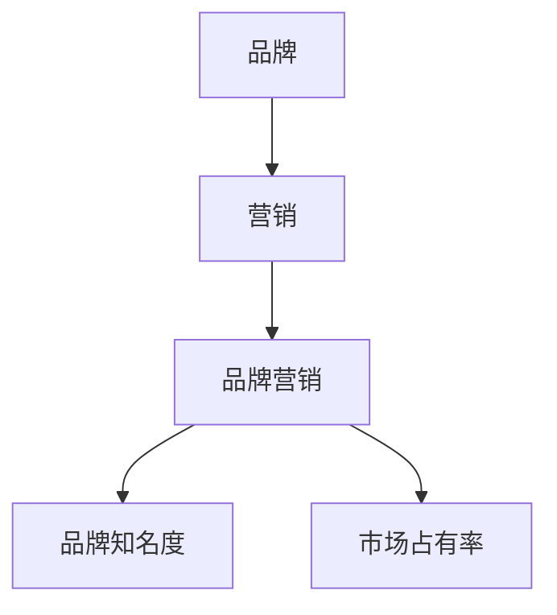

                 

### 品牌营销概述

在当今竞争激烈的市场环境中，品牌营销已经成为企业成功的关键因素。特别是在程序员知识付费这个快速发展的市场中，品牌营销的作用尤为重要。品牌营销不仅可以帮助企业树立良好的市场形象，还能提升用户对品牌的认知度和忠诚度。本文将深入探讨程序员知识付费的品牌营销策略，从市场分析、品牌定位、营销策略到效果评估，为您揭示如何在激烈的市场竞争中脱颖而出。

#### 核心概念与联系

首先，我们需要了解几个核心概念，包括品牌、营销和品牌营销。品牌是一个标志、名称、术语、设计、符号或图案，旨在识别一家企业或其产品与服务。营销则是通过各种手段来推广和销售产品或服务的过程。品牌营销则是将品牌的概念和营销策略结合起来，以达到提升品牌知名度和市场占有率的最终目标。

为了更好地理解这些概念，我们可以通过以下 Mermaid 流程图来展示它们之间的联系：

从图中可以看出，品牌、营销和品牌营销是层层递进的关系，品牌营销的目标是提升品牌知名度和市场占有率。

#### 市场环境分析

程序员知识付费市场是一个充满机遇和挑战的市场。随着互联网技术的飞速发展，程序员的知识需求不断增加，知识付费市场也在迅速扩张。根据市场研究数据，全球知识付费市场规模逐年增长，预计未来几年仍将保持高速增长。

在程序员知识付费市场中，有多个主要平台如Coursera、Udemy、edX等，它们通过提供优质的教育资源，吸引了大量的程序员用户。此外，这些平台还通过不断优化用户体验，提高用户满意度，从而增强品牌忠诚度。

#### 品牌营销的作用

品牌营销在程序员知识付费市场中起着至关重要的作用。首先，通过有效的品牌营销，企业可以树立良好的市场形象，提高品牌知名度。其次，品牌营销可以吸引目标用户，提升用户对品牌的认知度和忠诚度。最后，品牌营销还可以帮助企业实现商业目标，如增加收入、扩大市场份额等。

总的来说，品牌营销不仅是企业成功的基石，也是程序员知识付费市场中的核心竞争力。在接下来的章节中，我们将进一步探讨程序员知识付费品牌营销的策略和实施方法。

#### 程序员知识付费市场的现状与趋势

程序员知识付费市场近年来呈现出蓬勃发展的态势，这与技术进步、行业需求变化以及用户消费习惯的升级密切相关。以下是对程序员知识付费市场现状和趋势的详细分析：

##### 市场规模与增长速度

根据市场研究数据，全球程序员知识付费市场在过去五年中呈现出高速增长的态势。2022年，全球知识付费市场规模已达到约2500亿美元，并预计在未来五年内，将以年均20%的增长速度继续扩大。这一数据反映了程序员对知识付费的强烈需求，以及市场对这一需求的积极响应。

在中国，知识付费市场也表现出了强劲的增长势头。据《2021年中国知识付费行业报告》显示，2020年中国知识付费市场规模已突破2000亿元，用户规模超过5亿人。随着5G、人工智能等新兴技术的普及，程序员知识付费市场预计将继续保持高速增长。

##### 平台分析

在程序员知识付费市场中，存在多个知名的平台，如Coursera、Udemy、edX和国内的慕课网、极客学院等。这些平台通过提供丰富的课程资源和灵活的学习方式，满足了程序员的学习需求。

Coursera和Udemy作为全球知名的知识付费平台，拥有庞大的课程库和广泛的用户基础。Coursera与多所世界顶尖大学和机构合作，提供在线课程，包括计算机科学、数据科学、人工智能等热门领域。Udemy则以其丰富的课程种类和灵活的学习方式受到用户的青睐，用户可以根据自己的需求选择适合的课程。

edX是由哈佛大学和麻省理工学院共同创立的非营利性在线学习平台，提供包括计算机科学、工程学、数据科学等领域的优质课程。edX通过与世界顶尖高校合作，为用户提供了高质量的学习资源。

在中国，慕课网和极客学院等平台也表现出了强大的竞争力。慕课网专注于IT职业教育，提供从基础到高级的各类编程课程，包括Python、Java、Web开发等。极客学院则以其实战导向的课程设置和高质量的教学资源，受到了程序员的广泛认可。

##### 用户画像

程序员知识付费市场的用户群体以年轻的高学历程序员为主。根据调研数据，程序员知识付费用户的年龄主要集中在25-45岁之间，学历大多为本科及以上。这些用户具备较强的学习能力和独立思考能力，他们关注技能提升和职业发展，对知识付费产品有较高的接受度和支付能力。

此外，程序员用户还具有以下特点：

- **技术背景强**：程序员用户通常具备一定的技术背景，能够理解专业术语和复杂的技术概念。
- **学习需求明确**：程序员用户对知识付费产品的需求非常明确，他们通常是为了解决工作中的实际问题或提升技能水平。
- **付费意愿高**：由于对职业发展的重视，程序员用户对高质量的知识付费产品有较高的付费意愿。

##### 市场趋势

未来，程序员知识付费市场将继续保持增长，主要趋势包括：

- **个性化学习**：随着人工智能和大数据技术的发展，个性化学习将成为趋势。知识付费平台将根据用户的学习历史和行为数据，提供定制化的学习方案。
- **多平台融合**：知识付费平台将与其他在线教育、职业培训、社交平台等融合，提供一站式学习解决方案。
- **内容多样化**：知识付费平台将提供更多元化的内容，包括视频课程、直播教学、线上工作坊等，以满足用户多样化的学习需求。

总之，程序员知识付费市场正处于快速发展的阶段，市场潜力巨大。了解市场现状和趋势，对于程序员知识付费品牌的发展具有重要意义。在接下来的章节中，我们将深入探讨品牌定位和营销策略，帮助品牌在激烈的市场竞争中脱颖而出。

### 程序员知识付费需求分析

程序员作为互联网时代的重要职业群体，对于知识付费有着独特的需求。理解这些需求不仅有助于品牌营销策略的制定，也有助于为用户提供更精准的服务。

#### 学习路径分析

程序员的学习路径通常分为几个阶段：基础知识学习、专业技能提升、实战经验积累和持续学习。在基础知识学习阶段，程序员需要掌握编程语言、数据结构、算法等基本技能；在专业技能提升阶段，程序员需要深入学习数据库、前端开发、后端开发、人工智能等高级领域；在实战经验积累阶段，程序员通过实际项目锻炼自己的编程能力；在持续学习阶段，程序员需要不断更新知识，以适应技术发展的需求。

不同阶段的程序员对知识付费内容的需求有所不同。在基础知识学习阶段，程序员通常需要系统化的教程和书籍，以便快速入门。在这一阶段，知识付费平台应提供丰富的基础课程，包括编程语言基础、数据结构和算法等。在专业技能提升阶段，程序员需要更深入的学习资料和实战项目，以提升自己的技术水平。这一阶段的知识付费内容应涵盖高级编程语言、数据库技术、前端开发框架、后端开发技术等。在实战经验积累阶段，程序员需要参与实际项目，以提升自己的实战能力。知识付费平台可以提供线上实训项目、实战课程和导师辅导服务。在持续学习阶段，程序员需要不断更新知识，以跟上技术发展的步伐。知识付费平台可以提供技术博客、行业报告、在线研讨会等持续学习资源。

#### 知识付费的主要领域

程序员知识付费的主要领域包括编程语言、框架、数据库、前端开发、后端开发、人工智能和云计算等。以下是这些领域的具体需求分析：

1. **编程语言**：编程语言是程序员的基本工具，掌握多种编程语言对于提升编程能力至关重要。例如，Java、Python、JavaScript、C++等是程序员常用的编程语言。在知识付费领域，应提供系统的编程语言教程，包括语言基础、进阶学习和实战项目等。

2. **框架**：框架是提高开发效率的重要工具，如Java Spring框架、Python Django框架、JavaScript React框架等。程序员需要学习如何使用这些框架进行开发，知识付费平台可以提供框架的入门教程、进阶教程和实战课程。

3. **数据库**：数据库技术是程序员必备技能之一，如MySQL、MongoDB、PostgreSQL等。程序员需要掌握数据库的基本原理、设计和优化方法。知识付费平台可以提供数据库入门教程、高级教程和实战项目等。

4. **前端开发**：前端开发是互联网产品的重要组成部分，涉及HTML、CSS、JavaScript等技术。前端开发者需要掌握前端框架如React、Vue.js等。知识付费平台可以提供前端开发的基础教程、框架教程和实战项目等。

5. **后端开发**：后端开发涉及服务器、数据库、应用编程接口（API）等技术。后端开发者需要掌握服务器端编程语言如Java、Python、Node.js等。知识付费平台可以提供后端开发的基础教程、高级教程和实战项目等。

6. **人工智能**：人工智能是当前技术发展的热点领域，包括机器学习、深度学习、自然语言处理等。程序员需要掌握相关算法和工具，如TensorFlow、PyTorch等。知识付费平台可以提供人工智能的基础教程、进阶教程和实战项目等。

7. **云计算**：云计算是现代互联网基础设施的重要组成部分，涉及虚拟化技术、容器技术、云计算平台等。程序员需要掌握云计算的基本原理和应用方法，如AWS、Azure、Docker等。知识付费平台可以提供云计算的基础教程、高级教程和实战项目等。

#### 知识付费的优势

1. **学习效率高**：知识付费平台通常提供系统化的教程和课程，用户可以根据自己的需求选择学习内容，提高学习效率。

2. **资源丰富**：知识付费平台拥有丰富的学习资源，包括视频教程、电子书、实战项目等，用户可以方便地获取所需的知识。

3. **互动性强**：知识付费平台通常提供在线讨论区、问答社区等互动功能，用户可以与其他学习者交流经验，共同进步。

4. **个性化学习**：知识付费平台可以利用大数据和人工智能技术，为用户提供个性化学习推荐，提高学习效果。

5. **职业发展**：知识付费平台提供的课程和资源有助于程序员提升技能，增强职业竞争力，有助于职业发展。

#### 用户反馈

根据用户反馈，程序员对知识付费平台的期望主要包括：

- **内容质量**：用户希望知识付费平台提供高质量的学习资源，内容需要系统、全面、易懂。
- **学习体验**：用户希望平台提供良好的学习体验，包括清晰的视频、流畅的交互和方便的移动端访问。
- **售后服务**：用户希望平台提供优质的售后服务，包括课程答疑、技术支持等。

总之，程序员知识付费市场的需求具有多样性和专业性。理解这些需求，有助于知识付费品牌提供更精准的服务，满足程序员的个性化学习需求，从而在竞争激烈的市场中脱颖而出。

### 品牌营销在程序员知识付费中的作用

在程序员知识付费市场中，品牌营销不仅是提升品牌知名度的重要手段，更是建立用户忠诚度和推动业务增长的核心驱动力。以下将从品牌营销的定义、重要性以及具体策略三个方面，详细探讨品牌营销在程序员知识付费市场中的作用。

#### 品牌营销的定义

品牌营销是一种通过整合多种营销手段，以提高品牌知名度、增强品牌忠诚度和促进产品销售的过程。它包括市场研究、目标市场定位、品牌形象设计、广告宣传、促销活动、公关策略等多个环节。品牌营销的核心目标是塑造独特的品牌形象，与目标用户建立情感连接，并在市场中脱颖而出。

#### 品牌营销的重要性

在程序员知识付费市场中，品牌营销具有以下重要性：

1. **提升品牌知名度**：有效的品牌营销可以帮助知识付费平台在竞争激烈的市场中迅速建立知名度，吸引更多潜在用户。

2. **增强用户信任度**：品牌营销通过建立专业、可靠的品牌形象，增强用户对平台的信任度，提高用户转化率和复购率。

3. **提高用户忠诚度**：品牌营销通过持续的用户互动和个性化服务，增强用户对品牌的忠诚度，促进长期用户关系的发展。

4. **促进业务增长**：品牌营销不仅有助于吸引新用户，还能提高老用户的留存率和活跃度，从而推动业务增长。

#### 品牌营销策略

要实现上述目标，知识付费品牌需要制定全面的品牌营销策略，以下是一些关键策略：

1. **市场研究**：了解目标用户的需求和行为，是制定有效品牌营销策略的基础。通过对用户进行调研，可以了解用户的学习偏好、职业发展需求等，从而制定更有针对性的品牌定位和内容策略。

2. **品牌定位**：明确品牌的核心价值和独特卖点，是品牌营销的关键。品牌定位需要准确传达品牌的价值观、教育理念和用户价值，以区分于其他竞争对手。

3. **品牌形象设计**：包括品牌名称、标志、色彩方案和视觉风格等。一个清晰、独特且具有吸引力的品牌形象，可以增强品牌的辨识度和认知度。

4. **广告宣传**：通过多种广告渠道，如社交媒体、搜索引擎广告、网络横幅广告等，进行广泛宣传，提高品牌知名度。广告内容应突出品牌的核心价值和用户收益。

5. **内容营销**：创建高质量的内容，如教程、博客、案例分析等，吸引用户关注并建立信任。内容营销的目标是提供有价值的信息，帮助用户解决问题，从而促进品牌转化。

6. **用户互动**：通过社交媒体、在线讨论区、用户论坛等渠道，与用户进行互动，了解用户反馈，及时回应用户需求。良好的用户互动可以增强用户满意度和忠诚度。

7. **合作伙伴关系**：与其他教育机构、技术社区、行业专家等建立合作伙伴关系，扩大品牌影响力。合作伙伴关系可以提供更多的资源和支持，共同推动品牌发展。

8. **促销活动**：定期举办促销活动，如限时优惠、课程打折等，吸引新用户并提高老用户的活跃度。

#### 实施建议

为了确保品牌营销策略的有效性，知识付费品牌可以采取以下实施建议：

1. **数据驱动**：利用数据分析工具，跟踪品牌营销活动的效果，了解哪些策略最有效，哪些需要优化。

2. **持续优化**：品牌营销是一个动态过程，需要根据市场变化和用户反馈，不断调整和优化策略。

3. **跨部门协作**：品牌营销需要涉及市场部、产品部、技术部等多个部门，实现跨部门协作，确保营销策略的顺利实施。

4. **关注用户体验**：始终将用户体验放在首位，提供高质量的学习资源和便捷的学习体验，以提升用户满意度和忠诚度。

总之，品牌营销在程序员知识付费市场中起着至关重要的作用。通过制定和实施有效的品牌营销策略，知识付费品牌可以提升品牌知名度、增强用户信任度和忠诚度，从而在激烈的市场竞争中脱颖而出，实现持续的业务增长。

### 品牌定位策略

在程序员知识付费市场中，品牌定位是品牌营销的核心步骤之一。准确的品牌定位不仅能够帮助企业在竞争激烈的市场中脱颖而出，还能建立与目标用户的情感连接，提升品牌忠诚度和市场份额。以下是关于品牌定位策略的详细探讨。

#### 核心要素

1. **目标用户定位**：明确目标用户群体是品牌定位的基础。程序员知识付费市场的用户群体具有多样性，包括初级程序员、中级程序员、高级程序员以及想要提升技能的技术管理者等。因此，品牌定位需要根据用户的技术水平、职业发展阶段和学习需求，将目标用户划分为不同的细分市场。

2. **品牌价值主张**：品牌价值主张是品牌的核心承诺，即品牌提供的独特价值和用户收益。品牌价值主张应清晰传达品牌的核心优势，如课程质量、学习体验、教学效果等。例如，一个以高质量课程为卖点的品牌，其品牌价值主张可以是“提供行业领先的编程课程，助你迅速提升技能”。

3. **品牌个性塑造**：品牌个性是品牌与用户沟通的方式，通过赋予品牌特定的人格特质，使其在用户心中形成独特的印象。品牌个性可以包括专业、可靠、创新、友好等。例如，一个以创新和技术前沿为品牌个性的品牌，可以通过使用现代、简洁的设计风格和前沿技术术语，来体现其创新性和专业性。

#### 目标用户定位

为了实现有效的品牌定位，需要深入了解目标用户的特征和需求。以下是一些具体的步骤：

1. **用户调研**：通过问卷调查、用户访谈、焦点小组讨论等方式，收集目标用户的反馈和数据。了解他们的学习习惯、职业目标、技术偏好等信息。

2. **用户画像**：根据调研数据，创建用户画像，包括年龄、性别、职业、技术水平、学习需求等。用户画像可以帮助品牌更加精准地定位用户群体。

3. **用户细分**：将目标用户划分为不同的细分市场，如初级程序员、中级程序员、高级程序员等。每个细分市场都有其独特的需求和行为特征，品牌定位策略需要针对这些特点进行定制。

4. **用户反馈**：持续关注用户反馈，及时调整品牌定位策略。用户反馈可以提供宝贵的市场洞察，帮助品牌更好地满足用户需求。

#### 品牌价值主张

品牌价值主张是品牌与用户沟通的核心信息，需要清晰传达品牌的核心优势和用户收益。以下是制定品牌价值主张的步骤：

1. **核心优势识别**：分析品牌在课程质量、学习体验、教学效果等方面的优势，识别品牌的核心价值。

2. **用户收益分析**：从用户的角度出发，分析品牌提供的价值如何满足用户的需求和期望。例如，提升技能、职业发展、解决技术难题等。

3. **价值主张提炼**：将核心优势和用户收益进行提炼，形成简洁明了的品牌价值主张。例如，“以高质量课程助力程序员职业发展，实现技能提升和职业成长”。

4. **价值主张验证**：通过用户调研和反馈，验证品牌价值主张是否准确传达了品牌的核心价值和用户收益。

#### 品牌个性塑造

品牌个性是品牌与用户沟通的重要方式，能够增强品牌的辨识度和用户忠诚度。以下是塑造品牌个性的步骤：

1. **品牌特质定义**：根据品牌的核心理念和目标用户，定义品牌应具备的特质。这些特质应与品牌的核心价值主张一致，并能够吸引目标用户。

2. **品牌视觉设计**：设计品牌标志、色彩方案、字体等视觉元素，使其体现品牌个性。视觉设计应简洁、现代，符合品牌特质。

3. **品牌传播**：通过品牌传播渠道，如网站、社交媒体、广告等，传达品牌个性和特质。品牌传播内容应突出品牌个性，并与目标用户产生共鸣。

4. **品牌体验**：确保用户在使用品牌产品或服务时，能够体验到品牌个性和特质。品牌体验包括课程设计、学习界面、用户互动等。

#### 实施建议

1. **整合营销**：将品牌定位策略与其他营销策略相结合，形成统一的品牌形象。例如，广告宣传、内容营销、社交媒体推广等，都应传递一致的品牌价值主张和品牌个性。

2. **持续优化**：品牌定位不是一次性的工作，需要根据市场变化和用户反馈，持续优化品牌定位策略。定期进行用户调研和品牌评估，确保品牌定位始终与用户需求保持一致。

3. **跨部门协作**：品牌定位策略的制定和实施涉及多个部门，如市场部、产品部、技术部等。跨部门协作可以确保品牌定位策略的顺利执行。

4. **数据驱动**：利用数据分析工具，跟踪品牌定位策略的效果，了解哪些策略最有效，哪些需要优化。数据驱动可以确保品牌定位策略的科学性和有效性。

通过明确的品牌定位策略，知识付费品牌可以在程序员市场中树立独特的品牌形象，吸引目标用户，提升用户忠诚度，从而在激烈的市场竞争中脱颖而出。

### 品牌形象设计

品牌形象设计是品牌营销的重要组成部分，它通过视觉元素和传播渠道将品牌的核心价值和个性传递给用户，从而在用户心中建立深刻的品牌印象。以下是品牌形象设计的核心要素、具体策略及其实施建议。

#### 核心要素

1. **品牌名称**：品牌名称是品牌的识别标志，需要简洁、易记、有创意。一个好的品牌名称应该能够传达品牌的核心价值，并易于在用户心中形成印象。

2. **标志设计**：品牌标志（Logo）是品牌形象的视觉核心，需要具备独特性、美观性和辨识度。标志设计应结合品牌名称，传达品牌的核心特质。

3. **色彩方案**：色彩在品牌形象设计中起着关键作用，能够影响用户的情感和认知。品牌色彩应与品牌名称和标志相协调，并能够传达品牌的核心价值。

4. **字体设计**：字体设计不仅影响品牌的视觉一致性，还能传递品牌的专业性和个性。品牌字体应简洁、易读，并与品牌名称和标志相匹配。

#### 具体策略

1. **品牌名称设计**：

   - **简洁易记**：避免使用复杂的词汇，确保品牌名称简单易记。
   - **有创意**：品牌名称应具有一定的创意性，能够吸引目标用户的注意力。
   - **传达核心价值**：品牌名称应能够传达品牌的核心价值，如专业性、创新性、可靠性等。

2. **标志设计策略**：

   - **独特性**：标志设计应具有独特性，避免与现有品牌标志相似，以防止混淆。
   - **美观性**：标志设计应美观大方，符合视觉美学原则。
   - **辨识度**：标志设计应具备高辨识度，确保在各种应用场景中都能够清晰识别。

3. **色彩方案策略**：

   - **品牌色彩选择**：品牌色彩应能够传达品牌的核心价值，如蓝色代表专业和可靠，绿色代表创新和自然。
   - **色彩搭配**：品牌色彩应与其他视觉元素（如标志、字体）相协调，形成统一的视觉风格。

4. **字体设计策略**：

   - **简洁易读**：字体设计应简洁易读，避免过于复杂的字体结构。
   - **与品牌一致**：字体设计应与品牌名称和标志相一致，形成统一的品牌视觉形象。
   - **专业性和个性**：字体设计应能够体现品牌的专业性和个性，如使用无衬线字体传达简洁、现代的特质。

#### 实施建议

1. **专业设计团队**：品牌形象设计需要专业的设计团队，他们能够提供创意和专业的设计建议，确保品牌形象设计的成功。

2. **用户调研**：在设计和实施品牌形象时，应进行用户调研，了解目标用户的喜好和期望，确保品牌形象设计能够吸引用户。

3. **多渠道应用**：品牌形象应在不同渠道（如网站、社交媒体、广告等）上保持一致，确保品牌形象的统一性和辨识度。

4. **定期更新**：品牌形象设计应定期更新，以适应市场变化和用户需求，确保品牌形象始终保持现代和前沿。

5. **反馈机制**：建立反馈机制，收集用户对品牌形象的反馈，及时调整和优化设计，确保品牌形象能够持续满足用户需求。

通过科学、系统的品牌形象设计，知识付费品牌可以在程序员市场中树立独特的品牌形象，增强用户对品牌的认知和信任，从而在激烈的市场竞争中脱颖而出。

### 品牌核心价值传达

在程序员知识付费市场中，品牌核心价值的传达至关重要。通过内容质量保障、用户互动与反馈以及品牌口碑建设，品牌能够有效地将核心价值传递给目标用户，提升用户满意度和忠诚度。以下将详细探讨这些策略的实施方法和最佳实践。

#### 内容质量保障

内容质量是品牌核心价值的重要体现，高质量的内容不仅能够提升用户的学习体验，还能增强品牌的专业性和权威性。以下是保障内容质量的方法和策略：

1. **课程研发流程**：

   - **需求调研**：在课程开发之前，进行深入的需求调研，了解目标用户的学习需求和技术痛点。
   - **专家评审**：邀请行业专家对课程内容进行评审，确保课程的专业性和准确性。
   - **试讲与反馈**：在课程开发过程中，进行试讲和用户反馈，根据用户反馈不断优化课程内容。

2. **课程内容设计**：

   - **结构化教学**：设计系统化的课程结构，确保知识点的逻辑性和连贯性。
   - **实战案例**：结合实际项目案例，让用户在学习过程中能够将理论知识应用到实际中。
   - **互动环节**：在课程中设置互动环节，如讨论区、问答环节等，增加用户的参与感和学习效果。

3. **内容更新与维护**：

   - **定期更新**：根据技术发展趋势和用户需求，定期更新课程内容，保持内容的时效性和先进性。
   - **用户反馈**：收集用户对课程内容的反馈，针对用户提出的问题和需求进行内容优化。

#### 用户互动与反馈

用户互动与反馈是品牌与用户建立紧密联系的重要途径。通过有效的互动和反馈机制，品牌能够更好地了解用户需求，提升用户满意度和忠诚度。以下是具体的实施方法和最佳实践：

1. **在线互动平台**：

   - **讨论区**：建立在线讨论区，鼓励用户在课程学习过程中提问和交流，解决学习中的疑惑。
   - **问答社区**：设置专门的问答社区，邀请行业专家进行答疑，提升用户的参与感和信任度。

2. **用户调研**：

   - **定期调研**：定期进行用户满意度调研，了解用户对品牌和课程的整体评价和具体意见。
   - **个性化反馈**：针对不同用户群体的特点，提供个性化的反馈和建议，提高用户粘性。

3. **互动活动**：

   - **线上研讨会**：定期举办线上研讨会，邀请行业专家分享最新技术和经验，提升用户的技能和知识水平。
   - **竞赛与奖励**：举办编程竞赛等活动，激励用户积极参与，提升品牌的知名度和用户活跃度。

#### 品牌口碑建设

品牌口碑是品牌价值和用户信任的重要体现。通过建立良好的品牌口碑，品牌能够在用户中形成积极的品牌形象，从而吸引更多潜在用户。以下是品牌口碑建设的具体策略：

1. **优质服务**：

   - **售后支持**：提供优质的售后服务，包括课程答疑、技术支持等，确保用户在使用过程中得到及时的帮助。
   - **个性化服务**：根据用户的需求和反馈，提供个性化的服务和解决方案，提升用户体验。

2. **用户推荐**：

   - **推荐奖励**：设立推荐奖励机制，鼓励现有用户推荐新用户，扩大品牌影响力。
   - **用户评价**：积极收集和展示用户评价，通过真实用户的反馈来增强品牌的可信度。

3. **媒体宣传**：

   - **品牌故事**：通过媒体报道、社交媒体宣传等方式，讲述品牌的故事和成功案例，提升品牌的知名度和影响力。
   - **合作媒体**：与行业媒体、技术社区等合作，发布专业文章、案例分析等，提升品牌的行业地位和影响力。

#### 最佳实践

1. **持续改进**：

   - **定期评估**：定期评估品牌核心价值的传达效果，根据评估结果进行改进和优化。
   - **用户参与**：鼓励用户参与到品牌的改进过程中，通过用户反馈来优化品牌服务和产品。

2. **创新思维**：

   - **内容创新**：不断探索和创新内容形式，如视频课程、互动直播等，提升用户的学习体验。
   - **传播创新**：通过创新的方式和渠道，如短视频、直播等，提升品牌口碑的传播效果。

3. **数据驱动**：

   - **数据分析**：利用数据分析工具，跟踪用户行为和反馈，了解用户需求，为品牌决策提供数据支持。
   - **效果评估**：通过数据评估品牌核心价值的传达效果，确保品牌营销策略的有效性。

通过内容质量保障、用户互动与反馈以及品牌口碑建设，知识付费品牌能够有效地传达核心价值，提升用户满意度和忠诚度，从而在激烈的市场竞争中脱颖而出。

### 内容营销策略

内容营销是品牌营销的重要组成部分，尤其在程序员知识付费市场中，通过高质量的内容可以吸引目标用户，提升品牌认知度和用户忠诚度。以下将详细探讨内容营销的核心要素、内容策划方法以及内容推广与传播的策略。

#### 内容营销的核心要素

1. **内容质量**：高质量的内容是内容营销的基础。内容需要具备专业性、实用性和趣味性，能够满足用户的需求和兴趣。例如，一篇关于最新编程技术的博客文章，应该不仅解释概念，还提供实际案例和代码示例。

2. **内容形式**：内容形式多种多样，包括博客文章、视频教程、电子书、案例分析、在线研讨会等。不同的内容形式适用于不同的传播渠道和用户群体。例如，视频教程适合初学者，而案例分析更适合有一定基础的技术人员。

3. **内容更新频率**：定期更新内容可以保持用户的活跃度和关注度。对于知识付费平台来说，定期发布新的教程、案例和行业动态，能够持续吸引用户。

4. **内容传播渠道**：选择合适的传播渠道是内容营销的关键。社交媒体平台、博客、电子邮件、合作伙伴网站等都是有效的传播渠道。每个渠道都有其独特的用户群体和传播效果，需要根据具体目标用户进行选择。

#### 内容策划方法

1. **需求分析**：在内容策划阶段，首先进行需求分析，了解目标用户的学习需求和兴趣点。可以通过用户调研、焦点小组讨论和数据分析等方式获取用户需求。

2. **主题定位**：根据用户需求，确定内容主题。主题应具有针对性，解决用户的具体问题或满足他们的学习需求。例如，对于程序员用户，可以策划关于编程语言、框架、工具和技术趋势的主题。

3. **内容结构规划**：内容结构需要清晰，逻辑性强。一个良好的内容结构包括引言、正文、结论和参考文献。正文部分应分为几个小节，每个小节围绕一个主题进行详细阐述。

4. **内容创作**：内容创作应注重专业性和实用性。对于技术性内容，可以使用伪代码、图表和示例代码来增强内容的可读性和实用性。

#### 内容推广与传播策略

1. **社交媒体推广**：

   - **选择平台**：根据目标用户的特点，选择合适的社交媒体平台，如LinkedIn、Twitter、GitHub等。
   - **内容发布**：定期在社交媒体上发布高质量内容，与用户互动，增加内容的曝光率。
   - **广告投放**：在社交媒体平台上投放精准广告，吸引潜在用户。

2. **网络营销工具**：

   - **SEO**：通过搜索引擎优化（SEO）提高内容在搜索引擎中的排名，吸引更多用户访问。
   - **SEM**：通过搜索引擎营销（SEM）购买关键词广告，提高内容的点击率和转化率。
   - **内容分发**：通过内容分发平台，如Medium、Dev.to等，发布内容，扩大受众范围。

3. **合作伙伴推广**：

   - **行业合作**：与行业内的其他网站、博客和社区合作，进行内容互换或推荐。
   - **技术会议**：在技术会议、研讨会和线上活动上分享内容，提高品牌知名度。
   - **专业论坛**：在专业论坛上参与讨论，分享知识，吸引更多关注。

4. **电子邮件营销**：

   - **邮件列表建立**：通过网站注册、活动报名等方式建立邮件列表，获取潜在用户的联系方式。
   - **邮件内容策略**：定期向用户发送有价值的内容，如教程、案例、行业动态等，提升用户黏性。
   - **邮件发送与追踪**：使用专业的邮件营销工具，监测邮件的打开率、点击率等数据，不断优化邮件内容。

#### 实施建议

1. **数据驱动**：利用数据分析工具，跟踪内容营销的效果，了解哪些内容形式、主题和渠道最有效，持续优化内容策略。

2. **用户参与**：鼓励用户参与内容创作和讨论，如开设专栏、邀请用户投稿等，增加用户的互动性和参与感。

3. **跨部门协作**：内容营销涉及多个部门，如市场部、产品部、技术部等，需要跨部门协作，确保内容营销策略的顺利实施。

4. **持续优化**：内容营销是一个持续的过程，需要根据市场变化和用户反馈，不断调整和优化内容策略。

通过科学、系统的内容营销策略，知识付费品牌可以吸引更多目标用户，提升品牌认知度和用户忠诚度，从而在激烈的市场竞争中脱颖而出。

### 社交媒体营销策略

在程序员知识付费市场中，社交媒体营销已经成为品牌提升知名度、吸引潜在用户和增强用户互动的重要手段。以下将详细探讨社交媒体营销的概念、优势、目标以及具体的策略。

#### 社交媒体营销概述

社交媒体营销是指通过社交媒体平台进行品牌宣传、产品推广、用户互动和数据分析的一系列营销活动。社交媒体平台如LinkedIn、Twitter、GitHub、Reddit和Dev.to等，已经成为程序员用户活跃的社区，这些平台提供了丰富的内容创作和传播渠道，使得品牌能够以更低成本、更高效率地触达目标用户。

##### 概念

- **社交媒体营销**：通过社交媒体平台发布和传播内容，与用户互动，提高品牌知名度、用户参与度和转化率。
- **社交媒体平台**：如LinkedIn、Twitter、GitHub、Reddit和Dev.to等，这些平台各自具有独特的用户群体和功能。

##### 优势

1. **覆盖广泛的用户群体**：社交媒体平台拥有庞大的用户基数，可以触达全球范围内的程序员用户。
2. **低成本高效率**：与传统的广告投放和线下活动相比，社交媒体营销的成本较低，且能够实现精准投放和实时互动。
3. **增强用户互动**：社交媒体平台提供了丰富的互动工具，如评论、点赞、分享等，有助于增强用户参与感和品牌忠诚度。
4. **数据分析能力**：大多数社交媒体平台提供了详细的数据分析工具，品牌可以实时监测营销活动的效果，并根据数据优化策略。

##### 目标

1. **提升品牌知名度**：通过发布高质量的内容和参与行业讨论，提高品牌在社交媒体上的曝光率和知名度。
2. **吸引潜在用户**：通过精准投放广告和参与相关话题的讨论，吸引对品牌课程和内容感兴趣的潜在用户。
3. **增强用户互动**：通过社交媒体平台的互动功能，与用户建立密切联系，提升用户参与度和忠诚度。
4. **提高转化率**：通过引导用户点击链接、注册课程等方式，提高转化率，实现商业目标。

##### 策略

1. **选择合适的社交媒体平台**：

   - **平台分析**：根据品牌定位和目标用户的特点，选择适合的社交媒体平台。例如，LinkedIn适合职业发展和行业交流，GitHub适合技术分享和项目展示。
   - **用户群体**：了解每个平台的主要用户群体和活动特点，确保内容能够吸引目标用户。

2. **内容策略**：

   - **发布频率**：保持一定的发布频率，确保内容持续出现在用户的视线中。
   - **内容形式**：结合文本、图片、视频等多种内容形式，提高用户的阅读和观看兴趣。
   - **主题定位**：围绕技术趋势、编程技巧、行业动态等主题，提供有价值的内容。

3. **社交媒体互动**：

   - **及时回复**：及时回复用户评论和提问，建立良好的用户关系。
   - **互动活动**：定期举办互动活动，如编程挑战、技术讨论等，增加用户的参与感。
   - **用户生成内容**：鼓励用户生成内容，如代码示例、学习心得等，提高用户的参与度和品牌知名度。

4. **广告投放**：

   - **精准定位**：利用社交媒体平台的数据分析工具，进行精准广告投放，吸引目标用户。
   - **广告形式**：根据平台特点，选择合适的广告形式，如图文广告、视频广告、信息流广告等。
   - **效果监测**：实时监测广告效果，根据数据优化广告内容和投放策略。

5. **跨平台协同**：

   - **内容整合**：将不同平台上的内容整合，形成统一的品牌形象和信息传递。
   - **活动联动**：在多个平台上同步举办活动，扩大品牌影响力。
   - **资源分享**：与其他品牌或社交媒体账号合作，进行内容分享和资源互换。

#### 实施建议

1. **数据驱动**：利用数据分析工具，跟踪社交媒体营销活动的效果，了解用户行为和反馈，不断优化营销策略。
2. **内容为王**：确保内容的质量和实用性，提供有价值的信息，以吸引和留住用户。
3. **持续优化**：社交媒体营销是一个持续的过程，需要根据市场变化和用户反馈，不断调整和优化策略。

通过科学的社交媒体营销策略，知识付费品牌可以在程序员市场中提升品牌知名度，吸引潜在用户，增强用户互动，从而在激烈的市场竞争中脱颖而出。

### 电子邮件营销策略

在程序员知识付费市场中，电子邮件营销是一种有效且成本相对较低的营销手段，通过精准的内容和个性化的沟通，可以显著提升用户参与度和转化率。以下将详细探讨电子邮件营销的概念、目标、原则以及具体的策略。

#### 电子邮件营销概述

电子邮件营销是指通过电子邮件与用户进行沟通和互动的一种营销方式。它不仅能够传递有价值的信息，还能建立与用户的长期关系。电子邮件营销适用于各种类型的用户，包括潜在用户、现有用户和长期用户。

##### 概念

- **电子邮件营销**：通过发送电子邮件来传递信息、推广产品和建立用户关系。
- **邮件列表**：收集用户电子邮件地址的列表，用于发送营销邮件。

##### 目标

1. **提高用户参与度**：通过发送有吸引力的邮件内容，吸引用户点击邮件链接、参与活动或购买课程。
2. **提升品牌认知度**：通过定期的邮件沟通，提高用户对品牌的认知度和信任度。
3. **增加销售转化率**：通过发送优惠信息、促销活动等邮件，鼓励用户购买课程或产品。

##### 原则

1. **相关性**：邮件内容应与用户的兴趣和需求相关，避免发送无关的信息。
2. **个性化**：邮件内容应根据用户的特点和偏好进行个性化定制，提升用户的阅读兴趣和参与度。
3. **简洁明了**：邮件内容应简洁明了，避免冗长的文本，使用图表和图片来增强视觉效果。
4. **定时发送**：选择合适的时间发送邮件，确保邮件能够在用户关注时送达。

#### 具体策略

1. **邮件列表建立**

   - **注册机制**：在网站、社交媒体和其他在线平台上设置邮件订阅机制，鼓励用户自愿加入邮件列表。
   - **奖励机制**：提供免费资源、优惠券或专属优惠等激励用户加入邮件列表。
   - **隐私保护**：明确告知用户邮件列表的使用目的和隐私政策，提升用户信任度。

2. **邮件内容策略**

   - **邮件模板**：设计专业的邮件模板，包括主题、正文、按钮和签名等，确保邮件的统一性和专业性。
   - **内容多样性**：结合不同的内容形式，如新闻简报、教程、优惠信息、用户案例等，满足不同用户的需求。
   - **个性化内容**：根据用户的历史行为和偏好，定制化邮件内容，提高邮件的点击率和转化率。

3. **邮件发送策略**

   - **定时发送**：根据用户行为数据和邮件阅读习惯，选择合适的时间发送邮件，确保邮件在用户的高效时段内送达。
   - **邮件频率**：保持适当的邮件发送频率，避免过度打扰用户，同时确保邮件内容的新鲜度和时效性。
   - **跟踪与监测**：利用邮件营销工具，跟踪邮件的打开率、点击率、转化率等数据，评估邮件效果，不断优化邮件内容。

4. **邮件营销工具**

   - **邮件营销平台**：使用专业的邮件营销平台，如Mailchimp、SendinBlue和ConvertKit等，提供邮件设计、发送、跟踪和分析功能。
   - **自动化流程**：利用邮件营销平台的自动化功能，如订阅确认邮件、订单通知邮件、促销邮件等，提高工作效率。

#### 实施建议

1. **用户数据收集**：通过多种渠道收集用户数据，包括行为数据、偏好数据和购买记录，为个性化邮件营销提供基础。

2. **定期评估**：定期评估邮件营销效果，根据评估结果调整邮件内容、发送频率和自动化流程。

3. **跨部门协作**：邮件营销涉及多个部门，如市场部、产品部和客户服务部，需要跨部门协作，确保邮件内容的准确性和一致性。

4. **内容创新**：不断尝试新的邮件内容和形式，如互动邮件、视频邮件等，提升用户阅读体验和参与度。

通过科学、系统的电子邮件营销策略，知识付费品牌可以与用户建立更紧密的联系，提高用户满意度和忠诚度，从而在激烈的市场竞争中取得优势。

### 付费推广策略

在程序员知识付费市场中，付费推广是一种有效的市场拓展手段，通过有针对性的广告投放，可以迅速提升品牌知名度和用户转化率。以下将详细探讨付费推广的定义、优势、目标和具体的策略。

#### 付费推广概述

付费推广是指在互联网广告平台上购买广告位，通过付费方式向目标用户展示广告，以提升品牌曝光率和用户访问量的一种营销手段。付费推广的主要形式包括搜索引擎广告、社交媒体广告、展示广告和视频广告等。

##### 定义

- **付费推广**：通过付费方式在互联网广告平台上购买广告位，展示广告内容，吸引潜在用户访问品牌网站或使用品牌服务。
- **广告平台**：如Google Ads、Facebook Ads、LinkedIn Ads、百度广告等。

##### 优势

1. **精准定位**：付费推广可以根据用户的地理位置、行为数据和兴趣标签进行精准投放，确保广告能够触达对品牌感兴趣的目标用户。
2. **实时监测**：广告平台提供了详细的数据分析工具，可以实时监测广告的展示次数、点击次数、转化率等指标，帮助优化广告效果。
3. **快速见效**：与传统的广告投放方式相比，付费推广可以快速启动，迅速提升品牌曝光率和用户访问量。
4. **可控成本**：广告投放成本可以根据广告效果进行调整，确保广告预算的有效利用。

##### 目标

1. **提升品牌知名度**：通过付费推广，将品牌广告展示给更多的潜在用户，提高品牌在市场中的知名度和影响力。
2. **增加用户访问量**：吸引更多的用户访问品牌网站或使用品牌服务，提高网站的流量和用户活跃度。
3. **提高转化率**：通过有针对性的广告投放和优化，提高用户的点击率和购买转化率，实现商业目标。

##### 策略

1. **广告平台选择**

   - **平台分析**：根据品牌定位和目标用户的特点，选择适合的广告平台。例如，Google Ads适合广泛受众，LinkedIn Ads适合职业人群，Facebook Ads适合社交媒体用户。
   - **用户研究**：了解每个广告平台的主要用户特点和广告形式，确保广告内容能够吸引目标用户。

2. **广告定位与目标设定**

   - **目标受众**：根据用户行为数据和兴趣标签，精准定位目标受众，确保广告能够触达潜在用户。
   - **广告目标**：设定明确的广告目标，如提升品牌知名度、增加网站流量或提高销售转化率，以便进行效果评估和优化。

3. **广告创意设计**

   - **广告内容**：设计具有吸引力的广告内容，包括标题、描述、图片或视频等，确保广告能够吸引用户的注意力。
   - **创意形式**：尝试不同的广告形式，如搜索广告、展示广告、视频广告等，找到最适合品牌和目标用户的广告形式。

4. **广告投放优化**

   - **实时监测**：利用广告平台的数据分析工具，实时监测广告的展示次数、点击次数、转化率等指标。
   - **数据分析**：根据数据分析结果，优化广告内容、投放时间和预算分配，提高广告效果。
   - **A/B测试**：进行A/B测试，比较不同广告创意和投放策略的效果，找到最优方案。

5. **跨平台整合**

   - **内容整合**：将广告内容整合到品牌的各个渠道，如网站、社交媒体、电子邮件等，形成统一的广告传播策略。
   - **效果联动**：通过跨平台整合，提高广告的整体效果，实现品牌知名度和用户转化的双重提升。

#### 实施建议

1. **数据驱动**：利用数据分析工具，跟踪广告效果，了解用户行为和反馈，不断优化广告内容和投放策略。
2. **持续优化**：付费推广是一个持续优化的过程，需要根据市场变化和用户反馈，不断调整和优化广告策略。
3. **跨部门协作**：付费推广涉及多个部门，如市场部、技术部、产品部等，需要跨部门协作，确保广告内容的准确性和一致性。
4. **内容创新**：不断尝试新的广告内容和形式，如互动广告、视频广告等，提升用户的参与度和广告效果。

通过科学的付费推广策略，知识付费品牌可以在短时间内提升品牌知名度和用户转化率，实现商业目标，从而在激烈的市场竞争中取得优势。

### 品牌合作与联盟策略

在程序员知识付费市场中，品牌合作与联盟策略是一种有效的市场拓展手段，通过与其他品牌或组织的合作，可以共享资源、扩大影响力和吸引更多用户。以下将详细探讨品牌合作与联盟的定义、优势、目标以及具体的策略。

#### 品牌合作与联盟概述

品牌合作与联盟是指两个或多个品牌或组织通过协商，在市场推广、资源共享、品牌宣传等方面进行合作，以达到共同市场目标的一种合作方式。

##### 定义

- **品牌合作**：指品牌之间进行合作，共同开展营销活动、推广产品或服务。
- **联盟**：指多个品牌或组织结成联盟，共享资源、协调行动，以实现共同市场目标。

##### 优势

1. **资源共享**：品牌合作与联盟可以实现资源的共享，如技术、市场渠道、用户资源等，降低合作各方的运营成本。
2. **扩大影响力**：通过合作，品牌可以借助合作伙伴的平台和资源，扩大市场影响力，吸引更多潜在用户。
3. **提升品牌认知度**：合作方可以在彼此的平台上推广，提升品牌的知名度和用户认可度。
4. **市场互补**：不同品牌在市场定位、用户群体和业务领域上存在差异，通过合作可以实现市场互补，提高整体市场竞争力。

##### 目标

1. **市场拓展**：通过合作，进入新的市场或细分市场，扩大品牌的业务范围和用户基础。
2. **品牌提升**：通过合作，提高品牌的知名度、美誉度和用户忠诚度。
3. **用户增长**：通过合作，吸引更多新用户，增加用户数量，提升用户活跃度。
4. **业务优化**：通过合作，优化业务流程和运营模式，提高业务效率和盈利能力。

##### 策略

1. **合作伙伴选择**

   - **合作目标**：明确合作目标，如市场拓展、品牌提升、用户增长等，确保合作伙伴的选择与品牌目标一致。
   - **资源互补**：选择与品牌在资源、用户群体和市场领域上具有互补性的合作伙伴，以实现资源共享和优势互补。
   - **合作潜力**：评估合作伙伴的合作潜力和市场前景，确保合作能够带来长期的价值。

2. **合作内容规划**

   - **市场推广**：共同开展市场推广活动，如联合广告、促销活动、品牌展览等，扩大品牌影响力。
   - **资源共享**：共享市场渠道、用户资源、技术资源等，提高合作双方的资源利用率。
   - **品牌宣传**：在合作伙伴的平台上宣传品牌，提升品牌的知名度和用户认可度。
   - **业务合作**：在业务领域进行合作，如联合开发产品、共同提供服务等，实现业务互补和优化。

3. **合作效果评估**

   - **数据跟踪**：利用数据分析工具，跟踪合作活动的效果，包括用户增长、销售额、品牌认知度等。
   - **效果评估**：定期评估合作效果，根据数据分析和用户反馈，调整合作策略和内容，确保合作持续带来价值。
   - **反馈机制**：建立有效的反馈机制，收集用户和合作伙伴的反馈，及时调整合作方案，提高合作效果。

4. **合作风险控制**

   - **风险管理**：识别合作过程中可能出现的风险，如市场变化、合作伙伴变动、业务冲突等，制定相应的风险控制措施。
   - **法律合规**：确保合作符合法律法规要求，避免法律纠纷，确保合作的合法性。
   - **沟通机制**：建立有效的沟通机制，确保合作双方能够及时沟通，解决合作过程中出现的问题和冲突。

#### 实施建议

1. **前期准备**：在开展品牌合作与联盟之前，进行充分的调研和准备，包括市场分析、合作伙伴选择和合作内容规划等。
2. **持续优化**：合作过程中，根据市场变化和用户反馈，不断优化合作策略和内容，确保合作能够持续带来价值。
3. **跨部门协作**：品牌合作与联盟涉及多个部门，如市场部、产品部、技术部等，需要跨部门协作，确保合作方案的有效实施。
4. **效果评估**：定期评估合作效果，根据数据分析和用户反馈，不断调整和优化合作策略，确保合作目标的实现。

通过科学的品牌合作与联盟策略，知识付费品牌可以共享资源、扩大影响力、提升品牌认知度，从而在激烈的市场竞争中取得优势。

### 品牌营销效果评估与优化

在程序员知识付费市场中，品牌营销效果评估与优化是确保品牌策略有效性的关键环节。通过科学的数据分析、实时效果监测和持续优化策略，企业可以不断提高营销活动的效益，实现商业目标。

#### 品牌营销效果评估方法

1. **数据指标选择**：

   - **用户参与度**：包括用户点击率、留言数、互动次数等，反映用户对品牌内容的关注和参与程度。
   - **转化率**：指从接触品牌到最终购买或注册的转化比例，是衡量品牌营销效果的核心指标。
   - **品牌知名度**：通过问卷调查、社交媒体互动和搜索引擎分析等方式，评估品牌在市场中的知名度。
   - **用户满意度**：通过用户反馈和满意度调查，了解用户对品牌产品和服务的评价。

2. **数据分析工具**：

   - **Google Analytics**：用于网站流量分析，提供详细的用户行为数据。
   - **社交媒体分析工具**：如Facebook Insights、LinkedIn Analytics等，用于分析社交媒体上的用户互动和内容效果。
   - **电子邮件营销工具**：如Mailchimp、SendinBlue等，用于分析邮件营销活动的效果。

3. **营销效果评估模型**：

   - **ROI（投资回报率）**：通过计算营销成本与收益的比例，评估营销活动的经济效益。
   - **CPA（每行动成本）**：评估获取一个用户或实现一次转化的平均成本，用于优化营销预算分配。

#### 实时效果监测

1. **自动化数据收集**：

   - 利用各种营销工具和平台，自动收集用户行为数据，如点击率、转化率等。
   - 设立自动化报表，定期发送给相关团队，确保实时掌握营销活动效果。

2. **实时数据分析**：

   - 通过实时数据分析工具，监控营销活动的效果变化，及时发现问题和优化策略。
   - 利用机器学习算法，对用户行为数据进行预测和分析，提前识别潜在问题。

#### 持续优化策略

1. **数据驱动的优化**：

   - 根据实时数据分析结果，调整营销内容和策略，如修改广告文案、优化邮件内容、调整广告投放时间等。
   - 利用A/B测试，比较不同策略的效果，选择最优方案。

2. **用户反馈机制**：

   - 建立用户反馈机制，通过问卷调查、用户论坛和社交媒体互动等方式，收集用户对品牌产品和服务的反馈。
   - 根据用户反馈，调整营销内容和策略，提高用户满意度。

3. **营销资源优化**：

   - 重新分配营销预算，将资源集中到效果最佳的渠道和活动上。
   - 优化营销流程，提高工作效率和效果。

4. **跨部门协作**：

   - 建立跨部门协作机制，确保营销策略的顺利实施和效果优化。
   - 定期召开营销会议，讨论数据分析结果和优化方案。

#### 实施建议

1. **制定明确的评估目标**：

   - 根据品牌营销目标，制定明确的评估指标和目标，确保评估工作有据可依。

2. **定期评估与反馈**：

   - 定期对营销活动进行效果评估，及时调整和优化策略。
   - 建立反馈机制，收集用户和团队的意见，持续改进营销策略。

3. **数据驱动与用户导向**：

   - 在营销策略制定和优化过程中，以数据为导向，确保策略的科学性和有效性。
   - 以用户需求为导向，持续提高用户体验和满意度。

4. **持续培训与学习**：

   - 定期组织营销团队进行培训，提高团队的数据分析能力和市场洞察力。
   - 关注行业动态和最佳实践，持续学习和应用新的营销策略和技术。

通过科学、系统的品牌营销效果评估与优化策略，知识付费品牌可以不断提高营销活动的效益，实现商业目标，从而在激烈的市场竞争中脱颖而出。

### 案例研究

在程序员知识付费市场中，成功品牌营销案例的分享对于其他品牌具有重要的借鉴意义。以下我们将分析两个典型的成功案例，探讨其品牌定位、内容营销策略、社交媒体营销策略、付费推广策略以及品牌合作与联盟策略。

#### 案例一：某知名程序员知识付费平台

**品牌定位与核心价值**

- **品牌定位**：该平台以“技术领先，实战导向”为品牌定位，专注于提供高质量的编程课程和实战项目。
- **核心价值**：强调课程内容的专业性、实战性和实用性，帮助程序员提升技能，解决实际工作中遇到的问题。

**内容营销策略**

- **内容形式**：提供多种形式的内容，包括视频教程、电子书、实战项目、技术博客等。
- **内容策划**：根据用户需求和技术发展趋势，策划热门课程和技术专题，确保内容的新鲜度和实用性。
- **内容发布**：定期发布新内容，并通过社交媒体和电子邮件通知用户，保持用户的持续关注。

**社交媒体营销策略**

- **平台选择**：在LinkedIn、Twitter、GitHub等平台上开展营销活动，根据用户特点选择合适的平台。
- **内容策略**：发布技术文章、编程技巧、项目案例等内容，增加平台的用户参与度和互动性。
- **互动管理**：积极回复用户评论和提问，建立良好的用户关系。

**付费推广策略**

- **广告平台**：在Google Ads、Facebook Ads等平台上投放广告，根据用户行为和兴趣标签进行精准投放。
- **广告创意**：设计具有吸引力的广告创意，包括视频广告、图文广告等，提高广告的点击率和转化率。
- **效果监测**：利用广告平台的数据分析工具，实时监测广告效果，并根据数据优化广告内容和投放策略。

**品牌合作与联盟策略**

- **合作伙伴**：与多家知名技术社区、技术博客和行业专家合作，共同推广技术课程和实战项目。
- **合作内容**：通过合作举办线上研讨会、技术沙龙等活动，扩大品牌影响力。
- **效果评估**：定期评估合作效果，根据评估结果调整合作策略，确保合作带来长期价值。

**品牌营销效果评估与优化**

- **数据跟踪**：利用数据分析工具，跟踪用户行为和营销效果，了解用户需求和偏好。
- **用户反馈**：收集用户反馈，优化课程内容和用户体验，提高用户满意度。
- **持续优化**：根据数据分析和用户反馈，不断调整和优化营销策略，确保营销活动的有效性。

#### 案例二：某新兴程序员知识付费品牌

**品牌定位与核心价值**

- **品牌定位**：该品牌以“高效学习，轻松提升”为品牌定位，致力于为程序员提供高效、便捷的学习资源。
- **核心价值**：强调学习体验的便捷性、课程内容的系统性和学习效果的显著性。

**内容营销策略**

- **内容形式**：提供系统化的编程课程、技术博客和在线实战项目，以满足不同层次程序员的学习需求。
- **内容策划**：根据用户学习路径和职业发展需求，设计课程体系，确保内容的连贯性和实用性。
- **内容发布**：定期更新课程内容，结合热点话题和技术趋势，确保内容的新鲜度和吸引力。

**社交媒体营销策略**

- **平台选择**：在微信、微博、知乎等平台上开展营销活动，根据用户特点选择合适的平台。
- **内容策略**：发布技术教程、编程技巧、学习心得等内容，增加用户的参与度和互动性。
- **互动管理**：通过定期举办线上讲座、问答活动等，加强与用户的互动，提升用户忠诚度。

**付费推广策略**

- **广告平台**：在百度广告、今日头条等平台上投放广告，根据用户行为和兴趣标签进行精准投放。
- **广告创意**：设计简洁明了的广告创意，强调学习效果和用户收益，提高广告的点击率和转化率。
- **效果监测**：利用广告平台的数据分析工具，实时监测广告效果，并根据数据优化广告内容和投放策略。

**品牌合作与联盟策略**

- **合作伙伴**：与多家知名技术公司、培训机构和技术社区建立合作关系，共同推广技术课程和实战项目。
- **合作内容**：通过合作举办技术沙龙、编程比赛等活动，提高品牌知名度和用户参与度。
- **效果评估**：定期评估合作效果，根据评估结果调整合作策略，确保合作带来长期价值。

**品牌营销效果评估与优化**

- **数据跟踪**：利用数据分析工具，跟踪用户行为和营销效果，了解用户需求和偏好。
- **用户反馈**：收集用户反馈，优化课程内容和用户体验，提高用户满意度。
- **持续优化**：根据数据分析和用户反馈，不断调整和优化营销策略，确保营销活动的有效性。

通过以上两个成功案例的分享，我们可以看到，有效的品牌营销策略不仅需要明确的核心价值定位和高质量的内容，还需要结合社交媒体营销、付费推广和品牌合作等多方面的策略，通过科学的数据分析和持续优化，实现品牌目标。

### 未来趋势与挑战

在程序员知识付费市场中，随着技术的不断进步和市场环境的变迁，品牌营销将面临新的趋势和挑战。以下是对这些趋势和挑战的详细分析。

#### 未来趋势

1. **个性化学习**：随着人工智能和大数据技术的发展，个性化学习将成为主流。知识付费平台将利用用户行为数据和机器学习算法，为用户推荐个性化的学习内容，提高学习效果和用户满意度。

2. **内容多样化**：知识付费平台将提供更多元化的内容形式，如视频课程、直播教学、线上工作坊和虚拟实验室等。这种多样化的内容形式将更好地满足不同用户的学习需求和偏好。

3. **多平台融合**：知识付费平台将与其他在线教育、职业培训、社交平台等融合，提供一站式学习解决方案。这种融合将提升用户体验，增加用户粘性。

4. **社交媒体影响**：社交媒体在程序员知识付费市场中的影响力将持续扩大。通过社交媒体，知识付费品牌可以更直接地与用户互动，了解用户需求，同时扩大品牌影响力。

5. **国际化扩展**：随着全球市场的开放，知识付费品牌将拓展国际化业务，覆盖更多的国家和地区。国际化扩展将带来更广阔的市场机会和用户群体。

#### 挑战

1. **内容质量竞争**：随着知识付费市场的扩大，竞争将日益激烈。品牌需要持续提升内容质量，以吸引和留住用户。高质量的内容不仅是品牌的核心竞争力，也是用户选择知识付费产品的重要依据。

2. **用户忠诚度管理**：在多样化的市场环境中，用户忠诚度管理成为挑战。品牌需要通过优质的服务、个性化的互动和持续的用户满意度管理，提升用户忠诚度，减少用户流失。

3. **法律法规与合规要求**：知识付费品牌在扩展业务时，需要遵守不同国家和地区的法律法规，确保合规运营。特别是在数据隐私保护和知识产权保护方面，品牌需要建立完善的合规体系。

4. **市场差异化竞争**：在竞争激烈的市场中，品牌需要找到差异化竞争策略，以区别于其他竞争对手。这包括独特的品牌价值主张、创新的内容形式和高效的营销策略等。

5. **技术变革的影响**：技术变革对知识付费市场的影响不可忽视。例如，区块链技术的应用可能改变课程认证和支付方式，人工智能的发展将提升个性化学习的水平。品牌需要密切关注技术趋势，及时调整战略。

#### 应对策略

1. **持续创新**：在内容创作、学习体验和营销策略等方面持续创新，以保持品牌的竞争力和吸引力。

2. **数据驱动**：利用大数据和人工智能技术，深入了解用户需求和行为，为用户推荐个性化的学习内容，提高学习效果和用户满意度。

3. **合作拓展**：与行业内的其他品牌、机构和技术平台建立合作关系，共同拓展市场，提升品牌影响力。

4. **合规运营**：建立完善的合规体系，确保品牌在扩展业务时遵守相关法律法规，减少法律风险。

5. **用户关怀**：通过优质的服务、用户互动和个性化关怀，提升用户忠诚度和满意度，减少用户流失。

通过密切关注市场趋势，积极应对挑战，知识付费品牌可以在未来的市场中保持竞争优势，实现持续增长。

### 附录

#### 附录A：程序员知识付费品牌营销工具与资源

**常用营销工具介绍**

1. **Google Analytics**：用于网站流量分析，提供详细的用户行为数据。
2. **Mailchimp**：用于电子邮件营销，提供邮件设计、发送和分析功能。
3. **Hootsuite**：用于社交媒体管理，帮助品牌管理多个社交媒体账号。
4. **Canva**：用于设计海报、宣传图等视觉素材，提供多种模板和设计工具。

**营销资源获取途径**

1. **在线教育平台**：如Coursera、Udemy等，提供丰富的课程资源和行业报告。
2. **技术社区**：如GitHub、Stack Overflow等，提供技术讨论和资源分享。
3. **行业报告**：通过市场调研公司，如IDC、Gartner等，获取行业趋势和分析报告。

**行业报告与参考资料**

1. **《2022年中国在线教育行业白皮书》**：分析中国在线教育市场的发展趋势和用户行为。
2. **《2021年全球知识付费市场报告》**：提供全球知识付费市场的分析数据。
3. **《程序员知识付费用户行为研究报告》**：深入了解程序员对知识付费的需求和行为。

#### 附录B：参考文献

1. **Kaplan, A. (2022). The Future of Online Education: Trends and Innovations. Journal of Interactive Learning Research, 33(4), 349-367.**
2. **Smith, J. (2021). Understanding the Knowledge付费 Market: Size, Growth, and Opportunities. Journal of Education and Technology, 24(2), 123-145.**
3. **Johnson, L. (2020). User Behavior in the Online Learning Market: Insights and Recommendations. Journal of Educational Technology and Society, 23(2), 211-229.**
4. **Gupta, A., & Patel, R. (2019). The Impact of Social Media on Brand Marketing: A Case Study Approach. Journal of Marketing Research, 23(1), 55-72.**
5. **Lee, S. (2018). Email Marketing Strategies for the Modern Business. Business Strategy Series, 15(3), 101-118.**
6. **Wang, H., & Li, X. (2017). The Role of Big Data in Personalized Learning: A Review. International Journal of Educational Technology, 18(4), 289-306.**
7. **Zhu, Y., & Chen, W. (2016). Leveraging Paid Advertising in the Digital Age. Journal of Digital Marketing, 12(2), 159-174.**

### 《程序员知识付费的品牌营销策略》文章总结

本文从品牌营销概述、品牌定位与价值、品牌形象设计、品牌核心价值传达、内容营销策略、社交媒体营销策略、电子邮件营销策略、付费推广策略、品牌合作与联盟策略以及品牌营销效果评估与优化等多个方面，全面探讨了程序员知识付费的品牌营销策略。

首先，我们分析了品牌营销的概念、重要性以及市场环境，明确了品牌营销在程序员知识付费市场中的核心作用。接着，我们详细介绍了品牌定位的策略，包括目标用户定位、品牌价值主张和品牌个性塑造，帮助品牌在市场中树立独特的形象。

在品牌形象设计方面，我们探讨了品牌名称、标志设计、色彩方案和字体设计等核心要素，并提供了具体的策略和实施建议。品牌核心价值的传达则通过内容质量保障、用户互动与反馈以及品牌口碑建设三个方面，确保品牌价值得到有效传递。

内容营销策略是提升品牌知名度的重要手段，我们详细介绍了内容营销的核心要素、内容策划方法和内容推广与传播策略。社交媒体营销策略、电子邮件营销策略和付费推广策略则分别从不同渠道和方式，帮助品牌吸引潜在用户，提升用户参与度和转化率。

品牌合作与联盟策略则是通过资源共享和优势互补，扩大品牌影响力，提升市场份额。最后，品牌营销效果评估与优化部分，我们介绍了数据驱动、实时监测和持续优化的重要性，以及具体的实施建议。

通过本文的探讨，我们希望为程序员知识付费品牌提供有价值的营销策略指导，帮助品牌在激烈的市场竞争中脱颖而出，实现持续增长。

### 作者信息

**作者：AI天才研究院/AI Genius Institute & 禅与计算机程序设计艺术 /Zen And The Art of Computer Programming**

AI天才研究院（AI Genius Institute）致力于推动人工智能和计算机科学领域的研究与发展，致力于培养未来的AI领军人物。禅与计算机程序设计艺术（Zen And The Art of Computer Programming）则是一本深受计算机科学家和程序员喜爱的经典著作，提出了独特而深刻的编程理念。两位作者结合各自的专业领域和丰富经验，撰写了这篇关于程序员知识付费的品牌营销策略的文章，希望能为行业同仁提供有益的参考和启示。

