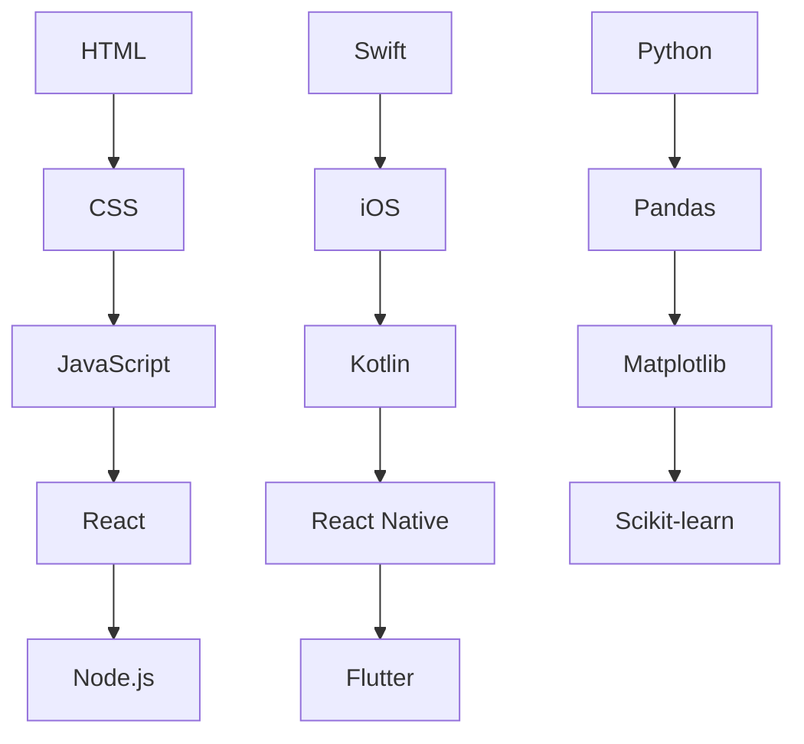

                 

## 文章标题

### 程序员知识付费：打造情景课程

#### 关键词：知识付费、程序员、情景课程、教学设计、实战案例

> 摘要：本文深入探讨程序员知识付费的现状及其在职业发展中的重要性，系统地阐述了如何设计和实施具有实际应用价值的情景课程。通过具体案例分析，本文旨在为程序员提供一套实用的知识和技能培养方案，帮助他们更好地适应市场需求。

---

## 第一部分：知识付费概述

### 1.1 知识付费的定义与趋势

#### 知识付费的定义

知识付费是指用户通过购买、订阅或付费观看等方式，获取专业人士或机构提供的知识、技能或经验的过程。这种模式在当今数字化、信息化社会中逐渐兴起，反映了用户对高质量知识内容的需求和对自身持续成长的重视。

#### 知识付费的发展趋势

随着互联网技术的进步和在线教育的普及，知识付费市场呈现出以下几个显著趋势：

1. **个性化学习**：知识付费平台能够根据用户的兴趣、需求和水平提供个性化的学习方案，满足不同用户的学习需求。
2. **垂直领域专业化**：知识付费平台逐渐向垂直领域扩展，如编程、金融、医疗等，提供专业化的知识和技能培训。
3. **互动性和实践性增强**：知识付费产品越来越注重用户参与和互动，通过在线讨论、作业、实战项目等方式提升学习效果。
4. **版权保护意识提高**：知识付费平台对知识产权保护越来越重视，确保用户获取的内容是合法和有价值的。

### 1.2 程序员在知识付费市场中的角色

#### 程序员的需求

作为技术从业者，程序员在知识付费市场中扮演着重要角色。他们面临以下需求：

1. **技能提升**：程序员需要不断更新自己的技术栈，掌握新的编程语言、框架和工具，以满足职场需求。
2. **职业发展**：程序员希望通过学习提升自己的职业地位和收入水平，实现职业转型或晋升。
3. **项目实战**：程序员希望通过实际项目锻炼自己的编程能力和问题解决能力。

#### 程序员的优势

1. **技术背景**：程序员具有扎实的计算机科学基础，能够理解和创造高价值的内容。
2. **实践能力**：程序员具备丰富的项目开发经验，能够将理论知识应用到实际项目中。
3. **学习动力**：程序员通常具有强烈的学习动机和自我驱动力，愿意投入时间和资源提升自己。

### 1.3 知识付费对程序员职业发展的影响

#### 有助于技能提升

知识付费平台提供了丰富的技术教程和实战项目，程序员可以通过付费学习不断提升自己的技能水平，从而提高职业竞争力。

#### 有助于职业发展

通过付费课程，程序员可以获取行业最新动态、最佳实践和职业指导，为自己的职业发展提供有力支持。

#### 有助于构建个人品牌

优秀的学习成果和实践经验可以帮助程序员在专业领域内建立个人品牌，提高行业影响力。

---

## 第二部分：情景课程设计基础

### 2.1 情景课程设计的原则

#### 2.1.1 教学目标明确

情景课程设计的第一步是明确教学目标。教学目标应该具体、可衡量，并与程序员的职业需求相匹配。例如，可以设定以下目标：

- 掌握某项编程语言的基本语法和用法
- 能够使用某项框架或工具进行实际项目开发
- 提升在特定领域（如数据科学、Web开发）的实战能力

#### 2.1.2 结合现实场景

情景课程设计的关键是结合现实场景，让程序员在学习过程中感受到实际工作的氛围。这可以通过以下方式实现：

- 设计真实的项目案例，让程序员在实际场景中解决问题
- 引入现实世界中的业务需求，使学习内容更具实用价值
- 融入行业案例和最佳实践，帮助程序员了解行业趋势和发展方向

#### 2.1.3 学生参与度高

情景课程设计应该注重学生的参与度，鼓励他们在学习过程中积极思考、讨论和互动。具体方法包括：

- 设置互动环节，如在线讨论、小组合作和实战项目
- 引入竞争机制，如排行榜、积分系统和奖励机制
- 利用技术工具（如在线白板、视频会议等）促进远程互动

#### 2.1.4 互动性设计

互动性设计是情景课程的重要组成部分，它可以通过以下方式实现：

- 设计互动式教学课件，如交互式图表、动画和模拟实验
- 引入虚拟现实（VR）和增强现实（AR）技术，提供沉浸式学习体验
- 利用在线评测系统实时反馈学习成果，帮助学生调整学习策略

### 2.2 情景课程的教学内容

#### 2.2.1 技术知识点梳理

情景课程的教学内容应该包括技术知识点梳理，使程序员能够系统地掌握相关技能。具体方法包括：

- 提供完整的课程大纲，明确每个章节的教学目标
- 使用图表、流程图和思维导图等方式，帮助程序员梳理知识体系
- 设计专项练习和测试，巩固程序员对知识点的掌握程度

#### 2.2.2 问题解决能力的培养

情景课程应该注重培养程序员的问题解决能力，让他们能够在实际工作中应对各种挑战。具体方法包括：

- 设计具有挑战性的项目案例，模拟真实的工作场景
- 引导程序员使用合适的算法和数据结构解决问题
- 鼓励程序员进行团队合作，共同解决复杂问题

#### 2.2.3 团队协作与沟通能力的提升

在项目开发过程中，团队协作和沟通能力至关重要。情景课程应该通过以下方式提升程序员的这些能力：

- 设置团队项目，让程序员在合作中学会沟通和协作
- 组织团队讨论和评审会议，提高程序员的表达能力
- 引入项目管理工具，帮助程序员更好地规划和管理项目

### 2.3 教学资源的准备

#### 2.3.1 课件与教材

情景课程的教学资源应包括高质量的课件和教材，为程序员提供全面的学习资料。具体方法包括：

- 编写简洁明了、易于理解的教材，避免冗长的理论讲解
- 制作图文并茂的PPT和PDF课件，提高学习的趣味性和效率
- 提供在线课程视频，方便程序员随时回看和复习

#### 2.3.2 实践项目案例

实践项目案例是情景课程的重要组成部分，它们可以帮助程序员将理论知识应用到实际项目中。具体方法包括：

- 设计与课程内容紧密相关的项目案例，使程序员能够学以致用
- 提供详细的案例说明和实现步骤，帮助程序员顺利完成项目
- 组织项目评审和答辩，让程序员展示自己的学习成果

#### 2.3.3 在线资源链接

情景课程应该提供丰富的在线资源链接，为程序员提供额外的学习支持和拓展机会。具体方法包括：

- 链接优质的开源项目、技术博客和在线课程，为程序员提供学习参考
- 引导程序员加入相关的技术社区和论坛，与同行交流学习经验
- 提供在线编程环境，方便程序员进行实践操作和代码调试

---

## 第三部分：情景课程案例解析

### 3.1 案例一：Web开发情景课程

#### 3.1.1 情境描述

假设我们设计一门Web开发情景课程，旨在帮助程序员掌握前后端开发的基本技能。课程内容涵盖HTML、CSS、JavaScript、React和Node.js等关键技术。

#### 3.1.2 教学目标

- 掌握HTML、CSS和JavaScript的基本语法和用法
- 能够使用React框架构建单页面应用
- 学会使用Node.js搭建后端服务器和API接口

#### 3.1.3 实施步骤

1. **课程导入**：通过介绍Web开发的背景和前景，激发学生的学习兴趣。
2. **技术知识点讲解**：系统讲解HTML、CSS、JavaScript、React和Node.js的基本概念和语法。
3. **实战项目**：设计一个模拟电商网站的项目，让学生分组合作完成前端和后端开发。
4. **项目评审**：组织项目评审和答辩，让学生展示自己的学习成果，并互相学习。
5. **总结与拓展**：总结课程内容，提供拓展学习资源，鼓励学生深入学习。

#### 3.1.4 评价与反馈

- 通过项目评审和答辩，评价学生的掌握程度和团队合作能力。
- 收集学生的反馈意见，不断优化课程内容和教学方法。

### 3.2 案例二：移动应用开发情景课程

#### 3.2.1 情境描述

假设我们设计一门移动应用开发情景课程，旨在帮助程序员掌握iOS和Android开发的基本技能。课程内容涵盖Swift、Kotlin、React Native和Flutter等关键技术。

#### 3.2.2 教学目标

- 掌握Swift和Kotlin的基本语法和用法
- 能够使用React Native和Flutter框架开发跨平台移动应用
- 学会使用SQLite和Firebase等数据库技术存储和管理数据

#### 3.2.3 实施步骤

1. **课程导入**：通过介绍移动应用开发的背景和前景，激发学生的学习兴趣。
2. **技术知识点讲解**：系统讲解Swift、Kotlin、React Native和Flutter的基本概念和语法。
3. **实战项目**：设计一个社交应用的项目，让学生分组合作完成iOS和Android端开发。
4. **项目评审**：组织项目评审和答辩，让学生展示自己的学习成果，并互相学习。
5. **总结与拓展**：总结课程内容，提供拓展学习资源，鼓励学生深入学习。

#### 3.2.4 评价与反馈

- 通过项目评审和答辩，评价学生的掌握程度和团队合作能力。
- 收集学生的反馈意见，不断优化课程内容和教学方法。

### 3.3 案例三：数据科学情景课程

#### 3.3.1 情境描述

假设我们设计一门数据科学情景课程，旨在帮助程序员掌握数据分析、数据可视化和机器学习等关键技术。课程内容涵盖Python、Pandas、Matplotlib、Scikit-learn等关键技术。

#### 3.3.2 教学目标

- 掌握Python的基本语法和用法
- 能够使用Pandas进行数据处理和分析
- 学会使用Matplotlib和Seaborn进行数据可视化
- 掌握Scikit-learn等机器学习库的使用方法

#### 3.3.3 实施步骤

1. **课程导入**：通过介绍数据科学的应用领域和前景，激发学生的学习兴趣。
2. **技术知识点讲解**：系统讲解Python、Pandas、Matplotlib、Scikit-learn等基本概念和语法。
3. **实战项目**：设计一个数据分析项目，让学生分组合作完成数据处理、分析和可视化。
4. **项目评审**：组织项目评审和答辩，让学生展示自己的学习成果，并互相学习。
5. **总结与拓展**：总结课程内容，提供拓展学习资源，鼓励学生深入学习。

#### 3.3.4 评价与反馈

- 通过项目评审和答辩，评价学生的掌握程度和团队合作能力。
- 收集学生的反馈意见，不断优化课程内容和教学方法。

---

## 第四部分：技术细节与算法实现

### 4.1 核心概念与联系

#### 4.1.1 Web开发核心概念

Web开发涉及前端和后端两个部分。前端负责用户界面和交互，后端负责数据处理和业务逻辑。以下是Web开发的核心概念：

1. **HTML**：超文本标记语言，用于构建网页的结构。
2. **CSS**：层叠样式表，用于美化网页的样式。
3. **JavaScript**：一种脚本语言，用于增强网页的交互性和动态效果。
4. **React**：一个用于构建用户界面的JavaScript库。
5. **Node.js**：一个基于Chrome V8引擎的JavaScript运行环境。

#### 4.1.2 移动应用开发核心概念

移动应用开发主要关注iOS和Android平台。以下是移动应用开发的核心概念：

1. **Swift**：苹果公司开发的一种编程语言，用于iOS应用开发。
2. **Kotlin**：一种适用于Android应用的编程语言。
3. **React Native**：一个用于构建跨平台移动应用的JavaScript库。
4. **Flutter**：一个用于构建跨平台移动应用的开源框架。

#### 4.1.3 数据科学核心概念

数据科学涉及数据分析、数据可视化和机器学习等关键技术。以下是数据科学的核心概念：

1. **Python**：一种适用于数据分析的编程语言。
2. **Pandas**：一个用于数据处理的Python库。
3. **Matplotlib**：一个用于数据可视化的Python库。
4. **Scikit-learn**：一个用于机器学习的Python库。

#### 4.1.4 Mermaid流程图

以下是一个Mermaid流程图示例，展示了Web开发的核心概念和联系：



### 4.2 核心算法原理讲解

#### 4.2.1 Web开发算法原理

Web开发中的核心算法主要包括前端算法和后端算法。以下是Web开发的一些核心算法原理：

1. **排序算法**：用于对数据进行排序，常见的排序算法有冒泡排序、选择排序、插入排序和快速排序。
2. **查找算法**：用于在数据结构中查找特定元素，常见的查找算法有二分查找和线性查找。
3. **缓存算法**：用于优化数据访问速度，常见的缓存算法有LRU（最近最少使用）和LFU（最不频繁使用）。

以下是一个冒泡排序算法的伪代码实现：

```python
# 冒泡排序伪代码
for i in range(0, n-1):
    for j in range(0, n-i-1):
        if arr[j] > arr[j+1]:
            temp = arr[j]
            arr[j] = arr[j+1]
            arr[j+1] = temp
```

#### 4.2.2 移动应用开发算法原理

移动应用开发中的核心算法主要涉及图像处理、音频处理和机器学习等。以下是移动应用开发的一些核心算法原理：

1. **图像处理算法**：用于对图像进行增强、滤波、边缘检测等操作，常见的图像处理算法有卷积神经网络（CNN）。
2. **音频处理算法**：用于对音频信号进行增强、降噪、音高调整等操作，常见的音频处理算法有傅里叶变换（FFT）。
3. **机器学习算法**：用于从数据中提取规律，常见的机器学习算法有线性回归、决策树和神经网络。

以下是一个线性回归算法的伪代码实现：

```python
# 线性回归伪代码
w = [0] * n  # 初始化权重
for epoch in range(num_epochs):
    for x, y in dataset:
        prediction = w.dot(x)
        error = y - prediction
        w = w + learning_rate * x * error
```

#### 4.2.3 数据科学算法原理

数据科学中的核心算法主要涉及数据分析、数据可视化和机器学习等。以下是数据科学的一些核心算法原理：

1. **数据分析算法**：用于对数据进行探索性分析、统计分析和假设检验，常见的数据分析算法有主成分分析（PCA）和聚类分析（K-means）。
2. **数据可视化算法**：用于将数据转换为图形表示，常见的可视化算法有散点图、柱状图和热力图。
3. **机器学习算法**：用于从数据中提取规律，常见的机器学习算法有决策树、支持向量机和随机森林。

以下是一个K-means聚类算法的伪代码实现：

```python
# K-means聚类伪代码
def kmeans(dataset, k):
    centroids = initialize_centroids(dataset, k)
    while not converged:
        assignments = assign_points_to_centroids(dataset, centroids)
        centroids = update_centroids(assignments)
    return centroids
```

### 4.3 数学模型和数学公式

#### 4.3.1 Web开发数学模型

Web开发中的数学模型主要涉及线性代数、微积分和概率论等。以下是Web开发的一些常见数学模型：

1. **线性模型**：用于描述线性关系，公式为 `y = wx + b`，其中 `w` 是权重，`x` 是输入特征，`b` 是偏置。
2. **非线性模型**：用于描述非线性关系，如指数函数、对数函数和多项式函数。

以下是一个线性模型的公式：

$$
y = wx + b
$$

#### 4.3.2 移动应用开发数学模型

移动应用开发中的数学模型主要涉及图像处理和音频处理。以下是移动应用开发的一些常见数学模型：

1. **傅里叶变换**：用于将信号从时域转换为频域，公式为 `X(f) = \int_{-\infty}^{\infty} x(t) e^{-j2\pi ft} dt`。
2. **卷积神经网络**：用于图像处理和识别，公式为 `output = \sigma(\sum_{i=1}^{n} w_i \cdot x_i + b)`。

以下是一个傅里叶变换的公式：

$$
X(f) = \int_{-\infty}^{\infty} x(t) e^{-j2\pi ft} dt
$$

#### 4.3.3 数据科学数学模型

数据科学中的数学模型主要涉及数据分析、数据可视化和机器学习。以下是数据科学的一些常见数学模型：

1. **主成分分析**：用于降维，公式为 `z = P\alpha`，其中 `P` 是投影矩阵，`α` 是特征向量。
2. **支持向量机**：用于分类和回归，公式为 `w \cdot x - b = 0`。

以下是一个主成分分析的公式：

$$
z = P\alpha
$$

---

## 第五部分：项目实战与代码解析

### 5.1 Web开发项目实战

#### 5.1.1 项目背景

假设我们要开发一个在线购物平台，该平台允许用户浏览商品、添加购物车、下单和支付。项目的技术栈包括React、Node.js、MongoDB和Express。

#### 5.1.2 开发环境搭建

1. **安装Node.js**：从官方网站下载并安装Node.js。
2. **安装React**：使用`create-react-app`命令创建一个新的React项目。
3. **安装MongoDB**：在本地或云服务器上安装MongoDB数据库。
4. **安装Express**：在Node.js项目中使用npm安装Express。

#### 5.1.3 源代码实现

以下是一个简化的React前端代码示例，用于展示商品列表：

```javascript
import React, { useState, useEffect } from 'react';
import axios from 'axios';

const ProductList = () => {
  const [products, setProducts] = useState([]);

  useEffect(() => {
    async function fetchProducts() {
      const response = await axios.get('/api/products');
      setProducts(response.data);
    }
    fetchProducts();
  }, []);

  return (
    <div>
      <h1>商品列表</h1>
      <ul>
        {products.map((product) => (
          <li key={product.id}>{product.name}</li>
        ))}
      </ul>
    </div>
  );
};

export default ProductList;
```

以下是一个简化的Node.js后端代码示例，用于处理商品数据的增删改查（CRUD）操作：

```javascript
const express = require('express');
const mongoose = require('mongoose');
const app = express();

app.use(express.json());

const ProductSchema = new mongoose.Schema({
  name: String,
  price: Number,
});

const Product = mongoose.model('Product', ProductSchema);

app.get('/api/products', async (req, res) => {
  try {
    const products = await Product.find({});
    res.send(products);
  } catch (error) {
    res.status(500).send(error);
  }
});

app.post('/api/products', async (req, res) => {
  try {
    const newProduct = new Product(req.body);
    const savedProduct = await newProduct.save();
    res.status(201).send(savedProduct);
  } catch (error) {
    res.status(500).send(error);
  }
});

app.put('/api/products/:id', async (req, res) => {
  try {
    const updatedProduct = await Product.findByIdAndUpdate(req.params.id, req.body, { new: true });
    res.send(updatedProduct);
  } catch (error) {
    res.status(500).send(error);
  }
});

app.delete('/api/products/:id', async (req, res) => {
  try {
    const deletedProduct = await Product.findByIdAndRemove(req.params.id);
    res.send(deletedProduct);
  } catch (error) {
    res.status(500).send(error);
  }
});

const PORT = process.env.PORT || 5000;
app.listen(PORT, () => {
  console.log(`服务器运行在端口${PORT}`);
});
```

#### 5.1.4 代码解读与分析

1. **前端代码解析**：前端代码使用React框架实现，包括一个`ProductList`组件，用于展示商品列表。通过使用`useState`和`useEffect`钩子，组件从后端获取商品数据，并在组件渲染时更新状态。
   
2. **后端代码解析**：后端代码使用Node.js和Express框架实现，包括一个`Product`模型，用于定义商品数据结构，以及一系列API路由处理商品数据的增删改查操作。使用MongoDB数据库存储商品数据，并通过HTTP请求处理客户端的请求。

### 5.2 移动应用开发项目实战

#### 5.2.1 项目背景

假设我们要开发一个天气应用，提供实时天气信息和天气预报。应用的技术栈包括Swift、Kotlin、React Native和Flutter。

#### 5.2.2 开发环境搭建

1. **安装Xcode**：在macOS上安装Xcode，用于iOS开发。
2. **安装Android Studio**：在Windows或macOS上安装Android Studio，用于Android开发。
3. **安装React Native CLI**：使用`npm install -g react-native-cli`安装React Native CLI。
4. **安装Flutter**：从Flutter官网下载并安装Flutter。

#### 5.2.3 源代码实现

以下是一个简化的React Native代码示例，用于展示天气信息：

```javascript
import React, { useState, useEffect } from 'react';
import { View, Text, StyleSheet } from 'react-native';

const WeatherInfo = () => {
  const [weatherData, setWeatherData] = useState(null);

  useEffect(() => {
    async function fetchWeatherData() {
      const response = await fetch('http://api.weatherapi.com/v1/current.json?key=YOUR_API_KEY&q=London');
      const data = await response.json();
      setWeatherData(data);
    }
    fetchWeatherData();
  }, []);

  if (!weatherData) {
    return <Text>Loading...</Text>;
  }

  return (
    <View style={styles.container}>
      <Text style={styles.title}>Current Weather in London</Text>
      <Text style={styles.temp}>{weatherData.current.temp_c}°C</Text>
      <Text style={styles.condition}>{weatherData.current.condition.text}</Text>
    </View>
  );
};

const styles = StyleSheet.create({
  container: {
    flex: 1,
    justifyContent: 'center',
    alignItems: 'center',
  },
  title: {
    fontSize: 24,
    fontWeight: 'bold',
  },
  temp: {
    fontSize: 48,
    marginTop: 16,
  },
  condition: {
    fontSize: 18,
    marginTop: 8,
  },
});

export default WeatherInfo;
```

以下是一个简化的Flutter代码示例，用于展示天气信息：

```dart
import 'package:flutter/material.dart';
import 'package:http/http.dart' as http;

class WeatherInfo extends StatefulWidget {
  @override
  _WeatherInfoState createState() => _WeatherInfoState();
}

class _WeatherInfoState extends State<WeatherInfo> {
  String _weatherData = '';

  @override
  void initState() {
    super.initState();
    _fetchWeatherData();
  }

  Future<void> _fetchWeatherData() async {
    final response = await http.get('http://api.weatherapi.com/v1/current.json?key=YOUR_API_KEY&q=London');
    if (response.statusCode == 200) {
      setState(() {
        _weatherData = response.body;
      });
    } else {
      print('Error: ${response.statusCode}');
    }
  }

  @override
  Widget build(BuildContext context) {
    return Scaffold(
      appBar: AppBar(title: Text('Current Weather in London')),
      body: _weatherData.isEmpty
          ? Center(child: Text('Loading...'))
          : ListView(
              children: [
                ListTile(
                  title: Text('Temperature:'),
                  subtitle: Text(_weatherData['current']['temp_c'].toString() + '°C'),
                ),
                ListTile(
                  title: Text('Condition:'),
                  subtitle: Text(_weatherData['current']['condition']['text']),
                ),
              ],
            ),
    );
  }
}
```

#### 5.2.4 代码解读与分析

1. **React Native代码解析**：React Native代码使用React框架实现，包括一个`WeatherInfo`组件，用于展示天气信息。使用`useState`和`useEffect`钩子从天气API获取实时天气数据，并在组件渲染时更新状态。

2. **Flutter代码解析**：Flutter代码使用Dart语言实现，包括一个`WeatherInfo`状态管理组件，用于展示天气信息。使用`http`库从天气API获取实时天气数据，并在状态改变时更新UI。

### 5.3 数据科学项目实战

#### 5.3.1 项目背景

假设我们要开发一个数据科学项目，通过分析社交媒体数据，预测用户对某个事件的兴趣。项目的技术栈包括Python、Pandas、Matplotlib和Scikit-learn。

#### 5.3.2 开发环境搭建

1. **安装Python**：从官方网站下载并安装Python。
2. **安装Pandas**：使用`pip install pandas`命令安装Pandas。
3. **安装Matplotlib**：使用`pip install matplotlib`命令安装Matplotlib。
4. **安装Scikit-learn**：使用`pip install scikit-learn`命令安装Scikit-learn。

#### 5.3.3 源代码实现

以下是一个简化的Python代码示例，用于数据预处理和特征提取：

```python
import pandas as pd
from sklearn.model_selection import train_test_split
from sklearn.feature_extraction.text import TfidfVectorizer

# 读取数据
data = pd.read_csv('social_media_data.csv')
X = data['text']
y = data['interest']

# 数据预处理
X = X.apply(lambda x: x.lower())
X = X.apply(lambda x: x.strip())

# 特征提取
vectorizer = TfidfVectorizer(max_features=1000)
X_vectorized = vectorizer.fit_transform(X)

# 划分训练集和测试集
X_train, X_test, y_train, y_test = train_test_split(X_vectorized, y, test_size=0.2, random_state=42)
```

以下是一个简化的Python代码示例，用于训练和评估模型：

```python
from sklearn.linear_model import LogisticRegression
from sklearn.metrics import accuracy_score

# 训练模型
model = LogisticRegression()
model.fit(X_train, y_train)

# 评估模型
y_pred = model.predict(X_test)
accuracy = accuracy_score(y_test, y_pred)
print('Accuracy:', accuracy)
```

#### 5.3.4 代码解读与分析

1. **数据预处理和特征提取代码解析**：代码首先读取社交媒体数据，将文本数据转换为小写并去除空白。然后使用TF-IDF向量器将文本数据转换为特征向量。

2. **模型训练和评估代码解析**：代码使用Logistic回归模型对特征向量进行训练，并使用测试集评估模型的准确性。

---

## 第六部分：扩展学习与资源推荐

### 6.1 扩展学习资源

为了帮助程序员进一步拓展知识，以下是一些扩展学习资源：

1. **在线课程推荐**：
   - Coursera上的《机器学习》课程
   - Udacity的《全栈Web开发》课程
   - edX上的《数据分析》课程

2. **技术博客推荐**：
   - Medium上的Data Science Stack Exchange
   - HackerRank的编程挑战和教程
   - Dev.to上的编程和技术博客

3. **开源项目推荐**：
   - GitHub上的开源机器学习项目，如TensorFlow、PyTorch
   - 开源Web框架，如React、Vue、Angular
   - 开源移动应用框架，如React Native、Flutter

### 6.2 进一步阅读推荐

为了深入理解相关知识，以下是一些进一步阅读的推荐：

1. **相关书籍推荐**：
   - 《深度学习》（Deep Learning，Ian Goodfellow等著）
   - 《Python数据科学手册》（Python Data Science Handbook，Jake VanderPlas著）
   - 《Effective Java》（Effective Java，Joshua Bloch著）

2. **学术论文推荐**：
   - 《Learning to Rank for Information Retrieval》（学习排序用于信息检索，Chengxiang Zhu等著）
   - 《Convolutional Neural Networks for Visual Recognition》（卷积神经网络用于视觉识别，Geoffrey Hinton等著）
   - 《A Survey on Transfer Learning》（迁移学习综述，Kaiming He等著）

---

## 附录

### 附录 A：技术工具与资源链接

1. **编程语言与开发工具**：
   - Python官网：[https://www.python.org/](https://www.python.org/)
   - Node.js官网：[https://nodejs.org/](https://nodejs.org/)
   - React Native官网：[https://reactnative.dev/](https://reactnative.dev/)
   - Flutter官网：[https://flutter.dev/](https://flutter.dev/)

2. **数据科学与机器学习工具**：
   - Pandas官网：[https://pandas.pydata.org/](https://pandas.pydata.org/)
   - Matplotlib官网：[https://matplotlib.org/](https://matplotlib.org/)
   - Scikit-learn官网：[https://scikit-learn.org/](https://scikit-learn.org/)

3. **在线教育平台介绍**：
   - Coursera：[https://www.coursera.org/](https://www.coursera.org/)
   - Udacity：[https://www.udacity.com/](https://www.udacity.com/)
   - edX：[https://www.edx.org/](https://www.edx.org/)

---

### 附录 B：致谢

感谢AI天才研究院/AI Genius Institute和《禅与计算机程序设计艺术/Zen And The Art of Computer Programming》的作者，为本文提供了宝贵的灵感和支持。同时，感谢所有参与讨论和反馈的读者，您的建议对本文的完善起到了重要作用。

### 作者：AI天才研究院/AI Genius Institute & 禅与计算机程序设计艺术/Zen And The Art of Computer Programming

---

通过以上步骤，我们详细探讨了程序员知识付费的重要性、情景课程的设计原则和具体实施方法，以及实际项目中的代码解析和实战经验。本文旨在为程序员提供一套完整的知识付费课程构建指南，帮助他们更好地适应市场需求和实现职业发展。希望本文对您有所帮助，期待您的反馈和讨论。让我们继续探索计算机科学和人工智能领域的无限可能！

