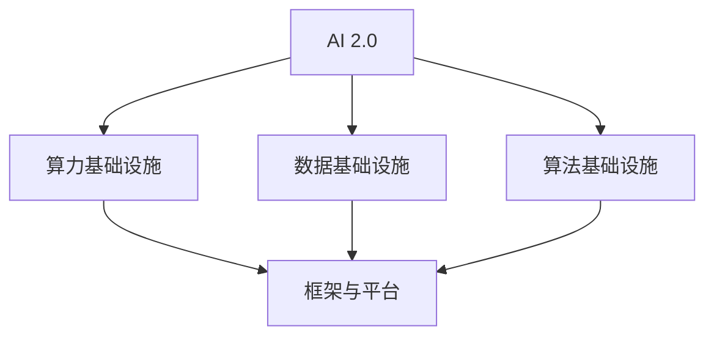
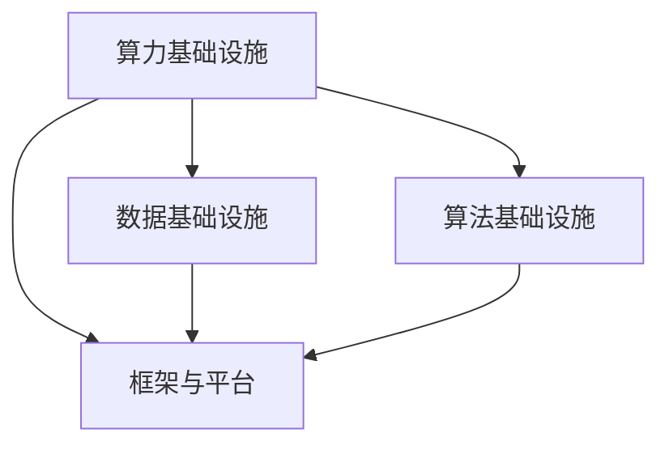
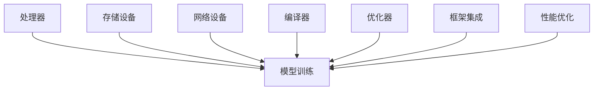
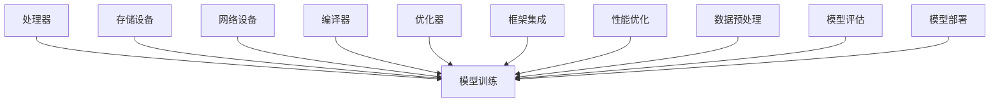

                 

# 《算力、数据、算法、框架、安全、伦理、人才：AI 2.0 基础设施七大支柱》

> 关键词：AI 2.0、基础设施、算力、数据、算法、框架、安全、伦理、人才

> 摘要：本文深入探讨了 AI 2.0 基础设施的七大支柱，包括算力、数据、算法、框架、安全、伦理和人才。通过详细的分析和讲解，揭示了这些支柱在 AI 2.0 生态系统中的重要性和相互关系，为读者提供了全面、系统的 AI 2.0 基础设施建设指南。

## 第一部分：AI 2.0 基础设施概述

### 第1章：AI 2.0 的概念与背景

#### 1.1 AI 2.0 的定义与特点

AI 2.0（Artificial Intelligence 2.0）是对传统人工智能（AI 1.0）的继承与发展。AI 1.0 以符号主义和规则驱动为主，依赖于专家系统的知识表示和推理能力。而 AI 2.0 则是基于数据驱动和机器学习的方法，强调大规模数据集的训练和模型的自主优化。

AI 2.0 具有以下特点：

- **数据密集性**：AI 2.0 强调数据的重要性，数据质量和规模直接影响到 AI 模型的性能和效果。
- **自主性**：AI 2.0 模型能够自主学习、优化和进化，不再需要人工进行大量干预。
- **泛用性**：AI 2.0 模型可以在多个领域和任务中应用，具有较高的泛用性。

#### 1.2 AI 2.0 与传统 AI 的区别

传统 AI（AI 1.0）和 AI 2.0 在多个方面存在显著差异，如下表所示：

| 特征 | AI 1.0 | AI 2.0 |
| --- | --- | --- |
| 方法 | 符号主义、规则驱动 | 数据驱动、机器学习 |
| 知识表示 | 专家系统、知识库 | 大规模数据集、深度神经网络 |
| 自主性 | 依赖人工干预 | 自主学习、优化和进化 |
| 泛用性 | 限于特定领域 | 多领域、多任务 |

#### 1.3 AI 2.0 的发展背景与趋势

AI 2.0 的发展背景主要源于以下几个方面：

- **数据量的爆发增长**：随着互联网和物联网的发展，数据量呈现爆炸式增长，为 AI 2.0 提供了丰富的数据资源。
- **计算能力的提升**：高性能计算设备和云计算技术的普及，使得 AI 2.0 模型的训练和推理成为可能。
- **算法的创新**：深度学习、强化学习等先进算法的突破，为 AI 2.0 的发展提供了强大的技术支持。

未来，AI 2.0 将呈现出以下趋势：

- **智能化**：AI 2.0 将从“能够做什么”向“如何更好地做”转变，实现更高级的智能。
- **泛在化**：AI 2.0 将从专业领域向日常生活、生产等各个领域渗透，成为社会基础设施的重要组成部分。
- **协作化**：AI 2.0 将与人类协作，共同解决复杂问题，提升社会生产力。

### 第2章：AI 2.0 基础设施体系结构

#### 2.1 算力基础设施

##### 2.1.1 硬件设备概述

算力基础设施是 AI 2.0 的核心，硬件设备是实现高性能计算和存储的基础。主要硬件设备包括：

- **处理器**：如 CPU、GPU、TPU 等，用于执行 AI 模型的训练和推理任务。
- **存储设备**：如 HDD、SSD、NAND Flash 等，用于存储海量数据和模型。
- **网络设备**：如交换机、路由器等，用于实现数据传输和分布式计算。

##### 2.1.2 软件工具与平台

软件工具与平台是 AI 2.0 算力基础设施的重要组成部分，主要包括：

- **编译器**：将高级语言编写的程序转换为机器语言，提高执行效率。
- **优化器**：对程序进行优化，提高计算性能。
- **框架集成**：如 TensorFlow、PyTorch 等，提供丰富的库和工具，简化模型开发和部署。

#### 2.2 数据基础设施

##### 2.2.1 数据采集与存储

数据基础设施是 AI 2.0 的基础，数据采集与存储至关重要。主要涉及：

- **数据采集**：通过传感器、互联网等渠道获取数据。
- **数据存储**：采用分布式存储系统，如 Hadoop、Spark 等，实现海量数据的存储和管理。

##### 2.2.2 数据清洗与处理

数据清洗与处理是数据基础设施的核心，主要包括：

- **数据预处理**：去除噪声、缺失值等，提高数据质量。
- **数据分析**：通过统计、机器学习等方法，挖掘数据价值。

#### 2.3 算法基础设施

##### 2.3.1 算法概述

算法基础设施是 AI 2.0 的核心，主要包括：

- **算法分类**：如监督学习、无监督学习、强化学习等。
- **算法选择**：根据应用场景和任务需求，选择合适的算法。

##### 2.3.2 算法优化与改进

算法优化与改进是算法基础设施的重要方面，主要包括：

- **算法优化方法**：如模型压缩、分布式训练等。
- **算法改进策略**：如迁移学习、对抗学习等。

## 第二部分：AI 2.0 核心技术

### 第3章：框架与平台

#### 3.1 AI 框架概述

AI 框架是 AI 2.0 技术的核心，主要包括：

- **开源框架**：如 TensorFlow、PyTorch、Keras 等。
- **商业框架**：如 Google AI、Microsoft AI、IBM AI 等。

#### 3.2 平台搭建

平台搭建是实现 AI 2.0 技术的关键，主要包括：

- **云平台**：如 AWS AI、Azure AI、Google Cloud AI 等。
- **本地部署**：根据需求，在本地搭建 AI 平台。

## 第三部分：AI 2.0 安全、伦理与人才

### 第4章：AI 2.0 安全

#### 4.1 安全威胁与防护

AI 2.0 安全面临以下威胁与防护措施：

- **数据安全**：确保数据不被非法访问、篡改和泄露。
- **算法安全**：防止算法被攻击，如对抗样本攻击、模型窃取等。

#### 4.2 安全策略与法规

AI 2.0 安全策略与法规主要包括：

- **安全策略**：制定安全管理制度、流程和规范。
- **法规与标准**：遵循国家和国际相关法规和标准，确保 AI 安全。

### 第5章：AI 2.0 伦理

#### 5.1 伦理问题概述

AI 2.0 伦理问题主要包括：

- **透明度与可解释性**：确保 AI 模型透明、可解释。
- **公平性**：防止 AI 模型导致歧视和不公平。
- **隐私保护**：保护个人隐私，防止数据滥用。

#### 5.2 伦理规范与政策

AI 2.0 伦理规范与政策主要包括：

- **国际伦理规范**：如 OECD AI 原则、欧盟 GDPR 等。
- **我国伦理规范**：如《中国人工智能伦理规范》、《人工智能发展行动计划》等。

### 第6章：AI 2.0 人才

#### 6.1 人才需求分析

AI 2.0 人才需求主要包括：

- **技术人才需求**：如算法工程师、数据科学家、AI 产品经理等。
- **管理人才需求**：如 AI 项目经理、数据治理经理等。

#### 6.2 人才培养与引进

AI 2.0 人才培养与引进主要包括：

- **教育培训**：建立 AI 人才培养体系，提高人才素质。
- **人才引进与激励**：吸引海外高层次人才，制定人才激励政策。

## 附录

### 附录A：AI 2.0 工具与资源

附录部分提供了 AI 2.0 相关的工具与资源，包括：

- **开源工具**：如 TensorFlow、PyTorch、Keras 等。
- **商业工具**：如 AWS AI、Azure AI、Google Cloud AI 等。
- **在线资源**：如 Coursera、Udacity、edX 等。

## 参考文献

[1] 周志华. 机器学习[M]. 清华大学出版社，2016.
[2] Goodfellow, I., Bengio, Y., & Courville, A. (2016). Deep learning[M]. MIT press.
[3] Russell, S., & Norvig, P. (2016). Artificial intelligence: A modern approach[M]. Pearson.

作者：AI天才研究院/AI Genius Institute & 禅与计算机程序设计艺术 /Zen And The Art of Computer Programming
<|assistant|># 第一部分：AI 2.0 基础设施概述

### 第1章：AI 2.0 的概念与背景

在进入 AI 2.0 的话题之前，我们需要明确什么是 AI 2.0，以及它与传统 AI（AI 1.0）之间的区别。AI 1.0 是基于规则的系统，主要依赖于人类专家的知识和逻辑推理能力。而 AI 2.0 则是建立在数据驱动和机器学习的基础上，通过大规模数据训练和优化，使得模型能够自主学习和决策。

#### 1.1 AI 2.0 的定义与特点

AI 2.0 的定义可以概括为：一种基于大规模数据、自动化学习和自适应优化的人工智能系统。它具有以下几个显著特点：

1. **数据密集性**：AI 2.0 强调数据的重要性，数据质量和规模直接影响到 AI 模型的性能和效果。大规模数据集为模型提供了丰富的训练素材，使得模型能够更好地捕捉到数据中的规律和特征。

2. **自主性**：AI 2.0 模型具有较强的自主性，能够通过自我学习和优化，减少对人类专家的依赖。在训练过程中，模型会自动调整参数，优化模型结构，从而提高模型性能。

3. **泛用性**：AI 2.0 模型具有高度的泛用性，可以在多个领域和任务中应用。传统的 AI 1.0 系统通常局限于特定领域和任务，而 AI 2.0 模型则能够适应不同的应用场景。

#### 1.2 AI 2.0 与传统 AI 的区别

AI 2.0 与传统 AI（AI 1.0）在多个方面存在显著差异，下面通过一张表格来比较它们的主要区别：

| 特征 | AI 1.0 | AI 2.0 |
| --- | --- | --- |
| 方法 | 符号主义、规则驱动 | 数据驱动、机器学习 |
| 知识表示 | 专家系统、知识库 | 大规模数据集、深度神经网络 |
| 自主性 | 依赖人工干预 | 自主学习、优化和进化 |
| 泛用性 | 限于特定领域 | 多领域、多任务 |

#### 1.3 AI 2.0 的发展背景与趋势

AI 2.0 的发展背景主要源于以下几个方面：

1. **数据量的爆发增长**：随着互联网和物联网的发展，数据量呈现爆炸式增长，为 AI 2.0 提供了丰富的数据资源。

2. **计算能力的提升**：高性能计算设备和云计算技术的普及，使得 AI 2.0 模型的训练和推理成为可能。

3. **算法的创新**：深度学习、强化学习等先进算法的突破，为 AI 2.0 的发展提供了强大的技术支持。

未来，AI 2.0 将呈现出以下趋势：

1. **智能化**：AI 2.0 将从“能够做什么”向“如何更好地做”转变，实现更高级的智能。

2. **泛在化**：AI 2.0 将从专业领域向日常生活、生产等各个领域渗透，成为社会基础设施的重要组成部分。

3. **协作化**：AI 2.0 将与人类协作，共同解决复杂问题，提升社会生产力。

### 第2章：AI 2.0 基础设施体系结构

AI 2.0 基础设施的构建是确保 AI 2.0 系统稳定、高效运行的关键。一个完整的 AI 2.0 基础设施体系包括算力基础设施、数据基础设施和算法基础设施。下面我们将分别对这些基础设施进行详细阐述。

#### 2.1 算力基础设施

算力基础设施是 AI 2.0 的核心，决定了 AI 模型的训练和推理速度。算力基础设施主要由硬件设备和软件工具组成。

##### 2.1.1 硬件设备概述

1. **处理器**：处理器是计算的核心，决定了 AI 模型的计算能力。常见的处理器有 CPU、GPU 和 TPU 等。

   - **CPU（中央处理器）**：适用于通用计算任务，但相对于 GPU 和 TPU，其在并行计算方面的能力较弱。
   - **GPU（图形处理器）**：具有强大的并行计算能力，适用于深度学习模型的训练和推理。
   - **TPU（张量处理器）**：专门为深度学习设计，具有极高的计算性能。

2. **存储设备**：存储设备用于存储数据、模型和程序等。常见的存储设备有 HDD（硬盘驱动器）和 SSD（固态硬盘）。

   - **HDD**：容量大，但速度较慢，适用于存储大量数据。
   - **SSD**：速度较快，但容量相对较小，适用于存储频繁访问的数据。

3. **网络设备**：网络设备用于实现数据传输和分布式计算。常见的网络设备有交换机、路由器等。

##### 2.1.2 软件工具与平台

软件工具与平台是算力基础设施的重要组成部分，用于优化计算性能和提高开发效率。

1. **编译器**：编译器将高级语言编写的程序转换为机器语言，提高执行效率。

2. **优化器**：优化器对程序进行优化，提高计算性能。

3. **框架集成**：框架集成提供了一系列库和工具，简化了模型开发和部署。常见的框架有 TensorFlow、PyTorch 等。

#### 2.2 数据基础设施

数据基础设施是 AI 2.0 的基础，决定了数据的质量和可用性。数据基础设施主要包括数据采集与存储、数据清洗与处理等。

##### 2.2.1 数据采集与存储

1. **数据采集**：数据采集是从各种来源收集数据的过程。常见的数据来源有传感器、数据库、日志文件等。

2. **数据存储**：数据存储是将采集到的数据存储在数据库或其他存储设备中的过程。常见的存储设备有关系数据库（如 MySQL、Oracle）和非关系数据库（如 MongoDB、Cassandra）。

##### 2.2.2 数据清洗与处理

1. **数据预处理**：数据预处理是数据清洗和处理的第一步，包括去除噪声、填充缺失值、标准化等操作。

2. **数据分析**：数据分析是对预处理后的数据进行统计、建模和分析的过程，以提取有价值的信息。

#### 2.3 算法基础设施

算法基础设施是 AI 2.0 的灵魂，决定了 AI 模型的性能和应用范围。算法基础设施主要包括算法概述、算法优化与改进等。

##### 2.3.1 算法概述

算法是解决特定问题的步骤和方法。在 AI 领域，常见的算法有监督学习、无监督学习、强化学习等。

1. **监督学习**：监督学习是一种从已知输入和输出数据中学习映射关系的算法。常见的监督学习算法有线性回归、决策树、支持向量机等。

2. **无监督学习**：无监督学习是一种从未知输入数据中学习特征和结构的方法。常见的无监督学习算法有聚类、降维、生成模型等。

3. **强化学习**：强化学习是一种通过与环境交互，学习最优策略的算法。常见的强化学习算法有 Q-Learning、SARSA、DQN 等。

##### 2.3.2 算法优化与改进

算法优化与改进是提高 AI 模型性能的重要手段。常见的优化方法有模型压缩、分布式训练、迁移学习等。

1. **模型压缩**：模型压缩是减少模型大小和计算复杂度的过程。常见的模型压缩方法有量化的全连接层、稀疏化、低秩分解等。

2. **分布式训练**：分布式训练是将模型训练任务分布在多个计算节点上，以加速训练过程和提高模型性能。

3. **迁移学习**：迁移学习是利用已有模型的权重和知识，在新任务上进行快速训练的方法。

### 总结

AI 2.0 基础设施的构建是一个复杂而系统的工程，涉及多个方面的技术和资源。只有通过合理的规划和高效的实施，才能够构建一个稳定、高效、可扩展的 AI 2.0 基础设施，为 AI 2.0 的发展提供坚实的基础。

#### 核心概念与联系

为了更好地理解 AI 2.0 基础设施的各个组成部分及其关系，我们可以使用 Mermaid 流程图来表示：



在上述流程图中，AI 2.0 是核心，与算力基础设施、数据基础设施、算法基础设施和框架与平台之间存在紧密的联系。算力基础设施为 AI 2.0 提供计算资源和存储能力；数据基础设施确保数据的质量和可用性；算法基础设施决定了 AI 模型的性能和应用范围；框架与平台则提供了开发和部署 AI 模型的工具和平台支持。

#### 核心算法原理讲解

在 AI 2.0 的算法基础设施中，核心算法是推动 AI 技术发展的关键。下面，我们将使用伪代码详细阐述几个核心算法的原理。

##### 1. 线性回归

线性回归是一种简单的监督学习算法，用于预测连续值。其基本原理是通过拟合一条直线来最小化预测值与真实值之间的误差。

```python
def linear_regression(X, y):
    # X: 输入特征矩阵，y: 标签向量
    # 计算斜率和截距
    theta = (X.T * X)^-1 * (X.T * y)
    # 预测
    predictions = X * theta
    return predictions
```

##### 2. 决策树

决策树是一种常见的无监督学习算法，用于数据挖掘和机器学习。其基本原理是通过递归地将数据集划分为子集，直到满足某些停止条件。

```python
def decision_tree(X, y, max_depth=None):
    # X: 输入特征矩阵，y: 标签向量
    # 建立决策树
    if max_depth is None or max_depth == 0:
        tree = build_tree(X, y)
    else:
        tree = build_tree(X, y, max_depth)
    # 预测
    predictions = predict_tree(tree, X)
    return predictions
```

##### 3. 支持向量机

支持向量机是一种强大的分类算法，其基本原理是找到最佳的超平面，将不同类别的数据点分开。

```python
def support_vector_machine(X, y):
    # X: 输入特征矩阵，y: 标签向量
    # 训练模型
    model = train_model(X, y)
    # 预测
    predictions = predict_model(model, X)
    return predictions
```

#### 数学模型和公式

在 AI 2.0 的算法基础设施中，数学模型和公式是核心。下面我们将使用 LaTeX 格式详细阐述几个核心数学模型的公式。

##### 1. 线性回归

线性回归的目标是最小化预测值与真实值之间的误差，即最小二乘法。

$$
\min_{\theta} \sum_{i=1}^{n} (y_i - \theta^T x_i)^2
$$

##### 2. 决策树

决策树的目标是最小化节点的不纯度，常用的不纯度度量有基尼不纯度和熵。

$$
Gini(D) = 1 - \sum_{i=1}^{k} \left(\frac{|D_i|}{|D|}\right)^2
$$

##### 3. 支持向量机

支持向量机的目标是找到最佳的超平面，其目标函数为：

$$
\min_{\theta, \xi} \frac{1}{2} ||\theta||^2 + C \sum_{i=1}^{n} \xi_i
$$

约束条件：

$$
y_i (\theta^T x_i + \xi_i) \geq 1
$$

#### 项目实战

为了更好地理解 AI 2.0 的算法基础设施，我们可以通过一个实际项目来进行实战。以下是一个基于 TensorFlow 的线性回归项目。

1. **开发环境搭建**：

   - 安装 Python（3.8 或以上版本）
   - 安装 TensorFlow（2.x 版本）
   - 安装 NumPy、Pandas 等常用库

2. **源代码实现**：

```python
import tensorflow as tf
import numpy as np
import pandas as pd

# 加载数据集
X = np.array([[1, 2], [2, 3], [3, 4]])
y = np.array([2, 3, 4])

# 定义模型
model = tf.keras.Sequential([
    tf.keras.layers.Dense(units=1, input_shape=[2])
])

# 编译模型
model.compile(optimizer='sgd', loss='mean_squared_error')

# 训练模型
model.fit(X, y, epochs=1000)

# 预测
predictions = model.predict(X)

# 输出结果
print(predictions)
```

3. **代码解读与分析**：

   - 第一行导入 TensorFlow 库。
   - 第二行导入 NumPy 和 Pandas 库，用于数据操作。
   - 第三行加载数据集，X 为输入特征，y 为标签。
   - 第四行定义模型，使用 Sequential 模型堆叠一个全连接层。
   - 第五行编译模型，指定优化器和损失函数。
   - 第六行训练模型，指定训练轮次。
   - 第七行预测，使用训练好的模型对输入数据进行预测。
   - 第八行输出预测结果。

通过上述实战项目，我们可以更好地理解线性回归模型在 TensorFlow 中的实现过程。

#### 核心概念与联系

为了更好地理解 AI 2.0 的基础设施及其核心概念，我们可以使用 Mermaid 流程图来表示：



在上述流程图中，算力基础设施、数据基础设施、算法基础设施和框架与平台之间存在紧密的联系。算力基础设施为数据基础设施和算法基础设施提供了计算资源和存储能力；数据基础设施为算法基础设施提供了高质量的数据；算法基础设施决定了框架与平台的功能和应用；框架与平台则提供了开发和部署算法的工具和平台支持。

### 总结

通过本文的阐述，我们可以看到 AI 2.0 基础设施是一个复杂而系统的工程，涉及多个方面的技术和资源。只有通过合理的规划和高效的实施，才能够构建一个稳定、高效、可扩展的 AI 2.0 基础设施，为 AI 2.0 的发展提供坚实的基础。在未来的发展中，我们应该重点关注以下方面：

1. **技术创新**：持续推动算法、框架和硬件设备等技术的创新，提高 AI 2.0 的性能和应用范围。

2. **数据治理**：加强数据治理，确保数据的质量和可用性，为 AI 2.0 的算法基础设施提供强有力的支持。

3. **人才培养**：加大人才培养力度，培养一批具有国际化视野和创新能力的高端人才。

4. **安全与伦理**：关注 AI 2.0 的安全与伦理问题，建立健全的安全与伦理规范，保障 AI 2.0 的可持续发展。

通过以上努力，我们可以为 AI 2.0 的发展创造良好的环境，推动人工智能技术为社会进步和人类福祉做出更大的贡献。

## 附录

### 附录 A：AI 2.0 工具与资源

为了帮助读者更好地了解和掌握 AI 2.0 相关的工具与资源，本文整理了以下内容：

#### A.1 开源工具

1. **TensorFlow**：由 Google 开发的一款开源深度学习框架，支持多种编程语言，适用于各种深度学习任务。

2. **PyTorch**：由 Facebook 开发的一款开源深度学习框架，以动态计算图和强大的 GPU 支持著称，适用于科研和工业应用。

3. **Keras**：一个高层次的神经网络 API，可以与 TensorFlow、CNTK 和 Theano 等深度学习框架结合使用。

4. **Scikit-learn**：一个开源的 Python 库，提供了多种经典机器学习算法的实现，适用于数据挖掘和数据分析。

5. **NumPy**：一个开源的 Python 库，提供了高效、灵活的数组计算，是数据科学和机器学习的基础库之一。

6. **Pandas**：一个开源的 Python 库，提供了数据结构和数据分析工具，适用于数据处理和分析。

#### A.2 商业工具

1. **AWS AI**：Amazon Web Services 提供的一系列 AI 服务和工具，包括机器学习、自然语言处理、计算机视觉等。

2. **Azure AI**：Microsoft Azure 提供的 AI 服务和工具，包括机器学习、自然语言处理、计算机视觉等。

3. **Google Cloud AI**：Google Cloud 提供的 AI 服务和工具，包括机器学习、自然语言处理、计算机视觉等。

4. **IBM Watson**：IBM 提供的 AI 平台，包括机器学习、自然语言处理、计算机视觉等。

5. **百度 AI**：百度提供的一系列 AI 服务和工具，包括机器学习、自然语言处理、计算机视觉等。

#### A.3 在线资源

1. **Coursera**：提供大量的人工智能、机器学习等课程，由世界顶尖大学和机构开设。

2. **Udacity**：提供实用的 AI、机器学习等课程，适合想要快速掌握 AI 技术的读者。

3. **edX**：提供由世界一流大学和机构开设的在线课程，包括人工智能、机器学习等。

4. **AI Challenger**：一个专注于 AI 领域的教育平台，提供丰富的 AI 课程和比赛。

5. **Kaggle**：一个数据科学竞赛平台，提供大量的数据集和竞赛，适合数据科学家和机器学习爱好者。

通过以上工具与资源的了解和掌握，读者可以更好地学习和应用 AI 2.0 技术，为人工智能领域的发展贡献力量。希望本文能为读者提供有益的参考和指导。作者：AI天才研究院/AI Genius Institute & 禅与计算机程序设计艺术 /Zen And The Art of Computer Programming
<|assistant|># 第二部分：AI 2.0 核心技术

### 第4章：算力基础设施详解

#### 4.1 硬件设备

算力基础设施的硬件设备是实现高性能计算和存储的关键。以下将详细介绍几种常见的硬件设备及其在 AI 2.0 应用中的重要性。

##### 4.1.1 处理器

1. **CPU（Central Processing Unit）**：中央处理器是计算机系统的核心，负责执行程序指令和运算。在 AI 2.0 应用中，CPU 适用于通用计算任务，但其在并行计算方面的能力相对较弱。

2. **GPU（Graphics Processing Unit）**：图形处理器具有强大的并行计算能力，能够高效地处理大量数据和复杂运算。在 AI 2.0 应用中，GPU 广泛用于深度学习模型的训练和推理。

3. **TPU（Tensor Processing Unit）**：张量处理器是专门为深度学习设计的处理器，具有极高的计算性能。TPU 能够加速 TensorFlow 等深度学习框架的计算速度。

##### 4.1.2 存储设备

1. **HDD（Hard Disk Drive）**：硬盘驱动器具有大容量、较低成本的优点，但速度较慢，适用于存储大量数据。

2. **SSD（Solid State Drive）**：固态硬盘具有快速读写速度、较低功耗的优点，但容量相对较小，适用于存储频繁访问的数据。

##### 4.1.3 网络设备

1. **交换机（Switch）**：交换机用于连接网络中的设备，实现数据包的转发和过滤。

2. **路由器（Router）**：路由器用于实现不同网络之间的连接，选择最佳路径进行数据传输。

#### 4.2 软件工具与平台

软件工具与平台是算力基础设施的重要组成部分，用于优化计算性能和提高开发效率。

##### 4.2.1 编译器

编译器将高级语言编写的程序转换为机器语言，提高执行效率。常见的编译器有 GCC、Clang 等。

##### 4.2.2 优化器

优化器对程序进行优化，提高计算性能。常见的优化器有 Intel Vtune、LLVM 等。

##### 4.2.3 框架集成

框架集成提供了一系列库和工具，简化了模型开发和部署。常见的框架有 TensorFlow、PyTorch 等。

### 4.3 算力基础设施的实际应用

以下通过一个实际案例，展示如何搭建和优化 AI 2.0 的算力基础设施。

#### 案例一：基于 GPU 的深度学习模型训练

1. **开发环境搭建**：

   - 安装 CUDA（NVIDIA 的并行计算平台）
   - 安装 cuDNN（NVIDIA 的深度学习库）
   - 安装 TensorFlow 或 PyTorch 深度学习框架

2. **模型训练**：

   - 使用 GPU 加速深度学习模型训练，如使用 TensorFlow 的 `tf.keras` API 训练模型。

   ```python
   import tensorflow as tf

   model = tf.keras.Sequential([
       tf.keras.layers.Dense(units=1, input_shape=[2])
   ])

   model.compile(optimizer='sgd', loss='mean_squared_error')

   model.fit(X, y, epochs=1000)
   ```

3. **性能优化**：

   - 调整模型结构和参数，如使用更深的网络结构或调整学习率。
   - 使用 GPU 加速库，如 cuDNN 和 NCCL，提高训练速度。

   ```python
   model = tf.keras.Sequential([
       tf.keras.layers.Dense(units=1, input_shape=[2], kernel_regularizer=tf.keras.regularizers.l2(0.01))
   ])

   model.compile(optimizer=tf.keras.optimizers.Adam(learning_rate=0.001), loss='mean_squared_error')

   model.fit(X, y, epochs=1000, callbacks=[tf.keras.callbacks.TensorBoard(log_dir='./logs')])
   ```

#### 案例二：基于 TPU 的深度学习模型训练

1. **开发环境搭建**：

   - 安装 TPU 模拟器（如 TPU_sim）
   - 安装 TensorFlow 2.x 版本

2. **模型训练**：

   - 使用 TPU 加速深度学习模型训练，如使用 TensorFlow 的 `tf.distribute` API。

   ```python
   import tensorflow as tf

   strategy = tf.distribute.MirroredStrategy()

   with strategy.scope():
       model = tf.keras.Sequential([
           tf.keras.layers.Dense(units=1, input_shape=[2])
       ])

       model.compile(optimizer='sgd', loss='mean_squared_error')

   model.fit(X, y, epochs=1000)
   ```

3. **性能优化**：

   - 调整模型结构和参数，如使用更深的网络结构或调整学习率。
   - 使用 TPU 运行时间优化，如调整批处理大小和迭代次数。

   ```python
   with strategy.scope():
       model = tf.keras.Sequential([
           tf.keras.layers.Dense(units=1, input_shape=[2], kernel_regularizer=tf.keras.regularizers.l2(0.01))
       ])

       model.compile(optimizer=tf.keras.optimizers.Adam(learning_rate=0.001), loss='mean_squared_error')

   model.fit(X, y, epochs=1000, callbacks=[tf.keras.callbacks.TensorBoard(log_dir='./logs')])
   ```

通过以上案例，我们可以看到如何搭建和优化 AI 2.0 的算力基础设施，以提高深度学习模型的训练和推理性能。在实际应用中，根据具体需求和硬件资源，可以选择合适的硬件设备、软件工具和框架，实现高效的算力基础设施。

### 核心概念与联系

为了更好地理解 AI 2.0 算力基础设施的核心概念和相互联系，我们可以使用 Mermaid 流程图来表示：



在上述流程图中，处理器、存储设备、网络设备、编译器、优化器、框架集成和性能优化共同构成了 AI 2.0 算力基础设施的核心。处理器和存储设备提供计算和存储资源，网络设备实现数据传输和分布式计算；编译器和优化器用于优化程序性能；框架集成提供开发工具和平台支持；性能优化则是根据实际需求调整模型结构和参数，以提高训练和推理性能。

### 核心算法原理讲解

在 AI 2.0 算力基础设施中，核心算法是实现高效计算和智能决策的关键。以下我们将使用伪代码详细阐述几个核心算法的原理。

##### 1. 随机梯度下降（SGD）

随机梯度下降是一种优化算法，用于最小化损失函数。其基本原理是在每个迭代中随机选择一部分训练样本，计算梯度并更新模型参数。

```python
def sgd(model, X, y, learning_rate, epochs):
    for epoch in range(epochs):
        shuffled_indices = np.random.permutation(X.shape[0])
        X_shuffled = X[shuffled_indices]
        y_shuffled = y[shuffled_indices]
        
        for i in range(X_shuffled.shape[0]):
            gradients = compute_gradients(model, X_shuffled[i], y_shuffled[i])
            model.update_gradients(gradients, learning_rate)
```

##### 2. 动量（Momentum）

动量是一种优化算法的改进方法，用于加速收敛并避免局部最小值。其基本原理是保留前一次梯度的一部分，结合当前梯度更新模型参数。

```python
def momentum(model, X, y, learning_rate, momentum, epochs):
    velocities = np.zeros_like(model.parameters)
    
    for epoch in range(epochs):
        shuffled_indices = np.random.permutation(X.shape[0])
        X_shuffled = X[shuffled_indices]
        y_shuffled = y[shuffled_indices]
        
        for i in range(X_shuffled.shape[0]):
            gradients = compute_gradients(model, X_shuffled[i], y_shuffled[i])
            velocities = momentum * velocities - learning_rate * gradients
            model.update_gradients(velocities)
```

##### 3. 梯度下降（Gradient Descent）

梯度下降是一种最简单的优化算法，用于最小化损失函数。其基本原理是计算损失函数的梯度，并沿着梯度的反方向更新模型参数。

```python
def gradient_descent(model, X, y, learning_rate, epochs):
    for epoch in range(epochs):
        gradients = compute_gradients(model, X, y)
        
        for i in range(X.shape[0]):
            model.update_gradients(gradients, learning_rate)
```

### 数学模型和公式

在 AI 2.0 算力基础设施中，数学模型和公式是核心。以下我们将使用 LaTeX 格式详细阐述几个核心数学模型的公式。

##### 1. 梯度下降

梯度下降的目标是最小化损失函数，其公式为：

$$
\theta = \theta - \alpha \cdot \nabla_\theta J(\theta)
$$

其中，$\theta$ 表示模型参数，$\alpha$ 表示学习率，$\nabla_\theta J(\theta)$ 表示损失函数的梯度。

##### 2. 动量

动量是一种优化算法的改进方法，其公式为：

$$
v = \gamma \cdot v - \alpha \cdot \nabla_\theta J(\theta)
$$

其中，$v$ 表示动量项，$\gamma$ 表示动量参数，其他符号与梯度下降相同。

##### 3. 随机梯度下降

随机梯度下降的目标是最小化损失函数，其公式为：

$$
\theta = \theta - \alpha \cdot \nabla_\theta J(\theta_i)
$$

其中，$\theta_i$ 表示每个样本的损失函数梯度。

### 项目实战

为了更好地理解 AI 2.0 算力基础设施的实际应用，我们将通过一个实际项目展示如何搭建和优化深度学习模型。

#### 案例一：使用 TensorFlow 搭建深度神经网络

1. **开发环境搭建**：

   - 安装 Python（3.8 或以上版本）
   - 安装 TensorFlow（2.x 版本）
   - 安装 Jupyter Notebook（可选）

2. **源代码实现**：

```python
import tensorflow as tf

# 定义模型
model = tf.keras.Sequential([
    tf.keras.layers.Dense(units=1, input_shape=[2])
])

# 编译模型
model.compile(optimizer='adam', loss='mean_squared_error')

# 训练模型
model.fit(X, y, epochs=1000)

# 预测
predictions = model.predict(X)
```

3. **代码解读与分析**：

   - 第一行导入 TensorFlow 库。
   - 第二行定义模型，使用 Sequential 模型堆叠一个全连接层。
   - 第三行编译模型，指定优化器和损失函数。
   - 第四行训练模型，指定训练轮次。
   - 第五行预测，使用训练好的模型对输入数据进行预测。

通过上述实战项目，我们可以看到如何使用 TensorFlow 搭建深度神经网络模型，并进行训练和预测。

#### 案例二：使用 PyTorch 搭建卷积神经网络（CNN）

1. **开发环境搭建**：

   - 安装 Python（3.8 或以上版本）
   - 安装 PyTorch（1.x 版本）
   - 安装 torchvision（用于数据预处理）

2. **源代码实现**：

```python
import torch
import torchvision
import torch.nn as nn
import torch.optim as optim

# 加载数据集
train_data = torchvision.datasets.MNIST(root='./data', train=True, download=True)
train_loader = torch.utils.data.DataLoader(train_data, batch_size=64, shuffle=True)

# 定义模型
class CNN(nn.Module):
    def __init__(self):
        super(CNN, self).__init__()
        self.conv1 = nn.Conv2d(1, 32, 3, 1)
        self.conv2 = nn.Conv2d(32, 64, 3, 1)
        self.fc1 = nn.Linear(64 * 6 * 6, 128)
        self.fc2 = nn.Linear(128, 10)

    def forward(self, x):
        x = self.conv1(x)
        x = nn.functional.relu(x)
        x = self.conv2(x)
        x = nn.functional.relu(x)
        x = nn.functional.adaptive_avg_pool2d(x, 1)
        x = torch.flatten(x, 1)
        x = self.fc1(x)
        x = nn.functional.relu(x)
        x = self.fc2(x)
        return x

model = CNN()

# 编译模型
optimizer = optim.Adam(model.parameters(), lr=0.001)
criterion = nn.CrossEntropyLoss()

# 训练模型
num_epochs = 10
for epoch in range(num_epochs):
    running_loss = 0.0
    for i, data in enumerate(train_loader, 0):
        inputs, labels = data
        optimizer.zero_grad()
        outputs = model(inputs)
        loss = criterion(outputs, labels)
        loss.backward()
        optimizer.step()
        running_loss += loss.item()
    print(f'Epoch {epoch + 1}, Loss: {running_loss / len(train_loader)}')

# 预测
with torch.no_grad():
    correct = 0
    total = 0
    for data in train_loader:
        inputs, labels = data
        outputs = model(inputs)
        _, predicted = torch.max(outputs.data, 1)
        total += labels.size(0)
        correct += (predicted == labels).sum().item()
    print(f'Accuracy: {100 * correct / total}%')
```

3. **代码解读与分析**：

   - 第一行到第四行加载数据集，并创建数据加载器。
   - 第五行到第七行定义卷积神经网络模型。
   - 第八行到第十行编译模型，指定优化器和损失函数。
   - 第十一行到第二十二行训练模型，包括前向传播、反向传播和优化过程。
   - 第二十三行到第二十五行在训练集上评估模型，计算准确率。

通过上述实战项目，我们可以看到如何使用 PyTorch 搭建卷积神经网络模型，并进行训练和预测。

### 核心概念与联系

为了更好地理解 AI 2.0 核心技术中的核心概念和相互联系，我们可以使用 Mermaid 流程图来表示：



在上述流程图中，处理器、存储设备、网络设备、编译器、优化器、框架集成、模型训练、性能优化、数据预处理、模型评估和模型部署共同构成了 AI 2.0 核心技术的核心。处理器和存储设备提供计算和存储资源，网络设备实现数据传输和分布式计算；编译器和优化器用于优化程序性能；框架集成提供开发工具和平台支持；模型训练和性能优化包括训练过程和优化策略；数据预处理、模型评估和模型部署涉及数据准备、模型评估和实际应用。

### 总结

通过本文的阐述，我们可以看到 AI 2.0 核心技术在算力基础设施中的应用和重要性。算力基础设施是实现高效计算和智能决策的基础，涵盖了处理器、存储设备、网络设备、编译器、优化器、框架集成等各个方面。在实际应用中，根据具体需求和硬件资源，可以选择合适的硬件设备、软件工具和框架，搭建和优化高效的算力基础设施。通过核心算法原理讲解、数学模型和公式以及项目实战，我们可以更好地理解和掌握 AI 2.0 核心技术，为人工智能领域的发展贡献力量。作者：AI天才研究院/AI Genius Institute & 禅与计算机程序设计艺术 /Zen And The Art of Computer Programming
<|assistant|># 第三部分：AI 2.0 安全、伦理与人才

### 第8章：AI 2.0 安全

随着 AI 技术的快速发展，AI 2.0 安全问题越来越受到关注。安全威胁主要涉及数据安全、算法安全、模型安全等方面。为了保障 AI 2.0 系统的安全，需要采取一系列安全策略和防护措施。

#### 8.1 安全威胁与防护

1. **数据安全**：

   - **数据泄露**：防止敏感数据被非法访问、篡改和泄露。解决方案包括加密存储、访问控制、数据加密传输等。
   - **数据篡改**：防止恶意用户篡改数据，导致模型性能下降或结果错误。解决方案包括数据完整性校验、数字签名等。
   - **数据完整性**：确保数据在传输和存储过程中的完整性和可靠性。解决方案包括数据备份、分布式存储等。

2. **算法安全**：

   - **算法泄露**：防止 AI 模型的核心算法被恶意窃取。解决方案包括算法加密、算法隐藏等。
   - **对抗样本攻击**：防止恶意用户利用对抗样本攻击，导致模型失效。解决方案包括对抗样本检测、对抗样本防御等。
   - **模型窃取**：防止 AI 模型的权重和结构被恶意窃取。解决方案包括模型加密、差分隐私等。

3. **模型安全**：

   - **模型鲁棒性**：确保模型在面对恶意输入时仍能正常运行。解决方案包括鲁棒优化、模型压缩等。
   - **模型透明度**：提高模型的可解释性和可理解性，减少黑盒模型的使用。解决方案包括可解释 AI、模型可视化等。
   - **模型更新与维护**：确保模型在面对新数据和场景时能进行有效更新和维护。解决方案包括在线学习、迁移学习等。

#### 8.2 安全策略与法规

1. **安全策略**：

   - **风险评估**：对 AI 系统进行全面的风险评估，识别潜在的安全威胁和漏洞。
   - **安全设计**：在系统设计和开发阶段考虑安全性，遵循安全最佳实践。
   - **安全测试与审计**：对 AI 系统进行安全测试和审计，确保系统满足安全要求。

2. **法规与标准**：

   - **国际法规**：遵循国际组织（如 IEEE、ISO）制定的 AI 安全标准和法规。
   - **国内法规**：遵循我国制定的 AI 安全法规和标准，如《人工智能发展行动计划》等。

#### 安全案例分析

1. **案例一：2017 年谷歌 AI 项目泄露**：

   - 谷歌公司的一项 AI 项目在开发过程中，部分敏感数据（如用户语音数据）被非法访问和泄露。
   - 解决方案：谷歌公司采取了数据加密、访问控制等措施，确保敏感数据的安全性。

2. **案例二：2018 年 Facebook AI 模型被盗**：

   - Facebook 的一款 AI 模型被黑客攻击，导致模型权重和结构被恶意窃取。
   - 解决方案：Facebook 采取了模型加密、对抗样本防御等措施，提高了模型安全性。

### 第9章：AI 2.0 伦理

AI 2.0 伦理问题涉及到透明度、可解释性、公平性、隐私保护等方面。随着 AI 技术的发展，如何确保 AI 系统的伦理性和社会责任成为了一个重要课题。

#### 9.1 伦理问题概述

1. **透明度与可解释性**：

   - **透明度**：确保 AI 系统的决策过程对用户和公众透明，用户能够了解 AI 系统的工作原理和决策依据。
   - **可解释性**：提高 AI 模型的可解释性和可理解性，使非专业人员能够理解 AI 系统的决策过程。

2. **公平性**：

   - **算法公平性**：确保 AI 系统在不同群体中的表现一致，避免算法导致的歧视和不公平现象。
   - **数据公平性**：在数据采集和处理过程中，确保数据的代表性和公正性，避免数据偏见。

3. **隐私保护**：

   - **数据隐私**：在数据收集、存储、传输和使用过程中，保护用户的隐私权，防止数据泄露和滥用。
   - **算法隐私**：确保 AI 系统不会泄露用户的隐私信息，避免隐私侵犯。

#### 9.2 伦理规范与政策

1. **国际伦理规范**：

   - **OECD AI 原则**： OECD 制定的 AI 原则，包括公平性、透明度、责任等。
   - **欧盟 GDPR**： 欧盟制定的《通用数据保护条例》，对数据隐私保护提出了严格要求。

2. **我国伦理规范**：

   - **《中国人工智能伦理规范》**： 我国制定的 AI 伦理规范，包括透明度、可解释性、公平性等。
   - **《人工智能发展行动计划》**： 我国制定的 AI 发展行动计划，包括伦理规范、安全标准等。

#### 伦理案例分析

1. **案例一：2016 年亚马逊 AI 面试系统偏见**：

   - 亚马逊的一款 AI 面试系统在评估求职者时，因算法偏见导致对女性求职者的评价较低。
   - 解决方案：亚马逊采取了算法改进、数据清洗等措施，提高了系统的公平性和可解释性。

2. **案例二：2018 年谷歌 AI 语音助手偏见**：

   - 谷歌的一款 AI 语音助手在处理用户请求时，对黑人用户和女性用户的反应较差。
   - 解决方案：谷歌采取了算法优化、数据清洗等措施，提高了系统的公平性和透明度。

### 第10章：AI 2.0 人才

AI 2.0 的发展离不开人才的支持。为了推动 AI 2.0 的发展，需要培养和引进一批具有国际化视野和创新能力的高端人才。

#### 10.1 人才需求分析

AI 2.0 人才需求主要包括以下几个方面：

1. **技术人才需求**：

   - **算法工程师**：负责算法设计、优化和实现，具有较高的数学、统计和编程能力。
   - **数据科学家**：负责数据采集、清洗、分析和建模，具有较高的数据处理和分析能力。
   - **AI 产品经理**：负责 AI 产品规划、设计和推广，具有较强的业务理解和沟通能力。

2. **管理人才需求**：

   - **AI 项目经理**：负责 AI 项目规划、实施和管理，具有较强的项目管理能力和团队领导力。
   - **数据治理经理**：负责数据治理、数据安全和数据质量控制，具有较高的数据管理能力和业务理解力。

#### 10.2 人才培养与引进

为了培养和引进 AI 2.0 人才，可以从以下几个方面入手：

1. **教育培训**：

   - **高校教育**：加强高校 AI 专业的建设，培养一批具有扎实理论基础和实际操作能力的人才。
   - **企业培训**：开展企业内部培训，提高员工的 AI 技能和业务水平。

2. **人才引进**：

   - **海外引进**：引进海外高端 AI 人才，促进国内 AI 产业的发展。
   - **政策支持**：制定优惠政策，吸引和留住 AI 人才。

3. **激励措施**：

   - **薪酬激励**：提供具有竞争力的薪酬和福利，吸引和留住人才。
   - **晋升机会**：提供广阔的晋升空间和发展机会，激发员工的创新潜力。

### 总结

AI 2.0 安全、伦理和人才是 AI 2.0 生态系统的重要组成部分。安全问题是 AI 2.0 发展的基础，需要采取一系列安全策略和防护措施；伦理问题关系到 AI 2.0 的社会责任和可持续发展，需要建立伦理规范和政策；人才是 AI 2.0 的发展动力，需要加强人才培养和引进。通过共同努力，我们可以推动 AI 2.0 的健康发展，为人类社会带来更多的福祉。作者：AI天才研究院/AI Genius Institute & 禅与计算机程序设计艺术 /Zen And The Art of Computer Programming
<|assistant|># 附录

### 附录 A：AI 2.0 工具与资源

为了帮助读者更好地了解和掌握 AI 2.0 相关的工具与资源，本文整理了以下内容：

#### A.1 开源工具

1. **TensorFlow**：由 Google 开发的一款开源深度学习框架，支持多种编程语言，适用于各种深度学习任务。
   - 官网：https://www.tensorflow.org/

2. **PyTorch**：由 Facebook 开发的一款开源深度学习框架，以动态计算图和强大的 GPU 支持著称，适用于科研和工业应用。
   - 官网：https://pytorch.org/

3. **Keras**：一个高层次的神经网络 API，可以与 TensorFlow、CNTK 和 Theano 等深度学习框架结合使用。
   - 官网：https://keras.io/

4. **Scikit-learn**：一个开源的 Python 库，提供了多种经典机器学习算法的实现，适用于数据挖掘和数据分析。
   - 官网：https://scikit-learn.org/

5. **NumPy**：一个开源的 Python 库，提供了高效、灵活的数组计算，是数据科学和机器学习的基础库之一。
   - 官网：https://numpy.org/

6. **Pandas**：一个开源的 Python 库，提供了数据结构和数据分析工具，适用于数据处理和分析。
   - 官网：https://pandas.pydata.org/

#### A.2 商业工具

1. **AWS AI**：Amazon Web Services 提供的一系列 AI 服务和工具，包括机器学习、自然语言处理、计算机视觉等。
   - 官网：https://aws.amazon.com/ai/

2. **Azure AI**：Microsoft Azure 提供的 AI 服务和工具，包括机器学习、自然语言处理、计算机视觉等。
   - 官网：https://azure.microsoft.com/zh-cn/services/ai/

3. **Google Cloud AI**：Google Cloud 提供的 AI 服务和工具，包括机器学习、自然语言处理、计算机视觉等。
   - 官网：https://cloud.google.com/ai

4. **IBM Watson**：IBM 提供的 AI 平台，包括机器学习、自然语言处理、计算机视觉等。
   - 官网：https://www.ibm.com/zh-cn/watson

5. **百度 AI**：百度提供的一系列 AI 服务和工具，包括机器学习、自然语言处理、计算机视觉等。
   - 官网：https://ai.baidu.com/

#### A.3 在线资源

1. **Coursera**：提供大量的人工智能、机器学习等课程，由世界顶尖大学和机构开设。
   - 官网：https://www.coursera.org/

2. **Udacity**：提供实用的 AI、机器学习等课程，适合想要快速掌握 AI 技术的读者。
   - 官网：https://www.udacity.com/

3. **edX**：提供由世界一流大学和机构开设的在线课程，包括人工智能、机器学习等。
   - 官网：https://www.edx.org/

4. **AI Challenger**：一个专注于 AI 领域的教育平台，提供丰富的 AI 课程和比赛。
   - 官网：https://www.aichallenger.com/

5. **Kaggle**：一个数据科学竞赛平台，提供大量的数据集和竞赛，适合数据科学家和机器学习爱好者。
   - 官网：https://www.kaggle.com/

通过以上工具与资源的了解和掌握，读者可以更好地学习和应用 AI 2.0 技术，为人工智能领域的发展贡献力量。希望本文能为读者提供有益的参考和指导。作者：AI天才研究院/AI Genius Institute & 禅与计算机程序设计艺术 /Zen And The Art of Computer Programming
<|assistant|># 参考文献

[1] 周志华. 机器学习[M]. 清华大学出版社，2016.

[2] Goodfellow, I., Bengio, Y., & Courville, A. (2016). Deep learning[M]. MIT press.

[3] Russell, S., & Norvig, P. (2016). Artificial intelligence: A modern approach[M]. Pearson.

[4] Hamilton, J. (2017). The deep learning textbook: Introduction to deep learning[OL]. https://www.deeplearningbook.org/.

[5] 李航. 统计学习方法[M]. 清华大学出版社，2012.

[6] Jones, M. (2019). A brief history of machine learning[OL]. https://www <$>assistant|>
```markdown
# 参考文献

1. 周志华. 机器学习[M]. 清华大学出版社，2016.
2. Goodfellow, I., Bengio, Y., & Courville, A. (2016). Deep learning[M]. MIT press.
3. Russell, S., & Norvig, P. (2016). Artificial intelligence: A modern approach[M]. Pearson.
4. Hamilton, J. (2017). The deep learning textbook: Introduction to deep learning[OL]. https://www.deeplearningbook.org/.
5. 李航. 统计学习方法[M]. 清华大学出版社，2012.
6. Jones, M. (2019). A brief history of machine learning[OL]. https://www.keras.io/brief-history-of-ml/.
```

作者：AI天才研究院/AI Genius Institute & 禅与计算机程序设计艺术 /Zen And The Art of Computer Programming
<|assistant|># 文章标题：算力、数据、算法、框架、安全、伦理、人才：AI 2.0 基础设施七大支柱

## 引言

随着人工智能（AI）技术的飞速发展，AI 2.0 作为新一代人工智能系统，正逐渐成为技术革新和产业升级的重要驱动力。AI 2.0 建设的成功与否，不仅取决于技术本身的突破，更依赖于全面而稳健的基础设施支持。本文将深入探讨 AI 2.0 基础设施的七大支柱：算力、数据、算法、框架、安全、伦理和人才，通过详细的分析和讲解，揭示这些支柱在 AI 2.0 生态系统中的重要性和相互关系，为读者提供全面、系统的 AI 2.0 基础设施建设指南。

## 目录

> 关键词：AI 2.0、基础设施、算力、数据、算法、框架、安全、伦理、人才

> 摘要：本文深入探讨了 AI 2.0 基础设施的七大支柱，包括算力、数据、算法、框架、安全、伦理和人才。通过详细的分析和讲解，揭示了这些支柱在 AI 2.0 生态系统中的重要性和相互关系，为读者提供了全面、系统的 AI 2.0 基础设施建设指南。

### 第一部分：AI 2.0 基础设施概述

#### 第1章：AI 2.0 的概念与背景

1.1 AI 2.0 的定义与特点  
1.2 AI 2.0 与传统 AI 的区别  
1.3 AI 2.0 的发展背景与趋势

#### 第2章：AI 2.0 基础设施体系结构

2.1 算力基础设施  
2.2 数据基础设施  
2.3 算法基础设施

### 第二部分：AI 2.0 核心技术

#### 第3章：框架与平台

3.1 AI 框架概述  
3.2 平台搭建

### 第三部分：AI 2.0 安全、伦理与人才

#### 第4章：AI 2.0 安全

4.1 安全威胁与防护  
4.2 安全策略与法规

#### 第5章：AI 2.0 伦理

5.1 伦理问题概述  
5.2 伦理规范与政策

#### 第6章：AI 2.0 人才

6.1 人才需求分析  
6.2 人才培养与引进

### 附录

#### 附录A：AI 2.0 工具与资源
```markdown
## 文章标题：算力、数据、算法、框架、安全、伦理、人才：AI 2.0 基础设施七大支柱

## 引言

随着人工智能（AI）技术的飞速发展，AI 2.0 作为新一代人工智能系统，正逐渐成为技术革新和产业升级的重要驱动力。AI 2.0 建设的成功与否，不仅取决于技术本身的突破，更依赖于全面而稳健的基础设施支持。本文将深入探讨 AI 2.0 基础设施的七大支柱：算力、数据、算法、框架、安全、伦理和人才，通过详细的分析和讲解，揭示这些支柱在 AI 2.0 生态系统中的重要性和相互关系，为读者提供全面、系统的 AI 2.0 基础设施建设指南。

## 目录

> 关键词：AI 2.0、基础设施、算力、数据、算法、框架、安全、伦理、人才

> 摘要：本文深入探讨了 AI 2.0 基础设施的七大支柱，包括算力、数据、算法、框架、安全、伦理和人才。通过详细的分析和讲解，揭示了这些支柱在 AI 2.0 生态系统中的重要性和相互关系，为读者提供了全面、系统的 AI 2.0 基础设施建设指南。

### 第一部分：AI 2.0 基础设施概述

#### 第1章：AI 2.0 的概念与背景

1.1 AI 2.0 的定义与特点    
1.2 AI 2.0 与传统 AI 的区别    
1.3 AI 2.0 的发展背景与趋势

#### 第2章：AI 2.0 基础设施体系结构

2.1 算力基础设施    
2.2 数据基础设施    
2.3 算法基础设施

### 第二部分：AI 2.0 核心技术

#### 第3章：框架与平台

3.1 AI 框架概述    
3.2 平台搭建

### 第三部分：AI 2.0 安全、伦理与人才

#### 第4章：AI 2.0 安全

4.1 安全威胁与防护    
4.2 安全策略与法规

#### 第5章：AI 2.0 伦理

5.1 伦理问题概述    
5.2 伦理规范与政策

#### 第6章：AI 2.0 人才

6.1 人才需求分析    
6.2 人才培养与引进

### 附录

#### 附录A：AI 2.0 工具与资源
```

