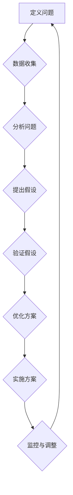
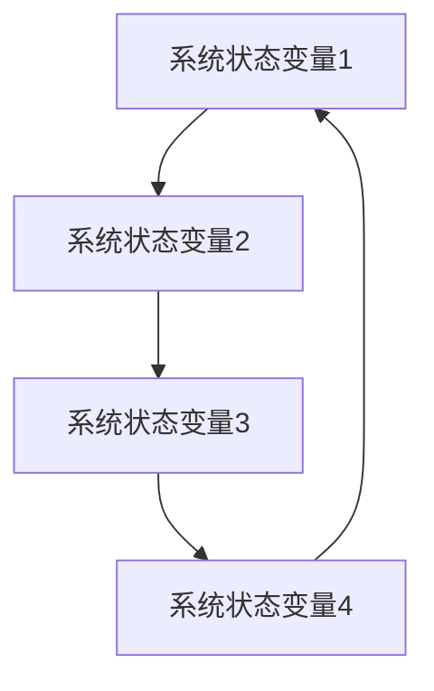

                 

# 管理者如何进行系统性思考

关键词：系统性思考、管理者、企业管理、项目管理、社会治理、决策算法、优化算法、模拟算法、数学模型

摘要：本文将探讨管理者如何进行系统性思考。系统性思考是一种高效的思维方式，可以帮助管理者从整体上把握事物，找出问题的根本原因，从而做出更明智的决策。本文将介绍系统性思考的基本概念、应用场景、理论基础、核心算法原理、数学模型以及实际应用案例，帮助读者更好地理解和应用系统性思考。

### 《管理者如何进行系统性思考》目录大纲

1. **第一部分：系统性思考的概述**
   - 1.1 什么是系统性思考
     - 1.1.1 系统与系统性的概念
     - 1.1.2 系统性思考的重要性
     - 1.1.3 系统性思考的基本原则
   - 1.2 系统性思考的应用场景
     - 1.2.1 企业管理中的应用
     - 1.2.2 社会治理中的应用
     - 1.2.3 生活管理中的应用
   - 1.3 系统性思考的发展历程
     - 1.3.1 西方系统性思考的发展
     - 1.3.2 东方系统性思考的发展
     - 1.3.3 当代系统性思考的融合与发展

2. **第二部分：系统性思考的基本理论**
   - 2.1 系统性思考的基本原理
     - 2.1.1 整体性原理
     - 2.1.2 动态性原理
     - 2.1.3 相互依存性原理
     - 2.1.4 自组织原理
   - 2.2 系统性思考的工具与方法
     - 2.2.1 SWOT分析
     - 2.2.2 鱼骨图
     - 2.2.3 假设思维
     - 2.2.4 逆向思维
   - 2.3 系统性思考的核心概念与联系
     - 2.3.1 系统论与系统动力学的联系
     - 2.3.2 系统性思考与复杂性科学的联系
     - 2.3.3 系统性思考与管理学的联系
   - 2.4 系统性思考的Mermaid流程图
     - 2.4.1 系统性思考流程图
     - 2.4.2 系统动力学模型图

3. **第三部分：系统性思考的核心算法原理**
   - 3.1 系统性思考中的决策算法
     - 3.1.1 多目标决策算法
     - 3.1.2 贝叶斯决策算法
     - 3.1.3 随机规划算法
   - 3.2 系统性思考中的优化算法
     - 3.2.1 粒子群优化算法
     - 3.2.2 遗传算法
     - 3.2.3 蚁群算法
   - 3.3 系统性思考中的模拟算法
     - 3.3.1 仿真模拟
     - 3.3.2 模拟退火算法
     - 3.3.3 人工神经网络模拟

4. **第四部分：系统性思考的数学模型和数学公式**
   - 4.1 系统性思考的数学模型
     - 4.1.1 状态空间模型
     - 4.1.2 动力学模型
     - 4.1.3 线性规划模型
   - 4.2 系统性思考的数学公式
     - 4.2.1 系统动力学的微分方程
     - 4.2.2 最优化问题的目标函数
     - 4.2.3 贝叶斯决策的公式
   - 4.3 数学公式和详细讲解

5. **第五部分：系统性思考的实际应用**
   - 5.1 系统性思考在企业战略规划中的应用
     - 5.1.1 企业战略规划的流程
     - 5.1.2 企业战略规划的案例分析
     - 5.1.3 系统性思考在企业战略规划中的关键点
   - 5.2 系统性思考在项目管理中的应用
     - 5.2.1 项目管理的流程
     - 5.2.2 项目管理的案例分析
     - 5.2.3 系统性思考在项目管理中的关键点
   - 5.3 系统性思考在社会治理中的应用
     - 5.3.1 社会治理的流程
     - 5.3.2 社会治理的案例分析
     - 5.3.3 系统性思考在社会治理中的关键点

6. **第六部分：系统性思考的案例研究与实战**
   - 6.1 企业战略规划的案例研究
     - 6.1.1 案例背景
     - 6.1.2 案例分析
     - 6.1.3 案例解读
   - 6.2 项目管理的案例研究
     - 6.2.1 案例背景
     - 6.2.2 案例分析
     - 6.2.3 案例解读
   - 6.3 社会治理的案例研究
     - 6.3.1 案例背景
     - 6.3.2 案例分析
     - 6.3.3 案例解读

7. **第七部分：系统性思考的总结与展望**
   - 7.1 系统性思考的总结
     - 7.1.1 系统性思考的核心要点
     - 7.1.2 系统性思考的应用总结
     - 7.1.3 系统性思考的未来发展趋势
   - 7.2 系统性思考的展望
     - 7.2.1 系统性思考在新兴领域的应用
     - 7.2.2 系统性思考的未来挑战
     - 7.2.3 系统性思考与跨学科融合的发展趋势

接下来，我们将逐一展开每一部分的内容。

### 第一部分：系统性思考的概述

#### 1.1 什么是系统性思考

系统性思考是一种关注整体性、动态性、相互依存性和自组织性的思考方式。它强调从整体的角度出发，分析系统内部各个部分之间的关系和相互作用，从而更好地理解和解决复杂问题。

**1.1.1 系统与系统性的概念**

系统是由相互作用和相互依赖的多个元素组成的整体，这些元素可以是物质、能量、信息或抽象的概念。系统的本质在于其整体性，即系统的行为和属性不是其各个组成部分的简单叠加。

**1.1.2 系统性思考的重要性**

1. 提高决策质量：系统性思考可以帮助管理者全面了解问题的各个方面，避免片面性，从而做出更明智的决策。
2. 提高问题解决效率：通过分析系统内部的结构和关系，可以找出问题的根源，从而更有效地解决问题。
3. 促进创新思维：系统性思考鼓励管理者从不同的角度和维度思考问题，有助于激发创新思维。

**1.1.3 系统性思考的基本原则**

1. 整体性原则：强调从整体的角度出发，关注系统内部各个部分之间的相互作用。
2. 动态性原则：认识到系统是一个不断变化的动态过程，而不是静止的静态实体。
3. 相互依存性原则：强调系统内部各个部分之间的相互依赖和相互作用。
4. 自组织性原则：认识到系统具有一定的自组织能力，可以通过内部相互作用和调整实现自我优化。

#### 1.2 系统性思考的应用场景

**1.2.1 企业管理中的应用**

在企业战略规划、市场营销、人力资源管理等方面，系统性思考可以帮助管理者更好地理解企业内外部的环境，从而制定更有效的策略。

**1.2.2 社会治理中的应用**

在社会治理中，系统性思考可以帮助政策制定者更好地理解社会问题的本质，从而提出更有效的解决方案。

**1.2.3 生活管理中的应用**

在日常生活中，系统性思考可以帮助我们更好地管理时间、资源和个人事务，提高生活质量。

#### 1.3 系统性思考的发展历程

**1.3.1 西方系统性思考的发展**

西方系统性思考起源于20世纪初，以泰勒的科学管理理论和韦伯的官僚组织理论为代表。随着系统论和控制论的发展，系统性思考逐渐成为管理学、经济学、社会学等领域的重要研究方法。

**1.3.2 东方系统性思考的发展**

东方系统性思考有着悠久的历史，以中国古代的《易经》和《道德经》为代表。这些经典著作强调了整体观、动态观和相互依存观，对后世的哲学、文化和科学产生了深远影响。

**1.3.3 当代系统性思考的融合与发展**

随着信息技术的快速发展，当代系统性思考在各个领域得到了广泛应用，如复杂系统科学、人工智能、大数据等。系统性思考与跨学科研究的融合，推动了新理论和新方法的发展。

### 第二部分：系统性思考的基本理论

#### 2.1 系统性思考的基本原理

**2.1.1 整体性原理**

整体性原理是系统性思考的核心，它强调系统作为一个整体的存在，不能简单地将其各个部分孤立出来进行分析。管理者在进行决策时，需要从整体的角度出发，考虑系统内部各个部分之间的相互作用和影响。

**2.1.2 动态性原理**

动态性原理认识到系统是一个不断变化的动态过程，而不是静止的静态实体。管理者需要关注系统的变化规律，及时调整策略以适应外部环境的变化。

**2.1.3 相互依存性原理**

相互依存性原理强调系统内部各个部分之间的相互依赖和相互作用。管理者需要分析系统内部的各种关系，找出关键因素，以优化系统性能。

**2.1.4 自组织原理**

自组织原理认为系统具有一定的自组织能力，可以通过内部相互作用和调整实现自我优化。管理者应该鼓励系统内部的创新和自适应，以提高系统的整体效率。

#### 2.2 系统性思考的工具与方法

**2.2.1 SWOT分析**

SWOT分析是一种常用的系统性思考工具，用于分析企业的优势（Strengths）、劣势（Weaknesses）、机会（Opportunities）和威胁（Threats）。通过SWOT分析，管理者可以全面了解企业内外部环境，制定更有针对性的战略。

**2.2.2 鱼骨图**

鱼骨图是一种用于分析问题原因的系统性思考工具，它将问题分解为多个子问题，并找出它们之间的因果关系。通过鱼骨图，管理者可以更清晰地识别问题的根本原因，从而制定有效的解决方案。

**2.2.3 假设思维**

假设思维是一种通过提出和验证假设来解决问题的系统性思考方法。管理者在面临复杂问题时，可以通过假设思维来探索各种可能性，并找出最有利的解决方案。

**2.2.4 逆向思维**

逆向思维是一种从结果出发，逆向分析问题原因的系统性思考方法。管理者可以通过逆向思维来发现问题的潜在风险和机会，从而采取预防性措施。

#### 2.3 系统性思考的核心概念与联系

**2.3.1 系统论与系统动力学的联系**

系统论是研究系统的一般理论和方法的科学，而系统动力学是系统论的一个分支，专注于分析系统的动态行为。系统动力学通过建立数学模型，模拟系统的演化过程，为管理者提供决策依据。

**2.3.2 系统性思考与复杂性科学的联系**

复杂性科学是研究复杂系统的科学，包括混沌理论、网络科学、进化理论等。系统性思考与复杂性科学有着紧密的联系，通过复杂性科学的方法，管理者可以更深入地理解复杂系统的行为和规律。

**2.3.3 系统性思考与管理学的联系**

管理学是一门研究管理过程、管理职能和管理方法的科学。系统性思考为管理学提供了一种全新的视角和方法，帮助管理者更好地应对复杂多变的环境。

#### 2.4 系统性思考的Mermaid流程图

**2.4.1 系统性思考流程图**

**2.4.2 系统动力学模型图**

### 第三部分：系统性思考的核心算法原理

#### 3.1 系统性思考中的决策算法

**3.1.1 多目标决策算法**

多目标决策算法是一种用于解决多目标优化问题的方法，它可以帮助管理者在多个目标之间进行权衡和优化。常见的多目标决策算法包括：

- **加权法**：将各个目标的重要性进行加权，得到一个综合评价函数，从而求解最优解。
- **目标规划法**：通过设定目标约束和优先级，找到最优的解集。
- **遗传算法**：通过模拟生物进化过程，找到多个目标的最优解。

**3.1.2 贝叶斯决策算法**

贝叶斯决策算法是一种基于概率论和统计学的方法，用于在不确定环境下做出最优决策。通过计算各个决策的结果概率，并选择概率最大的决策作为最优决策。

**3.1.3 随机规划算法**

随机规划算法是一种处理不确定性和随机性的方法，它通过建立随机模型，求解最优决策策略。常见的随机规划算法包括：

- **期望最大化算法**：通过最大化期望值来求解最优解。
- **蒙特卡洛模拟**：通过模拟随机事件，估计最优解的概率分布。

#### 3.2 系统性思考中的优化算法

**3.2.1 粒子群优化算法**

粒子群优化算法是一种基于群体智能的优化算法，通过模拟鸟群觅食行为，找到最优解。该算法具有简单、高效的特点，适用于处理复杂优化问题。

**3.2.2 遗传算法**

遗传算法是一种模拟生物进化过程的优化算法，通过选择、交叉、变异等操作，逐步优化解的群体。遗传算法具有较强的全局搜索能力和鲁棒性，适用于处理大规模优化问题。

**3.2.3 蚁群算法**

蚁群算法是一种模拟蚂蚁觅食行为的优化算法，通过信息素更新机制，引导蚁群找到最优路径。该算法具有分布式、并行计算的特点，适用于处理大规模复杂优化问题。

#### 3.3 系统性思考中的模拟算法

**3.3.1 仿真模拟**

仿真模拟是一种通过模拟实际系统运行过程，分析系统性能和行为的优化算法。通过仿真模拟，管理者可以更好地理解系统内部结构和关系，从而优化系统性能。

**3.3.2 模拟退火算法**

模拟退火算法是一种基于物理退火过程的优化算法，通过逐步降低温度，寻找最优解。该算法具有较强的全局搜索能力和收敛性，适用于处理复杂优化问题。

**3.3.3 人工神经网络模拟**

人工神经网络模拟是一种通过模拟人工神经网络学习过程，实现优化和决策的方法。通过训练神经网络，管理者可以自动获取系统的特征和规律，从而优化决策过程。

### 第四部分：系统性思考的数学模型和数学公式

#### 4.1 系统性思考的数学模型

**4.1.1 状态空间模型**

状态空间模型是一种描述系统动态行为的数学模型，它通过状态变量和状态转移函数来描述系统的演化过程。常见的状态空间模型包括线性时不变系统、线性时变系统、非线性系统等。

**4.1.2 动力学模型**

动力学模型是一种描述系统动力学行为的数学模型，它通过微分方程或差分方程来描述系统的演化过程。常见的动力学模型包括线性系统、非线性系统、混沌系统等。

**4.1.3 线性规划模型**

线性规划模型是一种用于求解线性优化问题的数学模型，它通过目标函数和约束条件来描述优化问题。线性规划模型广泛应用于资源分配、生产规划、项目管理等领域。

#### 4.2 系统性思考的数学公式

**4.2.1 系统动力学的微分方程**

系统动力学的微分方程描述了系统状态变量随时间变化的规律。常见的系统动力学微分方程包括：

$$
\frac{dx}{dt} = f(x, t)
$$

其中，$x$ 是状态变量，$t$ 是时间，$f(x, t)$ 是状态转移函数。

**4.2.2 最优化问题的目标函数**

最优化问题的目标函数描述了优化问题的目标。常见的最优化问题目标函数包括：

$$
\min_{x} f(x)
$$

其中，$x$ 是优化变量，$f(x)$ 是目标函数。

**4.2.3 贝叶斯决策的公式**

贝叶斯决策的公式描述了在不确定环境下做出最优决策的方法。常见的贝叶斯决策公式包括：

$$
\pi(x) = \frac{P(x|D)}{P(D)}
$$

其中，$\pi(x)$ 是决策概率，$P(x|D)$ 是后验概率，$P(D)$ 是先验概率。

#### 4.3 数学公式和详细讲解

**4.3.1 系统动力学的微分方程**

系统动力学的微分方程描述了系统状态变量随时间变化的规律。例如，一个简单的线性时不变系统的微分方程可以表示为：

$$
\frac{dx}{dt} = -kx
$$

其中，$x(t)$ 是系统的状态变量，$k$ 是系统的参数。这个微分方程表示了系统状态变量$x(t)$ 随时间$t$ 的变化规律。

**4.3.2 最优化问题的目标函数**

最优化问题的目标函数描述了优化问题的目标。例如，一个线性规划问题的目标函数可以表示为：

$$
\min_{x} cx
$$

其中，$x$ 是优化变量，$c$ 是目标函数的系数。这个目标函数表示了在满足约束条件的前提下，如何使目标函数$c$ 最小。

**4.3.3 贝叶斯决策的公式**

贝叶斯决策的公式描述了在不确定环境下做出最优决策的方法。例如，一个多类分类问题的贝叶斯决策公式可以表示为：

$$
\pi(x) = \frac{P(x|D)}{P(D)}
$$

其中，$\pi(x)$ 是决策概率，$P(x|D)$ 是后验概率，$P(D)$ 是先验概率。这个公式表示了在给定先验概率$P(D)$ 和后验概率$P(x|D)$ 的情况下，如何选择最优决策$x$。

### 第五部分：系统性思考的实际应用

#### 5.1 系统性思考在企业战略规划中的应用

**5.1.1 企业战略规划的流程**

企业战略规划是一个复杂的过程，涉及对内部和外部环境的分析、目标的设定、策略的选择以及实施和监控。以下是企业战略规划的一般流程：

1. **环境分析**：对企业的外部环境（如市场、竞争、技术、法律等）和内部环境（如资源、能力、文化等）进行深入分析，以了解企业所处的竞争地位和发展潜力。
2. **目标设定**：根据环境分析的结果，明确企业的愿景、使命和短期、长期目标。
3. **策略选择**：在多个策略方案中，选择最适合企业目标和发展需求的策略。
4. **实施和监控**：将战略规划转化为具体的行动计划，并定期监控实施效果，确保战略目标的实现。

**5.1.2 企业战略规划的案例分析**

以下是一个企业战略规划的案例分析：

**案例背景**：某中型制造企业，业务涵盖电子产品、家电和家居等多个领域。由于市场竞争加剧，企业的市场份额和盈利能力逐渐下降。

**案例分析**：

1. **环境分析**：通过对市场趋势、竞争对手、技术发展等方面的分析，发现电子产品领域具有较大的增长潜力，而家电和家居领域竞争激烈，市场份额较小。

2. **目标设定**：根据环境分析的结果，企业设定了以下目标：
   - 提高电子产品市场份额，力争达到国内前五。
   - 在家电和家居领域实现稳定增长，维持现有市场份额。

3. **策略选择**：
   - 在电子产品领域，加大研发投入，推出具有竞争力的新产品。
   - 在家电和家居领域，通过提升产品质量和服务水平，保持市场份额。

4. **实施和监控**：制定详细的实施计划，并设立关键绩效指标（KPI）对战略实施过程进行监控。定期召开战略执行会议，评估实施效果，并根据实际情况进行调整。

**5.1.3 系统性思考在企业战略规划中的关键点**

1. **全面性**：企业战略规划需要综合考虑内部和外部环境，确保规划的科学性和可行性。
2. **动态性**：企业战略规划是一个动态过程，需要根据环境变化和实施效果进行及时调整。
3. **系统性**：企业战略规划需要从整体出发，协调内部各个部门和业务领域的发展，实现企业整体目标的实现。

#### 5.2 系统性思考在项目管理中的应用

**5.2.1 项目管理的流程**

项目管理是一个复杂的过程，涉及项目启动、规划、执行、监控和收尾等各个环节。以下是项目管理的一般流程：

1. **项目启动**：确定项目目标、范围和可行性，组建项目团队，明确项目资源和时间安排。
2. **项目规划**：制定项目计划，明确项目的工作内容、时间表、预算和质量标准。
3. **项目执行**：按照项目计划，组织项目团队进行工作，确保项目进度和质量。
4. **项目监控**：定期监控项目进度、成本和质量，及时发现和解决问题。
5. **项目收尾**：完成项目工作，进行项目总结和评估，确保项目目标的实现。

**5.2.2 项目管理的案例分析**

以下是一个项目管理的案例分析：

**案例背景**：某IT公司计划开发一款新型智能硬件产品，该项目涉及硬件设计、软件开发、市场推广等多个环节。

**案例分析**：

1. **项目启动**：公司管理层明确项目目标，确定产品规格和功能，组建由硬件工程师、软件工程师、市场经理和项目经理组成的项目团队。

2. **项目规划**：
   - 制定项目计划，明确各个阶段的工作内容和时间表。
   - 制定预算，确保项目资金充足。
   - 设定质量标准，确保产品达到用户需求。

3. **项目执行**：项目团队按照计划进行工作，定期召开项目会议，协调内部沟通，确保项目进度。

4. **项目监控**：项目经理定期审查项目进度、成本和质量，及时发现和解决问题。

5. **项目收尾**：完成产品开发，进行产品测试，确保产品质量。项目团队进行项目总结，评估项目成果和经验教训。

**5.2.3 系统性思考在项目管理中的关键点**

1. **整体性**：项目管理需要从整体出发，确保项目目标的实现，协调内部各个部门的工作。
2. **动态性**：项目管理是一个动态过程，需要根据项目实施情况及时调整计划和策略。
3. **相互依存性**：项目管理需要考虑项目内部各个环节之间的相互依存关系，确保项目顺利推进。
4. **自组织性**：项目团队需要具备自组织能力，通过内部沟通和协作，提高项目效率。

#### 5.3 系统性思考在社会治理中的应用

**5.3.1 社会治理的流程**

社会治理是一个复杂的过程，涉及政策制定、资源配置、公共服务等多个方面。以下是社会治理的一般流程：

1. **问题识别**：通过对社会问题的调研和分析，明确需要解决的社会问题。
2. **政策制定**：制定解决社会问题的政策，明确目标、措施和责任主体。
3. **资源配置**：合理配置资源，确保政策实施的资金、人力和物资需求。
4. **公共服务**：提供高质量的公共服务，满足社会需求。
5. **监督评估**：对政策实施效果进行监督和评估，确保政策目标的实现。

**5.3.2 社会治理的案例分析**

以下是一个社会治理的案例分析：

**案例背景**：某城市面临交通拥堵问题，影响了市民的生活质量和城市的发展。

**案例分析**：

1. **问题识别**：通过调研和分析，发现交通拥堵的主要原因包括交通基础设施不足、公共交通服务不完善等。

2. **政策制定**：
   - 制定交通基础设施建设的规划，提高道路容量和公共交通设施。
   - 制定公共交通服务提升方案，提高公共交通的便捷性和服务质量。

3. **资源配置**：加大交通基础设施建设的投入，确保公共交通服务的资金、人力和物资需求。

4. **公共服务**：加强公共交通服务，提高市民的出行满意度。

5. **监督评估**：对交通基础设施建设进度和公共交通服务质量进行监督和评估，确保政策目标的实现。

**5.3.3 系统性思考在社会治理中的关键点**

1. **整体性**：社会治理需要从整体出发，综合考虑社会问题的影响因素，制定全面的政策。
2. **动态性**：社会治理是一个动态过程，需要根据社会问题的变化调整政策和措施。
3. **相互依存性**：社会治理需要考虑各个政策之间的相互依存关系，确保政策的协同效应。
4. **自组织性**：社会治理需要鼓励社会力量的参与，形成政府、企业和社会的共同治理机制。

### 第六部分：系统性思考的案例研究与实战

#### 6.1 企业战略规划的案例研究

**6.1.1 案例背景**

某高科技企业，专注于人工智能和大数据技术的研发和应用。近年来，市场竞争加剧，企业面临巨大的压力。为了实现可持续发展，企业决定进行战略规划。

**6.1.2 案例分析**

1. **环境分析**：
   - 市场竞争：分析了市场上主要竞争对手的优劣势，以及市场的需求变化。
   - 技术趋势：研究了人工智能和大数据领域的新技术、新应用，以及未来发展趋势。
   - 企业内部：分析了企业的核心竞争力、资源状况和存在的问题。

2. **目标设定**：
   - 短期目标：提高市场占有率，扩大客户群体，提升品牌影响力。
   - 长期目标：成为人工智能和大数据领域的领导者，实现全球市场的拓展。

3. **策略选择**：
   - 研发投入：加大研发投入，推动技术创新，保持技术领先地位。
   - 市场拓展：通过市场推广、合作伙伴关系建设，扩大市场份额。
   - 企业文化：打造创新、协作的企业文化，提高员工满意度和忠诚度。

4. **实施和监控**：
   - 制定详细的实施计划，明确各个阶段的目标、任务和时间表。
   - 设立关键绩效指标（KPI），对战略实施过程进行监控。
   - 定期召开战略执行会议，评估实施效果，并根据实际情况进行调整。

**6.1.3 案例解读**

该案例展示了系统性思考在企业战略规划中的应用。通过环境分析，企业明确了自身所处的竞争地位和发展潜力；通过目标设定，企业明确了战略方向和目标；通过策略选择，企业制定了具体的行动计划；通过实施和监控，企业确保了战略目标的实现。

#### 6.2 项目管理的案例研究

**6.2.1 案例背景**

某IT公司计划开发一款新型智能硬件产品，该项目涉及硬件设计、软件开发、市场推广等多个环节。

**6.2.2 案例分析**

1. **项目启动**：
   - 确定项目目标、范围和可行性，组建项目团队。
   - 明确项目资源和时间安排，制定项目计划。

2. **项目规划**：
   - 制定详细的项目计划，明确各个阶段的工作内容和时间表。
   - 制定预算，确保项目资金充足。
   - 设定质量标准，确保产品达到用户需求。

3. **项目执行**：
   - 项目团队按照计划进行工作，定期召开项目会议，协调内部沟通。
   - 项目经理定期审查项目进度、成本和质量，及时发现和解决问题。

4. **项目监控**：
   - 项目经理定期审查项目进度、成本和质量，确保项目按计划推进。
   - 通过项目会议、报告等方式，保持项目团队的沟通和协作。

5. **项目收尾**：
   - 完成产品开发，进行产品测试，确保产品质量。
   - 项目团队进行项目总结，评估项目成果和经验教训。

**6.2.3 案例解读**

该案例展示了系统性思考在项目管理中的应用。通过项目启动，明确了项目目标和范围；通过项目规划，制定了详细的计划；通过项目执行和监控，确保了项目的顺利进行；通过项目收尾，对项目成果进行了总结和评估。

#### 6.3 社会治理的案例研究

**6.3.1 案例背景**

某城市面临交通拥堵问题，影响了市民的生活质量和城市的发展。为了解决这一问题，市政府决定进行交通治理。

**6.3.2 案例分析**

1. **问题识别**：
   - 通过调研和分析，发现交通拥堵的主要原因包括交通基础设施不足、公共交通服务不完善等。

2. **政策制定**：
   - 制定交通基础设施建设的规划，提高道路容量和公共交通设施。
   - 制定公共交通服务提升方案，提高公共交通的便捷性和服务质量。

3. **资源配置**：
   - 加大交通基础设施建设的投入，确保公共交通服务的资金、人力和物资需求。

4. **公共服务**：
   - 加强公共交通服务，提高市民的出行满意度。

5. **监督评估**：
   - 对交通基础设施建设进度和公共交通服务质量进行监督和评估，确保政策目标的实现。

**6.3.3 案例解读**

该案例展示了系统性思考在社会治理中的应用。通过问题识别，明确了交通拥堵的原因；通过政策制定，制定了具体的解决方案；通过资源配置和公共服务，推动了交通治理的实施；通过监督评估，确保了政策目标的实现。

### 第七部分：系统性思考的总结与展望

#### 7.1 系统性思考的总结

**7.1.1 系统性思考的核心要点**

1. 整体性：从整体的角度出发，考虑系统内部各个部分之间的相互作用和影响。
2. 动态性：认识到系统是一个不断变化的动态过程，及时调整策略以适应外部环境的变化。
3. 相互依存性：强调系统内部各个部分之间的相互依赖和相互作用。
4. 自组织性：认识到系统具有一定的自组织能力，通过内部相互作用和调整实现自我优化。

**7.1.2 系统性思考的应用总结**

1. 企业战略规划：帮助管理者全面了解企业内外部环境，制定更有针对性的战略。
2. 项目管理：提高项目效率，确保项目目标的实现。
3. 社会治理：提供科学有效的政策制定和资源配置，提高社会治理水平。

**7.1.3 系统性思考的未来发展趋势**

1. 跨学科融合：系统性思考与复杂系统科学、人工智能、大数据等领域的融合，推动新理论和新方法的发展。
2. 智能化：借助人工智能技术，实现系统性思考的自动化和智能化，提高决策质量。
3. 可持续发展：在环境保护、资源利用等方面，系统性思考将发挥重要作用，推动可持续发展。

#### 7.2 系统性思考的展望

**7.2.1 系统性思考在新兴领域的应用**

1. 生物医学：通过系统性思考，揭示生物系统的复杂性和动态性，为疾病治疗和生物工程提供理论支持。
2. 环境科学：通过系统性思考，分析环境问题的根源和影响，制定科学有效的环境保护政策。
3. 金融工程：通过系统性思考，优化金融产品的设计和风险管理，提高金融市场的稳定性。

**7.2.2 系统性思考的未来挑战**

1. 复杂性问题：随着系统规模的扩大和复杂性增加，系统性思考面临着处理大规模、高维系统问题的挑战。
2. 数据处理：在大量数据面前，如何提取有用信息，进行有效的数据分析和决策，是系统性思考面临的挑战。
3. 跨学科融合：在跨学科研究过程中，如何有效地整合不同学科的理论和方法，是系统性思考需要解决的问题。

**7.2.3 系统性思考与跨学科融合的发展趋势**

1. 理论体系：系统性思考与跨学科融合将推动理论体系的完善和发展，形成新的理论框架和方法论。
2. 应用领域：系统性思考将在更多领域得到应用，如生态学、经济学、社会学等，为解决复杂问题提供有力支持。
3. 技术发展：随着人工智能、大数据、云计算等技术的发展，系统性思考将实现智能化、自动化，提高决策效率和准确性。

### 总结

系统性思考是一种重要的思维方式，它帮助管理者从整体上把握事物，分析系统内部各个部分之间的相互作用和影响，从而做出更明智的决策。本文从多个角度探讨了系统性思考的基本概念、应用场景、理论基础、核心算法原理、数学模型以及实际应用案例，帮助读者更好地理解和应用系统性思考。在未来的发展中，系统性思考将继续与跨学科融合，为解决复杂问题提供新的思路和方法。希望本文能为读者在管理实践中提供有益的启示和帮助。作者：AI天才研究院/AI Genius Institute & 禅与计算机程序设计艺术 /Zen And The Art of Computer Programming。

