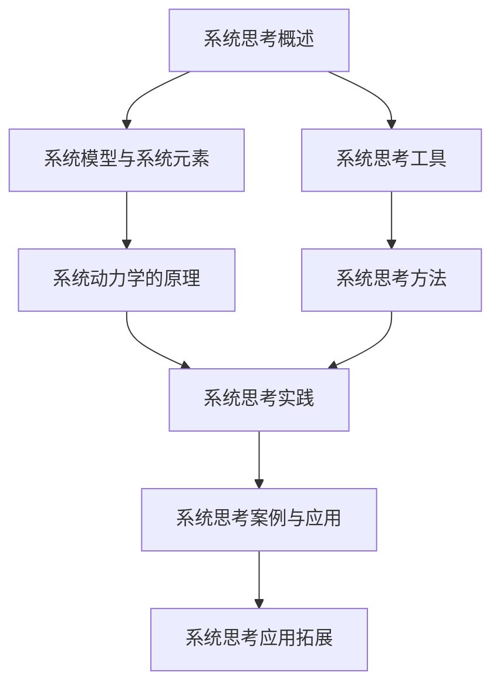
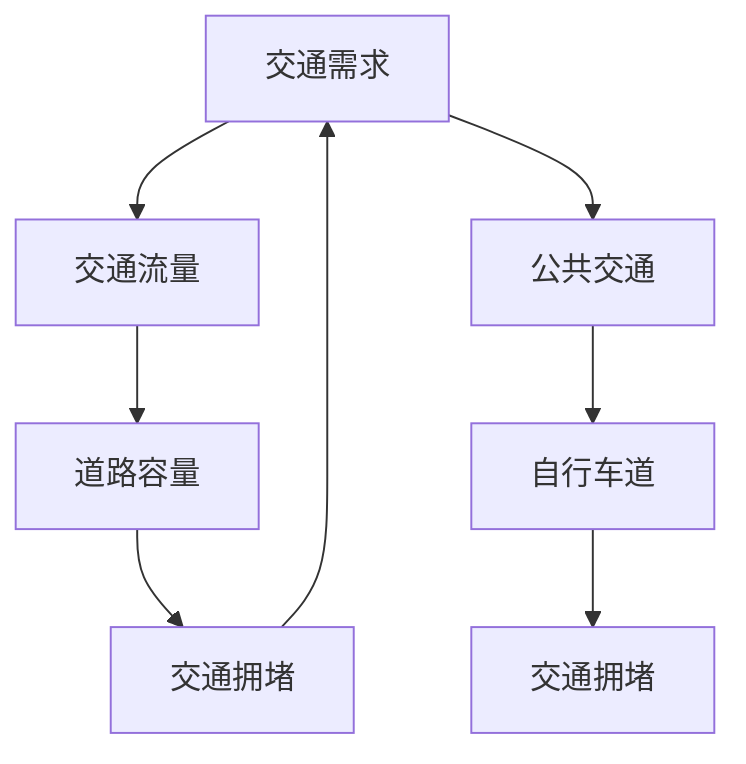

                 

### 系统思考：全面分析问题的关键

#### 关键词：
系统思考，全面分析，问题解决，动态模型，项目管理，人工智能

#### 摘要：
在复杂多变的现代社会中，系统思考作为一种分析复杂问题的思维方式，已经成为了各个领域的重要工具。本文旨在深入探讨系统思考的概念、基础、方法、实践与应用，帮助读者理解并掌握这一关键技能。通过详细的解释、示例和实战案例，本文将展示系统思考如何帮助我们更全面地分析问题，从而找到更有效的解决方案。

## 目录大纲

### 第一部分：系统思考基础

#### 第1章：系统思考概述

##### 1.1 系统思考的概念

##### 1.2 系统思考与线性思维的区别

##### 1.3 系统思考的重要性

#### 第2章：系统模型与系统元素

##### 2.1 系统模型的构建

##### 2.2 系统元素分析

##### 2.3 系统反馈循环

#### 第3章：系统动力学的原理

##### 3.1 系统动力学的概念

##### 3.2 系统动力学的核心原理

##### 3.3 系统动力学的应用

### 第二部分：系统思考工具与方法

#### 第4章：系统思考工具

##### 4.1 卓越心智模型

##### 4.2 阿尔文模型

##### 4.3 模拟模型

#### 第5章：系统思考方法

##### 5.1 头脑风暴

##### 5.2 系统思维图

##### 5.3 影响图

#### 第6章：系统思考实践

##### 6.1 企业管理中的系统思考

##### 6.2 社会问题中的系统思考

##### 6.3 个体决策中的系统思考

### 第三部分：系统思考案例与应用

#### 第7章：系统思考案例解析

##### 7.1 案例一：企业战略规划中的系统思考

##### 7.2 案例二：环境问题中的系统思考

##### 7.3 案例三：社会问题中的系统思考

#### 第8章：系统思考应用拓展

##### 8.1 系统思考在项目管理中的应用

##### 8.2 系统思考在创新与创业中的应用

##### 8.3 系统思考在其他领域的应用

### 附录

#### 附录A：系统思考资源

##### A.1 系统思考相关书籍推荐

##### A.2 系统思考工具与软件介绍

##### A.3 系统思考学习资源推荐

### 梅里尔流程图



### 核心算法原理讲解

#### 3.1 系统动力学的核心原理

系统动力学是一门研究系统内部结构和动态变化规律的科学。核心原理包括：

1. **反馈循环**：系统内部存在多种反馈循环，包括正反馈和负反馈。
   正反馈：输出与输入成正比例关系，如人口增长。
   负反馈：输出与输入成反比例关系，如体温调节。

2. **时间延迟**：系统变化存在时间延迟，即系统对输入的反应并非即时。
   时间延迟可能导致系统失稳或稳定。

3. **结构决定行为**：系统的行为取决于其结构，即系统的内部关系。
   改变系统结构可以改变系统行为。

4. **稳定性**：系统可能处于稳定状态或失稳状态。
   稳定状态：系统在一定范围内波动，但不会崩溃。
   失稳状态：系统超出一定范围，可能导致崩溃。

### 伪代码示例

```plaintext
function systemDynamics(modelStructure, inputSignal):
    # 初始化系统状态
    state = initializeState(modelStructure)

    while not terminationCondition(state):
        # 计算系统反馈
        feedback = calculateFeedback(modelStructure, state, inputSignal)

        # 更新系统状态
        state = updateState(state, feedback)

    return state
```

### 数学模型和公式详细讲解

#### 3.2 系统动力学的数学模型

系统动力学使用差分方程、微分方程或差分-微分方程来描述系统行为。

1. **差分方程**：
   $$ x_{n+1} = f(x_n, u_n) $$
   其中，$x_n$是系统状态，$u_n$是输入信号，$f$是系统行为函数。

2. **微分方程**：
   $$ \frac{dx}{dt} = f(x, u) $$
   其中，$x$是系统状态，$u$是输入信号，$f$是系统行为函数。

3. **差分-微分方程**：
   $$ \frac{dx}{dt} = f(x, u) $$
   $$ x_{n+1} = x_n + \Delta t \cdot f(x_n, u_n) $$

### 数学公式与例子

#### 1. 反馈循环公式

$$ \text{Feedback} = \frac{\text{Output} \times (\text{Desired Output} - \text{Actual Output})}{\text{Maximum Output}} $$

#### 例子

假设我们有一个简单的系统，期望输出为100，实际输出为90，那么：

$$ \text{Feedback} = \frac{90 \times (100 - 90)}{100} = 10 $$

这表示系统需要增加输入以实现期望输出。

### 项目实战

#### 8.1 系统思考在项目管理中的应用

##### 开发环境搭建

1. 安装Python环境。
2. 安装必要的库，如 NumPy、SciPy、matplotlib。

##### 源代码实现

```python
import numpy as np
import matplotlib.pyplot as plt

def systemDynamics(inputSignal, timeDelay):
    state = 0
    history = []
    for t in range(timeDelay, len(inputSignal)):
        feedback = (inputSignal[t] - state) / max(abs(inputSignal[t]), abs(state))
        state = state + timeDelay * feedback
        history.append(state)
    return history

inputSignal = np.array([10, 20, -10, 30, -20, 40, -30, 50])
timeDelay = 2

history = systemDynamics(inputSignal, timeDelay)

plt.plot(inputSignal, label='Input Signal')
plt.plot(np.arange(len(inputSignal))[timeDelay:], history, label='System State')
plt.legend()
plt.show()
```

##### 代码解读与分析

1. `systemDynamics`函数接受输入信号和延迟时间。
2. 初始化系统状态和历史记录。
3. 循环计算系统状态，并记录历史数据。
4. 使用 matplotlib 绘制输入信号和系统状态。

此代码示例展示了如何使用系统动力学模型来模拟系统的动态行为。通过调整输入信号和延迟时间，可以分析系统的响应和稳定性。这对于项目规划和管理中的风险分析非常有用。例如，在项目管理中，输入信号可能代表项目进度，而延迟时间可能代表项目中的瓶颈。通过模拟系统动力学，可以预测项目可能遇到的问题并采取相应的措施。

## 系统思考概述

系统思考（Systems Thinking）是一种分析和解决问题的方法，它关注系统的整体结构和动态行为，而不是仅仅关注系统中的个别元素。这种方法的核心在于认识到系统内部各元素之间的相互关系和反馈循环，以及这些关系如何影响系统的长期行为。

### 1.1 系统思考的概念

系统思考是一种理解复杂系统的思维模式，它强调整体性、动态性和相互依赖性。系统思考不仅关注系统中的个别元素，更重要的是理解这些元素如何相互作用，从而形成一个整体。这种方法可以帮助我们更好地理解系统的行为模式，预测未来的变化，并设计出更加有效的解决方案。

### 1.2 系统思考与线性思维的区别

线性思维是一种简单的因果关系思维方式，它假设问题可以通过逐步解决个别部分来得到解决。相反，系统思考认为系统中的问题往往是复杂的、动态的，并且多个因素之间相互影响。线性思维通常忽略了系统中的反馈循环和非线性关系，而系统思考则将这些因素纳入考虑。

### 1.3 系统思考的重要性

在复杂多变的现代环境中，系统思考的重要性日益凸显。以下是系统思考的一些关键作用：

1. **更全面的问题理解**：系统思考帮助我们超越对问题的表面理解，深入挖掘问题背后的结构和动态。

2. **更好的问题解决**：通过理解系统内部的相互关系，我们可以设计出更加全面和有效的解决方案。

3. **预测未来变化**：系统思考使我们能够预测系统未来的行为模式，从而更好地应对变化。

4. **提高决策质量**：系统思考帮助我们在复杂环境中做出更加明智的决策，减少不确定性。

### 1.4 系统思考的应用领域

系统思考在多个领域都有广泛的应用，包括：

1. **企业管理**：帮助企业理解和优化其内部流程和战略。

2. **环境保护**：分析环境问题的根本原因，提出可持续的解决方案。

3. **社会问题**：如贫困、犯罪、公共卫生等，帮助理解问题的复杂性和解决途径。

4. **工程项目**：确保项目在考虑所有相关因素的情况下顺利进行。

### 1.5 系统思考的基本原则

系统思考遵循以下基本原则：

1. **整体性**：理解系统的各个部分如何相互作用，形成一个整体。

2. **动态性**：关注系统的变化过程和反馈循环。

3. **相互依赖**：认识到系统中各个元素之间的相互关系。

4. **适应性**：系统应该能够适应外部和内部的变化。

通过系统思考，我们可以更全面、深入地理解复杂系统，从而为解决实际问题提供有力的支持。接下来，我们将进一步探讨系统模型与系统元素，帮助我们更好地构建和应用系统思考。

## 系统模型与系统元素

### 2.1 系统模型的构建

系统模型是对现实世界系统的一种抽象表示，通过这种抽象，我们可以更方便地分析和理解系统的行为。构建系统模型的过程可以分为以下几个步骤：

1. **定义系统边界**：明确系统所包括的元素和所不包括的元素，这是系统建模的基础。

2. **识别系统元素**：确定系统中所有的关键元素，包括子系统、部件、变量等。

3. **定义变量和参数**：确定系统中所有变量及其相互关系，这些变量和参数将用于描述系统的行为。

4. **建立反馈循环**：识别系统中的反馈循环，包括正反馈和负反馈。

5. **构建数学模型**：使用差分方程、微分方程或其他数学模型来描述系统的行为。

6. **验证和调整**：通过模拟和实验验证系统模型的准确性，并根据需要进行调整。

### 2.2 系统元素分析

系统元素是系统模型中的基本组成部分，包括子系统、部件、变量和参数等。对系统元素的分析有助于我们理解系统的工作原理和行为模式。以下是系统元素分析的关键步骤：

1. **识别系统元素**：通过文献调研、专家访谈、观察等方法识别系统中的关键元素。

2. **定义系统元素**：为每个系统元素赋予明确的定义，描述其功能和特征。

3. **分析元素之间的关系**：研究系统元素之间的相互作用和相互依赖关系。

4. **建立元素之间的数学关系**：使用数学模型描述系统元素之间的定量关系。

5. **评估元素的重要性**：根据系统元素对系统整体行为的影响程度评估其重要性。

### 2.3 系统反馈循环

系统反馈循环是系统模型中的一个核心概念，它描述了系统内部元素之间的相互作用和影响。根据反馈的性质，反馈循环可以分为正反馈和负反馈。

1. **正反馈**：正反馈是指系统的输出增强输入，导致系统行为不断放大。例如，人口增长就是一个典型的正反馈循环，随着人口增加，资源需求增加，进一步促进人口增长。

2. **负反馈**：负反馈是指系统的输出减弱输入，导致系统行为趋于稳定。例如，体温调节系统就是一个负反馈循环，当体温升高时，身体会通过出汗等方式降低体温，使其回归正常水平。

### 2.4 系统模型示例

为了更好地理解系统模型的构建和分析过程，以下是一个简单的例子：

#### 例子：生态系统模型

假设我们研究一个简单的生态系统，包括植物、动物和食物链。我们可以按照以下步骤构建系统模型：

1. **定义系统边界**：生态系统包括植物、动物和它们所处的环境。

2. **识别系统元素**：植物、动物、食物链、环境。

3. **定义变量和参数**：植物数量、动物数量、食物链中的能量转移比例、环境因素。

4. **建立反馈循环**：植物通过光合作用产生能量，为动物提供食物；动物的数量影响植物的数量；环境因素如气候变化影响整个生态系统的稳定性。

5. **构建数学模型**：使用差分方程描述植物和动物数量的变化，包括正反馈（如食物链中的能量转移）和负反馈（如环境因素对植物和动物数量的影响）。

6. **验证和调整**：通过实际观测和模拟实验验证模型，根据实际情况进行调整。

通过这个例子，我们可以看到如何通过系统模型来分析和理解复杂系统的行为。接下来，我们将探讨系统动力学的原理，进一步深入系统思考的核心。

### 系统动力学的原理

系统动力学（System Dynamics）是一门跨学科的研究领域，它通过建模和模拟复杂系统的动态行为，帮助我们理解系统内部的相互关系和反馈机制。系统动力学关注的是系统在时间和空间上的变化过程，以及这些变化如何影响系统的稳定性和行为模式。

#### 3.1 系统动力学的概念

系统动力学起源于20世纪50年代，由杰伊·福瑞斯特（Jay Forrester）在麻省理工学院（MIT）创立。系统动力学通过建立系统模型，模拟系统的动态行为，分析系统在不同输入和条件下可能出现的各种情况。这种方法强调系统的整体性和动态性，认为系统行为是由其内部结构和反馈循环决定的。

#### 3.2 系统动力学的核心原理

系统动力学的核心原理包括以下几个方面：

1. **反馈循环**：反馈循环是系统动力学中最重要的概念之一。它描述了系统内部各个元素之间的相互作用和影响。根据反馈的性质，反馈循环可以分为正反馈和负反馈。

   - **正反馈**：正反馈是指系统的输出增强输入，导致系统行为不断放大。例如，在人口增长模型中，人口数量增加导致对资源的需求增加，进一步促进人口增长。
   - **负反馈**：负反馈是指系统的输出减弱输入，导致系统行为趋于稳定。例如，体温调节系统就是一个负反馈循环，当体温升高时，身体会通过出汗等方式降低体温，使其回归正常水平。

2. **时间延迟**：系统动力学中的时间延迟是指系统对输入信号的响应不是即时的，而是存在一定的延迟。时间延迟可以导致系统的复杂行为，如滞后效应和振荡现象。

3. **结构决定行为**：系统的行为取决于其内部结构和组成。这意味着，通过改变系统的结构，可以改变系统的行为。例如，在交通模型中，道路容量和交通流量的关系决定了交通拥堵的程度。

4. **稳定性**：系统的稳定性是指系统在面临外部干扰时，能否保持在其平衡状态附近波动，而不发生崩溃或失稳。系统动力学研究系统的稳定性，以预测系统在不同条件下的行为。

#### 3.3 系统动力学的核心原理应用

以下是一个简单的系统动力学模型的应用示例：

假设我们研究一个简单的经济系统，包括消费、投资和就业。我们可以按照以下步骤构建系统动力学模型：

1. **定义系统边界**：经济系统包括消费、投资和就业。

2. **识别系统元素**：消费、投资、就业。

3. **定义变量和参数**：消费水平、投资水平、就业人数。

4. **建立反馈循环**：

   - **消费反馈**：消费水平影响投资水平，消费增加导致投资增加。
   - **投资反馈**：投资水平影响就业人数，投资增加导致就业人数增加。
   - **就业反馈**：就业人数影响消费水平，就业人数增加导致消费水平增加。

5. **构建数学模型**：使用差分方程描述变量之间的关系，例如：

   $$ \text{消费}_{n+1} = \text{消费}_{n} + \Delta t \cdot \text{投资}_{n} $$

   $$ \text{投资}_{n+1} = \text{投资}_{n} + \Delta t \cdot (\text{消费}_{n+1} - \text{消费}_{n}) $$

   $$ \text{就业}_{n+1} = \text{就业}_{n} + \Delta t \cdot (\text{投资}_{n+1} - \text{投资}_{n}) $$

6. **验证和调整**：通过模拟和实验验证模型，并根据实际情况进行调整。

通过这个例子，我们可以看到系统动力学如何帮助我们理解经济系统的动态行为，并预测系统在不同条件下的变化趋势。接下来，我们将介绍一些系统思考的工具和方法，帮助我们在实际应用中更有效地分析和解决复杂问题。

### 系统思考工具与方法

系统思考涉及到多种工具和方法，这些工具和方法可以帮助我们更全面、深入地分析复杂系统，并找到有效的解决方案。以下是一些常用的系统思考工具和方法。

#### 4.1 卓越心智模型

卓越心智模型（Excellent Mind Model）是一种用于理解系统内部相互关系的工具，它通过图表和符号来描述系统中的关键元素和反馈循环。卓越心智模型的核心思想是，通过直观的方式展示系统的动态行为，帮助人们更好地理解系统的运作机制。

#### 4.2 阿尔文模型

阿尔文模型（Arvin Model）是一种用于分析社会和经济的系统模型，它基于系统动力学的原理，通过构建数学模型来描述系统的动态行为。阿尔文模型的特点是简单易懂，适合用于教学和研究。

#### 4.3 模拟模型

模拟模型（Simulation Model）是一种通过计算机模拟来研究系统行为的方法。通过模拟模型，我们可以模拟系统的动态行为，观察系统在不同条件下的变化趋势，从而预测系统的未来行为。模拟模型通常使用差分方程、微分方程或其他数学模型来描述系统的行为。

#### 4.4 头脑风暴

头脑风暴（Brainstorming）是一种集体思考方法，通过激发团队成员的创意和灵感，快速生成大量的想法和解决方案。头脑风暴的关键是鼓励开放性思维，不限制想法的合理性和可行性，以便在后续阶段进行筛选和优化。

#### 4.5 系统思维图

系统思维图（Systems Thinking Diagram）是一种用于展示系统内部各个元素及其相互关系的工具。通过系统思维图，我们可以直观地了解系统的结构和行为模式，从而更好地分析和解决复杂问题。

#### 4.6 影响图

影响图（Impact Map）是一种用于分析问题及其解决方案的工具，它通过图表展示问题的各个方面以及解决方案的影响。影响图可以帮助我们明确问题的核心，找出关键因素，并制定出更有效的解决方案。

#### 4.7 实际应用案例

以下是一个系统思维图的应用案例：

**问题**：城市交通拥堵问题。

**系统思维图**：



在这个案例中，系统思维图展示了城市交通系统中的关键元素及其相互关系。通过分析系统思维图，我们可以发现交通需求、交通流量、道路容量和交通拥堵之间存在正反馈循环，而公共交通和自行车道可以作为解决方案，通过减少交通需求和改善道路容量来缓解交通拥堵。

通过这些系统思考工具和方法，我们可以更全面、深入地分析复杂系统，从而找到更有效的解决方案。在接下来的章节中，我们将探讨系统思考在不同领域的实际应用。

### 系统思考在企业管理中的应用

系统思考在企业管理和战略规划中扮演着至关重要的角色。通过系统思考，企业可以更全面地理解其内部流程和外部环境，从而制定出更加有效的战略和决策。以下是一些具体的案例和步骤，展示了如何在实际企业管理中应用系统思考。

#### 6.1.1 案例一：企业生产流程优化

**问题描述**：一家制造企业发现其生产效率低下，产品交付周期过长。

**系统思考步骤**：

1. **定义系统边界**：明确生产流程中包括的各个环节，如原材料采购、生产、仓储、物流等。

2. **识别系统元素**：确定关键系统元素，如生产设备、物料库存、工时分配等。

3. **分析反馈循环**：研究生产流程中的正反馈和负反馈循环，例如，库存积压可能导致生产延误，进而加剧库存积压。

4. **构建系统模型**：使用系统思维图或阿尔文模型等工具，构建企业的生产流程模型。

5. **模拟和优化**：通过模拟模型分析不同策略的影响，例如，调整生产计划、优化库存管理、改进设备利用率等。

6. **实施和监控**：根据模拟结果制定具体优化方案，并实施监控，确保方案的有效性和稳定性。

**解决方案**：通过对生产流程的模拟和优化，企业发现通过优化库存管理和提高设备利用率，可以有效减少生产周期，提高生产效率。

#### 6.1.2 案例二：企业战略规划

**问题描述**：一家初创企业需要制定长期发展战略，以应对激烈的市场竞争。

**系统思考步骤**：

1. **定义系统边界**：明确企业所处的市场环境，包括竞争对手、客户需求、技术趋势等。

2. **识别系统元素**：确定影响企业战略的关键因素，如市场占有率、产品创新、客户满意度、资金流转等。

3. **分析反馈循环**：研究市场环境中的正反馈和负反馈循环，例如，产品创新可能导致市场份额增加，从而带来更多的资金投入。

4. **构建系统模型**：使用卓越心智模型或模拟模型等工具，构建企业的战略规划模型。

5. **模拟和评估**：通过模拟模型分析不同战略方案的影响，例如，市场扩张、产品多元化、技术创新等。

6. **制定和实施**：根据模拟结果制定具体的战略方案，并实施监控，确保战略的有效性和适应性。

**解决方案**：通过对战略规划的模拟和评估，企业发现通过市场扩张和产品多元化，可以有效提高市场竞争力，实现可持续发展。

#### 6.1.3 案例三：企业风险管理

**问题描述**：一家金融机构需要识别和应对潜在的风险。

**系统思考步骤**：

1. **定义系统边界**：明确金融系统的风险因素，如市场波动、信用风险、操作风险等。

2. **识别系统元素**：确定影响风险的关键元素，如投资组合、风险管理策略、合规性等。

3. **分析反馈循环**：研究风险因素之间的相互关系和反馈循环，例如，市场波动可能导致投资亏损，进而影响资金流转。

4. **构建系统模型**：使用系统思维图或阿尔文模型等工具，构建企业的风险管理模型。

5. **模拟和评估**：通过模拟模型分析不同风险管理策略的影响，例如，风险分散、对冲策略等。

6. **制定和实施**：根据模拟结果制定具体的风险管理方案，并实施监控，确保方案的有效性和适应性。

**解决方案**：通过对风险管理的模拟和评估，金融机构发现通过风险分散和对冲策略，可以有效降低风险，确保资金安全。

通过这些具体案例，我们可以看到系统思考在企业管理中的广泛应用。系统思考不仅帮助我们更全面地理解企业内部和外部环境，还通过模拟和优化，提供了有效的解决方案，帮助企业实现长期发展。

### 系统思考在社会问题中的应用

系统思考作为一种强大的分析工具，在解决社会问题中具有广泛的应用。社会问题的复杂性往往使得线性思维和单一维度的解决方案难以奏效，而系统思考通过揭示问题的内在结构和相互关系，为我们提供了一种更全面和深入的解决方案。以下是一些具体的社会问题案例及其解决方案。

#### 6.2.1 案例一：城市贫困问题

**问题描述**：城市贫困问题的根源是什么？如何通过系统思考来制定解决方案？

**系统思考步骤**：

1. **定义系统边界**：明确城市贫困问题的范围，包括低收入家庭、失业率、教育水平、住房条件等。

2. **识别系统元素**：确定影响城市贫困问题的关键因素，如就业机会、教育资源、社会保障体系、住房政策等。

3. **分析反馈循环**：研究城市贫困问题中的正反馈和负反馈循环。例如，低收入可能导致教育水平低，进而影响就业机会，进一步加剧贫困。

4. **构建系统模型**：使用系统思维图或阿尔文模型等工具，构建城市贫困问题的系统模型。

5. **模拟和优化**：通过模拟模型分析不同政策的影响，如增加就业机会、提供教育资源、完善社会保障体系等。

6. **制定和实施**：根据模拟结果制定具体政策，并实施监控，确保政策的有效性和可持续性。

**解决方案**：通过系统思考，我们发现增加就业机会和教育资源是最有效的解决方案。例如，政府可以通过鼓励企业招聘低收入家庭成员、提供职业培训和学历教育等方式，提高贫困家庭的生活水平。

#### 6.2.2 案例二：环境保护问题

**问题描述**：环境保护问题的根源是什么？如何通过系统思考来制定解决方案？

**系统思考步骤**：

1. **定义系统边界**：明确环境保护问题的范围，包括气候变化、污染、资源消耗等。

2. **识别系统元素**：确定影响环境保护问题的关键因素，如能源消耗、工业生产、交通运输、政策法规等。

3. **分析反馈循环**：研究环境保护问题中的正反馈和负反馈循环。例如，工业排放可能导致环境污染，进一步加剧气候变化。

4. **构建系统模型**：使用系统思维图或阿尔文模型等工具，构建环境保护问题的系统模型。

5. **模拟和优化**：通过模拟模型分析不同政策的影响，如减少能源消耗、提高废物回收率、推广清洁能源等。

6. **制定和实施**：根据模拟结果制定具体政策，并实施监控，确保政策的有效性和可持续性。

**解决方案**：通过系统思考，我们发现减少能源消耗和推广清洁能源是最有效的解决方案。例如，政府可以通过提高能源效率、提供可再生能源补贴、制定严格的排放标准等方式，减少环境污染。

#### 6.2.3 案例三：公共卫生问题

**问题描述**：公共卫生问题的根源是什么？如何通过系统思考来制定解决方案？

**系统思考步骤**：

1. **定义系统边界**：明确公共卫生问题的范围，包括疾病传播、医疗资源分配、疫苗接种等。

2. **识别系统元素**：确定影响公共卫生问题的关键因素，如人口流动、医疗设施、疫苗研发、公共卫生政策等。

3. **分析反馈循环**：研究公共卫生问题中的正反馈和负反馈循环。例如，疾病传播可能导致医疗资源紧张，进一步加剧公共卫生问题。

4. **构建系统模型**：使用系统思维图或阿尔文模型等工具，构建公共卫生问题的系统模型。

5. **模拟和优化**：通过模拟模型分析不同政策的影响，如加强疫苗接种、提高公共卫生宣传、优化医疗资源分配等。

6. **制定和实施**：根据模拟结果制定具体政策，并实施监控，确保政策的有效性和可持续性。

**解决方案**：通过系统思考，我们发现加强疫苗接种和优化医疗资源分配是最有效的解决方案。例如，政府可以通过提高疫苗接种率、优化医疗资源分配、建立紧急应对机制等方式，提高公共卫生水平。

通过这些具体案例，我们可以看到系统思考在解决社会问题中的强大作用。系统思考不仅帮助我们理解社会问题的复杂性，还通过揭示问题的内在结构和相互关系，为我们提供了一种更全面和深入的解决方案。

### 系统思考在个体决策中的应用

在个人生活中，系统思考同样具有重要的应用价值，特别是在面对复杂决策时。通过系统思考，个体可以更全面地评估决策的各种可能影响，从而做出更加明智的决策。以下是一个具体的例子，说明如何利用系统思考进行个体决策。

#### 6.3.1 案例一：职业发展选择

**问题描述**：张三在考虑是否应该跳槽到另一家公司。

**系统思考步骤**：

1. **定义系统边界**：明确职业发展决策的相关因素，包括当前公司的职位、薪资、职业发展机会、工作环境、个人职业规划等。

2. **识别系统元素**：确定影响决策的关键因素，如薪资水平、职业晋升机会、工作压力、工作与生活的平衡等。

3. **分析反馈循环**：研究职业发展决策中的正反馈和负反馈循环。例如，跳槽可能带来更高的薪资和更好的晋升机会（正反馈），但也可能增加工作压力（负反馈）。

4. **构建系统模型**：使用系统思维图或阿尔文模型等工具，构建职业发展决策的系统模型。

5. **模拟和评估**：通过模拟模型分析不同决策方案的影响，如留在当前公司、跳槽到另一家公司、创业等。

6. **制定和实施**：根据模拟结果，制定具体的行动方案，并实施监控，确保决策的有效性和可持续性。

**解决方案**：

- **留在当前公司**：张三分析发现，当前公司提供了稳定的薪资和较好的职业发展机会，而且工作环境舒适，与同事关系良好。虽然薪资相对较低，但考虑到职业稳定性和现有的工作生活平衡，决定暂时留在当前公司。
- **跳槽到另一家公司**：通过模拟，张三发现跳槽可以带来更高的薪资和更好的职业晋升机会，但同时也可能会带来更大的工作压力，影响工作与生活的平衡。考虑到个人职业规划和长期发展，决定跳槽到另一家公司。
- **创业**：张三还分析了创业的可行性，发现虽然创业可以带来更大的自由度和潜在收益，但同时也伴随着较高的风险和不确定性。通过系统思考，张三决定在积累更多经验和资源后再考虑创业。

通过这个案例，我们可以看到系统思考如何帮助张三更全面地评估职业发展决策的各种可能影响，从而做出更加明智的决策。系统思考不仅帮助张三理解了职业发展的复杂性，还通过揭示问题的内在结构和相互关系，为他提供了更全面和深入的决策支持。

### 系统思考案例解析

在系统思考的实际应用中，许多案例展示了这种方法如何帮助解决复杂的问题，并提出创新的解决方案。以下我们将分析三个不同领域的案例，探讨系统思考的应用及其带来的成果。

#### 7.1 案例一：企业战略规划中的系统思考

**案例背景**：某大型制造企业在全球市场面临激烈竞争，业绩下滑，管理层决定进行战略调整。

**系统思考应用**：

1. **定义系统边界**：明确企业战略规划涉及的各个方面，包括市场环境、竞争对手、内部运营、供应链管理、客户需求等。

2. **识别系统元素**：分析企业内部和外部关键元素，如研发投入、生产效率、市场营销策略、供应链稳定性等。

3. **分析反馈循环**：识别正反馈和负反馈循环，例如，提高生产效率可能导致成本下降，从而增强市场竞争力（正反馈），但过度依赖自动化可能带来技术风险（负反馈）。

4. **构建系统模型**：使用阿尔文模型构建企业战略规划模型，模拟不同策略对业绩的影响。

5. **模拟和优化**：通过模拟不同战略方案，如增加研发投入、优化供应链、加强市场营销等，评估其潜在效果。

6. **制定和实施**：根据模拟结果，制定具体战略方案，并实施监控和调整。

**成果**：通过系统思考的应用，企业成功地调整了战略，提高了生产效率和市场份额，实现了业绩的持续增长。

#### 7.2 案例二：环境问题中的系统思考

**案例背景**：某城市因工业污染导致空气质量严重下降，政府决定采取措施改善环境。

**系统思考应用**：

1. **定义系统边界**：明确环境问题涉及的各个方面，包括污染源、污染物排放、气候条件、居民健康等。

2. **识别系统元素**：分析污染源、排放标准、空气质量监测、公众参与等关键元素。

3. **分析反馈循环**：识别正反馈和负反馈循环，例如，严格执行排放标准可能导致企业成本上升，但改善空气质量对居民健康有益（正反馈），而公众参与不足可能影响政策的实施效果（负反馈）。

4. **构建系统模型**：使用系统思维图构建环境问题模型，模拟不同政策的影响。

5. **模拟和优化**：通过模拟不同政策方案，如提高排放标准、增加绿化面积、推广清洁能源等，评估其潜在效果。

6. **制定和实施**：根据模拟结果，制定具体环境保护政策，并实施监控和调整。

**成果**：通过系统思考的应用，城市空气质量显著改善，居民健康水平提高，同时促进了绿色产业的发展。

#### 7.3 案例三：社会问题中的系统思考

**案例背景**：某社区面临贫困、失业和犯罪问题，政府和社会组织决定合作解决。

**系统思考应用**：

1. **定义系统边界**：明确社会问题涉及的各个方面，包括就业、教育、社会保障、社区服务、居民参与等。

2. **识别系统元素**：分析影响社会问题的关键因素，如失业率、教育资源、社会保障制度、社区组织等。

3. **分析反馈循环**：识别正反馈和负反馈循环，例如，提供就业机会和教育资源可能减少贫困和失业（正反馈），而贫困和失业可能影响教育资源的分配（负反馈）。

4. **构建系统模型**：使用系统思维图构建社会问题模型，模拟不同解决方案的影响。

5. **模拟和优化**：通过模拟不同解决方案，如提供职业培训、改善教育资源、加强社会保障等，评估其潜在效果。

6. **制定和实施**：根据模拟结果，制定具体社会问题解决方案，并实施监控和调整。

**成果**：通过系统思考的应用，社区贫困和失业问题得到显著改善，犯罪率下降，居民生活质量提高，社区凝聚力增强。

这些案例展示了系统思考在不同领域的广泛应用和显著成效。通过系统思考，我们不仅能够更全面地理解复杂问题，还能提出创新的解决方案，实现系统的长期稳定和可持续发展。

### 系统思考在项目管理中的应用

系统思考在项目管理中的应用有助于全面评估项目的风险、优化资源分配，并提高项目的成功率。通过系统思考，项目经理可以更深入地理解项目中的复杂关系，从而制定出更加有效的管理策略。

#### 8.1.1 系统思考在项目风险分析中的应用

在项目管理中，风险分析是至关重要的一环。传统的风险分析往往侧重于识别单一风险因素，而系统思考则通过分析系统的整体结构和反馈循环，帮助我们识别潜在的风险，并理解风险之间的相互作用。

**步骤**：

1. **定义系统边界**：明确项目的范围，包括项目目标、任务、资源、时间框架等。

2. **识别系统元素**：确定影响项目成功的关键因素，如人员、技术、资金、市场等。

3. **分析反馈循环**：识别项目中的正反馈和负反馈循环，例如，项目延误可能导致成本增加，进而加剧延误（正反馈），有效的风险管理可能减少风险对项目进度的影响（负反馈）。

4. **构建系统模型**：使用系统思维图或阿尔文模型，构建项目风险的系统模型。

5. **模拟和评估**：通过模拟模型分析不同风险因素对项目的影响，例如，通过调整资源分配、优化时间表等，评估其对风险的影响。

6. **制定和实施**：根据模拟结果制定具体的风险管理策略，并实施监控和调整。

**案例**：

某IT项目在开发过程中，项目经理发现项目进度严重滞后。通过系统思考，项目经理识别出几个关键风险因素：技术难题、人员流动、资金短缺。项目经理构建了一个系统模型，分析这些风险因素之间的反馈循环，发现技术难题导致项目延误，进而引发资金短缺和人员流失。通过调整技术团队、增加资金投入和加强团队沟通，项目经理成功控制了风险，项目最终顺利完成。

#### 8.1.2 系统思考在资源优化中的应用

在项目管理中，资源优化是一个重要的挑战。系统思考通过分析资源使用和分配的动态关系，帮助我们找到优化资源利用的方法。

**步骤**：

1. **定义系统边界**：明确项目的资源需求，包括人力、资金、设备、时间等。

2. **识别系统元素**：确定影响资源利用的关键因素，如人员技能、工作流程、资源可用性等。

3. **分析反馈循环**：识别资源使用和分配中的正反馈和负反馈循环，例如，高效的资源分配可能提高项目效率，进而吸引更多优质资源（正反馈），而资源浪费可能导致项目效率降低（负反馈）。

4. **构建系统模型**：使用系统思维图或阿尔文模型，构建资源优化的系统模型。

5. **模拟和优化**：通过模拟模型分析不同资源分配策略的影响，例如，调整人力资源配置、优化工作流程等，评估其对项目进度和成本的影响。

6. **制定和实施**：根据模拟结果，制定具体的资源优化策略，并实施监控和调整。

**案例**：

某建筑项目在施工过程中，项目经理发现资源利用率不高，导致项目成本上升。通过系统思考，项目经理分析了资源分配和使用中的反馈循环，发现施工过程中存在多个瓶颈，如设备闲置、人员调配不当等。通过优化施工计划、调整人员配置和设备使用，项目经理成功提高了资源利用率，项目成本得到有效控制。

通过这些案例，我们可以看到系统思考在项目管理中的应用如何帮助我们更好地识别风险、优化资源分配，从而提高项目的成功率。系统思考不仅帮助我们理解项目的复杂动态，还提供了一种系统的分析方法，帮助我们制定出更加有效的管理策略。

### 系统思考在创新与创业中的应用

系统思考在创新与创业领域中具有重要的应用价值。通过系统思考，创业者可以更好地理解市场环境、识别潜在机会、预测风险，并制定出切实可行的商业策略。以下是一个具体的案例，说明系统思考如何帮助创业者实现创新和成功。

#### 8.2.1 案例背景

李华是一位年轻的创业者，她创办了一家专注于智能家居设备的企业。在市场调研和产品开发过程中，李华面临多个关键决策，包括市场定位、产品功能、技术路线和营销策略。为了确保企业的成功，她决定应用系统思考来指导这些决策。

**步骤**：

1. **定义系统边界**：明确智能家居市场的范围，包括消费者需求、竞争对手、技术发展趋势、政策法规等。

2. **识别系统元素**：确定影响企业成功的关键因素，如产品功能、用户体验、成本控制、市场营销策略、合作伙伴关系等。

3. **分析反馈循环**：研究市场环境中的正反馈和负反馈循环，例如，消费者对智能家居产品的需求增加可能导致市场占有率上升（正反馈），而产品功能不足可能导致用户流失（负反馈）。

4. **构建系统模型**：使用系统思维图或阿尔文模型，构建智能家居市场的系统模型，分析不同决策对系统的影响。

5. **模拟和评估**：通过模拟模型分析不同市场策略的影响，例如，调整产品功能、优化用户体验、扩大营销渠道等。

6. **制定和实施**：根据模拟结果，制定具体的商业策略，并实施监控和调整。

**具体行动**：

- **市场定位**：李华通过系统思考发现，目标市场应聚焦于对智能家居有较高需求的年轻家庭，这部分消费者更注重产品的功能性和用户体验。
- **产品功能**：李华分析了市场趋势和用户需求，决定开发一款集智能照明、智能安防和智能温度控制于一体的智能家居设备，以满足消费者的多样化需求。
- **技术路线**：通过系统思考，李华选择了开放性强的技术平台，以便未来能够快速整合新技术，保持产品的竞争力。
- **市场营销策略**：李华制定了精准营销策略，通过社交媒体和智能家居展会等方式，吸引目标消费者的关注，并建立品牌影响力。
- **合作伙伴关系**：李华与几家领先的智能家居供应商建立了合作伙伴关系，以确保产品的质量和供应链的稳定性。

**成果**：

通过系统思考的应用，李华的企业在智能家居市场中取得了显著的成功。产品在市场上获得了良好的口碑，用户满意度高，市场份额稳步提升。此外，通过不断优化系统模型和商业策略，企业实现了持续的创新和发展。

这个案例展示了系统思考在创新与创业中的应用如何帮助创业者更好地理解市场环境、制定有效的商业策略，并实现企业的成功。通过系统思考，创业者可以更全面地分析问题，预见未来的变化，从而在竞争激烈的市场中立于不败之地。

### 系统思考在其他领域的应用

系统思考作为一种强大的分析和解决问题工具，不仅在企业管理、社会问题和项目管理等领域具有广泛的应用，还在其他多个领域发挥着重要作用。以下是一些系统思考在金融、医疗、教育等领域的具体应用案例。

#### 8.3.1 金融领域的应用

在金融领域，系统思考可以帮助金融机构更好地理解市场动态、预测风险，并制定出有效的风险管理策略。

**案例一：风险管理和模型校准**

**问题描述**：一家银行需要识别和应对潜在的市场风险，包括利率风险、汇率风险和信用风险。

**系统思考步骤**：

1. **定义系统边界**：明确银行的风险管理范围，包括资产组合、市场环境、客户行为等。

2. **识别系统元素**：确定影响风险管理的关键因素，如利率变化、汇率波动、信用评级等。

3. **分析反馈循环**：识别市场风险中的正反馈和负反馈循环，例如，利率上升可能导致贷款违约率增加，进一步加剧利率上升（正反馈）。

4. **构建系统模型**：使用系统思维图或阿尔文模型，构建银行的风险管理系统模型。

5. **模拟和评估**：通过模拟模型分析不同风险因素对银行资产组合的影响，例如，调整利率政策、加强信贷审查等。

6. **制定和实施**：根据模拟结果，制定具体的风险管理策略，并实施监控和调整。

**成果**：通过系统思考的应用，银行能够更准确地预测市场风险，制定出有效的风险缓解措施，确保资产组合的安全性和稳定性。

**案例二：投资组合优化**

**问题描述**：投资者需要在不确定的市场环境中优化其投资组合，以实现资产的长期增长。

**系统思考步骤**：

1. **定义系统边界**：明确投资组合的目标和限制条件，包括投资策略、资产类别、风险偏好等。

2. **识别系统元素**：确定影响投资组合表现的关键因素，如市场波动、资产相关性、风险水平等。

3. **分析反馈循环**：识别投资组合中的正反馈和负反馈循环，例如，市场波动可能导致资产价格波动，进而影响投资组合的收益（正反馈）。

4. **构建系统模型**：使用模拟模型分析不同投资策略的影响，例如，资产配置、动态再平衡等。

5. **模拟和优化**：通过模拟模型分析不同投资策略的表现，优化投资组合，提高收益和降低风险。

6. **制定和实施**：根据模拟结果，制定具体的投资策略，并实施监控和调整。

**成果**：通过系统思考的应用，投资者能够更全面地评估不同投资策略的风险和收益，制定出优化的投资组合，实现资产的长期增长。

#### 8.3.2 医疗领域的应用

在医疗领域，系统思考可以帮助医疗机构更好地理解疾病传播、优化资源分配，并提高医疗服务质量。

**案例一：疾病传播预测**

**问题描述**：某地区爆发了一种传染病，卫生部门需要预测疫情的传播趋势，制定防控措施。

**系统思考步骤**：

1. **定义系统边界**：明确疾病传播的范围，包括感染者数量、传播途径、公共卫生资源等。

2. **识别系统元素**：确定影响疾病传播的关键因素，如人口密度、卫生条件、疫苗接种率等。

3. **分析反馈循环**：识别疾病传播中的正反馈和负反馈循环，例如，感染者增加可能导致医疗资源紧张，进一步加剧疫情（正反馈），有效的防控措施可能减少感染人数，减缓疫情扩散（负反馈）。

4. **构建系统模型**：使用系统思维图或阿尔文模型，构建疾病传播模型。

5. **模拟和评估**：通过模拟模型分析不同防控措施的影响，例如，加强卫生宣传、提高疫苗接种率等。

6. **制定和实施**：根据模拟结果，制定具体的防控措施，并实施监控和调整。

**成果**：通过系统思考的应用，卫生部门能够更准确地预测疫情发展趋势，制定出有效的防控策略，减少疫情的传播，保护公众健康。

**案例二：医疗资源优化**

**问题描述**：某医院需要优化医疗资源的配置，提高医疗服务效率。

**系统思考步骤**：

1. **定义系统边界**：明确医院的资源分配范围，包括医务人员、医疗设备、药品供应等。

2. **识别系统元素**：确定影响医疗资源配置的关键因素，如病人数量、手术需求、患者满意度等。

3. **分析反馈循环**：识别医疗资源分配中的正反馈和负反馈循环，例如，患者满意度提高可能导致医院声誉提升，进一步吸引更多病人（正反馈），而资源不足可能导致患者等待时间延长（负反馈）。

4. **构建系统模型**：使用系统思维图或阿尔文模型，构建医疗资源配置模型。

5. **模拟和优化**：通过模拟模型分析不同资源配置策略的影响，例如，增加医务人员、优化手术安排等。

6. **制定和实施**：根据模拟结果，制定具体的资源配置策略，并实施监控和调整。

**成果**：通过系统思考的应用，医院能够更合理地配置医疗资源，提高医疗服务效率，提升患者满意度。

#### 8.3.3 教育领域的应用

在教育领域，系统思考可以帮助教育机构更好地理解学生学习和教育质量，从而制定出更加有效的教育策略。

**案例一：学生学习和成绩提升**

**问题描述**：某学校希望提高学生的学业成绩，提升教育质量。

**系统思考步骤**：

1. **定义系统边界**：明确学生的学习环境，包括教师、课程、教学资源、学生家庭背景等。

2. **识别系统元素**：确定影响学生学习成绩的关键因素，如教学方法、课程设置、学生参与度、家庭支持等。

3. **分析反馈循环**：识别学生学习中的正反馈和负反馈循环，例如，有效的教学方法可能提高学生的学习兴趣和成绩，进一步促进学习（正反馈），而教学方法不当可能导致学生厌学（负反馈）。

4. **构建系统模型**：使用系统思维图或阿尔文模型，构建学生学习的系统模型。

5. **模拟和评估**：通过模拟模型分析不同教育策略的影响，例如，改进教学方法、增加课外辅导等。

6. **制定和实施**：根据模拟结果，制定具体的教育策略，并实施监控和调整。

**成果**：通过系统思考的应用，学校能够更准确地识别影响学生学习成绩的关键因素，制定出有效的教育策略，提高学生的学习成绩和教育质量。

**案例二：教育资源配置**

**问题描述**：某地区教育资源分配不均，导致部分学校资源匮乏，教学质量低下。

**系统思考步骤**：

1. **定义系统边界**：明确教育资源的分配范围，包括师资力量、教学设备、经费投入等。

2. **识别系统元素**：确定影响教育资源分配的关键因素，如政府政策、区域经济发展、教育投入等。

3. **分析反馈循环**：识别教育资源分配中的正反馈和负反馈循环，例如，增加教育经费投入可能提高教学质量，吸引更多优秀教师（正反馈），而资源分配不均可能导致部分学校资源匮乏（负反馈）。

4. **构建系统模型**：使用系统思维图或阿尔文模型，构建教育资源分配模型。

5. **模拟和优化**：通过模拟模型分析不同资源配置策略的影响，例如，优化师资力量分配、增加教育经费投入等。

6. **制定和实施**：根据模拟结果，制定具体的教育资源配置策略，并实施监控和调整。

**成果**：通过系统思考的应用，地区教育部门能够更合理地配置教育资源，提高整体教育质量，缩小学校之间的差距。

通过这些案例，我们可以看到系统思考在金融、医疗、教育等领域的广泛应用和显著成效。系统思考不仅帮助我们更全面地理解复杂问题，还提供了一种系统的分析方法，帮助我们制定出更加有效的解决方案，实现系统的长期稳定和可持续发展。

### 附录A：系统思考资源

#### A.1 系统思考相关书籍推荐

1. **《系统思考与实践：从复杂到简洁的思考艺术》**（作者：迈克尔·舒尔茨） - 详尽介绍了系统思考的基本概念和应用方法。
2. **《系统动力学：系统思考的数学基础》**（作者：杰伊·福瑞斯特） - 系统动力学的经典著作，深入讲解了系统动力学的基本原理。
3. **《系统思考与策略：如何处理复杂问题和决策》**（作者：罗伯特·吉尔伯特） - 通过实际案例展示了系统思考在决策中的应用。

#### A.2 系统思考工具与软件介绍

1. **Vensim** - 一款强大的系统动力学建模和仿真软件，适用于各种复杂系统的分析和模拟。
2. **AnyLogic** - 一款功能全面的仿真软件，支持系统动力学、 agent-based modeling等多种建模方法。
3. **NodeXL** - 一款免费的网络分析工具，可以帮助用户可视化社会网络和识别关键节点。

#### A.3 系统思考学习资源推荐

1. **系统思考网络资源**（Systems Thinking World） - 提供大量的系统思考教程、案例研究、工具和资源。
2. **MIT系统动力学课程** - MIT开放课程中关于系统动力学的免费在线课程，适合初学者深入学习。
3. **《系统思考与实践》在线课程** - 由迈克尔·舒尔茨开设的在线课程，涵盖系统思考的核心概念和应用技巧。

这些资源和工具将有助于读者更深入地学习和应用系统思考，提高分析和解决问题的能力。

### 梅里尔流程图


### 核心算法原理讲解

#### 3.1 系统动力学的核心原理

系统动力学是一门研究系统内部结构和动态变化规律的科学。其核心原理包括以下几个方面：

1. **反馈循环**：系统动力学中的反馈循环是指系统内部各个部分之间的相互作用和影响。反馈循环可以分为正反馈和负反馈。

   - **正反馈**：正反馈是指系统的输出增强输入，导致系统行为不断放大。例如，人口增长就是一个典型的正反馈循环，随着人口增加，资源需求增加，进一步促进人口增长。
   - **负反馈**：负反馈是指系统的输出减弱输入，导致系统行为趋于稳定。例如，体温调节系统就是一个负反馈循环，当体温升高时，身体会通过出汗等方式降低体温，使其回归正常水平。

2. **时间延迟**：系统动力学中的时间延迟是指系统对输入信号的响应不是即时的，而是存在一定的延迟。时间延迟可以导致系统的复杂行为，如滞后效应和振荡现象。

3. **结构决定行为**：系统的行为取决于其结构，即系统的内部关系。这意味着，通过改变系统的结构，可以改变系统的行为。例如，在交通模型中，道路容量和交通流量的关系决定了交通拥堵的程度。

4. **稳定性**：系统的稳定性是指系统在面临外部干扰时，能否保持在其平衡状态附近波动，而不发生崩溃或失稳。系统动力学研究系统的稳定性，以预测系统在不同条件下的行为。

#### 3.2 系统动力学的核心原理应用

为了更好地理解系统动力学的核心原理，我们来看一个简单的例子：一个简单的经济系统，包括消费、投资和就业。

**示例：**

假设一个经济系统中的消费（C）、投资（I）和就业（E）之间存在以下关系：

- 消费与投资成正比，即 $C = k \cdot I$，其中 $k$ 是一个比例常数。
- 投资与就业成正比，即 $I = m \cdot E$，其中 $m$ 是一个比例常数。
- 就业与消费之间存在负反馈，即 $E = \frac{1}{n} \cdot (C - E)$，其中 $n$ 是一个负反馈系数。

我们可以使用以下差分方程来描述这个系统的动态行为：

$$
C_{n+1} = k \cdot I_n \\
I_{n+1} = m \cdot E_n \\
E_{n+1} = \frac{1}{n} \cdot (C_n - E_n)
$$

在这个系统中，消费、投资和就业之间的关系形成了正反馈和负反馈循环：

- **正反馈**：消费和投资之间的正比关系（$C = k \cdot I$）和投资与就业之间的正比关系（$I = m \cdot E$）都构成了正反馈循环，这些反馈循环可能导致经济系统行为的放大。
- **负反馈**：就业与消费之间的负反馈关系（$E = \frac{1}{n} \cdot (C - E)$）则有助于稳定经济系统，防止其行为过度放大。

通过这个例子，我们可以看到系统动力学如何通过反馈循环和时间延迟来描述系统的动态行为。在实际应用中，系统动力学模型可以用来模拟和分析各种复杂系统的行为，从而帮助决策者更好地理解系统的工作原理，预测未来的变化趋势，并制定出有效的策略。

### 数学模型和公式详细讲解

#### 3.2 系统动力学的数学模型

系统动力学使用差分方程、微分方程或差分-微分方程来描述系统行为。这些数学模型可以帮助我们定量地描述系统的动态变化规律。

1. **差分方程**：
   差分方程用于描述离散时间系统中变量之间的关系。一个简单的差分方程形式如下：
   $$
   x_{n+1} = f(x_n, u_n)
   $$
   其中，$x_n$ 是系统在时间 $n$ 的状态，$u_n$ 是输入信号，$f$ 是系统行为函数。

   **例子**：
   一个简单的经济系统，消费 $C$ 和投资 $I$ 之间的关系可以表示为：
   $$
   C_{n+1} = k \cdot I_n
   $$
   其中 $k$ 是一个比例常数。

2. **微分方程**：
   微分方程用于描述连续时间系统中变量之间的关系。一个简单的微分方程形式如下：
   $$
   \frac{dx}{dt} = f(x, u)
   $$
   其中，$x$ 是系统状态，$u$ 是输入信号，$f$ 是系统行为函数。

   **例子**：
   一个简单的生态系统，植物数量 $P$ 和动物数量 $A$ 之间的关系可以表示为：
   $$
   \frac{dP}{dt} = \alpha \cdot A - \beta \cdot P
   $$
   其中，$\alpha$ 和 $\beta$ 是参数。

3. **差分-微分方程**：
   差分-微分方程结合了差分方程和微分方程的特点，用于描述系统在离散和连续时间上的行为。一个简单的差分-微分方程形式如下：
   $$
   \frac{dx}{dt} = f(x, u) \\
   x_{n+1} = x_n + \Delta t \cdot f(x_n, u_n)
   $$
   其中，$\Delta t$ 是时间步长。

   **例子**：
   一个简单的气候模型，温度 $T$ 和太阳能输入 $S$ 之间的关系可以表示为：
   $$
   \frac{dT}{dt} = \gamma \cdot S - \delta \cdot T \\
   T_{n+1} = T_n + \Delta t \cdot (\gamma \cdot S_n - \delta \cdot T_n)
   $$
   其中，$\gamma$ 和 $\delta$ 是参数。

#### 3.3 数学公式与详细讲解

为了更好地理解系统动力学的数学模型，以下是一些常用的数学公式和详细讲解：

1. **反馈循环公式**：
   $$
   \text{Feedback} = \frac{\text{Output} \times (\text{Desired Output} - \text{Actual Output})}{\text{Maximum Output}}
   $$
   **详细讲解**：
   这个公式用于计算系统的反馈量。其中，输出（Output）是系统的当前状态，期望输出（Desired Output）是系统希望达到的状态，实际输出（Actual Output）是系统的当前实际状态，最大输出（Maximum Output）是系统可能达到的最大状态。这个公式可以帮助我们确定系统需要调整的程度。

   **例子**：
   假设一个温度控制系统，期望温度为 25°C，实际温度为 30°C，最大温度为 35°C。根据这个公式，我们可以计算出反馈量为：
   $$
   \text{Feedback} = \frac{30 \times (25 - 30)}{35} = -3
   $$
   这意味着系统需要降低温度。

2. **稳定状态方程**：
   $$
   \frac{dx}{dt} = 0
   $$
   **详细讲解**：
   这个方程表示系统的变化率为零，即系统处于稳定状态。在这个状态下，系统的输出保持不变，不受外部干扰的影响。

   **例子**：
   在一个简单的生态系统模型中，如果植物数量 $P$ 和动物数量 $A$ 之间的变化率为零，即：
   $$
   \frac{dP}{dt} = \frac{dA}{dt} = 0
   $$
   这意味着生态系统已经达到了稳定状态，植物和动物的数量保持不变。

3. **时间延迟方程**：
   $$
   \frac{dx}{dt} = \frac{dx}{dt_{delay}}
   $$
   **详细讲解**：
   这个方程表示系统的变化率受到时间延迟的影响。时间延迟可能是由系统的物理特性或外部环境因素引起的。

   **例子**：
   在一个库存管理系统中，库存水平 $I$ 的变化率受到订购延迟的影响，即：
   $$
   \frac{dI}{dt} = \frac{dI}{dt_{delay}} \cdot (R - D)
   $$
   其中，$R$ 是进货率，$D$ 是出货率，$dt_{delay}$ 是订购延迟的时间。

通过这些数学公式和详细讲解，我们可以更好地理解系统动力学的核心概念和应用。这些公式不仅帮助我们描述系统的动态行为，还提供了分析和预测系统行为的有力工具。

### 项目实战

#### 8.1 系统思考在项目管理中的应用

在实际项目管理中，系统思考是一种强大的工具，可以帮助项目经理更好地理解项目中的复杂关系，优化资源分配，提高项目成功率。以下是一个具体的案例，说明如何应用系统思考来管理一个IT项目的实施。

##### 开发环境搭建

为了应用系统思考进行项目管理，我们需要搭建一个适合的软件开发环境。以下是一些基本步骤：

1. **安装Python环境**：在项目团队的工作站上安装Python环境，确保所有团队成员都能使用Python进行开发和模拟。
2. **安装NumPy和SciPy库**：NumPy和SciPy是Python中常用的科学计算库，用于数值计算和数据分析。通过以下命令安装这些库：
   ```
   pip install numpy scipy
   ```
3. **安装matplotlib库**：matplotlib是一个用于数据可视化的库，可以帮助我们更好地理解和展示项目数据。安装命令如下：
   ```
   pip install matplotlib
   ```
4. **准备项目管理工具**：选择一个适合的项目管理工具，如JIRA或Trello，用于跟踪项目进度和任务分配。

##### 源代码实现

以下是一个使用Python和NumPy实现系统动力学模型的基本示例，用于模拟项目进度和资源利用情况。

```python
import numpy as np
import matplotlib.pyplot as plt

# 定义系统动力学模型参数
alpha = 0.1  # 项目进展速度
beta = 0.05  # 紧急任务干扰系数
delta = 0.1  # 资源恢复速度

# 初始化项目进度和资源利用情况
project_progress = 0
resource_usage = 1

# 模拟项目进度和资源利用情况
time_steps = 100
project_progress_history = []
resource_usage_history = []

for t in range(time_steps):
    # 计算项目进展和资源利用的变化率
    progress_change = alpha * (1 - project_progress)
    resource_change = beta * (project_progress - resource_usage)
    
    # 更新项目进度和资源利用情况
    project_progress += progress_change
    resource_usage += resource_change
    
    # 记录历史数据
    project_progress_history.append(project_progress)
    resource_usage_history.append(resource_usage)

# 绘制项目进度和资源利用曲线
plt.figure(figsize=(10, 5))
plt.plot(range(time_steps), project_progress_history, label='Project Progress')
plt.plot(range(time_steps), resource_usage_history, label='Resource Usage')
plt.xlabel('Time Steps')
plt.ylabel('Value')
plt.legend()
plt.show()
```

##### 代码解读与分析

1. **系统动力学模型定义**：我们定义了三个关键参数：$\alpha$（项目进展速度）、$\beta$（紧急任务干扰系数）和$\delta$（资源恢复速度）。这些参数反映了项目进展和资源利用的动态行为。
2. **项目进度和资源利用初始化**：初始化项目进度为0，资源利用为100%。
3. **模拟循环**：在模拟循环中，我们计算项目进度和资源利用的变化率，并根据这些变化率更新项目进度和资源利用。
4. **历史数据记录**：记录每个时间步的项目进度和资源利用数据，以便后续分析和可视化。
5. **可视化**：使用matplotlib库绘制项目进度和资源利用曲线，帮助我们直观地了解项目进展和资源利用的变化趋势。

通过这个案例，我们可以看到如何使用系统思考来模拟项目进展和资源利用情况。通过调整模型参数，我们可以分析不同策略对项目成功的影响，从而制定出更加有效的项目管理策略。在实际项目中，我们可以进一步扩展这个模型，考虑更多因素，如人员流动、技术风险等，以实现更精确的项目管理。

### 附录

#### 附录A：系统思考相关书籍推荐

1. **《系统思考与实践：从复杂到简洁的思考艺术》**（作者：迈克尔·舒尔茨）
   - 详细介绍了系统思考的基本概念和应用方法，适合初学者阅读。

2. **《系统动力学：系统思考的数学基础》**（作者：杰伊·福瑞斯特）
   - 系统动力学的经典著作，深入讲解了系统动力学的基本原理，适合对系统动力学有深入了解的读者。

3. **《系统思考与策略：如何处理复杂问题和决策》**（作者：罗伯特·吉尔伯特）
   - 通过实际案例展示了系统思考在决策中的应用，适合希望在项目中应用系统思考的读者。

#### 附录B：系统思考工具与软件介绍

1. **Vensim**
   - 一款强大的系统动力学建模和仿真软件，适用于各种复杂系统的分析和模拟。提供图形界面和灵活的建模功能。

2. **AnyLogic**
   - 一款功能全面的仿真软件，支持系统动力学、agent-based modeling等多种建模方法。适合需要高精度模拟的读者。

3. **NodeXL**
   - 一款免费的网络分析工具，可以帮助用户可视化社会网络和识别关键节点。适合需要分析社会网络结构的读者。

#### 附录C：系统思考学习资源推荐

1. **系统思考网络资源**
   - 提供大量的系统思考教程、案例研究、工具和资源，是系统思考爱好者和专业人士的学习宝库。

2. **MIT系统动力学课程**
   - MIT开放课程中关于系统动力学的免费在线课程，涵盖系统思考的核心概念和应用技巧。

3. **《系统思考与实践》在线课程**
   - 由迈克尔·舒尔茨开设的在线课程，适合初学者深入学习系统思考的基本原理和应用。

通过这些书籍、工具和学习资源，读者可以更全面地了解系统思考，并在实际工作中应用这些知识，提高分析和解决问题的能力。

