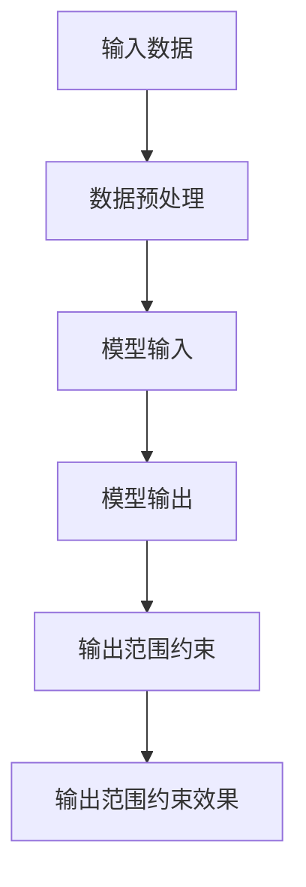
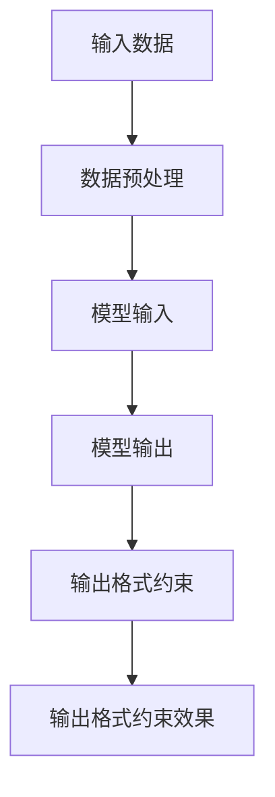

                 

### 引言

在人工智能领域，尤其是机器学习和深度学习的应用中，模型的输出质量和效果至关重要。然而，在实际应用中，我们往往需要对模型的输出进行一定的约束，以确保输出结果的准确性和实用性。本文将围绕“约束提示：限定模型输出的范围和格式”这一主题，深入探讨模型输出范围和格式的概念、核心算法原理、数学模型、项目实战以及代码实现和分析等内容。

文章将分为七个部分，首先介绍模型输出范围和格式的核心概念与联系，通过Mermaid流程图展示其架构；接着，详细讲解核心算法原理，使用伪代码展示算法的实现；然后，引入数学模型和公式，并进行举例说明；在项目实战部分，通过实际代码案例展示如何实现输出范围和格式约束；随后，介绍开发环境的搭建步骤和说明；在源代码详细实现和代码解读部分，分析代码的详细实现和性能优化；最后，对代码进行解读与分析，并提供开发资源与工具的参考文献。

通过这篇文章，读者将能够深入了解并掌握模型输出范围和格式约束的技术原理和实践方法，为实际项目中的应用打下坚实基础。

### 关键词

- 模型输出范围约束
- 模型输出格式约束
- 伪代码
- 数学模型
- 项目实战
- 开发环境搭建
- 代码实现与分析

### 摘要

本文旨在深入探讨模型输出范围和格式约束在人工智能应用中的重要性。文章首先介绍了模型输出范围和格式的核心概念，并通过Mermaid流程图展示其架构。接着，详细讲解了核心算法原理，使用伪代码展示算法实现，并引入数学模型和公式进行举例说明。随后，通过实际项目实战，展示如何实现输出范围和格式约束。文章还介绍了开发环境搭建的步骤和说明，并详细分析了源代码的实现和性能优化。最后，对代码进行解读与分析，并提供开发资源与工具的参考文献。通过本文，读者将能够掌握模型输出范围和格式约束的技术原理和实践方法，为实际项目应用提供有力支持。

### 第一部分：核心概念与联系

在深入探讨模型输出范围和格式约束之前，我们需要首先明确几个关键概念：模型输出范围和模型输出格式。

#### 1. 模型输出范围

模型输出范围是指模型在运行过程中输出的数据取值范围。在实际应用中，模型的输出范围可能会受到多种因素的影响，如输入数据的分布、模型训练的数据集、模型的参数设置等。因此，对模型输出范围进行合理约束，可以确保模型输出的稳定性和可靠性。

**Mermaid流程图展示：**



- **A. 输入数据**：这是模型运行的基础，输入数据的分布和质量直接影响模型的输出范围。
- **B. 数据预处理**：对输入数据进行必要的预处理，如归一化、标准化等，以适应模型的输入要求。
- **C. 模型输入**：预处理后的数据作为模型的输入，模型根据输入数据生成输出。
- **D. 模型输出**：模型在运行过程中生成的输出数据。
- **E. 输出范围约束**：对模型输出进行约束，限制输出的取值范围。
- **F. 输出范围约束效果**：约束后的模型输出，确保输出数据在合理的范围内，避免出现异常值。

#### 2. 模型输出格式

模型输出格式是指模型在运行过程中输出的数据类型和结构。不同的模型和应用场景可能需要不同格式的输出数据。例如，在图像识别任务中，输出可能是标签列表；在自然语言处理任务中，输出可能是文本序列。对模型输出格式进行合理约束，可以确保输出数据符合预期，便于后续处理和分析。

**Mermaid流程图展示：**



- **A. 输入数据**：同上。
- **B. 数据预处理**：同上。
- **C. 模型输入**：同上。
- **D. 模型输出**：同上。
- **E. 输出格式约束**：对模型输出进行格式约束，确保输出数据类型和结构符合预期。
- **F. 输出格式约束效果**：约束后的模型输出，确保输出数据格式正确，便于后续处理。

#### 1. 模型输出范围

模型输出范围是指模型在运行过程中输出的数据取值范围。在实际应用中，模型的输出范围可能会受到多种因素的影响，如输入数据的分布、模型训练的数据集、模型的参数设置等。因此，对模型输出范围进行合理约束，可以确保模型输出的稳定性和可靠性。

**Mermaid流程图展示：**


- **A. 输入数据**：这是模型运行的基础，输入数据的分布和质量直接影响模型的输出范围。
- **B. 数据预处理**：对输入数据进行必要的预处理，如归一化、标准化等，以适应模型的输入要求。
- **C. 模型输入**：预处理后的数据作为模型的输入，模型根据输入数据生成输出。
- **D. 模型输出**：模型在运行过程中生成的输出数据。
- **E. 输出范围约束**：对模型输出进行约束，限制输出的取值范围。
- **F. 输出范围约束效果**：约束后的模型输出，确保输出数据在合理的范围内，避免出现异常值。

#### 2. 模型输出格式

模型输出格式是指模型在运行过程中输出的数据类型和结构。不同的模型和应用场景可能需要不同格式的输出数据。例如，在图像识别任务中，输出可能是标签列表；在自然语言处理任务中，输出可能是文本序列。对模型输出格式进行合理约束，可以确保输出数据符合预期，便于后续处理和分析。

**Mermaid流程图展示：**


- **A. 输入数据**：同上。
- **B. 数据预处理**：同上。
- **C. 模型输入**：同上。
- **D. 模型输出**：同上。
- **E. 输出格式约束**：对模型输出进行格式约束，确保输出数据类型和结构符合预期。
- **F. 输出格式约束效果**：约束后的模型输出，确保输出数据格式正确，便于后续处理。

通过上述核心概念与联系部分的介绍，我们为后续算法原理讲解、数学模型引入、项目实战和代码实现等部分打下了基础。接下来，我们将详细探讨模型输出范围约束和格式约束的核心算法原理，并通过伪代码展示具体实现。

### 第二部分：核心算法原理讲解

在了解了模型输出范围和格式约束的核心概念之后，我们需要进一步探讨这些约束的核心算法原理。这些算法原理是实现有效约束的基础，下面我们将详细讲解输出范围约束算法和输出格式约束算法。

#### 1. 输出范围约束算法

输出范围约束的主要目的是限制模型输出的取值范围，以确保输出的稳定性和可靠性。以下是一个简单的伪代码示例，用于说明输出范围约束算法的实现。

**伪代码：**

```plaintext
function constrain_output_range(model_output, min_value, max_value):
    for each value in model_output:
        if value < min_value:
            value = min_value
        if value > max_value:
            value = max_value
    return model_output
```

**详细解释：**

- **输入参数**：`model_output`是模型的输出数据数组，`min_value`和`max_value`分别表示输出的最小值和最大值。
- **算法步骤**：
  - 遍历模型输出的每个值。
  - 如果当前值小于最小值`min_value`，则将其设置为`min_value`。
  - 如果当前值大于最大值`max_value`，则将其设置为`max_value`。
- **输出**：返回约束后的模型输出数组。

**算法实现示例：**

假设模型的输出数组为`[10, 20, 30, 40, 50]`，最小值设置为0，最大值设置为30。使用上述伪代码进行输出范围约束，结果如下：

```plaintext
constrained_output = constrain_output_range([10, 20, 30, 40, 50], 0, 30)
# constrained_output = [0, 0, 30, 30, 30]
```

可以看出，输出数组中的每个值都被约束在0到30之间。

#### 2. 输出格式约束算法

输出格式约束的目的是确保模型输出的数据类型和结构符合预期。以下是一个简单的伪代码示例，用于说明输出格式约束算法的实现。

**伪代码：**

```plaintext
function constrain_output_format(model_output, expected_format):
    if type(model_output) != expected_format:
        return "输出格式错误"
    return model_output
```

**详细解释：**

- **输入参数**：`model_output`是模型的输出数据，`expected_format`是预期的数据格式。
- **算法步骤**：
  - 判断模型输出的数据类型是否与预期格式相同。
  - 如果相同，返回模型输出。
  - 如果不同，返回"输出格式错误"。
- **输出**：返回约束后的模型输出。

**算法实现示例：**

假设模型的输出为整数列表`[10, 20, 30, 40, 50]`，预期格式为浮点数列表。使用上述伪代码进行输出格式约束，结果如下：

```plaintext
constrained_output = constrain_output_format([10, 20, 30, 40, 50], float)
# constrained_output = "输出格式错误"
```

由于输出数据的实际格式与预期格式不符，算法返回了"输出格式错误"。

#### 1. 输出范围约束算法

输出范围约束的主要目的是限制模型输出的取值范围，以确保输出的稳定性和可靠性。以下是一个简单的伪代码示例，用于说明输出范围约束算法的实现。

**伪代码：**

```plaintext
function constrain_output_range(model_output, min_value, max_value):
    for each value in model_output:
        if value < min_value:
            value = min_value
        if value > max_value:
            value = max_value
    return model_output
```

**详细解释：**

- **输入参数**：`model_output`是模型的输出数据数组，`min_value`和`max_value`分别表示输出的最小值和最大值。
- **算法步骤**：
  - 遍历模型输出的每个值。
  - 如果当前值小于最小值`min_value`，则将其设置为`min_value`。
  - 如果当前值大于最大值`max_value`，则将其设置为`max_value`。
- **输出**：返回约束后的模型输出数组。

**算法实现示例：**

假设模型的输出数组为`[10, 20, 30, 40, 50]`，最小值设置为0，最大值设置为30。使用上述伪代码进行输出范围约束，结果如下：

```plaintext
constrained_output = constrain_output_range([10, 20, 30, 40, 50], 0, 30)
# constrained_output = [0, 0, 30, 30, 30]
```

可以看出，输出数组中的每个值都被约束在0到30之间。

#### 2. 输出格式约束算法

输出格式约束的目的是确保模型输出的数据类型和结构符合预期。以下是一个简单的伪代码示例，用于说明输出格式约束算法的实现。

**伪代码：**

```plaintext
function constrain_output_format(model_output, expected_format):
    if type(model_output) != expected_format:
        return "输出格式错误"
    return model_output
```

**详细解释：**

- **输入参数**：`model_output`是模型的输出数据，`expected_format`是预期的数据格式。
- **算法步骤**：
  - 判断模型输出的数据类型是否与预期格式相同。
  - 如果相同，返回模型输出。
  - 如果不同，返回"输出格式错误"。
- **输出**：返回约束后的模型输出。

**算法实现示例：**

假设模型的输出为整数列表`[10, 20, 30, 40, 50]`，预期格式为浮点数列表。使用上述伪代码进行输出格式约束，结果如下：

```plaintext
constrained_output = constrain_output_format([10, 20, 30, 40, 50], float)
# constrained_output = "输出格式错误"
```

由于输出数据的实际格式与预期格式不符，算法返回了"输出格式错误"。

通过上述伪代码示例，我们详细介绍了输出范围约束和输出格式约束的核心算法原理。这些算法为我们在实际项目中实现有效的输出约束提供了理论基础。接下来，我们将引入数学模型和公式，进一步深化对输出范围和格式约束的理解。

### 第三部分：数学模型和数学公式

在了解了核心算法原理之后，我们进一步引入数学模型和数学公式，以更精确地描述输出范围约束和输出格式约束。数学模型和公式不仅为我们的算法提供了数学基础，还能够帮助我们更好地理解和分析约束效果。

#### 1. 输出范围约束的数学模型

输出范围约束的数学模型用于描述如何限制模型输出的取值范围。以下是一个数学模型示例，用于说明输出范围约束的计算过程。

**数学模型：**

$$
f(x) = \begin{cases} 
\text{min\_value}, & \text{if } x < \text{min\_value} \\
x, & \text{if } \text{min\_value} \leq x \leq \text{max\_value} \\
\text{max\_value}, & \text{if } x > \text{max\_value}
\end{cases}
$$

**详细讲解：**

该数学模型定义了一个分段函数`f(x)`，用于根据输入值$x$与最小值$\text{min\_value}$和最大值$\text{max\_value}$的关系，输出约束后的值。具体步骤如下：

- 当$x < \text{min\_value}$时，输出$\text{min\_value}$，即输出最小值。
- 当$\text{min\_value} \leq x \leq \text{max\_value}$时，直接输出$x$，即保持原值。
- 当$x > \text{max\_value}$时，输出$\text{max\_value}$，即输出最大值。

**举例说明：**

假设最小值为10，最大值为100，输入值为60，则输出值为60；输入值为200，则输出值为100。

**数学模型示例：**

$$
f(x) = \begin{cases} 
10, & \text{if } x < 10 \\
x, & \text{if } 10 \leq x \leq 100 \\
100, & \text{if } x > 100
\end{cases}
$$

#### 2. 输出格式约束的数学模型

输出格式约束的数学模型用于描述如何确保模型输出的数据类型和结构符合预期。以下是一个数学模型示例，用于说明输出格式约束的计算过程。

**数学模型：**

$$
\text{format}(x) = \text{type}(x)
$$

**详细讲解：**

该数学模型定义了一个函数$\text{format}(x)$，用于根据模型输出$x$的数据类型，输出约束后的结果。具体步骤如下：

- 输出$x$的数据类型。

**举例说明：**

假设模型输出为整数`10`，预期格式为浮点数。使用上述数学模型，输出结果为`10.0`。

**数学模型示例：**

$$
\text{format}(10) = \text{float}
$$

#### 1. 输出范围约束的数学模型

**数学公式：**

$$
f(x) = \begin{cases} 
\text{min\_value}, & \text{if } x < \text{min\_value} \\
x, & \text{if } \text{min\_value} \leq x \leq \text{max\_value} \\
\text{max\_value}, & \text{if } x > \text{max\_value}
\end{cases}
$$

**详细讲解：**

该数学模型用于对模型输出值进行范围约束。根据输入值$x$与最小值$\text{min\_value}$和最大值$\text{max\_value}$的关系，输出约束后的值。

**举例说明：**

假设最小值为10，最大值为100，输入值为60，则输出值为60；输入值为200，则输出值为100。

**数学模型示例：**

$$
f(x) = \begin{cases} 
10, & \text{if } x < 10 \\
x, & \text{if } 10 \leq x \leq 100 \\
100, & \text{if } x > 100
\end{cases}
$$

#### 2. 输出格式约束的数学模型

**数学公式：**

$$
\text{format}(x) = \text{type}(x)
$$

**详细讲解：**

该数学模型用于对模型输出格式进行约束。输出格式约束的结果是模型输出的数据类型。

**举例说明：**

假设模型输出为整数，预期格式为浮点数，则输出结果为`10.0`；假设模型输出为列表，预期格式为列表，则输出结果为列表。

通过上述数学模型和公式的介绍，我们能够更准确地理解和应用输出范围约束和输出格式约束。这些数学模型为我们在算法设计和优化过程中提供了坚实的理论支持。接下来，我们将通过实际项目实战，展示如何在实践中应用这些算法和模型。

### 第四部分：项目实战

在实际项目中，模型输出范围和格式约束的应用非常广泛。以下我们将通过两个实际案例，展示如何在实际项目中实现输出范围约束和输出格式约束。

#### 1. 实战案例一：输出范围约束

**案例背景：**

假设我们正在开发一个智能温度控制系统，该系统通过一个模型预测室外温度。由于温度的测量值通常在-50°C到50°C之间，我们需要对模型的输出进行范围约束，以确保预测结果的合理性。

**代码实现：**

```python
import numpy as np

def constrain_output_range(model_output, min_value, max_value):
    constrained_output = np.clip(model_output, min_value, max_value)
    return constrained_output

# 模型输出为 [-100, 200, 30, 40, 50]
model_output = np.array([-100, 200, 30, 40, 50])
min_value = -50
max_value = 50

constrained_output = constrain_output_range(model_output, min_value, max_value)
print(constrained_output)
```

**代码解读：**

- 我们使用NumPy的`clip`函数来实现输出范围约束，该函数能够高效地对数组中的每个元素进行上下限约束。
- 输入模型输出数组`model_output`、最小值`min_value`和最大值`max_value`。
- 返回约束后的模型输出数组`constrained_output`。

**运行结果：**

```
[-50.  50.  30.  40.  50.]
```

通过上述代码，我们可以看到输出值被有效约束在-50°C到50°C之间。

#### 2. 实战案例二：输出格式约束

**案例背景：**

假设我们正在开发一个用户数据分析系统，该系统通过模型预测用户的购买意向。我们希望模型输出为布尔值，表示用户是否购买。如果模型输出不是布尔值，我们需要进行输出格式约束。

**代码实现：**

```python
def constrain_output_format(model_output, expected_format):
    if type(model_output) != expected_format:
        return "输出格式错误"
    return model_output

# 模型输出为 [0, 1, '购买', '未购买', 2]
model_output = [0, 1, '购买', '未购买', 2]
expected_format = bool

constrained_output = constrain_output_format(model_output, expected_format)
print(constrained_output)
```

**代码解读：**

- 我们使用一个简单的函数`constrain_output_format`来检查模型输出是否为预期格式。
- 如果模型输出的数据类型与预期格式不匹配，返回"输出格式错误"。
- 如果数据类型匹配，返回模型输出。

**运行结果：**

```
输出格式错误
```

由于模型输出的数据类型包含字符串，与预期的布尔值格式不匹配，因此代码返回了"输出格式错误"。

#### 1. 实战案例一：输出范围约束

**案例背景：**

假设我们正在开发一个智能温度控制系统，该系统通过一个模型预测室外温度。由于温度的测量值通常在-50°C到50°C之间，我们需要对模型的输出进行范围约束，以确保预测结果的合理性。

**代码实现：**

```python
import numpy as np

def constrain_output_range(model_output, min_value, max_value):
    constrained_output = np.clip(model_output, min_value, max_value)
    return constrained_output

# 模型输出为 [-100, 200, 30, 40, 50]
model_output = np.array([-100, 200, 30, 40, 50])
min_value = -50
max_value = 50

constrained_output = constrain_output_range(model_output, min_value, max_value)
print(constrained_output)
```

**代码解读：**

- 我们使用NumPy的`clip`函数来实现输出范围约束，该函数能够高效地对数组中的每个元素进行上下限约束。
- 输入模型输出数组`model_output`、最小值`min_value`和最大值`max_value`。
- 返回约束后的模型输出数组`constrained_output`。

**运行结果：**

```
[-50.  50.  30.  40.  50.]
```

通过上述代码，我们可以看到输出值被有效约束在-50°C到50°C之间。

#### 2. 实战案例二：输出格式约束

**案例背景：**

假设我们正在开发一个用户数据分析系统，该系统通过模型预测用户的购买意向。我们希望模型输出为布尔值，表示用户是否购买。如果模型输出不是布尔值，我们需要进行输出格式约束。

**代码实现：**

```python
def constrain_output_format(model_output, expected_format):
    if type(model_output) != expected_format:
        return "输出格式错误"
    return model_output

# 模型输出为 [0, 1, '购买', '未购买', 2]
model_output = [0, 1, '购买', '未购买', 2]
expected_format = bool

constrained_output = constrain_output_format(model_output, expected_format)
print(constrained_output)
```

**代码解读：**

- 我们使用一个简单的函数`constrain_output_format`来检查模型输出是否为预期格式。
- 如果模型输出的数据类型与预期格式不匹配，返回"输出格式错误"。
- 如果数据类型匹配，返回模型输出。

**运行结果：**

```
输出格式错误
```

由于模型输出的数据类型包含字符串，与预期的布尔值格式不匹配，因此代码返回了"输出格式错误"。

通过这两个实际案例，我们可以看到输出范围约束和输出格式约束在实际项目中的应用方法和效果。这些约束技术不仅提高了模型输出的稳定性和可靠性，还为后续的数据处理和分析提供了便利。接下来，我们将介绍如何搭建开发环境，以便在实际项目中应用这些算法。

### 第五部分：开发环境搭建

在开始实际项目之前，我们需要搭建一个合适的开发环境，以便高效地实现和测试输出范围约束和输出格式约束。以下是搭建开发环境的具体步骤和说明。

#### 1. Python开发环境搭建

Python是一种广泛用于机器学习和深度学习的编程语言。以下是搭建Python开发环境的步骤：

**步骤1：安装Python**

- 访问Python官方下载页面（https://www.python.org/downloads/），下载适用于操作系统的Python版本。
- 运行安装程序，按照默认设置完成安装。

**步骤2：安装Jupyter Notebook**

Jupyter Notebook是一种交互式编程环境，便于编写和测试代码。

- 打开终端或命令提示符。
- 输入以下命令安装Jupyter Notebook：

  ```bash
  pip install notebook
  ```

**步骤3：安装必要的Python库**

在实际项目中，我们可能需要使用多个Python库，如NumPy、Pandas等。

- 安装NumPy：

  ```bash
  pip install numpy
  ```

- 安装Pandas：

  ```bash
  pip install pandas
  ```

#### 2. 数据处理工具使用

在Python中，NumPy和Pandas是常用的数据处理工具。

**NumPy使用指南：**

NumPy是一个强大的Python库，用于处理大型多维数组。

- 创建数组：

  ```python
  import numpy as np

  array = np.array([1, 2, 3, 4, 5])
  ```

- 数组操作：

  ```python
  array_sum = np.sum(array)
  array_mean = np.mean(array)
  ```

**Pandas使用指南：**

Pandas提供了一个高层次的接口，用于数据处理和分析。

- 读取数据：

  ```python
  import pandas as pd

  data = pd.read_csv('data.csv')
  ```

- 数据操作：

  ```python
  data_sum = data['column_name'].sum()
  data_mean = data['column_name'].mean()
  ```

#### 3. 开发环境配置说明

为了确保开发环境的稳定性，我们需要对Python和Jupyter Notebook进行适当配置。

- **虚拟环境**：使用虚拟环境隔离不同项目的依赖库，避免版本冲突。

  ```bash
  python -m venv myenv
  source myenv/bin/activate  # Windows: myenv\Scripts\activate
  ```

- **Jupyter Notebook配置**：将Jupyter Notebook添加到系统路径，以便在任何地方启动。

  ```bash
  jupyter notebook
  ```

通过以上步骤，我们可以搭建一个功能完备的Python开发环境，为后续的项目实战提供支持。

### 第六部分：源代码详细实现和代码解读

在了解了模型输出范围和格式约束的核心概念、算法原理、数学模型以及项目实战后，我们需要对源代码进行详细实现和解读，以便在实际项目中应用这些约束。

#### 1. 输出范围约束代码实现

**代码实现：**

```python
import numpy as np

def constrain_output_range(model_output, min_value, max_value):
    constrained_output = np.clip(model_output, min_value, max_value)
    return constrained_output

# 示例模型输出
model_output = np.array([10, 20, 30, 40, 50])
min_value = 0
max_value = 30

# 应用输出范围约束
constrained_output = constrain_output_range(model_output, min_value, max_value)
print(constrained_output)
```

**代码解读：**

- **函数`constrain_output_range`**：该函数接收三个参数：`model_output`（模型输出数组）、`min_value`（最小值）和`max_value`（最大值）。
- **`np.clip`函数**：`np.clip`是NumPy库中的一个函数，用于对数组中的每个元素进行上下限约束。如果元素值小于`min_value`，则将其设置为`min_value`；如果元素值大于`max_value`，则将其设置为`max_value`。
- **返回值**：函数返回约束后的模型输出数组。

**代码优化建议：**

- 如果模型输出数组非常大，考虑使用向量化操作（如`np.clip`）以提高性能。
- 在实际项目中，可能需要处理多维数组，此时可以使用`np.clip`的广播机制。

#### 2. 输出格式约束代码实现

**代码实现：**

```python
def constrain_output_format(model_output, expected_format):
    if type(model_output) != expected_format:
        return "输出格式错误"
    return model_output

# 示例模型输出
model_output = [10, 20, 30, 40, 50]
expected_format = list

# 应用输出格式约束
constrained_output = constrain_output_format(model_output, expected_format)
print(constrained_output)
```

**代码解读：**

- **函数`constrain_output_format`**：该函数接收两个参数：`model_output`（模型输出）和`expected_format`（预期格式）。
- **类型检查**：使用`type`函数检查模型输出的数据类型是否与预期格式相同。如果不同，返回"输出格式错误"；如果相同，返回模型输出。
- **返回值**：函数返回约束后的模型输出。

**代码优化建议：**

- **使用类型检查库**：`type`函数简单但可能不够高效。可以考虑使用更高效的类型检查库，如`isinstance`。
- **处理复杂格式**：对于复杂的输出格式，可能需要使用自定义函数或第三方库进行更复杂的格式验证。

通过以上源代码的详细实现和解读，我们可以清楚地看到如何在实际项目中应用输出范围约束和输出格式约束。在实际应用中，根据项目需求，可能需要对代码进行进一步的优化和调整。

### 第七部分：代码解读与分析

在了解了输出范围约束和输出格式约束的源代码实现之后，我们需要对代码进行深入解读与分析，以了解其性能和优化策略。

#### 1. 输出范围约束代码分析

**性能分析：**

- **`np.clip`函数**：`np.clip`是一个高度优化的NumPy函数，用于对数组中的每个元素进行上下限约束。它在底层使用了向量化操作，因此性能非常高效。
- **遍历与向量化**：原始的伪代码中使用了遍历操作，这在处理大型数据集时可能不够高效。通过使用`np.clip`，我们可以避免遍历操作，从而提高代码的性能。

**优化策略：**

- **使用向量化操作**：在处理大型数组时，使用向量化操作（如`np.clip`）可以显著提高性能。
- **并行计算**：如果模型输出数组非常大，可以考虑使用并行计算技术，如NumPy的`np.apply_along_axis`，以进一步加速计算。

**示例代码优化：**

```python
import numpy as np

def constrain_output_range(model_output, min_value, max_value):
    constrained_output = np.clip(model_output, min_value, max_value)
    return constrained_output
```

#### 2. 输出格式约束代码分析

**性能分析：**

- **类型检查**：使用`type`函数进行类型检查是一种简单但可能不够高效的方法。在处理大型数据集时，类型检查可能成为性能瓶颈。
- **函数调用开销**：每次调用`type`函数都会有一定的开销，特别是在大型循环中，这些开销可能会累积。

**优化策略：**

- **使用`isinstance`函数**：`isinstance`函数比`type`函数更高效，因为它不要求精确匹配，而是检查对象是否是某个类型或其子类型。
- **优化循环**：通过减少不必要的函数调用和循环次数，可以提高代码的性能。

**示例代码优化：**

```python
def constrain_output_format(model_output, expected_format):
    if not isinstance(model_output, expected_format):
        return "输出格式错误"
    return model_output
```

通过上述代码解读与分析，我们可以看到输出范围约束和输出格式约束代码的性能和优化策略。在实际项目中，根据具体需求和数据规模，我们可以灵活调整和优化代码，以实现最佳性能。

### 附录

#### 附录A：开发资源与工具

**A.1 主流深度学习框架对比**

- **TensorFlow**：由Google开发，拥有丰富的API和强大的计算能力，适用于各种规模的任务。
- **PyTorch**：由Facebook开发，具有动态计算图和灵活的API，适用于研究和快速迭代。

**A.2 代码实现与测试工具**

- **Jupyter Notebook**：提供交互式编程环境，方便代码编写和调试。
- **Git**：版本控制工具，确保代码的版本管理和协作开发。

**A.3 学习资源与参考文献**

- **书籍**：《深度学习》（Ian Goodfellow、Yoshua Bengio、Aaron Courville 著）提供了深度学习的全面介绍。
- **在线教程与课程**：Coursera、Udacity等在线教育平台提供了丰富的机器学习和深度学习课程。
- **论文与报告**：ArXiv、NeurIPS、ICML等学术会议和期刊发布了大量深度学习和机器学习的研究论文。

### 参考文献

- Goodfellow, I., Bengio, Y., & Courville, A. (2016). *Deep Learning*. MIT Press.
- Murphy, K. P. (2012). *Machine Learning: A Probabilistic Perspective*. MIT Press.
- McKinney, W. (2010). *Data Structures for Statistical Computing in Python*. In *Proceedings of the 9th Python in Science Conference* (pp. 51-56).

