                 

# 《结构化思维的应用：从理论到实践》

## 关键词

结构化思维、理论基础、实践应用、项目管理、决策分析、沟通协作、创新与创业

## 摘要

本文旨在探讨结构化思维的应用，从理论到实践提供全面的解析。结构化思维作为一种分析问题的工具，具有系统性、逻辑性和目标导向性。本文将首先介绍结构化思维的基本概念和原理，随后详细阐述其在项目管理、决策分析、沟通协作以及创新与创业等多个领域的应用。通过实例和案例研究，本文将展示结构化思维在实际场景中的具体运用，帮助读者更好地理解和掌握这一重要思维方式。

## 目录大纲

### 第一部分：结构化思维基础理论

#### 第1章：什么是结构化思维

- **1.1 结构化思维的起源与发展**
- **1.2 结构化思维的核心原则**
- **1.3 结构化思维的重要性与应用范围**

#### 第2章：结构化思维的组成部分

- **2.1 分析框架**
- **2.2 信息收集**
- **2.3 数据处理**
- **2.4 结论推导**

#### 第3章：结构化思维的认知基础

- **3.1 感知与记忆**
- **3.2 注意力与思维**
- **3.3 创造力与批判性思维**

#### 第4章：结构化思维在日常生活中的应用

- **4.1 工作中的结构化思维**
- **4.2 学习中的结构化思维**
- **4.3 家庭与社交中的结构化思维**

### 第二部分：结构化思维在实践中的应用

#### 第5章：结构化思维在项目管理中的应用

- **5.1 项目管理中的结构化思维**
- **5.2 项目计划与跟踪**
- **5.3 项目风险管理与决策**

#### 第6章：结构化思维在决策与问题解决中的应用

- **6.1 决策过程中的结构化思维**
- **6.2 问题解决中的结构化思维**
- **6.3 创新思维与结构化思维**

#### 第7章：结构化思维在沟通与团队协作中的应用

- **7.1 沟通中的结构化思维**
- **7.2 团队协作与结构化思维**
- **7.3 矛盾冲突的解决**

#### 第8章：结构化思维在创新与创业中的应用

- **8.1 创新思维与结构化思维**
- **8.2 创业过程中的结构化思维**
- **8.3 创业项目评估与风险控制**

### 第三部分：结构化思维实践案例

#### 第9章：案例研究

- **9.1 案例一：某公司产品开发中的结构化思维应用**
- **9.2 案例二：某市政府项目中的结构化思维应用**
- **9.3 案例三：某创业项目中的结构化思维应用**

#### 第10章：总结与展望

- **10.1 结构化思维的应用现状**
- **10.2 未来发展趋势**
- **10.3 深入学习与资源推荐**

### 附录

#### 附录A：结构化思维工具与资源

- **A.1 结构化思维工具介绍**
- **A.2 结构化思维相关书籍推荐**
- **A.3 结构化思维在线课程与工作坊**

## 引言

在信息爆炸和复杂性日益增加的今天，如何有效地分析问题、做出决策和解决问题成为了每个人都需要面对的挑战。结构化思维作为一种系统化的分析工具，提供了一种清晰、有条理的思考方式，帮助我们在面对复杂问题时能够更加理性、高效地处理。本文将深入探讨结构化思维的应用，从理论到实践，帮助读者掌握这一重要的思维方式。

### 结构化思维的定义与历史

结构化思维，简而言之，是一种将复杂问题分解为简单、有条理的部分，并通过逻辑关系进行整合的思考方式。它强调系统性、分析性和目标导向性，旨在提高思维的清晰度和决策的准确性。结构化思维的历史可以追溯到20世纪50年代，当时管理学家哈罗德·孔茨（Harold Koontz）和西里尔·奥唐奈（Cyril O'Donnell）在他们的著作《管理学原理》中首次提出了这一概念。随着信息科学和认知科学的发展，结构化思维逐渐成为企业管理、项目管理、决策分析等领域的重要工具。

结构化思维的应用范围广泛，从日常生活中的个人决策到复杂的商业决策，从学术研究到技术创新，都有着不可替代的作用。其重要性在于，它能够帮助我们提高思维的条理性，减少错误和遗漏，提高决策效率和质量。因此，掌握结构化思维不仅对职业发展大有裨益，也对个人生活质量的提升有着积极的影响。

### 本文结构

本文将从以下几个方面展开讨论：

1. **结构化思维的基础理论**：介绍结构化思维的起源、核心原则、组成部分以及认知基础。
2. **结构化思维在实践中的应用**：详细探讨结构化思维在项目管理、决策与问题解决、沟通与团队协作、创新与创业等领域的实际应用。
3. **结构化思维实践案例**：通过具体案例展示结构化思维在现实场景中的运用，帮助读者更好地理解和掌握。
4. **总结与展望**：总结结构化思维的应用现状，展望其未来发展趋势，并推荐深入学习资源。

通过本文的阅读，读者将能够全面了解结构化思维的内涵与应用，提升自己在复杂问题分析、决策制定和团队合作等方面的能力。

## 第一部分：结构化思维基础理论

### 第1章：什么是结构化思维

#### 1.1 结构化思维的起源与发展

结构化思维作为一种思考工具，其起源可以追溯到20世纪中期，当时管理学、工程学和信息科学等多个领域开始关注如何处理复杂问题和提高决策效率。管理学家哈罗德·孔茨和西里尔·奥唐奈在1950年代提出了结构化思维的概念，并将其应用于管理学中。他们认为，通过将复杂的问题分解为更小的、更易管理的部分，然后逐步解决这些部分，可以大大提高决策的准确性和效率。

随着时间的推移，结构化思维的理论不断发展，逐渐形成了系统化的框架和方法。在工程领域，结构化设计思想被广泛应用于系统开发和项目管理中，确保项目的每个阶段都能够有条不紊地进行。信息科学领域则将结构化思维与数据库设计和信息检索相结合，提高了数据处理的效率和准确性。

结构化思维的发展历程不仅限于理论层面的研究，更体现在其实际应用中。在20世纪80年代，随着计算机技术的迅猛发展，结构化思维在软件开发和信息技术领域得到了广泛应用。编程语言如C和Pascal的出现，使得程序员可以更清晰地描述和实现复杂的算法和程序结构，从而推动了软件工程的进步。

进入21世纪，随着互联网和大数据的兴起，结构化思维在数据分析、商业智能和人工智能领域也得到了广泛应用。通过结构化思维，数据科学家和人工智能研究者能够更好地理解和处理海量数据，从而发现有价值的信息和模式。

#### 1.2 结构化思维的核心原则

结构化思维的核心原则可以归纳为以下几点：

1. **系统性**：将复杂问题分解为多个组成部分，并理解这些部分之间的相互关系。通过系统性的分析，可以更全面地理解问题的本质。

2. **逻辑性**：在解决问题时，遵循逻辑推理的规则，确保每一步都是基于已知的事实和前提。逻辑性是结构化思维的基石，能够避免思维的混乱和错误。

3. **目标导向性**：明确问题的目标和解决问题的方向。通过设定明确的目标，可以更有效地聚焦问题，减少不必要的干扰。

4. **条理性**：将问题分解为有序的步骤或模块，并按顺序解决。条理性有助于提高思维的清晰度和决策的效率。

5. **可追溯性**：在解决问题的过程中，记录每一步的推理和决策过程，以便于后续的检查和修正。可追溯性是确保决策合理性和可重复性的关键。

#### 1.3 结构化思维的重要性与应用范围

结构化思维在多个领域都展现了其独特的重要性和广泛的应用范围：

1. **项目管理**：结构化思维有助于项目管理者系统地规划项目进度、分配资源，并识别和管理项目风险。

2. **决策分析**：在商业决策过程中，结构化思维可以提供清晰的逻辑框架，帮助决策者分析各种选择，做出更明智的决策。

3. **问题解决**：在遇到复杂问题时，结构化思维提供了系统化的分析方法，帮助问题的快速定位和有效解决。

4. **沟通协作**：结构化思维可以提高团队沟通的效率和质量，确保信息的清晰传递和理解。

5. **创新与创业**：在创新和创业过程中，结构化思维可以帮助创业者系统化地分析市场、设计产品和制定战略。

6. **学术研究**：在科学研究过程中，结构化思维有助于研究者系统地梳理研究问题、设计实验和分析数据。

7. **日常生活**：在日常生活中，结构化思维可以帮助个人更好地规划时间、管理事务和做出决策。

通过理解结构化思维的核心原则和重要性，我们可以更好地应用这一思维方式，提高工作效率和生活质量。

### 第2章：结构化思维的组成部分

结构化思维作为一种系统化的思考方式，其有效应用依赖于一系列组成部分的协同作用。这些组成部分包括分析框架、信息收集、数据处理和结论推导。理解这些部分及其相互关系，有助于我们更好地运用结构化思维解决复杂问题。

#### 2.1 分析框架

分析框架是结构化思维的起点，它为我们提供了一个组织问题和定义问题范围的工具。一个有效的分析框架通常包含以下几个关键要素：

1. **定义问题**：明确我们需要解决的问题是什么。这一步骤要求我们深入理解问题的本质，而不是仅仅停留在表面现象上。

2. **确定目标**：明确解决问题的目标。目标应具体、可衡量、可实现、相关性强并有时限（SMART原则）。确定目标是确保我们的努力方向正确且具有实际意义。

3. **识别关键变量**：识别影响问题的关键因素。这些变量可以是人员、资源、时间、技术等。通过识别关键变量，我们可以更好地理解问题，并针对性地制定解决方案。

4. **建立模型**：构建一个简化的模型来描述问题。这个模型可以帮助我们理解问题的主要特征和相互关系，从而为后续的分析提供基础。

5. **分解问题**：将复杂的问题分解为更小、更具体的子问题。分解问题的目的是降低问题的复杂性，使得每个子问题都可以独立分析和解决。

以下是一个使用Mermaid流程图表示的分析框架：

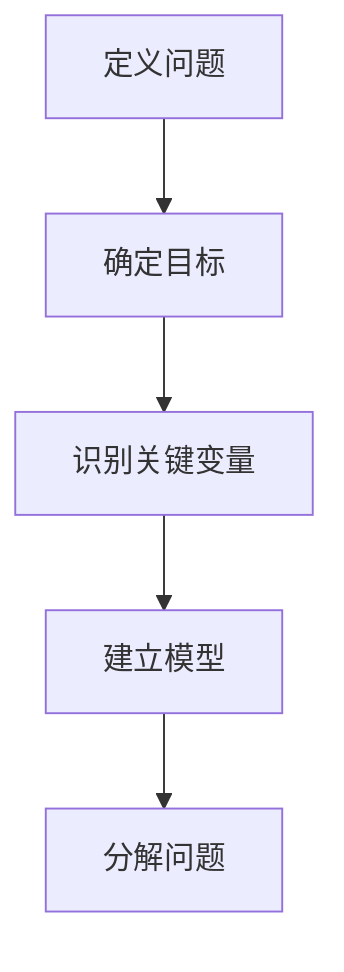

#### 2.2 信息收集

信息收集是结构化思维中的关键环节，它决定了我们分析和决策的质量。有效的信息收集应遵循以下原则：

1. **全面性**：收集与问题相关的所有信息，确保信息的全面性和准确性。信息的不完整或错误可能导致错误的决策和解决方案。

2. **可靠性**：选择可靠的信息来源，如权威出版物、专业报告和可靠的数据源。避免依赖主观意见或未经证实的信息。

3. **相关性**：确保收集的信息与问题相关，避免无关信息的干扰。相关信息的识别有助于提高分析的有效性。

4. **及时性**：收集的信息应当是及时更新的，尤其是在变化迅速的领域。过时的信息可能导致过时的分析和决策。

以下是一个伪代码示例，用于表示信息收集过程：

```python
def collect_information():
    data = []
    for source in reliable_sources:
        data.append(process_source(source))
    return data
```

#### 2.3 数据处理

数据处理是结构化思维中的核心环节，它将收集到的信息转化为有价值的知识和洞见。有效的数据处理应包括以下步骤：

1. **数据清洗**：去除数据中的噪声和错误，确保数据的质量。数据清洗是数据预处理的重要步骤。

2. **数据整合**：将来自不同来源的数据进行整合，形成统一的分析数据集。数据整合有助于提高分析的全面性和准确性。

3. **数据分析**：运用统计分析和数据挖掘技术，对数据进行深入分析，发现数据中的模式和规律。

4. **数据可视化**：通过图表和图形，将分析结果以直观的方式展示出来。数据可视化有助于更好地理解和传达分析结果。

以下是一个伪代码示例，用于表示数据处理过程：

```python
def process_data(data):
    cleaned_data = clean_data(data)
    integrated_data = integrate_data(cleaned_data)
    analyzed_data = analyze_data(integrated_data)
    visualized_data = visualize_data(analyzed_data)
    return visualized_data
```

#### 2.4 结论推导

结论推导是结构化思维的最终环节，它将分析结果转化为具体的决策和行动方案。有效的结论推导应遵循以下原则：

1. **逻辑一致性**：确保结论与前提条件和分析结果保持一致。逻辑一致性是结论可靠性的基础。

2. **合理性**：结论应基于充分的分析和证据，避免基于主观偏见或未经证实的信息做出决策。

3. **可行动性**：结论应具有可操作性，确保可以转化为具体的行动方案。

4. **可追溯性**：记录结论推导的每一步，确保结论的可追溯性和透明度。

以下是一个伪代码示例，用于表示结论推导过程：

```python
def derive_conclusions(data, analysis_results):
    conclusions = []
    for result in analysis_results:
        conclusion = formulate_conclusion(result)
        conclusions.append(conclusion)
    return conclusions
```

通过理解并运用这些组成部分，我们可以更有效地运用结构化思维解决复杂问题。接下来，我们将进一步探讨结构化思维的认知基础，帮助读者更深入地理解这一思维方式。

### 第3章：结构化思维的认知基础

结构化思维不仅仅是一种方法论，它还与我们的认知过程紧密相关。为了更好地理解和应用结构化思维，我们需要探讨其背后的认知基础，包括感知与记忆、注意力与思维，以及创造力和批判性思维。

#### 3.1 感知与记忆

感知是我们接收外部信息的过程，而记忆则是我们将这些信息存储和回忆的能力。这两者在结构化思维中扮演着关键角色。

**感知**：感知是结构化思维的第一步。通过感知，我们能够识别和理解外部环境中的信息。例如，当我们面对一个复杂的项目时，我们首先需要通过感知来收集相关的信息和数据。良好的感知能力使我们能够更敏锐地捕捉到问题的细节和关键因素。

**记忆**：记忆是将感知到的信息存储在长期记忆中，以便在需要时进行回忆和运用。在结构化思维中，记忆尤为重要。它使我们能够在处理复杂问题时，回顾过去类似情况的经验和知识，从而提供有价值的参考。例如，在项目管理的决策过程中，记忆可以帮助我们回忆过去项目中的成功和失败经验，为当前的决策提供依据。

为了提高感知和记忆能力，我们可以采取以下措施：

- **练习注意力集中**：通过专注练习，如冥想和专注力训练，提高我们的感知能力。
- **定期复习和回顾**：通过定期复习和回顾，强化我们的记忆，确保信息能够在需要时被有效调用。

以下是一个Mermaid流程图，展示了感知与记忆在结构化思维中的作用：

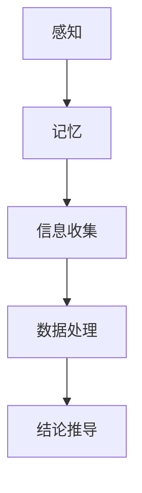

#### 3.2 注意力与思维

注意力是我们集中精力处理特定任务的能力。在结构化思维中，注意力至关重要。它决定了我们能否在复杂环境中保持专注，有效地处理和分析信息。

**注意力**：注意力分为两种：集中注意力和分散注意力。集中注意力使我们能够专注于特定的任务，而分散注意力则使我们能够同时处理多个任务。在结构化思维中，集中注意力有助于我们深入分析问题，而分散注意力则有助于我们在不同的问题之间切换。

**思维**：思维是处理信息的过程，它包括分析、推理、综合和评估等能力。在结构化思维中，思维是核心。通过系统化的思维过程，我们可以将复杂的问题分解为更简单的部分，并逐步解决。以下是一个使用Mermaid流程图的思维过程示例：

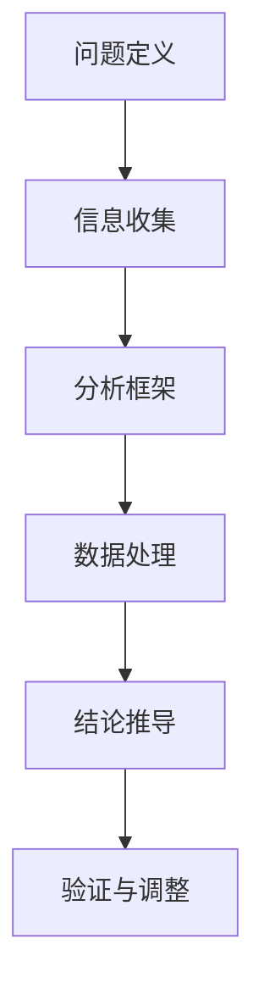

为了提高注意力和思维能力，我们可以采取以下措施：

- **定期休息**：长时间专注于任务后，适当休息可以帮助我们恢复注意力，提高工作效率。
- **思维训练**：通过逻辑谜题、思维游戏和阅读等训练，提高我们的思维能力和逻辑推理能力。

#### 3.3 创造力与批判性思维

创造力是结构化思维的重要组成部分，它使我们能够在解决问题时提出新的想法和解决方案。批判性思维则是评估这些想法和解决方案的有效性，以确保它们符合实际情况和目标。

**创造力**：创造力是一种能够产生新观点和新方法的能力。在结构化思维中，创造力可以帮助我们跳出传统思维模式，发现新的解决方案。例如，在项目开发过程中，创造力可以帮助我们设计出更加创新和高效的解决方案。

**批判性思维**：批判性思维是一种评估信息、想法和解决方案的方法。它使我们能够从多个角度审视问题，识别潜在的风险和问题，并确保我们的决策具有充分的事实依据。例如，在项目评估阶段，批判性思维可以帮助我们识别项目的优势和劣势，为后续的改进提供依据。

为了提高创造力和批判性思维，我们可以采取以下措施：

- **开放心态**：保持开放的心态，乐于接受新的观点和想法，这有助于激发创造力。
- **反思与总结**：定期反思我们的思维过程和决策结果，从中学习和成长，提高批判性思维能力。

以下是一个Mermaid流程图，展示了创造力和批判性思维在结构化思维中的作用：

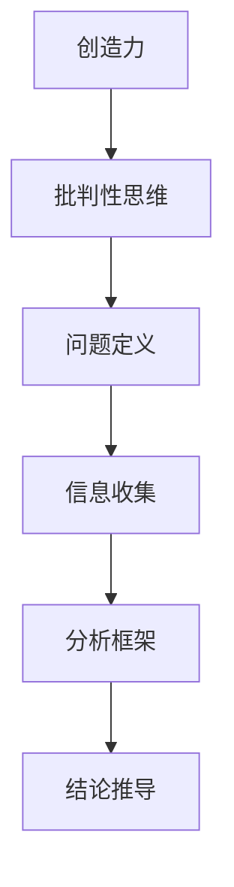

通过理解结构化思维的认知基础，我们可以更好地应用这一思维方式，提高我们的思维能力和决策效率。接下来，我们将探讨结构化思维在日常生活中的应用，帮助读者将这一思维方式融入到日常工作和生活中。

### 第4章：结构化思维在日常生活中的应用

结构化思维不仅在专业领域有着重要的应用，在日常生活中也同样具有重要意义。通过结构化思维，我们能够更有效地规划时间、管理事务和做出决策。以下将详细探讨结构化思维在三个方面——工作中、学习和家庭社交中的具体应用。

#### 4.1 工作中的结构化思维

在职场中，结构化思维能够帮助我们提高工作效率，减少错误，并做出更明智的决策。

**项目管理**：结构化思维在项目管理中有着广泛的应用。例如，在项目启动阶段，我们可以通过定义明确的项目目标，识别关键变量，建立项目模型，从而确保项目方向的正确性。在项目执行过程中，通过使用Gantt图或PERT图等工具，我们可以系统地跟踪项目进度，确保每个阶段都能按时完成。此外，结构化思维还可以帮助我们在项目风险管理中识别潜在风险，并制定相应的应对措施。

**问题解决**：面对复杂的工作问题时，结构化思维提供了一个清晰的框架，帮助我们系统地分析和解决问题。例如，在软件开发中，遇到功能故障时，我们可以通过以下步骤应用结构化思维：

1. **问题定义**：明确问题的具体表现和影响范围。
2. **信息收集**：收集与问题相关的所有信息，如日志记录、用户反馈等。
3. **建立模型**：根据收集的信息，构建一个简化的模型来描述问题。
4. **分解问题**：将复杂的问题分解为更小的、具体的子问题。
5. **解决方案**：根据子问题的解决方案，整合成一个完整的解决方案。
6. **验证与调整**：实施解决方案后，验证其效果，并根据反馈进行调整。

以下是一个使用Mermaid流程图表示的问题解决过程：

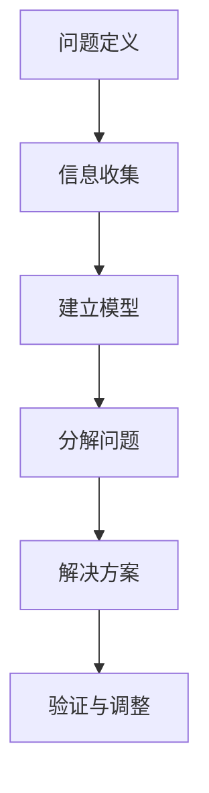

#### 4.2 学习中的结构化思维

在学习过程中，结构化思维能够帮助我们更好地掌握知识，提高学习效率。

**预习与复习**：在预习阶段，我们可以使用结构化思维来梳理课程内容，明确每个章节的核心概念和关键点。在复习阶段，通过回顾预习时的笔记和结构，我们可以系统地复习和巩固所学知识。

**笔记整理**：结构化思维在笔记整理中也非常有用。通过使用思维导图或结构化的笔记方法，我们可以将复杂的信息整理成有条理的笔记，便于后续的复习和参考。

**学习计划**：制定合理的学习计划是学习成功的关键。通过结构化思维，我们可以将学习目标分解为具体的步骤和时间表，确保每个学习阶段都有明确的目标和计划。

以下是一个使用Mermaid流程图表示的学习计划：

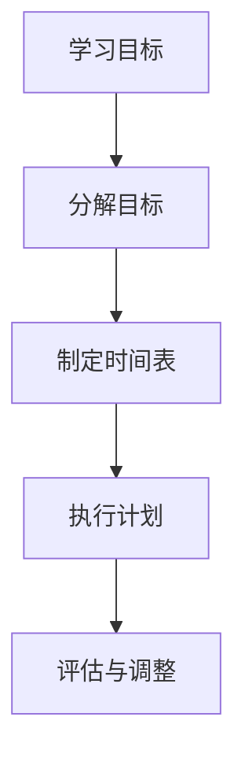

#### 4.3 家庭与社交中的结构化思维

在家庭和社交生活中，结构化思维同样可以帮助我们更好地处理事务和解决问题。

**家庭管理**：在家庭管理中，结构化思维可以帮助我们更好地规划家庭活动和任务。例如，通过制定家庭计划表，我们可以合理安排家庭购物、烹饪、清洁和娱乐等活动，提高家庭的运行效率。

**社交沟通**：在社交沟通中，结构化思维可以帮助我们更清晰地表达自己的想法，并理解对方的观点。通过使用结构化思维，我们可以将复杂的想法分解为几个关键点，从而更有效地传达信息。

**解决冲突**：在解决家庭和社交中的冲突时，结构化思维提供了一个理性分析问题的框架。通过识别问题的根本原因，寻找共同点，并提出解决方案，我们可以有效地解决冲突，维护和谐的家庭和社交关系。

以下是一个使用Mermaid流程图表示的解决冲突过程：

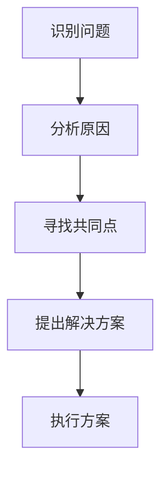

通过在日常生活中运用结构化思维，我们可以提高工作效率、学习效果和家庭生活质量。接下来，我们将探讨结构化思维在项目管理中的具体应用，帮助读者更好地理解其在实际项目中的应用价值。

### 第5章：结构化思维在项目管理中的应用

在项目管理中，结构化思维是一种至关重要的工具，它帮助项目经理和组织更有效地规划和执行项目。通过结构化思维，项目经理可以明确项目目标、合理分配资源、监控进度，并有效管理项目风险。以下将详细探讨结构化思维在项目管理中的应用。

#### 5.1 项目管理中的结构化思维

**项目目标定义**：在项目启动阶段，首先需要明确项目的目标。结构化思维提供了一个清晰的框架来帮助定义项目目标。以下步骤有助于实现这一目标：

1. **明确项目目标**：定义项目的最终目标，使其具体、可衡量、可实现、相关性强并有时限（SMART原则）。
2. **分解项目目标**：将总目标分解为具体的子目标，每个子目标应具有明确的定义和实现路径。
3. **优先级排序**：对子目标进行优先级排序，确保项目资源优先分配给关键任务。

以下是一个使用Mermaid流程图表示的项目目标定义过程：

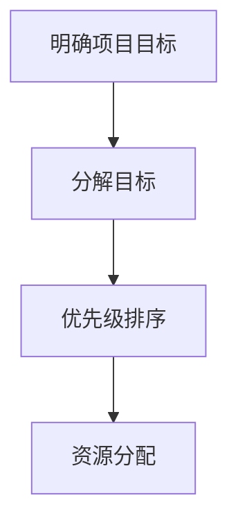

**项目计划与跟踪**：项目计划是项目管理中的关键环节，它规定了项目的执行路径和时间安排。结构化思维在项目计划与跟踪中发挥着重要作用：

1. **项目计划制定**：通过分析项目目标、资源情况和时间限制，制定详细的计划。计划应包括每个任务的开始和结束时间、负责人和所需的资源。
2. **项目跟踪**：使用工具如Gantt图或PERT图，实时监控项目进度。通过对比实际进度和计划进度，项目经理可以及时发现偏差并采取纠正措施。

以下是一个使用Mermaid流程图表示的项目计划与跟踪过程：

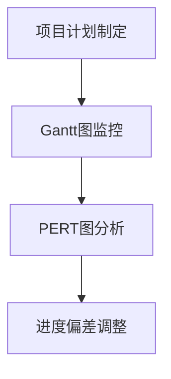

**项目风险管理**：项目风险是项目管理中不可避免的一部分。通过结构化思维，项目经理可以更有效地识别和管理项目风险。

1. **风险识别**：通过收集和分析项目相关信息，识别可能影响项目成功的风险因素。
2. **风险评估**：对识别出的风险进行评估，确定其发生的概率和潜在影响。
3. **风险应对**：制定应对措施，降低风险发生概率或减轻其影响。

以下是一个使用Mermaid流程图表示的项目风险管理过程：

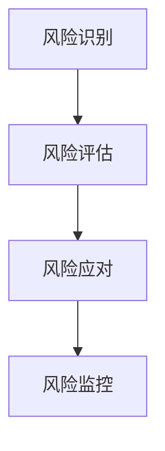

**决策制定**：在项目管理中，决策是经常需要进行的活动。结构化思维提供了一个明确的决策框架，帮助项目经理做出更加合理的决策：

1. **问题定义**：明确需要解决的问题和决策目标。
2. **信息收集**：收集与决策相关的所有信息。
3. **分析选项**：列出所有可能的解决方案，分析其优缺点。
4. **选择最佳方案**：根据分析结果，选择最佳解决方案。
5. **执行决策**：实施所选方案，并监控决策效果。

以下是一个使用Mermaid流程图表示的决策制定过程：

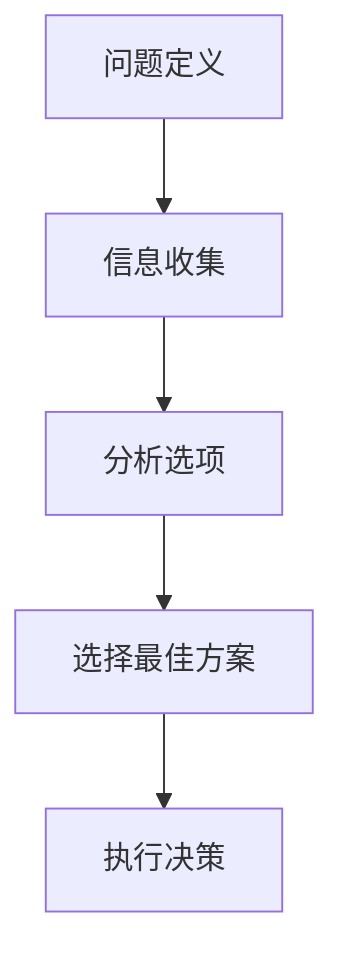

通过在项目管理中应用结构化思维，项目经理可以更清晰地定义项目目标、更有效地制定和跟踪项目计划、更全面地管理项目风险，并做出更加合理的决策。这些措施有助于提高项目的成功率，确保项目按时、按质量完成。接下来，我们将探讨结构化思维在决策与问题解决中的应用。

### 第6章：结构化思维在决策与问题解决中的应用

在决策与问题解决过程中，结构化思维能够提供一种系统化、条理化的思考方式，帮助决策者更好地分析问题，评估各种解决方案，并选择最佳方案。以下将详细探讨结构化思维在决策与问题解决中的应用。

#### 6.1 决策过程中的结构化思维

**问题定义**：在决策过程中，首先需要明确需要解决的问题。这一步骤是整个决策过程的基础。通过结构化思维，我们可以确保问题定义的清晰和准确。

1. **明确问题**：具体、详细地描述问题的本质，包括问题的背景、现状以及需要解决的问题。
2. **分析问题**：分析问题的各个方面，包括问题的原因、影响和潜在解决方案。

以下是一个使用Mermaid流程图表示的问题定义过程：

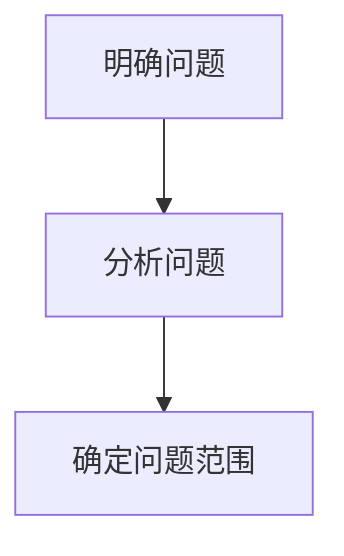

**信息收集**：在明确问题后，需要收集与问题相关的所有信息。这些信息可以是数据、事实、文献、专家意见等。

1. **确定信息来源**：选择可靠的信息来源，确保信息的准确性和相关性。
2. **收集信息**：通过调查、访谈、文献查阅等方式，收集与问题相关的信息。

以下是一个使用Mermaid流程图表示的信息收集过程：

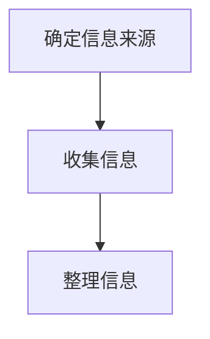

**分析选项**：在收集到足够的信息后，需要分析各种可能的解决方案。这一步骤是决策过程的核心。

1. **列出选项**：列出所有可能的解决方案，确保不遗漏任何可能的选项。
2. **评估选项**：对每个选项进行评估，包括其优缺点、可行性、潜在风险等。

以下是一个使用Mermaid流程图表示的选项分析过程：

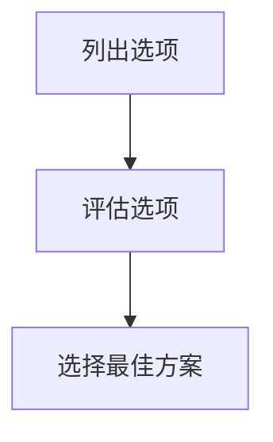

**选择最佳方案**：在评估所有选项后，选择最佳方案。这一步骤需要综合考虑各种因素，确保所选方案能够解决问题，并具有实施可行性。

1. **权衡利弊**：权衡每个选项的优缺点，确保所选方案是最优的。
2. **确定决策**：根据评估结果，选择最佳方案，并明确实施计划。

以下是一个使用Mermaid流程图表示的选择最佳方案过程：

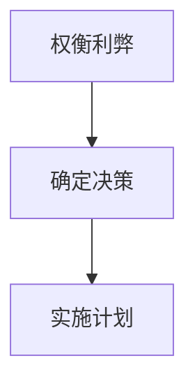

**执行决策**：在决策制定后，需要将其转化为具体的行动方案，并执行。

1. **制定行动方案**：根据决策结果，制定具体的行动方案，包括任务分配、时间表、资源需求等。
2. **执行与监控**：执行行动方案，并实时监控执行过程，确保决策得到有效实施。

以下是一个使用Mermaid流程图表示的执行决策过程：

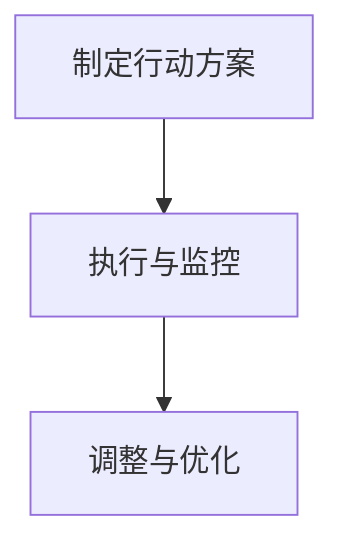

通过在决策过程中应用结构化思维，决策者可以更清晰地定义问题、更全面地收集信息、更深入地分析选项，并最终做出更加合理和有效的决策。这些步骤有助于提高决策的质量，减少错误和失误。接下来，我们将探讨结构化思维在问题解决中的应用。

#### 6.2 问题解决中的结构化思维

在问题解决过程中，结构化思维提供了一种系统化的方法，帮助解决复杂的问题。以下步骤有助于我们有效地应用结构化思维解决问题。

**问题定义**：在问题解决的第一步，需要明确问题的本质和范围。通过结构化思维，我们可以更准确地定义问题，确保不遗漏关键信息。

1. **问题描述**：具体、详细地描述问题的现状，包括问题的背景、影响和具体表现。
2. **问题分析**：分析问题的各个方面，包括问题的原因、影响因素和可能的解决方案。

以下是一个使用Mermaid流程图表示的问题定义过程：

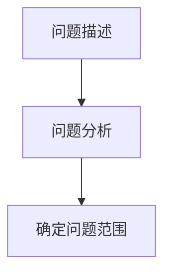

**信息收集**：在明确问题后，需要收集与问题相关的所有信息。这些信息可以是数据、事实、文献、专家意见等。

1. **确定信息来源**：选择可靠的信息来源，确保信息的准确性和相关性。
2. **收集信息**：通过调查、访谈、文献查阅等方式，收集与问题相关的信息。

以下是一个使用Mermaid流程图表示的信息收集过程：


**分析解决方案**：在收集到足够的信息后，需要分析各种可能的解决方案。这一步骤是问题解决过程的核心。

1. **列出解决方案**：列出所有可能的解决方案，确保不遗漏任何可能的选项。
2. **评估解决方案**：对每个解决方案进行评估，包括其优缺点、可行性、潜在风险等。

以下是一个使用Mermaid流程图表示的解决方案分析过程：

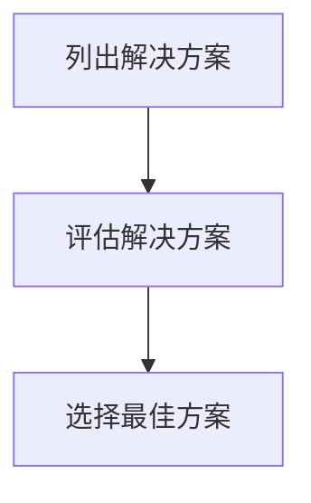

**选择最佳方案**：在评估所有解决方案后，选择最佳方案。这一步骤需要综合考虑各种因素，确保所选方案能够解决问题，并具有实施可行性。

1. **权衡利弊**：权衡每个解决方案的优缺点，确保所选方案是最优的。
2. **确定方案**：根据评估结果，选择最佳方案，并明确实施计划。

以下是一个使用Mermaid流程图表示的选择最佳方案过程：


**实施与监控**：在方案确定后，需要将其转化为具体的行动方案，并执行。

1. **制定行动方案**：根据所选方案，制定具体的行动方案，包括任务分配、时间表、资源需求等。
2. **执行与监控**：执行行动方案，并实时监控执行过程，确保方案得到有效实施。

以下是一个使用Mermaid流程图表示的实施与监控过程：

```mermaid
graph TD
A[制定行动方案] --> B[执行与监控]
B --> C[调整与优化]
```

**调整与优化**：在问题解决过程中，需要根据实际情况不断调整和优化方案。

1. **监控效果**：监控方案实施的效果，确保问题得到有效解决。
2. **反馈与改进**：根据监控结果，及时调整方案，优化问题解决过程。

以下是一个使用Mermaid流程图表示的调整与优化过程：

```mermaid
graph TD
A[监控效果] --> B[反馈与改进]
B --> C[优化方案]
```

通过在问题解决过程中应用结构化思维，我们可以更系统地分析问题、更全面地评估解决方案，并选择最佳方案进行实施。这些步骤有助于提高问题解决的成功率，确保问题得到有效解决。接下来，我们将探讨结构化思维在创新思维中的应用。

#### 6.3 创新思维与结构化思维

创新思维是推动科技进步和社会发展的重要动力。结构化思维作为一种系统化的思考方式，能够为创新思维提供有力的支持。以下将详细探讨结构化思维在创新思维中的应用。

**问题定义**：创新思维的第一步是明确需要解决的问题或机会。通过结构化思维，我们可以更系统地定义问题，确保问题的范围和目标清晰。

1. **描述问题**：具体、详细地描述需要解决的问题，包括问题的背景、现状和影响。
2. **分析问题**：分析问题的各个方面，包括问题的原因、影响因素和潜在的解决方案。

以下是一个使用Mermaid流程图表示的问题定义过程：

```mermaid
graph TD
A[描述问题] --> B[分析问题]
B --> C[确定问题范围]
```

**信息收集**：在明确问题后，需要收集与问题相关的所有信息。这些信息可以是市场数据、技术文献、用户反馈等。

1. **确定信息来源**：选择可靠的信息来源，确保信息的准确性和相关性。
2. **收集信息**：通过调查、访谈、文献查阅等方式，收集与问题相关的信息。

以下是一个使用Mermaid流程图表示的信息收集过程：

```mermaid
graph TD
A[确定信息来源] --> B[收集信息]
B --> C[整理信息]
```

**分析解决方案**：在收集到足够的信息后，需要分析各种可能的解决方案。这一步骤是创新思维的核心。

1. **列出解决方案**：列出所有可能的解决方案，确保不遗漏任何可能的选项。
2. **评估解决方案**：对每个解决方案进行评估，包括其优缺点、可行性、潜在风险等。

以下是一个使用Mermaid流程图表示的解决方案分析过程：

```mermaid
graph TD
A[列出解决方案] --> B[评估解决方案]
B --> C[选择最佳方案]
```

**选择最佳方案**：在评估所有解决方案后，选择最佳方案。这一步骤需要综合考虑各种因素，确保所选方案能够解决问题，并具有实施可行性。

1. **权衡利弊**：权衡每个解决方案的优缺点，确保所选方案是最优的。
2. **确定方案**：根据评估结果，选择最佳方案，并明确实施计划。

以下是一个使用Mermaid流程图表示的选择最佳方案过程：

```mermaid
graph TD
A[权衡利弊] --> B[确定方案]
B --> C[实施计划]
```

**实施与监控**：在方案确定后，需要将其转化为具体的行动方案，并执行。

1. **制定行动方案**：根据所选方案，制定具体的行动方案，包括任务分配、时间表、资源需求等。
2. **执行与监控**：执行行动方案，并实时监控执行过程，确保方案得到有效实施。

以下是一个使用Mermaid流程图表示的实施与监控过程：

```mermaid
graph TD
A[制定行动方案] --> B[执行与监控]
B --> C[调整与优化]
```

**调整与优化**：在创新过程中，需要根据实际情况不断调整和优化方案。

1. **监控效果**：监控方案实施的效果，确保问题得到有效解决。
2. **反馈与改进**：根据监控结果，及时调整方案，优化创新过程。

以下是一个使用Mermaid流程图表示的调整与优化过程：

```mermaid
graph TD
A[监控效果] --> B[反馈与改进]
B --> C[优化方案]
```

通过在创新思维中应用结构化思维，我们可以更系统地定义问题、更全面地评估解决方案，并选择最佳方案进行实施。这些步骤有助于提高创新思维的质量和效率，推动科技的进步和社会的发展。接下来，我们将探讨结构化思维在沟通与团队协作中的应用。

#### 6.4 结构化思维在沟通与团队协作中的应用

在沟通与团队协作中，结构化思维能够帮助团队成员更清晰、更有效地传达信息，提高团队的整体工作效率。以下将详细探讨结构化思维在沟通与团队协作中的应用。

**沟通中的结构化思维**：

1. **明确目标**：在沟通前，明确沟通的目标和目的。这有助于确保沟通的方向和重点始终一致。

2. **信息整理**：在沟通时，将需要传达的信息进行结构化整理。这可以通过制作大纲、思维导图或使用结构化的文档格式来实现。

3. **条理清晰**：确保沟通内容有条理，逐步展开。这有助于听众更好地理解和吸收信息。

4. **反馈与确认**：在沟通结束后，询问听众是否理解了所传达的信息，并确认关键信息的正确性。

以下是一个使用Mermaid流程图表示的沟通过程：

```mermaid
graph TD
A[明确目标] --> B[信息整理]
B --> C[条理清晰]
C --> D[反馈与确认]
```

**团队协作中的结构化思维**：

1. **角色分工**：在团队协作前，明确每个成员的角色和职责。这有助于确保团队任务的分配合理，提高工作效率。

2. **任务分解**：将大型任务分解为具体的子任务，并分配给相应的团队成员。这有助于团队成员明确自己的任务，并制定具体的行动计划。

3. **进度跟踪**：使用项目管理系统或工具，实时监控任务进度。这有助于及时发现和解决问题，确保项目按时完成。

4. **团队协作**：鼓励团队成员之间的沟通与协作，共同解决问题。这可以通过定期会议、工作坊或在线协作工具来实现。

5. **反馈与调整**：在项目执行过程中，及时收集团队成员的反馈，并根据反馈进行调整。这有助于提高项目的质量和效率。

以下是一个使用Mermaid流程图表示的团队协作过程：

```mermaid
graph TD
A[角色分工] --> B[任务分解]
B --> C[进度跟踪]
C --> D[团队协作]
D --> E[反馈与调整]
```

**结构化思维在冲突解决中的应用**：

在团队协作中，冲突是不可避免的。通过结构化思维，我们可以更有效地解决冲突。

1. **识别冲突**：在冲突发生时，及时识别冲突的类型和原因。这可以通过询问团队成员、观察行为或分析沟通记录来实现。

2. **分析冲突**：分析冲突的各个方面，包括冲突的原因、涉及的人员、影响范围等。

3. **制定解决方案**：根据冲突分析结果，制定具体的解决方案。这可以通过谈判、妥协或制定新的协议来实现。

4. **实施解决方案**：将解决方案转化为具体的行动计划，并执行。

5. **反馈与评估**：在解决方案实施后，收集团队成员的反馈，评估解决方案的效果，并根据反馈进行调整。

以下是一个使用Mermaid流程图表示的冲突解决过程：

```mermaid
graph TD
A[识别冲突] --> B[分析冲突]
B --> C[制定解决方案]
C --> D[实施解决方案]
D --> E[反馈与评估]
```

通过在沟通与团队协作中应用结构化思维，团队成员可以更清晰、更有效地传达信息，提高团队的整体工作效率。同时，结构化思维在冲突解决中的应用也有助于维护团队的和谐与稳定，促进项目成功。接下来，我们将探讨结构化思维在创新与创业中的应用。

### 第8章：结构化思维在创新与创业中的应用

在创新与创业领域中，结构化思维发挥着至关重要的作用，它不仅能够帮助创业者明确创新方向，还能在创业项目的全过程中提供系统化的支持，确保项目从构思到实现的高效推进。以下将详细探讨结构化思维在创新与创业中的应用。

#### 8.1 创新思维与结构化思维

创新思维是创业的核心驱动力，而结构化思维则为创新提供了逻辑和系统性的支持。以下步骤展示了如何将结构化思维应用于创新思维：

**定义创新问题**：首先，创业者需要明确创新的目标和问题。通过结构化思维，可以将创新问题分解为具体的子问题，以便更好地理解和解决。

1. **描述问题**：明确创新问题的背景、现状和目标。
2. **分析问题**：分析问题的各个方面，包括问题的原因、影响和潜在解决方案。

以下是一个使用Mermaid流程图表示的问题定义过程：

```mermaid
graph TD
A[描述问题] --> B[分析问题]
B --> C[确定创新方向]
```

**信息收集**：在明确创新问题后，需要收集与问题相关的所有信息。这些信息可以是市场调研、用户反馈、技术文献等。

1. **确定信息来源**：选择可靠的信息来源，确保信息的准确性和相关性。
2. **收集信息**：通过调查、访谈、文献查阅等方式，收集与问题相关的信息。

以下是一个使用Mermaid流程图表示的信息收集过程：

```mermaid
graph TD
A[确定信息来源] --> B[收集信息]
B --> C[整理信息]
```

**分析解决方案**：在收集到足够的信息后，需要分析各种可能的解决方案。这一步骤是创新思维的核心。

1. **列出解决方案**：列出所有可能的解决方案，确保不遗漏任何可能的选项。
2. **评估解决方案**：对每个解决方案进行评估，包括其优缺点、可行性、潜在风险等。

以下是一个使用Mermaid流程图表示的解决方案分析过程：

```mermaid
graph TD
A[列出解决方案] --> B[评估解决方案]
B --> C[选择最佳方案]
```

**选择最佳方案**：在评估所有解决方案后，选择最佳方案。这一步骤需要综合考虑各种因素，确保所选方案能够实现创新目标，并具有实施可行性。

1. **权衡利弊**：权衡每个解决方案的优缺点，确保所选方案是最优的。
2. **确定方案**：根据评估结果，选择最佳方案，并明确实施计划。

以下是一个使用Mermaid流程图表示的选择最佳方案过程：

```mermaid
graph TD
A[权衡利弊] --> B[确定方案]
B --> C[实施计划]
```

**实施与监控**：在方案确定后，需要将其转化为具体的行动方案，并执行。

1. **制定行动方案**：根据所选方案，制定具体的行动方案，包括任务分配、时间表、资源需求等。
2. **执行与监控**：执行行动方案，并实时监控执行过程，确保方案得到有效实施。

以下是一个使用Mermaid流程图表示的实施与监控过程：

```mermaid
graph TD
A[制定行动方案] --> B[执行与监控]
B --> C[调整与优化]
```

**调整与优化**：在创新过程中，需要根据实际情况不断调整和优化方案。

1. **监控效果**：监控方案实施的效果，确保创新目标得到实现。
2. **反馈与改进**：根据监控结果，及时调整方案，优化创新过程。

以下是一个使用Mermaid流程图表示的调整与优化过程：

```mermaid
graph TD
A[监控效果] --> B[反馈与改进]
B --> C[优化方案]
```

通过在创新思维中应用结构化思维，创业者可以更系统地分析问题、更全面地评估解决方案，并选择最佳方案进行实施。这些步骤有助于提高创新思维的质量和效率，推动创业项目的成功。

#### 8.2 创业过程中的结构化思维

在创业过程中，结构化思维能够帮助创业者更好地规划和管理项目，确保项目的顺利推进。以下将详细探讨结构化思维在创业过程中的应用。

**创业项目构思**：在创业项目构思阶段，创业者需要运用结构化思维明确项目的目标和愿景。

1. **项目定义**：明确创业项目的具体目标和愿景，确保目标具体、可衡量、可实现、相关性强并有时限（SMART原则）。
2. **市场分析**：通过结构化思维，对目标市场进行详细分析，包括市场规模、竞争对手、用户需求等。

以下是一个使用Mermaid流程图表示的创业项目构思过程：

```mermaid
graph TD
A[项目定义] --> B[市场分析]
B --> C[产品定位]
```

**创业项目规划**：在创业项目规划阶段，创业者需要制定详细的计划，确保项目有明确的执行路径。

1. **项目分解**：将创业项目分解为具体的子任务，并确定每个任务的开始和结束时间。
2. **资源分配**：根据项目需求，合理分配人力资源、财务资源和物资资源。

以下是一个使用Mermaid流程图表示的创业项目规划过程：

```mermaid
graph TD
A[项目分解] --> B[资源分配]
B --> C[时间安排]
```

**创业项目执行**：在创业项目执行阶段，创业者需要确保项目按照计划顺利进行。

1. **任务分配**：将子任务分配给相应的团队成员，确保每个团队成员明确自己的职责和任务。
2. **进度监控**：使用项目管理工具，实时监控项目进度，确保项目按计划推进。

以下是一个使用Mermaid流程图表示的创业项目执行过程：

```mermaid
graph TD
A[任务分配] --> B[进度监控]
B --> C[问题解决]
```

**创业项目评估与风险控制**：在创业项目评估与风险控制阶段，创业者需要定期评估项目进展，并识别和管理潜在风险。

1. **项目评估**：定期对项目进展进行评估，确保项目目标得到实现。
2. **风险识别**：通过结构化思维，识别项目中的潜在风险，并制定相应的应对措施。
3. **风险监控**：实时监控风险状况，确保风险得到有效控制。

以下是一个使用Mermaid流程图表示的创业项目评估与风险控制过程：

```mermaid
graph TD
A[项目评估] --> B[风险识别]
B --> C[风险监控]
C --> D[风险应对]
```

通过在创业过程中应用结构化思维，创业者可以更清晰地定义项目目标、更有效地制定和执行项目计划、更全面地评估项目进展，并有效管理项目风险。这些措施有助于提高创业项目的成功率，推动创业梦想的实现。接下来，我们将通过具体案例研究，展示结构化思维在实际创业项目中的应用。

### 第9章：案例研究

#### 9.1 案例一：某公司产品开发中的结构化思维应用

在某公司新产品的开发过程中，结构化思维发挥了至关重要的作用，帮助团队顺利实现了产品从概念到市场的全流程管理。以下是该案例的具体过程。

**项目定义**：在项目启动阶段，公司明确新产品需要解决的核心问题，即提高用户体验和提升市场竞争力。通过结构化思维，团队将目标分解为具体的子目标，包括用户界面优化、功能增强和性能提升。

**市场分析**：在明确项目目标后，团队进行了详细的市场分析。通过收集用户反馈、分析竞争对手产品和行业趋势，团队确定了产品的市场定位和用户需求。

**需求收集**：团队通过问卷调查、用户访谈和焦点小组讨论，收集了大量的用户需求信息。这些信息被整理成结构化的需求文档，为后续的产品设计提供了依据。

**产品设计**：基于需求文档，团队进行了产品设计的初步方案。通过头脑风暴和迭代讨论，团队确定了产品的核心功能和界面布局。设计过程中，结构化思维帮助团队明确了每个功能模块的实现方式和优先级。

**开发与测试**：在产品开发阶段，团队使用结构化思维制定了详细的开发计划和测试策略。每个开发任务都被分解为具体的小任务，并分配给相应的开发人员。测试过程中，团队通过自动化测试和手动测试，确保产品的功能和质量达到预期。

**上市推广**：在产品准备上市时，团队再次运用结构化思维，制定了详细的推广计划。包括市场宣传、渠道布局和用户反馈收集等环节。通过结构化思维，团队确保了推广计划的有序执行，并能够根据用户反馈及时调整推广策略。

**效果评估**：产品上市后，团队定期收集用户反馈和市场数据，评估产品的市场表现。通过结构化思维，团队能够系统地分析产品优势和不足，为后续的产品迭代提供了宝贵的数据支持。

**案例总结**：通过结构化思维的系统化应用，该公司新产品顺利从概念阶段发展到市场推广阶段。结构化思维帮助团队明确了项目目标、优化了产品设计、提升了开发效率，并有效管理了产品上市的风险。

#### 9.2 案例二：某市政府项目中的结构化思维应用

在某市政府的一项大型基础设施项目中，结构化思维被广泛应用于项目的规划、执行和评估，确保项目的高效推进和成功实施。

**项目定义**：在项目启动阶段，市政府明确了项目的目标，即建设一个现代化的交通枢纽，提升城市的交通效率和公共服务水平。通过结构化思维，项目团队将目标分解为具体的子目标，包括道路建设、交通设施优化和周边环境改善。

**需求分析**：在明确项目目标后，项目团队进行了详细的需求分析。通过问卷调查、现场调研和专家咨询，团队收集了市民、企业和相关利益方的需求和建议。这些需求被整理成结构化的需求文档，为后续的设计和规划提供了依据。

**项目规划**：基于需求分析结果，项目团队制定了详细的项目规划。结构化思维帮助团队明确了每个阶段的目标和任务，制定了时间表和资源分配计划。规划过程中，团队通过Gantt图和PERT图，确保了项目进度的合理性和可行性。

**项目执行**：在项目执行阶段，团队按照项目规划有序推进。结构化思维在任务分配、进度监控和质量控制中发挥了重要作用。团队通过定期的进度汇报和项目评审，确保项目按照计划进行，并及时调整和优化项目执行策略。

**风险评估与控制**：项目过程中，团队通过结构化思维识别了潜在的风险，并制定了相应的风险管理计划。风险监控和评估贯穿项目始终，确保了项目的安全性和可靠性。

**项目评估**：在项目完成后，市政府对项目进行了全面的评估。通过结构化思维，团队分析了项目的成果和影响，包括交通效率的提升、市民满意度的增加和城市环境的改善。评估结果为市政府提供了宝贵的反馈，为未来的项目提供了参考。

**案例总结**：通过结构化思维的系统化应用，某市政府的大型基础设施项目取得了显著成效。结构化思维帮助团队明确了项目目标、优化了项目规划、提升了项目执行效率，并有效管理了项目风险。项目的成功实施提升了市政府的公信力和市民的满意度。

#### 9.3 案例三：某创业项目中的结构化思维应用

某初创公司在开发一款基于人工智能的智能家居系统中，充分运用了结构化思维，实现了从产品构思到市场推广的全面管理。

**项目定义**：在项目启动阶段，公司明确了智能家居系统的目标，即通过人工智能技术提升用户的家居体验，满足用户对智能化、便捷化和安全性的需求。通过结构化思维，团队将目标分解为具体的子目标，包括智能语音控制、家居设备互联互通和安全隐私保护。

**市场分析**：在明确项目目标后，团队进行了详细的市场分析。通过用户调研和数据分析，团队确定了目标用户群体的需求和偏好。市场分析结果被整理成结构化的市场文档，为后续的产品设计和开发提供了依据。

**产品开发**：在产品开发阶段，团队采用敏捷开发方法，通过迭代和增量式开发，逐步实现产品的功能模块。结构化思维帮助团队在需求分析、设计评审和代码实现过程中，保持清晰的思路和高效的协作。

**测试与优化**：在产品开发完成后，团队进行了全面的测试和优化。通过自动化测试和用户体验测试，团队确保了产品的稳定性和用户体验。结构化思维在测试计划的制定、测试用例的编写和测试结果的评估中发挥了重要作用。

**市场推广**：在产品准备上市时，团队制定了详细的市场推广计划。通过社交媒体、线上广告和线下活动，团队有效提升了产品的知名度和用户认可度。结构化思维在推广策略的制定、市场反馈的收集和推广效果的评估中发挥了关键作用。

**效果评估**：产品上市后，团队定期收集用户反馈和市场数据，评估产品的市场表现和用户满意度。通过结构化思维，团队能够系统地分析产品的优势和不足，为后续的产品迭代和改进提供了数据支持。

**案例总结**：通过结构化思维的系统化应用，该初创公司的智能家居系统成功实现了从构思到市场推广的全程管理。结构化思维帮助团队明确了项目目标、优化了产品设计和开发流程、提升了市场推广效果，并有效管理了项目风险。产品的成功推出不仅提升了公司的市场竞争力，也为智能家居行业的发展做出了积极贡献。

### 第10章：总结与展望

结构化思维作为一种系统化的思考方式，已在多个领域展现了其独特的重要性和广泛的应用价值。通过本文的探讨，我们可以看到结构化思维在项目管理、决策分析、沟通协作、创新与创业等领域的广泛应用，为复杂问题的解决提供了有力的工具。

#### 10.1 结构化思维的应用现状

目前，结构化思维已被广泛应用于企业管理、项目管理、技术创新、学术研究等多个领域。在企业管理中，结构化思维帮助管理者更好地规划项目、分配资源、监控进度和风险管理。在项目管理中，结构化思维提供了清晰的逻辑框架，提高了项目的成功率和效率。在技术创新中，结构化思维有助于研究者系统地分析和解决问题，推动新技术的快速研发和应用。在学术研究中，结构化思维帮助学者们更好地组织研究成果、撰写高质量的论文和进行学术交流。

尽管结构化思维在多个领域得到了广泛应用，但其在实际应用中仍存在一些挑战和限制。例如，在一些领域，结构化思维的应用可能受到现有技术和资源的限制。此外，结构化思维要求个体具备较强的逻辑思维和分析能力，这对于部分人员来说可能存在一定的难度。

#### 10.2 未来发展趋势

随着信息技术的不断发展和认知科学研究的深入，结构化思维在未来有望进一步优化和扩展。以下是一些可能的发展趋势：

1. **人工智能与结构化思维的融合**：人工智能技术的发展为结构化思维提供了新的可能性。通过结合自然语言处理、机器学习和知识图谱等技术，人工智能可以辅助人类进行结构化思维，提供更智能的建议和决策支持。

2. **跨学科应用**：结构化思维作为一种通用的思考工具，将在更多跨学科领域得到应用。例如，在生物医学、环境保护、社会管理等领域，结构化思维可以帮助研究者更好地处理复杂问题，提高科研和管理的效率。

3. **个性化结构化思维**：未来的结构化思维将更加注重个性化。通过分析个体的思维习惯和偏好，可以为每个人量身定制适合的结构化思维工具和方法，提高个体的思维效率和质量。

4. **知识管理与结构化思维的结合**：知识管理是企业和组织的重要资产。将结构化思维与知识管理相结合，可以帮助企业和组织更好地管理和利用知识，提高创新能力和竞争力。

#### 10.3 深入学习与资源推荐

为了更好地理解和应用结构化思维，以下是一些推荐的学习资源：

1. **书籍推荐**：
   - 《结构化思维》
   - 《思考，快与慢》
   - 《如何提出好问题》

2. **在线课程**：
   - Coursera上的《结构化思维与决策》
   - edX上的《项目管理：理论与实践》

3. **工具与平台**：
   - MindManager：一款功能强大的思维导图工具
   - Miro：一款在线协作白板工具，适合团队头脑风暴和项目规划

通过学习和实践结构化思维，我们可以提高思维质量，提升工作效率，更好地应对复杂问题的挑战。希望本文能够为读者在理解和应用结构化思维方面提供有益的指导。

### 附录A：结构化思维工具与资源

结构化思维不仅依赖于理论知识，还需要借助一系列工具和资源来实践和深化。以下是一些常用的结构化思维工具和推荐的资源。

#### A.1 结构化思维工具介绍

1. **思维导图**：
   - **MindManager**：一款功能强大的思维导图软件，可以帮助用户绘制复杂的思维网络，提高思维条理性和可视化效果。
   - **XMind**：一款免费开源的思维导图工具，适用于个人和企业用户，支持多种操作系统。

2. **项目管理工具**：
   - **Trello**：一款直观的在线项目管理工具，通过卡片和看板的形式，帮助团队跟踪项目进度。
   - **Asana**：一款专业的项目管理平台，支持任务分配、进度跟踪和团队协作。

3. **文档管理工具**：
   - **Google Docs**：一款在线文档编辑工具，支持多人协作，实时更新。
   - **Notion**：一款强大的笔记和知识管理工具，适用于记录、组织和分享结构化信息。

#### A.2 结构化思维相关书籍推荐

1. **《结构化思维》**：
   - 作者：[唐纳德·高斯林]（Donald G. Gause）
   - 简介：本书详细介绍了结构化思维的原理和应用，帮助读者掌握系统化、条理化的思考方法。

2. **《思考，快与慢》**：
   - 作者：[丹尼尔·卡尼曼]（Daniel Kahneman）
   - 简介：本书探讨了人类思维的两种系统——快速直觉思维和慢速逻辑思维，对结构化思维提供了深刻的洞见。

3. **《如何提出好问题》**：
   - 作者：[威廉·珀西瓦尔]（William Perry）
   - 简介：本书介绍了有效提问的技巧，帮助读者通过提问提高思考质量，发现问题的本质。

#### A.3 结构化思维在线课程与工作坊

1. **Coursera上的《结构化思维与决策》**：
   - 课程内容：本课程由康奈尔大学教授主讲，涵盖了结构化思维的基础理论和实践应用，适合初学者和有一定基础的读者。

2. **edX上的《项目管理：理论与实践》**：
   - 课程内容：本课程通过实际案例，讲解了项目管理中的结构化思维方法，包括项目规划、执行和监控。

3. **LinkedIn Learning上的《思维导图与结构化思维》**：
   - 课程内容：本课程介绍了如何使用思维导图工具进行结构化思维，包括绘制思维导图、优化思维流程等。

通过使用这些工具和资源，读者可以更好地实践结构化思维，提高分析和解决问题的能力。希望这些推荐能够为读者的学习和实践提供有益的帮助。

