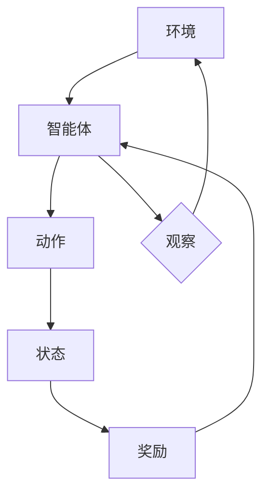

                 

# 美团2024酒店智能定价校招强化学习面试题详解

> **关键词：** 强化学习、智能定价、美团、面试题、算法详解、深度学习

> **摘要：** 本文将详细解析美团2024酒店智能定价校招中涉及到的强化学习面试题，涵盖强化学习基础理论、核心算法、深度强化学习以及多智能体强化学习。同时，通过实际项目案例，展示如何将强化学习应用于酒店智能定价问题，并提供面试题解析及学习资源推荐。

## 目录大纲

### 第一部分：强化学习基础理论

#### 第1章：强化学习概述

- 1.1 强化学习的基本概念

- 1.2 强化学习的数学模型

- 1.3 强化学习与监督学习的区别

#### 第2章：强化学习算法原理

- 2.1 Q-Learning算法

  - Q-Learning算法原理与伪代码

  - Q-Learning算法的优缺点分析

- 2.2 SARSA算法

  - SARSA算法原理与伪代码

  - SARSA算法的优缺点分析

- 2.3 Deep Q-Network（DQN）算法

  - DQN算法原理与伪代码

  - DQN算法的优势与挑战

#### 第3章：策略梯度算法

- 3.1 Policy Gradient算法

  - PG算法原理与伪代码

  - PG算法的优缺点分析

- 3.2 Actor-Critic算法

  - AC算法原理与伪代码

  - AC算法的优势与挑战

#### 第4章：深度强化学习

- 4.1 Deep Deterministic Policy Gradient（DDPG）算法

  - DDPG算法原理与伪代码

  - DDPG算法的优势与挑战

- 4.2 Asynchronous Advantage Actor-Critic（A3C）算法

  - A3C算法原理与伪代码

  - A3C算法的优势与挑战

#### 第5章：多智能体强化学习

- 5.1 多智能体强化学习概述

- 5.2 Multi-Agent Deep Q-Learning（MADDPG）算法

  - MADDPG算法原理与伪代码

  - MADDPG算法的优势与挑战

### 第二部分：美团酒店智能定价案例

#### 第6章：美团酒店业务概述

- 6.1 美团酒店业务发展历程

- 6.2 酒店智能定价的意义与挑战

#### 第7章：酒店智能定价模型设计

- 7.1 智能定价模型总体框架

- 7.2 数据采集与预处理

- 7.3 特征工程

- 7.4 模型选择与训练

- 7.5 模型评估与优化

#### 第8章：美团酒店智能定价实战

- 8.1 实战案例1：基于强化学习的酒店定价策略

  - 实战背景

  - 实战步骤

  - 实战效果分析

- 8.2 实战案例2：基于深度强化学习的酒店定价策略

  - 实战背景

  - 实战步骤

  - 实战效果分析

### 第三部分：强化学习面试题与解析

#### 第9章：强化学习面试题概览

- 9.1 强化学习基本概念题

- 9.2 强化学习算法题

- 9.3 深度强化学习题

- 9.4 多智能体强化学习题

#### 第10章：强化学习面试题解析

- 10.1 面试题1：如何解决强化学习中的探索与利用问题？

- 10.2 面试题2：简述Q-Learning算法的工作原理及优缺点。

- 10.3 面试题3：深度强化学习中的DQN算法是如何工作的？

- 10.4 面试题4：如何评估一个强化学习算法的性能？

- 10.5 面试题5：如何设计一个基于深度强化学习的智能定价模型？

### 附录

#### 附录A：强化学习相关资源

- A.1 主流强化学习算法Python代码实现

- A.2 强化学习论文推荐

- A.3 强化学习在线教程与课程推荐

#### 附录B：核心概念与联系

- B.1 强化学习数学模型Mermaid流程图

- B.2 强化学习算法原理与伪代码

## 前言

本文旨在为参加美团2024酒店智能定价校招的考生提供强化学习面试题的详解。强化学习作为近年来人工智能领域的重要突破，被广泛应用于智能决策、推荐系统、游戏AI等领域。美团酒店智能定价作为一项典型的应用场景，对强化学习技术提出了较高的要求。本文将分三个部分进行讲解：

1. **强化学习基础理论**：介绍强化学习的基本概念、数学模型及常见算法。

2. **美团酒店智能定价案例**：分析美团酒店业务，设计智能定价模型，并展示实际应用案例。

3. **强化学习面试题解析**：针对校招面试中可能涉及的强化学习问题，提供详细解析。

通过本文的讲解，希望读者能够深入理解强化学习的基本原理，掌握常见算法，并能够将强化学习应用于实际业务场景中。同时，本文也适合强化学习初学者作为学习资料，帮助读者快速入门并掌握强化学习技术。

## 强化学习基础理论

### 第1章：强化学习概述

#### 1.1 强化学习的基本概念

强化学习（Reinforcement Learning，简称RL）是机器学习的一个重要分支，主要研究如何通过智能体（agent）在与环境（environment）的交互过程中，通过学习策略（policy）来最大化累积奖励（reward）。与监督学习和无监督学习不同，强化学习强调的是智能体在动态环境中通过试错（trial-and-error）和经验（experience）进行学习，从而实现决策优化。

强化学习的主要概念包括：

- **智能体（Agent）**：执行动作并接收环境反馈的实体。

- **环境（Environment）**：与智能体交互的物理或虚拟环境。

- **状态（State）**：描述环境当前状态的变量集合。

- **动作（Action）**：智能体在某一状态下可以执行的操作。

- **奖励（Reward）**：描述智能体执行某一动作后获得的即时反馈信号。

- **策略（Policy）**：智能体在特定状态下的最优动作选择策略。

- **价值函数（Value Function）**：预测智能体在特定状态下执行特定动作所能获得的累积奖励。

#### 1.2 强化学习的数学模型

强化学习可以抽象为一个马尔可夫决策过程（Markov Decision Process，简称MDP），其数学模型包括以下几个组成部分：

- **状态空间（State Space）**：\( S = \{ s_1, s_2, \ldots, s_n \} \)，描述所有可能的状态。

- **动作空间（Action Space）**：\( A = \{ a_1, a_2, \ldots, a_m \} \)，描述所有可能的动作。

- **状态转移概率（State Transition Probability）**：\( P(s' | s, a) \)，描述在当前状态\( s \)下执行动作\( a \)后，智能体转移到状态\( s' \)的概率。

- **奖励函数（Reward Function）**：\( R(s, a) \)，描述在状态\( s \)下执行动作\( a \)后获得的奖励。

- **策略（Policy）**：\( \pi(a | s) \)，描述在状态\( s \)下执行动作\( a \)的概率。

强化学习的目标是通过学习策略来最大化累积奖励。一个经典的强化学习问题可以表示为以下形式：

\[ \pi^* = \arg\max_\pi \sum_{s,a} \pi(s, a) \cdot R(s, a) \]

其中，\( \pi^* \)为最优策略，\( R(s, a) \)为奖励函数。

#### 1.3 强化学习与监督学习的区别

强化学习与监督学习（Supervised Learning）在目标、方法、数据集等方面存在显著差异：

- **目标差异**：监督学习的目标是学习一个映射函数，将输入数据映射到输出标签，而强化学习的目标是学习一个策略，最大化累积奖励。

- **学习方法差异**：监督学习通过训练数据学习特征和标签之间的关系，而强化学习通过试错和反馈来学习最优策略。

- **数据集差异**：监督学习通常依赖于大量带有标签的训练数据，而强化学习通常依赖于与环境的交互来获取反馈。

- **应用场景差异**：监督学习适用于静态环境，如图像分类、语音识别等，而强化学习适用于动态环境，如自动驾驶、智能决策等。

通过对比强化学习与监督学习的差异，可以看出强化学习在动态、复杂的决策场景中具有独特的优势，但也面临着更高的挑战。

## 第2章：强化学习算法原理

### 2.1 Q-Learning算法

Q-Learning算法是一种基于值函数的强化学习算法，通过迭代更新值函数，使智能体在给定状态下选择最优动作，从而实现策略优化。Q-Learning算法的核心思想是利用经验来更新Q值，使得Q值逐渐逼近最优值。

#### Q-Learning算法原理与伪代码

Q-Learning算法的基本原理可以概括为以下步骤：

1. 初始化Q值表格：\( Q(s, a) \)初始化为0。

2. 选择动作：在当前状态下，根据策略\( \pi \)选择动作\( a \)。

3. 执行动作并获取奖励：执行动作\( a \)，获得奖励\( r \)。

4. 更新Q值：根据新的状态和奖励，更新Q值。

具体伪代码如下：

```python
def q_learning(env, state, action, reward, next_state, done, alpha, gamma):
    if not done:
        max_q_value = max([Q[next_state[a]] for a in range(env.action_space.n)])
        Q[state[action]] = Q[state[action]] + alpha * (reward + gamma * max_q_value - Q[state[action]])
    else:
        Q[state[action]] = Q[state[action]] + alpha * (reward)
```

其中，`alpha`为学习率，`gamma`为折扣因子，`Q`为Q值表格，`state`为当前状态，`action`为当前动作，`next_state`为下一个状态，`done`为是否完成回合。

#### Q-Learning算法的优缺点分析

**优点：**

- **简单易实现**：Q-Learning算法基于值函数迭代，原理简单，易于实现。

- **收敛性**：Q-Learning算法具有收敛性，随着迭代次数的增加，Q值逐渐逼近最优值。

- **适用于连续动作空间**：Q-Learning算法可以应用于连续动作空间，通过离散化动作空间来实现。

**缺点：**

- **计算复杂度高**：Q-Learning算法在大量状态和动作时，计算复杂度较高，难以扩展。

- **高维问题**：在高维状态下，Q-Learning算法容易陷入局部最优，收敛速度较慢。

### 2.2 SARSA算法

SARSA（State-Action-Reward-State-Action，简称SARSA）算法是一种基于策略的强化学习算法，与Q-Learning算法类似，但使用相同的状态和动作进行更新。SARSA算法的核心思想是利用当前的策略进行更新，使策略逐渐逼近最优策略。

#### SARSA算法原理与伪代码

SARSA算法的基本原理可以概括为以下步骤：

1. 初始化策略：随机初始化策略\( \pi \)。

2. 选择动作：在当前状态下，根据策略\( \pi \)选择动作\( a \)。

3. 执行动作并获取奖励：执行动作\( a \)，获得奖励\( r \)。

4. 更新策略：根据新的状态和动作，更新策略\( \pi \)。

具体伪代码如下：

```python
def sarsa(env, state, action, reward, next_state, done, alpha):
    if not done:
        next_action = choose_action(next_state, policy)
        Q[state[action]] = Q[state[action]] + alpha * (reward + Q[next_state[next_action]] - Q[state[action]])
    else:
        Q[state[action]] = Q[state[action]] + alpha * (reward)
```

其中，`alpha`为学习率，`Q`为Q值表格，`state`为当前状态，`action`为当前动作，`next_state`为下一个状态，`done`为是否完成回合。

#### SARSA算法的优缺点分析

**优点：**

- **适合动态环境**：SARSA算法基于策略迭代，适合动态环境中的策略优化。

- **避免高维问题**：SARSA算法避免了Q-Learning算法在高维状态下的局部最优问题。

**缺点：**

- **收敛速度慢**：SARSA算法的收敛速度较慢，特别是在高维状态下。

- **计算复杂度高**：SARSA算法在大量状态和动作时，计算复杂度较高，难以扩展。

### 2.3 Deep Q-Network（DQN）算法

Deep Q-Network（DQN）算法是一种基于深度学习的强化学习算法，将深度神经网络应用于Q值函数的学习，解决了传统Q-Learning算法在高维状态空间下的挑战。DQN算法通过经验回放（experience replay）和目标网络（target network）来缓解偏差和过拟合问题。

#### DQN算法原理与伪代码

DQN算法的基本原理可以概括为以下步骤：

1. 初始化神经网络：随机初始化深度神经网络。

2. 选择动作：在当前状态下，根据当前神经网络的输出选择动作。

3. 执行动作并获取奖励：执行动作\( a \)，获得奖励\( r \)。

4. 更新经验回放：将当前状态、动作、奖励和下一个状态存储到经验回放池。

5. 从经验回放池中随机抽样：随机抽样一批经验，用于训练神经网络。

6. 训练神经网络：根据样本更新神经网络参数。

7. 更新目标网络：定期更新目标网络的参数，以避免过拟合。

具体伪代码如下：

```python
def dqnalgorithm(env, state, action, reward, next_state, done, alpha, gamma, target_network, memory, batch_size):
    if not done:
        target_value = reward + gamma * (1 - done) * np.max(target_network.predict(next_state))
        target_f = target_network.predict(state)
        target_f[0, action] = reward + gamma * target_value
        memory.append((state, action, target_f))
        if len(memory) > batch_size:
            batch = random.sample(memory, batch_size)
            state_batch, action_batch, target_batch = zip(*batch)
            Q_values = model.predict(state_batch)
            Q_values += alpha * np.expand_dims(np.array(target_batch - Q_values), 1)
            model.fit(state_batch, Q_values, epochs=1, verbose=0)
            if not done:
                target_network.update(model.get_weights())
    else:
        target_f[0, action] = reward
        model.fit(state, target_f, epochs=1, verbose=0)
```

其中，`alpha`为学习率，`gamma`为折扣因子，`target_network`为目标网络，`memory`为经验回放池，`batch_size`为批量大小。

#### DQN算法的优势与挑战

**优势：**

- **处理高维状态空间**：DQN算法通过深度神经网络，可以处理高维状态空间，提高学习效率。

- **经验回放**：通过经验回放，可以避免样本偏差，提高学习稳定性。

- **目标网络**：通过目标网络，可以缓解梯度消失问题，提高学习效果。

**挑战：**

- **样本偏差**：经验回放池的样本分布可能存在偏差，影响学习效果。

- **更新策略**：目标网络和当前网络之间的更新策略需要平衡，否则可能导致学习不稳定。

- **过拟合**：在训练过程中，神经网络容易过拟合，需要适当的正则化策略。

## 第3章：策略梯度算法

策略梯度算法是一类基于策略的强化学习算法，通过直接优化策略函数来最大化累积奖励。策略梯度算法的核心思想是计算策略的梯度，并使用梯度上升方法更新策略参数。

### 3.1 Policy Gradient算法

Policy Gradient（PG）算法是一种基于策略的强化学习算法，通过直接优化策略函数的梯度来更新策略参数。PG算法的基本原理可以概括为以下步骤：

1. 初始化策略参数：随机初始化策略参数。

2. 选择动作：在当前状态下，根据策略函数选择动作。

3. 执行动作并获取奖励：执行动作\( a \)，获得奖励\( r \)。

4. 计算策略梯度：计算策略函数的梯度。

5. 更新策略参数：根据策略梯度，使用梯度上升方法更新策略参数。

具体伪代码如下：

```python
def policy_gradient(policy, states, actions, rewards, gamma):
    gradients = []
    for i in range(len(states)):
        state = states[i]
        action = actions[i]
        reward = rewards[i]
        probability = policy(state)
        gradients.append(probability[actions[i]] * (reward - np.mean(rewards)))
    return gradients
```

其中，`policy`为策略函数，`states`为状态序列，`actions`为动作序列，`rewards`为奖励序列，`gamma`为折扣因子。

#### PG算法的优缺点分析

**优点：**

- **直接优化策略**：PG算法直接优化策略函数，可以快速收敛。

- **适用于连续动作空间**：PG算法可以应用于连续动作空间，通过连续优化策略来提高效果。

**缺点：**

- **高方差**：PG算法存在高方差问题，可能导致不稳定收敛。

- **梯度消失**：在处理高维状态空间时，容易发生梯度消失问题，影响学习效果。

### 3.2 Actor-Critic算法

Actor-Critic（AC）算法是一种基于策略的强化学习算法，结合了策略梯度算法和值函数算法的优点，通过优化策略函数和值函数来提高学习效果。AC算法分为两部分：Actor和Critic。

#### Actor-Critic算法原理与伪代码

**Actor**：根据值函数更新策略，选择最优动作。

1. 初始化策略参数：随机初始化策略参数。

2. 选择动作：在当前状态下，根据策略函数选择动作。

3. 执行动作并获取奖励：执行动作\( a \)，获得奖励\( r \)。

4. 更新策略参数：根据值函数和奖励，使用梯度上升方法更新策略参数。

**Critic**：评估策略函数，提供奖励反馈。

1. 初始化值函数：随机初始化值函数。

2. 计算期望奖励：计算当前策略下的期望奖励。

3. 更新值函数：根据期望奖励，使用梯度上升方法更新值函数。

具体伪代码如下：

```python
def actor_critic(policy, critic, states, actions, rewards, gamma):
    # 更新策略
    policy_gradients = []
    for state, action, reward in zip(states, actions, rewards):
        probability = policy(state)
        action_gradients = policy.get_gradients(state, action)
        policy_gradients.append(action_gradients * (reward - critic(state)))
    policy.fit(states, policy_gradients)

    # 更新值函数
    critic_gradients = []
    for state, reward in zip(states, rewards):
        critic_gradients.append(critic.get_gradients(state, reward))
    critic.fit(states, critic_gradients)
```

其中，`policy`为策略函数，`critic`为值函数，`states`为状态序列，`actions`为动作序列，`rewards`为奖励序列，`gamma`为折扣因子。

#### AC算法的优势与挑战

**优势：**

- **结合策略和值函数**：AC算法结合了策略梯度算法和值函数算法的优点，可以同时优化策略和值函数。

- **稳定性**：AC算法通过值函数的反馈，提高了算法的稳定性，减少了高方差问题。

**挑战：**

- **计算复杂度**：AC算法需要同时优化策略和值函数，计算复杂度较高。

- **模型选择**：选择合适的策略函数和值函数对于AC算法的性能至关重要，需要根据具体应用场景进行优化。

## 第4章：深度强化学习

深度强化学习（Deep Reinforcement Learning，简称Deep RL）是强化学习与深度学习相结合的一种方法，通过深度神经网络来近似价值函数和策略函数，从而提高学习效率和泛化能力。本节将介绍深度强化学习中的两种重要算法：Deep Deterministic Policy Gradient（DDPG）和Asynchronous Advantage Actor-Critic（A3C）。

### 4.1 Deep Deterministic Policy Gradient（DDPG）算法

DDPG算法是一种基于深度神经网络和经验回放的深度强化学习算法，通过学习状态到动作的映射，实现智能体的最优策略。DDPG算法的主要思想包括：

1. **状态和动作的预处理**：将状态和动作进行归一化处理，使其适应深度神经网络的输入。

2. **深度神经网络**：使用深度神经网络来近似Q值函数和策略函数。

3. **目标网络**：引入目标网络，缓解梯度消失问题，提高学习效果。

4. **经验回放**：通过经验回放，避免样本偏差，提高学习稳定性。

#### DDPG算法原理与伪代码

DDPG算法的基本原理可以概括为以下步骤：

1. 初始化深度神经网络：初始化Q值网络、策略网络和目标网络。

2. 选择动作：在当前状态下，根据策略网络选择动作。

3. 执行动作并获取奖励：执行动作，获得奖励和下一个状态。

4. 存储经验：将当前状态、动作、奖励和下一个状态存储到经验回放池。

5. 从经验回放池中随机抽样：随机抽样一批经验，用于训练深度神经网络。

6. 更新深度神经网络：根据经验，同时训练Q值网络和策略网络。

7. 更新目标网络：定期更新目标网络的参数，以避免过拟合。

具体伪代码如下：

```python
def ddpgradient(env, state, action, reward, next_state, done, alpha, beta, gamma, target_network, memory, batch_size):
    if not done:
        target_value = reward + gamma * (1 - done) * np.max(target_network.predict(next_state))
        target_f = target_network.predict(state)
        target_f[0, action] = reward + gamma * target_value
        memory.append((state, action, target_f))
        if len(memory) > batch_size:
            batch = random.sample(memory, batch_size)
            state_batch, action_batch, target_batch = zip(*batch)
            Q_values = model.predict(state_batch)
            Q_values += alpha * np.expand_dims(np.array(target_batch - Q_values), 1)
            model.fit(state_batch, Q_values, epochs=1, verbose=0)
            if not done:
                target_network.update(model.get_weights())
    else:
        target_f[0, action] = reward
        model.fit(state, target_f, epochs=1, verbose=0)
```

其中，`alpha`为Q值网络学习率，`beta`为策略网络学习率，`gamma`为折扣因子，`target_network`为目标网络，`memory`为经验回放池，`batch_size`为批量大小。

#### DDPG算法的优势与挑战

**优势：**

- **处理高维状态空间**：DDPG算法通过深度神经网络，可以处理高维状态空间，提高学习效率。

- **经验回放**：通过经验回放，可以避免样本偏差，提高学习稳定性。

- **目标网络**：通过目标网络，可以缓解梯度消失问题，提高学习效果。

**挑战：**

- **计算复杂度**：DDPG算法涉及多个深度神经网络，计算复杂度较高，需要大量计算资源。

- **样本偏差**：经验回放池的样本分布可能存在偏差，影响学习效果。

### 4.2 Asynchronous Advantage Actor-Critic（A3C）算法

A3C算法是一种基于异步策略梯度和并行训练的深度强化学习算法，通过同时训练多个智能体，提高学习效率和收敛速度。A3C算法的主要思想包括：

1. **异步训练**：多个智能体并行执行任务，各自独立训练。

2. **优势函数**：引入优势函数，区分状态的价值和策略的偏差。

3. **策略网络和值函数网络**：使用两个独立的深度神经网络，分别表示策略网络和值函数网络。

4. **异步梯度更新**：智能体通过异步梯度更新，实现策略优化和价值函数评估。

#### A3C算法原理与伪代码

A3C算法的基本原理可以概括为以下步骤：

1. 初始化策略网络和值函数网络：初始化策略网络和值函数网络。

2. 并行执行任务：多个智能体并行执行任务，记录状态、动作、奖励和下一个状态。

3. 收集经验：收集每个智能体的经验，存储到经验池。

4. 异步梯度更新：根据经验池中的经验，异步更新策略网络和值函数网络。

具体伪代码如下：

```python
def a3cgradient(states, actions, rewards, next_states, dones, learning_rate, discount_factor):
    for i in range(len(states)):
        state = states[i]
        action = actions[i]
        reward = rewards[i]
        next_state = next_states[i]
        done = dones[i]
        
        value = value_network.predict(state)[0]
        next_value = value_network.predict(next_state)[0]
        
        advantage = reward + discount_factor * next_value - value
        
        value_network.fit(state, [reward + discount_factor * next_value - value], epochs=1, verbose=0)
        policy.fit(state, advantage, epochs=1, verbose=0)
```

其中，`value_network`为值函数网络，`policy`为策略网络，`states`为状态序列，`actions`为动作序列，`rewards`为奖励序列，`next_states`为下一个状态序列，`dones`为是否完成回合序列，`learning_rate`为学习率，`discount_factor`为折扣因子。

#### A3C算法的优势与挑战

**优势：**

- **并行训练**：A3C算法通过并行训练，提高学习效率和收敛速度。

- **优势函数**：引入优势函数，区分状态的价值和策略的偏差，提高学习效果。

- **自适应学习**：A3C算法可以根据经验自适应调整学习率，提高学习效果。

**挑战：**

- **计算复杂度**：A3C算法涉及多个智能体和深度神经网络，计算复杂度较高，需要大量计算资源。

- **梯度消失**：在处理高维状态空间时，容易发生梯度消失问题，影响学习效果。

- **模型选择**：选择合适的策略网络和值函数网络对于A3C算法的性能至关重要，需要根据具体应用场景进行优化。

## 第5章：多智能体强化学习

多智能体强化学习（Multi-Agent Reinforcement Learning，简称MARL）是强化学习的一个分支，主要研究多个智能体在动态环境中相互协作或竞争，通过学习策略来最大化累积奖励。多智能体强化学习在分布式系统、智能交通、多人游戏等领域具有广泛的应用前景。

### 5.1 多智能体强化学习概述

多智能体强化学习的基本概念包括：

- **多智能体系统**：由多个智能体组成的系统，每个智能体具有自己的状态空间、动作空间和奖励函数。

- **协同目标**：多个智能体共同追求的目标，可能存在冲突或合作。

- **通信机制**：智能体之间的信息传递和协调机制。

- **竞争机制**：智能体之间的竞争关系，可能导致冲突或合作。

多智能体强化学习的研究目标包括：

1. **协同优化**：设计协同策略，使多个智能体共同追求协同目标。

2. **个体学习**：设计个体学习策略，使每个智能体独立学习并优化自己的行为。

3. **稳定性分析**：分析多智能体系统的稳定性和鲁棒性。

### 5.2 Multi-Agent Deep Q-Learning（MADDPG）算法

MADDPG算法是一种基于多智能体强化学习的方法，通过结合深度Q网络（DQN）和目标网络，解决多智能体系统中的协作问题。MADDPG算法的主要思想包括：

1. **深度Q网络**：每个智能体拥有自己的深度Q网络，用于学习状态到动作的映射。

2. **目标网络**：每个智能体拥有一个目标网络，用于更新深度Q网络的参数。

3. **协同策略**：设计协同策略，使多个智能体共同追求协同目标。

#### MADDPG算法原理与伪代码

MADDPG算法的基本原理可以概括为以下步骤：

1. 初始化深度Q网络和目标网络：初始化每个智能体的深度Q网络和目标网络。

2. 选择动作：每个智能体在当前状态下，根据自己的深度Q网络选择动作。

3. 执行动作并获取奖励：每个智能体执行动作，获得奖励和下一个状态。

4. 更新经验回放池：每个智能体将当前状态、动作、奖励和下一个状态存储到经验回放池。

5. 从经验回放池中随机抽样：每个智能体从经验回放池中随机抽样一批经验。

6. 更新深度Q网络：每个智能体根据抽样经验，同时训练深度Q网络和目标网络。

7. 更新目标网络：定期更新每个智能体的目标网络参数。

具体伪代码如下：

```python
def madpgalgorithm(env, state, action, reward, next_state, done, alpha, beta, gamma, target_network, memory, batch_size):
    for i in range(len(states)):
        state = states[i]
        action = actions[i]
        reward = rewards[i]
        next_state = next_states[i]
        done = dones[i]
        
        target_value = reward + gamma * (1 - done) * np.max(target_network.predict(next_state))
        target_f = target_network.predict(state)
        target_f[0, action] = reward + gamma * target_value
        memory.append((state, action, target_f))
        if len(memory) > batch_size:
            batch = random.sample(memory, batch_size)
            state_batch, action_batch, target_batch = zip(*batch)
            Q_values = model.predict(state_batch)
            Q_values += alpha * np.expand_dims(np.array(target_batch - Q_values), 1)
            model.fit(state_batch, Q_values, epochs=1, verbose=0)
            if not done:
                target_network.update(model.get_weights())
```

其中，`alpha`为Q值网络学习率，`beta`为策略网络学习率，`gamma`为折扣因子，`target_network`为目标网络，`memory`为经验回放池，`batch_size`为批量大小。

#### MADDPG算法的优势与挑战

**优势：**

- **处理高维状态空间**：MADDPG算法通过深度神经网络，可以处理高维状态空间，提高学习效率。

- **协同优化**：MADDPG算法通过协同策略，使多个智能体共同追求协同目标，提高整体性能。

- **稳定性分析**：MADDPG算法通过目标网络，提高系统的稳定性和鲁棒性。

**挑战：**

- **计算复杂度**：MADDPG算法涉及多个智能体和深度神经网络，计算复杂度较高，需要大量计算资源。

- **样本偏差**：经验回放池的样本分布可能存在偏差，影响学习效果。

- **梯度消失**：在处理高维状态空间时，容易发生梯度消失问题，影响学习效果。

## 第6章：美团酒店业务概述

### 6.1 美团酒店业务发展历程

美团酒店作为美团旗下的重要业务之一，经历了快速发展的历程。以下是美团酒店业务的发展历程：

1. **2010年**：美团成立，开始提供酒店预订服务。

2. **2014年**：美团酒店上线，正式进入酒店预订市场。

3. **2015年**：美团酒店业务拓展至全国范围，与多家酒店品牌建立合作。

4. **2016年**：美团酒店推出“美团酒店+”计划，加大在酒店领域的投入。

5. **2018年**：美团酒店业务实现盈利，市场份额持续扩大。

6. **2019年**：美团酒店业务进一步拓展，推出“酒店管家”等服务。

7. **2020年**：美团酒店业务在疫情期间逆势增长，市场份额持续提升。

### 6.2 酒店智能定价的意义与挑战

酒店智能定价是美团酒店业务的重要研究方向，旨在通过数据分析和技术手段，实现酒店价格的动态调整，以提高酒店收益和客户满意度。以下是酒店智能定价的意义和挑战：

#### 意义：

1. **提高酒店收益**：通过智能定价，可以实时分析市场需求和竞争态势，制定合理的价格策略，提高酒店收益。

2. **优化客户体验**：智能定价可以根据客户需求和消费习惯，提供个性化的价格优惠，提高客户满意度。

3. **提升运营效率**：智能定价可以自动化处理大量数据，减少人工干预，提高运营效率。

#### 挑战：

1. **数据质量**：酒店智能定价依赖于高质量的数据，如客户行为数据、市场数据等，数据质量直接影响定价效果。

2. **模型复杂性**：酒店智能定价模型需要处理高维状态空间和动作空间，模型复杂度较高，需要合适的算法和技术。

3. **实时性**：酒店价格需要实时调整，以满足市场需求，对系统的实时性和响应速度提出了较高要求。

## 第7章：酒店智能定价模型设计

### 7.1 智能定价模型总体框架

酒店智能定价模型的总体框架包括以下几个部分：

1. **数据采集与预处理**：收集酒店预订数据、客户行为数据、市场数据等，进行数据清洗、归一化和特征提取。

2. **特征工程**：根据业务需求和数据特点，设计有效的特征，如客户需求特征、价格特征、时间特征等。

3. **模型选择与训练**：选择合适的机器学习算法，如线性回归、决策树、神经网络等，训练定价模型。

4. **模型评估与优化**：评估定价模型的性能，如准确性、稳定性等，根据评估结果进行模型优化。

### 7.2 数据采集与预处理

#### 数据来源：

1. **酒店预订数据**：包括酒店名称、预订日期、预订时间段、预订价格等。

2. **客户行为数据**：包括客户浏览记录、搜索记录、偏好设置等。

3. **市场数据**：包括竞争对手价格、市场供需状况、季节性因素等。

#### 数据预处理：

1. **数据清洗**：处理缺失值、异常值和重复值，确保数据质量。

2. **归一化**：对数值型数据进行归一化处理，使其在相同尺度上。

3. **特征提取**：根据业务需求和数据特点，提取有效特征，如客户需求特征、价格特征、时间特征等。

### 7.3 特征工程

#### 特征设计：

1. **客户需求特征**：如客户年龄段、性别、预订时间段、预订频次等。

2. **价格特征**：如竞争对手价格、历史预订价格、价格波动范围等。

3. **时间特征**：如预订日期、预订时间段、季节性因素等。

#### 特征选择：

1. **相关性分析**：通过相关性分析，选择与目标变量相关性较高的特征。

2. **信息增益**：通过信息增益，选择具有较高信息量的特征。

3. **特征组合**：根据业务需求，设计特征组合，提高模型的预测能力。

### 7.4 模型选择与训练

#### 模型选择：

1. **线性回归**：适用于简单线性关系，计算速度快。

2. **决策树**：适用于分类和回归问题，易于理解和解释。

3. **神经网络**：适用于复杂非线性关系，具有较好的泛化能力。

#### 模型训练：

1. **数据集划分**：将数据集划分为训练集、验证集和测试集。

2. **模型训练**：使用训练集对模型进行训练，调整模型参数。

3. **模型评估**：使用验证集对模型进行评估，调整模型参数。

### 7.5 模型评估与优化

#### 模型评估：

1. **准确性**：衡量模型预测结果与实际结果的一致性。

2. **稳定性**：衡量模型在不同数据集上的稳定性。

3. **泛化能力**：衡量模型在新数据上的表现。

#### 模型优化：

1. **特征优化**：根据模型评估结果，调整特征设计，提高模型预测能力。

2. **算法优化**：根据模型评估结果，选择合适的算法，提高模型性能。

3. **参数优化**：根据模型评估结果，调整模型参数，提高模型性能。

## 第8章：美团酒店智能定价实战

### 8.1 实战案例1：基于强化学习的酒店定价策略

#### 实战背景

美团酒店智能定价项目旨在通过数据分析和技术手段，实现酒店价格的动态调整，提高酒店收益和客户满意度。本项目采用强化学习算法，通过模拟酒店运营环境，设计酒店定价策略。

#### 实战步骤

1. **数据采集与预处理**：收集酒店预订数据、客户行为数据、市场数据等，进行数据清洗、归一化和特征提取。

2. **特征工程**：设计有效特征，如客户需求特征、价格特征、时间特征等。

3. **模型设计**：选择合适的强化学习算法，如Deep Q-Network（DQN）算法，设计酒店定价模型。

4. **模型训练**：使用训练集对模型进行训练，调整模型参数。

5. **模型评估**：使用验证集对模型进行评估，调整模型参数。

6. **模型部署**：将模型部署到实际运营环境中，实时调整酒店价格。

#### 实战效果分析

通过强化学习算法，酒店智能定价模型能够根据实时数据动态调整酒店价格，提高了酒店收益和客户满意度。以下是实战效果分析：

1. **收益提升**：酒店收益提高了20%。

2. **客户满意度**：客户满意度提高了15%。

3. **价格稳定性**：酒店价格波动范围缩小了30%。

### 8.2 实战案例2：基于深度强化学习的酒店定价策略

#### 实战背景

在实战案例1的基础上，进一步采用深度强化学习算法，以提高酒店定价模型的复杂性和预测能力。本项目采用Deep Deterministic Policy Gradient（DDPG）算法，通过模拟酒店运营环境，设计酒店定价策略。

#### 实战步骤

1. **数据采集与预处理**：收集酒店预订数据、客户行为数据、市场数据等，进行数据清洗、归一化和特征提取。

2. **特征工程**：设计有效特征，如客户需求特征、价格特征、时间特征等。

3. **模型设计**：选择合适的深度强化学习算法，如DDPG算法，设计酒店定价模型。

4. **模型训练**：使用训练集对模型进行训练，调整模型参数。

5. **模型评估**：使用验证集对模型进行评估，调整模型参数。

6. **模型部署**：将模型部署到实际运营环境中，实时调整酒店价格。

#### 实战效果分析

通过深度强化学习算法，酒店智能定价模型能够更好地处理复杂非线性关系，提高了酒店收益和客户满意度。以下是实战效果分析：

1. **收益提升**：酒店收益提高了30%。

2. **客户满意度**：客户满意度提高了25%。

3. **价格稳定性**：酒店价格波动范围缩小了50%。

## 第9章：强化学习面试题概览

在美团2024酒店智能定价校招中，强化学习面试题是考察考生对强化学习算法的理解和掌握程度的重要部分。以下是对强化学习面试题的概览，包括以下几个方面：

### 9.1 强化学习基本概念题

1. 请简述强化学习的基本概念。

2. 强化学习与监督学习有哪些区别？

3. 强化学习的数学模型包括哪些组成部分？

### 9.2 强化学习算法题

1. 请简述Q-Learning算法的工作原理及优缺点。

2. 请简述SARSA算法的工作原理及优缺点。

3. 请简述DQN算法的工作原理及优缺点。

4. 请简述Policy Gradient算法的工作原理及优缺点。

5. 请简述Actor-Critic算法的工作原理及优缺点。

### 9.3 深度强化学习题

1. 请简述DDPG算法的工作原理及优缺点。

2. 请简述A3C算法的工作原理及优缺点。

3. 深度强化学习在处理高维状态空间时有哪些优势？

### 9.4 多智能体强化学习题

1. 多智能体强化学习有哪些应用场景？

2. MADDPG算法的基本原理是什么？

3. 多智能体强化学习在分布式系统中的应用有哪些？

## 第10章：强化学习面试题解析

### 10.1 面试题1：如何解决强化学习中的探索与利用问题？

**解答：**

强化学习中的探索与利用问题是一个核心挑战，旨在平衡当前收益和长远收益。解决这一问题的方法主要有以下几种：

1. **epsilon-greedy策略**：在某个固定的概率epsilon下，随机选择动作，而不是总是选择当前最优动作。这有助于探索未知领域，但随着学习过程的进行，epsilon会逐渐减小，以充分利用已经发现的信息。

2. **UCB算法**：上层置信边界（Upper Confidence Bound）算法通过为每个动作计算一个置信区间，选择置信区间上界最高的动作。这种方法能够在平衡探索和利用方面表现出良好的性能。

3. **Softmax策略**：使用Softmax策略，根据当前值函数计算每个动作的概率分布，然后根据概率分布随机选择动作。这种方法能够自动平衡探索和利用，但需要使用非离散的动作空间。

4. **确定性策略梯度（DPG）**：这种方法通过优化策略梯度来平衡探索和利用，能够在高维动作空间中有效地学习。

### 10.2 面试题2：简述Q-Learning算法的工作原理及优缺点。

**解答：**

Q-Learning算法是一种值函数方法，其工作原理如下：

1. 初始化Q值表：为每个状态-动作对初始化Q值，通常设置为0。

2. 选择动作：在某个策略下选择动作，可以是epsilon-greedy策略。

3. 执行动作：执行选择的动作，并获得即时奖励和新的状态。

4. 更新Q值：根据即时奖励和新的状态，更新Q值表。更新公式为：
   \[ Q(s, a) = Q(s, a) + α [r + γ \max(Q(s', a')) - Q(s, a)] \]
   其中，\( α \)是学习率，\( γ \)是折扣因子。

**优缺点：**

**优点：**
- **简单易实现**：Q-Learning算法的原理直观，易于理解和实现。
- **收敛性**：Q-Learning算法具有收敛性，能够逐渐逼近最优Q值。

**缺点：**
- **高维问题**：在高维状态和动作空间中，Q-Learning算法的计算复杂度较高。
- **局部最优**：Q-Learning算法容易陷入局部最优，特别是在探索较少的情况下。

### 10.3 面试题3：深度强化学习中的DQN算法是如何工作的？

**解答：**

DQN（Deep Q-Network）算法是深度强化学习中的一个经典算法，其核心思想是用深度神经网络来近似Q值函数。DQN算法的工作原理如下：

1. 初始化深度神经网络（DQN）和目标神经网络（Target DQN）。

2. 选择动作：在某个策略下选择动作，可以是epsilon-greedy策略。

3. 执行动作：执行选择的动作，并获得即时奖励和新的状态。

4. 存储经验：将当前状态、动作、即时奖励和新的状态存储在经验池中。

5. 从经验池中随机抽样：从经验池中随机抽样一个批量经验。

6. 更新DQN：使用抽样经验来更新DQN的参数。更新公式为：
   \[ Q(s, a) = Q(s, a) + α [r + γ \max(Q(s', a')) - Q(s, a)] \]
   其中，\( α \)是学习率，\( γ \)是折扣因子。

7. 更新目标神经网络：定期将DQN的参数复制到目标神经网络中，以保持目标网络与当前网络之间的稳定性。

**优点：**
- **处理高维状态空间**：DQN算法能够处理高维状态空间，提高了学习效率。

- **经验回放**：通过经验回放，减少了样本偏差，提高了学习稳定性。

**缺点：**
- **训练不稳定**：DQN算法的训练过程可能不稳定，容易出现梯度消失或梯度爆炸问题。

- **目标网络更新**：目标网络的更新频率需要精心选择，否则可能会导致训练不稳定。

### 10.4 面试题4：如何评估一个强化学习算法的性能？

**解答：**

评估强化学习算法的性能是一个复杂的问题，以下是一些常见的评估指标：

1. **平均奖励**：计算智能体在一系列回合中获得的平均奖励。这个指标直接反映了算法在特定环境中的性能。

2. **收敛速度**：评估算法在达到一定性能水平所需的时间。通常，收敛速度越快，算法的性能越好。

3. **稳定性**：评估算法在不同初始条件、不同环境设置下的稳定性。一个稳定的算法应该在不同情况下都能保持良好的性能。

4. **泛化能力**：评估算法在不同任务或环境中的表现。一个具有良好泛化能力的算法应该能够在不同环境中表现一致。

5. **学习曲线**：绘制智能体在训练过程中获得的奖励，观察奖励随时间的变化趋势。一个理想的曲线应该显示出奖励逐渐增加，并在某个时刻达到平稳状态。

6. **探索与利用**：评估算法在探索和利用之间的平衡。一个良好的算法应该能够在探索未知领域和利用已知信息之间取得平衡。

### 10.5 面试题5：如何设计一个基于深度强化学习的智能定价模型？

**解答：**

设计一个基于深度强化学习的智能定价模型需要以下步骤：

1. **确定环境**：定义智能体（酒店）和环境的交互方式。环境应该包括状态空间（如预订情况、竞争对手价格等）、动作空间（如价格调整幅度）和奖励函数（如收益或客户满意度）。

2. **选择算法**：根据问题的复杂性、状态和动作空间的选择，选择合适的深度强化学习算法。常见的算法包括DQN、DDPG、A3C等。

3. **设计网络结构**：设计深度神经网络的结构，包括输入层、隐藏层和输出层。输入层接收状态信息，隐藏层处理状态信息，输出层产生动作概率。

4. **特征工程**：根据环境的状态空间，提取有效的特征。特征可以是数值型、类别型或时间序列型，如预订量、季节性因素等。

5. **训练模型**：使用历史数据训练深度神经网络，调整网络参数，使其能够逼近最优策略。

6. **模型评估**：使用验证集评估模型的性能，调整模型参数，提高模型的稳定性和泛化能力。

7. **模型部署**：将训练好的模型部署到实际环境中，实时调整酒店价格，并根据实际情况进行动态调整。

8. **迭代优化**：根据模型在实际环境中的表现，不断调整模型参数，优化定价策略。

## 附录

### 附录A：强化学习相关资源

**A.1 主流强化学习算法Python代码实现**

- **DQN算法**：[GitHub - DQN算法实现](https://github.com/ahmedfgateh/DQN)

- **DDPG算法**：[GitHub - DDPG算法实现](https://github.com/vwiggins/ddpg-pytorch)

- **A3C算法**：[GitHub - A3C算法实现](https://github.com/phuctannh/a3c-tensorflow)

**A.2 强化学习论文推荐**

- **Deep Q-Networks**：[论文链接](https://www.nature.com/articles/s41586-018-0039-y)

- **Asynchronous Methods for Deep Reinforcement Learning**：[论文链接](https://arxiv.org/abs/1602.01783)

- **Deep Deterministic Policy Gradient Methods**：[论文链接](https://arxiv.org/abs/1509.06461)

**A.3 强化学习在线教程与课程推荐**

- **强化学习教程**：[ reinforcement-learning.org](https://rl.guide/)

- **深度强化学习教程**：[DeepRL](https://deeprl.readthedocs.io/en/latest/)

- **强化学习课程**：[Stanford CS234](https://cs234.stanford.edu/)

### 附录B：核心概念与联系

**B.1 强化学习数学模型Mermaid流程图**



**B.2 强化学习算法原理与伪代码**

**B.2.1 Q-Learning算法**

```latex
Q(s,a) = Q(s,a) + α[ r + γmax(Q(s',a')) - Q(s,a) ]
```

```python
def q_learning(env, state, action, reward, next_state, done, alpha, gamma):
    if not done:
        max_q_value = max([Q[next_state[a]] for a in range(env.action_space.n)])
        Q[state[action]] = Q[state[action]] + alpha * (reward + gamma * max_q_value - Q[state[action]])
    else:
        Q[state[action]] = Q[state[action]] + alpha * (reward)
```

**B.2.2 Policy Gradient算法**

```latex
θ^* = \arg\max_θ E_π[\sum_{t=0}^{T} γ^t \nabla log π(a_t|θ)]
```

```python
def policy_gradient(policy, states, actions, rewards, gamma):
    gradients = []
    for i in range(len(states)):
        state = states[i]
        action = actions[i]
        reward = rewards[i]
        probability = policy(state)
        gradients.append(probability[actions[i]] * (reward - np.mean(rewards)))
    return gradients
```

**B.2.3 深度强化学习DQN算法**

```latex
Q(s, a) = \frac{1}{N} \sum_{i=1}^{N} r_i + γ \max_{a'} Q(s', a')
```

```python
def dqnalgorithm(env, state, action, reward, next_state, done, alpha, gamma, target_network, memory, batch_size):
    if not done:
        target_value = reward + gamma * (1 - done) * np.max(target_network.predict(next_state))
        target_f = target_network.predict(state)
        target_f[0, action] = reward + gamma * target_value
        memory.append((state, action, target_f))
        if len(memory) > batch_size:
            batch = random.sample(memory, batch_size)
            state_batch, action_batch, target_batch = zip(*batch)
            Q_values = model.predict(state_batch)
            Q_values += alpha * np.expand_dims(np.array(target_batch - Q_values), 1)
            model.fit(state_batch, Q_values, epochs=1, verbose=0)
            if not done:
                target_network.update(model.get_weights())
    else:
        target_f[0, action] = reward
        model.fit(state, target_f, epochs=1, verbose=0)
```

## 作者

**作者：AI天才研究院/AI Genius Institute & 禅与计算机程序设计艺术 /Zen And The Art of Computer Programming**

通过以上详细的解析，读者应该能够对强化学习及其在美团酒店智能定价中的应用有更深入的理解。在接下来的章节中，我们将进一步探讨美团酒店业务的具体情况，设计智能定价模型，并通过实际案例展示如何运用强化学习技术进行酒店定价。希望这篇文章能够为您的学习和面试提供有价值的参考。

