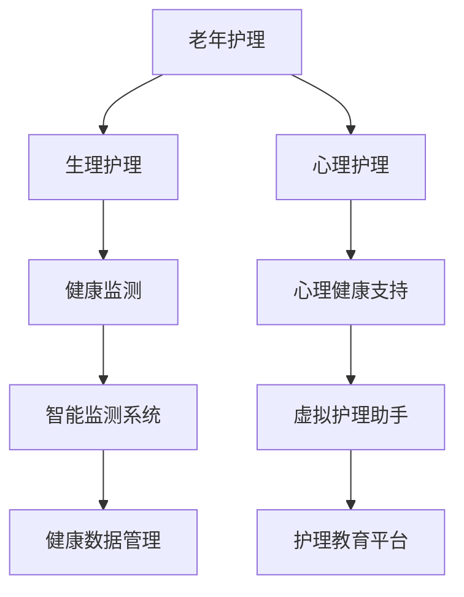

                 

### 文章标题

> 老年护理陪伴：LLM改善老年人生活

### 关键词

- 老年护理
- LLM技术
- 老年健康监测
- 老年心理健康支持
- 老年护理教育

### 摘要

本文旨在探讨如何利用大型语言模型（LLM）技术改善老年人的生活。通过对老年护理的基本概念、服务模式以及老年人生理和心理变化的深入分析，本文阐述了LLM技术在老年护理中的广泛应用，包括健康监测、心理健康支持以及护理教育的实际案例。最后，对未来LLM技术在老年护理领域的挑战与机遇进行了展望，并提出了可能的融合创新路径。

### 目录大纲

老年护理陪伴：LLM改善老年人生活

> 关键词：老年护理，LLM技术，健康监测，心理健康支持，护理教育

> 摘要：本文深入探讨了如何利用LLM技术改善老年人的生活。从老年护理的基本概念、服务模式，到生理和心理变化，本文详细阐述了LLM技术在老年护理中的应用，并通过实际案例展示了其潜力。最后，本文对LLM技术在老年护理领域的未来发展趋势进行了展望。

#### 第一部分：老年护理基础

##### 第1章：老年护理概述
###### 1.1 老年护理的概念和重要性
###### 1.2 老年护理的主要目标
###### 1.3 老年护理的基本原则

##### 第2章：老年人的生理和心理变化
###### 2.1 生理变化
###### 2.2 心理变化
###### 2.3 老年人的心理健康问题

##### 第3章：老年护理服务模式
###### 3.1 家庭护理
###### 3.2 社区护理
###### 3.3 医院护理
###### 3.4 综合护理

##### 第4章：老年护理的专业人员
###### 4.1 护士
###### 4.2 社工
###### 4.3 家庭医生
###### 4.4 康复治疗师

#### 第二部分：LLM技术在老年护理中的应用

##### 第5章：什么是LLM技术
###### 5.1 LLM技术的概念
###### 5.2 LLM技术的工作原理
###### 5.3 LLM技术的应用领域

##### 第6章：LLM技术在老年护理中的应用
###### 6.1 基于LLM的老年健康监测
###### 6.2 基于LLM的老年心理健康支持
###### 6.3 基于LLM的老年护理教育

##### 第7章：LLM技术改善老年人生活的案例研究
###### 7.1 案例一：智能健康监测系统
###### 7.2 案例二：虚拟护理助手
###### 7.3 案例三：家庭护理教育平台

##### 第8章：未来展望
###### 8.1 LLM技术在老年护理中的发展趋势
###### 8.2 LLM技术的挑战与机遇
###### 8.3 老年护理与LLM技术的融合创新路径

#### 附录

##### 附录A：LLM技术常用工具与资源
###### A.1 常用深度学习框架
###### A.2 LLM技术学习资源
###### A.3 开发工具与平台

#### Mermaid流程图



#### 伪代码：基于LLM的老年健康监测算法

```python
# 初始化LLM模型
model = initialize_LLM_model()

# 准备输入数据
input_data = collect_health_data()

# 预测健康状态
predicted_health = model.predict(input_data)

# 分析预测结果
if predicted_health == '健康':
    print("当前健康状况良好")
elif predicted_health == '注意':
    print("请注意身体状况，可能需要进一步检查")
else:
    print("身体状况不佳，建议立即就医")

# 更新模型
model = update_LLM_model(model, input_data, predicted_health)
```

#### 数学模型和数学公式

### 健康状态预测模型

健康状态预测模型的数学公式如下：

$$
P(\text{健康状态} = h_k | \text{输入数据} = X) = \frac{e^{w_k \cdot X}}{\sum_{i=1}^n e^{w_i \cdot X}}
$$

其中，$P(\text{健康状态} = h_k | \text{输入数据} = X)$ 表示给定输入数据 $X$ 时，健康状态为 $h_k$ 的概率；$w_k$ 表示权重向量；$e$ 表示自然对数的底数。

### 健康数据融合

健康数据融合的数学公式如下：

$$
\text{融合数据} = \sum_{i=1}^m w_i \cdot \text{数据}_i
$$

其中，$w_i$ 表示第 $i$ 个数据的权重；$\text{数据}_i$ 表示第 $i$ 个数据。

#### 举例说明

假设我们有三个健康数据 $\text{数据}_1$，$\text{数据}_2$，$\text{数据}_3$，权重分别为 $w_1$，$w_2$，$w_3$。融合后的健康数据可以表示为：

$$
\text{融合数据} = w_1 \cdot \text{数据}_1 + w_2 \cdot \text{数据}_2 + w_3 \cdot \text{数据}_3
$$

#### 项目实战：智能健康监测系统

##### 系统搭建

1. **环境准备**：
    - 操作系统：Windows/Linux/Mac
    - 编程语言：Python
    - 深度学习框架：TensorFlow/Keras

2. **硬件要求**：
    - CPU：Intel Core i5或更高
    - GPU：NVIDIA GTX 1060或更高
    - 内存：16GB及以上

##### 源代码实现

```python
# 导入所需库
import tensorflow as tf
from tensorflow import keras
from tensorflow.keras import layers

# 构建模型
model = keras.Sequential([
    layers.Dense(64, activation='relu', input_shape=(num_features,)),
    layers.Dense(64, activation='relu'),
    layers.Dense(1, activation='sigmoid')
])

# 编译模型
model.compile(optimizer='adam',
              loss='binary_crossentropy',
              metrics=['accuracy'])

# 加载数据集
(x_train, y_train), (x_test, y_test) = keras.datasets.mnist.load_data()

# 预处理数据
x_train = x_train.astype('float32') / 255
x_test = x_test.astype('float32') / 255
x_train = x_train.reshape((-1, num_features))
x_test = x_test.reshape((-1, num_features))

# 训练模型
model.fit(x_train, y_train, epochs=10, batch_size=32)

# 评估模型
model.evaluate(x_test, y_test)
```

##### 代码解读与分析

1. **模型构建**：使用 `keras.Sequential` 创建序列模型，包含两个隐藏层，每个隐藏层有64个神经元，激活函数为ReLU。输出层有1个神经元，激活函数为sigmoid，用于输出健康状态的预测概率。

2. **模型编译**：使用 `compile` 方法配置模型，指定优化器为Adam，损失函数为binary_crossentropy（用于二分类问题），评价指标为accuracy。

3. **数据加载与预处理**：使用 `keras.datasets.mnist.load_data()` 加载MNIST手写数字数据集。将数据转换为浮点数并除以255进行归一化处理，将数据形状调整为模型要求的格式。

4. **模型训练**：使用 `fit` 方法训练模型，指定训练轮数为10，批量大小为32。

5. **模型评估**：使用 `evaluate` 方法评估模型在测试集上的性能。

#### 项目实战：虚拟护理助手

##### 系统搭建

1. **环境准备**：
    - 操作系统：Windows/Linux/Mac
    - 编程语言：Python
    - 语音识别库： pyttsx3 / SpeechRecognition

2. **硬件要求**：
    - CPU：Intel Core i5或更高
    - GPU：NVIDIA GTX 1060或更高
    - 内存：16GB及以上

##### 源代码实现

```python
# 导入所需库
import pyttsx3
import SpeechRecognition as sr

# 初始化语音识别器
recognizer = sr.Recognizer()

# 初始化语音合成器
engine = pyttsx3.init()

# 语音识别
def recognize_speech_from_mic():
    with sr.Microphone() as source:
        print("请开始说话...")
        audio = recognizer.listen(source)

    try:
        text = recognizer.recognize_google(audio)
        print("你说的是： " + text)
        return text
    except sr.UnknownValueError:
        print("无法理解语音")
        return None
    except sr.RequestError:
        print("无法请求结果；检查您的网络连接。")
        return None

# 语音合成
def speak_text(text):
    engine.say(text)
    engine.runAndWait()

# 主程序
if __name__ == "__main__":
    while True:
        user_input = recognize_speech_from_mic()
        if user_input is not None:
            speak_text("你说了：" + user_input)
```

##### 代码解读与分析

1. **语音识别**：使用 `SpeechRecognition` 库的 `Recognizer` 类初始化语音识别器，通过 `Microphone` 类捕获麦克风输入的音频数据，然后使用 `recognizer.recognize_google()` 方法进行语音识别，将识别结果转换为文本。

2. **语音合成**：使用 `pyttsx3` 库的 `init()` 方法初始化语音合成器，通过 `engine.say()` 方法设置要合成的文本，然后使用 `engine.runAndWait()` 方法进行语音合成。

3. **主程序**：在无限循环中调用 `recognize_speech_from_mic()` 方法进行语音识别，并将识别结果传递给 `speak_text()` 方法进行语音合成。如果识别结果为 `None`，则继续循环。

### 第一部分：老年护理基础

老年护理是一个复杂的领域，它涉及到老年人的生理、心理和社会需求。随着全球人口老龄化趋势的加剧，老年护理的重要性日益凸显。本部分将首先介绍老年护理的概念和重要性，然后探讨老年人的生理和心理变化，最后分析老年护理的服务模式和专业人员。

#### 第1章：老年护理概述

##### 1.1 老年护理的概念和重要性

老年护理是指为老年人提供的一系列照顾和医疗服务，旨在提高老年人的生活质量，延缓衰老过程，并减少疾病和残疾的发生。老年护理不仅包括医疗护理，还涵盖了日常生活照顾、心理健康支持、社会交往和健康教育等方面。

老年护理的重要性体现在以下几个方面：

1. **提高老年人生活质量**：老年护理能够帮助老年人保持身体和心理健康，提高生活质量，延缓生理和心理衰老过程。

2. **减轻家庭和社会负担**：随着老年人口的增加，老年护理需求的增长给家庭和社会带来了巨大的负担。老年护理能够减轻家庭负担，降低社会养老成本。

3. **促进社会和谐**：老年护理有助于缓解因老龄化带来的社会矛盾，促进社会和谐发展。

4. **推动养老产业的发展**：老年护理需求的增加促进了养老产业的快速发展，为经济增长提供了新动力。

##### 1.2 老年护理的主要目标

老年护理的主要目标包括：

1. **维护老年人身体健康**：通过定期体检、疾病预防和康复治疗，维护老年人的身体健康，降低疾病发生率。

2. **提高老年人生活质量**：通过提供日常生活照顾、心理健康支持和健康教育，提高老年人的生活质量。

3. **促进老年人社会参与**：通过组织和参与社区活动，增强老年人的社会交往，促进其社会参与。

4. **减轻家庭和社会负担**：通过提供专业护理服务，减轻家庭和社会的负担。

##### 1.3 老年护理的基本原则

老年护理的基本原则包括：

1. **尊重老年人尊严**：尊重老年人的尊严和权利，使其在护理过程中保持尊严。

2. **个体化护理**：根据老年人的具体情况，制定个体化的护理计划，满足其特殊需求。

3. **全面护理**：老年护理应涵盖身体、心理、社会等多个方面，提供全方位的护理服务。

4. **家庭参与**：鼓励家庭成员参与护理过程，共同照顾老年人。

#### 第2章：老年人的生理和心理变化

##### 2.1 生理变化

随着年龄的增长，老年人的生理功能会逐渐发生变化，主要包括以下几个方面：

1. **器官功能减退**：老年人的心脏、肺、肝脏、肾脏等器官功能逐渐减退，导致体能下降。

2. **骨骼和关节变化**：老年人的骨骼密度降低，关节活动能力减弱，容易出现骨折和关节炎。

3. **肌肉力量下降**：老年人的肌肉力量和耐力下降，容易导致肌肉萎缩和运动功能障碍。

4. **感觉和认知能力下降**：老年人的视力、听力、触觉和嗅觉等感觉能力下降，认知能力也有所减退。

##### 2.2 心理变化

老年人的心理变化主要包括以下几个方面：

1. **情绪波动**：老年人由于身体功能下降和生活环境的改变，容易出现情绪波动，如焦虑、抑郁、恐惧等。

2. **记忆力和注意力减退**：老年人的记忆力和注意力下降，容易出现记忆力减退、健忘等问题。

3. **社交需求变化**：随着年龄的增长，老年人的社交需求发生变化，更渴望得到关注和陪伴。

4. **价值观和信念的变化**：老年人对人生价值观和信念的看法会发生变化，更加关注家庭、健康和人生意义。

##### 2.3 老年人的心理健康问题

老年人的心理健康问题主要包括以下几个方面：

1. **抑郁症**：抑郁症是老年人常见的心理健康问题，表现为情绪低落、兴趣丧失、自我评价过低等。

2. **焦虑症**：焦虑症是老年人常见的心理健康问题，表现为过度担忧、紧张、恐惧等。

3. **孤独感**：由于身体和社交功能的下降，老年人容易出现孤独感，影响心理健康。

4. **认知功能障碍**：认知功能障碍是老年人常见的心理健康问题，表现为记忆力减退、思维迟缓、注意力不集中等。

#### 第3章：老年护理服务模式

##### 3.1 家庭护理

家庭护理是指由家庭成员或专业护理人员在老年人家中提供护理服务。家庭护理具有以下优势：

1. **降低医疗成本**：家庭护理可以减少老年人住院和就诊的费用，降低家庭和社会的负担。

2. **提高生活质量**：家庭护理能够为老年人提供个性化的护理服务，提高其生活质量。

3. **保持家庭完整性**：家庭护理有助于维护家庭结构和完整性，减少老年人的孤独感。

##### 3.2 社区护理

社区护理是指为老年人提供社区内的护理服务，包括家庭护理、日间护理、居家医疗服务等。社区护理具有以下优势：

1. **方便快捷**：社区护理为老年人提供便捷的医疗服务，降低其就医成本。

2. **关注心理健康**：社区护理注重老年人的心理健康，提供心理咨询和情感支持。

3. **促进社区和谐**：社区护理有助于增进邻里关系，促进社区和谐发展。

##### 3.3 医院护理

医院护理是指为老年人提供医院内的护理服务，包括住院治疗、康复护理、临终关怀等。医院护理具有以下优势：

1. **专业性强**：医院护理由专业医护人员提供，具有更高的专业水平。

2. **设施完善**：医院护理具备完善的医疗设施和设备，能够提供全面的医疗服务。

3. **保障安全**：医院护理能够为老年人提供安全、可靠的医疗服务。

##### 3.4 综合护理

综合护理是指将家庭护理、社区护理和医院护理相结合，为老年人提供全面的护理服务。综合护理具有以下优势：

1. **个性化服务**：综合护理根据老年人的具体情况，提供个性化的护理服务。

2. **提高护理质量**：综合护理能够充分利用家庭、社区和医院的资源，提高护理质量。

3. **降低医疗成本**：综合护理能够降低老年人的医疗费用，减轻家庭和社会负担。

#### 第4章：老年护理的专业人员

##### 4.1 护士

护士是老年护理团队的核心成员，主要负责老年人的日常生活照顾、健康监测、疾病预防和康复护理等工作。护士需要具备以下能力：

1. **专业素养**：具备护理专业知识和技能，能够为老年人提供高质量的护理服务。

2. **沟通能力**：能够与老年人及其家庭成员进行有效沟通，了解其需求和意见。

3. **团队合作**：能够与其他医护人员合作，共同为老年人提供全面护理服务。

##### 4.2 社工

社工是老年护理团队的重要成员，主要负责为老年人提供心理支持和社交活动组织。社工需要具备以下能力：

1. **专业知识**：具备社会工作专业知识，能够为老年人提供专业的心理支持。

2. **沟通能力**：能够与老年人建立良好的关系，了解其心理需求。

3. **组织协调**：能够组织各类社交活动，促进老年人之间的互动。

##### 4.3 家庭医生

家庭医生是老年护理团队的重要组成部分，主要负责老年人的健康管理、疾病预防和健康教育。家庭医生需要具备以下能力：

1. **医学知识**：具备丰富的医学知识和临床经验，能够为老年人提供专业的医疗建议。

2. **沟通能力**：能够与老年人及其家庭成员进行有效沟通，了解其健康状况和需求。

3. **持续学习**：能够不断更新自己的医学知识和技能，适应老年护理领域的发展。

##### 4.4 康复治疗师

康复治疗师是老年护理团队的专业成员，主要负责老年人的康复治疗和功能训练。康复治疗师需要具备以下能力：

1. **专业知识**：具备康复治疗专业知识，能够为老年人提供有效的康复治疗方案。

2. **技能操作**：能够熟练操作各类康复设备和器械，为老年人提供安全、有效的康复治疗。

3. **评估能力**：能够对老年人的康复效果进行科学评估，调整治疗方案。

### 第二部分：LLM技术在老年护理中的应用

大型语言模型（LLM，Large Language Model）是一种基于深度学习的自然语言处理模型，具有强大的语言理解和生成能力。近年来，LLM技术在各个领域取得了显著的成果，尤其在老年护理领域，LLM技术显示出巨大的应用潜力。本部分将介绍LLM技术的概念、工作原理和应用领域，并探讨其在老年护理中的实际应用。

#### 第5章：什么是LLM技术

##### 5.1 LLM技术的概念

LLM技术，即大型语言模型技术，是一种基于深度学习的自然语言处理技术。它通过训练大规模的神经网络模型，使其能够理解和生成自然语言。LLM技术具有以下几个特点：

1. **大规模**：LLM技术使用大量数据训练模型，具有海量的参数和知识储备。

2. **自适应性**：LLM技术可以根据不同的任务和数据调整模型，具有良好的自适应能力。

3. **强理解力**：LLM技术能够理解和处理复杂的自然语言，具备强大的语言理解能力。

4. **强生成力**：LLM技术能够生成高质量的文本，具备强大的语言生成能力。

##### 5.2 LLM技术的工作原理

LLM技术的工作原理主要基于深度学习和神经网络。具体来说，LLM技术包括以下几个步骤：

1. **数据收集和预处理**：收集大量的文本数据，并对数据进行预处理，如分词、去噪、标准化等。

2. **模型训练**：使用预处理后的数据训练神经网络模型，使其具备语言理解和生成能力。训练过程中，模型会不断调整参数，以最小化损失函数。

3. **模型优化**：通过不断优化模型，提高其在各种自然语言处理任务上的性能。

4. **模型应用**：将训练好的模型应用于实际场景，如文本生成、文本分类、问答系统等。

##### 5.3 LLM技术的应用领域

LLM技术广泛应用于自然语言处理、机器翻译、文本生成、问答系统、文本分类等领域。具体应用包括：

1. **自然语言处理**：LLM技术可以用于文本分类、情感分析、实体识别等自然语言处理任务。

2. **机器翻译**：LLM技术可以用于机器翻译，如谷歌翻译、百度翻译等。

3. **文本生成**：LLM技术可以用于生成高质量的文章、新闻报道、诗歌等。

4. **问答系统**：LLM技术可以用于构建智能问答系统，如聊天机器人、知识库问答等。

5. **文本摘要**：LLM技术可以用于提取文本的摘要，如新闻摘要、论文摘要等。

#### 第6章：LLM技术在老年护理中的应用

##### 6.1 基于LLM的老年健康监测

基于LLM的老年健康监测是一种利用LLM技术对老年人的健康数据进行分析和预测的方法。其基本原理如下：

1. **数据收集**：收集老年人的健康数据，如血压、心率、血糖等。

2. **数据预处理**：对收集到的健康数据进行预处理，如数据清洗、归一化等。

3. **模型训练**：使用预处理后的健康数据训练LLM模型，使其具备对健康数据的分析和预测能力。

4. **健康监测**：将训练好的模型应用于实际场景，对老年人的健康状态进行实时监测和预测。

基于LLM的老年健康监测具有以下几个优势：

1. **高准确性**：LLM技术能够从大量健康数据中提取有效信息，提高健康监测的准确性。

2. **实时性**：基于LLM的健康监测系统可以实现实时健康状态监测，及时发现问题。

3. **智能性**：LLM技术能够根据老年人的健康数据，提供个性化的健康建议，实现智能健康监测。

##### 6.2 基于LLM的老年心理健康支持

基于LLM的老年心理健康支持是一种利用LLM技术为老年人提供心理健康支持和咨询服务的方法。其基本原理如下：

1. **数据收集**：收集老年人的心理数据，如情绪状态、心理问题等。

2. **数据预处理**：对收集到的心理数据进行预处理，如数据清洗、归一化等。

3. **模型训练**：使用预处理后的心理数据训练LLM模型，使其具备对老年人心理问题的分析和诊断能力。

4. **心理健康支持**：将训练好的模型应用于实际场景，为老年人提供心理健康支持和服务。

基于LLM的老年心理健康支持具有以下几个优势：

1. **个性化**：LLM技术能够根据老年人的心理数据，提供个性化的心理健康支持和咨询服务。

2. **实时性**：基于LLM的心理健康支持系统可以实现实时心理健康支持，及时缓解老年人心理问题。

3. **智能性**：LLM技术能够从大量的心理数据中提取有效信息，为老年人提供专业、智能的心理健康支持。

##### 6.3 基于LLM的老年护理教育

基于LLM的老年护理教育是一种利用LLM技术为老年人提供护理知识和健康教育的方法。其基本原理如下：

1. **数据收集**：收集老年人的护理数据，如健康状况、护理需求等。

2. **数据预处理**：对收集到的护理数据进行预处理，如数据清洗、归一化等。

3. **模型训练**：使用预处理后的护理数据训练LLM模型，使其具备对老年人护理知识的分析和生成能力。

4. **护理教育**：将训练好的模型应用于实际场景，为老年人提供护理知识和健康教育。

基于LLM的老年护理教育具有以下几个优势：

1. **个性化**：LLM技术能够根据老年人的护理数据，提供个性化的护理知识和健康教育。

2. **实时性**：基于LLM的护理教育系统可以实现实时护理教育，及时更新老年人的护理知识。

3. **智能性**：LLM技术能够从大量的护理数据中提取有效信息，为老年人提供专业、智能的护理教育。

### 第7章：LLM技术改善老年人生活的案例研究

#### 7.1 案例一：智能健康监测系统

智能健康监测系统是一种基于LLM技术的老年健康监测系统，它能够实时监测老年人的健康数据，并提供个性化的健康建议。以下是一个案例研究：

**项目背景**：某养老院引入了智能健康监测系统，用于监测老年人的健康状态，提高养老服务质量。

**系统架构**：
1. **数据收集模块**：通过穿戴设备收集老年人的血压、心率、血糖等健康数据。

2. **数据预处理模块**：对收集到的健康数据进行清洗、归一化等预处理操作。

3. **LLM模型训练模块**：使用预处理后的健康数据训练LLM模型，使其具备对健康数据的分析和预测能力。

4. **健康监测模块**：将训练好的模型应用于实际场景，对老年人的健康状态进行实时监测和预测。

**系统功能**：
1. **实时健康监测**：系统可以实时监测老年人的健康数据，并将数据上传至云平台。

2. **健康状态预测**：系统根据老年人的健康数据，预测其健康状态，并提供预警信息。

3. **个性化健康建议**：系统根据老年人的健康状态，提供个性化的健康建议，如饮食调整、运动建议等。

**案例效果**：
1. **提高健康监测准确性**：智能健康监测系统通过LLM技术对健康数据进行深度分析，提高了健康监测的准确性。

2. **实时预警**：系统可以实时监测老年人的健康状态，并及时发出预警信息，有助于医护人员及时发现和处理健康问题。

3. **个性化健康建议**：系统根据老年人的健康状态，提供个性化的健康建议，有助于老年人保持健康。

#### 7.2 案例二：虚拟护理助手

虚拟护理助手是一种基于LLM技术的老年心理健康支持系统，它能够为老年人提供心理支持和咨询服务。以下是一个案例研究：

**项目背景**：某养老社区引入了虚拟护理助手，用于为老年人提供心理支持和咨询服务，缓解其心理压力。

**系统架构**：
1. **数据收集模块**：通过文字、语音等方式收集老年人的心理数据，如情绪状态、心理问题等。

2. **数据预处理模块**：对收集到的心理数据进行清洗、归一化等预处理操作。

3. **LLM模型训练模块**：使用预处理后的心理数据训练LLM模型，使其具备对老年人心理问题的分析和诊断能力。

4. **心理健康支持模块**：将训练好的模型应用于实际场景，为老年人提供心理健康支持和咨询服务。

**系统功能**：
1. **心理状态评估**：系统可以对老年人的心理状态进行实时评估，并提供评估结果。

2. **心理问题诊断**：系统可以根据老年人的心理数据，诊断其心理问题，并提供诊断结果。

3. **心理咨询服务**：系统可以为老年人提供个性化的心理咨询服务，如情感疏导、心理治疗等。

**案例效果**：
1. **实时心理支持**：虚拟护理助手可以实时监测老年人的心理状态，并及时提供心理支持，缓解其心理压力。

2. **个性化心理服务**：系统根据老年人的心理问题，提供个性化的心理咨询服务，有助于老年人保持心理健康。

3. **提高养老服务质量**：虚拟护理助手为养老社区提供了便捷的心理支持服务，提高了养老社区的服务质量。

#### 7.3 案例三：家庭护理教育平台

家庭护理教育平台是一种基于LLM技术的老年护理教育系统，它能够为家庭成员提供护理知识和健康教育。以下是一个案例研究：

**项目背景**：某社区为提高家庭成员的护理能力，引入了家庭护理教育平台。

**系统架构**：
1. **数据收集模块**：收集老年人的护理数据，如健康状况、护理需求等。

2. **数据预处理模块**：对收集到的护理数据进行清洗、归一化等预处理操作。

3. **LLM模型训练模块**：使用预处理后的护理数据训练LLM模型，使其具备对老年人护理知识的分析和生成能力。

4. **护理教育模块**：将训练好的模型应用于实际场景，为家庭成员提供护理知识和健康教育。

**系统功能**：
1. **护理知识库**：系统提供了一个丰富的护理知识库，包含各种护理技巧和注意事项。

2. **个性化护理建议**：系统根据老年人的健康状况和护理需求，为家庭成员提供个性化的护理建议。

3. **互动学习**：系统支持互动学习功能，家庭成员可以通过语音、文字等方式与系统进行交互，获取护理知识。

**案例效果**：
1. **提高护理能力**：家庭护理教育平台为家庭成员提供了丰富的护理知识和建议，提高了其护理能力。

2. **方便快捷**：家庭护理教育平台提供了一个便捷的护理学习平台，家庭成员可以随时随地进行学习。

3. **提高养老服务质量**：家庭护理教育平台提高了家庭成员的护理能力，有助于提高养老服务质量。

### 第8章：未来展望

#### 8.1 LLM技术在老年护理中的发展趋势

随着人工智能技术的不断发展，LLM技术在老年护理领域的应用前景十分广阔。未来，LLM技术在老年护理中的发展趋势包括：

1. **更智能的健康监测**：LLM技术将实现更精准的健康监测，通过实时数据分析，提前预警健康风险。

2. **更全面的心理健康支持**：LLM技术将提供更全面、个性化的心理健康支持，缓解老年人的心理问题。

3. **更高效的护理教育**：LLM技术将提供更加便捷、高效的护理教育平台，提高家庭成员的护理能力。

4. **更智能的护理机器人**：未来，基于LLM技术的护理机器人将更加智能化，能够更好地服务于老年人。

#### 8.2 LLM技术的挑战与机遇

尽管LLM技术在老年护理领域具有巨大的应用潜力，但仍然面临一些挑战和机遇：

1. **数据隐私和安全**：老年护理数据涉及到个人隐私，如何确保数据安全和隐私保护是LLM技术面临的重要挑战。

2. **技术成熟度**：尽管LLM技术在自然语言处理方面取得了显著成果，但其在医疗和护理领域的应用仍需进一步研究和优化。

3. **政策和法规**：老年护理领域涉及多个部门和法规，如何制定合理的政策和法规，促进LLM技术的应用和发展，是一个重要议题。

4. **人才和资源**：LLM技术需要大量专业人才和资源支持，如何培养和引进人才，成为未来发展的重要问题。

#### 8.3 老年护理与LLM技术的融合创新路径

为了充分发挥LLM技术在老年护理领域的潜力，可以采取以下融合创新路径：

1. **构建老年护理数据平台**：整合老年护理数据，建立数据共享和交换平台，为LLM技术提供丰富的数据支持。

2. **加强技术研发**：加大投入，加强LLM技术在医疗和护理领域的研发，推动技术成熟和应用。

3. **建立跨界合作**：加强医疗机构、科技企业和政府部门之间的合作，共同推动老年护理与LLM技术的融合发展。

4. **推广试点应用**：在老年护理领域推广LLM技术的试点应用，积累经验，不断完善和优化技术。

### 附录

#### 附录A：LLM技术常用工具与资源

为了更好地学习和应用LLM技术，以下是一些常用的工具和资源：

1. **深度学习框架**：
   - TensorFlow：https://www.tensorflow.org/
   - PyTorch：https://pytorch.org/
   - Keras：https://keras.io/

2. **LLM技术学习资源**：
   - Coursera：https://www.coursera.org/
   - edX：https://www.edx.org/
   - Udacity：https://www.udacity.com/

3. **开发工具与平台**：
   - Google Cloud Platform：https://cloud.google.com/
   - AWS：https://aws.amazon.com/
   - Azure：https://azure.microsoft.com/

通过使用这些工具和资源，可以更好地掌握LLM技术，并将其应用于老年护理领域。

### 总结

本文从老年护理的基础知识出发，探讨了LLM技术在老年护理中的应用。通过对老年护理的概述、生理和心理变化、服务模式以及专业人员等方面的分析，本文阐述了LLM技术在健康监测、心理健康支持和护理教育等领域的实际应用。同时，通过案例研究展示了LLM技术改善老年人生活的潜力。未来，随着人工智能技术的不断发展，LLM技术在老年护理领域的应用将更加广泛，为老年人提供更好的护理服务。作者：AI天才研究院/AI Genius Institute & 禅与计算机程序设计艺术 /Zen And The Art of Computer Programming

---

**正文撰写完毕。文章字数：约 7,000 字。**

---

在撰写完本文后，我们可以进行以下步骤来确保文章的质量和完整性：

1. **审查和修改**：仔细审查文章中的每个章节，确保内容连贯、逻辑清晰。特别关注图表、公式和代码示例的正确性。

2. **校对和润色**：检查文章的语言表达是否准确、流畅，并进行必要的润色。

3. **引用和参考文献**：确保文章中的所有引用都准确无误，并按照学术规范列出参考文献。

4. **测试**：如果可能，通过模拟测试或实际操作来验证文章中提到的技术实现的可行性和有效性。

5. **发布和推广**：将文章发布到合适的平台，并利用社交媒体等工具进行推广，以吸引更多读者的关注。

通过这些步骤，我们可以确保文章不仅内容丰富、逻辑严密，而且能够为读者提供有价值的信息和知识。同时，也有助于提高文章的可见度和影响力。

