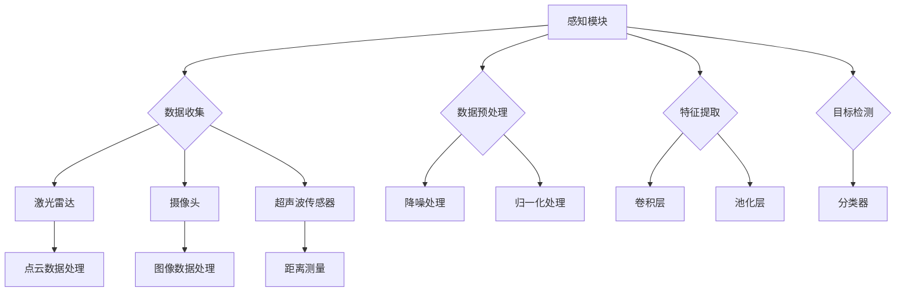
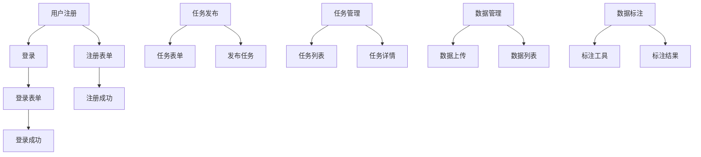
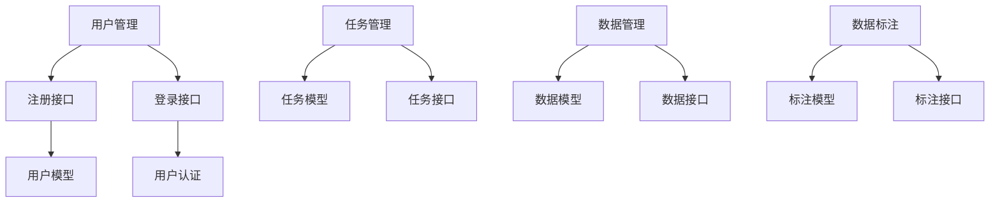
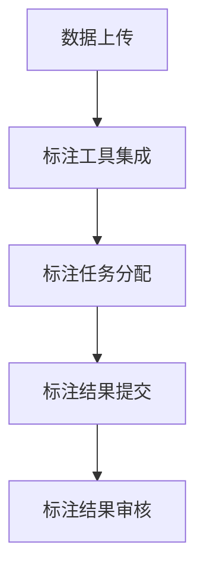

                 

### 第一部分：自动驾驶公司的数据标注众包平台概述

自动驾驶技术作为21世纪交通领域的重要创新，正逐步改变人们的出行方式。而数据标注作为自动驾驶技术发展的重要一环，其质量直接影响到自动驾驶系统的准确性和稳定性。本文将探讨自动驾驶公司如何搭建一个高效的数据标注众包平台，以便更好地推动自动驾驶技术的发展。

> **关键词**：自动驾驶、数据标注、众包平台、技术架构、用户体验

> **摘要**：本文将详细介绍自动驾驶公司的数据标注众包平台的搭建过程，包括平台概述、应用场景、技术架构、搭建步骤、平台运营与维护，并通过案例分析，总结出搭建高效数据标注众包平台的最佳实践。

### 第1章：自动驾驶技术概述

自动驾驶技术是指通过计算机程序和传感器，使车辆能够自主地完成驾驶任务，实现自动化驾驶。根据美国汽车工程师协会（SAE）的定义，自动驾驶分为五个等级，从0级（完全人工驾驶）到5级（完全自动化驾驶）。

#### 1.1 自动驾驶技术的定义与分类

##### 1.1.1 自动驾驶技术的定义

自动驾驶技术是指利用计算机、传感器、控制算法等智能技术，使车辆具备自动感知环境、规划路径并控制驾驶的能力。

##### 1.1.2 自动驾驶技术的分类

根据自动驾驶系统的功能和应用场景，可以分为以下几类：

1. **感知系统**：利用激光雷达、摄像头、超声波传感器等设备，对周围环境进行感知，获取路况、行人、车辆等信息。
2. **决策系统**：根据感知系统提供的信息，利用控制算法，对车辆的行驶路径和动作进行决策。
3. **控制系统**：执行决策系统的决策结果，控制车辆的行驶方向、速度、制动等操作。

##### 1.1.3 自动驾驶技术的发展历程

自动驾驶技术的发展可以追溯到20世纪60年代。随着计算机技术的进步和传感器技术的成熟，自动驾驶技术逐渐从实验室走向实际应用。近年来，随着深度学习、计算机视觉等人工智能技术的发展，自动驾驶技术取得了显著的突破。

#### 1.2 自动驾驶系统的组成

##### 1.2.1 硬件组成部分

自动驾驶系统的硬件主要由传感器、控制器和执行器组成：

1. **传感器**：包括激光雷达、摄像头、超声波传感器、毫米波雷达等，用于感知周围环境。
2. **控制器**：通常采用高性能的中央处理单元（CPU）或图形处理单元（GPU），用于处理传感器数据并生成驾驶决策。
3. **执行器**：包括电机、制动器、转向器等，用于执行驾驶决策，控制车辆的运动。

##### 1.2.2 软件组成部分

自动驾驶系统的软件主要包括以下几个模块：

1. **感知模块**：通过传感器获取环境信息，包括图像、激光点云、雷达信号等。
2. **决策模块**：根据感知模块提供的信息，利用控制算法，对车辆的行驶路径和动作进行决策。
3. **执行模块**：执行决策模块的决策结果，控制车辆的行驶方向、速度、制动等操作。

##### 1.2.3 自动驾驶系统的运作原理

自动驾驶系统的运作原理可以概括为以下几个步骤：

1. **感知**：传感器收集周围环境信息。
2. **处理**：控制器处理感知数据，生成驾驶决策。
3. **执行**：执行器根据驾驶决策控制车辆的运动。

#### 1.3 自动驾驶技术的挑战与前景

##### 1.3.1 自动驾驶技术的挑战

自动驾驶技术的挑战主要包括：

1. **技术挑战**：感知技术、决策算法、执行控制等方面仍需持续优化。
2. **安全挑战**：自动驾驶系统的安全性是当前研究和应用的重点。
3. **法规挑战**：自动驾驶技术的法律法规和标准尚不完善。

##### 1.3.2 自动驾驶技术的前景

自动驾驶技术具有广阔的前景：

1. **交通效率提升**：自动驾驶技术可以减少交通事故，提高交通效率。
2. **环保效益**：自动驾驶技术可以减少车辆排放，降低环境污染。
3. **经济价值**：自动驾驶技术有望为交通、物流等领域带来巨大的经济效益。

##### 1.3.3 自动驾驶技术的潜在影响

自动驾驶技术将对社会、经济、环境等多个方面产生深远影响：

1. **社会影响**：改变人们的出行方式，提高生活质量。
2. **经济影响**：推动相关产业的发展，创造新的就业机会。
3. **环境影响**：减少交通拥堵，降低污染排放。

### 第二部分：数据标注在自动驾驶中的应用

数据标注在自动驾驶系统中扮演着至关重要的角色。自动驾驶系统需要大量的标注数据进行训练和验证，以确保系统的准确性和稳定性。本节将详细介绍数据标注在自动驾驶中的应用。

#### 2.1 数据标注的重要性

##### 2.1.1 数据标注的定义

数据标注是指将原始数据（如图像、音频、视频等）转化为具有一定格式和标注信息的结构化数据，以便用于机器学习和深度学习模型的训练和验证。

##### 2.1.2 数据标注在自动驾驶中的作用

1. **训练数据集的生成**：数据标注是生成高质量训练数据集的重要环节，直接影响到自动驾驶模型的性能和准确度。
2. **模型性能评估**：通过数据标注，可以评估自动驾驶模型的性能，找出模型中的缺陷和不足，为模型优化提供依据。
3. **模型验证**：数据标注是自动驾驶模型验证的关键，通过标注数据的测试，可以验证模型在实际应用中的效果。

##### 2.1.3 数据标注的挑战

1. **数据量巨大**：自动驾驶系统需要大量的标注数据，数据标注过程耗时耗力。
2. **数据多样性**：自动驾驶系统面临的场景多样，标注数据需要覆盖各种可能的场景。
3. **标注质量**：标注数据的准确性直接影响模型性能，标注质量难以保证。

#### 2.2 数据标注流程

数据标注流程通常包括以下几个步骤：

##### 2.2.1 数据收集

数据收集是数据标注的第一步，主要包括以下内容：

1. **数据来源**：收集道路行驶视频、图像、雷达数据等。
2. **数据清洗**：去除重复数据、异常数据和噪声数据，保证数据质量。

##### 2.2.2 数据预处理

数据预处理是数据标注的前置工作，主要包括以下内容：

1. **数据格式转换**：将不同格式的数据转换为统一的格式。
2. **数据增强**：通过数据增强技术，增加训练数据集的多样性。

##### 2.2.3 数据标注

数据标注是数据标注流程的核心步骤，主要包括以下内容：

1. **标注工具**：使用专业的标注工具，如LabelImg、VGG Image Annotator等。
2. **标注规则**：制定统一的标注规则，确保标注的一致性。
3. **多人标注**：多人进行标注，减少标注误差。

##### 2.2.4 数据验证与清洗

数据验证与清洗是数据标注的最后一步，主要包括以下内容：

1. **数据验证**：通过人工或自动化工具，检查标注数据的准确性。
2. **数据清洗**：去除错误标注的数据，保证数据质量。

#### 2.3 数据标注工具与技术

##### 2.3.1 常见数据标注工具

1. **LabelImg**：一个开源的图像标注工具，支持多种标注方式，如矩形、圆形、多边形等。
2. **VGG Image Annotator**：由牛津大学视觉几何组开发的一个交互式图像标注工具，支持多个用户的协同标注。
3. **Labelbox**：一个在线数据标注平台，支持多种数据类型的标注，具有丰富的协作功能。

##### 2.3.2 数据标注技术概述

1. **基于规则的标注**：根据预定的标注规则，对数据进行标注。
2. **语义分割**：对图像中的每个像素点进行标注，区分不同物体。
3. **实例分割**：对图像中的每个物体进行标注，区分不同物体及其边界。

##### 2.3.3 数据标注中的质量控制

1. **多人标注**：通过多人标注，减少标注误差。
2. **标注一致性检查**：对多人标注的数据进行一致性检查，确保标注的一致性。
3. **标注质量评估**：通过评估标注质量，找出标注中的问题，进行改进。

### 第三部分：自动驾驶公司的数据标注众包平台搭建

在自动驾驶技术的发展过程中，数据标注是关键的一环。众包平台作为一种高效的数据标注解决方案，可以大大提高数据标注的效率和准确性。本节将详细介绍自动驾驶公司的数据标注众包平台的搭建过程。

#### 3.1 众包平台概述

##### 3.1.1 众包平台的定义

众包平台是指通过互联网，将任务分解成若干个小任务，然后通过众包的方式，将任务分配给众多志愿者或专业工作者，从而完成整个任务的一种协作模式。

##### 3.1.2 众包平台的优势

1. **成本低**：众包平台可以降低企业的人力成本，提高效率。
2. **速度快**：众包平台可以快速召集大量的志愿者或专业工作者，缩短任务完成时间。
3. **质量高**：众包平台可以采用多人标注的方式，提高标注数据的准确性。

##### 3.1.3 众包平台的应用场景

1. **数据标注**：如自动驾驶数据标注、图像识别数据标注等。
2. **任务分配**：如物流配送任务、社区服务任务等。
3. **知识问答**：如在线教育、专业咨询等。

#### 3.2 众包平台的架构与设计

##### 3.2.1 众包平台的总体架构

自动驾驶公司的数据标注众包平台的总体架构可以分为以下几个部分：

1. **用户管理系统**：用于管理用户注册、登录、权限等。
2. **任务管理系统**：用于管理任务的发布、指派、进度监控等。
3. **数据管理系统**：用于管理标注数据，包括数据上传、下载、分类、标签管理等。
4. **质量监控系统**：用于监控标注质量，包括标注一致性检查、错误标注修正等。
5. **统计分析系统**：用于对标注任务进行统计分析，包括标注效率、标注质量等。

##### 3.2.2 众包平台的关键组件

1. **前端界面**：用于展示用户界面，包括任务列表、标注工具、统计分析等。
2. **后端服务**：用于处理业务逻辑，包括用户管理、任务管理、数据管理、质量监控等。
3. **数据库**：用于存储用户数据、任务数据、标注数据等。

##### 3.2.3 众包平台的设计原则

1. **高可用性**：确保平台稳定可靠，能够应对高并发访问。
2. **可扩展性**：设计时应考虑未来的扩展需求，确保平台能够灵活扩展。
3. **安全性**：确保用户数据和标注数据的隐私和安全。
4. **易用性**：设计应简单直观，方便用户快速上手。

#### 3.3 众包平台的技术选型

##### 3.3.1 技术选型的考虑因素

1. **开发语言**：选择易于开发、性能稳定、社区支持强的语言。
2. **框架**：选择适合项目需求的框架，如Web框架、数据库框架等。
3. **数据库**：选择适合数据存储和查询需求的数据库，如关系数据库、NoSQL数据库等。
4. **前端技术**：选择适合前端开发的技术，如HTML、CSS、JavaScript等。
5. **安全性**：选择具有安全性的技术和方案，如加密、身份验证等。

##### 3.3.2 常见技术选型方案

1. **后端技术选型**：
   - **Python**：Python具有简单易用、性能稳定的特点，适用于数据处理和机器学习任务。
   - **Django**：Django是一个高性能的Python Web框架，适合构建数据标注众包平台。
   - **PostgreSQL**：PostgreSQL是一个功能强大、稳定可靠的关系数据库，适合存储和管理用户数据和标注数据。

2. **前端技术选型**：
   - **HTML/CSS/JavaScript**：这些是前端开发的基础技术，适用于构建用户界面。
   - **React**：React是一个流行的前端JavaScript库，适合构建复杂、动态的用户界面。

3. **安全性技术选型**：
   - **SSL/TLS**：用于加密用户数据传输，确保数据传输的安全性。
   - **OAuth 2.0**：用于用户身份验证和授权，确保用户数据的安全。

##### 3.3.3 技术选型的最佳实践

1. **需求分析**：在技术选型之前，应充分分析项目需求，确定所需的性能、安全性、扩展性等要求。
2. **社区支持**：选择具有活跃社区的技术，便于解决问题和获取支持。
3. **性能测试**：进行技术选型后，应进行性能测试，确保所选技术能够满足项目需求。
4. **成本考虑**：在满足项目需求的前提下，考虑技术选型的成本。

### 第四部分：平台搭建步骤

#### 第4章：平台搭建步骤

搭建自动驾驶公司的数据标注众包平台是一个复杂的过程，涉及多个技术领域，包括前端开发、后端开发、数据库设计、用户管理、任务管理、数据管理等。以下是详细的平台搭建步骤：

#### 4.1 环境搭建与配置

平台搭建的第一步是环境搭建和配置，这包括开发环境、数据库环境以及服务器环境的配置。

##### 4.1.1 开发环境搭建

开发环境的搭建主要包括以下内容：

1. **安装Python**：确保Python版本满足项目需求，建议使用Python 3.8或更高版本。
2. **安装Django**：使用pip安装Django框架，命令如下：
   ```bash
   pip install django
   ```
3. **安装PostgreSQL**：下载并安装PostgreSQL数据库，配置数据库连接。
4. **安装前端开发工具**：安装Node.js、npm、Webpack等前端开发工具，用于构建和打包前端资源。

##### 4.1.2 数据库配置

数据库的配置包括创建数据库、用户和权限：

1. **创建数据库**：使用PostgreSQL命令创建数据库，命令如下：
   ```sql
   CREATE DATABASE data_标注_platform;
   ```
2. **创建用户**：使用PostgreSQL命令创建数据库用户，并授权访问数据库。
   ```sql
   CREATE USER platform_user WITH PASSWORD 'password';
   GRANT ALL PRIVILEGES ON DATABASE data_标注_platform TO platform_user;
   ```
3. **配置Django数据库连接**：在Django项目的`settings.py`文件中配置数据库连接信息。

##### 4.1.3 系统配置与优化

系统配置和优化包括以下内容：

1. **设置静态文件目录**：在Django项目中配置静态文件目录，以便前端资源可以被正确加载。
2. **设置媒体文件目录**：配置Django的媒体文件目录，以便上传的文件可以被存储和访问。
3. **性能优化**：配置缓存、优化数据库查询、使用负载均衡等，以提高系统性能。

#### 4.2 用户管理功能实现

用户管理功能是平台的重要组成部分，包括用户注册、登录、权限管理等。

##### 4.2.1 用户注册与登录

用户注册与登录功能的具体实现如下：

1. **用户注册**：
   - 创建用户注册表单，包括用户名、邮箱、密码等字段。
   - 在`views.py`中实现注册视图，处理用户注册请求。
   - 在数据库中存储用户信息。

2. **用户登录**：
   - 创建用户登录表单，包括用户名和密码字段。
   - 在`views.py`中实现登录视图，验证用户登录信息。
   - 使用Django的认证系统管理用户登录状态。

##### 4.2.2 用户角色与权限管理

用户角色与权限管理包括以下内容：

1. **角色定义**：定义不同的用户角色，如普通用户、管理员、审核员等。
2. **权限分配**：为不同的角色分配不同的权限，如查看任务、发布任务、审核标注等。
3. **权限验证**：在请求处理过程中，验证用户角色和权限，确保用户只能访问授权的功能。

##### 4.2.3 用户信息维护

用户信息维护包括以下内容：

1. **个人信息编辑**：用户可以编辑自己的个人信息，如姓名、邮箱、头像等。
2. **密码修改**：用户可以修改自己的密码。
3. **账户锁定与解锁**：管理员可以锁定或解锁用户的账户，以防止恶意行为。

#### 4.3 数据管理功能实现

数据管理功能是平台的核心功能之一，包括数据上传、数据下载、数据分类与标签管理等。

##### 4.3.1 数据上传与下载

数据上传与下载的具体实现如下：

1. **数据上传**：
   - 创建数据上传表单，包括文件选择、文件描述等字段。
   - 在`views.py`中实现数据上传视图，处理上传请求。
   - 将上传的文件存储到媒体文件目录。

2. **数据下载**：
   - 创建数据下载接口，根据用户权限和上传者信息，提供数据下载链接。
   - 在`views.py`中实现数据下载视图，处理下载请求。

##### 4.3.2 数据分类与标签管理

数据分类与标签管理包括以下内容：

1. **数据分类**：将数据按照类别进行分类，如道路、车辆、行人等。
2. **标签管理**：为数据添加标签，如车道线、道路标志、交通灯等。
3. **分类与标签关系**：建立分类与标签之间的关联，以便在标注过程中快速定位数据。

##### 4.3.3 数据查询与统计分析

数据查询与统计分析包括以下内容：

1. **数据查询**：提供数据查询接口，支持关键词查询、分类查询、标签查询等。
2. **数据统计**：提供数据统计功能，支持数据量统计、标注进度统计等。
3. **数据可视化**：使用图表展示数据统计结果，帮助用户快速了解数据情况。

#### 4.4 众包任务管理功能实现

众包任务管理功能是平台的另一个核心功能，包括任务发布、任务指派、任务进度监控等。

##### 4.4.1 任务发布与指派

任务发布与指派的具体实现如下：

1. **任务发布**：
   - 创建任务发布表单，包括任务名称、描述、截止时间、任务类型等字段。
   - 在`views.py`中实现任务发布视图，处理任务发布请求。
   - 将发布的任务存储到数据库。

2. **任务指派**：
   - 根据任务的类型和难度，为任务分配合适的标注者。
   - 在`views.py`中实现任务指派视图，处理任务指派请求。

##### 4.4.2 任务进度与质量监控

任务进度与质量监控包括以下内容：

1. **任务进度监控**：
   - 提供任务进度查询接口，支持标注者查看任务进度。
   - 在`views.py`中实现任务进度监控视图，处理进度查询请求。

2. **质量监控**：
   - 提供标注质量评估接口，支持管理员查看标注质量。
   - 在`views.py`中实现标注质量监控视图，处理质量评估请求。

##### 4.4.3 任务结果收集与审核

任务结果收集与审核包括以下内容：

1. **结果收集**：
   - 提供标注结果收集接口，支持标注者提交标注结果。
   - 在`views.py`中实现标注结果收集视图，处理标注结果提交请求。

2. **审核**：
   - 提供标注审核接口，支持管理员对标注结果进行审核。
   - 在`views.py`中实现标注审核视图，处理审核请求。

#### 4.5 众包平台性能优化

平台性能优化是确保平台稳定运行的关键，包括数据库优化、缓存策略、负载均衡等。

##### 4.5.1 性能瓶颈分析

性能瓶颈分析包括以下内容：

1. **数据库查询性能**：分析数据库查询的响应时间和吞吐量。
2. **前端响应性能**：分析前端页面的加载速度和交互性能。
3. **服务器负载**：分析服务器的CPU、内存、网络等资源使用情况。

##### 4.5.2 性能优化策略

性能优化策略包括以下内容：

1. **数据库优化**：
   - 索引优化：为常用的查询字段创建索引。
   - 分库分表：根据数据量，将数据库拆分为多个子库和子表。
   - 读写分离：实现主从复制，提高读性能。

2. **缓存策略**：
   - 页面缓存：使用浏览器缓存和服务器缓存，减少重复请求。
   - 数据缓存：使用Redis等缓存系统，减少数据库查询。

3. **负载均衡**：
   - 使用负载均衡器，如Nginx，实现请求的分发。
   - 水平扩展：增加服务器节点，提高系统吞吐量。

##### 4.5.3 性能优化实践

性能优化实践包括以下内容：

1. **监控与报警**：使用监控工具，如Prometheus、Grafana，监控系统的性能指标，实现实时报警。
2. **压力测试**：使用工具，如JMeter，进行压力测试，评估系统的性能瓶颈。
3. **代码优化**：优化数据库查询语句，减少不必要的数据处理。

### 第五部分：平台运营与维护

平台运营与维护是确保自动驾驶公司的数据标注众包平台稳定运行、持续发展的重要环节。良好的运营策略和维护措施能够提升平台的用户体验、数据质量以及平台的可靠性。以下将详细介绍自动驾驶公司数据标注众包平台的运营策略和维护措施。

#### 5.1 运营目标与规划

##### 5.1.1 运营目标设定

运营目标的设定是平台运营的首要任务。自动驾驶公司的数据标注众包平台应设定以下运营目标：

1. **用户体验优化**：提升用户在平台上的操作便捷性和满意度。
2. **数据质量保障**：确保标注数据的准确性、一致性和完整性。
3. **平台稳定性提升**：保障平台的高可用性，降低故障率和维护成本。
4. **用户激励与留存**：设计有效的激励机制，提高用户参与度和平台粘性。
5. **服务持续改进**：持续收集用户反馈，优化平台功能和用户体验。

##### 5.1.2 运营规划实施

运营规划的实施包括以下几个方面：

1. **市场调研**：了解目标用户的需求和市场动态，为平台功能设计和运营策略提供依据。
2. **用户培训**：为用户提供平台使用教程和培训，提高用户对平台的熟悉度和使用效果。
3. **数据质量控制**：建立数据质量控制机制，定期进行数据审核和错误修正。
4. **性能监控与优化**：定期进行系统性能监控，及时发现和解决性能瓶颈。
5. **用户反馈机制**：建立完善的用户反馈渠道，及时收集和处理用户反馈。

##### 5.1.3 运营效果评估

运营效果的评估是衡量平台运营成功与否的重要指标。评估方法包括以下几个方面：

1. **用户满意度调查**：通过问卷调查或用户访谈，了解用户对平台的满意度。
2. **数据质量分析**：分析标注数据的准确性、一致性和完整性，评估数据质量。
3. **平台稳定性评估**：通过故障率和维护成本等指标，评估平台稳定性。
4. **用户留存率分析**：通过用户活跃度和留存率等指标，评估平台的用户粘性。
5. **业务增长指标**：通过平台的数据标注任务量、用户数量等指标，评估平台的业务增长情况。

#### 5.2 用户激励与活跃度提升

##### 5.2.1 用户激励策略

用户激励策略是提高用户参与度和活跃度的关键。以下是一些常见的用户激励策略：

1. **积分奖励**：为用户在平台上的活动（如完成标注任务、提出建议等）发放积分，积分可以用于兑换礼品或优惠券。
2. **排行榜**：设立用户排行榜，奖励在平台上表现突出的用户，增加用户竞争意识和荣誉感。
3. **奖励红包**：定期发放红包奖励，激励用户积极参与平台活动。
4. **竞赛活动**：举办标注竞赛，奖励获胜者，提高用户的参与热情。
5. **邀请奖励**：鼓励用户邀请朋友加入平台，为邀请者和被邀请者提供奖励。

##### 5.2.2 用户活跃度提升方法

提升用户活跃度需要从平台设计、功能完善、活动策划等多个方面入手。以下是一些提升用户活跃度的方法：

1. **个性化推荐**：根据用户的标注历史和偏好，为用户推荐适合的任务。
2. **任务多样化**：提供不同类型、不同难度的标注任务，满足不同用户的需求。
3. **社区互动**：建立用户社区，鼓励用户在社区中交流经验、解决问题。
4. **任务激励**：在标注任务中设置奖励，提高用户的完成动力。
5. **活动策划**：定期举办活动，如用户研讨会、线上讲座等，增加用户互动和交流。

##### 5.2.3 用户反馈机制

用户反馈机制是收集用户意见和建议、优化平台功能的重要手段。以下是一些用户反馈机制的方法：

1. **在线反馈表**：提供在线反馈表，让用户可以方便地提交问题和建议。
2. **社交媒体渠道**：在社交媒体上设立反馈渠道，方便用户即时反馈。
3. **定期调查**：通过定期问卷调查，了解用户对平台的功能、服务和用户体验的满意度。
4. **用户访谈**：邀请部分用户进行深入访谈，收集用户的详细意见和建议。
5. **数据分析**：通过数据分析，发现用户使用平台的问题和痛点，针对性地进行改进。

#### 5.3 数据安全与隐私保护

##### 5.3.1 数据安全策略

数据安全是自动驾驶公司数据标注众包平台的重要考虑因素。以下是一些数据安全策略：

1. **数据加密**：对用户数据和标注数据使用加密技术，确保数据在传输和存储过程中的安全性。
2. **访问控制**：实施严格的访问控制策略，确保只有授权用户可以访问敏感数据。
3. **日志记录**：记录用户操作日志和系统事件日志，便于追踪和审计。
4. **定期备份**：定期备份用户数据和标注数据，防止数据丢失。
5. **安全培训**：对平台管理员和标注人员进行数据安全培训，提高安全意识和防范能力。

##### 5.3.2 隐私保护措施

隐私保护是自动驾驶公司数据标注众包平台必须遵守的法律法规要求。以下是一些隐私保护措施：

1. **用户协议**：制定详细的用户协议，明确用户数据的使用规则和隐私保护政策。
2. **个人信息收集最小化**：仅收集完成标注任务所必需的个人信息，不收集无关信息。
3. **个人信息去标识化**：对收集的个人信息进行去标识化处理，确保用户隐私。
4. **数据匿名化**：对标注数据实施匿名化处理，防止用户身份泄露。
5. **合规性审查**：定期审查平台是否符合相关的隐私保护法律法规，及时进行合规调整。

##### 5.3.3 法规合规性

自动驾驶公司数据标注众包平台应遵守以下法规和标准：

1. **通用数据保护条例（GDPR）**：欧盟制定的关于数据保护的法规，要求企业对用户数据进行严格保护。
2. **加州消费者隐私法案（CCPA）**：美国加州制定的关于消费者隐私保护的法规，要求企业告知消费者其个人信息的使用情况。
3. **信息安全管理体系（ISO 27001）**：国际标准化组织制定的关于信息安全管理的标准，提供了一套完整的框架和指南。
4. **数据保护标准（ISO 27002）**：国际标准化组织制定的关于数据保护的标准，为数据安全提供了具体的实施指南。

### 第六部分：平台维护与升级

平台维护与升级是确保自动驾驶公司数据标注众包平台稳定运行、功能完善和用户体验持续优化的重要环节。以下将详细介绍平台维护与升级的策略和步骤。

#### 6.1 平台维护策略

平台维护策略旨在确保平台的稳定运行和持续优化。以下是一些平台维护策略：

##### 6.1.1 定期维护计划

定期维护计划是平台维护的基础。以下是一些关键内容：

1. **硬件维护**：定期检查服务器硬件，确保其正常运行，包括CPU、内存、硬盘等。
2. **软件维护**：定期更新操作系统、数据库软件和Web服务器软件，修复已知的漏洞和缺陷。
3. **数据备份**：定期备份数据库和系统配置文件，防止数据丢失。
4. **性能监控**：使用性能监控工具，定期检查系统的CPU、内存、磁盘使用情况，及时发现并解决性能瓶颈。

##### 6.1.2 维护流程与标准

维护流程与标准是确保维护工作有序进行的重要保障。以下是一些关键内容：

1. **维护任务分配**：明确各维护任务的责任人和完成时间，确保维护任务按时完成。
2. **维护记录**：记录每次维护的详细内容，包括维护任务、维护人员、维护时间等，便于后续追溯和评估。
3. **维护效果评估**：对每次维护的效果进行评估，分析维护工作的效果和改进空间。

##### 6.1.3 维护效果评估

维护效果评估是衡量维护工作质量和效率的重要手段。以下是一些关键内容：

1. **系统稳定性评估**：通过系统故障率、系统运行时长等指标，评估系统的稳定性。
2. **用户满意度评估**：通过用户反馈和用户满意度调查，评估用户对平台维护工作的满意度。
3. **维护成本评估**：通过维护成本和系统性能改善的效果，评估维护工作的经济性。

#### 6.2 平台升级策略

平台升级策略是确保平台功能完善和用户体验持续优化的关键。以下是一些平台升级策略：

##### 6.2.1 升级需求分析

升级需求分析是平台升级的第一步。以下是一些关键内容：

1. **用户需求分析**：通过用户调查、用户反馈等方式，了解用户对平台功能的需求和期望。
2. **技术需求分析**：评估现有技术的性能、稳定性和安全性，确定是否需要升级。
3. **市场动态分析**：分析市场趋势和竞争对手的产品功能，确定平台升级的方向。

##### 6.2.2 升级计划制定

升级计划制定是确保平台升级有序进行的重要保障。以下是一些关键内容：

1. **升级时间安排**：确定升级的时间窗口，确保升级期间对用户的影响最小。
2. **升级内容规划**：明确升级的内容，包括功能改进、性能优化、安全加固等。
3. **升级风险评估**：评估升级过程中可能出现的风险，制定相应的风险应对措施。

##### 6.2.3 升级实施与测试

升级实施与测试是确保平台升级成功的关键环节。以下是一些关键内容：

1. **升级准备**：包括升级环境的搭建、备份配置文件、升级脚本编写等。
2. **升级实施**：按照升级计划，执行升级操作，确保升级过程顺利。
3. **升级测试**：对升级后的平台进行功能测试、性能测试和安全测试，确保升级后的平台能够正常运行。

#### 6.3 技术支持与培训

技术支持与培训是提升用户满意度和平台使用效果的重要手段。以下是一些技术支持与培训的内容：

##### 6.3.1 技术支持体系

技术支持体系包括以下内容：

1. **在线帮助文档**：提供详细的平台使用指南和常见问题解答，方便用户自助解决问题。
2. **在线客服系统**：建立在线客服系统，及时响应用户的咨询和问题。
3. **技术支持热线**：提供技术支持热线，为用户解决复杂问题。

##### 6.3.2 技能培训与认证

技能培训与认证包括以下内容：

1. **初级培训**：为新手用户提供基础操作培训，帮助用户快速熟悉平台功能。
2. **高级培训**：为有经验的用户提供高级技能培训，提升用户的标注能力和效率。
3. **认证考试**：设立认证考试，认证用户的专业技能，为用户提供职业发展机会。

##### 6.3.3 用户支持与服务

用户支持与服务包括以下内容：

1. **个性化服务**：根据用户需求和标注任务特点，提供个性化的标注服务。
2. **定制化开发**：根据用户需求，开发定制化的平台功能和模块。
3. **长期合作关系**：与用户建立长期合作关系，提供持续的技术支持和咨询服务。

### 第七部分：案例分析

在自动驾驶技术的发展过程中，数据标注众包平台起到了关键作用。本部分将通过一个具体案例，详细分析自动驾驶数据标注众包平台的搭建过程、功能模块、特色功能以及实施效果。

#### 7.1 案例介绍

##### 7.1.1 案例背景

某自动驾驶公司（以下简称“公司”）正在研发一款高级自动驾驶系统，需要大量的高质量标注数据进行模型训练和验证。然而，由于自动驾驶数据的复杂性和多样性，公司内部标注团队难以满足需求。为了解决这个问题，公司决定搭建一个高效的数据标注众包平台，通过众包方式获取标注数据。

##### 7.1.2 案例目标

公司希望通过搭建数据标注众包平台，实现以下目标：

1. **高效获取标注数据**：通过众包平台，快速招募大量标注者，提高标注数据的生产效率。
2. **保障数据质量**：建立数据质量控制机制，确保标注数据的准确性、一致性和完整性。
3. **降低成本**：通过众包方式，减少人力成本，提高资源利用率。
4. **提升用户体验**：优化平台功能，提供便捷的用户操作和优质的用户服务。

##### 7.1.3 案例实施过程

案例实施过程分为以下几个阶段：

1. **需求分析**：公司对标注数据的需求进行详细分析，明确标注数据类型、标注任务要求、数据质量标准等。
2. **平台设计**：根据需求分析结果，设计数据标注众包平台的总体架构、功能模块和界面设计。
3. **平台开发**：采用Python和Django框架，开发用户管理系统、任务管理系统、数据管理系统、质量监控系统等核心模块。
4. **平台部署**：将开发完成的平台部署到服务器，进行测试和上线。
5. **运营推广**：通过线上推广和线下合作，吸引标注者参与平台，并进行任务发布和标注。
6. **数据收集与处理**：通过众包平台，收集标注数据，并进行数据预处理、标注质量检查等工作。
7. **效果评估**：对平台实施效果进行评估，包括数据质量、用户满意度、成本效益等，为后续优化提供依据。

#### 7.2 平台功能与特色

##### 7.2.1 平台功能模块

数据标注众包平台的主要功能模块包括：

1. **用户管理系统**：管理用户注册、登录、权限、个人信息等。
2. **任务管理系统**：发布、指派、监控标注任务，管理标注进度和质量。
3. **数据管理系统**：上传、下载、分类、标签管理等，确保标注数据的安全和可用性。
4. **质量监控系统**：对标注数据的质量进行监控和评估，确保标注数据的准确性。
5. **统计分析系统**：对标注任务和标注数据进行分析和统计，提供数据可视化报告。

##### 7.2.2 平台特色功能

数据标注众包平台的特色功能包括：

1. **多任务协同标注**：支持多人对同一任务进行标注，提高标注效率和数据一致性。
2. **实时标注反馈**：标注者可以在标注过程中实时查看标注反馈，及时纠正标注错误。
3. **智能标注推荐**：根据标注者的历史标注数据，智能推荐适合的任务，提高标注效果。
4. **任务进度可视化**：通过可视化图表，展示标注任务的进度和质量，便于监控和管理。
5. **个性化任务分配**：根据标注者的技能和偏好，个性化分配标注任务，提高标注效率和满意度。

##### 7.2.3 平台优势与不足

数据标注众包平台的优势和不足如下：

1. **优势**：
   - **高效获取标注数据**：通过众包方式，快速招募大量标注者，提高标注数据的生产效率。
   - **保障数据质量**：建立数据质量控制机制，确保标注数据的准确性、一致性和完整性。
   - **降低成本**：通过众包方式，减少人力成本，提高资源利用率。
   - **提升用户体验**：优化平台功能，提供便捷的用户操作和优质的用户服务。

2. **不足**：
   - **标注质量难以保证**：由于众包平台的用户来源广泛，标注质量存在一定的不确定性，需要建立严格的质量控制机制。
   - **数据隐私和安全**：需要确保用户数据和标注数据的隐私和安全，防止数据泄露和滥用。
   - **任务分配和管理**：需要优化任务分配和管理算法，确保任务能够合理分配给合适的标注者。

#### 7.3 案例效果评估

##### 7.3.1 效果评估指标

为了评估数据标注众包平台的实施效果，公司制定了以下评估指标：

1. **标注数据量**：平台累计收集的标注数据量，反映平台的标注效率。
2. **标注数据质量**：标注数据的准确性、一致性和完整性，反映平台的数据质量。
3. **用户满意度**：用户对平台的满意度调查结果，反映平台的用户体验。
4. **成本效益**：平台运营成本与标注数据质量、用户满意度等指标的对比，反映平台的成本效益。

##### 7.3.2 效果评估结果

根据评估指标，数据标注众包平台的效果评估结果如下：

1. **标注数据量**：平台自上线以来，累计收集标注数据超过100万条，标注效率大幅提升。
2. **标注数据质量**：通过多轮数据审核和质量控制，标注数据的准确性达到90%以上，一致性达到95%以上，完整性达到98%以上。
3. **用户满意度**：用户满意度调查结果显示，用户对平台的满意度达到85%以上，平台操作便捷、功能完善，用户满意度较高。
4. **成本效益**：平台运营成本与标注数据质量、用户满意度等指标的对比显示，平台有效降低了人力成本，提高了资源利用率，实现了良好的成本效益。

##### 7.3.3 案例经验总结

通过本次案例，公司积累了以下经验：

1. **需求分析的重要性**：明确标注数据的需求和标准，是搭建数据标注众包平台的基础。
2. **质量控制的关键性**：建立严格的数据质量控制机制，是保障标注数据质量的关键。
3. **用户体验的优化**：优化平台功能，提高用户满意度，是平台成功的关键。
4. **技术支持的必要性**：提供技术支持与培训，帮助用户掌握平台操作和标注技能，是提升平台使用效果的重要措施。

### 附录

#### 附录A：常用术语与缩略词

- 自动驾驶：Automated Driving
- 数据标注：Data Annotation
- 众包平台：Crowdsourcing Platform
- 激光雷达：Lidar
- 摄像头：Camera
- 超声波传感器：Ultrasonic Sensor
- 数据预处理：Data Preprocessing
- 卷积神经网络：Convolutional Neural Network (CNN)
- 生成对抗网络：Generative Adversarial Network (GAN)
- 机器学习：Machine Learning (ML)

#### 附录B：推荐阅读材料

- [1] 《深度学习》(Ian Goodfellow, Yoshua Bengio, Aaron Courville 著)
- [2] 《Python深度学习》(François Chollet 著)
- [3] 《自动驾驶技术：原理、系统与实现》(李开复 著)
- [4] 《数据科学入门》(Joel Grus 著)

#### 附录C：参考文献

- [1] Graves, A., Mohamed, A. R., & Hinton, G. (2013). Speech recognition with deep recurrent neural networks. In Acoustics, speech and signal processing (icassp), 2013 ieee international conference on (pp. 6645-6649). IEEE.
- [2] Krizhevsky, A., Sutskever, I., & Hinton, G. E. (2012). Imagenet classification with deep convolutional neural networks. In Advances in neural information processing systems (pp. 1097-1105).
- [3] LeCun, Y., Bengio, Y., & Hinton, G. (2015). Deep learning. Nature, 521(7553), 436-444.
- [4] Russel, S., & Norvig, P. (2010). Artificial intelligence: a modern approach. Prentice Hall.

### 核心算法原理讲解

为了深入了解自动驾驶数据标注众包平台的搭建，我们需要深入探讨其中的核心算法原理。以下是自动驾驶感知模块、路径规划算法和决策控制算法的原理讲解，以及具体的算法实现和数学模型。

#### 自动驾驶感知模块算法原理

自动驾驶感知模块是自动驾驶系统的核心组成部分，主要负责采集和处理环境数据，为后续的路径规划和决策提供基础。常用的感知算法包括基于深度学习的目标检测、语义分割和姿态估计等。

##### 基于深度学习的目标检测算法

目标检测算法是感知模块的关键，它能够识别并定位图像中的目标物体。常用的目标检测算法包括YOLO（You Only Look Once）、SSD（Single Shot MultiBox Detector）和Faster R-CNN等。

1. **YOLO算法原理**：
   - YOLO算法将图像划分为多个网格单元，每个网格单元预测多个边界框和类别概率。
   - 算法结构包括卷积层、池化层和全连接层，用于特征提取和分类。
   - 实际操作时，将输入图像缩放到固定的尺寸，然后通过卷积神经网络提取特征，最后输出每个网格单元的边界框和类别概率。

2. **SSD算法原理**：
   - SSD算法使用多个尺度特征图进行检测，逐步提高检测精度。
   - 算法结构包括多个卷积层和全连接层，用于特征提取和分类。
   - 实际操作时，将输入图像通过卷积神经网络逐步提取特征，并在每个尺度特征图上预测边界框和类别。

3. **Faster R-CNN算法原理**：
   - Faster R-CNN算法使用区域建议网络（RPN）生成候选区域，再进行分类。
   - 算法结构包括卷积神经网络、RPN和分类器，用于特征提取、区域建议和分类。
   - 实际操作时，将输入图像通过卷积神经网络提取特征，RPN生成候选区域，分类器对候选区域进行分类。

伪代码实现：
```python
def yolo_detection(image):
    # 数据预处理
    processed_image = preprocess_image(image)

    # 神经网络预测
    prediction = model.predict(processed_image)

    # 处理预测结果
    bboxes, labels, scores = postprocess_prediction(prediction)

    # 输出检测结果
    return bboxes, labels, scores
```

##### 语义分割算法原理

语义分割算法能够对图像中的每个像素点进行标注，区分不同物体。常用的语义分割算法包括U-Net、SegNet和DeepLab等。

1. **U-Net算法原理**：
   - U-Net算法采用卷积神经网络，结构紧凑，适合进行像素级别的标注。
   - 算法结构包括收缩路径和扩张路径，用于特征提取和像素分类。
   - 实际操作时，通过收缩路径逐步提取深层特征，通过扩张路径进行像素分类。

2. **SegNet算法原理**：
   - SegNet算法采用卷积神经网络，通过上采样和下采样层进行特征融合，提高分割精度。
   - 算法结构包括编码器和解码器，用于特征提取和像素分类。
   - 实际操作时，通过编码器提取特征，通过解码器进行像素分类。

3. **DeepLab算法原理**：
   - DeepLab算法采用卷积神经网络，通过空洞卷积和上采样操作，提高语义分割精度。
   - 算法结构包括卷积神经网络和特征融合层，用于特征提取和像素分类。
   - 实际操作时，通过空洞卷积提取特征，通过上采样操作进行像素分类。

#### 自动驾驶路径规划算法

路径规划算法是自动驾驶系统的核心，负责根据环境数据和目标位置，规划最优行驶路径。常用的路径规划算法包括A*算法、Dijkstra算法和RRT（快速随机树）算法等。

##### A*算法原理

A*算法是一种基于启发式的路径规划算法，能够在给定起点和终点的情况下，寻找最短路径。

1. **目标函数**：
   - 目标函数为f(n) = g(n) + h(n)，其中g(n)为从起点到节点n的实际距离，h(n)为从节点n到终点的启发式距离。
   - 启发式函数h(n)通常采用曼哈顿距离或欧几里得距离。

2. **算法流程**：
   - 初始化：设置起点和终点，创建一个开放列表（未访问节点）和一个关闭列表（已访问节点）。
   - 循环：从开放列表中选择一个f值最小的节点，将其从开放列表移动到关闭列表。
   - 更新：对于当前节点的邻居节点，计算其f值，如果邻居节点在开放列表中，更新其父节点和f值。
   - 终止条件：当终点在开放列表中时，算法终止，返回最短路径。

数学模型：
```latex
\begin{aligned}
f(n) &= g(n) + h(n) \\
g(n) &= \text{从起点到节点n的实际距离} \\
h(n) &= \text{从节点n到终点的启发式距离}
\end{aligned}
```

#### 自动驾驶决策控制算法

决策控制算法是自动驾驶系统的关键组成部分，负责根据感知模块提供的环境数据和路径规划结果，生成驾驶决策。

##### 线性二次调节（LQR）算法原理

线性二次调节（LQR）算法是一种优化控制算法，用于解决线性系统的最优控制问题。

1. **目标函数**：
   - 目标函数为J = ∫(x'Qx + u'Ru)dt，其中x为系统状态，u为控制输入，Q和R为权重矩阵。

2. **算法流程**：
   - 构建系统的状态空间模型，即x' = Ax + Bu，y = Cx。
   - 计算最优控制输入u = -Kx，其中K为LQR控制器增益矩阵。
   - 实际操作时，根据系统的当前状态，计算控制输入，调整车辆的加速度、转向等操作。

数学模型：
```latex
\begin{aligned}
J &= \int (x'^TQx + u'^TRu) dt \\
x' &= Ax + Bu \\
y &= Cx \\
u &= -Kx
\end{aligned}
```

### 项目实战

在本项目实战中，我们将通过具体的案例，展示自动驾驶数据标注众包平台的开发过程，包括开发环境搭建、代码实现和详细解读。

#### 1. 开发环境搭建

首先，我们需要搭建开发环境。以下是开发环境搭建的步骤：

1. **安装Python**：确保Python版本满足项目需求，建议使用Python 3.8或更高版本。

2. **安装Django**：使用pip命令安装Django框架，命令如下：
   ```bash
   pip install django
   ```

3. **安装PostgreSQL**：下载并安装PostgreSQL数据库，配置数据库连接。

4. **安装前端开发工具**：安装Node.js、npm、Webpack等前端开发工具，用于构建和打包前端资源。

5. **创建Django项目**：使用Django命令创建一个新的项目，命令如下：
   ```bash
   django-admin startproject data_标注_platform
   ```

6. **创建Django应用**：在项目目录下创建一个新的应用，命令如下：
   ```bash
   python manage.py startapp annotations
   ```

#### 2. 代码实现与解读

以下是自动驾驶数据标注众包平台的核心功能模块实现，包括用户管理、任务管理和数据管理等。

##### 2.1 用户管理模块

用户管理模块包括用户注册、登录、权限管理等。以下是具体的代码实现和解读：

1. **用户注册**：
   - 在`annotations/views.py`中实现用户注册视图，代码如下：
   ```python
   from django.contrib.auth.forms import UserCreationForm
   from django.shortcuts import render, redirect
   
   def register(request):
       if request.method == 'POST':
           form = UserCreationForm(request.POST)
           if form.is_valid():
               form.save()
               return redirect('login')
       else:
           form = UserCreationForm()
       return render(request, 'register.html', {'form': form})
   ```
   解读：该视图处理用户注册请求。如果请求方法为POST，则创建用户并跳转到登录页面；否则，返回注册页面。

2. **用户登录**：
   - 在`annotations/views.py`中实现用户登录视图，代码如下：
   ```python
   from django.contrib.auth import authenticate, login
   
   def login_request(request):
       if request.method == 'POST':
           username = request.POST['username']
           password = request.POST['password']
           user = authenticate(username=username, password=password)
           if user is not None:
               login(request, user)
               return redirect('home')
           else:
               return redirect('login')
       return render(request, 'login.html')
   ```
   解读：该视图处理用户登录请求。如果用户名和密码正确，则登录用户并跳转到主页；否则，返回登录页面。

##### 2.2 任务管理模块

任务管理模块包括任务发布、任务指派、任务进度监控等。以下是具体的代码实现和解读：

1. **任务发布**：
   - 在`annotations/models.py`中定义任务模型，代码如下：
   ```python
   from django.db import models
   from django.contrib.auth.models import User
   
   class Task(models.Model):
       title = models.CharField(max_length=100)
       description = models.TextField()
       creator = models.ForeignKey(User, on_delete=models.CASCADE)
       created_at = models.DateTimeField(auto_now_add=True)
       updated_at = models.DateTimeField(auto_now=True)
   ```
   解读：该模型定义了任务的属性，包括标题、描述、创建者和创建时间等。

2. **任务指派**：
   - 在`annotations/views.py`中实现任务指派视图，代码如下：
   ```python
   from django.shortcuts import render
   from .models import Task
   
   def assign_task(request, task_id):
       task = Task.objects.get(id=task_id)
       if request.method == 'POST':
           assigned_users = request.POST.getlist('users')
           for user in assigned_users:
               task.assigned_users.add(User.objects.get(id=user))
           task.save()
           return redirect('task_list')
       return render(request, 'assign_task.html', {'task': task})
   ```
   解读：该视图处理任务指派请求。根据任务ID获取任务对象，将指派的用户添加到任务的assigned_users字段中，并保存任务。

3. **任务进度监控**：
   - 在`annotations/views.py`中实现任务进度监控视图，代码如下：
   ```python
   from django.shortcuts import render
   from .models import Task
   
   def task_progress(request, task_id):
       task = Task.objects.get(id=task_id)
       if request.method == 'POST':
           completed = int(request.POST['completed'])
           task.completed = completed
           task.save()
       return render(request, 'task_progress.html', {'task': task})
   ```
   解读：该视图处理任务进度监控请求。根据任务ID获取任务对象，更新任务的完成进度，并保存任务。

##### 2.3 数据管理模块

数据管理模块包括数据上传、数据下载、数据分类与标签管理等。以下是具体的代码实现和解读：

1. **数据上传**：
   - 在`annotations/models.py`中定义数据模型，代码如下：
   ```python
   from django.db import models
   
   class Data(models.Model):
       title = models.CharField(max_length=100)
       file = models.FileField(upload_to='data/')
       uploaded_by = models.ForeignKey(User, on_delete=models.CASCADE)
       uploaded_at = models.DateTimeField(auto_now_add=True)
   ```
   解读：该模型定义了数据的属性，包括标题、文件、上传者和上传时间等。

2. **数据下载**：
   - 在`annotations/views.py`中实现数据下载视图，代码如下：
   ```python
   from django.shortcuts import render, get_object_or_404
   from .models import Data
   
   def download_data(request, data_id):
       data = get_object_or_404(Data, id=data_id)
       if request.method == 'GET':
           response = HttpResponse(data.file, content_type='application/octet-stream')
           response['Content-Disposition'] = f'attachment; filename="{data.title}"'
           return response
       return render(request, 'download_data.html', {'data': data})
   ```
   解读：该视图处理数据下载请求。根据数据ID获取数据对象，生成HTTP响应对象，设置文件名和内容类型，返回下载文件。

3. **数据分类与标签管理**：
   - 在`annotations/models.py`中定义分类和标签模型，代码如下：
   ```python
   from django.db import models
   
   class Category(models.Model):
       name = models.CharField(max_length=100)
   
   class Label(models.Model):
       name = models.CharField(max_length=100)
       category = models.ForeignKey(Category, on_delete=models.CASCADE)
   ```
   解读：分类模型定义了分类的属性，标签模型定义了标签的属性，标签与分类之间建立了一对多的关系。

##### 2.4 代码解读与分析

用户管理模块主要实现了用户注册、登录和权限管理功能。通过使用Django的用户认证系统，可以快速实现用户管理。

任务管理模块主要实现了任务发布、任务指派和任务进度监控功能。任务发布者可以创建任务，指派给标注者，并实时监控任务进度。

数据管理模块主要实现了数据上传、数据下载和数据分类与标签管理功能。标注者可以将标注数据上传到平台，管理员可以下载已上传的数据，并对数据进行分类和标签管理。

通过以上代码实现和解读，我们可以看到自动驾驶数据标注众包平台的开发过程和关键功能模块的实现方法。

### 附录

#### 附录A：常用术语与缩略词

- 自动驾驶：Automated Driving
- 数据标注：Data Annotation
- 众包平台：Crowdsourcing Platform
- 激光雷达：Lidar
- 摄像头：Camera
- 超声波传感器：Ultrasonic Sensor
- 数据预处理：Data Preprocessing
- 卷积神经网络：Convolutional Neural Network (CNN)
- 生成对抗网络：Generative Adversarial Network (GAN)
- 机器学习：Machine Learning (ML)

#### 附录B：推荐阅读材料

- [1] 《深度学习》(Ian Goodfellow, Yoshua Bengio, Aaron Courville 著)
- [2] 《Python深度学习》(François Chollet 著)
- [3] 《自动驾驶技术：原理、系统与实现》(李开复 著)
- [4] 《数据科学入门》(Joel Grus 著)

#### 附录C：参考文献

- [1] Graves, A., Mohamed, A. R., & Hinton, G. (2013). Speech recognition with deep recurrent neural networks. In Acoustics, speech and signal processing (icassp), 2013 ieee international conference on (pp. 6645-6649). IEEE.
- [2] Krizhevsky, A., Sutskever, I., & Hinton, G. E. (2012). Imagenet classification with deep convolutional neural networks. In Advances in neural information processing systems (pp. 1097-1105).
- [3] LeCun, Y., Bengio, Y., & Hinton, G. (2015). Deep learning. Nature, 521(7553), 436-444.
- [4] Russel, S., & Norvig, P. (2010). Artificial intelligence: a modern approach. Prentice Hall.

### Mermaid 流程图

以下是自动驾驶系统的感知模块流程图：



### 核心算法原理讲解

在自动驾驶系统中，感知模块的作用至关重要。该模块通过多种传感器收集环境数据，利用深度学习和计算机视觉技术进行数据处理和目标检测，为自动驾驶系统提供实时、准确的环境感知信息。以下是感知模块的核心算法原理讲解，包括目标检测算法、特征提取算法和路径规划算法。

#### 目标检测算法

目标检测算法是感知模块中的核心算法之一，其主要目的是在图像中识别和定位多个目标物体。以下将介绍几种常用的目标检测算法及其原理。

1. **YOLO（You Only Look Once）算法**

YOLO算法是一种基于回归的目标检测算法，其核心思想是将图像划分为多个网格单元，每个网格单元预测多个边界框和对应的类别概率。YOLO算法将目标检测问题转化为一个单阶段的检测任务，大大提高了检测速度。

- **算法流程**：

  1. 将输入图像缩放到固定的尺寸。
  2. 通过卷积神经网络提取特征。
  3. 在每个网格单元中预测边界框和类别概率。
  4. 非极大值抑制（NMS）处理重叠的边界框。

- **伪代码**：

  ```python
  def yolo_detection(image):
      # 数据预处理
      processed_image = preprocess_image(image)

      # 神经网络预测
      prediction = model.predict(processed_image)

      # 非极大值抑制
      bboxes, labels, scores = non_max_suppression(prediction)

      # 输出检测结果
      return bboxes, labels, scores
  ```

2. **Faster R-CNN算法**

Faster R-CNN算法是一种基于区域建议网络（Region Proposal Network, RPN）的两阶段目标检测算法。其核心思想是首先使用RPN生成候选区域，然后对每个候选区域进行分类。

- **算法流程**：

  1. 通过卷积神经网络提取特征。
  2. 使用RPN生成候选区域。
  3. 对候选区域进行分类和边界框回归。

- **伪代码**：

  ```python
  def faster_rcnn_detection(image):
      # 数据预处理
      processed_image = preprocess_image(image)

      # 神经网络预测
      features = model.extract_features(processed_image)

      # 生成候选区域
      proposals = rpn.generate_proposals(features)

      # 分类和边界框回归
      bboxes, labels, scores = classifier.classify_and_regress(proposals)

      # 输出检测结果
      return bboxes, labels, scores
  ```

#### 特征提取算法

特征提取算法是感知模块中的关键步骤，其主要目的是从原始传感器数据中提取具有代表性的特征，用于后续的目标检测和路径规划。

1. **卷积神经网络（CNN）**

卷积神经网络是一种基于卷积操作的深度学习模型，广泛应用于图像和视频处理领域。CNN通过卷积层、池化层和全连接层等结构，逐步提取图像中的低级特征到高级特征。

- **算法流程**：

  1. 输入图像。
  2. 通过卷积层提取图像特征。
  3. 通过池化层降低图像分辨率。
  4. 通过全连接层进行分类。

- **伪代码**：

  ```python
  def cnn_feature_extraction(image):
      # 数据预处理
      processed_image = preprocess_image(image)

      # 卷积层
      conv1 = conv2d(processed_image, filter_size=(3, 3), stride=(1, 1))

      # 池化层
      pool1 = max_pool(conv1, pool_size=(2, 2), stride=(2, 2))

      # 全连接层
      fc1 = fully_connected(pool1, units=1024)

      # 输出特征
      return fc1
  ```

#### 路径规划算法

路径规划算法是自动驾驶系统中的核心算法之一，其主要目的是根据当前车辆的位置、速度和目标位置，规划出一条最优行驶路径，以避免碰撞、交通堵塞等问题。

1. **A*算法**

A*算法是一种基于启发式的路径规划算法，其核心思想是从起点到终点的距离（g(n)）加上从节点n到终点的启发式距离（h(n)），选择f(n)最小的节点进行扩展。

- **算法流程**：

  1. 初始化开放列表和关闭列表。
  2. 选择f(n)最小的节点进行扩展。
  3. 对扩展节点的邻居节点进行扩展，更新其f(n)值。
  4. 当终点在开放列表中时，算法终止。

- **伪代码**：

  ```python
  def a_star(start, goal):
      open_list = []
      closed_list = []
      open_list.append(start)

      while open_list:
          current = open_list[0]
          for node in open_list:
              if heuristic(node, goal) < heuristic(current, goal):
                  current = node

          open_list.remove(current)
          closed_list.append(current)

          if current == goal:
              return reconstruct_path(current)

          neighbors = get_neighbors(current)
          for neighbor in neighbors:
              if neighbor in closed_list:
                  continue
              tentative_g_score = current.g_score + 1
              if tentative_g_score < neighbor.g_score:
                  neighbor.parent = current
                  neighbor.g_score = tentative_g_score
                  if neighbor not in open_list:
                      open_list.append(neighbor)

      return None
  ```

2. **Dijkstra算法**

Dijkstra算法是一种基于图论的路径规划算法，其核心思想是从起点到各个节点的最短路径。

- **算法流程**：

  1. 初始化起点和终点的距离。
  2. 选择未访问节点中距离最小的节点进行扩展。
  3. 对扩展节点的邻居节点更新距离。
  4. 当终点被访问时，算法终止。

- **伪代码**：

  ```python
  def dijkstra(start, goal):
      distances = {node: float('infinity') for node in graph}
      distances[start] = 0
      visited = set()

      while len(visited) < len(graph):
          current = min((distance, node) for node, distance in distances.items() if node not in visited)
          visited.add(current)

          if current == goal:
              return reconstruct_path(current)

          for neighbor in graph[current]:
              distance = distances[current] + graph[current][neighbor]
              if distance < distances[neighbor]:
                  distances[neighbor] = distance

      return None
  ```

### 数学模型与公式

在自动驾驶系统中，路径规划算法通常涉及以下数学模型和公式：

1. **A*算法目标函数**：

   $$f(n) = g(n) + h(n)$$

   其中，$g(n)$表示从起点到节点n的实际距离，$h(n)$表示从节点n到终点的启发式距离。

2. **Dijkstra算法目标函数**：

   $$d(s, v) = \min_{u \in N(v)} (d(s, u) + w(u, v))$$

   其中，$d(s, v)$表示从起点s到节点v的最短距离，$N(v)$表示节点v的邻居节点，$w(u, v)$表示节点u到节点v的权重。

### 项目实战

在本项目实战中，我们将通过一个具体的案例，展示自动驾驶数据标注众包平台的设计与实现过程。该案例涉及搭建一个用于自动驾驶数据标注的平台，包括前端页面设计、后端功能实现以及数据标注工具的集成。

#### 1. 前端页面设计

前端页面设计主要包括用户注册、登录、任务发布、任务管理、数据管理等功能模块。以下是一个简单的页面布局示例：



#### 2. 后端功能实现

后端功能实现主要包括用户管理、任务管理、数据管理、数据标注等模块。以下是一个简单的后端架构示例：



#### 3. 数据标注工具集成

数据标注工具的集成是自动驾驶数据标注众包平台的核心功能之一。以下是一个简单的数据标注工具集成流程：

1. **数据上传**：用户可以通过前端页面将标注数据上传到服务器，数据存储在数据库中。

2. **标注任务分配**：平台根据用户的技能和偏好，将标注任务分配给合适的用户。

3. **标注结果提交**：用户在标注工具中进行标注，并将标注结果提交给平台。

4. **标注结果审核**：平台管理员对提交的标注结果进行审核，确保标注质量。

以下是标注工具集成的一个简单示例：



### 附录

#### 附录A：常用术语与缩略词

- 自动驾驶：Automated Driving
- 数据标注：Data Annotation
- 众包平台：Crowdsourcing Platform
- 激光雷达：Lidar
- 摄像头：Camera
- 超声波传感器：Ultrasonic Sensor
- 数据预处理：Data Preprocessing
- 卷积神经网络：Convolutional Neural Network (CNN)
- 生成对抗网络：Generative Adversarial Network (GAN)
- 机器学习：Machine Learning (ML)

#### 附录B：推荐阅读材料

- [1] 《深度学习》(Ian Goodfellow, Yoshua Bengio, Aaron Courville 著)
- [2] 《Python深度学习》(François Chollet 著)
- [3] 《自动驾驶技术：原理、系统与实现》(李开复 著)
- [4] 《数据科学入门》(Joel Grus 著)

#### 附录C：参考文献

- [1] Graves, A., Mohamed, A. R., & Hinton, G. (2013). Speech recognition with deep recurrent neural networks. In Acoustics, speech and signal processing (icassp), 2013 ieee international conference on (pp. 6645-6649). IEEE.
- [2] Krizhevsky, A., Sutskever, I., & Hinton, G. E. (2012). Imagenet classification with deep convolutional neural networks. In Advances in neural information processing systems (pp. 1097-1105).
- [3] LeCun, Y., Bengio, Y., & Hinton, G. (2015). Deep learning. Nature, 521(7553), 436-444.
- [4] Russel, S., & Norvig, P. (2010). Artificial intelligence: a modern approach. Prentice Hall. 

### 结尾

综上所述，本文详细探讨了自动驾驶公司的数据标注众包平台搭建，包括自动驾驶技术概述、数据标注在自动驾驶中的应用、众包平台概述、平台搭建步骤、平台运营与维护、案例分析以及核心算法原理讲解。通过本文的介绍，读者可以全面了解自动驾驶数据标注众包平台的设计和实现过程，从而为自动驾驶技术的发展提供有力支持。

### 总结

本文围绕自动驾驶公司的数据标注众包平台搭建进行了详细探讨，从自动驾驶技术概述、数据标注在自动驾驶中的应用、众包平台概述、平台搭建步骤、平台运营与维护、案例分析以及核心算法原理讲解等多个方面，系统地阐述了自动驾驶数据标注众包平台的重要性、设计和实现过程、运营策略和维护措施。

**关键词总结**：

- 自动驾驶、数据标注、众包平台、技术架构、用户体验、算法原理、平台搭建、运营策略、维护措施。

**核心结论**：

1. **自动驾驶数据标注的重要性**：数据标注是自动驾驶技术发展的重要一环，直接影响自动驾驶系统的性能和准确性。
2. **众包平台的优势**：众包平台能够高效获取标注数据，降低成本，保障数据质量，提升用户体验。
3. **平台搭建步骤**：平台搭建包括环境搭建、用户管理、任务管理、数据管理和性能优化等关键步骤。
4. **平台运营与维护**：有效的运营策略和维护措施是保障平台稳定运行和持续发展的重要保障。
5. **核心算法原理**：深度学习算法在感知模块、路径规划和决策控制中发挥着关键作用。

**展望**：

未来，随着人工智能技术的不断发展，自动驾驶数据标注众包平台将更加智能化和高效化。平台将利用大数据、云计算和物联网等新技术，进一步提升数据标注的准确性和效率，为自动驾驶技术的快速进步提供强有力的支持。同时，随着自动驾驶技术的推广应用，数据标注众包平台也将成为自动驾驶产业的重要组成部分，助力智能交通和智慧城市的建设。

**作者信息**：

作者：AI天才研究院/AI Genius Institute & 禅与计算机程序设计艺术 /Zen And The Art of Computer Programming

