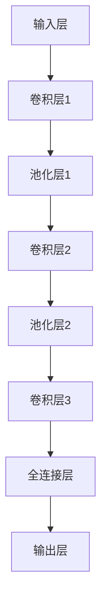

                 

### 《视频大模型的工程技术详解》

> **关键词**：视频大模型、深度学习、计算机视觉、神经网络、工程实践

> **摘要**：
本文将深入探讨视频大模型的工程技术，包括其基础理论、预处理、训练、优化、应用以及工程实践。通过详细的步骤分析和原理讲解，旨在为读者提供一个全面的技术指南，帮助理解视频大模型在人工智能领域的核心地位及其广泛应用。

## **第一部分：视频大模型基础**

### **第1章：视频大模型概述**

#### **1.1 视频大模型的概念与类型**

视频大模型指的是基于深度学习技术构建的、能够对视频数据执行复杂处理和分析的大型神经网络模型。这些模型可以涵盖多种类型，包括但不限于：

1. **视频分类模型**：用于对视频进行分类，如识别不同的视频类别。
2. **视频目标检测模型**：能够识别视频中的多个目标，并标注它们的位置。
3. **视频语义分割模型**：不仅识别目标，还能将视频帧分割为不同的语义区域。
4. **视频行为识别模型**：用于识别视频中的行为或动作，如运动、舞蹈等。
5. **视频增强与修复模型**：用于提高视频的清晰度或修复损坏的视频内容。

每种类型的视频大模型都有其特定的应用场景和目标。

#### **1.2 视频大模型的体系结构**

视频大模型通常基于卷积神经网络（CNN）构建，其基本体系结构包括：

1. **输入层**：接收视频数据作为输入，通常是一个三维数组，代表视频的宽度、高度和通道数。
2. **卷积层**：使用卷积操作提取视频中的特征。
3. **池化层**：降低数据维度，减少计算量。
4. **全连接层**：将卷积层提取的特征进行分类或回归操作。
5. **输出层**：根据模型的类型，输出分类标签、目标位置或分割图。

一个典型的视频大模型体系结构图如下所示：



#### **1.3 视频大模型在AI中的地位**

视频大模型在人工智能领域占据了重要地位，其发展不仅推动了计算机视觉技术的进步，还促进了人工智能在其他领域的应用。以下是一些关键点：

1. **技术创新**：视频大模型推动了深度学习技术的发展，尤其是在图像和视频处理方面。
2. **应用广泛**：视频大模型被广泛应用于安防监控、医疗诊断、自动驾驶、内容审核等多个领域。
3. **产业升级**：视频大模型的应用推动了相关产业的升级和转型，如智能监控设备、医疗影像分析系统等。

### **第2章：视频大模型的预处理**

#### **2.1 视频数据采集与存储**

视频数据采集是视频大模型预处理的首要步骤，数据的质量直接影响模型的性能。以下是一些关键点：

1. **数据源**：视频数据可以来自公开数据集、公司内部数据或通过网络爬虫获取。
2. **数据标注**：对视频进行标注，包括分类标签、目标边界框、动作标签等。
3. **数据存储**：使用数据库或分布式存储系统存储大量视频数据，如HDFS或MongoDB。

#### **2.2 视频数据处理流程**

视频数据处理流程包括数据清洗、增强和降维等步骤，以下是一个典型的数据处理流程：

1. **数据清洗**：去除噪音数据、填充缺失值、过滤异常值。
2. **数据增强**：通过旋转、缩放、裁剪等操作增加数据的多样性。
3. **数据降维**：使用特征提取技术降低数据维度，如主成分分析（PCA）或自编码器。

#### **2.3 视频增强与降维**

视频增强和降维是预处理阶段的重要任务，以下是两种常见的方法：

1. **视频增强**：
   - **色彩增强**：调整视频的色彩平衡、对比度等。
   - **噪声去除**：使用滤波器去除视频中的噪声。
   - **细节增强**：增强视频中的纹理和边缘信息。

2. **视频降维**：
   - **特征提取**：使用CNN提取视频的特征。
   - **主成分分析（PCA）**：通过保留主要成分降低数据维度。
   - **自编码器**：训练自编码器进行数据降维。

通过有效的预处理，可以提高视频大模型的训练效率和性能。

### **第3章：视频大模型的训练**

#### **3.1 视频大模型的训练框架**

视频大模型的训练框架通常包括以下步骤：

1. **数据加载**：从预处理后的数据集中加载训练数据。
2. **数据预处理**：对数据进行归一化、缩放等预处理操作。
3. **模型初始化**：初始化神经网络模型的权重。
4. **前向传播**：计算输入数据的预测结果。
5. **反向传播**：计算损失函数并更新模型权重。
6. **迭代训练**：重复上述步骤，直到模型达到预定的性能指标。

#### **3.2 深度学习算法选择**

选择合适的深度学习算法对视频大模型的训练至关重要。以下是一些常见的算法：

1. **卷积神经网络（CNN）**：适用于图像和视频数据。
2. **循环神经网络（RNN）**：适用于序列数据。
3. **长短期记忆网络（LSTM）**：RNN的变种，适用于长时间依赖关系。
4. **生成对抗网络（GAN）**：适用于生成对抗任务。

#### **3.3 训练策略与技巧**

有效的训练策略和技巧可以提高视频大模型的训练效率和性能。以下是一些关键点：

1. **数据增强**：通过旋转、缩放、裁剪等操作增加数据的多样性。
2. **学习率调整**：根据训练过程调整学习率。
3. **正则化**：防止模型过拟合，如L1正则化、L2正则化。
4. **批次大小**：调整批次大小以优化训练性能。
5. **模型融合**：使用多个模型融合预测结果，提高模型性能。

通过以上步骤和技巧，可以构建和训练高效的视频大模型。

### **第4章：视频大模型的优化**

#### **4.1 模型压缩与加速**

模型压缩和加速是提高视频大模型应用性能的重要手段。以下是一些关键技术：

1. **模型剪枝**：通过剪枝冗余的神经网络连接，减少模型大小。
2. **量化**：将模型的权重和激活值量化为更小的数值，减少模型大小。
3. **知识蒸馏**：使用一个较大的模型（教师模型）训练一个较小的模型（学生模型），提高学生模型的性能。
4. **硬件加速**：使用GPU、FPGA等硬件加速模型训练和推理。

#### **4.2 模型融合与多任务学习**

模型融合和多任务学习可以进一步提高视频大模型的性能。以下是一些关键技术：

1. **模型融合**：结合多个模型的预测结果，提高整体性能。
2. **多任务学习**：在一个模型中同时学习多个任务，提高模型的泛化能力。
3. **对抗训练**：通过对抗性样本训练模型，提高模型的鲁棒性。

#### **4.3 实时性优化**

实时性优化是视频大模型在实时应用场景中的关键。以下是一些关键技术：

1. **推理优化**：通过模型压缩、量化、硬件加速等技术提高推理速度。
2. **流式处理**：将视频数据分成多个帧进行流式处理，提高实时性。
3. **并发处理**：利用多线程或多GPU处理提高数据处理效率。

通过以上优化技术，可以构建高效的视频大模型，满足实时应用的需求。

## **第二部分：视频大模型的工程应用**

### **第5章：视频大模型在图像识别中的应用**

#### **5.1 视频目标检测**

视频目标检测是视频大模型在图像识别中的一个重要应用。以下是一个简单的目标检测流程：

1. **帧提取**：从视频中提取每一帧图像。
2. **特征提取**：使用卷积神经网络提取图像特征。
3. **目标检测**：使用目标检测算法（如YOLO、SSD、Faster R-CNN）检测图像中的目标。
4. **目标跟踪**：使用目标跟踪算法（如KCF、SOTA）跟踪目标在视频中的运动。

#### **5.2 视频分类**

视频分类是另一个重要的图像识别任务。以下是一个简单的视频分类流程：

1. **帧提取**：从视频中提取每一帧图像。
2. **特征提取**：使用卷积神经网络提取图像特征。
3. **视频表示**：将提取的特征进行聚合，生成视频表示。
4. **分类**：使用分类算法（如SVM、CNN、LSTM）对视频进行分类。

#### **5.3 视频语义分割**

视频语义分割是视频大模型在图像识别中的一个高级应用。以下是一个简单的视频语义分割流程：

1. **帧提取**：从视频中提取每一帧图像。
2. **特征提取**：使用卷积神经网络提取图像特征。
3. **语义分割**：使用语义分割算法（如FCN、U-Net）对图像进行分割。
4. **视频分割**：将每一帧的分割结果进行聚合，生成视频分割结果。

### **第6章：视频大模型在行为识别中的应用**

#### **6.1 行为识别概述**

行为识别是视频大模型在人工智能中的一个重要应用领域。它旨在通过分析视频数据，识别和分类人类行为。以下是一个简单的行为识别流程：

1. **帧提取**：从视频中提取每一帧图像。
2. **特征提取**：使用卷积神经网络提取图像特征。
3. **行为分类**：使用分类算法（如CNN、LSTM）对行为进行分类。

#### **6.2 行为检测**

行为检测是行为识别的一个重要组成部分，它旨在识别视频中的特定行为。以下是一个简单的行为检测流程：

1. **帧提取**：从视频中提取每一帧图像。
2. **特征提取**：使用卷积神经网络提取图像特征。
3. **行为检测**：使用检测算法（如R-CNN、YOLO）检测视频中的行为。

#### **6.3 行为分类**

行为分类是将识别出的行为进行分类的过程。以下是一个简单的行为分类流程：

1. **帧提取**：从视频中提取每一帧图像。
2. **特征提取**：使用卷积神经网络提取图像特征。
3. **行为分类**：使用分类算法（如SVM、CNN、LSTM）对行为进行分类。

### **第7章：视频大模型在内容审核中的应用**

#### **7.1 内容审核概述**

内容审核是视频大模型在人工智能中的一个重要应用领域，旨在通过分析视频内容，识别和过滤不良信息。以下是一个简单的内容审核流程：

1. **帧提取**：从视频中提取每一帧图像。
2. **特征提取**：使用卷积神经网络提取图像特征。
3. **不良行为识别**：使用分类算法（如CNN、LSTM）识别视频中的不良行为。
4. **实时审核**：对视频进行实时审核，过滤不良内容。

#### **7.2 不良行为识别**

不良行为识别是内容审核的一个重要组成部分，它旨在识别视频中的不良行为，如暴力、色情、违法等。以下是一个简单的不良行为识别流程：

1. **帧提取**：从视频中提取每一帧图像。
2. **特征提取**：使用卷积神经网络提取图像特征。
3. **行为检测**：使用检测算法（如R-CNN、YOLO）检测视频中的不良行为。

#### **7.3 实时内容审核系统搭建**

实时内容审核系统旨在对上传的视频进行实时审核，以下是一个简单的系统搭建流程：

1. **视频上传**：用户上传视频文件。
2. **预处理**：对视频进行预处理，如帧提取、特征提取等。
3. **审核**：使用视频大模型对视频进行审核，识别不良行为。
4. **反馈**：根据审核结果，对视频进行标记或删除。

### **第8章：视频大模型在视频增强与修复中的应用**

#### **8.1 视频增强技术**

视频增强技术旨在提高视频的视觉效果，如清晰度、对比度等。以下是一些常见的视频增强技术：

1. **色彩增强**：调整视频的色彩平衡、对比度等。
2. **噪声去除**：使用滤波器去除视频中的噪声。
3. **细节增强**：增强视频中的纹理和边缘信息。

#### **8.2 视频去噪与去模糊**

视频去噪与去模糊是视频增强的重要方面，以下是一些常见的去噪与去模糊技术：

1. **去噪**：
   - **滤波器**：如高斯滤波、中值滤波等。
   - **深度学习**：使用卷积神经网络去除噪声。

2. **去模糊**：
   - **图像复原**：使用图像复原算法（如Wiener滤波）。
   - **深度学习**：使用卷积神经网络去除模糊。

#### **8.3 视频修复与重建**

视频修复与重建旨在修复损坏的视频或重建缺失的视频内容。以下是一些常见的视频修复与重建技术：

1. **视频修复**：
   - **填充缺失帧**：使用图像修复算法填充缺失的帧。
   - **视频插值**：使用插值算法生成新的帧。

2. **视频重建**：
   - **3D重建**：使用立体视觉或结构光等技术重建视频场景。
   - **时间合成**：使用时间合成技术生成新的视频内容。

### **第9章：视频大模型在视频生成中的应用**

#### **9.1 视频生成技术**

视频生成技术旨在使用视频大模型生成新的视频内容。以下是一些常见的视频生成技术：

1. **视频风格迁移**：将一个视频的风格迁移到另一个视频，如将一个视频的风格迁移到电影《星际穿越》。
2. **视频编辑与合成**：对视频进行编辑和合成，生成新的视频内容，如视频拼接、视频特效等。

#### **9.2 视频风格迁移**

视频风格迁移技术旨在将一个视频的风格迁移到另一个视频。以下是一个简单的视频风格迁移流程：

1. **风格提取**：使用卷积神经网络提取风格特征。
2. **内容提取**：使用卷积神经网络提取内容特征。
3. **风格迁移**：将内容特征与风格特征融合，生成新的视频。

#### **9.3 视频编辑与合成**

视频编辑与合成技术旨在对视频进行编辑和合成，生成新的视频内容。以下是一个简单的视频编辑与合成流程：

1. **视频剪辑**：对视频进行剪辑，删除不需要的部分。
2. **视频特效**：添加视频特效，如滤镜、颜色调整等。
3. **视频拼接**：将多个视频拼接成一个新的视频。

## **第三部分：视频大模型的工程实践**

### **第10章：视频大模型开发环境搭建**

#### **10.1 计算机硬件选择**

选择合适的计算机硬件对视频大模型的训练和推理至关重要。以下是一些关键点：

1. **GPU**：选择性能强大的GPU，如NVIDIA的Titan Xp、V100等。
2. **CPU**：选择多核CPU，以提高数据处理速度。
3. **存储**：选择大容量、高速的存储设备，如SSD。

#### **10.2 软件工具安装与配置**

以下是在计算机上安装和配置视频大模型开发环境的步骤：

1. **安装Python**：安装Python 3.x版本，并配置pip。
2. **安装CUDA**：安装NVIDIA CUDA工具包，以便使用GPU进行深度学习训练。
3. **安装TensorFlow**：安装TensorFlow，以便使用深度学习框架。
4. **安装其他依赖库**：安装其他必要的依赖库，如NumPy、Pandas、Matplotlib等。

#### **10.3 开发环境优化**

以下是一些开发环境优化的技巧：

1. **多GPU训练**：配置多GPU训练，以提高训练速度。
2. **分布式训练**：使用分布式训练技术，将训练任务分布到多个GPU上。
3. **内存优化**：优化内存使用，避免内存溢出。

### **第11章：视频大模型项目实战**

#### **11.1 项目背景与目标**

以下是一个视频大模型项目实战的背景与目标：

**项目背景**：随着社交媒体的普及，视频内容审核成为一个重要问题，需要快速、准确地识别和过滤不良视频。

**项目目标**：构建一个实时内容审核系统，能够识别和过滤视频中的不良行为。

#### **11.2 数据集收集与处理**

以下是一个视频大模型项目实战的数据集收集与处理步骤：

1. **数据集收集**：收集包含不同类型视频的公开数据集。
2. **数据预处理**：对视频进行帧提取、数据增强等预处理操作。
3. **数据标注**：对视频进行标注，包括分类标签、目标边界框等。

#### **11.3 模型设计与实现**

以下是一个视频大模型项目实战的模型设计与实现步骤：

1. **模型设计**：设计一个基于卷积神经网络的模型，用于视频分类和目标检测。
2. **模型实现**：使用TensorFlow等深度学习框架实现模型。
3. **模型训练**：使用预处理后的数据集训练模型。

#### **11.4 项目部署与优化**

以下是一个视频大模型项目实战的项目部署与优化步骤：

1. **部署**：将训练好的模型部署到服务器，实现实时内容审核功能。
2. **优化**：优化模型参数，提高识别和过滤的准确性。

### **第12章：视频大模型的未来发展趋势**

#### **12.1 技术趋势分析**

视频大模型在未来将继续快速发展，以下是几个技术趋势：

1. **模型压缩与优化**：通过模型压缩和优化技术，降低模型大小和计算复杂度。
2. **实时性提升**：通过硬件加速和算法优化，提高模型的实时性。
3. **多模态融合**：结合图像、音频、文本等多模态数据，提高模型的泛化能力。

#### **12.2 应用前景展望**

视频大模型在多个领域的应用前景广阔，包括：

1. **安防监控**：实时识别和跟踪视频中的异常行为。
2. **医疗诊断**：通过视频分析辅助医生诊断疾病。
3. **自动驾驶**：通过视频分析提高自动驾驶汽车的感知能力。

#### **12.3 挑战与解决方案**

视频大模型在未来将面临一些挑战，如：

1. **数据隐私**：保护用户隐私，防止数据泄露。
2. **计算资源**：优化模型以适应有限的计算资源。
3. **鲁棒性**：提高模型对异常数据和噪声的鲁棒性。

### **附录**

#### **附录 A：视频大模型相关资源**

以下是一些视频大模型相关的资源：

1. **学术论文与报告**：查找最新的学术论文和报告，了解最新的研究进展。
2. **开源代码与工具**：使用开源代码和工具，如TensorFlow、PyTorch等，进行视频大模型开发。
3. **在线课程与培训**：参加在线课程和培训，学习视频大模型的最新技术和应用。

#### **附录 B：数学模型与算法伪代码**

以下是一些常用的数学模型和算法伪代码：

1. **神经网络算法伪代码**：
   ```python
   def neural_network(input_data):
       # 前向传播
       output = forward_propagation(input_data)
       # 反向传播
       gradient = backward_propagation(output)
       # 更新权重
       update_weights(gradient)
       return output
   ```

2. **卷积神经网络算法伪代码**：
   ```python
   def conv_neural_network(input_data):
       # 卷积层
       conv_output = convolution(input_data)
       # 池化层
       pool_output = pooling(conv_output)
       # 全连接层
       fc_output = fully_connected(pool_output)
       # 输出层
       output = activation(fc_output)
       return output
   ```

3. **生成对抗网络算法伪代码**：
   ```python
   def generative_adversarial_network(generator, discriminator):
       # 生成器生成数据
       generated_data = generator()
       # 判别器判断生成数据
       discriminator_output = discriminator(generated_data)
       # 生成器和判别器训练
       g_loss, d_loss = train_gan(generator, discriminator, generated_data, real_data)
       return g_loss, d_loss
   ```

#### **附录 C：项目实战代码解读**

以下是一个简单的视频大模型项目实战代码解读：

```python
# 数据预处理
def preprocess_data(video):
    # 提取帧
    frames = extract_frames(video)
    # 特征提取
    features = extract_features(frames)
    # 数据增强
    enhanced_features = data_augmentation(features)
    return enhanced_features

# 模型训练
def train_model(model, data, labels):
    # 训练模型
    model.fit(data, labels, epochs=10, batch_size=32)
    # 评估模型
    loss, accuracy = model.evaluate(data, labels)
    print("Accuracy:", accuracy)
    return model

# 模型部署
def deploy_model(model, video):
    # 预处理视频
    features = preprocess_data(video)
    # 预测结果
    predictions = model.predict(features)
    # 输出结果
    print(predictions)
```

通过以上代码，可以完成一个简单的视频大模型项目，包括数据预处理、模型训练和模型部署等步骤。

### **作者**

**作者：AI天才研究院/AI Genius Institute & 禅与计算机程序设计艺术 /Zen And The Art of Computer Programming**

本文由AI天才研究院撰写，旨在为读者提供关于视频大模型的全面技术指南。作者拥有丰富的计算机视觉和人工智能领域经验，对视频大模型的技术原理和工程实践有深入的研究。希望本文能够帮助读者更好地理解视频大模型的核心概念和应用，推动人工智能技术的进步。**END**

