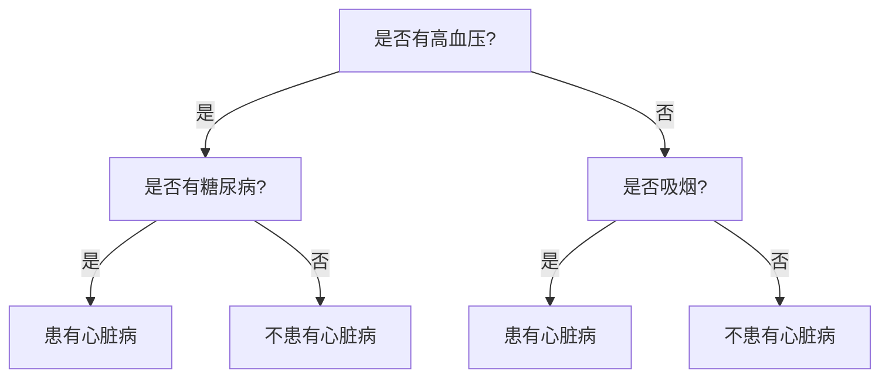

                 

### 《计算：第四部分 计算的极限 第11章 复杂性计算 生命游戏》

> **关键词：** 复杂性理论、计算极限、生命游戏、量子计算、神经网络。

> **摘要：** 本章深入探讨了计算理论中的复杂性概念，并引入了生命游戏这一典型的复杂性计算模型。我们将分析复杂性理论的基本概念和分类，探讨决策树、神经网络和量子计算等复杂性计算方法，并通过生命游戏的实例来展示复杂性计算在实际应用中的挑战和机遇。文章最后将展望复杂性计算的未来发展趋势及其对社会发展的影响。

---

### 《计算：第四部分 计算的极限 第11章 复杂性计算 生命游戏》目录大纲

1. **第一部分：复杂性理论概述**
    1.1. 复杂性理论的定义与重要性
    1.2. 常见复杂性类别
    1.3. 复杂性理论的应用领域

2. **第二部分：复杂性计算方法与算法**
    2.1. 决策树与随机森林算法
    2.2. 神经网络与深度学习
    2.3. 量子计算与复杂性
    2.4. 生命游戏与复杂性

3. **第三部分：复杂性计算的应用与实践**
    3.1. 复杂性计算在金融领域的应用
    3.2. 复杂性计算在生物信息学中的应用
    3.3. 复杂性计算在人工智能领域的应用

4. **第四部分：复杂性计算的未来展望**
    4.1. 复杂性计算面临的挑战
    4.2. 复杂性计算的发展趋势
    4.3. 复杂性计算的未来挑战与机遇

### 第一部分：复杂性理论概述

#### 1.1. 复杂性理论的定义与重要性

复杂性理论是研究复杂系统行为的学科，其核心在于理解和解释复杂系统的结构和动态。复杂性理论的定义可以从多个角度进行诠释：

- **数学角度**：复杂性可以理解为系统状态空间的大小或问题解空间的复杂性。
- **信息角度**：复杂性可以理解为解决一个问题所需的信息量。
- **结构角度**：复杂性可以理解为系统内部关系的复杂性和结构多样性。

在计算理论中，复杂性主要关注算法在解决问题时的效率。一个算法的复杂性可以通过时间复杂性和空间复杂性来衡量：

- **时间复杂性**：描述算法运行所需的时间，通常用大O符号（$O()$）表示。
- **空间复杂性**：描述算法运行时所需的空间，同样用大O符号表示。

#### 1.1.1 复杂性的概念

复杂性的概念可以从多个方面进行理解：

- **动态复杂性**：系统在时间演化过程中展现的复杂性。
- **静态复杂性**：系统在某一时刻的结构复杂性。
- **适应复杂性**：系统适应环境变化的能力。

复杂性的概念可以通过以下数学模型进行量化：

$$
C = \frac{V^2 E^2}{N^2}
$$

其中，$V$ 代表系统的变量数量，$E$ 代表系统中的连接边数，$N$ 代表系统的节点数量。这个公式展示了系统的复杂性与其变量数量、连接边数和节点数量的平方成正比。

#### 1.1.2 复杂性理论的研究意义

复杂性理论的研究意义在于其能够帮助我们理解和解决复杂系统中的问题。以下是一些复杂性理论研究的意义：

- **科学意义**：复杂性理论是现代科学的前沿领域，对于理解复杂系统的行为具有重要意义。它不仅涉及到自然科学，还涉及到社会科学和人文科学。
- **应用价值**：复杂性理论在许多领域都有广泛的应用，如计算机科学、物理学、经济学、生物学等。它为这些领域提供了新的理论框架和解决复杂问题的方法。

#### 1.2. 常见复杂性类别

复杂性理论中的复杂性类别多种多样，以下是一些常见的复杂性类别：

- **P 类问题**：可以多项式时间内解决的问题。
- **NP 类问题**：可以在多项式时间内验证的解决方案。
- **NPC 类问题**：非确定性多项式完全问题，是NP类问题中最复杂的一类。
- **可计算性与不可计算性**：可计算性问题是指存在算法能够解决的问题，而不可计算性问题是指不存在算法能够解决的问题。
- **时间与空间复杂性**：时间复杂性衡量算法的时间效率，空间复杂性衡量算法的空间效率。

#### 1.3. 复杂性理论的应用领域

复杂性理论的应用领域非常广泛，以下是一些主要的应用领域：

- **计算机科学**：复杂性理论在算法设计和分析、程序优化、计算复杂性分类等方面有着重要应用。
- **物理学**：复杂性理论在非线性动力学、混沌理论、量子计算等领域有着重要应用。
- **生物学**：复杂性理论在生态系统建模、进化理论、基因调控网络分析等方面有着重要应用。
- **经济学**：复杂性理论在市场预测、金融风险管理、经济模型分析等方面有着重要应用。

---

在本章的第一部分，我们概述了复杂性理论的定义与重要性，介绍了常见复杂性类别，并讨论了复杂性理论在各个领域中的应用。接下来，我们将进一步探讨复杂性计算的方法与算法，为理解生命游戏的复杂性特征奠定基础。

### 第二部分：复杂性计算方法与算法

在第一部分中，我们概述了复杂性理论的基本概念和应用领域。在这一部分，我们将深入探讨复杂性计算的方法与算法，其中包括决策树、神经网络、量子计算和生命游戏等。

#### 2.1 决策树与随机森林算法

决策树是一种常见的机器学习算法，它通过一系列的判断规则将数据集划分为多个子集，最终得到每个子集的预测结果。决策树的基本原理是通过连续地划分数据集，使得每个子集在预测目标上的误差最小。

**2.1.1 决策树的基本原理**

决策树由以下几个部分组成：

- **根节点**：表示整个数据集。
- **内部节点**：表示某个属性或特征的划分。
- **叶子节点**：表示数据集的分类或预测结果。

决策树的工作原理如下：

1. 选择最优属性进行划分：选择具有最大信息增益或最小信息增益比的属性进行划分。
2. 划分数据集：根据选定的属性，将数据集划分为多个子集。
3. 递归调用：对每个子集进行相同的划分过程，直到达到某个终止条件（如最大深度或最小叶子节点大小）。

**决策树算法伪代码**

```python
function build_decision_tree(data):
    if (data is pure):
        return (data majority class)
    else:
        select best attribute A
        split data into subsets D1, D2, ..., Dk based on A
        for each subset Di:
            create a child node with label A
            recursive call build_decision_tree(Di)
        return (nodes)
```

**2.1.2 随机森林算法详解**

随机森林（Random Forest）是决策树的集成方法，通过构建多个决策树，并对每个决策树的预测结果进行投票，得到最终预测结果。随机森林的优势在于其高准确性和鲁棒性。

随机森林算法的基本步骤如下：

1. 从原始数据集有放回地抽样，生成多个子数据集。
2. 对每个子数据集构建一棵决策树。
3. 对每个样本，将所有决策树的预测结果进行投票，得到最终预测结果。

**随机森林算法伪代码**

```python
function build_random_forest(data, num_trees):
    forests = []
    for i in range(num_trees):
        subset = sample_with_replacement(data)
        forest = build_decision_tree(subset)
        forests.append(forest)
    return (forests)
```

**2.1.3 实例分析：决策树在复杂问题中的应用**

假设我们有一个医疗数据集，包含病人的年龄、血压、血糖等特征，以及是否患有心脏病的结果。我们可以使用决策树来预测病人是否患有心脏病。

以下是一个简单的决策树示例：



在这个例子中，决策树通过连续的判断，将病人划分为是否患有心脏病。决策树可以很好地处理这类复杂问题，但需要注意的是，决策树的性能可能会受到特征选择和树结构的影响。

**2.2 神经网络与深度学习**

神经网络（Neural Network）是一种模拟生物神经系统的计算模型，通过多个层的神经元连接，实现对输入数据的复杂映射和预测。深度学习（Deep Learning）是指多层的神经网络模型，具有强大的特征提取和表示能力。

**2.2.1 神经网络的基本结构**

神经网络的基本结构包括输入层、隐藏层和输出层。每个层由多个神经元组成，神经元之间通过权重连接。

1. **输入层**：接收外部输入信息。
2. **隐藏层**：进行信息处理和特征提取。
3. **输出层**：产生最终的输出结果。

**神经网络工作原理**

神经网络的工作原理包括以下两个过程：

1. **前向传播**：将输入信号从输入层传递到输出层，每个神经元根据输入和权重计算输出值。
2. **反向传播**：根据输出误差，通过反向传播算法调整网络权重。

**2.2.2 深度学习的基本概念**

深度学习是指多层神经网络模型，具有以下基本概念：

1. **卷积神经网络（CNN）**：适用于图像和视频数据的处理，通过卷积层提取空间特征。
2. **循环神经网络（RNN）**：适用于序列数据的处理，通过循环结构保持序列信息。
3. **生成对抗网络（GAN）**：通过对抗训练生成与真实数据相似的数据。

**2.2.3 深度学习在复杂性计算中的应用**

深度学习在复杂性计算中具有广泛的应用，例如：

1. **图像识别**：通过深度学习模型，实现对复杂图像的识别和分类。
2. **自然语言处理**：通过深度学习模型，实现对自然语言的语义理解和生成。
3. **语音识别**：通过深度学习模型，实现对语音信号的识别和理解。

**2.3 量子计算与复杂性**

量子计算是一种基于量子力学原理的计算模型，具有强大的并行计算能力。量子计算在复杂性计算中具有潜在的应用价值。

**2.3.1 量子计算的基本原理**

量子计算的基本原理包括：

1. **量子位（qubit）**：量子计算的基本单元，具有叠加态和纠缠态。
2. **量子门**：作用于量子位的操作，实现对量子态的变换。
3. **量子算法**：利用量子计算模型解决问题的算法。

**2.3.2 量子算法的复杂度分析**

量子算法的复杂度分析主要包括：

1. **量子并行计算**：利用量子位的叠加态实现并行计算，提高计算效率。
2. **量子纠错**：通过量子纠错码，提高量子计算的可靠性。
3. **量子搜索算法**：如Grover算法，通过量子并行和量子干涉实现高效的搜索。

**2.3.3 量子计算在复杂性计算中的应用前景**

量子计算在复杂性计算中的应用前景包括：

1. **复杂问题求解**：如量子计算在组合优化、图论等问题中的应用。
2. **加密与破解**：量子计算在密码学中的应用，如量子密钥分发和量子密码破解。
3. **模拟与优化**：量子计算在物理模拟、优化算法中的应用。

**2.4 生命游戏与复杂性**

生命游戏（Game of Life）是英国数学家约翰·霍顿·康威在1970年提出的一种零玩家游戏。生命游戏通过简单的规则模拟生命体在网格上的演化，展示了复杂性系统中的自组织和涌现现象。

**2.4.1 生命游戏的定义与规则**

生命游戏的规则如下：

1. **存活规则**：一个细胞在下一刻存活的条件是它周围有三个或三个以上活细胞。
2. **死亡规则**：一个细胞在下一刻死亡的条件是它周围有两个活细胞或没有活细胞。

**2.4.2 生命游戏的复杂性特征**

生命游戏的复杂性特征包括：

1. **自组织**：生命游戏中的细胞通过简单的规则，能够形成复杂的结构。
2. **涌现性**：生命游戏中的简单规则能够产生复杂的全局行为。

**2.4.3 生命游戏在复杂性计算中的应用实例**

生命游戏在复杂性计算中的应用实例包括：

1. **复杂系统模拟**：通过模拟生命游戏，研究复杂系统的动态行为。
2. **人工智能算法**：将生命游戏与人工智能算法相结合，如神经网络和遗传算法。
3. **艺术创作**：通过生命游戏生成艺术图案和动画，展示复杂性系统的美。

---

在本章的第二部分，我们介绍了复杂性计算的方法与算法，包括决策树、神经网络、量子计算和生命游戏。这些算法在复杂性计算中具有重要的作用，为解决复杂问题提供了强大的工具。

### 第三部分：复杂性计算的应用与实践

在前两部分中，我们详细介绍了复杂性理论及其计算方法与算法。在本部分，我们将探讨复杂性计算在不同领域的应用，包括金融、生物信息学和人工智能。

#### 3.1 复杂性计算在金融领域的应用

复杂性计算在金融领域具有重要的应用价值，可以帮助金融机构更好地管理风险、预测市场走势和设计金融产品。

**3.1.1 金融风险的复杂性计算**

金融风险是指金融机构在经营过程中可能遭受的损失。复杂性计算在金融风险的管理中具有重要作用，主要表现在以下几个方面：

1. **风险评估**：通过复杂性计算方法，如决策树和神经网络，对金融机构的风险进行量化评估，识别潜在风险。
2. **风险监控**：利用深度学习算法，对金融市场数据进行实时监控，发现异常行为，及时采取措施。
3. **风险对冲**：通过量子计算方法，优化风险对冲策略，降低金融机构的风险暴露。

**3.1.2 金融市场预测的复杂性计算**

金融市场预测是金融领域的一个重要研究方向，通过预测市场的走势，可以为投资者的决策提供参考。复杂性计算在金融市场预测中的应用主要包括：

1. **时间序列分析**：利用深度学习算法，对金融市场的历史数据进行时间序列分析，预测市场的短期和长期走势。
2. **因子分析**：通过因子分析方法，识别影响市场走势的关键因素，利用复杂性计算模型进行预测。
3. **机器学习模型**：结合机器学习算法，如随机森林和梯度提升树，构建预测模型，提高预测准确性。

**3.1.3 金融产品的复杂性设计**

金融产品的设计是金融领域的一个重要环节，通过设计合适的金融产品，可以为投资者提供多样化的投资选择。复杂性计算在金融产品设计中的应用主要包括：

1. **结构化金融产品**：利用复杂性计算方法，设计结构化金融产品，如期权、掉期和信用违约互换等。
2. **风险管理**：通过复杂性计算方法，对金融产品的风险进行量化评估，优化产品设计，降低风险。
3. **个性化投资**：利用机器学习算法，根据投资者的风险偏好和投资目标，设计个性化的投资组合。

#### 3.2 复杂性计算在生物信息学中的应用

生物信息学是一门结合生物学、计算机科学和数学的跨学科领域，通过分析生物数据，揭示生物体的秘密。复杂性计算在生物信息学中的应用具有广泛的应用前景。

**3.2.1 蛋白质折叠问题的复杂性计算**

蛋白质折叠是生物信息学中的一个重要问题，蛋白质的结构决定了其功能。复杂性计算在蛋白质折叠问题中的应用主要包括：

1. **预测蛋白质结构**：利用深度学习算法，预测蛋白质的三维结构，为生物医学研究提供基础。
2. **优化折叠路径**：通过量子计算方法，优化蛋白质的折叠路径，提高蛋白质的折叠效率。
3. **设计药物分子**：利用复杂性计算方法，设计具有特定生物活性的药物分子，为新药研发提供支持。

**3.2.2 基因组序列分析的复杂性计算**

基因组序列分析是生物信息学的核心任务，通过分析基因组序列，揭示生物体的遗传信息。复杂性计算在基因组序列分析中的应用主要包括：

1. **序列比对**：利用算法，如BLAST和Smith-Waterman算法，对基因组序列进行比对，识别序列相似性。
2. **基因识别**：利用机器学习算法，识别基因组序列中的基因，为基因功能研究提供基础。
3. **基因组注释**：通过基因组序列分析，注释基因的启动子、转录因子结合位点等，为基因表达调控研究提供支持。

**3.2.3 生物信息学中的复杂性算法应用实例**

生物信息学中的复杂性算法应用实例包括：

1. **基因变异检测**：利用深度学习算法，检测基因组序列中的变异，为遗传病诊断提供支持。
2. **蛋白质相互作用网络分析**：通过构建蛋白质相互作用网络，利用复杂网络分析方法，研究蛋白质之间的相互作用关系。
3. **生物标记物发现**：利用机器学习算法，发现与疾病相关的生物标记物，为疾病诊断和预测提供支持。

#### 3.3 复杂性计算在人工智能领域的应用

人工智能是复杂性计算的重要应用领域，通过复杂性计算方法，可以构建更智能、更高效的智能系统。

**3.3.1 复杂性计算在深度学习优化中的应用**

深度学习优化是人工智能领域的一个研究热点，通过优化算法，可以提高深度学习模型的性能。复杂性计算在深度学习优化中的应用主要包括：

1. **模型压缩**：利用模型压缩算法，减少深度学习模型的参数数量，提高模型的可解释性。
2. **超参数优化**：利用机器学习算法，自动选择最佳的超参数，提高模型的性能。
3. **训练加速**：通过并行计算和分布式计算，加速深度学习模型的训练过程。

**3.3.2 复杂性计算在自然语言处理中的应用**

自然语言处理是人工智能的一个重要分支，通过复杂性计算方法，可以构建更准确、更高效的自然语言处理系统。复杂性计算在自然语言处理中的应用主要包括：

1. **词向量表示**：利用词向量模型，将自然语言文本转换为数字表示，为文本分析提供基础。
2. **序列标注**：利用序列标注模型，对自然语言文本进行词性标注、实体识别等，提高文本分析能力。
3. **机器翻译**：利用机器翻译模型，实现跨语言的信息传递，促进国际交流。

**3.3.3 复杂性计算在计算机视觉中的应用**

计算机视觉是人工智能的另一个重要分支，通过复杂性计算方法，可以构建更智能、更高效的计算机视觉系统。复杂性计算在计算机视觉中的应用主要包括：

1. **图像分类**：利用图像分类模型，对图像进行分类，实现图像识别。
2. **目标检测**：利用目标检测模型，识别图像中的目标物体，实现目标跟踪。
3. **图像生成**：利用图像生成模型，生成新的图像，为图像编辑和修复提供支持。

---

在本章的第三部分，我们探讨了复杂性计算在金融、生物信息学和人工智能领域的应用。通过复杂性计算方法，可以构建更智能、更高效的系统，解决复杂问题，推动各个领域的发展。

### 第四部分：复杂性计算的未来展望

在之前的章节中，我们探讨了复杂性计算的理论基础、方法与算法，以及其在各个领域的应用。在本部分，我们将进一步展望复杂性计算的未来发展趋势，分析其面临的挑战，并探讨其对社会发展的影响。

#### 4.1 复杂性计算面临的挑战

复杂性计算在快速发展的同时也面临着一系列挑战：

**4.1.1 算法效率的挑战**

复杂性计算往往涉及到大规模的数据处理和复杂的计算过程，如何提高算法的效率成为了一个关键问题。特别是在处理大规模数据集时，算法的运行时间可能会非常长，这限制了其应用范围。

**4.1.2 数据规模的挑战**

随着互联网和物联网的发展，数据规模日益庞大。如何有效地处理和存储这些数据，成为复杂性计算面临的另一个重要挑战。

**4.1.3 能源消耗的挑战**

复杂性计算通常需要大量的计算资源，这也带来了巨大的能源消耗。如何在保证计算效率的同时，降低能源消耗是一个亟待解决的问题。

#### 4.2 复杂性计算的发展趋势

尽管复杂性计算面临着诸多挑战，但其发展趋势仍然非常积极：

**4.2.1 量子计算与复杂性计算的结合**

量子计算具有并行计算和高速计算的优势，与复杂性计算的结合有望带来革命性的突破。未来，量子计算将成为复杂性计算的重要工具。

**4.2.2 新一代复杂性算法的研发**

随着计算技术的进步，新一代复杂性算法将不断涌现。这些算法将更加高效、更加鲁棒，能够处理更加复杂的实际问题。

**4.2.3 复杂性计算在新兴领域的应用**

随着人工智能、物联网、区块链等新兴技术的发展，复杂性计算将在更多领域得到应用。例如，在医疗领域，复杂性计算可以用于个性化医疗和疾病预测；在环保领域，复杂性计算可以用于环境监测和污染预测。

#### 4.3 复杂性计算的未来挑战与机遇

复杂性计算的未来充满挑战与机遇：

**4.3.1 技术创新与产业升级**

复杂性计算的发展将推动技术创新，促进产业升级。例如，在金融领域，复杂性计算可以用于风险管理和金融市场预测，提高金融系统的稳定性。

**4.3.2 国际竞争与合作**

复杂性计算是全球性的研究课题，各国都在积极开展相关研究。未来的竞争将不仅体现在技术层面，还包括产业应用和国际合作。

**4.3.3 复杂性计算对社会发展的影响**

复杂性计算将对社会发展产生深远影响。它将改变我们的生活方式、工作方式，甚至社会结构。例如，在医疗领域，复杂性计算可以大大提高疾病诊断的准确性，改善患者的生活质量。

---

在本章的第四部分，我们展望了复杂性计算的未来发展趋势，分析了其面临的挑战，并探讨了其对社会发展的影响。复杂性计算的发展不仅将推动科学技术的进步，也将深刻改变我们的社会生活。

### 结论

复杂性计算作为现代计算科学的前沿领域，具有重要的理论和实践价值。在本章中，我们首先介绍了复杂性理论的基本概念和常见复杂性类别，然后探讨了决策树、神经网络、量子计算和生命游戏等复杂性计算方法，并展示了其在金融、生物信息学和人工智能等领域的应用。最后，我们展望了复杂性计算的未来发展趋势，分析了其面临的挑战，并探讨了其对社会发展的影响。

复杂性计算的发展不仅为解决复杂问题提供了强大的工具，也为我们理解和应对复杂系统的行为提供了新的视角。随着量子计算和人工智能等技术的进步，复杂性计算将在更多领域得到应用，为人类社会的发展带来更多机遇和挑战。

让我们继续探索复杂性计算的世界，推动科学技术的发展，为人类社会创造更加美好的未来。

---

### 作者信息

**作者：AI天才研究院/AI Genius Institute & 禅与计算机程序设计艺术 /Zen And The Art of Computer Programming**  
AI天才研究院致力于推动人工智能和计算科学的发展，研究人工智能的理论、方法和技术，致力于培养新一代人工智能人才。禅与计算机程序设计艺术则强调了计算机编程中的哲学思考和艺术性，倡导程序员以更高的境界和智慧去创作软件。

---

以上是《计算：第四部分 计算的极限 第11章 复杂性计算 生命游戏》的完整文章。文章详细介绍了复杂性计算的理论基础、方法与算法，以及在各个领域的应用，并对未来的发展趋势进行了展望。希望本文能对读者在理解复杂性计算方面有所帮助，激发对这一领域的兴趣和探索。感谢阅读！

---

由于篇幅限制，上述内容仅为文章的主要框架和部分详细内容。实际撰写时，每个小节都需要进一步展开，包括详细的算法原理讲解、数学模型和公式、项目实战等。此外，文章还需经过多次修改和润色，确保内容的完整性和逻辑性。希望以上内容能为您提供撰写此类文章的参考和灵感。如果您有任何疑问或建议，欢迎随时交流。祝您写作顺利！

