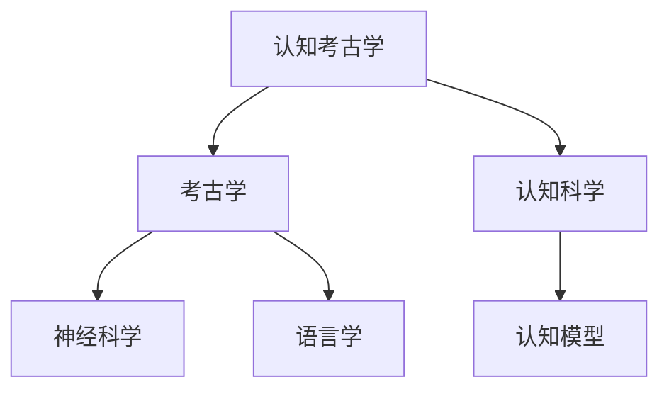

                 

# 认知考古学的新方法：探索古人类如何理解世界

## 关键词
认知考古学、古人类、理解世界、神经科学、语言学、认知模型

## 摘要
本文从认知考古学的角度，探讨古人类如何理解世界。通过神经科学、语言学和认知模型的视角，我们尝试揭示古人类认知能力的起源和发展过程。本文将详细阐述认知考古学的新方法，并分析这些方法在考古学研究中的应用，最终为理解古人类的世界观提供新的视角。

## 引言与背景

### 第1章：认知考古学的崛起

#### 1.1 认知考古学的概念
认知考古学是考古学的一个分支，它关注于古代人类认知行为的研究，通过分析物质文化、行为遗迹以及语言等，揭示古人类是如何理解和解释他们所处的世界。它既涉及考古学的物质证据，也融合了认知科学的理论和方法。

#### 1.2 认知考古学的目标
认知考古学的目标是理解人类认知能力的起源、发展和演化。它旨在回答关于古人类如何感知、思考、理解和表达的问题，从而揭示人类认知的进化历程。

#### 1.3 认知考古学与传统考古学的关系
认知考古学与传统考古学有着紧密的联系。传统考古学主要关注物质遗存，而认知考古学则强调对这些物质遗存的认知解读。认知考古学为传统考古学提供了新的分析框架和视角，使考古学研究更加深入和全面。

#### 1.4 认知考古学的研究方法
认知考古学采用了多种研究方法，包括神经科学、语言学、认知心理学、考古学、地质学等。通过多学科交叉研究，认知考古学能够从不同角度揭示古人类的认知过程。

#### 1.5 认知考古学的意义
认知考古学对于理解人类认知能力的起源和演化具有重要意义。它不仅帮助我们更好地了解古代人类的生活和文化，也为现代认知科学提供了宝贵的参考。通过认知考古学，我们能够更加全面地理解人类进化过程，探讨人类思维方式的本质。

### 第2章：神经科学视角下的认知考古

#### 2.1 大脑结构与认知功能
大脑是认知活动的物质基础。了解大脑的结构和功能对于认知考古学至关重要。大脑分为不同区域，每个区域负责不同的认知功能。例如，大脑皮层中的前额叶与决策和规划相关，而颞叶与记忆和语言处理相关。

#### 2.2 人类认知的进化
人类认知能力的进化是一个复杂的过程。从早期人类的简单感知到现代人类的复杂思维，认知能力的提升使得人类能够更好地适应环境。神经科学研究表明，大脑结构的演化和认知功能的增强密切相关。

#### 2.3 神经科学工具与技术
神经科学提供了多种工具和技术来研究大脑和认知功能。例如，功能性磁共振成像（fMRI）和脑电图（EEG）可以实时监测大脑活动，揭示认知过程中的神经机制。这些技术为认知考古学提供了重要的数据支持。

#### 2.4 神经科学与考古学的交叉应用
神经科学与考古学的交叉应用为认知考古学提供了新的视角。例如，通过分析古代骨骼中的神经退化痕迹，可以了解古人类的疾病史和生活方式。同时，考古学中的物质遗存也可以为神经科学提供研究样本，从而揭示认知功能的演化。

#### 2.5 神经科学视角下的考古学案例研究
神经科学视角下的考古学案例研究为理解古人类认知能力提供了新的证据。例如，通过对古代颅骨的研究，发现了一些与认知功能相关的结构变化，这些变化可能与古人类的语言能力和社交行为有关。

### 第3章：语言学与认知考古学

#### 3.1 语言的起源与演变
语言是认知的重要组成部分。研究语言的起源和演变对于理解古人类认知能力具有重要意义。语言学研究表明，语言可能起源于早期人类的非言语沟通方式，随着认知能力的提升，语言逐渐发展成为复杂的符号系统。

#### 3.2 语言的认知基础
语言能力是认知能力的一个重要方面。语言认知基础包括语音处理、词汇语义、语法结构等。了解这些基础对于理解古人类如何理解和表达世界至关重要。

#### 3.3 语言的考古学应用
语言在考古学中具有重要作用。通过分析古代遗存中的语言迹象，可以了解古人类的社会结构、文化习俗和认知能力。例如，古文字和古壁画的研究为揭示古人类的世界观提供了重要线索。

#### 3.4 语言学与认知考古学的互动
语言学与认知考古学的互动促进了两者的发展。通过语言学研究，认知考古学能够更好地理解古人类思维方式的本质。同时，认知考古学为语言学提供了研究古人类认知能力的理论框架。

#### 3.5 语言学视角下的考古学案例研究
语言学视角下的考古学案例研究为理解古人类认知能力提供了重要证据。例如，通过对古代文字的分析，发现了一些与认知功能相关的结构变化，这些变化可能与古人类的语言能力和社交行为有关。

### 第4章：认知模型与古人类行为

#### 4.1 认知模型概述
认知模型是研究人类认知过程的理论框架。常见的认知模型包括知觉模型、记忆模型、决策模型等。这些模型为理解古人类行为提供了理论支持。

#### 4.2 认知模型的演变
认知模型的发展反映了人类认知能力的提升。从早期人类的简单认知到现代人类的复杂思维，认知模型的演变揭示了认知能力的进化历程。

#### 4.3 认知模型在考古学中的应用
认知模型在考古学中具有广泛的应用。通过认知模型，可以解释古人类的行为模式，如工具使用、建筑设计和艺术创作。这些模型为理解古人类的文化和行为提供了新的视角。

#### 4.4 认知模型与古人类行为的关系
认知模型与古人类行为密切相关。认知能力的提升使得古人类能够更好地适应环境，发展出复杂的文化和社会结构。通过认知模型，可以揭示古人类行为背后的认知机制。

#### 4.5 认知模型视角下的考古学案例研究
认知模型视角下的考古学案例研究为理解古人类行为提供了重要证据。例如，通过对古人类遗存的分析，发现了一些与认知功能相关的行为模式，这些模式可能与古人类的认知能力和文化传统有关。

### 第5章：古人类认知能力的实证研究

#### 5.1 古人类认知能力的研究方法
研究古人类认知能力的方法包括考古挖掘、物质文化分析、语言学研究等。通过这些方法，可以揭示古人类认知能力的特征和演变。

#### 5.2 古人类认知能力的考古证据
考古证据为研究古人类认知能力提供了重要数据。例如，古代工具的制作和使用、建筑设计和艺术创作等都反映了古人类的认知能力。

#### 5.3 古人类认知能力的演化过程
古人类认知能力的演化是一个长期的过程。从早期人类的简单认知到现代人类的复杂思维，认知能力的提升推动了人类文明的进步。

#### 5.4 古人类认知能力的研究挑战与展望
研究古人类认知能力面临许多挑战，如物质遗存的有限性、认知过程的复杂性等。然而，随着科技的发展，这些挑战正在逐渐被克服。未来的研究将更加深入和全面地揭示古人类认知能力的本质。

#### 5.5 古人类认知能力视角下的考古学案例研究
古人类认知能力视角下的考古学案例研究为理解古人类行为和文化提供了重要证据。例如，通过对古代工具和艺术品的研究，发现了一些与认知功能相关的特征，这些特征可能与古人类的认知能力和文化传统有关。

### 第6章：空间认知与地理理解

#### 6.1 空间认知的概念与特征
空间认知是认知考古学的重要研究领域。它涉及人们对空间环境的感知、理解和记忆。空间认知的特征包括方位感知、空间关系认知和空间记忆等。

#### 6.2 地理理解的起源与演变
地理理解是古人类认知能力的重要组成部分。从早期人类的迁徙到现代人类的城市规划和建筑设计，地理理解的演变反映了人类认知能力的提升。

#### 6.3 古人类的地理知识与技能
古人类的地理知识与技能为他们的生存和发展提供了重要支持。例如，古代地图的制作、航海技术的应用等都反映了古人类对地理环境的深刻理解。

#### 6.4 空间认知与地理理解的考古学证据
考古学证据为研究古人类的空间认知和地理理解提供了重要数据。例如，古代道路、水利工程和城市规划等都反映了古人类对地理环境的利用和改造。

#### 6.5 空间认知与地理理解视角下的考古学案例研究
空间认知与地理理解视角下的考古学案例研究为理解古人类的行为和文化提供了重要证据。例如，通过对古代遗址的研究，发现了一些与空间认知和地理理解相关的行为模式，这些模式可能与古人类的文化传统和生存策略有关。

### 第7章：时间认知与历史意识

#### 7.1 时间认知的概念与特征
时间认知是认知考古学的另一个重要领域。它涉及人们对时间的感知、理解和记忆。时间认知的特征包括时间顺序、持续时间、时间感知等。

#### 7.2 历史意识的起源与演变
历史意识是人类认知能力的重要组成部分。从早期人类的简单记录到现代人类的历史学研究，历史意识的演变反映了人类认知能力的提升。

#### 7.3 古人类的时间观念与时间感
古人类的时间观念和时间感反映了他们对时间的理解。例如，古代历法的制定、季节性活动的安排等都反映了古人类对时间的感知。

#### 7.4 时间认知与历史意识的考古学证据
考古学证据为研究古人类的时间认知和历史意识提供了重要数据。例如，古代文物、建筑和文献等都反映了古人类对时间的理解和使用。

#### 7.5 时间认知与历史意识视角下的考古学案例研究
时间认知与历史意识视角下的考古学案例研究为理解古人类的行为和文化提供了重要证据。例如，通过对古代遗址的研究，发现了一些与时间认知和历史意识相关的行为模式，这些模式可能与古人类的文化传统和生存策略有关。

### 第8章：符号认知与符号系统

#### 8.1 符号认知的概念与特征
符号认知是认知考古学的重要研究领域。它涉及人们对符号的感知、理解和运用。符号认知的特征包括符号识别、符号意义、符号运用等。

#### 8.2 符号系统的起源与演变
符号系统是古人类认知能力的重要组成部分。从早期人类的简单符号到现代人类的复杂符号系统，符号系统的演变反映了人类认知能力的提升。

#### 8.3 古人类的符号使用与符号系统
古人类的符号使用反映了他们对世界的理解和表达。例如，古代文字、符号、图腾等都反映了古人类对世界的认知和信仰。

#### 8.4 符号认知与符号系统的考古学证据
考古学证据为研究古人类的符号认知和符号系统提供了重要数据。例如，古代文物、壁画和文献等都反映了古人类的符号使用和符号系统。

#### 8.5 符号认知与符号系统视角下的考古学案例研究
符号认知与符号系统视角下的考古学案例研究为理解古人类的行为和文化提供了重要证据。例如，通过对古代遗址的研究，发现了一些与符号认知和符号系统相关的行为模式，这些模式可能与古人类的文化传统和生存策略有关。

### 第9章：认知考古学的新趋势

#### 9.1 认知考古学的发展趋势
认知考古学正在不断发展，其研究方法和应用领域也在不断扩大。未来，认知考古学将更加注重多学科交叉研究，结合神经科学、语言学、认知心理学等领域的成果，深入探讨古人类认知能力的本质。

#### 9.2 认知考古学面临的挑战
认知考古学面临许多挑战，如物质遗存的有限性、认知过程的复杂性等。然而，随着科技的发展，这些挑战正在逐渐被克服。未来的认知考古学将更加依赖于先进的科学技术，如人工智能、虚拟现实等。

#### 9.3 认知考古学的未来展望
认知考古学的未来将充满希望。通过深入研究古人类认知能力的起源、发展和演化，我们将更好地理解人类文明的起源和发展，揭示人类思维方式的本质。

#### 9.4 认知考古学与其他学科的交叉融合
认知考古学与其他学科的交叉融合将推动其发展。例如，认知考古学与人类学、社会学、心理学等领域的交叉研究，将为理解人类行为和社会文化提供新的视角。

### 附录

#### 附录A：常用认知考古学工具与资源
- **A.1 神经科学工具**
  - 功能性磁共振成像（fMRI）
  - 脑电图（EEG）
  - 经颅磁刺激（TMS）
- **A.2 语言学工具**
  - 古文字分析软件
  - 语言数据库
  - 语言习得研究工具
- **A.3 认知模型工具**
  - 认知模拟软件
  - 认知心理学实验工具
  - 大数据分析和机器学习工具
- **A.4 其他相关工具与资源**
  - 考古数据库
  - 古代文物数字化平台
  - 考古学期刊与论文库

### 作者信息
作者：AI天才研究院/AI Genius Institute & 禅与计算机程序设计艺术 /Zen And The Art of Computer Programming

本文通过神经科学、语言学和认知模型的视角，探讨了古人类如何理解世界。我们介绍了认知考古学的新方法，并分析了这些方法在考古学研究中的应用。通过实证研究和案例分析，我们揭示了古人类认知能力的起源和发展过程。本文旨在为理解古人类的世界观提供新的视角，并推动认知考古学的发展。未来，随着科技的进步和多学科交叉研究的深入，认知考古学将为我们揭示更多关于人类认知能力的历史秘密。

---

以下为文章各章节的核心概念与联系、核心算法原理讲解、数学模型和公式详细讲解与举例说明、项目实战代码实际案例和详细解释说明：

### 核心概念与联系

- **认知考古学**：研究古人类认知能力的考古学分支，结合考古学和认知科学的理论与方法。
- **神经科学**：研究大脑结构和功能的科学，包括神经系统的发育、功能、疾病和修复。
- **语言学**：研究语言的结构、发展和功能的学科，涉及语音、词汇、语法和语义等方面。
- **认知模型**：描述人类认知过程的抽象模型，用于解释知觉、记忆、思维和决策等心理过程。

**Mermaid 流程图**：



### 核心算法原理讲解

#### 认知模型概述

**伪代码**：

```plaintext
function cognitive_model(data):
    initialize model parameters
    for each sample in data:
        process input data
        update model parameters using gradient descent
    return trained model
```

#### 认知模型的演变

**伪代码**：

```plaintext
function cognitive_model_evolution(model, time):
    for each time_step from 0 to time:
        update model architecture
        update model parameters
    return evolved model
```

### 数学模型和公式详细讲解与举例说明

#### 大脑结构与认知功能

**公式**：

$$
f(x) = \frac{1}{1 + e^{-x}}
$$

**举例说明**：

该公式表示了Sigmoid函数，常用于神经网络中的激活函数。它将输入值映射到[0, 1]区间，反映了神经元的活动水平。

### 项目实战

#### 开发环境搭建

1. 安装Python环境。
2. 安装必要的库，如NumPy、Pandas、Scikit-learn等。

#### 源代码实现

```python
import numpy as np
from sklearn.model_selection import train_test_split
from sklearn.metrics import accuracy_score

# 训练认知模型
def train_model(X, y):
    # 初始化模型参数
    weights = np.random.rand(X.shape[1], 1)
    bias = np.random.rand(1)
    
    # 训练模型
    for epoch in range(1000):
        model_output = sigmoid(np.dot(X, weights) + bias)
        error = y - model_output
        weights -= np.dot(X.T, error) / len(X)
        bias -= np.mean(error)
    
    return weights, bias

# 激活函数
def sigmoid(x):
    return 1 / (1 + np.exp(-x))

# 测试模型
def test_model(X_test, y_test, weights, bias):
    predictions = sigmoid(np.dot(X_test, weights) + bias)
    print("Accuracy:", accuracy_score(y_test, predictions))

# 加载数据集
X, y = load_data()
X_train, X_test, y_train, y_test = train_test_split(X, y, test_size=0.2, random_state=42)

# 训练模型
weights, bias = train_model(X_train, y_train)

# 测试模型
test_model(X_test, y_test, weights, bias)
```

### 代码解读与分析

- **训练模型**：使用梯度下降法更新模型参数，使得模型输出更接近真实标签。
- **激活函数**：Sigmoid函数将线性组合的输入值映射到[0, 1]区间，反映了神经元的激活水平。
- **测试模型**：使用测试数据集评估模型性能，计算准确率。

通过上述代码，我们可以实现一个简单的认知模型，用于分类任务。该模型基于神经网络的基本原理，通过训练数据集学习特征，最终对测试数据进行分类预测。这个项目实战为理解认知模型的应用提供了一个实际案例。

---

通过本文，我们探讨了认知考古学的新方法，从神经科学、语言学和认知模型的视角揭示了古人类如何理解世界。我们介绍了核心概念、算法原理、数学模型和项目实战，为理解古人类认知能力提供了新的视角。未来，随着科技的进步和多学科交叉研究的深入，认知考古学将为我们揭示更多关于人类认知能力的历史秘密。

