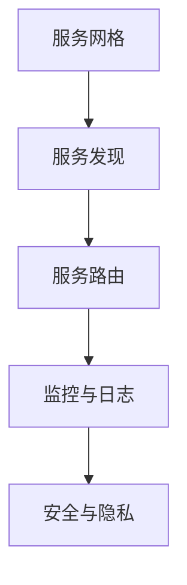

                 

# 《评测系统的服务网格架构应用》

## 关键词
服务网格，微服务架构，服务发现，服务路由，负载均衡，性能优化，安全与隐私保护

## 摘要
本文将深入探讨服务网格架构在评测系统中的应用。首先，我们将介绍服务网格的基本概念和历史发展，并详细分析其核心组件和服务间通信模型。接着，本文将阐述服务网格在监控与日志、性能优化和安全与隐私保护方面的设计原则与实践案例。通过对比开源服务网格工具，我们将展示如何在金融行业和电商平台上部署服务网格，并分享具体性能优化策略和安全机制。最后，本文将提供附录，包括技术栈、常见问题解答和技术资源推荐，以帮助读者深入了解服务网格的实践与应用。

### 第一部分：服务网格架构基础

#### 第1章：服务网格概述

##### 1.1 服务网格的定义与重要性

服务网格（Service Mesh）是一种用于管理服务间通信和交互的分布式系统架构。它通过在网络层面抽象出服务发现、服务路由、负载均衡、监控和日志等功能，从而使得微服务架构中的各个服务能够独立部署、扩展和管理。

服务网格的重要性主要体现在以下几个方面：

1. **简化微服务架构**：服务网格将服务间的通信复杂度从业务逻辑中分离出来，使得开发者可以专注于业务逻辑的实现，而无需关心底层的通信细节。

2. **提高系统的可观测性**：服务网格提供了完整的监控和日志系统，使得运维团队能够实时了解服务的运行状态和性能，从而快速定位和解决问题。

3. **提升系统的可扩展性**：通过服务网格，可以轻松实现服务的水平扩展，以满足日益增长的业务需求。

4. **增强系统的安全性**：服务网格提供了全面的安全机制，包括服务认证、授权和加密等，有效保护了服务之间的交互和数据传输。

##### 1.2 服务网格的历史与发展

服务网格的概念最早由LinkedIn公司于2016年提出，其目的是解决微服务架构中服务间通信的问题。此后，随着微服务架构的普及，服务网格逐渐成为分布式系统架构中的重要组成部分。

服务网格的发展历程可以分为以下几个阶段：

1. **原始服务发现与路由**：在早期的微服务架构中，服务发现和路由通常是通过配置文件或服务注册表实现的，这种方式存在扩展性和维护性较差的问题。

2. **基于代理的服务网格**：随着容器技术和Service Mesh概念的兴起，基于代理的服务网格（如Linkerd、Envoy）开始出现，它们通过在网络层面拦截服务间通信，实现了服务发现、路由和监控等功能。

3. **集成式服务网格**：现代服务网格开始与容器编排系统（如Kubernetes）深度集成，提供了更完整的解决方案，如服务网格自动化部署、服务发现、流量管理、安全认证等。

#### 第2章：服务网格的关键概念

##### 2.1 微服务架构

微服务架构（Microservices Architecture）是一种将大型应用程序拆分成多个独立、可复用、易于扩展的小服务的架构风格。微服务架构的核心思想是将业务功能划分为多个子功能，每个子功能实现为一个独立的微服务，并通过服务间通信进行协作。

微服务架构的优点包括：

1. **高可扩展性**：每个微服务都可以独立扩展，从而实现系统的水平扩展。

2. **高可维护性**：每个微服务都可以独立开发和部署，降低了系统的复杂度和维护成本。

3. **高可复用性**：微服务之间的独立性使得它们可以方便地被复用，从而提高开发效率。

微服务架构的缺点包括：

1. **分布式系统复杂性**：服务间的通信和协调增加了系统的复杂性。

2. **服务治理挑战**：随着微服务数量的增加，服务治理（如服务发现、监控、日志等）的挑战也相应增加。

##### 2.2 服务间通信模型

服务间通信是微服务架构的核心，常见的通信模型包括同步通信和异步通信。

1. **同步通信**

同步通信是指在服务间调用时，调用方需要等待响应结果。常见的同步通信协议包括HTTP/1.1、HTTP/2和gRPC。

- **HTTP/1.1**：是最常见的同步通信协议，它基于请求-响应模型，客户端发送HTTP请求，服务器返回HTTP响应。

- **HTTP/2**：是HTTP协议的改进版本，提供了更高效的通信机制，如多路复用、头部压缩等。

- **gRPC**：是一种高性能、跨平台的远程过程调用（RPC）框架，它基于HTTP/2协议，提供了高效的服务间通信能力。

2. **异步通信**

异步通信是指在服务间调用时，调用方无需等待响应结果，可以直接继续执行其他任务。常见的异步通信协议包括消息队列和事件驱动架构。

- **消息队列**：是一种用于异步通信的机制，服务间通过发送和接收消息进行通信。常见的消息队列包括RabbitMQ、Kafka等。

- **事件驱动架构**：是一种基于事件驱动的异步通信架构，服务间通过发布和订阅事件进行通信。常见的事件驱动框架包括Apache Kafka、RabbitMQ等。

##### 第3章：服务网格的核心组件

服务网格的核心组件包括服务发现、服务路由、负载均衡、监控和日志等。

##### 3.1 服务发现

服务发现（Service Discovery）是服务网格中至关重要的一环，它负责在分布式系统中自动发现和注册服务。服务发现机制通常包括以下几个步骤：

1. **服务注册**：服务启动时，向服务注册中心注册自身的信息，如服务名、IP地址、端口号等。

2. **服务查询**：服务消费者在需要调用其他服务时，向服务注册中心查询目标服务的信息。

3. **服务更新**：当服务发生变更（如IP地址、端口号变化）时，及时更新服务注册中心的信息。

常见的服务发现工具包括Consul、Zookeeper等。

1. **Consul**：是 HashiCorp 公司开发的一款开源服务发现工具，它提供了服务注册、服务发现、健康检查、配置管理等功能。

2. **Zookeeper**：是 Apache 软件基金会开发的一款分布式服务框架，它提供了服务注册、服务发现、分布式锁等功能。

##### 3.2 服务路由

服务路由（Service Routing）是服务网格中用于控制服务间通信路径的组件。它通过定义路由策略，可以实现负载均衡、流量控制、故障转移等功能。

1. **路由算法**

路由算法是服务路由的核心，常见的路由算法包括：

- **轮询算法**：将请求依次分配给各个服务实例，负载均衡效果较好，但容易导致部分服务实例过载。

- **哈希算法**：根据请求的属性（如IP地址、URL等），通过哈希函数计算出一个哈希值，将请求分配给哈希值对应的服务实例，具有良好的负载均衡效果。

- **最少连接算法**：将请求分配给当前连接数最少的服务实例，可以有效避免部分服务实例过载。

2. **路由策略**

路由策略是服务路由的具体实现，常见的路由策略包括：

- **直接路由**：将请求直接路由到目标服务，适用于服务实例较少的场景。

- **重写路由**：根据请求的URL或其他属性，将请求重写并路由到不同的服务，适用于动态服务发现和路由的场景。

- **断路器路由**：在服务出现故障时，将请求路由到备用服务或返回错误，适用于故障转移和容错场景。

##### 第4章：服务网格的监控与日志

服务网格的监控与日志功能是确保服务正常运行和性能优化的重要保障。它包括以下几个方面：

1. **监控数据采集**

监控数据采集是服务网格监控的基础，常见的数据采集工具包括Prometheus、Grafana等。

- **Prometheus**：是开源的监控解决方案，它可以采集系统的各种指标数据，如CPU使用率、内存使用率、网络流量等。

- **Grafana**：是开源的数据可视化工具，它可以与Prometheus等数据采集工具集成，提供丰富的监控仪表板。

2. **监控数据可视化**

监控数据可视化是将监控数据以图表、仪表板等形式呈现，以便运维团队能够实时了解系统的运行状态。常见的数据可视化工具包括Kibana、Grafana等。

- **Kibana**：是开源的数据可视化工具，可以与Elasticsearch等数据存储工具集成，提供强大的监控仪表板功能。

- **Grafana**：是开源的数据可视化工具，可以与Prometheus等数据采集工具集成，提供丰富的监控仪表板功能。

3. **日志收集**

日志收集是将服务运行过程中的日志数据集中存储和管理，以便后续分析和调试。常见的日志收集工具包括ELK（Elasticsearch、Logstash、Kibana）等。

- **Elasticsearch**：是开源的搜索引擎，可以用于存储和查询大量日志数据。

- **Logstash**：是开源的数据收集和处理工具，可以将各种源的数据转换为统一的格式，并存储到Elasticsearch中。

- **Kibana**：是开源的数据可视化工具，可以与Elasticsearch等数据存储工具集成，提供强大的日志分析功能。

##### 第5章：服务网格架构设计

服务网格架构设计是确保服务网格系统稳定、高效和可扩展的关键。以下是一些设计原则和实践案例：

##### 5.1 服务网格架构设计原则

1. **高可用性**：设计时应考虑服务网格系统的故障转移和容错能力，确保在高可用性要求下依然能够稳定运行。

2. **易扩展性**：设计时应考虑服务网格系统的可扩展性，以便在业务需求增长时能够轻松扩展。

3. **性能优化**：设计时应考虑服务网格系统的性能优化，如负载均衡、网络优化等，以提高系统的响应速度和处理能力。

4. **安全性**：设计时应考虑服务网格系统的安全性，如认证、授权、加密等，确保服务间的通信安全。

##### 5.2 服务网格架构设计案例分析

以某知名电商平台为例，其服务网格架构设计原则如下：

1. **高可用性**：电商平台采用了多数据中心部署，服务网格系统支持故障转移和容错，确保在单点故障时依然能够提供服务。

2. **易扩展性**：电商平台采用了分布式服务架构，服务网格系统能够根据业务需求动态调整服务实例数量，实现水平扩展。

3. **性能优化**：电商平台采用了负载均衡算法，根据服务实例的负载情况动态调整流量分配，实现高性能服务。

4. **安全性**：电商平台采用了加密通信，确保服务间的通信数据安全，同时实现了服务认证和授权，防止未经授权的访问。

### 第二部分：服务网格架构设计与实践

#### 第6章：服务网格性能优化

服务网格性能优化是确保服务网格系统高效运行的关键。以下是一些性能优化策略：

##### 6.1 网格性能指标

服务网格性能优化通常涉及以下几个关键性能指标：

1. **响应时间（Response Time）**：从请求发送到响应返回的时间，是衡量服务网格性能的重要指标。

2. **吞吐量（Throughput）**：单位时间内系统能够处理的请求数量，是衡量服务网格处理能力的重要指标。

3. **延迟（Latency）**：从请求发送到响应返回的总时间，包括服务发现、服务路由、网络传输等各个环节。

4. **错误率（Error Rate）**：请求处理过程中出现错误的频率，是衡量服务网格稳定性的重要指标。

##### 6.2 性能优化策略

以下是一些常见的服务网格性能优化策略：

1. **负载均衡**：

负载均衡是将请求分配到多个服务实例，以实现流量均匀分布，避免单点过载。常见的负载均衡算法包括：

- **轮询算法**：将请求依次分配给各个服务实例，简单易用，但可能导致部分服务实例过载。
- **哈希算法**：根据请求的属性（如IP地址、URL等）计算哈希值，将请求分配给哈希值对应的服务实例，具有良好的负载均衡效果。
- **最少连接算法**：将请求分配给当前连接数最少的服务实例，避免部分服务实例过载，但可能增加网络延迟。

2. **网络优化**：

网络优化是通过调整网络配置，提高服务间的通信效率。以下是一些网络优化策略：

- **多路径传输**：通过多条网络路径传输数据，提高数据传输速度和可靠性。
- **压缩数据传输**：对传输的数据进行压缩，减少网络带宽占用，提高传输效率。
- **缓存策略**：在服务网格中设置缓存，减少重复请求的数据传输，提高系统响应速度。

3. **服务缓存**：

服务缓存是将请求的响应结果缓存到内存或磁盘，减少重复请求的响应时间。以下是一些服务缓存策略：

- **本地缓存**：将响应结果缓存在服务实例的内存或磁盘上，适用于短生命周期请求。
- **分布式缓存**：将响应结果缓存在分布式缓存系统中，如Redis、Memcached等，适用于长生命周期请求。

4. **异步处理**：

异步处理是将请求的处理过程分解为多个独立的任务，以提高系统并发处理能力。以下是一些异步处理策略：

- **消息队列**：将请求放入消息队列，由多个服务实例异步处理，适用于高并发场景。
- **事件驱动架构**：通过发布-订阅模式，将请求处理事件发布到事件队列，由多个服务实例异步处理，适用于复杂业务场景。

#### 第7章：服务网格安全与隐私保护

服务网格安全与隐私保护是确保服务网格系统安全可靠的重要保障。以下是一些安全与隐私保护机制：

##### 7.1 服务网格安全机制

1. **认证与授权**：

认证与授权是服务网格安全的基础，用于确保只有经过授权的服务实例才能访问其他服务。以下是一些认证与授权机制：

- **基于身份认证**：通过身份验证，确保只有合法的服务实例才能访问其他服务。
- **基于角色的访问控制**：通过角色分配，确保服务实例根据角色具有相应的访问权限。
- **基于属性的访问控制**：根据请求的属性（如来源IP地址、用户角色等）进行访问控制，适用于动态访问控制场景。

2. **数据加密**：

数据加密是确保数据传输过程中不被窃取或篡改的重要手段。以下是一些数据加密机制：

- **传输层加密**：使用TLS/SSL协议加密服务间的通信数据，确保数据在传输过程中不被窃取。
- **应用层加密**：使用加密算法（如AES）对服务间的数据进行加密，确保数据在应用层不被篡改。

3. **网络安全**：

网络安全是保护服务网格系统免受网络攻击的重要手段。以下是一些网络安全机制：

- **防火墙**：通过防火墙限制服务间的访问，防止非法访问和攻击。
- **入侵检测系统**：实时监控服务网格系统的运行状态，检测并阻止恶意攻击行为。

##### 7.2 隐私保护策略

隐私保护策略是确保用户数据不被未经授权访问和使用的重要措施。以下是一些隐私保护策略：

1. **数据脱敏**：

数据脱敏是将敏感数据（如用户密码、身份证号码等）进行加密或替换，以防止泄露。以下是一些数据脱敏策略：

- **哈希加密**：使用哈希函数将敏感数据进行加密，确保数据不可逆。
- **掩码替换**：将敏感数据替换为掩码或占位符，确保数据不可读。

2. **用户隐私保护**：

用户隐私保护是确保用户数据不被滥用的重要措施。以下是一些用户隐私保护策略：

- **隐私政策**：明确告知用户其数据的使用方式和范围，取得用户同意。
- **数据访问控制**：通过权限管理和数据访问控制，确保只有经过授权的人员才能访问用户数据。
- **数据安全审计**：定期对用户数据访问和使用情况进行审计，确保数据安全。

### 第三部分：服务网格应用案例与实战

#### 第8章：服务网格在金融行业的应用

金融行业对系统的稳定性、安全性和合规性有着极高的要求，服务网格在金融行业的应用场景主要包括以下几个方面：

##### 8.1 金融行业服务网格的需求

1. **高可用性**：金融系统需要确保在高并发、高负载的情况下依然能够稳定运行，服务网格提供了负载均衡、故障转移等功能，有助于实现高可用性。

2. **安全性**：金融系统需要确保服务间的通信安全，防止数据泄露和恶意攻击。服务网格提供了加密通信、认证与授权等功能，有助于提高系统安全性。

3. **合规性**：金融系统需要遵守各种法规和合规要求，如PCI-DSS、SOX等。服务网格可以通过日志收集、监控等功能，帮助金融机构满足合规性要求。

4. **可扩展性**：金融系统需要能够快速响应业务变化，服务网格提供了水平扩展能力，有助于实现系统的可扩展性。

##### 8.2 金融行业服务网格的实践

以某大型银行为例，其服务网格架构实践如下：

1. **服务网格架构设计**：

- **服务发现**：使用Consul作为服务注册中心，实现服务自动发现和注册。
- **服务路由**：采用基于哈希的路由策略，实现负载均衡和故障转移。
- **安全与隐私保护**：采用TLS/SSL加密通信，使用mTLS实现服务间认证，通过日志收集和监控满足合规性要求。

2. **性能优化**：

- **负载均衡**：采用轮询算法和哈希算法相结合的方式，实现流量均匀分布，避免单点过载。
- **网络优化**：通过多路径传输和压缩数据传输，提高数据传输速度和可靠性。
- **服务缓存**：使用Redis缓存响应结果，减少重复请求的响应时间。

3. **安全与隐私保护**：

- **认证与授权**：使用基于角色的访问控制，确保只有经过授权的服务实例才能访问其他服务。
- **数据加密**：采用AES加密算法对传输的数据进行加密，确保数据在传输过程中不被窃取。
- **隐私保护**：通过数据脱敏和用户隐私保护策略，确保用户数据不被滥用。

#### 第9章：服务网格在电商平台的实战

电商平台具有高并发、高负载的特点，服务网格在电商平台的实战应用有助于提高系统的稳定性、安全性和可扩展性。以下是一个电商平台服务网格架构的实战案例：

##### 9.1 电商平台服务网格架构

1. **服务发现**：使用Consul作为服务注册中心，实现服务自动发现和注册。

2. **服务路由**：采用基于哈希的路由策略，实现负载均衡和故障转移。

3. **安全与隐私保护**：采用TLS/SSL加密通信，使用mTLS实现服务间认证，通过日志收集和监控满足合规性要求。

4. **性能优化**：

- **负载均衡**：采用轮询算法和哈希算法相结合的方式，实现流量均匀分布，避免单点过载。
- **网络优化**：通过多路径传输和压缩数据传输，提高数据传输速度和可靠性。
- **服务缓存**：使用Redis缓存响应结果，减少重复请求的响应时间。

##### 9.2 电商平台服务网格性能优化

1. **负载均衡优化**：

- **动态负载均衡**：根据实时流量情况动态调整负载均衡策略，实现流量的动态分配。

- **多维度负载均衡**：结合服务实例的CPU使用率、内存使用率、网络延迟等多维度指标，实现更精准的负载均衡。

2. **网络优化**：

- **多路径传输**：通过多路径传输，提高数据传输速度和可靠性。

- **压缩数据传输**：使用压缩算法（如GZIP）对传输的数据进行压缩，减少网络带宽占用。

3. **服务缓存优化**：

- **缓存预热**：在缓存中预先加载热门数据，减少用户请求的响应时间。

- **缓存过期策略**：设置合理的缓存过期时间，确保缓存数据的有效性。

#### 第10章：服务网格开源工具与平台

服务网格开源工具与平台是构建和部署服务网格系统的基础。以下是一些常用的服务网格开源工具与平台：

##### 10.1 开源服务网格工具对比

1. **Istio**：

- **优点**：提供了全面的服务网格功能，包括服务发现、服务路由、负载均衡、监控和日志等。
- **缺点**：相对于其他工具，Istio较为复杂，部署和配置过程较为繁琐。

2. **Consul**：

- **优点**：提供了强大的服务注册、服务发现和健康检查功能，易于集成和使用。
- **缺点**：缺少负载均衡、监控和日志等功能，需要与其他工具配合使用。

3. **Envoy**：

- **优点**：是一个高性能的边缘代理，提供了强大的流量管理和安全功能。
- **缺点**：相对较新的工具，社区活跃度相对较低。

##### 10.2 服务网格平台部署与配置

以下是一个基于Istio的服务网格平台部署与配置示例：

1. **环境准备**：

- 安装Kubernetes集群。
- 安装Istio组件，包括控制平面（Istiod）和数据平面（Envoy）。

2. **服务注册**：

- 将服务注册到Istio服务注册中心，包括服务名、IP地址、端口号等信息。

3. **服务路由**：

- 使用Istio的路由规则，定义服务间的访问路径，实现负载均衡和故障转移。

4. **监控与日志**：

- 集成Prometheus和Grafana，实现服务网格的监控与日志功能。

5. **安全与隐私保护**：

- 使用mTLS实现服务间认证，确保服务间的通信安全。
- 集成Kubernetes RBAC，实现基于角色的访问控制。

### 附录

#### 附录 A：服务网格技术栈

1. **Kubernetes**：用于部署和管理容器化应用程序的编排工具。
2. **gRPC**：用于高性能、跨平台的远程过程调用（RPC）框架。
3. **mTLS**：用于服务间通信的加密和认证机制。

#### 附录 B：服务网格常见问题解答

1. **服务网格与API网关的区别**：

- 服务网格主要负责服务间通信的管理，如服务发现、路由、监控等。
- API网关主要负责外部请求的统一入口，如请求路由、负载均衡、认证授权等。

2. **服务网格与服务发现的关系**：

- 服务网格依赖于服务发现机制来获取服务实例的信息。
- 服务发现是服务网格功能的一部分，但也可以独立实现。

#### 附录 C：服务网格技术资源推荐

1. **开源项目**：

- Istio
- Consul
- Envoy
- Prometheus
- Grafana

2. **技术博客**：

- service-mesh.cn
- medium.com/service-mesh
- blog.envoyproxy.io

3. **相关书籍**：

- 《服务网格实战：基于Istio的微服务架构》
- 《微服务架构：构建可扩展和可维护的分布式系统》
- 《Kubernetes权威指南：基于Docker的Distributed Applications》

### 图表与公式

#### 第1章 服务网格架构与组件流程图


#### 第6章 负载均衡算法伪代码
```python
def load_balancer(requests):
    if requests["type"] == "round_robin":
        return round_robin(requests["server_list"])
    elif requests["type"] == "least_connection":
        return least_connection(requests["server_list"])
    else:
        return "Unsupported load balancing type"

def round_robin(server_list):
    index = 0
    while index < len(server_list):
        yield server_list[index]
        index = (index + 1) % len(server_list)

def least_connection(server_list):
    connections = [get_connection_count(server) for server in server_list]
    min_connections = min(connections)
    for i, count in enumerate(connections):
        if count == min_connections:
            yield server_list[i]
```

#### 第7章 数据加密算法公式
$$
AES_{128}(K) = \{C \mid C = E_{K}(M), M \in M_{128}, K \in K_{128}\}
$$

其中，$E_{K}(M)$ 表示使用密钥 $K$ 对明文 $M$ 进行加密，$M_{128}$ 表示 128 位明文空间，$K_{128}$ 表示 128 位密钥空间。$AES_{128}$ 是 AES 加密算法的一种实现，用于对数据进行加密。

### 代码实战示例

#### 第9章 电商平台服务网格性能优化代码片段
```python
# 假设这是电商平台的服务网格负载均衡模块
class LoadBalancer:
    def __init__(self, servers):
        self.servers = servers
        self.current_server = 0

    def next_server(self):
        server = self.servers[self.current_server]
        self.current_server = (self.current_server + 1) % len(self.servers)
        return server

# 实例化负载均衡器
lb = LoadBalancer(["server1", "server2", "server3"])

# 处理请求
for request in requests:
    server = lb.next_server()
    process_request(request, server)
```

这段代码展示了如何实现一个简单的负载均衡器，它将请求分配到不同的服务器上。在实际应用中，会结合具体的负载均衡算法和服务器的状态来优化性能。

### 作者信息

作者：AI天才研究院/AI Genius Institute & 禅与计算机程序设计艺术/Zen And The Art of Computer Programming

### 结语

本文从服务网格的基本概念、核心组件、性能优化、安全与隐私保护等方面，系统地介绍了服务网格架构在评测系统中的应用。通过实际案例和代码实战，读者可以更深入地了解服务网格的工作原理和实践方法。随着微服务架构的普及，服务网格已成为分布式系统架构中的重要组成部分，未来将在更多领域得到广泛应用。希望本文能对读者在服务网格技术领域的学习和实践中提供帮助。|>

