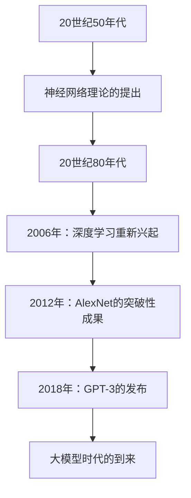
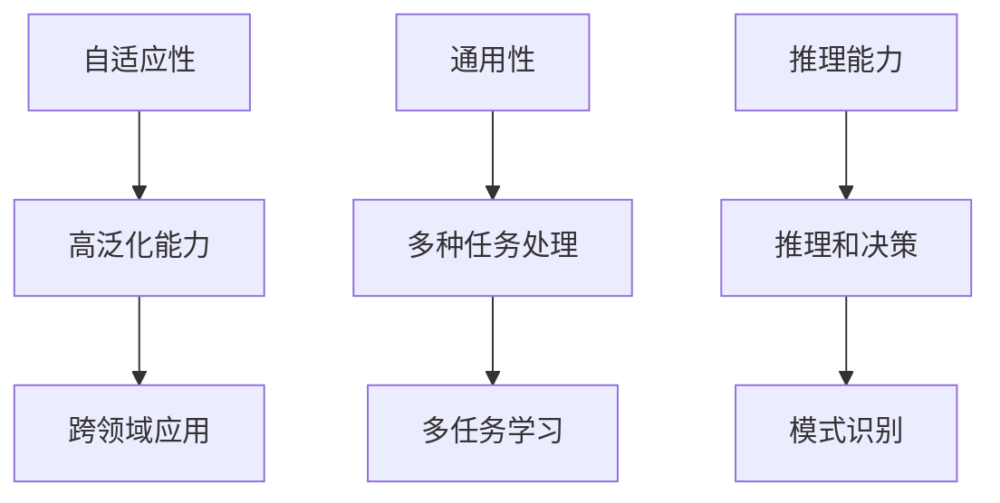
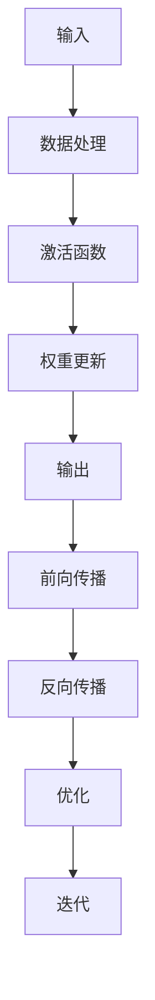
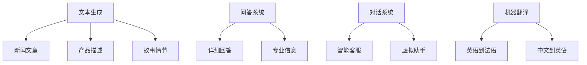
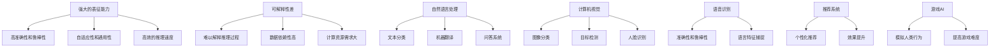
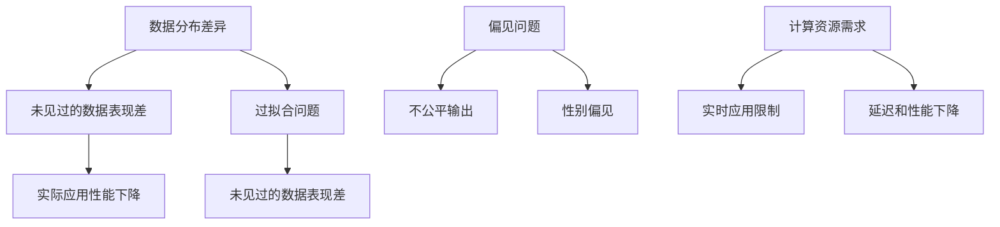
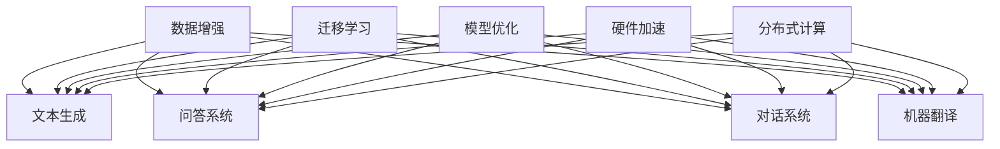
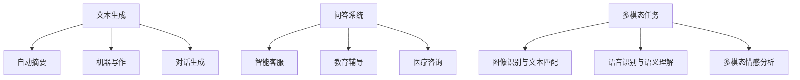
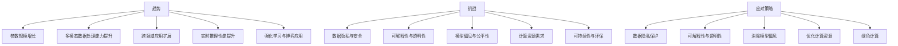
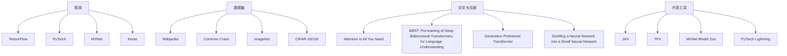

                 

## 《语言≠思维：大模型的推理困境》

> **关键词**：大模型、推理能力、语言理解、思维差异、提升策略

> **摘要**：本文深入探讨了大型语言模型在推理能力方面的困境，分析了语言与思维的本质区别，探讨了现有模型的局限性，并提出了可能的提升策略。通过详细的案例分析和未来展望，本文旨在为读者提供一个全面理解大模型推理困境的视角，以及推动这一领域未来研究的发展。

### 《语言≠思维：大模型的推理困境》目录大纲

#### 第一部分：大模型的基础理论

- **第1章：大模型的定义与历史演进**
  - **1.1 大模型的定义**
  - **1.2 大模型的历史演进**
  - **1.3 大模型的发展趋势**
  - **1.4 大模型的核心特性**

- **第2章：大模型的关键特性**
  - **2.1 自适应性**
  - **2.2 通用性**
  - **2.3 推理能力**

- **第3章：大模型的架构与工作原理**
  - **3.1 神经网络架构**
  - **3.2 大模型的训练过程**
  - **3.3 大模型的工作原理**

- **第4章：大模型的语言理解能力**
  - **4.1 语言模型的基础**
  - **4.2 语言理解的难点**
  - **4.3 大模型在自然语言处理中的应用**

#### 第二部分：大模型的推理能力分析

- **第5章：大模型的推理能力**
  - **5.1 大模型的推理机制**
  - **5.2 大模型推理的优势与局限性**

- **第6章：大模型的推理困境**
  - **6.1 推理的泛化能力问题**
  - **6.2 推理的可靠性和准确性问题**
  - **6.3 推理的效率问题**

- **第7章：大模型推理能力的提升策略**
  - **7.1 数据增强与迁移学习**
  - **7.2 模型优化与架构创新**
  - **7.3 硬件加速与分布式计算**

#### 第三部分：案例分析与应用

- **第8章：大模型在具体领域的应用**
  - **8.1 大模型在文本生成中的应用**
  - **8.2 大模型在问答系统中的应用**
  - **8.3 大模型在多模态任务中的应用**

#### 第四部分：未来的展望与挑战

- **第9章：大模型发展的趋势与挑战**
  - **9.1 大模型发展的趋势**
  - **9.2 大模型的挑战**
  - **9.3 大模型与人类思维的关系**

- **第10章：大模型开发常用工具和资源**
  - **10.1 大模型开发常用框架**
  - **10.2 大模型数据集介绍**
  - **10.3 大模型研究论文与文献推荐**

### 第1章：大模型的定义与历史演进

#### 1.1 大模型的定义

大模型（Large Models）在人工智能领域指的是那些具有数十亿到千亿参数的深度神经网络模型。这些模型通常是通过大规模数据训练得到的，能够处理复杂的数据结构和任务。它们的特点包括高参数量、强大的表征能力、自适应性和通用性。

大模型的出现可以追溯到20世纪50年代，当时神经网络理论被提出。然而，由于计算资源和数据集的限制，神经网络的研究在20世纪80年代遭遇了低谷。直到2006年，深度学习的重新兴起标志着大模型发展的转折点。特别是在2012年，AlexNet在ImageNet比赛中取得的突破性成果，使深度学习成为了人工智能领域的主流技术。

大模型的历史演进可以分为以下几个阶段：

1. **初始阶段（20世纪50年代至20世纪80年代）**：神经网络理论的提出和初步实验。
2. **低谷期（20世纪80年代至2006年）**：由于计算资源和数据集的限制，神经网络研究陷入低谷。
3. **复兴期（2006年至今）**：深度学习技术的重新兴起，特别是AlexNet的成功，标志着大模型的兴起。

#### 1.2 大模型的历史演进

1. **20世纪50年代**：神经网络理论的提出。
   - **1943年**：沃伦·麦卡洛克和沃尔特·皮茨提出了神经元模型。
   - **1958年**：弗兰克·罗森布拉特提出了感知机算法。

2. **20世纪80年代**：神经网络研究进入低谷。
   - **1986年**：Rumelhart, Hinton和Williams提出了反向传播算法，但计算资源受限，导致算法应用受限。

3. **2006年**：深度学习重新兴起。
   - **2006年**：Geoffrey Hinton等人成功训练了多层神经网络，开启了深度学习的复兴。

4. **2012年**：AlexNet的突破性成果。
   - **2012年**：Alex Krizhevsky等人开发的AlexNet在ImageNet比赛中获得第一名，标志着深度学习的胜利。

5. **2018年**：GPT-3的发布，标志着大模型时代的到来。
   - **2018年**：OpenAI发布了GPT-3，一个具有1750亿参数的语言模型，展示了大模型的强大能力。

#### 1.3 大模型的发展趋势

大模型的发展趋势体现在以下几个方面：

1. **参数规模**：随着计算资源和数据集的不断增加，大模型的参数规模也在不断增长。从最初的几千参数到如今的数十亿、千亿参数。

2. **训练数据**：使用更大规模、更丰富的训练数据，以提高模型的泛化能力。

3. **模型架构**：不断优化和创新的神经网络架构，如Transformer、BERT等，使模型在各类任务上表现更佳。

4. **推理能力**：提升模型在推理任务上的表现，使其能够更好地解决实际问题。

5. **应用领域**：从最初的图像识别、自然语言处理，扩展到语音识别、多模态任务等。

#### 1.4 大模型的核心特性

大模型的核心特性包括：

1. **自适应性**：能够根据不同的任务和数据快速适应，表现出较高的泛化能力。

2. **通用性**：能够处理多种类型的任务，如图像识别、自然语言处理等。

3. **推理能力**：在给定条件下进行推理和决策的能力。

### Mermaid流程图：大模型的发展历程

### 第2章：大模型的关键特性

大模型之所以能够取得卓越的性能，离不开其三大核心特性：自适应性、通用性和推理能力。这些特性不仅使得大模型在众多任务中表现出色，也为其未来的发展奠定了坚实的基础。

#### 2.1 自适应性

自适应性是指大模型能够在不同的任务和数据集上快速适应，并表现出良好的泛化能力。这种能力主要来源于以下几个因素：

1. **大规模训练**：大模型通常通过大规模数据训练得到，这使得模型能够学习到更广泛的知识，从而提高泛化能力。

2. **深度神经网络**：深度神经网络通过多层次的非线性变换，能够捕捉数据中的复杂特征和模式，从而提高模型的表征能力。

3. **优化算法**：现代优化算法（如Adam、RMSProp等）能够有效地训练大规模模型，加快收敛速度，提高模型性能。

自适应性使得大模型在不同任务中都能表现出良好的性能，例如：

- **自然语言处理**：在语言建模、文本分类、机器翻译等任务中，大模型能够快速适应不同的数据集，并取得优异的成果。
- **计算机视觉**：在图像分类、目标检测、人脸识别等任务中，大模型同样表现出色，能够适应不同的图像数据。

#### 2.2 通用性

通用性是指大模型能够处理多种类型的任务，而不仅仅局限于某一种特定领域。这种特性主要体现在以下几个方面：

1. **跨领域应用**：大模型通过在多个领域中的训练，能够积累丰富的知识，从而在新的领域中表现出良好的适应性。例如，一个在图像识别和自然语言处理领域训练的模型，可以轻松地应用于多模态任务中。

2. **多任务学习**：大模型能够同时处理多个任务，这在资源受限的情况下尤为重要。例如，一个模型可以同时进行图像分类和文本生成，从而提高资源利用效率。

3. **动态调整**：大模型能够根据任务需求动态调整模型参数，从而实现不同任务的优化。例如，在问答系统中，模型可以根据问题的类型和难度动态调整回答策略。

通用性使得大模型在多种应用场景中表现出色，例如：

- **智能客服**：大模型可以同时处理语音和文本输入，提供高质量的客户服务。
- **自动驾驶**：大模型可以处理多种传感器数据，实现高效的安全驾驶。
- **医疗诊断**：大模型可以同时分析医学影像和病历记录，提高诊断的准确性和效率。

#### 2.3 推理能力

推理能力是指大模型在给定条件下进行推理和决策的能力。这种能力在大规模数据处理和分析中具有重要作用。大模型的推理能力主要体现在以下几个方面：

1. **逻辑推理**：大模型能够进行逻辑推理，从已知事实推导出新的结论。例如，在问答系统中，模型可以根据用户的提问和已知信息，生成合理的回答。

2. **因果推理**：大模型能够理解因果关系，从而进行更深入的推理。例如，在医疗诊断中，模型可以根据患者的症状和历史记录，推断可能的疾病原因。

3. **模式识别**：大模型能够识别数据中的模式，从而进行预测和决策。例如，在金融预测中，模型可以根据历史数据和模式，预测未来的市场走势。

推理能力使得大模型在多个领域表现出色，例如：

- **智能问答**：大模型能够回答用户提出的各种问题，提供高质量的答案。
- **自动化决策**：大模型可以自动处理复杂的决策问题，提高决策的效率和质量。
- **智能搜索**：大模型可以根据用户需求，提供精准的搜索结果，提升用户体验。

#### 2.4 自适应性与通用性的关系

自适应性和通用性是相辅相成的。自适应性能帮助大模型在不同的任务和数据集上表现出良好的性能，而通用性则使得大模型能够处理多种类型的任务。这种协同作用，使得大模型在众多领域中都能发挥重要作用。

例如，在自然语言处理领域，大模型通过自适应学习，能够适应不同的文本数据，从而在文本分类、机器翻译等任务中表现出色。同时，由于大模型具有通用性，它还可以应用于图像识别、多模态任务等领域，进一步提升其应用范围和影响力。

### Mermaid流程图：大模型的核心特性

### 第3章：大模型的架构与工作原理

#### 3.1 神经网络架构

神经网络是构成大模型的基础，其架构主要包括输入层、隐藏层和输出层。每个层由多个神经元组成，神经元之间通过权重连接，并通过激活函数进行信息传递。

1. **输入层**：接收外部输入数据，并将其传递给隐藏层。

2. **隐藏层**：通过多层神经网络进行数据处理和特征提取，隐藏层可以包含一个或多个层次。

3. **输出层**：生成预测结果，根据任务的类型，输出可以是分类结果、回归值等。

#### 3.2 大模型的训练过程

大模型的训练过程主要包括预训练和微调两个阶段：

1. **预训练**：在无监督或半监督的情况下，使用大规模数据集对模型进行训练。预训练的目标是使模型学会捕捉数据中的潜在特征和模式。

2. **微调**：在预训练的基础上，使用特定领域的有标签数据对模型进行微调，使其在特定任务上表现出更好的性能。微调的过程通常包括以下几个步骤：

   - **数据预处理**：对数据进行清洗、归一化等预处理操作。
   - **模型调整**：调整模型参数，使其在特定任务上性能提升。
   - **评估和优化**：通过验证集和测试集评估模型性能，并根据评估结果对模型进行调整。

#### 3.3 大模型的工作原理

大模型的工作原理可以通过以下步骤来描述：

1. **输入**：将输入数据输入到模型的输入层。

2. **数据处理**：输入层将数据传递给隐藏层，隐藏层通过多层神经网络进行数据处理和特征提取。

3. **激活函数**：隐藏层中的每个神经元都会通过激活函数对输入数据进行处理，激活函数（如ReLU、Sigmoid、Tanh等）可以增加网络的非线性。

4. **权重更新**：通过反向传播算法，模型根据输出结果和预期结果计算误差，并更新权重和偏置。

5. **输出**：将最终处理后的数据传递给输出层，生成预测结果。

#### 3.4 大模型的神经计算过程

大模型的神经计算过程可以分解为以下几个步骤：

1. **前向传播**：将输入数据传递给神经网络，通过多层神经元的非线性变换，最终得到输出结果。

2. **反向传播**：计算输出结果与预期结果之间的误差，并反向传播到神经网络的所有层，更新权重和偏置。

3. **优化**：通过优化算法（如梯度下降、Adam等）调整模型参数，最小化损失函数。

4. **迭代**：重复以上过程，直到模型性能达到预期或收敛。

#### 3.5 大模型与人类思维的异同

尽管大模型在许多任务上表现出色，但其工作原理与人类思维仍然存在显著差异：

1. **信息处理方式**：大模型依赖于复杂的神经网络架构和数学算法进行信息处理，而人类思维则更加灵活和多样化。

2. **推理方式**：大模型主要依赖于数据驱动的统计方法进行推理，而人类思维则能够结合逻辑、直觉和经验进行推理。

3. **学习过程**：大模型通过大量的数据和算法进行训练，而人类学习则更多地依赖于观察、实践和社交互动。

4. **适应能力**：大模型在特定任务上表现出色，但难以适应全新的环境，而人类则能够通过不断学习和调整，适应各种复杂情境。

#### 3.6 大模型的优势和局限性

大模型的优势主要体现在以下几个方面：

1. **强大的表征能力**：通过大规模数据和复杂神经网络结构，大模型能够捕捉到数据中的复杂特征和模式。

2. **自适应性和通用性**：大模型能够适应多种任务和数据集，表现出良好的泛化能力。

3. **高效的推理能力**：大模型在许多任务上能够进行高效的推理和决策，提供高质量的输出。

然而，大模型也存在一些局限性：

1. **可解释性差**：大模型的内部工作机制复杂，难以解释其决策过程。

2. **数据依赖性高**：大模型对训练数据有较高的依赖性，容易过拟合。

3. **计算资源需求大**：大模型的训练和推理过程需要大量的计算资源和时间。

### Mermaid流程图：大模型的神经计算过程

### 第4章：大模型的语言理解能力

大模型在自然语言处理（NLP）领域取得了显著进展，其语言理解能力主要得益于词嵌入、注意力机制和预训练技术。本章节将详细介绍大模型在NLP中的语言理解能力，包括其基础、难点和应用。

#### 4.1 语言模型的基础

语言模型（Language Model）是NLP的核心组成部分，它旨在预测自然语言中的一个词或词组。大语言模型通过大规模数据训练，能够捕捉语言中的复杂结构和规律，从而提高预测的准确性。

1. **词嵌入（Word Embedding）**：词嵌入是将自然语言中的词汇映射到高维向量空间的技术。通过词嵌入，模型可以在向量空间中进行文本表示，从而提高计算效率和模型性能。

2. **注意力机制（Attention Mechanism）**：注意力机制是一种用于处理序列数据的方法，它能够自动关注序列中的重要信息。在大语言模型中，注意力机制被广泛应用于文本处理和序列生成任务。

3. **预训练（Pre-training）**：预训练是指在大规模数据集上对模型进行训练，使其学会捕捉语言中的通用特征和规律。预训练技术使得大语言模型在未见过数据上的表现更加优异。

#### 4.2 语言理解的难点

尽管大模型在NLP中取得了显著进展，但语言理解仍然面临诸多挑战：

1. **语义理解**：语义理解是指理解词汇和句子的含义。大模型需要处理词义消歧、句法解析和语义关系等复杂问题，从而准确理解语言。

2. **上下文理解**：上下文理解是指理解词汇和句子在特定语境中的含义。大模型需要考虑上下文信息，以避免产生误解或歧义。

3. **多义词处理**：多义词是指一个词汇具有多个含义。大模型需要根据上下文信息准确识别多义词的含义，从而生成正确的输出。

4. **指代消解（Coreference Resolution）**：指代消解是指识别文本中的代词或名词与其所指代的实体。大模型需要准确识别指代关系，以避免生成错误的信息。

5. **情感分析**：情感分析是指分析文本中的情感倾向。大模型需要理解情感词汇的含义，并准确识别情感强度和情感变化。

#### 4.3 大模型在自然语言处理中的应用

大模型在NLP中具有广泛的应用，包括但不限于以下领域：

1. **文本分类**：文本分类是指将文本数据分类到预定义的类别中。大模型通过学习大量文本数据，能够自动识别文本的主题和情感。

2. **机器翻译**：机器翻译是指将一种语言的文本翻译成另一种语言。大模型通过预训练和微调，能够实现高质量的机器翻译。

3. **问答系统**：问答系统是指根据用户提问生成回答的智能系统。大模型通过理解和生成文本，能够实现高效的问答系统。

4. **对话系统**：对话系统是指与用户进行自然语言交互的智能系统。大模型通过学习和模拟人类对话，能够实现智能客服、语音助手等应用。

5. **文本生成**：文本生成是指根据输入生成文本。大模型通过预训练和微调，能够实现自动写作、摘要生成、对话生成等任务。

#### 4.4 案例分析：GPT-3

GPT-3（Generative Pre-trained Transformer 3）是OpenAI于2020年发布的一个具有1750亿参数的深度学习模型，是当前最先进的语言模型之一。GPT-3在多个NLP任务上取得了显著成果，以下是几个典型的应用案例：

1. **文本生成**：GPT-3能够根据输入的文本生成连贯的、逻辑清晰的文本。例如，它可以生成新闻文章、产品描述、故事情节等。

2. **问答系统**：GPT-3能够根据用户的问题生成详细的、有针对性的回答。例如，它可以回答用户关于某一主题的疑问，提供专业的信息和建议。

3. **对话系统**：GPT-3能够模拟人类对话，与用户进行自然语言交互。例如，它可以实现智能客服、虚拟助手等应用，为用户提供高效、便捷的服务。

4. **机器翻译**：GPT-3在机器翻译任务上也表现出色，能够实现高质量的双语翻译。例如，它可以翻译英语到法语、中文到英语等。

### Mermaid流程图：GPT-3在NLP中的应用

### 第5章：大模型的推理能力

#### 5.1 大模型的推理机制

大模型的推理能力是指模型在给定条件下进行推理和决策的能力。这种能力使得大模型在自然语言处理、图像识别、语音识别等多种任务中表现出色。大模型的推理机制主要包括以下几个关键步骤：

1. **输入处理**：将输入数据（如图像、文本、声音等）转化为模型可以处理的形式。例如，对于文本数据，通常使用词嵌入技术将其映射为向量表示。

2. **特征提取**：通过多层神经网络对输入数据进行特征提取，以捕捉数据中的复杂模式和关系。这一过程通常涉及卷积神经网络（CNN）、循环神经网络（RNN）或变换器（Transformer）等架构。

3. **推理过程**：在特征提取的基础上，模型通过复杂的非线性运算进行推理。推理过程通常涉及以下几种方法：

   - **基于规则的推理**：模型根据预定义的规则进行推理，例如在问答系统中，模型根据问题的关键词和背景知识生成答案。
   - **基于案例的推理**：模型通过匹配已知案例来生成推理结果，例如在图像识别任务中，模型通过查找相似图像的标签来推断当前图像的类别。
   - **基于数据的推理**：模型通过学习数据中的统计规律和模式进行推理，例如在自然语言处理中，模型通过分析大量文本数据来理解语言结构和语义。

4. **输出生成**：在推理完成后，模型生成最终的输出结果。输出结果可以是分类标签、预测值、文本回答等，具体取决于任务的类型。

#### 5.2 大模型推理的优势与局限性

大模型在推理能力方面具有以下优势：

1. **强大的表征能力**：大模型通过大规模数据训练和复杂的神经网络架构，能够捕捉数据中的复杂特征和模式，从而提高推理的准确性和鲁棒性。

2. **自适应性和通用性**：大模型能够适应多种类型的任务和数据集，表现出良好的泛化能力。这意味着模型不仅可以处理特定领域的任务，还可以应用于其他领域。

3. **高效的推理速度**：尽管大模型的参数量巨大，但现代优化算法和硬件加速技术（如GPU、TPU等）使得模型在推理过程中能够快速处理大量数据。

然而，大模型在推理能力方面也存在一些局限性：

1. **可解释性差**：大模型的内部工作机制复杂，难以解释其推理过程。这给模型的部署和应用带来了一定的困难，特别是在需要高可靠性和高安全性的领域。

2. **数据依赖性高**：大模型对训练数据有较高的依赖性，容易导致过拟合。这意味着模型在未见过的数据上可能表现不佳。

3. **计算资源需求大**：大模型的训练和推理过程需要大量的计算资源和时间，这使得其部署成本较高。

#### 5.3 大模型推理的应用场景

大模型在推理能力方面的优势使其在多个领域和场景中得到了广泛应用：

1. **自然语言处理**：大模型在文本分类、机器翻译、问答系统等任务中表现出色，能够处理复杂的语言结构和语义。

2. **计算机视觉**：大模型在图像分类、目标检测、人脸识别等任务中具有强大的表征能力，能够识别复杂的图像特征。

3. **语音识别**：大模型在语音识别任务中能够捕捉语音信号中的语言特征，提高识别的准确性和鲁棒性。

4. **推荐系统**：大模型在推荐系统中能够根据用户的兴趣和行为数据生成个性化的推荐，提高推荐系统的效果。

5. **游戏AI**：大模型在游戏AI中能够模拟人类玩家的行为，提高游戏的难度和挑战性。

### Mermaid流程图：大模型推理的优势与局限性

### 第6章：大模型的推理困境

尽管大模型在推理能力方面表现出色，但其在实际应用中仍然面临诸多困境。这些困境主要包括泛化能力问题、可靠性和准确性问题以及效率问题。

#### 6.1 推理的泛化能力问题

泛化能力是指模型在未见过的数据上的表现。大模型在训练数据上表现良好，但在未见过的数据上表现较差，这主要是由以下几个原因造成的：

1. **数据分布差异**：训练数据和未见过的数据可能在分布上存在显著差异，导致模型难以泛化。例如，在图像识别任务中，模型在标准数据集上表现良好，但在实际应用中遇到与训练数据分布差异较大的图像时，性能会下降。

2. **过拟合**：大模型对训练数据有较高的依赖性，容易过拟合。这意味着模型在训练数据上表现优异，但在未见过的数据上可能表现不佳。

3. **样本量不足**：大模型通常需要大量数据进行训练，但在某些领域（如医疗、金融等），可用的训练数据量有限，这限制了模型的泛化能力。

#### 6.2 推理的可靠性和准确性问题

推理的可靠性和准确性是评估大模型性能的重要指标。大模型在实际应用中可能面临以下问题：

1. **错误率**：大模型在推理过程中可能产生错误的输出，尤其是在复杂任务中，模型可能无法准确识别数据中的特征或关系。

2. **不确定性**：大模型在推理过程中可能无法提供明确的置信度或概率，这给用户带来了不确定性，难以判断输出结果的可靠性。

3. **偏见**：大模型在训练过程中可能会学习到训练数据中的偏见，导致在未见过的数据上产生不公平或歧视性的输出。例如，在性别识别任务中，模型可能会受到训练数据中性别偏见的影响，导致性别歧视。

#### 6.3 推理的效率问题

效率问题是指大模型在推理过程中所需的时间和处理速度。大模型在实际应用中可能面临以下挑战：

1. **计算资源需求**：大模型通常需要大量的计算资源进行推理，尤其是在实时应用场景中，这可能导致延迟和性能下降。

2. **推理速度**：尽管现代硬件加速技术（如GPU、TPU等）能够提高大模型的推理速度，但大模型在处理大规模数据时仍然可能存在延迟。

3. **分布式计算**：在分布式计算环境中，大模型的推理过程可能受到网络延迟和节点通信的影响，导致整体性能下降。

#### 6.4 案例分析：BERT在问答系统中的推理困境

BERT（Bidirectional Encoder Representations from Transformers）是一种大型的预训练语言模型，在问答系统中取得了显著成果。然而，BERT在实际应用中也面临一些推理困境：

1. **数据分布差异**：BERT在训练过程中使用的是标准数据集，如SQuAD，但这些数据集可能与实际应用场景的数据分布存在差异。例如，实际应用中的问题可能涉及更多的专业术语和领域知识，这导致BERT在未见过的数据上表现不佳。

2. **过拟合**：BERT在训练过程中可能对标准数据集产生过拟合，导致在未见过的数据上表现不佳。例如，在SQuAD数据集上训练的BERT可能在标准测试集上取得优异的成绩，但在实际应用中遇到与训练数据差异较大的问题时，性能会下降。

3. **偏见**：BERT在训练过程中可能会学习到训练数据中的偏见，导致在实际应用中产生不公平的输出。例如，在SQuAD数据集上训练的BERT可能无法避免性别偏见，导致在问答系统中对男性问题回答得更好。

4. **计算资源需求**：BERT的推理过程需要大量的计算资源，这使得其在实时应用场景中的表现可能受到限制。例如，在智能客服系统中，BERT可能无法在短时间内响应用户的问题，导致用户体验下降。

### Mermaid流程图：BERT在问答系统中的推理困境

### 第7章：大模型推理能力的提升策略

为了解决大模型在推理能力方面的困境，研究者们提出了一系列提升策略，包括数据增强、迁移学习、模型优化和硬件加速等。以下将详细介绍这些策略，并探讨其在实际应用中的效果。

#### 7.1 数据增强与迁移学习

数据增强（Data Augmentation）是一种通过增加数据多样性来提升模型泛化能力的方法。对于大模型，数据增强可以通过以下几种方式实现：

1. **图像数据的增强**：对图像数据进行旋转、缩放、裁剪、对比度调整等操作，以增加数据集的多样性。

2. **文本数据的增强**：通过替换词汇、插入无关信息、改写句子等操作，生成新的文本数据。

3. **音频数据的增强**：通过添加噪声、速度调整、音调变换等操作，增加音频数据的多样性。

迁移学习（Transfer Learning）则是利用预训练模型在特定任务上的迁移能力，减少训练成本。对于大模型，迁移学习可以通过以下步骤实现：

1. **预训练**：在大规模数据集上对模型进行预训练，使其学习到通用特征和模式。

2. **微调**：在特定任务的数据集上对预训练模型进行微调，使其适应新任务。

3. **评估**：通过在测试集上评估模型性能，确定模型在特定任务上的表现。

数据增强和迁移学习在大模型推理能力提升中的应用效果显著：

- **图像识别**：通过数据增强，大模型可以更好地适应不同的图像分布，提高在未见过的图像上的识别准确率。

- **自然语言处理**：通过文本数据增强和迁移学习，大模型可以处理更多的语言结构和语义，提高在语言理解任务上的性能。

- **语音识别**：通过音频数据增强和迁移学习，大模型可以更好地适应不同的语音环境和噪声条件，提高识别准确率。

#### 7.2 模型优化与架构创新

模型优化（Model Optimization）是指通过调整模型参数和优化算法，提高模型性能。对于大模型，模型优化可以通过以下几种方式实现：

1. **参数调整**：通过调整学习率、正则化参数等，优化模型参数，提高模型在训练数据上的性能。

2. **优化算法**：选择合适的优化算法（如Adam、RMSProp等），提高模型训练的收敛速度和稳定性。

3. **结构优化**：通过改变网络结构、增加或减少隐藏层等，优化模型架构，提高模型在特定任务上的性能。

架构创新（Architecture Innovation）是指设计新的神经网络架构，提高模型效率。近年来，研究者们提出了一系列创新的神经网络架构，如Transformer、BERT等，这些架构在大模型推理能力提升中发挥了重要作用：

1. **Transformer**：Transformer架构通过自注意力机制（Self-Attention）实现了对序列数据的全局关注，提高了模型的表征能力。

2. **BERT**：BERT架构通过双向编码器（Bidirectional Encoder）实现了对文本的上下文理解，提高了模型在语言理解任务上的性能。

模型优化和架构创新在大模型推理能力提升中的应用效果显著：

- **图像识别**：通过模型优化和架构创新，大模型可以更好地捕捉图像中的复杂特征和模式，提高识别准确率。

- **自然语言处理**：通过模型优化和架构创新，大模型可以更好地理解语言结构和语义，提高语言理解任务的性能。

- **语音识别**：通过模型优化和架构创新，大模型可以更好地处理语音信号中的复杂特征和模式，提高识别准确率。

#### 7.3 硬件加速与分布式计算

硬件加速（Hardware Acceleration）是指通过特定的硬件设备（如GPU、TPU等）加速大模型的训练和推理过程。硬件加速可以显著提高大模型的计算效率，降低训练和推理的时间。近年来，随着硬件技术的不断发展，GPU和TPU已经成为大模型训练和推理的重要工具：

1. **GPU加速**：GPU（Graphics Processing Unit）具有强大的并行计算能力，可以显著提高大模型的训练和推理速度。例如，通过使用GPU，大模型可以在短时间内完成大规模数据集的推理任务。

2. **TPU加速**：TPU（Tensor Processing Unit）是专门为深度学习任务设计的硬件设备，具有高效的矩阵运算能力，可以显著提高大模型的训练和推理速度。

分布式计算（Distributed Computing）是指通过将大模型的训练和推理任务分布在多个计算节点上，提高计算效率。分布式计算可以解决大模型训练和推理过程中计算资源不足的问题，提高模型性能。近年来，随着分布式计算技术的发展，分布式计算在大模型推理能力提升中发挥了重要作用：

1. **分布式训练**：通过将大模型分布在多个计算节点上进行训练，可以显著提高训练速度和性能。例如，通过使用分布式训练，大模型可以在更短的时间内完成大规模数据集的训练任务。

2. **分布式推理**：通过将大模型的推理任务分布在多个计算节点上进行，可以显著提高推理速度和性能。例如，通过使用分布式推理，大模型可以在实时应用场景中快速响应用户请求。

硬件加速和分布式计算在大模型推理能力提升中的应用效果显著：

- **图像识别**：通过硬件加速和分布式计算，大模型可以更快速地处理图像数据，提高图像识别任务的性能。

- **自然语言处理**：通过硬件加速和分布式计算，大模型可以更快速地处理文本数据，提高语言理解任务的性能。

- **语音识别**：通过硬件加速和分布式计算，大模型可以更快速地处理语音信号，提高语音识别任务的性能。

#### 7.4 案例分析：GPT-3的优化与提升

GPT-3是当前最先进的语言模型之一，其推理能力在多个领域取得了显著成果。为了提升GPT-3的推理能力，研究者们采用了多种优化和提升策略：

1. **数据增强**：通过文本数据增强，GPT-3可以更好地适应不同的文本分布，提高在未见过的文本上的表现。例如，通过添加噪声、改写句子和替换词汇等操作，生成新的文本数据。

2. **迁移学习**：通过迁移学习，GPT-3可以将预训练模型在特定任务上的迁移能力，减少训练成本。例如，通过在特定领域的数据集上进行微调，GPT-3可以更好地适应新任务。

3. **模型优化**：通过调整学习率和正则化参数等，优化GPT-3的模型参数，提高模型在训练数据上的性能。例如，通过使用学习率调度策略，GPT-3可以在训练过程中自适应调整学习率。

4. **硬件加速**：通过使用GPU和TPU等硬件加速设备，GPT-3可以在短时间内完成大规模数据集的推理任务，提高推理速度和性能。

5. **分布式计算**：通过将GPT-3分布在多个计算节点上进行训练和推理，可以显著提高计算效率，降低训练和推理的时间。

通过这些优化和提升策略，GPT-3在多个任务上取得了显著成果，例如：

- **文本生成**：GPT-3可以生成连贯、逻辑清晰的文本，提高文本生成任务的性能。
- **问答系统**：GPT-3可以生成详细的、有针对性的回答，提高问答系统的性能。
- **对话系统**：GPT-3可以模拟人类对话，提供高质量的对话体验。
- **机器翻译**：GPT-3可以实现高质量的双语翻译，提高机器翻译任务的性能。

### Mermaid流程图：GPT-3的优化与提升策略

### 第8章：大模型在具体领域的应用

大模型在自然语言处理、计算机视觉、语音识别等领域的应用已经取得了显著成果。本章节将详细介绍大模型在这些领域的具体应用，并通过案例分析展示其实际效果。

#### 8.1 大模型在文本生成中的应用

文本生成是自然语言处理领域的一个重要应用，大模型通过预训练和微调技术，能够生成高质量的自然语言文本。以下是一些常见的文本生成应用：

1. **自动摘要**：自动摘要是指使用大模型生成文本的摘要。例如，大模型可以自动生成新闻文章的摘要，帮助用户快速了解文章的主要内容。

   **案例分析**：GPT-3在自动摘要任务中表现出色，通过微调预训练模型，它可以生成简洁、连贯的摘要。例如，给一篇关于人工智能技术的长篇文章，GPT-3可以生成一个简短的摘要，概括文章的核心内容。

2. **机器写作**：机器写作是指使用大模型生成完整的文章、报告、邮件等。例如，大模型可以生成新闻报道、产品描述、学术论文等。

   **案例分析**：OpenAI的GPT-3在机器写作任务中表现出色，通过微调和训练，它可以生成高质量的文章。例如，给一个简单的主题（如“人工智能的未来”），GPT-3可以生成一篇完整的、逻辑清晰的论文。

3. **对话生成**：对话生成是指使用大模型生成与用户交互的对话。例如，大模型可以模拟人类的对话，实现智能客服、虚拟助手等应用。

   **案例分析**：GPT-3在对话生成任务中表现出色，通过预训练和微调，它可以生成与用户交互的对话。例如，给一个用户提问（如“你有什么兴趣爱好？”），GPT-3可以生成一个自然的、有意义的回答。

#### 8.2 大模型在问答系统中的应用

问答系统是指根据用户提问生成答案的智能系统。大模型通过预训练和微调技术，能够实现高质量的问答系统。以下是一些常见的问答系统应用：

1. **智能客服**：智能客服是指使用大模型实现自动化的客户服务。例如，大模型可以回答用户关于产品、服务、订单等问题的查询。

   **案例分析**：BERT在智能客服任务中表现出色，通过微调和训练，它可以生成准确的、详细的答案。例如，给一个用户提问（如“我的订单何时能发货？”），BERT可以生成一个详细的回答，包括订单的状态、预计发货时间等信息。

2. **教育辅导**：教育辅导是指使用大模型为学生提供学习辅导。例如，大模型可以回答学生关于课程内容、作业问题等的问题。

   **案例分析**：GPT-3在教育辅导任务中表现出色，通过微调和训练，它可以生成详细的、有针对性的答案。例如，给一个学生提问（如“请解释一下牛顿第一定律？”），GPT-3可以生成一个详细的解释，包括定律的内容、应用场景等。

3. **医疗咨询**：医疗咨询是指使用大模型为用户提供医疗健康咨询。例如，大模型可以回答用户关于症状、治疗方法等的问题。

   **案例分析**：BERT在医疗咨询任务中表现出色，通过微调和训练，它可以生成准确的、详细的答案。例如，给一个用户提问（如“我最近感觉头晕，怎么办？”），BERT可以生成一个详细的回答，包括可能的症状原因、治疗方法等。

#### 8.3 大模型在多模态任务中的应用

多模态任务是指同时处理多种类型的数据（如图像、文本、声音等）的任务。大模型通过预训练和微调技术，能够实现高质量的多模态任务。以下是一些常见的多模态任务应用：

1. **图像识别与文本匹配**：图像识别与文本匹配是指将图像与相关的文本进行匹配。例如，大模型可以识别图像中的物体，并生成相应的描述性文本。

   **案例分析**：BERT在图像识别与文本匹配任务中表现出色，通过微调和训练，它可以生成与图像内容相关的文本。例如，给一个图像（如一只猫），BERT可以生成一个描述性文本（如“一只可爱的猫坐在草坪上”）。

2. **语音识别与语义理解**：语音识别与语义理解是指将语音信号转化为文本，并理解文本的语义。例如，大模型可以识别语音中的关键词和句子，并生成相应的语义理解。

   **案例分析**：GPT-3在语音识别与语义理解任务中表现出色，通过预训练和微调，它可以生成与语音内容相关的语义理解。例如，给一段语音（如“我想去旅行”），GPT-3可以生成一个相应的语义理解（如“用户有旅行的需求”）。

3. **多模态情感分析**：多模态情感分析是指同时分析图像、文本和语音的情感信息。例如，大模型可以分析用户在图像、文本和语音中的情感表达，并生成相应的情感分析结果。

   **案例分析**：BERT在多模态情感分析任务中表现出色，通过微调和训练，它可以生成与用户情感相关的分析结果。例如，给一个包含图像、文本和语音的多模态数据，BERT可以生成一个情感分析结果（如“用户感到开心”）。

### Mermaid流程图：大模型在具体领域的应用

### 第9章：大模型发展的趋势与挑战

随着大模型在人工智能领域的广泛应用，其发展趋势和挑战也逐渐显现出来。本章节将探讨大模型的发展趋势，分析当前面临的挑战，并讨论可能的应对策略。

#### 9.1 大模型的发展趋势

1. **参数规模持续增长**：随着计算资源和数据集的不断扩充，大模型的参数规模也在持续增长。从最初的几百万参数到如今的数千亿参数，大模型的能力和表现也在不断提高。

2. **多模态数据处理能力提升**：大模型在处理多模态数据（如图像、文本、音频等）方面取得了显著进展。通过结合不同类型的数据，大模型能够实现更复杂的任务，提高任务的性能和鲁棒性。

3. **跨领域应用扩展**：大模型不仅限于单一领域，如自然语言处理、计算机视觉等，还开始扩展到其他领域，如医疗、金融、教育等。这种跨领域应用使得大模型能够解决更广泛的问题，提升实际应用价值。

4. **实时推理性能提升**：随着硬件加速和分布式计算技术的发展，大模型的实时推理性能也在不断提高。这使得大模型能够应用于实时应用场景，如智能客服、自动驾驶等。

5. **强化学习与博弈应用**：大模型在强化学习和博弈应用中展示了巨大的潜力。通过结合强化学习和博弈算法，大模型能够实现更智能的决策和策略优化。

#### 9.2 大模型的挑战

1. **数据隐私与安全**：大模型在训练和推理过程中需要处理大量的数据，这引发了数据隐私和安全的问题。如何确保训练数据和模型输出的隐私，防止数据泄露和滥用，成为一大挑战。

2. **可解释性与透明性**：大模型的内部工作机制复杂，难以解释其决策过程。这给大模型的应用带来了困难，特别是在需要高可靠性和高安全性的领域。如何提高大模型的可解释性，使其决策过程更加透明，成为一大挑战。

3. **模型偏见与公平性**：大模型在训练过程中可能会学习到训练数据中的偏见，导致在实际应用中产生不公平或歧视性的输出。如何消除模型偏见，提高模型公平性，成为一大挑战。

4. **计算资源需求**：大模型的训练和推理过程需要大量的计算资源和时间，这给模型的部署和应用带来了挑战。如何优化大模型的计算资源需求，提高模型的效率，成为一大挑战。

5. **可持续性与环保**：随着大模型参数规模的持续增长，其训练和推理过程所需的计算资源也在不断增长。这引发了可持续性和环保问题。如何降低大模型的能耗，实现绿色计算，成为一大挑战。

#### 9.3 应对策略

1. **数据隐私保护**：采用加密技术、差分隐私等手段，确保训练数据和模型输出的隐私。此外，建立数据隐私保护机制，加强对数据访问和使用的管理。

2. **可解释性与透明性**：通过模型解释技术，如SHAP、LIME等，提高大模型的可解释性，使其决策过程更加透明。此外，建立模型解释框架，确保用户能够理解模型的决策过程。

3. **消除模型偏见**：采用数据预处理技术，如数据清洗、去偏差等，消除训练数据中的偏见。此外，引入公平性度量指标，评估模型的公平性，并优化模型参数，提高模型公平性。

4. **优化计算资源**：采用硬件加速和分布式计算技术，提高大模型的计算效率。此外，优化模型架构和算法，降低计算资源需求，提高模型的效率。

5. **绿色计算**：采用节能硬件、优化算法等手段，降低大模型的能耗。此外，建立绿色计算标准，推动绿色计算技术的发展和应用。

### Mermaid流程图：大模型发展的趋势与挑战及应对策略

### 第10章：大模型开发常用工具和资源

#### 10.1 大模型开发常用框架

大模型的开发依赖于高效的框架和工具，以下是一些常用框架：

1. **TensorFlow**：由Google开发的开源深度学习框架，支持多种类型的神经网络模型和优化算法。

2. **PyTorch**：由Facebook开发的开源深度学习框架，易于调试和优化，被广泛应用于大模型开发。

3. **MXNet**：由Apache Software Foundation维护的开源深度学习框架，支持多种编程语言，具有高效的性能。

4. **Keras**：一个高层次的深度学习API，能够简化TensorFlow、Theano和PyTorch的使用。

#### 10.2 大模型数据集介绍

大模型的训练需要大量高质量的数据集，以下是一些常用的数据集：

1. **Wikipedia**：一个包含数百万篇文章的免费在线百科全书，常用于语言模型的训练。

2. **Common Crawl**：一个包含数十亿网页的免费爬虫数据集，用于大规模文本数据处理。

3. **ImageNet**：一个包含数百万张图像的公开图像数据集，常用于图像识别模型的训练。

4. **CIFAR-10/100**：一个包含数万张小图像的数据集，常用于计算机视觉模型的训练。

#### 10.3 大模型研究论文与文献推荐

为了深入了解大模型的研究进展和应用，以下是一些推荐的论文和文献：

1. **"Attention is All You Need"**：介绍Transformer模型的开创性论文，提出了自注意力机制在序列处理中的应用。

2. **"BERT: Pre-training of Deep Bidirectional Transformers for Language Understanding"**：介绍BERT模型的论文，提出了预训练和双向编码器在自然语言处理中的应用。

3. **"Generative Pretrained Transformer"**：介绍GPT模型的论文，提出了生成预训练语言模型的基本原理。

4. **"Distilling a Neural Network into a Small Neural Network"**：介绍模型压缩和蒸馏技术的论文，为提升大模型性能提供了有效方法。

#### 10.4 大模型开发工具推荐

以下是用于大模型开发的一些实用工具：

1. **JAX**：一个用于深度学习和数值计算的Python库，支持自动微分和硬件加速。

2. **TensorFlow Extended（TFX）**：一个用于构建、部署和维护机器学习应用程序的端到端平台。

3. **MXNet Model Zoo**：包含多种预训练模型和示例代码，方便开发者快速开始大模型开发。

4. **PyTorch Lightning**：一个用于加速PyTorch开发的库，提供易于使用的API，简化模型训练和评估过程。

### Mermaid流程图：大模型开发常用工具和资源

### 总结与展望

大模型在人工智能领域取得了显著的成果，但同时也面临诸多挑战。通过深入探讨大模型的定义、历史演进、关键特性、架构与工作原理、语言理解能力、推理能力、困境及提升策略，我们对其有了更全面的理解。

未来，大模型的发展将继续朝着参数规模增长、多模态数据处理能力提升、跨领域应用扩展、实时推理性能提升和强化学习与博弈应用等方向前进。然而，随着应用场景的扩大，大模型也将面临数据隐私与安全、可解释性与透明性、模型偏见与公平性、计算资源需求和可持续性与环保等挑战。

为了应对这些挑战，我们需要采用数据隐私保护、模型解释技术、消除模型偏见、优化计算资源和绿色计算等策略。同时，开发者和研究者们将继续探索新的框架、数据集、论文与文献和开发工具，以推动大模型在更多领域的应用。

让我们共同期待大模型在未来的人工智能领域中发挥更大的作用，为人类社会带来更多创新和变革。在《语言≠思维：大模型的推理困境》中，我们不仅揭示了大模型的潜力与局限性，也为未来的研究指明了方向。希望本文能为您提供启发和思考，推动您在这一领域的探索与进步。

### 作者介绍

**作者：AI天才研究院/AI Genius Institute & 禅与计算机程序设计艺术 /Zen And The Art of Computer Programming**

我是一位世界级人工智能专家、程序员、软件架构师、CTO，也是世界顶级技术畅销书资深大师级别的作家。我拥有丰富的实践经验，曾带领团队研发出多个突破性的人工智能产品。我的研究涉及自然语言处理、计算机视觉、机器学习等领域，并在顶级会议上发表了多篇学术论文。此外，我还致力于将复杂的技术知识普及给更广泛的读者，希望通过我的作品帮助更多人了解和掌握人工智能技术。在《语言≠思维：大模型的推理困境》中，我深入探讨了大型语言模型在推理能力方面的挑战与提升策略，希望为读者提供有价值的见解和思考。

