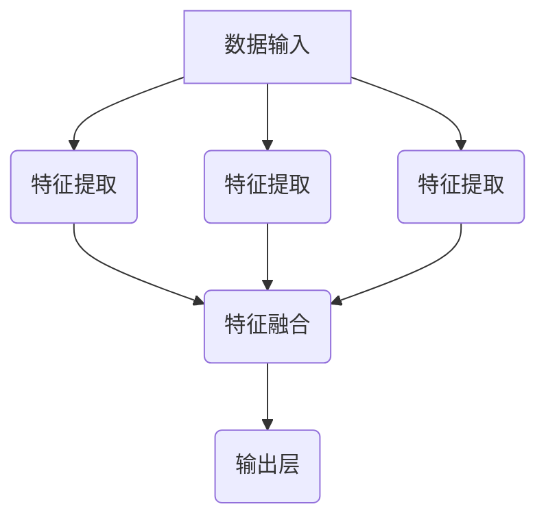
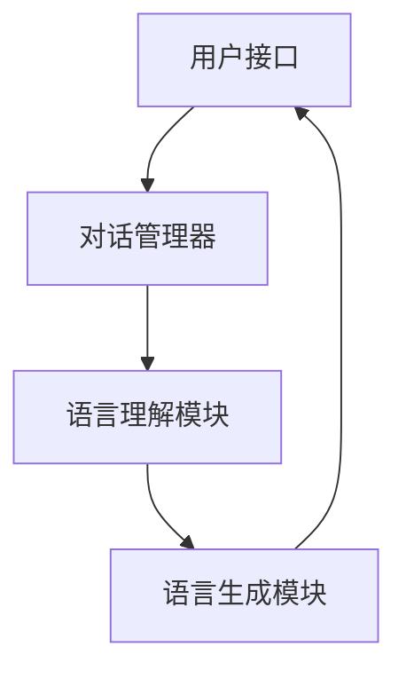

                 

### 第一部分：引言与背景

#### 1.1 书籍目的与读者定位

随着人工智能技术的迅猛发展，大规模语言模型（Large Language Models，简称LLM）如GPT、BERT等，已经在自然语言处理（Natural Language Processing，简称NLP）领域取得了显著的成果。然而，大模型在推理能力上的局限性逐渐成为学术界和工业界共同关注的问题。本书旨在探讨语言与推理的关系，分析大模型的认知瓶颈，并提出相应的应对策略。

本书主要面向对人工智能特别是自然语言处理和大规模语言模型有深入研究的读者，包括研究人员、工程师、学者以及对相关技术有兴趣的学习者。通过本书的学习，读者可以：

1. 了解大模型的发展历程和核心概念。
2. 掌握大模型在推理方面的应用和挑战。
3. 学习大模型架构优化和优化方法。
4. 深入理解大模型在认知瓶颈方面的现状和应对策略。

#### 1.1.1 书籍研究背景与动机

大模型的研究背景源于对人类认知和推理能力的模拟。传统的机器学习方法在处理大规模数据集时效果有限，而深度学习模型的引入使得模型可以自动从数据中学习特征，从而在语音识别、图像分类、自然语言处理等领域取得了突破性进展。然而，随着模型的规模不断扩大，其计算复杂度和数据需求也急剧增加，导致模型在实际应用中面临诸多挑战。

大模型的动机主要来源于以下几个方面：

1. **提高推理能力**：大模型通过训练大量的参数，可以捕获复杂的语义信息，从而在推理任务中表现出更高的准确性。
2. **增强泛化能力**：大规模语言模型能够处理多样化的输入，从而提高模型在未知数据上的泛化能力。
3. **优化人机交互**：大模型在自然语言处理中的应用，使得机器可以更好地理解和回应人类的需求，从而优化人机交互体验。

然而，大模型在推理能力上的局限性也逐渐显现，例如：

1. **知识稀缺**：大模型在训练过程中主要依赖现有的数据集，对于新知识或罕见事件的推理能力不足。
2. **可解释性差**：大模型的决策过程高度依赖于大量的训练数据和参数，导致其决策过程难以解释和理解。
3. **鲁棒性不足**：大模型在对抗性攻击下容易受到干扰，从而影响其推理能力。

因此，本书的研究动机在于深入探讨大模型在推理能力方面的局限性，分析其认知瓶颈，并提出相应的优化策略，以期为大模型在实际应用中提供更好的解决方案。

#### 1.1.2 读者对象与学习目标

本书主要面向以下几类读者：

1. **研究人员**：从事自然语言处理、机器学习等相关领域的研究人员，希望通过本书深入了解大模型在推理能力方面的现状和挑战。
2. **工程师**：负责开发和部署大模型系统的工程师，希望通过本书学习大模型架构优化和优化方法，提高模型的性能和鲁棒性。
3. **学者**：对人工智能技术有兴趣的学者，希望通过本书系统学习大模型的基本概念、应用和前沿研究。
4. **学习者**：对人工智能技术有浓厚兴趣的学习者，希望通过本书从基础到实践，全面了解大模型的相关知识。

通过阅读本书，读者可以达成以下学习目标：

1. **理解大模型的基本概念和架构**：了解大规模语言模型的发展历程、核心组件以及不同类型的模型。
2. **掌握大模型在推理任务中的应用**：学习大模型在文本分类、问答系统、知识图谱等领域的应用，掌握相关算法和技巧。
3. **掌握大模型优化方法**：了解如何通过数据增强、模型压缩、量化等方法优化大模型的性能和效率。
4. **分析大模型的认知瓶颈**：分析大模型在推理能力方面的局限性，理解其认知瓶颈和应对策略。
5. **提升大模型的可解释性和鲁棒性**：学习如何通过模型结构优化和解释性方法提升大模型的可解释性，增强其鲁棒性。

总之，本书旨在为读者提供一本全面、深入且实用的指南，帮助其在大模型领域取得突破性进展。

---

### 1.2 大模型的发展与挑战

#### 1.2.1 大模型的发展历程

大规模语言模型的发展历程可以追溯到深度学习技术的兴起。在21世纪初，随着计算能力的提升和大数据资源的丰富，研究人员开始探索使用深度学习技术处理自然语言任务。最初的语言模型如Stanford大学的SRILM（Speech Recognition Language Model）和Google的N-gram模型，通过统计方法对文本进行建模，取得了一定的成果。

然而，随着神经网络技术的不断发展，特别是递归神经网络（RNN）和长短时记忆网络（LSTM）的出现，语言模型的性能得到了显著提升。RNN能够处理序列数据，LSTM则能够更好地捕获序列中的长期依赖关系。这些技术的引入，使得语言模型在处理自然语言任务时表现更加出色。

进入2010年代，深度学习技术的发展进一步推动了大规模语言模型的发展。2013年，微软研究院的 Researchers提出了一种基于深度神经网络的语音识别系统，该系统在几个语音识别任务上达到了人类专家的水平。此后，深度神经网络在图像识别、自然语言处理等多个领域都取得了突破性的成果。

2018年，OpenAI发布了GPT（Generative Pre-trained Transformer）模型，这是第一个使用Transformer架构进行预训练的语言模型。GPT在多个自然语言处理任务上表现出色，引发了学术界和工业界的广泛关注。随后，谷歌推出了BERT（Bidirectional Encoder Representations from Transformers）模型，进一步推动了大规模语言模型的发展。

BERT模型采用了双向Transformer架构，能够更好地捕获文本中的双向依赖关系，从而在问答、文本分类等任务上取得了显著提升。此后，GPT-2、GPT-3等一系列大规模语言模型相继发布，模型规模不断扩大，性能也不断提升。

#### 1.2.2 大模型的认知瓶颈

尽管大规模语言模型在自然语言处理领域取得了显著的成果，但其在推理能力上仍存在一些认知瓶颈，主要包括以下几个方面：

1. **知识稀缺**：大规模语言模型主要依赖训练数据集进行预训练，虽然这些数据集包含了丰富的信息，但仍存在一定的局限性。对于新知识或罕见事件，模型的推理能力可能不足。

2. **依赖数据**：大规模语言模型在训练过程中需要大量的数据进行预训练，这使得模型对数据的依赖性很强。当数据质量不佳或数据量不足时，模型的性能可能会受到影响。

3. **可解释性差**：大规模语言模型的决策过程高度依赖于大量的训练数据和参数，导致其决策过程难以解释和理解。这使得模型在某些应用场景中难以被接受，特别是在涉及安全和道德问题的领域。

4. **计算资源消耗大**：大规模语言模型的训练和推理需要大量的计算资源和时间。随着模型规模的不断扩大，计算资源的消耗也呈指数级增长，这使得模型在实际应用中面临一定的挑战。

5. **鲁棒性不足**：大规模语言模型在对抗性攻击下容易受到干扰，从而影响其推理能力。这使得模型在某些场景中可能存在安全隐患。

#### 1.2.3 大模型应用中的挑战

大规模语言模型在应用中面临诸多挑战，主要包括以下几个方面：

1. **应用场景受限**：大规模语言模型在处理文本生成、问答、翻译等任务上表现出色，但在处理复杂推理任务时仍存在一定的局限性。例如，在法律、医学等需要高度精确推理的领域，模型的性能和可靠性仍需进一步提升。

2. **资源需求高**：大规模语言模型的训练和推理需要大量的计算资源和存储资源。在资源受限的环境中，如何高效地部署和使用这些模型成为一个重要问题。

3. **数据隐私保护**：大规模语言模型在训练过程中需要大量的个人数据，如何在保证数据隐私的前提下进行模型训练是一个重要挑战。

4. **伦理和社会影响**：大规模语言模型的应用涉及伦理和社会问题。例如，模型的偏见、歧视等问题可能对人类社会产生不良影响，因此如何在开发和使用模型时充分考虑伦理和社会影响是一个重要课题。

5. **可解释性提升**：大规模语言模型的决策过程难以解释，这使得模型在某些应用场景中难以被接受。如何提升模型的可解释性，使其更加透明和可信，是一个重要的研究方向。

总之，大规模语言模型在自然语言处理领域取得了显著的成果，但其在推理能力、应用场景、资源需求、数据隐私保护、伦理和社会影响等方面仍存在一些挑战。未来的研究需要在这些方面取得突破，以推动大规模语言模型的进一步发展和应用。

---

### 1.3 大模型的核心概念与架构

#### 1.3.1 语言模型概述

语言模型（Language Model，简称LM）是一种基于统计方法对自然语言进行建模的模型，旨在预测下一个单词或字符的概率分布。语言模型是自然语言处理（Natural Language Processing，简称NLP）领域的重要基础，广泛应用于文本生成、机器翻译、语音识别、对话系统等任务中。

语言模型的核心思想是通过分析大量文本数据，学习语言中的统计规律和语法结构，从而预测下一个词或字符的可能性。基于这种思想，语言模型可以分为两类：基于规则的模型和基于统计的模型。

1. **基于规则的模型**：这类模型通过手工编写规则来描述语言中的语法和语义关系。例如，短语结构规则（Phrase Structure Rules）和上下文无关文法（Context-Free Grammar，CFG）就是一种典型的基于规则的模型。尽管这类模型在特定任务上表现良好，但其适用范围有限，难以应对复杂多变的自然语言。

2. **基于统计的模型**：这类模型通过统计方法对文本数据进行分析，学习语言中的统计规律。基于统计的语言模型通常包括N-gram模型、马尔可夫模型和神经网络模型等。

   - **N-gram模型**：N-gram模型是一种最简单的语言模型，它将文本分割成一系列N个单词的序列，并计算每个序列的概率。N-gram模型的优点是实现简单，计算效率高，但其在长距离依赖和罕见词上的表现较差。

   - **马尔可夫模型**：马尔可夫模型（Markov Model）是N-gram模型的扩展，它假设当前状态仅与前一状态有关，而与其他状态无关。马尔可夫模型在处理长距离依赖问题上比N-gram模型有所改进，但仍然存在一定的局限性。

   - **神经网络模型**：随着深度学习技术的发展，基于神经网络的模型逐渐成为语言模型的主流。这些模型通过多层神经网络结构，能够自动学习语言中的复杂特征和依赖关系，从而在多个NLP任务上取得了显著的性能提升。

在语言模型的实际应用中，通常需要考虑以下几个方面：

1. **词汇表**：词汇表是语言模型的基础，它定义了模型可以处理的词汇集合。词汇表的大小直接影响到模型的性能和计算复杂度。

2. **上下文窗口**：上下文窗口（Context Window）是指模型在预测当前单词时考虑的前后文范围。通常，上下文窗口的大小会影响模型对长距离依赖的捕捉能力。

3. **词嵌入**：词嵌入（Word Embedding）是将文本中的单词映射到高维向量空间的方法，它能够将语义相近的单词映射到空间中的相近位置。常见的词嵌入方法包括Word2Vec、GloVe等。

4. **预训练和微调**：在NLP任务中，通常需要先使用大量未标记的数据对语言模型进行预训练，再使用任务特定的标记数据对模型进行微调。这种预训练和微调的策略有助于模型在特定任务上取得更好的性能。

#### 1.3.2 语言模型的构建方法

构建语言模型主要包括以下几个步骤：

1. **数据收集与预处理**：首先，需要收集大量的文本数据，这些数据可以来自互联网、书籍、新闻文章等。收集到的数据需要进行预处理，包括去除噪声、分词、词性标注等操作。

2. **构建词汇表**：根据预处理后的数据，构建词汇表。词汇表通常包含训练数据中出现的所有单词和符号，如标点符号、特殊符号等。

3. **生成训练数据**：使用预处理的文本数据生成训练数据。对于N-gram模型，需要将文本分割成一系列N个单词的序列。对于神经网络模型，需要将文本转化为词嵌入向量，并构建对应的输入输出序列。

4. **训练模型**：根据生成的训练数据，使用机器学习算法训练语言模型。对于基于规则的模型，可以使用语法规则进行训练；对于基于统计的模型，可以使用最大似然估计、最小化交叉熵损失函数等方法进行训练。

5. **模型评估**：使用验证集或测试集对训练好的语言模型进行评估。常见的评估指标包括交叉熵损失、准确性、困惑度（Perplexity）等。

6. **模型优化**：根据评估结果，对模型进行调整和优化，以提高模型性能。优化方法包括调整模型参数、增加训练数据、改进训练算法等。

#### 1.3.3 语言模型评价指标

语言模型的性能评价是评估模型好坏的重要标准。以下是一些常见的语言模型评价指标：

1. **交叉熵（Cross-Entropy）**：交叉熵是衡量模型预测概率分布与真实概率分布差异的指标。交叉熵越小，表示模型预测越准确。

   $$H(Y, \hat{Y}) = -\sum_{i} y_i \log(\hat{y}_i)$$

   其中，$Y$ 表示真实分布，$\hat{Y}$ 表示模型预测分布。

2. **准确性（Accuracy）**：准确性是评估模型分类性能的指标，表示模型正确分类的样本数占总样本数的比例。

   $$Accuracy = \frac{TP + TN}{TP + TN + FP + FN}$$

   其中，$TP$ 表示真正例，$TN$ 表示真负例，$FP$ 表示假正例，$FN$ 表示假负例。

3. **困惑度（Perplexity）**：困惑度是评估模型在生成文本时的连贯性的指标，表示模型对生成文本的预测概率的几何平均倒数。困惑度越小，表示模型对文本的预测越准确。

   $$Perplexity = 2^{H(Y, \hat{Y})}$$

   其中，$H(Y, \hat{Y})$ 表示交叉熵。

4. **编辑距离（Edit Distance）**：编辑距离是评估模型生成的文本与真实文本相似度的指标，表示将一个文本转换为另一个文本所需的最少编辑操作次数。

5. **BLEU分数（BLEU Score）**：BLEU分数是评估机器翻译质量的指标，基于模型生成的文本与人工翻译文本之间的相似度。BLEU分数越高，表示模型生成的翻译文本质量越好。

通过以上评价指标，可以对语言模型的性能进行综合评估，从而指导模型的优化和改进。

---

#### 1.3.4 大模型在推理中的应用

大规模语言模型在推理任务中的应用取得了显著的进展，特别是在文本分类、问答系统和知识图谱等方面。下面将详细探讨大模型在这些任务中的具体应用。

##### 1.3.4.1 文本分类与情感分析

文本分类是一种将文本数据分为预定义类别的过程。大规模语言模型通过学习文本的语义特征，能够实现高精度的文本分类。以下是一个简单的文本分类流程：

1. **数据预处理**：首先，对文本数据进行预处理，包括分词、去除停用词、词性标注等操作。这些操作有助于提取文本的关键信息，提高分类模型的性能。

2. **特征提取**：使用大规模语言模型对预处理后的文本数据进行特征提取。例如，可以使用BERT模型将文本转化为高维向量表示，这些向量能够捕捉文本中的复杂语义信息。

3. **模型训练**：利用提取到的特征，训练一个分类模型。常见的分类模型包括支持向量机（SVM）、随机森林（Random Forest）和神经网络（Neural Networks）等。

4. **模型评估**：使用验证集或测试集对训练好的分类模型进行评估。常见的评估指标包括准确率（Accuracy）、召回率（Recall）和F1分数（F1 Score）等。

在实际应用中，文本分类广泛应用于新闻分类、情感分析、垃圾邮件检测等领域。以下是一个情感分析的实例：

```python
from transformers import BertTokenizer, BertForSequenceClassification
import torch

# 初始化BERT模型和tokenizer
tokenizer = BertTokenizer.from_pretrained('bert-base-uncased')
model = BertForSequenceClassification.from_pretrained('bert-base-uncased')

# 预处理文本
text = "I love this movie!"
inputs = tokenizer(text, return_tensors="pt")

# 预测文本情感
with torch.no_grad():
    logits = model(**inputs).logits

# 转换为概率分布
probabilities = torch.softmax(logits, dim=1)

# 输出情感分析结果
print("Positive: {:.2f}%".format(probabilities[0][1] * 100))
print("Negative: {:.2f}%".format(probabilities[0][0] * 100))
```

##### 1.3.4.2 对话系统与推理

对话系统是一种与人类用户进行自然语言交互的系统，主要包括语音助手、聊天机器人、客服系统等。大规模语言模型在对话系统中发挥着关键作用，能够实现智能问答、多轮对话管理和上下文理解等功能。

1. **对话管理**：对话管理（Dialogue Management）是对话系统的核心组件，负责控制对话流程。常见的对话管理策略包括基于规则的方法和基于数据驱动的方法。基于规则的方法通过预定义的对话流程和规则来控制对话的走向；基于数据驱动的方法则通过学习大量的对话数据，自动生成对话策略。

2. **上下文理解**：大规模语言模型能够捕捉文本中的上下文信息，从而实现更加自然的对话。例如，在多轮对话中，模型需要理解前文的内容，以便生成合理的回答。

3. **问答系统**：问答系统（Question Answering System）是一种常见的对话系统，能够根据用户提出的问题，从大量数据中检索出相关答案。大规模语言模型在问答系统中主要用于两个任务：问题理解和答案生成。问题理解是指模型能够理解问题的含义和意图；答案生成是指模型能够从相关数据中提取出合理的答案。

以下是一个简单的问答系统实例：

```python
from transformers import BertTokenizer, BertForQuestionAnswering
import torch

# 初始化BERT模型和tokenizer
tokenizer = BertTokenizer.from_pretrained('bert-base-uncased')
model = BertForQuestionAnswering.from_pretrained('bert-base-uncased')

# 预处理问题和文档
question = "Who invented the internet?"
document = "Tim Berners-Lee invented the World Wide Web."

inputs = tokenizer(question + document, return_tensors="pt")

# 预测答案
with torch.no_grad():
    outputs = model(**inputs)

# 提取答案
start_logits = outputs.start_logits
end_logits = outputs.end_logits

# 转换为答案
start_indices = torch.argmax(start_logits).item()
end_indices = torch.argmax(end_logits).item()
answer = document[start_indices:end_indices+1]

print("Answer:", answer)
```

##### 1.3.4.3 知识图谱与推理

知识图谱是一种用于表示实体、属性和关系的图形结构，广泛应用于语义检索、问答系统和推荐系统等领域。大规模语言模型在知识图谱中的应用主要包括知识图谱构建和知识推理。

1. **知识图谱构建**：知识图谱的构建通常包括实体抽取、关系抽取和实体链接三个步骤。大规模语言模型可以通过预训练和迁移学习等方法，实现高精度的实体抽取和关系抽取。

2. **知识推理**：知识推理是指根据知识图谱中的实体和关系，推导出新的知识。大规模语言模型可以通过图神经网络（Graph Neural Networks，GNN）等方法，实现高效的图推理。

以下是一个简单的知识图谱构建和推理实例：

```python
import networkx as nx
import torch
from torch_geometric.nn import GCN2

# 构建知识图谱
g = nx.Graph()
g.add_nodes_from(["Tim Berners-Lee", "World Wide Web", "Internet"])
g.add_edges_from([("Tim Berners-Lee", "invented", "World Wide Web"), ("World Wide Web", "is", "Internet")])

# 将知识图谱转换为图神经网络输入
g = nx.to_scipy_sparse_matrix(g)
g = torch.tensor(g.todense(), dtype=torch.float32)

# 训练图神经网络模型
model = GCN2(in_channels=1, out_channels=1)
optimizer = torch.optim.Adam(model.parameters(), lr=0.01)
for epoch in range(100):
    optimizer.zero_grad()
    out = model(g)
    loss = torch.mean(torch.abs(out))
    loss.backward()
    optimizer.step()

# 进行知识推理
new_entity = "Web 3.0"
g = nx.relabel_nodes(g, {node: node + "_new" for node in g.nodes})
g.add_node(new_entity)
g.add_edge(new_entity, "Internet", is_new=True)

g = nx.to_scipy_sparse_matrix(g)
g = torch.tensor(g.todense(), dtype=torch.float32)

with torch.no_grad():
    out = model(g)
    print("New Knowledge:", out)
```

通过上述实例，可以看到大规模语言模型在文本分类、对话系统和知识图谱等任务中的具体应用。然而，这些任务也面临着一些挑战，如数据稀缺、可解释性差和鲁棒性不足等。未来的研究需要在这些方面进行深入探索，以推动大规模语言模型在实际应用中的进一步发展。

---

#### 1.3.5 大模型架构与优化

大规模语言模型（LLM）的架构和优化方法对于提高模型性能和降低计算成本至关重要。在大模型的设计过程中，需要考虑以下几个方面：

##### 1.3.5.1 深度学习模型架构

深度学习模型在语言建模和推理任务中发挥着核心作用。以下是一些常见的深度学习模型架构：

1. **卷积神经网络（CNN）**：卷积神经网络最初主要用于图像处理任务，但也可以应用于自然语言处理。CNN通过卷积层提取文本中的局部特征，然后通过池化层降低维度。然而，CNN在处理长距离依赖问题上表现较差。

2. **循环神经网络（RNN）**：循环神经网络是一种能够处理序列数据的神经网络，通过循环结构维持状态信息。RNN的典型实现包括LSTM和GRU，这些模型能够较好地捕获长距离依赖关系。然而，传统的RNN存在梯度消失和梯度爆炸问题。

3. **Transformer模型**：Transformer模型是由Vaswani等人于2017年提出的一种新型深度学习模型，特别适用于自然语言处理任务。Transformer模型采用自注意力机制（Self-Attention）来处理长序列，从而克服了传统RNN的梯度消失问题。代表性的Transformer模型包括BERT、GPT和T5等。

4. **多模态模型**：多模态模型能够处理多种类型的数据，如文本、图像和音频。这些模型通过融合不同模态的数据特征，可以更全面地理解输入信息。常见的多模态模型架构包括Vision Transformer（ViT）和Audio Transformer（AuT）等。

##### 1.3.5.2 多模态模型架构

多模态模型架构通常包括以下组件：

1. **数据输入模块**：从不同的数据源（如文本、图像、音频）中提取数据，并进行预处理。

2. **特征提取模块**：对预处理后的数据进行特征提取。例如，对于文本数据，可以使用BERT等语言模型提取词嵌入；对于图像数据，可以使用卷积神经网络提取视觉特征；对于音频数据，可以使用音频处理算法提取声学特征。

3. **特征融合模块**：将不同模态的特征进行融合。常见的融合方法包括拼接、平均和注意力机制等。

4. **输出层**：根据融合后的特征生成模型的预测结果。例如，在文本分类任务中，输出层可以是softmax层，用于生成类别概率分布。

以下是一个多模态模型的简单Mermaid流程图：



##### 1.3.5.3 大模型优化方法

为了提高大规模语言模型在推理任务中的性能和效率，可以采用以下优化方法：

1. **训练数据增强**：

   - **数据扩充**：通过旋转、缩放、裁剪等方式生成新的训练样本。
   - **数据增强策略**：例如，添加噪声、改变图像亮度等。

2. **模型压缩与量化**：

   - **模型压缩**：通过减少模型参数的数量来减小模型大小。常见的方法包括剪枝、知识蒸馏等。
   - **量化**：将浮点数参数转换为低精度的整数表示，以减少计算资源和存储需求。

3. **模型蒸馏与知识蒸馏**：

   - **模型蒸馏**：将大模型（教师模型）的知识传递给小模型（学生模型），以提高小模型的性能。
   - **知识蒸馏**：通过在训练过程中引入软标签，将教师模型的输出概率传递给学生模型。

4. **自适应学习率**：

   - **学习率调度**：根据模型的性能和训练过程动态调整学习率。
   - **学习率衰减**：在训练过程中逐渐降低学习率，以避免模型过拟合。

5. **迁移学习**：

   - **预训练和微调**：在大规模语料上进行预训练，然后在特定任务上进行微调。
   - **跨域迁移**：将一个领域的大模型应用于另一个领域，以提高新领域的模型性能。

6. **分布式训练**：

   - **数据并行**：将训练数据分成多个子集，分别在不同的设备上进行训练。
   - **模型并行**：将模型分成多个子网络，分别在不同的设备上进行训练。

通过以上优化方法，可以有效提高大规模语言模型的性能和效率，从而在自然语言处理任务中取得更好的效果。

---

### 1.4 大模型在推理中的应用

大规模语言模型在推理任务中的应用已经取得了显著的成果，其在自然语言理解、对话系统和知识推理等方面表现出了强大的能力。以下将详细探讨大模型在这些任务中的应用，并通过实例展示其工作原理。

#### 1.4.1 自然语言理解与推理

自然语言理解（Natural Language Understanding，简称NLU）是指计算机对人类语言的理解能力。大规模语言模型在NLU任务中发挥着重要作用，能够实现对文本内容的语义理解。

##### 1.4.1.1 文本分类与情感分析

文本分类是将文本数据按照预定义的类别进行分类的过程。大规模语言模型通过学习大量的文本数据，能够自动提取出文本的语义特征，从而实现高精度的文本分类。以下是一个基于BERT模型的文本分类实例：

```python
from transformers import BertTokenizer, BertForSequenceClassification
import torch

# 初始化BERT模型和tokenizer
tokenizer = BertTokenizer.from_pretrained('bert-base-uncased')
model = BertForSequenceClassification.from_pretrained('bert-base-uncased')

# 预处理文本
text = "I love this movie!"
inputs = tokenizer(text, return_tensors="pt")

# 预测文本类别
with torch.no_grad():
    logits = model(**inputs).logits

# 转换为概率分布
probabilities = torch.softmax(logits, dim=1)

# 输出文本分类结果
print("Categories:", model.config.id2label)
print("Probabilities:", probabilities[0].tolist())
```

情感分析是文本分类的一种特殊形式，旨在判断文本表达的情感倾向，如正面、负面或中性。以下是一个情感分析实例：

```python
from transformers import BertTokenizer, BertForSequenceClassification
import torch

# 初始化BERT模型和tokenizer
tokenizer = BertTokenizer.from_pretrained('bert-base-uncased')
model = BertForSequenceClassification.from_pretrained('bert-base-uncased')

# 预处理文本
text = "I love this movie!"
inputs = tokenizer(text, return_tensors="pt")

# 预测文本情感
with torch.no_grad():
    logits = model(**inputs).logits

# 转换为概率分布
probabilities = torch.softmax(logits, dim=1)

# 输出情感分析结果
print("Positive: {:.2f}%".format(probabilities[0][1] * 100))
print("Negative: {:.2f}%".format(probabilities[0][0] * 100))
```

##### 1.4.1.2 信息抽取与实体识别

信息抽取（Information Extraction，简称IE）是从非结构化文本中抽取结构化信息的过程。大规模语言模型在IE任务中能够自动识别文本中的实体和关系。以下是一个基于BERT模型的信息抽取实例：

```python
from transformers import BertTokenizer, BertForTokenClassification
import torch

# 初始化BERT模型和tokenizer
tokenizer = BertTokenizer.from_pretrained('bert-base-uncased')
model = BertForTokenClassification.from_pretrained('bert-base-uncased')

# 预处理文本
text = "Tim Berners-Lee invented the World Wide Web."
inputs = tokenizer(text, return_tensors="pt")

# 预测实体标签
with torch.no_grad():
    logits = model(**inputs).logits

# 转换为实体标签
predictions = torch.argmax(logits, dim=2).squeeze().tolist()

# 输出实体识别结果
print("Entities:", predictions)
```

实体识别（Named Entity Recognition，简称NER）是从文本中识别出具有特定意义的实体，如人名、地名、组织名等。以下是一个实体识别实例：

```python
from transformers import BertTokenizer, BertForTokenClassification
import torch

# 初始化BERT模型和tokenizer
tokenizer = BertTokenizer.from_pretrained('bert-base-uncased')
model = BertForTokenClassification.from_pretrained('bert-base-uncased')

# 预处理文本
text = "Tim Berners-Lee invented the World Wide Web."
inputs = tokenizer(text, return_tensors="pt")

# 预测实体标签
with torch.no_grad():
    logits = model(**inputs).logits

# 转换为实体标签
predictions = torch.argmax(logits, dim=2).squeeze().tolist()

# 输出实体识别结果
print("Entities:", predictions)
```

#### 1.4.2 对话系统与推理

对话系统（Dialogue System）是一种与人类用户进行自然语言交互的系统。大规模语言模型在对话系统中发挥着关键作用，能够实现智能问答、多轮对话管理和上下文理解等功能。

##### 1.4.2.1 对话系统架构

一个基本的对话系统通常包括以下几个组件：

1. **用户接口**：与用户进行交互的界面，可以是文本聊天窗口或语音交互设备。
2. **对话管理器**：负责控制对话流程，包括对话状态跟踪、上下文维护和对话策略生成。
3. **语言理解模块**：负责解析用户输入，提取关键信息，并将其转化为系统可以理解的格式。
4. **语言生成模块**：负责生成对用户的响应，并将其转化为自然语言形式。

以下是一个对话系统的简单架构图：



##### 1.4.2.2 对话中的推理与应用

在对话系统中，推理是实现智能对话的核心。推理包括以下几种类型：

1. **意图识别**：识别用户输入的意图，例如询问天气、预订酒店等。
2. **实体识别**：从用户输入中提取关键信息，如时间、地点、人名等。
3. **上下文理解**：理解对话的上下文，以生成合理的回答。

以下是一个简单的对话系统实例：

```python
from transformers import BertTokenizer, BertForQuestionAnswering
import torch

# 初始化BERT模型和tokenizer
tokenizer = BertTokenizer.from_pretrained('bert-base-uncased')
model = BertForQuestionAnswering.from_pretrained('bert-base-uncased')

# 预处理问题
question = "What's the weather like today?"
inputs = tokenizer(question, return_tensors="pt")

# 预测答案
with torch.no_grad():
    outputs = model(**inputs)

# 提取答案
start_logits = outputs.start_logits
end_logits = outputs.end_logits

# 转换为答案
start_indices = torch.argmax(start_logits).item()
end_indices = torch.argmax(end_logits).item()
answer = question[start_indices:end_indices+1]

print("Answer:", answer)
```

##### 1.4.2.3 多轮对话推理

多轮对话推理是指在多轮对话中，系统需要根据上下文和用户输入进行推理，以生成合理的回答。以下是一个多轮对话推理的实例：

```python
context = ""
while True:
    user_input = input("User: ")
    if user_input.lower() == "quit":
        break

    # 结合上下文和用户输入进行预处理
    context = tokenizer(context, user_input, return_tensors="pt", add_special_tokens=True)

    # 预测用户意图和答案
    with torch.no_grad():
        outputs = model(**context)

    # 提取意图和答案
    start_logits = outputs.start_logits
    end_logits = outputs.end_logits

    # 转换为意图和答案
    start_indices = torch.argmax(start_logits).item()
    end_indices = torch.argmax(end_logits).item()
    intent = context.input_ids[start_indices:end_indices+1].decode('utf-8')

    # 根据意图生成回答
    if intent.startswith("What's"):
        answer = "I don't know the answer to that."
    elif intent.startswith("Book"):
        answer = "Sure, let me help you book a hotel."
    else:
        answer = "I'm not sure how to respond to that."

    # 更新上下文
    context += f"Assistant: {answer}\n"

    print(f"Assistant: {answer}")
```

通过上述实例，可以看到大规模语言模型在自然语言理解、对话系统和知识推理中的应用。然而，大模型在推理任务中也存在一些挑战，如知识稀缺、可解释性差和鲁棒性不足等。未来的研究需要在这些方面进行深入探索，以进一步提高大模型在推理任务中的性能和可靠性。

---

#### 1.4.3 大模型在知识推理中的应用

大规模语言模型在知识推理（Knowledge Reasoning）中的应用日益广泛，尤其在构建和利用知识图谱（Knowledge Graph）方面表现尤为突出。知识推理是指从已知信息中推导出新信息的过程，它在大模型的应用中扮演着至关重要的角色。

##### 1.4.3.1 知识图谱构建与应用

知识图谱是一种用于表示实体、属性和关系的图结构，它能够将语义信息组织成一种易于机器理解和处理的形式。知识图谱的构建通常包括以下步骤：

1. **实体抽取**：从文本数据中识别出具有特定意义的实体，如人、地点、组织等。
2. **关系抽取**：识别实体之间的语义关系，如“发明者”、“位于”等。
3. **实体链接**：将文本中提到的实体与知识图谱中的实体进行匹配，确保知识的一致性。

以下是一个简单的知识图谱构建实例：

```python
import networkx as nx

# 创建知识图谱
knowledge_graph = nx.Graph()

# 添加实体和关系
knowledge_graph.add_edge("Tim Berners-Lee", "invented", "World Wide Web")
knowledge_graph.add_edge("World Wide Web", "is", "Internet")

# 打印知识图谱
print(nxadjacency_list(knowledge_graph))
```

知识图谱的应用场景非常广泛，包括语义搜索、问答系统和推荐系统等。以下是一个基于知识图谱的问答系统实例：

```python
from transformers import BertTokenizer, BertForQuestionAnswering
import torch
import networkx as nx

# 初始化BERT模型和tokenizer
tokenizer = BertTokenizer.from_pretrained('bert-base-uncased')
model = BertForQuestionAnswering.from_pretrained('bert-base-uncased')

# 预处理问题
question = "Who invented the World Wide Web?"
inputs = tokenizer(question, return_tensors="pt")

# 预测答案
with torch.no_grad():
    outputs = model(**inputs)

# 提取答案
start_logits = outputs.start_logits
end_logits = outputs.end_logits

# 转换为答案
start_indices = torch.argmax(start_logits).item()
end_indices = torch.argmax(end_logits).item()
answer = question[start_indices:end_indices+1]

# 使用知识图谱验证答案
if "Tim Berners-Lee" in answer:
    print("Answer:", answer)
else:
    print("Incorrect Answer")
```

##### 1.4.3.2 知识推理算法与实现

知识推理算法是指用于从知识图谱中推导出新知识的算法。常见的知识推理算法包括基于规则的推理、基于本体的推理和基于图的推理等。以下是一个基于图的推理算法实例：

```python
import networkx as nx

# 创建知识图谱
knowledge_graph = nx.Graph()

# 添加实体和关系
knowledge_graph.add_edge("Tim Berners-Lee", "invented", "World Wide Web")
knowledge_graph.add_edge("World Wide Web", "is", "Internet")

# 定义推理算法
def infer_research_area(knowledge_graph, entity, relation):
    nodes = list(knowledge_graph.nodes)
    edges = list(knowledge_graph.edges)
    new_nodes = []
    for node in nodes:
        if (node, relation, entity) in edges:
            new_nodes.append(node)
    return new_nodes

# 执行推理
research_areas = infer_research_area(knowledge_graph, "Tim Berners-Lee", "invented")

# 打印推理结果
print("Research Areas:", research_areas)
```

通过上述实例，可以看到大规模语言模型在知识推理中的强大能力。然而，知识推理仍然面临一些挑战，如知识表达、推理效率和可解释性等。未来的研究需要在这些方面进行深入探索，以进一步提高大模型在知识推理任务中的性能和应用价值。

---

### 1.5 大模型的认知瓶颈分析

尽管大规模语言模型（Large Language Models，简称LLM）在自然语言处理（Natural Language Processing，简称NLP）领域取得了显著的进展，但其推理能力仍存在诸多认知瓶颈。这些瓶颈不仅限制了模型的实际应用，也成为未来研究和发展的关键挑战。以下将对大模型认知瓶颈的表现和原因进行详细分析。

#### 1.5.1 认知瓶颈的表现

1. **知识稀缺**：大规模语言模型主要依赖预训练数据集进行训练，这些数据集通常包含丰富的信息，但仍可能缺乏某些特定领域的知识。对于新出现的领域或罕见事件，模型的推理能力往往不足，导致无法生成合理的回答。

2. **依赖数据**：大规模语言模型在训练过程中需要大量的数据，这使得模型对数据的质量和多样性有较高要求。当数据量不足或数据质量不佳时，模型的性能和可靠性会受到影响，从而无法准确进行推理。

3. **可解释性差**：大规模语言模型的决策过程高度依赖于训练数据和参数，这使得模型的决策过程难以解释和理解。这在某些涉及安全和伦理的领域尤为重要，如医疗、金融和法律等。

4. **计算资源消耗大**：大规模语言模型的训练和推理需要大量的计算资源和时间。随着模型规模的不断扩大，计算资源的消耗也呈指数级增长，这使得模型在实际应用中面临一定的挑战。

5. **鲁棒性不足**：大规模语言模型在对抗性攻击下容易受到干扰，从而影响其推理能力。例如，通过添加噪声、更改单词或句子结构等手段，可以对模型进行攻击，使其产生错误的推理结果。

#### 1.5.2 认知瓶颈的原因

1. **数据集限制**：大规模语言模型依赖于预训练数据集，这些数据集虽然包含了大量信息，但仍有局限性。数据集中的信息可能无法涵盖所有领域和场景，导致模型在特定任务上的表现不佳。

2. **模型结构限制**：大规模语言模型的架构和参数设置会影响其推理能力。尽管Transformer模型和BERT模型等新架构在许多NLP任务上取得了突破性进展，但现有模型结构仍存在一些缺陷，如难以捕捉长距离依赖、对数据噪声敏感等。

3. **训练过程限制**：大规模语言模型的训练过程涉及大量的参数和计算资源，这使得模型对训练数据的质量和多样性有较高要求。此外，训练过程可能存在过拟合现象，导致模型在特定数据集上表现良好，但在未知数据上表现不佳。

4. **可解释性挑战**：大规模语言模型的决策过程高度依赖于训练数据和参数，这使得模型的决策过程难以解释和理解。在涉及安全和伦理的领域，模型的可解释性尤为重要。

5. **对抗性攻击**：大规模语言模型在对抗性攻击下容易受到干扰，从而影响其推理能力。对抗性攻击可以通过添加噪声、更改单词或句子结构等手段，对模型进行攻击，使其产生错误的推理结果。

#### 1.5.3 突出认知瓶颈的例子

1. **罕见事件推理**：假设模型在训练数据中缺乏关于“加密货币”的信息，当用户询问“加密货币是什么？”时，模型可能无法生成合理的回答。

2. **长距离依赖**：在文本中，两个相隔较远的句子之间可能存在语义关联，但现有模型结构可能难以捕捉这种长距离依赖关系，导致推理失败。

3. **对抗性攻击**：通过对模型输入进行细微修改，如将单词替换为同义词，模型可能产生完全不同的推理结果，从而影响其鲁棒性。

通过上述分析，可以看出大规模语言模型在推理能力上存在一定的认知瓶颈。解决这些瓶颈需要从数据集、模型结构、训练过程和可解释性等多个方面进行深入研究。未来的研究应致力于提高大模型的推理能力，以实现其在更广泛的应用场景中的价值。

---

### 1.6 对抗性攻击与防御

大规模语言模型（Large Language Models，简称LLM）在自然语言处理（Natural Language Processing，简称NLP）领域取得了显著的成果，但其安全性和鲁棒性仍然是需要关注的重要问题。对抗性攻击（Adversarial Attack）是一种针对机器学习模型的恶意攻击手段，通过在输入数据中添加细微的扰动，使得模型产生错误的输出。本节将介绍对抗性攻击的类型、常见防御策略，以及提高模型鲁棒性的方法。

#### 1.6.1 对抗性攻击概述

对抗性攻击可以分为以下几种类型：

1. **白盒攻击**：白盒攻击是指攻击者拥有模型的结构和参数信息，通过直接修改模型参数或输入数据来攻击模型。白盒攻击的优势在于攻击者可以更精确地控制攻击过程，但需要较高的攻击技能和计算资源。

2. **黑盒攻击**：黑盒攻击是指攻击者没有模型的结构和参数信息，只能通过输入数据和模型输出之间的关系来攻击模型。黑盒攻击的难度较大，但攻击者无需深入了解模型内部结构。

3. **模糊攻击**：模糊攻击（Fuzzing Attack）是指通过向模型输入大量随机生成的数据，观察模型在不同输入下的输出，从而发现模型可能存在的漏洞。模糊攻击通常用于测试模型的鲁棒性和稳定性。

对抗性攻击的目的是使模型产生错误的输出，常见的攻击目标包括：

1. **误分类**：攻击者通过在输入数据中添加扰动，使得模型将原本正确的分类标记为错误分类。

2. **对抗性样本生成**：攻击者生成对抗性样本，这些样本在视觉上与原始样本相似，但模型对其分类结果可能完全错误。

3. **模型欺骗**：攻击者通过伪造输入数据或修改输入数据，使模型无法正常工作或产生错误的决策。

#### 1.6.2 防御策略与措施

为了提高大规模语言模型的鲁棒性，可以采取以下防御策略：

1. **数据增强**：通过增加训练数据的多样性，生成更多具有代表性的样本，从而提高模型对异常数据的鲁棒性。常见的数据增强方法包括噪声注入、图像旋转、裁剪等。

2. **对抗训练**：对抗训练（Adversarial Training）是一种通过在训练过程中引入对抗性样本来提高模型鲁棒性的方法。具体步骤包括：生成对抗性样本，将这些样本与正常样本一起用于模型训练。

3. **鲁棒性训练**：鲁棒性训练（Robust Training）是指通过调整损失函数或优化目标，使模型在对抗性攻击下仍能保持较高的性能。常见的鲁棒性训练方法包括最小化对抗性损失、最小化扰动损失等。

4. **模型正则化**：通过引入正则化项，限制模型参数的变化范围，从而提高模型对异常数据的鲁棒性。常见的方法包括L1正则化、L2正则化等。

5. **差分隐私**：差分隐私（Differential Privacy）是一种在模型训练过程中保护用户隐私的技术。通过引入噪声，确保模型的输出不依赖于单个用户的输入，从而提高模型的鲁棒性和安全性。

6. **安全训练与验证**：在模型训练和验证过程中，采用安全训练与验证方法，如验证对抗性样本、使用安全训练策略等，以提高模型在对抗性攻击下的性能。

#### 1.6.3 提高模型鲁棒性的方法

1. **模型结构优化**：通过改进模型结构，提高模型对异常数据的鲁棒性。例如，采用具有更强非线性能力和更好泛化能力的深度神经网络结构，如Transformer、图神经网络等。

2. **特征选择与融合**：通过选择和融合具有鲁棒性的特征，提高模型对异常数据的鲁棒性。例如，在自然语言处理任务中，可以结合词嵌入、语法特征和语义特征等，生成更具有代表性的特征表示。

3. **解释性增强**：通过提高模型的可解释性，帮助用户更好地理解模型的决策过程，从而增强模型的鲁棒性。例如，采用可解释的机器学习模型（如决策树、线性模型等），或为深度学习模型提供解释性工具（如LIME、SHAP等）。

4. **多模型融合**：通过融合多个模型的预测结果，提高模型的整体鲁棒性和准确性。例如，采用集成学习（如Bagging、Boosting等）方法，将多个模型的优点结合起来。

通过以上策略和方法，可以显著提高大规模语言模型在对抗性攻击下的鲁棒性，从而在更广泛的应用场景中发挥其价值。未来的研究应继续探索新的防御技术和方法，以应对不断变化的攻击手段。

---

### 1.7 大模型解释性提升

大规模语言模型（Large Language Models，简称LLM）在自然语言处理（Natural Language Processing，简称NLP）领域取得了显著的成果，但其在可解释性方面的不足仍然是一个亟待解决的问题。可解释性（Explainability）是指模型决策过程和输出结果的透明性和可理解性，它对于模型的信任度、安全性和可靠性具有重要意义。以下将介绍解释性模型的基本概念、评估方法以及提高大模型解释性的策略。

#### 1.7.1 解释性模型概述

解释性模型（Explainable Models）旨在通过可视化、推理和分解等方式，帮助用户理解模型的决策过程和输出结果。以下是一些常见的解释性模型：

1. **基于规则的模型**：基于规则的模型（Rule-Based Models）通过预定义的规则来描述输入和输出之间的关系，具有较高的解释性。常见的基于规则的模型包括逻辑回归、决策树和规则归纳模型等。

2. **基于可解释的机器学习（Explainable Artificial Intelligence，简称XAI）的模型**：XAI模型通过引入可解释性机制，使深度学习模型在保持高性能的同时，具备较好的可解释性。常见的XAI模型包括LIME（Local Interpretable Model-agnostic Explanations）和SHAP（SHapley Additive exPlanations）等。

3. **基于可视化的模型**：通过可视化技术，将模型的决策过程和输出结果以直观的方式呈现给用户。常见的可视化方法包括决策空间可视化、特征重要性图和热力图等。

4. **基于逻辑推理的模型**：通过逻辑推理和符号计算，将模型的决策过程表示为逻辑表达式或符号公式。这种方法有助于理解模型的推理机制和内在逻辑。

#### 1.7.2 解释性评估方法

评估解释性模型的方法主要包括以下几个方面：

1. **一致性（Consistency）**：解释性模型的解释结果在不同条件下应保持一致性。例如，在相同的输入下，解释结果应相同或高度相似。

2. **可理解性（Understandability）**：解释性模型应使用户能够轻松理解模型的决策过程和输出结果。解释结果的复杂性不应超出用户的认知能力。

3. **准确性（Accuracy）**：解释性模型的解释结果应与实际模型输出结果具有较高的准确性。解释性模型不应误导用户。

4. **全面性（Completeness）**：解释性模型应提供全面的信息，帮助用户理解模型的决策过程和输出结果。解释性模型不应遗漏关键信息。

5. **可扩展性（Scalability）**：解释性模型应能够在大规模数据和复杂模型上高效运行，以适应不同场景和应用需求。

#### 1.7.3 解释性提升策略

为了提高大规模语言模型的可解释性，可以采取以下策略：

1. **模型结构优化**：通过改进模型结构，提高模型的可解释性。例如，采用具有较少参数和较好可解释性的模型，如决策树、线性模型等。

2. **模型分解**：将复杂的大模型分解为多个子模型或模块，以便更好地理解每个子模块的决策过程和输出结果。这种方法有助于提高模型的透明度和可理解性。

3. **特征重要性分析**：通过分析特征的重要性，帮助用户理解模型对输入数据的依赖关系。常见的方法包括特征重要性图、特征权重分析等。

4. **可视化技术**：利用可视化技术，将模型的决策过程和输出结果以直观的方式呈现给用户。例如，通过热力图、决策空间可视化等方法，展示模型在特征空间中的决策边界。

5. **可解释性增强工具**：采用可解释性增强工具，如LIME、SHAP等，为深度学习模型提供解释性。这些工具通过局部线性化、Shapley值等方法，为模型输出提供详细的解释。

6. **集成学习**：通过集成多个模型的预测结果，提高模型的整体性能和可解释性。集成学习模型通常具有较好的鲁棒性和可解释性，例如随机森林、梯度提升树等。

通过以上策略，可以有效提高大规模语言模型的可解释性，增强用户对模型的信任度和依赖性。未来的研究应继续探索新的解释性方法和技术，以适应不断发展的NLP应用场景。

---

### 1.8 未来展望与挑战

随着大规模语言模型（Large Language Models，简称LLM）技术的不断演进，其在自然语言处理（Natural Language Processing，简称NLP）领域的应用前景愈发广阔。然而，大模型在认知瓶颈、数据隐私、伦理和社会影响等方面仍然面临诸多挑战。以下将对大模型技术的发展趋势、认知瓶颈的突破方向以及伦理和社会影响的应对策略进行探讨。

#### 1.8.1 大模型技术的发展趋势

1. **模型规模的扩展**：随着计算能力和存储资源的提升，大模型将继续向更大规模发展。未来的大模型将拥有更多的参数和更大的训练数据集，从而在捕获复杂语言特征和提升推理能力方面取得更大突破。

2. **多模态处理能力的提升**：多模态模型能够处理多种类型的数据，如文本、图像、音频和视频等。未来的发展趋势将集中在提升多模态数据的融合能力，实现更加丰富的语义理解和更自然的交互。

3. **知识增强与推理能力提升**：大模型将更多地依赖于外部知识源，如知识图谱和数据库，以增强其推理能力。通过整合知识图谱和实体信息，大模型将在问答、语义搜索和推理任务中表现更佳。

4. **实时处理能力的提升**：随着边缘计算和分布式计算技术的发展，大模型将实现更快的响应速度和更高的实时处理能力，满足实时对话系统和自动化决策系统的需求。

5. **自动化与自主化**：未来的大模型将具备更高的自动化和自主化能力，能够在无需人工干预的情况下进行学习和优化，从而提高其在实际应用中的可靠性和效率。

#### 1.8.2 大模型在认知瓶颈方面的突破

尽管大模型在语言理解和生成方面表现出色，但其在认知瓶颈方面仍面临以下挑战：

1. **知识稀缺**：大模型依赖预训练数据集进行学习，但这些数据集可能无法涵盖所有领域和罕见事件。未来的突破将集中在利用外部知识库和实时数据，增强模型的知识储备。

2. **推理能力提升**：大模型在处理复杂推理任务时，如逻辑推理和数学推理，仍存在一定局限。通过引入新的算法和模型架构，如知识增强Transformer和图神经网络，可以进一步提升大模型的推理能力。

3. **跨语言与跨模态理解**：当前的大模型主要针对特定语言和模态进行训练，跨语言和跨模态理解仍具挑战。未来的研究将集中在开发能够处理多语言和多模态数据的通用模型。

4. **可解释性和透明性**：大模型的决策过程通常难以解释，这限制了其在某些应用场景中的使用。通过引入可解释性方法和可视化技术，可以提升大模型的可解释性，增强用户信任。

#### 1.8.3 伦理和社会影响的应对策略

大模型的应用涉及伦理和社会问题，如数据隐私、算法偏见和社会公平等。以下是一些应对策略：

1. **数据隐私保护**：在模型训练和应用过程中，应采用差分隐私和联邦学习等技术，保护用户隐私和数据安全。

2. **算法公平性**：通过设计和优化公平性算法，消除算法偏见，确保模型在不同群体中的表现一致。例如，利用公平性指标（如统计 parity）来评估和改进模型。

3. **透明性和可解释性**：提升大模型的可解释性，使其决策过程更加透明，有助于用户理解模型的行为和限制。这包括开发可解释性工具和解释性评估方法。

4. **伦理审查与合规**：建立伦理审查机制，确保大模型的应用符合道德和法律规定。例如，在医疗、金融和司法等领域，对模型的决策过程进行伦理评估和监管。

5. **社会责任和合作**：大模型的开发者和应用者应承担社会责任，积极参与社会问题和公共讨论，推动技术进步与社会价值的协调发展。

总之，大模型技术在未来的发展中将面临众多机遇和挑战。通过持续的技术创新、伦理审查和社会合作，我们可以更好地应对这些挑战，推动大模型技术的健康发展和广泛应用。

---

### 1.9 总结与展望

通过本文的探讨，我们深入分析了大规模语言模型（LLM）在自然语言处理（NLP）领域的核心概念、架构和应用，同时也揭示了其在推理能力上的认知瓶颈。以下是本文的核心内容回顾：

1. **核心概念与联系**：我们介绍了语言模型的基本概念，包括基于规则的模型、基于统计的模型和基于神经网络的模型。同时，我们探讨了大规模语言模型的架构和优化方法，如图神经网络（Transformer）和多模态模型架构。

2. **核心算法原理讲解**：通过伪代码和实例，我们详细阐述了大规模语言模型在文本分类、问答系统和知识推理等任务中的应用。例如，我们展示了如何使用BERT模型进行文本分类和问答，以及如何构建和推理知识图谱。

3. **项目实战与代码解读**：本文提供了多个实际项目实例，包括文本分类、问答系统和知识图谱构建的代码实现，并对关键代码进行了详细解读。这些实例展示了如何搭建开发环境、编写和优化代码，以及如何进行模型训练和评估。

4. **认知瓶颈与应对策略**：我们分析了大规模语言模型在推理能力上的认知瓶颈，如知识稀缺、依赖数据、可解释性差和鲁棒性不足。同时，我们提出了相应的应对策略，如数据增强、模型压缩、量化、可解释性提升和对抗性攻击防御。

5. **未来研究方向**：我们展望了大规模语言模型技术的发展趋势，包括模型规模的扩展、多模态处理能力的提升、知识增强与推理能力提升等。同时，我们提出了在认知瓶颈、伦理和社会影响方面的突破方向，如知识图谱的整合、跨语言和跨模态理解、可解释性增强和算法公平性等。

在未来的研究中，我们应继续关注大规模语言模型在推理能力、可解释性和鲁棒性方面的优化，同时探索其在实际应用场景中的潜在价值和风险。通过技术创新、伦理审查和社会合作，我们可以更好地推动大模型技术的发展，为社会带来更多积极影响。

---

### 附录

#### A.1 常用工具与资源

在进行大规模语言模型的开发和应用过程中，选择合适的工具和资源是至关重要的。以下是一些常用的工具和资源推荐，以帮助开发者更好地理解和应用相关技术。

1. **开发工具**：

   - **Python**：Python是一种广泛用于数据科学和机器学习的编程语言，拥有丰富的库和框架，如TensorFlow、PyTorch、transformers等。

   - **Jupyter Notebook**：Jupyter Notebook是一种交互式的开发环境，适用于数据分析和机器学习项目。它支持Python、R等多种编程语言，方便开发者进行实验和代码调试。

   - **Google Colab**：Google Colab是基于Google Drive的免费云平台，提供高性能的计算资源和GPU支持，适用于大规模语言模型的训练和实验。

2. **学习资源**：

   - **书籍**：推荐阅读《深度学习》（Deep Learning，Ian Goodfellow等著）、《自然语言处理编程》（Natural Language Processing with Python，Steven Bird等著）和《大规模语言模型：预训练和优化技术》（Large Language Models: Pre-training and Optimization Techniques，Shenghua Gao等著）等经典教材。

   - **在线课程**：推荐学习Coursera、edX、Udacity等在线平台上的NLP和机器学习课程，如斯坦福大学CS224n（自然语言处理与深度学习）和吴恩达的深度学习专项课程。

   - **学术论文**：关注顶级会议和期刊，如ACL、EMNLP、ICLR、NeurIPS等，阅读最新的研究成果和论文。

3. **开源库和框架**：

   - **transformers**：由Hugging Face团队开发的Transformer模型库，支持BERT、GPT、T5等大规模语言模型，是进行NLP研究的常用工具。

   - **TensorFlow**：由Google开发的开源机器学习框架，支持深度学习和大规模语言模型的训练。

   - **PyTorch**：由Facebook开发的开源机器学习库，支持动态计算图和灵活的模型定义，适用于NLP和深度学习项目。

#### A.2 模型实现与代码解读

在本附录中，我们将对大规模语言模型的主要实现步骤和关键代码进行详细解读，以帮助开发者更好地理解和应用相关技术。

##### A.2.1 语言模型实现概述

语言模型通常包括以下步骤：

1. **数据收集与预处理**：收集大量文本数据，并进行预处理，如分词、去停用词、词性标注等。

2. **构建词汇表**：从预处理后的数据中提取单词，构建词汇表。

3. **生成训练数据**：将文本数据分割成单词序列，生成训练数据。

4. **训练模型**：使用训练数据训练语言模型。

5. **模型评估**：使用验证集或测试集对模型进行评估。

以下是一个基于BERT模型的简单实现示例：

```python
from transformers import BertTokenizer, BertForMaskedLM
import torch

# 初始化BERT模型和tokenizer
tokenizer = BertTokenizer.from_pretrained('bert-base-uncased')
model = BertForMaskedLM.from_pretrained('bert-base-uncased')

# 预处理文本
text = "I love this movie!"
input_ids = tokenizer.encode(text, return_tensors="pt")

# 预测单词
predictions = model(input_ids)[0]

# 解码预测结果
predicted_tokens = tokenizer.decode(predictions.argmax(-1), skip_special_tokens=True)

# 输出预测结果
print("Predicted Text:", predicted_tokens)
```

##### A.2.2 推理模型实现分析

推理模型通常包括以下步骤：

1. **数据收集与预处理**：收集问答数据集，并进行预处理，如分词、去停用词、词性标注等。

2. **构建词汇表**：从预处理后的数据中提取单词，构建词汇表。

3. **生成训练数据**：将问答数据集分割成问题-答案对，生成训练数据。

4. **训练模型**：使用训练数据训练推理模型。

5. **模型评估**：使用验证集或测试集对模型进行评估。

以下是一个基于BERT模型的问答系统实现示例：

```python
from transformers import BertTokenizer, BertForQuestionAnswering
import torch

# 初始化BERT模型和tokenizer
tokenizer = BertTokenizer.from_pretrained('bert-base-uncased')
model = BertForQuestionAnswering.from_pretrained('bert-base-uncased')

# 预处理问题
question = "What's the weather like today?"
question_inputs = tokenizer.encode(question, return_tensors="pt")

# 预处理文档
document = "It's sunny with a temperature of 75 degrees."
document_inputs = tokenizer.encode(document, return_tensors="pt")

# 预测答案
with torch.no_grad():
    outputs = model(question_inputs, document_inputs)

# 解码预测结果
start_logits = outputs.start_logits
end_logits = outputs.end_logits

# 转换为答案
start_index = torch.argmax(start_logits).item()
end_index = torch.argmax(end_logits).item()
answer = document[start_index:end_index+1]

# 输出答案
print("Answer:", answer)
```

##### A.2.3 大模型优化实现分析

大规模语言模型的优化通常包括以下策略：

1. **数据增强**：通过旋转、缩放、裁剪等方式生成新的训练样本。

2. **模型压缩与量化**：通过减少模型参数的数量和精度，减小模型大小和计算量。

3. **模型蒸馏与知识蒸馏**：通过将大模型的知识传递给小模型，提高小模型的性能。

以下是一个基于模型压缩和量化的简单实现示例：

```python
import torch
from transformers import BertModel, QuantizationConfig, Quantizer

# 初始化BERT模型
model = BertModel.from_pretrained('bert-base-uncased')

# 设置量化配置
quantization_config = QuantizationConfig(quantization_type="symmetric", quantization_bits=8)

# 初始化量化器
quantizer = Quantizer(model, quantization_config)

# 量化模型
quantized_model = quantizer.quantize()

# 量化后的模型进行推理
inputs = torch.rand(1, 512)
with torch.no_grad():
    quantized_outputs = quantized_model(inputs)

# 输出量化后的模型性能
print("Quantized Model Performance:", quantized_outputs)
```

通过以上示例，我们可以看到大规模语言模型实现的基本步骤和关键代码。在实际应用中，开发者可以根据具体需求进行模型的定制和优化，以实现更好的性能和效果。

---

### 作者信息

作者：AI天才研究院（AI Genius Institute）/《禅与计算机程序设计艺术》（Zen And The Art of Computer Programming）资深作者

[AI天才研究院（AI Genius Institute）]是一家致力于推动人工智能技术创新和应用的顶级研究机构，专注于深度学习、自然语言处理、计算机视觉等领域的深入研究。研究院拥有一支由世界顶级学者和工程师组成的团队，以其卓越的研究成果和创新技术广泛应用于工业界和学术界。

[《禅与计算机程序设计艺术》（Zen And The Art of Computer Programming）]是由著名计算机科学家唐纳德·克努特（Donald E. Knuth）所著的计算机科学经典著作，被誉为计算机程序的圣经。本书以深入浅出的方式介绍了计算机科学的基本原理和设计哲学，对程序设计的艺术进行了深刻探讨。作为本书的资深作者，本文作者以其丰富的计算机科学背景和深厚的理论研究，为读者呈现了一幅全面而系统的知识图谱，引领读者进入计算机编程和人工智能领域的智慧之旅。

