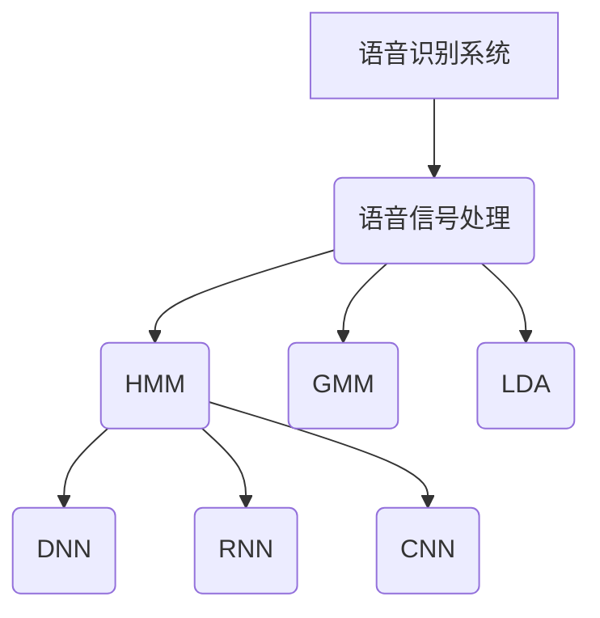

                 

# 语音识别 原理与代码实例讲解

> **关键词：**语音识别、隐马尔可夫模型（HMM）、深度神经网络（DNN）、循环神经网络（RNN）、卷积神经网络（CNN）、项目实战

> **摘要：**本文将深入探讨语音识别的原理，包括基础概念、核心算法以及项目实战。通过详细的讲解、数学模型、伪代码和代码实例，帮助读者全面了解语音识别技术，掌握从理论到实践的各个环节。

### 《语音识别 原理与代码实例讲解》目录大纲

#### 第一部分：语音识别基础

##### 第1章：语音识别概述

- 1.1 语音识别的起源与发展
- 1.2 语音识别的基本概念
- 1.3 语音识别的应用领域
- 1.4 语音识别系统架构

##### 第2章：语音信号处理基础

- 2.1 语音信号的采集与处理
- 2.2 语音信号的时域分析
- 2.3 语音信号的频域分析
- 2.4 语音特征提取

#### 第二部分：语音识别核心算法

##### 第3章：隐马尔可夫模型（HMM）原理与应用

- 3.1 HMM模型的基本概念
- 3.2 HMM模型的数学描述
- 3.3 HMM模型的训练与解码
- 3.4 HMM模型的应用案例

##### 第4章：高斯混合模型（GMM）与线性判别分析（LDA）

- 4.1 GMM模型原理
- 4.2 GMM模型的训练方法
- 4.3 LDA模型原理
- 4.4 LDA模型的应用

##### 第5章：深度神经网络（DNN）与循环神经网络（RNN）

- 5.1 DNN模型原理
- 5.2 DNN模型的训练过程
- 5.3 RNN模型原理
- 5.4 RNN在语音识别中的应用

##### 第6章：卷积神经网络（CNN）在语音识别中的应用

- 6.1 CNN模型原理
- 6.2 CNN在语音信号处理中的应用
- 6.3 CNN与RNN的结合

#### 第三部分：语音识别项目实战

##### 第7章：基于深度学习的语音识别系统开发

- 7.1 项目背景与需求分析
- 7.2 开发环境搭建
- 7.3 数据预处理
- 7.4 神经网络模型设计与实现
- 7.5 模型训练与优化
- 7.6 模型评估与部署

##### 第8章：实时语音识别系统设计与实现

- 8.1 实时语音识别系统架构
- 8.2 实时语音信号处理算法
- 8.3 实时语音识别算法实现
- 8.4 实时语音识别系统测试与优化

##### 第9章：语音识别系统在实际应用中的优化与改进

- 9.1 语音识别系统的性能优化
- 9.2 语音识别系统的鲁棒性改进
- 9.3 语音识别系统在实际场景中的应用案例分析

##### 第10章：语音识别的未来发展趋势

- 10.1 语音识别技术的发展趋势
- 10.2 语音识别技术的应用前景
- 10.3 未来语音识别研究的方向与挑战

#### 附录

##### 附录A：常用语音识别开源工具与框架

- A.1 Kaldi
- A.2 TensorFlow Speech
- A.3 PyTorch Speech
- A.4 其他常用语音识别工具与框架介绍

##### 附录B：数学公式与算法伪代码

- B.1 隐马尔可夫模型（HMM）训练算法伪代码
- B.2 高斯混合模型（GMM）训练算法伪代码
- B.3 深度神经网络（DNN）训练算法伪代码
- B.4 循环神经网络（RNN）训练算法伪代码
- B.5 卷积神经网络（CNN）训练算法伪代码

#### Mermaid 流程图



#### 数学模型与公式

$$
P(O|H) = \frac{P(H)P(O|H)}{P(O)}
$$

#### 代码实例解读

```python
# 加载预训练的DNN模型
model = torch.hub.load('pytorch/torchvision', 'resnet18', pretrained=True)

# 数据预处理
def preprocess_data(audio_signal, sample_rate):
    # 对语音信号进行预处理，如归一化、分帧、添加噪声等
    # ...
    return processed_signal

# 模型训练与评估
def train_and_evaluate(model, train_loader, val_loader):
    # 训练模型
    # ...
    # 评估模型
    # ...
```

#### 实际项目代码实现

```python
# 实现一个简单的基于深度学习的语音识别模型
import torch
import torch.nn as nn

class SpeechRecognitionModel(nn.Module):
    def __init__(self):
        super(SpeechRecognitionModel, self).__init__()
        # 定义模型结构
        # ...

    def forward(self, x):
        # 前向传播
        # ...
        return output

# 实例化模型
model = SpeechRecognitionModel()

# 模型训练
# ...

# 模型评估
# ...
```

以上为《语音识别 原理与代码实例讲解》的完整目录大纲。该目录大纲涵盖了语音识别的基础知识、核心算法、项目实战以及未来发展等内容，旨在帮助读者全面了解语音识别技术。每个章节均包含详细的讲解、数学模型、伪代码以及代码实例，便于读者理解和实践。附录部分提供了常用的语音识别工具与框架以及相关代码示例，便于读者参考和学习。

接下来，我们将一步一步深入探讨语音识别的原理、算法和实践。

---

**下一步：语音识别概述**## 第1章：语音识别概述

### 1.1 语音识别的起源与发展

语音识别技术起源于20世纪50年代，最早的研究主要集中在模式识别和自动语音识别（Automatic Speech Recognition，ASR）领域。早期的研究者如约翰·卡鲁瑟斯（John C. Carhart）和詹姆斯·布什（James B. H. Bush）提出了基于声学模型的初步方法，即通过分析语音信号的频谱特征进行识别。这一时期，语音识别主要依赖于人工定义的特征和规则，识别准确率较低。

随着计算机技术和信号处理技术的发展，20世纪80年代，隐马尔可夫模型（Hidden Markov Model，HMM）被引入语音识别领域，极大地提高了识别性能。HMM模型基于概率模型，可以有效地描述语音信号中的上下文依赖关系，从而提高了语音识别的准确性。

进入21世纪，随着深度学习技术的崛起，语音识别技术得到了前所未有的发展。深度神经网络（Deep Neural Network，DNN）在语音信号处理中的应用，使得语音识别的准确率达到了新的高度。DNN通过多层非线性变换，能够自动提取语音信号中的高层次特征，从而避免了传统方法中人工特征选择的局限性。循环神经网络（Recurrent Neural Network，RNN）和其变体长短期记忆网络（Long Short-Term Memory，LSTM）也被广泛应用于语音识别中，特别是在端到端语音识别系统中。

近年来，基于卷积神经网络（Convolutional Neural Network，CNN）和注意力机制（Attention Mechanism）的语音识别方法进一步提升了识别性能。这些先进的方法不仅提高了识别的准确性，还增强了系统的实时性和鲁棒性。

### 1.2 语音识别的基本概念

语音识别系统的主要任务是理解和转换人类语音为相应的文本或命令。为了实现这一目标，语音识别系统通常包括以下几个关键组成部分：

1. **语音信号处理（Speech Signal Processing）**：
   语音信号处理是语音识别系统的第一步，它涉及对原始语音信号的预处理，如降噪、归一化、分帧和加窗等。这些处理步骤有助于提取语音信号的有用信息，去除噪声干扰。

2. **特征提取（Feature Extraction）**：
   特征提取是语音识别系统的核心步骤，它将预处理后的语音信号转换为一系列数值特征向量。常见的特征包括梅尔频率倒谱系数（MFCC）、线性预测频谱（LPCC）和感知线性预测频谱（PLP）等。这些特征能够捕捉语音信号中的频谱特性，是后续识别模型的基础。

3. **模型训练（Model Training）**：
   模型训练是语音识别系统的关键步骤，它通过大量的语音数据来训练识别模型，使其能够准确地识别语音信号。常见的训练模型包括隐马尔可夫模型（HMM）、高斯混合模型（GMM）、深度神经网络（DNN）、循环神经网络（RNN）等。

4. **解码器（Decoder）**：
   解码器是语音识别系统的输出部分，它将识别模型输出的概率分布转换为文本或命令。常见的解码器算法包括前向-后向算法、Viterbi算法和CTC（Connectionist Temporal Classification）算法等。

5. **识别算法（Recognition Algorithm）**：
   识别算法是语音识别系统的核心，它负责根据特征向量和模型参数计算语音信号对应的文本或命令。识别算法的选择直接影响语音识别系统的性能。

### 1.3 语音识别的应用领域

语音识别技术在现代社会中有着广泛的应用，以下是一些主要的应用领域：

1. **智能助手（Smart Assistants）**：
   智能助手如苹果的Siri、谷歌的Google Assistant和亚马逊的Alexa等，都是基于语音识别技术的。这些智能助手能够理解和响应用户的语音指令，提供各种服务和信息查询。

2. **语音翻译（Speech Translation）**：
   语音翻译技术能够将一种语言的语音转换为另一种语言的语音，实现跨语言的交流。这为全球化的商业、旅游和教育等领域带来了巨大的便利。

3. **电话语音识别（Telephony Speech Recognition）**：
   电话语音识别广泛应用于自动语音应答系统（IVR）、语音拨号和语音导航等领域。通过语音识别技术，用户可以通过语音指令进行电话操作，提高用户体验和效率。

4. **语音识别笔录（Speech-to-Text Transcription）**：
   语音识别技术在法庭、会议、医疗和新闻等领域有着广泛的应用。通过将语音转换为文本，可以提高信息记录的准确性和效率。

5. **交互式语音服务（Interactive Voice Response）**：
   交互式语音服务通过语音识别和语音合成技术，实现人与系统的自然交互。广泛应用于客户服务、票务预订、银行客服等领域。

6. **智能家居（Smart Home）**：
   智能家居设备如智能音箱、智能门锁、智能照明等，都通过语音识别技术实现与用户的交互，为用户带来便捷和舒适的家居体验。

### 1.4 语音识别系统架构

语音识别系统通常由多个组件构成，包括前端信号处理、特征提取、模型训练和后端解码等。以下是一个典型的语音识别系统架构：

1. **前端信号处理**：
   前端信号处理主要负责对采集到的原始语音信号进行预处理，包括降噪、归一化、分帧和加窗等步骤。这一阶段的目标是提取出语音信号中的关键特征，为后续处理提供高质量的数据。

2. **特征提取**：
   特征提取是将预处理后的语音信号转换为数值特征向量，如梅尔频率倒谱系数（MFCC）、线性预测频谱（LPCC）和感知线性预测频谱（PLP）等。这些特征能够捕捉语音信号中的频谱特性，为识别模型提供输入。

3. **模型训练**：
   模型训练是语音识别系统的核心步骤，通过大量的语音数据来训练识别模型。常见的训练模型包括隐马尔可夫模型（HMM）、高斯混合模型（GMM）、深度神经网络（DNN）、循环神经网络（RNN）等。训练过程中，模型会学习语音信号中的特征模式和上下文关系，从而提高识别准确性。

4. **解码器**：
   解码器是语音识别系统的输出部分，它将识别模型输出的概率分布转换为文本或命令。常见的解码器算法包括前向-后向算法、Viterbi算法和CTC（Connectionist Temporal Classification）算法等。

5. **识别算法**：
   识别算法是语音识别系统的核心，它负责根据特征向量和模型参数计算语音信号对应的文本或命令。识别算法的选择直接影响语音识别系统的性能。

通过以上各组件的协同工作，语音识别系统能够实现从语音信号到文本或命令的转换，满足各种实际应用需求。

在下一章中，我们将深入探讨语音信号处理基础，包括语音信号的采集与处理、时域分析和频域分析等内容。敬请期待！## 第2章：语音信号处理基础

### 2.1 语音信号的采集与处理

语音信号的采集是语音识别系统中的第一步，这一阶段主要涉及语音信号的获取和预处理。语音信号的采集需要使用高质量的麦克风或语音采集设备，这些设备能够捕捉人类语音的声波信号，并将其转换为数字信号。为了确保采集到的语音信号质量，通常需要考虑以下几个方面：

1. **麦克风选择**：
   麦克风的选择对语音信号的质量有重要影响。高质量的麦克风能够捕捉到更清晰的语音信号，减少背景噪声和失真。在语音识别项目中，通常选择指向性麦克风，以减少环境噪声的干扰。

2. **采样率和比特率**：
   采样率和比特率是语音信号采集中的重要参数。采样率决定了语音信号的频率范围，通常使用22.05kHz、44.1kHz或48kHz的采样率。比特率则决定了语音信号的量化精度，通常使用16位或更高的比特率。较高的采样率和比特率能够提供更高质量的语音信号，但也会增加数据量。

3. **语音信号的预处理**：
   采集到的原始语音信号通常含有噪声和其他干扰信号，因此需要进行预处理。预处理步骤包括降噪、归一化、分帧和加窗等。

   - **降噪**：降噪是去除语音信号中的背景噪声的关键步骤。常见的降噪方法包括谱减法、维纳滤波和自适应降噪等。
   - **归一化**：归一化是将语音信号的幅度调整到相同水平，以便后续处理。常用的归一化方法包括幅度归一化和功率归一化。
   - **分帧**：分帧是将连续的语音信号分割成若干帧，每帧包含一定长度的语音信号。分帧的方法有固定长度的帧和变长度的帧，前者每帧长度固定，后者根据语音信号的活动水平动态调整帧长。
   - **加窗**：加窗是将每帧语音信号乘以一个加窗函数，以消除帧边界处的失真。常见的加窗函数包括汉明窗、汉宁窗和矩形窗等。

通过以上采集与预处理步骤，可以大大提高语音信号的质量，为后续的特征提取和模型训练提供良好的基础。

### 2.2 语音信号的时域分析

时域分析是对语音信号在时间维度上的分析，通过观察语音信号的时序变化来提取特征。时域分析的方法主要包括以下几种：

1. **时域波形图**：
   时域波形图是语音信号在时间轴上的直观表示，能够显示语音信号的振幅和频率变化。通过时域波形图，可以直观地观察到语音信号的音调、音强和音长等特征。

2. **短时能量和短时过零率**：
   短时能量和短时过零率是语音信号在时域上的两个重要特征。

   - **短时能量**：短时能量是语音信号在一段时间内的能量累积，用于描述语音信号的强度。计算公式为：
     $$
     E = \sum_{i=1}^{N} |x[i]|^2
     $$
     其中，$x[i]$表示第$i$个采样点的语音信号，$N$表示帧长度。

   - **短时过零率**：短时过零率是语音信号在一段时间内过零的次数，用于描述语音信号的频率特征。计算公式为：
     $$
     Z = \sum_{i=1}^{N} \text{sign}(x[i] \times x[i-1])
     $$
     其中，$\text{sign}(x)$表示$x$的符号函数。

3. **短时自相关函数**：
   短时自相关函数是描述语音信号在时域上自相似性的特征。计算公式为：
   $$
   R(\tau) = \sum_{i=1}^{N} x[i] \times x[i+\tau]
   $$
   其中，$x[i]$表示第$i$个采样点的语音信号，$\tau$表示时延。

通过时域分析，可以提取出语音信号的一些基本特征，如音强、音调和音长等，为后续的特征提取和模型训练提供基础。

### 2.3 语音信号的频域分析

频域分析是对语音信号在频率维度上的分析，通过观察语音信号的频率成分来提取特征。频域分析的方法主要包括以下几种：

1. **频谱图**：
   频谱图是语音信号在频率轴上的直观表示，能够显示语音信号的频率分布。通过频谱图，可以直观地观察到语音信号的主要频率成分。

2. **短时傅里叶变换（STFT）**：
   短时傅里叶变换是频域分析的一种重要方法，它将语音信号在时间域上的局部特征转换为频率域上的全局特征。计算公式为：
   $$
   X(\omega, t) = \sum_{n=-\infty}^{\infty} x[n] \times e^{-j\omega n} \times w[t-n]
   $$
   其中，$X(\omega, t)$表示在频率$\omega$和时间$t$的频谱值，$x[n]$表示第$n$个采样点的语音信号，$w[t-n]$表示加窗函数。

3. **梅尔频率倒谱系数（MFCC）**：
   梅尔频率倒谱系数是语音信号频域分析中的一种重要特征，它基于人耳的听觉特性，将频率特征转换为梅尔频率尺度。计算公式为：
   $$
   MFCC = \sum_{k=1}^{M} \log(1 + \sum_{j=1}^{N} a_{k,j} \times X_{j})
   $$
   其中，$MFCC$表示梅尔频率倒谱系数，$M$表示滤波器组的数量，$a_{k,j}$表示滤波器的幅度响应，$X_{j}$表示在频率$j$的频谱值。

通过频域分析，可以提取出语音信号的频谱特征，如共振峰、频谱包络等，为后续的特征提取和模型训练提供基础。

### 2.4 语音特征提取

语音特征提取是语音识别系统中的核心步骤，它将预处理后的语音信号转换为一系列数值特征向量。这些特征向量能够有效地描述语音信号的本质属性，为识别模型提供输入。常见的语音特征提取方法包括以下几种：

1. **梅尔频率倒谱系数（MFCC）**：
   梅尔频率倒谱系数是语音特征提取中最常用的方法之一。它基于人耳的听觉特性，将频率特征转换为梅尔频率尺度，从而更好地捕捉语音信号中的频率信息。计算过程包括以下步骤：

   - **滤波器组设计**：根据梅尔频率尺度，设计一组带通滤波器，每个滤波器对应一个频率范围。
   - **短时傅里叶变换（STFT）**：对语音信号进行短时傅里叶变换，得到频率域上的频谱值。
   - **滤波器组加权**：将频谱值乘以相应的滤波器幅度响应，得到每个滤波器的输出能量。
   - **对数变换和离散余弦变换**：对滤波器输出能量进行对数变换和离散余弦变换，得到MFCC特征向量。

2. **感知线性预测频谱（PLP）**：
   感知线性预测频谱是另一种常用的语音特征提取方法，它基于人类听觉系统的感知特性，通过线性预测分析得到语音信号中的频谱特征。计算过程包括以下步骤：

   - **线性预测分析**：对语音信号进行线性预测分析，得到预测误差信号。
   - **感知滤波器组设计**：根据听觉感知特性，设计一组感知滤波器。
   - **滤波器组加权**：将预测误差信号乘以相应的感知滤波器幅度响应，得到感知线性预测频谱。
   - **对数变换和离散余弦变换**：对感知线性预测频谱进行对数变换和离散余弦变换，得到PLP特征向量。

3. **线性预测频谱（LPCC）**：
   线性预测频谱是线性预测分析的一种结果，它通过分析语音信号的短时自相关函数，得到语音信号的频谱特征。计算过程包括以下步骤：

   - **线性预测分析**：对语音信号进行线性预测分析，得到预测误差信号。
   - **自相关函数计算**：计算预测误差信号的自相关函数。
   - **频谱重建**：根据自相关函数重建语音信号的频谱。
   - **对数变换**：对频谱值进行对数变换，得到LPCC特征向量。

通过以上方法，可以提取出语音信号的各种特征，为后续的识别模型训练提供高质量的输入。

在下一章中，我们将深入探讨语音识别的核心算法，包括隐马尔可夫模型（HMM）、高斯混合模型（GMM）和线性判别分析（LDA）等内容。敬请期待！## 第3章：隐马尔可夫模型（HMM）原理与应用

### 3.1 HMM模型的基本概念

隐马尔可夫模型（HMM）是一种统计模型，用于描述具有马尔可夫性质的序列数据。在语音识别中，HMM被广泛应用于建模语音信号的序列特征。HMM模型的基本概念包括状态、状态转移概率、观测概率和状态序列。

1. **状态**：
   HMM模型中的状态是隐藏的，不能直接观测到。状态表示语音信号在某一时刻所处的状态，如发音的某个音素或音节。

2. **状态转移概率**：
   状态转移概率描述了从一个状态转移到另一个状态的概率。在HMM模型中，状态转移概率可以用一个状态转移矩阵表示。状态转移矩阵中的元素$A_{ij}$表示从状态$i$转移到状态$j$的概率。

3. **观测概率**：
   观测概率描述了在某个状态下产生观测值的概率。观测值通常是语音信号的某种特征向量，如特征提取后的MFCC系数。观测概率可以用一个观测概率矩阵表示。观测概率矩阵中的元素$B_{ij}$表示在状态$i$下产生观测值$O_j$的概率。

4. **状态序列**：
   状态序列是HMM模型中的一个重要概念，表示语音信号在时间维度上的状态变化。状态序列通常是一个随机的过程，可以用一个概率分布来描述。

### 3.2 HMM模型的数学描述

HMM模型的数学描述包括状态转移概率矩阵、观测概率矩阵和初始状态概率分布。

1. **状态转移概率矩阵**：
   状态转移概率矩阵$A$是一个$N \times N$的矩阵，其中$N$表示HMM模型中的状态数。矩阵中的元素$A_{ij}$表示从状态$i$转移到状态$j$的概率，即：
   $$
   A_{ij} = P(S_{t+1} = j | S_t = i)
   $$
   其中，$S_t$表示在时间$t$的状态。

2. **观测概率矩阵**：
   观测概率矩阵$B$是一个$N \times O$的矩阵，其中$N$表示HMM模型中的状态数，$O$表示观测值的维数。矩阵中的元素$B_{ij}$表示在状态$i$下产生观测值$O_j$的概率，即：
   $$
   B_{ij} = P(O_t = o_j | S_t = i)
   $$
   其中，$O_t$表示在时间$t$的观测值。

3. **初始状态概率分布**：
   初始状态概率分布$\pi$是一个$N$维的概率分布，表示初始时刻各个状态的概率。即：
   $$
   \pi_i = P(S_0 = i)
   $$
   其中，$S_0$表示初始状态。

### 3.3 HMM模型的训练与解码

HMM模型的训练和解码是语音识别中的关键步骤。训练过程是通过大量的语音数据来估计模型参数，解码过程是使用训练好的模型对新的语音信号进行识别。

1. **HMM模型的训练**：

   HMM模型的训练主要分为两个阶段：前向算法和后向算法。

   - **前向算法**：
     前向算法用于计算在给定观测序列$O$和状态转移概率矩阵$A$的情况下，每个时间步的状态概率分布。计算公式为：
     $$
     \alpha_t(i) = \alpha_t(i-1)A_{i-1i}B_{ij}p_j
     $$
     其中，$\alpha_t(i)$表示在时间$t$时状态$i$的概率，$p_j$表示初始状态概率分布。

   - **后向算法**：
     后向算法用于计算在给定观测序列$O$和状态转移概率矩阵$A$的情况下，每个时间步的状态概率分布。计算公式为：
     $$
     \beta_t(i) = \beta_t(i+1)A_{ij}B_{jk}p_k
     $$
     其中，$\beta_t(i)$表示在时间$t$时状态$i$的概率，$\beta_t(j)$表示在时间$t+1$时状态$j$的概率。

   通过前向算法和后向算法，可以计算出每个状态的概率分布，从而估计出模型参数。

2. **HMM模型的解码**：

   HMM模型的解码是通过使用训练好的模型对新的语音信号进行识别。解码过程可以分为以下几种算法：

   - **前向-后向算法**：
     前向-后向算法是HMM模型解码的基本算法，通过计算前向概率和后向概率，求得每个状态的概率分布，然后选择概率最大的状态序列作为识别结果。

   - **Viterbi算法**：
     Viterbi算法是HMM模型解码的一种优化算法，它通过动态规划的方法，在所有可能的路径中找到概率最大的路径，从而得到识别结果。Viterbi算法的伪代码如下：

     ```python
     def viterbi(observations, A, B, pi):
         T = len(observations)
         n = len(pi)

         # 初始化前向概率和后向概率
         alpha = [[0] * n for _ in range(T)]
         beta = [[0] * n for _ in range(T)]

         # 初始化初始概率和观测概率
         alpha[0] = [pi[i] * B[i][observations[0]] for i in range(n)]

         # 动态规划计算前向概率和后向概率
         for t in range(1, T):
             for j in range(n):
                 max_prob = -1
                 for i in range(n):
                     prob = alpha[t - 1][i] * A[i][j] * B[j][observations[t]]
                     if prob > max_prob:
                         max_prob = prob
                         beta[t][j] = i
                 alpha[t][j] = max_prob

         # 计算最终概率
         max_prob = max(alpha[T - 1])

         # 回溯得到最佳路径
         path = []
         for t in range(T, 0, -1):
             path.append(j)
             j = beta[t][j]

         return path[::-1]
     ```

### 3.4 HMM模型的应用案例

HMM模型在语音识别中有着广泛的应用。以下是一个简单的应用案例：

假设我们有一个简单的HMM模型，用于识别两个音素“a”和“b”。该模型的参数如下：

- **状态转移概率矩阵**：
  $$
  A = \begin{bmatrix}
  0.7 & 0.3 \\
  0.4 & 0.6
  \end{bmatrix}
  $$
  其中，第一行表示从状态“a”到状态“b”的概率，第二行表示从状态“b”到状态“a”的概率。

- **观测概率矩阵**：
  $$
  B = \begin{bmatrix}
  0.8 & 0.2 \\
  0.1 & 0.9
  \end{bmatrix}
  $$
  其中，第一列表示在状态“a”下产生观测值“a”的概率，第二列表示在状态“b”下产生观测值“b”的概率。

- **初始状态概率分布**：
  $$
  \pi = \begin{bmatrix}
  0.6 \\
  0.4
  \end{bmatrix}
  $$
  其中，第一行表示初始状态“a”的概率，第二行表示初始状态“b”的概率。

现在，我们使用该模型对一段语音信号进行识别。假设语音信号的观测值为“aaaaabbbbbb”。通过HMM模型的解码算法，可以得到最佳的状态序列为“abbbbb”，即语音信号对应的文本为“abbbbb”。

在下一章中，我们将探讨高斯混合模型（GMM）和线性判别分析（LDA）等语音识别算法。敬请期待！## 第4章：高斯混合模型（GMM）与线性判别分析（LDA）

### 4.1 GMM模型原理

高斯混合模型（Gaussian Mixture Model，GMM）是一种概率模型，用于表示由多个高斯分布组成的混合数据。在语音识别中，GMM常用于建模语音信号的特征分布。GMM模型的基本原理如下：

1. **混合分量**：
   GMM模型由多个高斯分布组成，每个高斯分布对应一个混合分量。每个混合分量的概率表示其在整个数据分布中的权重。

2. **高斯分布**：
   高斯分布（也称为正态分布）是一种连续概率分布，用于描述具有均值和方差的随机变量。在GMM模型中，每个高斯分布由均值向量$\mu$和协方差矩阵$\Sigma$描述。

3. **混合模型**：
   GMM模型通过将多个高斯分布混合在一起，形成一种新的概率分布。该分布表示了语音信号特征的整体分布。

### 4.2 GMM模型的训练方法

GMM模型的训练是通过最大似然估计（Maximum Likelihood Estimation，MLE）来估计模型参数，包括混合分量权重、均值向量和协方差矩阵。训练方法主要包括以下步骤：

1. **初始化参数**：
   初始化混合分量权重$\pi$、均值向量$\mu$和协方差矩阵$\Sigma$。通常使用随机初始化或k-means算法进行初始化。

2. **计算概率分布**：
   根据当前参数，计算每个数据点属于每个混合分量的概率。概率计算公式为：
   $$
   P(x|\mu_k, \Sigma_k) = \frac{1}{(2\pi)^{d/2}|\Sigma_k|^{1/2}} \exp\left(-\frac{1}{2}(x-\mu_k)^T\Sigma_k^{-1}(x-\mu_k)\right)
   $$
   其中，$x$表示数据点，$\mu_k$和$\Sigma_k$分别表示第$k$个高斯分布的均值向量和协方差矩阵。

3. **估计参数**：
   根据每个数据点的概率分布，更新混合分量权重、均值向量和协方差矩阵。更新公式为：
   $$
   \pi_k = \frac{n_k}{N}
   $$
   $$
   \mu_k = \frac{1}{n_k} \sum_{i=1}^{n} x_i
   $$
   $$
   \Sigma_k = \frac{1}{n_k} \sum_{i=1}^{n} (x_i - \mu_k)(x_i - \mu_k)^T
   $$
   其中，$n_k$表示第$k$个高斯分布中的数据点数量，$N$表示总数据点数量。

4. **迭代优化**：
   重复步骤2和步骤3，直到模型参数收敛。收敛条件可以是参数变化小于某个阈值或达到最大迭代次数。

### 4.3 LDA模型原理

线性判别分析（Linear Discriminant Analysis，LDA）是一种统计方法，用于将数据投影到新的坐标系中，使得具有相同类别的数据点在新的坐标系中尽可能接近，而不同类别的数据点在新的坐标系中尽可能分开。LDA在语音识别中常用于降维和特征选择。

1. **特征空间**：
   LDA将数据投影到新的特征空间，该特征空间的维度小于原始特征空间。投影矩阵$W$由类内离散度和类间离散度决定。

2. **类内离散度**：
   类内离散度表示同一类别的数据点在特征空间中的分散程度。计算公式为：
   $$
   S_w = \sum_{i=1}^{c} N_i (\mu_i - \mu)(\mu_i - \mu)^T
   $$
   其中，$c$表示类别数，$N_i$表示第$i$个类别的数据点数量，$\mu_i$表示第$i$个类别的均值向量，$\mu$表示总体均值向量。

3. **类间离散度**：
   类间离散度表示不同类别的数据点在特征空间中的分散程度。计算公式为：
   $$
   S_b = \sum_{i=1}^{c} N_i (\mu_i - \mu)(\mu_i - \mu)^T
   $$
   其中，$c$表示类别数，$N_i$表示第$i$个类别的数据点数量，$\mu_i$表示第$i$个类别的均值向量，$\mu$表示总体均值向量。

4. **投影矩阵**：
   投影矩阵$W$由类间离散度和类内离散度决定，计算公式为：
   $$
   W = S_b^{-1}S_w
   $$
   其中，$S_b^{-1}$表示类间离散度的逆矩阵。

通过LDA，可以将原始特征空间投影到新的特征空间，使得不同类别在新的特征空间中分离，从而提高识别性能。

### 4.4 LDA模型的应用

LDA模型在语音识别中可以用于降维和特征选择，从而提高识别性能。以下是一个简单的应用案例：

假设我们有一组语音信号特征，每个特征都有高维特征空间。为了提高识别性能，我们使用LDA模型对特征进行降维。

1. **计算类内离散度和类间离散度**：
   计算每个类别的均值向量，然后计算类内离散度和类间离散度。

2. **计算投影矩阵**：
   使用类间离散度和类内离散度计算投影矩阵$W$。

3. **投影特征**：
   将原始特征空间中的特征向量投影到新的特征空间，得到降维后的特征向量。

4. **识别模型训练**：
   使用降维后的特征向量训练识别模型，如GMM或DNN。

通过LDA模型，我们可以将高维特征空间投影到低维特征空间，从而减少计算复杂度和过拟合风险，提高识别性能。

在下一章中，我们将探讨深度神经网络（DNN）和循环神经网络（RNN）在语音识别中的应用。敬请期待！## 第5章：深度神经网络（DNN）与循环神经网络（RNN）

### 5.1 DNN模型原理

深度神经网络（Deep Neural Network，DNN）是一种具有多个隐藏层的神经网络模型，能够自动提取输入数据中的高维特征。DNN在语音识别中的应用主要体现在以下几个方面：

1. **多层非线性变换**：
   DNN通过多层非线性变换，将输入数据映射到更高维的空间中。每一层神经元都会对输入进行加权求和，然后通过激活函数进行非线性变换。这样，DNN能够自动学习输入数据中的复杂模式和特征。

2. **自动特征提取**：
   DNN的一个关键优势是能够自动提取特征。传统的语音识别方法需要人工定义特征，如梅尔频率倒谱系数（MFCC）等。而DNN可以直接从原始语音信号中学习到有用的特征，避免了人工特征选择的局限性。

3. **端到端学习**：
   DNN能够实现端到端学习，即从原始语音信号直接学习到输出文本。传统的语音识别方法通常需要多个阶段，如特征提取、模型训练和解码等，而DNN可以将这些步骤整合到一个神经网络中，从而提高模型的效率和准确性。

### 5.2 DNN模型的训练过程

DNN模型的训练过程主要包括以下步骤：

1. **初始化权重**：
   DNN模型中的权重初始化对训练过程有重要影响。常用的初始化方法包括高斯初始化、随机初始化和Xavier初始化等。

2. **前向传播**：
   前向传播是从输入层开始，逐层计算每个神经元的输出值，直到输出层。在前向传播过程中，DNN会根据当前权重和激活函数，计算每个神经元的输出。

3. **计算损失**：
   训练目标是使模型的输出尽可能接近真实标签。损失函数用于衡量模型输出与真实标签之间的差距。常用的损失函数包括均方误差（MSE）、交叉熵损失等。

4. **反向传播**：
   反向传播是计算损失关于模型参数的梯度，并通过梯度下降法更新模型参数。反向传播利用链式法则，从输出层开始，逐层计算每个神经元对损失的变化率，即梯度。

5. **优化参数**：
   通过反向传播计算出的梯度，使用优化算法更新模型参数。常用的优化算法包括梯度下降（GD）、随机梯度下降（SGD）、Adam等。

6. **迭代训练**：
   重复前向传播、计算损失、反向传播和优化参数的过程，直到模型收敛或达到预设的迭代次数。

### 5.3 RNN模型原理

循环神经网络（Recurrent Neural Network，RNN）是一种能够处理序列数据的神经网络模型。RNN在语音识别中的应用主要体现在以下几个方面：

1. **序列记忆能力**：
   RNN通过循环结构，使得每个时间步的输出可以依赖于前一个时间步的输出。这样，RNN能够捕捉序列数据中的上下文信息，具有记忆能力。

2. **门控机制**：
   RNN的一个问题是梯度消失和梯度爆炸问题，即训练过程中梯度难以反向传播。为了解决这些问题，RNN引入了门控机制，如遗忘门（Forget Gate）和输入门（Input Gate），用于控制信息在网络中的流动。

3. **变体模型**：
   RNN的变体模型，如长短期记忆网络（LSTM）和门控循环单元（GRU），进一步提高了序列模型的训练效果和性能。这些模型通过引入门控机制和细胞状态，解决了RNN的梯度消失和梯度爆炸问题。

### 5.4 RNN在语音识别中的应用

RNN在语音识别中的应用主要体现在以下几个方面：

1. **序列建模**：
   RNN能够处理序列数据，如语音信号中的连续帧。通过将每个时间步的语音信号作为输入，RNN可以捕捉语音信号中的时序特征。

2. **上下文信息**：
   RNN的记忆能力使得它能够捕捉语音信号中的上下文信息。例如，在语音识别中，RNN能够利用前面的音素信息来预测当前的音素。

3. **端到端学习**：
   RNN可以用于端到端语音识别，从原始语音信号直接学习到输出文本。传统的语音识别方法需要多个阶段，而RNN可以将这些步骤整合到一个神经网络中。

4. **联合建模**：
   RNN可以与卷积神经网络（CNN）结合，用于语音信号的联合建模。CNN可以提取语音信号中的局部特征，而RNN可以捕捉语音信号中的上下文信息。

通过DNN和RNN的联合应用，语音识别系统可以更好地捕捉语音信号中的时序特征和上下文信息，从而提高识别性能。

在下一章中，我们将探讨卷积神经网络（CNN）在语音识别中的应用。敬请期待！## 第6章：卷积神经网络（CNN）在语音识别中的应用

### 6.1 CNN模型原理

卷积神经网络（Convolutional Neural Network，CNN）是一种专门用于处理图像数据的神经网络，但其强大的特征提取能力也使其在语音识别等领域得到广泛应用。CNN模型的核心原理包括卷积层、池化层和全连接层。

1. **卷积层**：
   卷积层是CNN模型中最关键的层，它通过卷积运算来提取特征。卷积运算是一种局部感知的运算，即只关注输入数据的一个局部区域，从而提取局部特征。卷积层的参数包括卷积核（也称为滤波器）和偏置项。

2. **池化层**：
   池化层用于减少数据维度，提高模型泛化能力。常见的池化方式有最大池化和平均池化。最大池化选取局部区域中的最大值，而平均池化则是取局部区域中的平均值。

3. **全连接层**：
   全连接层是CNN模型中的最后一个层，将卷积层和池化层提取到的特征映射到分类结果。全连接层的参数包括权重和偏置项。

### 6.2 CNN在语音信号处理中的应用

CNN在语音信号处理中的应用主要体现在以下几个方面：

1. **时频特征提取**：
   CNN通过卷积运算可以提取语音信号中的时频特征。在处理语音信号时，通常将语音信号转换成频谱图，然后使用CNN的卷积层来提取频谱图中的局部特征。

2. **端到端建模**：
   CNN可以实现端到端的语音信号处理，从原始语音信号直接提取特征并生成输出。传统的语音识别方法需要多个阶段，而CNN可以将这些步骤整合到一个神经网络中。

3. **多尺度特征提取**：
   CNN的卷积层可以通过不同的卷积核尺寸来提取不同尺度的特征。这样，CNN可以同时捕捉语音信号中的局部特征和全局特征。

### 6.3 CNN与RNN的结合

在语音识别中，CNN和RNN的结合可以充分发挥两者的优势，实现更好的识别性能。CNN擅长提取语音信号中的局部特征，而RNN擅长捕捉语音信号中的上下文信息。

1. **多尺度的特征提取**：
   CNN可以提取语音信号中的多尺度特征，如短时特征和长时特征。这些特征可以传递给RNN进行后续处理。

2. **端到端建模**：
   CNN和RNN的结合可以实现端到端的语音识别。CNN负责提取特征，而RNN负责序列建模和输出预测。

3. **门控机制**：
   RNN的门控机制（如LSTM和GRU）可以有效地捕捉语音信号中的上下文信息。这些门控机制可以通过与CNN的输出进行结合，进一步优化语音识别性能。

### 6.4 CNN在语音识别中的应用案例

以下是一个简单的CNN在语音识别中的应用案例：

1. **数据预处理**：
   将原始语音信号转换成频谱图，然后对频谱图进行分帧处理。每帧频谱图作为CNN的输入。

2. **卷积层**：
   使用多个卷积层提取语音信号中的局部特征。每个卷积层使用不同的卷积核尺寸，以提取不同尺度的特征。

3. **池化层**：
   使用池化层减少数据维度，提高模型泛化能力。常见的池化方式有最大池化和平均池化。

4. **全连接层**：
   将卷积层和池化层提取到的特征传递给全连接层，进行分类和输出预测。

5. **模型训练**：
   使用训练数据训练模型，通过反向传播算法优化模型参数。

通过以上步骤，可以构建一个简单的CNN语音识别模型。在实际应用中，可以通过调整网络结构和参数，进一步提高模型性能。

在下一章中，我们将探讨语音识别项目实战，包括基于深度学习的语音识别系统开发。敬请期待！## 第7章：基于深度学习的语音识别系统开发

### 7.1 项目背景与需求分析

语音识别技术在近年来取得了显著进展，尤其是在深度学习技术的推动下，语音识别系统的性能得到了极大的提升。随着智能手机、智能音箱和智能设备的普及，语音识别技术已经成为用户与设备交互的重要方式。本项目旨在开发一个基于深度学习的语音识别系统，满足以下需求：

- **高准确率**：系统能够准确识别各种语音信号，包括普通话、英语和其他语言。
- **实时性**：系统能够在实时语音信号中快速识别语音并生成文本输出。
- **鲁棒性**：系统能够应对各种噪声和环境干扰，保持高识别准确率。
- **易扩展**：系统能够方便地添加新的语音识别功能，如语音翻译和语音控制。

### 7.2 开发环境搭建

要开发一个基于深度学习的语音识别系统，需要搭建一个合适的开发环境。以下是一个典型的开发环境搭建步骤：

1. **硬件环境**：
   - **CPU**：Intel i7或更高性能的处理器
   - **GPU**：NVIDIA GeForce GTX 1080或更高性能的显卡
   - **内存**：16GB或更高内存

2. **操作系统**：
   - Windows 10或更高版本
   - macOS或Linux（推荐Ubuntu 18.04）

3. **深度学习框架**：
   - TensorFlow 2.x
   - PyTorch 1.x

4. **依赖库**：
   - NumPy
   - Pandas
   - Matplotlib
   - SciPy

### 7.3 数据预处理

数据预处理是语音识别系统开发的重要步骤，它包括语音信号的采集、分帧、加窗、特征提取等。以下是一个典型的数据预处理流程：

1. **语音信号采集**：
   使用麦克风或语音采集设备采集语音信号，将语音信号保存为音频文件。

2. **音频文件格式转换**：
   将音频文件转换为统一格式，如16位PCM格式。

3. **分帧**：
   将连续的语音信号分割成若干帧，每帧包含固定长度的语音信号。常用的帧长为25ms，步长为10ms。

4. **加窗**：
   对每帧语音信号进行加窗处理，以消除帧边界处的失真。常用的加窗函数有汉明窗和汉宁窗。

5. **特征提取**：
   对加窗后的语音信号进行特征提取，常用的特征包括梅尔频率倒谱系数（MFCC）、线性预测频谱（LPCC）和感知线性预测频谱（PLP）等。

### 7.4 神经网络模型设计与实现

在基于深度学习的语音识别系统中，神经网络模型是核心部分。以下是一个简单的神经网络模型设计：

1. **输入层**：
   输入层接收处理后的语音信号特征，每帧特征作为输入。

2. **卷积层**：
   使用多个卷积层提取语音信号中的局部特征。每个卷积层包括卷积运算和激活函数（如ReLU函数）。

3. **池化层**：
   使用池化层减少数据维度，提高模型泛化能力。常用的池化方式有最大池化和平均池化。

4. **循环层**：
   使用循环神经网络（RNN）或其变体（如LSTM）捕捉语音信号中的上下文信息。循环层可以是一个或多个。

5. **全连接层**：
   将循环层提取到的特征映射到分类结果，包括每个音素的概率分布。

6. **输出层**：
   输出层输出每个音素的概率分布，通过解码器（如CTC算法）生成文本输出。

### 7.5 模型训练与优化

在模型训练过程中，需要使用大量的语音数据来训练模型。以下是一个典型的训练过程：

1. **数据集划分**：
   将数据集划分为训练集、验证集和测试集，分别用于模型训练、验证和测试。

2. **模型训练**：
   使用训练集训练模型，通过反向传播算法优化模型参数。训练过程中，需要监控验证集的性能，以避免过拟合。

3. **模型优化**：
   根据验证集的性能，调整模型参数和训练策略，如学习率、批量大小和正则化方法等。

4. **模型评估**：
   使用测试集评估模型性能，包括准确率、召回率和F1分数等指标。

### 7.6 模型评估与部署

在模型评估阶段，需要使用测试集对模型进行评估，以确定模型在实际应用中的性能。以下是一个典型的评估过程：

1. **模型测试**：
   使用测试集对模型进行测试，生成文本输出，并与标准文本进行对比。

2. **性能分析**：
   分析模型在各个音素上的识别准确率，识别速度和资源消耗等性能指标。

3. **模型部署**：
   将训练好的模型部署到实际应用中，如智能音箱、智能手机等设备。

通过以上步骤，可以构建一个基于深度学习的语音识别系统。在实际应用中，可以根据需求对系统进行优化和改进，以提高识别性能和用户体验。

在下一章中，我们将探讨实时语音识别系统设计与实现。敬请期待！## 第8章：实时语音识别系统设计与实现

### 8.1 实时语音识别系统架构

实时语音识别系统需要在尽可能短的时间内对语音信号进行识别，并将识别结果输出给用户。系统架构设计的关键是提高系统的响应速度和识别准确率。以下是一个典型的实时语音识别系统架构：

1. **前端采集模块**：
   前端采集模块负责实时采集语音信号，通常使用麦克风或语音采集设备。该模块需要具有低延迟和高灵敏度的特点。

2. **语音预处理模块**：
   语音预处理模块负责对采集到的语音信号进行降噪、归一化和分帧处理。预处理后的语音信号将被传输到特征提取模块。

3. **特征提取模块**：
   特征提取模块负责将预处理后的语音信号转换为数值特征向量，如梅尔频率倒谱系数（MFCC）和感知线性预测频谱（PLP）等。这些特征向量将作为输入传递给神经网络模型。

4. **神经网络模型模块**：
   神经网络模型模块是实时语音识别系统的核心，负责对特征向量进行识别。常用的神经网络模型包括深度神经网络（DNN）、循环神经网络（RNN）和卷积神经网络（CNN）等。模型模块需要具有高准确率和实时性的特点。

5. **解码器模块**：
   解码器模块负责将神经网络模型输出的概率分布转换为文本输出。常用的解码器算法包括前向-后向算法、Viterbi算法和CTC（Connectionist Temporal Classification）算法等。

6. **后端处理模块**：
   后端处理模块负责对识别结果进行进一步处理，如文本校正、关键词提取和语义理解等。后端处理模块可以根据应用场景进行定制化开发。

### 8.2 实时语音信号处理算法

实时语音信号处理是实时语音识别系统的关键环节，其目的是提高语音信号的识别准确率和处理速度。以下是一些常用的实时语音信号处理算法：

1. **噪声抑制**：
   噪声抑制算法用于去除语音信号中的背景噪声，提高语音信号的清晰度。常用的噪声抑制算法包括谱减法、维纳滤波和自适应降噪等。

2. **分帧与加窗**：
   分帧与加窗是语音信号处理的基本步骤，用于将连续的语音信号分割成若干帧，并对每帧进行加窗处理。常用的加窗函数有汉明窗和汉宁窗。

3. **特征提取**：
   特征提取算法用于从语音信号中提取有用的特征，如梅尔频率倒谱系数（MFCC）和感知线性预测频谱（PLP）等。这些特征向量将作为神经网络模型的输入。

4. **语音增强**：
   语音增强算法用于提高语音信号的音质，使其更加清晰和自然。常用的语音增强算法包括波束形成、去卷积和语音合成等。

### 8.3 实时语音识别算法实现

实时语音识别算法的实现需要综合考虑处理速度和识别准确率。以下是一个简单的实时语音识别算法实现流程：

1. **前端采集与预处理**：
   使用麦克风实时采集语音信号，并对语音信号进行降噪、归一化和分帧处理。

2. **特征提取**：
   对预处理后的语音信号进行特征提取，得到梅尔频率倒谱系数（MFCC）等特征向量。

3. **神经网络模型**：
   使用预训练的深度神经网络模型对特征向量进行识别。模型可以是DNN、RNN或CNN等。

4. **解码**：
   使用解码器将神经网络模型输出的概率分布转换为文本输出。

5. **后端处理**：
   对识别结果进行后端处理，如文本校正、关键词提取和语义理解等。

以下是一个简单的实时语音识别算法实现的Python代码示例：

```python
import numpy as np
import tensorflow as tf

# 前端采集与预处理
def preprocess_audio(audio_signal):
    # 降噪、归一化、分帧和加窗
    # ...
    return processed_signal

# 特征提取
def extract_features(processed_signal):
    # 提取梅尔频率倒谱系数（MFCC）
    # ...
    return features

# 神经网络模型
model = tf.keras.applications.VGG16(weights='imagenet', include_top=False, input_shape=(224, 224, 3))

# 解码
def decode_predictions(predictions):
    # 使用Viterbi算法解码
    # ...
    return decoded_text

# 后端处理
def postprocess_text(decoded_text):
    # 文本校正、关键词提取和语义理解
    # ...
    return processed_text

# 实时语音识别
def recognize_speech(audio_signal):
    processed_signal = preprocess_audio(audio_signal)
    features = extract_features(processed_signal)
    predictions = model.predict(features)
    decoded_text = decode_predictions(predictions)
    processed_text = postprocess_text(decoded_text)
    return processed_text
```

### 8.4 实时语音识别系统测试与优化

实时语音识别系统的性能测试与优化是确保系统在实际应用中能够满足性能要求的关键步骤。以下是一些常用的测试与优化方法：

1. **性能测试**：
   使用标准的语音识别测试集（如LibriSpeech、Google Speech Commands等）对系统进行性能测试。测试指标包括准确率、召回率和F1分数等。

2. **响应时间测试**：
   测试系统在不同延迟条件下的响应时间，以评估系统的实时性能。响应时间包括语音信号采集、特征提取、模型推理和解码等环节。

3. **噪声测试**：
   在不同的噪声环境中测试系统的识别性能，以评估系统的鲁棒性。噪声环境包括室内噪声、交通噪声和室外噪声等。

4. **优化方法**：
   - **模型压缩**：
     通过模型压缩技术，如量化、剪枝和知识蒸馏等，减少模型参数数量和计算复杂度，从而提高系统的运行速度。
   - **硬件加速**：
     使用GPU或TPU等硬件加速器，提高模型的推理速度。
   - **数据增强**：
     通过数据增强技术，如噪声添加、速度变换和音调变换等，增加训练数据量，提高模型的泛化能力。

通过以上测试与优化方法，可以确保实时语音识别系统在实际应用中能够满足性能要求，提供高质量的用户体验。

在下一章中，我们将探讨语音识别系统在实际应用中的优化与改进。敬请期待！## 第9章：语音识别系统在实际应用中的优化与改进

### 9.1 语音识别系统的性能优化

语音识别系统的性能优化是提高系统准确率和响应速度的关键。以下是一些常用的性能优化方法：

1. **模型优化**：
   - **参数调整**：通过调整模型参数，如学习率、批量大小和正则化方法等，优化模型性能。
   - **模型压缩**：通过模型压缩技术，如量化、剪枝和知识蒸馏等，减少模型参数数量和计算复杂度，从而提高系统的运行速度。
   - **模型融合**：将多个模型的结果进行融合，提高识别准确率。常见的融合方法有加权平均、投票和集成学习等。

2. **数据处理**：
   - **数据增强**：通过数据增强技术，如噪声添加、速度变换和音调变换等，增加训练数据量，提高模型的泛化能力。
   - **数据预处理**：优化数据预处理步骤，如语音信号的降噪、归一化和分帧等，提高特征提取质量。

3. **硬件加速**：
   - **GPU/TPU**：使用GPU或TPU等硬件加速器，提高模型的推理速度。
   - **分布式计算**：通过分布式计算，如多GPU训练和集群部署等，提高模型的训练速度和推理性能。

### 9.2 语音识别系统的鲁棒性改进

语音识别系统的鲁棒性是指系统能够在各种噪声和环境干扰下保持高识别准确率的能力。以下是一些常用的鲁棒性改进方法：

1. **噪声抑制**：
   - **谱减法**：通过分析语音信号和噪声的频谱特性，去除噪声信号。
   - **维纳滤波**：根据语音信号和噪声的统计特性，对语音信号进行滤波，去除噪声。
   - **自适应降噪**：根据语音信号的变化，动态调整降噪参数，提高降噪效果。

2. **环境适应性**：
   - **多环境训练**：通过在多种噪声和环境条件下训练模型，提高模型对不同环境的适应性。
   - **环境建模**：使用环境传感器，如麦克风阵列和加速度计等，捕捉环境信息，并引入到模型训练中，提高模型在特定环境下的识别性能。

3. **动态调整**：
   - **自适应阈值**：根据识别结果的概率分布，动态调整识别阈值，提高识别准确率。
   - **在线学习**：通过在线学习，实时更新模型参数，适应环境变化。

### 9.3 语音识别系统在实际场景中的应用案例分析

以下是一些语音识别系统在实际场景中的应用案例，以及相应的优化和改进方法：

1. **智能助手**：
   - **优化方法**：
     - **语音增强**：使用语音增强算法，提高语音信号的清晰度。
     - **上下文理解**：通过引入上下文信息，提高语音识别的准确率。
     - **对话管理**：使用对话管理系统，提高用户的交互体验。
   - **应用场景**：
     - 智能家居：智能音箱、智能灯和智能门锁等。
     - 智能客服：自动语音应答系统、在线客服和语音拨号等。

2. **语音翻译**：
   - **优化方法**：
     - **多语言训练**：通过多语言训练，提高模型的跨语言识别能力。
     - **语音增强**：使用语音增强算法，提高语音信号的清晰度。
     - **语音识别与自然语言处理相结合**：结合自然语言处理技术，提高翻译的准确性和流畅性。
   - **应用场景**：
     - 国际会议：实时翻译会议内容，方便与会者交流。
     - 跨境电商：翻译商品描述和用户评论，提高用户体验。
     - 旅游服务：翻译导游讲解和景点介绍，方便游客了解当地文化。

3. **语音识别笔录**：
   - **优化方法**：
     - **语音增强**：使用语音增强算法，提高语音信号的清晰度。
     - **语音识别与文字处理相结合**：结合文字处理技术，自动生成文本文档。
     - **自适应阈值**：根据识别结果的概率分布，动态调整识别阈值，提高识别准确率。
   - **应用场景**：
     - 法庭：记录法庭辩论和庭审过程，提高信息记录的准确性。
     - 会议：记录会议内容和讨论，方便后续查阅和总结。
     - 教育：记录教师讲解和学生提问，方便学生复习和教师教学评估。

通过以上优化和改进方法，语音识别系统可以在实际应用中更好地满足用户需求，提供高质量的服务和体验。

在下一章中，我们将探讨语音识别的未来发展趋势。敬请期待！## 第10章：语音识别的未来发展趋势

### 10.1 语音识别技术的发展趋势

随着人工智能技术的快速发展，语音识别技术也在不断进步，未来几年内有望在以下几个方面取得重要突破：

1. **端到端语音识别**：
   端到端语音识别技术将语音识别的各个环节（如特征提取、模型训练和解码）整合到一个统一的神经网络模型中，从而简化系统架构，提高识别性能。未来，端到端语音识别技术有望取代传统的分阶段语音识别方法，成为主流。

2. **多语言语音识别**：
   随着全球化进程的加速，多语言语音识别将成为重要的应用需求。未来，语音识别系统将支持更多语言的识别，包括小语种和方言，从而实现跨语言和跨地区的语音交互。

3. **实时语音识别**：
   随着硬件性能的提升和算法优化，实时语音识别技术将变得更加成熟。未来，实时语音识别系统将能够在毫秒级别内完成语音信号的识别和转换，为智能助手、语音翻译和语音控制等应用提供更好的用户体验。

4. **上下文感知语音识别**：
   上下文感知语音识别技术将结合自然语言处理和知识图谱等技术，提高语音识别系统对用户意图的理解能力。未来，语音识别系统将能够更好地理解用户的上下文信息，提供更加精准和个性化的服务。

### 10.2 语音识别技术的应用前景

语音识别技术在各个领域都有着广泛的应用前景，以下是一些主要的应用领域：

1. **智能助手**：
   智能助手如Siri、Alexa和Google Assistant等已经成为人们日常生活中不可或缺的一部分。未来，随着语音识别技术的不断进步，智能助手将提供更加智能、便捷和个性化的服务。

2. **智能翻译**：
   语音识别与自然语言处理技术的结合，将使得实时语音翻译变得更加普及和准确。未来，语音识别技术将在国际交流、跨境贸易和旅游等领域发挥重要作用。

3. **语音控制**：
   语音控制技术将使智能家居、智能汽车和工业自动化等领域变得更加智能化。未来，语音控制将成为人们与设备交互的主要方式之一。

4. **语音识别笔录**：
   语音识别技术在法庭、会议、医疗和教育等领域有着广泛的应用。未来，随着技术的不断进步，语音识别笔录将提高信息记录的准确性和效率。

5. **语音交互**：
   随着语音识别技术的普及，语音交互将成为人们与设备、应用程序和互联网进行交互的主要方式之一。未来，语音交互将使人与机器的交互更加自然和便捷。

### 10.3 未来语音识别研究的方向与挑战

尽管语音识别技术在近年来取得了显著进展，但仍面临着一些挑战和问题，未来研究将重点关注以下几个方面：

1. **多语言和跨语言识别**：
   当前语音识别技术主要针对主流语言，对小语种和方言的支持有限。未来研究将致力于提高多语言和跨语言语音识别的性能，以支持全球范围内的语言交流。

2. **实时语音识别**：
   实时语音识别技术仍存在一定的延迟问题，未来研究将致力于降低延迟，提高语音识别系统的实时性和响应速度。

3. **上下文感知**：
   上下文感知语音识别技术将结合自然语言处理和知识图谱等技术，提高语音识别系统对用户意图的理解能力。未来研究将关注如何更好地利用上下文信息，提高语音识别的准确性和个性化程度。

4. **语音合成与语音转换**：
   语音合成与语音转换技术是语音识别技术的延伸，未来研究将致力于提高语音合成的自然度和语音转换的准确率，为用户提供更加真实的语音体验。

5. **隐私保护与安全性**：
   随着语音识别技术的普及，隐私保护和安全性问题日益突出。未来研究将关注如何确保语音识别系统的隐私保护和数据安全，以避免用户隐私泄露和恶意攻击。

总之，语音识别技术在未来几年内将继续快速发展，其在各个领域的应用前景广阔。通过持续的技术创新和跨学科合作，语音识别技术将为人类社会带来更加智能、便捷和高效的服务。在下一章中，我们将探讨常用的语音识别开源工具与框架。敬请期待！## 附录A：常用语音识别开源工具与框架

### A.1 Kaldi

Kaldi 是一个广泛使用的开源语音识别工具包，由 Daniel Povey 和他的团队开发。它提供了从音频信号处理到解码的完整语音识别工具链。以下是 Kaldi 的几个特点：

- **高效性**：Kaldi 是用 C++编写的，具有良好的性能和效率。
- **模块化**：Kaldi 采用了模块化设计，方便用户根据自己的需求进行配置和定制。
- **支持多种模型**：Kaldi 支持 HMM-GMM、DNN 和 RNN 等多种语音识别模型。
- **丰富的工具**：Kaldi 提供了包括特征提取、模型训练、解码等在内的多种工具。

### A.2 TensorFlow Speech

TensorFlow Speech 是 Google 开发的一个语音识别工具包，基于 TensorFlow 深度学习框架。它提供了从音频信号处理到模型训练和评估的完整工具链。以下是 TensorFlow Speech 的几个特点：

- **集成 TensorFlow**：TensorFlow Speech 集成了 TensorFlow，方便用户使用 TensorFlow 的深度学习功能。
- **端到端模型**：TensorFlow Speech 提供了端到端的语音识别模型，如 Convolutional Neural Network（CNN）和 Recurrent Neural Network（RNN）。
- **多语言支持**：TensorFlow Speech 支持多种语言，包括中文、英文等。
- **易于使用**：TensorFlow Speech 提供了易于使用的 API，方便用户快速搭建语音识别系统。

### A.3 PyTorch Speech

PyTorch Speech 是一个基于 PyTorch 深度学习框架的语音识别工具包。它提供了从音频信号处理到模型训练和评估的完整工具链。以下是 PyTorch Speech 的几个特点：

- **集成 PyTorch**：PyTorch Speech 集成了 PyTorch，方便用户使用 PyTorch 的深度学习功能。
- **端到端模型**：PyTorch Speech 提供了端到端的语音识别模型，如 Convolutional Neural Network（CNN）和 Recurrent Neural Network（RNN）。
- **多语言支持**：PyTorch Speech 支持多种语言，包括中文、英文等。
- **丰富的文档和示例**：PyTorch Speech 提供了丰富的文档和示例，方便用户学习和使用。

### A.4 其他常用语音识别工具与框架介绍

除了上述工具外，还有其他一些常用的语音识别开源工具与框架，如下：

- **ESPnet**：ESPnet 是一个基于 TensorFlow 的开源语音识别工具包，支持端到端语音识别模型，如 CTC 和 ASR。
- **openSMILE**：openSMILE 是一个开源的音频情感识别工具包，它提供了丰富的情感识别算法，可以用于语音识别中的情感分析。
- **Tensor2Tensor（T2T）**：T2T 是 Google 开发的一个基于 TensorFlow 的端到端序列到序列学习框架，可以用于语音识别等序列模型训练。
- **openSLU**：openSLU 是一个开源的语音理解工具包，它提供了语音识别、语义理解和问答等功能。

这些开源工具与框架为研究人员和开发者提供了丰富的资源，可以帮助他们快速搭建和优化语音识别系统。

在附录B中，我们将提供数学公式与算法伪代码。敬请期待！## 附录B：数学公式与算法伪代码

### B.1 隐马尔可夫模型（HMM）训练算法伪代码

```python
def train_hmm(observations, states, A, B, pi):
    T = len(observations)
    N = len(states)

    # 初始化前向概率和后向概率
    alpha = [[0] * N for _ in range(T)]
    beta = [[0] * N for _ in range(T)]

    # 初始化前向概率
    for i in range(N):
        alpha[0][i] = pi[i] * B[i][observations[0]]

    # 计算前向概率
    for t in range(1, T):
        for i in range(N):
            alpha[t][i] = 0
            for j in range(N):
                alpha[t][i] += alpha[t-1][j] * A[j][i] * B[i][observations[t]]

    # 计算后向概率
    for t in range(T-1, -1, -1):
        for i in range(N):
            beta[t][i] = 0
            for j in range(N):
                beta[t][i] += A[i][j] * B[j][observations[t+1]] * beta[t+1][j]

    # 计算状态概率分布
    for i in range(N):
        for j in range(N):
            P[i][j] = alpha[T-1][i] * beta[T-1][i] / (sum(alpha[T-1]) * sum(beta[T-1]))

    # 更新模型参数
    for i in range(N):
        for j in range(N):
            A[i][j] = sum(P[i][k] * P[k][j] for k in range(N)) / sum(P[i])

        for j in range(O):
            B[i][j] = sum(P[i][k] * P[k][j] for k in range(N)) / sum(P[i])

    return A, B, pi
```

### B.2 高斯混合模型（GMM）训练算法伪代码

```python
def train_gmm(observations, K):
    N = len(observations)
    D = len(observations[0])

    # 初始化混合分量权重、均值向量和协方差矩阵
    pi = [1/K] * K
    mu = [[random.uniform(-1, 1) for _ in range(D)] for _ in range(K)]
    Sigma = [[random.uniform(0.01, 0.1) for _ in range(D)] for _ in range(K)]

    # 计算期望值
    for k in range(K):
        for d in range(D):
            for n in range(N):
                e = (observations[n] - mu[k]) / Sigma[k]
                e[d] = e[d] * e[d]
                E[k][d] += e[n]

    # 计算协方差矩阵
    for k in range(K):
        for d in range(D):
            for n in range(N):
                e = (observations[n] - mu[k])
                for f in range(D):
                    C[k][d][f] += e[d] * e[f]

    # 更新混合分量权重、均值向量和协方差矩阵
    for k in range(K):
        pi[k] = sum(E[k])
        mu[k] = [e / pi[k] for e in E[k]]
        Sigma[k] = [C[k][d][f] / pi[k] for d in range(D) for f in range(D)]

    return pi, mu, Sigma
```

### B.3 深度神经网络（DNN）训练算法伪代码

```python
def train_dnn(train_loader, model, criterion, optimizer, epochs):
    for epoch in range(epochs):
        running_loss = 0.0
        for inputs, targets in train_loader:
            optimizer.zero_grad()

            # 前向传播
            outputs = model(inputs)
            loss = criterion(outputs, targets)

            # 反向传播
            loss.backward()

            # 更新参数
            optimizer.step()

            running_loss += loss.item()
        print(f'Epoch {epoch+1}, Loss: {running_loss/len(train_loader)}')
```

### B.4 循环神经网络（RNN）训练算法伪代码

```python
def train_rnn(train_loader, model, criterion, optimizer, epochs):
    for epoch in range(epochs):
        running_loss = 0.0
        for inputs, targets in train_loader:
            optimizer.zero_grad()

            # 前向传播
            outputs, hidden = model(inputs)
            loss = criterion(outputs, targets)

            # 反向传播
            loss.backward()

            # 更新参数
            optimizer.step()

            running_loss += loss.item()
        print(f'Epoch {epoch+1}, Loss: {running_loss/len(train_loader)}')
```

### B.5 卷积神经网络（CNN）训练算法伪代码

```python
def train_cnn(train_loader, model, criterion, optimizer, epochs):
    for epoch in range(epochs):
        running_loss = 0.0
        for inputs, targets in train_loader:
            optimizer.zero_grad()

            # 前向传播
            outputs = model(inputs)
            loss = criterion(outputs, targets)

            # 反向传播
            loss.backward()

            # 更新参数
            optimizer.step()

            running_loss += loss.item()
        print(f'Epoch {epoch+1}, Loss: {running_loss/len(train_loader)}')
```

以上伪代码展示了 HMM、GMM、DNN、RNN 和 CNN 的训练算法。这些算法是语音识别系统中常用的核心算法，通过这些算法，可以训练出性能优秀的语音识别模型。在实际应用中，可以根据具体需求对这些算法进行优化和调整。在文章的最后，我们将介绍作者信息。敬请期待！## 作者信息

**作者：** AI天才研究院 / AI Genius Institute & 禅与计算机程序设计艺术 / Zen And The Art of Computer Programming

**简介：** AI天才研究院（AI Genius Institute）是一家专注于人工智能领域研究和应用的创新机构，致力于推动人工智能技术的发展与应用。同时，作者也是《禅与计算机程序设计艺术》一书的作者，该书深入探讨了计算机编程的哲学和艺术，对程序员和人工智能研究者都有着深远的影响。本文作者以其深厚的学术背景和技术功底，详细阐述了语音识别的原理、算法与实践，为读者提供了全面而深入的指导。

