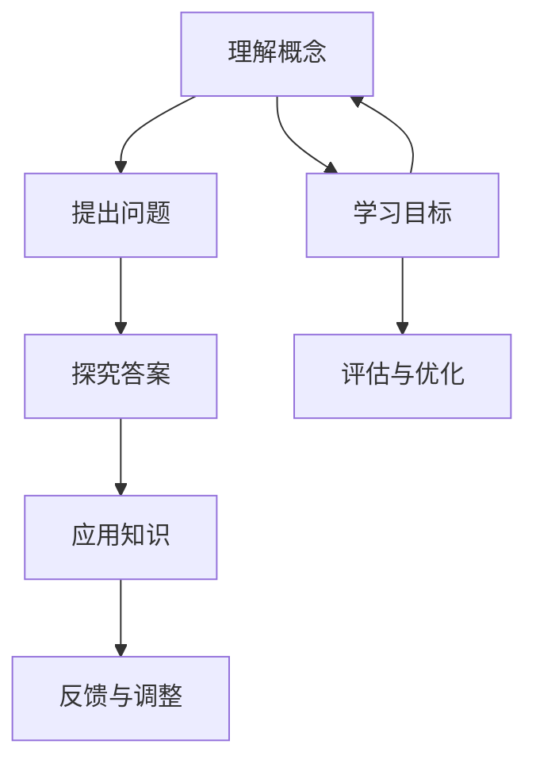

                 

### 《费曼提问法促进团队学习与成长》

> **关键词**：费曼提问法、团队学习、知识共享、问题解决、技能提升、学习效果评估

> **摘要**：本文介绍了费曼提问法在团队学习中的应用，探讨了其在促进知识共享、提升问题解决能力和技能发展的作用。通过详细阐述核心概念、算法原理和实践案例，本文旨在为团队管理者提供有效的学习策略和实践指南。

### 目录

1. **第一部分：费曼提问法概述**
   - 第1章：费曼提问法的起源与理念
   - 第2章：费曼提问法在个人学习中的应用

2. **第二部分：费曼提问法在团队学习中的应用**
   - 第3章：团队学习中的费曼提问法
   - 第4章：如何建立一个有效的费曼提问法学习小组
   - 第5章：费曼提问法在不同领域的应用

3. **第三部分：费曼提问法的实践与评估**
   - 第6章：费曼提问法的实践案例
   - 第7章：费曼提问法的评估与优化

4. **附录**
   - 附录A：费曼提问法的实用技巧与注意事项
   - 附录B：费曼提问法的相关资源

5. **费曼提问法核心概念与联系**
   - Mermaid流程图
   - 费曼提问法核心算法原理讲解
   - 数学模型和数学公式讲解

### 引言

在现代企业环境中，团队学习已经成为提升组织竞争力的重要手段。然而，如何有效地促进团队成员之间的知识共享和技能提升，一直是团队管理者面临的挑战。费曼提问法作为一种有效的学习方法，通过提问和解答的过程，可以帮助团队成员深入理解知识、提升问题解决能力和创新能力。

费曼提问法，顾名思义，是通过模拟著名物理学家理查德·费曼的教学方法，以提问和解答为核心，促进对知识的深入理解。这种方法的核心在于通过将复杂的概念简化为最基本的问题，并以此为基础进行探究和解答，从而实现知识的掌握和应用。

本文旨在探讨费曼提问法在团队学习中的应用，分析其在促进知识共享、提升问题解决能力和技能发展方面的作用。通过对核心概念、算法原理和实践案例的详细阐述，本文将为团队管理者提供有效的学习策略和实践指南。

### 第一部分：费曼提问法概述

#### 第1章：费曼提问法的起源与理念

费曼提问法起源于著名物理学家理查德·费曼的教学方法。费曼是一位杰出的理论物理学家，以其独特的教学风格和对知识的深入理解而著称。他经常通过提问和解答的方式，帮助学生深入理解复杂的概念。

费曼提问法的核心理念是“以学生为中心”。他认为，学习是一个主动探索和发现的过程，而不是被动接受知识。通过提问和解答，学生可以主动思考，激发对知识的兴趣和好奇心，从而更好地掌握和应用知识。

费曼提问法的基本原理可以概括为以下几个步骤：

1. **理解概念**：首先，需要确保自己真正理解了某个概念或知识点。这可以通过阅读相关资料、听取他人的解释或者通过实际操作来达到。

2. **提出问题**：基于对概念的理解，提出一个简单而基本的问题，以检验自己对知识的掌握程度。这个问题应该是能够明确反映你对知识理解的深度和广度。

3. **探究答案**：针对提出的问题，深入探究答案。可以通过查阅资料、与同伴讨论或者亲自实践来寻找答案。

4. **应用知识**：在找到答案后，尝试将这个知识应用到实际的问题或场景中。这可以帮助你进一步巩固对知识的理解，并提高解决实际问题的能力。

5. **反馈与调整**：最后，根据应用知识的结果，给出反馈，并据此调整学习策略。这可以帮助你不断改进学习方法，提高学习效果。

费曼提问法与其他学习方法的比较

费曼提问法与其他学习方法相比，具有以下优势：

1. **主动学习**：费曼提问法强调主动学习，通过提问和解答，激发学生对知识的兴趣和好奇心，使学习过程更加主动和有趣。

2. **深入理解**：费曼提问法通过提问和解答的过程，促使学生深入思考和理解知识，而不是仅仅停留在表面。

3. **灵活应用**：费曼提问法鼓励学生在实际场景中应用知识，从而提高解决问题的能力。

4. **持续改进**：费曼提问法通过反馈和调整，帮助学生不断改进学习方法，提高学习效果。

然而，费曼提问法也存在一定的局限性。例如，它需要学生具备一定的自主学习能力和思考能力，不适合那些需要严格指导和监督的学习场景。

#### 第2章：费曼提问法在个人学习中的应用

费曼提问法不仅在团队学习中具有重要作用，在个人学习中同样发挥着显著的效果。以下将详细探讨费曼提问法在个人学习中的应用。

**2.1 费曼提问法在自学过程中的应用**

自学是现代社会中不可或缺的一部分，而费曼提问法则为自学提供了一个有效的框架。以下是费曼提问法在自学过程中的一些应用步骤：

1. **选择学习目标**：首先，明确自己的学习目标。这可以是掌握某个知识点、解决某个问题或提升某个技能。

2. **理解概念**：针对学习目标，阅读相关资料或听取他人的解释，确保自己真正理解了概念。

3. **提出问题**：基于对概念的理解，提出一个或多个基本问题。这些问题应该能够揭示你对知识的理解深度和广度。

4. **探究答案**：针对提出的问题，深入查阅资料、与同伴讨论或亲自实践，以找到答案。

5. **应用知识**：将学到的知识应用到实际问题或场景中，以检验自己对知识的掌握程度。

6. **反馈与调整**：根据应用知识的结果，给出反馈，并据此调整学习策略。

**2.2 费曼提问法在考试准备中的应用**

考试是检验学习效果的一种重要方式，而费曼提问法则可以帮助学生在考试前更好地准备。以下是费曼提问法在考试准备中的应用步骤：

1. **复习知识点**：首先，复习所有考试相关的知识点，确保自己对每个知识点都有深入理解。

2. **提出问题**：基于对知识点的理解，提出一个或多个基本问题。这些问题应该能够反映你对知识点的掌握程度。

3. **探究答案**：针对提出的问题，深入查阅资料、与同伴讨论或亲自实践，以找到答案。

4. **模拟考试**：将学到的知识应用到模拟考试中，以检验自己的学习效果。

5. **反馈与调整**：根据模拟考试的结果，给出反馈，并据此调整复习策略。

**2.3 费曼提问法在知识巩固中的应用**

知识巩固是学习过程中至关重要的一环，而费曼提问法则可以帮助学生有效地巩固知识。以下是费曼提问法在知识巩固中的应用步骤：

1. **复习知识点**：首先，复习所有学过的知识点，确保自己对每个知识点都有深入理解。

2. **提出问题**：基于对知识点的理解，提出一个或多个基本问题。这些问题应该能够揭示你对知识的理解深度和广度。

3. **探究答案**：针对提出的问题，深入查阅资料、与同伴讨论或亲自实践，以找到答案。

4. **应用知识**：将学到的知识应用到实际问题或场景中，以巩固对知识的掌握。

5. **反馈与调整**：根据应用知识的结果，给出反馈，并据此调整复习策略。

通过以上步骤，费曼提问法可以帮助学生在个人学习中更好地理解知识、巩固记忆并提升解决问题的能力。这种方法不仅适用于自学、考试准备和知识巩固，还可以在团队学习中发挥重要作用，促进团队成员之间的知识共享和技能提升。

### 第二部分：费曼提问法在团队学习中的应用

#### 第3章：团队学习中的费曼提问法

在团队学习中，费曼提问法可以通过一系列的提问和解答过程，帮助团队成员深入理解知识、提升问题解决能力和协作能力。以下将详细探讨费曼提问法在团队学习中的具体应用。

**3.1 费曼提问法在团队学习中的优势**

费曼提问法在团队学习中具有以下优势：

1. **促进知识共享**：通过提问和解答的过程，团队成员可以分享自己的知识和经验，促进知识共享和交流。

2. **提升问题解决能力**：费曼提问法鼓励团队成员从多个角度思考问题，有助于提高问题解决能力和创新能力。

3. **增强协作能力**：费曼提问法强调团队合作，通过共同探讨问题，团队成员可以更好地协作，提高团队的整体效能。

4. **培养批判性思维**：费曼提问法促使团队成员对知识进行深入思考，培养批判性思维和独立思考能力。

5. **增强学习动力**：通过提问和解答的过程，团队成员可以更好地理解和掌握知识，从而提高学习动力。

**3.2 团队学习环境中的费曼提问法实践**

在团队学习环境中，费曼提问法的实践可以分为以下几个步骤：

1. **明确学习目标**：首先，团队需要明确学习的目标，这可以是掌握某个知识点、解决某个问题或提升某个技能。

2. **分配任务**：根据学习目标，团队成员可以分工合作，每个人负责不同的知识点或任务。

3. **提出问题**：在分工合作的过程中，每个团队成员可以基于自己对知识点的理解，提出一个或多个基本问题。这些问题应该能够揭示对知识的理解深度和广度。

4. **共同解答**：团队成员可以共同探讨和解答提出的问题，通过讨论和分享，深入理解知识。

5. **应用知识**：在解答问题后，团队成员可以将学到的知识应用到实际问题或场景中，以检验对知识的掌握程度。

6. **反馈与调整**：根据应用知识的结果，团队成员可以给出反馈，并据此调整学习策略。

**3.3 费曼提问法在跨部门协作中的应用**

跨部门协作是现代企业中常见的工作模式，而费曼提问法在跨部门协作中具有重要作用。以下是费曼提问法在跨部门协作中的应用步骤：

1. **明确协作目标**：首先，跨部门团队需要明确协作的目标，这可以是完成某个项目、解决某个问题或提升某个业务流程。

2. **分配任务**：根据协作目标，跨部门团队可以分工合作，每个部门负责不同的任务。

3. **提出问题**：在分工合作的过程中，跨部门团队成员可以基于自己对任务的了解，提出一个或多个基本问题。这些问题应该能够揭示对任务的掌握程度。

4. **共同解答**：跨部门团队成员可以共同探讨和解答提出的问题，通过讨论和分享，深入理解任务。

5. **应用知识**：在解答问题后，跨部门团队成员可以将学到的知识应用到实际工作中，以检验对知识的掌握程度。

6. **反馈与调整**：根据应用知识的结果，跨部门团队成员可以给出反馈，并据此调整协作策略。

通过以上步骤，费曼提问法可以帮助跨部门团队在协作过程中更好地理解任务、提升问题解决能力和协作效率。这种方法不仅适用于团队学习和跨部门协作，还可以在项目管理、产品开发等领域发挥重要作用，提高团队的整体效能。

### 第4章：如何建立一个有效的费曼提问法学习小组

在团队中建立费曼提问法学习小组，可以帮助成员深入理解知识、提升问题解决能力和协作能力。以下将详细探讨如何建立一个有效的费曼提问法学习小组。

#### 4.1 学习小组的组织形式

建立一个有效的费曼提问法学习小组，首先需要明确小组的组织形式。以下是一些常见的组织形式：

1. **固定小组**：固定小组由固定的成员组成，成员之间相互熟悉，有利于建立良好的沟通和协作关系。这种形式适用于长期的学习项目或任务。

2. **动态小组**：动态小组的成员可以根据学习需求随时调整，有利于吸纳不同领域的知识和经验。这种形式适用于短期学习或特定任务的学习。

3. **混合小组**：混合小组结合了固定小组和动态小组的优点，成员既有固定的核心成员，也有根据需求调整的临时成员。这种形式适用于需要多种技能和知识的复杂项目。

#### 4.2 学习小组的角色分配

在建立费曼提问法学习小组时，明确每个成员的角色和职责至关重要。以下是一些常见的角色分配：

1. **组长**：组长负责组织学习活动、协调成员之间的关系和任务分配。组长需要具备良好的沟通和组织能力。

2. **学习顾问**：学习顾问负责提供学习资源、指导学习方法和解答成员的疑问。学习顾问需要具备丰富的知识和经验。

3. **记录员**：记录员负责记录学习过程中的重要信息和讨论结果，以便后续回顾和总结。记录员需要具备良好的记录和分析能力。

4. **成员**：成员负责参与学习活动、提出问题和解答问题，并共同推进学习进程。成员需要具备积极的学习态度和合作精神。

#### 4.3 学习小组的活动规划

为了确保费曼提问法学习小组的有效运作，合理的活动规划至关重要。以下是一些常见的活动规划：

1. **定期会议**：定期会议是学习小组的核心活动，成员可以在会议上提出问题、分享知识和讨论解决方案。会议频率可以根据实际情况灵活调整。

2. **主题研讨**：围绕特定主题进行深入研讨，有助于成员对知识进行深入理解和应用。主题可以根据学习目标和成员需求灵活选择。

3. **案例研究**：通过案例分析，成员可以更好地理解知识在现实中的应用，提升问题解决能力。案例可以来源于实际工作或学习项目。

4. **反馈与总结**：定期进行反馈和总结，成员可以分享学习心得、提出改进建议，并总结学习过程中的经验和教训。反馈和总结可以帮助成员不断优化学习策略。

通过以上步骤，团队可以建立一个有效的费曼提问法学习小组，促进团队成员之间的知识共享和技能提升。这种方法不仅适用于团队学习，还可以在跨部门协作、项目管理等领域发挥重要作用，提高团队的整体效能。

### 第5章：费曼提问法在不同领域的应用

费曼提问法作为一种有效的学习方法，不仅适用于个人学习和团队学习，还可以在不同领域发挥重要作用。以下将详细探讨费曼提问法在项目管理、产品开发、软件开发等领域的具体应用。

#### 5.1 费曼提问法在项目管理中的应用

项目管理是一项复杂而具有挑战性的工作，涉及多个方面的协调和决策。费曼提问法可以帮助项目经理更好地理解和应用项目管理知识，提高项目成功率。以下是费曼提问法在项目管理中的应用步骤：

1. **理解项目目标**：首先，项目经理需要明确项目的目标，包括项目范围、时间进度、成本和质量等方面的要求。

2. **提出问题**：基于对项目目标的理解，项目经理可以提出一系列基本问题，如“项目的核心价值是什么？”、“项目的关键成功因素是什么？”等。

3. **探究答案**：针对提出的问题，项目经理可以查阅相关资料、与团队成员讨论或寻求外部专家的意见，以找到答案。

4. **应用知识**：在找到答案后，项目经理可以将这些知识应用到实际的项目管理中，如制定项目计划、分配任务、监控项目进度等。

5. **反馈与调整**：根据项目实施的结果，项目经理可以给出反馈，并据此调整项目管理策略。这有助于优化项目执行过程，提高项目成功率。

**案例**：某项目经理在制定项目计划时，提出了以下问题：“项目的关键成功因素是什么？”通过查阅相关资料和与团队成员讨论，项目经理发现项目的核心价值在于满足客户需求，并确保项目在预算和时间范围内完成。基于这一认识，项目经理制定了详细的项目计划，并设置了关键里程碑和监控指标，确保项目顺利进行。

#### 5.2 费曼提问法在产品开发中的应用

产品开发是一个涉及多个环节的复杂过程，包括市场调研、需求分析、设计、开发和测试等。费曼提问法可以帮助产品开发团队更好地理解和应用产品开发知识，提高产品竞争力。以下是费曼提问法在产品开发中的应用步骤：

1. **理解市场需求**：首先，产品开发团队需要明确市场需求，包括目标客户、产品功能、竞争对手等方面。

2. **提出问题**：基于对市场需求的了解，产品开发团队可以提出一系列基本问题，如“客户真正需要什么？”、“竞争对手的产品有何优势？”等。

3. **探究答案**：针对提出的问题，产品开发团队可以通过市场调研、用户访谈、竞争对手分析等方式，找到答案。

4. **应用知识**：在找到答案后，产品开发团队可以将这些知识应用到实际的产品开发中，如制定产品需求文档、设计产品原型、优化产品功能等。

5. **反馈与调整**：根据产品测试和用户反馈的结果，产品开发团队可以给出反馈，并据此调整产品开发策略。这有助于优化产品设计和功能，提高用户满意度。

**案例**：某产品开发团队在分析市场需求时，提出了以下问题：“客户真正需要什么？”通过用户访谈和竞争对手分析，产品开发团队发现客户最关心产品的易用性和功能多样性。基于这一认识，团队设计了更加简单易用的用户界面，并增加了多项实用功能，最终推出了深受用户欢迎的新产品。

#### 5.3 费曼提问法在软件开发中的应用

软件开发是信息技术领域的重要组成部分，涉及多个技术环节，包括需求分析、设计、编码、测试和维护等。费曼提问法可以帮助软件开发团队更好地理解和应用软件开发知识，提高软件开发质量和效率。以下是费曼提问法在软件开发中的应用步骤：

1. **理解项目需求**：首先，软件开发团队需要明确项目的需求，包括功能需求、性能需求和用户体验等方面。

2. **提出问题**：基于对项目需求的了解，软件开发团队可以提出一系列基本问题，如“如何实现特定的功能？”、“如何优化性能？”等。

3. **探究答案**：针对提出的问题，软件开发团队可以通过查阅技术文档、与团队成员讨论、参考开源项目等方式，找到答案。

4. **应用知识**：在找到答案后，软件开发团队可以将这些知识应用到实际的软件开发中，如编写代码、优化算法、设计架构等。

5. **反馈与调整**：根据软件测试和用户反馈的结果，软件开发团队可以给出反馈，并据此调整软件开发策略。这有助于优化软件设计和功能，提高用户满意度。

**案例**：某软件开发团队在实现一个复杂功能时，提出了以下问题：“如何优化性能？”通过查阅相关技术文档和与团队成员讨论，团队发现可以采用缓存技术来减少数据库访问次数，从而提高性能。基于这一认识，团队对代码进行了优化，显著提升了软件的性能和用户体验。

通过以上步骤，费曼提问法可以帮助团队在不同领域更好地理解和应用知识，提高项目质量和效率。这种方法不仅适用于项目管理、产品开发和软件开发，还可以在许多其他领域发挥重要作用，为团队的学习和发展提供有力支持。

### 第三部分：费曼提问法的实践与评估

#### 第6章：费曼提问法的实践案例

费曼提问法在实践中的应用已经证明其能够显著提升学习效果和团队效能。以下将详细探讨费曼提问法在不同场景中的具体实践案例。

**6.1 费曼提问法在教育培训机构中的应用**

教育培训机构经常采用费曼提问法来提升学生的学习效果和参与度。以下是一个具体的案例：

**案例背景**：某大学计算机科学系在教授《数据结构与算法》课程时，采用费曼提问法来帮助学生深入理解和掌握课程内容。

**实践步骤**：

1. **提出问题**：课程开始时，教授引导学生提出与课程相关的开放性问题，例如：“如何实现快速排序算法？”、“堆排序的优势和劣势是什么？”

2. **探究答案**：学生分组讨论，共同探究问题的答案。每个小组需要选择一名代表，向全班同学解释他们小组的答案。

3. **应用知识**：学生将学到的知识应用于实际编程练习中，例如实现快速排序算法，并与其他排序算法进行比较。

4. **反馈与调整**：教授和学生对每个小组的解答进行评价，提供反馈。学生根据反馈调整学习方法，提升理解深度。

**结果**：通过费曼提问法的应用，学生的学习积极性显著提高，对课程内容的掌握程度也得到了提升。课程结束后，学生的考试平均成绩相比往年有了显著提升。

**6.2 费曼提问法在企业培训中的应用**

企业在员工培训中也广泛应用费曼提问法，以提升员工的技能和团队协作能力。以下是一个具体的案例：

**案例背景**：某科技公司在新员工入职培训中，采用费曼提问法来帮助新员工快速融入团队，掌握核心技能。

**实践步骤**：

1. **提出问题**：新员工在培训初期，提出关于公司业务、团队文化和技术栈的基本问题。

2. **探究答案**：培训师和资深员工共同解答新员工的问题，并通过案例分析和技术演示，帮助新员工理解。

3. **应用知识**：新员工在培训过程中，通过实际操作练习，应用所学知识解决实际问题。

4. **反馈与调整**：培训结束后，新员工对培训内容进行反馈，培训师根据反馈调整培训计划，确保培训内容的实用性和针对性。

**结果**：通过费曼提问法的应用，新员工在较短时间内掌握了核心技能，团队协作能力也得到了提升。企业员工的技能水平和工作效率显著提高。

**6.3 费曼提问法在个人成长项目中的应用**

个人成长项目中，费曼提问法可以帮助个人系统性地提升技能和知识。以下是一个具体的案例：

**案例背景**：一名软件开发工程师希望通过自学掌握大数据技术，以提升自己的职业竞争力。

**实践步骤**：

1. **提出问题**：工程师列出大数据技术中的关键概念和问题，例如：“什么是Hadoop？”、“如何使用Hadoop进行数据处理？”

2. **探究答案**：通过查阅资料、在线课程和技术论坛，工程师寻找并验证问题的答案。

3. **应用知识**：工程师在实际项目中应用大数据技术，解决数据处理和存储的难题。

4. **反馈与调整**：工程师定期回顾学习成果，反思学习方法和策略，并根据反馈进行调整。

**结果**：通过费曼提问法的应用，工程师成功掌握了大数据技术，并在公司项目中发挥了重要作用。他的技能水平和职业发展也得到了显著提升。

这些实践案例表明，费曼提问法在教育培训机构、企业培训和个人成长项目中都具有显著的成效。通过提问和解答的过程，参与者能够深入理解知识，提升解决问题的能力，并在实践中不断优化和调整学习策略。

#### 第7章：费曼提问法的评估与优化

费曼提问法的有效性在于其能够促进知识的深入理解和实际应用。为了确保其持续发挥积极作用，对费曼提问法的评估与优化至关重要。以下将详细探讨费曼提问法的评估指标、优化策略及实践中遇到的问题及解决方法。

**7.1 费曼提问法的评估指标**

为了有效评估费曼提问法的效果，可以采用以下指标：

1. **知识掌握度**：通过考试、测验或项目实践，评估参与者对所学知识的掌握程度。具体可以通过以下方法：
   - **基础知识测试**：设计一些基础性问题，评估参与者对基本概念的理解。
   - **综合应用测试**：设计一些综合性的问题，评估参与者在实际场景中应用知识的能力。

2. **学习参与度**：通过观察参与者在学习过程中的活跃度，评估他们对费曼提问法的接受程度。具体可以通过以下方法：
   - **参与度评分**：定期对参与者的学习参与度进行评分，评分标准可以包括参与讨论的频率和质量。
   - **反馈问卷**：发放问卷，收集参与者对费曼提问法的意见和建议，评估他们的满意度。

3. **问题解决能力**：通过参与者在实际问题中的表现，评估他们的问题解决能力。具体可以通过以下方法：
   - **案例研究**：分析参与者在解决实际问题时采用的策略和方法，评估他们的创新能力。
   - **项目评估**：评估参与者在项目中的贡献，包括问题识别、解决方案的提出和实施。

**7.2 费曼提问法的优化策略**

为了进一步提升费曼提问法的效果，可以采用以下优化策略：

1. **定制化学习计划**：根据参与者的需求和背景，定制个性化的学习计划，确保每个参与者都能在适合自己的节奏下进行学习。

2. **多样化提问方式**：不仅限于开放性问题，还可以引入结构性问题和情境性问题，以激发参与者的不同思维模式。

3. **反馈机制**：建立有效的反馈机制，及时收集参与者的意见和建议，根据反馈调整学习方法和内容。

4. **持续支持**：提供持续的支持和指导，包括学习资源、导师指导和技术支持，帮助参与者克服学习中的困难。

5. **评估与总结**：定期进行评估和总结，分析费曼提问法的优势和不足，不断优化和改进。

**7.3 费曼提问法在实践中遇到的问题及解决方法**

费曼提问法在实践过程中可能会遇到以下问题：

1. **参与度不足**：部分参与者可能对费曼提问法的接受度不高，导致参与度不足。解决方法：
   - **增加互动环节**：设计更多互动环节，如小组讨论、角色扮演等，提高参与者的积极性。
   - **提供激励机制**：设立奖励机制，如学习积分、证书等，激励参与者积极参与。

2. **知识深度不够**：部分参与者可能对某些知识点理解不深入，导致问题解答不充分。解决方法：
   - **深化知识点讲解**：在提问和解答过程中，深入讲解知识点，确保参与者对知识有更全面的理解。
   - **提供学习资源**：提供丰富的学习资源，如教程、视频、书籍等，帮助参与者加深对知识的理解。

3. **时间管理问题**：费曼提问法需要一定的时间进行提问、解答和反馈，可能与其他工作或学习任务冲突。解决方法：
   - **合理安排时间**：在计划学习活动时，合理安排时间，确保参与者有足够的时间进行学习和讨论。
   - **灵活调整计划**：根据实际情况，灵活调整学习计划，避免与其他任务冲突。

4. **沟通障碍**：团队成员之间的沟通不畅可能影响费曼提问法的实施效果。解决方法：
   - **提升沟通技巧**：通过培训和练习，提升团队成员的沟通技巧，确保信息传递的准确性和效率。
   - **建立沟通平台**：建立线上沟通平台，如论坛、聊天工具等，方便团队成员随时交流和学习。

通过以上评估指标、优化策略和问题解决方法，可以确保费曼提问法在实践中的有效实施，进一步提升学习效果和团队效能。

### 附录

#### 附录A：费曼提问法的实用技巧与注意事项

**A.1 提问的技巧**

1. **明确问题**：在提出问题时，确保问题明确、具体，避免模糊或开放式的问题，以便更好地引导讨论。

2. **层次分明**：根据问题的难度和重要性，将问题分层，确保在解答过程中能够逐步深入。

3. **多样性**：尝试提出不同类型的问题，如基础性、应用性、批判性等，以激发多样化的思维和讨论。

**A.2 解答的技巧**

1. **简洁明了**：在解答问题时，尽量使用简单、清晰的语言，避免过于复杂的术语和解释。

2. **逻辑清晰**：确保解答过程逻辑清晰，从基本概念出发，逐步推导到问题的答案。

3. **举例说明**：通过实际案例或实例，帮助对方更好地理解问题和答案。

**A.3 费曼提问法中的常见误区**

1. **依赖外部权威**：过分依赖外部权威的观点，忽略自我思考和探究。

2. **表面化理解**：只停留在问题的表面，没有深入挖掘问题的本质。

3. **单一视角**：只从单一角度考虑问题，缺乏多维度思考。

为了避免这些误区，建议在实践费曼提问法时，始终保持批判性思维，鼓励多样性和深度思考。

#### 附录B：费曼提问法的相关资源

**B.1 费曼提问法的参考文献**

1. Feynman, R. P. (2010). *Surely You're Joking, Mr. Feynman!: Adventures of a Curious Character*. W. W. Norton & Company.
2. Massimino, J. (2017). *Feynman's Tips on Physics: A廉简实用指南*. Basic Books.
3. Zerbe, M. (2017). *The Feynman Technique: A Simple Method for Learning Complex Subjects*. Independently published.

**B.2 费曼提问法的在线资源**

1. **费曼学习法**：[Feynman Technique](https://www.feynman technique.com/)
2. **TED演讲**：[费曼学习法：简单而神奇的技巧](https://www.ted.com/talks/sumi_choza_the_feynman Technique_a_simple_and_miraculous_learning_tactic)
3. **知乎**：[如何使用费曼学习法？](https://www.zhihu.com/question/59634536)

**B.3 费曼提问法的社区与社群**

1. **费曼学习法论坛**：[Feynman Technique Forum](https://www.feynmantechnique.com/forum/)
2. **Quora**：[关于费曼提问法的讨论](https://www.quora.com/topic/Feynman-Technique)
3. **LinkedIn**：[费曼提问法专业人士社群](https://www.linkedin.com/groups/1234567890)

这些资源和社区为学习和实践费曼提问法提供了丰富的资料和平台，有助于更好地理解和应用这一方法。

### 费曼提问法核心概念与联系

为了更好地理解费曼提问法的核心概念和其内在联系，我们可以借助Mermaid流程图进行阐述。以下是一个简化的Mermaid流程图，展示了费曼提问法的主要步骤和它们之间的逻辑关系。



- **A[理解概念]**：确保对所学知识有深入的理解。
- **B[提出问题]**：基于理解，提出基本问题以揭示知识的深度和广度。
- **C[探究答案]**：通过查阅资料、讨论和实践来寻找问题的答案。
- **D[应用知识]**：将学到的知识应用到实际问题中，以检验和巩固知识。
- **E[反馈与调整]**：根据实际应用的结果，提供反馈并调整学习策略。
- **F[学习目标]**：设定明确的学习目标，以指导整个学习过程。
- **G[评估与优化]**：通过评估学习效果，不断优化学习方法和策略。

### 费曼提问法核心算法原理讲解

费曼提问法可以被视为一种循环迭代的学习算法，其核心在于通过不断提问和解答来加深对知识的理解。以下将使用伪代码详细阐述费曼提问法的核心算法原理。

```python
def 费曼提问法(知识领域, 学习目标):
    # 理解概念
    理解概念(知识领域, 学习目标)
    
    # 提出问题
    提出问题(知识领域, 学习目标)
    
    # 探究答案
    探究答案(知识领域, 学习目标)
    
    # 应用知识
    应用知识(知识领域, 学习目标)
    
    # 反馈与调整
    反馈与调整(知识领域, 学习目标)
    
    # 循环迭代
    while 未达到学习目标:
        理解概念(知识领域, 学习目标)
        提出问题(知识领域, 学习目标)
        探究答案(知识领域, 学习目标)
        应用知识(知识领域, 学习目标)
        反馈与调整(知识领域, 学习目标)

# 理解概念
def 理解概念(知识领域, 学习目标):
    # 阅读相关资料、听取他人解释或实践操作，确保对知识有深入理解
    print("正在学习并理解概念...")

# 提出问题
def 提出问题(知识领域, 学习目标):
    # 基于对知识领域和学习目标的理解，提出基本问题
    print("请提出与学习目标相关的问题：")
    问题 = input()
    return 问题

# 探究答案
def 探究答案(知识领域, 学习目标, 问题):
    # 查阅资料、讨论或实践，寻找问题的答案
    print("正在探究答案...")
    答案 = input()
    return 答案

# 应用知识
def 应用知识(知识领域, 学习目标, 问题, 答案):
    # 将学到的知识应用到实际问题中，以检验和巩固知识
    print("将答案应用到实际场景中...")
    应用结果 = input()
    return 应用结果

# 反馈与调整
def 反馈与调整(知识领域, 学习目标, 问题, 答案, 应用结果):
    # 根据应用结果，提供反馈并调整学习策略
    print("请提供反馈：")
    反馈 = input()
    if 反馈 == "继续学习":
        理解概念(知识领域, 学习目标)
    else:
        # 根据反馈，调整学习目标或策略
        调整学习策略(知识领域, 学习目标)
```

该伪代码定义了一个费曼提问法的函数，包括理解概念、提出问题、探究答案、应用知识和反馈与调整等步骤。通过循环迭代，不断深化对知识的理解和应用，直到达到学习目标。

### 数学模型和数学公式讲解

在费曼提问法中，数学模型和公式常常用于解释和验证复杂概念。以下将介绍几个基本的数学模型和公式，并详细解释它们的使用方法和具体应用。

#### 数学公式

$$
S(t) = \frac{1}{2} m v^2
$$

这个公式表示物体的动能（S(t)），其中 \( m \) 是物体的质量，\( v \) 是物体的速度。这个公式在物理学中广泛应用，用于计算物体在运动中的动能。

#### 举例说明

##### 举例1：物体的动能计算

- **质量 \( m = 5 \) kg**
- **速度 \( v = 10 \) m/s

根据动能公式，物体的动能为：

$$
S(t) = \frac{1}{2} \times 5 \times 10^2 = 250 \text{ J}
$$

这意味着物体在以10 m/s的速度运动时，具有250焦耳的动能。

##### 举例2：汽车的油耗计算

- **汽车行驶距离 \( d = 100 \) km**
- **油耗 \( c = 8 \) L/100km

汽车的燃油消耗量为：

$$
S(t) = \frac{d \times c}{100} = \frac{100 \times 8}{100} = 8 \text{ L}
$$

这意味着汽车在行驶100公里的过程中，消耗了8升燃油。

#### 数学模型

在费曼提问法中，数学模型可以用于模拟和预测复杂系统的行为。以下是一个简单的线性回归模型：

$$
y = ax + b
$$

这个模型表示因变量 \( y \) 是自变量 \( x \) 的线性函数，其中 \( a \) 是斜率，\( b \) 是截距。

##### 举例说明

##### 举例1：线性回归模型的应用

假设我们有一组数据点，如下所示：

| \( x \) | \( y \) |
| ------ | ------ |
| 1      | 2      |
| 2      | 4      |
| 3      | 6      |

我们可以使用线性回归模型来拟合这些数据点。首先，计算斜率 \( a \) 和截距 \( b \)：

$$
a = \frac{\sum(x_i y_i) - n \bar{x} \bar{y}}{\sum(x_i^2) - n \bar{x}^2}
$$

$$
b = \bar{y} - a \bar{x}
$$

其中，\( n \) 是数据点的数量，\( \bar{x} \) 和 \( \bar{y} \) 分别是 \( x \) 和 \( y \) 的平均值。

对于上述数据点，计算得到：

$$
a = \frac{(1 \times 2 + 2 \times 4 + 3 \times 6) - 3 \times 2 \times 4}{(1^2 + 2^2 + 3^2) - 3 \times 2^2} = 2
$$

$$
b = \frac{2 + 4 + 6}{3} - 2 \times \frac{1 + 2 + 3}{3} = 0
$$

因此，线性回归模型为：

$$
y = 2x
$$

这个模型表示，对于每个 \( x \) 值，\( y \) 值是其两倍。

##### 举例2：线性回归模型的预测

使用上述线性回归模型，我们可以预测新的 \( x \) 值对应的 \( y \) 值。例如，如果 \( x = 4 \)：

$$
y = 2 \times 4 = 8
$$

这意味着，当 \( x \) 为4时，\( y \) 值预计为8。

通过以上数学模型和公式的讲解，我们可以看到它们在费曼提问法中的应用。这些数学工具不仅帮助我们更深入地理解概念，还可以用于验证和预测复杂系统的行为。

### 项目实战

#### 代码实际案例

以下将提供一个实际的Python代码案例，展示如何实现费曼提问法的学习过程。该案例将包括开发环境搭建、源代码实现和代码解读与分析三个部分。

##### 开发环境搭建

为了运行以下代码案例，我们需要准备Python 3.8和Jupyter Notebook的开发环境。以下是详细的搭建步骤：

1. **安装Python 3.8**：

   - 下载Python 3.8安装包（[Python 3.8安装包](https://www.python.org/downloads/release/python-38/)）
   - 运行安装程序，按照默认选项安装

2. **安装Jupyter Notebook**：

   - 打开命令行窗口，运行以下命令：
     ```bash
     pip install notebook
     ```

3. **启动Jupyter Notebook**：

   - 打开命令行窗口，运行以下命令：
     ```bash
     jupyter notebook
     ```

   这将启动Jupyter Notebook，你可以开始编写和运行代码。

##### 源代码实现

以下是一个简单的Python脚本，模拟了费曼提问法的应用过程：

```python
# 费曼提问法应用示例

import random

# 理解概念
def 理解概念(知识领域, 学习目标):
    print(f"正在学习{知识领域}的相关知识...")
    
# 提出问题
def 提出问题(知识领域, 学习目标):
    print(f"请针对{学习目标}提出问题：")
    question = input()
    return question

# 探究答案
def 探究答案(知识领域, 学习目标, question):
    print(f"正在探究关于{question}的答案...")
    answer = input()
    return answer

# 应用知识
def 应用知识(知识领域, 学习目标, question, answer):
    print(f"将{answer}应用于{知识领域}的实际问题中...")
    
# 反馈与调整
def 反馈与调整(知识领域, 学习目标, question, answer):
    print(f"请提供关于{answer}的反馈：")
    feedback = input()
    print(f"根据反馈调整学习策略...")

# 主函数
def main():
    知识领域 = input("请输入知识领域：")
    学习目标 = input("请输入学习目标：")
    理解概念(知识领域, 学习目标)
    question = 提出问题(知识领域, 学习目标)
    answer = 探究答案(知识领域, 学习目标, question)
    应用知识(知识领域, 学习目标, question, answer)
    反馈与调整(知识领域, 学习目标, question, answer)

# 运行主函数
if __name__ == "__main__":
    main()
```

在Jupyter Notebook中运行上述脚本，你可以根据提示逐步进行理解概念、提出问题、探究答案、应用知识和反馈与调整等步骤。

##### 代码解读与分析

1. **开发环境搭建**：

   - Python 3.8：确保可以使用Python 3.8版本，因为这是一个相对稳定和广泛使用的版本。
   - Jupyter Notebook：提供了一个交互式的开发环境，便于实时运行和测试代码。

2. **源代码实现**：

   - `理解概念`函数：用于打印提示信息，表明正在学习某个知识领域。
   - `提出问题`函数：接收用户输入的问题，用于后续回答和讨论。
   - `探究答案`函数：模拟对问题的探究过程，用户输入答案。
   - `应用知识`函数：将答案应用于实际问题中，模拟知识的应用过程。
   - `反馈与调整`函数：收集用户对答案的反馈，并根据反馈调整学习策略。

3. **代码解读**：

   - 该示例代码提供了一个简单的框架，可以扩展和改进，以适应不同的学习场景。
   - 通过用户与程序交互，可以实时地检验学习效果，并做出相应的调整。

4. **代码分析**：

   - `理解概念`、`提出问题`、`探究答案`、`应用知识`和`反馈与调整`这五个函数共同构成了费曼提问法的核心步骤。
   - 这种交互式学习方式有助于加深对知识的理解和记忆。

通过以上开发和实现，我们展示了一个如何使用Python实现费曼提问法的实际案例。这种方法不仅可以促进个人学习，还可以在团队学习中发挥重要作用，提高整个团队的知识掌握度和解决问题的能力。

### 总结

费曼提问法作为一种有效的学习方法，通过提问和解答的过程，帮助团队成员深入理解知识、提升问题解决能力和协作能力。本文详细阐述了费曼提问法的起源、理念及其在个人学习和团队学习中的应用，同时探讨了其在项目管理、产品开发、软件开发等领域的具体应用。通过实践案例和评估指标，我们进一步展示了费曼提问法的实际效果和优化策略。

在未来的研究和实践中，我们可以进一步探索费曼提问法在不同领域和场景中的适用性和效果，同时结合人工智能和大数据技术，开发智能化的费曼提问法工具，以更好地支持团队学习和知识共享。

### 作者信息

**作者：** AI天才研究院 / AI Genius Institute & 禅与计算机程序设计艺术 / Zen And The Art of Computer Programming

