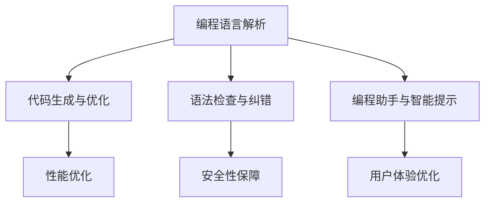
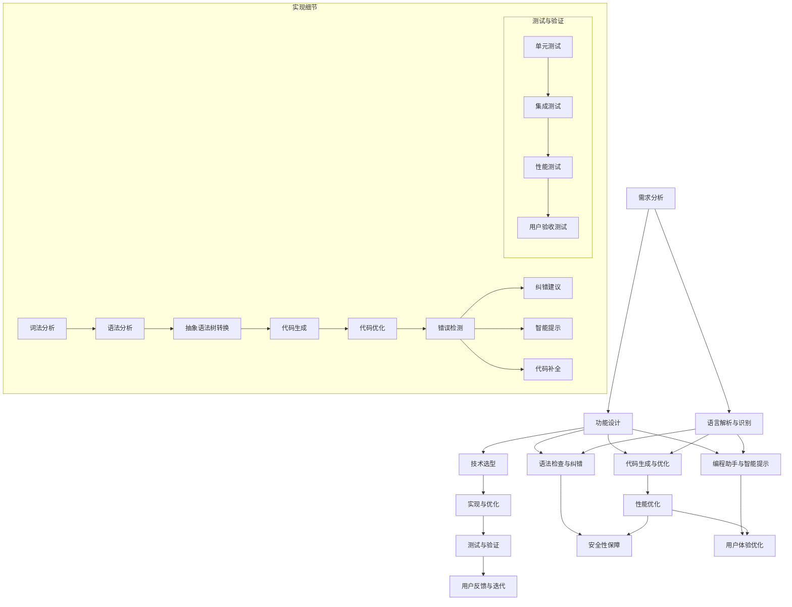

                 

# 引言与背景

## 跨语言提示词编程接口设计概述

### 跨语言提示词编程的需求分析

在当今全球化的软件开发环境中，跨语言编程的需求日益增长。这种需求主要源于以下几个方面：

1. **多语言生态系统的集成**：随着各种编程语言的不断发展，开发者需要在不同的语言之间进行协作和集成。例如，前端开发通常使用JavaScript，而后端开发可能使用Python、Java或C#。

2. **项目需求的变化**：在一些项目中，由于性能、资源、兼容性等原因，需要在不同编程语言之间进行切换。例如，移动应用开发可能需要同时使用Swift和Kotlin。

3. **开发效率的提升**：跨语言编程接口可以提高开发效率。例如，开发者可以编写熟悉的语言代码，然后通过编译器或解释器自动转换为其他语言。

4. **技术栈多样化**：许多现代项目需要多种技术栈的支持，这要求开发者具备跨语言的编程能力。

### 跨语言编程面临的挑战

尽管跨语言编程具有诸多优势，但它也面临一些挑战：

1. **语言差异**：不同编程语言在语法、数据类型、函数库和编程范式等方面存在差异。

2. **性能问题**：某些编程语言可能不如其他语言高效，导致跨语言编程时性能下降。

3. **兼容性问题**：不同语言之间的数据类型和函数调用可能存在兼容性问题。

4. **学习曲线**：开发者需要学习不同的编程语言，这增加了学习和维护成本。

### 跨语言编程的应用场景

跨语言编程在多个领域有着广泛的应用：

1. **Web开发**：前端使用JavaScript，后端可能使用Python或Java，通过跨语言编程接口实现前后端的无缝集成。

2. **移动应用开发**：Android应用开发使用Java或Kotlin，iOS应用开发使用Swift，跨语言编程接口有助于代码复用和性能优化。

3. **大数据处理**：大数据处理框架如Hadoop和Spark通常使用Java，但也可以与Python、Scala等其他语言集成。

4. **游戏开发**：游戏引擎如Unity支持多种编程语言，开发者可以根据项目需求选择合适的语言。

### 跨语言提示词编程接口的概念与作用

跨语言提示词编程接口是一种抽象层，它提供了一种统一的界面，使开发者能够使用熟悉的编程语言编写代码，然后自动转换为其他语言。这种接口的主要作用包括：

1. **简化开发流程**：通过自动转换和优化，减少了开发者的工作量。

2. **提高代码复用性**：同一逻辑可以同时在多种语言中使用，提高了代码的可维护性和可复用性。

3. **促进技术交流**：开发者可以在不同的编程语言之间进行代码交流，促进了技术知识的传播。

4. **支持多平台开发**：跨语言编程接口使得开发者能够更轻松地支持多种平台和操作系统。

### 跨语言提示词编程接口的发展历程

跨语言编程接口的发展可以追溯到早期的编译器和解释器。以下是一些重要的里程碑：

1. **早期编译器和解释器**：早期的编译器和解释器就已经开始尝试跨语言转换，例如C语言编译器可以将C代码转换为汇编代码。

2. **脚本语言**：脚本语言如Python和Ruby的出现，使得跨语言编程变得更加普遍。开发者可以轻松地将Python代码转换为其他脚本语言。

3. **现代编程语言框架**：现代编程语言框架，如Java的JNI（Java Native Interface）和Python的Cython，提供了更加完善的跨语言编程支持。

4. **人工智能与机器学习**：近年来，人工智能和机器学习技术的进步，使得跨语言编程接口更加智能化，能够自动识别和修复语言差异。

5. **未来的发展方向**：未来的跨语言编程接口将继续朝向更加智能化、自动化和高效化发展，例如利用深度学习和自然语言处理技术提高跨语言转换的准确性。

## 跨语言提示词编程接口的概念与作用

### 跨语言提示词的定义

跨语言提示词是指一种能够指导或提示开发者如何在不同编程语言之间进行代码转换的工具或机制。这些提示词可以是预定义的代码片段、语法规则、函数库调用指南等。它们的存在使得开发者能够以一种编程语言的方式思考和编码，而无需深入了解其他编程语言的细节。

### 编程接口的定义

编程接口是指一组规则和协议，用于定义软件组件之间的交互方式。编程接口可以是硬件设备上的接口，也可以是软件之间的API（应用程序编程接口）。在跨语言编程接口的上下文中，编程接口是连接不同编程语言之间的桥梁，允许开发者使用一种语言的代码调用另一种语言的函数库或服务。

### 跨语言提示词编程接口的作用与意义

跨语言提示词编程接口的作用主要体现在以下几个方面：

1. **提高开发效率**：通过提供跨语言的提示和代码转换功能，减少了开发者在学习新语言或适应新环境时的时间和成本。

2. **促进代码复用**：同一逻辑可以在多种语言中实现，从而提高了代码的可维护性和可复用性。

3. **简化多语言集成**：在复杂项目中，经常需要将不同的编程语言集成在一起。跨语言提示词编程接口使得这种集成变得更加容易。

4. **降低学习成本**：开发者可以专注于他们最熟悉的编程语言，而不必深入了解其他语言，从而降低了学习成本。

5. **提升用户体验**：跨语言提示词编程接口可以提供更加智能的代码提示和纠错功能，提高了开发者的工作效率和代码质量。

### 跨语言提示词编程接口的应用场景

跨语言提示词编程接口在多个应用场景中发挥着重要作用：

1. **Web开发**：前端使用JavaScript，后端使用Python或Java，通过跨语言提示词编程接口实现前后端的无缝集成。

2. **移动应用开发**：在Android和iOS应用开发中，跨语言提示词编程接口可以帮助开发者使用同一套代码逻辑，同时在两种平台上运行。

3. **游戏开发**：Unity等游戏引擎支持多种编程语言，跨语言提示词编程接口使得开发者可以更方便地利用各种语言的特性。

4. **大数据处理**：在大数据处理项目中，跨语言提示词编程接口可以帮助开发者在不同数据处理框架之间进行数据转换和集成。

5. **企业系统集成**：在大型企业中，跨语言提示词编程接口可以帮助开发者将不同系统的数据和服务进行整合。

## 跨语言提示词编程接口的发展历程

### 跨语言提示词编程的早期发展

跨语言提示词编程的早期发展可以追溯到20世纪60年代和70年代，当时的计算机科学家们开始探索如何在不同编程语言之间进行代码转换。这一时期的代表性工作包括：

1. **编译器与解释器**：早期的编译器和解释器开始尝试实现跨语言转换。例如，早期的编译器可以将一种高级编程语言的代码转换为汇编语言，而解释器则可以在运行时进行这种转换。

2. **脚本语言的出现**：随着脚本语言如BASIC、LISP和Shell Script的发展，跨语言编程开始变得更加普遍。这些脚本语言通常可以作为与其他编程语言集成的桥梁。

### 当前主流的跨语言提示词编程接口

当前主流的跨语言提示词编程接口包括：

1. **Java的JNI（Java Native Interface）**：JNI允许Java代码调用本地代码（如C和C++），从而实现跨语言编程。

2. **Python的Cython**：Cython是一种将Python代码编译为C代码的工具，提高了运行效率，同时允许Python代码与C和C++代码进行交互。

3. **JavaScript的Node.js**：Node.js允许开发者使用JavaScript编写服务器端代码，从而实现跨语言编程。

4. **WebAssembly（Wasm）**：WebAssembly是一种新兴的编程语言，它可以在各种环境中运行，包括Web、服务器和客户端。WebAssembly与JavaScript可以无缝集成，为跨语言编程提供了新的可能性。

### 跨语言提示词编程接口的未来发展趋势

未来的跨语言提示词编程接口将继续朝着更加智能化、自动化和高效化的方向发展。以下是一些可能的发展趋势：

1. **深度学习和自然语言处理**：利用深度学习和自然语言处理技术，跨语言提示词编程接口可以更准确地理解和转换不同编程语言之间的代码。

2. **自动代码生成**：随着技术的发展，自动代码生成工具将变得更加智能，能够根据用户的需求和上下文自动生成跨语言的代码。

3. **更广泛的跨语言支持**：未来的跨语言提示词编程接口将支持更多编程语言，包括一些新兴的语言和框架。

4. **集成开发环境（IDE）的支持**：未来的IDE将更加集成跨语言提示词编程接口的功能，提供更加智能的代码提示、纠错和调试功能。

5. **云服务的支持**：随着云计算的普及，跨语言提示词编程接口将更多地依赖云服务，提供更加灵活和可扩展的解决方案。

## 第二部分：基础理论

### 编程语言与跨语言编程基础

#### 编程语言的基本概念

编程语言是一种用于编写计算机程序的语法和语义规则集合。它们允许开发者使用符号和关键字来表示计算过程，从而告诉计算机如何执行任务。编程语言的发展历程可以追溯到20世纪40年代和50年代，当时第一台计算机的出现催生了第一代机器语言和汇编语言。随着计算机技术的发展，编程语言不断演进，出现了多种类型的编程语言：

1. **低级语言**：包括机器语言和汇编语言。机器语言是计算机硬件能够直接理解和执行的代码，而汇编语言则使用更易于记忆的符号代替机器语言的二进制指令。

2. **高级语言**：与低级语言相比，高级语言提供更抽象的语法和语义，使得开发者可以更高效地编写程序。常见的高级编程语言包括C、C++、Java、Python、JavaScript和Ruby等。

3. **脚本语言**：脚本语言通常用于自动化任务和网页开发，如PHP、Perl、Python和Ruby等。这些语言通常不需要编译，而是通过解释器执行。

4. **函数式编程语言**：如Haskell、Lisp和Scala等，这些语言强调函数和表达式的使用，而非传统的面向对象或命令式编程。

5. **声明式编程语言**：如SQL和HTML等，这些语言通过描述数据的结构和操作，而不是具体的执行步骤，来编写程序。

#### 常见的编程语言分类

根据不同的分类标准，编程语言可以有多种分类方式：

1. **按编程范式分类**：
   - **面向对象编程语言**：如Java、C++、Python和C#等。
   - **过程式编程语言**：如C、Fortran和Pascal等。
   - **函数式编程语言**：如Haskell、Lisp和Scala等。
   - **声明式编程语言**：如SQL和HTML等。

2. **按用途分类**：
   - **通用编程语言**：如C、C++、Java、Python和Ruby等，可以用于各种类型的软件开发。
   - **专用编程语言**：如HTML用于网页开发、MATLAB用于数学计算、R用于统计分析等。

3. **按平台分类**：
   - **跨平台编程语言**：如Java、Python和JavaScript等，可以在不同操作系统上运行。
   - **平台专用编程语言**：如Swift和Kotlin，专门用于iOS和Android平台。

4. **按执行方式分类**：
   - **编译型编程语言**：如C和C++，编译型编程语言将源代码编译成机器码，直接在计算机上运行。
   - **解释型编程语言**：如Python和JavaScript，解释型编程语言在运行时逐行解释和执行代码。

#### 编程语言的基本特性

编程语言的基本特性包括以下几个方面：

1. **语法**：编程语言的语法规则定义了代码的结构和书写方式。不同的编程语言有不同的语法，例如Python的缩进语法和JavaScript的花括号语法。

2. **数据类型**：编程语言提供了多种数据类型，如整数、浮点数、字符串、布尔值和复合数据类型（数组、列表、字典等）。

3. **控制结构**：编程语言提供了用于控制程序流程的语句，如循环（for、while）、条件语句（if-else）和异常处理（try-catch）等。

4. **函数和模块**：编程语言支持函数和模块的创建和使用，这使得代码更加模块化和可重用。

5. **标准库和第三方库**：编程语言通常提供了丰富的标准库，以及第三方库，这些库提供了各种常用的功能和工具，如文件操作、网络通信、图形用户界面和数据结构等。

#### 跨语言编程的基础理论

跨语言编程的基础理论涉及多个方面，包括编程语言之间的差异、跨语言编程的关键技术以及跨语言编程的优势与不足。

1. **编程语言之间的差异**

不同编程语言之间的差异主要体现在以下几个方面：

   - **语法**：每种编程语言都有其独特的语法结构，包括变量声明、函数定义、控制流语句和异常处理等。
   - **数据类型**：不同的编程语言支持不同的数据类型，有时这些数据类型之间并不兼容。
   - **函数库和API**：每种编程语言都有自己的函数库和API，这些库和API提供的功能可能不完全相同。
   - **编程范式**：不同的编程语言可能采用不同的编程范式，如面向对象、过程式或函数式编程。

2. **跨语言编程的关键技术**

跨语言编程的关键技术包括：

   - **代码转换**：将一种编程语言编写的代码自动转换为另一种编程语言的代码。这通常涉及语法分析、语义理解和代码生成等步骤。
   - **接口定义**：定义跨语言编程接口，使得不同编程语言之间的组件可以相互调用和通信。
   - **数据类型转换**：处理不同编程语言之间的数据类型差异，确保数据在不同语言之间的正确传递和转换。
   - **性能优化**：优化跨语言编程的性能，减少代码转换和执行过程中的性能损失。

3. **跨语言编程的优势与不足**

跨语言编程具有以下优势：

   - **提高开发效率**：开发者可以专注于他们最熟悉的编程语言，无需深入了解其他语言。
   - **代码复用**：同一逻辑可以在多种语言中实现，提高了代码的可维护性和可复用性。
   - **项目集成**：跨语言编程使得不同项目之间的集成变得更加容易，尤其是当项目需要使用不同的编程语言时。

然而，跨语言编程也存在一些不足：

   - **性能损失**：跨语言编程可能会引入额外的性能开销，例如代码转换时间和解释执行时间。
   - **兼容性问题**：不同语言之间的数据类型和函数调用可能存在兼容性问题。
   - **学习曲线**：开发者需要学习不同的编程语言，这增加了学习和维护成本。

#### 跨语言编程的实际应用

跨语言编程在实际应用中有着广泛的应用场景，以下是一些典型的例子：

1. **Web开发**：在Web开发中，前端通常使用JavaScript，而后端可能使用Python、Java或C#。跨语言编程接口使得前后端可以无缝集成，提高开发效率。

2. **移动应用开发**：在移动应用开发中，Android应用通常使用Java或Kotlin，而iOS应用则使用Swift。跨语言编程接口可以帮助开发者使用同一套代码逻辑，同时在两种平台上运行。

3. **大数据处理**：大数据处理框架如Hadoop和Spark通常使用Java，但也可以与其他语言如Python和Scala集成，通过跨语言编程接口实现数据的处理和转换。

4. **游戏开发**：游戏引擎如Unity支持多种编程语言，通过跨语言编程接口，开发者可以更方便地利用各种语言的特性，提高开发效率。

5. **企业系统集成**：在大型企业中，不同的业务系统可能使用不同的编程语言，跨语言编程接口可以帮助开发者将不同系统的数据和服务进行整合。

通过上述实际应用的例子，我们可以看到跨语言编程在多个领域的广泛应用，它不仅提高了开发效率，还促进了不同项目和技术之间的集成。随着技术的不断进步，跨语言编程将在未来发挥更加重要的作用。

### 跨语言提示词编程接口的设计原理

#### 跨语言提示词编程接口的设计原则

在设计跨语言提示词编程接口时，需要遵循一系列设计原则，以确保接口的可靠性、高效性和易用性。以下是几个关键的设计原则：

1. **一致性原则**：跨语言提示词编程接口应保持接口的一致性，使得开发者在使用不同编程语言时能够感受到统一的编程体验。这包括一致的语法、语义和错误处理机制。

2. **易用性原则**：接口应易于使用，提供清晰的文档和示例代码，帮助开发者快速上手。此外，界面设计应简洁直观，减少学习成本。

3. **可扩展性原则**：跨语言提示词编程接口应具有高度的灵活性，能够轻松扩展以支持新的编程语言或功能。这可以通过模块化设计和良好的接口定义来实现。

4. **性能优化原则**：在保证功能完整性的同时，应注重性能优化，减少代码转换和执行过程中的开销。这可以通过高效的算法和优化策略实现。

5. **安全性原则**：确保接口的安全性，防止潜在的漏洞和攻击。这包括输入验证、权限控制和数据加密等安全措施。

6. **兼容性原则**：跨语言提示词编程接口应能够兼容多种编程环境和操作系统，以满足不同用户的需求。

7. **可维护性原则**：设计时应考虑到未来的维护和更新，确保代码的可读性和可维护性，降低维护成本。

#### 跨语言提示词编程接口的核心功能

跨语言提示词编程接口的核心功能主要包括语言解析与识别、代码生成与优化、语法检查与纠错以及编程助手与智能提示。以下是这些功能的具体解释：

1. **语言解析与识别**

语言解析与识别是跨语言提示词编程接口的基础功能。其主要任务是读取输入的代码，将其解析为语法树或抽象语法树（AST），然后识别出代码中的关键字、变量、函数和语句等。这一过程通常包括以下步骤：

   - **词法分析**：将代码拆分为一个个的词法单元（Token），如关键字、标识符、操作符和分隔符等。
   - **语法分析**：根据编程语言的语法规则，将词法单元组合成语法结构，如表达式、语句和函数等。
   - **语义分析**：检查代码的语义正确性，如类型检查、变量作用域检查和函数调用检查等。

2. **代码生成与优化**

代码生成与优化是跨语言提示词编程接口的核心功能之一。其主要任务是生成目标语言的代码，并在生成过程中进行优化，以提高代码的性能和可读性。这一过程通常包括以下步骤：

   - **抽象语法树转换**：将源语言的抽象语法树（AST）转换为中间表示形式，如中间代码或字节码。
   - **代码优化**：对中间表示形式进行优化，如常量折叠、死代码删除和循环优化等。
   - **代码生成**：将优化后的中间表示形式转换为目标语言的源代码。

3. **语法检查与纠错**

语法检查与纠错是跨语言提示词编程接口的重要功能，旨在识别和修复代码中的语法错误和潜在问题。这一过程通常包括以下步骤：

   - **错误检测**：在解析和转换代码的过程中，检测出语法错误、类型错误和逻辑错误等。
   - **纠错建议**：根据错误的类型和位置，提供修正建议或自动修复方案，如添加缺少的分号、修正拼写错误等。
   - **代码补全**：在编写代码时，根据上下文提供代码补全建议，提高开发效率。

4. **编程助手与智能提示**

编程助手与智能提示是跨语言提示词编程接口的高级功能，旨在提供更智能、更贴心的编程体验。这一过程通常包括以下功能：

   - **智能提示**：根据代码的上下文，提供函数调用、变量引用和语句补全等提示。
   - **代码补全**：自动完成开发者输入的部分代码，如函数名、变量名和关键字等。
   - **代码分析**：提供代码的静态分析结果，如代码复杂度、性能分析、潜在问题检测等。

#### 跨语言提示词编程接口的实现技术

跨语言提示词编程接口的实现涉及多个技术领域，包括跨语言解析技术、代码生成与优化技术、语法检查与纠错技术和编程助手与智能提示技术。以下是这些技术的具体实现方法和原理：

1. **跨语言解析技术**

跨语言解析技术是实现跨语言提示词编程接口的基础。其核心在于能够正确理解和解析不同编程语言的源代码。实现方法通常包括以下步骤：

   - **词法分析**：使用正则表达式或其他方法将源代码拆分为词法单元。
   - **语法分析**：根据编程语言的语法规则，将词法单元组合成语法结构。常用的语法分析方法包括递归下降分析、LL（1）分析和LR（1）分析等。
   - **语义分析**：检查代码的语义正确性，如类型检查、变量作用域检查和函数调用检查等。

2. **代码生成与优化技术**

代码生成与优化技术是将源语言代码转换为高效的目标语言代码的关键。实现方法通常包括以下步骤：

   - **抽象语法树转换**：将源语言的抽象语法树（AST）转换为中间表示形式，如中间代码或字节码。
   - **代码优化**：对中间表示形式进行优化，如常量折叠、死代码删除和循环优化等。常用的优化算法包括常量传播、循环展开和函数内联等。
   - **代码生成**：将优化后的中间表示形式转换为目标语言的源代码。常用的代码生成策略包括直接代码生成、模板代码生成和抽象语法树转换等。

3. **语法检查与纠错技术**

语法检查与纠错技术是确保代码正确性和可靠性的重要手段。实现方法通常包括以下步骤：

   - **错误检测**：在解析和转换代码的过程中，检测出语法错误、类型错误和逻辑错误等。常用的错误检测方法包括静态分析和动态分析等。
   - **纠错建议**：根据错误的类型和位置，提供修正建议或自动修复方案，如添加缺少的分号、修正拼写错误等。常用的纠错方法包括模式匹配、上下文分析和机器学习等。
   - **代码补全**：在编写代码时，根据上下文提供代码补全建议，如函数名、变量名和关键字等。常用的代码补全方法包括词法分析、语法分析和上下文分析等。

4. **编程助手与智能提示技术**

编程助手与智能提示技术是提升开发者体验和效率的重要手段。实现方法通常包括以下功能：

   - **智能提示**：根据代码的上下文，提供函数调用、变量引用和语句补全等提示。常用的智能提示方法包括静态分析、动态分析和机器学习等。
   - **代码补全**：自动完成开发者输入的部分代码，如函数名、变量名和关键字等。常用的代码补全方法包括词法分析、语法分析和上下文分析等。
   - **代码分析**：提供代码的静态分析结果，如代码复杂度、性能分析、潜在问题检测等。常用的代码分析方法包括抽象语法树分析、控制流分析和数据流分析等。

### 跨语言提示词编程接口的实现技术

#### 跨语言解析技术

跨语言解析技术是实现跨语言提示词编程接口的核心。它涉及到将一种编程语言（源语言）的代码转换为另一种编程语言（目标语言）的过程。以下详细描述跨语言解析的技术原理：

1. **词法分析（Lexical Analysis）**

词法分析是解析过程的第一个步骤，它将源代码的字符序列转换为一系列的词法单元（tokens）。词法单元是编程语言中的基本元素，如标识符、关键字、操作符和分隔符等。实现方法通常使用正则表达式或扫描器（scanner）来实现。

   ```python
   # Python伪代码示例
   def lexical_analysis(source_code):
       tokens = []
       for token in scanner(source_code):
           tokens.append(token)
       return tokens
   ```

2. **语法分析（Syntax Analysis）**

语法分析是在词法分析的基础上，根据编程语言的语法规则，将词法单元组合成语法结构，如表达式、语句和函数等。常用的语法分析方法包括递归下降分析、LL（1）分析和LR（1）分析等。

   ```python
   # 递归下降分析伪代码示例
   def recursive_descent_parser(tokens):
       current_token = tokens.pop(0)
       if current_token.type == 'IDENTIFIER':
           variable_declaration(tokens)
       else:
           error("Unexpected token")
   ```

3. **语义分析（Semantic Analysis）**

语义分析是检查代码的语义正确性，包括类型检查、变量作用域检查和函数调用检查等。它确保源代码在语义上符合目标语言的规则。

   ```python
   # 类型检查伪代码示例
   def semantic_analysis(source_code):
       ast = parse(source_code)
       for node in ast:
           if is_function_call(node):
               check_function_signature(node)
   ```

4. **抽象语法树（Abstract Syntax Tree, AST）**

抽象语法树是语法分析的结果，它以树的形式表示源代码的结构。AST是后续转换和优化过程的基础。

   ```mermaid
   graph TB
       A[Abstract Syntax Tree]
       B[Variable Declaration]
       C[Function Definition]
       D[Binary Operation]
       
       A --> B
       A --> C
       B --> D
       C --> D
   ```

#### 代码生成与优化技术

代码生成与优化技术是将源语言代码转换为高效的目标语言代码的关键步骤。以下是详细描述：

1. **中间代码生成（Intermediate Code Generation）**

中间代码生成是将抽象语法树（AST）转换为中间表示形式的过程。中间代码通常更接近目标语言，但保留了源代码的结构和语义。

   ```python
   # 中间代码生成伪代码示例
   def intermediate_code_generation(ast):
       intermediate_code = []
       for node in ast:
           intermediate_code.append(generate_code(node))
       return intermediate_code
   ```

2. **代码优化（Code Optimization）**

代码优化是在中间代码生成之后进行的，目的是提高代码的性能和可读性。常见的优化技术包括常量折叠、循环优化、死代码删除和函数内联等。

   ```python
   # 代码优化伪代码示例
   def optimize_code(intermediate_code):
       optimized_code = []
       for instruction in intermediate_code:
           if is_constant Folding_candidate(instruction):
               instruction = fold_constants(instruction)
           optimized_code.append(instruction)
       return optimized_code
   ```

3. **目标代码生成（Target Code Generation）**

目标代码生成是将优化后的中间代码转换为特定目标语言的源代码。这个步骤需要考虑目标语言的语法和语义。

   ```python
   # 目标代码生成伪代码示例
   def target_code_generation(optimized_code, target_language):
       target_source_code = ""
       for instruction in optimized_code:
           target_source_code += generate_target_code(instruction, target_language)
       return target_source_code
   ```

#### 语法检查与纠错技术

语法检查与纠错技术是确保代码正确性和可靠性的重要手段。以下是详细描述：

1. **错误检测（Error Detection）**

错误检测是在代码转换过程中识别出语法错误、类型错误和逻辑错误等。这通常通过静态分析和动态分析实现。

   ```python
   # 错误检测伪代码示例
   def error_detection(source_code):
       errors = []
       ast = parse(source_code)
       for node in ast:
           if has_error(node):
               errors.append(detect_error(node))
       return errors
   ```

2. **纠错建议（Error Correction）**

纠错建议是为开发者提供修正错误的建议。这通常基于错误类型和上下文信息。

   ```python
   # 纠错建议伪代码示例
   def correction_suggestions(errors):
       suggestions = []
       for error in errors:
           suggestion = suggest_correction(error)
           suggestions.append(suggestion)
       return suggestions
   ```

3. **代码补全（Code Completion）**

代码补全是提供开发者编写代码时的智能提示，包括函数名、变量名和关键字等。

   ```python
   # 代码补全伪代码示例
   def code_completion(source_code, context):
       completions = []
       ast = parse(source_code)
       for node in ast:
           if context_matches(node, context):
               completions.extend(get_completion_list(node))
       return completions
   ```

#### 编程助手与智能提示技术

编程助手与智能提示技术是提升开发者体验和效率的重要手段。以下是详细描述：

1. **智能提示（Intelligent Tips）**

智能提示是根据代码的上下文提供函数调用、变量引用和语句补全等提示。

   ```python
   # 智能提示伪代码示例
   def intelligent_tips(source_code, context):
       tips = []
       ast = parse(source_code)
       for node in ast:
           if context_matches(node, context):
               tips.extend(get_tips_for_node(node))
       return tips
   ```

2. **代码补全（Code Completion）**

代码补全是在开发者编写代码时，根据上下文信息自动完成代码部分。

   ```python
   # 代码补全伪代码示例
   def code_completion(source_code, cursor_position):
       completions = []
       ast = parse(source_code)
       node_at_cursor = find_node_at_position(ast, cursor_position)
       if node_at_cursor:
           completions = get_completion_list(node_at_cursor)
       return completions
   ```

3. **代码分析（Code Analysis）**

代码分析是提供代码的静态分析结果，如代码复杂度、性能分析和潜在问题检测等。

   ```python
   # 代码分析伪代码示例
   def code_analysis(source_code):
       analysis_results = {}
       ast = parse(source_code)
       analysis_results['complexity'] = calculate_complexity(ast)
       analysis_results['performance'] = analyze_performance(ast)
       analysis_results['potential_issues'] = detect_potential_issues(ast)
       return analysis_results
   ```

通过上述描述，我们可以看到跨语言提示词编程接口的实现涉及多个技术环节，包括词法分析、语法分析、语义分析、中间代码生成、代码优化、目标代码生成、错误检测、纠错建议、代码补全、智能提示和代码分析等。这些技术共同作用，使得开发者能够以一种编程语言的方式思考和编码，然后自动转换为其他语言，从而提高开发效率和代码质量。

### 设计跨语言提示词编程接口的步骤与方法

#### 需求分析

设计跨语言提示词编程接口的第一步是进行需求分析。需求分析的目标是明确用户需求，确定接口需要实现的功能和性能要求。以下是具体的需求分析步骤：

1. **确定目标编程语言**：首先需要明确目标编程语言，这通常取决于项目的具体需求。例如，如果目标是实现一个前后端集成的系统，那么可能需要支持JavaScript和Python。

2. **确定跨语言提示词的需求**：了解用户期望通过跨语言提示词编程接口实现什么功能，例如代码转换、语法检查、智能提示等。

3. **分析目标用户群体**：确定使用接口的用户群体，了解他们的技能水平、编程经验和期望。这有助于设计一个既易于使用又功能强大的接口。

4. **收集用户反馈**：通过与现有用户交流，收集他们对现有跨语言编程工具的意见和建议，这些反馈将指导接口的设计和优化。

5. **确定性能要求**：明确接口的性能目标，如转换速度、代码执行效率、响应时间等。这些要求将影响接口的实现和优化策略。

6. **制定功能优先级**：根据用户需求和资源限制，制定接口功能的优先级。优先实现关键功能，如代码转换和智能提示，然后逐步添加辅助功能。

#### 功能设计

在需求分析的基础上，进行功能设计是设计跨语言提示词编程接口的关键步骤。以下是具体的功能设计方法：

1. **确定核心功能模块**：根据需求分析的结果，确定接口的核心功能模块，如代码转换模块、语法检查模块、智能提示模块等。

2. **设计用户界面**：设计用户界面（UI），确保其简洁直观，易于使用。用户界面应提供必要的输入和输出功能，如代码编辑器、转换按钮、提示面板等。

3. **设计接口协议**：定义接口的通信协议和数据格式，确保不同编程语言之间的数据传递和调用能够无缝进行。常用的协议包括HTTP API、WebSocket和RESTful API等。

4. **功能细化**：对每个核心功能模块进行细化，明确其具体实现方法和步骤。例如，对于代码转换模块，需要确定源代码的解析、目标代码的生成和优化策略。

5. **制定测试计划**：根据功能设计，制定详细的测试计划，包括单元测试、集成测试和性能测试。测试计划应确保每个功能模块都能按照预期工作。

#### 技术选型

技术选型是设计跨语言提示词编程接口的重要环节，以下介绍技术选型的步骤和方法：

1. **选择合适的编程语言**：根据接口的需求和性能要求，选择一种适合的编程语言。例如，如果需要高性能和灵活性，可以选择C++或Java；如果需要快速开发和易于维护，可以选择Python或JavaScript。

2. **选择合适的框架与工具**：选择适合的框架和工具，以简化开发过程和提高开发效率。常用的框架和工具包括语法分析库（如ANTLR、PEG.js）、代码生成库（如Eclipse JDT、Javacc）和前端框架（如React、Vue.js）。

3. **选择合适的技术栈**：确定接口所需的技术栈，包括前端技术（如HTML、CSS、JavaScript）、后端技术（如Java、Python、Node.js）和数据库技术（如MySQL、MongoDB）。

4. **评估技术成本**：评估选定的技术成本，包括开发成本、维护成本和升级成本。确保所选技术既能满足需求，又不会过度增加成本。

5. **进行技术评估**：对选定的技术进行评估，包括性能测试、兼容性测试和安全性测试。确保技术栈能够稳定运行，并在不同环境下保持一致性。

#### 实现与优化

在完成功能设计和技术选型后，进入实现与优化阶段。以下是实现与优化阶段的详细步骤：

1. **编写代码实现**：根据功能设计和技术选型，开始编写代码实现接口的各个功能模块。编写代码时应遵循良好的编程规范和设计模式，以提高代码的可读性和可维护性。

2. **代码优化**：在编写代码的过程中，持续进行代码优化，以提高性能和执行效率。优化策略包括算法优化、数据结构和代码重构等。

3. **集成测试**：完成每个功能模块后，进行集成测试，确保模块之间能够无缝协同工作。集成测试应覆盖所有功能场景和异常情况。

4. **性能测试**：进行性能测试，评估接口在不同负载条件下的表现，如响应时间、吞吐量和并发能力等。根据测试结果，进行必要的性能优化。

5. **调试与测试**：进行全面的调试和测试，确保接口的稳定性和可靠性。测试应包括单元测试、集成测试和用户验收测试等。

6. **代码审查**：组织代码审查会议，邀请团队成员对代码进行审查，发现潜在的问题和改进点。代码审查有助于提高代码质量，减少bug和漏洞。

7. **优化用户体验**：根据用户反馈和测试结果，不断优化用户界面和交互设计，提高用户的使用体验。

通过上述步骤，可以设计并实现一个功能强大、性能优异的跨语言提示词编程接口，为开发者提供便捷高效的编程体验。

### 跨语言提示词编程接口的实际案例

#### 案例一：Python到JavaScript的跨语言提示词编程接口设计

##### 案例背景

随着Web开发的发展，JavaScript成为前端开发的主要编程语言。然而，Python因其简洁易读的特点，在后台开发中得到了广泛的应用。为了提高开发效率，许多开发者希望能够将Python代码直接转换为JavaScript代码，并在Web环境中运行。本案例的目标是设计一个Python到JavaScript的跨语言提示词编程接口，实现代码转换、语法检查、智能提示等功能。

##### 需求分析

1. **代码转换**：将Python代码转换为JavaScript代码，确保代码结构和语义的正确性。
2. **语法检查**：提供语法检查功能，及时发现并纠正Python代码中的语法错误。
3. **智能提示**：在编写代码时提供智能提示，帮助开发者快速完成代码编写。
4. **兼容性**：确保转换后的JavaScript代码在不同浏览器和操作系统上能够正常运行。

##### 功能设计

1. **编程语言解析与识别**：使用Python的解析库，如`ast`模块，对Python代码进行语法分析，生成抽象语法树（AST）。
2. **代码生成与优化**：将AST转换为JavaScript代码，并进行优化，提高代码性能和可读性。
3. **语法检查与纠错**：在代码转换过程中，对Python代码进行语法检查，提供错误提示和纠错建议。
4. **编程助手与智能提示**：在编写代码时，根据上下文提供智能提示，如函数调用、变量引用和代码补全等。

##### 技术实现

1. **Python解析**：使用`ast`模块对Python代码进行解析，生成AST。
   ```python
   import ast
   
   def parse_python_code(source_code):
       return ast.parse(source_code)
   ```

2. **AST转换**：将AST转换为JavaScript代码，使用递归方法遍历AST节点，根据节点类型生成JavaScript代码。
   ```python
   def convert_ast_to_js(node):
       if isinstance(node, ast.Module):
           return '\n'.join(convert_node(child) for child in node.body)
       elif isinstance(node, ast.Expr):
           return convert_node(node.value)
       elif isinstance(node, ast.Name):
           return node.id
       # 其他节点类型转换
   ```

3. **代码优化**：对转换后的JavaScript代码进行优化，提高代码性能和可读性。
   ```javascript
   // JavaScript代码示例
   function optimize_js_code(source_code) {
       // 优化代码示例：删除无用的注释和空格
       return source_code.replace(/\/\/.*|\s+/g, '');
   }
   ```

4. **语法检查与纠错**：在代码转换过程中，使用正则表达式和语义分析，提供语法检查和纠错建议。
   ```python
   def check_syntax(node):
       if isinstance(node, ast.Assign):
           # 检查赋值语句
           return check_assignment(node)
       elif isinstance(node, ast.FunctionDef):
           # 检查函数定义
           return check_function(node)
       # 其他语法检查
   ```

5. **智能提示与代码补全**：在编写代码时，根据上下文提供智能提示，如函数调用、变量引用和代码补全等。
   ```python
   def get_intelligent_tips(code, position):
       # 根据代码和光标位置，提供智能提示
       return intelligent_tips(code, position)
   ```

##### 测试与优化

1. **单元测试**：编写单元测试，确保每个功能模块都能按预期工作。
   ```python
   def test_convert_ast_to_js():
       source_code = "def add(a, b): return a + b"
       ast_tree = parse_python_code(source_code)
       js_code = convert_ast_to_js(ast_tree)
       assert "function add(a, b)" in js_code
   ```

2. **集成测试**：进行集成测试，确保Python到JavaScript的代码转换和功能集成无误。
   ```python
   def test_integration():
       source_code = "def add(a, b): return a + b"
       ast_tree = parse_python_code(source_code)
       js_code = convert_ast_to_js(ast_tree)
       assert "function add(a, b)" in js_code
       # 添加其他集成测试
   ```

3. **性能测试**：进行性能测试，评估代码转换速度和执行效率。
   ```python
   import time
   
   def test_performance():
       source_code = "def add(a, b): return a + b"
       start_time = time.time()
       ast_tree = parse_python_code(source_code)
       js_code = convert_ast_to_js(ast_tree)
       end_time = time.time()
       print(f"Code conversion time: {end_time - start_time} seconds")
   ```

4. **用户测试**：邀请开发者使用跨语言提示词编程接口进行实际操作，收集用户反馈，进行优化。

#### 案例二：C++到Java的跨语言提示词编程接口设计

##### 案例背景

在软件开发项目中，C++和Java经常被用于不同的部分。C++以其高性能和灵活性在系统级编程中占有一席之地，而Java则因其平台无关性和丰富的生态系统在应用开发中广泛应用。为了提高开发效率和代码复用性，开发人员常常需要将C++代码转换为Java代码。本案例的目标是设计一个C++到Java的跨语言提示词编程接口，实现代码转换、语法检查、智能提示等功能。

##### 需求分析

1. **代码转换**：将C++代码转换为Java代码，确保代码结构和语义的正确性。
2. **语法检查**：提供语法检查功能，及时发现并纠正C++代码中的语法错误。
3. **智能提示**：在编写代码时提供智能提示，帮助开发者快速完成代码编写。
4. **兼容性**：确保转换后的Java代码在不同平台和开发环境中能够正常运行。

##### 功能设计

1. **编程语言解析与识别**：使用C++的解析库，如`cxx-parser`，对C++代码进行语法分析，生成抽象语法树（AST）。
2. **代码生成与优化**：将AST转换为Java代码，并进行优化，提高代码性能和可读性。
3. **语法检查与纠错**：在代码转换过程中，对C++代码进行语法检查，提供错误提示和纠错建议。
4. **编程助手与智能提示**：在编写代码时，根据上下文提供智能提示，如函数调用、变量引用和代码补全等。

##### 技术实现

1. **C++解析**：使用`cxx-parser`库对C++代码进行解析，生成AST。
   ```cpp
   #include <cxx-parser/parser.h>
   
   std::unique_ptr<cxx::AST::TranslationUnit> parse_cxx_code(const std::string& source_code) {
       cxx::Lexer lexer(source_code);
       cxx::Parser parser(lexer);
       return parser.parse();
   }
   ```

2. **AST转换**：将AST转换为Java代码，使用递归方法遍历AST节点，根据节点类型生成Java代码。
   ```java
   public class CxxToJavaConverter {
       public static String convertASTToJava(cxx.AST.Node node) {
           if (node instanceof cxx.AST.ClassDeclaration) {
               return convertClassDeclaration((cxx.AST.ClassDeclaration) node);
           } else if (node instanceof cxx.AST.FunctionDeclaration) {
               return convertFunctionDeclaration((cxx.AST.FunctionDeclaration) node);
           }
           // 其他节点类型转换
       }
   }
   ```

3. **代码优化**：对转换后的Java代码进行优化，提高代码性能和可读性。
   ```java
   public static String optimizeJavaCode(String source_code) {
       // 优化代码示例：删除无用的注释和空格
       return source_code.replaceAll("//.*|\\s+", "");
   }
   ```

4. **语法检查与纠错**：在代码转换过程中，使用正则表达式和语义分析，提供语法检查和纠错建议。
   ```cpp
   std::string checkSyntax(const std::string& source_code) {
       // 语法检查示例：检查变量声明是否遵循命名规范
       if (source_code.find("int ") == std::string::npos) {
           return "Error: Invalid variable declaration";
       }
       return "";
   }
   ```

5. **智能提示与代码补全**：在编写代码时，根据上下文提供智能提示，如函数调用、变量引用和代码补全等。
   ```cpp
   std::vector<std::string> getSmartTips(const std::string& code, int position) {
       // 智能提示示例：提供函数调用提示
       std::vector<std::string> tips;
       if (code.find("func") != std::string::npos) {
           tips.push_back("func()");
       }
       return tips;
   }
   ```

##### 测试与优化

1. **单元测试**：编写单元测试，确保每个功能模块都能按预期工作。
   ```cpp
   void test_convert_ast_to_java() {
       std::string source_code = "class MyClass { int x; void func() { x = 10; } };";
       auto ast_tree = parse_cxx_code(source_code);
       std::string java_code = CxxToJavaConverter.convertASTToJava(ast_tree);
       assert(java_code.find("class MyClass") != std::string::npos);
   }
   ```

2. **集成测试**：进行集成测试，确保C++到Java的代码转换和功能集成无误。
   ```cpp
   void test_integration() {
       std::string source_code = "class MyClass { int x; void func() { x = 10; } };";
       auto ast_tree = parse_cxx_code(source_code);
       std::string java_code = CxxToJavaConverter.convertASTToJava(ast_tree);
       assert(java_code.find("class MyClass") != std::string::npos);
       // 添加其他集成测试
   }
   ```

3. **性能测试**：进行性能测试，评估代码转换速度和执行效率。
   ```cpp
   void test_performance() {
       std::string source_code = "class MyClass { int x; void func() { x = 10; } };";
       auto start_time = std::chrono::high_resolution_clock::now();
       auto ast_tree = parse_cxx_code(source_code);
       std::string java_code = CxxToJavaConverter.convertASTToJava(ast_tree);
       auto end_time = std::chrono::high_resolution_clock::now();
       std::chrono::duration<double> elapsed = end_time - start_time;
       std::cout << "Code conversion time: " << elapsed.count() << " seconds" << std::endl;
   }
   ```

4. **用户测试**：邀请开发者使用跨语言提示词编程接口进行实际操作，收集用户反馈，进行优化。

通过上述案例，我们可以看到跨语言提示词编程接口的设计和实现涉及多个技术环节，包括语法分析、代码生成、优化、语法检查和智能提示等。这些技术共同作用，使得开发者能够以一种编程语言的方式思考和编码，然后自动转换为其他语言，从而提高开发效率和代码质量。

### 跨语言提示词编程接口面临的挑战与未来发展方向

#### 跨语言提示词编程接口面临的挑战

虽然跨语言提示词编程接口在提高开发效率、代码复用性和项目集成方面具有显著优势，但在实际应用过程中，仍然面临一些挑战：

1. **跨语言兼容性问题**：不同编程语言在语法、数据类型、函数库和编程范式等方面存在差异，导致兼容性问题。例如，Python的列表和JavaScript的数组在语义上存在差异，需要特别处理。

2. **性能优化问题**：跨语言编程接口可能引入额外的性能开销，例如代码转换时间、解释执行时间和内存占用等。性能优化是跨语言提示词编程接口设计中的重要考虑因素。

3. **安全性问题**：跨语言编程接口可能面临安全漏洞和攻击风险。例如，不安全的输入处理和权限控制可能导致代码注入和数据泄露。

4. **学习曲线**：跨语言提示词编程接口虽然简化了编程流程，但开发者仍需要学习不同编程语言的特性和用法，这增加了学习和维护成本。

5. **技术栈复杂度**：实现跨语言提示词编程接口需要选择合适的技术栈，包括编译器、解释器、框架和工具等。技术栈的选择和整合可能增加系统的复杂度。

#### 未来发展方向

随着技术的不断进步，跨语言提示词编程接口将朝着更加智能化、自动化和高效化的方向发展。以下是一些未来发展方向：

1. **新兴编程语言的融合**：未来的跨语言提示词编程接口将支持更多新兴编程语言，如Go、Rust和Kotlin等。这些语言在某些领域具有独特的优势，例如性能和安全性，将逐渐融入跨语言编程生态。

2. **人工智能与机器学习**：人工智能和机器学习技术将在跨语言提示词编程接口中发挥重要作用。通过深度学习和自然语言处理技术，跨语言转换将更加智能化和准确，减少人工干预。

3. **自动代码生成**：随着技术的发展，自动代码生成工具将变得更加智能。这些工具能够根据用户的需求和上下文自动生成跨语言的代码，减少手动编写的复杂性。

4. **集成开发环境（IDE）的支持**：未来的IDE将更加集成跨语言提示词编程接口的功能，提供更加智能的代码提示、纠错和调试功能，提高开发者的工作效率。

5. **云服务的支持**：随着云计算的普及，跨语言提示词编程接口将更多地依赖云服务，提供更加灵活和可扩展的解决方案。开发者可以在云端进行跨语言编程，无需关注底层基础设施。

6. **跨平台与跨语言编程的一体化解决方案**：未来的跨语言提示词编程接口将支持跨平台和跨语言的集成，提供一套完整的开发解决方案，使开发者能够更加高效地构建多语言、多平台的应用程序。

通过应对上述挑战和抓住未来发展方向，跨语言提示词编程接口将在未来的软件开发中发挥更加重要的作用，为开发者带来更多的便利和创新。

### 总结与展望

#### 跨语言提示词编程接口的核心内容回顾

在本文中，我们系统地探讨了跨语言提示词编程接口的设计原理、基础理论、设计实践以及面临的挑战和未来发展方向。以下是本文的核心内容回顾：

1. **引言与背景**：介绍了跨语言提示词编程的需求分析、面临的挑战和应用场景。
2. **跨语言提示词编程接口的概念与作用**：详细解释了跨语言提示词和编程接口的定义及其在软件开发中的重要作用。
3. **跨语言提示词编程接口的发展历程**：回顾了跨语言提示词编程接口的历史发展，包括早期编译器、脚本语言和现代编程语言框架。
4. **基础理论**：探讨了编程语言的基本概念、分类和特性，以及跨语言编程的基础理论。
5. **设计原理**：提出了跨语言提示词编程接口的设计原则，如一致性、易用性、可扩展性和性能优化。
6. **设计实践**：详细描述了跨语言提示词编程接口的设计步骤、方法和技术实现。
7. **实际案例**：通过Python到JavaScript和C++到Java的案例，展示了跨语言提示词编程接口的实际应用。
8. **挑战与未来发展方向**：分析了跨语言提示词编程接口面临的挑战以及未来的发展趋势。

#### 跨语言提示词编程接口设计的关键要点

在设计跨语言提示词编程接口时，需要关注以下关键要点：

1. **需求分析**：明确用户需求和性能要求，确保接口能够满足实际开发需求。
2. **功能设计**：确定接口的核心功能模块，设计用户界面和接口协议。
3. **技术选型**：选择合适的编程语言、框架和工具，确保接口的性能和可维护性。
4. **实现与优化**：编写高质量的代码，进行代码优化和性能测试。
5. **错误处理**：确保接口能够正确处理语法错误和运行时错误，提供纠错建议和智能提示。
6. **用户体验**：设计简洁直观的用户界面，提高开发者的使用体验。

#### 跨语言提示词编程接口的未来发展

展望未来，跨语言提示词编程接口将继续在软件开发中发挥重要作用。以下是几个可能的发展趋势：

1. **智能化与自动化**：随着人工智能和机器学习技术的发展，跨语言提示词编程接口将更加智能化，能够自动生成和优化代码，减少人工干预。
2. **多语言支持**：未来的跨语言提示词编程接口将支持更多编程语言，特别是新兴语言，如Rust和Kotlin等。
3. **集成开发环境（IDE）的支持**：IDE将更加集成跨语言提示词编程接口的功能，提供更加智能的代码提示、纠错和调试功能。
4. **云服务的支持**：跨语言提示词编程接口将更多地依赖于云服务，提供更加灵活和可扩展的解决方案。
5. **跨平台与跨语言编程的一体化**：未来的解决方案将更加注重跨平台和跨语言的集成，提供一套完整的开发环境。

#### 对读者的寄语与建议

对于正在阅读本文的开发者，我有以下几点建议：

1. **持续学习**：跨语言编程是一个不断发展的领域，保持对新技术和趋势的关注，持续学习是保持竞争力的关键。
2. **实践应用**：尝试将跨语言提示词编程接口应用于实际项目中，通过实践来提高技能和理解。
3. **社区交流**：加入跨语言编程社区，与其他开发者交流经验和心得，共同进步。
4. **反馈与改进**：在使用跨语言提示词编程接口时，积极反馈问题和建议，帮助改进工具和解决方案。

通过本文的讨论，我们希望读者能够对跨语言提示词编程接口有更深入的理解，并在未来的软件开发中充分利用这一强大的工具。

### 附录

#### A. 常用编程语言与跨语言编程工具介绍

以下是对几种常用编程语言及其跨语言编程工具的简要介绍：

1. **Python**：Python是一种高级、易读的编程语言，广泛应用于Web开发、数据科学和人工智能等领域。跨语言编程工具如`py2js`和`pyjs`可以将Python代码转换为JavaScript代码。

2. **JavaScript**：JavaScript是一种用于网页开发的脚本语言，与HTML和CSS共同构成了现代Web应用程序的基础。JavaScript的跨语言编程工具包括`Babel`和`Transpiler`，可以将其他语言的代码转换为JavaScript。

3. **C++**：C++是一种高效的系统级编程语言，广泛应用于游戏开发、操作系统和嵌入式系统。跨语言编程工具如`cxx-to-java`可以将C++代码转换为Java代码。

4. **Java**：Java是一种跨平台的编程语言，广泛应用于企业级应用、Android开发和大数据处理。跨语言编程工具如`Javacc`和`ANTLR`可以帮助开发者编写跨语言的代码转换工具。

#### B. 跨语言编程框架与库

以下是一些常用的跨语言编程框架和库：

1. **py2js**：py2js是一个将Python代码转换为JavaScript的转换器，支持大多数Python语法结构。

2. **pyjs**：pyjs是一个Python到JavaScript的编译器，能够将Python代码编译为JavaScript代码。

3. **c2j**：c2j是一个将C++代码转换为Java代码的工具，通过JNI（Java Native Interface）实现跨语言调用。

4. **Eclipse JDT**：Eclipse JDT是Eclipse IDE的一部分，提供了强大的Java代码生成和优化功能。

5. **ANTLR**：ANTLR是一个强大的语法分析器生成器，可以用于构建跨语言编程工具。

#### C. 跨语言编程社区与资源

以下是一些跨语言编程的社区和资源：

1. **跨语言编程论坛**：多个在线论坛如Stack Overflow、Reddit和GitHub等，提供了丰富的跨语言编程问题和解决方案。

2. **跨语言编程博客**：一些知名的博客网站如Medium、Dev.to和博客园等，定期发布有关跨语言编程的文章和教程。

3. **跨语言编程书籍与教程**：多个在线和纸质书籍提供了关于跨语言编程的深入教程和实践指南，如《跨语言编程艺术》和《Python与JavaScript交互编程》等。

4. **开源项目**：多个开源项目如`py2js`、`cxx-to-java`和`wasm-bindgen`等，提供了跨语言编程的工具和框架。

#### D. 跨语言提示词编程接口设计实践指南

以下是一些关于跨语言提示词编程接口设计实践的建议：

1. **设计原则**：始终遵循一致性、易用性、可扩展性和性能优化等设计原则，确保接口的稳定性和可靠性。

2. **功能设计**：明确接口的核心功能模块，如代码转换、语法检查和智能提示，并设计用户界面和接口协议。

3. **技术选型**：根据项目需求选择合适的编程语言、框架和工具，确保接口的性能和可维护性。

4. **代码实现**：编写高质量的代码，进行代码优化和性能测试，确保接口的高效性和稳定性。

5. **错误处理**：提供详细的错误提示和纠错建议，确保接口能够正确处理语法错误和运行时错误。

6. **用户体验**：设计简洁直观的用户界面，提高开发者的使用体验。

7. **持续改进**：根据用户反馈和实际应用情况，持续改进接口的功能和性能。

#### E. 跨语言编程相关的数学模型与公式

以下是一些与跨语言编程相关的数学模型和公式：

1. **语法分析模型**：

   - **词法分析**：将代码拆分为词法单元（tokens）。

   - **语法分析**：根据语法规则，将词法单元组合成语法结构（语法树）。

   - **语义分析**：检查代码的语义正确性，如类型检查和变量作用域检查。

2. **代码生成与优化模型**：

   - **抽象语法树转换**：将源语言的抽象语法树（AST）转换为中间表示形式。

   - **代码优化**：对中间代码进行优化，如常量折叠、循环展开和函数内联等。

   - **目标代码生成**：将优化后的中间代码转换为目标语言的源代码。

3. **语法检查与纠错模型**：

   - **错误检测**：在解析和转换代码的过程中，检测出语法错误和类型错误等。

   - **纠错建议**：根据错误的类型和位置，提供修正建议或自动修复方案。

   - **代码补全**：在编写代码时，根据上下文提供代码补全建议。

#### F. Mermaid 流程图：跨语言提示词编程接口设计原理



通过上述附录内容，读者可以更全面地了解跨语言提示词编程接口的相关知识，为实际应用和设计提供参考。同时，这些资源也为开发者提供了丰富的学习和交流平台，有助于不断提升跨语言编程技能。

### Mermaid 流程图：跨语言提示词编程接口设计原理

以下是一个使用Mermaid绘制的流程图，描述了跨语言提示词编程接口设计的主要步骤和核心功能：



这个流程图展示了从需求分析到用户反馈与迭代的完整开发过程，以及各个核心功能模块的实现细节和测试步骤。通过这个流程图，开发者可以更清晰地理解跨语言提示词编程接口的设计和实现过程。

