                 

# 《软件 2.0 的哲学思考：人工智能的本质》

## 关键词：
- 软件 2.0
- 人工智能
- 大模型
- 深度学习
- 自然语言处理
- 计算机视觉
- 企业级应用
- 安全伦理

## 摘要：
本文深入探讨了软件 2.0 时代人工智能的本质，通过分析软件 2.0 与 AI 大模型的紧密联系，探讨了 AI 大模型的技术基础、架构设计、应用场景以及企业级开发。同时，本文还探讨了 AI 大模型的安全与伦理问题，并对 AI 大模型的发展趋势与挑战进行了展望。通过本文的阐述，读者可以全面了解软件 2.0 时代 AI 大模型的哲学思考及其在各个领域的应用价值。

## 引言
随着计算机技术的飞速发展，软件产业正经历着从软件 1.0 到软件 2.0 的转变。软件 1.0 时代，软件主要是基于传统编程模式，以实现特定功能为目标。而软件 2.0 时代，人工智能（AI）成为核心驱动力，使得软件具有智能化的特性，能够自适应、自学习和自优化。本文旨在探讨软件 2.0 时代人工智能的本质，分析 AI 大模型在软件 2.0 中的核心地位，以及其在各个领域的应用前景。

### 第一部分: 软件 2.0 时代的 AI 大模型基础

#### 第1章: 软件 2.0 与 AI 大模型概述

##### 1.1 软件 2.0 时代的到来

软件 2.0 时代，人工智能成为核心驱动力。与传统软件相比，软件 2.0 具有更高的智能化水平，能够通过学习和适应来提高自身性能。AI 大模型在软件 2.0 中扮演着关键角色，它们能够处理海量数据，发现数据中的规律和模式，从而实现智能化决策。

###### 1.1.1 从软件 1.0 到软件 2.0 的演进

软件 1.0 时代，软件主要依赖于程序员编写代码来实现功能。而软件 2.0 时代，随着云计算、大数据、物联网等技术的兴起，软件开始向智能化、自适应化、自动化方向发展。AI 大模型在这一过程中发挥了重要作用，使得软件能够实现更高层次的智能化。

###### 1.1.2 大模型在软件 2.0 中的核心地位

大模型在软件 2.0 中扮演着核心角色。首先，大模型能够处理海量数据，提取出有价值的信息。其次，大模型能够通过学习和适应，不断提高自身的性能，从而实现智能化决策。此外，大模型还具有较强的泛化能力，能够在不同领域和场景中发挥作用。

###### 1.1.3 企业级应用开发的新范式

在软件 2.0 时代，企业级应用开发正在发生深刻变革。企业级应用不再是单一的功能模块，而是基于 AI 大模型的智能化系统。这种新范式使得企业能够更加高效地处理业务数据，提高业务流程的智能化水平，从而实现业务增长和竞争力提升。

##### 1.2 AI 大模型的定义与特点

AI 大模型是指具有海量参数、高度复杂结构的人工神经网络模型。与传统的小型模型相比，AI 大模型具有以下特点：

###### 1.2.1 AI 大模型的定义

AI 大模型是指通过大规模训练得到的、具有高度智能化的人工神经网络模型。这些模型通常包含数百万甚至数十亿个参数，能够处理海量数据，并提取出有价值的信息。

###### 1.2.2 AI 大模型的核心特点

AI 大模型具有以下核心特点：
1. 海量参数：AI 大模型具有数百万甚至数十亿个参数，这使得它们能够处理海量数据，并提取出有价值的信息。
2. 高度复杂结构：AI 大模型通常具有多层神经网络结构，能够实现对数据的深度处理和抽象。
3. 强泛化能力：AI 大模型具有强的泛化能力，能够在不同领域和场景中发挥作用。
4. 自适应能力：AI 大模型能够通过不断学习和适应，提高自身的性能。

###### 1.2.3 AI 大模型与传统 AI 的区别

与传统 AI 相比，AI 大模型具有以下区别：
1. 数据规模：AI 大模型能够处理海量数据，而传统 AI 通常只能处理小规模数据。
2. 模型复杂度：AI 大模型具有高度复杂结构，而传统 AI 通常采用简单模型。
3. 泛化能力：AI 大模型具有强的泛化能力，而传统 AI 的泛化能力较弱。

##### 1.3 主流 AI 大模型简介

目前，主流 AI 大模型主要包括以下几种：

###### 1.3.1 GPT 系列模型

GPT（Generative Pre-trained Transformer）系列模型是由 OpenAI 开发的一系列基于 Transformer 网络的大规模预训练模型。其中，GPT-3 模型是目前最大的自然语言处理模型，拥有 1750 亿个参数。

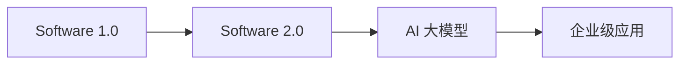

###### 1.3.2 BERT 及其变体

BERT（Bidirectional Encoder Representations from Transformers）是由 Google 开发的一种基于 Transformer 网络的预训练语言模型。BERT 及其变体（如 RoBERTa、ALBERT 等）在自然语言处理任务中取得了显著的性能提升。


###### 1.3.3 其他知名大模型介绍

除了 GPT 和 BERT 系列，还有许多其他知名的大模型，如：

1. T5（Text-to-Text Transfer Transformer）：由 Google 开发，适用于文本分类、机器翻译等任务。
2. DeBERTa（Decoding-enhanced BERT with Disentangled Attention）：由华为诺亚方舟实验室开发，具有更强的自然语言理解和生成能力。
3. GLM（General Language Modeling）：由清华大学 KEG 实验室和智谱 AI 公司开发，具有亿级参数规模。

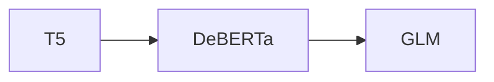

##### 1.4 AI 大模型在企业中的应用前景

AI 大模型在企业中的应用前景广阔，能够为各个行业带来显著的效益。以下是一些主要应用领域：

###### 1.4.1 AI 大模型的潜在应用领域

1. 智能客服：利用 AI 大模型实现自然语言处理，提高客服效率和用户体验。
2. 智能风控：通过 AI 大模型进行数据分析和风险预测，降低企业风险。
3. 智能营销：利用 AI 大模型分析用户行为，实现个性化推荐和精准营销。
4. 智能供应链：利用 AI 大模型优化供应链管理，提高供应链效率。
5. 智能医疗：利用 AI 大模型进行疾病诊断、医学图像分析等，提高医疗水平。

###### 1.4.2 企业采用 AI 大模型的优势

1. 提高效率：AI 大模型能够自动化处理大量数据，提高业务处理效率。
2. 降低成本：AI 大模型能够替代人工进行重复性工作，降低人力成本。
3. 提升竞争力：通过 AI 大模型实现智能化决策，提高企业竞争力。
4. 数据驱动：AI 大模型能够从海量数据中提取有价值的信息，为企业决策提供数据支持。

###### 1.4.3 AI 大模型应用的挑战与机遇

AI 大模型在应用过程中面临一些挑战，如数据隐私、模型解释性、计算资源等。但同时，AI 大模型也带来了新的机遇，如推动产业变革、提升社会生产力等。企业需要积极应对挑战，把握机遇，实现 AI 大模型在企业中的应用价值。

#### 第2章: AI 大模型技术基础

##### 2.1 深度学习与神经网络基础

深度学习是 AI 大模型的核心技术之一，其基础是神经网络。本节将介绍神经网络的基本结构、常见的深度学习架构以及深度学习优化算法。

###### 2.1.1 神经网络的基本结构

神经网络由多个神经元（节点）组成，每个神经元接收多个输入，通过权重和偏置计算得到输出。神经网络的基本结构包括：

1. 输入层：接收外部输入数据。
2. 隐藏层：对输入数据进行处理和变换。
3. 输出层：生成最终输出。

神经网络的工作原理是通过反向传播算法，不断调整权重和偏置，使得输出层输出与实际值之间的误差最小。

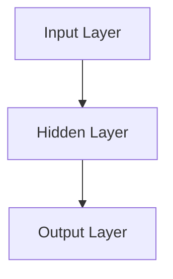

###### 2.1.2 常见的深度学习架构

常见的深度学习架构包括：

1. 卷积神经网络（CNN）：主要用于图像和视频处理。
2. 循环神经网络（RNN）：主要用于序列数据处理，如自然语言处理。
3. 生成对抗网络（GAN）：主要用于生成数据、图像等。
4. Transformer：主要用于自然语言处理，具有强大的序列建模能力。

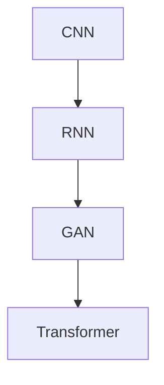

###### 2.1.3 深度学习优化算法

深度学习优化算法主要包括：

1. 随机梯度下降（SGD）：通过计算梯度下降方向进行参数更新。
2. Adam：结合了 SGD 和动量方法，适用于大型模型。
3. RMSprop：基于平方梯度进行优化，适用于波动较大的数据。
4. AdaGrad：对每个参数的梯度进行自适应调整。

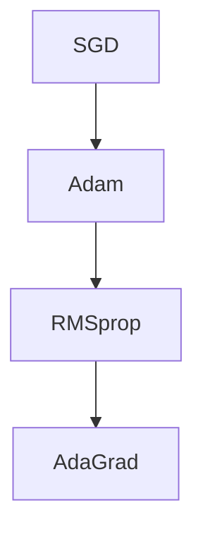

##### 2.2 自然语言处理技术概览

自然语言处理（NLP）是 AI 大模型的重要应用领域之一。本节将介绍 NLP 中的关键技术，如词嵌入、序列模型和注意力机制。

###### 2.2.1 词嵌入技术

词嵌入是将词汇映射为低维向量表示的一种技术。词嵌入能够捕捉词汇之间的语义关系，从而提高 NLP 模型的性能。常见的词嵌入技术包括：

1. Word2Vec：基于神经网络的词嵌入技术，通过训练神经网络自动学习词向量。
2. GloVe：基于全局平均的方法进行词嵌入，能够捕捉词汇的局部和全局关系。

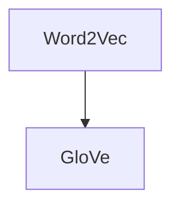

###### 2.2.2 序列模型与注意力机制

序列模型是处理序列数据的一种深度学习模型，如 RNN、LSTM 等。注意力机制是序列模型中的一种关键技术，能够提高模型对序列数据的处理能力。注意力机制的基本思想是动态地关注序列中的关键信息。

1. RNN（递归神经网络）：能够处理序列数据，但在长序列中易出现梯度消失和梯度爆炸问题。
2. LSTM（长短时记忆网络）：通过门控机制解决 RNN 的梯度消失和梯度爆炸问题。
3. Transformer：采用自注意力机制，能够在序列数据中捕捉长距离依赖关系。

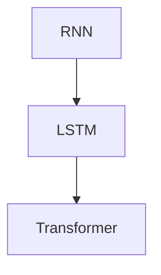

###### 2.2.3 转换器架构详解

转换器（Transformer）是一种基于自注意力机制的深度学习模型，被广泛应用于自然语言处理任务。转换器的架构主要包括：

1. 编码器（Encoder）：对输入序列进行编码，生成固定长度的编码向量。
2. 解码器（Decoder）：对编码向量进行解码，生成输出序列。

转换器的核心思想是通过自注意力机制，将序列中的每个元素与所有其他元素进行关联，从而捕捉长距离依赖关系。

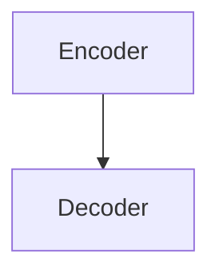

##### 2.3 大规模预训练模型原理

大规模预训练模型是指通过在大量数据上进行预训练，然后针对特定任务进行微调的模型。预训练能够提高模型的泛化能力和性能。大规模预训练模型主要包括以下原理：

###### 2.3.1 预训练的概念与意义

预训练是指在大规模语料库上进行模型训练，使模型具备一定的语义理解和生成能力。预训练的意义在于：
1. 提高模型性能：通过预训练，模型能够在大规模数据上学习到丰富的语义信息，从而提高模型性能。
2. 提高泛化能力：预训练模型能够在大规模数据上学习到通用特征，从而提高模型在不同领域和任务的泛化能力。

###### 2.3.2 自监督学习方法

自监督学习是指在没有标注数据的情况下，利用数据中的潜在信息进行模型训练。大规模预训练模型通常采用自监督学习方法，通过以下几种方式利用数据：
1. 语言模型预训练：通过预测下一个单词、句子等方式，使模型具备语言理解和生成能力。
2. 文本分类预训练：通过预测文本类别，使模型具备分类能力。
3. 生成式预训练：通过生成文本、图像等方式，使模型具备生成能力。

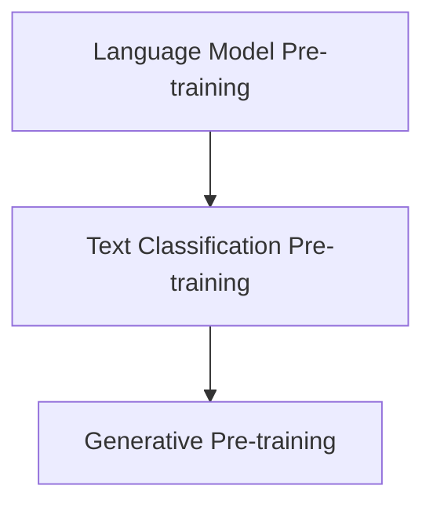

###### 2.3.3 迁移学习与微调技术

迁移学习是指利用在源任务上预训练的模型，将其应用于目标任务上。迁移学习的核心思想是利用预训练模型中已经学习到的通用特征，提高目标任务的性能。

微调是指将预训练模型在目标任务上进行少量训练，以适应目标任务。微调的过程主要包括以下步骤：
1. 载入预训练模型：将预训练模型加载到内存中。
2. 更新部分参数：在微调过程中，通常只更新部分参数，如分类层的权重。
3. 训练目标任务：在目标任务上进行训练，直到达到预期性能。

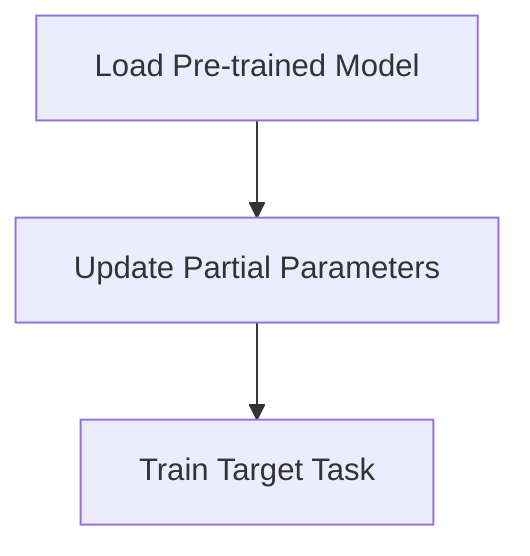

#### 第3章: AI 大模型架构设计

##### 3.1 大模型架构设计原则

在设计 AI 大模型架构时，需要考虑以下原则：

###### 3.1.1 模型可扩展性与灵活性

模型可扩展性是指模型能够支持不同规模的任务和数据集。在设计大模型架构时，需要考虑以下几个方面：
1. 模型参数的调整：根据任务和数据集的大小，调整模型参数的数量和规模。
2. 硬件资源的优化：根据硬件资源的限制，选择合适的模型架构和计算方式。

模型灵活性是指模型能够适应不同的应用场景和任务需求。在设计大模型架构时，需要考虑以下几个方面：
1. 多模型融合：结合不同模型的优势，实现多种任务的集成和优化。
2. 灵活的网络结构：采用可变网络结构，适应不同的任务和数据集。

###### 3.1.2 计算资源优化

计算资源优化是指在大模型训练和推理过程中，充分利用硬件资源，提高计算效率。以下是一些优化策略：
1. 并行计算：通过并行计算，加快模型训练和推理速度。
2. 分布式训练：将模型训练任务分布在多台设备上，充分利用计算资源。
3. 模型压缩：通过模型压缩技术，减少模型参数数量和存储空间。

###### 3.1.3 系统可靠性

系统可靠性是指模型在大规模部署和应用过程中，能够稳定运行，不会出现故障或错误。以下是一些确保系统可靠性的策略：
1. 数据一致性：确保数据在存储和传输过程中的一致性，防止数据损坏或丢失。
2. 容错机制：设计容错机制，当系统出现故障时，能够自动切换到备用系统，保证业务的连续性。
3. 监控与报警：建立完善的监控和报警系统，实时监控系统的运行状态，及时发现和解决潜在问题。

##### 3.2 大模型训练策略

在大模型训练过程中，需要考虑以下策略：

###### 3.2.1 训练数据的准备与处理

训练数据的准备和处理是模型训练的关键步骤。以下是一些策略：
1. 数据清洗：去除训练数据中的噪声和异常值，提高数据质量。
2. 数据增强：通过数据增强技术，增加训练数据的多样性，提高模型的泛化能力。
3. 数据预处理：对训练数据进行归一化、标准化等预处理操作，使数据符合模型的输入要求。

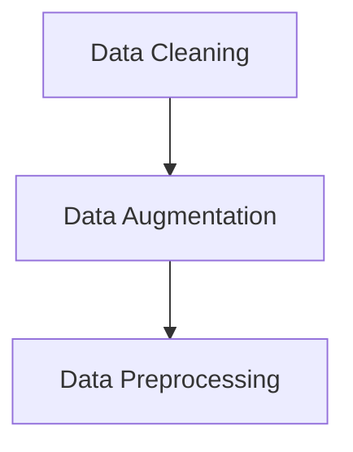

###### 3.2.2 模型训练流程

模型训练流程主要包括以下几个步骤：
1. 初始化模型参数：随机初始化模型参数。
2. 定义损失函数：选择合适的损失函数，如交叉熵损失函数。
3. 选择优化器：选择合适的优化器，如 Adam 优化器。
4. 训练迭代：通过反向传播算法，不断更新模型参数，最小化损失函数。
5. 评估模型：在验证集上评估模型性能，选择最佳模型。

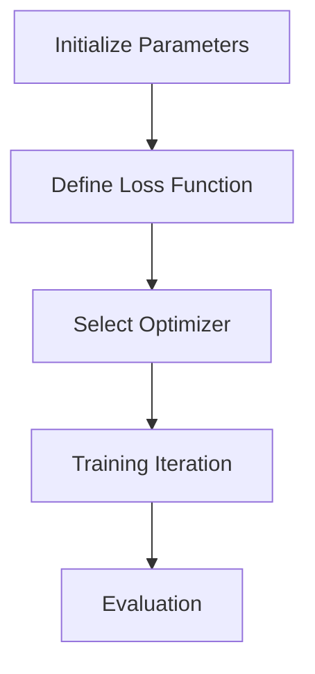

###### 3.2.3 训练过程的监控与调整

在模型训练过程中，需要实时监控训练过程，并根据监控结果进行调整。以下是一些监控与调整策略：
1. 训练进度监控：实时监控训练进度，包括迭代次数、损失函数值等。
2. 模型性能监控：在验证集上评估模型性能，包括准确率、召回率等指标。
3. 调整训练策略：根据监控结果，调整训练参数、数据增强策略等，提高模型性能。

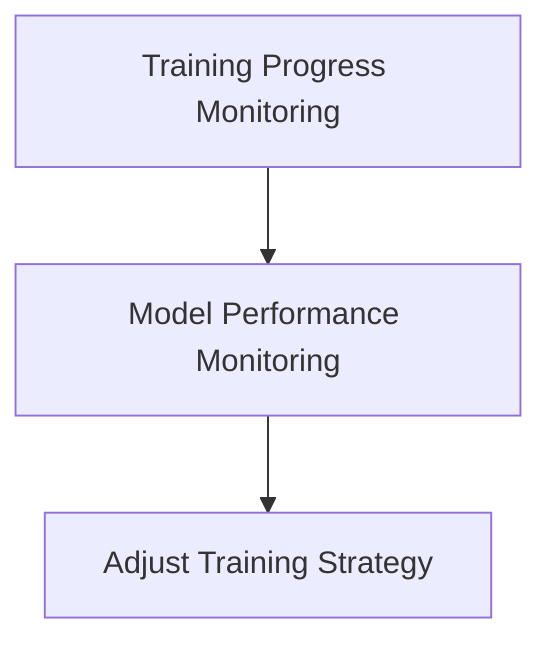

##### 3.3 大模型评估与优化

在大模型评估与优化过程中，需要考虑以下策略：

###### 3.3.1 评估指标与方法

评估指标是衡量模型性能的重要标准。以下是一些常用的评估指标和方法：
1. 准确率（Accuracy）：模型预测正确的样本数量与总样本数量的比例。
2. 召回率（Recall）：模型预测正确的正样本数量与实际正样本数量的比例。
3. 精确率（Precision）：模型预测正确的正样本数量与预测为正样本的总数量的比例。
4. F1 分数（F1 Score）：精确率和召回率的加权平均值。

```mermaid
graph TB
A[A


