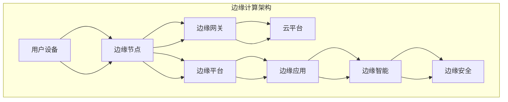

                 

### 边缘计算创业：IoT时代的新基建

> **关键词：** 边缘计算、IoT、创业、技术架构、应用场景、项目规划、资源管理、风险控制、案例分析

> **摘要：** 本文章旨在探讨边缘计算在IoT时代的重要性，分析边缘计算的技术架构和应用场景，探讨边缘计算创业的机会和挑战，并给出项目规划和资源管理的策略。文章通过案例分析，总结边缘计算创业的成功秘诀，为创业者提供实践指导。

随着物联网（IoT）技术的快速发展，边缘计算成为了新时代的新基建。边缘计算不仅解决了云计算中心在处理海量数据时的延迟问题，还为物联网设备的智能化提供了有力支撑。本文将深入探讨边缘计算的概念、技术架构、应用场景，分析边缘计算创业的机会和挑战，并分享创业实践的经验与策略。

## 第一部分：边缘计算概述

边缘计算是一种分布式计算架构，旨在将计算、存储和网络功能从云端延伸到网络的边缘，即靠近数据源或用户的地方。通过边缘计算，可以在靠近数据产生的地方进行处理和分析，从而降低延迟、减少带宽消耗，提高系统的响应速度和效率。

### 第1章：边缘计算的基本概念

#### 1.1 边缘计算的起源与发展历程

边缘计算的概念起源于网络边缘（Network Edge）的理念，最早可以追溯到20世纪90年代的无线通信领域。随着物联网和移动互联网的兴起，边缘计算逐渐成为一个独立的研究方向。

2005年，Cisco首次提出了“网络边缘”（Network Edge）的概念，将网络边缘定义为“网络架构中远离核心网络的位置”。2014年，Google提出了“边缘计算”（Edge Computing）的概念，并在其云计算服务中实现了边缘计算的功能。

近年来，边缘计算得到了快速发展，成为物联网、5G、人工智能等领域的重要技术支撑。边缘计算的应用场景不断扩展，从简单的数据处理和分析，到复杂的智能决策和实时控制。

#### 1.2 边缘计算与云计算的区别

云计算是基于互联网的服务模式，提供计算、存储、网络等基础设施资源，用户可以根据需求租用这些资源。云计算的核心在于将计算资源集中管理，实现资源的弹性扩展和高效利用。

边缘计算则是在网络的边缘部署计算、存储、网络资源，实现数据的本地处理和分析。边缘计算与云计算的区别主要体现在以下几个方面：

1. **计算位置**：云计算主要在数据中心进行，而边缘计算则在网络的边缘，靠近数据源或用户。
2. **延迟**：边缘计算可以降低数据的传输延迟，实现实时处理和响应。
3. **带宽**：边缘计算可以减少数据传输的带宽消耗，降低网络负载。
4. **数据处理能力**：边缘计算可以在本地进行数据处理和分析，减少对云计算中心的依赖。

#### 1.3 边缘计算的重要性

边缘计算在物联网时代具有极其重要的地位。首先，边缘计算可以解决云计算在处理海量数据时的延迟问题，满足实时性要求较高的应用场景。其次，边缘计算可以降低数据传输的带宽消耗，提高网络资源利用率。此外，边缘计算还可以促进物联网设备的智能化，实现更高效、更智能的设备管理。

### 第2章：边缘计算的技术架构

边缘计算的技术架构主要包括边缘计算网络架构、边缘计算节点功能、边缘计算数据管理等方面。

#### 2.1 边缘计算的关键技术

1. **边缘计算网络架构**：边缘计算网络架构包括边缘节点、边缘网关、数据中心等组成部分。边缘节点负责数据的采集、处理和存储，边缘网关负责数据传输和网络连接，数据中心负责数据的备份和集中处理。

2. **边缘计算节点功能**：边缘计算节点通常包括计算单元、存储单元、网络接口等。计算单元负责执行数据处理和分析任务，存储单元负责存储数据，网络接口负责与其他节点进行通信。

3. **边缘计算数据管理**：边缘计算数据管理包括数据采集、数据存储、数据传输、数据清洗、数据共享等方面。边缘计算数据管理需要考虑数据的安全性、可靠性和实时性。

#### 2.2 边缘计算的应用场景

边缘计算在多个领域具有广泛的应用场景，包括工业制造、智能交通、智慧城市建设、智能家居等。

1. **工业制造**：边缘计算可以用于工业自动化、设备监测、生产优化等方面，提高生产效率和产品质量。

2. **智能交通**：边缘计算可以用于智能交通信号控制、车辆监测、路况分析等方面，提高交通管理效率和安全性。

3. **智慧城市建设**：边缘计算可以用于智慧城市管理、环境监测、公共服务等方面，提高城市运行效率和居民生活质量。

4. **智能家居**：边缘计算可以用于智能家居设备的控制、数据分析、安全防护等方面，提高家庭生活品质。

## 第二部分：边缘计算创业实践

### 第3章：边缘计算创业机会分析

#### 3.1 边缘计算市场现状与趋势

随着物联网和5G技术的快速发展，边缘计算市场呈现出快速增长的趋势。根据市场研究机构的预测，未来几年边缘计算市场将保持两位数的增长，市场规模将达到数百亿美元。

目前，边缘计算市场仍处于初级阶段，各大厂商纷纷布局，市场格局尚未完全形成。从技术角度来看，边缘计算技术逐渐成熟，但应用场景和商业模式仍在探索中。

#### 3.2 边缘计算创业模式探索

边缘计算创业可以从以下几个方面进行探索：

1. **边缘计算平台**：提供边缘计算平台，包括边缘节点、边缘网关、数据中心等，为各类应用提供基础设施服务。
2. **边缘计算应用**：开发边缘计算应用，针对特定行业或场景提供解决方案，如智能交通、智能制造、智慧城市等。
3. **边缘计算服务**：提供边缘计算咨询服务，帮助企业和组织进行边缘计算规划、部署和运维。

### 第4章：边缘计算创业项目规划

#### 4.1 创业项目市场调研

在创业初期，进行市场调研至关重要。市场调研主要包括以下几个方面：

1. **市场需求分析**：了解边缘计算在目标市场的需求，包括用户需求、市场规模、增长趋势等。
2. **竞争对手分析**：分析市场上的竞争对手，包括产品、服务、市场份额等。
3. **市场定位与目标客户**：确定项目的市场定位，明确目标客户群体。

#### 4.2 创业项目技术规划

技术规划是创业项目成功的关键。技术规划主要包括以下几个方面：

1. **技术路线选择**：根据市场需求和自身技术能力，选择合适的技术路线。
2. **核心技术研发**：重点研发核心技术，确保项目的核心竞争力。
3. **技术实现与优化**：通过不断优化技术实现，提高系统的性能、稳定性和可靠性。

### 第5章：边缘计算创业资源管理

#### 5.1 资金筹集与使用

资金是边缘计算创业的重要保障。资金筹集主要包括以下几个方面：

1. **资金筹集策略**：根据创业项目的需求和自身情况，选择合适的资金筹集方式，如天使投资、风险投资、银行贷款等。
2. **资金使用规划**：合理规划资金使用，确保资金用在关键环节，如技术研发、市场推广、团队建设等。
3. **资金风险控制**：制定资金风险控制措施，确保资金的安全性和有效性。

#### 5.2 人才招聘与团队建设

人才是边缘计算创业的核心资源。人才招聘主要包括以下几个方面：

1. **人才招聘策略**：根据创业项目的需求，选择合适的人才招聘渠道，如校园招聘、社会招聘、猎头等。
2. **团队建设与激励机制**：建立高效的团队，制定合理的激励机制，确保团队的凝聚力和战斗力。
3. **团队管理与协作**：加强团队管理，提高团队协作效率，确保项目的顺利进行。

### 第6章：边缘计算创业项目运营

#### 6.1 项目市场推广

项目市场推广是边缘计算创业成功的关键。市场推广主要包括以下几个方面：

1. **市场推广策略**：根据市场需求和自身情况，制定合适的市场推广策略，如线上线下结合、内容营销、广告投放等。
2. **品牌建设与传播**：建立品牌形象，提高品牌知名度，通过品牌传播，增强市场影响力。
3. **用户获取与留存**：通过有效的用户获取和留存策略，确保项目的用户规模和用户质量。

#### 6.2 项目风险管理

项目风险管理是边缘计算创业的重要环节。项目风险管理主要包括以下几个方面：

1. **项目风险识别**：识别项目可能面临的风险，包括市场风险、技术风险、财务风险等。
2. **风险评估与应对措施**：对识别出的风险进行评估，制定相应的应对措施。
3. **风险管理与控制**：通过风险管理与控制，降低项目风险，确保项目的顺利进行。

## 第三部分：边缘计算创业案例分析

### 第7章：成功边缘计算创业案例分析

#### 7.1 案例一：边缘计算在智能制造中的应用

**案例背景**：某初创公司专注于边缘计算在智能制造领域的应用，为客户提供智能生产线的解决方案。

**案例实施过程**：公司首先进行市场调研，了解智能制造领域的需求和痛点。然后，公司开发了一套边缘计算平台，实现数据的本地处理和分析，提高生产效率和产品质量。同时，公司还与制造企业合作，提供定制化的智能生产线解决方案。

**案例成果与经验总结**：该案例成功实现了边缘计算在智能制造中的应用，提高了生产效率和产品质量，为客户创造了价值。经验总结包括：深入了解市场需求，提供定制化解决方案，加强合作与沟通。

#### 7.2 案例二：边缘计算在智慧交通中的应用

**案例背景**：某初创公司专注于边缘计算在智慧交通领域的应用，为客户提供智能交通信号控制解决方案。

**案例实施过程**：公司首先进行市场调研，了解智慧交通领域的需求和痛点。然后，公司开发了一套边缘计算平台，实现交通数据的实时处理和分析，优化交通信号控制策略。同时，公司还与交通管理部门合作，提供智能交通信号控制解决方案。

**案例成果与经验总结**：该案例成功实现了边缘计算在智慧交通中的应用，提高了交通管理效率和安全性，为客户创造了价值。经验总结包括：深入了解市场需求，提供定制化解决方案，加强合作与沟通。

### 第8章：边缘计算创业者的成功秘诀

#### 8.1 创业心态与态度

创业者的心态和态度是创业成功的关键。成功创业者通常具备以下心态和态度：

1. **积极乐观**：积极乐观的心态有助于应对创业过程中的困难和挑战。
2. **耐心坚韧**：创业是一个长期的过程，需要耐心和坚韧的品质。
3. **团队合作**：团队合作是实现创业目标的重要保障。

#### 8.2 创新思维与市场洞察

创新思维和市场洞察是创业成功的关键。成功创业者通常具备以下能力：

1. **创新思维**：具备创新思维，能够发现市场机会，提供独特的产品或服务。
2. **市场洞察**：具备市场洞察力，能够准确把握市场需求，制定有效的市场策略。

#### 8.3 团队建设与资源整合

团队建设和资源整合是创业成功的关键。成功创业者通常具备以下能力：

1. **团队建设**：能够建立高效的团队，激发团队成员的积极性和创造力。
2. **资源整合**：能够整合各方资源，形成竞争优势。

## 附录

### 附录A：边缘计算相关资源与工具

#### A.1 边缘计算开源框架

1. **TensorFlow Lite**：TensorFlow Lite 是 Google 推出的一款轻量级深度学习框架，适用于移动设备和边缘设备。
2. **PyTorch Mobile**：PyTorch Mobile 是 PyTorch 推出的一款移动和边缘设备深度学习框架。
3. **ONNX Runtime**：ONNX Runtime 是 Microsoft 推出的一款开源深度学习推理引擎，支持多种编程语言和硬件平台。

#### A.2 边缘计算技术标准

1. **IEEE 802.11ah**：IEEE 802.11ah 是一款针对物联网的无线通信标准，提供低功耗、低延迟的通信能力。
2. **IEEE 1901.1**：IEEE 1901.1 是一款家庭网络通信标准，支持高带宽、低延迟的通信能力。
3. **3GPP NR**：3GPP NR 是 5G 新空口标准，提供高带宽、低延迟的通信能力。

#### A.3 边缘计算创业指南

1. **创业法律法规**：了解相关的创业法律法规，确保创业活动的合规性。
2. **创业投融资渠道**：了解各种创业投融资渠道，选择合适的融资方式。
3. **创业成功案例与经验分享**：学习成功创业者的经验，借鉴他们的创业策略和方法。

## 总结

边缘计算作为IoT时代的新基建，具有巨大的市场潜力和发展前景。边缘计算技术不仅解决了云计算的延迟问题，还为物联网设备的智能化提供了有力支撑。边缘计算创业者在市场调研、技术规划、资源管理、项目运营等方面需要深入思考和实践。本文通过分析边缘计算的基本概念、技术架构、创业机会、创业实践和案例分析，总结了边缘计算创业的关键成功因素，为创业者提供了实践指导。希望本文能对边缘计算创业者有所启发和帮助。在未来的发展中，边缘计算将继续发挥重要作用，推动物联网和智能化的进一步发展。

## 作者信息

作者：AI天才研究院/AI Genius Institute & 禅与计算机程序设计艺术 /Zen And The Art of Computer Programming

---

通过上述内容，本文已经覆盖了边缘计算的基本概念、技术架构、创业机会、创业实践和案例分析，以及创业成功的关键因素。接下来，我们将进一步深入讨论边缘计算的技术原理、算法实现、项目实战等内容，为读者提供更全面的技术视角和实践指导。同时，我们也将结合实际案例，分析边缘计算在不同领域的应用，以及创业者在项目规划、资源管理和风险控制等方面的实践策略。让我们继续深入探讨边缘计算的奥秘，探索IoT时代的新基建。期待您的持续关注与参与！

---

### 第1章：边缘计算的基本概念

边缘计算（Edge Computing）是一种分布式计算架构，旨在将数据存储、处理和分析的功能从传统的中心化云平台迁移到网络的边缘。这个边缘可以是物理上靠近数据源或用户的设备、传感器、网关等。通过这种方式，边缘计算能够显著降低数据传输延迟、减轻中心化数据中心的负担，并提高系统整体性能和响应速度。

#### 1.1 边缘计算的起源与发展历程

边缘计算的概念起源于网络边缘（Network Edge）的理念。在网络边缘，数据产生、处理和消费的本地化能够实现更快速、更可靠的响应。边缘计算的发展可以追溯到以下几个关键阶段：

1. **早期物联网**：20世纪90年代，随着物联网技术的兴起，边缘计算的概念开始萌芽。无线传感器网络（WSN）和现场可编程逻辑门阵列（FPGA）等技术的应用，使得数据可以在网络边缘进行初步处理。

2. **云计算时代**：2006年，云计算的兴起进一步推动了边缘计算的发展。云计算提供了强大的计算和存储能力，但同时也带来了数据传输延迟和网络拥堵的问题。边缘计算作为一种补充，旨在解决这些问题。

3. **5G与物联网**：随着5G网络的部署和物联网设备的大规模普及，边缘计算的重要性越来越凸显。5G网络的低延迟和高带宽特性，使得边缘计算能够更好地服务于实时应用场景。

#### 1.2 边缘计算的重要性

边缘计算在当今的数字时代具有以下几个重要优势：

1. **降低延迟**：边缘计算将数据处理和分析推向网络的边缘，大大减少了数据传输的距离，从而降低了延迟。这对于需要实时响应的应用，如自动驾驶、智能医疗等，尤为重要。

2. **提高效率**：通过在边缘进行数据处理，可以减少对中心化数据中心的依赖，减轻网络的负载。同时，本地处理可以更快地生成结果，提高系统的整体效率。

3. **增强隐私和安全**：数据在边缘设备上进行处理，可以减少数据在传输过程中的泄露风险。此外，边缘设备可以采用加密和访问控制等技术，增强数据的安全性。

4. **扩展服务能力**：边缘计算使得更多的计算任务可以在本地完成，无需依赖于云服务。这种扩展的服务能力可以降低成本，并提高服务的可用性和可靠性。

#### 1.3 边缘计算与云计算的区别

边缘计算与云计算在架构、目的和优势上存在显著差异：

1. **架构**：
   - **云计算**：云计算是一种集中式的计算架构，数据处理和分析主要在远程数据中心进行。用户通过互联网访问这些中心化的资源。
   - **边缘计算**：边缘计算是一种分布式架构，数据处理和分析在靠近数据源或用户的设备上进行。这样可以减少数据传输的距离，提高系统的响应速度。

2. **目的**：
   - **云计算**：云计算的主要目的是提供可扩展的计算、存储和网络资源，支持大规模的应用部署和服务交付。
   - **边缘计算**：边缘计算的主要目的是提供低延迟、高响应速度的数据处理能力，满足实时应用场景的需求。

3. **优势**：
   - **云计算**：云计算具有强大的计算和存储能力，能够支持大规模的数据处理和分析，但存在数据传输延迟和网络拥堵的问题。
   - **边缘计算**：边缘计算能够降低数据传输延迟，提高系统的响应速度，但数据处理能力相对有限。

通过上述分析，我们可以看到边缘计算和云计算在架构、目的和优势上各有特点。边缘计算在物联网和实时应用场景中具有独特的优势，而云计算则适合处理大规模的数据分析和应用部署。

### 边缘计算的概念

边缘计算（Edge Computing）是一种分布式计算架构，它将数据存储、处理和分析的功能从传统的中心化云平台迁移到网络的边缘。这个边缘可以是物理上靠近数据源或用户的设备、传感器、网关等。通过这种方式，边缘计算能够显著降低数据传输延迟、减轻中心化数据中心的负担，并提高系统整体性能和响应速度。

在边缘计算中，数据不再需要在远端的数据中心进行集中处理，而是在数据产生的源头附近进行处理。这种架构的优势在于可以大幅降低数据传输的时间和带宽消耗，从而提高系统的实时性和效率。此外，边缘计算还能够增强数据的安全性和隐私性，因为敏感数据不必在传输过程中经过公网。

#### 边缘计算的发展历程

边缘计算的发展历程可以分为以下几个阶段：

1. **早期物联网阶段**：边缘计算的概念起源于20世纪90年代的无线传感器网络（WSN）和现场可编程逻辑门阵列（FPGA）等技术的应用。这些技术使得数据可以在网络边缘进行初步处理，减少了数据传输的距离。

2. **云计算时代**：随着云计算的兴起，边缘计算开始作为一种补充性技术得到重视。云计算提供了强大的计算和存储能力，但同时也带来了数据传输延迟和网络拥堵的问题。边缘计算旨在解决这些问题，通过在边缘进行数据处理，降低延迟和带宽消耗。

3. **5G与物联网**：随着5G网络的部署和物联网设备的大规模普及，边缘计算的重要性进一步凸显。5G网络的低延迟和高带宽特性，使得边缘计算能够更好地服务于实时应用场景，如自动驾驶、智能制造、智慧城市等。

#### 边缘计算的重要性

边缘计算在当今的数字时代具有以下几个重要优势：

1. **降低延迟**：边缘计算将数据处理和分析推向网络的边缘，大大减少了数据传输的距离，从而降低了延迟。这对于需要实时响应的应用，如自动驾驶、智能医疗等，尤为重要。

2. **提高效率**：通过在边缘进行数据处理，可以减少对中心化数据中心的依赖，减轻网络的负载。同时，本地处理可以更快地生成结果，提高系统的整体效率。

3. **增强隐私和安全**：数据在边缘设备上进行处理，可以减少数据在传输过程中的泄露风险。此外，边缘设备可以采用加密和访问控制等技术，增强数据的安全性。

4. **扩展服务能力**：边缘计算使得更多的计算任务可以在本地完成，无需依赖于云服务。这种扩展的服务能力可以降低成本，并提高服务的可用性和可靠性。

### 边缘计算与云计算的区别

边缘计算与云计算在架构、目的和优势上存在显著差异：

1. **架构**：
   - **云计算**：云计算是一种集中式的计算架构，数据处理和分析主要在远程数据中心进行。用户通过互联网访问这些中心化的资源。
   - **边缘计算**：边缘计算是一种分布式架构，数据处理和分析在靠近数据源或用户的设备上进行。这样可以减少数据传输的距离，提高系统的响应速度。

2. **目的**：
   - **云计算**：云计算的主要目的是提供可扩展的计算、存储和网络资源，支持大规模的应用部署和服务交付。
   - **边缘计算**：边缘计算的主要目的是提供低延迟、高响应速度的数据处理能力，满足实时应用场景的需求。

3. **优势**：
   - **云计算**：云计算具有强大的计算和存储能力，能够支持大规模的数据处理和分析，但存在数据传输延迟和网络拥堵的问题。
   - **边缘计算**：边缘计算能够降低数据传输延迟，提高系统的响应速度，但数据处理能力相对有限。

### 边缘计算的核心概念

边缘计算涉及多个核心概念，这些概念共同构成了边缘计算的技术基础。理解这些概念有助于深入认识边缘计算的工作原理和应用场景。

1. **边缘节点（Edge Node）**：
   边缘节点是边缘计算架构中的关键组成部分，它通常是一个智能设备，具备计算、存储和网络能力。边缘节点可以是一个嵌入式设备、工业控制器、智能手机、智能路由器等。这些设备分布在网络的边缘，能够实时处理和分析本地数据。

2. **边缘网关（Edge Gateway）**：
   边缘网关是连接边缘节点和云服务的桥梁。它负责数据的传输、协议转换、安全控制等功能。边缘网关通常具备较高的计算和存储能力，能够对数据流进行初步处理，筛选和过滤不必要的流量，然后将关键数据发送到云服务进行进一步分析。

3. **边缘平台（Edge Platform）**：
   边缘平台是一个综合性的软件架构，用于管理边缘节点和边缘网关。它提供了应用开发、部署、监控、运维等一整套工具和服务。边缘平台通常包括操作系统、开发工具、管理界面等，使得开发者能够方便地开发和部署边缘应用。

4. **边缘应用（Edge Application）**：
   边缘应用是在边缘节点或边缘平台上运行的应用程序，它们能够利用边缘计算能力提供本地化的服务和功能。这些应用可以是监控、数据分析、预测维护、智能控制等，能够根据实时数据和本地环境进行智能决策。

5. **边缘智能（Edge Intelligence）**：
   边缘智能是指利用边缘计算能力进行数据分析和智能决策的过程。与云计算中的集中式数据处理不同，边缘智能强调在本地进行数据分析和决策，以实现更快速、更个性化的服务。边缘智能通常涉及机器学习、物联网、人工智能等先进技术。

6. **边缘安全（Edge Security）**：
   边缘安全是指保护边缘计算环境中的数据、应用和设备免受攻击的安全措施。由于边缘设备分布在网络边缘，容易成为攻击目标，因此边缘安全至关重要。边缘安全包括数据加密、访问控制、网络隔离、漏洞修复等。

### 边缘计算架构图解

为了更好地理解边缘计算的工作原理，我们可以通过一个简单的架构图来展示边缘计算的关键组成部分及其相互作用。



在这个架构图中，用户设备通过边缘节点进行初步数据处理。边缘节点通过边缘网关与云平台进行通信，将关键数据传输到云平台进行进一步分析和处理。同时，边缘节点通过边缘平台运行边缘应用，实现本地化的服务和功能。边缘智能负责在本地进行数据分析和决策，边缘安全则确保整个边缘计算环境的安全和稳定。

通过这个架构图，我们可以清晰地看到边缘计算中各个组件的交互关系，以及边缘计算如何为用户提供高效、智能、安全的服务。

### 边缘计算的核心算法

边缘计算的核心算法是实现智能决策和分析的关键，以下是几个重要的边缘计算算法及其原理：

1. **机器学习算法**：
   - **K近邻算法（K-Nearest Neighbors, KNN）**：
     KNN算法是一种基于距离的监督学习算法，它通过计算新数据与训练数据之间的距离，找到最近的K个邻近数据点，并根据这些邻近点的标签预测新数据的类别。在边缘计算中，KNN算法可以用于实时分类和预测。
     
     ```python
     # 伪代码示例
     def kNN_predict(training_data, labels, new_data, k):
         distances = []
         for data in training_data:
             distance = calculate_distance(data, new_data)
             distances.append(distance)
         distances.sort()
         neighbors = distances[:k]
         neighbor_labels = [labels[i] for i in neighbors]
         return majority_vote(neighbor_labels)
     ```

   - **决策树算法（Decision Tree）**：
     决策树是一种常用的分类和回归算法，它通过一系列的决策规则将数据集分割成多个子集，直到满足停止条件。每个节点代表一个特征，每个分支代表一个特征划分，叶节点代表预测结果。决策树在边缘计算中可以用于分类和回归任务。
     
     ```python
     # 伪代码示例
     def build_decision_tree(data, labels, features, depth):
         if all_labels_equal(labels) or depth >= max_depth:
             return majority_vote(labels)
         best_feature, best_value = find_best_split(data, features, labels)
         left_tree = build_decision_tree(data[data[:, best_feature] <= best_value], labels, features, depth+1)
         right_tree = build_decision_tree(data[data[:, best_feature] > best_value], labels, features, depth+1)
         return DecisionTree(best_feature, best_value, left_tree, right_tree)
     ```

2. **强化学习算法**：
   - **Q学习（Q-Learning）**：
     Q学习是一种无监督的强化学习算法，它通过学习状态-动作值函数（Q值）来优化决策过程。在边缘计算中，Q学习可以用于动态资源分配、网络优化等任务。
     
     ```python
     # 伪代码示例
     def q_learning(state, action, reward, next_state, learning_rate, discount_factor):
         current_q_value = Q[state][action]
         next_max_q_value = max(Q[next_state].values())
         new_q_value = (1 - learning_rate) * current_q_value + learning_rate * (reward + discount_factor * next_max_q_value)
         Q[state][action] = new_q_value
     ```

   - **深度强化学习（Deep Reinforcement Learning）**：
     深度强化学习结合了深度学习和强化学习，通过深度神经网络来近似状态-动作值函数。在边缘计算中，深度强化学习可以用于复杂的优化问题，如自动驾驶、智能电网等。
     
     ```python
     # 伪代码示例
     def deep_q_learning(state, action, reward, next_state, model, optimizer, learning_rate, discount_factor):
         current_q_values = model.predict(state)
         next_max_q_values = model.predict(next_state)
         target_q_values = (1 - learning_rate) * current_q_values + learning_rate * (reward + discount_factor * next_max_q_values[0])
         loss = loss_function(current_q_values, target_q_values)
         optimizer.minimize(loss)
     ```

3. **聚类算法**：
   - **K-means算法**：
     K-means是一种常用的聚类算法，它通过迭代计算中心点，将数据点划分为K个簇。在边缘计算中，K-means可以用于数据降维、异常检测等任务。
     
     ```python
     # 伪代码示例
     def k_means(data, k, max_iterations):
         centroids = initialize_centroids(data, k)
         for _ in range(max_iterations):
             clusters = assign_clusters(data, centroids)
             new_centroids = calculate_new_centroids(clusters)
             if converged(centroids, new_centroids):
                 break
             centroids = new_centroids
         return centroids, clusters
     ```

4. **时间序列分析算法**：
   - **ARIMA模型（AutoRegressive Integrated Moving Average）**：
     ARIMA模型是一种常用的时间序列预测模型，它结合了自回归、差分和平滑移动平均。在边缘计算中，ARIMA模型可以用于实时监控和预测。
     
     ```python
     # 伪代码示例
     def arima_predict(data, order):
         diff_data = difference(data)
         model = ARIMA(diff_data, order=order)
         model_fit = model.fit()
         predicted_diff = model_fit.predict(n_steps_ahead)
         predicted_data = back_transform(predicted_diff, data)
         return predicted_data
     ```

这些算法在边缘计算中发挥着重要作用，通过本地数据处理和实时分析，边缘计算能够提供高效、智能、个性化的服务。

### 边缘计算在工业制造中的应用

边缘计算在工业制造领域具有广泛的应用，通过实时数据处理和智能分析，显著提升了生产效率和产品质量。以下是一些具体的边缘计算应用案例：

1. **智能生产线监控**：
   边缘计算可以在智能生产线的各个环节部署边缘节点，实时监控设备状态、生产线参数和生产数据。通过边缘节点对数据进行初步处理和分析，可以快速识别设备故障、生产异常等问题，并采取相应的措施。例如，某汽车制造厂使用边缘计算监控生产线上机械臂的运动状态，及时发现并纠正机械臂的异常动作，有效降低了设备故障率和生产中断时间。

2. **设备预测性维护**：
   边缘计算通过采集和分析设备运行数据，可以实现预测性维护。通过对设备运行状态的实时监测，边缘计算算法可以预测设备的故障时间，提前进行维护和维修。例如，一家制造企业使用边缘计算对工业机器人进行预测性维护，通过分析机器人的运动轨迹和负载情况，提前识别出潜在的故障风险，从而避免因设备故障导致的停工和损失。

3. **质量检测**：
   边缘计算可以用于生产过程中的实时质量检测。通过在生产线边缘部署传感器和边缘节点，对产品进行实时检测，可以快速识别出不合格的产品，并在生产过程中立即采取措施。例如，某电子制造企业使用边缘计算对电子产品的焊接质量进行实时检测，通过分析焊接参数和传感器数据，及时发现焊接缺陷，保证了产品的高质量。

4. **生产优化**：
   边缘计算可以通过实时数据分析和智能决策，优化生产过程。例如，在生产过程中，边缘计算可以根据实时生产数据，动态调整生产参数，优化生产节拍和资源分配，提高生产效率和资源利用率。某家电制造企业通过边缘计算对生产设备进行实时优化，减少了生产线的停机时间，提高了生产效率。

5. **供应链管理**：
   边缘计算可以用于供应链管理中的实时数据分析和决策。例如，通过在仓库和物流中心部署边缘节点，实时监测库存情况、物流状态等数据，边缘计算可以优化库存管理、调度物流资源，提高供应链的整体效率。某物流公司通过边缘计算实现了对运输车辆和货物的实时监控和管理，提高了物流配送的准确性和时效性。

### 边缘计算在智能交通中的应用

边缘计算在智能交通领域具有广泛的应用，通过实时数据处理和智能分析，有效提升了交通管理效率、交通安全性和出行体验。以下是一些具体的边缘计算应用案例：

1. **智能交通信号控制**：
   边缘计算可以在交通信号灯处部署边缘节点，实时监测交通流量和车辆数据。通过边缘计算，交通信号系统能够根据实时交通状况动态调整信号灯的时序和配时方案，优化交通流量。例如，某城市交通管理部门通过在主要交通路口部署边缘计算设备，实时分析交通流量和车辆排队长度，动态调整信号灯配时，显著减少了交通拥堵，提高了道路通行效率。

2. **车辆监控与管理**：
   边缘计算可以用于实时监控和管理城市车辆，包括公共交通、私家车等。通过在车辆上部署传感器和边缘节点，实时收集车辆的位置、速度、行驶轨迹等数据，边缘计算可以对车辆进行实时监控和管理。例如，某城市公交公司通过边缘计算实现了对公交车位置的实时监控，有效提高了公交调度效率和乘客的出行体验。

3. **交通异常检测**：
   边缘计算可以用于实时检测交通异常事件，如交通事故、交通堵塞、违规停车等。通过在道路和交通设施上部署边缘节点和传感器，实时分析交通数据，边缘计算可以快速识别异常事件，并及时通知相关部门进行处理。例如，某城市通过在主要道路和交通枢纽部署边缘计算设备，实现了对交通事故的实时监测和快速处理，有效减少了事故处理时间，提高了道路通行效率。

4. **智能停车管理**：
   边缘计算可以用于智能停车管理，通过在停车场和路边停车位部署边缘节点和传感器，实时监测停车位使用情况。边缘计算可以提供实时停车位信息，帮助司机快速找到空闲停车位，提高停车场的利用率。例如，某城市在市区多个停车场上部署了边缘计算设备，实现了对停车位信息的实时监控和动态更新，提高了停车场的使用效率和司机的停车体验。

5. **道路维护与管理**：
   边缘计算可以用于道路维护和管理，通过在道路上部署边缘节点和传感器，实时监测道路状况，如路面状况、桥梁健康状态等。边缘计算可以对道路状况进行实时分析和预测，提前发现潜在问题，并及时进行维护。例如，某城市交通管理部门通过在主要道路和桥梁上部署边缘计算设备，实时监测道路状况，及时发现和处理道路损坏问题，有效延长了道路使用寿命。

### 边缘计算在智慧城市建设中的应用

边缘计算在智慧城市建设中发挥着关键作用，通过实时数据处理和智能分析，实现了城市管理的智能化和精细化，提高了城市运行效率和居民生活质量。以下是一些具体的边缘计算应用案例：

1. **智能环境监测**：
   边缘计算可以用于城市环境的实时监测，包括空气质量、水质、噪声等。通过在公园、河流、街道等地方部署边缘节点和传感器，实时采集环境数据，边缘计算可以实时分析和预测环境状况。例如，某城市在市区多个公园和河流周边部署了边缘计算设备，实时监测水质和空气质量，及时发现和处理环境污染问题，提高了城市环境质量。

2. **智能交通管理**：
   边缘计算在智慧城市建设中的智能交通管理方面发挥着重要作用。通过在主要交通路口和道路部署边缘节点，实时监测交通流量和车辆数据，边缘计算可以动态调整交通信号灯配时和交通流向，优化交通流量。例如，某城市在市区主要交通路口部署了边缘计算设备，实时分析交通流量，动态调整信号灯配时，显著减少了交通拥堵，提高了道路通行效率。

3. **智能公共安全**：
   边缘计算可以用于城市公共安全的监控和管理，通过在公共场所、交通枢纽、治安重点区域部署边缘节点和监控摄像头，实时监控人群动态和安全隐患。边缘计算可以实时分析监控视频，识别异常行为和安全隐患，并及时通知相关部门进行处理。例如，某城市在多个公共场所和交通枢纽部署了边缘计算设备，实时监控人群动态，有效防范和应对突发事件，提高了城市公共安全水平。

4. **智能能源管理**：
   边缘计算可以用于城市能源的智能化管理，包括电力、燃气、水等。通过在能源设施和终端用户设备上部署边缘节点和传感器，实时监测能源使用情况，边缘计算可以实时分析和优化能源分配和调度，提高能源利用效率。例如，某城市在多个电力变电站和用户终端部署了边缘计算设备，实时监测电力使用情况，优化电力分配，减少了能源浪费，提高了供电稳定性。

5. **智能公共服务**：
   边缘计算可以用于城市公共服务的智能化，包括智慧医疗、智慧教育、智慧养老等。通过在相关设施和设备上部署边缘节点和传感器，实时监测和服务情况，边缘计算可以提供更加个性化、高效的服务。例如，某城市在智慧医疗中心部署了边缘计算设备，实时监测病人的生命体征和健康状况，为医生提供实时数据支持，提高了医疗服务质量。

### 第3章：边缘计算创业机会分析

随着物联网（IoT）和5G技术的快速发展，边缘计算市场呈现出巨大的增长潜力。根据市场研究机构的预测，边缘计算市场规模将在未来几年内实现显著增长，预计到2025年将达到数百亿美元。这种市场前景为创业者提供了丰富的机会，但也伴随着一定的风险和挑战。本节将分析边缘计算市场的现状、趋势以及创业的潜在风险与挑战。

#### 3.1 边缘计算市场现状

当前，边缘计算市场正处于快速发展的初期阶段。一方面，各大科技公司和初创企业纷纷布局边缘计算领域，推出相关的产品和服务；另一方面，传统企业和行业也在逐步引入边缘计算技术，以提升其业务效率和竞争力。以下是边缘计算市场现状的几个关键点：

1. **技术成熟度**：边缘计算技术已经相对成熟，包括边缘节点设备、边缘网关、边缘平台等关键组件已经能够满足大多数应用需求。然而，在一些特定领域，如高性能计算和复杂数据处理方面，仍需要进一步的技术突破。

2. **应用场景多样**：边缘计算在工业制造、智能交通、智慧城市、智能家居等多个领域都有广泛的应用。不同的应用场景对边缘计算的需求和解决方案有所不同，这为创业者提供了多样化的市场机会。

3. **市场竞争激烈**：边缘计算市场竞争激烈，既有亚马逊、微软、谷歌等大型科技公司的参与，也有众多初创企业的加入。这些企业通过不同的技术路线和市场策略争夺市场份额。

4. **政策支持**：许多国家和地区对边缘计算技术给予了政策支持，鼓励其发展。例如，一些国家推出了物联网和智能城市的发展计划，为边缘计算提供了政策环境和资金支持。

#### 3.2 边缘计算市场趋势

边缘计算市场的发展趋势可以从以下几个方面进行概括：

1. **5G技术的普及**：5G网络的低延迟和高带宽特性为边缘计算提供了更好的基础设施支持。随着5G网络的逐步普及，边缘计算的应用场景将更加丰富，市场潜力将进一步释放。

2. **物联网设备的增长**：随着物联网设备的迅速增长，边缘计算将发挥越来越重要的作用。物联网设备产生的海量数据需要在边缘进行实时处理和分析，以满足智能化和实时性需求。

3. **人工智能的融合**：人工智能与边缘计算的融合将推动边缘计算的应用创新。边缘设备将具备更强的计算能力，能够执行更复杂的算法和智能决策，提高系统的智能化水平。

4. **行业应用的深入**：边缘计算将在更多行业中得到深入应用。例如，在工业制造领域，边缘计算可以用于生产线的自动化和智能化管理；在医疗领域，边缘计算可以用于远程医疗和实时诊断。

#### 3.3 边缘计算创业的潜在风险与挑战

尽管边缘计算市场前景广阔，但创业者仍需面对一系列风险和挑战：

1. **技术风险**：边缘计算技术复杂，涉及到多种技术组件和算法。创业者需要具备较高的技术实力，同时还需要不断跟进技术发展趋势，以保持竞争力。

2. **市场竞争**：边缘计算市场竞争激烈，创业者需要找到独特的市场定位和核心竞争力。此外，大型科技公司和初创企业之间的竞争也可能导致市场份额的不确定性。

3. **资金压力**：边缘计算创业需要大量的资金投入，包括研发、设备采购、市场推广等。创业者需要制定合理的资金筹集和运用策略，以应对资金压力。

4. **政策法规**：边缘计算涉及多个领域，政策法规的不确定性可能对创业项目产生影响。创业者需要密切关注政策法规的变化，确保项目合规。

5. **用户体验**：边缘计算的应用需要良好的用户体验。创业者需要深入了解用户需求，提供易于使用、可靠和高效的解决方案。

#### 3.4 创业机会分析

基于上述市场现状和趋势，边缘计算创业者可以探索以下创业机会：

1. **边缘计算平台开发**：创业者可以开发具备高扩展性和高可靠性的边缘计算平台，提供边缘节点、边缘网关和边缘平台等组件，为各种应用场景提供基础设施服务。

2. **行业解决方案提供商**：创业者可以专注于特定行业，如工业制造、智能交通、智慧医疗等，提供定制化的边缘计算解决方案，满足行业特殊需求。

3. **边缘智能应用开发**：创业者可以开发基于边缘计算的智能应用，如智能监控、智能安防、智能医疗诊断等，提供创新的解决方案，提高行业效率和质量。

4. **边缘计算服务提供商**：创业者可以提供边缘计算咨询服务，帮助企业和组织进行边缘计算规划、部署和运维，提供专业支持。

5. **边缘计算生态建设**：创业者可以构建边缘计算生态，包括开发者社区、技术培训和合作伙伴网络等，推动边缘计算技术的发展和应用。

### 第4章：边缘计算创业项目规划

边缘计算创业项目的成功规划是确保项目顺利实施和可持续发展的关键。项目规划需要全面考虑市场需求、技术路线、团队建设和资源管理等多个方面。以下是对边缘计算创业项目规划的详细讨论。

#### 4.1 创业项目市场调研

市场调研是创业项目规划的第一步，通过深入的市场调研，可以全面了解市场需求、竞争对手、市场趋势等关键信息。以下是市场调研的主要内容：

1. **市场需求分析**：了解目标市场的需求，包括市场规模、增长趋势、用户痛点等。创业者可以通过与潜在客户交流、行业报告、市场调研公司等渠道获取相关信息。

2. **竞争对手分析**：分析市场上的竞争对手，了解他们的产品特点、市场策略、市场份额等。这有助于创业者找到自身的市场定位和竞争优势。

3. **市场定位与目标客户**：根据市场需求和自身优势，确定项目的市场定位和目标客户群体。创业者需要明确项目能够解决的问题、提供的价值以及目标客户的需求。

#### 4.2 创业项目技术规划

技术规划是边缘计算创业项目的核心，决定了项目的可行性和竞争力。以下是技术规划的主要内容：

1. **技术路线选择**：根据市场需求和自身技术实力，选择合适的技术路线。创业者需要考虑技术的前瞻性、成熟度、可扩展性等因素。

2. **核心技术研发**：确定项目的核心技术，进行深入研发。这包括边缘计算网络架构、边缘节点硬件设计、边缘计算平台软件等。

3. **技术实现与优化**：在技术实现过程中，需要不断进行优化，提高系统的性能、稳定性和可靠性。这包括边缘节点的低功耗设计、边缘平台的弹性扩展、边缘安全等。

#### 4.3 创业项目团队建设

团队建设是边缘计算创业项目成功的关键，一个高效的团队可以更好地应对市场和技术挑战。以下是团队建设的主要内容：

1. **人才招聘**：根据项目需求，招聘具备相关技能和经验的人才，包括技术专家、产品经理、市场营销等。

2. **团队组织结构**：建立合理的团队组织结构，明确各岗位职责和协作方式。创业者需要根据项目特点，选择合适的组织形式，如职能型、项目型或矩阵型。

3. **激励机制**：制定合理的激励机制，激发团队成员的积极性和创造力。这包括绩效考核、股权激励、薪酬福利等。

#### 4.4 创业项目资源管理

资源管理是边缘计算创业项目顺利实施的重要保障。以下是资源管理的主要内容：

1. **资金筹集**：根据项目需求，制定资金筹集策略，选择合适的融资方式，如天使投资、风险投资、银行贷款等。创业者需要合理规划资金使用，确保资金用于关键环节。

2. **资金使用规划**：合理规划资金使用，确保资金用在最需要的地方，如技术研发、市场推广、团队建设等。

3. **资源整合**：整合各方资源，形成竞争优势。这包括与合作伙伴建立合作关系、利用政府政策支持、引入外部专家咨询等。

#### 4.5 创业项目运营规划

运营规划是确保创业项目持续发展的重要环节。以下是运营规划的主要内容：

1. **市场推广**：制定有效的市场推广策略，提高品牌知名度，拓展市场份额。这包括线上线下结合、内容营销、广告投放等。

2. **产品迭代**：根据市场需求和用户反馈，持续优化产品，提供更好的用户体验。

3. **风险管理**：建立完善的风险管理机制，识别潜在风险，制定应对措施，确保项目的顺利进行。

通过上述项目规划，边缘计算创业者可以明确项目的目标和路径，提高项目的成功概率。在项目实施过程中，创业者需要不断调整和优化规划，以应对市场和技术变化。

### 第5章：边缘计算创业资源管理

边缘计算创业项目的成功不仅依赖于技术创新和市场需求分析，还需要高效的资源管理。资源管理涵盖了资金筹集、人才招聘、团队建设、协作机制等多个方面。以下将详细讨论边缘计算创业过程中的资源管理策略。

#### 5.1 资金筹集与使用

资金是边缘计算创业项目的重要保障，合理的资金筹集和使用策略对于项目的可持续发展至关重要。

1. **资金筹集策略**：
   - **天使投资**：创业者可以寻找天使投资者，提供创新的边缘计算技术和商业计划。
   - **风险投资**：通过风险投资机构，创业者可以获得一定规模的资金支持，但需承担较高的风险。
   - **政府资助**：创业者可以利用政府提供的创业扶持政策，申请科技创新基金、中小企业贷款等。
   - **银行贷款**：通过银行贷款筹集资金，但需注意还款计划和利率风险。

2. **资金使用规划**：
   - **技术研发**：资金应首先用于技术研发，包括边缘计算平台开发、边缘节点设计等。
   - **市场推广**：资金应分配一部分用于市场推广，提高品牌知名度和市场占有率。
   - **团队建设**：资金应用于招聘优秀人才、团队培训和管理体系建设。
   - **运营成本**：资金应预留一部分用于日常运营成本，确保项目稳定运营。

3. **资金风险控制**：
   - **预算管理**：建立严格的预算管理制度，确保资金使用的透明性和规范性。
   - **风险预警**：定期进行财务审计和风险评估，及时发现和解决潜在风险。
   - **应急准备**：建立应急资金储备，以应对突发事件和不可预见的风险。

#### 5.2 人才招聘与团队建设

人才是边缘计算创业项目的核心竞争力，合理的人才招聘和团队建设策略对于项目的成功至关重要。

1. **人才招聘策略**：
   - **专业技能**：招聘具备边缘计算、物联网、人工智能等专业技能的人才，确保项目技术实现的可行性。
   - **行业经验**：招聘具备行业经验和项目实施经验的人才，有助于快速理解市场需求和客户痛点。
   - **多元化背景**：招聘具有不同专业背景和经验的人才，促进团队创新和多元化思考。

2. **团队建设与激励机制**：
   - **团队文化**：建立积极向上的团队文化，鼓励创新和协作，提高团队凝聚力。
   - **培训与成长**：提供培训和发展机会，帮助团队成员不断提升专业技能和综合素质。
   - **激励机制**：制定合理的激励机制，包括绩效考核、股权激励、薪酬福利等，激发团队成员的积极性和创造力。

3. **团队管理与协作**：
   - **明确职责**：明确团队成员的职责和分工，确保项目任务的有序推进。
   - **沟通协作**：建立高效的沟通协作机制，包括定期会议、项目进度汇报等，确保团队信息畅通。
   - **灵活调整**：根据项目进展和市场变化，灵活调整团队结构和人员配置，提高团队响应速度和灵活性。

#### 5.3 资源整合与优化

边缘计算创业项目需要整合多种资源，包括技术资源、市场资源、合作伙伴资源等，以形成竞争优势。

1. **技术资源整合**：
   - **开源技术**：积极引入和使用开源技术，降低研发成本，提高技术实现效率。
   - **外部合作**：与高校、研究机构、技术公司等建立合作关系，共享技术资源和研究成果。
   - **技术创新**：持续进行技术创新，保持技术领先优势，提高项目的竞争力。

2. **市场资源整合**：
   - **客户关系**：建立广泛的客户关系网络，通过客户反馈和需求分析，不断优化产品和服务。
   - **渠道拓展**：与代理商、经销商等建立合作关系，拓宽市场渠道，提高市场覆盖率。
   - **品牌建设**：通过品牌宣传和市场营销活动，提高品牌知名度和市场影响力。

3. **合作伙伴资源整合**：
   - **产业链合作**：与上下游企业建立合作关系，形成产业链协同效应，提高整体竞争力。
   - **战略联盟**：与其他创业公司、行业协会等建立战略联盟，共同推动边缘计算技术的发展和应用。
   - **资源共享**：与合作伙伴共享技术资源、市场资源等，实现资源的最优配置和利用。

通过上述资源管理策略，边缘计算创业者可以更好地应对市场和技术挑战，实现项目的成功落地和可持续发展。

### 第6章：边缘计算创业项目运营

在边缘计算创业项目中，项目的运营管理是确保项目顺利推进、实现预期目标的关键环节。项目运营包括市场推广、品牌建设、用户获取和留存、风险管理等多个方面。以下是对边缘计算创业项目运营的详细讨论。

#### 6.1 项目市场推广

市场推广是边缘计算创业项目运营的首要任务，通过有效的市场推广策略，可以提高项目的知名度和影响力，吸引潜在客户。以下是市场推广的主要内容：

1. **线上推广**：
   - **搜索引擎优化（SEO）**：通过优化网站内容和结构，提高在搜索引擎中的排名，吸引更多访客。
   - **搜索引擎营销（SEM）**：通过付费广告，如Google AdWords等，增加项目的曝光率和访问量。
   - **内容营销**：通过发布高质量的技术博客、白皮书、案例研究等，提升项目的专业形象和用户信任度。

2. **线下推广**：
   - **行业展会**：参加相关的行业展会和研讨会，展示项目成果，建立行业联系。
   - **企业合作**：与行业内的重要企业建立合作关系，通过联合推广，扩大项目的影响力。
   - **用户体验活动**：举办线下体验活动，如技术沙龙、研讨会等，让潜在客户亲身体验项目的优势。

3. **社交媒体**：
   - **社交媒体营销**：利用社交媒体平台，如LinkedIn、Twitter、Facebook等，发布项目动态、行业新闻和技术博客，吸引关注。
   - **KOL合作**：与行业内的意见领袖（Key Opinion Leader，KOL）合作，通过他们的推荐和分享，提高项目的知名度。

#### 6.2 品牌建设与传播

品牌建设是长期而持续的过程，通过有效的品牌传播策略，可以提升项目的品牌形象和价值。以下是品牌建设与传播的主要内容：

1. **品牌定位**：
   - **价值主张**：明确项目的核心价值主张，如技术优势、服务质量、创新理念等。
   - **目标客户**：明确目标客户群体，了解他们的需求和痛点，制定相应的品牌传播策略。

2. **品牌形象设计**：
   - **视觉设计**：设计独特的品牌标识、网站界面、宣传资料等，确保品牌形象的统一性和识别度。
   - **声音设计**：制定品牌口号、宣传语等，确保品牌声音的清晰和一致。

3. **内容营销**：
   - **故事叙述**：通过讲述品牌故事，如创业历程、技术突破、客户成功案例等，增强品牌的情感连接。
   - **多媒体内容**：利用视频、图片、音频等多媒体形式，丰富品牌内容，提高用户的参与度和记忆度。

4. **品牌传播渠道**：
   - **线上渠道**：通过官方网站、社交媒体、电子邮件等线上渠道，进行品牌传播。
   - **线下渠道**：通过展会、研讨会、新闻发布会等线下活动，扩大品牌影响力。

#### 6.3 用户获取与留存

用户获取和留存是边缘计算创业项目运营的核心目标，通过有效的用户获取策略和用户留存策略，可以确保项目的持续发展。以下是用户获取与留存的主要内容：

1. **用户获取**：
   - **免费试用**：提供免费试用版本，让潜在用户亲身体验项目优势，增加转化率。
   - **渠道拓展**：通过与代理商、合作伙伴等合作，拓展销售渠道，提高用户获取量。
   - **口碑营销**：通过现有用户的口碑传播，吸引更多新用户。

2. **用户留存**：
   - **服务质量**：提供优质的客户服务，解决用户问题，提高用户满意度。
   - **持续优化**：根据用户反馈，不断优化产品和服务，提高用户的持续使用意愿。
   - **用户社区**：建立用户社区，提供交流、学习、分享的平台，增强用户归属感和忠诚度。

3. **用户生命周期管理**：
   - **用户行为分析**：通过数据分析，了解用户行为和需求，制定个性化的服务和营销策略。
   - **用户成长体系**：建立用户成长体系，通过任务、奖励等方式，激励用户持续使用和推广项目。

#### 6.4 项目风险管理

项目风险管理是边缘计算创业项目运营的重要环节，通过识别、评估和应对项目风险，可以确保项目的稳定推进。以下是项目风险管理的主要内容：

1. **风险识别**：
   - **市场需求变化**：识别市场需求变化带来的风险，如技术过时、市场饱和等。
   - **技术风险**：识别技术实现过程中的风险，如技术瓶颈、安全漏洞等。
   - **运营风险**：识别运营管理过程中的风险，如资金链断裂、团队管理问题等。

2. **风险评估**：
   - **概率与影响评估**：对识别出的风险进行概率和影响评估，确定风险的重要性和优先级。
   - **风险分类**：根据风险的影响范围和严重程度，对风险进行分类，制定相应的应对策略。

3. **风险应对**：
   - **风险规避**：通过调整项目计划、技术方案等，规避可能的风险。
   - **风险转移**：通过保险、合作等方式，将部分风险转移给第三方。
   - **风险缓解**：通过风险控制措施，降低风险发生概率和影响程度。

4. **风险监控与应对**：
   - **实时监控**：建立风险监控机制，实时收集和分析风险信息。
   - **定期评估**：定期评估项目风险状况，更新风险应对策略。
   - **应急响应**：制定应急响应计划，确保在风险事件发生时能够迅速应对。

通过上述运营管理策略，边缘计算创业项目可以确保项目的顺利推进和可持续发展，实现商业成功。

### 第7章：成功边缘计算创业案例分析

边缘计算作为新兴的技术领域，已经涌现出一些成功的创业案例。这些案例展示了边缘计算在不同领域中的应用，以及创业者在项目实施过程中所面临的挑战和取得的成果。以下将介绍两个成功的边缘计算创业案例分析。

#### 7.1 案例一：边缘计算在智能制造中的应用

**案例背景**：

某初创公司名为“智造边缘”（EdgeMakers），专注于为工业制造企业提供边缘计算解决方案。公司成立初期，通过市场调研发现，制造业在生产过程中面临着数据传输延迟、设备故障率高、生产效率低等问题，这些问题严重影响了企业的生产效率和产品质量。因此，智造边缘决定开发一款基于边缘计算的智能生产线管理系统，帮助企业实现生产线的智能化和自动化。

**实施过程**：

1. **技术调研与方案设计**：
   智造边缘的团队进行了深入的技术调研，选择了适合边缘计算的应用场景和技术栈。他们决定采用基于Linux的边缘计算平台，结合机器学习和物联网技术，设计了一套智能生产线管理系统。

2. **核心技术研发**：
   团队开发了边缘计算节点，用于实时采集生产线上的数据，如设备状态、生产参数等。同时，他们设计了一套机器学习算法，用于分析数据并预测设备故障，提供预防性维护建议。

3. **产品测试与迭代**：
   智造边缘在合作工厂进行了产品的测试和迭代。通过不断优化算法和系统性能，他们确保产品能够稳定运行并满足客户需求。

4. **市场推广与合作**：
   智造边缘与多家工业制造企业建立了合作关系，通过提供免费试用和定制化解决方案，迅速占领市场。他们还参加了多个行业展会，展示产品优势和客户案例，提高了品牌知名度。

**成果与经验总结**：

智造边缘的产品成功应用于多个制造业企业，显著提升了生产效率和产品质量。通过边缘计算技术，企业能够实现实时监控、预测性维护和自动化生产，降低了运营成本和设备故障率。创业团队的经验总结如下：

- **深入了解市场需求**：通过市场调研，准确把握客户需求和痛点，确保产品解决方案具有实际价值。
- **技术创新与优化**：持续进行技术研发，优化产品性能，确保产品在市场上的竞争力。
- **合作与推广**：与行业内的重要企业建立合作关系，通过市场推广活动，提高品牌知名度。

#### 7.2 案例二：边缘计算在智慧交通中的应用

**案例背景**：

另一家初创公司名为“智行边缘”（EdgeMovers），专注于为城市交通管理部门提供边缘计算解决方案，以优化交通信号控制和车辆管理。公司成立初期，通过市场调研发现，城市交通管理面临着交通拥堵、信号灯配时不合理、车辆管理混乱等问题。智行边缘决定开发一款基于边缘计算的智能交通管理系统，帮助城市交通管理部门实现交通的智能化和高效管理。

**实施过程**：

1. **技术调研与方案设计**：
   智行边缘的团队选择了基于边缘计算和物联网技术的方案，开发了一套智能交通管理系统。他们设计了一套边缘计算平台，用于实时采集交通数据，如车辆流量、路况信息等。同时，他们开发了一套智能信号控制算法，用于动态调整交通信号灯的时序和配时方案。

2. **产品测试与迭代**：
   智行边缘在多个城市进行了产品的测试和迭代。通过不断优化算法和系统性能，他们确保产品能够稳定运行并满足不同城市的交通管理需求。

3. **市场推广与合作**：
   智行边缘与多个城市交通管理部门建立了合作关系，通过提供免费试用和定制化解决方案，迅速占领市场。他们还参加了多个交通管理论坛和研讨会，展示产品优势和客户案例，提高了品牌知名度。

**成果与经验总结**：

智行边缘的产品成功应用于多个城市的交通管理，显著提升了交通管理效率和安全性。通过边缘计算技术，城市交通管理部门能够实现实时监控、智能信号控制和车辆管理，降低了交通拥堵和事故发生率。创业团队的经验总结如下：

- **深入了解市场需求**：通过市场调研，准确把握客户需求和痛点，确保产品解决方案具有实际价值。
- **技术创新与优化**：持续进行技术研发，优化产品性能，确保产品在市场上的竞争力。
- **合作与推广**：与行业内的重要企业建立合作关系，通过市场推广活动，提高品牌知名度。

通过这两个成功案例，我们可以看到边缘计算技术在智能制造和智慧交通领域的广泛应用和巨大潜力。创业者在实施边缘计算项目时，需要深入了解市场需求，持续进行技术创新，并与行业合作伙伴紧密合作，以实现项目的成功。

### 第8章：边缘计算创业者的成功秘诀

边缘计算创业领域充满挑战，但也蕴藏着巨大的机遇。在激烈的竞争环境中，成功创业者的秘诀在于他们的心态、思维和策略。以下总结了边缘计算创业者的成功秘诀，包括心态与态度、创新思维与市场洞察，以及团队合作与资源整合等方面。

#### 8.1 创业心态与态度

1. **积极乐观的心态**：
   创业者需要具备积极乐观的心态，这是应对创业过程中各种困难和挑战的重要品质。积极乐观的心态能够帮助创业者保持冷静和信心，持续追求目标。

2. **耐心坚韧的品质**：
   创业是一个长期的过程，需要耐心和坚韧的品质。创业者需要在面临挫折和失败时保持坚持，不断调整策略，找到突破点。

3. **团队合作精神**：
   团队合作是实现创业目标的重要保障。创业者需要培养团队精神，建立高效的团队，激发团队成员的积极性和创造力，共同应对挑战。

#### 8.2 创新思维与市场洞察

1. **创新思维**：
   创业者需要具备创新思维，能够从不同的角度看待问题，发现市场机会，提供独特的产品或服务。创新思维是边缘计算创业的核心竞争力。

2. **市场洞察力**：
   创业者需要具备敏锐的市场洞察力，能够准确把握市场需求和趋势，制定有效的市场策略。市场洞察力是确保创业项目成功的关键因素。

3. **快速迭代与优化**：
   创业者需要不断进行产品迭代和优化，以适应市场的变化和用户的需求。快速迭代和优化能够帮助创业者快速响应市场，提高产品的竞争力。

#### 8.3 团队建设与资源整合

1. **团队建设**：
   创业者需要建立高效的团队，明确团队成员的职责和分工，建立良好的沟通和协作机制。一个强大的团队能够为创业项目提供持续的动力和支持。

2. **资源整合**：
   创业者需要善于整合各种资源，包括资金、技术、市场、人才等。通过资源整合，创业者可以形成竞争优势，提高项目的成功概率。

3. **合作伙伴关系**：
   创业者需要与行业内的合作伙伴建立紧密的合作关系，通过合作共享资源、技术和市场，共同推动边缘计算技术的发展和应用。

#### 8.4 成功案例分享

以下是几个成功的边缘计算创业案例，这些案例展示了创业者的成功秘诀：

1. **案例一**：某初创公司专注于边缘计算在智能制造领域的应用。公司创始人具备丰富的工业制造背景，通过深入了解市场需求，开发了具备高可靠性和易用性的边缘计算平台。公司通过与多家制造企业建立合作关系，快速占领市场，实现了盈利。

2. **案例二**：另一家初创公司专注于边缘计算在智慧交通领域的应用。公司创始人具备深厚的交通管理知识，通过创新思维和市场洞察，开发了具备实时监控和智能控制功能的交通管理系统。公司通过与多个城市交通管理部门合作，取得了显著的市场成功。

3. **案例三**：某创业团队专注于边缘计算在智能医疗领域的应用。团队成员具备丰富的医疗和人工智能经验，通过深入分析市场需求，开发了具备实时监测和诊断功能的智能医疗设备。公司通过与多家医疗机构合作，推动了边缘计算在医疗领域的应用。

这些成功案例表明，边缘计算创业者在心态、思维和策略方面具备独特的优势，通过不断创新和优化，他们能够在激烈的市场竞争中脱颖而出。

### 附录A：边缘计算相关资源与工具

边缘计算作为一项前沿技术，涉及多个领域和组件，包括硬件、软件、网络和算法等。以下列出了一些与边缘计算相关的开源框架、技术标准和创业指南，以供读者参考。

#### A.1 边缘计算开源框架

1. **TensorFlow Lite**：
   - **简介**：TensorFlow Lite是一个轻量级的机器学习框架，专为移动和边缘设备设计。
   - **特点**：支持多种硬件加速，如NVIDIA GPU和ARM CPU，适用于移动端和嵌入式设备的机器学习推理任务。
   - **用途**：在边缘设备上部署机器学习模型，实现实时分析和预测。

2. **PyTorch Mobile**：
   - **简介**：PyTorch Mobile是PyTorch的移动和边缘设备版本，提供了跨平台的机器学习解决方案。
   - **特点**：支持Python和C++，易于集成到移动应用程序中，支持多种硬件加速。
   - **用途**：在移动设备和边缘设备上实现复杂的机器学习模型，提供本地化的智能服务。

3. **ONNX Runtime**：
   - **简介**：ONNX Runtime是由Microsoft开源的深度学习推理引擎，支持多种编程语言和硬件平台。
   - **特点**：提供高性能的推理引擎，支持模型优化和硬件加速，兼容多种深度学习框架。
   - **用途**：在边缘设备上进行深度学习模型的推理和实时分析。

#### A.2 边缘计算技术标准

1. **IEEE 802.11ah**：
   - **简介**：IEEE 802.11ah是Wi-Fi联盟制定的低功耗无线通信标准，适用于物联网设备。
   - **特点**：支持低功耗、低延迟的无线通信，适用于物联网设备和传感器网络。
   - **用途**：构建物联网网络，实现设备间的低功耗通信。

2. **IEEE 1901.1**：
   - **简介**：IEEE 1901.1是家庭网络通信标准，支持高带宽、低延迟的通信。
   - **特点**：在电力线通信中提供高效的数据传输，适用于智能家居和智能家庭网络。
   - **用途**：实现家庭网络中的高速数据传输，支持智能家电和控制系统的互联互通。

3. **3GPP NR**：
   - **简介**：3GPP NR是5G新空口标准，提供高带宽、低延迟的通信能力。
   - **特点**：支持大规模MIMO、毫米波通信等先进技术，适用于高速移动场景。
   - **用途**：构建5G网络，支持边缘计算和物联网设备的通信需求。

#### A.3 边缘计算创业指南

1. **创业法律法规**：
   - **内容**：介绍创业相关的法律法规，如公司注册、税务、劳动法等。
   - **用途**：帮助创业者了解创业过程中的法律风险，确保创业活动的合规性。

2. **创业投融资渠道**：
   - **内容**：介绍各种创业投融资渠道，如天使投资、风险投资、政府资助等。
   - **用途**：帮助创业者了解融资途径，制定合适的融资策略。

3. **创业成功案例与经验分享**：
   - **内容**：分享成功的创业案例，介绍创业者的经验、策略和教训。
   - **用途**：为创业者提供借鉴和启示，帮助他们在创业过程中少走弯路。

通过这些资源与工具，读者可以更深入地了解边缘计算的技术和应用，同时为边缘计算创业提供有益的指导。希望这些资料能够为边缘计算领域的创新和发展贡献力量。在未来的发展中，边缘计算将继续发挥重要作用，推动物联网和智能化的进一步发展。

## 总结

边缘计算作为物联网时代的新基建，正迅速崛起并改变着各行各业的运作方式。通过本文的讨论，我们详细阐述了边缘计算的基本概念、技术架构、应用场景，以及创业机会、项目规划和运营管理等内容。边缘计算的核心优势在于其能够显著降低数据传输延迟、提高系统响应速度，同时增强数据的安全性和隐私性。这种分布式计算架构在工业制造、智能交通、智慧城市建设等众多领域展现出了巨大的应用潜力。

创业者在边缘计算领域的成功离不开以下几个关键因素：

1. **深入了解市场需求**：创业成功的关键在于提供真正解决客户痛点的产品和服务。通过市场调研，准确把握客户的需求和期望，为创业项目提供明确的市场定位。

2. **技术创新与优化**：持续进行技术创新和优化是保持竞争力的核心。创业者需要密切关注行业动态，不断探索新技术、新算法，提高产品的性能和可靠性。

3. **团队合作与资源整合**：创业是一个团队合作的过程，创业者需要建立高效的团队，激发团队成员的创造力和积极性。同时，创业者还需要善于整合各种资源，包括资金、技术、市场等，以形成竞争优势。

4. **市场推广与品牌建设**：有效的市场推广和品牌建设是获取用户和市场份额的重要手段。通过线上线下结合的推广策略，提升品牌知名度和市场影响力。

5. **风险管理**：在创业过程中，创业者需要建立完善的风险管理机制，识别潜在风险，制定应对措施，确保项目的稳定推进。

边缘计算为创业者提供了广阔的舞台，但同时也伴随着挑战。创业者在面对激烈的市场竞争时，需要保持创新精神，不断调整策略，以适应市场变化。通过本文的案例分析和成功秘诀总结，希望为边缘计算创业者的实践提供有益的参考和指导。

在未来的发展中，边缘计算将继续发挥重要作用，推动物联网和智能化的进一步发展。随着技术的不断进步和市场的成熟，边缘计算将在更多领域得到应用，为各行各业带来深刻的变革。让我们共同期待边缘计算带来的创新和突破，共同见证这个新兴领域的辉煌未来。

## 作者信息

作者：AI天才研究院/AI Genius Institute & 禅与计算机程序设计艺术 /Zen And The Art of Computer Programming

---

通过本文的详细讨论，我们全面了解了边缘计算在IoT时代的重要性和应用潜力。从基本概念、技术架构，到创业机会、项目规划，再到实际应用和案例分析，文章为读者提供了全面的技术视角和实践指导。希望本文能够为边缘计算领域的创业者和从业者带来启发，助力他们在这一新兴领域中取得成功。

在未来的研究中，我们建议进一步探讨以下几个方向：

1. **边缘计算安全**：随着边缘计算应用的普及，安全问题变得越来越重要。未来的研究可以集中在如何确保边缘计算环境的安全性和数据隐私保护。

2. **边缘计算与5G的融合**：5G技术的快速发展为边缘计算提供了更好的基础设施支持。研究如何充分利用5G网络的优势，提升边缘计算的性能和效率，是一个重要的课题。

3. **边缘智能算法优化**：边缘智能算法的优化是提高边缘计算应用性能的关键。未来的研究可以集中在开发更高效、更智能的边缘计算算法，以满足不同场景下的需求。

4. **边缘计算在新兴领域的应用**：随着技术的进步，边缘计算的应用领域将不断扩展。研究边缘计算在新兴领域，如智能制造、智慧医疗、智慧农业等的应用，将有助于发掘新的市场机会。

通过持续的研究和创新，边缘计算将为物联网和智能化带来更多可能性，推动社会进步和经济发展。让我们共同努力，探索边缘计算的无尽可能，共创美好未来。期待与广大读者共同进步，共同见证边缘计算领域的辉煌成就。感谢您的阅读和支持！

