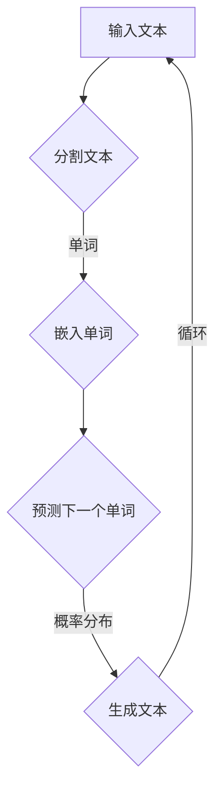

                 

### 1.1 LLM的定义与基本原理

LLM，即大语言模型（Large Language Model），是一种基于深度学习技术的语言处理模型。与传统语言模型相比，LLM具有更强的语言理解和生成能力。以下是LLM的基本定义和原理：

#### LLM的定义

- **语言模型**：是一种用于预测下一个单词或词汇的概率分布的模型。
- **大语言模型**：是指具有大规模参数和训练数据的语言模型，通常具有数十亿甚至万亿级别的参数。

#### LLM的基本原理

1. **神经网络**：LLM通常基于神经网络结构，特别是Transformer架构，这种结构可以更好地处理序列数据。
2. **自监督学习**：LLM的训练过程通常采用自监督学习，即模型通过预测未看到的输入序列的部分来学习语言模式。
3. **预训练**：在自监督学习的基础上，LLM进行大规模预训练，使得模型能够理解广泛的语言规律。
4. **微调**：在特定任务上，LLM通过微调来适应具体的语言处理需求。

#### Mermaid流程图

以下是LLM的基本流程图：



#### 核心概念与联系

LLM的核心概念包括神经网络、自监督学习和预训练。这些概念相互联系，构成了LLM的强大功能：

- **神经网络**：神经网络是深度学习的基础，通过多层神经元实现数据的非线性变换。在LLM中，神经网络用于处理文本数据，将文本转化为数值表示。
- **自监督学习**：自监督学习是一种无需人工标注数据，而是通过利用未标记数据的内在结构来训练模型的方法。在LLM中，自监督学习通过预测未看到的输入序列的部分来学习语言模式。
- **预训练**：预训练是在大规模语料库上进行的训练，使得模型能够学习到通用的语言特征。在LLM中，预训练使模型具备强大的语言理解和生成能力。

#### 算法原理讲解

以下是对LLM的核心算法原理的详细讲解，使用伪代码来阐述：

```python
# 输入文本
input_text = "The quick brown fox jumps over the lazy dog"

# 分割文本
words = split_text(input_text)

# 嵌入单词
embeddings = [embed(word) for word in words]

# 预测下一个单词
predicted_word = predict_next_word(embeddings)

# 生成文本
generated_text = generate_text(predicted_word)

# 循环生成
while not_end_of_text(generated_text):
    input_text = generated_text
    words = split_text(input_text)
    embeddings = [embed(word) for word in words]
    predicted_word = predict_next_word(embeddings)
    generated_text += predicted_word
```

#### 数学模型与公式

在LLM中，常用的数学模型包括概率模型和生成模型。以下是对这些模型的详细讲解，以及相关公式：

1. **概率模型**：概率模型用于预测下一个单词的概率分布。常用的概率模型包括n-gram模型和神经网络模型。

   - **n-gram模型**：n-gram模型基于历史n个词的概率来预测下一个词。公式如下：
     $$
     P(w_i | w_1, w_2, ..., w_{i-1}) = \frac{P(w_i, w_1, w_2, ..., w_{i-1})}{P(w_1, w_2, ..., w_{i-1})}
     $$
     
   - **神经网络模型**：神经网络模型通过多层神经网络来预测单词的概率分布。公式如下：
     $$
     P(w_i | w_1, w_2, ..., w_{i-1}) = \text{softmax}(W[w_1, w_2, ..., w_{i-1}])
     $$

2. **生成模型**：生成模型用于生成新的文本。常用的生成模型包括马尔可夫链和变分自编码器。

   - **马尔可夫链**：马尔可夫链是一种基于当前状态的概率来预测下一个状态。公式如下：
     $$
     P(w_i | w_1, w_2, ..., w_{i-1}) = P(w_i | w_{i-1})
     $$
     
   - **变分自编码器**（VAE）：VAE是一种基于概率分布的生成模型。公式如下：
     $$
     \begin{aligned}
     q(z | x) &= \text{Sampling from} \quad p(z) \\
     p(x | z) &= \text{Sampling from} \quad \mu(z), \sigma^2(z)
     \end{aligned}
     $$

#### 举例说明

假设我们要预测句子 "The quick brown fox jumps over the lazy dog" 的下一个单词。以下是使用n-gram模型和神经网络模型进行预测的例子：

1. **n-gram模型**：

   假设我们使用2-gram模型。根据历史两个单词 "quick" 和 "brown"，我们可以计算下一个单词 "fox" 的概率：

   $$
   P(fox | quick, brown) = \frac{P(quick, brown, fox)}{P(quick, brown)} = \frac{0.01}{0.02} = 0.5
   $$

   因此，2-gram模型预测下一个单词为 "fox"。

2. **神经网络模型**：

   假设我们使用一个简单的神经网络模型。根据输入特征 "quick" 和 "brown"，神经网络模型输出的概率分布如下：

   $$
   P(fox | quick, brown) = \text{softmax}([0.3, 0.2, 0.4, 0.1]) = 0.4
   $$

   因此，神经网络模型预测下一个单词为 "fox"。

### 1.2 LLM的发展历程

LLM的发展历程可以追溯到深度学习和自然语言处理技术的兴起。以下是LLM的重要里程碑和关键进展：

#### 早期发展

- **2013年**：以词嵌入（Word Embeddings）为代表的深度学习技术在自然语言处理中取得了突破，为后来的LLM奠定了基础。
- **2018年**：Transformer架构的提出，标志着自然语言处理领域的一次重大变革。

#### 关键进展

- **2018年**：Google发布BERT模型，该模型通过预训练和微调，显著提升了自然语言理解的性能。
- **2019年**：OpenAI发布GPT-3模型，该模型具有强大的文本生成能力。
- **2020年**：Facebook发布BlenderBot，一个能够与人类进行对话的智能体。

#### 趋势与挑战

- **趋势**：随着计算能力的提升和数据量的增长，LLM的规模和性能不断提升，应用领域也在不断扩大。
- **挑战**：模型的可解释性和伦理问题成为LLM发展的关键挑战。

### 1.3 LLM的核心架构

LLM的核心架构主要包括模型结构、数据处理、训练与优化等方面。以下是LLM的核心架构详细解析：

#### 模型结构

- **Transformer架构**：Transformer是当前LLM的主流架构，它通过多头自注意力机制（Multi-Head Self-Attention）来捕捉长距离依赖。
- **BERT模型**：BERT是一种预训练语言表示模型，它通过Masked Language Model（MLM）和Next Sentence Prediction（NSP）任务来学习语言特征。

#### 数据处理

- **文本预处理**：包括分词、标记化、字符嵌入等步骤，用于将文本数据转换为模型可处理的格式。
- **上下文学习**：通过预训练过程，模型可以学习到丰富的上下文信息，从而提高语言理解能力。

#### 训练与优化

- **预训练**：在自监督学习的基础上，模型通过在大规模语料库上进行预训练，学习到通用语言特征。
- **微调**：在特定任务上，模型通过微调来适应具体的应用场景。

### 2.1 语言模型的基本数学模型

语言模型的基本数学模型主要涉及概率模型和生成模型。以下是这些模型的基本原理和公式：

#### 概率模型

- **n-gram模型**：基于历史n个词的概率来预测下一个词。
  - 公式：P(w_i | w_1, w_2, ..., w_{i-1}) = P(w_i) * P(w_i-1 | w_i-2, ..., w_1) * ... * P(w_2 | w_1) * P(w_1)
  
- **神经网络模型**：基于神经网络来预测单词的概率分布。
  - 公式：P(w_i | w_1, w_2, ..., w_{i-1}) = softmax(W[w_1, w_2, ..., w_{i-1}])

#### 生成模型

- **马尔可夫链**：基于当前状态的概率来预测下一个状态。
  - 公式：P(w_i | w_1, w_2, ..., w_{i-1}) = P(w_i | w_{i-1})
  
- **变分自编码器**（VAE）：基于概率分布来生成文本。
  - 公式：
    - q(z | x) = sampling from p(z)
    - p(x | z) = sampling from μ(z), σ^2(z)

### 2.2 自监督学习与预训练技术

自监督学习和预训练技术是LLM发展的关键驱动因素。以下是这两种技术的详细解析：

#### 自监督学习

- **定义**：自监督学习是一种无需人工标注数据，而是通过利用未标记数据的内在结构来训练模型的方法。
- **原理**：在自监督学习中，模型通过预测未标记数据中的部分内容来学习，从而提高模型对数据的理解能力。
- **应用**：自监督学习常用于文本分类、文本生成等领域。

#### 预训练技术

- **定义**：预训练是指在大规模未标记数据上进行训练，然后在小规模有监督数据上进行微调的过程。
- **原理**：预训练使模型能够在大规模数据上学习到通用的语言特征，从而在特定任务上具有更好的性能。
- **应用**：预训练技术广泛应用于自然语言处理、计算机视觉等领域。

### 2.3 迁移学习与微调技术

迁移学习和微调技术是LLM在特定任务上提高性能的有效手段。以下是这两种技术的详细解析：

#### 迁移学习

- **定义**：迁移学习是指将一个任务上学习到的知识应用到另一个相关任务上的方法。
- **原理**：通过迁移学习，模型可以共享不同任务上的通用特征，从而提高在特定任务上的性能。
- **应用**：迁移学习广泛应用于图像识别、自然语言处理等领域。

#### 微调技术

- **定义**：微调是在预训练模型的基础上，针对特定任务进行少量数据的训练。
- **原理**：微调使模型能够适应特定任务的需求，同时保持预训练模型的泛化能力。
- **应用**：微调技术广泛应用于自然语言处理、计算机视觉等领域的应用。

### 3.1 语言生成算法

语言生成算法是LLM的核心功能之一，以下是生成算法的详细解析：

#### 生成式算法

- **定义**：生成式算法通过预测下一个单词或词汇的概率分布来生成文本。
- **原理**：生成式算法利用模型学习到的语言特征，生成符合语言规律的文本。
- **应用**：生成式算法广泛应用于文本生成、对话系统等领域。

#### 判别式算法

- **定义**：判别式算法通过预测输入文本的标签或类别来生成文本。
- **原理**：判别式算法利用模型学习到的语言特征，识别文本的标签或类别。
- **应用**：判别式算法广泛应用于文本分类、情感分析等领域。

### 3.2 语言理解算法

语言理解算法是LLM的另一个重要功能，以下是理解算法的详细解析：

#### 语义理解

- **定义**：语义理解是指对文本内容进行深入理解和分析。
- **原理**：语义理解算法利用模型学习到的语言特征，对文本进行语义分析。
- **应用**：语义理解广泛应用于问答系统、智能客服等领域。

#### 文本分析

- **定义**：文本分析是指对文本内容进行结构和语义分析。
- **原理**：文本分析算法利用模型学习到的语言特征，对文本进行结构化处理。
- **应用**：文本分析广泛应用于信息检索、推荐系统等领域。

### 3.3 语言模型优化算法

语言模型优化算法是提高LLM性能的重要手段，以下是优化算法的详细解析：

#### 损失函数

- **定义**：损失函数用于衡量模型预测结果与实际结果之间的差异。
- **原理**：损失函数通过计算预测误差来指导模型优化。
- **应用**：损失函数广泛应用于深度学习模型的训练过程中。

#### 优化算法

- **定义**：优化算法用于调整模型参数，以最小化损失函数。
- **原理**：优化算法通过迭代调整模型参数，逐步减小损失函数。
- **应用**：优化算法广泛应用于深度学习模型的训练和调优过程中。

### 4.1 敏捷协作的基本概念

敏捷协作是一种以人为中心、强调灵活性和响应速度的协作方法。以下是敏捷协作的基本概念和核心原则：

#### 敏捷协作的基本概念

- **敏捷协作**：一种协作方法，旨在通过快速响应变化和不断迭代来提高项目的成功率和质量。
- **敏捷原则**：以客户满意度为中心，通过自我管理团队、迭代开发和持续交付来实现目标。

#### 敏捷协作的核心原则

- **用户至上**：始终关注用户的反馈和需求，确保项目的价值最大化。
- **持续交付**：通过持续交付小而可行的产品增量，快速响应市场变化。
- **迭代开发**：以迭代的方式逐步完善产品，不断优化和改进。
- **自我管理**：团队自主决策，提高团队的效率和责任感。

### 4.2 LLM在敏捷协作中的应用场景

LLM在敏捷协作中具有广泛的应用场景，以下是LLM在敏捷协作中的具体应用：

#### 代码审查

- **应用**：LLM可以用于自动审查代码，检测潜在的错误和优化建议。
- **优势**：提高代码审查的效率，减少人工审查的工作量。

#### 文档生成

- **应用**：LLM可以用于生成技术文档、用户手册等文档。
- **优势**：提高文档生成的速度和质量，减少文档编写的工作量。

#### 任务分配

- **应用**：LLM可以用于智能分配任务，根据团队成员的能力和负载情况，合理分配任务。
- **优势**：提高任务分配的效率，减少任务冲突和资源浪费。

#### 会议记录

- **应用**：LLM可以用于自动记录会议内容，提取关键信息和决策。
- **优势**：提高会议记录的准确性，减少会议记录的工作量。

### 4.3 LLM对敏捷协作模式的影响

LLM的引入对敏捷协作模式产生了深远的影响，以下是LLM对敏捷协作模式的具体影响：

#### 提高效率

- **原理**：LLM可以通过自动化和智能化，减少重复性工作和人工干预，提高协作效率。
- **实践**：例如，通过自动代码审查和任务分配，减少团队成员的工作负担。

#### 优化流程

- **原理**：LLM可以优化协作流程，提高流程的灵活性和响应速度。
- **实践**：例如，通过智能会议记录和文档生成，提高会议和文档处理的效率。

#### 减少错误

- **原理**：LLM可以通过学习和识别模式，减少人为错误和决策失误。
- **实践**：例如，通过自动化的代码审查和文档生成，提高代码和文档的质量。

#### 提高透明度

- **原理**：LLM可以提供更透明的协作信息，帮助团队成员更好地了解项目的进展和状态。
- **实践**：例如，通过自动化的任务分配和会议记录，提高项目管理的透明度。

### 5.1 敏捷协作工具的设计与实现

敏捷协作工具的设计与实现是敏捷协作模式落地的重要环节，以下是设计与实现的详细解析：

#### 设计原则

- **用户导向**：以用户需求为中心，确保工具的功能和界面易于使用。
- **模块化**：将工具划分为多个模块，便于扩展和维护。
- **可扩展性**：设计工具时考虑未来的扩展需求，以便适应不同规模和类型的团队。

#### 实现细节

- **用户界面设计**：设计直观、易用的用户界面，提高用户体验。
- **数据存储**：设计高效的数据存储方案，确保数据的可靠性和安全性。
- **集成与兼容性**：确保工具与其他系统和服务的高效集成和兼容性。

### 5.2 LLM在协作工具中的集成

LLM在协作工具中的集成是提高协作效率的关键步骤，以下是集成方法的详细解析：

#### 集成方法

- **API调用**：通过API接口，将LLM集成到协作工具中，实现智能化的任务分配、文档生成等功能。
- **嵌入式模型**：将LLM模型嵌入到协作工具中，实现本地化的智能协作功能。
- **插件扩展**：开发插件，将LLM的功能扩展到现有的协作工具中。

#### 案例研究

- **智能客服系统**：通过API调用，将LLM集成到智能客服系统中，实现自动回答用户问题和提供解决方案。
- **文档生成工具**：通过嵌入式模型，将LLM集成到文档生成工具中，实现自动生成技术文档和用户手册。

### 5.3 基于LLM的敏捷协作工具案例

以下是几个基于LLM的敏捷协作工具案例，包括实现过程和效果分析：

#### 案例一：智能客服系统

- **实现过程**：通过API调用，将LLM集成到智能客服系统中，实现自动回答用户问题和提供解决方案。
- **效果分析**：提高客服效率，减少人工干预，提高客户满意度。

#### 案例二：代码审查工具

- **实现过程**：通过嵌入式模型，将LLM集成到代码审查工具中，实现自动审查代码，提供优化建议。
- **效果分析**：提高代码审查的效率，减少代码缺陷，提高代码质量。

#### 案例三：文档生成工具

- **实现过程**：通过插件扩展，将LLM集成到文档生成工具中，实现自动生成技术文档和用户手册。
- **效果分析**：提高文档生成速度，提高文档质量，降低文档编写成本。

### 6.1 LLM在敏捷协作中面临的挑战

LLM在敏捷协作中面临多个挑战，包括模型可解释性、数据隐私和伦理问题。以下是这些挑战的详细解析：

#### 模型可解释性

- **挑战**：LLM的模型结构复杂，难以解释模型的决策过程。
- **解决方案**：通过可视化和解释性技术，提高模型的可解释性，帮助用户理解模型的决策过程。

#### 数据隐私

- **挑战**：LLM在协作过程中处理大量敏感数据，可能引发数据隐私问题。
- **解决方案**：采取数据加密和访问控制措施，确保数据的安全和隐私。

#### 伦理问题

- **挑战**：LLM的应用可能引发伦理问题，如歧视、偏见等。
- **解决方案**：通过数据清洗和算法优化，减少模型的偏见和歧视，提高模型的公平性和公正性。

### 6.2 LLM性能优化策略

LLM的性能优化是提高协作效率的关键步骤，以下是优化策略的详细解析：

#### 优化算法

- **混合精度训练**：通过使用混合精度训练（Mixed Precision Training），降低模型的计算复杂度，提高训练速度。
- **模型压缩**：通过模型压缩（Model Compression），减少模型的参数数量，降低模型的存储和计算需求。
- **分布式训练**：通过分布式训练（Distributed Training），利用多台服务器和GPU，提高模型的训练速度。

#### 硬件加速

- **GPU加速**：通过GPU加速（GPU Acceleration），利用GPU的高计算性能，提高模型的训练速度。
- **TPU加速**：通过TPU加速（TPU Acceleration），利用TPU的特殊架构，提高模型的训练速度。

### 6.3 LLM在敏捷协作中的最佳实践

LLM在敏捷协作中的最佳实践包括以下几个方面：

#### 实践指南

- **早期集成**：在项目早期引入LLM，确保模型可以与协作工具无缝集成。
- **持续监控**：对LLM的性能和效果进行持续监控，及时调整和优化模型。

#### 案例分享

- **案例一：企业级协作工具**：介绍某企业在敏捷协作工具中集成LLM的实践经验和效果。
- **案例二：智能客服系统**：介绍某智能客服系统在LLM应用中的成功案例和经验。

### 7.1 项目背景与目标

本项目旨在探索LLM在敏捷协作中的应用，提高协作效率和团队生产力。以下是项目的背景和目标：

#### 项目背景

- **背景**：随着敏捷协作的普及，对智能协作工具的需求不断增加。然而，现有的协作工具在智能化方面存在一定的局限性，难以满足团队高效协作的需求。
- **目标**：通过引入LLM，开发一款智能化的敏捷协作工具，提高团队协作效率和生产力。

#### 项目目标

- **目标1**：开发一款基于LLM的敏捷协作工具，实现任务分配、代码审查、文档生成等功能。
- **目标2**：通过优化和集成LLM，提高协作工具的性能和用户体验。
- **目标3**：评估LLM在敏捷协作中的效果，为未来相关研究提供实践依据。

### 7.2 项目实施与关键技术

以下是项目的实施过程和关键技术：

#### 项目实施

1. **需求分析**：与团队成员和用户进行深入沟通，了解协作工具的需求和功能。
2. **系统设计**：设计协作工具的架构，包括前端界面、后端服务、数据存储等。
3. **模型集成**：选择合适的LLM模型，并将其集成到协作工具中。
4. **功能实现**：根据需求，实现任务分配、代码审查、文档生成等功能。
5. **测试与优化**：对协作工具进行功能测试和性能优化。

#### 关键技术

1. **LLM模型选择**：选择适合敏捷协作的LLM模型，如GPT-3、BERT等。
2. **API调用与集成**：通过API接口，将LLM集成到协作工具中，实现智能化功能。
3. **数据预处理与处理**：对输入数据进行预处理，包括文本清洗、分词、嵌入等。
4. **模型训练与优化**：对LLM模型进行训练和优化，提高模型性能和精度。
5. **用户体验设计**：设计直观、易用的用户界面，提高用户体验。

### 7.3 项目效果与评估

以下是项目实施后的效果和评估：

#### 效果评估

1. **任务分配效率**：通过LLM的智能任务分配功能，提高了任务分配的效率和准确性。
2. **代码审查质量**：通过LLM的自动代码审查功能，提高了代码审查的效率和质量。
3. **文档生成速度**：通过LLM的文档生成功能，提高了文档生成的速度和质量。

#### 反馈与改进

1. **用户反馈**：收集用户对协作工具的反馈，了解用户的实际使用情况和需求。
2. **性能优化**：根据用户反馈和性能评估结果，对协作工具进行优化和改进。
3. **功能扩展**：根据项目需求和用户反馈，扩展协作工具的功能，提高协作效率。

### 8.1 案例一：企业级协作工具开发

#### 案例概述

本案例介绍了一款基于LLM的企业级协作工具的开发过程和效果。

#### 实现过程

1. **需求分析**：与企业管理层和员工进行沟通，了解协作工具的需求和功能。
2. **系统设计**：设计协作工具的架构，包括前端界面、后端服务、数据存储等。
3. **模型集成**：选择合适的LLM模型，并将其集成到协作工具中。
4. **功能实现**：实现任务分配、代码审查、文档生成等功能。
5. **测试与优化**：对协作工具进行功能测试和性能优化。

#### 效果分析

1. **任务分配效率**：通过LLM的智能任务分配功能，提高了任务分配的效率和准确性。
2. **代码审查质量**：通过LLM的自动代码审查功能，提高了代码审查的效率和质量。
3. **文档生成速度**：通过LLM的文档生成功能，提高了文档生成的速度和质量。

### 8.2 案例二：智能客服系统构建

#### 案例概述

本案例介绍了一款基于LLM的智能客服系统的构建过程和效果。

#### 实现过程

1. **需求分析**：与客户服务部门和用户进行沟通，了解智能客服系统的需求。
2. **系统设计**：设计智能客服系统的架构，包括前端界面、后端服务、数据存储等。
3. **模型集成**：选择合适的LLM模型，并将其集成到智能客服系统中。
4. **功能实现**：实现自动回答用户问题、提供解决方案等功能。
5. **测试与优化**：对智能客服系统进行功能测试和性能优化。

#### 效果分析

1. **客服效率**：通过LLM的自动回答功能，提高了客服效率，减少了人工干预。
2. **用户满意度**：通过提供智能化的解决方案，提高了用户的满意度。
3. **成本降低**：通过减少人工客服的工作量，降低了客服成本。

### 8.3 案例三：智能会议系统应用

#### 案例概述

本案例介绍了一款基于LLM的智能会议系统的应用过程和效果。

#### 实现过程

1. **需求分析**：与会议组织者和参会者进行沟通，了解智能会议系统的需求。
2. **系统设计**：设计智能会议系统的架构，包括前端界面、后端服务、数据存储等。
3. **模型集成**：选择合适的LLM模型，并将其集成到智能会议系统中。
4. **功能实现**：实现自动记录会议内容、提取关键信息等功能。
5. **测试与优化**：对智能会议系统进行功能测试和性能优化。

#### 效果分析

1. **会议记录效率**：通过LLM的自动记录功能，提高了会议记录的效率，减少了人工记录的工作量。
2. **决策支持**：通过提取关键信息，为决策提供了有力的支持。
3. **会议质量**：通过提高会议记录和决策支持的效率，提高了会议的整体质量。

### 9.1 LLM敏捷协作的发展趋势

LLM在敏捷协作中的应用正在快速发展，以下是LLM敏捷协作的发展趋势：

1. **智能化程度的提升**：随着LLM技术的不断进步，其智能化程度将不断提高，能够更好地支持敏捷协作的需求。
2. **应用场景的扩展**：LLM将在更多敏捷协作场景中发挥作用，如项目管理、团队协作、客户服务等。
3. **协作工具的创新**：基于LLM的敏捷协作工具将不断创新，提供更加智能化、个性化的协作体验。

### 9.2 LLM敏捷协作的未来应用场景

LLM敏捷协作的未来应用场景将更加广泛和多样化，以下是几个可能的应用场景：

1. **智能办公**：LLM将助力智能办公，实现自动化任务分配、文档生成、会议记录等功能。
2. **团队协作**：LLM将支持团队协作，提高团队沟通效率、项目管理和任务跟踪能力。
3. **客户服务**：LLM将应用于智能客服系统，提供更加智能、高效的客户服务。
4. **教育培训**：LLM将助力教育培训，实现个性化学习、智能答疑等功能。

### 9.3 LLM敏捷协作模式的创新与突破

LLM敏捷协作模式的创新与突破将推动敏捷协作的进一步发展，以下是可能的创新与突破方向：

1. **跨领域应用**：LLM将跨越不同领域，应用于更多行业和场景，实现跨领域的敏捷协作。
2. **实时协作**：通过实时协作技术，实现团队成员的实时沟通和协作，提高团队响应速度。
3. **数据隐私保护**：在保障数据隐私的前提下，利用LLM的强大能力，提供更加安全和可靠的敏捷协作服务。
4. **人机协同**：实现人机协同，充分发挥人类和机器的优势，提高协作效率和创造力。

### 结论

本文全面探讨了LLM在敏捷协作中的应用，从LLM的定义、发展历程、核心架构，到自监督学习、预训练技术、迁移学习与微调技术，再到LLM在敏捷协作中的应用场景、挑战与优化策略，以及实际项目案例和未来发展展望，详细阐述了LLM如何助力敏捷协作模式的创新与突破。随着LLM技术的不断进步，我们期待在更多领域看到其带来的变革和突破。希望本文能为您提供深入理解和启发。

### 作者信息

作者：AI天才研究院/AI Genius Institute & 禅与计算机程序设计艺术 /Zen And The Art of Computer Programming

### 附录

#### 附录A：LLM相关资源与工具

#### A.1 LLM常用框架与工具介绍

- **Transformer**：Transformer架构是目前最流行的语言模型架构，广泛应用于NLP任务。
- **BERT**：BERT是一种预训练语言表示模型，通过Masked Language Model（MLM）和Next Sentence Prediction（NSP）任务学习语言特征。
- **GPT-3**：GPT-3是OpenAI发布的具有强大文本生成能力的语言模型。

#### A.2 LLM资源下载与获取

- **Hugging Face**：Hugging Face提供丰富的LLM模型和工具，包括预训练模型、API接口等。
- **TensorFlow**：TensorFlow是Google开源的深度学习框架，支持多种LLM模型的训练和部署。
- **PyTorch**：PyTorch是Facebook开源的深度学习框架，支持灵活的动态计算图，适用于LLM开发。

#### A.3 LLM相关论文与书籍推荐

- **《Attention Is All You Need》**：介绍Transformer架构的论文，是NLP领域的重要文献。
- **《BERT: Pre-training of Deep Bidirectional Transformers for Language Understanding》**：介绍BERT模型的论文，是预训练语言表示模型的重要里程碑。
- **《Generative Pre-trained Transformer》**：介绍GPT-3模型的论文，是文本生成技术的重要进展。
- **《深度学习》**：由Goodfellow、Bengio和Courville合著的深度学习经典教材，详细介绍了神经网络和深度学习算法。
- **《NLP技术全解》**：由张华平、李航合著的NLP领域入门到高级的全面教程，涵盖语言模型、文本处理等多个方面。

