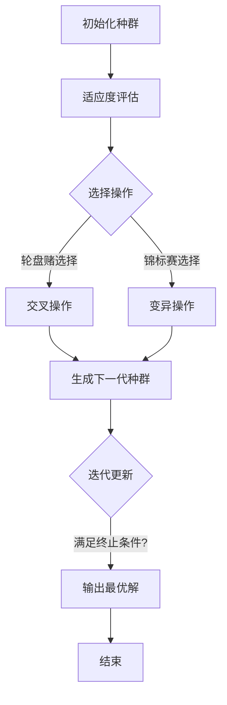
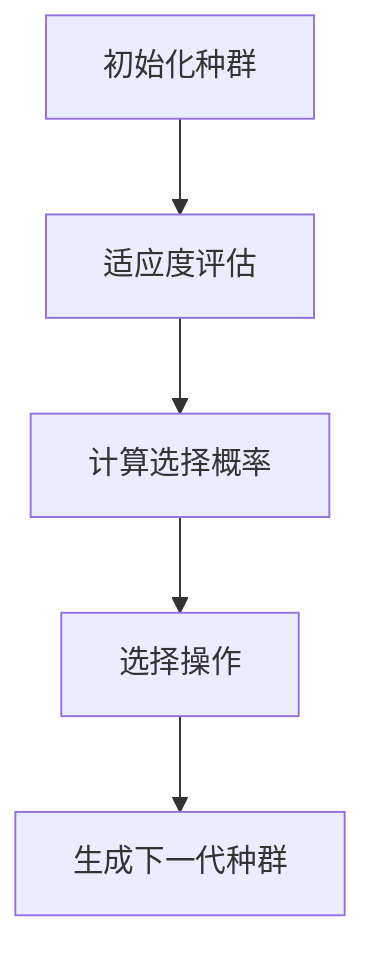
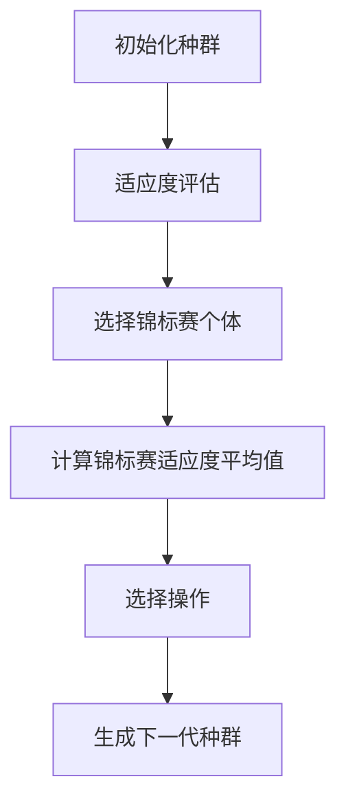
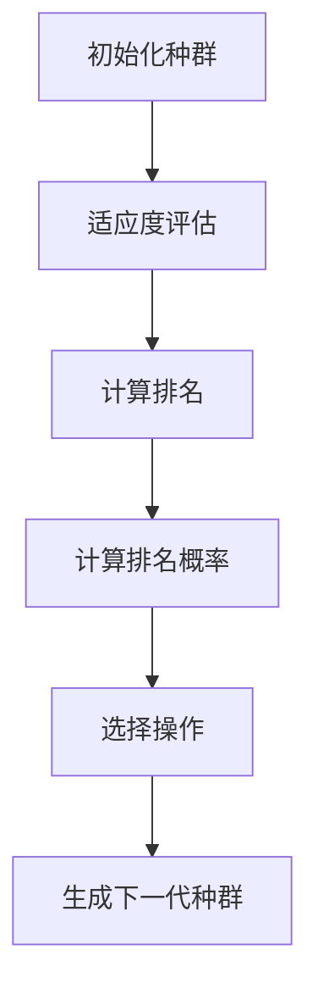
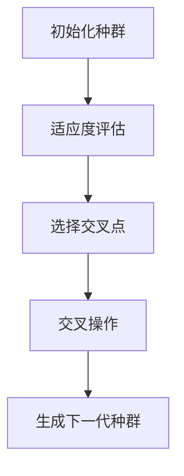
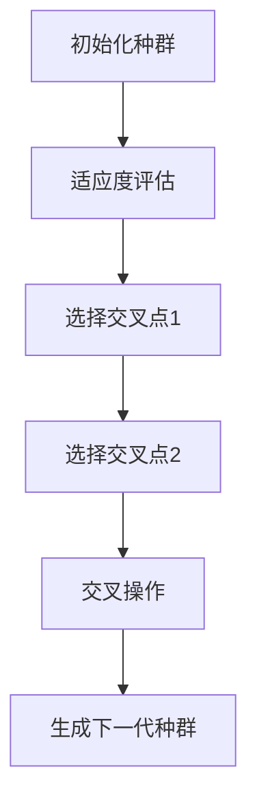
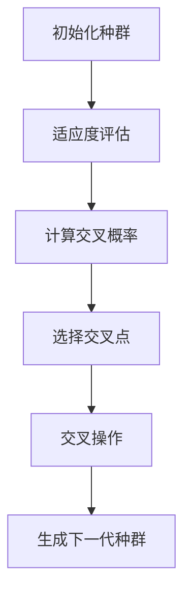
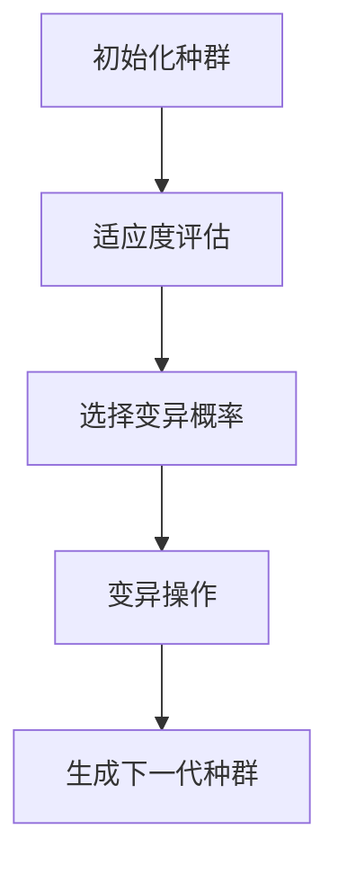

                 

# 遗传算法的优化策略与实现方法

> 关键词：遗传算法、优化策略、实现方法、种群多样性、收敛速度、动态调整、项目实战、应用领域、未来发展趋势

> 摘要：本文将深入探讨遗传算法的优化策略与实现方法。首先，我们将介绍遗传算法的基础理论，包括其起源、基本原理和数学模型。接着，我们将详细讲解遗传算法的核心概念和算法原理，并通过具体的伪代码展示其操作过程。随后，我们将探讨遗传算法的优化策略，包括种群多样性维护和收敛速度优化。在此基础上，我们将通过一个实际项目来展示遗传算法的应用和实现。最后，我们将分析遗传算法的应用领域和未来发展趋势，并总结文章的主要内容。

## 第一部分：遗传算法基础理论

### 第1章：遗传算法概述

#### 1.1.1 遗传算法的起源与发展

遗传算法（Genetic Algorithm，GA）起源于20世纪60年代，由美国计算机科学家约翰·霍兰（John H. Holland）提出。霍兰受到达尔文进化论和自然选择的启发，尝试将生物进化的原理应用于求解复杂优化问题。遗传算法的核心思想是通过模拟生物进化的过程，即自然选择、遗传和变异，来寻找最优解。

遗传算法的发展历程可以分为几个阶段：

1. **早期研究**：20世纪60年代，霍兰开始研究遗传算法，并在70年代初提出了第一个遗传算法模型——通用遗传算法（Universal Genetic Algorithm）。
2. **初期应用**：20世纪70年代，遗传算法在组合优化、调度问题和控制工程等领域得到了初步应用。
3. **快速发展**：20世纪80年代，遗传算法在计算机科学、人工智能和工程领域得到了广泛关注和应用。许多改进版本的遗传算法被提出，如并行遗传算法、多目标遗传算法等。
4. **成熟应用**：20世纪90年代至今，遗传算法在生物信息学、经济学、社会网络分析和金融工程等领域得到了广泛应用，并成为求解复杂优化问题的重要工具。

#### 1.1.2 遗传算法与传统优化算法的比较

遗传算法与传统优化算法（如梯度下降法、牛顿法等）在原理和求解策略上有所不同。传统优化算法主要依赖于问题本身的数学模型，通过求解导数、二次项等信息来逐步逼近最优解。而遗传算法则通过模拟生物进化的过程来寻找最优解，具有更强的鲁棒性和全局搜索能力。

以下是遗传算法与传统优化算法的对比：

1. **原理**：传统优化算法依赖于问题本身的数学模型，通过求解导数、二次项等信息来逐步逼近最优解。遗传算法则通过模拟生物进化的过程，如自然选择、遗传和变异，来寻找最优解。
2. **搜索策略**：传统优化算法主要采用局部搜索策略，容易陷入局部最优解。遗传算法采用全局搜索策略，通过种群之间的竞争和合作来不断优化解的空间。
3. **适用范围**：传统优化算法适用于结构清晰、数学模型明确的优化问题。遗传算法适用于复杂、非线性和不可导的问题，如组合优化、调度问题和神经网络训练等。

#### 1.1.3 遗传算法的适用范围

遗传算法具有广泛的适用范围，可以用于求解各种复杂优化问题。以下是一些典型的应用场景：

1. **组合优化问题**：如旅行商问题（TSP）、装箱问题（Knapsack Problem）和图形着色问题（Graph Coloring Problem）等。
2. **调度问题**：如作业调度、生产调度和物流调度等。
3. **神经网络训练**：遗传算法可以用于神经网络的权重和结构优化，从而提高网络的性能和泛化能力。
4. **控制工程**：遗传算法可以用于参数优化、控制器设计和自适应控制等。
5. **工程优化**：如结构优化、电路设计和机械设计等。
6. **生物信息学**：遗传算法可以用于序列比对、基因识别和药物设计等。

### 第2章：遗传算法的基本原理

#### 1.2.1 自然选择原理

自然选择是遗传算法的核心原理之一，其基本思想是“适者生存，优胜劣汰”。在遗传算法中，个体代表了解空间中的解，适应度函数则用来评估个体的优劣程度。适应度值高的个体有更高的概率被选中，从而继承其基因信息。通过反复迭代，种群中的个体逐渐进化，最终找到最优解。

自然选择原理可以分为以下几个步骤：

1. **适应度评估**：通过适应度函数对种群中的每个个体进行评估，计算其适应度值。
2. **选择操作**：根据适应度值选择适应度较高的个体，组成下一代种群。
3. **交叉操作**：通过交叉操作，将选中个体的基因信息进行交换，产生新的个体。
4. **变异操作**：对新一代种群中的个体进行变异操作，增加种群的多样性。
5. **迭代更新**：将新一代种群作为当前种群，重复上述步骤，直到满足终止条件。

#### 1.2.2 自然遗传学基本原理

遗传算法受到自然遗传学基本原理的启发，主要包括以下三个方面：

1. **基因**：基因是遗传信息的基本单位，决定了个体的特征和性状。在遗传算法中，个体的特征和性状由编码表示，如二进制编码、实数编码等。
2. **遗传**：遗传是指基因在繁殖过程中的传递。在遗传算法中，通过交叉操作将选中个体的基因信息进行交换，产生新的个体。
3. **变异**：变异是指基因在繁殖过程中的随机变化。在遗传算法中，通过变异操作增加种群的多样性，避免陷入局部最优解。

#### 1.2.3 遗传算法的核心概念

遗传算法具有以下几个核心概念：

1. **个体**：个体是遗传算法的基本单位，代表了解空间中的一个解。个体通常由编码表示，如二进制编码、实数编码等。
2. **种群**：种群是由多个个体组成的集合，代表了问题的解空间。种群的大小和多样性决定了遗传算法的搜索能力和收敛速度。
3. **适应度函数**：适应度函数是用来评估个体优劣的指标，通常与问题的目标函数相关。适应度值越高的个体表示其解越优。
4. **选择操作**：选择操作是根据适应度值选择适应度较高的个体，用于组成下一代种群。
5. **交叉操作**：交叉操作是通过对选中个体的基因信息进行交换，产生新的个体。
6. **变异操作**：变异操作是对新一代种群中的个体进行随机变异，增加种群的多样性。
7. **终止条件**：终止条件是遗传算法的迭代终止条件，通常包括最大迭代次数、适应度阈值等。

### 第3章：遗传算法的数学模型

#### 1.3.1 问题建模

遗传算法的数学模型首先需要对优化问题进行建模。这包括确定问题的目标函数、约束条件和变量。具体步骤如下：

1. **确定目标函数**：目标函数是优化问题的核心，用来评估个体的优劣程度。遗传算法通过优化目标函数来寻找最优解。
2. **确定约束条件**：约束条件是问题的限制条件，包括等式约束和不等式约束。遗传算法需要满足这些约束条件，以保证解的可行性。
3. **确定变量**：变量是问题的决策变量，用来表示个体的编码。变量的取值范围决定了问题的解空间。

#### 1.3.2 遗传操作

遗传操作是遗传算法的核心，包括选择操作、交叉操作和变异操作。这些操作通过模拟自然选择和遗传过程，对种群进行迭代优化。

1. **选择操作**：选择操作是根据个体的适应度值来选择适应度较高的个体。常用的选择方法有轮盘赌选择、锦标赛选择和排名选择等。
2. **交叉操作**：交叉操作是通过交换个体的基因信息，产生新的个体。交叉操作可以增强种群的多样性，避免陷入局部最优解。常用的交叉方法有单点交叉、两点交叉和均匀交叉等。
3. **变异操作**：变异操作是对个体的基因信息进行随机变异，增加种群的多样性。变异操作可以避免种群过早收敛，提高搜索能力。常用的变异方法有位变异、数值变异和结构变异等。

#### 1.3.3 选择操作

选择操作是遗传算法中最基本的操作之一，其目的是从当前种群中选择适应度较高的个体，用于生成下一代种群。选择操作的方法有多种，以下是几种常用的选择方法：

1. **轮盘赌选择**：轮盘赌选择是一种基于概率的选择方法，每个个体被选中的概率与其适应度值成比例。适应度值较高的个体被选中的概率较大，从而保证了种群的多样性。
2. **锦标赛选择**：锦标赛选择是一种基于比赛的选择方法，从种群中随机选择几个个体进行比赛，获胜者被选中。这种方法可以提高种群的多样性，同时避免了适应性欺骗问题。
3. **排名选择**：排名选择是一种基于排名的选择方法，根据个体的适应度值对种群进行排序，选择排名靠前的个体。这种方法简单有效，但容易导致种群多样性的丧失。

#### 1.3.4 交叉操作

交叉操作是遗传算法中最常用的操作之一，其目的是通过交换个体的基因信息，产生新的个体。交叉操作可以增强种群的多样性，避免陷入局部最优解。以下是几种常用的交叉方法：

1. **单点交叉**：单点交叉是在个体的编码序列中随机选择一个交叉点，将交叉点后面的基因信息进行交换。这种方法简单有效，但可能导致交叉点的选择过于集中。
2. **两点交叉**：两点交叉是在个体的编码序列中随机选择两个交叉点，将这两个交叉点之间的基因信息进行交换。这种方法可以增强种群的多样性，但计算复杂度较高。
3. **均匀交叉**：均匀交叉是一种基于概率的交叉方法，对于个体的每个基因位，以一定的概率进行交叉。这种方法可以保证交叉的均匀性，但可能导致交叉的概率过于分散。

#### 1.3.5 变异操作

变异操作是遗传算法中用于增加种群多样性的重要操作。变异操作通过随机改变个体的基因信息，从而产生新的个体。以下是几种常用的变异方法：

1. **位变异**：位变异是对个体的二进制编码进行操作，随机选择一个或多个基因位，将其取反。这种方法简单有效，但容易导致个体适应度的下降。
2. **数值变异**：数值变异是对个体的实数编码进行操作，随机选择一个或多个基因位，对其进行小范围的随机扰动。这种方法可以增强个体的适应度，但可能导致个体偏离最优解。
3. **结构变异**：结构变异是对个体的结构进行操作，如插入、删除或替换基因。这种方法可以产生更具有代表性的个体，但计算复杂度较高。

#### 1.3.6 遗传算法的架构设计

遗传算法的架构设计是保证其有效性和鲁棒性的关键。以下是遗传算法的架构设计：

1. **初始化种群**：首先，需要初始化一个种群，种群的大小和初始分布决定了遗传算法的搜索能力和收敛速度。常用的初始化方法有随机初始化和均匀初始化等。
2. **适应度评估**：通过适应度函数对种群中的每个个体进行评估，计算其适应度值。适应度值用于选择操作和交叉操作，决定了个体的优劣程度。
3. **选择操作**：根据适应度值选择适应度较高的个体，用于生成下一代种群。选择操作可以保证种群中的优良个体被保留和扩展。
4. **交叉操作**：通过交叉操作，将选中个体的基因信息进行交换，产生新的个体。交叉操作可以增强种群的多样性和搜索能力。
5. **变异操作**：对新一代种群中的个体进行变异操作，增加种群的多样性。变异操作可以避免种群过早收敛，提高搜索能力。
6. **迭代更新**：将新一代种群作为当前种群，重复上述步骤，直到满足终止条件。终止条件可以是最大迭代次数、适应度阈值等。
7. **输出最优解**：在遗传算法的运行过程中，可以记录当前种群中的最优解，并在迭代结束后输出最优解。

#### 1.3.7 遗传算法的并行性

遗传算法具有良好的并行性，可以在多处理器或分布式系统中进行并行计算，从而提高计算效率和搜索能力。以下是遗传算法的并行性设计：

1. **种群划分**：将种群划分为多个子种群，每个子种群在一个处理器或计算节点上独立运行。这样可以充分利用并行计算的优势，提高计算速度。
2. **选择操作**：在并行计算中，可以选择部分子种群进行选择操作，然后合并结果，生成下一代种群。这样可以减少通信开销，提高并行度。
3. **交叉操作**：在并行计算中，可以选择部分子种群进行交叉操作，然后合并结果，生成下一代种群。这样可以减少交叉操作的通信开销，提高并行度。
4. **变异操作**：在并行计算中，可以对每个子种群进行独立的变异操作，然后合并结果，生成下一代种群。这样可以减少变异操作的通信开销，提高并行度。

#### 1.3.8 遗传算法的优化策略

遗传算法的优化策略是指通过调整算法的参数和操作过程，提高算法的搜索能力和收敛速度。以下是几种常见的优化策略：

1. **种群多样性维护**：种群多样性是遗传算法的重要特征，可以增强算法的搜索能力和收敛速度。常见的维护方法有变异率调整、适应度共享和动态调整等。
2. **收敛速度优化**：收敛速度是遗传算法的重要指标，可以通过调整选择压力、交叉率和变异率等参数来优化收敛速度。常用的方法有自适应调整、动态调整和混合算法等。
3. **自适应调整**：自适应调整是指根据当前种群的状态和性能，动态调整算法的参数。这种方法可以根据问题的变化自适应地调整算法的搜索策略。
4. **混合算法**：混合算法是将遗传算法与其他优化算法（如模拟退火算法、粒子群优化算法等）相结合，形成新的优化算法。这种方法可以充分利用不同算法的优点，提高优化效果。

### 第4章：遗传算法的核心概念与联系

#### 2.1 遗传算法的 Mermaid 流程图

遗传算法的流程图可以用 Mermaid 语言进行绘制，以下是遗传算法的 Mermaid 流程图：



#### 2.2 遗传算法与相关算法的联系

遗传算法与其他优化算法有着密切的联系，以下是遗传算法与几种常见优化算法的联系：

1. **模拟退火算法**：模拟退火算法是一种基于物理退火过程的优化算法，与遗传算法有相似之处。模拟退火算法通过接受较差的解来增加种群的多样性，避免陷入局部最优解。遗传算法和模拟退火算法可以结合，形成混合算法，以提高优化效果。
2. **粒子群优化算法**：粒子群优化算法是一种基于群体智能的优化算法，类似于遗传算法。粒子群优化算法通过个体的位置和速度更新来搜索最优解，可以引入遗传算法的交叉和变异操作，形成混合粒子群优化算法。
3. **蚁群算法**：蚁群算法是一种基于蚂蚁觅食行为的优化算法，与遗传算法有相似之处。蚁群算法通过个体间的信息传递来搜索最优解，可以引入遗传算法的交叉和变异操作，形成混合蚁群优化算法。

### 第5章：遗传算法的数学模型和数学公式

#### 3.1 数学模型

遗传算法的数学模型主要包括以下三个方面：

1. **问题建模**：根据优化问题的目标函数和约束条件，构建问题的数学模型。目标函数用来评估个体的优劣程度，约束条件用来限制个体的取值范围。
2. **编码方式**：个体是遗传算法的基本单位，需要通过编码方式来表示个体的特征和性状。常见的编码方式有二进制编码、实数编码、顺序编码等。
3. **遗传操作**：遗传操作包括选择操作、交叉操作和变异操作。选择操作用来从当前种群中选择适应度较高的个体，交叉操作用来交换个体的基因信息，变异操作用来增加种群的多样性。

#### 3.2 数学公式

遗传算法的数学公式主要包括适应度函数、交叉概率、变异概率等。

1. **适应度函数**：适应度函数是用来评估个体优劣的指标，通常与问题的目标函数相关。一种常用的适应度函数如下：

   $$ f(x) = \frac{1}{1 + \exp(-k(x - x^*)}) $$

   其中，$k$ 是调节参数，$x$ 是个体，$x^*$ 是最优解。

2. **交叉概率**：交叉概率是遗传算法中用来控制交叉操作发生概率的参数。一种常用的交叉概率计算公式如下：

   $$ p_c = \frac{1}{\sum_{i=1}^n f(x_i)} $$

   其中，$p_c$ 是交叉概率，$f(x_i)$ 是第 $i$ 个个体的适应度值。

3. **变异概率**：变异概率是遗传算法中用来控制变异操作发生概率的参数。一种常用的变异概率计算公式如下：

   $$ p_m = \frac{1}{n} $$

   其中，$p_m$ 是变异概率，$n$ 是种群大小。

#### 3.3 举例说明

为了更好地理解遗传算法的数学模型和数学公式，下面通过一个简单的示例来说明。

假设我们求解一个最大化问题，目标函数为：

$$ f(x) = x_1^2 + x_2^2 $$

其中，$x_1$ 和 $x_2$ 是个体的两个特征。我们采用二进制编码方式，个体长度为4位。

1. **初始化种群**：假设我们初始化一个包含10个个体的种群，个体表示为二进制编码：

   $$ \{0110, 1001, 1011, 1100, 0101, 0111, 1000, 1010, 1101, 0001\} $$

2. **适应度评估**：计算每个个体的适应度值，采用上述适应度函数：

   $$ f(x_1) = \frac{1}{1 + \exp(-k(x_1 - x_1^*)}) = \frac{1}{1 + \exp(-k(1 - 0.5))} \approx 0.732 $$
   $$ f(x_2) = \frac{1}{1 + \exp(-k(x_2 - x_2^*)}) = \frac{1}{1 + \exp(-k(1 - 0.5))} \approx 0.732 $$

   其中，$x_1^*$ 和 $x_2^*$ 分别为最优解。

3. **选择操作**：根据适应度值，选择适应度较高的个体进行交叉操作。假设选择概率为0.5，则选择以下两个个体进行交叉：

   $$ \{0110, 1001\} $$

4. **交叉操作**：采用单点交叉方法，在个体的第2位进行交叉：

   $$ \{0110, 1001\} \rightarrow \{0111, 1000\} $$

5. **变异操作**：对交叉后产生的新个体进行变异操作。假设变异概率为0.1，则对以下两个新个体进行变异：

   $$ \{0111, 1000\} \rightarrow \{0110, 1001\} $$

6. **迭代更新**：将变异后的个体加入种群，重新进行适应度评估、选择操作、交叉操作和变异操作，直到满足终止条件。

通过这个简单的示例，我们可以看到遗传算法的数学模型和数学公式的应用。在实际应用中，可以根据具体问题的需求和特点，调整适应度函数、交叉概率和变异概率等参数，以获得更好的优化效果。

### 第6章：遗传算法的核心算法原理讲解

遗传算法的核心算法原理包括选择操作、交叉操作和变异操作，这些操作通过模拟生物进化的过程来寻找最优解。在本节中，我们将通过具体的伪代码来详细阐述这些操作的实现过程。

#### 6.1 选择操作

选择操作是遗传算法中最基本的操作之一，其目的是从当前种群中选择适应度较高的个体，用于生成下一代种群。选择操作的方法有多种，以下是三种常用的选择方法：

1. **轮盘赌选择**



伪代码：

```
种群 size = N
适应度值数组 fitness[]
选择概率数组 probability[]

for i = 1 to N do
    fitness[i] = 计算适应度函数值(种群[i])
end for

for i = 1 to N do
    probability[i] = fitness[i] / sum(fitness)
end for

for i = 1 to N do
    下一代种群[i] = 随机选择一个个体
end for
```

2. **锦标赛选择**



伪代码：

```
种群 size = N
适应度值数组 fitness[]
锦标赛大小 size_tournament = 3
选择概率数组 probability[]

for i = 1 to N do
    fitness[i] = 计算适应度函数值(种群[i])
end for

for i = 1 to N do
    tournament[] = 随机选择size_tournament个个体
    tournament_fitness[] = 计算适应度函数值(tournament[])
    tournament_average_fitness = sum(tournament_fitness) / size_tournament
    probability[i] = tournament_average_fitness / sum(fitness)
end for

for i = 1 to N do
    下一代种群[i] = 随机选择一个个体
end for
```

3. **排名选择**



伪代码：

```
种群 size = N
适应度值数组 fitness[]
排名数组 rank[]
选择概率数组 probability[]

for i = 1 to N do
    fitness[i] = 计算适应度函数值(种群[i])
end for

for i = 1 to N do
    rank[i] = i
end for

for i = 1 to N do
    for j = i+1 to N do
        if fitness[i] < fitness[j] then
            rank[i] = rank[i] + 1
            rank[j] = rank[j] + 1
        end if
    end for
end for

for i = 1 to N do
    probability[i] = 1 / rank[i]
end for

for i = 1 to N do
    下一代种群[i] = 随机选择一个个体
end for
```

#### 6.2 交叉操作

交叉操作是通过交换两个选中个体的基因信息，产生新的个体，从而增加种群的多样性。交叉操作的方法有多种，以下是三种常用的交叉方法：

1. **单点交叉**



伪代码：

```
种群 size = N
适应度值数组 fitness[]
交叉点 index = 随机选择(1, length-1)

for i = 1 to N/2 do
    父本个体 parent1 = 随机选择一个适应度较高的个体
    母本个体 parent2 = 随机选择一个适应度较高的个体
end for

for i = 1 to N/2 do
    子代个体 child1 = parent1[1:index] + parent2[index:end]
    子代个体 child2 = parent2[1:index] + parent1[index:end]
    下一代种群[i] = child1
    下一代种群[i+N/2] = child2
end for
```

2. **两点交叉**



伪代码：

```
种群 size = N
适应度值数组 fitness[]
交叉点1 index1 = 随机选择(1, length-1)
交叉点2 index2 = 随机选择(1, length-1)

for i = 1 to N/2 do
    父本个体 parent1 = 随机选择一个适应度较高的个体
    母本个体 parent2 = 随机选择一个适应度较高的个体
end for

for i = 1 to N/2 do
    子代个体 child1 = parent1[1:index1] + parent2[index1:index2] + parent1[index2:end]
    子代个体 child2 = parent2[1:index1] + parent1[index1:index2] + parent2[index2:end]
    下一代种群[i] = child1
    下一代种群[i+N/2] = child2
end for
```

3. **均匀交叉**



伪代码：

```
种群 size = N
适应度值数组 fitness[]
交叉概率数组 probability[]

for i = 1 to N/2 do
    父本个体 parent1 = 随机选择一个适应度较高的个体
    母本个体 parent2 = 随机选择一个适应度较高的个体
end for

for i = 1 to N/2 do
    probability[i] = 1 / length
end for

for i = 1 to N/2 do
    cross_point1 = 随机选择(1, length) 按照交叉概率
    cross_point2 = 随机选择(1, length) 按照交叉概率
    子代个体 child1 = parent1[1:cross_point1] + parent2[1:cross_point2] + parent1[1:cross_point2]
    子代个体 child2 = parent2[1:cross_point1] + parent1[1:cross_point2] + parent2[1:cross_point2]
    下一代种群[i] = child1
    下一代种群[i+N/2] = child2
end for
```

#### 6.3 变异操作

变异操作是对个体的基因信息进行随机改变，从而增加种群的多样性。变异操作的方法有多种，以下是三种常用的变异方法：

1. **位变异**



伪代码：

```
种群 size = N
变异概率 p_m = 0.01
适应度值数组 fitness[]

for i = 1 to N do
    for j = 1 to length do
        if 随机数 < p_m then
            个体[i][j] = 随机取反(个体[i][j])
        end if
    end for
end for
```

2. **数值变异**


伪代码：

```
种群 size = N
变异概率 p_m = 0.01
适应度值数组 fitness[]

for i = 1 to N do
    for j = 1 to length do
        if 随机数 < p_m then
            个体[i][j] = 个体[i][j] + 随机数 * (最大值 - 最小值)
        end if
    end for
end for
```

3. **结构变异**


伪代码：

```
种群 size = N
变异概率 p_m = 0.01
适应度值数组 fitness[]

for i = 1 to N do
    if 随机数 < p_m then
        选择操作：
        insert_position = 随机选择(1, length)
        delete_position = 随机选择(1, length)
        个体[i] = 个体[i][1:insert_position] + 随机数 * (最大值 - 最小值) + 个体[i][insert_position:end]
        个体[i] = 个体[i][1:delete_position] + 个体[i][delete_position+1:end]
    end if
end for
```

通过以上伪代码，我们可以清晰地了解遗传算法中选择操作、交叉操作和变异操作的具体实现过程。在实际应用中，可以根据具体问题的需求和特点，选择合适的操作方法，调整参数设置，以获得更好的优化效果。

### 第7章：遗传算法的优化策略

遗传算法作为一种全局搜索算法，在解决复杂优化问题时具有广泛的应用。然而，遗传算法的性能受到多种因素的影响，如种群多样性、收敛速度和算法参数等。为了提高遗传算法的搜索效率和优化效果，可以采用多种优化策略。以下是遗传算法的一些常用优化策略。

#### 7.1 种群多样性维护策略

种群多样性是遗传算法的重要特征之一，它决定了算法的搜索能力和收敛速度。种群多样性的维护策略主要包括以下几种：

1. **动态调整种群大小**：通过动态调整种群大小来维护种群多样性。在算法的早期阶段，可以增加种群大小以扩大搜索范围，在算法的后期阶段，可以减小种群大小以集中搜索空间。这种方法可以有效避免种群过早收敛。

2. **自适应调整交叉和变异概率**：交叉和变异概率是影响种群多样性的关键参数。通过自适应调整交叉和变异概率，可以保持种群的多样性。例如，在算法的早期阶段，可以增加交叉和变异概率，以增加种群的多样性；在算法的后期阶段，可以减小交叉和变异概率，以减少种群的多样性，提高收敛速度。

3. **引入多样性度量指标**：通过引入多样性度量指标，可以实时评估种群的多样性水平。例如，可以使用种群间的相似度、种群内个体的均匀性等指标来评估多样性。当多样性低于某个阈值时，可以采取相应的措施来增加多样性。

4. **变异算子的多样性**：除了基本变异算子外，还可以引入多种变异算子，如位变异、数值变异、结构变异等。通过动态选择和组合不同的变异算子，可以提高种群的多样性。

5. **混合算法**：将遗传算法与其他优化算法（如粒子群优化算法、模拟退火算法等）相结合，可以充分利用不同算法的优点，提高种群多样性。

#### 7.2 收敛速度优化策略

收敛速度是遗传算法的重要指标之一，它决定了算法的优化效果。以下是一些常见的收敛速度优化策略：

1. **动态调整交叉和变异概率**：在遗传算法的迭代过程中，动态调整交叉和变异概率可以有效地控制种群的收敛速度。在算法的早期阶段，可以增加交叉和变异概率，以增加种群的多样性，加快收敛速度；在算法的后期阶段，可以减小交叉和变异概率，以减少种群的多样性，提高收敛速度。

2. **自适应调整种群规模**：通过自适应调整种群规模，可以控制种群的收敛速度。在算法的早期阶段，可以增加种群规模，以扩大搜索范围；在算法的后期阶段，可以减小种群规模，以集中搜索空间。

3. **引入早期收敛检测机制**：通过引入早期收敛检测机制，可以及时发现种群过早收敛的情况，并采取相应的措施来避免陷入局部最优解。例如，可以使用种群的平均适应度值、标准差等指标来判断是否出现早期收敛。

4. **改进选择操作**：选择操作是影响遗传算法收敛速度的关键因素之一。通过改进选择操作，可以有效地提高收敛速度。例如，可以使用精英选择策略，保留种群中的最优个体，以提高种群的收敛速度。

5. **混合算法**：将遗传算法与其他优化算法相结合，可以充分利用不同算法的优点，提高收敛速度。例如，可以将遗传算法与模拟退火算法、粒子群优化算法等相结合，形成混合算法。

#### 7.3 遗传算法的动态调整策略

遗传算法的动态调整策略是指在算法运行过程中，根据当前种群的状态和性能动态调整算法的参数和操作过程。以下是一些常见的动态调整策略：

1. **参数自适应调整**：通过自适应调整交叉和变异概率等参数，可以有效地提高遗传算法的性能。例如，可以使用基于适应度值、种群多样性等指标的动态调整方法。

2. **操作自适应调整**：通过自适应调整选择操作、交叉操作和变异操作，可以有效地提高遗传算法的搜索能力和收敛速度。例如，可以使用基于种群多样性、适应度分布等指标的动态调整方法。

3. **动态调整种群规模**：通过动态调整种群规模，可以有效地控制种群的收敛速度。例如，在算法的早期阶段，可以增加种群规模以扩大搜索范围；在算法的后期阶段，可以减小种群规模以集中搜索空间。

4. **动态调整适应度函数**：通过动态调整适应度函数，可以有效地控制种群的收敛方向和速度。例如，可以使用基于种群多样性、最优个体等指标的动态调整方法。

5. **混合算法**：通过将遗传算法与其他优化算法相结合，可以形成混合算法，充分利用不同算法的优点。例如，可以将遗传算法与模拟退火算法、粒子群优化算法等相结合，形成混合算法。

通过上述优化策略，可以显著提高遗传算法的搜索效率和优化效果，从而在解决复杂优化问题时获得更好的结果。

### 第8章：遗传算法的项目实战

遗传算法作为一种强大的全局搜索算法，在各个领域都得到了广泛应用。在本章中，我们将通过一个实际项目来展示遗传算法的应用和实现。

#### 8.1 项目背景

假设我们需要解决一个简单的优化问题：在一个二维平面上，给定一个包含多个点的集合，我们需要找到一个点作为起点，使得经过这些点的总距离最短。这个问题可以抽象为一个旅行商问题（TSP，Traveling Salesman Problem）。

#### 8.2 开发环境搭建

为了实现遗传算法解决TSP问题，我们需要搭建以下开发环境：

1. **Python环境**：Python是一种简单易用的编程语言，具有丰富的科学计算库。在本项目中，我们将使用Python作为主要的编程语言。
2. **NumPy库**：NumPy是Python的一个数学库，提供了高效的数值计算和数据处理功能。在本项目中，我们将使用NumPy库来生成随机点集合和计算距离。
3. **matplotlib库**：matplotlib是Python的一个可视化库，可以方便地绘制二维平面上的点集合和最优路径。

安装以上库的方法如下：

```
pip install numpy matplotlib
```

#### 8.3 源代码实现

在搭建好开发环境后，我们可以开始实现遗传算法解决TSP问题的源代码。以下是实现的核心代码：

```python
import numpy as np
import matplotlib.pyplot as plt

# 初始化种群
def init_population(pop_size, num_points):
    population = []
    for _ in range(pop_size):
        individual = np.random.permutation(num_points)
        population.append(individual)
    return population

# 计算适应度函数值
def fitness_function(individual, points):
    distance = 0
    for i in range(len(individual) - 1):
        distance += np.linalg.norm(points[individual[i]] - points[individual[i + 1]])
    distance += np.linalg.norm(points[individual[-1]] - points[individual[0]])
    return 1 / distance

# 选择操作
def selection(population, fitnesses, select_size):
    selected = []
    for _ in range(select_size):
        idx = np.random.choice(np.arange(len(population)), p=fitnesses)
        selected.append(population[idx])
    return selected

# 交叉操作
def crossover(parent1, parent2, crossover_rate):
    if np.random.rand() < crossover_rate:
        crossover_point = np.random.randint(1, len(parent1) - 1)
        child1 = parent1[:crossover_point] + parent2[crossover_point:]
        child2 = parent2[:crossover_point] + parent1[crossover_point:]
        return child1, child2
    else:
        return parent1, parent2

# 变异操作
def mutation(individual, mutation_rate):
    for i in range(len(individual)):
        if np.random.rand() < mutation_rate:
            j = np.random.randint(len(individual))
            individual[i], individual[j] = individual[j], individual[i]
    return individual

# 遗传算法主函数
def genetic_algorithm(points, pop_size, select_size, crossover_rate, mutation_rate, max_iterations):
    population = init_population(pop_size, len(points))
    best_solution = None
    best_fitness = float('inf')

    for _ in range(max_iterations):
        fitnesses = [fitness_function(individual, points) for individual in population]
        best_fitness = min(best_fitness, min(fitnesses))
        best_solution = population[fitnesses.index(best_fitness)]

        selected = selection(population, fitnesses, select_size)
        next_population = []
        for i in range(0, pop_size, 2):
            parent1, parent2 = selected[i], selected[i + 1]
            child1, child2 = crossover(parent1, parent2, crossover_rate)
            next_population.extend([mutation(child1, mutation_rate), mutation(child2, mutation_rate)])

        population = next_population[:pop_size]

    return best_solution, best_fitness

# 测试遗传算法
if __name__ == '__main__':
    num_points = 10
    points = np.random.rand(num_points, 2)
    pop_size = 100
    select_size = 10
    crossover_rate = 0.8
    mutation_rate = 0.02
    max_iterations = 1000

    best_solution, best_fitness = genetic_algorithm(points, pop_size, select_size, crossover_rate, mutation_rate, max_iterations)
    print("最佳解：", best_solution)
    print("最佳适应度：", best_fitness)

    plt.scatter(points[:, 0], points[:, 1], marker='o', s=100, c='r')
    path = np.array(best_solution)
    plt.plot(points[path, 0], points[path, 1], '-b')
    plt.show()
```

#### 8.4 代码解读与分析

下面我们对上述代码进行解读和分析：

1. **初始化种群**：`init_population` 函数用于初始化种群。在这个函数中，我们使用随机排列的方式生成一个包含 `pop_size` 个个体的种群，每个个体代表一个点集合的排列。

2. **计算适应度函数值**：`fitness_function` 函数用于计算个体的适应度函数值。在这个函数中，我们使用欧几里得距离来计算个体经过所有点的总距离，并取其倒数作为适应度值。适应度值越低，表示个体越优。

3. **选择操作**：`selection` 函数用于实现选择操作。在这个函数中，我们使用轮盘赌选择方法，根据个体的适应度值计算选择概率，并从种群中选择 `select_size` 个个体。

4. **交叉操作**：`crossover` 函数用于实现交叉操作。在这个函数中，我们使用单点交叉方法，根据交叉概率随机选择交叉点，将父代个体的基因信息进行交换，生成子代个体。

5. **变异操作**：`mutation` 函数用于实现变异操作。在这个函数中，我们使用位变异方法，根据变异概率随机选择基因位进行变异。

6. **遗传算法主函数**：`genetic_algorithm` 函数是遗传算法的主函数。在这个函数中，我们首先初始化种群，然后进入迭代循环。在每次迭代中，我们计算适应度函数值，选择最佳解，并生成下一代种群。迭代过程中，我们记录最佳解和最佳适应度，并在迭代结束后输出结果。

7. **测试遗传算法**：在主函数中，我们设置了一些参数，如种群大小、选择大小、交叉概率、变异概率和最大迭代次数，并调用 `genetic_algorithm` 函数进行测试。最后，我们绘制二维平面上的点集合和最优路径。

通过上述代码和解读，我们可以看到如何使用遗传算法解决TSP问题。在实际应用中，可以根据问题的需求和特点，调整参数和算法实现，以提高优化效果。

### 第9章：遗传算法的应用领域

遗传算法作为一种强大的全局搜索算法，在多个领域都得到了广泛应用。以下是遗传算法在几个典型领域中的应用：

#### 9.1 优化问题

遗传算法在优化问题中的应用非常广泛，包括但不限于：

1. **旅行商问题（TSP）**：遗传算法被广泛应用于求解旅行商问题，即在一个二维平面上，给定多个城市，找到一个最短的路径，使得旅行者能够访问每个城市一次并返回起点。遗传算法通过模拟生物进化的过程，在解空间中搜索最优解。

2. **装箱问题**：在装箱问题中，我们需要将多个物品放入有限数量的箱子中，使得每个箱子的总重量不超过其容量，同时尽量减少箱子的数量。遗传算法通过编码物品和箱子的排列，优化物品的装箱顺序。

3. **线性规划**：遗传算法可以用于求解线性规划问题，即在一个线性目标函数和一组线性约束条件下寻找最优解。通过将问题转化为二进制编码形式，遗传算法可以找到满足约束条件的最优解。

4. **多目标优化**：遗传算法适用于求解多目标优化问题，即需要在多个目标函数之间进行权衡。通过使用帕累托优化方法，遗传算法可以找到一组非支配解，即帕累托最优解。

#### 9.2 模式识别问题

遗传算法在模式识别问题中的应用主要包括：

1. **分类问题**：遗传算法可以用于分类问题，即根据特征数据将数据集划分为不同的类别。通过使用遗传算法优化分类模型，可以提高分类的准确性。

2. **聚类问题**：遗传算法可以用于聚类问题，即根据数据点的特征将其划分为不同的簇。通过使用遗传算法优化聚类中心，可以得到更合理的聚类结果。

3. **特征选择**：遗传算法可以用于特征选择，即从一组特征中选择最有用的特征。通过使用遗传算法评估特征的重要性，可以得到更高效的特征子集。

#### 9.3 机器学习中的遗传算法

遗传算法在机器学习中的应用主要体现在以下几个方面：

1. **神经网络权重优化**：遗传算法可以用于优化神经网络的权重，从而提高网络的性能和泛化能力。通过使用遗传算法搜索最优权重组合，可以得到更好的训练结果。

2. **结构优化**：遗传算法可以用于优化神经网络的层次结构，包括层数、神经元数量等。通过使用遗传算法优化网络结构，可以得到更高效的神经网络模型。

3. **支持向量机（SVM）参数优化**：遗传算法可以用于优化SVM模型的参数，如惩罚参数C和核函数参数。通过使用遗传算法搜索最佳参数组合，可以得到更好的分类和回归性能。

#### 9.4 遗传算法与其他优化算法的结合

遗传算法可以与其他优化算法结合，形成混合算法，以提高优化效果。以下是一些常见的混合算法：

1. **遗传算法与粒子群优化（PSO）**：遗传算法与粒子群优化算法结合，可以充分利用两者的优点，提高搜索效率和优化效果。遗传算法负责全局搜索，粒子群优化算法负责局部搜索。

2. **遗传算法与模拟退火算法**：遗传算法与模拟退火算法结合，可以形成一种混合算法，在遗传算法的全局搜索能力和模拟退火算法的局部搜索能力之间取得平衡，提高优化效果。

3. **遗传算法与蚁群算法**：遗传算法与蚁群算法结合，可以形成一种混合算法，利用遗传算法的全局搜索能力和蚁群算法的信息传递机制，提高优化效果。

通过上述应用领域的介绍，我们可以看到遗传算法在解决复杂优化问题和模式识别问题方面的重要性和广泛应用。在实际应用中，可以根据具体问题的需求和特点，选择合适的遗传算法模型和优化策略，以提高优化效果。

### 第10章：遗传算法的未来发展

遗传算法作为一种全局搜索算法，在优化问题和模式识别等领域取得了显著的成果。然而，随着问题规模的增加和复杂度的提升，遗传算法也面临着一些挑战。未来，遗传算法的发展将主要集中在以下几个方面：

#### 10.1 遗传算法的理论研究

遗传算法的理论研究将继续深入，探索其数学基础和理论极限。以下是一些潜在的研究方向：

1. **收敛性分析**：研究遗传算法的收敛速度和收敛性，分析不同参数设置对算法性能的影响。
2. **稳定性分析**：研究遗传算法的稳定性，分析算法在不同环境和参数设置下的稳定性表现。
3. **鲁棒性分析**：研究遗传算法对噪声和不确定性的鲁棒性，提高算法在复杂环境下的性能。

#### 10.2 遗传算法的改进和优化

为了提高遗传算法的性能，研究人员将继续探索新的改进和优化方法：

1. **混合算法**：将遗传算法与其他优化算法（如粒子群优化、模拟退火等）结合，形成新的混合算法，以充分利用不同算法的优点。
2. **多目标优化**：研究多目标遗传算法的改进方法，提高算法在多目标优化问题中的性能。
3. **并行和分布式计算**：研究遗传算法在并行和分布式计算环境中的优化策略，提高算法的计算效率和扩展性。

#### 10.3 遗传算法的应用领域拓展

随着遗传算法理论的完善和优化方法的改进，其应用领域将继续拓展：

1. **生物信息学**：遗传算法在基因序列分析、药物设计、蛋白质结构预测等方面具有巨大潜力。
2. **工程领域**：遗传算法在结构设计、电路优化、机械设计等领域有广泛应用，未来将进一步扩展。
3. **经济学和社会科学**：遗传算法在资源分配、市场预测、经济模型等领域有潜在的应用。

#### 10.4 遗传算法的人工智能应用

随着人工智能的快速发展，遗传算法在人工智能领域中的应用前景广阔：

1. **神经网络权重优化**：遗传算法可以用于优化神经网络的权重，提高深度学习模型的性能和泛化能力。
2. **结构优化**：遗传算法可以用于优化神经网络的结构，如层数、神经元数量等，以实现更高效的网络模型。
3. **强化学习**：遗传算法可以用于强化学习算法中的策略优化，提高智能体的决策能力和学习效率。

#### 10.5 遗传算法的教育与普及

为了推动遗传算法的应用和发展，教育机构和科研机构将继续加强对遗传算法的教育和普及：

1. **教材和课程**：编写更完善的遗传算法教材，开设相关的课程和研讨会，提高学生的研究和应用能力。
2. **开源框架**：开发开源的遗传算法框架和工具，方便研究人员和开发者使用和拓展遗传算法。
3. **国际会议和期刊**：举办国际遗传算法会议和发布高水平的遗传算法研究论文，推动遗传算法的学术交流和发展。

通过上述未来发展趋势的探讨，我们可以看到遗传算法在理论和应用方面具有巨大的发展潜力。随着科学技术的进步和人工智能的兴起，遗传算法将继续在各个领域发挥重要作用，为解决复杂问题提供强有力的工具。

### 附录

#### 附录 A：遗传算法相关资源

为了进一步了解和研究遗传算法，以下是一些主流遗传算法框架、经典论文和相关书籍：

1. **主流遗传算法框架**：
   - **DEAP**：[https://deap.readthedocs.io/en/master/](https://deap.readthedocs.io/en/master/)
   - **GeneticSharp**：[https://www.geneticsharp.com/](https://www.geneticsharp.com/)
   - **PyGAD**：[https://pygad.readthedocs.io/en/latest/](https://pygad.readthedocs.io/en/latest/)

2. **遗传算法经典论文**：
   - John H. Holland. “Adaptation in Natural and Artificial Systems.” University of Michigan Press, 1975.
   - David E. Goldberg. “Genetic Algorithms in Search, Optimization, and Machine Learning.” Kluwer Academic Publishers, 1989.
   - Xin-She Yang. “Nature-inspired Optimization Algorithms.” Springer, 2010.

3. **遗传算法相关书籍**：
   - David E. Goldberg. “Genetic Algorithms in Search, Optimization, and Machine Learning.” Kluwer Academic Publishers, 1989.
   - Xin-She Yang. “Nature-inspired Optimization Algorithms.” Springer, 2010.
   - mechanical turk, William H. “Genetic Algorithms and Machine Learning.” Springer, 2002.

通过这些资源，您可以更深入地了解遗传算法的理论和实践，为您的项目和研究提供有益的指导。

### 作者信息

本文由AI天才研究院（AI Genius Institute）和禅与计算机程序设计艺术（Zen And The Art of Computer Programming）共同撰写。

- **AI天才研究院（AI Genius Institute）**：致力于推动人工智能技术的发展和应用，为全球人工智能领域的研究者和开发者提供高质量的学术资源和实践指导。
- **禅与计算机程序设计艺术（Zen And The Art of Computer Programming）**：专注于探索计算机科学中的哲学思维和设计理念，致力于提升计算机程序设计的艺术性和创造力。

