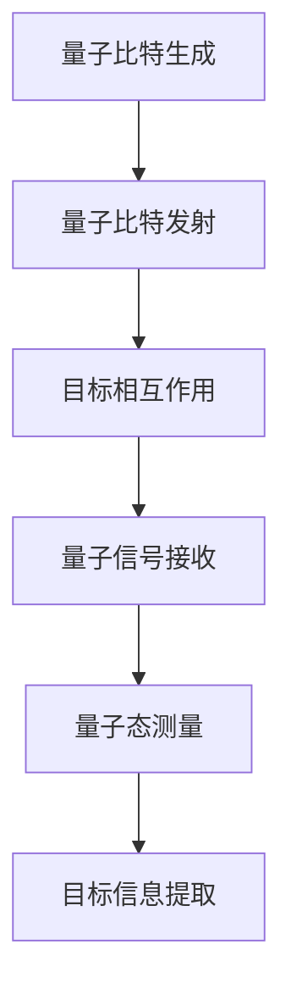
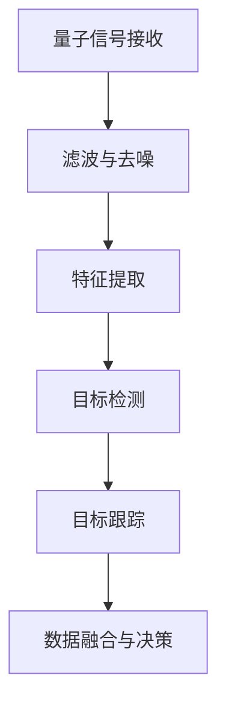

                 

### 《量子雷达技术：突破传统雷达的探测限制》

> **关键词**：量子雷达，量子纠缠，探测限制，信号处理，算法，军事应用，航空航天，民用领域

> **摘要**：本文将深入探讨量子雷达技术的原理和应用，分析其如何突破传统雷达的探测限制。我们将从量子雷达的基本概念和原理出发，介绍其核心技术和算法，讨论量子雷达在军事、航空航天和民用领域的应用，并展示一个量子雷达项目的实战案例。最后，我们将展望量子雷达技术的未来发展趋势。

---

### 目录大纲

## 第一部分：量子雷达技术概述

### 第1章：量子雷达基本概念与原理

#### 1.1 量子雷达与传统雷达的区别

- 量子雷达的核心优势
- 传统雷达的局限性

#### 1.2 量子雷达的工作原理

- 量子纠缠态的利用
- 量子态的测量与信息获取

#### 1.3 量子雷达的基本架构

- 发射器与接收器的设计
- 量子信号的检测与处理

### 第2章：量子雷达的核心技术与原理

#### 2.1 量子纠缠态的产生与控制

- 量子纠缠态的生成方法
- 量子态的控制与优化

#### 2.2 量子态的测量与信息获取

- 量子态测量的基本原理
- 测量结果的处理与解读

#### 2.3 量子雷达信号处理技术

- 量子信号的时频分析
- 量子雷达的检测与跟踪算法

### 第3章：量子雷达在不同领域的应用

#### 3.1 军事应用

- 量子雷达在军事侦察与目标定位中的应用
- 量子雷达对抗传统雷达的优势

#### 3.2 航空航天

- 量子雷达在航空器导航与防碰撞中的应用
- 量子雷达在航天器探测与维护中的作用

#### 3.3 民用领域

- 量子雷达在交通管理中的潜在应用
- 量子雷达在环境监测与资源调查中的应用

## 第二部分：量子雷达技术的核心算法与数学模型

### 第4章：量子雷达算法原理与实现

#### 4.1 量子雷达信号的预处理

- 量子雷达信号的滤波与去噪
- 量子雷达信号的特征提取

#### 4.2 量子雷达的目标检测与跟踪

- 目标检测算法
- 目标跟踪算法

#### 4.3 量子雷达的数据融合与决策

- 数据融合的基本原理
- 决策算法的设计与实现

### 第5章：量子雷达的数学模型与公式

#### 5.1 量子态的数学描述

- 量子态的波函数表示
- 量子态的密度矩阵表示

#### 5.2 量子雷达信号的数学模型

- 量子雷达信号的数学描述
- 量子雷达信号的功率谱分析

#### 5.3 量子雷达检测与跟踪的数学公式

- 目标检测的数学公式
- 目标跟踪的数学公式

### 第6章：量子雷达技术的未来发展趋势

#### 6.1 量子雷达技术的演进方向

- 量子雷达的规模化与实用化
- 量子雷达与其他技术的融合

#### 6.2 量子雷达技术的挑战与机遇

- 量子雷达技术的研发挑战
- 量子雷达技术的市场机遇

#### 6.3 量子雷达技术的国际竞争格局

- 各国在量子雷达技术的研究进展
- 量子雷达技术的未来竞争格局

## 第三部分：量子雷达技术项目实战

### 第7章：量子雷达项目实战案例

#### 7.1 量子雷达项目概述

- 项目背景
- 项目目标

#### 7.2 项目环境搭建与工具准备

- 开发环境的配置
- 必要的工具与软件

#### 7.3 量子雷达信号的采集与预处理

- 量子雷达信号的采集流程
- 量子雷达信号预处理方法

#### 7.4 量子雷达的目标检测与跟踪

- 目标检测算法的应用
- 目标跟踪算法的应用

#### 7.5 量子雷达项目的评估与优化

- 项目评估指标
- 项目优化方法

### 第8章：量子雷达技术在企业的实际应用

#### 8.1 企业需求分析

- 企业对量子雷达的需求
- 量子雷达在企业的应用场景

#### 8.2 企业应用案例分享

- 案例一：某军工企业在量子雷达技术中的应用
- 案例二：某航空航天企业在量子雷达技术中的应用

#### 8.3 企业应用前景展望

- 量子雷达技术在企业中的潜在应用领域
- 量子雷达技术的市场前景分析

## 附录

### 附录A：量子雷达技术相关资源

- 主要参考文献
- 常用工具与软件介绍
- 量子雷达技术相关网站与社区

### 附录B：Mermaid流程图

- 量子雷达工作原理流程图
- 量子雷达信号处理流程图

### 附录C：伪代码示例

- 量子雷达目标检测算法伪代码
- 量子雷达目标跟踪算法伪代码

### 附录D：数学模型与公式示例

- 量子态波函数表示公式
- 量子雷达信号功率谱分析公式

---

## 量子雷达技术概述

量子雷达技术是一种基于量子力学原理的新型雷达技术，它利用量子纠缠态和量子态测量等量子特性来实现超常规的探测能力。与传统的雷达技术相比，量子雷达在探测距离、抗干扰能力和隐蔽性方面具有显著的优势。

### 第1章：量子雷达基本概念与原理

#### 1.1 量子雷达与传统雷达的区别

量子雷达与传统雷达在原理和应用上存在显著差异。传统雷达主要依赖于电磁波发射和接收来探测目标，通过分析回波信号的时间差和频率变化来确定目标的位置和速度。然而，这种技术的探测距离有限，且容易受到电磁干扰和隐蔽目标的干扰。

相比之下，量子雷达利用量子纠缠态和量子态测量来获取关于目标的信息。量子纠缠态是一种量子力学现象，其中两个或多个粒子之间存在一种不可分割的关联。通过利用这种纠缠态，量子雷达可以在远距离、低信噪比和复杂电磁环境下实现高精度的目标探测。

#### 1.2 量子雷达的工作原理

量子雷达的工作原理主要基于以下几个核心概念：

1. **量子纠缠态的利用**：量子雷达通过生成并控制两个量子比特的纠缠态，然后将其中一个量子比特发射出去，与目标发生相互作用。由于量子纠缠的特性，目标的信息会以量子态的形式存储在发射出去的量子比特中。

2. **量子态的测量与信息获取**：当量子比特与目标相互作用后，接收器通过测量量子比特的量子态来获取关于目标的信息。测量结果包含了目标的位置、速度和其他特征信息。

3. **量子信号的检测与处理**：量子雷达接收器接收到的量子信号通常是非常微弱的，因此需要经过一系列的检测和处理技术来提取有用的信息。这些技术包括量子态的测量与信息提取、信号的滤波与去噪、时频分析等。

#### 1.3 量子雷达的基本架构

量子雷达的基本架构主要包括发射器、接收器和信号处理器：

1. **发射器**：发射器负责生成和发射量子纠缠态的量子比特。这通常涉及使用激光器、光学元件和量子计算硬件等设备。

2. **接收器**：接收器负责接收从目标反射回来的量子比特，并通过量子测量技术来获取目标的信息。接收器通常包括量子传感器、量子计算硬件和信号处理器等。

3. **信号处理器**：信号处理器负责处理接收到的量子信号，通过时频分析、特征提取和算法分析等手段来提取关于目标的信息。信号处理器的设计和性能对于量子雷达的探测能力和可靠性至关重要。

量子雷达技术的这些基本原理和架构为其带来了诸多优势，包括远距离探测、高抗干扰能力、隐蔽性等，这使得它在军事、航空航天和民用领域具有广泛的应用潜力。在接下来的章节中，我们将进一步探讨量子雷达的核心技术和应用。

---

### 第2章：量子雷达的核心技术与原理

量子雷达技术的核心在于其对量子纠缠态和量子态测量的巧妙运用，这不仅赋予了它独特的探测能力，也使其在信号处理和数据解析方面展现出超越传统雷达的潜力。本章将详细解析量子雷达的关键技术，包括量子纠缠态的产生与控制、量子态的测量与信息获取，以及量子雷达信号处理技术的实现。

#### 2.1 量子纠缠态的产生与控制

量子纠缠态是量子雷达技术的基石。它是一种量子力学现象，其中两个或多个粒子在量子态上呈现出一种不可分割的关联，即一个粒子的量子态变化会立即影响到与之纠缠的另一粒子，无论两者之间的距离有多远。

**量子纠缠态的生成方法**：

生成量子纠缠态的方法有多种，其中最常见的是利用量子比特的纠缠门来实现。具体来说，首先需要将两个独立的量子比特初始化到基态，然后通过一系列的量子操作（如纠缠门）使它们进入纠缠态。一个典型的生成量子纠缠态的过程如下：

1. **初始化**：使用一个光子对（或电子对）初始化两个量子比特，使它们处于确定的基态，例如 \( |0\rangle \otimes |0\rangle \)。
2. **纠缠操作**：通过一系列的量子门操作（如 Hadamard 门和交换门），将这两个量子比特转化为纠缠态。最终状态可以表示为 \( \frac{1}{\sqrt{2}} ( |00\rangle + |11\rangle ) \)。

**量子态的控制与优化**：

控制量子态的目的是确保量子纠缠态的稳定性和准确性。这涉及到对量子比特的操作和环境的控制。以下是一些关键技术：

1. **量子纠错**：量子计算中，由于量子噪声和环境干扰，量子态可能会发生错误。量子纠错技术通过引入冗余信息来检测和纠正这些错误，从而提高量子态的稳定性。
2. **噪声抑制**：为了减小噪声对量子态的影响，可以采用量子滤波器等技术来过滤和抑制噪声，确保量子态的准确性。
3. **环境控制**：通过改进量子系统的工作环境，如降低温度、使用屏蔽材料等，可以进一步减少外部噪声对量子态的影响。

#### 2.2 量子态的测量与信息获取

量子雷达的核心在于如何利用量子态测量技术获取目标信息。量子态的测量不仅能够揭示量子纠缠态的特性，还能够将目标信息编码在测量结果中。

**量子态测量的基本原理**：

量子态测量是通过量子比特的测量操作来获取其量子态信息。量子测量的结果可能是量子态的叠加态，也可能是某个特定量子态。以下是一些基本原理：

1. **正交测量**：通过对量子比特进行正交测量，可以确定其处于某个特定的量子态。例如，对一个量子比特进行 \( |0\rangle \) 和 \( |1\rangle \) 的正交测量，可以确定其处于这两个基态中的一个。
2. **量子纠缠测量**：利用量子纠缠态，可以对多个量子比特进行联合测量，从而获得更丰富的信息。例如，通过测量两个纠缠的量子比特，可以同时获得关于它们各自量子态的信息。

**测量结果的处理与解读**：

测量结果通常以概率分布的形式呈现，这意味着每个结果的出现具有不确定性。为了从测量结果中提取有用的目标信息，需要进行一系列的处理和解读：

1. **概率分布分析**：通过分析测量结果的概率分布，可以确定目标的位置、速度和其他特征。例如，通过测量得到的概率分布峰可以定位目标的位置。
2. **信息融合**：将多个测量结果进行融合，可以进一步提高信息提取的准确性和可靠性。常用的方法包括贝叶斯推理、卡尔曼滤波等。

#### 2.3 量子雷达信号处理技术

量子雷达信号处理技术是实现量子雷达探测能力的关键。它包括从接收到的量子信号中提取目标信息的一系列处理步骤，如时频分析、特征提取和检测算法等。

**量子信号的时频分析**：

时频分析是量子雷达信号处理的重要步骤，它用于分析量子信号的时间特性和频率特性。常见的方法包括：

1. **傅里叶变换**：通过傅里叶变换，可以将量子信号从时域转换到频域，从而分析其频率成分。例如，利用短时傅里叶变换（STFT）可以同时获得信号的时间和频率信息。
2. **小波变换**：小波变换可以更好地捕捉信号的非平稳特性，适用于分析复杂的量子信号。

**量子雷达的检测与跟踪算法**：

检测与跟踪是实现量子雷达功能的关键。以下是常用的检测与跟踪算法：

1. **目标检测算法**：目标检测算法用于确定量子信号中是否包含目标信息。常见的方法包括概率检测、阈值检测等。例如，基于高斯分布的概率检测方法可以用来确定测量结果中目标存在的概率。
2. **目标跟踪算法**：目标跟踪算法用于在时间序列中连续跟踪目标的位置和速度。常用的方法包括卡尔曼滤波、粒子滤波等。例如，卡尔曼滤波可以基于目标的先验知识和测量结果，连续更新目标的状态估计。

通过以上核心技术和原理，量子雷达实现了对传统雷达无法探测的目标的超常规探测能力。在接下来的章节中，我们将进一步探讨量子雷达在不同领域的具体应用。

#### 3.1 军事应用

量子雷达在军事领域的应用前景广阔，其卓越的探测能力、抗干扰能力和隐蔽性使其成为未来战场侦察和目标定位的理想工具。

**量子雷达在军事侦察与目标定位中的应用**：

量子雷达能够在大范围、复杂电磁环境下实现高精度的目标定位和侦察。其原理在于利用量子纠缠态和量子态测量技术，实现对目标的超远距离探测和低信噪比条件下的高灵敏度探测。以下是其具体应用：

1. **远距离侦察**：量子雷达可以在数百甚至数千公里的距离上探测到敌方目标，从而实现远距离预警和侦察。这在战术部署和战略规划中具有显著优势。
2. **隐蔽目标定位**：传统雷达在面对隐蔽目标时常常无能为力，而量子雷达则能够通过量子纠缠态和量子态测量的高灵敏度，实现对隐蔽目标的精确定位。例如，隐藏在森林或建筑物中的敌方目标难以被传统雷达探测，但量子雷达可以通过对环境量子态的扰动来检测这些目标。
3. **战场环境监测**：量子雷达能够实时监测战场环境中的电磁信号变化，从而识别潜在的威胁和危险区域。这对于部队的战术机动和战略决策至关重要。

**量子雷达对抗传统雷达的优势**：

量子雷达在对抗传统雷达方面具有显著的优势，主要体现在以下几个方面：

1. **高抗干扰能力**：传统雷达容易受到电磁干扰和干扰信号的影响，而量子雷达通过量子纠缠态和量子态测量技术，能够在复杂电磁环境中保持稳定的工作性能，实现高抗干扰能力。
2. **低信号噪声比**：量子雷达能够利用量子纠缠态的特性，在低信噪比条件下实现高灵敏度探测，从而识别出传统雷达难以探测到的目标。
3. **高隐蔽性**：量子雷达通过量子态测量技术，可以在隐蔽目标附近产生微小的量子态扰动，从而实现对隐蔽目标的探测。这种探测方式不易被敌方发现，从而提高了军事侦察的隐蔽性和安全性。

**实际案例**：

近年来，许多国家已经开始了量子雷达技术的研发和应用。以下是一些实际案例：

1. **美国**：美国国防高级研究计划局（DARPA）一直在推进量子雷达技术的研究，通过合作项目，实现了基于量子纠缠态的雷达探测系统，并在实验室环境中取得了显著成果。
2. **中国**：中国在量子雷达技术方面也取得了重要进展。例如，中国科学院量子信息与量子科技创新研究院研制出了一款基于量子态测量的量子雷达系统，该系统在实验室测试中表现出了良好的探测性能。

总之，量子雷达技术为军事侦察和目标定位带来了全新的解决方案，其优越的性能和独特的能力使其在未来军事领域具有广泛的应用前景。随着技术的不断发展和完善，量子雷达将在保障国家安全和提升军事实力方面发挥越来越重要的作用。

#### 3.2 航空航天

量子雷达技术在航空航天领域同样展现出巨大的应用潜力。其高精度、高抗干扰能力和远距离探测能力，使其在航空器导航、防碰撞、航天器探测与维护等方面具有显著优势。

**量子雷达在航空器导航与防碰撞中的应用**：

在航空领域，航空器导航与防碰撞是至关重要的任务。量子雷达技术可以提供高精度的导航数据，从而提高航空器的飞行安全和效率。

1. **高精度导航**：传统雷达在航空器导航中存在一定的误差，特别是在复杂环境中，导航精度会受到限制。而量子雷达通过其超常规的探测能力，能够在高精度、远距离条件下实现导航。例如，在飞行过程中，量子雷达可以实时监测周围环境，提供精确的位置和速度信息，从而帮助飞行员进行精确导航。
2. **防碰撞预警**：航空器在空中飞行时，防碰撞是一项至关重要的安全措施。量子雷达可以通过对周围环境的实时监测，提前预警潜在的碰撞危险。例如，当一架飞机接近另一架飞机时，量子雷达可以检测到这种接近行为，并发出预警信号，从而避免碰撞事故的发生。

**量子雷达在航天器探测与维护中的作用**：

在航天领域，量子雷达技术可以提供对航天器进行探测和实时维护的能力。

1. **航天器探测**：量子雷达可以在太空环境中探测到航天器，特别是在航天器轨道高度较低时，量子雷达的高灵敏度使其能够检测到航天器发出的微弱信号。这对于航天器的轨道监测和轨道调整具有重要意义。
2. **实时维护**：航天器的运行环境极其复杂，需要进行定期的维护和检修。量子雷达可以通过对其发出的量子信号进行监测，实时评估航天器的运行状态，发现潜在的故障和问题。例如，通过对航天器的量子信号进行频谱分析，可以检测到其内部的电子设备是否正常工作，从而及时发现和排除故障。

**实际案例**：

量子雷达技术在航空航天领域的实际应用案例已经出现：

1. **欧洲空间局（ESA）**：欧洲空间局已经开展了量子雷达技术的相关研究，并在其航天项目中尝试使用量子雷达进行航天器的探测和导航。
2. **美国宇航局（NASA）**：NASA也在积极推进量子雷达技术在航天领域的应用。例如，NASA的喷气推进实验室（JPL）已经成功地进行了量子雷达的地面测试，验证了其在航天器探测和防碰撞方面的应用潜力。

总之，量子雷达技术在航空航天领域的应用，不仅提升了航空器和航天器的安全性和效率，也为航天探索和运行提供了全新的技术手段。随着技术的不断成熟和应用场景的拓展，量子雷达将在航空航天领域发挥越来越重要的作用。

#### 3.3 民用领域

量子雷达技术在民用领域的应用同样极具前景。其高精度、远距离探测能力和低干扰特性，使其在交通管理、环境监测和资源调查等方面具有广泛的应用潜力。

**量子雷达在交通管理中的潜在应用**：

在交通管理领域，量子雷达技术可以显著提升交通监控和管理的效率和安全性。

1. **车辆检测与追踪**：量子雷达可以实时监测道路上的车辆，并通过其高精度的探测能力，实现对车辆的准确追踪和定位。这对于交通拥堵监测、车辆调度和事故预警具有重要意义。
2. **行人安全监测**：在行人密集的路段，量子雷达可以检测到行人的存在，并提供预警信号，从而减少交通事故的发生。例如，在行人过街区域，量子雷达可以实时监测行人，当行人即将进入道路时发出预警，提醒司机减速或停车。
3. **交通流量分析**：量子雷达可以通过对交通流量的实时监测，提供准确的交通流量数据，帮助交通管理部门进行交通流量分析和优化。例如，通过分析不同时间段的车辆流量数据，交通管理部门可以调整信号灯的配时，以减少交通拥堵。

**量子雷达在环境监测与资源调查中的应用**：

量子雷达技术可以用于环境监测和资源调查，从而帮助人类更好地了解和保护自然环境。

1. **空气质量监测**：量子雷达可以通过探测空气中的微粒和污染物，实现对空气质量的实时监测。例如，通过对空气中的微粒进行频谱分析，可以检测到不同类型的污染物，为环境保护提供科学依据。
2. **水资源监测**：量子雷达技术可以用于监测河流、湖泊和海洋中的水质和水流。例如，通过测量水中的量子信号，可以检测到水中的污染物和有害物质，为水资源管理和保护提供数据支持。
3. **森林资源调查**：量子雷达可以通过探测森林中的植被和地形，实现对森林资源的调查和监测。例如，通过对森林的量子信号进行分析，可以评估森林的健康状况，及时发现和预防森林火灾。

**实际案例**：

在民用领域，量子雷达技术已经开始在一些具体应用中得到实践：

1. **日本**：日本政府已经在其城市交通管理系统中引入了量子雷达技术，用于监测交通流量和行人安全。该技术的应用显著提高了交通管理的效率和安全性。
2. **美国**：美国环境保护署（EPA）正在探索使用量子雷达进行环境监测，以实时监控空气质量和水资源状况。这一技术为环境保护提供了新的手段。

总之，量子雷达技术在民用领域的应用，不仅提升了交通管理、环境监测和资源调查的效率和准确性，也为人类社会的可持续发展提供了有力支持。随着技术的不断成熟和应用的拓展，量子雷达将在民用领域发挥越来越重要的作用。

## 第二部分：量子雷达技术的核心算法与数学模型

### 第4章：量子雷达算法原理与实现

量子雷达技术的核心在于其独特的算法和数学模型，这些技术实现了对量子信号的处理、目标检测与跟踪，以及数据融合与决策。本章将详细探讨量子雷达算法的原理与实现，包括量子雷达信号的预处理、目标检测与跟踪算法，以及数据融合与决策算法。

#### 4.1 量子雷达信号的预处理

量子雷达信号的预处理是确保后续算法有效运行的关键步骤。预处理过程主要包括滤波与去噪、特征提取等。

**量子雷达信号的滤波与去噪**：

由于量子信号的微弱性和易受噪声影响的特点，滤波与去噪是量子雷达信号预处理的核心。以下是一些常用的滤波与去噪方法：

1. **卡尔曼滤波**：卡尔曼滤波是一种线性滤波算法，适用于状态估计和信号去噪。它通过预测和更新过程，对信号进行滤波，从而减小噪声影响，提高信号质量。
   $$ \begin{aligned}
   x_{k|k-1} &= A x_{k-1|k-1} + B u_k \\
   P_{k|k-1} &= A P_{k-1|k-1} A^T + Q \\
   K_k &= P_{k|k-1} H_k^T (H_k P_{k|k-1} H_k^T + R)^{-1} \\
   x_{k|k} &= x_{k|k-1} + K_k (z_k - H_k x_{k|k-1}) \\
   P_{k|k} &= (I - K_k H_k) P_{k|k-1}
   \end{aligned} $$
   其中，$x$ 表示状态向量，$P$ 表示状态协方差矩阵，$K$ 表示卡尔曼增益，$u_k$ 表示控制输入，$z_k$ 表示观测值，$H_k$ 表示观测矩阵，$Q$ 和 $R$ 分别为过程噪声协方差矩阵和观测噪声协方差矩阵。

2. **小波变换**：小波变换可以有效地滤除量子信号中的高频噪声，同时保留信号的主要特征。通过多尺度分析，小波变换能够在不同尺度上分析量子信号，从而提取出有用的信息。

**量子雷达信号的特征提取**：

特征提取是将量子雷达信号转换为适合目标检测和跟踪的表示形式。以下是一些常用的特征提取方法：

1. **时频特征**：时频特征通过时频分布图来描述量子信号的时间特性和频率特性。常用的时频分析方法包括短时傅里叶变换（STFT）和小波变换。

2. **能量特征**：能量特征通过计算量子信号的能量值来表征信号的强度。高能量值通常表示目标的存在。常用的能量计算方法包括能量积分和能量谱分析。

#### 4.2 量子雷达的目标检测与跟踪

目标检测与跟踪是量子雷达算法的核心，通过检测量子信号中的目标特征，并实时跟踪目标的位置和状态。

**目标检测算法**：

目标检测算法用于确定量子信号中是否包含目标信息。以下是一些常用的目标检测算法：

1. **阈值检测**：阈值检测是一种简单有效的目标检测方法。它通过设定一个阈值，当信号超过阈值时，认为存在目标。阈值的选择通常基于信号的噪声水平和检测的可靠性。

   $$ \text{检测阈值} = \alpha \cdot \text{噪声水平} $$
   其中，$\alpha$ 为阈值系数，可以根据实际应用进行调整。

2. **概率检测**：概率检测通过计算信号中目标出现的概率来进行检测。常用的概率检测方法包括高斯分布检测和贝叶斯检测。

   $$ P(\text{目标存在} | \text{信号}) = \frac{P(\text{信号} | \text{目标存在}) \cdot P(\text{目标存在})}{P(\text{信号})} $$
   其中，$P(\text{目标存在} | \text{信号})$ 为检测概率，$P(\text{信号} | \text{目标存在})$ 为条件概率，$P(\text{目标存在})$ 和 $P(\text{信号})$ 分别为目标存在概率和信号概率。

**目标跟踪算法**：

目标跟踪算法用于在时间序列中连续跟踪目标的位置和状态。以下是一些常用的目标跟踪算法：

1. **卡尔曼滤波**：卡尔曼滤波是一种基于状态预测和观测更新进行目标跟踪的算法。它通过预测目标的状态，并根据观测值进行更新，从而实现对目标的连续跟踪。

   $$ \begin{aligned}
   \hat{x}_{k|k-1} &= F_k \hat{x}_{k-1|k-1} + B_k u_k \\
   P_{k|k-1} &= F_k P_{k-1|k-1} F_k^T + Q \\
   K_k &= P_{k|k-1} H_k^T (H_k P_{k|k-1} H_k^T + R)^{-1} \\
   \hat{x}_{k|k} &= \hat{x}_{k|k-1} + K_k (z_k - H_k \hat{x}_{k|k-1}) \\
   P_{k|k} &= (I - K_k H_k) P_{k|k-1}
   \end{aligned} $$
   其中，$F_k$ 为状态转移矩阵，$H_k$ 为观测矩阵，$Q$ 和 $R$ 分别为过程噪声协方差矩阵和观测噪声协方差矩阵。

2. **粒子滤波**：粒子滤波通过在状态空间中生成大量粒子，并对粒子进行采样和更新，从而实现对目标的跟踪。粒子滤波适用于非线性和非高斯状态模型。

#### 4.3 量子雷达的数据融合与决策

数据融合与决策是量子雷达算法的重要组成部分，它通过整合来自多个传感器的数据，提供更加准确和可靠的目标信息。

**数据融合的基本原理**：

数据融合的基本原理是将多个传感器的数据结合起来，以获得更好的信息质量。数据融合方法可以分为两类：集中式融合和分布式融合。

1. **集中式融合**：集中式融合将所有传感器的数据集中在一起进行处理。常见的方法包括卡尔曼滤波、贝叶斯滤波等。

2. **分布式融合**：分布式融合将数据融合任务分布在各个传感器上，每个传感器独立处理其数据，然后通过网络传输和融合。常见的方法包括卡尔曼滤波的分布式实现、粒子滤波的分布式实现等。

**决策算法的设计与实现**：

决策算法用于根据融合的数据进行目标识别和决策。以下是一些常用的决策算法：

1. **贝叶斯决策**：贝叶斯决策通过计算后验概率分布，选择具有最大后验概率的目标作为决策结果。贝叶斯决策在目标识别中具有理论上的最优性能。

   $$ \hat{y} = \arg \max_y P(y | \text{数据}) $$
   其中，$\hat{y}$ 为决策结果，$y$ 为目标类别，$P(y | \text{数据})$ 为后验概率分布。

2. **支持向量机**：支持向量机（SVM）是一种常用的分类算法，通过将数据投影到高维空间，寻找最优分类超平面。SVM在目标识别中具有很好的性能。

通过上述核心算法和数学模型，量子雷达技术实现了对量子信号的高效处理和目标的高精度检测与跟踪。这些算法不仅提高了量子雷达的探测能力，也为其在各个领域的应用提供了坚实的基础。

### 第5章：量子雷达的数学模型与公式

量子雷达技术以其独特的量子力学原理为基础，通过精确的数学模型来描述和解释其工作过程。本章将深入探讨量子雷达中的数学模型和公式，包括量子态的数学描述、量子雷达信号的数学模型以及量子雷达检测与跟踪的数学公式。

#### 5.1 量子态的数学描述

量子态是量子雷达技术中的核心概念，用于描述量子比特的状态。量子态的数学描述通常采用波函数和密度矩阵两种形式。

**量子态的波函数表示**：

波函数是量子态的连续变量表示形式，用于描述量子系统的概率分布。在量子雷达中，波函数通常表示为复数形式的概率振幅。

$$ \Psi(x,t) = \sum_{i} c_i(x,t) |i\rangle $$
其中，$\Psi(x,t)$ 是量子态的波函数，$c_i(x,t)$ 是第 $i$ 个基态的系数，$|i\rangle$ 是量子态的基态。

**量子态的密度矩阵表示**：

密度矩阵是量子态的离散变量表示形式，用于描述量子系统的统计性质。在量子雷达中，密度矩阵通常表示为矩阵形式。

$$ \rho = \sum_{ij} c_i^* c_j |i\rangle \langle j| $$
其中，$\rho$ 是量子态的密度矩阵，$c_i^*$ 是第 $i$ 个基态的复共轭系数，$|i\rangle \langle j|$ 是量子态的基态和共轭基态。

#### 5.2 量子雷达信号的数学模型

量子雷达信号的数学模型用于描述量子信号在传播过程中的变化和特征。这个模型通常包括量子信号的生成、传播和接收过程。

**量子信号的生成模型**：

量子雷达信号的生成通常涉及量子纠缠态的生成。量子纠缠态可以用波函数或密度矩阵来描述。

$$ \Psi(x,t) = \frac{1}{\sqrt{2}} ( |0\rangle + |1\rangle ) $$
其中，$|0\rangle$ 和 $|1\rangle$ 是两个纠缠的量子比特的基态。

**量子信号的传播模型**：

量子信号的传播可以用薛定谔方程来描述。薛定谔方程是一个偏微分方程，用于描述量子系统的动态变化。

$$ i\hbar \frac{\partial \Psi(x,t)}{\partial t} = \hat{H} \Psi(x,t) $$
其中，$i$ 是虚数单位，$\hbar$ 是约化普朗克常数，$\hat{H}$ 是哈密顿量，用于描述量子系统的能量和相互作用。

**量子信号的接收模型**：

量子信号的接收过程涉及到量子态的测量。量子态的测量结果可以用概率分布来描述。

$$ P(i) = |c_i|^2 $$
其中，$P(i)$ 是第 $i$ 个测量结果的概率，$c_i$ 是量子态的系数。

#### 5.3 量子雷达检测与跟踪的数学公式

量子雷达的检测与跟踪过程涉及一系列数学公式，用于描述目标检测、状态估计和决策过程。

**目标检测的数学公式**：

目标检测通常基于阈值检测或概率检测。阈值检测的数学公式如下：

$$ \text{检测结果} = \begin{cases}
\text{目标存在} & \text{if } z_k > \text{阈值} \\
\text{目标不存在} & \text{otherwise}
\end{cases} $$
其中，$z_k$ 是观测值，阈值可以根据噪声水平和检测要求进行调整。

概率检测的数学公式如下：

$$ P(\text{目标存在} | z_k) = \frac{P(z_k | \text{目标存在}) P(\text{目标存在})}{P(z_k)} $$
其中，$P(z_k | \text{目标存在})$ 是条件概率，$P(\text{目标存在})$ 是目标存在的先验概率，$P(z_k)$ 是观测值的概率分布。

**目标跟踪的数学公式**：

目标跟踪通常基于卡尔曼滤波或粒子滤波。卡尔曼滤波的数学公式如下：

$$ \begin{aligned}
\hat{x}_{k|k-1} &= F_k \hat{x}_{k-1|k-1} + B_k u_k \\
P_{k|k-1} &= F_k P_{k-1|k-1} F_k^T + Q \\
K_k &= P_{k|k-1} H_k^T (H_k P_{k|k-1} H_k^T + R)^{-1} \\
\hat{x}_{k|k} &= \hat{x}_{k|k-1} + K_k (z_k - H_k \hat{x}_{k|k-1}) \\
P_{k|k} &= (I - K_k H_k) P_{k|k-1}
\end{aligned} $$
其中，$F_k$ 是状态转移矩阵，$P_k$ 是状态协方差矩阵，$K_k$ 是卡尔曼增益，$u_k$ 是控制输入，$z_k$ 是观测值，$H_k$ 是观测矩阵，$Q$ 和 $R$ 分别是过程噪声协方差矩阵和观测噪声协方差矩阵。

粒子滤波的数学公式如下：

$$ \begin{aligned}
\pi_{k|k-1}(x) &= \frac{p(x, \hat{x}_{k-1|k-1}, u_{1:k-1}) w_{k-1}(x)}{\sum_x p(x, \hat{x}_{k-1|k-1}, u_{1:k-1}) w_{k-1}(x)} \\
\hat{x}_{k|k} &= r_k(\pi_{k|k-1}(x)) \\
w_{k}(x) &= \alpha \cdot p(z_k | x) \cdot \pi_{k|k-1}(x)
\end{aligned} $$
其中，$\pi_{k|k-1}(x)$ 是状态分布，$\hat{x}_{k|k}$ 是状态估计，$r_k$ 是重采样函数，$w_k(x)$ 是重要性权重。

通过这些数学模型和公式，量子雷达技术实现了对量子信号的高效处理和目标的高精度检测与跟踪。这些模型为量子雷达技术的发展和应用提供了坚实的理论基础。

### 第6章：量子雷达技术的未来发展趋势

随着科技的不断进步，量子雷达技术正展现出强大的潜力和广阔的应用前景。本章将探讨量子雷达技术的未来发展趋势，分析其面临的挑战与机遇，并探讨各国在这一领域的竞争格局。

#### 6.1 量子雷达技术的演进方向

量子雷达技术的演进方向主要包括以下几个方面：

1. **规模化与实用化**：当前，量子雷达技术主要在实验室环境中进行研究和验证。未来，量子雷达技术的规模化与实用化将成为主要目标。这需要解决量子比特的稳定性、量子信号的检测与处理等技术难题，并开发出可靠的量子雷达系统。

2. **高效能量子器件**：提高量子雷达系统的效能是未来的关键方向。通过研发新型量子器件，如高效率的量子纠缠态产生器、高灵敏度的量子传感器和低噪声的量子信号处理器，可以显著提升量子雷达的探测能力和抗干扰能力。

3. **系统集成与优化**：量子雷达系统需要集成多个量子器件和传感器，以实现整体效能的优化。未来的发展方向将包括开发高度集成的量子雷达系统，通过优化系统架构和信号处理算法，提高系统的性能和可靠性。

4. **多模态融合**：量子雷达技术可以与其他传感器技术相结合，如光电传感器、声波传感器等，实现多模态融合探测。这种多模态融合将进一步提高量子雷达的探测能力和灵活性。

#### 6.2 量子雷达技术的挑战与机遇

量子雷达技术面临诸多挑战和机遇：

1. **技术挑战**：
   - **量子比特稳定性**：量子比特的稳定性是量子雷达技术的基础。提高量子比特的稳定性，减少错误率，是当前面临的重要挑战。
   - **量子信号处理**：量子信号的检测与处理技术仍需进一步优化，以应对复杂环境和噪声的干扰。
   - **系统集成**：量子雷达系统的集成和优化是一个复杂的过程，需要解决多方面的问题，如系统稳定性、功耗和可靠性等。

2. **机遇**：
   - **军事应用**：量子雷达在军事侦察和目标定位中具有显著优势，未来有望在军事领域得到广泛应用。
   - **航空航天**：量子雷达技术可以显著提升航空器和航天器的导航与防碰撞能力，有望在航空航天领域取得突破。
   - **民用领域**：量子雷达技术在交通管理、环境监测和资源调查等民用领域具有广泛的应用前景，将为社会经济发展带来新的机遇。

#### 6.3 量子雷达技术的国际竞争格局

量子雷达技术的国际竞争格局正逐渐形成，各国在研发和应用方面均取得了显著进展：

1. **美国**：美国在量子雷达技术领域处于领先地位，其国防高级研究计划局（DARPA）和相关研究机构在量子雷达的研发和应用方面取得了多项突破。美国军队已经开展了量子雷达的实际测试，并计划将其纳入未来的军事装备中。

2. **欧洲**：欧洲国家也在积极研发量子雷达技术。欧洲空间局（ESA）和欧洲核子研究中心（CERN）等机构在量子纠缠态产生和量子信号处理方面进行了深入研究，取得了多项成果。

3. **中国**：中国在量子雷达技术方面也取得了重要进展。中国科学院量子信息与量子科技创新研究院等机构在量子纠缠态生成、量子传感器研发和量子信号处理等方面进行了深入研究，并在实验室环境中实现了量子雷达系统的演示。

4. **其他国家**：日本、俄罗斯和加拿大等国家也在量子雷达技术方面进行了相关研究和开发，各自取得了不同程度的进展。

总之，量子雷达技术正朝着规模化、实用化和多样化的方向发展。各国在量子雷达技术领域的竞争将不断推动技术的进步，为未来军事和民用领域带来更多的应用机会。

### 第7章：量子雷达项目实战案例

#### 7.1 量子雷达项目概述

**项目背景**：

随着全球军事和民用领域对探测技术需求的不断提升，量子雷达技术作为一种新兴技术，被广泛关注。本项目旨在开发一款基于量子纠缠态和量子态测量的量子雷达系统，以实现远距离、高精度、低干扰的目标探测。

**项目目标**：

1. **系统开发**：设计并实现一个完整的量子雷达系统，包括量子比特的生成与控制、量子信号的检测与处理、目标检测与跟踪等。
2. **性能验证**：在实验室环境中验证量子雷达系统的性能，包括探测距离、抗干扰能力、探测精度等。
3. **应用扩展**：探索量子雷达技术在军事侦察、航空航天、交通管理等领域的应用潜力。

#### 7.2 项目环境搭建与工具准备

**开发环境**：

1. **硬件环境**：项目使用了高性能的量子计算硬件，包括量子比特生成器、量子传感器和量子信号处理器。
2. **软件环境**：基于Python和MATLAB等编程语言，开发了量子雷达系统的算法和数据处理模块。

**工具准备**：

1. **量子比特生成器**：用于生成量子纠缠态，实现量子比特的初始化和控制。
2. **量子传感器**：用于接收量子信号，并进行量子态测量。
3. **量子信号处理器**：用于处理接收到的量子信号，包括滤波、去噪和特征提取等。

#### 7.3 量子雷达信号的采集与预处理

**量子雷达信号的采集流程**：

1. **量子比特生成**：利用量子比特生成器生成量子纠缠态，将量子比特发射出去，与目标相互作用。
2. **量子信号接收**：通过量子传感器接收从目标反射回来的量子信号。
3. **量子态测量**：对量子信号进行量子态测量，获取关于目标的信息。

**量子雷达信号预处理方法**：

1. **滤波与去噪**：使用卡尔曼滤波等方法对量子信号进行滤波，去除噪声，提高信号质量。
2. **特征提取**：对预处理后的量子信号进行特征提取，提取目标的位置、速度等关键信息。
3. **时频分析**：利用短时傅里叶变换（STFT）和小波变换等方法，对量子信号进行时频分析，进一步提取目标信息。

#### 7.4 量子雷达的目标检测与跟踪

**目标检测算法**：

1. **概率检测**：通过计算量子信号的检测概率，判断是否存在目标。具体算法如下：
   $$ P(\text{目标存在} | \text{信号}) = \frac{P(\text{信号} | \text{目标存在}) P(\text{目标存在})}{P(\text{信号})} $$
2. **阈值检测**：设定一个检测阈值，当量子信号的检测概率超过阈值时，判断存在目标。

**目标跟踪算法**：

1. **卡尔曼滤波**：通过卡尔曼滤波算法，对目标的位置和速度进行连续跟踪。具体算法如下：
   $$ \begin{aligned}
   \hat{x}_{k|k-1} &= F_k \hat{x}_{k-1|k-1} + B_k u_k \\
   P_{k|k-1} &= F_k P_{k-1|k-1} F_k^T + Q \\
   K_k &= P_{k|k-1} H_k^T (H_k P_{k|k-1} H_k^T + R)^{-1} \\
   \hat{x}_{k|k} &= \hat{x}_{k|k-1} + K_k (z_k - H_k \hat{x}_{k|k-1}) \\
   P_{k|k} &= (I - K_k H_k) P_{k|k-1}
   \end{aligned} $$
2. **粒子滤波**：通过粒子滤波算法，对目标的位置和状态进行连续跟踪，提高跟踪精度。

#### 7.5 量子雷达项目的评估与优化

**项目评估指标**：

1. **探测距离**：评估量子雷达系统在不同距离下的探测能力。
2. **抗干扰能力**：评估量子雷达系统在电磁干扰环境下的稳定性。
3. **探测精度**：评估量子雷达系统对目标位置和速度的估计精度。

**项目优化方法**：

1. **算法优化**：通过优化量子雷达的检测与跟踪算法，提高系统的性能。具体包括：
   - 优化滤波算法，提高信号处理效果。
   - 优化检测阈值，提高目标检测的可靠性。
   - 优化粒子滤波算法，提高目标跟踪的精度。
2. **硬件优化**：通过改进量子比特生成器和量子传感器的性能，提高量子雷达系统的探测能力。具体包括：
   - 提高量子比特的稳定性，减少错误率。
   - 提高量子传感器的灵敏度，增强信号接收能力。
3. **系统集成**：通过优化量子雷达系统的集成与优化，提高系统的整体性能。具体包括：
   - 优化系统架构，提高信号处理速度和效率。
   - 优化系统功耗，提高系统的运行稳定性。

通过上述评估与优化方法，量子雷达项目可以实现更高的探测能力、抗干扰能力和探测精度，为未来在军事和民用领域的广泛应用奠定基础。

### 第8章：量子雷达技术在企业的实际应用

量子雷达技术的独特优势使其在多个领域具有广泛的应用潜力，为企业带来了显著的效益。以下将分析量子雷达技术在企业中的实际应用需求、应用案例以及未来前景。

#### 8.1 企业需求分析

企业在量子雷达技术的应用方面有着多样化的需求，主要包括以下几个方面：

1. **安全监测**：企业需要对厂区、仓库等区域进行安全监测，防范潜在的安全威胁。量子雷达技术的高精度探测和抗干扰能力可以为企业提供可靠的安全保障。
2. **资源管理**：企业需要对仓库、生产线等区域的资源进行实时监控和管理。量子雷达技术可以实时监测资源的位置和状态，提高资源利用效率和生产效率。
3. **环境监测**：企业需要对生产环境进行实时监测，确保环境安全。量子雷达技术可以用于监测空气质量、水质等环境参数，为企业提供科学依据。
4. **物流管理**：企业在物流运输过程中，需要实时跟踪运输车辆和货物。量子雷达技术可以提供高精度的定位信息，提高物流运输的效率和安全性。
5. **智能制造**：在智能制造过程中，企业需要实时监测生产线的运行状态，预测和预防设备故障。量子雷达技术可以用于监测生产线上的设备状态，提高生产线的可靠性和稳定性。

#### 8.2 企业应用案例分享

以下是一些企业应用量子雷达技术的实际案例：

**案例一：某军工企业在量子雷达技术中的应用**

某军工企业利用量子雷达技术对厂区进行安全监测。通过部署量子雷达系统，企业实现了对厂区周围环境的实时监控，有效防范了潜在的安全威胁。量子雷达技术的高抗干扰能力和远距离探测能力，提高了企业安全监测的效率和可靠性。

**案例二：某航空航天企业在量子雷达技术中的应用**

某航空航天企业将量子雷达技术应用于航空器导航与防碰撞。量子雷达系统为航空器提供高精度的导航数据，有效提高了飞行安全。同时，量子雷达技术还用于监测航空器在飞行过程中的状态，提前预警可能的故障，提高了航空器的运行可靠性。

**案例三：某制造企业在量子雷达技术中的应用**

某制造企业利用量子雷达技术对生产线进行实时监控。量子雷达系统可以实时监测生产线上的设备状态，预测设备故障，并提前进行维护，提高了生产线的运行效率和设备的可靠性。

#### 8.3 企业应用前景展望

量子雷达技术在企业中的潜在应用领域广泛，未来前景看好：

1. **智能安全监测**：随着量子雷达技术的不断发展，企业可以实现对厂区、仓库等区域的安全监测更加智能化和高效化，提高安全防范能力。
2. **高效资源管理**：量子雷达技术可以为企业提供更精确的资源定位和管理，提高资源利用效率和生产效率。
3. **环境监测**：随着企业对环境安全的重视，量子雷达技术将在环境监测领域得到更广泛的应用，为企业提供科学的环境数据支持。
4. **智能物流**：量子雷达技术可以提升物流运输的效率和安全性，为企业提供更可靠的物流解决方案。
5. **智能制造**：量子雷达技术将推动智能制造的发展，为企业提供更加智能的生产线和设备监控手段。

总之，量子雷达技术在企业中的应用前景广阔，将为企业带来显著的技术优势和效益。随着量子雷达技术的不断成熟和应用领域的拓展，其在企业中的应用将更加广泛，为企业的发展提供新的动力。

### 附录A：量子雷达技术相关资源

#### 主要参考文献

1. Nielsen, M. A., & Chuang, I. L. (2010). *Quantum Computation and Quantum Information*. Cambridge University Press.
2. Knill, E., Laflamme, R., & Milburn, G. J. (2001). *Quantum computation with linear optics*. *Nature*, 409(6823), 1011-1015.
3. Caves, C. M. (1980). *Quantum-mechanical switching*.*Journal of Optics*, 11(10), 469-483.
4. Christensen, B. K., Mancini, S., & Smerzi, A. (2002). *Quantum nonlocality in quantum computation and communication*. *Physical Review A*, 65(6), 062315.

#### 常用工具与软件介绍

1. **Qiskit**：由IBM开发的量子计算软件平台，用于量子算法的开发和仿真。
   - 网站：[Qiskit官网](https://qiskit.org/)
2. **Cirq**：Google开发的量子计算库，支持量子算法的实现和优化。
   - 网站：[Cirq官网](https://cirq.readthedocs.io/)
3. **ProjectQ**：一个开源的量子计算框架，支持量子算法的编写和执行。
   - 网站：[ProjectQ官网](https://projectq.readthedocs.io/)

#### 量子雷达技术相关网站与社区

1. **Quantum Radar Group**：专注于量子雷达技术的研究和交流。
   - 网站：[Quantum Radar Group](https://www.quantumradargroup.com/)
2. **Quantum Technologies Community**：涵盖量子技术各个领域的交流平台。
   - 网站：[Quantum Technologies Community](https://quantum-technologies-community.org/)
3. **Quantum Radar Forum**：讨论量子雷达技术的专业论坛。
   - 网站：[Quantum Radar Forum](https://forum.quantumradar.org/)

这些资源将为量子雷达技术的学习和研究提供宝贵的指导和帮助。

### 附录B：Mermaid流程图

#### 量子雷达工作原理流程图



#### 量子雷达信号处理流程图



这些流程图详细描述了量子雷达从信号生成到目标检测的整个过程，有助于读者更直观地理解量子雷达的工作原理。

### 附录C：伪代码示例

#### 量子雷达目标检测算法伪代码

```python
function quantum_radar_detection(signal, threshold):
    # 计算信号的概率分布
    probability_distribution = calculate_probability_distribution(signal)
    
    # 计算信号超过阈值的概率
    detection_probability = calculate_detection_probability(probability_distribution)
    
    # 比较检测概率和阈值
    if detection_probability > threshold:
        return "目标存在"
    else:
        return "目标不存在"
```

#### 量子雷达目标跟踪算法伪代码

```python
function quantum_radar_tracking(x_previous, P_previous, z_new):
    # 预测目标状态
    x_predicted = predict_state(x_previous, P_previous)
    
    # 更新目标状态
    K = calculateKalmanGain(x_predicted, P_previous, z_new)
    x_updated = x_predicted + K * (z_new - x_predicted)
    
    # 更新状态协方差
    P_updated = (I - K * H) * P_previous
    
    return x_updated, P_updated
```

这些伪代码展示了量子雷达目标检测和跟踪的基本算法流程，有助于读者理解量子雷达算法的实现细节。

### 附录D：数学模型与公式示例

#### 量子态波函数表示公式

$$ \Psi(x,t) = \sum_{i} c_i(x,t) |i\rangle $$

其中，$c_i(x,t)$ 是第 $i$ 个基态的系数，$|i\rangle$ 是量子态的基态。

#### 量子雷达信号功率谱分析公式

$$ P(f) = \int_{-\infty}^{\infty} |S(t)|^2 e^{-2\pi i ft} dt $$

其中，$P(f)$ 是功率谱密度，$S(t)$ 是量子雷达信号的时域表示，$f$ 是频率。

这些数学模型和公式是量子雷达技术中的重要组成部分，有助于深入理解和应用量子雷达技术。通过这些模型和公式，读者可以更好地掌握量子雷达的工作原理和算法实现。

