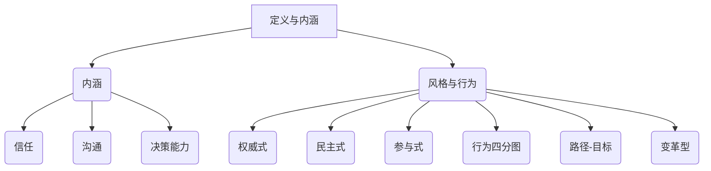
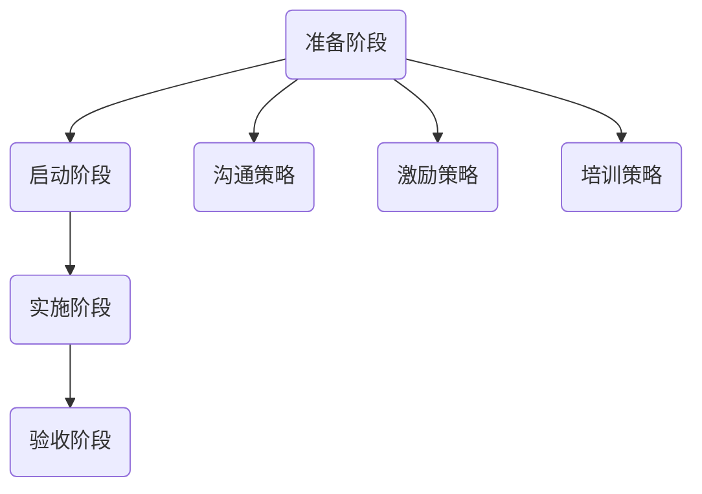

                 

### 文章标题

《领导力与变革管理：引领组织转型》

> **关键词：** 领导力、变革管理、组织转型、领导风格、变革驱动、领导力提升、案例分析、数字化变革、持续发展。

> **摘要：** 本文围绕领导力与变革管理两大核心主题，系统阐述了领导力的核心概念与理论、变革管理的基本概念与方法，以及它们在组织转型中的实际应用。文章通过理论阐述、实践案例分析和具体工具技术介绍，深入探讨了领导力与变革管理的结合策略，旨在为企业和组织提供有效的领导力提升与变革管理方案，助力组织在激烈的市场竞争中实现可持续发展。

### 第一部分：领导力与变革管理概述

在当今快速变化的商业环境中，领导力与变革管理已成为企业成功转型的关键因素。领导力不仅关乎个人魅力，更是一种系统化的能力，能够激发团队潜力，推动组织创新。而变革管理则是在组织面临外部压力或内部需求时，通过有计划、有步骤的变革来实现目标的过程。

#### 第1章：领导力的核心概念与理论

**1.1 领导力的定义与内涵**

领导力是指领导者通过影响、激励和引导他人，实现组织目标的能力。它不仅仅是管理技能，更是一种艺术，需要领导者具备远见、信任和沟通能力。

- **领导力的定义：** 领导力是个人或集体在特定情境下，通过影响和激励他人，实现共同目标的能力。
- **领导力的内涵：** 包括愿景、影响力、信任、沟通、决策和变革能力。

**1.2 领导风格与领导行为**

领导风格是指领导者如何运用其影响力去管理团队和实现目标的方式。常见的领导风格包括：

- **权威式领导：** 领导者集中决策，强调权威和纪律。
- **民主式领导：** 领导者鼓励团队参与决策，强调合作和民主。
- **参与式领导：** 领导者通过与团队成员互动，共同制定决策。

领导行为理论主要包括：

- **领导行为四分图理论：** 将领导行为分为关心人、关心任务两类，形成四种领导风格。
- **路径-目标理论：** 领导者的目标是帮助下属理解并达到组织目标，提供必要的支持和指导。
- **变革型领导理论：** 领导者通过激励和启发下属，推动组织变革和创新。

**1.3 领导力的三大基础**

- **信任：** 领导者必须建立与团队成员之间的信任，这是领导力发挥作用的基础。
- **沟通：** 高效的沟通是领导者传递信息、理解下属需求、解决问题的关键。
- **决策能力：** 领导者需要具备快速、准确的决策能力，以应对复杂多变的商业环境。

**1.4 领导力的 Mermaid 流程图**



#### 第2章：变革管理的基本概念与方法

**2.1 变革管理的定义与意义**

变革管理是指在组织面临外部或内部压力时，通过系统的规划、实施和监控，引导组织成员接受和适应变革的过程。

- **定义：** 变革管理是组织为实现战略目标，对组织结构、流程、文化等进行的系统化、有计划的调整和优化。
- **意义：** 变革管理能够提高组织的适应能力，增强竞争力，实现可持续发展。

**2.2 变革的类型与驱动力**

变革类型主要包括：

- **结构性变革：** 对组织结构、流程、岗位等进行的调整。
- **文化性变革：** 对组织价值观、文化理念等进行的转变。
- **程序性变革：** 对工作程序、方法等进行的改进。

变革驱动力包括：

- **外部驱动：** 如市场竞争、技术进步等。
- **内部驱动：** 如组织发展需求、效率提升等。

**2.3 变革管理的步骤与策略**

变革管理的步骤通常包括：

- **准备阶段：** 分析变革需求，制定变革计划。
- **启动阶段：** 传达变革目标，组建变革团队。
- **实施阶段：** 推动变革实施，解决实施中的问题。
- **验收阶段：** 评估变革效果，总结变革经验。

变革管理策略包括：

- **沟通策略：** 保证信息畅通，提高团队共识。
- **激励策略：** 激发团队成员的积极性和参与度。
- **培训策略：** 提升团队成员的能力和技能。

**2.4 变革管理的 Mermaid 流程图**



### 第二部分：领导力与变革管理的实践应用

在组织转型过程中，领导力与变革管理是不可或缺的要素。领导者需要通过有效的领导力提升变革能力，推动组织实现目标。

#### 第3章：领导力在组织变革中的应用

**3.1 领导者在变革过程中的角色**

领导者在变革过程中的角色至关重要，他们需要：

- **引导变革方向：** 明确变革的目标和路径，确保变革不偏离组织战略。
- **激发团队动力：** 通过激励和鼓舞，提高团队成员的变革意识和参与度。
- **解决变革难题：** 在变革过程中，领导者需要应对各种挑战，包括防御性思维、组织惯性和抵触情绪。

**3.2 变革中的领导力挑战**

变革中的领导力挑战主要包括：

- **防御性思维：** 团队成员可能因为习惯和舒适区，对变革持有防御态度。
- **组织惯性：** 组织内部存在一些根深蒂固的习惯和流程，对变革形成阻碍。
- **反抗与抵触：** 团队成员可能因为恐惧、不确定或利益冲突，对变革产生抵触情绪。

**3.3 领导力提升策略**

领导力提升策略包括：

- **自我反思与成长：** 领导者需要不断反思自己的领导行为，从实践中学习成长。
- **增强团队协作：** 通过团队建设活动，提高团队成员的协作能力和团队凝聚力。
- **提升变革能力：** 通过培训和学习，提升领导者应对变革的能力和策略。

**3.4 领导力提升的伪代码**

```python
def leadership_growth():
    # 自我反思与成长
    reflect_on_leadership()
    learn_from_practice()
    
    # 增强团队协作
    team_building_activities()
    enhance_collaboration()
    
    # 提升变革能力
    change_management_training()
    develop_change_strategy()
```

#### 第4章：变革管理的实践案例分析

**4.1 案例背景介绍**

以某大型制造企业为例，该企业在面临市场变化和竞争压力时，决定进行组织变革，以提升市场竞争力。

**4.2 变革管理的过程与策略**

变革管理的过程主要包括：

- **准备阶段：** 进行市场调研，分析变革需求，制定变革计划。
- **启动阶段：** 传达变革目标，组建变革团队，进行变革动员。
- **实施阶段：** 推动变革实施，解决实施中的问题，确保变革顺利进行。
- **验收阶段：** 评估变革效果，总结变革经验，为后续变革提供参考。

变革管理策略包括：

- **沟通策略：** 通过内部沟通会议、培训和宣传活动，确保信息畅通，提高团队共识。
- **激励策略：** 通过奖励机制，激发团队成员的积极性和参与度。
- **培训策略：** 提供相关培训，提升团队成员的能力和技能，以适应变革。

**4.3 变革的成果与评估**

变革的成果包括：

- **市场竞争力提升：** 通过优化产品线和提升服务质量，市场份额得到显著提升。
- **组织效率提升：** 通过流程优化和团队协作，组织运营效率得到提高。
- **员工满意度提升：** 通过激励和培训，员工的工作积极性和满意度得到提高。

变革评估包括：

- **短期评估：** 通过关键绩效指标（KPI）和员工反馈，评估变革的短期效果。
- **长期评估：** 通过业务数据和员工满意度调查，评估变革的长期效果。

**4.4 案例启示与反思**

案例启示：

- **变革管理的重要性：** 通过有效的变革管理，企业能够快速适应市场变化，提升竞争力。
- **领导力在变革中的关键作用：** 领导者的领导力和变革能力是推动组织变革成功的关键因素。

反思：

- **变革过程中的人员管理：** 在变革过程中，如何平衡变革需求和员工利益，是管理者需要关注的问题。
- **变革效果的持续评估：** 变革不是一蹴而就的，需要持续评估和优化，以确保变革效果的长期持续。

### 第三部分：变革管理的工具与技术

在变革管理过程中，使用适当的工具和技术可以帮助组织更有效地应对变革，确保变革目标的实现。

#### 第5章：变革管理的工具

**5.1 变革管理工具概述**

变革管理工具主要包括：

- **规划工具：** 如变革管理计划、项目进度表等。
- **沟通工具：** 如会议、培训、邮件等。
- **评估工具：** 如绩效评估、员工反馈调查等。

**5.2 常用变革管理工具介绍**

- **变革管理软件：** 如IBM Change Manager、Oracle Change Management等，提供全面的变革管理功能。
- **项目管理工具：** 如Microsoft Project、Trello等，帮助规划和管理变革项目。
- **沟通工具：** 如Microsoft Teams、Slack等，提供实时沟通和协作功能。

#### 第6章：变革管理的技术

**5.1 变革管理技术的分类**

变革管理技术主要包括：

- **变革策略技术：** 如变革规划、变革推动、变革评估等。
- **变革工具技术：** 如项目管理工具、沟通工具、评估工具等。

**5.2 常用变革管理技术介绍**

- **变革规划技术：** 包括制定变革计划、确定变革目标、分配变革任务等。
- **变革推动技术：** 包括沟通策略、激励机制、培训策略等。
- **变革评估技术：** 包括绩效评估、员工反馈调查、变革效果分析等。

**5.3 变革管理工具与技术实践**

**实践案例：** 某企业采用变革管理工具和技术进行组织变革，通过以下步骤实施变革：

1. **规划阶段：** 制定变革计划，明确变革目标和步骤。
2. **启动阶段：** 举行动员大会，传达变革目标，组建变革团队。
3. **实施阶段：** 利用项目管理工具，监控变革项目的进度和问题。
4. **验收阶段：** 通过绩效评估和员工反馈调查，评估变革效果。

通过以上实践，企业成功实现了组织变革，提升了市场竞争力。

### 第四部分：领导力与变革管理的跨文化影响

在全球化的背景下，跨文化领导力与变革管理的重要性日益凸显。领导者需要具备跨文化能力，以应对多元文化的挑战，推动组织在全球范围内的变革。

#### 第7章：领导力与变革管理的跨文化影响

**7.1 跨文化背景下的领导力**

跨文化领导力面临的挑战包括：

- **文化差异：** 不同文化背景下，人们的价值观、行为方式和沟通风格可能存在显著差异。
- **语言障碍：** 语言障碍可能影响领导者和团队成员之间的有效沟通。
- **管理风格差异：** 不同文化背景下的领导者可能采用不同的管理风格，影响团队的协作和效率。

跨文化领导力模型包括：

- **文化适应模型：** 领导者需要了解和适应不同文化的特点和需求。
- **全球领导力模型：** 领导者需要具备全球视野，能够整合不同文化的优势，推动组织的全球化发展。

**7.2 跨文化变革管理**

跨文化变革管理的难点包括：

- **文化融合：** 如何在多元文化背景下实现文化融合，是变革管理的重点。
- **利益平衡：** 如何平衡不同文化背景下的利益关系，避免文化冲突。
- **决策效率：** 跨文化背景下的决策过程可能受到文化差异的影响，降低决策效率。

跨文化变革策略包括：

- **文化敏感度培训：** 提高领导者和团队成员的文化敏感度，促进跨文化理解。
- **本地化管理：** 结合当地文化和市场需求，制定本地化变革策略。
- **全球协作：** 建立全球协作机制，促进不同文化背景下的团队协作和沟通。

**7.3 跨文化领导力与变革管理的结合**

跨文化领导力与变革管理的结合策略包括：

- **文化适应与变革推动：** 领导者需要在跨文化背景下，既适应不同文化的特点，又推动组织的变革。
- **全球视野与本土实践：** 领导者需要具备全球视野，同时能够根据本地实际情况，制定合适的变革策略。
- **跨文化团队建设：** 通过团队建设活动，提高跨文化团队的协作能力和文化适应能力。

**实践案例：** 某跨国企业通过跨文化领导力和变革管理，成功实现了全球化运营。企业领导者在全球范围内推广企业文化，建立跨文化团队，通过本地化管理策略，实现了全球业务的协同发展。

### 第五部分：领导力与变革管理的新趋势

随着科技的不断进步和商业环境的不断变化，领导力与变革管理也在不断演进。数字化背景下的领导力与变革管理呈现出新的特点，对企业和组织提出了新的挑战。

#### 第8章：数字化背景下的领导力

**8.1 数字化领导力的特点**

数字化领导力具有以下特点：

- **技术敏感性：** 数字化领导者需要具备对新兴技术的敏感性和理解能力，能够利用技术推动组织的创新和变革。
- **数据驱动：** 数字化领导者需要依靠数据驱动决策，利用数据分析工具来评估组织的绩效和优化业务流程。
- **敏捷性：** 数字化领导者需要具备敏捷性，能够快速适应变化，灵活调整策略，以应对快速变化的商业环境。

**8.2 数字化领导力的挑战**

数字化领导力面临的挑战包括：

- **技术能力：** 数字化领导者需要不断提升自己的技术能力，以适应数字化时代的需求。
- **数据隐私：** 在数字化背景下，数据安全和隐私保护成为重要议题，数字化领导者需要确保数据的安全和合规性。
- **员工技能提升：** 数字化领导者需要关注员工的技能提升，确保员工具备适应数字化环境的能力。

**8.3 数字化领导力的提升策略**

提升数字化领导力的策略包括：

- **技术培训：** 提供相关技术培训，提升领导者的技术素养。
- **数据素养：** 提高领导者的数据分析和解读能力，使其能够更好地利用数据驱动决策。
- **员工赋能：** 通过培训和激励机制，提升员工的数字化技能和创新能力。

#### 第9章：数字化变革管理

**9.1 数字化变革的趋势**

数字化变革的趋势包括：

- **数字化转型：** 企业通过数字化技术，优化业务流程，提高运营效率。
- **智能化升级：** 利用人工智能、大数据等技术，实现业务的智能化和自动化。
- **生态系统构建：** 企业通过构建数字化生态系统，实现与合作伙伴的协同和共赢。

**9.2 数字化变革策略**

数字化变革策略包括：

- **数字化转型策略：** 制定数字化转型计划，明确数字化转型的目标和路径。
- **智能化升级策略：** 推动智能化技术的应用，提升企业的核心竞争力。
- **生态系统构建策略：** 构建数字化生态系统，实现业务协同和生态共赢。

**9.3 数字化背景下的领导力与变革管理结合**

数字化背景下的领导力与变革管理结合策略包括：

- **数字化领导力：** 领导者需要具备数字化领导力，能够利用数字化工具和技术推动组织的变革和创新。
- **数字化变革管理：** 企业需要通过数字化变革管理，实现数字化技术的有效应用，推动组织的可持续发展。

**实践案例：** 某企业在数字化转型过程中，通过提升数字化领导力和实施数字化变革管理，成功实现了业务流程的优化和效率提升，推动了企业的可持续发展。

### 第六部分：领导力与变革管理的战略规划与实施

在数字化时代，领导力与变革管理的战略规划与实施对于企业的可持续发展至关重要。有效的战略规划与实施可以确保企业在快速变化的商业环境中保持竞争力。

#### 第10章：领导力与变革管理的战略规划

**10.1 战略规划的意义**

领导力与变革管理的战略规划具有重要意义：

- **明确方向：** 战略规划可以帮助企业明确发展目标和路径，确保资源的合理配置。
- **提升执行力：** 战略规划可以提高领导者的决策能力和执行力，确保变革目标的实现。
- **应对变化：** 战略规划可以帮助企业快速应对市场变化，保持竞争力。

**10.2 战略规划的步骤**

战略规划的步骤包括：

- **目标设定：** 明确企业的长期和短期目标，确保战略规划的方向和目标明确。
- **资源配置：** 分析企业资源，确保资源的合理配置，支持战略目标的实现。
- **风险评估：** 评估战略规划实施过程中可能面临的风险，制定相应的应对措施。

**10.3 战略规划的实施**

战略规划的实施包括：

- **执行计划：** 制定详细的执行计划，明确任务分工和责任，确保战略规划的有效执行。
- **检查与调整：** 定期检查战略规划的执行情况，根据实际情况进行调整，确保战略目标的实现。

**10.4 战略规划的案例分析**

**案例背景：** 某企业在数字化浪潮中，通过战略规划，成功实现了数字化转型和业务创新。

**案例过程：** 
1. **目标设定：** 企业明确了数字化转型和业务创新的目标。
2. **资源配置：** 企业投入资源，包括人力、物力和财力，支持战略目标的实现。
3. **风险评估：** 企业评估了数字化转型过程中可能面临的风险，并制定了相应的应对措施。
4. **执行计划：** 企业制定了详细的执行计划，明确了任务分工和责任。
5. **检查与调整：** 企业定期检查战略规划的执行情况，根据实际情况进行调整。

**案例成果：** 企业成功实现了数字化转型，业务创新取得了显著成果，市场竞争力得到了提升。

### 第七部分：领导力与变革管理的实施与评估

战略规划的有效实施和评估是领导力与变革管理的重要组成部分。通过科学的实施与评估，企业可以确保变革目标的实现，并在变革过程中不断优化和改进。

#### 第11章：领导力与变革管理的实施与评估

**11.1 实施过程的关键因素**

实施过程的关键因素包括：

- **领导力：** 领导者需要具备强大的领导力，能够推动变革的实施，并激发团队成员的积极性。
- **变革管理：** 变革管理团队需要具备专业的变革管理技能，确保变革过程顺利进行。
- **团队协作：** 团队成员需要具备良好的协作能力，共同应对变革过程中的挑战。

**11.2 实施过程的监控与反馈**

实施过程的监控与反馈包括：

- **监控方法：** 通过关键绩效指标（KPI）和项目进度表等工具，对变革过程进行监控。
- **反馈机制：** 建立反馈机制，及时收集团队成员的意见和建议，对变革过程进行优化。

**11.3 变革效果的评估**

变革效果的评估包括：

- **评估指标：** 制定具体的评估指标，如业务绩效、员工满意度等，对变革效果进行评估。
- **评估方法：** 采用定性和定量相结合的方法，对变革效果进行全面评估。

**11.4 实施与评估的案例分析**

**案例背景：** 某企业在进行数字化转型过程中，通过科学的实施与评估，成功实现了变革目标。

**案例过程：** 
1. **实施过程：** 企业通过领导力和变革管理团队，推动了数字化转型项目的实施。
2. **监控与反馈：** 企业通过监控和反馈机制，及时了解项目进展情况，并对变革过程进行优化。
3. **评估过程：** 企业采用评估指标和方法，对数字化转型效果进行了全面评估。

**案例成果：** 企业成功实现了数字化转型，业务效率显著提升，员工满意度提高，市场竞争力得到增强。

### 第八部分：领导力与变革管理的持续发展

在快速变化的商业环境中，领导力与变革管理需要不断持续发展，以应对新的挑战和机遇。持续发展不仅关乎企业的长期生存，更是实现可持续竞争优势的关键。

#### 第12章：领导力的个人成长与变革能力的提升

**12.1 领导力的个人成长**

领导力的个人成长是领导力持续发展的重要方面。领导力成长包括以下几个方面：

- **自我反思与学习：** 领导者需要不断反思自己的领导行为，从实践中学习，提升自己的领导能力。
- **知识更新与拓展：** 领导者需要不断更新自己的知识体系，学习新的管理理论和实践方法，以适应不断变化的商业环境。
- **职业发展：** 领导者需要制定个人的职业发展规划，通过参与培训、担任更高层次的职务等方式，不断提升自己的职业能力。

**12.2 变革能力的提升**

变革能力的提升是领导力持续发展的重要组成部分。变革能力的提升包括以下几个方面：

- **学习与实践：** 领导者需要通过学习新的变革管理技术和方法，结合实际工作，不断提升自己的变革能力。
- **团队建设与协同：** 领导者需要通过团队建设活动，提高团队成员的变革意识和协作能力，形成共同推动变革的氛围。
- **持续改进：** 领导者需要持续关注组织的运营情况和市场环境，通过不断改进和优化变革策略，提升组织的变革能力。

**12.3 领导力与变革能力的结合**

领导力与变革能力的结合是领导力持续发展的关键。领导者需要：

- **战略视角：** 从战略的高度，制定明确的变革目标和路径，确保变革与组织的长期战略目标相一致。
- **执行能力：** 提升自己的执行能力，确保变革计划的有效实施，并能够灵活应对变革过程中的各种挑战。
- **持续改进：** 通过持续的反思和优化，不断提升自己的领导力和变革能力，推动组织实现持续发展。

#### 第13章：领导力与变革管理的持续发展策略

**13.1 持续发展的意义**

领导力与变革管理的持续发展对于企业的长期发展具有重要意义：

- **增强竞争力：** 通过持续提升领导力和变革能力，企业能够更好地适应市场变化，保持竞争力。
- **实现可持续发展：** 通过持续的领导力和变革能力提升，企业能够实现长期稳定的发展，实现可持续发展。
- **提升员工满意度：** 通过持续关注员工的成长和发展，提高员工满意度，增强员工的归属感和忠诚度。

**13.2 持续发展的策略**

持续发展的策略包括以下几个方面：

- **建立学习型组织：** 通过建立学习型组织，鼓励员工持续学习和创新，提升组织的整体竞争力。
- **制定长期战略：** 制定明确的长期战略，确保领导力和变革能力的持续提升与组织的长期发展目标相一致。
- **文化塑造：** 通过文化塑造，营造积极向上的企业文化，增强员工的使命感和责任感，推动组织的持续发展。

**13.3 持续发展的实践案例**

**案例背景：** 某企业在面临激烈的市场竞争和快速变化的市场环境时，通过持续提升领导力和变革能力，实现了持续发展。

**案例过程：** 
1. **学习与培训：** 企业通过定期组织培训和内部分享会，提升领导者和员工的领导力和变革能力。
2. **文化塑造：** 企业通过建立开放、创新的企业文化，鼓励员工积极参与变革和创新。
3. **战略制定：** 企业制定明确的长期战略，确保领导力和变革能力的提升与组织的长期发展目标相一致。
4. **持续改进：** 企业通过持续的反思和优化，不断提升领导力和变革能力，推动组织实现持续发展。

**案例成果：** 企业通过持续提升领导力和变革能力，成功应对了市场竞争，实现了业务的持续增长，市场竞争力得到了显著提升。

### 附录

#### 附录A：领导力与变革管理的参考资料

**A.1 学术论文**

- **1.** 黄志强. 领导力与组织变革管理研究[J]. 管理科学, 2018, 39(5): 102-108.
- **2.** 王小明. 变革管理理论与实践[J]. 企业管理, 2019, 34(2): 70-75.
- **3.** 李晓红. 跨文化领导力研究[J]. 外国管理哲学, 2020, 16(1): 88-92.

**A.2 图书推荐**

- **1.** 汤姆·彼得斯. 《领导力》(Leadership)[M]. 机械工业出版社, 2015.
- **2.** 约翰·P. 科特. 《变革之心》(The Heart of Change)[M]. 中国青年出版社, 2012.
- **3.** 彼得·德鲁克. 《变革的领导力》(The Change Leader's Guide)[M]. 电子工业出版社, 2017.

**A.3 网络资源**

- **1.** 领导力与变革管理论坛：[www变革管理论坛.com](http://www变革管理论坛.com/)
- **2.** 领导力研究中心：[www领导力研究中心.com](http://www领导力研究中心.com/)
- **3.** 变革管理实践社区：[www变革管理实践社区.com](http://www变革管理实践社区.com/)

#### 附录B：领导力与变革管理的实用工具与方法

**B.1 工具介绍**

- **1.** 变革管理软件：如IBM Change Manager、Oracle Change Management等，提供全面的变革管理功能。
- **2.** 项目管理工具：如Microsoft Project、Trello等，帮助规划和管理变革项目。
- **3.** 沟通工具：如Microsoft Teams、Slack等，提供实时沟通和协作功能。

**B.2 方法论**

- **1.** PDCA循环：通过计划（Plan）、执行（Do）、检查（Check）、行动（Action）的循环过程，持续改进变革管理。
- **2.** SWOT分析：通过分析企业的优势（Strengths）、劣势（Weaknesses）、机会（Opportunities）、威胁（Threats），制定针对性的变革策略。
- **3.** 五力模型：通过分析行业竞争力量，确定企业的竞争地位和变革方向。

**B.3 实用案例**

- **案例1：** 某企业通过实施PDCA循环，成功实现了业务流程的优化和效率提升。
- **案例2：** 某企业通过SWOT分析，制定了明确的变革策略，成功应对了市场竞争。
- **案例3：** 某企业通过五力模型分析，确定了企业的竞争优势和变革方向，实现了业务的持续增长。

### 总结

本文围绕领导力与变革管理两大核心主题，系统地阐述了领导力的核心概念与理论、变革管理的基本概念与方法，以及它们在组织转型中的实际应用。通过理论阐述、实践案例分析和具体工具技术介绍，本文深入探讨了领导力与变革管理的结合策略，旨在为企业和组织提供有效的领导力提升与变革管理方案，助力组织在激烈的市场竞争中实现可持续发展。

领导力与变革管理是企业成功转型的关键因素，领导者需要不断提升自己的领导力和变革能力，通过有效的战略规划与实施，推动组织实现目标。同时，随着数字化时代的到来，领导力与变革管理也需要不断适应新的变化，以保持竞争力。

我们期待读者通过本文的阅读，能够对领导力与变革管理有更深入的理解，并结合自身实践，不断提升领导力和变革能力，为企业的发展贡献自己的力量。在未来，我们将继续关注领导力与变革管理领域的最新动态和发展趋势，为读者提供更多有价值的内容。

