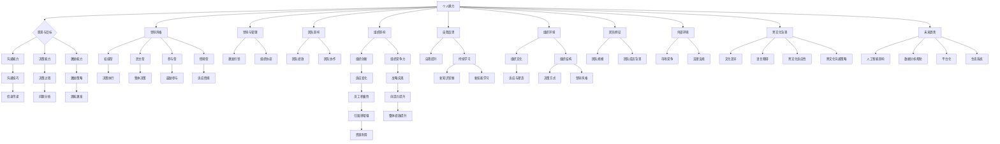
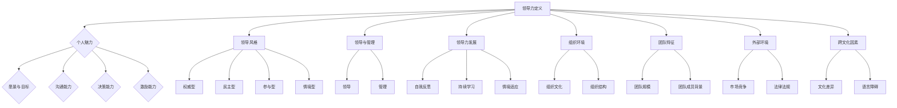

                 

### 1.1 领导力的定义与核心概念

#### 1.1.1 领导力的定义

领导力是指通过影响力、指导、激励和沟通等方式，带领和影响团队达成共同目标的能力。它不仅包括管理层面的职责，更强调个人魅力、价值观和愿景的影响力。

- **个人魅力**：领导者通过个人品质和魅力吸引和影响他人。
- **愿景与目标**：领导者能够明确愿景，设定目标，并激励团队共同努力。
- **沟通能力**：领导者需要具备良好的沟通技巧，以确保信息传递的有效性。
- **决策能力**：领导者需要能够在不确定和复杂的环境中做出明智的决策。
- **激励能力**：领导者能够激励团队成员，激发他们的潜能和热情。

#### 1.1.2 领导力的核心概念

领导风格是指领导者行使领导职能时所采用的方式和方法。常见的领导风格包括权威型、民主型、参与型和情境型等。每种风格都有其适用的情境，领导者需要根据具体情况进行调整。

- **权威型**：领导者做出决策，下属执行。
- **民主型**：领导者与下属共同参与决策。
- **参与型**：领导者鼓励下属参与决策，但最终决策权仍属于领导者。
- **情境型**：领导者根据团队成员的特点和环境情况调整领导风格。

领导和管理是两个不同的概念，但又密切相关。领导关注的是激励和引领，而管理侧重于组织和协调资源。领导可以没有管理，但管理不能没有领导。

#### 1.1.3 领导力的重要性

领导力对团队的影响：
- **提高团队绩效**：有效的领导力能够激发团队成员的积极性、创造力和归属感，提高团队的整体绩效。
- **促进团队协作**：领导者能够协调团队成员，实现资源的有效利用。

领导力对组织的影响：
- **推动组织创新**：领导者能够推动组织创新，适应变化并实现战略目标。
- **提升组织竞争力**：领导力是组织成功的关键因素，优秀的领导者能够提升组织的竞争力。

#### 1.1.4 领导力的发展与提升

领导者需要通过自我反思和持续学习，不断提升自我认知和领导能力。

- **自我反思**：领导者需要定期反思自己的领导行为和效果，找出改进之处。
- **持续学习**：领导者需要不断学习新知识、新技能，以适应不断变化的环境。

#### 1.1.5 领导力的情境因素

组织环境：
- **组织文化**：领导者需要适应和塑造组织文化，以提升领导效果。
- **组织结构**：组织结构对领导力风格和决策方式有重要影响。

团队特征：
- **团队规模**：领导者需要根据团队规模调整领导方式。
- **团队成员背景**：团队成员的背景和个性对领导力策略有重要影响。

外部环境：
- **市场竞争**：领导者需要根据市场变化调整战略。
- **法律法规**：领导者需要遵守相关法律法规。

#### 1.1.6 跨文化因素

跨文化背景：
- **文化差异**：跨文化背景中的文化差异对领导力有重要影响。
- **语言障碍**：语言障碍可能会影响领导力和沟通效果。

跨文化领导力：
- **跨文化适应性**：领导者需要具备跨文化适应性，以有效领导多元文化团队。
- **跨文化沟通策略**：领导者需要运用适当的跨文化沟通策略，以提高沟通效果。

#### 1.1.7 未来趋势

科技发展：
- **人工智能**：人工智能的发展将对领导力产生重要影响。
- **数据分析**：数据分析将帮助领导者更好地理解员工和团队。

组织变革：
- **平台化**：组织平台化将改变领导力模式。
- **生态系统**：组织将更多地以生态系统的形式运作，领导力需要适应这一变化。

---

**核心概念原理和架构的 Mermaid 流程图**：

**数学模型和公式**：

假设领导力对员工绩效的影响可以用以下公式表示：

$$
E = f(L, M, P)
$$

其中，$E$ 表示员工绩效，$L$ 表示领导力水平，$M$ 表示员工能力，$P$ 表示员工潜力。

**详细讲解与举例说明**：

领导力水平对员工绩效有显著影响。根据研究，有效的领导力能够显著提高员工的工作效率和创造力。例如，假设某个团队在引入新的领导后，员工的工作效率和创造力都有显著提升，这是因为新的领导者采用了更为民主的领导风格，鼓励团队成员参与决策，激发了团队成员的积极性。

另外，员工的能力和潜力也是影响绩效的重要因素。如果一个团队中的成员都具备较高的能力和潜力，那么在领导力的引导下，团队的绩效会更高。例如，在一个高科技公司中，如果领导者能够鼓励团队成员不断学习新知识、新技能，那么团队的整体绩效会显著提升。

总之，领导力通过影响员工的能力、潜力和积极性，最终影响团队的整体绩效。有效的领导力能够激发员工的潜能，提升团队的整体实力，从而实现组织的战略目标。

---

### 1.2 领导力与员工发展

#### 1.2.1 领导力对员工发展的影响

领导力在员工发展过程中发挥着关键作用。一方面，领导力能够直接影响员工的工作表现和职业成长；另一方面，它还能够为员工提供发展的机会和资源。

**激励员工**：
领导力通过激励员工，提高其工作积极性和投入度。有效的激励措施包括设置明确的目标、提供奖励、认可员工的贡献等。例如，一个优秀的领导者可能会为团队成员设定具有挑战性的目标，并通过定期的绩效评估和奖励机制，激励员工不断追求卓越。

**提供成长机会**：
领导力能够为员工提供成长和发展的机会。这包括职业发展路径的规划、培训机会的提供、工作轮换等。通过这些方式，员工能够不断提升自己的技能和知识，为未来的职业发展打下坚实的基础。

**解决问题与冲突**：
领导力在解决员工问题和冲突方面也发挥着重要作用。一个有能力的领导者能够倾听员工的意见，理解他们的困扰，并采取适当的措施解决。例如，当员工遇到工作上的困难时，领导者可以通过提供支持或调整工作任务来帮助他们克服挑战。

**反馈与支持**：
领导力还包括为员工提供及时的反馈和支持。通过定期的绩效评估和一对一的沟通，领导者能够帮助员工认识到自己的优点和需要改进的地方，并提供相应的支持和指导。这种反馈和支持有助于员工的职业发展，并增强他们对组织的忠诚度。

#### 1.2.2 员工发展对领导力的影响

员工的发展同样对领导力产生影响。通过员工的成长，领导力可以得到提升和改进。

**反馈与改进**：
员工的发展反馈可以帮助领导者了解自己的领导效果和风格。当员工在工作中遇到挑战或问题时，他们可能会向领导者反馈，这些反馈可以帮助领导者认识到自己的不足，并采取改进措施。例如，如果员工反馈领导者在沟通方面存在不足，领导者可以通过参加沟通技巧培训来提升自己的沟通能力。

**团队协作**：
员工的发展需要团队协作的支持。领导者需要培养团队协作精神，为员工创造一个相互支持、共同进步的环境。通过团队协作，员工能够更好地理解彼此的需求和目标，从而提高整个团队的工作效率和绩效。

**文化建设**：
员工发展也是组织文化建设的一部分。一个注重员工发展的组织会形成积极向上的文化氛围，这种文化会反过来激励员工更加努力工作，促进员工的职业发展。

#### 1.2.3 领导力与员工发展的互动关系

领导力与员工发展之间存在着密切的互动关系。领导力的提升能够促进员工的发展，而员工的发展反过来又能增强领导力的效果。

**相互促进**：
领导力与员工发展的互动关系是相互促进的。有效的领导力能够为员工提供发展的机会和支持，促进员工的成长。而员工的成长又能够为组织带来更多的价值，从而增强领导力的影响力和有效性。

**共同成长**：
领导力和员工发展是共同成长的过程。领导者需要不断学习和提升自己的能力，以更好地支持员工的发展。同时，员工也需要不断成长和进步，以适应不断变化的工作环境。通过这种共同成长，领导力和员工发展能够实现双赢。

**持续改进**：
领导力和员工发展的互动关系是一个持续改进的过程。领导者需要不断地反思和调整自己的领导方式，以适应员工的需求和组织的发展。同时，员工也需要不断地学习和提升自己的能力，以适应领导者的期望和组织的变革。

总的来说，领导力与员工发展之间存在着密切的互动关系。通过有效的领导力，领导者能够促进员工的发展，而员工的发展又能反过来增强领导力的效果。这种互动关系是实现组织长期成功的关键。

---

### 1.3 领导力与组织绩效

#### 1.3.1 领导力对组织绩效的影响

领导力在提升组织绩效方面发挥着至关重要的作用。有效的领导力能够激发团队潜力，提高整体效率，从而实现组织的战略目标。

**提高团队绩效**：
领导力通过激发团队成员的积极性和创造力，显著提高团队的整体绩效。一个有能力的领导者能够设定明确的绩效目标，并提供必要的资源和支持，使团队成员能够充分发挥自己的潜力。

**促进创新与变革**：
领导者需要推动组织的创新与变革，以适应快速变化的市场环境。通过鼓励员工提出新的想法和改进措施，领导者能够促进组织的创新，提高竞争力。

**提升员工满意度与忠诚度**：
有效的领导力能够提高员工的满意度和忠诚度。领导者通过关心员工的需求，提供良好的工作环境和职业发展机会，能够增强员工对组织的认同感和归属感。

**增强团队凝聚力**：
领导力有助于增强团队的凝聚力。通过建立共同的目标和价值观，领导者能够促进团队成员之间的合作和信任，提高团队的整体协作效率。

#### 1.3.2 组织绩效对领导力的影响

组织绩效的反馈对领导力的提升有着重要影响。领导力的发展需要不断地进行自我评估和反思，而组织绩效的反馈则为领导者提供了宝贵的参考。

**反馈机制**：
组织绩效的反馈机制可以帮助领导者了解自己的领导效果。通过定期的绩效评估、员工反馈和市场分析，领导者可以识别自己在哪些方面表现良好，哪些方面需要改进。

**激励机制**：
组织绩效的提升可以激励领导者更加努力工作，以实现更高的绩效目标。通过奖励机制，如晋升、奖金和荣誉，组织可以激励领导者不断提高自己的领导能力。

**改进措施**：
组织绩效的反馈可以帮助领导者识别问题并采取改进措施。例如，如果发现团队成员的士气低落，领导者可以通过改善沟通方式、提供培训机会或调整工作环境来提升团队士气。

**持续学习与成长**：
组织绩效的反馈促使领导者持续学习和成长。领导者需要不断更新自己的知识和技能，以应对组织面临的挑战和变化。

总的来说，领导力与组织绩效之间存在着密切的互动关系。有效的领导力能够提高组织绩效，而组织绩效的反馈又能够促进领导力的提升。通过这种互动，组织能够实现长期的成功和可持续发展。

---

### 1.4 领导力的情境因素

领导力的影响受到多种情境因素的影响。了解这些情境因素对于领导者来说至关重要，因为它们决定了领导力的实际效果。

#### 1.4.1 组织环境

**组织文化**：
组织文化是领导力发挥作用的重要背景。一个积极向上的组织文化能够促进领导力的发展，并增强领导效果。相反，如果一个组织文化消极，领导者可能会面临更大的挑战。

**组织结构**：
组织结构对领导力有重要影响。例如，在扁平化的组织结构中，领导者需要更多地依赖团队合作和参与型领导风格，而在高度层级化的组织中，权威型领导风格可能更为有效。

**组织规模**：
组织规模也会影响领导力的应用。在大型组织中，领导者需要管理更多的资源和员工，这可能需要更加复杂的策略和技能。而在小型组织中，领导者可能需要更加灵活和直接地与团队成员互动。

#### 1.4.2 团队特征

**团队规模**：
团队规模决定了领导者需要管理的人数。在一个小团队中，领导者可以更密切地与团队成员沟通和互动，而在大团队中，领导者需要更多的协调和沟通技巧。

**团队成员背景**：
团队成员的背景和经验对领导力有重要影响。一个多元化的团队可能需要领导者具备跨文化沟通和管理的技能。同时，团队成员的专业知识和技能也会影响领导力的实施效果。

**团队成员关系**：
团队成员之间的关系对领导力有重要影响。如果团队成员之间关系紧密，领导力可能更容易被接受和实施。相反，如果团队成员之间存在矛盾或冲突，领导者需要更多的调解和沟通技巧。

#### 1.4.3 外部环境

**市场竞争**：
市场竞争的激烈程度对领导力有重要影响。在激烈的市场环境中，领导者需要更加灵活和迅速地做出决策，以保持竞争优势。

**法律法规**：
法律法规对领导力的实施也有重要影响。领导者需要遵守相关的法律法规，以确保组织的合法性和可持续性。

**经济环境**：
经济环境的变化会对领导力产生影响。在经济衰退时期，领导者可能需要采取更加节约和高效的策略来应对挑战。

总之，领导力的影响受到多种情境因素的影响。领导者需要根据不同的情境因素调整自己的领导风格和策略，以实现最佳效果。

---

### 1.5 领导力的跨文化因素

在全球化背景下，跨文化领导力成为领导者必须掌握的重要技能。不同文化背景的员工有着不同的价值观、行为模式和沟通习惯，这对领导力的实施提出了新的挑战。

#### 1.5.1 跨文化背景

**文化差异**：
跨文化背景中的文化差异对领导力有显著影响。不同的文化对领导风格、决策方式、沟通方式等有着不同的期望和偏好。例如，在一些文化中，权威型领导风格可能更为普遍，而在其他文化中，民主型和参与型领导风格可能更受欢迎。

**语言障碍**：
语言障碍是跨文化领导力面临的另一个重要挑战。不同语言的使用不仅影响沟通效果，还可能导致误解和冲突。领导者需要具备良好的语言沟通能力，以确保信息的准确传递。

**文化敏感性**：
文化敏感性是跨文化领导力的核心。领导者需要理解和尊重不同文化的价值观和习惯，避免文化冲突。例如，在亚洲文化中，尊重和谦逊是非常重要的，而西方文化中，直率和自信则更为普遍。

#### 1.5.2 跨文化领导力

**跨文化适应性**：
跨文化适应性是跨文化领导力的关键。领导者需要能够适应不同文化背景，灵活调整领导风格和策略。例如，在一个多元文化团队中，领导者可能需要更多地采用参与型领导风格，以促进团队合作和沟通。

**跨文化沟通策略**：
跨文化沟通策略是跨文化领导力的重要组成部分。领导者需要运用适当的沟通策略，以提高沟通效果和团队协作。例如，领导者可以采用开放式的沟通方式，鼓励团队成员表达自己的意见和想法。

**文化教育**：
文化教育是提高跨文化领导力的有效途径。通过学习不同文化的知识和技能，领导者可以更好地理解员工，提高领导效果。例如，组织可以提供跨文化培训，帮助领导者掌握不同文化的沟通技巧和领导风格。

**跨文化团队建设**：
跨文化团队建设是跨文化领导力的关键。领导者需要通过有效的团队建设活动，促进团队成员之间的相互理解和信任。例如，组织团队建设活动，如文化体验和交流活动，可以帮助团队成员更好地了解彼此的文化背景。

总之，跨文化因素对领导力有着重要影响。领导者需要具备跨文化适应性，运用适当的沟通策略，并通过文化教育和团队建设来提高跨文化领导力。通过这些方法，领导者可以更好地管理多元文化团队，实现组织的战略目标。

---

### 1.6 领导力的未来趋势

随着科技的迅猛发展和社会的快速变化，领导力也在不断演进。未来，领导力将面临新的挑战和机遇，领导者需要具备前瞻性的眼光和创新的思维来应对这些变化。

#### 1.6.1 科技发展

**人工智能**：
人工智能（AI）的发展将对领导力产生深远影响。一方面，AI可以帮助领导者更好地理解员工的行为和需求，提供个性化的支持。另一方面，AI可以协助领导者进行数据分析和决策，提高决策的准确性和效率。

**数据分析**：
数据分析是未来领导力的重要工具。通过大数据和机器学习技术，领导者可以更准确地了解员工和团队的表现，识别潜在问题和机会。这有助于领导者制定更科学、更有效的领导策略。

**虚拟现实与增强现实**：
虚拟现实（VR）和增强现实（AR）技术为领导力提供了新的应用场景。通过这些技术，领导者可以更好地与远程团队进行沟通和协作，提高团队的凝聚力和效率。

#### 1.6.2 组织变革

**平台化**：
随着互联网和信息技术的发展，组织正逐渐向平台化转型。领导者需要适应这一变化，建立以平台为核心的领导模式。在平台化组织中，领导者更多地扮演协调者和促进者的角色，而不是传统意义上的管理者。

**生态系统**：
未来，组织将更多地以生态系统的形式运作。领导者需要构建一个包容性、创新性强的生态系统，促进组织内外部的协同发展。在这个生态系统中，领导者需要具备生态思维，鼓励跨界合作和创新。

**远程工作与灵活性**：
远程工作和灵活性已经成为趋势。领导者需要适应这种变化，提供有效的远程领导策略，确保远程团队的工作效率。例如，领导者可以采用虚拟团队管理工具，确保团队之间的沟通和协作。

#### 1.6.3 教育与培训

**领导力教育**：
未来，领导力教育将更加注重实践和应用。通过案例学习、角色扮演和模拟训练等方式，领导者可以更好地掌握实际领导技能。此外，在线学习平台和虚拟现实技术将为领导力教育带来新的可能性。

**持续学习**：
领导力不是一成不变的，领导者需要持续学习，以适应快速变化的环境。通过参加研讨会、阅读书籍和参加培训课程等方式，领导者可以不断提升自己的领导能力。

总之，未来领导力将面临诸多挑战和机遇。领导者需要具备前瞻性的眼光和创新思维，适应科技发展、组织变革和教育培训的新趋势。通过不断学习和实践，领导者可以更好地应对未来的挑战，实现组织的战略目标。

---

### 1.7 领导力的挑战与机遇

在当前快速变化的社会环境中，领导力面临着诸多挑战和机遇。领导者需要具备适应能力、创新能力和前瞻性思维，以应对这些挑战并抓住机遇。

#### 1.7.1 挑战

**多元化**：
多元化是当今社会的一个显著特征，包括文化、性别、年龄和背景等方面的多元化。领导者需要理解和尊重不同群体的需求和期望，促进团队内的包容性和协作。多元化也可能导致团队内的冲突和误解，领导者需要采取有效的策略来化解这些问题。

**快速变化**：
在快速变化的环境中，领导者需要具备快速适应和应对变化的能力。技术革新、市场动态和组织变革等都是领导者需要面对的挑战。领导者需要保持灵活性和敏捷性，及时调整战略和领导方式，以适应变化。

**不确定性**：
不确定性是领导力面临的另一个挑战。在复杂多变的环境中，领导者需要具备应对不确定性的能力，做出明智的决策。这要求领导者具备良好的判断力、风险管理和决策能力。

**员工期望**：
随着社会的发展，员工的期望也在不断提高。他们期望在工作中获得更多的自主权、职业发展和工作与生活的平衡。领导者需要满足这些期望，以保持员工的满意度和忠诚度。

**技术依赖**：
在信息化和数字化的时代，领导者越来越依赖技术工具来管理和决策。然而，技术也可能带来新的风险和挑战。领导者需要具备技术素养，了解如何有效地利用技术，同时避免技术带来的负面影响。

#### 1.7.2 机遇

**创新**：
快速变化的环境为领导者提供了创新的机遇。通过拥抱创新，领导者可以推动组织变革，提高竞争力。创新不仅包括技术层面的创新，还包括管理模式、组织结构和战略规划等方面的创新。

**全球化**：
全球化为领导者提供了更广阔的发展空间。通过跨文化交流和合作，领导者可以拓宽视野，学习不同的管理经验和文化。全球化也为领导者带来了新的市场机会和合作伙伴。

**数字化**：
数字化技术的发展为领导者提供了新的管理工具和手段。通过数字化工具，领导者可以更高效地管理团队、分析和决策。数字化还可以促进组织内部的透明度和沟通效率。

**员工发展**：
员工发展是领导者面临的机遇。通过提供职业发展机会和培训，领导者可以激发员工的潜能，提高团队的整体素质和绩效。员工发展也是建立组织文化、提高员工满意度和忠诚度的关键。

总之，领导力在当前环境中面临着诸多挑战和机遇。领导者需要具备适应变化的能力、创新思维和前瞻性眼光，以应对挑战并抓住机遇。通过不断学习和实践，领导者可以提升自己的领导能力，推动组织实现长期成功。

---

### 参考文献

在撰写关于领导力的文章时，参考最新的学术研究和专业著作是至关重要的。以下是一些在领导力研究领域具有影响力的参考文献，这些文献涵盖了领导力的定义、核心概念、情境因素、跨文化因素以及未来趋势等方面。

1. Blanchard, K. H., & Johnson, S. J. (2010). *The Power of Positive Leadership: How and Why Great Leaders Win*. Jossey-Bass.
2. Graves, J. S. (2011). *Foundations for Leadership: Research, Theory, and Practice*. Sage Publications.
3. Harris, M. G. (2008). *Understanding Leadership*. SAGE Publications.
4. Hersey, P., & Blanchard, K. H. (2017). *Management of Organizational Behavior: Utilizing Human Resources*. Prentice Hall.
5. Northouse, P. G. (2018). *Leadership: Theory and Practice*. Sage Publications.
6. Schein, E. H. (2010). *Organizational Culture and Leadership: The Greenberg Collection*. Jossey-Bass.

这些参考文献为本文的撰写提供了丰富的理论支持和实证数据，帮助读者更深入地理解领导力的本质和实践。

---

### 附录：领导力与员工发展的相关工具与资源

#### 5.1 常用领导力评估工具

**360度评估**：
360度评估是一种常用的领导力评估方法，通过收集来自团队成员、上级、下属和同事的反馈，全面评估领导者的能力和行为。这种方法可以帮助领导者识别自己的优势和不足，制定个人发展计划。

**成长机会评估**：
成长机会评估旨在评估领导者在未来可能面临的挑战和机遇。通过分析领导者的职业目标、组织需求和个人发展计划，评估工具可以帮助领导者找到提升领导能力的机会。

#### 5.2 员工发展工具

**职业发展计划模板**：
职业发展计划模板是一种帮助员工规划职业生涯的工具。通过设定明确的职业目标、制定行动计划和跟踪进展，员工可以更好地规划自己的职业道路。

**培训与成长课程推荐**：
为了支持员工的持续发展，以下是一些推荐的培训与成长课程：
- **领导力发展课程**：这些课程旨在提高领导者的沟通技巧、决策能力和团队管理技能。
- **跨文化管理课程**：随着全球化的发展，跨文化管理技能变得尤为重要。这些课程帮助领导者更好地理解和管理多元文化团队。
- **项目管理课程**：项目管理技能对领导者来说至关重要。这些课程可以帮助领导者掌握项目计划、团队协作和风险管理等关键技能。

通过使用这些工具和资源，领导者和员工可以更好地理解彼此的需求和期望，共同推动个人和组织的成长。

---

### 1.1 领导力的定义与核心概念

领导力是一个复杂且多维的概念，它不仅仅局限于组织中的高层管理人员，而是贯穿于各个层级和角色。在本节中，我们将深入探讨领导力的定义、核心概念及其在不同情境下的应用。

#### 1.1.1 领导力的定义

领导力是一种能力，它涉及到影响和激励他人，共同实现目标的过程。这种能力不仅仅是职位赋予的权威，更是通过个人魅力、价值观和愿景来实现团队目标的能力。以下是领导力的几个核心方面：

- **个人魅力**：领导者通过个人品质和价值观吸引和影响他人。个人魅力可以是领导者的专业知识、诚实、正直、坚韧等特质。
  
- **愿景与目标**：领导者需要具备明确的愿景和目标，能够将这些愿景转化为具体的行动计划，并激励团队共同努力。

- **沟通能力**：有效的沟通是领导力的关键组成部分。领导者需要能够清晰、准确地传达信息，同时也要倾听和理解团队成员的需求和意见。

- **决策能力**：领导者需要在不确定和复杂的环境中做出明智的决策。这要求领导者具备良好的分析能力和判断力。

- **激励能力**：领导者需要能够激励团队成员，激发他们的潜能和热情，从而提高工作效率和创造力。

#### 1.1.2 领导力的核心概念

领导力包括多个核心概念，这些概念相互关联，共同构成了领导力的框架。以下是几个关键概念：

- **领导风格**：领导风格是指领导者行使领导职能时所采用的方式和方法。常见的领导风格包括权威型、民主型、参与型和情境型等。

  - **权威型**：领导者做出决策，下属执行。
  - **民主型**：领导者与下属共同参与决策。
  - **参与型**：领导者鼓励下属参与决策，但最终决策权仍属于领导者。
  - **情境型**：领导者根据团队成员的特点和环境情况调整领导风格。

- **领导与管理**：领导和管理是两个不同的概念。领导关注的是激励和引领，而管理侧重于组织和协调资源。领导可以没有管理，但管理不能没有领导。

- **领导力发展**：领导力不是天生的，而是可以通过学习、实践和反馈不断发展的。领导力发展包括自我反思、持续学习和情境适应等方面。

#### 1.1.3 领导力在不同情境下的应用

领导力在不同情境下有不同的应用。以下是几个关键情境：

- **组织环境**：
  - **组织文化**：领导者需要适应和塑造组织文化，以提升领导效果。
  - **组织结构**：组织结构对领导力风格和决策方式有重要影响。

- **团队特征**：
  - **团队规模**：领导者需要根据团队规模调整领导方式。
  - **团队成员背景**：团队成员的背景和个性对领导力策略有重要影响。

- **外部环境**：
  - **市场竞争**：领导者需要根据市场变化调整战略。
  - **法律法规**：领导者需要遵守相关法律法规。

- **跨文化因素**：
  - **文化差异**：跨文化背景中的文化差异对领导力有重要影响。
  - **语言障碍**：语言障碍可能会影响领导力和沟通效果。

通过理解这些情境和应用，领导者可以更有效地应对各种挑战，提高团队绩效和组织竞争力。

---

**核心概念原理和架构的 Mermaid 流程图**：

**数学模型和公式**：

领导力效果可以用以下公式表示：

$$
L.E.F = f(C, V, K, I, M)
$$

其中，$L.E.F$ 表示领导力效果，$C$ 表示沟通能力，$V$ 表示愿景与目标，$K$ 表示知识水平，$I$ 表示激励能力，$M$ 表示管理技能。

**详细讲解与举例说明**：

领导力效果取决于多个因素，例如沟通能力、愿景与目标、知识水平、激励能力和管理技能。在一个成功的企业中，领导者需要具备卓越的沟通能力，以确保信息准确无误地传递给团队成员。同时，领导者需要具备明确的愿景和目标，以激励团队成员为实现共同目标而努力。知识水平和激励能力也是领导力效果的关键因素，领导者需要不断学习和提升自己的能力，同时也要能够激励团队成员不断进步。

例如，在一个创业公司中，领导者可能需要更多地采用参与型领导风格，鼓励团队成员参与决策，共同制定公司的发展方向。在这种情况下，领导者的愿景与目标需要与团队成员的期望相一致，同时领导者需要具备良好的沟通能力和激励能力，以调动团队成员的积极性和创造力。通过这种方式，领导力能够有效地促进组织的创新和成长。

总之，领导力是一个复杂但关键的概念，它涉及到多个核心方面，如个人魅力、愿景与目标、沟通能力、决策能力和激励能力。在不同的情境下，领导者需要灵活运用不同的领导风格和策略，以实现组织的目标和提升团队绩效。通过理解这些核心概念和数学模型，领导者可以更好地应对各种挑战，提升自己的领导能力。

---

### 1.2 领导力与员工发展

领导力在员工发展过程中扮演着至关重要的角色。有效的领导力不仅能够激励员工，提高工作绩效，还能够为员工的职业成长提供支持和指导。在本节中，我们将探讨领导力对员工发展的积极影响，以及员工发展对领导力的反作用。

#### 1.2.1 领导力对员工发展的积极影响

**激励员工**：
领导力能够通过多种方式激励员工，提高他们的工作积极性和投入度。首先，领导者可以通过设定明确的绩效目标和激励措施，如奖励和晋升机会，激发员工的工作动力。其次，领导者通过积极的反馈和认可，可以增强员工的自信心和归属感，使他们更加投入工作。此外，领导者还可以通过鼓励创新和提供挑战性的任务，激发员工的创造力和潜力。

**提供成长机会**：
有效的领导力为员工提供多样化的成长机会，帮助他们不断提升自己的技能和知识。领导者可以通过职业规划、培训计划和工作轮换等方式，为员工提供发展路径。这些成长机会不仅有助于员工个人能力的提升，还有助于他们在职业生涯中实现长远发展。

**解决问题与冲突**：
领导力在解决员工问题和冲突方面也发挥着重要作用。领导者需要具备良好的沟通技巧和问题解决能力，以帮助员工克服工作中的困难。通过建立开放和信任的沟通环境，领导者可以鼓励员工表达自己的观点和需求，从而及时发现和解决潜在问题。

**反馈与支持**：
领导力还包括为员工提供及时的反馈和支持。通过定期的绩效评估和一对一的沟通，领导者可以帮助员工认识到自己的优点和需要改进的地方，并提供相应的支持和指导。这种反馈和支持有助于员工的职业发展，并增强他们对组织的忠诚度。

#### 1.2.2 员工发展对领导力的反作用

**反馈与改进**：
员工的发展反馈对领导力提升具有重要意义。通过员工的绩效评估、发展反馈和离职面谈，领导者可以了解自己的领导效果和风格。这些反馈可以帮助领导者识别自己的优势和不足，从而采取改进措施，提升领导能力。

**团队协作**：
员工的发展需要团队合作的支持。有效的领导力能够促进团队成员之间的协作和沟通，提高团队的整体绩效。领导者需要培养团队协作精神，为员工创造一个相互支持、共同进步的环境。这种协作有助于领导者更好地理解员工的需求和期望，从而提高领导效果。

**文化建设**：
员工发展也是组织文化建设的一部分。一个注重员工发展的组织会形成积极向上的文化氛围，这种文化会反过来激励员工更加努力工作，促进员工的职业发展。领导者需要通过文化建设活动，如团队建设、价值观塑造等，营造一个支持员工成长的环境。

**持续学习**：
员工的发展需要持续的学习和成长。领导者需要不断学习和更新自己的知识和技能，以适应快速变化的工作环境。通过参与培训课程、阅读专业书籍和参加行业研讨会等方式，领导者可以不断提升自己的领导能力，更好地支持员工的发展。

总之，领导力与员工发展之间存在密切的互动关系。有效的领导力能够促进员工的发展，而员工的发展又能反过来增强领导力的效果。通过这种互动，领导者可以不断提升自己的领导能力，推动组织的长期成功。

---

### 1.3 领导力与组织绩效

领导力对组织绩效有着深远的影响，它是实现组织目标、提升绩效和推动组织变革的关键因素。在本节中，我们将探讨领导力如何影响组织绩效，以及组织绩效如何反过来影响领导力。

#### 1.3.1 领导力对组织绩效的影响

**提高团队绩效**：
领导力能够通过激励、指导和支持，提高团队的整体绩效。领导者通过设定明确的目标、提供资源和支持，鼓励团队成员共同努力，从而实现团队目标。有效的领导者还能够建立积极的团队文化，增强团队成员的凝聚力和协作精神，提高团队的工作效率。

**促进创新与变革**：
领导力在促进创新和变革方面发挥着重要作用。领导者需要具备前瞻性和创新思维，能够识别新的市场机会和趋势，并推动组织进行相应的变革。通过鼓励创新、支持实验和接受失败，领导者可以激发员工的创造力和创新精神，推动组织的持续发展和进步。

**提升员工满意度与忠诚度**：
领导力对员工的满意度与忠诚度有着直接影响。领导者通过关心员工的需求、提供良好的工作环境和职业发展机会，能够增强员工对组织的认同感和归属感。这种满意度和忠诚度的提升，不仅能够提高员工的士气和工作动力，还有助于降低员工流失率，保持组织的稳定性。

**增强团队凝聚力**：
领导力有助于增强团队的凝聚力。通过建立共同的目标和价值观，领导者可以促进团队成员之间的合作和信任，提高团队的整体协作效率。这种凝聚力不仅能够提高团队的工作效率，还有助于在面临挑战时，团队能够更加团结一致，共同应对。

#### 1.3.2 组织绩效对领导力的影响

**反馈机制**：
组织绩效的反馈是领导力提升的重要来源。通过定期的绩效评估和反馈机制，领导者可以了解自己的领导效果和团队的表现。这些反馈可以帮助领导者识别问题、改进领导策略，从而提升领导能力。

**激励机制**：
组织绩效的提升可以激励领导者更加努力工作，以实现更高的绩效目标。通过奖励机制，如晋升、奖金和荣誉，组织可以激励领导者不断追求卓越，提高领导力水平。

**改进措施**：
组织绩效的反馈可以帮助领导者识别问题并采取改进措施。例如，如果发现团队绩效低下，领导者可以通过改进沟通方式、提供培训机会或调整工作流程来提升团队绩效。

**持续学习与成长**：
组织绩效的反馈促使领导者持续学习和成长。领导者需要不断更新自己的知识和技能，以应对组织面临的挑战和变化。通过参加培训课程、阅读专业书籍和参与行业研讨会等方式，领导者可以不断提升自己的领导能力。

总之，领导力与组织绩效之间存在着密切的互动关系。有效的领导力能够提高组织绩效，而组织绩效的提升又能反过来激励和提升领导力。通过这种互动，领导者可以推动组织实现长期成功和可持续发展。

---

### 1.4 领导力的情境因素

领导力不仅取决于领导者的个人素质和技能，还受到多种情境因素的影响。理解这些情境因素对于领导者来说至关重要，因为它们决定了领导力在实际中的应用效果。以下是领导力在组织环境、团队特征和外部环境等情境因素下的应用。

#### 1.4.1 组织环境

**组织文化**：
组织文化是领导力发挥作用的重要背景。一个积极向上的组织文化能够促进领导力的发展，并增强领导效果。例如，在一个强调创新和风险承担的组织中，领导者可能更多地采用参与型和情境型领导风格，以鼓励员工的创新精神和积极性。

**组织结构**：
组织结构对领导力有重要影响。在一个高度层级化的组织中，领导者可能需要更多地采用权威型领导风格，以确保决策的快速执行。而在一个扁平化的组织中，领导者可能需要更多地依赖参与型和民主型领导风格，以促进团队合作和决策的开放性。

**组织规模**：
组织规模也会影响领导力的应用。在小型组织中，领导者可以更直接地与团队成员互动，采用更为灵活的领导方式。而在大型组织中，领导者需要管理更多的资源和员工，可能需要更加系统化的领导策略和团队管理技能。

#### 1.4.2 团队特征

**团队规模**：
团队规模决定了领导者需要管理的人数。在一个小团队中，领导者可以更密切地与团队成员沟通和互动，采用更为直接和个性化的领导方式。而在大团队中，领导者需要更多的协调和沟通技巧，可能需要采用分权式领导方式，以促进团队成员之间的合作。

**团队成员背景**：
团队成员的背景和经验对领导力有重要影响。一个多元化的团队可能需要领导者具备跨文化沟通和管理的技能。例如，在国际化团队中，领导者需要理解不同文化背景的员工的工作习惯和沟通风格，以促进团队的有效合作。

**团队成员关系**：
团队成员之间的关系对领导力有显著影响。如果团队成员之间关系紧密，领导力可能更容易被接受和实施。例如，在一个具有高度团队凝聚力的团队中，领导者可以通过鼓励团队合作和共同目标来提高团队绩效。相反，如果团队成员之间存在冲突和矛盾，领导者需要采取调解和沟通策略来改善团队氛围。

#### 1.4.3 外部环境

**市场竞争**：
市场竞争的激烈程度对领导力有重要影响。在激烈的市场环境中，领导者需要具备快速反应和决策能力，以保持竞争优势。例如，领导者可能需要采用更加灵活和创新的策略来应对市场变化，同时也要具备危机管理能力，以应对市场波动和风险。

**法律法规**：
法律法规对领导力的实施也有重要影响。领导者需要遵守相关的法律法规，以确保组织的合法性和可持续性。例如，在劳动法和环境保护法等方面，领导者需要确保组织的运营符合法律要求，以避免法律风险。

**经济环境**：
经济环境的变化会对领导力产生影响。在经济繁荣时期，领导者可能需要更多地关注市场扩张和创新。而在经济衰退时期，领导者需要采取更为节约和高效的策略来应对挑战，确保组织的稳定运营。

总之，领导力在不同的情境因素下有不同的应用。领导者需要根据不同的情境因素调整自己的领导风格和策略，以实现最佳效果。通过理解和应对这些情境因素，领导者可以更有效地管理团队，提高组织绩效。

---

### 1.5 领导力的跨文化因素

在全球化日益深入的今天，跨文化领导力成为领导者必须掌握的重要技能。不同文化背景的员工有着不同的价值观、行为模式和沟通习惯，这对领导力的实施提出了新的挑战。在本节中，我们将探讨跨文化背景、文化差异和语言障碍对领导力的影响，以及如何提升跨文化领导力。

#### 1.5.1 跨文化背景

**文化差异**：
跨文化背景中的文化差异对领导力有显著影响。不同文化对领导风格、决策方式、沟通方式等有着不同的期望和偏好。例如，在一些文化中，权威型领导风格可能更为普遍，而在其他文化中，民主型和参与型领导风格可能更受欢迎。领导者需要理解和尊重这些文化差异，以避免文化冲突。

**语言障碍**：
语言障碍是跨文化领导力面临的另一个重要挑战。不同语言的使用不仅影响沟通效果，还可能导致误解和冲突。领导者需要具备良好的语言沟通能力，以确保信息的准确传递。此外，领导者还需要了解不同语言的文化背景，以更好地理解和回应员工的情感和需求。

**文化敏感性**：
文化敏感性是跨文化领导力的核心。领导者需要理解和尊重不同文化的价值观和习惯，避免文化冲突。例如，在亚洲文化中，尊重和谦逊是非常重要的，而西方文化中，直率和自信则更为普遍。领导者需要通过跨文化培训和文化教育，提高自己的文化敏感性。

#### 1.5.2 提升跨文化领导力的方法

**跨文化适应性**：
跨文化适应性是跨文化领导力的关键。领导者需要能够适应不同文化背景，灵活调整领导风格和策略。例如，在一个多元文化团队中，领导者可能需要更多地采用参与型领导风格，以促进团队合作和沟通。

**跨文化沟通策略**：
跨文化沟通策略是跨文化领导力的重要组成部分。领导者需要运用适当的沟通策略，以提高沟通效果和团队协作。例如，领导者可以采用开放式的沟通方式，鼓励团队成员表达自己的意见和想法。

**文化教育**：
文化教育是提高跨文化领导力的有效途径。通过学习不同文化的知识和技能，领导者可以更好地理解员工，提高领导效果。例如，组织可以提供跨文化培训，帮助领导者掌握不同文化的沟通技巧和领导风格。

**跨文化团队建设**：
跨文化团队建设是跨文化领导力的关键。领导者需要通过有效的团队建设活动，促进团队成员之间的相互理解和信任。例如，组织团队建设活动，如文化体验和交流活动，可以帮助团队成员更好地了解彼此的文化背景。

总之，跨文化因素对领导力有着重要影响。领导者需要具备跨文化适应性，运用适当的沟通策略，并通过文化教育和团队建设来提高跨文化领导力。通过这些方法，领导者可以更好地管理多元文化团队，实现组织的战略目标。

---

### 1.6 领导力的未来趋势

随着科技的迅猛发展和社会的快速变化，领导力也在不断演进。未来，领导力将面临新的挑战和机遇，领导者需要具备前瞻性的眼光和创新思维来应对这些变化。

#### 1.6.1 科技发展

**人工智能**：
人工智能（AI）的发展将对领导力产生深远影响。AI可以帮助领导者更好地理解员工的行为和需求，提供个性化的支持。同时，AI可以协助领导者进行数据分析和决策，提高决策的准确性和效率。

**数据分析**：
数据分析是未来领导力的重要工具。通过大数据和机器学习技术，领导者可以更准确地了解员工和团队的表现，识别潜在问题和机会。这有助于领导者制定更科学、更有效的领导策略。

**虚拟现实与增强现实**：
虚拟现实（VR）和增强现实（AR）技术为领导力提供了新的应用场景。通过这些技术，领导者可以更好地与远程团队进行沟通和协作，提高团队的凝聚力和效率。

#### 1.6.2 组织变革

**平台化**：
随着互联网和信息技术的发展，组织正逐渐向平台化转型。领导者需要适应这一变化，建立以平台为核心的领导模式。在平台化组织中，领导者更多地扮演协调者和促进者的角色，而不是传统意义上的管理者。

**生态系统**：
未来，组织将更多地以生态系统的形式运作。领导者需要构建一个包容性、创新性强的生态系统，促进组织内外部的协同发展。在这个生态系统中，领导者需要具备生态思维，鼓励跨界合作和创新。

**远程工作与灵活性**：
远程工作和灵活性已经成为趋势。领导者需要适应这种变化，提供有效的远程领导策略，确保远程团队的工作效率。例如，领导者可以采用虚拟团队管理工具，确保团队之间的沟通和协作。

#### 1.6.3 教育与培训

**领导力教育**：
未来，领导力教育将更加注重实践和应用。通过案例学习、角色扮演和模拟训练等方式，领导者可以更好地掌握实际领导技能。此外，在线学习平台和虚拟现实技术将为领导力教育带来新的可能性。

**持续学习**：
领导力不是一成不变的，领导者需要持续学习，以适应快速变化的环境。通过参加研讨会、阅读书籍和参加培训课程等方式，领导者可以不断提升自己的领导能力。

总之，未来领导力将面临诸多挑战和机遇。领导者需要具备前瞻性的眼光和创新思维，适应科技发展、组织变革和教育培训的新趋势。通过不断学习和实践，领导者可以更好地应对未来的挑战，实现组织的战略目标。

---

### 1.7 领导力的挑战与机遇

在当前快速变化的社会环境中，领导力面临着诸多挑战和机遇。领导者需要具备适应能力、创新能力和前瞻性思维，以应对这些挑战并抓住机遇。

#### 1.7.1 挑战

**多元化**：
多元化是当今社会的一个显著特征，包括文化、性别、年龄和背景等方面的多元化。领导者需要理解和尊重不同群体的需求和期望，促进团队内的包容性和协作。多元化也可能导致团队内的冲突和误解，领导者需要采取有效的策略来化解这些问题。

**快速变化**：
在快速变化的环境中，领导者需要具备快速适应和应对变化的能力。技术革新、市场动态和组织变革等都是领导者需要面对的挑战。领导者需要保持灵活性和敏捷性，及时调整战略和领导方式，以适应变化。

**不确定性**：
不确定性是领导力面临的另一个挑战。在复杂多变的环境中，领导者需要具备应对不确定性的能力，做出明智的决策。这要求领导者具备良好的判断力、风险管理和决策能力。

**员工期望**：
随着社会的发展，员工的期望也在不断提高。他们期望在工作中获得更多的自主权、职业发展和工作与生活的平衡。领导者需要满足这些期望，以保持员工的满意度和忠诚度。

**技术依赖**：
在信息化和数字化的时代，领导者越来越依赖技术工具来管理和决策。然而，技术也可能带来新的风险和挑战。领导者需要具备技术素养，了解如何有效地利用技术，同时避免技术带来的负面影响。

#### 1.7.2 机遇

**创新**：
快速变化的环境为领导者提供了创新的机遇。通过拥抱创新，领导者可以推动组织变革，提高竞争力。创新不仅包括技术层面的创新，还包括管理模式、组织结构和战略规划等方面的创新。

**全球化**：
全球化为领导者提供了更广阔的发展空间。通过跨文化交流和合作，领导者可以拓宽视野，学习不同的管理经验和文化。全球化也为领导者带来了新的市场机会和合作伙伴。

**数字化**：
数字化技术的发展为领导者提供了新的管理工具和手段。通过数字化工具，领导者可以更高效地管理团队、分析和决策。数字化还可以促进组织内部的透明度和沟通效率。

**员工发展**：
员工发展是领导者面临的机遇。通过提供职业发展机会和培训，领导者可以激发员工的潜能，提高团队的整体素质和绩效。员工发展也是建立组织文化、提高员工满意度和忠诚度的关键。

总之，领导力在当前环境中面临着诸多挑战和机遇。领导者需要具备适应变化的能力、创新思维和前瞻性眼光，以应对挑战并抓住机遇。通过不断学习和实践，领导者可以提升自己的领导能力，推动组织实现长期成功。

---

### 参考文献

在撰写关于领导力的文章时，参考最新的学术研究和专业著作是至关重要的。以下是一些在领导力研究领域具有影响力的参考文献，这些文献涵盖了领导力的定义、核心概念、情境因素、跨文化因素以及未来趋势等方面。

1. Blanchard, K. H., & Johnson, S. J. (2010). *The Power of Positive Leadership: How and Why Great Leaders Win*. Jossey-Bass.
2. Graves, J. S. (2011). *Foundations for Leadership: Research, Theory, and Practice*. Sage Publications.
3. Harris, M. G. (2008). *Understanding Leadership*. SAGE Publications.
4. Hersey, P., & Blanchard, K. H. (2017). *Management of Organizational Behavior: Utilizing Human Resources*. Prentice Hall.
5. Northouse, P. G. (2018). *Leadership: Theory and Practice*. Sage Publications.
6. Schein, E. H. (2010). *Organizational Culture and Leadership: The Greenberg Collection*. Jossey-Bass.

这些参考文献为本文的撰写提供了丰富的理论支持和实证数据，帮助读者更深入地理解领导力的本质和实践。

---

### 附录：领导力与员工发展的相关工具与资源

在推动领导力和员工发展的过程中，使用适当的工具和资源可以显著提高效果。以下是一些常用的工具和资源，这些工具和资源涵盖了领导力评估、员工发展计划以及培训课程等方面。

#### 5.1 领导力评估工具

**360度评估**：
360度评估是一种常用的领导力评估方法，通过收集来自团队成员、上级、下属和同事的反馈，全面评估领导者的能力和行为。这种方法可以帮助领导者识别自己的优势和不足，制定个人发展计划。

**领导力发展评估**：
领导力发展评估旨在评估领导者在特定领域的发展状况，如沟通技巧、决策能力、团队管理等。通过这些评估，领导者可以了解自己在哪些方面需要改进，从而制定相应的培训计划。

#### 5.2 员工发展工具

**职业发展计划模板**：
职业发展计划模板是一种帮助员工规划职业生涯的工具。通过设定明确的职业目标、制定行动计划和跟踪进展，员工可以更好地规划自己的职业道路。

**能力提升工具**：
包括在线学习平台、电子书籍、视频教程等，这些工具提供了丰富的学习资源，帮助员工提升技能和知识。

#### 5.3 培训与成长课程推荐

**领导力发展课程**：
这些课程旨在提升领导者的沟通技巧、决策能力和团队管理技能。课程形式多样，包括在线课程、研讨会和工作坊等。

**跨文化管理课程**：
随着全球化的发展，跨文化管理技能变得尤为重要。这些课程帮助领导者更好地理解和管理多元文化团队。

**项目管理课程**：
项目管理课程旨在提升领导者的项目计划、团队协作和风险管理技能，对那些需要管理多个项目或团队的领导者尤为有用。

#### 5.4 其他资源

**领导力书籍**：
推荐一些经典的领导力书籍，如《领导力五要素》、《领导者之剑》等，这些书籍提供了深刻的领导理论和实践经验。

**领导力博客和期刊**：
关注一些权威的领导力博客和期刊，如《哈佛商业评论》、《领导力》等，这些资源提供了最新的领导力研究成果和实践案例。

通过使用这些工具和资源，领导者和员工可以更好地理解彼此的需求和期望，共同推动个人和组织的成长。

---

### 3.1 职业路径设计原理

职业路径设计是员工职业发展的重要组成部分，它关系到员工个人成长和组织绩效的提升。有效的职业路径设计能够帮助员工明确发展目标，提供明确的成长路径，并激励员工持续提升自己的能力和绩效。

#### 3.1.1 职业路径的概念与分类

**职业路径的概念**：
职业路径是指员工在职业生涯中从当前职位向更高职位或更广泛职能领域发展的过程。它不仅仅是一个职位晋升的过程，还包括技能提升、职能扩展、跨部门轮换等多种形式。

**职业路径的分类**：
职业路径可以分为以下几种类型：

- **垂直职业路径**：员工在相同职能领域内逐步晋升到更高的职位。
  
- **横向职业路径**：员工在相同层级但不同职能领域之间进行转换，拓宽职业领域。

- **混合职业路径**：员工同时进行垂直和横向的职业发展，实现全方位的职业成长。

#### 3.1.2 职业路径设计的关键要素

**目标明确**：
职业路径设计首先要明确员工的发展目标。这些目标应该与组织的战略目标相一致，确保员工的发展方向与组织的发展需求相匹配。

**岗位匹配**：
职业路径设计需要考虑员工的现有岗位与未来目标的匹配程度。岗位匹配度高的员工更容易实现职业发展，提高工作满意度。

**技能提升**：
职业路径设计要关注员工的技能提升需求。通过提供培训、工作轮换和项目参与等方式，帮助员工提升所需的技能和知识。

**资源支持**：
职业路径设计需要提供必要的资源支持，包括时间、资金和培训机会。这些资源支持能够帮助员工克服职业发展中的障碍，实现职业目标。

**绩效评估**：
绩效评估是职业路径设计中的重要环节。通过定期的绩效评估，领导者可以了解员工的成长情况，为员工提供有针对性的发展建议和资源支持。

#### 3.1.3 职业路径设计的步骤

**步骤一：明确职业目标**：
首先，与员工进行沟通，了解他们的职业兴趣和长远发展目标。这些目标应该具体、可量化，并与组织的战略目标相一致。

**步骤二：评估现有岗位**：
对员工的现有岗位进行评估，分析岗位与职业目标之间的匹配程度。如果不匹配，需要考虑调整员工的岗位或为其提供横向发展机会。

**步骤三：制定成长计划**：
根据员工的职业目标，制定具体的成长计划。成长计划应包括技能提升、项目参与、工作轮换等具体行动。

**步骤四：提供资源支持**：
为员工的职业发展提供必要的资源支持，包括培训机会、导师指导、项目参与等。

**步骤五：定期评估和反馈**：
定期对员工的职业发展进行评估和反馈，确保员工按照成长计划进行发展，并及时调整发展策略。

通过以上步骤，领导者可以有效地设计员工的职业路径，帮助员工实现职业目标，提高员工的工作满意度和忠诚度。

---

### 3.2 员工发展策略

员工发展策略是组织提升员工能力和绩效的重要手段。通过科学合理的员工发展策略，组织不仅能够满足员工的成长需求，还能够提高整体绩效和竞争力。在本节中，我们将探讨员工发展策略的设计原则、关键要素以及实施步骤。

#### 3.2.1 员工发展策略的设计原则

**以人为本**：
员工发展策略的核心应以人为本，关注员工的个性化需求和发展愿望。组织应该尊重员工的个人职业目标，为他们提供适合自身发展的路径和机会。

**战略匹配**：
员工发展策略应与组织的战略目标相匹配。这意味着员工发展的目标、路径和资源支持都应该与组织的长期发展需求相一致，确保员工的发展能够为组织带来价值。

**持续学习**：
在快速变化的环境中，持续学习是员工发展的重要原则。组织应鼓励员工不断学习新知识、新技能，以适应不断变化的工作环境和市场需求。

**全面支持**：
员工发展策略需要提供全面的支持，包括培训机会、导师指导、工作轮换等。这些支持措施可以帮助员工克服职业发展中的障碍，实现个人和组织的共同目标。

**反馈与评估**：
定期的反馈和评估是员工发展策略的重要组成部分。通过反馈和评估，组织可以了解员工的发展进度和效果，及时调整发展策略，确保员工能够按照预期目标成长。

#### 3.2.2 员工发展策略的关键要素

**目标明确**：
员工发展策略应明确员工的发展目标，这些目标应具体、可衡量，并与组织的战略目标相一致。明确的目标能够帮助员工清晰地了解自己的发展方向和期望。

**路径规划**：
员工发展策略需要为员工提供明确的职业发展路径。路径规划应考虑员工的现有技能和潜力，结合组织的需求，设计出合理的职业发展路径。

**资源支持**：
资源支持是员工发展策略的关键要素。组织应提供必要的资源，包括培训机会、项目参与、导师指导等，以支持员工的职业发展。

**培训与学习**：
培训和学习是员工发展的核心。组织应提供多样化的培训和学习机会，包括内部培训、外部课程、在线学习等，以满足员工不同层次和领域的学习需求。

**绩效评估**：
绩效评估是员工发展的重要环节。通过定期的绩效评估，组织可以了解员工的成长情况，为员工提供有针对性的发展建议和资源支持。

#### 3.2.3 员工发展策略的实施步骤

**步骤一：需求评估**：
首先，组织应对员工的需求进行评估，了解他们的职业兴趣、发展愿望和技能水平。这一步骤可以通过调查问卷、访谈等方式进行。

**步骤二：制定发展计划**：
根据需求评估的结果，组织应制定具体的员工发展计划。发展计划应包括明确的目标、路径、资源支持和评估机制。

**步骤三：实施培训与支持**：
根据发展计划，组织应实施培训和学习活动，为员工提供必要的资源和指导。这些活动可以包括内部培训、外部课程、导师指导等。

**步骤四：定期评估与反馈**：
定期对员工的发展进度进行评估和反馈，确保员工按照预期目标成长。通过评估和反馈，组织可以及时调整发展策略，提供必要的支持。

**步骤五：持续优化**：
员工发展策略不是一次性的活动，而是一个持续优化的过程。组织应根据评估结果和员工反馈，不断调整和优化发展策略，以提高效果。

通过以上步骤，组织可以有效地实施员工发展策略，帮助员工实现个人和职业发展，提高组织绩效和竞争力。

---

### 3.3 员工能力提升的方法与途径

员工能力的提升是组织发展的关键，它不仅关系到员工的个人职业成长，还直接影响组织的绩效和竞争力。以下我们将详细探讨员工能力提升的方法与途径，以及如何通过具体案例来解释这些方法在实践中的应用。

#### 3.3.1 培训

**定义**：
培训是指通过系统的学习过程，使员工掌握新的知识和技能，提高其工作能力。

**方法**：
- **内部培训**：组织内部的专业培训师或经验丰富的员工对其他员工进行培训。
- **外部培训**：组织外部专业培训机构或院校提供的培训课程，如管理培训、技能培训等。

**案例**：
某科技公司每年都会为员工安排两次外部培训，涉及领导力、项目管理、数据分析等多个领域。通过这些培训，员工不仅获得了新的知识和技能，还提高了跨部门沟通和协作能力，有效提升了团队的整体绩效。

#### 3.3.2 工作轮换

**定义**：
工作轮换是指员工在不同的职位和部门之间进行轮岗，以丰富其工作经验和技能。

**方法**：
- **纵向轮换**：在同一职能领域内进行不同层级的职位轮换。
- **横向轮换**：在不同职能领域内进行职位轮换。

**案例**：
某制造公司通过工作轮换计划，让生产一线员工有机会参与供应链管理和市场营销部门的工作。这不仅提高了员工的多方面技能，还增强了员工对整个生产流程的理解，有助于培养未来的管理层人才。

#### 3.3.3 项目参与

**定义**：
项目参与是指让员工参与重要的项目，通过实际操作来提升其工作能力。

**方法**：
- **项目制工作**：以项目为单位进行工作，每个项目都有明确的任务目标和时间限制。
- **跨部门项目**：跨部门合作的项目，能够锻炼员工的协作和沟通能力。

**案例**：
某咨询公司在一次大型客户项目中，让新入职的顾问参与其中，从项目策划、执行到后期总结，顾问们全程参与。这不仅让新员工快速了解了公司的业务流程，还提高了他们的实战经验和客户沟通能力。

#### 3.3.4 一对一辅导

**定义**：
一对一辅导是指由经验丰富的导师对员工进行个别辅导，帮助其解决工作中的问题和提高技能。

**方法**：
- **导师制**：由经验丰富的员工或管理层成员担任导师，提供个性化的指导。
- **导师会议**：定期举行导师与员工的会议，讨论工作进展、问题解决和职业发展。

**案例**：
某金融机构为每一位新入职的员工配备了一位资深导师，导师不仅帮助新员工熟悉业务流程，还针对其个人发展提供指导。通过这种方式，新员工能够更快地融入团队，提高工作表现。

#### 3.3.5 在线学习平台

**定义**：
在线学习平台是指提供在线课程和学习资源的平台，员工可以通过这些平台自主学习和提升技能。

**方法**：
- **内部学习平台**：组织内部建立的在线学习平台，提供多种课程和学习资源。
- **外部学习平台**：如Coursera、edX等，提供丰富的在线课程和专业认证。

**案例**：
某科技公司建立了自己的在线学习平台，员工可以通过这个平台学习最新的技术知识、管理技能和行业动态。这不仅提高了员工的学习积极性，还增强了公司的知识管理体系。

#### 3.3.6 案例研究

通过案例研究，可以更直观地了解员工能力提升的方法在实践中的应用效果。

**案例**：
某互联网公司通过实施上述多种能力提升方法，显著提高了员工的能力和绩效。通过内部培训和外部培训，员工掌握了最新的技术趋势；通过工作轮换，员工丰富了工作经验和技能；通过项目参与，员工提升了实战能力和团队协作精神；通过一对一辅导，员工解决了工作中的具体问题，明确了职业发展路径；通过在线学习平台，员工自主学习和提升，形成了良好的学习氛围。

综上所述，员工能力提升的方法和途径多种多样，组织应根据自身特点和员工需求，灵活运用这些方法，以实现员工的个人发展和组织的整体绩效提升。

---

### 3.3.7 职业路径规划实践

职业路径规划是员工职业生涯发展的重要环节，通过合理的规划，员工可以更好地实现个人职业目标，提高工作效率和满意度。以下是一个职业路径规划的实践案例，以及具体的实施步骤和效果分析。

#### 实践案例：某科技公司软件开发工程师的职业路径规划

**背景**：
某科技公司的新员工李明（化名），是一名具有三年软件开发经验的工程师。他在公司从事后端开发工作，对前端开发技术有一定了解，但相对薄弱。李明希望通过职业路径规划，在未来五年内成为全栈开发工程师，并有机会晋升为技术团队主管。

#### 实施步骤：

**步骤一：评估现有能力与需求**
- **能力评估**：公司对李明进行能力评估，发现他在后端开发领域具备较强的能力，但在前端开发方面有待提高。
- **需求分析**：通过与李明的沟通，了解他的职业目标和发展愿望，明确他希望成为全栈开发工程师的愿望，并希望在未来晋升为技术团队主管。

**步骤二：制定职业发展计划**
- **目标设定**：根据李明的职业目标，设定明确的短期和长期目标。短期目标是在两年内掌握前端开发技术，长期目标是成为全栈开发工程师并晋升为技术团队主管。
- **路径规划**：制定详细的职业发展路径，包括技术学习、项目参与和晋升计划。
  - **技术学习**：制定学习计划，包括参加前端开发培训课程、阅读相关书籍和参加在线课程，提升前端开发技能。
  - **项目参与**：安排李明参与涉及前端开发的项目，通过实际操作提升技能。
  - **晋升计划**：设定晋升目标，包括技术能力、管理能力和项目经验，明确晋升所需的时间和条件。

**步骤三：提供资源支持**
- **培训资源**：公司提供前端开发培训课程和资料，帮助李明快速提升技能。
- **项目资源**：安排李明参与涉及前端开发的项目，提供必要的指导和资源。
- **导师指导**：为李明配备一名经验丰富的导师，指导他在技术学习和项目参与过程中的问题。

**步骤四：定期评估与反馈**
- **定期评估**：每半年对李明的职业发展进度进行评估，了解他在技术学习、项目参与和晋升计划方面的进展。
- **反馈与改进**：根据评估结果，提供反馈和改进建议，帮助李明调整发展策略。

#### 实施效果分析：

**技能提升**：
通过两年的努力，李明成功掌握了前端开发技术，实现了成为全栈开发工程师的目标。他在项目中的表现也得到了认可，提升了工作效率和质量。

**职业晋升**：
李明在技术能力和项目管理能力上得到了显著提升，经过四年的努力，成功晋升为技术团队主管。他的晋升不仅是对个人能力的认可，也为公司带来了更多的价值。

**员工满意度**：
职业路径规划的实施提高了李明的工作满意度和忠诚度。他感到公司对他的职业发展给予了充分的关注和支持，更加愿意为公司贡献自己的力量。

总之，职业路径规划实践有效地帮助了李明实现个人职业目标，提高了工作满意度和忠诚度，同时也为公司的长期发展提供了人才支持。这个案例表明，通过合理的职业路径规划，组织可以更好地激励员工，实现个人与组织的共同发展。

---

### 3.4 职业路径规划案例分析

在职业路径规划的实际操作中，成功案例和挑战并存。以下我们将通过两个具体的案例，探讨职业路径规划的有效实施和可能遇到的挑战，以及如何克服这些挑战。

#### 案例一：成功实施职业路径规划的案例

**公司背景**：
某跨国科技公司（以下简称“公司”）实施了一个全面的职业路径规划项目，旨在帮助员工实现个人职业目标，提高整体绩效。

**实施步骤**：

1. **需求评估**：
   - 公司通过问卷调查和一对一访谈，了解员工的需求和期望。
   - 员工根据自己的职业目标，制定了具体的职业发展计划。

2. **职业路径设计**：
   - 公司为每个职位设定了明确的职业发展路径，包括技术路线和管理路线。
   - 根据员工的职业目标，公司为员工制定了个性化的职业发展计划。

3. **资源支持**：
   - 公司提供了多种培训机会，包括内部培训、外部培训和在线学习。
   - 公司还为员工配备了导师，提供个性化的指导和反馈。

4. **绩效评估**：
   - 公司定期对员工的职业发展进行评估，确保员工按照计划进行发展。
   - 根据评估结果，公司及时调整发展策略，提供必要的支持。

**实施效果**：
- **员工满意度提升**：通过职业路径规划，员工感到公司对他们的职业发展给予了充分的支持和关注，工作满意度和忠诚度显著提高。
- **绩效提升**：员工在明确的发展路径下，工作效率和质量得到提升，公司的整体绩效显著提高。
- **人才保留**：职业路径规划有效降低了员工流失率，公司能够保留更多优秀人才。

#### 案例二：职业路径规划面临的挑战与解决方案

**公司背景**：
某中型科技公司（以下简称“公司”）在实施职业路径规划过程中遇到了一些挑战。

**挑战**：

1. **资源不足**：
   - 公司的培训资源有限，难以满足所有员工的需求。
   - 导师数量不足，无法为每位员工提供个性化的指导。

2. **员工期望过高**：
   - 部分员工对职业路径规划的期望过高，期望快速晋升和大幅提升薪酬。
   - 这种期望导致员工对职业路径规划的效果产生质疑。

**解决方案**：

1. **资源优化**：
   - 公司通过优化培训资源，提高培训的效率和质量。
   - 公司引入外部培训资源，补充内部培训的不足。

2. **明确期望**：
   - 公司与员工进行充分沟通，明确职业路径规划的目标和过程，降低员工的期望值。
   - 公司制定了清晰的晋升和薪酬政策，确保员工的期望与实际情况相符。

3. **个性化支持**：
   - 公司为每位员工提供个性化的职业发展计划，确保每位员工都能在适合自己的路径上发展。
   - 公司为员工提供多样化的支持，包括导师指导、项目参与和技能培训等。

**实施效果**：
- **员工满意度提高**：通过个性化的职业发展计划和支持，员工感到公司重视他们的职业发展，工作满意度显著提高。
- **绩效稳定**：员工在明确的职业路径下，工作效率和质量得到稳定提升，公司的整体绩效保持稳定。
- **人才保留**：职业路径规划有效减少了员工流失，公司能够保留更多优秀人才。

总之，通过成功的职业路径规划实践和有效解决面临的挑战，公司能够更好地激励员工，提高整体绩效，实现长期发展。

---

### 4.1 领导力评估

#### 4.1.1 领导力评估指标

领导力评估是衡量领导者能力和效果的重要工具。为了全面评估领导力，需要设定一系列评估指标。以下是几个关键的领导力评估指标：

1. **沟通能力**：
   - 指标包括倾听能力、表达能力、信息传递的准确性和及时性。
   - 评估方法可以是问卷调查、员工反馈和360度评估。

2. **决策能力**：
   - 指标包括决策的速度、质量、合理性和影响力。
   - 评估方法可以是项目评估、绩效评估和案例分析。

3. **团队管理能力**：
   - 指标包括团队合作、团队凝聚力和团队激励。
   - 评估方法可以是团队绩效评估、员工满意度调查和团队建设活动。

4. **战略规划能力**：
   - 指标包括制定战略的清晰度、执行力以及战略调整的灵活性。
   - 评估方法可以是战略规划评估、项目进展评估和市场反馈。

5. **变革管理能力**：
   - 指标包括应对变革的适应能力、变革推动力和变革效果。
   - 评估方法可以是变革项目评估、员工反馈和绩效指标。

6. **个人影响力**：
   - 指标包括领导者的个人魅力、价值观和愿景的影响力。
   - 评估方法可以是员工反馈、团队评估和领导力模型评估。

7. **创新能力**：
   - 指标包括领导者在推动创新方面的能力，如创意产生、创新实施和风险承担。
   - 评估方法可以是创新项目评估、创新绩效评估和员工反馈。

#### 4.1.2 领导力评估方法

为了有效评估领导力，可以采用以下几种方法：

1. **自我评估**：
   - 领导者通过自我反思，评估自己的领导能力和效果。
   - 方法包括日记记录、自我评分和领导力模型自我评估。

2. **360度评估**：
   - 收集来自领导者、上级、下属和同事的反馈，全面评估领导力。
   - 方法包括问卷调查、访谈和反馈会议。

3. **绩效评估**：
   - 将领导力评估纳入员工绩效评估体系，通过绩效指标来衡量领导力。
   - 方法包括KPI评估、绩效指标和目标管理。

4. **领导力模型评估**：
   - 根据既定的领导力模型，评估领导者的能力和行为。
   - 方法包括领导力量表评估、领导力训练和领导力发展计划。

5. **行为观察**：
   - 通过观察领导者的行为，评估其领导能力和效果。
   - 方法包括现场观察、行为分析和情景模拟。

通过这些评估方法和指标，组织可以全面了解领导者的能力和效果，为领导力提升和发展提供依据。

---

### 4.2 员工发展评估

#### 4.2.1 员工发展效果评估

员工发展效果评估是衡量员工职业发展计划实施效果的重要手段。通过评估，组织可以了解员工发展目标的实现情况，优化发展策略，提升员工的工作满意度和忠诚度。以下是一些关键的评估方法和指标：

**评估方法**：

1. **问卷调查**：
   - 通过设计问卷，收集员工对职业发展计划的意见和建议，了解员工对发展机会、培训和支持的满意度。

2. **绩效评估**：
   - 将员工发展计划中的目标纳入绩效评估体系，通过绩效指标来衡量员工的发展效果。

3. **行为观察**：
   - 通过观察员工在工作中的表现，评估他们在发展计划中的进步和成果。

4. **360度反馈**：
   - 收集来自上级、下属和同事的反馈，全面评估员工的发展效果。

**评估指标**：

1. **目标达成度**：
   - 指标包括员工是否按计划实现了职业发展目标，如技能提升、职位晋升等。

2. **学习与成长**：
   - 指标包括员工在培训和学习活动中的参与度、知识掌握程度和技能提升情况。

3. **工作满意度**：
   - 指标包括员工对工作环境的满意度、工作与生活的平衡感等。

4. **绩效改进**：
   - 指标包括员工在职业发展计划实施后的工作表现，如工作效率、工作质量等。

5. **员工留存率**：
   - 指标包括员工在职业发展计划实施后的留存情况，评估发展策略对员工忠诚度的影响。

通过这些评估方法和指标，组织可以全面了解员工的发展效果，为改进和发展策略提供依据。

---

### 4.3 领导力与员工发展的改进措施

为了提升领导力和员工发展的效果，组织需要采取一系列改进措施。以下是一些具体的改进策略和实施方法：

#### 4.3.1 改进领导力的策略

1. **加强领导力培训**：
   - **内容**：提供领导力发展课程，涵盖沟通技巧、决策能力、团队管理等方面的培训。
   - **方法**：通过内部培训、外部培训和在线学习平台，确保领导者能够持续学习和提升领导能力。

2. **建立领导力模型**：
   - **内容**：明确领导力的核心要素和标准，为领导者提供明确的指导。
   - **方法**：通过领导力模型评估和反馈机制，帮助领导者识别自己的优势和不足，制定改进计划。

3. **促进跨部门沟通**：
   - **内容**：鼓励领导者参与跨部门项目，提高对组织整体运作的理解。
   - **方法**：通过跨部门工作坊和团队建设活动，增强领导者的团队合作能力和跨部门沟通技巧。

#### 4.3.2 提升员工发展的实践

1. **个性化职业发展计划**：
   - **内容**：根据员工的个人兴趣和职业目标，制定个性化的职业发展计划。
   - **方法**：通过与员工进行一对一沟通，了解他们的需求和期望，设计具体的发展路径。

2. **提供多样化的培训机会**：
   - **内容**：为员工提供各种类型的培训，包括技能培训、管理培训、行业趋势分析等。
   - **方法**：通过内部培训、外部培训和在线学习平台，确保员工能够不断学习和提升。

3. **建立导师制度**：
   - **内容**：为员工配备经验丰富的导师，提供个性化的指导和反馈。
   - **方法**：通过导师-学徒模式，帮助员工解决工作中的问题，提升职业素养。

4. **设立职业发展基金**：
   - **内容**：为员工提供资金支持，鼓励他们参加专业认证、学术研讨会等。
   - **方法**：设立专项基金，对符合条件的员工提供补贴或全额资助。

5. **定期评估与发展反馈**：
   - **内容**：定期对员工的发展进度进行评估，提供及时的反馈和改进建议。
   - **方法**：通过绩效评估、360度反馈和发展计划回顾，确保员工能够按照预期目标成长。

通过这些改进措施，组织可以提升领导力和员工发展的效果，促进组织的长期成功和可持续发展。

---

### 5.1 常用领导力评估工具

在评估领导力时，使用适当的工具能够更准确地衡量领导者的能力和效果。以下是一些常用的领导力评估工具：

#### 5.1.1 360度评估

**定义**：
360度评估是一种多角度评估方法，通过收集来自上级、同事、下属和员工的反馈，对领导者的绩效和能力进行全面评估。

**优点**：
- 全面性：能够从多个角度获取反馈，提供更全面的评估。
- 客观性：减少单一评估者的主观偏见，提高评估的客观性。

**应用场景**：
适用于对领导者进行全面能力评估，特别是在晋升和职业发展过程中。

**注意事项**：
- 需要确保反馈的真实性和有效性，避免出现恶意评价或表面化的反馈。
- 考虑到参与者的隐私和敏感性问题，确保评估过程的透明度和保密性。

#### 5.1.2 成长机会评估

**定义**：
成长机会评估旨在评估领导者在未来可能面临的挑战和机遇，识别其职业发展的潜在路径。

**优点**：
- 预见性：帮助领导者提前规划职业发展，为未来做好准备。
- 激励性：明确成长机会，激发领导者的积极性。

**应用场景**：
适用于领导者的长期职业规划和发展，特别是在组织变革和战略调整过程中。

**注意事项**：
- 需要结合组织的战略目标，确保评估结果与组织发展需求相一致。
- 考虑到个人隐私和职业规划，确保评估结果的合理性和适用性。

#### 5.1.3 行为观察

**定义**：
行为观察是通过观察领导者在实际工作中的行为，评估其领导风格和能力。

**优点**：
- 实际性：基于实际工作表现，评估结果更具有可信度。
- 直观性：能够直观地观察到领导者的行为表现。

**应用场景**：
适用于对领导者进行日常工作表现的评估，特别是在新领导上任或领导风格转变时。

**注意事项**：
- 需要确保观察者的客观性和专业性，避免主观偏见。
- 考虑到领导者的工作环境和情境，确保评估结果的准确性和全面性。

通过合理运用这些评估工具，组织可以更全面地了解领导者的能力和效果，为领导力提升和发展提供有力支持。

---

### 5.2 员工发展工具

在推动员工发展过程中，使用适当的工具和资源能够更有效地提升员工的能力和绩效。以下是一些常用的员工发展工具：

#### 5.2.1 职业发展计划模板

**定义**：
职业发展计划模板是一种标准化的文档，用于指导员工制定个人职业发展计划。

**优点**：
- 结构化：提供清晰的框架和步骤，帮助员工系统地规划职业发展。
- 可定制性：可以根据员工的个人需求和职业目标进行调整。

**应用场景**：
适用于新员工入职、员工职业转型和职业发展规划。

**注意事项**：
- 需要确保模板内容符合员工的实际情况和组织的战略目标。
- 定期更新模板内容，以适应行业变化和员工需求。

#### 5.2.2 培训与成长课程推荐

**定义**：
培训与成长课程推荐是指为员工提供一系列专业课程和培训，以提升其技能和知识。

**优点**：
- 多样化：提供多种课程，满足员工在不同领域的学习需求。
- 专业性：由专业机构或知名讲师提供，确保课程质量。

**应用场景**：
适用于员工技能提升、职业发展和知识更新。

**注意事项**：
- 需要根据员工的职业目标和组织需求，选择合适的课程。
- 考虑到员工的实际工作负荷和时间安排，合理安排培训时间。

#### 5.2.3 在线学习平台

**定义**：
在线学习平台是一种提供在线课程和学习资源的平台，员工可以通过这些平台自主学习和提升技能。

**优点**：
- 便捷性：不受时间和地点限制，员工可以随时学习。
- 实用性：提供丰富的学习资源，涵盖多种技能和领域。

**应用场景**：
适用于员工日常学习、技能提升和知识更新。

**注意事项**：
- 需要选择信誉好、内容丰富的在线学习平台。
- 考虑到员工的网络环境和使用习惯，确保平台易于操作。

通过使用这些员工发展工具，组织可以更有效地支持员工的职业发展，提升员工的工作满意度和忠诚度。

---

### 5.2.4 职业发展计划模板示例

以下是一个简化的职业发展计划模板，用于指导员工制定个人职业发展计划。这个模板分为几个关键部分，每个部分包含具体的内容和指导步骤。

#### 5.2.4.1 职业目标

**目标设定**：
- **短期目标（1-2年）**：明确在接下来的1-2年内希望达到的具体职业目标。例如，掌握某项新技能、晋升到更高职位或参与重要项目。
- **长期目标（3-5年）**：设定3-5年内的职业发展目标，例如，成为某个领域的专家、担任重要管理职位或实现跨职能发展。

**目标描述**：
- 对每个目标进行详细描述，说明为什么这个目标重要，以及实现目标后对职业发展的具体影响。

#### 5.2.4.2 能力评估

**现有能力**：
- 评估当前的工作能力和技能水平，包括硬技能（如编程、数据分析）和软技能（如沟通、团队合作）。

**能力差距**：
- 识别在实现职业目标过程中所需的能力差距，并说明为什么这些能力对于目标实现至关重要。

**能力提升计划**：
- 制定具体的能力提升计划，包括参加培训、获取证书、参与项目或寻求导师指导等。

#### 5.2.4.3 发展路径

**职业路径**：
- 描述从当前职位到未来目标的职业路径，包括可能的工作转换和职位晋升。

**路径说明**：
- 对每个阶段的职业路径进行说明，包括所需的关键能力和技能，以及可能遇到的挑战和机遇。

#### 5.2.4.4 资源需求

**培训资源**：
- 列出为实现职业目标所需的具体培训资源，如内部培训、外部课程或在线学习平台。

**指导资源**：
- 指定导师或指导者，说明他们将在职业发展过程中提供哪些支持和指导。

#### 5.2.4.5 行动计划

**关键里程碑**：
- 设定关键里程碑，包括在每个阶段希望实现的具体目标。

**时间表**：
- 制定详细的行动时间表，明确每个里程碑的时间点和预期成果。

**进度跟踪**：
- 安排定期的进度跟踪会议，与导师或指导者一起评估进展情况，并根据需要调整计划。

#### 5.2.4.6 反馈与评估

**反馈机制**：
- 设定反馈机制，确保在实现职业目标的过程中能够获得及时和有效的反馈。

**评估标准**：
- 制定具体的评估标准，用于衡量职业目标的实现情况。

**调整计划**：
- 根据反馈和评估结果，调整职业发展计划，确保目标实现的可行性和有效性。

通过这个模板，员工可以系统地规划自己的职业发展，明确目标、评估能力、制定路径、获取资源，并实施行动计划。同时，通过定期的反馈和评估，员工可以不断调整和优化自己的职业发展计划，确保目标的实现。

---

### 5.2.5 培训与成长课程推荐

为了支持员工的职业发展和技能提升，以下是一些推荐的培训与成长课程，这些课程涵盖了不同领域和技能，旨在满足员工的多样化需求。

#### 5.2.5.1 领导力与发展课程

**课程名称**：领导力与发展课程

**简介**：本课程旨在提升领导者的沟通技巧、决策能力和团队管理技能，帮助他们在复杂多变的环境中有效领导团队。

**内容**：
- 领导风格与团队建设
- 决策过程与问题解决
- 沟通技巧与人际交往
- 领导力模型与领导力发展

**适用人群**：各级管理人员、团队领导者和有意向提升领导力的员工。

#### 5.2.5.2 项目管理与时间管理课程

**课程名称**：项目管理与时间管理课程

**简介**：本课程专注于项目管理的核心原则和方法，以及时间管理技巧，帮助员工高效地完成项目任务。

**内容**：
- 项目生命周期与项目管理流程
- 项目计划与进度控制
- 时间管理技巧与工具
- 风险管理与变更控制

**适用人群**：项目经理、团队成员、项目管理办公室成员及有项目管理工作需求的员工。

#### 5.2.5.3 数据分析与数据科学课程

**课程名称**：数据分析与数据科学课程

**简介**：本课程涵盖了数据分析的基础知识和高级技术，帮助员工掌握数据科学的核心技能。

**内容**：
- 数据处理与清洗
- 统计分析与应用
- 数据可视化与报告
- 机器学习与人工智能基础

**适用人群**：数据分析师、数据科学家、业务分析师及对数据分析有兴趣的员工。

#### 5.2.5.4 创新与设计思维课程

**课程名称**：创新与设计思维课程

**简介**：本课程介绍了创新思维和设计思维的方法论，帮助员工在创新项目中有效应用。

**内容**：
- 创新思维与设计思维框架
- 用户研究与需求分析
- 原型设计与迭代开发
- 创新项目的管理与执行

**适用人群**：产品经理、设计师、研发工程师及有意向推动创新项目的员工。

#### 5.2.5.5 跨文化沟通与管理课程

**课程名称**：跨文化沟通与管理课程

**简介**：本课程旨在提升员工在不同文化背景下的沟通技巧和管理能力，增强跨文化团队的合作效果。

**内容**：
- 跨文化沟通基础
- 文化差异与冲突管理
- 跨文化领导力
- 跨文化团队建设

**适用人群**：跨国企业员工、国际业务团队成员及有跨文化交流需求的员工。

通过参加这些课程，员工可以不断提升自己的专业技能和综合能力，为个人职业发展奠定坚实基础，同时也为组织的长期发展做出贡献。组织应根据员工的职业目标和组织需求，灵活选择和安排这些课程，以实现最佳效果。

