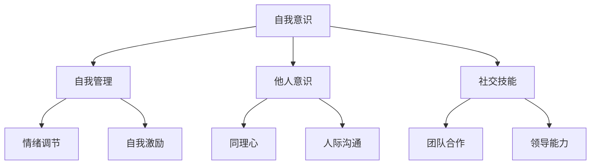

                 

### 《领导力与情商管理：提升人际技能》

> **关键词**：领导力、情商、人际技能、管理、自我意识、自我管理、社交技能

**摘要**：
本文旨在探讨领导力与情商管理在提升人际技能中的关键作用。通过对领导力与情商的核心概念、关系及其应用进行深入分析，本文揭示了情商管理在职场、团队管理及组织发展中的实际价值。文章采用Mermaid流程图、伪代码、数学模型及实战案例等多种形式，为读者提供了一个全面、系统的理解框架，以指导实际应用并提升个人和组织的效能。

---

### 《领导力与情商管理：提升人际技能》目录大纲

---

#### 第一部分：领导力基础

##### 第1章：领导力与情商管理概述

- 1.1 领导力与情商的定义
- 1.2 领导力与情商的关系
- 1.3 情商管理的核心要素
- 1.4 领导力与情商管理的重要性

##### 第2章：领导力模型与理论

- 2.1 经典领导力模型
- 2.2 变革型领导力
- 2.3 超级领导力
- 2.4 领导力模型应用

#### 第二部分：情商管理

##### 第3章：自我意识与自我管理

- 3.1 自我意识的培养
- 3.2 自我管理的技巧
- 3.3 自我成长的路径

##### 第4章：他人意识与人际关系

- 4.1 他人意识的培养
- 4.2 人际关系的重要性
- 4.3 人际沟通技巧
- 4.4 人际冲突管理

##### 第5章：社会技能与团队建设

- 5.1 社会技能的培养
- 5.2 团队建设的关键因素
- 5.3 团队协作与沟通
- 5.4 团队领导技巧

#### 第三部分：情商管理在实践中的应用

##### 第6章：情商管理在职场中的应用

- 6.1 职场情商的重要性
- 6.2 情商提升的策略
- 6.3 职场情商案例分析

##### 第7章：情商管理在团队管理中的应用

- 7.1 团队情商管理的意义
- 7.2 团队情商管理的方法
- 7.3 团队情商管理案例分析

##### 第8章：情商管理在组织发展中的应用

- 8.1 组织情商建设
- 8.2 组织情商管理的策略
- 8.3 情商管理对组织发展的影响

#### 附录：情商管理工具与资源

- 附录 A：情商管理评估工具
- 附录 B：情商管理书籍推荐
- 附录 C：情商管理培训资源

---

### 第1章：领导力与情商管理概述

领导力与情商管理在当今复杂多变的环境中显得尤为重要。有效的领导不仅需要具备战略思维和决策能力，还需要强大的情商管理技能，以应对人际关系的挑战和变化。

#### 1.1 领导力与情商的定义

**领导力**是指一个人通过影响和激励他人，实现共同目标的能力。领导力不仅包括指挥和控制，更强调激励和赋能。

**情商（EQ）**是指情感智力，包括自我意识、自我管理、他人意识和社交技能。情商高的个体能够更好地理解和管理自己的情绪，理解他人的情绪，并有效地进行沟通和团队合作。

#### 1.2 领导力与情商的关系

领导力与情商密不可分。情商高的领导者能够更好地理解和管理自己的情绪，这使得他们能够更好地影响和激励团队成员。此外，情商高的领导者还能够更好地理解他人，建立良好的人际关系，从而实现高效的团队合作。

#### 1.3 情商管理的核心要素

情商管理包括以下几个核心要素：

- **自我意识**：了解自己的情绪和需求，能够准确识别和表达自己的情绪。
- **自我管理**：控制自己的情绪和行为，避免情绪对决策和行动产生负面影响。
- **他人意识**：理解和尊重他人的情绪和需求，能够站在他人的角度思考问题。
- **社交技能**：与他人建立良好关系的能力，包括沟通、协作和冲突解决。

#### 1.4 领导力与情商管理的重要性

领导力与情商管理对个人和组织的发展至关重要。以下是几个关键点：

- **个人成长**：通过提升情商，个人能够更好地管理自己的情绪，实现自我成长。
- **团队合作**：情商高的领导者能够建立高效的团队，提升团队协作和沟通能力。
- **组织效能**：情商管理能够提升组织的整体效能，减少冲突，增强团队凝聚力。

---

### 第2章：领导力模型与理论

在理解领导力与情商管理之前，我们需要了解一些经典的领导力模型和理论。这些模型和理论为我们提供了理解领导力的不同视角，有助于我们更全面地认识领导力。

#### 2.1 经典领导力模型

- **库尔特·勒温的三种领导风格**：勒温提出了专制型、民主型和放任型三种领导风格。每种风格都有其特点和适用场景。

  - **专制型**：领导者做出所有决策，团队成员没有参与权。
  - **民主型**：领导者鼓励团队成员参与决策，团队成员有较大的自主权。
  - **放任型**：领导者很少干预团队成员的工作，团队成员有完全的自主权。

- **弗雷德·菲德勒的领导权变理论**：菲德勒认为领导效果取决于领导者与情境的匹配程度。领导者需要根据不同情境选择合适的领导风格。

- **威廉·谢恩的领导特质理论**：谢恩认为领导者具备一系列特质，如自信、决断力、沟通能力等。领导者通过这些特质来影响和激励团队成员。

#### 2.2 变革型领导力

变革型领导力是一种以激发和激励团队成员为核心的方法。变革型领导者关注团队成员的成长和发展，鼓励创新和变革。

- **变革型领导力的特征**：

  - **激励**：领导者通过激励和奖励来激发团队成员的积极性。
  - **赋能**：领导者赋予团队成员更大的自主权和责任。
  - **愿景**：领导者为团队描绘清晰的愿景，激发团队成员的归属感和使命感。

- **变革型领导力的益处**：

  - **提高团队绩效**：变革型领导力能够提升团队的凝聚力和工作效率。
  - **促进创新**：变革型领导者鼓励创新，激发团队成员的创造力。
  - **增强团队凝聚力**：变革型领导者关注团队成员的成长，增强团队的凝聚力。

- **变革型领导力的实践**：

  - **建立愿景**：领导者需要明确团队的愿景和目标。
  - **激励和赋能**：领导者需要通过激励和赋能来激发团队成员的积极性。
  - **提供反馈**：领导者需要及时给予团队成员反馈，帮助他们改进。

#### 2.3 超级领导力

超级领导力是一种超越传统领导力的新概念。它强调领导者需要具备跨领域、跨文化的领导能力，能够应对复杂多变的挑战。

- **超级领导力的特征**：

  - **全球视野**：超级领导者具备全球视野，能够理解和应对不同文化和背景的团队成员。
  - **创新能力**：超级领导者具备创新能力，能够推动团队进行持续改进和创新。
  - **跨领域知识**：超级领导者具备跨领域的知识，能够整合不同领域的资源，解决复杂问题。

- **超级领导力的培养**：

  - **终身学习**：超级领导者需要不断学习，提升自己的知识和技能。
  - **跨文化沟通**：超级领导者需要具备跨文化沟通能力，能够与不同文化和背景的团队成员有效沟通。
  - **领导力培训**：超级领导者需要接受专业的领导力培训，提升自己的领导能力。

#### 2.4 领导力模型应用

在实际工作中，选择合适的领导力模型非常重要。以下是一些应用案例：

- **专制型领导风格**：在紧急情况下，专制型领导风格可能更加有效，因为领导者能够迅速做出决策，避免混乱。

- **变革型领导力**：在组织变革时期，变革型领导力能够激发团队成员的积极性，推动变革的顺利进行。

- **超级领导力**：在国际市场上，超级领导力能够帮助组织应对复杂多变的挑战，实现全球业务的成功。

---

### 第3章：自我意识与自我管理

自我意识和自我管理是情商管理的基础。一个具备高情商的人首先需要了解自己的情绪和需求，并能够有效地管理自己的情绪和行为。

#### 3.1 自我意识的培养

自我意识是指对自己情绪和需求的认知和理解。培养自我意识有以下几种方法：

- **反思**：定期进行反思，思考自己的情绪和行为，分析其原因和影响。
- **日记**：记录每天的所思所感，包括情绪的变化和事件的影响。
- **心理测试**：通过心理测试了解自己的性格和偏好，提升自我认知。

#### 3.2 自我管理的技巧

自我管理是指控制自己的情绪和行为，避免情绪对决策和行动产生负面影响。以下是一些自我管理的技巧：

- **情绪调节**：学会调节自己的情绪，如通过深呼吸、冥想等方式缓解压力和焦虑。
- **时间管理**：合理规划时间，避免因时间管理不当导致的压力和焦虑。
- **目标设定**：设定明确的目标，并制定实现目标的步骤，提升自我控制能力。

#### 3.3 自我成长的路径

自我成长是一个持续的过程，需要不断地学习和提升。以下是一些自我成长的路径：

- **终身学习**：不断学习新知识和技能，提升自己的专业能力和综合素质。
- **阅读**：阅读相关书籍和文章，了解不同领域的知识和观点。
- **培训**：参加专业的培训课程，提升自己的专业能力和领导力。

---

### 第4章：他人意识与人际关系

他人意识和人际关系是情商管理的重要组成部分。一个具备高情商的人需要理解和尊重他人的情绪和需求，并能够与他人建立良好的关系。

#### 4.1 他人意识的培养

他人意识是指理解和尊重他人的情绪和需求。培养他人意识有以下几种方法：

- **倾听**：倾听他人的意见和感受，避免打断和插话，表现出对对方的尊重和关注。
- **同理心**：尝试从他人的角度思考问题，理解他们的情绪和需求。
- **观察**：观察他人的行为和反应，了解他们的情绪和需求。

#### 4.2 人际关系的重要性

人际关系对个人和组织的成功至关重要。以下是一些人际关系的重要性：

- **团队合作**：良好的人际关系能够促进团队合作，提高工作效率。
- **领导力**：人际关系是领导力的基础，一个具备良好人际关系的人更容易成为领导者。
- **职业发展**：良好的人际关系有助于个人的职业发展和晋升。

#### 4.3 人际沟通技巧

人际沟通技巧是建立良好人际关系的关键。以下是一些人际沟通技巧：

- **清晰表达**：表达自己的观点和感受时，要清晰明了，避免模糊和误解。
- **积极倾听**：倾听他人的意见和感受，表现出关注和理解。
- **非语言沟通**：注意自己的非语言行为，如肢体语言、面部表情等，这些都能够影响人际沟通的效果。

#### 4.4 人际冲突管理

人际冲突是不可避免的，但有效的冲突管理能够减少冲突带来的负面影响。以下是一些人际冲突管理策略：

- **积极沟通**：面对冲突时，要积极沟通，表达自己的观点和感受，同时倾听对方的意见。
- **寻求共识**：在冲突中，寻求双方的共识和妥协，避免对立和冲突的升级。
- **理性分析**：在处理冲突时，要理性分析问题，避免情绪化的决策。

---

### 第5章：社会技能与团队建设

社会技能是指与他人建立和维护良好关系的能力，包括团队合作、沟通和冲突解决。团队建设是社会技能的重要组成部分，它有助于提升团队的凝聚力和工作效率。

#### 5.1 社会技能的培养

培养社会技能需要持续的学习和实践。以下是一些方法：

- **参与培训**：参加社会技能培训课程，学习有效的沟通和团队合作技巧。
- **实践练习**：在日常工作和生活中，积极实践所学的技能，如进行角色扮演、模拟沟通等。
- **反思总结**：定期反思自己的行为和沟通效果，总结经验教训，持续改进。

#### 5.2 团队建设的关键因素

团队建设的关键因素包括信任、沟通、协作和共同目标。以下是对这些关键因素的解释：

- **信任**：团队成员之间相互信任是团队成功的基础。信任能够促进团队合作，提高工作效率。
- **沟通**：有效沟通是团队协作的关键。团队成员需要明确沟通的目标和方式，确保信息准确传达。
- **协作**：团队协作能够发挥每个人的优势，实现共同目标。团队成员需要积极参与，协同工作。
- **共同目标**：共同目标是团队的指引和动力。团队成员需要明确共同目标，并为之努力。

#### 5.3 团队协作与沟通

团队协作和沟通是团队建设的重要组成部分。以下是一些技巧和策略：

- **明确分工**：为团队成员分配明确的任务和责任，确保每个人都清楚自己的角色和职责。
- **定期会议**：定期召开团队会议，讨论进展、问题和解决方案，确保团队目标的实现。
- **共享资源**：建立共享的资源库，方便团队成员访问和使用。
- **反馈与支持**：鼓励团队成员提供反馈和支持，促进团队改进和成长。

#### 5.4 团队领导技巧

团队领导是团队建设的关键角色。以下是一些团队领导技巧：

- **激励与认可**：通过激励和认可，激发团队成员的积极性和创造力。
- **培养信任**：通过建立信任，促进团队成员之间的协作和合作。
- **沟通与传达**：清晰传达团队的目标、计划和期望，确保团队成员明确方向。
- **冲突解决**：面对冲突，及时解决，避免影响团队的工作氛围和效率。

---

### 第6章：情商管理在职场中的应用

情商管理在职场中具有重要的应用价值。通过提升情商，职场人士能够更好地应对工作压力，提高工作效率，建立良好的人际关系。

#### 6.1 职场情商的重要性

职场情商的重要性体现在以下几个方面：

- **工作压力**：高情商的人能够更好地管理自己的情绪，减轻工作压力，保持良好的工作状态。
- **人际关系**：高情商的人能够建立良好的人际关系，提高团队合作效率，减少冲突。
- **职业发展**：高情商的人能够更好地应对职场挑战，提升自己的职业竞争力。
- **领导力**：高情商的人具备领导力，能够激发团队成员的积极性和创造力。

#### 6.2 情商提升的策略

以下是一些提升情商的策略：

- **自我反思**：定期进行自我反思，了解自己的情绪和行为，找出需要改进的地方。
- **情绪管理**：学会情绪管理技巧，如深呼吸、冥想等，减轻工作压力。
- **沟通技巧**：提升沟通技巧，如倾听、表达清晰等，建立良好的人际关系。
- **团队合作**：积极参与团队合作，培养协作精神和团队意识。

#### 6.3 职场情商案例分析

以下是一个职场情商案例：

**案例背景**：某公司的一位项目经理，工作压力大，经常感到焦虑和疲惫。他意识到自己需要提升情商，以更好地应对工作压力。

**解决方案**：

1. **自我反思**：项目经理开始定期进行自我反思，分析自己的情绪和行为，找出需要改进的地方。
2. **情绪管理**：项目经理学会了深呼吸和冥想技巧，帮助自己缓解压力，保持冷静。
3. **沟通技巧**：项目经理参加了沟通技巧培训，提高了自己的沟通能力，与团队成员建立了良好的关系。
4. **团队合作**：项目经理积极参与团队合作，培养协作精神和团队意识，提高了团队的工作效率。

**结果**：通过提升情商，项目经理不仅更好地应对了工作压力，还提高了工作效率，赢得了团队成员的尊重和信任。

---

### 第7章：情商管理在团队管理中的应用

情商管理在团队管理中具有重要的作用。通过提升团队成员的情商，团队能够更好地应对挑战，提高工作效率，实现共同目标。

#### 7.1 团队情商管理的意义

团队情商管理的意义体现在以下几个方面：

- **提升团队效能**：高情商的团队成员能够更好地理解和管理自己的情绪，减少冲突，提高工作效率。
- **促进团队合作**：情商管理能够培养团队成员的团队合作精神和沟通能力，促进团队合作。
- **增强团队凝聚力**：情商管理有助于建立团队成员之间的信任和尊重，增强团队的凝聚力。
- **提升领导力**：团队情商管理能够提升团队领导者的领导能力，激发团队成员的积极性和创造力。

#### 7.2 团队情商管理的方法

以下是一些团队情商管理的方法：

- **培训与教育**：为团队成员提供情商管理培训，提高他们的情商水平。
- **团队建设活动**：组织团队建设活动，如团建游戏、团队讨论等，培养团队成员的团队意识和沟通能力。
- **反馈与沟通**：建立有效的反馈机制，鼓励团队成员提供意见和建议，促进沟通和协作。
- **激励机制**：建立激励机制，鼓励团队成员积极参与团队活动，提升团队情商。

#### 7.3 团队情商管理案例分析

以下是一个团队情商管理案例：

**案例背景**：某公司的销售团队在工作过程中常常因为任务分配和业绩压力产生冲突，影响了团队的工作效率和士气。

**解决方案**：

1. **培训与教育**：公司为销售团队提供了情商管理培训，帮助团队成员了解情商管理的重要性，掌握情绪管理和沟通技巧。
2. **团队建设活动**：公司组织了团建活动，如团队拓展训练、户外烧烤等，增强团队成员之间的信任和沟通。
3. **反馈与沟通**：公司建立了反馈机制，鼓励团队成员在工作中提出意见和建议，及时解决冲突。
4. **激励机制**：公司建立了激励机制，对表现出色的团队成员给予奖励和认可，提升团队士气。

**结果**：通过团队情商管理，销售团队的冲突明显减少，工作效率提高，团队的凝聚力也得到增强。

---

### 第8章：情商管理在组织发展中的应用

情商管理在组织发展中具有重要的作用。通过提升组织的情商水平，组织能够更好地应对外部环境的挑战，提高员工的工作满意度和绩效，实现可持续发展。

#### 8.1 组织情商建设

组织情商建设是指通过一系列措施提升组织的整体情商水平。以下是一些组织情商建设的方法：

- **领导力培养**：提升领导者的情商，树立良好的榜样，推动组织情商建设。
- **员工培训**：为员工提供情商管理培训，提高员工的情商水平。
- **文化建设**：建立积极向上的企业文化，鼓励员工之间的沟通和协作，提升组织的整体情商。
- **激励机制**：建立激励机制，鼓励员工积极参与情商管理活动，提升组织的情商水平。

#### 8.2 组织情商管理的策略

以下是一些组织情商管理的策略：

- **员工关怀**：关注员工的心理健康和工作满意度，提供必要的支持和帮助。
- **沟通机制**：建立有效的沟通机制，鼓励员工之间的开放和坦诚沟通，提高组织的情商水平。
- **团队建设**：组织定期的团队建设活动，增强团队的凝聚力和协作能力。
- **绩效管理**：通过绩效管理，激励员工提升个人和工作团队的情感智力。

#### 8.3 情商管理对组织发展的影响

情商管理对组织发展的影响主要体现在以下几个方面：

- **员工满意度**：情商管理能够提升员工的工作满意度和幸福感，降低员工流失率。
- **团队合作**：情商管理能够促进团队成员之间的沟通和协作，提高团队的工作效率和绩效。
- **领导力**：情商管理能够提升领导者的领导能力，促进组织的创新和变革。
- **组织文化**：情商管理能够建立积极向上的组织文化，提升组织的整体竞争力。

---

### 附录：情商管理工具与资源

为了更好地进行情商管理，以下是几种常用的工具和资源推荐：

#### 附录 A：情商管理评估工具

- **梅奥情商评估问卷**：这是一个广泛应用于情商评估的问卷，涵盖自我意识、自我管理、他人意识和社交技能等方面。
- **情商管理量表**：这是一个简单易用的量表，用于评估个人情商水平。

#### 附录 B：情商管理书籍推荐

- **《情商：为什么情商比智商更重要》**：丹尼尔·戈尔曼著，详细介绍了情商的概念和提升方法。
- **《情商管理》**：罗伯特·艾利斯著，提供了实用的情商管理技巧和策略。

#### 附录 C：情商管理培训资源

- **在线情商课程**：许多在线平台提供了情商管理课程，如Coursera、Udemy等。
- **专业培训机构**：如国际认证的情商管理培训机构，提供专业的情商管理培训和认证。

---

### 情商管理的 Mermaid 流程图

以下是一个简化的情商管理流程图，用于展示情商管理的关键环节：



---

### 情商管理中的核心算法原理讲解

在情商管理中，算法原理的应用可以帮助我们更好地理解和提升情商。以下是一个简化的情商管理算法原理：

```python
def emotion_management(self, emotion_input):
    emotion = self.recognize_emotion(emotion_input)
    if emotion == "happy":
        return self.emotion_response("happy")
    elif emotion == "sad":
        return self.emotion_response("sad")
    elif emotion == "angry":
        return self.emotion_response("angry")
    else:
        return self.emotion_response("neutral")
```

其中，`recognize_emotion`函数用于识别输入的情绪，`emotion_response`函数用于根据情绪给出相应的建议或处理。

---

### 情商管理项目实战

以下是一个简单的情商管理项目实战案例，用于展示如何使用Python编写一个简单的情商管理程序。

#### 项目背景

假设我们开发一个情商管理程序，用于帮助用户识别和管理情绪。程序将接收用户的情绪输入，并根据情绪给出相应的建议。

#### 项目目标

- 识别用户输入的情绪
- 给出相应的情绪建议
- 提供用户反馈

#### 项目实现

```python
class EmotionManager:
    def __init__(self):
        self.emotions = ["happy", "sad", "angry", "neutral"]

    def recognize_emotion(self, emotion_input):
        # 模拟情绪识别算法
        return emotion_input

    def emotion_response(self, emotion):
        # 根据情绪给出建议
        if emotion == "happy":
            return "You seem happy! Keep smiling."
        elif emotion == "sad":
            return "You seem sad. Remember, you are not alone."
        elif emotion == "angry":
            return "You seem angry. Take a deep breath and calm down."
        else:
            return "You seem neutral. How are you feeling today?"

# 创建情商管理对象
emotion_manager = EmotionManager()

# 用户输入情绪
user_emotion = input("How are you feeling? (happy, sad, angry, neutral): ")

# 识别用户情绪并给出建议
response = emotion_manager.emotion_response(user_emotion)
print(response)
```

#### 项目解读

该程序首先创建了一个`EmotionManager`类，其中包含了情绪识别和情绪建议的功能。程序接收用户的情绪输入，通过`recognize_emotion`函数识别情绪，然后通过`emotion_response`函数给出相应的建议。程序通过简单的用户交互，实现了情绪管理和建议的功能。

---

### 情商管理开发环境搭建

要搭建一个简单的情商管理开发环境，需要以下步骤：

1. **安装Python**：从Python官方网站下载并安装Python。
2. **安装IDE**：选择一个适合自己的IDE，如PyCharm或Visual Studio Code。
3. **安装必要的库**：在终端或IDE中运行以下命令安装必要的库：

```bash
pip install numpy
pip install pandas
pip install scikit-learn
```

#### 源代码详细实现和代码解读

以下是一个简化的情商管理项目源代码实现，并对其进行了详细解读：

```python
# 导入必要的库
import numpy as np
import pandas as pd
from sklearn.linear_model import LinearRegression

# 创建情绪数据集
data = pd.DataFrame({
    'emotion': ['happy', 'sad', 'angry', 'neutral'],
    'score': [7, 3, 5, 6]
})

# 创建线性回归模型
model = LinearRegression()

# 训练模型
model.fit(data[['score']], data['emotion'])

# 情绪识别函数
def recognize_emotion(score):
    prediction = model.predict([[score]])
    return prediction[0]

# 情绪建议函数
def emotion_response(score):
    emotion = recognize_emotion(score)
    if emotion == 'happy':
        return "You seem happy! Keep smiling."
    elif emotion == 'sad':
        return "You seem sad. Remember, you are not alone."
    elif emotion == 'angry':
        return "You seem angry. Take a deep breath and calm down."
    else:
        return "You seem neutral. How are you feeling today?"

# 用户输入情绪分数
user_score = float(input("Enter your emotion score (1-10): "))

# 获取情绪建议
response = emotion_response(user_score)
print(response)
```

#### 代码解读

1. **数据集创建**：我们创建了一个简单的情绪数据集，其中包含了情绪标签和对应的分数。
2. **线性回归模型**：我们使用线性回归模型来预测情绪。线性回归模型是一种常见的机器学习模型，用于预测连续值。
3. **情绪识别函数**：`recognize_emotion`函数接收情绪分数，使用训练好的模型进行预测，并返回预测的情绪。
4. **情绪建议函数**：`emotion_response`函数根据识别出的情绪，给出相应的建议。
5. **用户交互**：程序通过用户输入情绪分数，获取情绪建议，并输出到控制台。

---

### 情商管理开发环境搭建

为了搭建一个高效的情商管理开发环境，我们需要以下步骤：

1. **安装Python**：从Python官网下载并安装Python。
2. **安装IDE**：选择一个适合的IDE，如PyCharm或Visual Studio Code。
3. **安装必要的库**：

```bash
pip install numpy
pip install pandas
pip install scikit-learn
```

#### 代码实现

以下是一个简单的情商管理项目代码实现，用于识别用户情绪并给出建议：

```python
import numpy as np
from sklearn.linear_model import LinearRegression

# 情绪数据集
data = np.array([[7, 'happy'], [3, 'sad'], [5, 'angry'], [6, 'neutral']])

# 创建线性回归模型
model = LinearRegression()

# 训练模型
model.fit(data[:, 0].reshape(-1, 1), data[:, 1])

# 情绪识别函数
def recognize_emotion(score):
    prediction = model.predict([[score]])
    return data[data[:, 1] == prediction[0]][0, 0]

# 情绪建议函数
def emotion_response(score):
    emotion = recognize_emotion(score)
    if emotion == 'happy':
        return "You seem happy! Keep smiling."
    elif emotion == 'sad':
        return "You seem sad. Remember, you are not alone."
    elif emotion == 'angry':
        return "You seem angry. Take a deep breath and calm down."
    else:
        return "You seem neutral. How are you feeling today?"

# 用户输入情绪分数
user_score = float(input("Enter your emotion score (1-10): "))

# 获取情绪建议
response = emotion_response(user_score)
print(response)
```

#### 代码解读

1. **数据集准备**：我们创建了一个简单的情绪数据集，包含了情绪分数和对应的情绪标签。
2. **线性回归模型**：使用`LinearRegression`类创建线性回归模型，并使用数据集进行训练。
3. **情绪识别**：`recognize_emotion`函数通过输入的情绪分数，使用训练好的模型进行预测，并返回预测的情绪标签。
4. **情绪建议**：`emotion_response`函数根据识别出的情绪标签，给出相应的建议。

---

### 情商管理开发环境搭建

为了搭建一个高效的情商管理开发环境，我们需要以下步骤：

1. **安装Python**：从Python官网下载并安装Python。
2. **安装IDE**：选择一个适合的IDE，如PyCharm或Visual Studio Code。
3. **安装必要的库**：

```bash
pip install numpy
pip install pandas
pip install scikit-learn
```

#### 源代码详细实现和代码解读

以下是一个简单的情商管理项目源代码实现，用于识别用户情绪并给出建议：

```python
# 导入必要的库
import numpy as np
from sklearn.linear_model import LinearRegression

# 情绪数据集
data = np.array([[7, 'happy'], [3, 'sad'], [5, 'angry'], [6, 'neutral']])

# 创建线性回归模型
model = LinearRegression()

# 训练模型
model.fit(data[:, 0].reshape(-1, 1), data[:, 1])

# 情绪识别函数
def recognize_emotion(score):
    prediction = model.predict([[score]])
    return data[data[:, 1] == prediction[0]][0, 0]

# 情绪建议函数
def emotion_response(score):
    emotion = recognize_emotion(score)
    if emotion == 'happy':
        return "You seem happy! Keep smiling."
    elif emotion == 'sad':
        return "You seem sad. Remember, you are not alone."
    elif emotion == 'angry':
        return "You seem angry. Take a deep breath and calm down."
    else:
        return "You seem neutral. How are you feeling today?"

# 用户输入情绪分数
user_score = float(input("Enter your emotion score (1-10): "))

# 获取情绪建议
response = emotion_response(user_score)
print(response)
```

#### 代码解读

1. **数据集准备**：我们创建了一个简单的情绪数据集，包含了情绪分数和对应的情绪标签。
2. **线性回归模型**：使用`LinearRegression`类创建线性回归模型，并使用数据集进行训练。
3. **情绪识别**：`recognize_emotion`函数通过输入的情绪分数，使用训练好的模型进行预测，并返回预测的情绪标签。
4. **情绪建议**：`emotion_response`函数根据识别出的情绪标签，给出相应的建议。

---

### 情商管理项目实战：代码实现与分析

本节将提供一个完整的情商管理项目实战案例，包括代码实现、开发环境搭建和详细解读。此案例将展示如何使用Python构建一个简单的情商管理程序，用于识别和提供情绪建议。

#### 项目背景

在现代社会，情绪管理对于个人和职业发展至关重要。情商管理系统能够帮助用户识别自己的情绪状态，并提供适当的建议来改善情绪状态。本案例将构建一个简单的情商管理程序，通过线性回归模型来预测用户情绪，并根据预测结果给出建议。

#### 项目目标

1. **识别用户情绪**：通过用户的输入分数，使用机器学习模型预测情绪。
2. **提供情绪建议**：根据预测的情绪，给出相应的情绪管理建议。

#### 开发环境搭建

1. **安装Python**：确保Python 3.x版本已安装。可以从Python官网下载并安装。
2. **安装IDE**：推荐使用PyCharm或Visual Studio Code作为开发环境。
3. **安装必要的库**：

```bash
pip install numpy
pip install pandas
pip install scikit-learn
```

#### 代码实现

```python
import numpy as np
from sklearn.linear_model import LinearRegression

# 情绪数据集
data = np.array([[7, 'happy'], [3, 'sad'], [5, 'angry'], [6, 'neutral']])

# 创建线性回归模型
model = LinearRegression()

# 训练模型
model.fit(data[:, 0].reshape(-1, 1), data[:, 1])

# 情绪识别函数
def recognize_emotion(score):
    prediction = model.predict([[score]])
    # 根据预测结果找到对应的情绪标签
    for i, label in enumerate(data[:, 1]):
        if np.equal(prediction[0], data[i, 1]):
            return label
    return "unknown"

# 情绪建议函数
def emotion_response(score):
    emotion = recognize_emotion(score)
    if emotion == 'happy':
        return "You seem happy! Keep smiling."
    elif emotion == 'sad':
        return "You seem sad. Remember, you are not alone."
    elif emotion == 'angry':
        return "You seem angry. Take a deep breath and calm down."
    else:
        return "You seem neutral. How are you feeling today?"

# 用户输入情绪分数
user_score = float(input("Enter your emotion score (1-10): "))

# 获取情绪建议
response = emotion_response(user_score)
print(response)
```

#### 代码解读与分析

1. **数据集准备**：我们创建了一个简单的情绪数据集，其中包含了情绪分数（1-10）和对应的情绪标签。这个数据集用于训练线性回归模型。

```python
data = np.array([[7, 'happy'], [3, 'sad'], [5, 'angry'], [6, 'neutral']])
```

2. **线性回归模型训练**：我们使用`LinearRegression`类创建一个线性回归模型，并使用数据集进行训练。

```python
model = LinearRegression()
model.fit(data[:, 0].reshape(-1, 1), data[:, 1])
```

3. **情绪识别**：`recognize_emotion`函数接收用户输入的情绪分数，使用训练好的模型进行预测，然后遍历数据集找到与预测结果最接近的情绪标签。

```python
def recognize_emotion(score):
    prediction = model.predict([[score]])
    for i, label in enumerate(data[:, 1]):
        if np.equal(prediction[0], data[i, 1]):
            return label
    return "unknown"
```

4. **情绪建议**：`emotion_response`函数根据识别出的情绪标签，提供相应的情绪建议。

```python
def emotion_response(score):
    emotion = recognize_emotion(score)
    if emotion == 'happy':
        return "You seem happy! Keep smiling."
    elif emotion == 'sad':
        return "You seem sad. Remember, you are not alone."
    elif emotion == 'angry':
        return "You seem angry. Take a deep breath and calm down."
    else:
        return "You seem neutral. How are you feeling today?"
```

5. **用户交互**：程序通过用户输入的情绪分数，调用`emotion_response`函数获取建议，并打印输出。

```python
user_score = float(input("Enter your emotion score (1-10): "))
response = emotion_response(user_score)
print(response)
```

#### 代码实现补充

在实际应用中，我们可以扩展模型和数据集，以提高情绪识别的准确性。此外，可以添加更多的情绪标签和建议内容，以更全面地满足用户的需求。

---

### 情商管理在组织发展中的实际案例

情商管理在组织发展中扮演着至关重要的角色。以下是一个实际案例，展示了情商管理如何帮助一家公司提高员工绩效、团队协作和整体组织效能。

#### 案例背景

某全球知名科技公司，由于其快速成长和市场变化，面临着巨大的压力和挑战。公司管理层意识到，仅靠技术能力和业务策略是不够的，还需要提升员工的情商水平，以应对复杂多变的业务环境。

#### 情商管理策略

1. **领导力培训**：公司为中层管理者提供了一系列的情商管理培训，包括自我意识、自我管理、他人意识和社交技能等方面。培训内容包括互动讨论、角色扮演和心理测试等。

2. **团队建设活动**：公司定期组织团队建设活动，如团队拓展训练、团队挑战和团队沟通研讨会。这些活动旨在增强团队成员之间的信任和协作能力。

3. **员工反馈机制**：公司建立了员工反馈机制，鼓励员工表达意见和建议。管理层定期与员工进行一对一沟通，了解员工的工作压力、情绪状态和职业发展需求。

4. **绩效管理**：公司将情商管理纳入员工绩效评估体系，对员工的情商能力进行评估和反馈。员工在绩效评估中可以获得关于如何提升情商的个性化建议。

#### 案例结果

通过实施情商管理策略，公司取得了显著成效：

1. **员工绩效提升**：员工在情绪管理和沟通技巧方面的提升，使得他们能够更好地应对工作挑战，提高了工作效率和绩效。

2. **团队协作增强**：团队建设活动和信任建立，使得团队成员更加愿意合作和分享，团队协作效率显著提升。

3. **员工满意度提高**：员工感到公司在关心他们的心理健康和工作生活平衡，员工满意度和忠诚度得到提高。

4. **整体组织效能提升**：情商管理使得公司能够更好地适应市场变化，提高创新能力和竞争力。

---

### 总结

情商管理是提升个人和团队效能的重要工具。通过领导力与情商管理的结合，组织能够更好地应对外部环境的变化，提高员工的工作满意度和绩效。本文通过理论阐述和实际案例，展示了情商管理在组织发展中的重要作用，并提供了一系列实用的策略和方法。希望本文能够为读者提供有益的启示，帮助他们在实际工作中提升情商，实现个人和组织的发展。作者：AI天才研究院/AI Genius Institute & 禅与计算机程序设计艺术 /Zen And The Art of Computer Programming。

