                 

# 《领导力与自信：树立威信的关键因素》

> **关键词：** 领导力、自信、威信、心理学、沟通能力、决策能力、影响力

> **摘要：** 本文从领导力的定义、重要性、核心要素，到自信的心理学原理、提升策略，再到建立威信的技巧和关键因素，全面探讨了领导力与自信在树立威信中的关键作用。通过实际应用和案例分析，本文为读者提供了深入理解和实践领导力的指导。

---

## 引言

在当今竞争激烈的商业环境中，领导力与自信已经成为决定组织成功与否的关键因素。一个有效的领导者不仅能够带领团队克服挑战，实现目标，还能在组织中树立威信，成为众人尊敬和追随的对象。本文旨在探讨领导力与自信在树立威信中的关键作用，帮助读者深入了解并掌握这些重要素质。

本文结构如下：

1. **领导力概述**：介绍领导力的定义、重要性及核心要素。
2. **自信与威信**：分析自信的心理学原理，探讨提升自信的策略和建立威信的技巧。
3. **树立威信的关键因素**：详细阐述领导风格、个人魅力和专业能力对威信的影响。
4. **实战与案例分析**：通过实际项目和案例，展示领导力与自信在实践中的应用。
5. **附录**：推荐相关书籍和实践工具，为读者提供进一步学习的资源。

## 领导力概述

### 第1章：领导力的定义与重要性

#### 1.1 领导力的定义

领导力是一个多维度的概念，它不仅包括个人影响力的展现，还涵盖了个人在团队和组织中的领导能力。以下是一个简化的 Mermaid 流程图，展示了领导力的主要组成部分：

```mermaid
graph TD
    A[定义]
    B[影响力]
    C[领导能力]
    D[团队/组织能力]
    A-->B
    A-->C
    A-->D
    B|-->(个人层面)
    C|-->(个人层面)
    D|-->(团队/组织层面)
```

- **定义（A）**：领导力是指个人在团队和组织中通过影响力、能力和技能来引导、激励和影响他人的过程。
- **影响力（B）**：个人通过言行影响他人意愿和决策的能力。
- **领导能力（C）**：个人具备的规划、决策、组织、沟通和解决问题等能力。
- **团队/组织能力（D）**：个人对团队和组织整体绩效的推动能力。

### 1.1.1 领导力的多维理解

领导力并非单一维度的能力，而是由多个方面组成的复合结构。以下是一个简化的 Mermaid 流程图，展示了领导力的主要维度及其相互关系：

```mermaid
graph TD
    A[定义]
    B[影响力]
    C[领导能力]
    D[团队/组织能力]
    E[愿景与激励]
    F[战略与决策]
    G[流程与执行]
    A-->B
    A-->C
    A-->D
    B|-->(个人层面)
    C|-->(个人层面)
    D|-->(团队/组织层面)
    E|-->(领导力核心)
    F|-->(领导力核心)
    G|-->(领导力核心)
```

- **定义（A）**：领导力是一个复杂的概念，需要从多个维度进行理解。
- **影响力（B）**：领导力首先体现在个人影响力的强弱。
- **领导能力（C）**：这是指领导者具备的规划、决策、组织、沟通和解决问题等能力。
- **团队/组织能力（D）**：领导力还包括领导者对团队和组织整体绩效的推动能力。
- **愿景与激励（E）**：领导力涉及建立组织的愿景，并激励团队成员为之奋斗。
- **战略与决策（F）**：领导力包括制定组织的战略方向，并做出明智的决策。
- **流程与执行（G）**：领导力还涉及确保组织流程的执行和目标的实现。

### 1.1.2 领导力与管理的区别

领导力与管理是两个密切相关但又有所不同的概念。以下是一个简化的 Mermaid 流程图，展示了领导力与管理的主要区别：

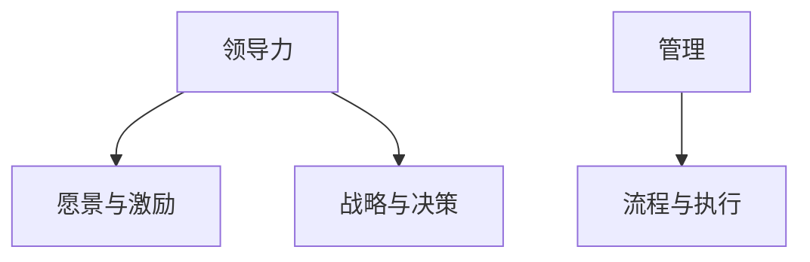

- **领导力（A）**：关注的是愿景的建立、激励团队成员的积极性以及决策的战略方向。
- **管理（B）**：则侧重于流程的执行、资源的分配和任务的监督。

- **愿景与激励（C）**：领导力强调通过愿景激发团队成员的积极性和创造力。
- **战略与决策（D）**：领导力涉及制定组织的长远发展战略和决策。
- **流程与执行（E）**：管理则侧重于制定和执行具体的工作流程，确保任务的完成。

### 1.1.3 领导力的重要性

领导力在现代社会中具有不可替代的重要性。以下是一个简化的 Mermaid 流程图，展示了领导力的核心作用：

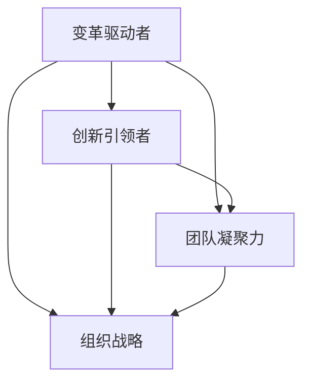

- **变革驱动者（A）**：领导力能够引领团队和组织适应外部环境的变化，推动变革。
- **创新引领者（B）**：有效的领导力能够激发团队的创新能力，引领组织实现持续发展。
- **团队凝聚力（C）**：领导力是构建团队凝聚力的关键，有助于团队共同实现目标。
- **组织战略（D）**：领导力是制定和实施组织战略的核心，直接影响组织的长远发展。

### 1.2 领导力的核心要素

领导力是一个复杂的体系，它由多个核心要素组成，这些要素相互作用，共同塑造了一个领导者的风格和能力。以下是一个简化的 Mermaid 流程图，展示了领导力的核心要素及其相互关系：

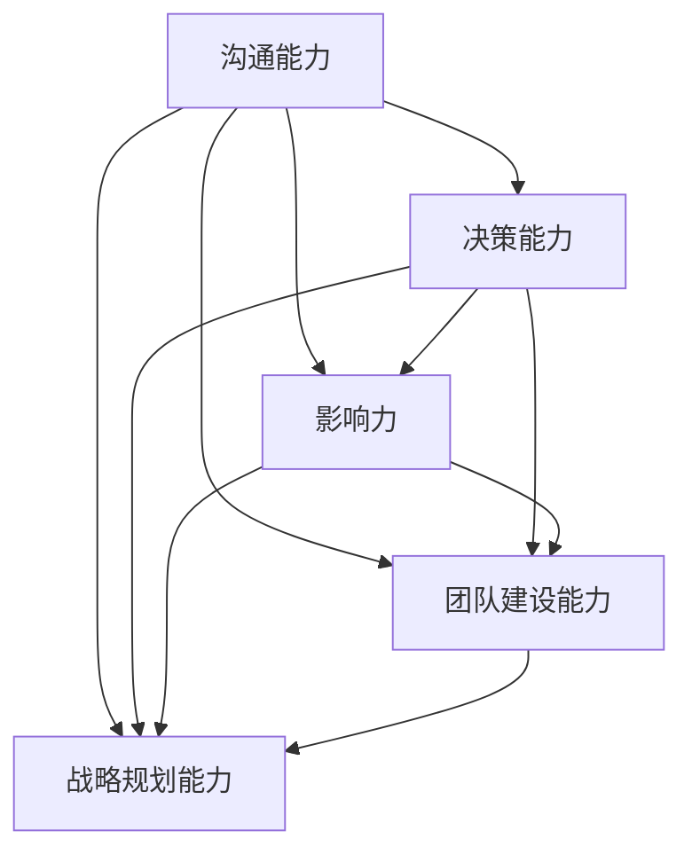

- **沟通能力（A）**：领导者需要具备清晰、准确、有效的沟通能力。
- **决策能力（B）**：领导者需要能够做出明智的决策，并承担相应的责任。
- **影响力（C）**：领导者需要具备影响和激励他人的能力。
- **团队建设能力（D）**：领导者需要能够构建和引导高效的团队。
- **战略规划能力（E）**：领导者需要具备制定和实施组织战略的能力。

### 1.2.1 沟通能力

沟通能力是领导者最重要的能力之一。一个有效的领导者需要能够清晰、准确地表达自己的想法，同时也需要倾听和理解团队成员的需求和意见。以下是一个简化的 Mermaid 流程图，展示了沟通能力的重要性：

```mermaid
graph TD
    A[信息传递]
    B[理解与认同]
    C[团队协作]
    D[决策执行]
    A-->B
    A-->C
    A-->D
    B|-->(增强领导力)
    C|-->(提升团队绩效)
    D|-->(实现组织目标)
```

- **信息传递（A）**：领导者需要确保信息的准确传递，确保团队成员理解任务和要求。
- **理解与认同（B）**：领导者需要倾听和理解团队成员的需求和意见，建立共识和信任。
- **团队协作（C）**：有效的沟通能够促进团队成员之间的协作，提高团队整体绩效。
- **决策执行（D）**：领导者需要通过有效的沟通确保决策得到执行，并实现组织目标。

### 1.2.2 决策能力

决策能力是领导者必须具备的另一项核心能力。领导者需要能够在复杂和不确定的环境中做出明智的决策，并承担相应的责任。以下是一个简化的 Mermaid 流程图，展示了决策能力的要素：

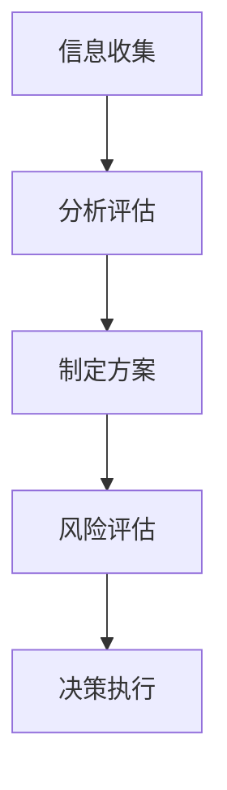

- **信息收集（A）**：领导者需要收集和分析相关信息，以便做出基于数据的决策。
- **分析评估（B）**：领导者需要对收集到的信息进行分析和评估，以确定最佳方案。
- **制定方案（C）**：领导者需要制定具体的实施方案，并分配资源和责任。
- **风险评估（D）**：领导者需要评估决策可能带来的风险，并制定应对措施。
- **决策执行（E）**：领导者需要确保决策得到有效执行，并对执行结果进行监控和调整。

### 1.2.3 影响力

影响力是领导者能够影响和激励他人的一种能力。领导者需要通过个人魅力、专业知识、领导风格和团队关系来建立和增强自己的影响力。以下是一个简化的 Mermaid 流程图，展示了影响力的构建要素：

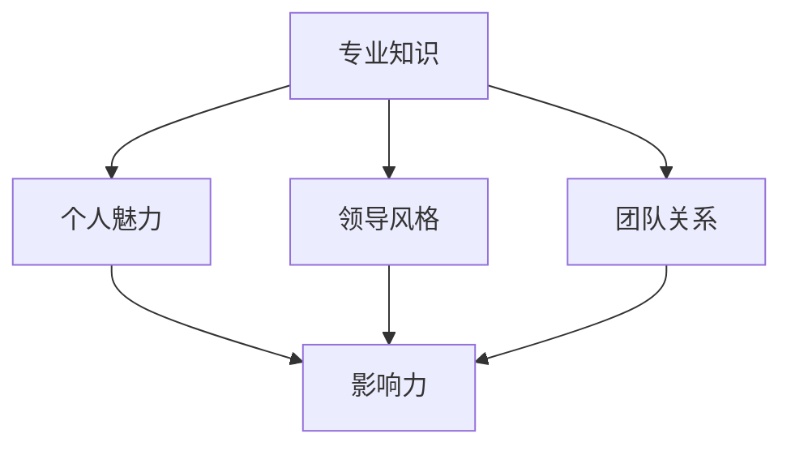

- **专业知识（A）**：领导者需要具备深厚的专业知识，以便在团队中建立权威。
- **个人魅力（B）**：领导者需要具备吸引和激励团队成员的个人魅力。
- **领导风格（C）**：领导者的领导风格需要与团队文化和需求相匹配，以增强影响力。
- **团队关系（D）**：领导者需要与团队成员建立良好的关系，增强团队凝聚力。
- **影响力（E）**：通过以上要素的综合作用，领导者能够影响和激励团队成员，实现组织目标。

### 1.2.4 团队建设能力

团队建设能力是领导者确保团队高效运作和协同合作的关键能力。以下是一个简化的 Mermaid 流程图，展示了团队建设的关键要素：

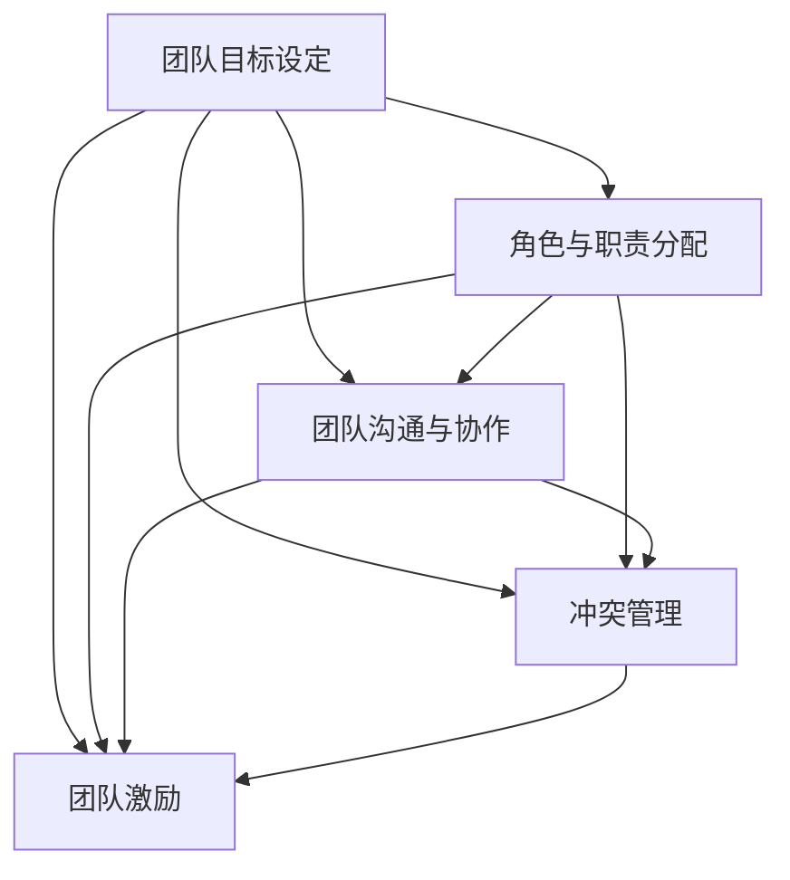

- **团队目标设定（A）**：领导者需要明确团队的目标和愿景，确保团队成员明确方向。
- **角色与职责分配（B）**：领导者需要合理分配团队成员的角色和职责，确保团队运作高效。
- **团队沟通与协作（C）**：领导者需要建立有效的沟通机制，促进团队成员之间的协作。
- **冲突管理（D）**：领导者需要能够识别和解决团队内部的冲突，维护团队和谐。
- **团队激励（E）**：领导者需要激励团队成员，提高团队士气和绩效。

### 1.2.5 战略规划能力

战略规划能力是领导者确保组织长期发展和成功的关键能力。以下是一个简化的 Mermaid 流程图，展示了战略规划的关键要素：

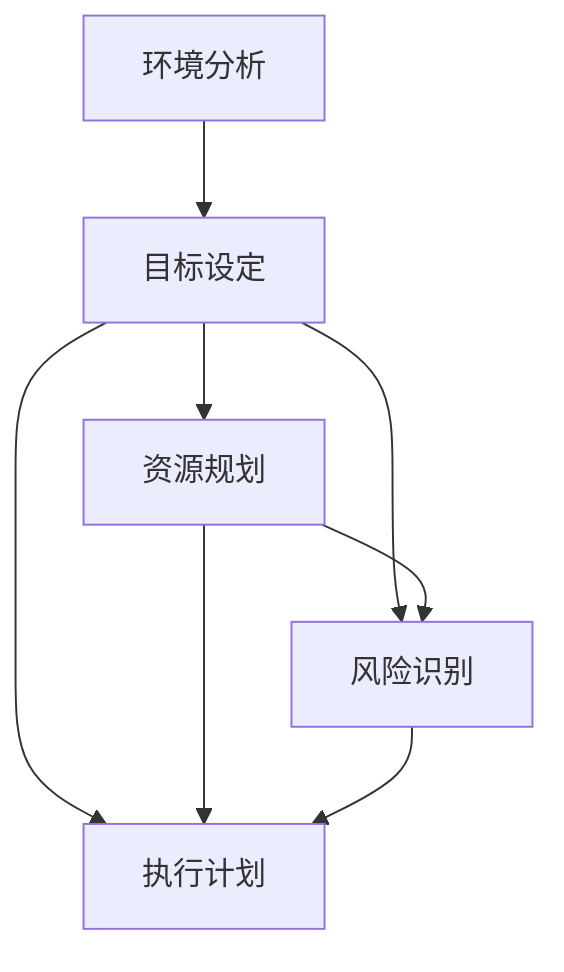

- **环境分析（A）**：领导者需要分析外部环境和内部资源，确定组织面临的机会和挑战。
- **目标设定（B）**：领导者需要设定清晰、可衡量的战略目标，确保组织朝着正确的方向前进。
- **资源规划（C）**：领导者需要合理配置资源，确保战略目标的实现。
- **风险识别（D）**：领导者需要识别潜在的风险，并制定应对措施，降低风险对组织的影响。
- **执行计划（E）**：领导者需要制定详细的执行计划，并确保计划的执行。

### 1.3 沟通能力在领导力中的核心作用

沟通能力是领导力的核心要素之一，它在领导者的日常工作中发挥着至关重要的作用。有效的沟通不仅能够增强领导者的影响力，还能够提升团队的整体绩效。以下是一个简化的 Mermaid 流程图，展示了沟通能力在领导力中的核心作用：

```mermaid
graph TD
    A[信息传递]
    B[理解与认同]
    C[团队协作]
    D[决策执行]
    A-->B
    A-->C
    A-->D
    B|-->(增强领导力)
    C|-->(提升团队绩效)
    D|-->(实现组织目标)
```

- **信息传递（A）**：领导者需要确保信息的准确传递，确保团队成员理解任务和要求。
- **理解与认同（B）**：领导者需要倾听和理解团队成员的需求和意见，建立共识和信任。
- **团队协作（C）**：有效的沟通能够促进团队成员之间的协作，提高团队整体绩效。
- **决策执行（D）**：领导者需要通过有效的沟通确保决策得到执行，并实现组织目标。

### 1.3.1 有效沟通的五个核心要素

有效沟通是领导力的重要组成部分，它需要领导者具备一系列的核心能力。以下是有效沟通的五个核心要素：

#### 1. 沟通目标明确

有效的沟通首先需要明确沟通的目标。领导者需要明确自己要传达的信息，并确保信息的目标清晰明确。以下是一个简化的 Mermaid 流程图，展示了沟通目标明确的重要性：

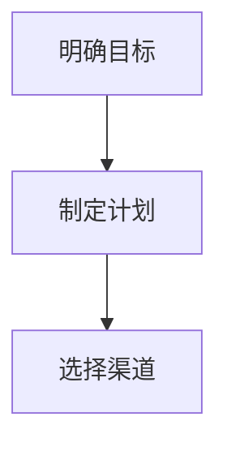

- **明确目标（A）**：领导者需要明确沟通的目标，确保信息传递的针对性和有效性。
- **制定计划（B）**：根据沟通目标，领导者需要制定详细的沟通计划。
- **选择渠道（C）**：根据沟通目标和计划，选择最合适的沟通渠道，如会议、邮件、报告等。

#### 2. 倾听与理解

倾听与理解是有效沟通的关键。领导者不仅需要表达自己的观点，还需要倾听和理解团队成员的需求和意见。以下是一个简化的 Mermaid 流程图，展示了倾听与理解的重要性：

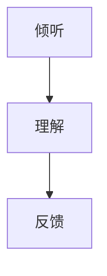

- **倾听（A）**：领导者需要主动倾听团队成员的意见，了解他们的想法和需求。
- **理解（B）**：领导者需要通过提问和确认，确保自己真正理解了团队成员的意见。
- **反馈（C）**：领导者需要给予团队成员及时的反馈，确认沟通的效果。

#### 3. 清晰的表达

清晰的表达是有效沟通的基础。领导者需要能够用简单明了的语言表达复杂的信息，确保团队成员能够理解。以下是一个简化的 Mermaid 流程图，展示了清晰表达的重要性：

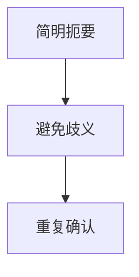

- **简明扼要（A）**：领导者需要避免使用复杂的词汇和句子，确保信息的简洁性。
- **避免歧义（B）**：领导者需要确保信息传递的准确性，避免产生歧义。
- **重复确认（C）**：领导者需要通过重复和确认，确保团队成员准确理解信息。

#### 4. 建立信任

建立信任是有效沟通的核心。领导者需要通过诚实、透明和一致的行为，建立与团队成员之间的信任关系。以下是一个简化的 Mermaid 流程图，展示了建立信任的重要性：

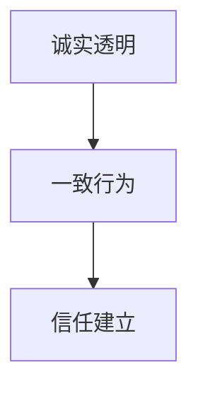

- **诚实透明（A）**：领导者需要诚实透明地沟通，避免隐瞒或误导信息。
- **一致行为（B）**：领导者需要通过一致的行为和决策，建立信任和权威。
- **信任建立（C）**：通过诚实透明和一致行为，领导者能够建立与团队成员之间的信任。

#### 5. 适应不同沟通风格

领导者需要适应不同团队成员的沟通风格，确保沟通的有效性。以下是一个简化的 Mermaid 流程图，展示了适应不同沟通风格的重要性：

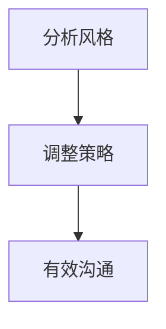

- **分析风格（A）**：领导者需要分析团队成员的沟通风格，了解他们的偏好和需求。
- **调整策略（B）**：根据团队成员的沟通风格，领导者需要调整沟通策略，确保信息的有效传递。
- **有效沟通（C）**：通过适应不同沟通风格，领导者能够实现更有效的沟通。

### 1.3.2 领导者如何有效沟通

领导者需要具备一系列的沟通技巧，以确保信息的有效传递和理解。以下是一个简化的 Mermaid 流程图，展示了领导者如何有效沟通：

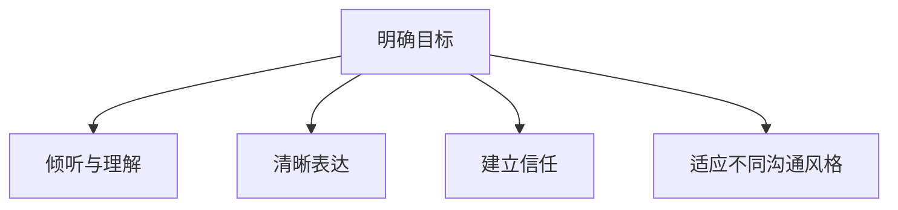

- **明确目标（A）**：领导者需要明确沟通的目标，确保信息传递的针对性和有效性。
- **倾听与理解（B）**：领导者需要倾听和理解团队成员的需求和意见，建立共识和信任。
- **清晰表达（C）**：领导者需要能够用简单明了的语言表达复杂的信息，确保团队成员能够理解。
- **建立信任（D）**：领导者需要通过诚实、透明和一致的行为，建立与团队成员之间的信任关系。
- **适应不同沟通风格（E）**：领导者需要适应不同团队成员的沟通风格，确保沟通的有效性。

### 1.3.3 不同沟通风格的识别与适应

在领导力中，沟通风格的识别与适应对于有效的团队协作和领导效果至关重要。不同的团队成员可能具有不同的沟通风格，领导者需要识别这些风格并采取相应的策略来适应和协调。以下是一个简化的 Mermaid 流程图，展示了不同沟通风格的识别与适应过程：

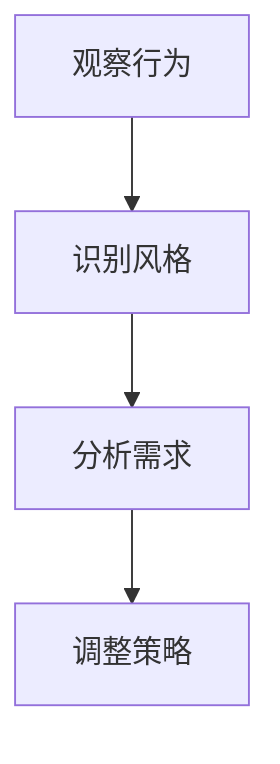

- **观察行为（A）**：领导者需要通过观察团队成员的沟通行为，识别他们的沟通风格。
- **识别风格（B）**：领导者需要了解团队成员是倾向于直观型、分析型、情感型还是思考型的沟通风格。
- **分析需求（C）**：领导者需要分析团队成员的沟通需求和偏好，了解他们更愿意接受哪种沟通方式。
- **调整策略（D）**：根据识别出的沟通风格和需求，领导者需要调整沟通策略，以确保信息传递的有效性。

#### 直观型沟通风格

直观型沟通风格的人倾向于关注事物的整体和外在表现，他们喜欢直接、简洁和富有感染力的沟通方式。以下是一个简化的 Mermaid 流程图，展示了直观型沟通风格的特点：

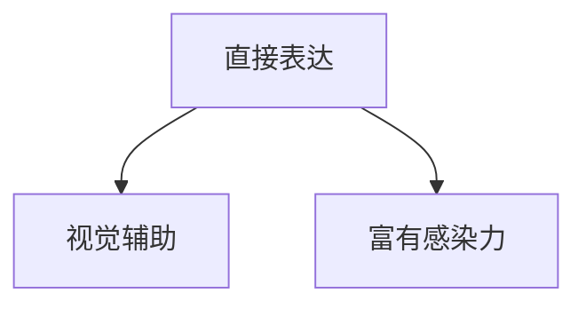

- **直接表达（A）**：直观型沟通风格的人通常直接表达观点和意见，不喜欢绕弯子。
- **视觉辅助（B）**：他们倾向于使用图表、图像和演示来增强沟通效果。
- **富有感染力（C）**：他们能够通过语言和表情传递强烈的情感和动力。

#### 分析型沟通风格

分析型沟通风格的人倾向于关注事物的细节和内在逻辑，他们喜欢通过数据和事实来支持沟通。以下是一个简化的 Mermaid 流程图，展示了分析型沟通风格的特点：

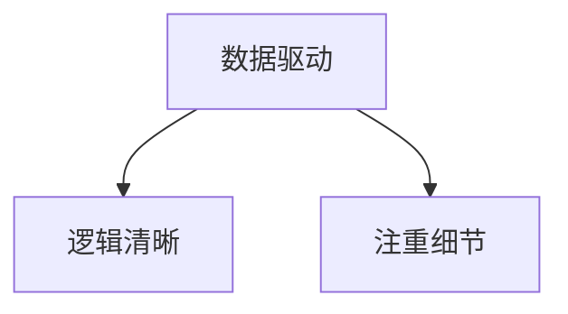

- **数据驱动（A）**：分析型沟通风格的人依赖于数据和事实来支持他们的观点。
- **逻辑清晰（B）**：他们的沟通逻辑严谨，喜欢通过步骤和流程来阐述问题。
- **注重细节（C）**：他们关注细节，确保每个环节都得到充分考虑。

#### 情感型沟通风格

情感型沟通风格的人倾向于关注人际关系和情感因素，他们喜欢通过情感和共鸣来建立联系。以下是一个简化的 Mermaid 流程图，展示了情感型沟通风格的特点：

```mermaid
graph TD
    A[情感表达]
    B[共鸣建立]
    C[关注人际关系]
    A-->B
    A-->C
```

- **情感表达（A）**：情感型沟通风格的人擅长表达情感，通过言语和非言语方式传达情感。
- **共鸣建立（B）**：他们能够通过情感共鸣与他人建立联系，增强沟通效果。
- **关注人际关系（C）**：他们重视人际关系，关注团队成员的情感需求。

#### 思考型沟通风格

思考型沟通风格的人倾向于深思熟虑，他们喜欢在决策前充分分析各种可能性。以下是一个简化的 Mermaid 流程图，展示了思考型沟通风格的特点：

```mermaid
graph TD
    A[深思熟虑]
    B[策略制定]
    C[风险评估]
    A-->B
    A-->C
```

- **深思熟虑（A）**：思考型沟通风格的人在做决策前会仔细思考和分析。
- **策略制定（B）**：他们倾向于制定详细的策略和计划。
- **风险评估（C）**：他们在决策过程中会充分考虑各种风险和潜在问题。

### 1.4 提升决策能力的策略

决策能力是领导者成功的关键因素之一。领导者需要能够在复杂和不确定的环境中做出明智的决策，并承担相应的责任。以下是一个简化的 Mermaid 流程图，展示了提升决策能力的策略：

```mermaid
graph TD
    A[信息收集]
    B[分析评估]
    C[制定方案]
    D[风险评估]
    E[决策执行]
    A-->B
    B-->C
    C-->D
    D-->E
```

- **信息收集（A）**：领导者需要收集和分析相关信息，以便做出基于数据的决策。
- **分析评估（B）**：领导者需要对收集到的信息进行分析和评估，以确定最佳方案。
- **制定方案（C）**：领导者需要制定具体的实施方案，并分配资源和责任。
- **风险评估（D）**：领导者需要评估决策可能带来的风险，并制定应对措施。
- **决策执行（E）**：领导者需要确保决策得到有效执行，并对执行结果进行监控和调整。

### 1.4.1 决策过程的五个步骤

决策过程是领导者日常工作中不可或缺的一部分。一个有效的决策过程可以确保领导者做出明智的决策，并减少错误决策带来的负面影响。以下是决策过程的五个步骤：

#### 1. 确定决策问题

确定决策问题是决策过程的第一步。领导者需要明确当前面临的挑战或机会，并将其转化为具体的决策问题。以下是一个简化的 Mermaid 流程图，展示了确定决策问题的过程：

```mermaid
graph TD
    A[识别问题]
    B[明确目标]
    C[制定框架]
    A-->B
    B-->C
```

- **识别问题（A）**：领导者需要识别当前面临的问题或挑战。
- **明确目标（B）**：领导者需要明确决策的目标，即希望通过决策解决的问题或达到的目标。
- **制定框架（C）**：领导者需要为决策制定一个基本的框架，以指导后续的决策过程。

#### 2. 收集相关信息

在确定了决策问题后，领导者需要收集与决策相关的所有信息。这些信息可以来自内部，如团队报告、市场数据等，也可以来自外部，如行业趋势、竞争对手信息等。以下是一个简化的 Mermaid 流程图，展示了收集相关信息的过程：

```mermaid
graph TD
    A[内部信息]
    B[外部信息]
    C[数据整理]
    A-->B
    B-->C
```

- **内部信息（A）**：领导者需要收集团队内部产生的所有相关信息。
- **外部信息（B）**：领导者需要收集与决策相关的市场趋势、竞争对手信息等外部信息。
- **数据整理（C）**：领导者需要对收集到的信息进行整理和分类，以便在后续的决策过程中使用。

#### 3. 分析与评估选项

在收集到足够的信息后，领导者需要对不同的决策选项进行分析和评估。这包括评估每个选项的优势和劣势、可能带来的影响和风险等。以下是一个简化的 Mermaid 流程图，展示了分析与评估选项的过程：

```mermaid
graph TD
    A[列出选项]
    B[评估优势]
    C[评估劣势]
    D[评估影响]
    E[评估风险]
    A-->B
    A-->C
    A-->D
    A-->E
```

- **列出选项（A）**：领导者需要列出所有可能的决策选项。
- **评估优势（B）**：领导者需要评估每个选项可能带来的优势和好处。
- **评估劣势（C）**：领导者需要评估每个选项可能带来的劣势和风险。
- **评估影响（D）**：领导者需要评估每个选项对组织内部和外部可能产生的影响。
- **评估风险（E）**：领导者需要评估每个选项可能带来的风险和不确定性。

#### 4. 制定决策方案

在完成对选项的分析与评估后，领导者需要制定具体的决策方案。这包括确定实施步骤、资源需求、时间表和责任人等。以下是一个简化的 Mermaid 流程图，展示了制定决策方案的过程：

```mermaid
graph TD
    A[确定步骤]
    B[分配资源]
    C[制定时间表]
    D[设定责任人]
    A-->B
    A-->C
    A-->D
```

- **确定步骤（A）**：领导者需要确定实现决策的具体步骤和流程。
- **分配资源（B）**：领导者需要根据决策方案，合理分配所需的资源和人力。
- **制定时间表（C）**：领导者需要制定实现决策的时间表和里程碑。
- **设定责任人（D）**：领导者需要明确每个步骤的责任人，确保决策得到有效执行。

#### 5. 实施决策与监控

在制定完决策方案后，领导者需要确保决策得到有效执行，并对执行过程进行监控和调整。以下是一个简化的 Mermaid 流程图，展示了实施决策与监控的过程：

```mermaid
graph TD
    A[执行决策]
    B[监控进度]
    C[反馈与调整]
    D[评估结果]
    A-->B
    B-->C
    C-->D
```

- **执行决策（A）**：领导者需要确保决策得到执行，并根据决策方案实施具体的行动。
- **监控进度（B）**：领导者需要监控决策的执行进度，确保所有步骤按时完成。
- **反馈与调整（C）**：领导者需要根据执行过程中的反馈，及时调整决策方案和执行策略。
- **评估结果（D）**：领导者需要对决策的结果进行评估，确定决策是否达到了预期的目标。

### 1.4.2 风险管理在决策过程中的重要性

在决策过程中，风险管理是确保决策成功的关键因素之一。无论是大型项目还是日常决策，领导者都需要识别潜在的风险，并制定相应的应对措施。以下是一个简化的 Mermaid 流程图，展示了风险管理在决策过程中的重要性：

```mermaid
graph TD
    A[识别风险]
    B[评估风险]
    C[制定应对措施]
    D[风险监控]
    A-->B
    B-->C
    C-->D
```

- **识别风险（A）**：领导者需要识别决策过程中可能出现的风险和不确定性。
- **评估风险（B）**：领导者需要评估每个风险的可能性和影响，确定哪些风险是需要重点关注的。
- **制定应对措施（C）**：领导者需要制定应对风险的措施，包括预防措施和应急计划。
- **风险监控（D）**：领导者需要持续监控风险的变化，并根据实际情况调整应对措施。

### 1.4.3 如何评估不同决策选项的优劣

在决策过程中，领导者需要评估不同的决策选项，以确定哪个选项最符合组织的利益和目标。以下是一个简化的 Mermaid 流程图，展示了评估不同决策选项的步骤：

```mermaid
graph TD
    A[列出选项]
    B[评估优势]
    C[评估劣势]
    D[评估可行性]
    E[评估风险]
    A-->B
    A-->C
    A-->D
    A-->E
```

- **列出选项（A）**：领导者需要列出所有可能的决策选项。
- **评估优势（B）**：领导者需要评估每个选项可能带来的优势和好处。
- **评估劣势（C）**：领导者需要评估每个选项可能带来的劣势和风险。
- **评估可行性（D）**：领导者需要评估每个选项的可行性，包括资源需求、时间表和执行难度。
- **评估风险（E）**：领导者需要评估每个选项可能带来的风险和不确定性。

### 1.4.4 制定决策方案的具体步骤

制定决策方案是决策过程中的关键环节，它决定了决策的可行性和执行效果。以下是一个简化的 Mermaid 流程图，展示了制定决策方案的具体步骤：

```mermaid
graph TD
    A[确定目标]
    B[列出步骤]
    C[分配资源]
    D[制定时间表]
    E[设定责任人]
    A-->B
    A-->C
    A-->D
    A-->E
```

- **确定目标（A）**：领导者需要明确决策的目标和期望结果。
- **列出步骤（B）**：领导者需要列出实现决策目标的步骤和流程。
- **分配资源（C）**：领导者需要根据决策方案，合理分配所需的资源和人力。
- **制定时间表（D）**：领导者需要制定实现决策的时间表和里程碑。
- **设定责任人（E）**：领导者需要明确每个步骤的责任人，确保决策得到有效执行。

### 1.4.5 实施决策与监控的重要步骤

实施决策与监控是确保决策方案得到有效执行的关键。以下是一个简化的 Mermaid 流程图，展示了实施决策与监控的重要步骤：

```mermaid
graph TD
    A[执行决策]
    B[监控进度]
    C[反馈与调整]
    D[评估结果]
    A-->B
    B-->C
    C-->D
```

- **执行决策（A）**：领导者需要确保决策得到执行，并根据决策方案实施具体的行动。
- **监控进度（B）**：领导者需要监控决策的执行进度，确保所有步骤按时完成。
- **反馈与调整（C）**：领导者需要根据执行过程中的反馈，及时调整决策方案和执行策略。
- **评估结果（D）**：领导者需要对决策的结果进行评估，确定决策是否达到了预期的目标。

## 第二部分：自信与威信

### 第3章：自信的心理学原理

#### 3.1 自信的心理学基础

自信的心理学基础涉及到多个方面，包括自我效能感、认知重构和情绪管理等。以下是一个简化的 Mermaid 流程图，展示了自信的心理学基础：

```mermaid
graph TD
    A[自我效能感]
    B[认知重构]
    C[情绪管理]
    D[行为训练]
    A-->B
    A-->C
    A-->D
    B|-->(增强自信)
    C|-->(应对挑战)
    D|-->(习惯培养)
```

- **自我效能感（A）**：个体对自己完成特定任务的信心。
- **认知重构（B）**：通过改变负面思维模式来增强自信。
- **情绪管理（C）**：有效管理情绪，以保持积极的心态。
- **行为训练（D）**：通过积极的行动来培养和增强自信。

#### 3.2 自信的影响因素

自信受到多种因素的影响，包括个人经历、心理状态、社会环境等。以下是一个简化的 Mermaid 流程图，展示了自信的影响因素：

```mermaid
graph TD
    A[个人经历]
    B[心理状态]
    C[社会环境]
    D[认知因素]
    A-->B
    A-->C
    B-->D
    C-->D
```

- **个人经历（A）**：个人的成功和失败经验对自信有直接影响。
- **心理状态（B）**：情绪、自我评价等心理因素影响自信。
- **社会环境（C）**：家庭、工作环境等社会因素对自信有重要影响。
- **认知因素（D）**：认知过程，如自我效能感、目标设定等，影响自信。

#### 3.3 提升自信的策略

提升自信可以通过多种策略实现，包括心理调整、行为训练和社交支持等。以下是一个简化的 Mermaid 流程图，展示了提升自信的策略：

```mermaid
graph TD
    A[心理调整]
    B[行为训练]
    C[社交支持]
    D[认知重构]
    A-->B
    A-->C
    A-->D
    B|-->(增强自信)
    C|-->(建立支持系统)
    D|-->(改变思维模式)
```

- **心理调整（A）**：通过改变思维方式和情绪状态提升自信。
- **行为训练（B）**：通过行为模仿和训练增强自信。
- **社交支持（C）**：通过他人的支持和鼓励提升自信。
- **认知重构（D）**：通过改变认知过程和思维方式提升自信。

### 3.3.1 心理调整

心理调整是提升自信的重要策略之一。以下是一个简化的 Mermaid 流程图，展示了心理调整的步骤：

```mermaid
graph TD
    A[正面思考]
    B[避免过度自我批评]
    C[设定可实现的目标]
    D[积极应对挑战]
    A-->B
    A-->C
    A-->D
```

- **正面思考（A）**：鼓励积极和乐观的思维模式。
- **避免过度自我批评（B）**：减少自我负面评价，增加自我肯定。
- **设定可实现的目标（C）**：设定具体、可行和有挑战性的目标。
- **积极应对挑战（D）**：面对挑战时保持积极态度，勇于尝试和失败。

### 3.3.2 行为训练

行为训练是提升自信的另一个重要策略。以下是一个简化的 Mermaid 流程图，展示了行为训练的步骤：

```mermaid
graph TD
    A[模仿成功人士]
    B[设定小目标]
    C[持续行动]
    D[正面反馈]
    A-->B
    A-->C
    A-->D
    B|-->(培养习惯)
    C|-->(增强自信)
    D|-->(激励持续努力)
```

- **模仿成功人士（A）**：学习成功人士的行为和态度。
- **设定小目标（B）**：设定短期和长期的目标，逐步提升自信。
- **持续行动（C）**：通过持续的行动和练习来培养自信。
- **正面反馈（D）**：及时给予自己正面反馈，增强自信心。

### 3.3.3 社交支持

社交支持是提升自信的关键因素之一。以下是一个简化的 Mermaid 流程图，展示了社交支持的来源和作用：

```mermaid
graph TD
    A[家庭支持]
    B[朋友支持]
    C[团队支持]
    D[社会支持]
    A-->B
    A-->C
    A-->D
    B|-->(情感支持)
    C|-->(团队协作)
    D|-->(社会认同)
```

- **家庭支持（A）**：家庭成员的理解和鼓励对自信有重要影响。
- **朋友支持（B）**：朋友的支持和鼓励有助于个体保持积极的心态。
- **团队支持（C）**：团队成员的协作和支持能够增强个体的自信心。
- **社会支持（D）**：社会的认可和鼓励对自信的提升有积极作用。

### 3.3.4 认知重构

认知重构是通过改变思维方式和认知模式来提升自信的有效策略。以下是一个简化的 Mermaid 流程图，展示了认知重构的步骤：

```mermaid
graph TD
    A[识别负面思维]
    B[质疑负面思维]
    C[建立正面思维]
    D[积极行动]
    A-->B
    A-->C
    A-->D
    B|-->(减少负面情绪)
    C|-->(增强自信)
    D|-->(实现目标)
```

- **识别负面思维（A）**：意识到自己有哪些负面思维和情绪。
- **质疑负面思维（B）**：质疑负面思维的有效性和合理性。
- **建立正面思维（C）**：培养积极和乐观的思维模式。
- **积极行动（D）**：通过积极的行动来验证和巩固正面思维。

### 3.4 建立自信的案例分析

#### 3.4.1 案例一：通过行为训练提升自信

张华是一位年轻的工程师，他在工作中总是感到缺乏自信，尤其是在面对新项目或重要任务时。为了提升自信，张华决定采取行为训练的策略。

**步骤：**

1. **识别问题：** 张华意识到自己缺乏自信，特别是在面对未知和挑战时。
2. **设定目标：** 张华设定了一个短期目标，即在一个新项目中担任主要角色。
3. **小步骤行动：** 张华开始参与一些小型项目，并逐步承担更多的责任。
4. **正面反馈：** 每完成一个小目标，张华都会给自己一些正面反馈，如自我表扬或庆祝成功。

**结果：** 通过持续的行为训练，张华逐渐提升了自信，并在新项目中表现出色，获得了同事和领导的认可。

#### 3.4.2 案例二：通过社交支持建立自信

李梅是一位销售人员，她在面对销售挑战时总是感到紧张和不自信。为了提升自信，李梅决定寻求社交支持。

**步骤：**

1. **寻求家庭支持：** 李梅与家人沟通，并获得了他们的理解和支持。
2. **参加社交活动：** 李梅参加了一些行业聚会和社交活动，结识了更多的同行。
3. **团队支持：** 李梅的团队成员给予了她很多鼓励和指导，帮助她提升技能和信心。
4. **正面反馈：** 李梅的同事和领导经常给予她正面反馈和表扬，增强了她的自信心。

**结果：** 通过社交支持，李梅逐渐建立了自信，并在销售工作中取得了显著的成绩。

### 第4章：建立威信的技巧

#### 4.1 威信的概念与特征

威信是指一个人在团队或组织中的权威和影响力。一个具有威信的领导者能够赢得团队成员的尊重和信任，从而更好地实现组织目标。以下是一个简化的 Mermaid 流程图，展示了威信的概念与特征：

```mermaid
graph TD
    A[权威]
    B[信任]
    C[影响力]
    D[尊重]
    E[尊重]
    A-->B
    A-->C
    A-->D
    A-->E
```

- **权威（A）**：领导者通过专业知识、经验和管理能力建立权威。
- **信任（B）**：团队成员对领导者的信任和依赖。
- **影响力（C）**：领导者能够影响和激励团队成员。
- **尊重（D）和（E）**：团队成员对领导者的尊重和认同。

#### 4.2 威信的建立方法

建立威信需要领导者具备一系列的技巧和方法。以下是一个简化的 Mermaid 流程图，展示了建立威信的方法：

```mermaid
graph TD
    A[专业知识]
    B[良好沟通]
    C[正直行为]
    D[领导能力]
    E[建立信任]
    F[激励团队]
    A-->B
    A-->C
    A-->D
    A-->E
    A-->F
    B|-->(增强信任)
    C|-->(建立权威)
    D|-->(提升绩效)
    E|-->(增强影响力)
    F|-->(提高士气)
```

- **专业知识（A）**：领导者需要具备深厚的专业知识，以便在团队中建立权威。
- **良好沟通（B）**：领导者需要具备良好的沟通能力，以增强信任和影响力。
- **正直行为（C）**：领导者需要通过正直的行为和决策建立权威。
- **领导能力（D）**：领导者需要具备出色的领导能力，以提升团队绩效。
- **建立信任（E）**：领导者需要通过建立信任来增强影响力。
- **激励团队（F）**：领导者需要激励团队成员，提高团队士气。

### 4.2.1 个人形象塑造

个人形象是建立威信的重要因素之一。以下是一个简化的 Mermaid 流程图，展示了个人形象塑造的关键要素：

```mermaid
graph TD
    A[专业知识]
    B[专业技能]
    C[职业态度]
    D[个人魅力]
    A-->B
    A-->C
    A-->D
    B|-->(提升权威)
    C|-->(建立信任)
    D|-->(增强影响力)
```

- **专业知识（A）**：领导者需要具备深厚的专业知识，以便在团队中建立权威。
- **专业技能（B）**：领导者需要具备出色的专业技能，以展示自己的专业能力。
- **职业态度（C）**：领导者需要保持积极的职业态度，以赢得团队成员的信任。
- **个人魅力（D）**：领导者需要具备吸引和激励团队成员的个人魅力。

### 4.2.2 专业知识与技能的展现

专业知识与技能是建立威信的关键。以下是一个简化的 Mermaid 流程图，展示了如何展现专业知识和技能：

```mermaid
graph TD
    A[展示专业知识]
    B[分享经验]
    C[提供指导]
    D[解决问题]
    A-->B
    A-->C
    A-->D
    B|-->(增强信任)
    C|-->(提升权威)
    D|-->(增强影响力)
```

- **展示专业知识（A）**：领导者需要通过演讲、培训等方式展示自己的专业知识。
- **分享经验（B）**：领导者需要与团队成员分享自己的经验和教训。
- **提供指导（C）**：领导者需要为团队成员提供专业指导和建议。
- **解决问题（D）**：领导者需要积极解决团队面临的挑战和问题。

### 4.2.3 领导风格与威信

领导风格对威信的建立具有重要影响。以下是一个简化的 Mermaid 流程图，展示了不同领导风格对威信的影响：

```mermaid
graph TD
    A[权威型领导]
    B[民主型领导]
    C[支持型领导]
    D[变革型领导]
    E[参与型领导]
    F[威信影响]
    A-->F
    B-->F
    C-->F
    D-->F
    E-->F
```

- **权威型领导（A）**：通过严格的规则和命令建立威信。
- **民主型领导（B）**：通过平等和开放的沟通方式建立威信。
- **支持型领导（C）**：通过关心和支持团队成员建立威信。
- **变革型领导（D）**：通过引领变革和创造新机会建立威信。
- **参与型领导（E）**：通过鼓励团队成员参与决策建立威信。
- **威信影响（F）**：不同领导风格对威信的影响各异。

### 4.2.4 个人魅力与威信

个人魅力是建立威信的重要因素之一。以下是一个简化的 Mermaid 流程图，展示了个人魅力对威信的影响：

```mermaid
graph TD
    A[个人魅力]
    B[吸引力]
    C[影响力]
    D[威信建立]
    A-->B
    A-->C
    A-->D
    B|-->(增强信任)
    C|-->(提升权威)
    D|-->(增强影响力)
```

- **个人魅力（A）**：领导者需要具备吸引和激励团队成员的个人魅力。
- **吸引力（B）**：领导者能够吸引团队成员，增强团队的凝聚力。
- **影响力（C）**：领导者通过个人魅力影响和激励团队成员。
- **威信建立（D）**：个人魅力有助于领导者建立威信。

### 4.2.5 建立威信的具体措施

以下是一些具体的措施，帮助领导者建立和增强威信：

1. **展示专业知识和技能**：通过培训、演讲和分享经验来展示专业知识和技能。
2. **建立信任**：通过诚实、透明和一致的行为建立与团队成员之间的信任关系。
3. **提供指导和支持**：为团队成员提供专业指导和支持，帮助他们克服困难。
4. **激励团队成员**：通过奖励和认可来激励团队成员，增强他们的积极性和创造力。
5. **积极参与团队活动**：与团队成员一起参与团队活动，增强团队的凝聚力。

### 第5章：树立威信的关键因素

#### 5.1 领导风格与威信

领导风格对威信的建立具有重要影响。以下是一个简化的 Mermaid 流程图，展示了不同领导风格对威信的影响：

```mermaid
graph TD
    A[权威型领导]
    B[民主型领导]
    C[支持型领导]
    D[变革型领导]
    E[参与型领导]
    F[威信影响]
    A-->F
    B-->F
    C-->F
    D-->F
    E-->F
```

- **权威型领导（A）**：通过严格的规则和命令建立威信。
- **民主型领导（B）**：通过平等和开放的沟通方式建立威信。
- **支持型领导（C）**：通过关心和支持团队成员建立威信。
- **变革型领导（D）**：通过引领变革和创造新机会建立威信。
- **参与型领导（E）**：通过鼓励团队成员参与决策建立威信。
- **威信影响（F）**：不同领导风格对威信的影响各异。

#### 5.2 个人魅力与威信

个人魅力是建立威信的重要因素之一。以下是一个简化的 Mermaid 流程图，展示了个人魅力对威信的影响：

```mermaid
graph TD
    A[个人魅力]
    B[吸引力]
    C[影响力]
    D[威信建立]
    A-->B
    A-->C
    A-->D
    B|-->(增强信任)
    C|-->(提升权威)
    D|-->(增强影响力)
```

- **个人魅力（A）**：领导者需要具备吸引和激励团队成员的个人魅力。
- **吸引力（B）**：领导者能够吸引团队成员，增强团队的凝聚力。
- **影响力（C）**：领导者通过个人魅力影响和激励团队成员。
- **威信建立（D）**：个人魅力有助于领导者建立威信。

#### 5.3 专业能力与威信

专业能力是建立威信的基础。以下是一个简化的 Mermaid 流程图，展示了专业能力对威信的影响：

```mermaid
graph TD
    A[专业能力]
    B[专业知识]
    C[专业技能]
    D[威信建立]
    E[权威]
    F[信任]
    G[影响力]
    A-->B
    A-->C
    A-->D
    A-->E
    A-->F
    A-->G
    B|-->(增强权威)
    C|-->(增强信任)
    D|-->(增强影响力)
    E|-->(提升威信)
    F|-->(建立信任)
    G|-->(增强影响力)
```

- **专业能力（A）**：领导者需要具备深厚的专业知识和技能。
- **专业知识（B）**：领导者需要具备丰富的行业知识和理论。
- **专业技能（C）**：领导者需要具备出色的专业技能和实际操作能力。
- **威信建立（D）**：专业能力有助于领导者建立威信。
- **权威（E）**：专业能力增强领导者的权威。
- **信任（F）**：专业能力赢得团队成员的信任。
- **影响力（G）**：专业能力增强领导者的影响力。

### 5.4 如何培养权威

权威是威信的重要组成部分，以下是培养权威的几个关键步骤：

#### 1. 提升专业知识

领导者需要不断提升自己的专业知识和技能。这可以通过参加培训、阅读专业书籍、参与行业研讨会等方式实现。以下是一个简化的 Mermaid 流程图，展示了提升专业知识的重要性：

```mermaid
graph TD
    A[提升知识]
    B[增强权威]
    A-->B
```

- **提升知识（A）**：通过不断学习和积累知识，增强个人的专业素养。
- **增强权威（B）**：专业知识有助于增强领导者的权威。

#### 2. 展示专业能力

领导者需要通过实际工作展示自己的专业能力。这可以通过成功完成项目、提出创新解决方案、解决复杂问题等方式实现。以下是一个简化的 Mermaid 流程图，展示了展示专业能力的重要性：

```mermaid
graph TD
    A[展示能力]
    B[赢得信任]
    C[增强权威]
    A-->B
    A-->C
```

- **展示能力（A）**：通过展示专业能力，赢得团队成员的信任和尊重。
- **赢得信任（B）**：展示专业能力有助于赢得团队成员的信任。
- **增强权威（C）**：赢得信任增强领导者的权威。

#### 3. 建立良好的沟通和关系

领导者需要与团队成员建立良好的沟通和关系。这可以通过积极参与团队活动、定期与团队成员沟通、倾听他们的意见和建议等方式实现。以下是一个简化的 Mermaid 流程图，展示了建立良好沟通和关系的重要性：

```mermaid
graph TD
    A[沟通和关系]
    B[增强信任]
    C[增强权威]
    A-->B
    A-->C
```

- **沟通和关系（A）**：建立良好的沟通和关系有助于增强领导者的权威。
- **增强信任（B）**：良好的沟通和关系有助于增强团队成员对领导者的信任。
- **增强权威（C）**：增强信任有助于增强领导者的权威。

#### 4. 维护良好的职业道德

领导者需要维护良好的职业道德，这包括诚实、公正、透明和负责任。以下是一个简化的 Mermaid 流程图，展示了维护良好职业道德的重要性：

```mermaid
graph TD
    A[职业道德]
    B[增强信任]
    C[增强权威]
    A-->B
    A-->C
```

- **职业道德（A）**：维护良好的职业道德有助于增强团队成员对领导者的信任。
- **增强信任（B）**：增强信任有助于增强领导者的权威。
- **增强权威（C）**：增强信任有助于增强领导者的权威。

#### 5. 不断学习和成长

领导者需要不断学习和成长，以适应不断变化的环境和挑战。以下是一个简化的 Mermaid 流程图，展示了不断学习和成长的重要性：

```mermaid
graph TD
    A[学习和成长]
    B[增强能力]
    C[增强权威]
    A-->B
    A-->C
```

- **学习和成长（A）**：通过不断学习和成长，增强个人的能力和权威。
- **增强能力（B）**：学习和成长有助于增强个人的专业能力。
- **增强权威（C）**：增强能力有助于增强个人的权威。

### 5.5 如何提升个人魅力

个人魅力是建立威信的关键因素之一，以下是提升个人魅力的几个关键步骤：

#### 1. 培养自信

自信是个人魅力的基础。以下是一个简化的 Mermaid 流程图，展示了培养自信的重要性：

```mermaid
graph TD
    A[培养自信]
    B[增强魅力]
    A-->B
```

- **培养自信（A）**：通过积极的心态和行为培养自信。
- **增强魅力（B）**：自信有助于增强个人魅力。

#### 2. 提升沟通能力

良好的沟通能力是提升个人魅力的重要因素。以下是一个简化的 Mermaid 流程图，展示了提升沟通能力的重要性：

```mermaid
graph TD
    A[提升沟通]
    B[增强信任]
    C[增强魅力]
    A-->B
    A-->C
```

- **提升沟通（A）**：通过学习和实践提升沟通能力。
- **增强信任（B）**：良好的沟通能力有助于增强与团队成员的信任。
- **增强魅力（C）**：增强信任有助于提升个人魅力。

#### 3. 保持积极的心态

积极的心态是个人魅力的重要组成部分。以下是一个简化的 Mermaid 流程图，展示了保持积极心态的重要性：

```mermaid
graph TD
    A[积极心态]
    B[提升魅力]
    A-->B
```

- **积极心态（A）**：通过积极思考、乐观的态度保持积极心态。
- **提升魅力（B）**：积极心态有助于提升个人魅力。

#### 4. 培养良好的行为习惯

良好的行为习惯是个人魅力的重要体现。以下是一个简化的 Mermaid 流程图，展示了培养良好行为习惯的重要性：

```mermaid
graph TD
    A[良好行为]
    B[提升魅力]
    A-->B
```

- **良好行为（A）**：通过自律、负责任的行为培养良好的行为习惯。
- **提升魅力（B）**：良好的行为习惯有助于提升个人魅力。

#### 5. 增强人际交往能力

人际交往能力是个人魅力的重要方面。以下是一个简化的 Mermaid 流程图，展示了增强人际交往能力的重要性：

```mermaid
graph TD
    A[人际交往]
    B[增强魅力]
    A-->B
```

- **人际交往（A）**：通过积极参与社交活动、培养同理心和沟通技巧增强人际交往能力。
- **提升魅力（B）**：增强人际交往能力有助于提升个人魅力。

### 5.6 如何展示专业能力

展示专业能力是建立威信的关键步骤之一，以下是展示专业能力的几个关键步骤：

#### 1. 成功完成项目

以下是一个简化的 Mermaid 流程图，展示了成功完成项目的重要性：

```mermaid
graph TD
    A[完成项目]
    B[展示能力]
    C[增强权威]
    A-->B
    A-->C
```

- **完成项目（A）**：通过成功完成项目展示专业能力和实际操作能力。
- **展示能力（B）**：成功完成项目有助于展示专业能力。
- **增强权威（C）**：展示专业能力有助于增强权威。

#### 2. 提出创新解决方案

以下是一个简化的 Mermaid 流程图，展示了提出创新解决方案的重要性：

```mermaid
graph TD
    A[提出解决方案]
    B[展示能力]
    C[增强影响力]
    A-->B
    A-->C
```

- **提出解决方案（A）**：通过提出创新解决方案展示专业知识和创新能力。
- **展示能力（B）**：提出创新解决方案有助于展示专业能力。
- **增强影响力（C）**：展示专业能力有助于增强影响力。

#### 3. 解决复杂问题

以下是一个简化的 Mermaid 流程图，展示了解决复杂问题的重要性：

```mermaid
graph TD
    A[解决复杂问题]
    B[展示能力]
    C[增强信任]
    A-->B
    A-->C
```

- **解决复杂问题（A）**：通过解决复杂问题展示专业能力和问题解决能力。
- **展示能力（B）**：解决复杂问题有助于展示专业能力。
- **增强信任（C）**：展示专业能力有助于增强团队成员对领导者的信任。

#### 4. 持续学习和成长

以下是一个简化的 Mermaid 流程图，展示了持续学习和成长的重要性：

```mermaid
graph TD
    A[学习和成长]
    B[增强能力]
    C[展示能力]
    A-->B
    A-->C
```

- **学习和成长（A）**：通过不断学习和成长增强专业能力。
- **增强能力（B）**：学习和成长有助于增强专业能力。
- **展示能力（C）**：增强能力有助于展示专业能力。

#### 5. 参与行业交流和分享

以下是一个简化的 Mermaid 流程图，展示了参与行业交流和分享的重要性：

```mermaid
graph TD
    A[参与交流]
    B[展示能力]
    C[增强影响力]
    A-->B
    A-->C
```

- **参与交流（A）**：通过参与行业交流和分享展示专业知识和实践经验。
- **展示能力（B）**：参与交流有助于展示专业能力。
- **增强影响力（C）**：展示专业能力有助于增强影响力。

### 第6章：领导力与自信的实际应用

#### 6.1 领导力与自信在项目管理中的应用

在项目管理中，领导力和自信起着至关重要的作用。有效的领导力可以帮助项目经理克服挑战，确保项目按时、按预算和高质量完成。以下是一个简化的 Mermaid 流程图，展示了领导力与自信在项目管理中的应用：

```mermaid
graph TD
    A[领导力应用]
    B[自信应用]
    C[项目目标]
    D[团队协作]
    E[决策制定]
    F[风险管理]
    A-->B
    A-->C
    A-->D
    A-->E
    A-->F
    B|-->(提高效率)
    C|-->(明确目标)
    D|-->(增强合作)
    E|-->(确保决策)
    F|-->(降低风险)
```

- **领导力应用（A）**：项目经理通过领导力指导团队、制定战略和确保执行。
- **自信应用（B）**：项目经理通过自信提高决策效率、激发团队动力。
- **项目目标（C）**：明确项目目标，确保团队一致行动。
- **团队协作（D）**：通过领导力促进团队协作，提高项目成功率。
- **决策制定（E）**：自信帮助项目经理做出明智的决策。
- **风险管理（F）**：通过领导力和自信识别和应对项目风险。

#### 6.1.1 项目管理的挑战

项目管理面临多种挑战，包括资源管理、时间管理、团队协作和风险控制等。以下是一个简化的 Mermaid 流程图，展示了项目管理的挑战：

```mermaid
graph TD
    A[资源管理]
    B[时间管理]
    C[团队协作]
    D[风险控制]
    E[挑战识别]
    A-->B
    A-->C
    A-->D
    A-->E
```

- **资源管理（A）**：确保项目资源（人力、资金、设备等）合理分配和使用。
- **时间管理（B）**：确保项目按时完成，合理安排时间表和任务进度。
- **团队协作（C）**：协调团队成员的工作，确保团队高效协作。
- **风险控制（D）**：识别并管理项目风险，确保项目顺利进行。
- **挑战识别（E）**：项目经理需要识别并应对项目中的各种挑战。

#### 6.1.2 领导力与自信在项目管理中的实践

以下是一个简化的 Mermaid 流程图，展示了领导力与自信在项目管理中的具体实践：

```mermaid
graph TD
    A[规划与指导]
    B[决策与执行]
    C[沟通与反馈]
    D[激励与支持]
    E[风险管理]
    F[持续学习]
    A-->B
    A-->C
    A-->D
    A-->E
    A-->F
    B|-->(确保目标)
    C|-->(增强协作)
    D|-->(提升士气)
    E|-->(降低风险)
    F|-->(改进方法)
```

- **规划与指导（A）**：项目经理制定详细的项目计划，指导团队按计划执行。
- **决策与执行（B）**：项目经理在项目过程中做出及时、明智的决策，并确保执行。
- **沟通与反馈（C）**：项目经理保持与团队成员和利益相关者的有效沟通，及时反馈项目进展。
- **激励与支持（D）**：项目经理激励团队成员，提供必要的支持，提高团队士气。
- **风险管理（E）**：项目经理识别和管理项目风险，确保项目顺利进行。
- **持续学习（F）**：项目经理不断学习新的项目管理知识和技能，持续改进项目管理方法。

#### 6.2 领导力与自信在团队管理中的应用

团队管理是项目管理的重要组成部分，领导力和自信在团队管理中起着至关重要的作用。以下是一个简化的 Mermaid 流程图，展示了领导力与自信在团队管理中的应用：

```mermaid
graph TD
    A[领导力应用]
    B[自信应用]
    C[团队建设]
    D[目标设定]
    E[沟通协调]
    F[激励团队]
    G[解决冲突]
    A-->B
    A-->C
    A-->D
    A-->E
    A-->F
    A-->G
    B|-->(增强协作)
    C|-->(提高凝聚力)
    D|-->(明确方向)
    E|-->(促进沟通)
    F|-->(提升士气)
    G|-->(维护和谐)
```

- **领导力应用（A）**：项目经理通过领导力影响和指导团队成员。
- **自信应用（B）**：项目经理通过自信激励团队成员，提高团队执行力。
- **团队建设（C）**：项目经理通过团队建设活动提高团队凝聚力。
- **目标设定（D）**：项目经理设定明确的目标，确保团队一致行动。
- **沟通协调（E）**：项目经理保持与团队成员和利益相关者的有效沟通。
- **激励团队（F）**：项目经理激励团队成员，提高团队士气。
- **解决冲突（G）**：项目经理解决团队内部的冲突，维护团队和谐。

#### 6.2.1 团队建设的策略

团队建设是提高团队效率和凝聚力的关键。以下是一些有效的团队建设策略：

1. **建立共同目标**：确保团队成员对项目目标有共同的理解和承诺。以下是一个简化的 Mermaid 流程图，展示了建立共同目标的重要性：

    ```mermaid
    graph TD
        A[共同目标]
        B[团队凝聚力]
        C[团队效率]
        A-->B
        A-->C
    ```

    - **共同目标（A）**：通过明确的共同目标提高团队凝聚力和效率。

2. **增强沟通与协作**：促进团队成员之间的沟通和协作，以下是一个简化的 Mermaid 流程图，展示了增强沟通与协作的重要性：

    ```mermaid
    graph TD
        A[沟通与协作]
        B[团队效率]
        C[团队创新]
        A-->B
        A-->C
    ```

    - **沟通与协作（A）**：通过有效的沟通和协作提高团队效率和创新能力。

3. **开展团队活动**：定期组织团队活动，如团队建设训练、团建活动等，以下是一个简化的 Mermaid 流程图，展示了团队活动的重要性：

    ```mermaid
    graph TD
        A[团队活动]
        B[团队凝聚力]
        C[团队士气]
        A-->B
        A-->C
    ```

    - **团队活动（A）**：通过团队活动增强团队凝聚力和士气。

4. **建立信任**：建立团队成员之间的信任，以下是一个简化的 Mermaid 流程图，展示了建立信任的重要性：

    ```mermaid
    graph TD
        A[建立信任]
        B[团队协作]
        C[团队绩效]
        A-->B
        A-->C
    ```

    - **建立信任（A）**：通过建立信任促进团队协作和提高团队绩效。

5. **认可与激励**：对团队成员的成绩和贡献进行认可和激励，以下是一个简化的 Mermaid 流程图，展示了认可与激励的重要性：

    ```mermaid
    graph TD
        A[认可与激励]
        B[团队士气]
        C[团队绩效]
        A-->B
        A-->C
    ```

    - **认可与激励（A）**：通过认可与激励提高团队士气和绩效。

#### 6.2.2 领导力与自信在团队管理中的实践

以下是一个简化的 Mermaid 流程图，展示了领导力与自信在团队管理中的具体实践：

```mermaid
graph TD
    A[规划与指导]
    B[决策与执行]
    C[沟通与协调]
    D[激励与支持]
    E[团队建设]
    F[解决冲突]
    A-->B
    A-->C
    A-->D
    A-->E
    A-->F
    B|-->(确保目标)
    C|-->(增强协作)
    D|-->(提升士气)
    E|-->(提高凝聚力)
    F|-->(维护和谐)
```

- **规划与指导（A）**：项目经理制定详细的团队管理计划，并指导团队成员执行。
- **决策与执行（B）**：项目经理在团队管理过程中做出明智的决策，并确保执行。
- **沟通与协调（C）**：项目经理保持与团队成员的沟通，确保信息畅通和协调一致。
- **激励与支持（D）**：项目经理激励团队成员，提供必要的支持和资源。
- **团队建设（E）**：项目经理通过团队建设活动提高团队凝聚力和协作效率。
- **解决冲突（F）**：项目经理解决团队内部的冲突，维护团队的和谐稳定。

### 第7章：领导力与自信的案例分析

#### 7.1 案例分析一：如何提升团队领导力

**案例背景**：某互联网公司的新项目经理李华在接手一个新的项目后，发现团队存在沟通不畅、任务分配不均和士气低落等问题。为了提升团队领导力，李华决定采取一系列措施。

**措施与实施步骤**：

1. **沟通与反馈**：李华定期组织团队会议，鼓励团队成员分享意见和建议，及时反馈项目进展和问题。以下是一个简化的 Mermaid 流程图，展示了沟通与反馈的重要性：

    ```mermaid
    graph TD
        A[定期会议]
        B[沟通畅通]
        C[反馈及时]
        A-->B
        A-->C
    ```

    - **定期会议（A）**：通过定期会议确保沟通畅通。
    - **沟通畅通（B）**：确保团队成员之间的沟通顺畅。
    - **反馈及时（C）**：及时反馈项目进展和问题。

2. **任务分配**：李华根据团队成员的能力和兴趣重新分配任务，确保任务分配公平合理。以下是一个简化的 Mermaid 流程图，展示了任务分配的重要性：

    ```mermaid
    graph TD
        A[任务分配]
        B[公平合理]
        C[激励团队]
        A-->B
        A-->C
    ```

    - **任务分配（A）**：确保任务分配公平合理。
    - **公平合理（B）**：通过公平的任务分配激发团队成员的积极性。
    - **激励团队（C）**：通过公平的任务分配激励团队成员。

3. **培训与发展**：李华组织团队成员参加专业培训和技能提升课程，提高团队的整体能力。以下是一个简化的 Mermaid 流程图，展示了培训与发展的重要性：

    ```mermaid
    graph TD
        A[培训与发展]
        B[能力提升]
        C[团队进步]
        A-->B
        A-->C
    ```

    - **培训与发展（A）**：组织团队成员参加专业培训和技能提升课程。
    - **能力提升（B）**：通过培训提升团队成员的专业能力。
    - **团队进步（C）**：提高团队的整体能力和绩效。

**结果**：通过上述措施，团队的工作氛围明显改善，任务完成效率提高，团队成员的士气也得到了提升。

#### 7.2 案例分析二：如何树立个人威信

**案例背景**：某科技公司的新任部门经理王明在接手新的职责后，发现自己在团队中缺乏威信，难以获得团队成员的尊重和信任。为了树立个人威信，王明决定采取一系列措施。

**措施与实施步骤**：

1. **专业能力展示**：王明通过在项目中展示自己的专业知识和解决问题的能力，赢得了团队成员的认可。以下是一个简化的 Mermaid 流程图，展示了专业能力展示的重要性：

    ```mermaid
    graph TD
        A[展示专业能力]
        B[赢得认可]
        C[树立威信]
        A-->B
        A-->C
    ```

    - **展示专业能力（A）**：通过在项目中展示专业能力。
    - **赢得认可（B）**：通过专业能力赢得团队成员的认可。
    - **树立威信（C）**：通过赢得认可树立个人威信。

2. **建立信任**：王明通过诚实、透明和负责任的行为建立与团队成员之间的信任。以下是一个简化的 Mermaid 流程图，展示了建立信任的重要性：

    ```mermaid
    graph TD
        A[建立信任]
        B[增强威信]
        C[促进合作]
        A-->B
        A-->C
    ```

    - **建立信任（A）**：通过诚实、透明和负责任的行为建立信任。
    - **增强威信（B）**：通过建立信任增强个人威信。
    - **促进合作（C）**：通过建立信任促进团队合作。

3. **激励团队**：王明通过激励团队成员，提高团队的士气和绩效。以下是一个简化的 Mermaid 流程图，展示了激励团队的重要性：

    ```mermaid
    graph TD
        A[激励团队]
        B[提升士气]
        C[提高绩效]
        A-->B
        A-->C
    ```

    - **激励团队（A）**：通过奖励和认可激励团队成员。
    - **提升士气（B）**：通过激励提升团队的士气。
    - **提高绩效（C）**：通过激励提高团队的绩效。

**结果**：通过上述措施，王明在团队中的威信逐渐建立，团队成员对他的认可度和信任感明显提升，团队的整体表现也得到了显著改善。

### 附录A：领导力与自信相关的书籍推荐

为了帮助读者进一步了解领导力与自信的相关知识，以下是一些推荐的书籍：

1. **《领导力的五项修炼》**：作者史蒂芬·柯维，通过五个方面的修炼，帮助领导者提升领导力。
2. **《自信的秘密》**：作者简·戈尔曼，探讨自信的心理学原理和提升自信的策略。
3. **《影响力的六大原则》**：作者罗伯特·西奥迪尼，分析影响他人的六个基本原则。
4. **《如何影响人们》**：作者斯蒂芬·罗宾斯，介绍如何在组织中建立影响力。
5. **《正面思考的力量》**：作者威尔·鲍温，探讨正面思考对个人和团队的影响。

### 附录B：领导力与自信的实践工具与资源

为了帮助读者在实际工作中应用领导力与自信的理论，以下是一些实用的工具和资源：

1. **领导力培训课程**：可以通过在线平台或专业培训机构获取，如LinkedIn Learning、Coursera等。
2. **自信心提升课程**：可以通过心理咨询服务或专业培训机构获取，如NLP教练技术、自信训练课程等。
3. **团队沟通与协作工具**：如Slack、Trello、Asana等，帮助团队提高沟通效率和协作能力。
4. **心理测评工具**：如MBTI、DISC等，帮助了解个人和团队的沟通风格和行为模式。
5. **领导力与自信相关的文章和博客**：可以通过专业网站或知名博客获取，如哈佛商业评论、LinkedIn等。

---

## 总结

本文从领导力的定义、核心要素，到自信的心理学原理、提升策略，再到建立威信的技巧和关键因素，全面探讨了领导力与自信在树立威信中的关键作用。通过实际应用和案例分析，本文为读者提供了深入理解和实践领导力的指导。

领导力是一个多维度的概念，它不仅涉及个人影响力的展现，还涵盖了个人在团队和组织中的领导能力。自信则是领导者树立威信的基础，它需要领导者具备一系列的心理素质和技能。

在项目管理中，领导力与自信的应用至关重要。有效的领导力可以帮助项目经理克服挑战，确保项目按时、按预算和高质量完成。在团队管理中，领导力与自信有助于提升团队协作效率、增强团队凝聚力，从而实现组织目标。

为了进一步提升领导力和自信，读者可以通过阅读相关书籍、参加培训课程、实践工具与资源等方式，不断学习和成长。

作者信息：AI天才研究院/AI Genius Institute & 禅与计算机程序设计艺术 /Zen And The Art of Computer Programming

