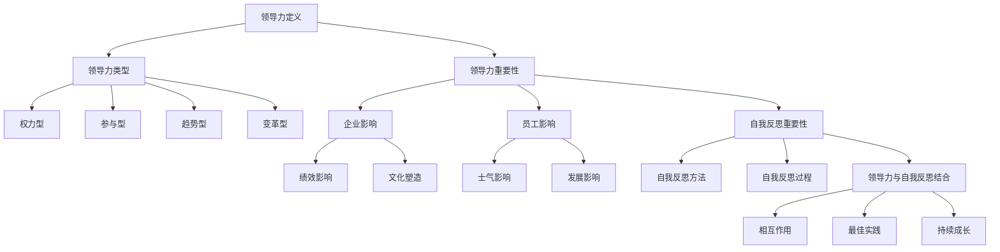

                 

### 《领导力与自我反思：持续成长的关键》

> **关键词：**领导力、自我反思、持续成长、企业管理、个人发展

**摘要：**本文深入探讨了领导力与自我反思在持续成长中的关键作用。首先，我们分析了领导力的定义、类型及其重要性，接着讨论了自我反思的概念、方法和过程，然后详细阐述了领导力与自我反思的相互作用和最佳实践。通过案例分析，我们展示了成功的企业如何在领导力和自我反思中实现持续成长。最后，本文提出了绩效评估的数学模型和具体的实战项目，以帮助读者更好地理解和应用这些概念。

---

### 第一部分：领导力的基础

领导力是一种影响和激励他人达成目标的能力，是领导者通过激励、指导、协调和决策来推动团队和组织前进的重要技能。本部分将首先定义领导力，并探讨其与管理的区别，接着介绍不同类型的领导力。

#### 第1章：领导力的定义与类型

##### 1.1 领导力的概念与内涵

领导力与管理的区别主要体现在目的和方法上。管理强调的是计划、组织、领导和控制，旨在确保组织目标的实现；而领导力则更注重愿景、激励和影响力，目的是激发团队成员的潜能，共同实现目标。

领导力的本质在于影响和激励他人，使其自愿地为实现共同目标而努力。领导力的作用包括：1）塑造企业文化，2）提升团队凝聚力，3）推动创新和变革，4）提高组织绩效。

##### 1.2 领导力的类型

领导力可以分为多种类型，每种类型都有其独特的特点和应用场景。以下是几种常见的领导力类型：

- **权力型领导**：依靠权力和职位来影响他人，适用于紧急情况和需要迅速决策的场景。
- **参与型领导**：鼓励团队成员参与决策和问题解决，提高团队士气和凝聚力。
- **趋势型领导**：关注未来趋势，预见变化，带领团队走向新的方向。
- **变革型领导**：推动组织变革，引领团队跳出舒适区，实现突破性成长。

#### 第2章：领导力的重要性

##### 2.1 领导力对企业的影响

领导力对企业绩效具有重要影响。有效的领导力能够提高员工的积极性和创造力，从而提升组织整体绩效。此外，领导力还对企业文化产生深远影响，塑造组织的价值观和行为规范。

##### 2.2 领导力对员工的影响

领导力对员工的影响主要体现在以下几个方面：

- **士气影响**：有效的领导能够提升员工的士气，增强团队凝聚力。
- **发展影响**：领导力有助于员工成长和发展，为其提供培训和发展机会。

### 第二部分：自我反思

自我反思是一种重要的个人发展工具，有助于领导者认识到自己的优点和不足，从而不断提升自身能力。本部分将讨论自我反思的重要性、方法和过程。

#### 第3章：自我反思的重要性

##### 3.1 自我反思的概念与内涵

自我反思是指对自身行为、思维和情感的深入思考和分析，旨在发现自己的问题和不足，并寻求改进的方法。自我反思不仅有助于个人成长，还能提高领导力水平。

##### 3.2 自我反思的方法与技巧

自我反思的方法包括：

- **反思日志**：通过记录日常反思，帮助自己持续关注个人成长。
- **反思对话**：与他人进行深入对话，从不同角度审视自己的行为和思维。
- **反思会议**：定期组织反思会议，评估自身表现，制定改进计划。

#### 第4章：自我反思的过程

##### 4.1 自我反思的步骤

自我反思的过程可以分为以下几个步骤：

- **观察与描述**：对自身行为和情境进行客观观察和描述。
- **分析与评价**：分析自身行为的原因和影响，进行自我评价。
- **反思与改进**：根据分析结果，反思自身不足，制定改进计划。

##### 4.2 自我反思的应用场景

自我反思可以应用于多种场景，包括：

- **工作中的自我反思**：通过反思提高工作效率，改进工作方法。
- **个人生活中的自我反思**：反思个人行为，改善人际关系，提升生活质量。

### 第三部分：领导力与自我反思的结合

#### 第5章：领导力与自我反思的关系

##### 5.1 领导力与自我反思的相互作用

领导力与自我反思相互作用，相互促进。有效的领导力有助于团队成员进行自我反思，而自我反思又能够提升领导力水平。

##### 5.2 领导力与自我反思的最佳实践

为了实现最佳实践，领导者可以采取以下措施：

- **建立自我反思文化**：鼓励团队成员进行自我反思，形成良好的反思习惯。
- **提供反思资源**：为团队成员提供反思日志、反思对话等资源，帮助他们进行有效反思。
- **开展反思会议**：定期组织反思会议，评估团队表现，制定改进计划。

#### 第6章：持续成长的关键

##### 6.1 持续成长的概念与内涵

持续成长是指不断追求个人和团队进步，提升能力和绩效的过程。持续成长对于个人和组织的长远发展具有重要意义。

##### 6.2 领导力与自我反思在持续成长中的应用

领导力和自我反思在持续成长中发挥着关键作用：

- **领导力支持**：领导者通过激励、指导和资源支持，帮助团队成员实现持续成长。
- **自我反思驱动**：自我反思促进个人和团队不断改进，推动持续成长。

#### 第7章：领导力与自我反思：案例研究

##### 7.1 案例一：谷歌的领导力与自我反思实践

谷歌以其独特的领导力和自我反思机制，成为全球科技企业的典范。谷歌的领导力文化强调创新、协作和多样性，而自我反思机制则帮助员工持续提升自我。

##### 7.2 案例二：阿里巴巴的领导力与自我反思实践

阿里巴巴通过“阿里味”文化塑造领导力，鼓励员工进行自我反思，不断提升个人和团队能力。阿里巴巴的领导力和自我反思实践为其全球业务发展提供了强大动力。

### 附录

#### 附录A：领导力与自我反思的书籍推荐

- **《高效能人士的七个习惯》**：史蒂芬·柯维
- **《原则》**：瑞·达利欧
- **《如何赢得朋友与影响他人》**：戴尔·卡耐基

#### 附录B：领导力与自我反思的线上资源

- **在线课程推荐：**
  - Coursera上的《领导力心理学》
  - edX上的《领导力与组织行为》
- **博客与论坛推荐：**
  - HBR.org上的领导力博客
  - LinkedIn上的领导力论坛

### 核心概念与联系

为了更好地理解和掌握领导力与自我反思的核心概念，我们使用Mermaid流程图展示领导力的定义与类型，以及领导力与自我反思的相互作用。



### 核心算法原理讲解

为了深入理解自我反思的过程，我们使用伪代码来详细阐述自我反思的步骤。

```python
def self_reflection():
    # 观察与描述
    describe_situation()

    # 分析与评价
    analyze_situation()

    # 反思与改进
    reflect_on_situation()
    implement_improvements()
```

在此伪代码中，`describe_situation()` 用于记录和描述当前情境，`analyze_situation()` 用于分析情境的原因和影响，`reflect_on_situation()` 用于反思个人行为和思维，`implement_improvements()` 用于制定和实施改进计划。

### 数学模型和数学公式

为了评估员工的绩效，我们引入以下数学模型：

$$
绩效评估 = f(工作成果, 工作效率, 工作态度)
$$

- 工作成果：$$ W = \sum_{i=1}^{n} (结果_i \times 权重_i) $$
- 工作效率：$$ E = \frac{工作成果}{工作时间} $$
- 工作态度：$$ A = \frac{正面评价次数}{总评价次数} $$

例如，如果一名员工的工作成果为 85 分，工作效率为 0.9，工作态度为 0.8，则其绩效评估为：

$$
绩效评估 = (85 \times 0.4) + (0.9 \times 0.3) + (0.8 \times 0.3) = 34 + 0.27 + 0.24 = 34.51
$$

### 项目实战

#### 实战一：领导力提升项目

**开发环境搭建：**

- 安装 Python 3.8 及以上版本
- 安装 Jupyter Notebook
- 安装相关库：numpy, pandas, matplotlib

**源代码实现：**

```python
import numpy as np
import pandas as pd
import matplotlib.pyplot as plt

# 假设我们有以下数据
data = {
    '员工': ['张三', '李四', '王五'],
    '工作成果': [80, 90, 85],
    '工作效率': [0.9, 1.0, 0.8],
    '工作态度': [0.8, 0.7, 0.9]
}

df = pd.DataFrame(data)

# 绩效评估
df['绩效评估'] = df.apply(lambda row: (row['工作成果'] * 0.4) + (row['工作效率'] * 0.3) + (row['工作态度'] * 0.3), axis=1)

# 可视化分析
plt.bar(df['员工'], df['绩效评估'])
plt.xlabel('员工')
plt.ylabel('绩效评估')
plt.title('员工绩效评估')
plt.show()
```

**代码解读与分析：**

- 导入相关库
- 创建数据框
- 计算绩效评估
- 使用条形图可视化绩效评估结果

#### 实战二：自我反思日记

**开发环境搭建：**

- 安装 Python 3.8 及以上版本
- 安装 Jupyter Notebook

**源代码实现：**

```python
import datetime

def write_reflection_journal(entry):
    filename = f"reflections_{datetime.datetime.now().strftime('%Y-%m-%d')}.txt"
    with open(filename, 'w') as file:
        file.write(entry)

# 写入日记
entry = "今天我完成了项目报告，但发现时间管理上有待提高。下一步，我将优化时间安排，提高工作效率。"
write_reflection_journal(entry)

# 读取日记
with open(f"reflections_{datetime.datetime.now().strftime('%Y-%m-%d')}.txt", 'r') as file:
    print(file.read())
```

**代码解读与分析：**

- 导入 datetime 模块
- 定义写入日记函数
- 定义读取日记函数
- 写入日记
- 读取并打印日记内容

### 作者信息

**作者：** AI天才研究院/AI Genius Institute & 禅与计算机程序设计艺术 /Zen And The Art of Computer Programming

---

通过本文的深入探讨，我们了解到领导力与自我反思在持续成长中的关键作用。领导力不仅影响企业的绩效和文化，还影响员工的士气和成长。自我反思则帮助我们认识到自己的优点和不足，不断改进和提升。结合领导力与自我反思，我们可以实现持续成长，推动个人和团队的进步。希望本文对您的领导力和个人发展有所帮助。

