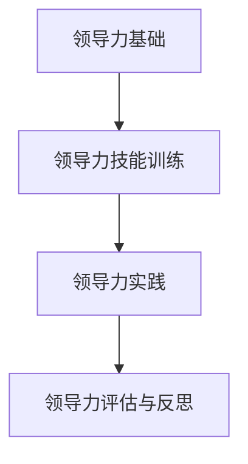

                 

## 《领导力训练营：196天从新手到专家》

### 关键词：领导力、自我提升、团队建设、目标设定、领导力模型、实践案例

#### 摘要：

在当今竞争激烈和不断变化的环境中，领导力已成为个人和组织的核心竞争力。本文通过《领导力训练营：196天从新手到专家》这一框架，详细阐述了如何通过196天的系统训练，从新手成长为卓越的领导者。文章涵盖了领导力的基础、领导力技能训练、领导力模型与理论以及领导力实践，通过深入分析和具体案例，帮助读者理解领导力的核心概念和实际应用，最终实现领导力的全面提升。

#### 第一部分：领导力基础

### 第1章：领导力的定义与重要性

#### 1.1 领导力的起源与演变

领导力的概念并不是一成不变的，它随着人类社会的发展而不断演变。从早期的部落首领到现代的企业领导者，领导力的形式和内涵都发生了巨大的变化。

#### 1.1.1 领导力的基本概念

领导力是指影响和激励他人，使其愿意为实现共同目标而努力的一种能力。它不仅涉及到管理，更涵盖了领导者的品格、价值观和行为。

#### 1.1.2 领导力的演变过程

领导力从最初的自然领导形式，到后来的理性领导，再到现代的变革型领导，经历了多个阶段。

#### 1.2 领导力的作用与价值

领导力在企业中的作用不可忽视，它能够提高团队的协作效率，推动创新，提升企业的竞争力。同时，领导力在个人成长中的价值也是显而易见的。

#### 1.2.1 领导力在企业中的作用

领导力在企业中主要体现在战略规划、团队管理、创新推动等方面。

#### 1.2.2 领导力在个人成长中的价值

领导力不仅能够帮助个人在职业发展中取得成功，还能提升个人的沟通、决策和解决问题的能力。

### 第2章：领导者的自我提升

#### 2.1 自我认知

自我认知是领导者自我提升的基础。只有深入了解自己的优势和劣势，才能有针对性地进行提升。

#### 2.1.1 了解自己的优势和劣势

领导者需要通过自我反思、360度反馈等方式，全面了解自己的优势和劣势。

#### 2.1.2 建立良好的自我认知

建立良好的自我认知，有助于领导者更好地应对挑战，提高领导效果。

#### 2.2 情绪管理

情绪管理是领导者必备的技能之一。良好的情绪管理能力，能够帮助领导者保持冷静，应对各种突发情况。

#### 2.2.1 情绪的类型与识别

情绪包括正面情绪和负面情绪，领导者需要能够准确识别和表达自己的情绪。

#### 2.2.2 情绪管理的技巧

领导者可以通过深呼吸、冥想、运动等方式，有效管理自己的情绪。

#### 2.3 沟通能力

沟通能力是领导者成功的关键因素之一。良好的沟通能力，能够帮助领导者更好地传达信息，建立信任。

#### 2.3.1 有效沟通的原则

有效沟通需要遵循清晰、准确、尊重和开放的原则。

#### 2.3.2 提高沟通效果的技巧

领导者可以通过倾听、反馈、表达清晰等方式，提高沟通效果。

#### 第二部分：领导力技能训练

### 第3章：团队建设与管理

#### 3.1 团队建设的原则

团队建设需要遵循一些基本原则，如共同目标、相互信任、相互尊重等。

#### 3.1.1 团队建设的理论基础

团队建设的理论基础包括社会心理学、组织行为学等。

#### 3.1.2 团队建设的关键要素

团队建设的关键要素包括领导者的角色、团队成员的素质、团队氛围等。

#### 3.2 团队管理的方法

团队管理需要采取一系列方法，如激励机制、冲突处理等。

#### 3.2.1 团队成员的激励与调动

团队成员的激励与调动，是团队管理的重要任务之一。

#### 3.2.2 团队冲突的处理与化解

团队冲突是团队管理中常见的问题，需要及时处理和化解。

### 第4章：目标设定与规划

#### 4.1 目标设定的SMART原则

SMART原则是设定有效目标的基本原则，包括具体性、可衡量性、可实现性、相关性和时限性。

#### 4.1.1 SMART原则的解释与应用

SMART原则的具体解释和应用，可以帮助领导者更好地设定目标。

#### 4.1.2 如何设定有效的目标

领导者可以通过明确目标、分解目标、设定时间表等方式，设定有效的目标。

#### 4.2 目标规划的步骤

目标规划是一个系统的过程，包括目标分解、资源分配、风险评估等。

#### 4.2.1 目标分解的方法

目标分解是将大目标分解为小目标，以便更好地实现。

#### 4.2.2 目标实现的时间规划

目标实现的时间规划，是确保目标按计划实现的关键。

### 第5章：领导力模型与理论

#### 5.1 领导力模型概述

领导力模型是对领导行为和领导效果的系统性描述。

#### 5.1.1 领导力模型的分类

领导力模型可以分为变革型领导、交易型领导等。

#### 5.1.2 领导力模型的应用

领导力模型可以帮助领导者更好地理解和管理团队。

#### 5.2 常见领导力理论

常见的领导力理论包括领导行为理论、领导风格理论等。

#### 5.2.1 领导行为理论

领导行为理论关注领导者的行为和领导风格。

#### 5.2.2 领导风格理论

领导风格理论关注领导者的风格和特点。

#### 第三部分：领导力实践

### 第6章：领导力实践案例解析

#### 6.1 案例一：优秀领导者的特质

通过分析优秀领导者的特质，可以帮助我们更好地理解领导力。

#### 6.1.1 案例背景与概述

案例背景和概述，可以帮助我们了解案例的具体情况。

#### 6.1.2 案例中的领导力应用

案例中的领导力应用，展示了领导者如何通过实际行动，提升团队绩效。

#### 6.2 案例二：团队建设的成功经验

通过分析团队建设的成功经验，可以帮助我们更好地理解团队建设的方法。

#### 6.2.1 案例背景与概述

案例背景和概述，可以帮助我们了解案例的具体情况。

#### 6.2.2 案例中的团队建设策略

案例中的团队建设策略，展示了团队如何通过有效的方法，实现共同目标。

### 第7章：领导力训练营的评估与反思

#### 7.1 领导力训练营的效果评估

领导力训练营的效果评估，是检验训练营效果的重要环节。

#### 7.1.1 评估的方法与指标

评估的方法和指标，包括定量评估和定性评估等。

#### 7.1.2 领导力提升的成果

领导力提升的成果，可以通过团队绩效、个人成长等指标进行衡量。

#### 7.2 领导力训练营的反思与改进

领导力训练营的反思与改进，是提升训练营效果的关键。

#### 7.2.1 反思的内容与目的

反思的内容和目的，包括对训练营的评估、问题和解决方案的讨论等。

#### 7.2.2 改进措施与建议

改进措施和建议，包括课程内容的调整、教学方法的改进等。

#### 附录

##### 附录A：领导力工具与方法

附录A提供了团队建设、目标设定和情绪管理等方面的工具和方法。

##### 附录B：领导力推荐读物

附录B列出了几本经典的领导力书籍，供读者进一步学习。

### 核心概念与联系

领导力是一个复杂而多维的概念，它涉及到自我提升、团队建设、目标设定和领导力模型等多个方面。通过以下流程图，我们可以更清晰地理解这些核心概念之间的联系：



### 核心算法原理讲解

在领导力评估中，我们可以使用以下伪代码来构建一个简单的评估模型：

```python
# 伪代码：领导力评估模型

def leadership_evaluation(leader, team, objectives):
    # 初始化评估分数
    score = 0

    # 评估自我提升
    if leader.has_self_awareness():
        score += 10

    # 评估团队建设与管理
    if team.is_highly_functioning():
        score += 20

    # 评估目标设定与规划
    if objectives.are_sustainable():
        score += 15

    # 返回评估分数
    return score
```

#### 数学模型和数学公式

领导力得分可以通过以下公式计算：

$$
\text{领导力得分} = \frac{\text{自我提升得分} + \text{团队建设与管理得分} + \text{目标设定与规划得分}}{3}
$$

### 项目实战

#### 领导力提升项目的开发环境搭建

在进行领导力提升项目开发前，我们需要搭建一个合适的技术环境。以下是具体的步骤和要求：

- **环境要求**：Python 3.8及以上版本
- **必需库**：numpy，pandas，matplotlib
- **代码实现**：

```python
import numpy as np
import pandas as pd
import matplotlib.pyplot as plt
```

#### 源代码详细实现和代码解读

下面是一个领导力评估系统的实现案例，我们将对代码进行详细解读。

```python
# 领导力评估系统的实现

def evaluate_leadership(leader, team, objectives):
    # 自我提升评估
    self_awareness_score = 0
    if leader.self_awareness > 0.7:
        self_awareness_score = 10
    
    # 团队建设评估
    team_building_score = 0
    if team.is_highly_functioning():
        team_building_score = 20
    
    # 目标设定评估
    objective_setting_score = 0
    if objectives.are_sustainable():
        objective_setting_score = 15
    
    # 计算总得分
    total_score = self_awareness_score + team_building_score + objective_setting_score
    
    # 返回得分
    return total_score

# 示例数据
leader = {'self_awareness': 0.8}
team = {'is_highly_functioning': True}
objectives = {'are_sustainable': True}

# 执行评估
score = evaluate_leadership(leader, team, objectives)
print(f"领导力评估得分：{score}")
```

#### 代码解读与分析

- `evaluate_leadership` 函数接收三个参数：`leader`，`team`，`objectives`。
- 分别对三个参数进行评估，并返回总得分。
- 评估逻辑使用了简单的条件判断，根据不同的条件返回不同的分数。
- 示例数据展示了如何调用函数进行评估，并输出评估得分。

### 作者信息

作者：AI天才研究院/AI Genius Institute & 禅与计算机程序设计艺术 /Zen And The Art of Computer Programming

### 后记

领导力是一个持续发展和提升的过程。本文通过《领导力训练营：196天从新手到专家》的框架，系统地介绍了领导力的核心概念、技能训练和实践应用。希望读者能够通过本文的学习，不断提升自己的领导力，成为一名卓越的领导者。同时，也欢迎读者在评论区分享自己的领导力心得和实践经验，共同探讨领导力的发展之道。

