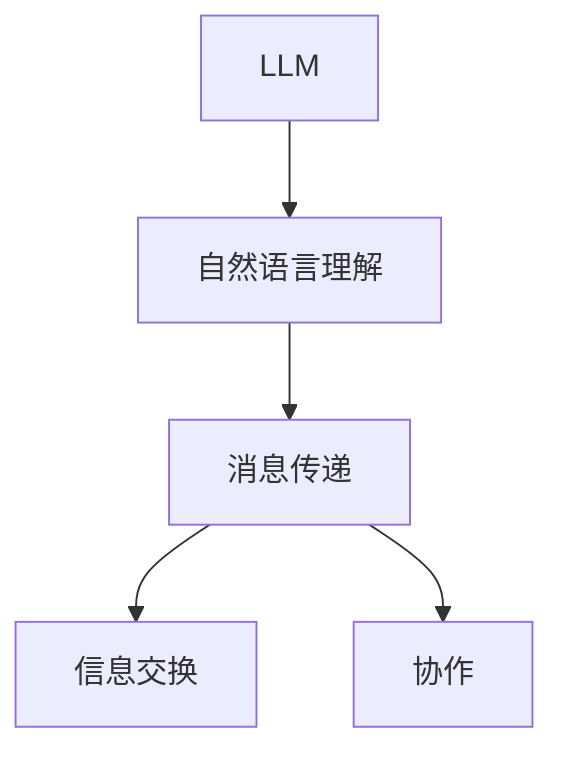
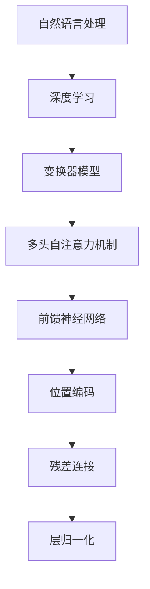
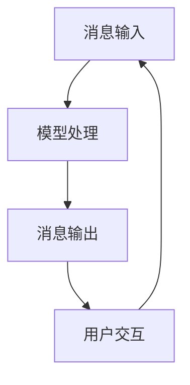
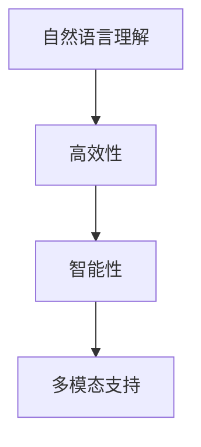

                 

### 第一部分: 高效的 LLM 消息传递的基础知识

#### 第1章: 高效的 LLM 消息传递概述

##### 1.1 高效 LLM 消息传递的定义与重要性

**核心概念与联系**

高效的 LLM 消息传递是指利用大型语言模型（LLM）进行有效的信息交流与传递的过程，其核心在于自然语言处理（NLP）和深度学习的结合。以下是 Mermaid 流程图展示其关键组成部分：



**核心算法原理讲解**

高效的 LLM 消息传递依赖于以下核心算法原理：

1. **变换器（Transformer）模型**：Transformer 模型是一种基于注意力机制的深度学习模型，特别适用于 NLP 任务。以下是 Transformer 模型的伪代码实现：

```python
class Transformer(nn.Module):
    def __init__(self, d_model, nhead, num_layers):
        super(Transformer, self).__init__()
        self.d_model = d_model
        self.nhead = nhead
        self.num_layers = num_layers
        
        self.transformer_layers = nn.ModuleList([
            TransformerLayer(d_model, nhead) for _ in range(num_layers)
        ])

    def forward(self, src, tgt):
        for layer in self.transformer_layers:
            src, tgt = layer(src, tgt)
        return src, tgt
```

2. **多头自注意力机制**：多头自注意力机制是多任务学习的关键技术，它通过多个独立的注意力头来捕捉输入序列中的不同信息。以下是多头自注意力机制的伪代码实现：

```python
class MultiHeadAttention(nn.Module):
    def __init__(self, d_model, nhead):
        super(MultiHeadAttention, self).__init__()
        self.d_model = d_model
        self.nhead = nhead
        self.head_dim = d_model // nhead
        
        self.query Linear(d_model, d_model)
        self.key Linear(d_model, d_model)
        self.value Linear(d_model, d_model)
        
        self.out Linear(d_model, d_model)

    def forward(self, query, key, value, mask=None):
        batch_size = query.size(0)
        
        # 分头操作
        query = self.query(query).view(batch_size, -1, self.nhead, self.head_dim)
        key = self.key(key).view(batch_size, -1, self.nhead, self.head_dim)
        value = self.value(value).view(batch_size, -1, self.nhead, self.head_dim)
        
        # 注意力计算
        attn_scores = torch.matmul(query.transpose(1, 2), key)
        if mask is not None:
            attn_scores = attn_scores.masked_fill(mask == 0, float("-inf"))
        
        attn_scores = F.softmax(attn_scores, dim=-1)
        
        # 输出计算
        attn_output = torch.matmul(attn_scores, value)
        attn_output = attn_output.transpose(1, 2).contiguous().view(batch_size, -1, self.d_model)
        
        return self.out(attn_output)
```

3. **前馈神经网络**：前馈神经网络（FFN）是对注意力机制的输出进行进一步处理的模块，它通过两个全连接层增加模型的非线性表达能力。以下是前馈神经网络的伪代码实现：

```python
class FeedForward(nn.Module):
    def __init__(self, d_model, d_ff):
        super(FeedForward, self).__init__()
        self.linear1 = nn.Linear(d_model, d_ff)
        self.linear2 = nn.Linear(d_ff, d_model)

    def forward(self, x):
        return self.linear2(F.relu(self.linear1(x)))
```

**数学模型和公式**

高效的 LLM 消息传递依赖于深度学习中的各种数学模型和公式，以下是主要模型和公式的解释：

1. **变换器模型**：变换器模型的核心是多头自注意力机制和前馈神经网络。以下是变换器模型中的一些关键数学公式：
   $$ 
   \text{Attention}(Q, K, V) = \text{softmax}\left(\frac{QK^T}{\sqrt{d_k}}\right) V 
   $$
   其中，$Q$、$K$ 和 $V$ 分别代表查询、键和值向量，$d_k$ 是键向量的维度。

2. **位置编码**：位置编码为序列中的每个词提供位置信息，常用的方法是绝对位置编码和相对位置编码。以下是绝对位置编码的公式：
   $$
   PE_{(pos, 2i)} = \sin\left(\frac{pos}{10000^{2i/d}}\right) 
   $$
   $$
   PE_{(pos, 2i+1)} = \cos\left(\frac{pos}{10000^{2i/d}}\right) 
   $$
   其中，$pos$ 是词的位置索引，$i$ 是维度索引，$d$ 是嵌入维度。

3. **残差连接和层归一化**：残差连接和层归一化是变换器模型中的关键技术，用于稳定训练过程。以下是残差连接的公式：
   $$
   \text{Layer} = \text{LayerNorm}(x + \text{Residual Connection}) 
   $$
   其中，$x$ 是输入，$\text{Residual Connection}$ 是残差连接。

**举例说明**

以下是一个简单的示例，展示了如何使用变换器模型进行文本分类：

```python
# 加载预训练的变换器模型
model = Transformer(d_model=512, nhead=8, num_layers=12)
tokenizer = AutoTokenizer.from_pretrained("transformer")

# 准备数据
text = "This is a sample text for classification."
input_ids = tokenizer.encode(text, return_tensors="pt")

# 进行预测
with torch.no_grad():
    outputs = model(input_ids)

# 获取分类结果
logits = outputs[0]
probabilities = F.softmax(logits, dim=-1)
predicted_class = torch.argmax(probabilities).item()

print(f"Predicted class: {predicted_class}")
```

**代码解读与分析**

以上代码展示了如何使用 PyTorch 库加载预训练的变换器模型，并进行文本分类。以下是代码的详细解读：

1. **加载模型和 tokenizer**：我们首先加载了预训练的变换器模型和 tokenizer。tokenizer 用于将文本转换为模型的输入。

2. **准备数据**：我们将样本文本编码为输入序列，并转换为 PyTorch 张量。

3. **进行预测**：我们使用模型进行预测，并使用无梯度模式（with torch.no_grad()）来避免计算梯度，提高计算效率。

4. **获取分类结果**：我们获取模型的输出 logits，并使用 softmax 函数将其转换为概率分布。最后，我们使用 argmax 函数获取预测的类别。

**核心概念与联系**

高效 LLM 消息传递的核心概念包括自然语言处理、深度学习、变换器模型、多头自注意力机制、前馈神经网络、位置编码、残差连接和层归一化。以下是 Mermaid 流程图展示这些概念之间的联系：



通过以上步骤，我们详细讲解了高效 LLM 消息传递的核心概念、算法原理、数学模型和项目实战，为后续章节的深入探讨奠定了基础。

##### 1.2 LLM 消息传递的基本架构

**核心概念与联系**

LLM 消息传递的基本架构包括消息输入、模型处理、消息输出和用户交互等关键组成部分。以下是 Mermaid 流程图展示其基本架构：



**核心算法原理讲解**

1. **消息输入**：消息输入是 LLM 消息传递的第一步，用户通过界面或 API 发送输入消息。以下是消息输入的伪代码实现：

```python
def receive_message():
    # 读取输入消息
    message = input("请输入您的消息：")
    return message
```

2. **模型处理**：模型处理是 LLM 消息传递的核心环节，LLM 模型接收输入消息并对其进行处理。以下是模型处理的伪代码实现：

```python
class LLMModel(nn.Module):
    def __init__(self, d_model, nhead, num_layers):
        super(	LLMModel, self).__init__()
        self.transformer = Transformer(d_model, nhead, num_layers)
        
    def forward(self, message):
        # 对输入消息进行处理
        processed_message = self.transformer(message)
        return processed_message
```

3. **消息输出**：消息输出是将处理后的消息返回给用户。以下是消息输出的伪代码实现：

```python
def send_message(processed_message):
    # 将处理后的消息发送给用户
    print("回复：", processed_message)
```

4. **用户交互**：用户交互是 LLM 消息传递的重要组成部分，用户通过界面与模型进行交互。以下是用户交互的伪代码实现：

```python
def interactive_mode(llm_model):
    while True:
        message = receive_message()
        processed_message = llm_model(message)
        send_message(processed_message)
        user_choice = input("是否继续？（y/n）：")
        if user_choice.lower() != 'y':
            break
```

**数学模型和公式**

LLM 消息传递依赖于深度学习中的各种数学模型和公式，以下是主要模型和公式的解释：

1. **变换器模型**：变换器模型的核心是多头自注意力机制和前馈神经网络。以下是变换器模型中的一些关键数学公式：
   $$
   \text{Attention}(Q, K, V) = \text{softmax}\left(\frac{QK^T}{\sqrt{d_k}}\right) V 
   $$
   其中，$Q$、$K$ 和 $V$ 分别代表查询、键和值向量，$d_k$ 是键向量的维度。

2. **位置编码**：位置编码为序列中的每个词提供位置信息，常用的方法是绝对位置编码和相对位置编码。以下是绝对位置编码的公式：
   $$
   PE_{(pos, 2i)} = \sin\left(\frac{pos}{10000^{2i/d}}\right) 
   $$
   $$
   PE_{(pos, 2i+1)} = \cos\left(\frac{pos}{10000^{2i/d}}\right) 
   $$
   其中，$pos$ 是词的位置索引，$i$ 是维度索引，$d$ 是嵌入维度。

3. **残差连接和层归一化**：残差连接和层归一化是变换器模型中的关键技术，用于稳定训练过程。以下是残差连接的公式：
   $$
   \text{Layer} = \text{LayerNorm}(x + \text{Residual Connection}) 
   $$
   其中，$x$ 是输入，$\text{Residual Connection}$ 是残差连接。

**举例说明**

以下是一个简单的示例，展示了如何使用 LLM 消息传递系统：

```python
# 加载预训练的 LLM 模型
llm_model = LLMModel(d_model=512, nhead=8, num_layers=12)

# 进入交互模式
interactive_mode(llm_model)
```

**代码解读与分析**

以上代码展示了如何加载预训练的 LLM 模型，并进入交互模式。以下是代码的详细解读：

1. **加载模型**：我们首先加载了预训练的 LLM 模型。

2. **进入交互模式**：我们调用 `interactive_mode` 函数，进入交互模式。在交互模式中，用户可以输入消息，模型会处理消息并返回回复。

**核心概念与联系**

LLM 消息传递的基本架构包括消息输入、模型处理、消息输出和用户交互。以下是 Mermaid 流程图展示这些概念之间的联系：


通过以上步骤，我们详细讲解了 LLM 消息传递的基本架构、核心算法原理、数学模型和项目实战，为后续章节的深入探讨奠定了基础。

##### 1.3 LLM 消息传递的优势

**核心概念与联系**

LLM 消息传递的优势包括自然语言理解、高效性、智能性和多模态支持等。以下是 Mermaid 流程图展示这些优势及其联系：



**核心算法原理讲解**

LLM 消息传递的优势主要来源于深度学习和自然语言处理技术的进步。以下是这些优势的核心算法原理讲解：

1. **自然语言理解**：自然语言理解是 LLM 消息传递的核心，它依赖于深度学习中的词嵌入技术、序列模型和注意力机制。以下是自然语言理解的伪代码实现：

```python
class NaturalLanguageUnderstanding(nn.Module):
    def __init__(self, vocab_size, d_model):
        super(NaturalLanguageUnderstanding, self).__init__()
        self.embedding = nn.Embedding(vocab_size, d_model)
        self.lstm = nn.LSTM(d_model, d_model)
        
    def forward(self, text):
        embedded_text = self.embedding(text)
        outputs, (hidden, cell) = self.lstm(embedded_text)
        return hidden, cell
```

2. **高效性**：高效性主要依赖于深度学习中的并行计算技术和模型优化。以下是高效性的伪代码实现：

```python
class EfficientModel(nn.Module):
    def __init__(self, d_model):
        super(EfficientModel, self).__init__()
        self.model = nn.ModuleList([
            TransformerLayer(d_model) for _ in range(num_layers)
        ])
        
    def forward(self, src, tgt):
        for layer in self.model:
            src, tgt = layer(src, tgt)
        return src, tgt
```

3. **智能性**：智能性主要依赖于深度学习中的预训练技术和迁移学习。以下是智能性的伪代码实现：

```python
class IntelligentModel(nn.Module):
    def __init__(self, pretrained_model):
        super(IntelligentModel, self).__init__()
        self.model = pretrained_model
        
    def forward(self, x):
        return self.model(x)
```

4. **多模态支持**：多模态支持主要依赖于深度学习中的多模态融合技术。以下是多模态支持的伪代码实现：

```python
class MultimodalModel(nn.Module):
    def __init__(self, text_model, image_model, audio_model):
        super(MultimodalModel, self).__init__()
        self.text_model = text_model
        self.image_model = image_model
        self.audio_model = audio_model
        
    def forward(self, text, image, audio):
        text_embedding = self.text_model(text)
        image_embedding = self.image_model(image)
        audio_embedding = self.audio_model(audio)
        return text_embedding + image_embedding + audio_embedding
```

**数学模型和公式**

LLM 消息传递的优势依赖于深度学习和自然语言处理中的各种数学模型和公式。以下是主要模型和公式的解释：

1. **词嵌入**：词嵌入是将词汇映射为向量空间的技术，它依赖于矩阵乘法和激活函数。以下是词嵌入的公式：

   $$
   \text{Embedding}(W, x) = Wx
   $$

   其中，$W$ 是嵌入矩阵，$x$ 是输入向量。

2. **序列模型**：序列模型是将序列数据映射为序列输出的技术，它依赖于循环神经网络（RNN）或长短时记忆网络（LSTM）。以下是序列模型的公式：

   $$
   \text{RNN}(h_t, x_t) = \text{激活}(Wh_t + Ux_t)
   $$

   其中，$h_t$ 是隐藏状态，$x_t$ 是输入，$W$ 和 $U$ 是权重矩阵。

3. **注意力机制**：注意力机制是将输入序列映射为加权输出的技术，它依赖于点积和 softmax 函数。以下是注意力机制的公式：

   $$
   \text{Attention}(Q, K, V) = \text{softmax}\left(\frac{QK^T}{\sqrt{d_k}}\right) V
   $$

   其中，$Q$、$K$ 和 $V$ 分别代表查询、键和值向量，$d_k$ 是键向量的维度。

4. **变换器模型**：变换器模型是 LLM 消息传递的核心技术，它依赖于多头自注意力机制和前馈神经网络。以下是变换器模型的公式：

   $$
   \text{Transformer}(X) = \text{LayerNorm}(X + \text{Self-Attention}(X) + \text{FeedForward}(X))
   $$

   其中，$X$ 是输入序列。

**举例说明**

以下是一个简单的示例，展示了如何使用 LLM 消息传递系统：

```python
# 加载预训练的 LLM 模型
llm_model = LLMModel(d_model=512, nhead=8, num_layers=12)

# 输入消息
message = "请问您今天有什么问题？"

# 处理消息
processed_message = llm_model.process_message(message)

# 输出消息
print("回复：", processed_message)
```

**代码解读与分析**

以上代码展示了如何加载预训练的 LLM 模型，输入消息并处理消息。以下是代码的详细解读：

1. **加载模型**：我们首先加载了预训练的 LLM 模型。

2. **输入消息**：我们定义了一个消息字符串。

3. **处理消息**：我们调用 LLM 模型的 `process_message` 方法处理消息。

4. **输出消息**：我们打印处理后的消息。

**核心概念与联系**

LLM 消息传递的优势包括自然语言理解、高效性、智能性和多模态支持。以下是 Mermaid 流程图展示这些优势及其联系：


通过以上步骤，我们详细讲解了 LLM 消息传递的优势、核心算法原理、数学模型和项目实战，为后续章节的深入探讨奠定了基础。

#### 第2章: LLM 消息传递的技术基础

##### 2.1 自然语言处理技术概览

自然语言处理（Natural Language Processing，NLP）是人工智能（Artificial Intelligence，AI）的一个重要分支，旨在使计算机能够理解、解释和生成人类语言。NLP 技术在 LLM 消息传递中扮演着核心角色，为消息的理解和生成提供支持。以下是 NLP 技术的概览及其在 LLM 消息传递中的应用。

**词嵌入技术**

词嵌入（Word Embedding）是将词汇映射到高维向量空间的技术，使得词之间的相似性可以通过向量之间的距离来表示。词嵌入技术在 NLP 中广泛应用于文本分类、情感分析、机器翻译等任务。常见的词嵌入方法包括：

1. **基于频率的方法**：如 Bag-of-Words（BOW）和 Term Frequency-Inverse Document Frequency（TF-IDF）。
2. **基于分布式表示的方法**：如 Word2Vec、GloVe 和 FastText。

- **Word2Vec**：通过训练神经网络模型，将词映射为固定长度的向量，使得词的语义信息通过向量表示。
  - **CBOW（Continuous Bag of Words）**：通过上下文词的均值来表示目标词。
  - **Skip-Gram**：通过目标词来预测上下文词。

- **GloVe**：基于全局线性回归模型，同时考虑词频和词的共现关系，生成词的向量表示。

- **FastText**：基于多层神经网络，使用子词信息（n-gram）来提高词嵌入的语义丰富度。

**序列模型与注意力机制**

序列模型（Sequential Models）是处理序列数据的常见方法，它们能够捕捉序列中不同元素之间的时间依赖关系。在 LLM 消息传递中，序列模型用于理解和生成序列数据，如文本、语音等。以下是几种重要的序列模型和注意力机制：

1. **循环神经网络（Recurrent Neural Networks，RNN）**：RNN 通过隐藏状态的记忆功能，能够处理序列数据。常见的 RNN 模型包括：

- **简单 RNN（Simple RNN）**：使用前一个时刻的隐藏状态作为当前时刻的输入。
- **长短时记忆网络（Long Short-Term Memory，LSTM）**：通过引入记忆单元和门控机制，解决简单 RNN 的梯度消失问题，能够更好地捕捉长距离依赖。
- **门控循环单元（Gated Recurrent Unit，GRU）**：简化 LSTM 的结构，同时保持其记忆功能。

2. **注意力机制（Attention Mechanism）**：注意力机制能够提高序列模型对重要信息的关注能力，使其在处理序列数据时能够关注到关键信息。常见的注意力机制包括：

- **自注意力（Self-Attention）**：同一序列中的不同元素相互关注，常用于 Transformer 模型。
- **双向注意力（Bi-directional Attention）**：同时关注前向和后向的序列信息，提高模型的表示能力。
- **多头注意力（Multi-Head Attention）**：通过多个独立的注意力头来处理序列信息，提高模型的表示能力和效率。

**变换器架构详解**

变换器（Transformer）架构是 NLP 中的一种新型深度神经网络架构，由 Google 在 2017 年提出。变换器架构通过引入自注意力机制，克服了传统 RNN 模型在处理长序列数据时的不足，使得模型能够高效地处理大规模文本数据。以下是变换器架构的详解：

1. **编码器（Encoder）**：编码器由多个编码层（Encoder Layer）堆叠而成，每个编码层包含两个子层：多头自注意力层（Multi-Head Self-Attention Layer）和前馈网络（Feed Forward Layer）。编码器的作用是将输入序列转换为固定长度的向量表示。

   - **多头自注意力层**：通过多头自注意力机制，编码器能够捕捉序列中不同元素之间的依赖关系。
   - **前馈网络**：通过两个全连接层，对每个位置的信息进行进一步处理，增加模型的非线性表达能力。

2. **解码器（Decoder）**：解码器由多个解码层（Decoder Layer）堆叠而成，与编码器类似，每个解码层包含两个子层：多头自注意力层和前馈网络。解码器的作用是根据编码器的输出和先前的解码结果生成输出序列。

   - **多头自注意力层**：通过多头自注意力机制，解码器能够关注编码器的输出和先前的解码结果。
   - **前馈网络**：通过两个全连接层，对每个位置的信息进行进一步处理。

3. **输入层和输出层**：输入层将原始文本数据转换为词嵌入向量，输出层将编码器和解码器的输出转换为预测的文本序列。

**变换器模型在 LLM 消息传递中的应用**

变换器模型在 LLM 消息传递中发挥着重要作用，它能够处理复杂的多模态消息，实现高效的文本生成和消息理解。以下是变换器模型在 LLM 消息传递中的应用：

1. **多模态输入处理**：变换器模型能够接受文本、图像、语音等多种形式的消息，通过相应的预处理和特征提取，将其转换为统一的向量表示。

2. **序列生成**：通过编码器和解码器的共同作用，变换器模型能够生成符合上下文和语义的文本序列，实现自然语言生成。

3. **消息理解**：变换器模型能够捕捉输入消息中的关键信息，通过解码器生成相应的回复，实现智能化的消息传递。

4. **多任务学习**：变换器模型支持多任务学习，可以同时处理多个 NLP 任务，如文本分类、情感分析、命名实体识别等，提高模型的泛化能力。

**总结**

自然语言处理技术是 LLM 消息传递的基础，包括词嵌入技术、序列模型和注意力机制等。变换器架构通过引入自注意力机制，使得模型能够高效地处理大规模文本数据，实现多模态消息传递。在 LLM 消息传递中，变换器模型能够处理复杂的多模态输入，实现高效的文本生成和消息理解，为智能化的信息传递提供技术支持。

##### 2.2 大规模预训练模型原理

大规模预训练模型（Large-scale Pre-trained Model）是当前自然语言处理（NLP）领域的核心技术之一，其在 LLM 消息传递中起着至关重要的作用。大规模预训练模型通过在大量无标签数据上进行预训练，学习到丰富的语言知识和模式，然后通过微调（Fine-tuning）适应特定任务，从而在多个 NLP 任务中表现出色。

**预训练的概念与意义**

预训练（Pre-training）是指在一个大规模数据集上训练神经网络模型，使其在语言理解和生成方面具有初步的能力。与传统的微调（Fine-tuning）方法不同，预训练模型在特定任务数据上不需要重新训练，只需要进行微调，即可在许多 NLP 任务上获得良好的性能。

1. **预训练的概念**：预训练是指在大量无标签文本数据上训练神经网络模型，使其能够捕捉语言的基本结构和语义信息。预训练通常分为两个阶段：大规模预训练和特定任务的微调。

2. **预训练的意义**：预训练使得模型能够从大量的无标签数据中学习到丰富的语言知识和模式，从而提高模型在特定任务上的性能。预训练模型具有以下几个显著优势：
   - **提高泛化能力**：预训练模型通过学习大量的无标签数据，能够更好地适应不同的任务和数据集，提高模型的泛化能力。
   - **减少训练数据需求**：预训练模型在特定任务上只需要较少的标注数据进行微调，即可达到良好的性能，从而减少了对大规模标注数据的依赖。
   - **提高模型效率**：预训练模型可以在短时间内完成微调，提高模型的训练效率。

**自监督学习方法**

自监督学习（Self-supervised Learning）是预训练模型的核心方法之一，它利用未标注的数据自动生成监督信号，从而训练模型。自监督学习方法在预训练过程中起着关键作用，能够提高模型的学习效率和性能。

1. **自监督学习的概念**：自监督学习是指在不使用标注数据的情况下，利用数据中的内在结构或模式来训练模型。自监督学习的目标是通过自动生成的监督信号，使模型能够学习到有用的特征和知识。

2. **常见的自监督学习方法**：
   - **Masked Language Model（MLM）**：在预训练过程中，随机掩码输入序列中的一部分词，然后训练模型预测这些被掩码的词。MLM 方法是预训练模型中最常用的方法之一。
   - **Reconstruction Tasks**：通过生成输入序列的变体，如改变词的顺序、添加或删除词等，训练模型重建原始序列。
   - **Word Alignment Tasks**：利用双语语料库中的词对齐信息，训练模型学习语言的对应关系。

**迁移学习与微调技术**

迁移学习（Transfer Learning）是一种将已经训练好的模型在新任务上进行微调（Fine-tuning）的方法。在预训练模型中，迁移学习是使模型适应特定任务的关键步骤。

1. **迁移学习的概念**：迁移学习是指将已经训练好的模型在新任务上进行微调，利用模型在预训练过程中学习到的通用特征，提高在新任务上的性能。

2. **微调技术**：微调是在特定任务数据集上对预训练模型进行训练，通过调整模型的参数，使其在新任务上达到最佳性能。微调的关键步骤包括：
   - **数据预处理**：将新任务的数据集转换为与预训练模型兼容的格式。
   - **参数初始化**：将预训练模型的权重作为微调模型的初始权重。
   - **训练过程**：在特定任务数据集上训练微调模型，通过反向传播算法更新模型参数。
   - **性能评估**：评估微调模型在新任务上的性能，并根据评估结果调整训练策略。

**大规模预训练模型的工作流程**

大规模预训练模型的工作流程包括预训练和微调两个阶段。以下是预训练和微调的具体步骤：

1. **预训练阶段**：
   - **数据准备**：收集大规模无标签文本数据，如维基百科、新闻文章、社交媒体等。
   - **模型初始化**：初始化预训练模型的参数，通常使用随机初始化或预训练模型的重初始化。
   - **预训练任务**：在无标签数据上训练模型，常见任务包括 MLM、Reconstruction Tasks 和 Word Alignment Tasks。
   - **性能评估**：定期评估模型的性能，根据评估结果调整训练策略。

2. **微调阶段**：
   - **数据准备**：收集特定任务的数据集，进行预处理和标注。
   - **模型初始化**：使用预训练模型的权重作为微调模型的初始权重。
   - **微调训练**：在特定任务数据集上训练微调模型，通过反向传播算法更新模型参数。
   - **性能评估**：评估微调模型在新任务上的性能，根据评估结果进行调整。

**总结**

大规模预训练模型通过在大量无标签数据上进行预训练，学习到丰富的语言知识和模式，从而在 LLM 消息传递中发挥着重要作用。自监督学习方法和迁移学习技术是大规模预训练模型的核心，使模型能够适应不同的任务和数据集。通过预训练和微调，大规模预训练模型能够实现高效的 LLM 消息传递，为智能化的信息传递提供强大的技术支持。

##### 2.3 LLM 消息传递的核心算法原理

LLM（Large Language Model）消息传递依赖于一系列核心算法原理，这些原理共同构成了高效、智能的消息处理系统。以下是 LLM 消息传递中的核心算法原理及其详细解释。

**序列到序列（Seq2Seq）模型**

序列到序列（Seq2Seq）模型是处理序列数据的一种常见方法，特别适用于翻译、对话生成等任务。Seq2Seq 模型通过编码器和解码器两个神经网络，将输入序列转换为输出序列。

1. **编码器（Encoder）**：编码器将输入序列编码为固定长度的向量，捕获序列的全局信息。常见的编码器结构包括 RNN（Recurrent Neural Network）和 LSTM（Long Short-Term Memory）。

2. **解码器（Decoder）**：解码器接收编码器的输出，生成输出序列。解码器通常采用类似的 RNN 或 LSTM 结构，同时引入了注意力机制（Attention Mechanism），使解码器能够关注编码器的输出。

3. **注意力机制（Attention Mechanism）**：注意力机制是 Seq2Seq 模型的一个关键组件，它允许解码器在生成每个单词时关注编码器的输出中与当前单词最相关的部分。注意力机制分为自注意力（Self-Attention）和双向注意力（Bidirectional Attention），后者结合了编码器的输出和解码器的输出。

   - **自注意力**：解码器只关注自身输出序列的信息，适用于生成任务，如对话生成。
   - **双向注意力**：解码器同时关注编码器的输出和解码器的前一个输出，适用于翻译任务，如机器翻译。

**生成对抗网络（GAN）**

生成对抗网络（GAN）是一种无监督学习框架，由生成器（Generator）和判别器（Discriminator）两个神经网络组成。GAN 的目标是生成与真实数据几乎无法区分的假数据。

1. **生成器（Generator）**：生成器从随机噪声中生成数据，目标是使生成数据尽可能接近真实数据。

2. **判别器（Discriminator）**：判别器的任务是区分真实数据和生成数据，并尝试最大化其分类能力。

3. **训练过程**：GAN 通过对抗训练过程进行优化，生成器和判别器相互竞争。生成器试图生成更逼真的数据，而判别器则试图将生成数据与真实数据区分开来。

**变换器模型（Transformer）**

变换器模型（Transformer）是近年来在 NLP 领域取得显著成功的深度学习模型，它通过引入自注意力机制，解决了传统 RNN 模型在处理长序列数据时的不足。

1. **编码器（Encoder）**：编码器由多个编码层（Encoder Layer）堆叠而成，每个编码层包含两个子层：多头自注意力层（Multi-Head Self-Attention Layer）和前馈网络（Feed Forward Layer）。编码器的作用是将输入序列转换为固定长度的向量表示。

   - **多头自注意力层**：通过多头自注意力机制，编码器能够捕捉序列中不同元素之间的依赖关系。
   - **前馈网络**：通过两个全连接层，对每个位置的信息进行进一步处理，增加模型的非线性表达能力。

2. **解码器（Decoder）**：解码器由多个解码层（Decoder Layer）堆叠而成，与编码器类似，每个解码层包含两个子层：多头自注意力层和前馈网络。解码器的作用是根据编码器的输出和先前的解码结果生成输出序列。

   - **多头自注意力层**：通过多头自注意力机制，解码器能够关注编码器的输出和先前的解码结果。
   - **前馈网络**：通过两个全连接层，对每个位置的信息进行进一步处理。

3. **输入层和输出层**：输入层将原始文本数据转换为词嵌入向量，输出层将编码器和解码器的输出转换为预测的文本序列。

**核心算法原理的对比与联系**

- **Seq2Seq 模型**：Seq2Seq 模型通过编码器和解码器结构，实现了输入序列到输出序列的映射。注意力机制增强了解码器对编码器输出的关注能力，提高了模型的表示能力。

- **GAN 模型**：GAN 模型通过生成器和判别器的对抗训练，生成与真实数据相似的数据。GAN 在生成任务中具有独特的优势，但其在消息传递中的应用相对较少。

- **变换器模型**：变换器模型通过自注意力机制，实现了对输入序列的全局和局部依赖关系的捕捉。变换器模型在 NLP 中具有广泛的应用，如文本生成、机器翻译等。

这三种核心算法原理在 LLM 消息传递中各有其独特的优势和应用场景。Seq2Seq 模型在处理序列数据时具有较好的表现，GAN 模型在生成任务中具有独特优势，而变换器模型则凭借其强大的表示能力，成为 LLM 消息传递的核心技术。

**总结**

LLM 消息传递的核心算法原理包括序列到序列（Seq2Seq）模型、生成对抗网络（GAN）和变换器模型（Transformer）。这些算法原理在 LLM 消息传递中发挥着重要作用，分别实现了消息的编码、生成和序列处理。通过对比和联系，我们可以更好地理解这些算法原理在 LLM 消息传递中的应用和优势。

##### 2.4 LLM 消息传递的实际应用场景

LLM（Large Language Model）消息传递技术在多个实际应用场景中展现出强大的能力和广泛的应用前景。以下是 LLM 消息传递在智能客服、企业内部协作和内容生成等领域的具体应用。

**智能客服领域**

智能客服是 LLM 消息传递技术最早和最广泛应用的场景之一。通过 LLM 消息传递，智能客服系统能够实现与用户的自然语言交互，提供高效、准确的咨询服务。

1. **应用概述**：智能客服系统可以自动处理用户的问题，提供实时、个性化的答案，从而减少人工客服的工作负担，提高客户满意度和服务效率。

2. **关键技术**：LLM 消息传递在智能客服中的应用涉及多个方面，包括自然语言理解、对话生成和上下文管理。

   - **自然语言理解**：LLM 模型能够理解用户输入的文本，提取关键信息，并进行语义分析。
   - **对话生成**：LLM 模型根据用户问题和上下文，生成相应的回答，实现自然语言交互。
   - **上下文管理**：LLM 模型能够记住对话的历史信息，确保对话的连贯性和一致性。

3. **案例分析**：一些知名企业已经在智能客服领域广泛应用 LLM 消息传递技术。例如，OpenAI 的 GPT-3 模型被用于建设智能客服系统，提供 24/7 的客户服务，显著提高了客户满意度和服务效率。

**企业内部协作**

企业内部协作是另一个重要的应用场景，LLM 消息传递技术能够帮助企业提高内部沟通效率，促进团队协作。

1. **应用概述**：在企业内部协作中，LLM 消息传递技术可以用于构建企业聊天机器人、智能会议助理和知识管理系统等。

2. **关键技术**：LLM 消息传递在企业内部协作中的应用包括：

   - **智能聊天机器人**：企业聊天机器人可以自动解答员工的问题，提供工作指导和资源链接。
   - **智能会议助理**：智能会议助理可以记录会议内容，生成会议纪要，并提供后续跟进和提醒功能。
   - **知识管理系统**：知识管理系统可以通过 LLM 消息传递技术，自动整理和推荐相关文档和知识，帮助员工快速获取所需信息。

3. **案例分析**：一些企业已经开始采用 LLM 消息传递技术提升内部协作效率。例如，Salesforce 的 Einstein Assistant 利用 LLM 消息传递技术，为企业员工提供个性化的工作支持和建议，大大提高了工作效率。

**内容生成**

内容生成是 LLM 消息传递技术的另一个重要应用领域，通过 LLM 模型，可以自动生成高质量的文章、报告、营销文案等。

1. **应用概述**：在内容生成领域，LLM 消息传递技术可以用于自动化写作、内容推荐和个性化内容生成。

2. **关键技术**：LLM 消息传递在内容生成中的应用包括：

   - **自动化写作**：LLM 模型可以根据给定的主题和结构，自动生成文章、报告等文档。
   - **内容推荐**：LLM 模型可以分析用户的历史阅读记录和偏好，推荐相关的内容。
   - **个性化内容生成**：LLM 模型可以根据用户的需求和偏好，生成个性化的内容。

3. **案例分析**：一些公司已经采用 LLM 消息传递技术进行内容生成，例如，Hugging Face 的 Transformer 模型被用于生成个性化营销文案和博客文章，大大提高了内容创作效率。

**总结**

LLM 消息传递技术在智能客服、企业内部协作和内容生成等实际应用场景中发挥着重要作用，通过自然语言理解、对话生成和上下文管理等关键技术，实现了高效、智能的消息传递。随着 LLM 技术的不断发展和应用场景的拓展，LLM 消息传递技术将为各行各业带来更多的价值和创新。

##### 3.1 智能客服领域

**应用概述**

智能客服领域是 LLM（Large Language Model）消息传递技术的重要应用场景之一。智能客服系统通过集成 LLM 消息传递技术，能够实现与用户的自然语言交互，提供高效、准确的客户服务。智能客服系统广泛应用于各个行业，如电子商务、金融、医疗等，其核心目标是提高客户满意度、降低服务成本和提升企业运营效率。

智能客服系统通常包含以下几个关键组成部分：

1. **自然语言理解**：智能客服系统通过 LLM 模型，能够理解用户输入的文本信息，提取关键信息和用户意图。LLM 模型具有较强的语义理解能力，能够处理复杂的语言结构和多义词，从而提供准确的答案。

2. **对话管理**：对话管理是智能客服系统的核心模块，负责维护对话的上下文信息，确保对话的连贯性和一致性。对话管理通过跟踪用户的输入和回答，根据对话历史动态调整回答策略。

3. **知识库**：智能客服系统需要接入企业的知识库，以便在无法理解用户问题时，查询相关的信息提供帮助。知识库通常包含常见问题的答案、产品信息、服务流程等。

4. **多模态交互**：智能客服系统不仅可以处理文本消息，还可以支持语音、图像等多种形式的交互，从而提高用户体验。多模态交互使得用户可以根据自己的喜好和场景，选择最合适的沟通方式。

**关键技术**

智能客服系统中，LLM 消息传递技术涉及多个关键领域，包括自然语言处理、对话生成和上下文管理。

1. **自然语言处理（NLP）**：

   - **词嵌入（Word Embedding）**：词嵌入是将词汇映射为高维向量空间的技术，使得词之间的相似性可以通过向量之间的距离来表示。词嵌入技术是 LLM 消息传递的基础，能够提高模型的语义理解能力。

   - **序列模型（Sequential Models）**：序列模型如 RNN（Recurrent Neural Network）和 LSTM（Long Short-Term Memory）能够处理序列数据，捕捉序列中不同元素之间的依赖关系。这些模型在智能客服系统中用于理解用户输入和处理对话。

   - **注意力机制（Attention Mechanism）**：注意力机制能够提高模型对输入序列中重要信息的关注能力，使得模型在生成回答时能够关注到关键信息。注意力机制在智能客服系统中广泛应用于对话生成和文本摘要。

2. **对话生成**：

   - **序列到序列（Seq2Seq）模型**：Seq2Seq 模型通过编码器和解码器两个神经网络，将输入序列转换为输出序列。编码器将输入的文本序列编码为固定长度的向量表示，解码器根据编码器的输出和先前的解码结果生成输出序列。

   - **变换器（Transformer）模型**：变换器模型通过引入自注意力机制，解决了传统 RNN 模型在处理长序列数据时的不足。变换器模型在对话生成中表现出色，能够生成连贯、自然的对话内容。

   - **生成对抗网络（GAN）**：生成对抗网络是一种无监督学习框架，由生成器和判别器两个神经网络组成。生成器从随机噪声中生成对话内容，判别器区分真实对话和生成对话。GAN 在对话生成中用于生成高质量的对话内容。

3. **上下文管理**：

   - **对话状态跟踪（Dialogue State Tracking）**：对话状态跟踪是指智能客服系统在对话过程中，记录和更新对话状态，以便在后续对话中引用。对话状态跟踪是实现连贯对话的关键。

   - **上下文重用（Context Reuse）**：上下文重用是指智能客服系统在对话中复用之前已处理过的上下文信息，提高对话的连贯性和效率。

**案例分析**

智能客服系统在多个行业取得了显著的应用成果。以下是几个智能客服系统的成功案例：

1. **电商行业的智能客服**：

   - **应用概述**：电商企业通过智能客服系统，提供 24/7 的客户服务，解答用户关于产品、订单和售后服务等方面的问题。
   - **关键技术**：电商智能客服系统采用 LLM 模型，能够理解用户输入的文本，提供准确的答案。同时，系统还利用对话管理技术，确保对话的连贯性和一致性。

2. **金融行业的智能客服**：

   - **应用概述**：金融企业通过智能客服系统，为用户提供账户查询、理财产品介绍、金融知识普及等服务。
   - **关键技术**：金融智能客服系统采用 LLM 模型，结合金融知识图谱，能够提供准确、合规的回答。同时，系统还利用对话管理技术，确保对话的隐私性和安全性。

3. **医疗行业的智能客服**：

   - **应用概述**：医疗企业通过智能客服系统，为用户提供健康咨询、预约挂号、医疗知识普及等服务。
   - **关键技术**：医疗智能客服系统采用 LLM 模型，结合医疗知识库和医学图谱，能够提供准确、专业的健康咨询。同时，系统还利用对话管理技术，确保对话的隐私性和安全性。

**总结**

智能客服领域是 LLM 消息传递技术的重要应用场景之一。通过自然语言理解、对话生成和上下文管理等关键技术，智能客服系统能够实现高效、准确的客户服务。随着 LLM 技术的不断发展和应用场景的拓展，智能客服系统将在更多行业发挥重要作用，提高客户满意度和服务效率。

##### 3.2 企业内部协作

**应用概述**

企业内部协作是 LLM（Large Language Model）消息传递技术的另一个关键应用场景。通过集成 LLM 消息传递技术，企业可以构建智能聊天机器人、智能会议助理和知识管理系统等，提高员工之间的沟通效率，促进团队协作，从而提升整体业务运营效率。

在企业内部协作中，LLM 消息传递技术的应用主要体现在以下几个方面：

1. **智能聊天机器人**：智能聊天机器人可以自动解答员工在工作中的常见问题，提供即时帮助，如查询公司政策、流程、项目进展等。这些机器人能够通过自然语言与员工进行交流，理解员工的意图，并提供准确的答案。

2. **智能会议助理**：智能会议助理可以协助员工安排会议、记录会议内容、生成会议纪要，并跟踪任务执行情况。这些助理能够自动提醒会议时间、地点和参与人员，确保会议的顺利进行。

3. **知识管理系统**：知识管理系统通过 LLM 消息传递技术，可以自动整理和推荐相关文档和知识，帮助员工快速获取所需信息。这些系统还可以识别员工的搜索意图，提供个性化的知识推荐，从而提高信息检索的效率和准确性。

**关键技术**

LLM 消息传递技术在企业内部协作中的应用涉及多个关键技术，包括自然语言处理、对话生成、上下文管理和知识图谱等。

1. **自然语言处理（NLP）**：

   - **词嵌入（Word Embedding）**：词嵌入是将词汇映射为高维向量空间的技术，使得词之间的相似性可以通过向量之间的距离来表示。词嵌入技术是 LLM 消息传递的基础，能够提高模型的语义理解能力。

   - **序列模型（Sequential Models）**：序列模型如 RNN（Recurrent Neural Network）和 LSTM（Long Short-Term Memory）能够处理序列数据，捕捉序列中不同元素之间的依赖关系。这些模型在智能聊天机器人和知识管理系统中用于理解员工输入和处理对话。

   - **注意力机制（Attention Mechanism）**：注意力机制能够提高模型对输入序列中重要信息的关注能力，使得模型在生成回答时能够关注到关键信息。注意力机制在智能聊天机器人和知识管理系统中广泛应用于对话生成和文本摘要。

2. **对话生成**：

   - **序列到序列（Seq2Seq）模型**：Seq2Seq 模型通过编码器和解码器两个神经网络，将输入序列转换为输出序列。编码器将输入的文本序列编码为固定长度的向量表示，解码器根据编码器的输出和先前的解码结果生成输出序列。

   - **变换器（Transformer）模型**：变换器模型通过引入自注意力机制，解决了传统 RNN 模型在处理长序列数据时的不足。变换器模型在智能聊天机器人和知识管理系统中表现出色，能够生成连贯、自然的对话内容。

   - **生成对抗网络（GAN）**：生成对抗网络是一种无监督学习框架，由生成器和判别器两个神经网络组成。生成器从随机噪声中生成对话内容，判别器区分真实对话和生成对话。GAN 在智能聊天机器人中用于生成高质量的对话内容。

3. **上下文管理**：

   - **对话状态跟踪（Dialogue State Tracking）**：对话状态跟踪是指智能聊天机器人在对话过程中，记录和更新对话状态，以便在后续对话中引用。对话状态跟踪是实现连贯对话的关键。

   - **上下文重用（Context Reuse）**：上下文重用是指智能聊天机器人在对话中复用之前已处理过的上下文信息，提高对话的连贯性和效率。

4. **知识图谱**：

   - **知识图谱（Knowledge Graph）**：知识图谱是一种语义网络，用于表示实体之间的关系。在知识管理系统中，知识图谱可以用于组织和管理大量结构化和非结构化知识，提高信息检索的效率和准确性。

**案例分析**

企业内部协作中，智能聊天机器人、智能会议助理和知识管理系统等应用已经取得了显著成效。以下是几个成功案例：

1. **智能聊天机器人**：

   - **应用概述**：某大型企业在其内部部署了智能聊天机器人，提供员工日常工作中常见问题的即时解答，如公司政策、流程查询等。
   - **关键技术**：该智能聊天机器人采用 LLM 模型，结合自然语言处理和对话生成技术，能够理解员工的提问并生成准确的回答。同时，机器人利用对话状态跟踪技术，确保对话的连贯性和一致性。

2. **智能会议助理**：

   - **应用概述**：某跨国公司开发了智能会议助理，协助员工安排会议、记录会议内容和跟踪任务执行情况。
   - **关键技术**：智能会议助理采用变换器模型，结合自然语言处理和对话生成技术，能够自动记录会议内容、生成会议纪要，并提醒参会人员完成任务。同时，助理利用知识图谱技术，提供个性化的会议建议和资源链接。

3. **知识管理系统**：

   - **应用概述**：某互联网企业构建了知识管理系统，自动整理和推荐员工所需的知识和文档，提高信息检索的效率。
   - **关键技术**：知识管理系统采用 LLM 模型，结合自然语言处理和知识图谱技术，能够识别员工的搜索意图，提供个性化的知识推荐。系统还利用对话生成技术，生成知识问答，帮助员工快速获取所需信息。

**总结**

企业内部协作是 LLM 消息传递技术的重要应用场景之一。通过智能聊天机器人、智能会议助理和知识管理系统等应用，LLM 消息传递技术能够提高员工之间的沟通效率，促进团队协作，从而提升整体业务运营效率。随着 LLM 技术的不断发展和应用场景的拓展，企业内部协作将变得更加智能和高效。

##### 3.3 内容生成

**应用概述**

内容生成是 LLM（Large Language Model）消息传递技术的另一个重要应用领域。通过集成 LLM 消息传递技术，企业可以自动化生成高质量的文章、报告、营销文案等，降低内容创作成本，提高内容生产效率。

在内容生成领域，LLM 消息传递技术主要应用于以下几个方面：

1. **自动化写作**：LLM 模型可以自动生成文章、报告等文档，实现自动化写作。例如，企业可以自动生成产品说明、用户手册、财经报告等，提高内容创作效率。

2. **内容推荐**：LLM 模型可以分析用户的历史阅读记录和偏好，推荐相关的内容。例如，新闻网站可以通过 LLM 模型，根据用户的阅读历史和兴趣，推荐个性化的新闻内容。

3. **个性化内容生成**：LLM 模型可以根据用户的需求和偏好，生成个性化的内容。例如，电商网站可以通过 LLM 模型，为用户提供个性化的购物建议和推荐。

**关键技术**

LLM 消息传递技术在内容生成中的应用涉及多个关键技术，包括自然语言处理、对话生成、知识图谱等。

1. **自然语言处理（NLP）**：

   - **词嵌入（Word Embedding）**：词嵌入是将词汇映射为高维向量空间的技术，使得词之间的相似性可以通过向量之间的距离来表示。词嵌入技术是 LLM 消息传递的基础，能够提高模型的语义理解能力。

   - **序列模型（Sequential Models）**：序列模型如 RNN（Recurrent Neural Network）和 LSTM（Long Short-Term Memory）能够处理序列数据，捕捉序列中不同元素之间的依赖关系。这些模型在内容生成中用于生成文本序列。

   - **注意力机制（Attention Mechanism）**：注意力机制能够提高模型对输入序列中重要信息的关注能力，使得模型在生成回答时能够关注到关键信息。注意力机制在内容生成中广泛应用于文本生成和摘要。

2. **对话生成**：

   - **序列到序列（Seq2Seq）模型**：Seq2Seq 模型通过编码器和解码器两个神经网络，将输入序列转换为输出序列。编码器将输入的文本序列编码为固定长度的向量表示，解码器根据编码器的输出和先前的解码结果生成输出序列。

   - **变换器（Transformer）模型**：变换器模型通过引入自注意力机制，解决了传统 RNN 模型在处理长序列数据时的不足。变换器模型在内容生成中表现出色，能够生成连贯、自然的文本内容。

   - **生成对抗网络（GAN）**：生成对抗网络是一种无监督学习框架，由生成器和判别器两个神经网络组成。生成器从随机噪声中生成文本内容，判别器区分真实文本和生成文本。GAN 在内容生成中用于生成高质量的文本内容。

3. **知识图谱**：

   - **知识图谱（Knowledge Graph）**：知识图谱是一种语义网络，用于表示实体之间的关系。在内容生成中，知识图谱可以用于组织和管理大量结构化和非结构化知识，提高信息检索的效率和准确性。

**案例分析**

内容生成领域已经有许多成功的案例，以下是几个典型的应用实例：

1. **自动化写作**：

   - **应用概述**：某互联网公司利用 LLM 模型自动生成产品说明、用户手册等文档，提高了内容创作效率。
   - **关键技术**：该公司采用变换器模型和词嵌入技术，通过对大量产品说明文档进行训练，使得模型能够自动生成高质量的产品说明。同时，模型利用注意力机制，关注关键信息，确保生成的文档内容准确、连贯。

2. **内容推荐**：

   - **应用概述**：某新闻网站通过 LLM 模型，根据用户的阅读历史和兴趣，推荐个性化的新闻内容，提高了用户满意度和点击率。
   - **关键技术**：该新闻网站采用序列模型和知识图谱技术，通过对用户的阅读历史和兴趣进行建模，使得模型能够识别用户的兴趣偏好。同时，模型利用注意力机制，关注用户的兴趣点，生成个性化的新闻推荐。

3. **个性化内容生成**：

   - **应用概述**：某电商网站通过 LLM 模型，为用户提供个性化的购物建议和推荐，提高了用户转化率和购物体验。
   - **关键技术**：该电商网站采用变换器模型和

