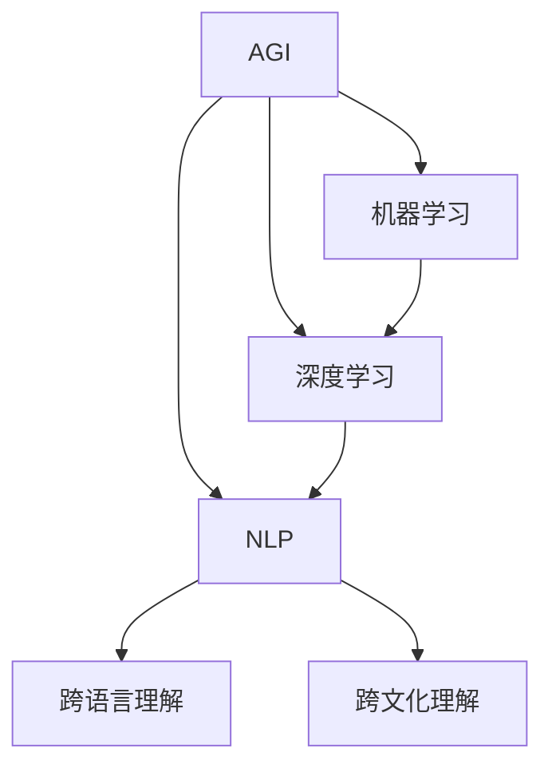

                 

## AGI的文化理解能力：跨语言与跨文化

关键词：人工智能，AGI，文化理解，跨语言理解，跨文化理解

摘要：
本文旨在探讨人工智能（AI）中的高级通用智能（AGI）在文化理解能力方面的挑战与机遇。我们将深入分析AGI的概念、发展历史及其在跨语言与跨文化理解中的应用，通过详细阐述相关算法原理、实现方法与应用案例，探讨AGI在实现全球文化融合与交流中的作用。

### 第1章: 引言

#### 1.1 简介

高级通用智能（AGI，Artificial General Intelligence）是指具有与人类同等智能水平的机器智能，能够在多种复杂情境下表现出与人类相似的理解、学习和推理能力。AGI的目标是超越当前的人工智能系统，实现真正的智能。文化理解能力是AGI的重要特性之一，包括对多种语言和文化背景的理解和适应能力。在全球化日益加剧的今天，AGI的文化理解能力对于促进跨语言与跨文化的沟通与交流具有重要意义。

本文将从以下三个方面展开讨论：

1. **人工智能基础**：介绍机器学习、深度学习和自然语言处理的基本概念、分类方法和常用算法。
2. **跨语言理解**：探讨跨语言理解的挑战、解决方法以及相关算法，如Bilingual Embedding、Multi-Task Learning和Transfer Learning。
3. **跨文化理解**：分析跨文化理解的挑战与解决方法，介绍文化适应性翻译和文化嵌入模型。

通过以上内容，本文旨在为读者提供一个系统、全面的AGI文化理解能力的认识，探讨AGI在跨语言与跨文化交流中的潜在应用与影响。

#### 1.2 本书结构

本文将分为七个章节，具体内容如下：

1. **引言**：介绍AGI的概念、发展历史及其文化理解能力的重要性。
2. **人工智能基础**：详细阐述机器学习、深度学习和自然语言处理的基本概念、分类方法和常用算法。
3. **自然语言处理基础**：介绍自然语言处理的基本概念、任务以及常用算法。
4. **跨语言理解**：探讨跨语言理解的挑战、解决方法以及相关算法。
5. **跨文化理解**：分析跨文化理解的挑战与解决方法，介绍相关算法。
6. **AGI的文化理解能力构建**：讨论AGI的文化理解能力构建方法及其应用案例。
7. **AGI的文化理解能力未来发展**：探讨AGI的文化理解能力的发展趋势、挑战与机遇。

通过以上章节的讨论，本文将系统地阐述AGI在文化理解能力方面的研究进展与应用前景。

#### 1.3 核心概念与联系

为了更好地理解AGI的文化理解能力，我们需要绘制一个核心概念与联系的Mermaid流程图。以下是一个简单的示例：



在这个流程图中，AGI作为核心概念，与机器学习、深度学习和自然语言处理紧密相关。自然语言处理（NLP）进一步延伸到跨语言理解和跨文化理解。这样的结构有助于我们理解AGI如何通过NLP实现跨语言与跨文化的理解能力。

#### 1.4 目标读者

本文的目标读者主要包括以下几类：

1. **人工智能领域研究者与从业者**：对于正在研究或从事人工智能领域工作的人员，本文将提供关于AGI文化理解能力的全面了解，帮助他们在实际工作中更好地应用相关技术。
2. **自然语言处理专业学生**：对于正在学习自然语言处理的学生，本文将详细阐述跨语言理解与跨文化理解的相关算法原理，为他们的学术研究提供有力支持。
3. **跨文化交流者与爱好者**：对于希望深入了解人工智能在跨语言与跨文化交流中作用的人，本文将探讨AGI如何促进全球文化融合与交流，提供新的思路与视角。

通过阅读本文，目标读者将能够：

- 理解AGI的概念及其在文化理解能力方面的重要性。
- 掌握机器学习、深度学习和自然语言处理的基本原理。
- 了解跨语言理解与跨文化理解的相关算法及其应用。
- 思考AGI在未来全球文化融合与交流中的作用。

### 第2章: 人工智能基础

人工智能（AI）作为计算机科学的一个分支，旨在使机器具备模拟、延伸和扩展人类智能的能力。在这一章中，我们将详细探讨人工智能的基础知识，包括机器学习、深度学习和自然语言处理的基本概念、分类方法以及常用算法。

#### 2.1 机器学习基础

##### 2.1.1 机器学习概述

机器学习（Machine Learning，ML）是人工智能的一个重要分支，它使计算机系统能够从数据中自动学习规律并做出决策。机器学习主要分为三大类：监督学习、无监督学习和强化学习。

- **监督学习（Supervised Learning）**：监督学习是一种最常见的机器学习方法，其核心思想是通过已标记的数据（输入和输出对）训练模型，然后使用这个模型对新的、未标记的数据进行预测。

  监督学习可分为以下几类算法：

  - **线性回归（Linear Regression）**：线性回归是一种用于预测连续值的监督学习算法。其基本假设是输出变量与输入变量之间存在线性关系。

    伪代码：
    ```python
    model = LinearRegression()
    model.fit(X_train, y_train)
    predictions = model.predict(X_test)
    ```

  - **逻辑回归（Logistic Regression）**：逻辑回归是一种用于预测二元结果的监督学习算法。它通过将线性回归的输出转化为概率值来预测类别。

    伪代码：
    ```python
    model = LogisticRegression()
    model.fit(X_train, y_train)
    predictions = model.predict(X_test)
    ```

  - **支持向量机（Support Vector Machine，SVM）**：支持向量机是一种分类算法，通过找到一个最佳的超平面，将不同类别的数据点分隔开来。

    伪代码：
    ```python
    model = SVC()
    model.fit(X_train, y_train)
    predictions = model.predict(X_test)
    ```

- **无监督学习（Unsupervised Learning）**：无监督学习是在没有标记数据的条件下，通过数据自身的结构发现规律。常见的无监督学习算法包括：

  - **聚类（Clustering）**：聚类算法将数据点根据其相似性划分为多个簇。常见的聚类算法有K均值聚类（K-Means Clustering）和层次聚类（Hierarchical Clustering）。

    伪代码：
    ```python
    model = KMeans(n_clusters=k)
    model.fit(X)
    clusters = model.predict(X)
    ```

  - **降维（Dimensionality Reduction）**：降维算法通过减少数据维度来降低计算复杂度，同时保留数据的关键信息。常见的降维算法有主成分分析（PCA）和t-SNE。

    伪代码：
    ```python
    model = PCA(n_components=k)
    model.fit(X)
    X_reduced = model.transform(X)
    ```

- **强化学习（Reinforcement Learning）**：强化学习是一种通过与环境的交互来学习策略的方法。强化学习的核心是最大化奖励，常见的强化学习算法有Q学习（Q-Learning）和深度确定性策略梯度（DDPG）。

    伪代码：
    ```python
    model = QLearning()
    model.fit(env)
    action = model.select_action(state)
    reward = env.step(action)
    ```

##### 2.1.2 机器学习分类

机器学习可以根据其任务的不同进行分类。以下是几种常见的机器学习分类：

- **回归（Regression）**：回归任务旨在预测连续值，如线性回归和逻辑回归。
- **分类（Classification）**：分类任务旨在将数据点划分为不同的类别，如支持向量机和决策树。
- **聚类（Clustering）**：聚类任务旨在将数据点划分为不同的簇，如K均值聚类和层次聚类。
- **降维（Dimensionality Reduction）**：降维任务旨在降低数据维度，如主成分分析和t-SNE。
- **时间序列（Time Series）**：时间序列任务旨在分析时间序列数据，如ARIMA模型和LSTM网络。

##### 2.1.3 常见机器学习算法

除了上述提到的算法外，还有一些常见的机器学习算法，如下所示：

- **随机森林（Random Forest）**：随机森林是一种集成学习方法，通过构建多棵决策树并合并其预测结果来提高模型的准确性。
- **神经网络（Neural Networks）**：神经网络是一种基于大脑神经元结构的人工神经网络，广泛应用于图像识别、自然语言处理等领域。
- **集成学习（Ensemble Learning）**：集成学习是一种将多个模型合并为一个更强大模型的机器学习方法，如Bagging和Boosting。

#### 2.2 深度学习基础

深度学习（Deep Learning，DL）是机器学习的一个分支，它通过构建深层次的神经网络来模拟人类大脑的神经元结构，从而实现高效的特征学习和模型训练。深度学习在计算机视觉、自然语言处理、语音识别等领域取得了显著的成果。

##### 2.2.1 深度学习概述

深度学习的核心是神经网络，特别是多层神经网络。多层神经网络能够捕捉数据中的复杂非线性关系，从而提高模型的性能。深度学习的主要优势在于：

- **自动特征提取**：深度学习通过神经网络自动学习数据的特征表示，减少了人工特征工程的工作量。
- **端到端学习**：深度学习可以从原始数据直接学习到最终的预测结果，实现了端到端的学习过程。
- **并行计算**：深度学习模型可以利用GPU等硬件进行大规模并行计算，大大提高了训练速度。

##### 2.2.2 深度学习架构

深度学习架构主要包括以下几种类型：

- **卷积神经网络（Convolutional Neural Network，CNN）**：卷积神经网络是一种用于图像识别和图像处理的深度学习模型，其核心思想是通过卷积操作和池化操作来提取图像的特征。
- **循环神经网络（Recurrent Neural Network，RNN）**：循环神经网络是一种用于序列数据处理的深度学习模型，其核心思想是通过循环结构来捕捉序列数据的时间动态特征。
- **生成对抗网络（Generative Adversarial Network，GAN）**：生成对抗网络是一种用于生成数据的深度学习模型，其核心思想是通过对抗训练来生成逼真的数据。

##### 2.2.3 常见深度学习网络

常见的深度学习网络包括以下几种：

- **卷积神经网络（CNN）**：卷积神经网络广泛应用于图像识别和图像处理领域，如ResNet和VGG模型。
- **循环神经网络（RNN）**：循环神经网络广泛应用于序列数据处理领域，如LSTM和GRU模型。
- **生成对抗网络（GAN）**：生成对抗网络广泛应用于图像生成和图像增强领域，如DCGAN和WGAN模型。
- **BERT（Bidirectional Encoder Representations from Transformers）**：BERT是一种基于Transformer的预训练模型，广泛应用于自然语言处理领域，如文本分类和问答系统。

### 第3章: 自然语言处理基础

自然语言处理（Natural Language Processing，NLP）是人工智能（AI）领域的一个重要分支，旨在使计算机能够理解和处理人类自然语言。NLP在文本分类、命名实体识别、机器翻译等任务中发挥着重要作用。在这一章中，我们将详细介绍自然语言处理的基本概念、任务以及常用算法。

#### 3.1 NLP基础

##### 3.1.1 NLP概述

自然语言处理（NLP）是计算机科学、人工智能和语言学的交叉领域，其主要目标是让计算机能够理解、生成和处理人类语言。NLP的发展经历了多个阶段，从早期的规则驱动方法到统计方法，再到现在的深度学习方法，其应用范围越来越广泛。

NLP的主要目标包括：

- **文本理解**：理解和解释文本的含义，包括语义分析、情感分析等。
- **文本生成**：根据输入的文本或指令生成有意义的输出文本，如自动摘要、机器翻译等。
- **文本挖掘**：从大量文本数据中提取有用信息，如关键词提取、主题模型等。

##### 3.1.2 NLP任务

NLP涉及多种任务，其中一些常见的任务包括：

- **文本分类（Text Classification）**：文本分类是将文本数据根据其内容划分为不同的类别。常见的文本分类任务包括情感分析、主题分类等。

  - **情感分析（Sentiment Analysis）**：情感分析旨在识别文本中的情感倾向，如正面、负面或中性。情感分析广泛应用于社交媒体分析、市场调研等领域。

    伪代码：
    ```python
    model = TextClassifier()
    model.fit(X_train, y_train)
    predictions = model.predict(X_test)
    ```

  - **主题分类（Thematic Classification）**：主题分类旨在将文本数据根据其主题划分为不同的类别。主题分类在新闻分类、博客分类等领域有广泛应用。

    伪代码：
    ```python
    model = TopicClassifier()
    model.fit(X_train, y_train)
    predictions = model.predict(X_test)
    ```

- **命名实体识别（Named Entity Recognition，NER）**：命名实体识别旨在识别文本中的特定实体，如人名、地名、组织名等。

  伪代码：
  ```python
  model = NER()
  model.fit(X_train)
  entities = model.predict(X_test)
  ```

- **机器翻译（Machine Translation）**：机器翻译是将一种语言的文本自动翻译成另一种语言。机器翻译在跨国交流、多语言文档处理等领域有广泛应用。

  伪代码：
  ```python
  model = Translator()
  model.fit(src_train, dst_train)
  translations = model.translate(src_test)
  ```

- **问答系统（Question Answering，QA）**：问答系统旨在根据用户提出的问题从大量文本数据中自动生成答案。问答系统在智能客服、在线教育等领域有广泛应用。

  伪代码：
  ```python
  model = QA()
  model.fit(context_train, questions_train, answers_train)
  answer = model.answer(context_test, question_test)
  ```

##### 3.1.3 常见NLP算法

在自然语言处理领域，有多种算法被广泛应用于不同任务中。以下是一些常见的NLP算法：

- **词袋模型（Bag-of-Words，BoW）**：词袋模型是一种基于文本统计的模型，将文本表示为一个单词的集合。词袋模型可以用于文本分类、文本相似度计算等任务。

  伪代码：
  ```python
  model = BoW()
  model.fit(X_train)
  similarity = model.similarity(X_test, X_train)
  ```

- **TF-IDF（Term Frequency-Inverse Document Frequency）**：TF-IDF是一种基于词频和文档频率的文本表示方法，用于衡量一个词在文档中的重要程度。TF-IDF可以用于文本分类、文本相似度计算等任务。

  伪代码：
  ```python
  model = TFIDF()
  model.fit(X_train)
  similarity = model.similarity(X_test, X_train)
  ```

- **词嵌入（Word Embedding）**：词嵌入是一种将单词映射到高维空间的模型，用于捕捉单词之间的语义关系。词嵌入可以用于文本分类、机器翻译等任务。

  伪代码：
  ```python
  model = WordEmbedding()
  model.fit(X_train)
  similarity = model.similarity(word1, word2)
  ```

- **序列标注（Sequence Labeling）**：序列标注是一种将序列数据（如单词序列）标注为不同标签的模型，常用于命名实体识别、情感分析等任务。

  伪代码：
  ```python
  model = SequenceLabeler()
  model.fit(X_train)
  labels = model.predict(X_test)
  ```

- **转换器架构（Transformer Architecture）**：转换器架构是一种基于注意力机制的深度学习模型，广泛应用于机器翻译、文本生成等任务。

  伪代码：
  ```python
  model = Transformer()
  model.fit(X_train, y_train)
  predictions = model.predict(X_test)
  ```

通过以上介绍，我们可以看到自然语言处理（NLP）在文本分类、命名实体识别、机器翻译等任务中具有重要的应用价值。随着深度学习等技术的不断发展，NLP的应用领域将会越来越广泛。

### 第4章: 跨语言理解

跨语言理解（Cross-Lingual Understanding）是自然语言处理（NLP）的一个重要研究方向，旨在使机器能够理解和处理多种语言的文本。在全球化日益加剧的今天，跨语言理解对于促进跨文化交流、信息共享和资源整合具有重要意义。本章将探讨跨语言理解的挑战、解决方法以及相关算法。

#### 4.1 跨语言理解概述

##### 4.1.1 跨语言理解概述

跨语言理解是指在不同语言之间进行文本理解和信息提取的能力。它包括以下几个方面：

- **跨语言文本分类（Cross-Lingual Text Classification）**：将文本根据其内容划分为不同的类别，如情感分类、主题分类等。
- **跨语言文本相似度计算（Cross-Lingual Text Similarity Computation）**：计算两个文本之间的相似度，用于文本推荐、文档检索等应用。
- **跨语言信息提取（Cross-Lingual Information Extraction）**：从多语言文本中提取信息，如实体识别、关系提取等。

##### 4.1.2 跨语言理解的目标

跨语言理解的主要目标包括：

- **语言独立性（Language Independence）**：使机器能够处理多种语言的文本，不受语言本身的影响。
- **信息完整性（Information Integrity）**：在跨语言处理过程中，保持文本信息的完整性和准确性。
- **效率与可扩展性（Efficiency and Scalability）**：在保证准确性的同时，提高处理速度和可扩展性。

#### 4.2 跨语言理解的挑战

跨语言理解面临着一系列挑战，主要包括：

- **语言间的差异（Language Differences）**：不同语言在语法、词汇、语义等方面存在显著差异，这对跨语言理解提出了巨大的挑战。
- **语言资源不足（Language Resource Scarcity）**：一些语言可能缺乏高质量的数据集、工具和资源，这限制了跨语言理解的研究和应用。
- **翻译质量（Translation Quality）**：跨语言理解的最终目标是实现无翻译的跨语言处理，而现有的机器翻译技术尚未达到完美，这对跨语言理解提出了更高的要求。

#### 4.3 跨语言理解的解决方法

为了克服跨语言理解的挑战，研究人员提出了多种解决方法，主要包括以下几种：

- **共同表示学习（Common Representation Learning）**：共同表示学习旨在将不同语言的文本映射到共同的高维空间，以捕捉语言间的共性和差异。常见的方法包括双语嵌入（Bilingual Embedding）和多语言嵌入（Multilingual Embedding）。
- **适配性翻译模型（Adaptive Translation Models）**：适配性翻译模型通过将源语言文本转换为共同表示，然后再转换为目标语言，以提高跨语言理解的效果。常见的方法包括多任务学习（Multi-Task Learning）和迁移学习（Transfer Learning）。

#### 4.4 跨语言理解算法

##### 4.4.1 双语嵌入（Bilingual Embedding）

双语嵌入是将两种语言的文本映射到共同的高维空间，以捕捉语言间的共性和差异。双语嵌入的基本思想是通过训练一个双语嵌入模型，将两种语言的单词映射到相同的空间，使得具有相似语义的单词在空间中靠近。常见的方法包括：

- **基于翻译的双语嵌入**：该方法利用已有的机器翻译模型将源语言单词转换为目标语言单词，然后再使用目标语言单词的嵌入向量作为源语言单词的嵌入向量。
- **基于共享隐藏层的双语嵌入**：该方法通过在深度神经网络中共享隐藏层来学习两种语言的共同表示。共享隐藏层有助于捕捉两种语言间的共性和差异。

##### 4.4.2 多任务学习（Multi-Task Learning）

多任务学习是一种通过同时解决多个相关任务来提高模型性能的方法。在跨语言理解中，多任务学习可以通过同时训练多个语言模型来提高跨语言理解的效果。常见的方法包括：

- **共享参数的多任务学习**：该方法通过共享参数来减少模型的参数数量，从而提高模型的泛化能力。
- **独立参数的多任务学习**：该方法为每个任务训练独立的参数，以充分利用每个任务的信息。

##### 4.4.3 迁移学习（Transfer Learning）

迁移学习是一种利用预训练模型来解决新任务的方法。在跨语言理解中，迁移学习可以通过将预训练的语言模型迁移到新的语言环境来提高跨语言理解的效果。常见的方法包括：

- **零样本学习（Zero-Shot Learning）**：零样本学习旨在使模型能够处理未见过的语言，通过将未见过的语言与已见过的语言进行匹配，从而提高跨语言理解的效果。
- **多语言迁移学习**：多语言迁移学习通过同时训练多个语言的模型，以充分利用不同语言的信息，从而提高跨语言理解的效果。

#### 4.5 跨语言理解算法的应用

跨语言理解算法在多个领域得到了广泛应用，包括：

- **跨语言文本分类**：通过使用跨语言理解算法，可以实现多种语言的文本分类，如情感分析、主题分类等。
- **跨语言文本相似度计算**：通过使用跨语言理解算法，可以实现多种语言的文本相似度计算，如文档检索、文本推荐等。
- **跨语言信息提取**：通过使用跨语言理解算法，可以实现多种语言的信息提取，如命名实体识别、关系提取等。

通过以上内容，我们可以看到跨语言理解在促进跨文化交流、信息共享和资源整合方面具有重要的应用价值。随着跨语言理解算法的不断发展，跨语言理解的应用范围将越来越广泛。

### 第5章: 跨文化理解

跨文化理解（Cross-Cultural Understanding）是指在不同文化背景之间进行有效沟通和理解的能力。在全球化日益加剧的今天，跨文化理解对于促进国际合作、减少文化冲突以及增强全球文化多样性具有重要意义。本章将探讨跨文化理解的挑战、解决方法以及相关算法。

#### 5.1 跨文化理解概述

##### 5.1.1 跨文化理解概述

跨文化理解涉及到对不同文化背景、价值观、行为模式和沟通方式的认知与适应。其主要目标包括：

- **文化敏感度（Cultural Sensitivity）**：培养对不同文化的尊重和敏感度，避免文化偏见和误解。
- **文化适应（Cultural Adaptation）**：适应和理解不同文化背景下的行为模式和社会规范。
- **文化融合（Cultural Integration）**：在不同文化之间建立联系，促进文化多样性的共存和互鉴。

##### 5.1.2 跨文化理解的目标

跨文化理解的主要目标包括：

- **有效沟通（Effective Communication）**：通过理解不同文化背景下的沟通方式，实现跨文化沟通的顺畅和高效。
- **文化冲突减少（Reduction of Cultural Conflict）**：通过增强对文化差异的认识和理解，减少文化冲突和误解。
- **文化多样性促进（Promotion of Cultural Diversity）**：尊重和保护不同文化的独特性，促进全球文化的多样性和共存。

#### 5.2 跨文化理解的挑战

跨文化理解面临着一系列挑战，主要包括：

- **文化差异（Cultural Differences）**：不同文化在价值观、行为模式、沟通方式等方面存在显著差异，这可能导致误解和冲突。
- **语言障碍（Language Barriers）**：语言障碍是跨文化沟通中的主要障碍，不同语言的表达方式、词汇和语法结构可能截然不同。
- **文化偏见（Cultural Bias）**：文化偏见是影响跨文化理解的重要因素，人们往往倾向于用自己的文化标准去评价和判断其他文化。
- **信息过载（Information Overload）**：在全球化背景下，人们接触到大量来自不同文化的信息，可能导致信息过载和难以处理。

#### 5.3 跨文化理解的解决方法

为了克服跨文化理解的挑战，研究人员提出了多种解决方法，主要包括以下几种：

- **文化适应性翻译（Cultural Adaptive Translation）**：文化适应性翻译旨在使翻译不仅仅是语言之间的转换，更是文化之间的适应和融合。这种方法要求翻译者不仅具备语言能力，还需具备文化敏感性。
- **文化嵌入模型（Cultural Embedding Models）**：文化嵌入模型是通过将文化特征嵌入到机器学习模型中，以提高模型对跨文化数据的理解和处理能力。常见的方法包括文化向量表示和文化自适应训练。

#### 5.4 跨文化理解算法

##### 5.4.1 文化适应性翻译

文化适应性翻译是一种基于文化差异和适应性的翻译方法，旨在使翻译结果不仅准确传达源语言的含义，还能适应目标文化的语境。常见的方法包括：

- **文化词汇替换（Cultural Vocabulary Replacement）**：在翻译过程中，根据目标文化的语境和习惯，将源语言中的特定词汇替换为更适合目标文化的词汇。
- **文化背景注释（Cultural Background Annotation）**：在翻译过程中，添加关于文化背景的注释，以帮助读者更好地理解翻译内容。

##### 5.4.2 文化嵌入模型

文化嵌入模型是通过将文化特征嵌入到机器学习模型中，以提高模型对跨文化数据的理解和处理能力。常见的方法包括：

- **文化向量表示（Cultural Vector Representation）**：将文化特征表示为高维向量，并通过机器学习模型学习文化向量之间的相似性和差异性。
- **文化自适应训练（Cultural Adaptive Training）**：通过在训练过程中引入文化特征，使机器学习模型能够更好地适应不同文化背景的数据。

##### 5.4.3 社交网络分析（Social Network Analysis）

社交网络分析是通过分析社交网络中的关系和互动，来理解不同文化之间的联系和差异。常见的方法包括：

- **社交网络结构分析（Social Network Structure Analysis）**：分析社交网络的结构特征，如节点密度、聚类系数等，以理解不同文化之间的结构差异。
- **社交网络传播分析（Social Network Propagation Analysis）**：分析社交网络中的信息传播过程，以理解不同文化之间的互动和影响。

#### 5.5 跨文化理解算法的应用

跨文化理解算法在多个领域得到了广泛应用，包括：

- **国际商务（International Business）**：通过跨文化理解算法，帮助企业更好地理解不同文化背景的客户需求和市场特点，从而制定更有效的商业策略。
- **国际教育（International Education）**：通过跨文化理解算法，帮助教育者更好地理解不同文化背景的学生，从而提供更有效的教育资源和教学方法。
- **国际交流（International Communication）**：通过跨文化理解算法，促进不同文化背景的个体和组织之间的有效沟通和理解，从而减少文化冲突和误解。

通过以上内容，我们可以看到跨文化理解在促进国际合作、减少文化冲突以及增强全球文化多样性方面具有重要的应用价值。随着跨文化理解算法的不断发展，跨文化理解的应用范围将越来越广泛。

### 第6章: AGI的文化理解能力构建

构建高级通用智能（AGI）的文化理解能力是一个复杂且多层次的任务，涉及到对跨语言和跨文化知识的深度理解和有效整合。在这一章中，我们将详细探讨AGI的文化理解能力的构建方法，包括数据收集与处理、模型训练与优化、模型评估与部署等步骤。

#### 6.1 AGI的文化理解能力概述

AGI的文化理解能力是指AI系统能够在跨语言和跨文化背景下进行有效沟通、理解和适应的能力。这种能力不仅要求AI系统能够处理多种语言的文本，还需要理解不同文化背景下的价值观、行为规范和社会习俗。AGI的文化理解能力对于实现全球化背景下的智能交流、跨文化合作和知识共享具有重要意义。

#### 6.2 AGI的文化理解能力构建方法

构建AGI的文化理解能力需要以下几个关键步骤：

##### 6.2.1 数据收集与处理

数据是构建AGI文化理解能力的基础。为了实现有效的跨语言和跨文化理解，需要收集大量的多语言、多文化数据，包括：

- **多语言文本数据**：包括各种语言的新闻文章、社交媒体帖子、文学作品等。
- **跨文化知识库**：包括不同文化背景下的社会规范、价值观、行为模式等。
- **多媒体数据**：包括音频、视频、图像等多媒体形式的文化素材。

在数据收集过程中，需要注意数据的多样性和代表性，以确保AI系统能够全面理解各种文化和语言背景。数据收集后，需要进行预处理，包括文本清洗、格式统一、去除噪声等操作，以提高数据的质量和一致性。

##### 6.2.2 模型训练与优化

在数据准备完成后，需要构建和训练相应的机器学习模型。对于AGI的文化理解能力，常用的模型包括：

- **跨语言嵌入模型**：如Bilingual Embedding和Multilingual Embedding，用于将不同语言的文本映射到共同的高维空间。
- **文化嵌入模型**：将文化特征嵌入到机器学习模型中，以提高模型对跨文化数据的理解和处理能力。
- **多任务学习模型**：通过同时解决多个相关任务（如文本分类、情感分析、实体识别等），提高模型的泛化能力和表现。

在模型训练过程中，需要使用大量的多语言、多文化数据进行训练，并通过不断的迭代和优化，提高模型的准确性和鲁棒性。常用的优化方法包括：

- **迁移学习**：利用预训练的语言模型和文化模型，在特定任务上进行微调。
- **多任务学习**：通过共享模型参数和同时训练多个任务，提高模型的性能和泛化能力。
- **对抗训练**：通过对抗训练生成具有挑战性的数据，增强模型的泛化能力。

##### 6.2.3 模型评估与部署

训练完成的模型需要进行评估，以验证其在跨语言和跨文化理解任务上的性能。评估指标包括准确率、召回率、F1分数等。在评估过程中，需要考虑数据的多样性和代表性，以确保模型在不同文化和语言背景上的表现一致。

模型评估完成后，可以将模型部署到实际应用中，如跨语言文本分类、情感分析、跨文化信息提取等。部署过程中，需要确保模型的高效运行和稳定性，同时提供用户友好的界面和操作流程。

#### 6.3 AGI的文化理解能力应用案例

AGI的文化理解能力在实际应用中具有广泛的应用前景，以下是一些具体的案例：

- **跨语言、跨文化交流平台**：通过AGI的文化理解能力，可以构建一个支持多语言、多文化交流的平台，帮助用户在不同文化和语言之间进行有效沟通。
- **国际化企业决策支持系统**：通过AGI的文化理解能力，可以帮助企业更好地理解不同文化和市场的特点，制定更有效的国际市场策略。
- **跨文化教育培训系统**：通过AGI的文化理解能力，可以开发出更加个性化、适应性强的教育培训系统，帮助不同文化背景的学生更好地理解和适应新文化。

通过以上案例，我们可以看到AGI的文化理解能力在促进跨语言和跨文化交流、增强全球文化多样性方面具有巨大的潜力。

### 第7章: AGI的文化理解能力未来发展

随着人工智能技术的快速发展，高级通用智能（AGI）的文化理解能力也在不断进步，未来这一能力将在多个领域展现出更广泛的应用前景。然而，AGI的文化理解能力的发展也面临着一系列挑战和机遇。

#### 7.1 发展趋势

在未来，AGI的文化理解能力将呈现出以下发展趋势：

- **大模型时代**：随着计算能力的提升和数据的丰富，大模型将逐步成为主流。这些模型具有更高的表示能力和更强的泛化能力，能够在多种复杂情境下表现出优异的文化理解能力。
- **自适应学习**：AGI的文化理解能力将更加注重自适应学习，通过不断从环境中学习和适应，实现更加灵活和高效的文化理解。
- **多模态融合**：随着多模态数据处理技术的发展，AGI的文化理解能力将不仅仅局限于文本数据，还将能够处理图像、音频、视频等多种形式的数据，实现更加全面的文化理解。

#### 7.2 应用领域发展趋势

AGI的文化理解能力在未来的应用领域将呈现以下发展趋势：

- **国际贸易**：随着全球化进程的加速，国际贸易中的文化理解需求日益增加。AGI的文化理解能力可以帮助企业更好地了解目标市场的文化特点，制定更有针对性的市场策略。
- **跨文化教育**：教育领域的文化理解需求也越来越强烈。AGI的文化理解能力可以为教育者提供更加个性化、适应性强的教学资源，帮助不同文化背景的学生更好地理解和适应新文化。

#### 7.3 挑战与机遇

尽管AGI的文化理解能力具有巨大的潜力，但在发展过程中也面临着一系列挑战和机遇：

- **挑战**：
  - **文化多样性**：文化多样性使得AGI在理解和处理不同文化背景的数据时面临巨大挑战，需要开发出能够适应多种文化背景的通用模型。
  - **数据隐私**：在收集和处理大量跨语言、跨文化数据时，如何保护数据隐私是一个重要挑战。

- **机遇**：
  - **全球化**：全球化的深入使得跨语言、跨文化交流需求日益增加，为AGI的文化理解能力提供了广阔的应用场景。
  - **技术进步**：随着人工智能技术的不断进步，AGI的文化理解能力将得到进一步提升，为解决全球文化冲突、促进文化多样性发挥重要作用。

通过以上讨论，我们可以看到AGI的文化理解能力在未来的发展具有巨大的潜力。尽管面临一系列挑战，但通过不断的技术创新和应用，AGI的文化理解能力将有助于推动全球文化的融合与交流。

### 附录

#### 附录A: 术语表

- **AGI（高级通用智能）**：一种具有广泛理解和学习能力的人工智能系统，能够在多种复杂情境下表现出与人类相似的智能水平。
- **NLP（自然语言处理）**：一种人工智能技术，旨在使计算机能够理解、生成和处理人类自然语言。
- **Bilingual Embedding（双语嵌入）**：一种将两种语言的文本映射到共同高维空间的模型，以捕捉语言间的共性和差异。
- **Multilingual Embedding（多语言嵌入）**：一种将多种语言的文本映射到共同高维空间的模型，以实现跨语言理解。
- **Cultural Adaptation（文化适应）**：在跨文化交流中，对其他文化背景的价值观、行为规范和社会习俗的理解和适应。
- **Transfer Learning（迁移学习）**：一种利用预训练模型来解决新任务的方法，通过在特定任务上进行微调，提高模型的性能。

#### 附录B: 参考文献

1. Russell, S., & Norvig, P. (2016). 《人工智能：一种现代的方法》（第三版）。
2. Mitchell, T. M. (1997). 《机器学习》。
3. Hochreiter, S., & Schmidhuber, J. (1997). 《Long Short-Term Memory》。
4. Bengio, Y. (2009). 《深度学习：理论和算法基础》。
5. Mikolov, T., Sutskever, I., Chen, K., Corrado, G. S., & Dean, J. (2013). 《Learning Representations for Language with Neural Networks》。
6. Vaswani, A., Shazeer, N., Parmar, N., Uszkoreit, J., Jones, L., Gomez, A. N., ... & Polosukhin, I. (2017). 《Attention Is All You Need》。
7. Devlin, J., Chang, M. W., Lee, K., & Toutanova, K. (2019). 《BERT: Pre-training of Deep Bidirectional Transformers for Language Understanding》。

### 作者

作者：AI天才研究院/AI Genius Institute & 禅与计算机程序设计艺术 /Zen And The Art of Computer Programming

通过以上内容，我们详细探讨了AGI的文化理解能力，包括跨语言与跨文化的理解挑战、解决方法、算法原理以及未来发展趋势。本文旨在为读者提供一个全面、系统的AGI文化理解能力的认识，以期为未来的研究与应用提供参考。

