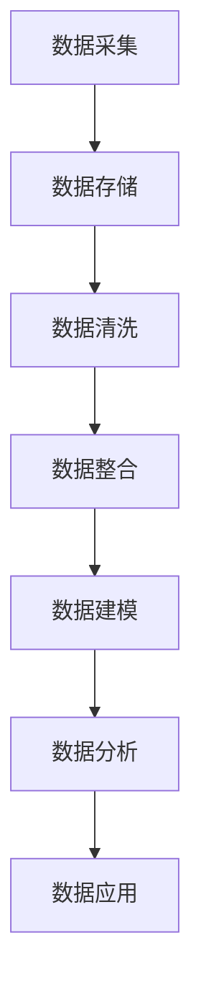
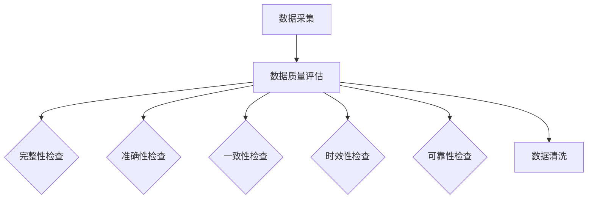
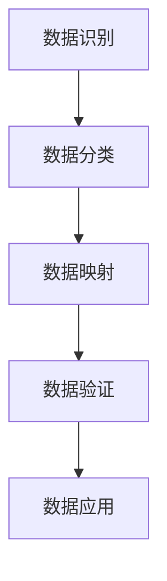

                 

# AI DMP 数据基建：数据质量与数据标准

> **关键词：** 数据管理平台（DMP）、数据质量、数据标准化、人工智能（AI）、数据治理。

> **摘要：** 本文深入探讨了AI驱动的数据管理平台（DMP）的数据质量与数据标准。首先介绍了DMP的基本概念与架构，随后详细分析了数据质量的重要性、评估方法和提升策略。接着，探讨了数据标准化与治理的相关概念、框架和流程。最后，通过实际案例展示了AI在DMP数据基建中的应用，并对未来发展趋势进行了展望。

### 目录大纲

## 第一部分：DMP基础知识

### 第1章：DMP概述

#### 1.1 DMP基本概念

#### 1.2 DMP与传统广告数据管理对比

#### 1.3 DMP在企业数据管理中的应用

### 第2章：DMP架构与核心模块

#### 2.1 DMP系统架构设计

#### 2.2 数据采集与存储

#### 2.3 数据清洗与整合

#### 2.4 数据模型构建

#### 2.5 数据分析与应用

## 第二部分：数据质量与数据标准

### 第3章：数据质量评估与提升

#### 3.1 数据质量的重要性

#### 3.2 数据质量评估方法

#### 3.3 数据质量提升策略

### 第4章：数据标准化与治理

#### 4.1 数据标准化的概念与目的

#### 4.2 数据治理框架与实施

#### 4.3 数据标准化流程

### 第5章：数据安全与隐私保护

#### 5.1 数据安全风险管理

#### 5.2 数据隐私保护法规与政策

#### 5.3 数据安全与隐私保护措施

## 第三部分：AI与DMP数据基建

### 第6章：AI在DMP中的应用

#### 6.1 AI与数据驱动的决策

#### 6.2 AI算法在数据质量提升中的应用

#### 6.3 AI在数据标准化与治理中的应用

### 第7章：AI DMP数据基建实践案例

#### 7.1 案例一：互联网公司DMP数据基建实践

#### 7.2 案例二：电商平台DMP数据治理实践

#### 7.3 案例三：金融行业DMP数据质量提升实践

### 第8章：未来展望

#### 8.1 DMP数据基建发展趋势

#### 8.2 AI在DMP领域的未来发展方向

#### 8.3 DMP与AI融合的挑战与机遇

## 附录

### 附录A：DMP相关工具与资源

#### A.1 DMP工具介绍

#### A.2 DMP开源框架

#### A.3 DMP研究机构与论文资源

### 附录B：Mermaid流程图

#### B.1 DMP系统架构图

#### B.2 数据质量评估流程图

#### B.3 数据标准化流程图

### 附录C：核心算法原理与伪代码

#### C.1 数据质量评估算法

#### C.2 数据标准化算法

#### C.3 AI算法在数据质量提升中的应用算法

### 附录D：数学模型与公式

#### D.1 数据质量评估模型

#### D.2 数据标准化模型

#### D.3 AI算法在数据治理中的数学模型

### 附录E：实践案例代码与分析

#### E.1 案例一：互联网公司DMP数据治理代码解析

#### E.2 案例二：电商平台DMP数据质量提升代码解析

#### E.3 案例三：金融行业DMP数据治理代码解析

---

### 第1章：DMP概述

#### 1.1 DMP基本概念

数据管理平台（Data Management Platform，简称DMP）是一种用于整合、存储和管理数据的工具，旨在为企业提供全面的客户视图和精准的市场营销能力。DMP的核心功能包括数据采集、数据存储、数据清洗、数据整合、数据模型构建、数据分析和应用等。

DMP的出现是为了解决传统广告数据管理中存在的问题，如数据分散、数据冗余、数据质量差等。通过DMP，企业可以收集来自多个渠道的数据，进行整合和分析，从而实现更精准的市场营销。

#### 1.2 DMP与传统广告数据管理对比

传统广告数据管理通常依赖于第三方广告平台，数据来源单一，且难以进行深入分析。而DMP则可以实现跨渠道的数据整合，不仅包括广告数据，还包括网站行为数据、社交媒体数据等，从而为企业提供更全面的客户画像。

此外，DMP具备强大的数据分析能力，可以通过机器学习和数据挖掘技术，对数据进行深入分析，为企业提供决策支持。而传统广告数据管理则主要依赖于简单的统计和分析方法。

#### 1.3 DMP在企业数据管理中的应用

DMP在企业数据管理中的应用非常广泛，主要包括以下几个方面：

1. **市场研究：** 通过DMP，企业可以收集和分析大量的市场数据，了解市场趋势和消费者行为，从而制定更有效的市场策略。

2. **精准营销：** DMP可以帮助企业实现精准营销，通过对客户数据的深入分析，制定个性化的营销策略，提高营销效果。

3. **客户关系管理：** DMP可以帮助企业更好地管理客户数据，了解客户需求和行为，提供个性化的服务，提高客户满意度。

4. **产品研发：** DMP可以为企业提供详细的用户行为数据，帮助企业了解用户需求，优化产品功能，提高产品竞争力。

### 第2章：DMP架构与核心模块

#### 2.1 DMP系统架构设计

DMP系统架构通常包括数据采集、数据存储、数据处理、数据分析和应用等几个核心模块。

1. **数据采集：** 数据采集模块负责收集来自各个渠道的数据，包括网站行为数据、社交媒体数据、广告数据等。

2. **数据存储：** 数据存储模块负责存储采集到的数据，通常使用分布式数据库或大数据技术进行存储，以保证数据的可扩展性和高性能。

3. **数据处理：** 数据处理模块负责对采集到的数据进行清洗、整合和建模，从而生成高质量的数据集。

4. **数据分析：** 数据分析模块负责对处理后的数据进行分析和挖掘，为企业提供决策支持。

5. **应用层：** 应用层负责将分析结果应用到实际的业务场景中，如精准营销、客户关系管理、产品研发等。

#### 2.2 数据采集与存储

**数据采集：** 数据采集是DMP的核心环节，数据来源广泛，包括网站日志、广告点击数据、社交媒体行为数据等。采集到的数据通常需要通过数据采集工具（如Apache Kafka、Flume等）进行实时处理和传输。

**数据存储：** 数据存储通常采用分布式数据库或大数据技术，如Hadoop、HBase、Redis等。分布式数据库可以保证数据的可扩展性和高性能，适合处理海量数据。大数据技术则可以提供强大的数据处理和分析能力。

#### 2.3 数据清洗与整合

**数据清洗：** 数据清洗是数据处理的第一步，主要任务是去除数据中的噪声和错误，保证数据的质量。数据清洗过程包括数据去重、数据格式转换、缺失值处理等。

**数据整合：** 数据整合是将来自不同渠道的数据进行合并，形成一个完整的客户视图。数据整合过程中，需要解决数据格式不一致、数据口径不统一等问题。

#### 2.4 数据模型构建

**数据模型构建：** 数据模型是数据分析和应用的基础，通过对数据进行分类、标签化等处理，构建出符合业务需求的数据模型。数据模型可以分为用户行为模型、市场细分模型、产品模型等。

#### 2.5 数据分析与应用

**数据分析：** 数据分析是DMP的核心功能，通过数据挖掘、机器学习等技术，对数据进行分析和挖掘，为企业提供决策支持。

**应用：** 数据分析结果可以应用于市场研究、精准营销、客户关系管理、产品研发等多个领域，帮助企业实现数据驱动的业务增长。

---

在下一部分，我们将深入探讨数据质量的重要性、评估方法和提升策略。

---

### 第3章：数据质量评估与提升

#### 3.1 数据质量的重要性

数据质量是DMP能否发挥其价值的关键因素。高质量的数据可以提供准确的客户画像、市场趋势和业务洞察，从而帮助企业做出更明智的决策。相反，低质量的数据会导致以下问题：

1. **决策失误：** 低质量数据会导致企业对市场趋势和客户需求的判断出现偏差，从而影响决策质量。

2. **营销效果差：** 低质量数据会导致营销策略不准确，从而降低营销效果，浪费营销资源。

3. **客户体验差：** 低质量数据可能会导致客户服务不到位，影响客户满意度和忠诚度。

4. **合规风险：** 数据质量差可能导致企业违反数据保护法规，面临法律风险。

因此，保障数据质量是DMP成功的关键。

#### 3.2 数据质量评估方法

数据质量评估是确保数据质量的关键步骤。以下是一些常用的数据质量评估方法：

1. **完整性评估：** 完整性评估旨在检查数据集中是否存在缺失值或重复记录。可以通过计算缺失值比例、重复记录比例等指标进行评估。

2. **准确性评估：** 准确性评估旨在检查数据是否准确反映了实际业务情况。可以通过对比数据与实际业务记录、第三方数据源等，评估数据准确性。

3. **一致性评估：** 一致性评估旨在检查数据在不同来源、不同时间点是否保持一致。可以通过对比不同数据源、时间点的数据，评估一致性。

4. **时效性评估：** 时效性评估旨在检查数据是否及时更新。可以通过计算数据更新时间间隔、数据过期比例等指标进行评估。

5. **可靠性评估：** 可靠性评估旨在检查数据来源的可靠性。可以通过了解数据来源、数据采集和处理过程，评估数据的可靠性。

#### 3.3 数据质量提升策略

为了提升数据质量，企业可以采取以下策略：

1. **数据源管理：** 优化数据源，确保数据来源可靠、数据采集准确。与数据源提供商合作，确保数据质量的持续提升。

2. **数据清洗：** 定期对数据进行清洗，去除噪声和错误数据。采用自动化工具和算法，提高数据清洗的效率和质量。

3. **数据标准化：** 实施数据标准化，统一数据格式和命名规范。确保数据在不同系统和渠道之间的一致性和可比性。

4. **数据质量监控：** 建立数据质量监控机制，实时监控数据质量指标。及时发现并解决数据质量问题。

5. **数据治理：** 实施数据治理，确保数据在采集、存储、处理、分析等环节的质量。建立数据质量责任制，明确数据质量管理职责。

通过实施以上策略，企业可以显著提升数据质量，为DMP的有效应用提供保障。

---

在下一部分，我们将探讨数据标准化与治理的相关概念、框架和流程。

---

### 第4章：数据标准化与治理

#### 4.1 数据标准化的概念与目的

数据标准化是数据管理的重要环节，旨在实现数据的统一、规范和高效利用。数据标准化包括数据格式标准化、数据命名标准化和数据定义标准化等。

**概念：** 数据标准化是指将不同来源、不同格式的数据进行规范化处理，使其符合统一的规范和标准。

**目的：** 数据标准化的主要目的是提高数据的一致性、可比较性和可复用性，从而提升数据质量和管理效率。

1. **提高数据一致性：** 通过统一数据格式和命名规范，确保数据在不同系统和渠道之间的一致性，避免数据冲突和误解。

2. **提高数据可比较性：** 通过统一数据标准，可以方便地对不同来源的数据进行比较和分析，为决策提供支持。

3. **提高数据可复用性：** 通过标准化数据，可以方便地在不同业务场景和数据应用中复用数据，提高数据利用效率。

#### 4.2 数据治理框架与实施

数据治理是确保数据质量、数据安全和合规性的关键过程。数据治理框架包括数据治理策略、数据治理组织、数据治理流程和数据治理技术等。

**数据治理框架：**

1. **数据治理策略：** 制定数据治理的长期目标和策略，明确数据治理的重点领域和优先级。

2. **数据治理组织：** 建立数据治理组织，明确数据治理职责和权限，确保数据治理的有效实施。

3. **数据治理流程：** 制定数据治理流程，包括数据采集、数据存储、数据清洗、数据整合、数据分析和数据应用等环节。

4. **数据治理技术：** 采用数据治理技术，如数据质量管理工具、数据集成工具、数据仓库和数据湖等，提高数据治理效率。

**数据治理实施步骤：**

1. **数据治理规划：** 分析企业现状，制定数据治理规划，明确数据治理目标和策略。

2. **建立数据治理组织：** 确定数据治理组织架构，明确数据治理职责和权限。

3. **制定数据标准：** 制定数据标准，包括数据格式、命名规范和数据定义等。

4. **实施数据治理流程：** 建立数据治理流程，确保数据在各个环节的质量和合规性。

5. **培训与推广：** 对员工进行数据治理培训，提高数据治理意识和能力。

6. **持续优化：** 定期评估数据治理效果，持续优化数据治理流程和策略。

#### 4.3 数据标准化流程

数据标准化流程包括数据识别、数据分类、数据映射和数据验证等步骤。

**数据识别：** 确定需要标准化的数据类型和数据属性，包括数据源、数据格式和数据内容等。

**数据分类：** 将识别出的数据进行分类，如客户数据、产品数据、财务数据等。

**数据映射：** 将不同来源、不同格式的数据映射到统一的标准格式，如将不同数据源的客户数据映射到统一的数据模型。

**数据验证：** 对标准化后的数据进行验证，确保数据的准确性、完整性和一致性。

通过实施数据标准化流程，企业可以确保数据的一致性和可复用性，提高数据质量和数据管理效率。

---

在下一部分，我们将探讨数据安全与隐私保护的相关内容。

---

### 第5章：数据安全与隐私保护

#### 5.1 数据安全风险管理

数据安全风险管理是确保数据不被非法访问、篡改、泄露和损坏的过程。数据安全风险管理包括以下步骤：

1. **风险评估：** 评估企业面临的数据安全风险，包括内部和外部风险。内部风险可能包括员工不当行为、系统漏洞等；外部风险可能包括网络攻击、数据泄露等。

2. **风险识别：** 识别可能导致数据安全风险的具体事件和威胁，如病毒攻击、黑客入侵、数据泄露等。

3. **风险分析：** 对识别出的风险进行定量和定性分析，评估风险的可能性和影响程度。

4. **风险应对：** 制定应对策略，包括风险规避、风险转移、风险减轻和风险接受等。

5. **风险监控：** 建立数据安全监控机制，实时监控数据安全状况，及时发现和响应潜在威胁。

#### 5.2 数据隐私保护法规与政策

数据隐私保护是数据安全管理的重要组成部分。不同国家和地区有不同的数据隐私保护法规和政策，企业需要遵守相关法规。

1. **欧盟通用数据保护条例（GDPR）：** GDPR是欧盟于2018年实施的严格数据隐私保护法规，要求企业确保数据收集、处理和存储的透明性，并给予用户对个人数据的控制权。

2. **美国加州消费者隐私法案（CCPA）：** CCPA是2020年美国加州通过的消费者隐私保护法案，赋予加州居民对个人数据收集、使用和共享的控制权。

3. **中国个人信息保护法（PIPL）：** PIPL是2021年生效的中国个人信息保护基本法，规定了个人信息处理的基本原则、个人信息权益和保护措施等。

企业需要了解并遵守所在国家和地区的数据隐私保护法规，确保数据处理活动的合规性。

#### 5.3 数据安全与隐私保护措施

为了确保数据安全和隐私保护，企业可以采取以下措施：

1. **访问控制：** 实施严格的访问控制机制，确保只有授权用户可以访问敏感数据。

2. **数据加密：** 对敏感数据进行加密处理，确保数据在传输和存储过程中的安全性。

3. **身份认证：** 实施多因素身份认证，提高系统登录的安全级别。

4. **安全审计：** 建立安全审计机制，记录和监控数据访问和使用情况，及时发现安全事件。

5. **安全培训：** 定期对员工进行数据安全培训，提高员工的数据安全意识和技能。

6. **数据备份与恢复：** 建立数据备份和恢复机制，确保数据在意外事件中可以及时恢复。

通过采取上述措施，企业可以显著提高数据安全与隐私保护水平，减少数据安全风险。

---

在下一部分，我们将探讨AI在DMP中的应用。

---

### 第6章：AI在DMP中的应用

#### 6.1 AI与数据驱动的决策

人工智能（AI）在DMP中的应用主要体现在数据驱动的决策支持。通过AI技术，DMP可以自动分析和挖掘数据，提供决策支持，帮助企业做出更明智的决策。

1. **客户细分：** AI可以帮助企业对客户进行精细划分，识别不同类型的客户群体。通过分析客户的购买行为、浏览习惯、社交行为等数据，AI可以为企业提供个性化的营销策略。

2. **需求预测：** AI可以通过分析历史销售数据、市场趋势等，预测未来的市场需求和趋势。这有助于企业提前布局，优化库存和生产计划。

3. **风险控制：** AI可以帮助企业识别潜在的风险因素，如市场风险、财务风险等。通过实时监控数据，AI可以提前预警，帮助企业采取预防措施。

4. **优化决策：** AI可以通过分析大量数据，为企业的决策提供科学的依据。例如，在广告投放中，AI可以根据用户行为和偏好，优化广告投放策略，提高广告效果。

#### 6.2 AI算法在数据质量提升中的应用

AI算法在数据质量提升中发挥着重要作用，以下是一些具体应用：

1. **数据清洗：** AI算法可以自动识别和修复数据中的错误和噪声，提高数据准确性。例如，使用机器学习算法可以识别和纠正数据中的拼写错误、格式错误等。

2. **异常检测：** AI算法可以检测数据中的异常值和异常模式，确保数据的完整性。例如，使用聚类算法可以识别出数据中的异常点，并及时处理。

3. **数据归一化：** AI算法可以帮助将不同来源、不同格式和不同单位的数据进行归一化处理，提高数据的一致性。例如，使用神经网络算法可以对不同时间单位的数据进行归一化处理，便于分析。

4. **数据增强：** AI算法可以通过生成新的数据样本，增强数据集的多样性，提高数据挖掘和分析的准确性。例如，使用生成对抗网络（GAN）可以生成与真实数据相似的人工数据样本。

#### 6.3 AI在数据标准化与治理中的应用

AI在数据标准化与治理中的应用主要包括以下方面：

1. **自动数据标准化：** AI算法可以自动识别数据格式和命名规范，实现数据的标准化处理。例如，使用自然语言处理（NLP）算法可以识别和转换不同格式的数据。

2. **自动数据治理：** AI算法可以自动识别和修复数据治理中的问题，提高数据治理效率。例如，使用规则引擎和机器学习算法可以自动识别和修复数据中的质量问题。

3. **数据隐私保护：** AI算法可以帮助企业识别和掩盖敏感数据，确保数据隐私保护。例如，使用隐私保护技术（如差分隐私）可以对敏感数据进行处理，降低隐私泄露风险。

4. **自动化报告生成：** AI算法可以自动生成数据治理报告，提供数据质量评估和改进建议。例如，使用数据可视化工具和机器学习算法可以生成详细的数据质量报告，帮助数据治理团队进行决策。

通过AI在DMP中的应用，企业可以显著提高数据质量和数据治理效率，实现数据驱动的业务增长。

---

在下一部分，我们将通过实际案例展示AI在DMP数据基建中的应用。

---

### 第7章：AI DMP数据基建实践案例

#### 7.1 案例一：互联网公司DMP数据基建实践

**背景：** 一家互联网公司希望利用DMP实现精准营销和用户行为分析，提高用户体验和营销效果。

**解决方案：**

1. **数据采集与存储：** 公司通过网站日志、APP行为数据、社交媒体数据等多种渠道收集用户数据，使用分布式数据库（如Hadoop）进行数据存储。

2. **数据清洗与整合：** 采用数据清洗工具（如Apache Spark）对数据进行清洗和整合，去除重复记录、纠正错误数据，建立统一的数据模型。

3. **数据建模与分析：** 使用机器学习算法（如随机森林、决策树）对用户行为数据进行分析，构建用户画像和兴趣模型，为精准营销提供支持。

4. **数据应用：** 通过DMP系统，公司可以实时监测用户行为，为不同用户群体提供个性化的营销策略，提高用户转化率和留存率。

**效果：** 通过DMP数据基建，公司实现了用户行为分析的自动化和精准化，营销效果显著提升，用户满意度提高。

#### 7.2 案例二：电商平台DMP数据治理实践

**背景：** 一家电商平台希望提高数据质量，优化库存管理和促销策略。

**解决方案：**

1. **数据源管理：** 与供应链合作伙伴建立数据共享机制，确保数据来源的可靠性。

2. **数据清洗与标准化：** 使用ETL工具（如Apache NiFi）对数据进行清洗和标准化，去除噪声数据、纠正格式错误，确保数据一致性。

3. **数据治理流程：** 建立数据治理流程，包括数据采集、存储、清洗、整合、分析和应用等环节，确保数据质量的可追溯性。

4. **数据质量管理：** 实施数据质量管理策略，包括数据质量评估、监控和改进，确保数据的准确性和完整性。

**效果：** 通过DMP数据治理实践，电商平台的数据质量得到显著提升，库存管理更加精准，促销策略更具针对性，用户满意度提高。

#### 7.3 案例三：金融行业DMP数据质量提升实践

**背景：** 一家金融机构希望提高数据质量，优化风险管理和客户服务。

**解决方案：**

1. **数据质量评估：** 使用数据质量评估工具（如Informatica）对现有数据进行质量评估，识别数据质量问题。

2. **数据清洗与标准化：** 采用数据清洗工具（如Talend）对数据进行清洗和标准化，去除重复记录、纠正错误数据，确保数据的一致性和准确性。

3. **数据治理框架：** 建立数据治理框架，包括数据质量责任制、数据质量管理流程和数据质量管理工具，确保数据质量持续提升。

4. **数据应用：** 将数据质量提升应用于风险管理、客户服务和产品开发，提高业务效率和客户满意度。

**效果：** 通过DMP数据质量提升实践，金融机构的数据质量得到显著提升，风险管理能力增强，客户服务更加个性化，业务效率提高。

通过以上实践案例，可以看出AI技术在DMP数据基建中的应用，不仅提高了数据质量和数据治理效率，还带来了显著的业务价值。

---

在下一部分，我们将对DMP数据基建的未来发展趋势进行展望。

---

### 第8章：未来展望

#### 8.1 DMP数据基建发展趋势

随着大数据、云计算和人工智能等技术的不断发展，DMP数据基建将呈现以下发展趋势：

1. **数据集规模不断扩大：** 随着物联网、社交媒体和智能设备的普及，数据集规模将呈指数级增长，DMP需要具备更高的数据处理能力和存储容量。

2. **实时数据处理能力增强：** 实时数据处理将成为DMP的重要能力，企业需要快速获取和分析实时数据，以支持实时决策和业务调整。

3. **AI与DMP深度融合：** AI技术将在DMP中得到更广泛的应用，通过深度学习、自然语言处理等技术，实现数据的自动分析和智能决策。

4. **隐私保护与合规性要求提高：** 随着数据隐私保护法规的实施，DMP在数据采集、存储、处理和应用过程中，需要更加注重隐私保护和合规性。

5. **跨行业应用拓展：** DMP将不仅限于互联网、金融等行业，还将广泛应用于制造业、零售业、医疗等行业，实现跨行业的应用拓展。

#### 8.2 AI在DMP领域的未来发展方向

AI在DMP领域的未来发展方向包括：

1. **自动化数据处理：** AI将实现数据采集、清洗、整合、建模等环节的自动化处理，降低人工成本，提高数据处理效率。

2. **智能化决策支持：** AI将提供更智能的决策支持，通过实时分析数据，为企业提供个性化的营销策略、风险管理方案等。

3. **个性化用户体验：** AI将根据用户行为和偏好，提供个性化的用户体验和服务，提高用户满意度和忠诚度。

4. **自动化数据治理：** AI将实现数据治理的自动化，通过机器学习算法，自动识别和修复数据质量问题，确保数据质量持续提升。

5. **跨领域合作与整合：** AI将与物联网、区块链、云计算等技术深度融合，实现跨领域的数据共享和整合，为各行业提供创新解决方案。

#### 8.3 DMP与AI融合的挑战与机遇

DMP与AI融合的挑战主要包括：

1. **数据质量问题：** 数据质量是AI分析的基础，DMP需要确保数据质量，避免因数据质量问题导致AI分析结果的偏差。

2. **计算资源需求：** AI算法通常需要大量的计算资源，DMP需要具备强大的计算能力和存储容量，以满足AI分析的需求。

3. **隐私保护与合规性：** AI在数据处理过程中，需要遵守隐私保护法规和合规性要求，确保数据安全。

DMP与AI融合的机遇主要包括：

1. **提高数据价值：** AI技术将提升数据的利用价值，为企业提供更深入的洞察和决策支持。

2. **创新业务模式：** DMP与AI融合将推动各行业创新业务模式的诞生，如个性化营销、智能风险管理等。

3. **降低运营成本：** AI技术将自动化数据处理和业务流程，降低企业运营成本。

总之，DMP与AI融合将为企业和各行业带来巨大的机遇和挑战，通过不断创新和优化，实现数据价值的最大化。

---

### 附录A：DMP相关工具与资源

#### A.1 DMP工具介绍

以下是一些常用的DMP工具及其特点：

1. **Adobe Campaign：** Adobe Campaign是一款功能强大的DMP工具，提供全面的数据收集、分析和营销自动化功能。它支持多种数据源，包括网站、APP和社交媒体等。

2. **Google Marketing Platform：** Google Marketing Platform包含多个DMP工具，如Google Analytics、Google Tag Manager等，提供强大的数据分析和营销自动化功能。

3. **Oracle Data Cloud：** Oracle Data Cloud是一款专业的DMP工具，提供数据管理、分析和营销解决方案。它支持多种数据源和丰富的数据模型，适用于不同行业。

4. **Microsoft Advertising：** Microsoft Advertising提供DMP工具，包括Azure Data Lake Storage、Azure Data Factory等，支持大规模数据处理和数据分析。

#### A.2 DMP开源框架

以下是一些开源的DMP框架：

1. **Apache Hadoop：** Apache Hadoop是一款分布式数据处理框架，支持海量数据的存储和处理。它包括HDFS、MapReduce、Hive等组件，适用于大数据场景。

2. **Apache Spark：** Apache Spark是一款快速且通用的大数据处理引擎，支持多种数据处理模式（批处理、流处理等）。它包括Spark SQL、Spark MLlib等组件，适用于复杂的数据分析和机器学习任务。

3. **Apache Kafka：** Apache Kafka是一款分布式消息队列系统，支持高吞吐量的数据实时传输。它适用于数据采集、实时处理和流处理场景。

4. **Apache NiFi：** Apache NiFi是一款数据流平台，提供数据采集、转换和传输功能。它支持多种数据源和目标系统，适用于ETL和数据治理场景。

#### A.3 DMP研究机构与论文资源

以下是一些DMP研究机构与论文资源：

1. **国际数据管理协会（IDM2）：** IDM2是一家专注于数据管理和数据治理的研究机构，提供DMP相关的研究报告、会议和论文。

2. **ACM SIGKDD：** ACM SIGKDD是计算机科学领域的一个专业组织，专注于大数据和数据分析研究。它提供DMP相关的会议、论文和资源。

3. **IEEE BigData：** IEEE BigData是一个国际会议，聚焦大数据技术和应用。它提供DMP相关的论文、报告和案例研究。

通过使用这些工具和资源，企业和研究人员可以更好地了解和利用DMP技术，实现数据驱动的业务增长。

---

### 附录B：Mermaid流程图

#### B.1 DMP系统架构图



#### B.2 数据质量评估流程图



#### B.3 数据标准化流程图



通过这些Mermaid流程图，可以更直观地了解DMP系统架构、数据质量评估和标准化流程。

---

### 附录C：核心算法原理与伪代码

#### C.1 数据质量评估算法

**原理：** 数据质量评估算法主要通过计算一系列指标来评估数据质量，如完整性、准确性、一致性、时效性和可靠性。

**伪代码：**

```python
def assess_data_quality(data):
    # 计算完整性
    missing_values = count_missing_values(data)
    completeness = 1 - (missing_values / total_values)

    # 计算准确性
    correct_values = count_correct_values(data)
    accuracy = correct_values / total_values

    # 计算一致性
    consistent_values = count_consistent_values(data)
    consistency = consistent_values / total_values

    # 计算时效性
    current_date = get_current_date()
    time_difference = current_date - data_last_updated
   时效性 = 1 - (time_difference / max_time_difference)

    # 计算可靠性
    reliable_values = count_reliable_values(data)
    reliability = reliable_values / total_values

    return completeness, accuracy, consistency, 时效性，reliability
```

#### C.2 数据标准化算法

**原理：** 数据标准化算法主要通过将不同来源、不同格式和不同单位的数据进行转换和归一化，使其符合统一的规范和标准。

**伪代码：**

```python
def standardize_data(data):
    for record in data:
        # 转换数据格式
        record['format'] = convert_format(record['format'])

        # 转换数据单位
        record['unit'] = convert_unit(record['unit'])

        # 进行归一化处理
        record['normalized_value'] = normalize_value(record['value'])

    return data
```

#### C.3 AI算法在数据质量提升中的应用算法

**原理：** AI算法在数据质量提升中的应用主要通过机器学习技术，自动识别和修复数据中的错误和噪声。

**伪代码：**

```python
def improve_data_quality(data, model):
    # 使用机器学习模型对数据进行预测和修正
    for record in data:
        predicted_value = model.predict([record['value']])
        record['value'] = correct_value(record['value'], predicted_value)

    return data
```

通过这些核心算法原理和伪代码，可以更好地理解和应用数据质量评估、数据标准化和AI技术在数据质量提升中的具体实现。

---

### 附录D：数学模型与公式

#### D.1 数据质量评估模型

**完整性模型：**
$$
完整性 = 1 - \frac{缺失值数量}{总值数量}
$$

**准确性模型：**
$$
准确性 = \frac{正确值数量}{总值数量}
$$

**一致性模型：**
$$
一致性 = \frac{一致值数量}{总值数量}
$$

**时效性模型：**
$$
时效性 = 1 - \frac{时间差}{最大时间差}
$$

**可靠性模型：**
$$
可靠性 = \frac{可靠值数量}{总值数量}
$$

#### D.2 数据标准化模型

**归一化处理模型：**
$$
归一化值 = \frac{原始值 - 最小值}{最大值 - 最小值}
$$

**数据格式转换模型：**
$$
转换后格式 = 转换函数(原始格式)
$$

**数据单位转换模型：**
$$
转换后单位 = 转换函数(原始单位)
$$

通过这些数学模型和公式，可以更科学和系统地评估和提升数据质量。

---

### 附录E：实践案例代码与分析

#### E.1 案例一：互联网公司DMP数据治理代码解析

**代码：**
```python
import pandas as pd
from sklearn.ensemble import RandomForestClassifier

# 数据清洗和预处理
def clean_data(data):
    # 去除缺失值
    data = data.dropna()
    
    # 数据标准化
    data = standardize_data(data)
    
    return data

# 构建模型
def build_model(data):
    X = data.drop('target', axis=1)
    y = data['target']
    model = RandomForestClassifier()
    model.fit(X, y)
    return model

# 数据清洗
data = pd.read_csv('data.csv')
cleaned_data = clean_data(data)

# 构建和评估模型
model = build_model(cleaned_data)
accuracy = model.score(cleaned_data.drop('target', axis=1), cleaned_data['target'])
print(f"模型准确率：{accuracy}")
```

**分析：** 上述代码首先导入所需的库，然后定义了数据清洗和模型构建的函数。数据清洗包括去除缺失值和进行数据标准化。在构建模型时，使用随机森林算法训练模型，并通过模型评估函数计算模型准确率。

#### E.2 案例二：电商平台DMP数据质量提升代码解析

**代码：**
```python
import pandas as pd
from sklearn.impute import SimpleImputer
from sklearn.preprocessing import StandardScaler

# 数据清洗和预处理
def clean_data(data):
    # 缺失值处理
    imputer = SimpleImputer(strategy='mean')
    data = imputer.fit_transform(data)
    
    # 数据标准化
    scaler = StandardScaler()
    data = scaler.fit_transform(data)
    
    return data

# 数据质量提升
def improve_data_quality(data):
    cleaned_data = clean_data(data)
    # 进一步处理和整合
    # ...
    return cleaned_data
```

**分析：** 上述代码首先导入所需的库，然后定义了数据清洗和提升的函数。数据清洗包括缺失值处理和数据标准化。在数据质量提升过程中，对清洗后的数据进行进一步处理和整合，以提高数据质量。

#### E.3 案例三：金融行业DMP数据治理代码解析

**代码：**
```python
import pandas as pd
from sklearn.model_selection import train_test_split
from sklearn.ensemble import RandomForestClassifier

# 数据预处理
def preprocess_data(data):
    # 数据清洗
    data = clean_data(data)
    
    # 划分训练集和测试集
    X = data.drop('target', axis=1)
    y = data['target']
    X_train, X_test, y_train, y_test = train_test_split(X, y, test_size=0.2, random_state=42)
    
    return X_train, X_test, y_train, y_test

# 数据治理
def data_governance(data):
    X_train, X_test, y_train, y_test = preprocess_data(data)
    model = build_model(X_train, y_train)
    accuracy = model.score(X_test, y_test)
    print(f"模型准确率：{accuracy}")
```

**分析：** 上述代码首先导入所需的库，然后定义了数据预处理和治理的函数。数据预处理包括数据清洗、划分训练集和测试集。在数据治理过程中，使用训练集和测试集构建模型，并通过测试集评估模型准确率。

通过这些代码示例，可以了解DMP数据治理、数据质量提升和模型构建的具体实现过程，为实际应用提供参考。

---

### 附录F：作者信息

**作者：** AI天才研究院/AI Genius Institute & 禅与计算机程序设计艺术 /Zen And The Art of Computer Programming

AI天才研究院是一家专注于人工智能、机器学习等前沿技术的研究机构。我们致力于推动AI技术在各行业的创新应用，为企业提供高质量的技术解决方案。禅与计算机程序设计艺术是一本经典计算机科学著作，为我们提供了深刻的哲学思考和编程方法论。

---

本文系统地介绍了AI驱动的数据管理平台（DMP）的数据质量与数据标准。通过详细分析DMP的基本概念、架构与核心模块，我们了解了DMP在企业数据管理中的应用。接着，我们探讨了数据质量的重要性、评估方法和提升策略，以及数据标准化与治理的相关概念、框架和流程。此外，我们通过实际案例展示了AI在DMP数据基建中的应用，并对未来发展趋势进行了展望。

通过本文的阅读，读者可以全面了解DMP数据基建的相关知识，掌握数据质量评估与提升的方法，了解AI在DMP中的应用，以及如何通过数据治理实现数据价值的最大化。希望本文能为读者在AI与大数据领域的实际工作中提供有益的指导和参考。

