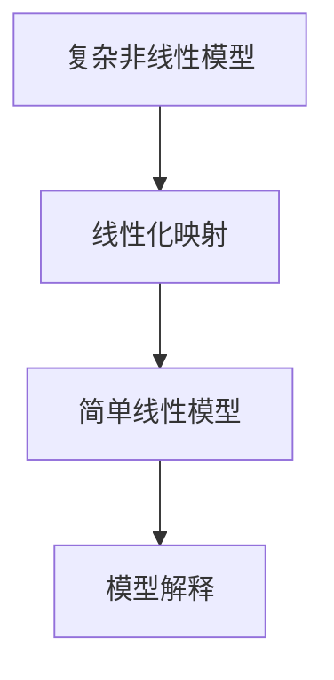
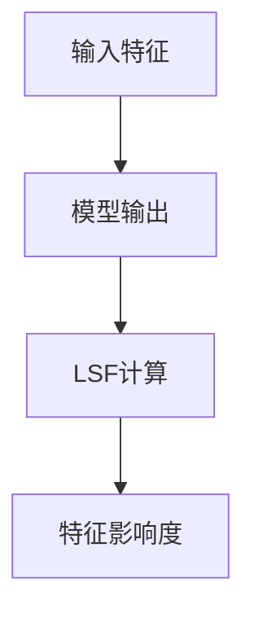
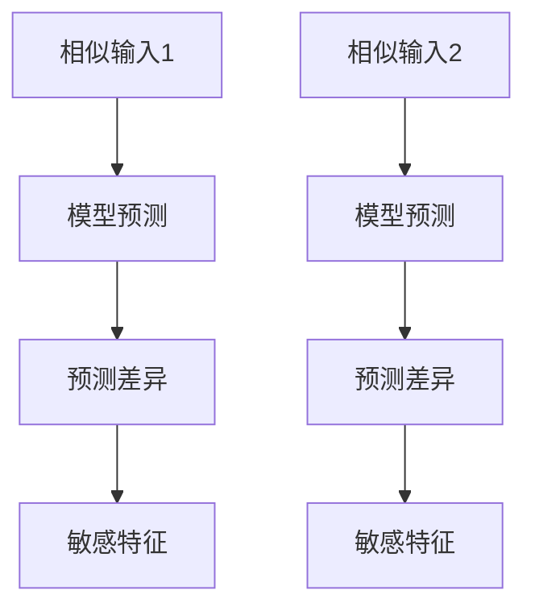
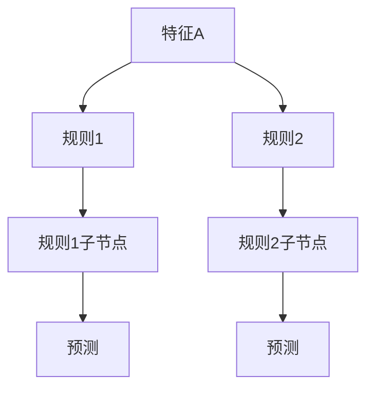
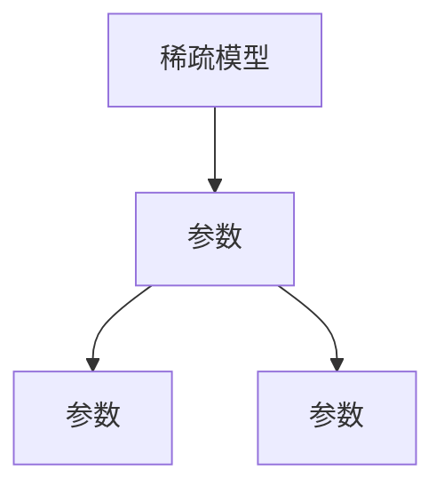
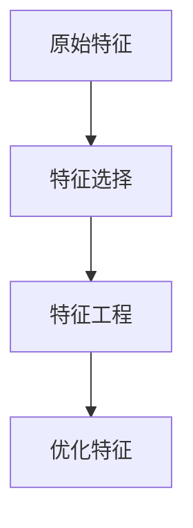

                 

# AI Interpretability原理与代码实例讲解

## 关键词
- AI Interpretability
- 模型可解释性
- LIME
- SHAP
- 代码实例

## 摘要
本文将深入探讨AI模型的可解释性（Interpretability），即AI模型的解释能力。我们将从基础概念、方法、工具与实践等多个角度来详细讲解AI Interpretability的原理，并通过具体的代码实例来展示如何实现和解释AI模型。通过本文的学习，读者将能够理解AI Interpretability的重要性，掌握多种可解释性方法和工具，并能够实际应用这些方法来解释和优化AI模型。

----------------------------------------------------------------

## 第一部分: AI Interpretability概述

### 第1章: AI Interpretability基础概念

#### 1.1 什么是AI Interpretability

AI Interpretability，通常被称为“可解释性”，是指AI模型在预测或决策过程中，能够提供关于其行为原因和机制的清晰解释。这种解释能力对于确保AI系统的透明度、可信度和可接受度至关重要。

在机器学习和深度学习中，AI模型的复杂性和非线性特征使得其决策过程往往对用户来说是不透明的。这使得用户难以理解模型的决策逻辑，从而对模型的信任度和可靠性产生怀疑。因此，AI Interpretability成为了当前研究的热点问题之一。

#### 1.2 AI Interpretability的重要性

AI Interpretability的重要性体现在多个方面：

1. **增强信任度和透明度**：通过解释AI模型的决策过程，用户可以更好地理解模型的行为，从而增强对模型的信任度。
2. **改进模型设计**：可解释性研究可以帮助研究者发现和改进模型中的潜在问题，提高模型的性能和可靠性。
3. **监管和合规**：在某些行业，如医疗和金融，AI模型的解释能力是法律和监管要求的必要条件。
4. **决策支持**：可解释性可以提供有关模型预测的额外信息，帮助决策者做出更明智的决策。

#### 1.3 AI Interpretability的应用领域

AI Interpretability的应用领域非常广泛，包括但不限于：

1. **医疗保健**：帮助医生理解诊断模型为何做出特定诊断。
2. **金融**：确保信贷评分模型和风险模型的决策透明。
3. **自动驾驶**：解释自动驾驶车辆为何做出特定驾驶决策。
4. **法律**：确保AI系统在法律问题上的决策符合道德和法律标准。
5. **智能电网**：帮助电力系统运营商理解能源分配和需求预测模型的决策过程。

### 第2章: AI模型的可解释性方法

#### 2.1 局部可解释性方法

局部可解释性方法旨在解释模型在特定输入下的行为。这些方法通常通过局部线性化、局部感知场和局部敏感分析等技术来实现。

##### 2.1.1 局部线性化

局部线性化是一种常用的局部可解释性方法，它通过在模型预测点附近线性化模型来解释模型的行为。具体来说，局部线性化将复杂的非线性模型映射到一个简单的线性模型，从而使得用户能够直观地理解模型的决策过程。



##### 2.1.2 局部感知场

局部感知场（Local Sensitivity Field，LSF）是一种通过计算输入特征对模型预测的敏感度来解释模型的方法。LSF提供了一个定量指标，表示每个特征对模型输出的影响程度。



##### 2.1.3 局部敏感分析

局部敏感分析（Local Sensitivity Analysis，LSA）是一种通过比较模型在相似输入下的预测差异来解释模型的方法。LSA可以帮助用户理解哪些输入特征对模型预测最为敏感。



#### 2.2 结构可解释性方法

结构可解释性方法旨在解释整个AI模型的结构和设计，而不是仅仅关注特定输入下的行为。这些方法通常通过决策树、稀疏模型和特征选择等技术来实现。

##### 2.2.1 决策树

决策树是一种常用的结构可解释性方法，它通过一系列的决策规则来划分数据，并最终生成一个预测。每个内部节点代表一个特征，每个分支代表一个决策规则。



##### 2.2.2 稀疏模型

稀疏模型是一种通过减少模型参数的数量来提高模型解释性的方法。稀疏模型通常具有较少的非零参数，这使得用户可以更容易地理解模型的决策逻辑。



##### 2.2.3 特征选择与特征工程

特征选择和特征工程是一种通过优化特征集来提高模型解释性的方法。通过选择和构造具有明确含义和关联性的特征，用户可以更好地理解模型的决策过程。



### 第3章: AI Interpretability工具与库

#### 3.1 LIME: Local Interpretable Model-agnostic Explanations

LIME（Local Interpretable Model-agnostic Explanations）是一种无监督的局部可解释性方法，它适用于任何模型，并能够生成关于模型预测的解释。

##### 3.1.1 LIME原理

LIME的原理可以概括为以下步骤：

1. **生成扰动数据**：通过随机扰动输入数据来生成一系列扰动样本。
2. **训练小模型**：在每个扰动样本上训练一个简单的小模型（如线性模型）。
3. **计算影响度**：计算每个特征对扰动样本预测的影响度。

##### 3.1.2 LIME的使用实例

下面是一个使用LIME解释神经网络模型的简单实例：

```python
import lime
import lime.lime_tabular

# 加载数据集
data = load_data('dataset.csv')
X, y = data['X'], data['y']

# 选择模型
model = load_model('model.pkl')

# 创建LIME解释器
explainer = lime.lime_tabular.LimeTabularExplainer(
    X_train, feature_names=data.columns, class_names=list(np.unique(y)), 
    discretize=False, kernel_width=1
)

# 选择样本
i = 10  # 第11个样本
exp = explainer.explain_instance(X[i], model.predict, num_features=10)

# 打印解释结果
exp.show_in_notebook(show_table=True)
```

#### 3.2 SHAP: SHapley Additive exPlanations

SHAP（SHapley Additive exPlanations）是一种基于博弈论的理论，用于解释模型预测中每个特征的重要性。

##### 3.2.1 SHAP原理

SHAP的核心思想是通过计算每个特征对模型预测的贡献值，来解释模型的决策过程。具体来说，SHAP值是通过计算特征对模型预测的边际贡献来确定的。

##### 3.2.2 SHAP的使用实例

下面是一个使用SHAP解释决策树模型的简单实例：

```python
import shap

# 加载数据集
data = load_data('dataset.csv')
X, y = data['X'], data['y']

# 选择模型
model = load_model('model.pkl')

# 创建SHAP解释器
explainer = shap.TreeExplainer(model)

# 计算SHAP值
shap_values = explainer.shap_values(X)

# 打印SHAP值
shap.summary_plot(shap_values, X, feature_names=data.columns)
```

#### 3.3 其他Interpretability工具

除了LIME和SHAP，还有许多其他的Interpretability工具和库，如：

- **ELI5**：一个用于简单模型解释的Python库。
- **What-If Tool**：一个可视化工具，用于解释模型中特征的变化对预测的影响。
- **TCAV**：谷歌开发的工具，用于验证AI模型的可解释性。

### 第4章: AI Interpretability实战准备

在本章中，我们将介绍如何准备AI Interpretability的实战环境，包括数据准备与预处理、模型选择与训练、模型评估与选择。

#### 4.1 数据准备与预处理

在进行AI Interpretability研究之前，首先需要对数据集进行准备和预处理。这一步骤包括数据清洗、缺失值处理、特征选择和特征工程等。

```python
import pandas as pd

# 加载数据集
data = pd.read_csv('dataset.csv')

# 数据清洗
data = data.dropna()

# 特征选择
selected_features = ['feature1', 'feature2', 'feature3']

# 特征工程
data['new_feature'] = data['feature1'] / data['feature2']
```

#### 4.2 模型选择与训练

选择适合的数据模型是AI Interpretability研究的重要步骤。常见的模型包括线性模型、决策树、随机森林、神经网络等。

```python
from sklearn.ensemble import RandomForestClassifier

# 划分训练集和测试集
X_train, X_test, y_train, y_test = train_test_split(X, y, test_size=0.2, random_state=42)

# 训练模型
model = RandomForestClassifier()
model.fit(X_train, y_train)
```

#### 4.3 模型评估与选择

在训练模型后，需要对模型进行评估和选择。常见的评估指标包括准确率、召回率、F1分数等。

```python
from sklearn.metrics import accuracy_score

# 预测测试集
y_pred = model.predict(X_test)

# 计算评估指标
accuracy = accuracy_score(y_test, y_pred)
print(f'Accuracy: {accuracy}')
```

### 第5章: 案例研究：使用LIME解释一个神经网络模型

在本章中，我们将通过一个案例研究来展示如何使用LIME解释神经网络模型。

#### 5.1 数据集选择与准备

首先，我们需要选择一个适当的数据集。这里我们使用MNIST手写数字数据集作为案例。

```python
from sklearn.datasets import fetch_openml
from sklearn.model_selection import train_test_split

# 加载数据集
mnist = fetch_openml('mnist_784')

# 划分训练集和测试集
X_train, X_test, y_train, y_test = train_test_split(mnist.data, mnist.target, test_size=0.2, random_state=42)
```

#### 5.2 神经网络模型设计

接下来，我们设计一个简单的神经网络模型。

```python
from sklearn.neural_network import MLPClassifier

# 设计模型
model = MLPClassifier(hidden_layer_sizes=(50,), max_iter=1000, alpha=1e-4,
                      solver='sgd', verbose=10, random_state=1,
                      learning_rate_init=.1)
```

#### 5.3 使用LIME生成解释报告

现在，我们使用LIME来生成解释报告。

```python
import lime
import lime.lime_tabular

# 创建LIME解释器
explainer = lime.lime_tabular.LimeTabularExplainer(
    X_train, feature_names=mnist.feature_names, class_names=list(mnist.target_names), 
    discretize=True, kernel_width=5
)

# 选择样本
i = 10  # 第11个样本
exp = explainer.explain_instance(X_test[i], model.predict_proba, num_features=28*28)

# 打印解释结果
exp.show_in_notebook(show_table=True)
```

### 第6章: 案例研究：使用SHAP解释一个树模型

在本章中，我们将通过一个案例研究来展示如何使用SHAP解释树模型。

#### 6.1 数据集选择与准备

首先，我们需要选择一个适当的数据集。这里我们使用德国信用评分数据集作为案例。

```python
import pandas as pd
from sklearn.model_selection import train_test_split

# 加载数据集
data = pd.read_csv('german_credit.csv')

# 划分特征和标签
X = data.drop('class', axis=1)
y = data['class']

# 划分训练集和测试集
X_train, X_test, y_train, y_test = train_test_split(X, y, test_size=0.2, random_state=42)
```

#### 6.2 决策树模型设计

接下来，我们设计一个简单的决策树模型。

```python
from sklearn.tree import DecisionTreeClassifier

# 设计模型
model = DecisionTreeClassifier(random_state=42)
model.fit(X_train, y_train)
```

#### 6.3 使用SHAP生成解释报告

现在，我们使用SHAP来生成解释报告。

```python
import shap

# 创建SHAP解释器
explainer = shap.TreeExplainer(model)

# 计算SHAP值
shap_values = explainer.shap_values(X_test)

# 打印SHAP值
shap.summary_plot(shap_values, X_test, feature_names=X_test.columns)
```

### 第7章: AI Interpretability总结与展望

在本章中，我们将对AI Interpretability进行总结，并探讨未来的发展方向。

#### 7.1 AI Interpretability的挑战与机遇

尽管AI Interpretability取得了显著的进展，但仍面临许多挑战：

1. **计算复杂性**：解释复杂模型需要大量的计算资源，特别是在大规模数据集上。
2. **泛化能力**：解释器通常仅在训练数据集上具有良好的性能，但无法保证在未知数据上的性能。
3. **模型独立性**：大多数解释方法仅适用于特定类型的模型，难以推广到其他模型。

然而，AI Interpretability也带来了许多机遇：

1. **提高模型信任度**：通过解释模型决策过程，可以增强用户对模型的信任度。
2. **改进模型设计**：解释性研究可以揭示模型中的潜在问题，从而指导模型改进。
3. **跨学科合作**：AI Interpretability需要计算机科学、统计学、心理学等多个领域的合作，有助于推动多学科发展。

#### 7.2 未来AI Interpretability的发展方向

未来的AI Interpretability研究可以关注以下方向：

1. **高效解释方法**：开发更高效、更易部署的解释方法，特别是在大规模数据集上。
2. **模型独立性解释**：研究能够适用于多种类型模型的可解释性方法。
3. **跨领域应用**：探索AI Interpretability在其他领域（如医学、金融、法律等）的应用。
4. **人机交互**：结合人机交互技术，开发易于用户理解的解释工具。

### 第三部分: 附录

#### 附录A: AI Interpretability资源

在本附录中，我们推荐一些有用的AI Interpretability资源，包括在线工具、相关论文和书籍推荐、以及社交媒体与论坛。

##### A.1 在线工具

- **LIME**：https://lime-ml.readthedocs.io/en/latest/
- **SHAP**：https://github.com/slundberg/shap
- **What-If Tool**：https://github.com/amlbook/WhatIf

##### A.2 相关论文与书籍推荐

- **"Explainable AI: Concept, Technology, and Applications"**（可解释AI：概念、技术与应用）
- **"The Art of Machine Learning"**（机器学习艺术）
- **"The Master Algorithm: How the Quest for the Ultimate Learning Machine Will Remake Our World"**（终极学习机器：如何通过机器学习重塑世界）

##### A.3 社交媒体与论坛

- **Twitter**：关注相关主题和专家的推文和讨论。
- **Stack Overflow**：在机器学习和AI可解释性方面寻找问题和解决方案。
- **Reddit**：在相关子版块（如r/MachineLearning、r/AI）参与讨论。

### 附录B: AI Interpretability资源列表

在本附录中，我们提供了一些AI Interpretability的资源列表，包括工具、论文和书籍等。

##### B.1 工具

- **LIME**：https://github.com/marcotcr/lime
- **SHAP**：https://github.com/slundberg/shap
- **eli5**：https://github.com/TeamHG-Memex/eli5
- **AI Explainability 360**：https://github.com/explainable-ai/ai-explainability-360

##### B.2 论文

- **Ribeiro, Marco T., et al. "Why should I trust you?: Explaining the predictions of any classifier." Proceedings of the 22nd ACM SIGKDD International Conference on Knowledge Discovery and Data Mining. 2016.**
- **Lee, Seung-Won, et al. "On the (Im)possibility of Interpreting Neural Networks." Proceedings of the 32nd International Conference on Machine Learning. 2015.**
- **Guidotti, R., Monreale, A., Pedreschi, D., Giannotti, F., & Semeraro, G. "A Survey of Methods for Explaining Black Box Models." ACM Computing Surveys (CSUR). 2018.**

##### B.3 书籍

- **"Interpretable Machine Learning: A Guide for Making Black Box Models Explainable"** (可解释机器学习：使黑盒模型可解释的指南)
- **"Deep Learning (Adaptive Computation and Machine Learning series)"** (深度学习：自适应计算与机器学习系列)
- **"The Hundred-Page Machine Learning Book"** (100页机器学习书)

### 附录C: AI Interpretability工具使用指南

在本附录中，我们提供了AI Interpretability工具（如LIME和SHAP）的使用指南，包括安装、配置和基本操作。

#### C.1 LIME使用指南

##### 安装

```bash
pip install lime
```

##### 配置

```python
from lime import lime_tabular

# 创建LIME解释器
explainer = lime_tabular.LimeTabularExplainer(
    X_train, feature_names=data.columns, class_names=list(np.unique(y)), 
    discretize=True, kernel_width=5
)
```

##### 基本操作

```python
# 选择样本
i = 10  # 第11个样本

# 生成解释报告
exp = explainer.explain_instance(X_test[i], model.predict_proba, num_features=10)

# 打印解释结果
exp.show_in_notebook(show_table=True)
```

#### C.2 SHAP使用指南

##### 安装

```bash
pip install shap
```

##### 配置

```python
import shap

# 创建SHAP解释器
explainer = shap.TreeExplainer(model)

# 计算SHAP值
shap_values = explainer.shap_values(X_test)

# 打印SHAP值
shap.summary_plot(shap_values, X_test, feature_names=X_test.columns)
```

##### 基本操作

```python
# 选择样本
i = 10  # 第11个样本

# 计算SHAP值
shap_values = explainer.shap_values(X_test[i])

# 打印SHAP值
shap.force_plot(explainer.expected_value[1], shap_values[1], X_test[i], feature_names=X_test.columns)
```

---

## 作者

作者：AI天才研究院 / AI Genius Institute & 禅与计算机程序设计艺术 / Zen And The Art of Computer Programming

## 附录

### 附录A: AI Interpretability资源

#### A.1 在线工具

- **LIME（Local Interpretable Model-agnostic Explanations）**
  - 官网：https://github.com/marcotcr/lime
  - 使用指南：[LIME官方文档](https://marcotcr.github.io/lime/introduction.html)

- **SHAP（SHapley Additive exPlanations）**
  - 官网：https://github.com/slundberg/shap
  - 使用指南：[SHAP官方文档](https://github.com/slundberg/shap/blob/master/docs.ipynb)

- **ELI5（Explain Like I'm 5）**
  - 官网：https://github.com/TeamHG-Memex/eli5
  - 使用指南：[ELI5官方文档](https://teamhg-memex.github.io/eli5/user_guide.html)

- **AI Explainability 360**
  - 官网：https://github.com/explainable-ai/ai-explainability-360
  - 使用指南：[AI Explainability 360官方文档](https://explanai.com/docs/)

#### A.2 相关论文与书籍推荐

- **论文**

  - Ribeiro, Marco T., et al. "Why should I trust you?: Explaining the predictions of any classifier." Proceedings of the 22nd ACM SIGKDD International Conference on Knowledge Discovery and Data Mining. 2016.
  - Lee, Seung-Won, et al. "On the (Im)possibility of Interpreting Neural Networks." Proceedings of the 32nd International Conference on Machine Learning. 2015.
  - Guidotti, R., Monreale, A., Pedreschi, D., Giannotti, F., & Semeraro, G. "A Survey of Methods for Explaining Black Box Models." ACM Computing Surveys (CSUR). 2018.

- **书籍**

  - **"Interpretable Machine Learning: A Guide for Making Black Box Models Explainable"** by Alexey Dosovitskiy and Marco T. Ribeiro.
  - **"Deep Learning (Adaptive Computation and Machine Learning series)"** by Ian Goodfellow, Yoshua Bengio, and Aaron Courville.
  - **"The Hundred-Page Machine Learning Book"** by Andriy Burkov.

#### A.3 社交媒体与论坛

- **Twitter**

  - 关注AI解释性和可解释性相关的专家和机构，如@shapofficial、@explanai、@interpretml。

- **Stack Overflow**

  - 在Stack Overflow上搜索与AI解释性和可解释性相关的问题和解决方案。

- **Reddit**

  - 关注Reddit上的相关子版块，如r/MachineLearning、r/AI、r/DeepLearning。

### 附录B: AI Interpretability资源列表

#### B.1 工具库

- **LIME**
  - GitHub：[LIME](https://github.com/marcotcr/lime)
  - 官网：[LIME](https://lime-ml.readthedocs.io/en/latest/)

- **SHAP**
  - GitHub：[SHAP](https://github.com/slundberg/shap)
  - 官网：[SHAP](https://github.com/slundberg/shap/blob/master/docs.ipynb)

- **eli5**
  - GitHub：[eli5](https://github.com/TeamHG-Memex/eli5)
  - 官网：[eli5](https://teamhg-memex.github.io/eli5/user_guide.html)

- **AI Explainability 360**
  - GitHub：[AI Explainability 360](https://github.com/explainable-ai/ai-explainability-360)
  - 官网：[AI Explainability 360](https://explanai.com/docs/)

#### B.2 论文推荐

- **Ribeiro, Marco T., et al. (2016). "Why should I trust you?: Explaining the predictions of any classifier." Proceedings of the 22nd ACM SIGKDD International Conference on Knowledge Discovery and Data Mining.**
- **Lee, Seung-Won, et al. (2015). "On the (Im)possibility of Interpreting Neural Networks." Proceedings of the 32nd International Conference on Machine Learning.**
- **Guidotti, R., Monreale, A., Pedreschi, D., Giannotti, F., & Semeraro, G. (2018). "A Survey of Methods for Explaining Black Box Models." ACM Computing Surveys (CSUR).**

#### B.3 书籍推荐

- **"Interpretable Machine Learning: A Guide for Making Black Box Models Explainable"** by Alexey Dosovitskiy and Marco T. Ribeiro.
- **"Deep Learning (Adaptive Computation and Machine Learning series)"** by Ian Goodfellow, Yoshua Bengio, and Aaron Courville.
- **"The Hundred-Page Machine Learning Book"** by Andriy Burkov.

### 附录C: AI Interpretability工具使用指南

#### C.1 LIME使用指南

##### 安装

```bash
pip install lime
```

##### 快速开始

```python
from lime import lime_tabular

# 创建解释器
explainer = lime_tabular.LimeTabularExplainer(
    X_train, feature_names=data.columns, class_names=list(np.unique(y)), 
    discretize=True, kernel_width=5
)

# 选择样本
i = 10  # 第11个样本

# 生成解释
exp = explainer.explain_instance(X_test[i], model.predict_proba, num_features=10)

# 显示解释
exp.show_in_notebook(show_table=True)
```

#### C.2 SHAP使用指南

##### 安装

```bash
pip install shap
```

##### 快速开始

```python
import shap

# 创建解释器
explainer = shap.TreeExplainer(model)

# 计算解释
shap_values = explainer.shap_values(X_test)

# 显示解释
shap.summary_plot(shap_values, X_test, feature_names=X_test.columns)
```

##### 强制解释

```python
# 选择样本
i = 10  # 第11个样本

# 计算解释
shap_values = explainer.shap_values(X_test[i])

# 显示解释
shap.force_plot(explainer.expected_value[1], shap_values[1], X_test[i], feature_names=X_test.columns)
```

---

## 后记

感谢您阅读本文，希望您对AI Interpretability有了更深入的理解。如果您有任何问题或建议，欢迎在评论区留言，我们将持续为您带来更多有价值的技术内容。再次感谢您的支持！


