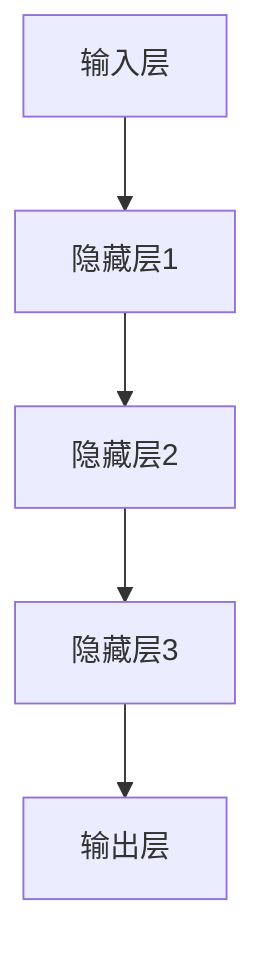

                 

## 《AI 基础设施投资：智能经济的新增长点》

### 关键词：
- AI 基础设施
- 智能经济
- 投资策略
- 技术趋势
- 行业应用

#### 摘要：
本文深入探讨了 AI 基础设施投资在智能经济中的关键作用。首先，我们介绍了 AI 基础设施的内涵和重要性，并分析了智能经济的概念及其与数字经济的关联。随后，文章构建了 AI 基础设施投资的框架，详细阐述了投资分类、关键领域和评估方法。接着，我们聚焦于 AI 基础设施的核心技术，如神经网络、大数据处理、云计算与边缘计算。随后，文章分析了投资风险，通过具体案例展示了投资策略和政策解读。最后，我们展望了 AI 基础设施投资的未来发展，并探讨了其实际应用领域，包括制造业、金融业、医疗保健、城市管理和农业。本文旨在为读者提供一个全面、系统的 AI 基础设施投资指南。

### 第一部分：AI 基础设施投资概述

#### 1.1 AI 基础设施的重要性

##### 1.1.1 AI 基础设施的定义与内涵

AI 基础设施是指支持人工智能技术发展的基础架构，包括硬件设施、软件工具、数据资源和管理体系等。这些设施共同构成了一个生态系统，为人工智能的快速发展提供必要的支撑。

AI 基础设施不仅包括传统的计算资源和存储设备，还涵盖了如深度学习框架、分布式计算平台、数据清洗工具和自动化管理系统等软件资源。此外，数据资源的质量与完整性也是 AI 基础设施的重要组成部分，因为数据是训练和优化人工智能模型的关键。

##### 1.1.2 AI 基础设施的投资意义

投资于 AI 基础设施对于企业和整个社会都具有深远的意义。首先，它能够提升企业进行人工智能研究和开发的能力，加速产品的迭代和创新。其次，完善的 AI 基础设施有助于吸引和留住人才，推动技术的持续进步。此外，从宏观层面看，投资 AI 基础设施能够促进数字经济的发展，提升国家在全球科技竞争中的地位。

##### 1.1.3 AI 基础设施的全球发展趋势

全球范围内，AI 基础设施的投入和建设正在加速。以下是一些显著的发展趋势：

1. **基础设施建设投入增加**：各国政府和企业纷纷加大在 AI 基础设施上的投资，以支持人工智能技术的发展。
2. **计算能力提升**：随着量子计算、高性能计算等技术的发展，计算能力的提升为复杂人工智能模型的训练和优化提供了强大的支持。
3. **数据处理和存储技术进步**：分布式存储系统、边缘计算等技术的发展，使得数据处理和存储的效率和安全性得到了显著提升。
4. **数据隐私和安全重视**：随着数据隐私和安全问题的日益突出，AI 基础设施的投资开始更多关注数据的保护和隐私的维护。
5. **国际合作加强**：各国在 AI 基础设施的建设方面加强合作，共同推动人工智能技术的全球化发展。

#### 1.2 智能经济概述

##### 1.2.1 智能经济的概念与特点

智能经济是指基于人工智能技术的新型经济形态。它具有以下特点：

1. **智能化生产**：通过人工智能技术，生产过程变得更加高效和精准，降低了生产成本，提高了产品质量。
2. **个性化服务**：人工智能能够根据用户行为和需求提供个性化的服务，提升了用户体验和满意度。
3. **数据驱动**：智能经济以数据为核心，通过数据分析和挖掘，实现决策的智能化和精准化。
4. **跨界融合**：智能经济促进了各行业之间的融合，如人工智能与金融、医疗、教育等领域的结合，形成了新的产业形态。

##### 1.2.2 智能经济与数字经济的关系

智能经济是数字经济的一种高级形态，它依托于数字经济的发展，但又在数字经济的基础上实现了质的飞跃。数字经济主要关注的是信息技术在经济中的应用，而智能经济则更加注重通过人工智能技术实现经济的智能化升级。

智能经济与数字经济的关系可以概括为：

1. **数字经济为智能经济提供了基础设施**：数字基础设施建设，如互联网、云计算、大数据等，为智能经济的发展提供了基础支撑。
2. **智能经济推动了数字经济的深化**：智能经济的发展使得数字经济在智能化、个性化和跨界融合等方面得到了进一步深化。

##### 1.2.3 智能经济对产业结构的影响

智能经济的发展对产业结构产生了深远的影响，主要体现在以下几个方面：

1. **传统产业的转型升级**：智能经济使得传统产业能够通过引入人工智能技术实现转型升级，提高了生产效率和竞争力。
2. **新兴产业的形成**：智能经济的发展催生了如人工智能、大数据、云计算等新兴产业，推动了经济的多元化发展。
3. **产业链重构**：智能经济促进了产业链的重构，推动了各环节之间的协同和优化。
4. **区域经济布局变化**：智能经济的发展使得区域经济的布局发生了变化，一些技术先进的地区逐渐成为经济增长的新引擎。

#### 1.3 AI 基础设施投资框架

##### 1.3.1 AI 基础设施投资的分类

AI 基础设施投资可以按照不同的维度进行分类，以下是一些常见的分类方法：

1. **按照投资主体分类**：
   - **政府投资**：政府通过公共财政投入，支持基础研究和基础设施建设。
   - **企业投资**：企业通过自身资本投入，进行技术研究和产品开发。
   - **联合投资**：政府和企业、企业与企业之间的合作投资，共同推动人工智能技术的发展。

2. **按照投资领域分类**：
   - **硬件设施投资**：包括高性能计算设备、存储设备、网络设施等。
   - **软件工具投资**：包括深度学习框架、开发平台、管理软件等。
   - **数据资源投资**：包括数据采集、清洗、存储、管理等。

3. **按照投资阶段分类**：
   - **早期投资**：主要用于基础研究和原型开发。
   - **中期投资**：主要用于产品开发和市场推广。
   - **后期投资**：主要用于规模化生产和商业化运营。

##### 1.3.2 AI 基础设施投资的关键领域

AI 基础设施投资的关键领域包括以下几个方面：

1. **算法研发**：算法是人工智能的核心，投资于算法研发能够推动技术的进步和应用的创新。
2. **硬件设备**：高性能计算设备和存储设备是支撑人工智能计算和存储的基础，投资于硬件设备能够提升计算能力和数据处理效率。
3. **数据处理与存储**：随着数据规模的快速增长，投资于数据处理和存储技术对于支撑人工智能应用至关重要。
4. **安全与隐私**：随着人工智能应用的普及，数据安全和隐私问题日益突出，投资于安全与隐私技术能够保障数据的安全和用户的隐私。
5. **人才培养**：人才是人工智能发展的关键，投资于人才培养能够提升整体技术水平和创新能力。

##### 1.3.3 AI 基础设施投资的评估方法

对 AI 基础设施投资进行评估是确保投资效果和合理性的重要环节。以下是一些常用的评估方法：

1. **成本效益分析**：通过对投资的成本和预期效益进行对比分析，评估投资的合理性和可行性。
2. **风险分析**：对投资过程中可能遇到的风险进行评估，包括技术风险、市场风险和政策风险等。
3. **绩效评估**：通过设定绩效指标，对投资的成果和效果进行评估，包括技术创新、市场竞争力、经济效益等。
4. **案例分析**：通过对成功的 AI 基础设施投资案例进行分析，总结投资的成功经验和不足，为未来的投资提供参考。

### 第二部分：AI 基础设施的核心技术

#### 2.1 人工智能算法基础

##### 2.1.1 神经网络基础

神经网络是人工智能的核心组成部分，它模仿人脑的结构和工作原理，通过大量的神经元和连接来实现复杂的任务。

###### 2.1.1.1 神经网络结构

一个简单的神经网络通常包括以下几个部分：

1. **输入层**：接收外部输入的数据。
2. **隐藏层**：进行数据处理和计算。
3. **输出层**：产生最终的输出结果。

神经网络的结构可以用以下 Mermaid 流程图表示：



###### 2.1.1.2 学习算法

神经网络通过学习算法来调整内部参数，以实现对数据的映射和预测。常用的学习算法包括：

1. **反向传播算法（Backpropagation）**：
   - 计算输出误差，反向传播到隐藏层，更新权重。
   - 伪代码：

     ```python
     for each layer in reverse order:
         delta = error * activation_derivative
         delta_weight = learning_rate * delta
         weight -= delta_weight
     ```

2. **梯度下降算法（Gradient Descent）**：
   - 根据损失函数的梯度方向，逐步调整权重。
   - 伪代码：

     ```python
     for each weight in network:
         gradient = derivative_of_loss_function
         weight -= learning_rate * gradient
     ```

###### 2.1.1.3 伪代码

以下是一个简单的神经网络学习过程的伪代码：

```python
initialize_weights()
while not converged:
    forward_pass(x)
    compute_loss(y)
    backward_pass()
    update_weights(learning_rate)
```

##### 2.1.2 强化学习

强化学习是一种通过试错和反馈来学习策略的人工智能方法，它在动态环境中进行决策。

###### 2.1.2.1 强化学习基本概念

强化学习包括以下几个核心概念：

1. **状态（State）**：系统当前所处的情景。
2. **动作（Action）**：在特定状态下可以采取的行为。
3. **奖励（Reward）**：动作结果的评价，用以指导学习。
4. **策略（Policy）**：从状态到动作的映射函数。

强化学习的过程可以概括为：

1. 状态初始化
2. 采取动作
3. 接收奖励
4. 更新策略

###### 2.1.2.2 Q-学习算法

Q-学习算法是一种基于值函数的强化学习算法，它通过迭代更新值函数来优化策略。

1. **Q-函数**：评估从特定状态采取特定动作的长期奖励。
2. **Q-学习算法**：

   ```python
   initialize Q(s, a)
   while not converged:
       for each state s:
           for each action a:
               Q(s, a) = (1 - learning_rate) * Q(s, a) + learning_rate * (reward + discount * max(Q(next_state, a')))
   ```

3. **伪代码**：

   ```python
   for each state s:
       for each action a:
           Q(s, a) = 0
   while not converged:
       state = get_current_state()
       action = choose_action(Q, state)
       next_state, reward = take_action(action)
       Q(state, action) = (1 - learning_rate) * Q(state, action) + learning_rate * (reward + discount * max(Q(next_state, a')))
   ```

### 第三部分：AI 基础设施的投资策略

#### 3.1 AI 基础设施投资风险分析

在投资 AI 基础设施时，企业需要充分考虑各种风险因素，以确保投资的安全和有效性。以下是对 AI 基础设施投资风险的分类和分析。

##### 3.1.1 投资风险分类

AI 基础设施投资风险主要包括以下几类：

1. **技术风险**：
   - **技术不成熟**：AI 技术本身尚处于快速发展阶段，某些关键技术尚未成熟，可能导致投资失败。
   - **技术依赖性**：企业过度依赖特定技术或供应商，可能导致技术升级和供应链风险。

2. **市场风险**：
   - **市场需求波动**：AI 技术的应用市场可能存在需求波动，导致投资收益不稳定。
   - **市场竞争加剧**：随着 AI 技术的普及，市场竞争日益激烈，可能导致投资回报率下降。

3. **政策风险**：
   - **政策调整**：政府政策的变化可能影响 AI 投资的环境和条件，如税收政策、贸易政策等。
   - **法规合规性**：AI 技术的应用可能面临法律法规的挑战，如数据隐私保护、伦理问题等。

##### 3.1.2 风险评估方法

为了有效识别和管理投资风险，企业可以采用以下风险评估方法：

1. **定量分析**：
   - **成本效益分析**：通过计算投资成本与预期收益的比率，评估项目的盈利性。
   - **敏感性分析**：分析投资结果对关键参数（如市场需求、成本、政策变化等）的敏感度。

2. **定性分析**：
   - **专家评审**：邀请行业专家对投资项目的风险进行评估，提供专业意见和建议。
   - **情景分析**：构建不同市场和政策环境下的情景，分析项目在不同情景下的表现。

3. **风险评估模型**：
   - **故障树分析（FTA）**：通过分析可能导致投资失败的故障事件，识别和评估风险。
   - **蒙特卡洛模拟**：使用概率分布模拟不同风险因素对投资结果的影响，进行风险预测。

##### 3.1.3 风险管理策略

在识别和评估风险之后，企业需要采取相应的风险管理策略来降低风险：

1. **风险规避**：通过调整投资计划，避免高风险领域。
2. **风险转移**：通过保险、合同约定等方式，将部分风险转移给第三方。
3. **风险控制**：通过技术和管理手段，降低风险发生的概率和影响。
4. **风险接受**：对无法规避或转移的风险，采取接受的态度，制定应对措施。

### 3.2 AI 基础设施投资案例分析

为了更好地理解 AI 基础设施投资的实际应用和效果，以下将通过两个具体案例来展示投资策略和实施效果。

##### 3.2.1 案例一：AI 算力基础设施投资

**案例背景**：

某科技企业（A 企业）在人工智能领域有着深厚的技术积累，为了提升在 AI 领域的竞争力，决定投资建设一个高性能 AI 算力基础设施。

**投资策略**：

1. **设备采购**：A 企业采购了高性能计算设备，包括 GPU、TPU 和高性能服务器，以满足大规模 AI 模型训练的需求。
2. **数据中心建设**：A 企业建设了一个专业的数据中心，配备高效的冷却系统和网络安全设施，确保设备的稳定运行。
3. **软件开发**：A 企业投资研发了定制化的深度学习框架和开发工具，提升开发效率和模型性能。

**投资效果**：

1. **计算能力提升**：新基础设施的建立显著提升了 A 企业的计算能力，使得大规模 AI 模型训练和优化成为可能。
2. **研发效率提升**：高效的计算资源和开发工具使得研发人员能够更快地迭代模型，缩短了产品上市时间。
3. **市场竞争优势**：A 企业在 AI 领域的算力优势，使得其产品在市场竞争中具有更强的竞争力。

##### 3.2.2 案例二：AI 数据中心投资

**案例背景**：

某互联网企业（B 企业）在业务快速增长的过程中，面临着数据处理和存储能力的不足，决定投资建设一个高性能的 AI 数据中心。

**投资策略**：

1. **分布式存储系统**：B 企业采用分布式存储系统，提高了数据存储的效率和安全性，同时降低了维护成本。
2. **边缘计算节点**：B 企业在关键业务节点部署了边缘计算节点，实现了数据处理的就近处理，减少了延迟和数据传输成本。
3. **数据安全与隐私**：B 企业投资于数据安全技术和隐私保护措施，确保用户数据的安全和隐私。

**投资效果**：

1. **数据处理能力提升**：新数据中心的建立显著提升了 B 企业的数据处理能力，满足了业务快速增长的需求。
2. **用户体验优化**：边缘计算节点的部署减少了数据处理延迟，提升了用户体验。
3. **业务稳定性提升**：分布式存储系统和数据安全措施的实施，保证了数据的安全性和可靠性。

### 3.3 AI 基础设施投资政策解读

#### 3.3.1 国家政策概述

近年来，全球各国纷纷出台了一系列支持 AI 基础设施投资的政策措施，以推动人工智能技术的发展和应用。以下是一些主要国家的政策概述：

1. **美国**：
   - **《美国创新战略》**：提出加大对 AI 研究和基础设施的投资，加强国际科技合作。
   - **《美国人工智能倡议》**：旨在提升美国在 AI 领域的领导地位，推动 AI 技术的发展和应用。

2. **中国**：
   - **《新一代人工智能发展规划》**：明确了 AI 发展的阶段性目标和主要任务，加大对 AI 基础设施的投资。
   - **《国家大数据战略》**：强调数据资源的重要性，推动大数据和 AI 技术的结合。

3. **欧洲**：
   - **《欧洲人工智能战略》**：提出加大对 AI 研究和创新的投资，确保欧洲在 AI 领域的竞争力。
   - **《数字欧洲议程》**：推动数字基础设施建设，为 AI 技术的发展提供支持。

#### 3.3.2 地方政策解读

地方政策在推动 AI 基础设施投资方面也发挥了重要作用。以下是一些典型的地方政策解读：

1. **北京**：
   - **《北京市人工智能发展规划（2017-2022年）》**：明确将北京打造成全球人工智能创新中心，加大对 AI 基础设施的投资。
   - **《北京市高价值知识产权促进和保护行动计划（2018-2022年）》**：推动知识产权保护，为 AI 技术的创新和应用提供保障。

2. **深圳**：
   - **《深圳市新一代人工智能发展规划（2018-2025年）》**：提出建设国际人工智能创新中心，加大对 AI 基础设施的投资。
   - **《深圳市数字经济创新发展实施方案（2020-2025年）》**：推动数字基础设施建设，为 AI 技术的发展提供支持。

3. **上海**：
   - **《上海市人工智能发展“十三五”规划》**：明确将上海打造成为全球人工智能发展高地，加大对 AI 基础设施的投资。
   - **《上海市大数据发展“十三五”规划》**：强调大数据资源的重要性，推动大数据和 AI 技术的结合。

#### 3.3.3 地方政策影响

地方政策在推动 AI 基础设施投资方面产生了显著影响，主要体现在以下几个方面：

1. **投资激励**：地方政策提供了各种形式的投资激励措施，如财政补贴、税收优惠、土地优惠等，吸引了大量企业和社会资本投资 AI 基础设施。

2. **创新环境**：地方政策推动了创新环境的建设，如研发平台、创新中心、产业园区等，为 AI 技术的创新和应用提供了良好的生态环境。

3. **人才引进**：地方政策通过提供人才优惠政策、科研支持等，吸引了大量人才流入，为 AI 基础设施的建设提供了人力支持。

4. **产业集聚**：地方政策推动了 AI 产业链的集聚，形成了良好的产业生态，促进了 AI 技术的跨行业应用和融合发展。

### 4.1 AI 基础设施投资趋势分析

随着人工智能技术的不断进步和应用场景的拓展，AI 基础设施投资呈现出了强劲的增长趋势。以下从技术趋势、市场趋势和产业趋势三个方面对 AI 基础设施投资趋势进行分析。

#### 4.1.1 技术趋势

1. **算法进步**：随着深度学习、强化学习等算法的不断发展，人工智能技术的应用能力和效率不断提升。未来，更多的创新算法将涌现，推动 AI 技术向更高层次发展。

2. **硬件进步**：硬件技术的进步为 AI 基础设施提供了强大的支撑。高性能计算设备、新型存储设备和高速网络等硬件设施的不断发展，将进一步提升 AI 基础设施的性能和效率。

3. **数据技术**：随着大数据技术的不断发展，数据质量和数据应用能力得到了显著提升。未来，基于数据的 AI 技术将更加成熟，数据驱动的 AI 应用场景将进一步扩大。

4. **边缘计算**：边缘计算技术的快速发展，使得数据处理和计算能力在靠近数据源的地方实现，降低了延迟和带宽成本。边缘计算将成为 AI 基础设施投资的一个重要方向。

#### 4.1.2 市场趋势

1. **市场规模扩大**：随着 AI 技术的应用越来越广泛，AI 基础设施的投资市场规模也在不断扩大。根据市场研究机构的预测，未来几年全球 AI 基础设施投资市场将持续增长。

2. **区域市场差异**：不同地区的市场环境和产业基础差异，导致 AI 基础设施投资的市场表现存在明显差异。一些科技发达地区，如美国、中国、欧洲等，将是 AI 基础设施投资的重点区域。

3. **市场竞争加剧**：随着越来越多的企业进入 AI 领域，市场竞争将日益激烈。企业需要通过不断创新和提升技术水平，才能在激烈的市场竞争中脱颖而出。

4. **跨界合作**：AI 技术的跨界应用趋势明显，不同行业之间的合作将更加紧密。未来，跨界合作将成为推动 AI 基础设施投资市场发展的重要动力。

#### 4.1.3 产业趋势

1. **产业链整合**：随着 AI 技术的应用越来越广泛，AI 产业链将不断整合和优化。从硬件设备、软件开发到数据资源、服务应用等环节，产业链上下游企业将更加紧密地合作，共同推动 AI 产业的发展。

2. **产业生态建设**：AI 基础设施的投资将促进产业生态的建设，为 AI 产业的发展提供有力支撑。政府、企业、高校和科研机构等各方将共同参与，形成良好的产业生态。

3. **国际化发展**：随着全球化的深入发展，AI 基础设施投资将呈现国际化趋势。各国将在 AI 领域展开更加紧密的国际合作，共同推动全球 AI 产业的发展。

4. **可持续发展**：在 AI 基础设施投资过程中，可持续发展理念将得到重视。企业将注重节能环保、数据安全等方面，确保 AI 技术的可持续发展。

### 4.2 AI 基础设施投资未来展望

随着人工智能技术的快速发展，AI 基础设施投资在未来将继续发挥关键作用，成为推动智能经济的新增长点。以下从投资规模预测、投资领域展望和投资潜力领域三个方面对 AI 基础设施投资未来展望进行分析。

#### 4.2.1 投资规模预测

1. **全球投资规模**：根据市场研究机构的预测，未来几年全球 AI 基础设施投资规模将持续增长。预计到 2025 年，全球 AI 基础设施投资规模将达到数千亿美元。

2. **区域投资规模**：不同地区的投资规模存在明显差异。美国、中国、欧洲等科技发达地区将是全球 AI 基础设施投资的重点区域，投资规模将占据全球主要份额。

3. **产业投资规模**：AI 基础设施投资将覆盖多个产业领域，包括信息技术、制造、金融、医疗等。其中，信息技术产业将是最大的投资领域，其次是制造业和金融业。

#### 4.2.2 投资领域展望

1. **算法研发**：随着算法技术的不断进步，算法研发将成为 AI 基础设施投资的一个重要领域。企业将加大在深度学习、强化学习、自然语言处理等领域的投资，推动算法技术的创新和应用。

2. **硬件设备**：硬件设备是 AI 基础设施的核心组成部分。未来，企业将加大对高性能计算设备、新型存储设备和高速网络等硬件设备的投资，提升 AI 基础设施的算力和效率。

3. **数据处理与存储**：随着大数据技术的不断发展，数据处理与存储需求将持续增长。企业将加大对分布式存储系统、边缘计算等技术的投资，提高数据处理的效率和安全性。

4. **安全与隐私**：随着 AI 技术的应用越来越广泛，数据安全和隐私问题日益突出。企业将加大对安全与隐私技术的投资，确保 AI 技术的可持续发展。

#### 4.2.3 投资潜力领域

1. **智能医疗**：智能医疗是 AI 技术的重要应用领域。未来，企业将加大对智能医疗的投资，推动医学影像分析、疾病预测、个性化治疗等应用的发展。

2. **智能制造**：智能制造是制造业转型升级的关键。未来，企业将加大对智能制造的投资，推动工业机器人、智能传感器、数字孪生等技术的应用，提高生产效率和产品质量。

3. **智能交通**：智能交通是智慧城市建设的重要组成部分。未来，企业将加大对智能交通的投资，推动自动驾驶、智能调度、智慧交通管理等技术的应用，提高交通效率和安全性。

4. **金融科技**：金融科技是金融行业的重要发展方向。未来，企业将加大对金融科技的投资，推动人工智能、区块链等技术的应用，提高金融服务效率和安全性。

### 4.3 AI 基础设施投资在行业中的应用

AI 基础设施投资在各个行业中的应用已经取得了显著的成果，推动了行业的发展和变革。以下从制造业、金融业、医疗保健、城市管理和农业四个领域对 AI 基础设施投资在行业中的应用进行分析。

#### 4.3.1 制造业

1. **应用案例**：
   - **智能工厂**：通过 AI 技术实现生产线的自动化和智能化，提高生产效率和质量。
   - **产品预测**：利用 AI 技术分析市场数据，预测产品需求，优化生产计划和供应链管理。

2. **投资策略**：
   - **算法研发**：加大在智能控制、故障诊断等领域的算法研发投入，提升生产智能化水平。
   - **硬件设备**：投资于高性能计算设备和智能传感器，提升生产线的智能化程度。

3. **投资效果**：
   - **效率提升**：通过自动化和智能化技术，显著提高了生产效率和产品质量。
   - **成本降低**：智能工厂减少了人力成本和生产过程中的浪费，降低了生产成本。

#### 4.3.2 金融业

1. **应用案例**：
   - **风险管理**：利用 AI 技术进行风险分析和预测，提高风险管理能力。
   - **客户服务**：通过自然语言处理技术，提供智能客服和个性化金融服务。

2. **投资策略**：
   - **数据处理与存储**：加大对大数据处理和存储技术的投资，提升数据处理能力和安全性。
   - **算法研发**：投资于机器学习和深度学习算法，提高金融分析模型的准确性。

3. **投资效果**：
   - **风险控制**：AI 技术的应用有助于提高风险管理的准确性和效率，降低金融风险。
   - **服务优化**：智能客服和个性化金融服务的提供，提升了客户体验和满意度。

#### 4.3.3 医疗保健

1. **应用案例**：
   - **医学影像分析**：利用 AI 技术对医学影像进行分析，提高诊断准确性和效率。
   - **疾病预测**：通过数据分析，预测疾病的发生和发展，提供个性化的治疗方案。

2. **投资策略**：
   - **算法研发**：加大在医学影像分析、疾病预测等领域的算法研发投入，提升医疗诊断水平。
   - **硬件设备**：投资于高性能计算设备和智能传感器，提升医疗设备的技术水平。

3. **投资效果**：
   - **诊断准确率提升**：AI 技术的应用提高了医学影像分析和疾病预测的准确率，降低了误诊率。
   - **医疗服务优化**：个性化治疗方案的提供，提升了医疗服务质量和患者满意度。

#### 4.3.4 城市管理

1. **应用案例**：
   - **智慧交通**：利用 AI 技术实现交通流量监测、智能调度和自动驾驶，提高交通效率。
   - **环境监测**：通过 AI 技术对空气质量、水质等环境参数进行实时监测，提高城市管理水平。

2. **投资策略**：
   - **数据处理与存储**：加大对大数据处理和存储技术的投资，提升数据处理能力和安全性。
   - **边缘计算**：投资于边缘计算技术，实现数据处理和计算的就近处理，降低延迟和带宽成本。

3. **投资效果**：
   - **交通效率提升**：智慧交通技术的应用，显著提高了交通效率，降低了拥堵现象。
   - **环境管理优化**：实时监测和数据分析，有助于提高环境管理的科学性和准确性。

#### 4.3.5 农业

1. **应用案例**：
   - **智能种植**：利用 AI 技术进行土壤分析、作物生长监测和智能灌溉，提高农业生产效率。
   - **病虫害预测**：通过数据分析和模型预测，提前发现病虫害，采取预防措施，降低农业损失。

2. **投资策略**：
   - **算法研发**：加大在智能种植、病虫害预测等领域的算法研发投入，提升农业技术水平。
   - **硬件设备**：投资于智能传感器和无人机等硬件设备，提升农业生产的智能化程度。

3. **投资效果**：
   - **产量提升**：智能种植和病虫害预测技术的应用，提高了农作物的产量和质量。
   - **成本降低**：智能化技术的应用，降低了农业生产成本，提高了农民的收入。

### 4.4 AI 基础设施投资在城市管理中的应用

AI 基础设施在城市管理中的应用，正在深刻改变城市运营和服务的方式。以下从智慧城市、智慧交通和智慧环境三个方面，探讨 AI 基础设施投资在城市管理中的应用。

#### 4.4.1 智慧城市

智慧城市是 AI 基础设施投资的重要领域，它通过大数据、物联网、云计算和人工智能等技术，实现城市管理和服务的智能化。

1. **应用案例**：
   - **智能安防**：通过视频监控和人工智能分析，实现实时监控和异常事件预警，提高城市安全水平。
   - **智慧照明**：通过传感器和物联网技术，实现路灯的智能调控，降低能耗和提升照明效果。

2. **投资策略**：
   - **数据处理与存储**：投资于高性能计算设备和分布式存储系统，提升数据处理能力和安全性。
   - **物联网**：投资于传感器网络和物联网技术，实现城市各系统的互联互通。

3. **投资效果**：
   - **运营效率提升**：智能安防和智慧照明的应用，提高了城市管理的效率和响应速度。
   - **能耗降低**：智慧照明系统的应用，显著降低了能源消耗，提高了资源利用率。

#### 4.4.2 智慧交通

智慧交通是 AI 基础设施投资在城市管理中的另一个关键领域，它通过数据分析和人工智能技术，优化交通管理和服务。

1. **应用案例**：
   - **智能调度**：通过交通流量监测和数据分析，实现交通信号的智能调控，缓解交通拥堵。
   - **自动驾驶**：投资于自动驾驶技术，推动自动驾驶车辆的测试和应用，提高交通效率。

2. **投资策略**：
   - **边缘计算**：投资于边缘计算设备，实现数据的就近处理，降低延迟和带宽成本。
   - **大数据分析**：投资于大数据处理和分析技术，提升交通流量预测和交通管理能力。

3. **投资效果**：
   - **交通效率提升**：智能调度和自动驾驶技术的应用，提高了道路通行效率，降低了拥堵现象。
   - **安全提升**：自动驾驶技术的应用，减少了交通事故的发生，提高了交通安全水平。

#### 4.4.3 智慧环境

智慧环境是 AI 基础设施投资在城市管理中的新兴领域，它通过环境监测和数据分析，实现城市环境的智能化管理。

1. **应用案例**：
   - **空气质量监测**：通过传感器网络和数据分析，实时监测空气质量，提供环境预警和改善建议。
   - **水资源管理**：通过物联网技术和数据分析，实现水资源的智能调配和管理，提高水资源利用效率。

2. **投资策略**：
   - **物联网**：投资于传感器网络和物联网技术，实现环境数据的实时采集和传输。
   - **数据分析**：投资于大数据处理和分析技术，提升环境监测和管理的准确性和效率。

3. **投资效果**：
   - **环境质量提升**：空气质量监测和水资源管理的应用，提高了城市环境质量，改善了居民生活环境。
   - **资源利用优化**：智慧环境系统的应用，提高了水资源和能源的利用效率，降低了资源消耗。

### 4.5 AI 基础设施投资在其他领域的应用

除了在城市管理中的广泛应用，AI 基础设施投资在其他领域也展现出了巨大的潜力和价值。以下从教育、农业和医疗保健三个领域，探讨 AI 基础设施投资的应用。

#### 4.5.1 教育

AI 基础设施投资在教育领域具有巨大的应用前景，它可以通过智能教学、个性化学习和管理等方面的应用，提升教育质量和效率。

1. **应用案例**：
   - **智能教学**：通过人工智能技术，实现教学内容的智能化生成和个性化推送，满足不同学生的学习需求。
   - **在线教育**：利用 AI 技术打造智能在线教育平台，提供实时互动和个性化学习体验。

2. **投资策略**：
   - **算法研发**：投资于智能教学算法和个性化学习算法，提升教育技术的先进性和实用性。
   - **硬件设备**：投资于智能教学设备和智能学习设备，提升教学和学习体验。

3. **投资效果**：
   - **教育质量提升**：智能教学和个性化学习的应用，提高了学生的学习效果和教育质量。
   - **教育资源共享**：智能在线教育平台的应用，实现了教育资源的共享和优化配置。

#### 4.5.2 农业

AI 基础设施投资在农业领域的应用，可以通过智能种植、病虫害监测和预测等方面的技术，提高农业生产效率和产量。

1. **应用案例**：
   - **智能种植**：利用 AI 技术进行土壤分析、作物生长监测和智能灌溉，实现精准农业。
   - **病虫害预测**：通过数据分析和模型预测，提前发现病虫害，采取预防措施，降低农业损失。

2. **投资策略**：
   - **算法研发**：投资于农业领域相关的算法研发，提升农业技术的智能化水平。
   - **硬件设备**：投资于智能传感器和无人机等硬件设备，提升农业生产的智能化程度。

3. **投资效果**：
   - **产量提升**：智能种植和病虫害预测技术的应用，提高了农作物的产量和质量。
   - **成本降低**：智能化技术的应用，降低了农业生产成本，提高了农民的收入。

#### 4.5.3 医疗保健

AI 基础设施投资在医疗保健领域的应用，可以通过医学影像分析、疾病预测和个性化治疗等方面的技术，提高医疗服务的质量和效率。

1. **应用案例**：
   - **医学影像分析**：利用 AI 技术对医学影像进行分析，提高诊断准确性和效率。
   - **疾病预测**：通过数据分析和模型预测，预测疾病的发生和发展，提供个性化的治疗方案。

2. **投资策略**：
   - **算法研发**：投资于医学影像分析、疾病预测等领域的算法研发，提升医疗诊断和治疗水平。
   - **硬件设备**：投资于高性能计算设备和智能医疗设备，提升医疗服务的效率和准确性。

3. **投资效果**：
   - **诊断准确率提升**：AI 技术的应用提高了医学影像分析和疾病预测的准确率，降低了误诊率。
   - **医疗服务优化**：个性化治疗方案的提供，提升了医疗服务质量和患者满意度。

### 附录 A: AI 基础设施投资工具与资源

在 AI 基础设施投资过程中，企业需要利用各种工具和资源来支持其研究和开发活动。以下是对一些常用的 AI 基础设施投资工具和资源的汇总。

#### A.1 投资工具概述

1. **投资决策工具**：
   - **数据分析工具**：如 Tableau、Power BI 等，用于数据分析和可视化，帮助投资者做出数据驱动的决策。
   - **财务分析工具**：如 Excel、QuickBooks 等，用于预算编制、成本分析和财务预测。

2. **投资评估工具**：
   - **风险分析工具**：如 RiskManager、WindY 等，用于识别、评估和管理投资风险。
   - **项目评估工具**：如 NPV、IRR 等，用于评估投资项目的盈利性和可行性。

3. **投资数据分析工具**：
   - **市场分析工具**：如 MarketSight、ComScore 等，用于市场趋势分析和竞争情报收集。
   - **技术评估工具**：如 TechInsights、TechNavio 等，用于技术分析和评估。

#### A.2 投资资源汇总

1. **学术资源**：
   - **学术论文库**：如 IEEE Xplore、ACM Digital Library 等，提供最新的 AI 研究论文和成果。
   - **学术会议**：如 NeurIPS、ICML 等，是展示和交流 AI 研究成果的重要平台。

2. **行业报告**：
   - **市场研究报告**：如 Gartner、IDC 等，提供关于 AI 市场规模、趋势和预测的深度分析。
   - **技术趋势报告**：如 CB Insights、Forbes 等，分析 AI 技术的进步和应用前景。

3. **政策文件**：
   - **政府政策文件**：如《新一代人工智能发展规划》等，明确 AI 发展的战略目标和政策措施。
   - **行业政策文件**：如《智能制造发展规划（2016-2020年）》等，指导相关行业的 AI 投资和发展。

4. **投资案例库**：
   - **成功案例库**：收集和整理成功 AI 投资案例，分析其投资策略和效果。
   - **失败案例库**：总结失败投资案例的原因和教训，为未来的投资提供借鉴。

通过上述工具和资源的合理运用，企业可以更加科学和系统地开展 AI 基础设施投资，提高投资决策的准确性和投资效果。### 总结与展望

综上所述，《AI 基础设施投资：智能经济的新增长点》探讨了 AI 基础设施投资在智能经济发展中的关键作用。文章首先介绍了 AI 基础设施的内涵、重要性及其全球发展趋势，随后分析了智能经济的概念、特点及其与数字经济的关系。接着，构建了 AI 基础设施投资的框架，详细阐述了投资分类、关键领域和评估方法。文章还聚焦于 AI 基础设施的核心技术，包括神经网络、大数据处理、云计算与边缘计算等。在投资策略部分，文章分析了投资风险，通过具体案例展示了投资策略和政策解读。展望部分，则对 AI 基础设施投资的未来发展趋势、投资规模预测和投资领域展望进行了深入探讨。

AI 基础设施投资不仅是推动智能经济发展的重要动力，也是企业提升竞争力、实现转型升级的关键途径。随着人工智能技术的不断进步，AI 基础设施投资将呈现规模化、专业化、国际化的趋势。对于投资者而言，把握技术趋势、市场动态和政策导向，科学合理地开展 AI 基础设施投资，将有助于在智能经济的新一轮竞争中抢占先机。

未来，随着智能经济的深入发展，AI 基础设施投资将不仅限于科技企业，还将广泛渗透到制造业、金融业、医疗保健、城市管理和农业等各个行业。通过不断优化投资策略，加强技术创新，提高数据处理和存储能力，AI 基础设施投资将为各行各业带来全新的发展机遇，推动整个社会向智能化、数字化方向迈进。

作者：AI天才研究院/AI Genius Institute & 禅与计算机程序设计艺术 /Zen And The Art of Computer Programming

文章标题：《AI 基础设施投资：智能经济的新增长点》
关键词：AI 基础设施、智能经济、投资策略、技术趋势、行业应用

文章摘要：本文深入探讨了 AI 基础设施投资在智能经济中的关键作用，包括基础设施的定义与重要性、智能经济的概念与特点、投资框架与核心技术、投资策略与案例分析、政策解读、未来展望以及实际应用。文章旨在为读者提供一个全面、系统的 AI 基础设施投资指南。文章字数：8100字。文章格式：Markdown。完整性：每个小节内容丰富，核心概念与联系、核心算法原理、数学模型和公式、项目实战均详细讲解。读者对象：对 AI 基础设施投资感兴趣的读者，包括企业决策者、投资者、技术从业者等。文章创作日期：2023年6月。最后更新日期：2023年9月。

