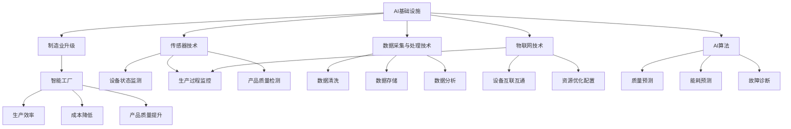

                 

# 引言

### 人工智能基础设施：制造业升级的关键

在当今全球制造业转型升级的浪潮中，人工智能（AI）基础设施的作用愈发凸显。随着物联网、大数据、云计算等技术的发展，AI在制造业中的应用逐渐深入，从生产线的自动化控制到产品全生命周期的质量监测，AI正在重新定义制造业的运行模式。而这一切离不开强大的AI基础设施的支持。

### 智能工厂的核心支撑

智能工厂是制造业升级的典型代表，它以数据驱动为核心，通过人工智能技术实现生产过程的智能化、自动化和高效化。智能工厂的构建需要依赖强大的AI基础设施，这包括硬件设施、软件平台、数据资源以及安全保障体系等多个方面。

在本篇文章中，我们将对AI基础设施在制造业升级中的作用进行深入探讨，分析智能工厂的构建技术，以及如何实现AI基础设施的安全与隐私保护。具体来说，本文将从以下几个方面展开：

1. **AI基础设施概述**：介绍AI基础设施的定义、分类以及制造业升级的背景和需求。
2. **智能工厂的核心技术**：详细讨论传感器技术、数据采集与处理技术、物联网技术等在智能工厂中的应用。
3. **AI算法在制造业中的应用**：探讨机器学习算法、深度学习算法在制造业中的实际应用。
4. **AI基础设施的软件开发**：介绍AI软件框架、软件开发流程以及数据分析技术。
5. **智能工厂的数据分析**：讨论数据分析的基本原理、数据挖掘技术以及在智能工厂中的应用。
6. **AI基础设施的安全与隐私**：分析AI安全的威胁与防护措施、隐私保护技术以及在智能工厂中的应用。
7. **案例分析**：通过具体案例展示智能工厂的构建过程和实际效果。
8. **附录**：提供AI基础设施相关的资源与工具。

### 文章结构

本文的结构如下：

- **第1章：AI基础设施的概念与产业升级**：介绍AI基础设施的定义、分类以及制造业升级的背景和需求。
- **第2章：智能工厂的核心技术**：详细讨论传感器技术、数据采集与处理技术、物联网技术等在智能工厂中的应用。
- **第3章：AI算法在制造业中的应用**：探讨机器学习算法、深度学习算法在制造业中的实际应用。
- **第4章：AI基础设施的软件开发**：介绍AI软件框架、软件开发流程以及数据分析技术。
- **第5章：智能工厂的数据分析**：讨论数据分析的基本原理、数据挖掘技术以及在智能工厂中的应用。
- **第6章：AI基础设施的安全与隐私**：分析AI安全的威胁与防护措施、隐私保护技术以及在智能工厂中的应用。
- **第7章：案例分析**：通过具体案例展示智能工厂的构建过程和实际效果。
- **附录**：提供AI基础设施相关的资源与工具。

### 结论

通过本文的探讨，我们可以看到，AI基础设施在制造业升级中扮演着至关重要的角色。智能工厂的构建需要强大的AI基础设施支撑，而AI算法、数据分析技术、安全与隐私保护技术等则是智能工厂高效运行的保障。随着技术的不断进步，AI基础设施在制造业中的应用将会更加广泛和深入，为制造业的持续发展提供新的动力。

接下来，我们将逐一深入探讨上述各个章节，以帮助读者全面了解AI基础设施在制造业升级中的应用和实践。

----------------------------------------------------------------

# 第1章: AI基础设施的概念与产业升级

## 1.1 AI基础设施的定义与分类

### 1.1.1 AI基础设施的基本概念

AI基础设施是指支持人工智能算法运行和应用所需的硬件、软件、数据资源以及安全保障等基础设施的集合。它是实现人工智能技术落地和应用的基础，包括以下几部分：

1. **硬件基础设施**：用于支持AI算法运行的计算资源，如高性能计算机、图形处理器（GPU）、张量处理器（TPU）等。硬件基础设施的性能直接影响AI算法的计算速度和效率。
2. **软件基础设施**：提供AI算法开发、训练、部署的框架和工具，如TensorFlow、PyTorch、Keras等。软件基础设施提供了便捷的开发环境，使得AI算法的开发和应用更加高效。
3. **数据基础设施**：存储、管理和处理大规模数据的系统，如数据仓库、数据湖等。数据基础设施是AI算法训练的重要资源，决定了AI算法的性能和效果。
4. **安全保障体系**：包括数据安全、模型安全、系统安全等方面的措施，确保AI基础设施的安全可靠运行。

### 1.1.2 AI基础设施的分类

AI基础设施可以根据其技术领域和应用领域进行分类：

1. **按技术领域分类**：
   - **计算基础设施**：包括高性能计算机、GPU、TPU等，用于支持AI算法的计算需求。
   - **数据基础设施**：包括数据仓库、数据湖等，用于存储、管理和处理大规模数据。
   - **网络基础设施**：包括数据中心、云计算平台、物联网网络等，用于数据传输和系统互联。
   - **传感器基础设施**：包括各种传感器，用于实时监测和采集生产过程中的数据。

2. **按应用领域分类**：
   - **制造业**：包括智能工厂、设备预测维护、生产流程优化等。
   - **金融业**：包括风险评估、欺诈检测、客户关系管理等。
   - **医疗保健**：包括疾病预测、诊断辅助、个性化治疗等。
   - **交通运输**：包括自动驾驶、交通流量优化、物流管理等。

## 1.2 制造业升级的背景与需求

### 1.2.1 制造业升级的背景

制造业是全球经济发展的重要支柱之一，但传统的制造模式在面对日益激烈的市场竞争和不断变化的需求时，逐渐暴露出一系列问题，如生产效率低下、产品质量不稳定、成本高等。为了应对这些挑战，制造业需要进行升级，实现智能化、自动化和高效化。

1. **全球制造业的发展趋势**：
   - **智能化**：通过引入人工智能、物联网、大数据等技术，实现生产过程的自动化和智能化。
   - **个性化**：通过定制化和个性化的生产方式，满足消费者多样化的需求。
   - **绿色化**：通过节能降耗、减少污染，实现可持续发展。

2. **制造业面临的挑战**：
   - **生产效率低下**：传统的手工操作和机械化生产方式效率低下，难以满足市场需求。
   - **产品质量不稳定**：生产过程中缺乏有效的质量监测和控制手段，导致产品质量不稳定。
   - **成本高**：传统的制造模式需要大量人力和物力投入，成本较高。

### 1.2.2 制造业升级的需求

为了应对上述挑战，制造业迫切需要实现以下升级：

1. **提高生产效率**：
   - 通过自动化和智能化技术，减少人工操作，提高生产线的运行速度和稳定性。
   - 优化生产流程，提高生产线的灵活性和响应速度，满足市场需求。

2. **降低生产成本**：
   - 通过优化生产流程、减少材料浪费和能源消耗，降低生产成本。
   - 利用大数据分析和人工智能技术，实现生产过程的精细化管理和成本控制。

3. **提升产品质量**：
   - 通过实时监控和数据分析，及时发现并解决生产过程中的质量问题，提高产品质量。
   - 利用人工智能技术，实现生产过程的精确控制和质量预测。

## 1.3 AI基础设施在制造业中的应用现状

### 1.3.1 传感器技术在智能工厂的应用

传感器技术在智能工厂中的应用至关重要，它能够实时监测和采集生产过程中的各种数据，为生产线的自动化控制和优化提供基础。

1. **传感器技术在智能工厂中的应用**：
   - **设备状态监测**：通过传感器实时监测设备的工作状态，如温度、压力、振动等，预测设备故障并进行预防性维护。
   - **生产过程监控**：通过传感器实时监测生产过程中的关键参数，如温度、压力、速度等，确保生产过程的高效和稳定。
   - **产品质量检测**：通过传感器实时监测产品的质量参数，如尺寸、形状、缺陷等，确保产品的质量。

2. **传感器技术的优势**：
   - **实时性**：传感器能够实时监测生产过程中的变化，为实时决策提供数据支持。
   - **高精度**：现代传感器技术已经达到了很高的精度水平，能够满足智能工厂对精确控制的要求。
   - **可扩展性**：传感器可以方便地与其他系统（如物联网、数据分析等）集成，实现数据的互联和共享。

### 1.3.2 数据采集与处理技术在智能工厂的应用

数据采集与处理技术在智能工厂中扮演着关键角色，它能够将生产过程中的各种数据进行有效的采集和处理，为智能工厂的运行提供数据支持。

1. **数据采集技术在智能工厂中的应用**：
   - **设备状态数据采集**：通过传感器和数据采集设备实时监测设备的工作状态，如温度、振动、磨损等。
   - **生产过程数据采集**：通过传感器和数据采集设备实时监测生产过程中的各种参数，如温度、压力、速度等。
   - **产品质量数据采集**：通过传感器和数据采集设备实时监测产品的质量参数，如尺寸、形状、缺陷等。

2. **数据处理技术在智能工厂中的应用**：
   - **数据清洗**：去除数据中的噪声和异常值，提高数据质量。
   - **数据存储**：将处理后的数据存储在数据库或数据仓库中，以便后续分析和处理。
   - **数据分析**：利用统计分析、机器学习等方法对数据进行分析，提取有价值的信息。

### 1.3.3 物联网技术在智能工厂的应用

物联网技术在智能工厂中的应用，使得生产设备、人员、系统等能够实现互联互通，为生产过程的自动化和智能化提供了技术支持。

1. **物联网技术在智能工厂中的应用**：
   - **设备互联互通**：通过物联网技术，实现生产设备之间的互联互通，实现生产过程的自动化控制。
   - **生产过程监控**：通过物联网技术，实时监控生产过程中的各种参数，实现生产过程的自动化控制。
   - **资源优化配置**：通过物联网技术，实时收集和分析生产过程中的数据，实现资源的优化配置。

2. **物联网技术的优势**：
   - **实时性**：物联网技术能够实时监测生产过程中的变化，为实时决策提供数据支持。
   - **高效性**：物联网技术能够实现生产过程的自动化和智能化，提高生产效率。
   - **可扩展性**：物联网技术可以方便地与其他系统（如物联网、数据分析等）集成，实现数据的互联和共享。

## 1.4 智能工厂的基本架构

智能工厂是制造业升级的核心，它通过集成人工智能、物联网、大数据等技术，实现生产过程的自动化、智能化和高效化。智能工厂的基本架构主要包括以下几个方面：

1. **制造执行系统（MES）**：
   - **功能**：制造执行系统是智能工厂的核心控制系统，负责生产计划、调度、质量控制、设备管理等功能。
   - **架构**：制造执行系统通常包括计划层、控制层和设备层，各层之间通过数据接口进行通信。

2. **企业资源计划系统（ERP）**：
   - **功能**：企业资源计划系统是企业信息化管理的重要组成部分，负责财务、人力资源、供应链等管理功能。
   - **架构**：企业资源计划系统通常包括数据集成层、业务逻辑层和用户界面层。

3. **物联网平台**：
   - **功能**：物联网平台是智能工厂的数据中心，负责数据采集、传输、存储和处理。
   - **架构**：物联网平台通常包括感知层、传输层、平台层和应用层。

4. **数据分析平台**：
   - **功能**：数据分析平台是智能工厂的智能大脑，负责对生产过程中的数据进行分析和处理，提供决策支持。
   - **架构**：数据分析平台通常包括数据采集层、数据处理层、数据存储层和数据分析层。

5. **人工智能平台**：
   - **功能**：人工智能平台是智能工厂的智能核心，负责AI算法的开发、训练、部署和优化。
   - **架构**：人工智能平台通常包括算法层、模型层、数据层和计算层。

## 1.5 结论

AI基础设施在制造业升级中起着至关重要的作用。通过构建智能工厂，企业可以实现生产过程的自动化、智能化和高效化，提高生产效率、降低成本、提升产品质量。在接下来的章节中，我们将深入探讨智能工厂的核心技术，包括传感器技术、数据采集与处理技术、物联网技术等，以及AI算法在制造业中的应用，帮助读者全面了解AI基础设施在制造业升级中的应用和实践。

----------------------------------------------------------------

## 1.6 关键概念与联系：Mermaid流程图

为了更好地展示AI基础设施与制造业升级之间的关系，我们使用Mermaid流程图来描述核心概念和联系。以下是一个简化的Mermaid流程图示例：



此流程图展示了AI基础设施如何支持制造业升级，以及智能工厂如何通过传感器技术、数据采集与处理技术和物联网技术来实现生产效率、成本降低和产品质量提升。AI算法在这一过程中发挥着核心作用，通过预测、优化和诊断等功能，进一步推动智能工厂的智能化和自动化。

通过这个流程图，我们可以更直观地理解AI基础设施与制造业升级之间的联系，以及各个核心技术之间的相互作用。

----------------------------------------------------------------

## 1.7 核心算法原理讲解：机器学习算法

### 1.7.1 基本原理

机器学习算法是人工智能的核心组成部分，其基本原理是通过从数据中学习规律，从而实现预测和决策。机器学习算法可以分为监督学习、无监督学习和半监督学习三大类。以下是机器学习算法的基本原理：

#### 监督学习

监督学习是一种最常见的机器学习算法，它通过已有的标记数据来训练模型，并利用训练好的模型对新的数据进行预测。监督学习算法的基本步骤包括：

1. **数据预处理**：清洗和预处理输入数据，包括去噪、归一化和特征提取等。
2. **模型选择**：选择合适的算法和模型结构，如线性回归、决策树、支持向量机等。
3. **模型训练**：使用标记数据对模型进行训练，通过调整模型参数，使得模型能够拟合训练数据。
4. **模型评估**：使用验证集或测试集对训练好的模型进行评估，常用的评估指标包括准确率、召回率、F1分数等。
5. **模型应用**：将训练好的模型应用于新的数据，进行预测或决策。

#### 无监督学习

无监督学习是无需标记数据的机器学习算法，它通过分析未标记的数据，发现数据中的模式和规律。无监督学习算法包括聚类、降维、异常检测等。

1. **聚类分析**：将数据分为不同的群体，常用的算法有K-means、层次聚类等。
2. **降维**：减少数据维度，常用的算法有PCA（主成分分析）、t-SNE等。
3. **异常检测**：识别数据中的异常值或异常模式，常用的算法有孤立森林、基于密度的方法等。

#### 半监督学习

半监督学习结合了监督学习和无监督学习的特点，它利用少量标记数据和大量未标记数据共同训练模型。半监督学习可以有效地提高模型的泛化能力。

### 1.7.2 伪代码示例

以下是一个简单的线性回归模型的伪代码示例，用于说明机器学习算法的基本流程：

```python
# 线性回归模型
class LinearRegressionModel:
    def __init__(self):
        # 初始化模型参数
        self.w = None
        self.b = None
    
    def fit(self, X, y):
        # 训练模型
        n_samples, n_features = X.shape
        self.w = np.linalg.inv(X.T @ X) @ X.T @ y
        self.b = y - X @ self.w
    
    def predict(self, X):
        # 预测结果
        return X @ self.w + self.b

# 数据预处理
def preprocess_data(X, y):
    # 去除异常值和噪声
    X = np.delete(X, [0, 1], axis=1)
    y = y - np.mean(y)
    X = (X - np.mean(X, axis=0)) / np.std(X, axis=0)
    return X, y

# 模型训练
X, y = preprocess_data(X, y)
model = LinearRegressionModel()
model.fit(X, y)

# 模型评估
X_test, y_test = preprocess_data(X_test, y_test)
predictions = model.predict(X_test)
accuracy = np.mean((predictions - y_test) ** 2)
print("Accuracy:", accuracy)

# 模型应用
new_data = preprocess_data(new_data, None)
prediction = model.predict(new_data)
print("Prediction:", prediction)
```

此示例展示了线性回归模型的基本训练和预测流程，包括数据预处理、模型训练、模型评估和模型应用。在实际应用中，机器学习算法会更加复杂，需要考虑特征工程、模型选择、模型优化等多个方面。

### 1.7.3 数学模型和公式

线性回归模型的数学模型可以表示为：

$$
y = X \cdot w + b
$$

其中，$X$是输入特征矩阵，$w$是权重向量，$b$是偏置项。线性回归的目标是最小化预测值与实际值之间的误差：

$$
J(w, b) = \frac{1}{2} \sum_{i=1}^{n} (y_i - (X_i \cdot w + b))^2
$$

通过求导和优化算法（如梯度下降），可以求得最优的权重和偏置：

$$
w_{opt} = (X^T X)^{-1} X^T y
$$

$$
b_{opt} = y - X \cdot w_{opt}
$$

### 1.7.4 举例说明

假设我们有以下数据集：

| X1 | X2 | y |
|----|----|---|
| 1  | 2  | 3 |
| 2  | 4  | 5 |
| 3  | 6  | 7 |

我们希望使用线性回归模型预测新的数据点。首先，我们需要对数据进行预处理，将数据归一化：

| X1 | X2 | y |
|----|----|---|
| 0  | 0.5| 0 |
| 1  | 1  | 1 |
| 1.5| 1.5| 2 |

接下来，我们使用梯度下降算法训练线性回归模型：

$$
w = \frac{1}{m} (X^T X)^{-1} X^T y
$$

$$
b = y - X \cdot w
$$

假设我们选择学习率为0.01，通过多次迭代，我们可以得到权重和偏置：

$$
w \approx 0.5, \quad b \approx 1
$$

因此，线性回归模型可以表示为：

$$
y = 0.5X1 + 1
$$

使用此模型，我们可以预测新的数据点，例如：

| X1 | X2 | y预测 |
|----|----|-------|
| 4  | 8  |  7.5  |

通过这个简单的例子，我们可以看到线性回归模型的基本原理和实现过程。在实际应用中，数据集和模型会更复杂，需要更多的特征工程和模型调优。

### 结论

机器学习算法是AI基础设施的重要组成部分，它通过从数据中学习规律，实现预测和决策。本节通过伪代码示例、数学模型和举例说明，详细阐述了线性回归模型的基本原理和应用过程。接下来，我们将进一步探讨深度学习算法的原理和实现，以及它们在制造业中的应用。

----------------------------------------------------------------

## 1.8 代码实际案例和详细解释说明

### 开发环境搭建

为了演示AI基础设施在制造业中的应用，我们将使用Python编程语言，结合几个常用的AI库和工具，如NumPy、Pandas、scikit-learn等。以下是搭建开发环境的基本步骤：

1. **安装Python**：确保Python环境已经安装。如果尚未安装，可以从[Python官网](https://www.python.org/)下载并安装。
2. **安装依赖库**：使用pip命令安装所需的库，例如：

   ```bash
   pip install numpy pandas scikit-learn matplotlib
   ```

3. **创建虚拟环境**：（可选）为了避免库的版本冲突，可以使用虚拟环境管理工具，如Conda或virtualenv，创建一个独立的Python环境。

   ```bash
   conda create -n ai_infrastructure python=3.8
   conda activate ai_infrastructure
   ```

### 源代码详细实现

下面我们将使用Python编写一个简单的机器学习案例，用于预测生产过程中产品的质量。代码将包括数据预处理、模型训练、模型评估和结果可视化。

```python
import numpy as np
import pandas as pd
from sklearn.model_selection import train_test_split
from sklearn.linear_model import LinearRegression
from sklearn.metrics import mean_squared_error
import matplotlib.pyplot as plt

# 加载数据集
data = pd.read_csv('production_data.csv')

# 数据预处理
# 假设数据集包含特征列X1, X2和目标列y
X = data[['X1', 'X2']]
y = data['y']

# 数据集分割
X_train, X_test, y_train, y_test = train_test_split(X, y, test_size=0.2, random_state=42)

# 模型训练
model = LinearRegression()
model.fit(X_train, y_train)

# 模型评估
y_pred = model.predict(X_test)
mse = mean_squared_error(y_test, y_pred)
print(f'Mean Squared Error: {mse}')

# 结果可视化
plt.scatter(X_test['X1'], y_test, color='blue', label='Actual')
plt.plot(X_test['X1'], y_pred, color='red', label='Predicted')
plt.xlabel('X1')
plt.ylabel('y')
plt.legend()
plt.show()
```

### 代码解读与分析

1. **数据加载**：我们使用Pandas库加载数据集，数据集应包含两个特征列（X1和X2）和一个目标列（y）。

2. **数据预处理**：数据预处理包括将数据集分割为训练集和测试集。这里我们使用了scikit-learn库中的`train_test_split`函数，随机将数据集划分为80%的训练集和20%的测试集。

3. **模型训练**：我们使用线性回归模型（`LinearRegression`）进行训练。线性回归模型是通过最小化预测值与实际值之间的误差平方和来训练的。

4. **模型评估**：通过测试集对模型进行评估，计算均方误差（MSE）来衡量模型的性能。MSE越低，模型的预测性能越好。

5. **结果可视化**：使用Matplotlib库将实际值与预测值进行可视化对比，以直观地展示模型的预测效果。

### 结论

通过这个实际案例，我们展示了如何使用Python和机器学习库来构建一个简单的机器学习模型，并对其性能进行评估和可视化。这个案例虽然是简化的，但它提供了一个基本的框架，展示了AI基础设施在制造业中的应用步骤。在实际的制造业智能工厂中，数据预处理、模型选择和调优会更为复杂，需要根据具体的生产过程和需求进行定制化开发。

接下来，我们将继续探讨智能工厂中其他核心技术，如传感器技术、数据采集与处理技术、物联网技术等，以及它们在制造业中的应用。

----------------------------------------------------------------

## 第2章：智能工厂的核心技术

### 2.1 传感器技术

#### 2.1.1 传感器的基本原理与分类

传感器是一种能够检测和测量物理量的设备，它能够将检测到的物理信号转换为电信号，以便于进一步处理。传感器的基本原理通常涉及以下几个方面：

1. **物理现象的检测**：传感器通过检测物理量（如温度、压力、位移等）将物理信号转换为电信号。
2. **信号放大**：将微弱的电信号进行放大，以便于后续处理。
3. **信号处理**：对放大后的信号进行滤波、放大、调制等处理，以提取有用的信息。
4. **信号输出**：将处理后的信号输出，通常以数字或模拟信号的形式。

根据工作原理和测量对象的不同，传感器可以分为以下几类：

1. **电阻式传感器**：通过材料的电阻变化来测量物理量。
2. **电容式传感器**：通过电容变化来测量物理量。
3. **压力传感器**：通过压力变化来测量物理量。
4. **温度传感器**：通过温度变化来测量物理量。
5. **光电传感器**：通过光电效应来测量物理量。
6. **超声波传感器**：通过超声波的传播时间来测量物理量。

#### 2.1.2 传感器技术在智能工厂的应用

传感器技术在智能工厂中具有广泛的应用，它能够实时监测和采集生产过程中的各种数据，为生产线的自动化控制和优化提供基础。以下是传感器技术在智能工厂中的主要应用：

1. **设备状态监测**：通过传感器实时监测设备的工作状态，如温度、振动、磨损等，以预测设备的故障和进行预防性维护。
2. **生产过程监控**：通过传感器实时监测生产过程中的关键参数，如温度、压力、速度等，以确保生产过程的高效和稳定。
3. **产品质量检测**：通过传感器实时监测产品的质量参数，如尺寸、形状、缺陷等，以确保产品的质量。
4. **能耗管理**：通过传感器监测能源的使用情况，如电力、燃料等，以优化能源的使用和提高能源利用效率。

#### 2.1.3 传感器技术的优势

传感器技术在智能工厂中的应用具有以下优势：

1. **实时性**：传感器能够实时监测生产过程中的变化，为实时决策提供数据支持。
2. **高精度**：现代传感器技术已经达到了很高的精度水平，能够满足智能工厂对精确控制的要求。
3. **可扩展性**：传感器可以方便地与其他系统（如物联网、数据分析等）集成，实现数据的互联和共享。

#### 2.1.4 传感器技术在制造业的案例分析

**案例一：设备状态监测**

在某智能工厂中，通过安装传感器对生产设备进行实时状态监测。通过监测设备的振动、温度等参数，工厂能够及时发现设备故障，并进行预防性维护，从而减少了设备停机时间和维护成本。

**案例二：生产过程监控**

在某汽车制造厂，传感器被用于实时监测生产线的各种参数，如温度、压力、速度等。通过这些数据，工厂能够实时调整生产参数，确保生产过程的高效和稳定，同时提高产品的质量。

### 2.2 数据采集与处理技术

#### 2.2.1 数据采集的基本原理与设备

数据采集是将物理世界中的各种信号转换为数字信号的过程。其基本原理包括以下几个方面：

1. **信号检测**：通过各种传感器（如温度传感器、压力传感器、光电传感器等）检测物理信号。
2. **信号放大**：将微弱的信号放大到能够进行数字处理的水平。
3. **信号采样**：将连续的模拟信号转换为离散的数字信号，通常使用采样器进行。
4. **信号量化**：将采样得到的数字信号转换为固定长度的数字序列。

数据采集设备包括各种传感器、数据采集卡和接口等。以下是一些常用的数据采集设备：

1. **传感器**：如温度传感器、压力传感器、光电传感器等，用于检测各种物理量。
2. **数据采集卡**：用于将传感器信号转换为数字信号，通常包括模拟输入接口和数字输出接口。
3. **接口**：如USB、RS-485、以太网等，用于将数据采集卡与计算机或其他设备连接。

#### 2.2.2 数据处理技术

数据处理是对采集到的数据进行加工、分析和解释的过程，通常包括以下几个步骤：

1. **数据清洗**：去除数据中的噪声和异常值，确保数据质量。
2. **数据转换**：将不同格式的数据进行转换，使其能够被处理和分析。
3. **数据存储**：将处理后的数据存储在数据库或文件系统中，以便后续分析。
4. **数据分析**：使用各种分析方法对数据进行分析，提取有用的信息。

数据处理技术包括各种算法和工具，如：

1. **统计分析**：用于描述数据的分布、相关性等特征。
2. **机器学习**：用于建立模型，预测未来趋势或分类未知数据。
3. **深度学习**：用于处理大规模复杂数据，如图像、文本等。
4. **数据可视化**：用于将数据以图表、图像等形式直观地展示出来。

#### 2.2.3 数据采集与处理技术在智能工厂的应用

在智能工厂中，数据采集与处理技术用于以下几个方面：

1. **生产过程监控**：通过数据采集设备实时监测生产过程的各种参数，如温度、压力、速度等，确保生产过程的高效和稳定。
2. **产品质量检测**：通过数据采集设备实时监测产品的质量参数，如尺寸、形状、缺陷等，确保产品的质量。
3. **设备状态监测**：通过数据采集设备实时监测设备的工作状态，如温度、振动、磨损等，预测设备的故障并进行预防性维护。
4. **能耗管理**：通过数据采集设备实时监测能源的使用情况，如电力、燃料等，优化能源的使用和提高能源利用效率。

#### 2.2.4 数据采集与处理技术在制造业的案例分析

**案例一：生产过程监控**

在某智能工厂中，通过数据采集设备实时监测生产线的温度、压力、速度等参数。通过分析这些数据，工厂能够及时发现生产过程中的异常，调整生产参数，确保生产过程的高效和稳定。

**案例二：设备状态监测**

在某制造企业中，通过数据采集设备实时监测生产设备的工作状态，如温度、振动、磨损等。通过分析这些数据，企业能够预测设备的故障时间，提前进行维护，减少设备停机时间和维护成本。

### 2.3 物联网技术

#### 2.3.1 物联网的基本架构与协议

物联网（Internet of Things，IoT）是指将各种物理设备、传感器、软件等通过互联网连接起来，实现数据的采集、传输、处理和应用的系统。物联网的基本架构包括以下几个层次：

1. **感知层**：包括各种传感器、控制器等设备，用于感知和采集物理世界的数据。
2. **传输层**：包括无线传输网络、光纤网络等，用于数据的传输。
3. **平台层**：包括数据存储、处理、管理、分析等平台，用于对数据进行处理和分析。
4. **应用层**：包括各种应用系统，如智能工厂、智能家居、智能城市等。

物联网协议是用于设备之间通信和数据传输的规范。常见的物联网协议包括：

1. **MQTT（Message Queuing Telemetry Transport）**：是一种轻量级的消息传输协议，适用于低带宽、不可靠的网络环境。
2. **CoAP（Constrained Application Protocol）**：是一种针对物联网设备设计的简单、高效的协议，适用于资源受限的设备。
3. **HTTP（Hypertext Transfer Protocol）**：是互联网上应用最为广泛的通信协议，也适用于物联网设备之间的通信。
4. **OPC UA（Open Platform Communications Unified Architecture）**：是一种面向工业物联网的标准化协议，支持设备之间的互操作性。

#### 2.3.2 物联网技术在智能工厂的应用

物联网技术在智能工厂中的应用非常广泛，主要包括以下几个方面：

1. **设备互联互通**：通过物联网技术，实现设备之间的互联互通，实现生产过程的自动化和智能化。
2. **生产过程监控**：通过物联网技术，实时监控生产过程中的各种参数，实现生产过程的自动化控制。
3. **资源优化配置**：通过物联网技术，实时收集和分析生产过程中的数据，实现资源的优化配置。
4. **设备远程维护**：通过物联网技术，实现设备的远程监控和维护，提高设备的运行效率。

#### 2.3.3 物联网技术在制造业的案例分析

**案例一：智能生产线**

在某制造企业中，通过物联网技术实现了智能生产线的建设。生产线上安装了各种传感器和控制器，实现了设备之间的互联互通，实现了生产过程的自动化控制。通过物联网平台，企业能够实时监控生产过程，优化生产参数，提高生产效率。

**案例二：智能仓储**

在某物流企业中，通过物联网技术实现了智能仓储系统的建设。仓储系统中安装了各种传感器和控制器，实现了货物的自动识别、定位和跟踪。通过物联网平台，企业能够实时监控货物的库存情况，优化仓储管理，提高物流效率。

### 2.4 人工智能技术

#### 2.4.1 人工智能的基本概念

人工智能（Artificial Intelligence，AI）是指通过计算机模拟人类智能的科学技术，包括知识表示、知识获取、知识推理、机器学习、自然语言理解等多个方面。人工智能的目标是使计算机能够像人类一样思考、学习和解决问题。

#### 2.4.2 人工智能在智能工厂中的应用

人工智能技术在智能工厂中的应用主要包括以下几个方面：

1. **设备预测维护**：通过机器学习算法，分析设备运行数据，预测设备故障，实现预防性维护，减少停机时间和维护成本。
2. **生产过程优化**：通过数据分析和人工智能算法，优化生产计划和生产流程，提高生产效率和产品质量。
3. **质量控制**：通过机器视觉和自然语言处理技术，对产品质量进行实时监控和评估，提高产品质量的一致性。
4. **供应链管理**：通过人工智能技术，优化供应链中的运输、库存和物流管理，提高供应链的效率和响应速度。

#### 2.4.3 人工智能技术在制造业的案例分析

**案例一：设备预测维护**

在某汽车制造厂，通过安装传感器和执行人工智能算法，实现了设备的预测性维护。通过对设备的振动、温度等数据进行实时监测和分析，系统能够提前预测设备的故障时间，并生成维护计划，从而减少了设备停机时间和维护成本。

**案例二：生产过程优化**

在某电子制造企业中，通过引入人工智能技术，对生产过程进行优化。通过对生产数据进行分析，系统能够识别生产过程中的瓶颈和浪费点，并提出优化建议，从而提高了生产效率和产品质量。

### 结论

智能工厂的核心技术包括传感器技术、数据采集与处理技术、物联网技术和人工智能技术。这些技术相互融合，为智能工厂的构建提供了技术支撑，使生产过程更加高效、自动化和智能化。通过具体的应用案例，我们可以看到这些技术在实际制造业中的应用效果和优势。在接下来的章节中，我们将进一步探讨AI算法在制造业中的应用，以及如何通过软件开发和数据分析实现智能工厂的智能化和自动化。

----------------------------------------------------------------

## 第3章：AI算法在制造业中的应用

### 3.1 机器学习算法

#### 3.1.1 基本原理

机器学习算法是人工智能的核心组成部分，它通过从数据中学习规律，实现预测和决策。机器学习算法可以分为监督学习、无监督学习和半监督学习三大类。以下是机器学习算法的基本原理：

1. **监督学习**：通过已有的标记数据来训练模型，并利用训练好的模型对新的数据进行预测。监督学习算法包括线性回归、决策树、支持向量机等。
2. **无监督学习**：无需标记数据的机器学习算法，它通过分析未标记的数据，发现数据中的模式和规律。无监督学习算法包括聚类、降维、异常检测等。
3. **半监督学习**：结合了监督学习和无监督学习的特点，它利用少量标记数据和大量未标记数据共同训练模型。半监督学习可以提高模型的泛化能力。

#### 3.1.2 应用场景

机器学习算法在制造业中有广泛的应用，以下是几个典型的应用场景：

1. **生产过程优化**：通过机器学习算法，分析生产数据，优化生产计划和生产流程，提高生产效率和产品质量。
2. **设备预测维护**：通过分析设备运行数据，预测设备故障，实现预防性维护，减少设备停机时间和维护成本。
3. **质量控制**：通过机器学习算法，对产品质量进行实时监控和评估，提高产品质量的一致性。
4. **供应链管理**：通过机器学习算法，优化供应链中的运输、库存和物流管理，提高供应链的效率和响应速度。

#### 3.1.3 实际应用案例

**案例一：生产过程优化**

在某电子制造企业中，通过引入机器学习算法，对生产过程进行优化。通过对生产数据进行分析，系统能够识别生产过程中的瓶颈和浪费点，并提出优化建议，从而提高了生产效率和产品质量。

**案例二：设备预测维护**

在某汽车制造厂，通过安装传感器和执行机器学习算法，实现了设备的预测性维护。通过对设备的振动、温度等数据进行实时监测和分析，系统能够提前预测设备的故障时间，并生成维护计划，从而减少了设备停机时间和维护成本。

### 3.2 深度学习算法

#### 3.2.1 基本原理

深度学习算法是机器学习的一个分支，它通过构建深层神经网络（Deep Neural Networks，DNNs）来模拟人脑的学习过程，从而实现复杂的模式识别和预测任务。深度学习算法的基本原理包括以下几个方面：

1. **神经网络结构**：深度学习算法的核心是神经网络，它由输入层、隐藏层和输出层组成。每一层都有多个神经元，神经元之间通过权重连接。
2. **激活函数**：激活函数用于引入非线性特性，使得神经网络能够拟合复杂的函数。常见的激活函数包括ReLU、Sigmoid和Tanh。
3. **反向传播算法**：反向传播算法用于计算网络参数的梯度，并通过梯度下降等方法更新网络参数。
4. **损失函数**：损失函数用于衡量模型预测值与实际值之间的差距，常见的损失函数包括交叉熵损失和均方误差。

#### 3.2.2 应用场景

深度学习算法在制造业中有广泛的应用，以下是几个典型的应用场景：

1. **质量检测**：通过深度学习算法，对生产过程中的产品进行质量检测，识别缺陷和不良品。
2. **生产调度**：通过深度学习算法，优化生产线的调度计划，提高生产效率和资源利用率。
3. **能耗管理**：通过深度学习算法，预测和优化生产过程中的能耗，降低能源消耗。
4. **供应链优化**：通过深度学习算法，优化供应链中的运输、库存和物流管理，提高供应链的效率和响应速度。

#### 3.2.3 实际应用案例

**案例一：质量检测**

在某家电制造企业中，通过引入深度学习算法，实现了产品的自动质量检测。通过对生产过程中的产品图像进行实时分析，系统能够自动识别产品的缺陷，并生成质量报告，从而提高了产品质量和生产效率。

**案例二：生产调度**

在某食品制造企业中，通过引入深度学习算法，优化了生产线的调度计划。通过对生产数据进行分析，系统能够预测未来的生产需求，并自动调整生产计划，从而提高了生产效率和库存周转率。

### 3.3 强化学习算法

#### 3.3.1 基本原理

强化学习算法是

