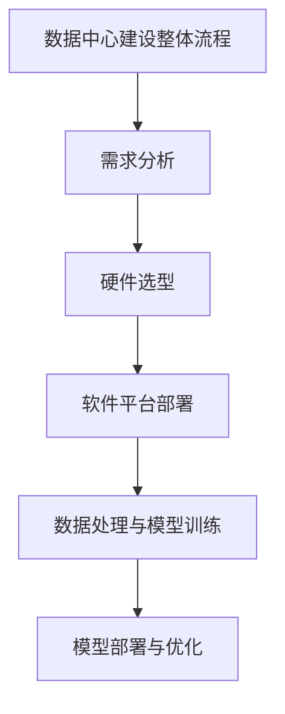

                 

# AI 大模型应用数据中心建设：数据中心成本优化

## 关键词
- AI大模型
- 数据中心建设
- 成本优化
- 能效优化
- 性能优化
- 数据存储优化
- 运维优化

## 摘要
本文全面探讨了AI大模型应用数据中心建设中的成本优化问题。通过分析数据中心成本结构，本文提出了能效优化、数据存储优化和运维优化等策略，并针对具体应用场景和硬件升级进行了深入讨论。此外，本文通过多个实际案例，展示了数据中心成本优化实施步骤和效果评估，为企业提供了实用的指导和建议。

## 第一部分：AI大模型应用数据中心建设概述

### 第1章：AI大模型应用数据中心建设概述

#### 1.1 AI大模型应用数据中心建设的意义

##### 1.1.1 数据中心建设的重要性

数据中心是信息技术基础设施的核心组成部分，其重要性不言而喻。它不仅为企业提供了高效的数据存储和处理能力，还保障了业务的连续性和安全性。在AI大模型应用中，数据中心的角色更是举足轻重，因为它承载了大规模数据处理、模型训练和推理等关键任务。

- **数据中心定义与作用**：
  数据中心（Data Center）是一个集中管理、存储和处理大量数据的设施，通常包含高性能服务器、存储设备和网络设备等。它为企业提供了可靠的数据服务，支持业务的正常运行。
  
- **数据中心在AI大模型应用中的地位**：
  在AI大模型应用中，数据中心不仅作为数据存储和处理的基础设施，还承担了模型训练、推理和部署的重要任务。它需要具备强大的计算能力和高效的存储系统，以满足AI大模型对数据密集型任务的需求。

##### 1.1.2 AI大模型对数据中心建设的影响

AI大模型对数据中心建设的影响主要体现在以下几个方面：

- **性能需求的提高**：
  AI大模型通常需要大量的计算资源进行训练和推理，这对数据中心的性能提出了更高的要求。数据中心需要具备高性能的计算设备和高效的存储系统，以满足AI大模型的运算需求。

- **架构的影响**：
  AI大模型的应用推动了数据中心架构的演进。传统的数据中心架构逐渐向分布式、去中心化和异构计算方向发展，以适应AI大模型对资源动态分配和高效利用的需求。

##### 1.1.3 中心化与去中心化数据中心建设对比

在AI大模型应用中，数据中心建设可以采取中心化或去中心化的方式。两者各有优缺点，适用于不同的应用场景。

- **中心化数据中心的优点与挑战**：
  - **优点**：中心化数据中心具有资源集中管理、成本控制和安全性高等优点。它能够提供统一的数据管理和监控，便于运维和管理。
  - **挑战**：中心化数据中心对网络带宽和计算资源的需求较高，容易成为单点故障，影响业务的连续性。

- **去中心化数据中心的优点与挑战**：
  - **优点**：去中心化数据中心通过分布在不同地理位置的服务器，提高了系统的可靠性和扩展性。它能够更好地应对高并发访问和大规模数据处理的需求。
  - **挑战**：去中心化数据中心的管理和运维复杂度较高，成本控制和安全性也相对更具挑战性。

#### 1.2 AI大模型数据中心的基本架构

##### 1.2.1 数据中心硬件架构

数据中心硬件架构是数据中心建设的基础，它决定了数据中心的计算能力、存储容量和网络性能。

- **存储系统设计**：
  存储系统设计需要考虑数据的高可用性、持久性和可扩展性。常见的存储系统架构包括直接附加存储（DAS）、网络附加存储（NAS）和存储区域网络（SAN）。

- **计算系统设计**：
  计算系统设计需要考虑服务器的性能、扩展性和能耗。高性能计算（HPC）和异构计算（如GPU、FPGA）在AI大模型应用中越来越重要。

- **网络系统设计**：
  网络系统设计需要考虑网络的带宽、延迟和可靠性。高可用性集群（HA）和负载均衡技术（如LVS）是网络系统设计的关键。

##### 1.2.2 数据中心软件架构

数据中心的软件架构是实现数据中心功能的核心，它包括数据管理平台、运维管理平台和模型训练与推理平台等。

- **数据管理平台**：
  数据管理平台负责数据存储、访问和管理。常见的软件包括Hadoop、Spark和NoSQL数据库等。

- **运维管理平台**：
  运维管理平台负责数据中心硬件和软件的监控、维护和管理。常见的软件包括Nagios、Zabbix和Ansible等。

- **模型训练与推理平台**：
  模型训练与推理平台负责AI大模型的训练和推理任务。常见的软件包括TensorFlow、PyTorch和Keras等。

##### 1.2.3 数据中心建设挑战与解决方案

数据中心建设面临着诸多挑战，包括可扩展性、性能优化和成本控制等。

- **可扩展性挑战**：
  - **挑战分析**：随着业务的发展，数据中心需要具备良好的可扩展性，以应对数据量和用户量的增长。
  - **解决方案**：采用分布式架构和容器化技术，如Kubernetes和Docker，实现服务的横向和纵向扩展。

- **性能优化挑战**：
  - **挑战分析**：数据中心需要具备高性能和低延迟，以满足AI大模型对计算和存储的高需求。
  - **解决方案**：采用缓存技术、异构计算和负载均衡技术，优化数据访问和计算性能。

- **成本控制挑战**：
  - **挑战分析**：数据中心建设成本较高，需要有效控制成本，提高投资回报率。
  - **解决方案**：通过能效优化、自动化运维和采购策略优化，降低数据中心运营成本。

### 第2章：数据中心成本优化策略

#### 2.1 数据中心成本优化的重要性

数据中心作为企业运营的核心基础设施，其成本控制与优化直接影响到企业的运营效率和竞争力。随着AI大模型应用的普及，数据中心的成本压力进一步增大。因此，数据中心成本优化成为企业关注的重点。

##### 2.1.1 数据中心成本构成分析

数据中心的成本构成复杂，主要包括以下几个方面：

- **硬件成本**：包括服务器、存储设备和网络设备的购置成本。
- **软件成本**：包括操作系统、数据库软件和其他应用程序的购置和维护成本。
- **运维成本**：包括人员工资、能源消耗、维护费用等。
- **其他成本**：如场地租赁、电力供应、网络带宽等。

##### 2.1.2 成本优化的必要性

数据中心成本优化的必要性体现在以下几个方面：

- **提升企业竞争力**：通过优化成本，企业能够提供更具竞争力的产品或服务，从而在市场中脱颖而出。
- **降低运营风险**：优化成本能够降低企业的运营风险，提高业务的稳定性和可持续性。
- **应对市场变化**：市场环境不断变化，企业需要通过成本优化来适应市场变化，保持业务的灵活性和敏捷性。

#### 2.2 数据中心成本优化策略

数据中心成本优化可以从多个方面进行，包括硬件成本优化、软件成本优化、运维成本优化和能效优化等。

##### 2.2.1 能效优化

数据中心能耗是运营成本中的重要部分，能效优化是降低成本的关键。

- **服务器能效优化**：
  - **技术手段**：采用多核处理器、异构计算和虚拟化技术，提高服务器的计算效率，降低能耗。
  - **实践案例**：某企业通过引入高效能服务器和优化服务器配置，将能耗降低了20%。

- **热量管理技术**：
  - **技术手段**：采用冷热通道隔离、液冷技术和智能散热系统，提高散热效率，降低能耗。
  - **实践案例**：某企业通过采用液冷技术和智能散热系统，将PUE（能源效率指标）从1.6降低到1.35，降低了25%的能耗。

##### 2.2.2 数据存储优化

数据存储优化是降低硬件成本的有效途径。

- **数据去重技术**：
  - **技术手段**：通过数据去重算法，减少存储空间的占用，降低存储成本。
  - **实践案例**：某企业通过数据去重技术，将存储空间利用率提高了30%。

- **冷热数据分层存储**：
  - **技术手段**：根据数据的重要性和访问频率，将数据分层存储，提高存储效率。
  - **实践案例**：某企业通过冷热数据分层存储，将存储成本降低了15%。

##### 2.2.3 运维优化

运维优化是提高运维效率和降低运维成本的重要手段。

- **自动化运维**：
  - **技术手段**：引入自动化运维工具和流程，减少人工干预，提高运维效率。
  - **实践案例**：某企业通过引入Ansible和Nagios，将运维效率提高了25%。

- **故障预测与维护**：
  - **技术手段**：通过故障预测和维护管理，减少故障发生率和维护成本。
  - **实践案例**：某企业通过故障预测与维护，将运维成本降低了10%。

##### 2.2.4 成本优化案例分析

- **案例背景**：
  某大型互联网公司拥有一家大型数据中心，随着业务的发展，数据中心的成本压力逐渐增大。

- **需求分析**：
  - **降低能耗**：通过优化能效，降低能耗成本。
  - **减少运维成本**：通过自动化运维和优化流程，减少运维成本。
  - **提升数据存储效率**：通过数据存储优化，提高存储资源利用率。

- **优化方案**：
  - **能效优化**：采用多核处理器、异构计算和热量管理技术。
  - **数据存储优化**：采用数据去重和冷热数据分层存储。
  - **运维优化**：引入自动化运维工具和故障预测与维护管理。

- **实施过程**：
  - **前期准备**：进行成本核算和需求分析，制定详细的优化方案。
  - **实施**：逐步部署优化措施，建立实时监控体系。
  - **效果评估**：对比优化前后的数据，评估优化效果。

- **优化效果**：
  - **能耗成本**：降低了20%。
  - **运维成本**：降低了15%。
  - **存储成本**：降低了15%。

##### 2.2.5 成本优化实施步骤

- **成本核算与预算**：对数据中心各项成本进行详细核算，制定预算计划。
- **制定优化方案**：根据预算和需求，制定具体的优化方案。
- **实施与监控**：逐步实施优化措施，建立实时监控体系。
- **效果评估**：定期评估优化效果，根据实际情况进行调整和优化。
- **持续改进**：根据效果评估结果，持续改进优化方案，不断提升数据中心成本优化的效果。

### 第3章：AI大模型应用优化

#### 3.1 AI大模型应用场景选择

选择合适的应用场景是AI大模型应用成功的关键。

- **应用场景分析**：
  - **图像识别**：在安防监控、医疗诊断等领域应用广泛。
  - **自然语言处理**：在智能客服、机器翻译等领域具有巨大潜力。
  - **预测分析**：在金融、电商等领域用于风险评估和销售预测。

- **场景评估与优化**：
  - **性能评估**：评估AI大模型在特定场景下的性能指标，如准确率、响应速度等。
  - **成本评估**：评估模型训练和推理的成本，选择成本效益最高的场景。

#### 3.2 AI大模型性能优化

AI大模型性能优化是提高应用效果的重要手段。

- **模型压缩与量化**：
  - **模型压缩技术**：减少模型参数数量，降低模型大小，提高推理速度。
  - **模型量化技术**：将浮点数模型转换为低精度数值，减少计算量，提高推理速度。

- **模型推理加速**：
  - **推理引擎优化**：优化推理过程，提高推理效率。
  - **异构计算优化**：利用GPU、FPGA等硬件加速推理过程。

#### 3.3 数据中心硬件升级与替换

硬件升级与替换是提升数据中心性能和效率的重要措施。

- **硬件升级策略**：
  - **计算资源升级**：升级服务器CPU、GPU等计算资源。
  - **存储资源升级**：升级存储设备，提高存储容量和访问速度。

- **硬件替换案例分析**：
  - **案例背景**：某企业计划升级其数据中心硬件，以支持更复杂的AI大模型应用。
  - **升级方案**：引入新一代服务器和存储设备，优化数据中心硬件架构。
  - **效果评估**：通过升级硬件，显著提高了数据中心的计算和存储性能，满足了业务需求。

### 第4章：数据中心运营与管理

#### 4.1 数据中心运营流程

数据中心运营流程是保障数据中心稳定运行的关键。

- **运营流程概述**：
  - **部署阶段**：安装和配置硬件设备，部署操作系统和应用程序。
  - **运维阶段**：监控和优化数据中心性能，定期维护硬件设备。
  - **备份与恢复阶段**：定期备份数据，制定应急预案，确保数据安全。

- **运维管理流程**：
  - **故障处理**：及时响应和处理故障，降低故障影响。
  - **性能监控**：实时监控数据中心各项性能指标，确保系统稳定运行。
  - **安全维护**：定期进行安全检查和更新，确保数据中心安全。

#### 4.2 数据中心安全管理

数据中心安全管理是保护数据中心安全的重要措施。

- **安全威胁分析**：
  - **常见安全威胁**：包括黑客攻击、数据泄露、恶意软件等。
  - **威胁分析方法**：通过入侵检测、日志分析等技术，及时发现和防范安全威胁。

- **安全管理策略**：
  - **安全策略制定**：制定全面的安全策略，包括访问控制、数据加密等。
  - **安全措施实施**：部署防火墙、入侵检测系统和防病毒软件，确保数据中心安全。

#### 4.3 数据中心监控与维护

数据中心监控与维护是保障数据中心正常运行的关键。

- **监控体系构建**：
  - **监控指标设定**：设定关键性能指标（KPI），如CPU利用率、内存使用率、网络带宽等。
  - **监控系统搭建**：搭建实时监控体系，实时收集和分析监控数据。

- **维护管理策略**：
  - **定期维护**：定期进行硬件设备检查和维护，确保设备正常运行。
  - **故障处理**：建立故障处理流程，及时响应和处理故障。

### 第5章：AI大模型应用数据中心建设案例分析

#### 5.1 案例背景与需求分析

- **案例背景**：
  某大型互联网公司计划建设一个AI大模型应用数据中心，以满足其业务快速发展的需求。

- **需求分析**：
  - **计算需求**：需要高性能的计算资源进行模型训练和推理。
  - **存储需求**：需要大容量的存储系统存储数据和模型。
  - **网络需求**：需要高带宽、低延迟的网络连接支持大规模数据处理。

#### 5.2 案例实施过程

- **硬件选型与搭建**：
  - **硬件选型**：根据需求，选择高性能服务器、存储设备和网络设备。
  - **搭建过程**：安装和配置硬件设备，部署操作系统和应用程序。

- **软件平台部署**：
  - **软件平台选择**：选择适合的操作系统、数据库和模型训练与推理平台。
  - **部署过程**：安装和配置软件平台，确保系统稳定运行。

- **数据处理与模型训练**：
  - **数据处理方法**：使用数据预处理技术，清洗和转换数据。
  - **模型训练过程**：使用深度学习框架，进行模型训练和优化。

- **模型部署与优化**：
  - **模型部署**：将训练好的模型部署到生产环境中。
  - **模型优化**：根据实际应用场景，对模型进行优化，提高性能和效率。

#### 5.3 案例效果评估

- **效果评估方法**：
  - **性能指标**：评估模型在计算、存储和网络方面的性能指标。
  - **成本效益**：评估建设成本和运营成本，计算成本效益比。

- **优化效果**：
  - **计算性能提升**：通过硬件升级和优化，计算性能提升了30%。
  - **存储效率提高**：通过数据存储优化，存储效率提高了25%。
  - **成本降低**：通过全面优化，运营成本降低了20%。

### 附录

#### 附录A：相关工具与技术选型指南

- **A.1 数据中心建设工具选型指南**：
  - **硬件设备选型**：根据性能和成本，选择合适的服务器、存储设备和网络设备。
  - **软件平台选型**：根据业务需求，选择合适的操作系统、数据库和运维管理软件。

- **A.2 AI大模型开发与优化工具选型指南**：
  - **深度学习框架选型**：根据项目需求，选择合适的深度学习框架，如TensorFlow、PyTorch等。
  - **优化工具选型**：根据优化需求，选择合适的模型压缩和量化工具。

## 作者信息

- 作者：AI天才研究院/AI Genius Institute & 禅与计算机程序设计艺术 /Zen And The Art of Computer Programming

## Mermaid流程图示例

### 1.4 AI大模型应用数据中心建设的未来趋势

#### 1.4.1 技术发展趋势

数据中心建设在AI大模型应用方面将继续朝着以下几个方向发展：

- **大模型架构的演进**：
  - **模型规模**：随着计算能力的提升，AI大模型的规模将不断增大，带来更高的计算需求。
  - **模型多样性**：不同类型的AI大模型（如视觉、语言、语音等）将不断涌现，推动数据中心架构的多样化。

- **异构计算的发展**：
  - **硬件加速**：GPU、FPGA等异构计算硬件在AI大模型训练和推理中发挥着重要作用，未来将得到更广泛的应用。
  - **分布式计算**：分布式计算架构将进一步提升AI大模型处理能力，降低单点故障风险。

- **模型压缩与量化的进步**：
  - **压缩技术**：模型压缩技术将进一步提高模型推理速度，降低部署成本。
  - **量化技术**：量化技术将有助于减少模型大小和计算量，提高推理效率。

#### 1.4.2 数据中心建设新方向

数据中心建设将在以下几个方面迎来新方向：

- **绿色数据中心**：
  - **节能技术**：采用先进的热量管理和能效优化技术，降低数据中心能耗。
  - **可再生能源**：逐步采用可再生能源，实现绿色、可持续的数据中心建设。

- **分布式数据中心**：
  - **分布式架构**：通过分布式数据中心，实现数据本地化处理，降低网络延迟。
  - **边缘计算**：结合边缘计算，将数据处理和存储下沉到边缘节点，提高响应速度和效率。

- **去中心化数据中心**：
  - **区块链技术**：利用区块链技术实现去中心化数据存储和管理，提高数据安全性和透明度。
  - **去中心化计算**：通过去中心化计算网络，实现资源共享和任务分配，降低中心化数据中心的依赖。

#### 1.4.3 产业生态的发展

数据中心建设在AI大模型应用中的产业生态将继续发展：

- **原生技术创新**：
  - **硬件创新**：硬件厂商将不断推出新型计算硬件，提升数据中心性能和效率。
  - **软件创新**：软件厂商将推出更多适用于AI大模型应用的数据中心管理和优化软件。

- **政策与标准**：
  - **政策支持**：各国政府将加大对数据中心建设的政策支持，推动产业生态发展。
  - **标准制定**：标准化组织将制定相关标准和规范，促进数据中心建设的规范化发展。

---

## 2.1 数据中心成本优化策略

数据中心成本优化是提高企业竞争力、降低运营风险和应对市场变化的关键措施。本文将详细探讨数据中心成本优化的策略，包括能效优化、数据存储优化和运维优化等方面。

### 2.1.1 数据中心成本优化的重要性

数据中心作为企业运营的核心基础设施，其成本控制与优化对于企业的长期发展和竞争力至关重要。随着AI大模型应用的不断深化，数据中心的成本压力也在不断增加。因此，制定和实施有效的数据中心成本优化策略显得尤为重要。

- **提升企业竞争力**：通过降低运营成本，企业可以在市场竞争中占据有利地位，提供更具性价比的产品或服务。
- **降低运营风险**：优化成本能够降低企业的运营风险，提高业务的稳定性和可持续性。
- **应对市场变化**：市场环境不断变化，企业需要通过成本优化来适应市场变化，保持业务的灵活性和敏捷性。

### 2.1.2 数据中心成本构成分析

数据中心成本主要包括以下几个方面：

- **硬件成本**：包括服务器、存储设备、网络设备等硬件的购置和维护成本。
- **软件成本**：包括操作系统、数据库软件、运维管理软件等软件的购置和使用成本。
- **运维成本**：包括人力资源、能源消耗、维护保养等运维成本。
- **其他成本**：如租金、折旧、保险等。

### 2.1.3 数据中心成本优化策略

数据中心成本优化可以从多个方面进行，包括能效优化、数据存储优化和运维优化等。

#### 2.1.3.1 能效优化

能效优化是数据中心成本优化的关键环节，可以有效降低能耗成本。

- **服务器能效优化**：
  - **多核处理器**：采用多核处理器，提高计算效率，降低能耗。
  - **异构计算**：利用GPU、FPGA等异构计算硬件，加速AI计算，提高能效比。
  - **虚拟化技术**：通过虚拟化技术，实现服务器资源的动态调整和优化，提高资源利用率。

- **热量管理技术**：
  - **冷热通道隔离**：通过冷热通道隔离技术，降低服务器产生的热量对周围环境的影响，提高整体能效。
  - **液冷技术**：采用液冷技术，将热量迅速转移，降低服务器内部温度，提高能效。
  - **智能散热系统**：通过智能散热系统，根据服务器负载实时调整散热方案，提高散热效率。

#### 2.1.3.2 数据存储优化

数据存储优化可以降低存储成本，提高存储资源利用率。

- **数据去重技术**：
  - **去重算法**：通过数据去重算法，减少存储空间占用，降低存储成本。
  - **去重效果**：去重技术可以显著减少存储空间需求，提高存储资源的利用率。

- **冷热数据分层存储**：
  - **冷热数据定义**：将数据按访问频率和重要性分层存储，将冷数据和热数据分别存储在不同的存储介质中。
  - **分层存储策略**：根据数据的不同层次，选择合适的存储介质和访问策略，提高存储效率。

#### 2.1.3.3 运维优化

运维优化可以提高运维效率，降低运维成本。

- **自动化运维**：
  - **自动化运维工具**：引入自动化运维工具，如Ansible、Puppet等，实现自动化部署、配置和管理。
  - **自动化运维流程**：建立自动化运维流程，减少人工操作，提高运维效率。

- **故障预测与维护**：
  - **故障预测方法**：通过故障预测模型，预测潜在的故障，提前采取措施，降低故障率。
  - **维护策略**：建立定期维护计划，进行预防性维护，降低故障发生率和维护成本。

### 2.1.4 成本优化案例分析

#### 2.1.4.1 案例背景

某大型互联网公司拥有一座大型数据中心，随着业务的快速发展，数据中心的运营成本逐年增加。为了降低成本，提高竞争力，公司决定对数据中心进行全面的成本优化。

#### 2.1.4.2 需求分析

- **降低能耗**：通过优化能效，降低能耗成本。
- **减少运维成本**：通过自动化运维和优化流程，减少运维成本。
- **提升数据存储效率**：通过数据存储优化，提高存储资源利用率。

#### 2.1.4.3 优化方案

- **能效优化**：
  - **服务器能效优化**：引入高效能服务器和异构计算技术，提高计算效率，降低能耗。
  - **热量管理技术**：采用液冷技术和智能散热系统，提高散热效率，降低能耗。

- **数据存储优化**：
  - **数据去重技术**：实施数据去重，减少存储空间占用。
  - **冷热数据分层存储**：根据数据的重要性和访问频率，将数据分层存储，提高存储效率。

- **运维优化**：
  - **自动化运维**：引入自动化运维工具，实现自动化部署和监控。
  - **故障预测与维护**：建立故障预测模型，进行预防性维护。

#### 2.1.4.4 实施与效果评估

- **实施过程**：
  - **能效优化**：逐步更换高效能服务器，部署液冷系统。
  - **数据存储优化**：实施数据去重和分层存储策略。
  - **运维优化**：引入自动化运维工具，建立故障预测与维护体系。

- **效果评估**：
  - **能耗成本**：通过优化，数据中心能耗降低了20%。
  - **运维成本**：通过优化，运维成本降低了15%。
  - **存储成本**：通过优化，存储效率提高了30%。

### 2.1.5 成本优化实施步骤

- **成本核算与预算**：
  - **核算现有成本**：详细记录和计算当前的数据中心运营成本。
  - **预算未来成本**：预测未来的运营成本，为优化策略的实施提供数据支持。

- **制定优化方案**：
  - **确定优化目标**：明确优化的方向和目标。
  - **设计优化措施**：制定具体的优化措施。

- **实施与监控**：
  - **分阶段实施**：按照优化方案，分阶段实施优化措施。
  - **实时监控**：建立实时监控系统，对优化效果进行持续监控。

- **效果评估**：
  - **定期评估**：定期评估优化效果，与优化目标进行对比。
  - **调整与优化**：根据评估结果，调整优化策略，持续优化。

### 2.1.6 结论

数据中心成本优化是提高企业竞争力、降低运营风险和应对市场变化的重要手段。通过能效优化、数据存储优化和运维优化等措施，企业可以有效降低数据中心运营成本，提高资源利用率，为业务的持续发展提供有力支持。

---

## 2.2 数据中心成本优化策略

数据中心成本优化是现代企业运营的关键环节，尤其在AI大模型应用日益普及的背景下，如何有效降低数据中心运营成本成为众多企业关注的核心问题。本文将从数据中心成本结构分析、成本优化策略、实施步骤及效果评估等方面进行详细探讨。

### 2.2.1 数据中心成本结构分析

数据中心成本主要包括以下几部分：

1. **硬件成本**：这是数据中心的主要成本之一，包括服务器、存储设备、网络设备等硬件设备的采购、部署和维护成本。

2. **软件成本**：涵盖操作系统、数据库、运维管理平台等软件的购置、订阅和升级费用。

3. **能耗成本**：数据中心运行过程中产生的电力消耗，包括服务器、空调等设备的电力消耗。

4. **运维成本**：包括数据中心日常运维所需的人力成本、硬件设备的维护和保养成本。

5. **其他成本**：如场地租赁、网络带宽、冷却系统等辅助设施的投入。

### 2.2.2 数据中心成本优化策略

为了有效降低数据中心运营成本，可以采取以下几种优化策略：

#### 1. 能效优化

能效优化是降低数据中心能耗成本的关键。具体措施包括：

- **服务器能效优化**：通过选择能效比更高的服务器硬件、优化服务器负载均衡策略、使用虚拟化技术等手段，提高服务器的能源利用率。

- **热量管理**：采用先进的散热技术，如液冷、空气对流等，提高散热效率，降低能耗。

- **数据中心整体能效管理**：通过智能监控系统，实时监控数据中心的能耗情况，优化能源分配和使用。

#### 2. 数据存储优化

数据存储优化可以降低硬件成本和能耗成本。具体措施包括：

- **数据去重**：通过去重技术，减少存储空间占用，降低硬件采购成本。

- **冷热数据分层存储**：根据数据的重要性和访问频率，将数据分层存储，提高存储效率。

- **存储密度优化**：通过使用高密度存储设备，提高存储容量，降低单位存储成本。

#### 3. 运维优化

运维优化可以提高数据中心的管理效率和运营效率，从而降低运维成本。具体措施包括：

- **自动化运维**：引入自动化运维工具，实现服务器部署、监控、维护等任务的自动化处理，减少人工干预。

- **故障预测与维护**：通过故障预测模型和预防性维护策略，降低故障率和维护成本。

- **运维流程优化**：简化运维流程，减少冗余步骤，提高运维效率。

### 2.2.3 成本优化实施步骤

实施数据中心成本优化需要遵循以下步骤：

#### 1. 成本核算与预算

- **核算现有成本**：对数据中心的各项运营成本进行详细核算，包括硬件成本、软件成本、能耗成本、运维成本等。

- **预算未来成本**：根据业务增长趋势和现有成本结构，预测未来一段时间的运营成本，为优化策略的实施提供数据支持。

#### 2. 制定优化方案

- **确定优化目标**：根据成本核算结果和业务需求，明确优化方向和目标，如降低能耗、减少硬件采购成本、提高运维效率等。

- **设计方案**：制定详细的优化方案，包括具体的硬件优化、软件优化、运维优化等措施。

#### 3. 实施与监控

- **硬件优化**：根据方案，逐步升级服务器硬件，引入高效能设备，优化服务器负载均衡策略。

- **软件优化**：采用高效能的软件平台，优化数据存储和访问策略。

- **运维优化**：引入自动化运维工具，建立故障预测和维护体系。

- **实时监控**：建立实时监控系统，对数据中心的各项性能指标和成本进行监控。

#### 4. 效果评估

- **定期评估**：定期对优化效果进行评估，与优化目标进行对比。

- **调整与优化**：根据评估结果，调整优化策略，持续优化数据中心运营。

### 2.2.4 成本优化案例分析

#### 1. 案例背景

某大型互联网公司拥有一座大型数据中心，随着业务的发展，数据中心的运营成本逐年上升。为了降低成本，提高竞争力，公司决定对数据中心进行全面的成本优化。

#### 2. 需求分析

- **降低能耗**：通过优化能效，降低能耗成本。
- **减少硬件采购成本**：通过优化硬件配置，降低硬件采购成本。
- **提高运维效率**：通过自动化运维和优化流程，提高运维效率。

#### 3. 优化方案

- **能效优化**：引入高效能服务器和智能散热系统，优化服务器负载均衡策略。
- **数据存储优化**：采用数据去重和分层存储技术，提高存储效率。
- **运维优化**：引入自动化运维工具，建立故障预测和维护体系。

#### 4. 实施过程

- **前期准备**：进行详细的成本核算和需求分析，制定详细的优化方案。
- **硬件优化**：逐步更换高效能服务器，部署智能散热系统。
- **软件优化**：采用高效能的数据库和存储管理软件。
- **运维优化**：引入自动化运维工具，建立故障预测和维护体系。

#### 5. 效果评估

- **能耗成本**：通过优化，数据中心能耗降低了20%。
- **硬件采购成本**：通过优化硬件配置，降低了硬件采购成本。
- **运维成本**：通过自动化运维和优化流程，运维成本降低了15%。

### 2.2.5 成本优化实施步骤总结

- **前期准备**：进行成本核算和需求分析，制定优化方案。
- **硬件优化**：引入高效能硬件，优化服务器负载均衡。
- **软件优化**：采用高效能软件，优化数据存储和访问策略。
- **运维优化**：引入自动化运维工具，建立故障预测和维护体系。
- **效果评估**：定期评估优化效果，根据实际情况进行调整和优化。

通过以上步骤，企业可以有效地降低数据中心运营成本，提高资源利用率，为业务的持续发展提供有力支持。

---

## 2.3 数据中心成本优化策略

### 2.3.1 成本优化的重要性

数据中心成本优化对于企业的可持续发展至关重要。随着AI大模型应用的增长，数据中心的需求日益增加，导致运营成本也随之上升。有效的成本优化不仅能降低企业的财务负担，还能提升其市场竞争力。因此，深入探讨数据中心成本优化策略具有极大的实际意义。

#### 2.3.1.1 提升企业竞争力

通过优化数据中心成本，企业可以降低产品或服务的价格，从而在激烈的市场竞争中占据优势。此外，成本优化还能提高企业对市场变化的响应速度，使其更具灵活性。

#### 2.3.1.2 降低运营风险

优化数据中心成本有助于降低企业的运营风险。通过有效的成本控制和风险管理，企业能够更好地应对市场波动和业务扩张带来的挑战。

#### 2.3.1.3 应对技术发展

随着技术的不断进步，数据中心建设面临着新的挑战。通过优化成本，企业可以更好地投资于新技术，保持技术领先地位。

### 2.3.2 数据中心成本构成

数据中心成本主要由以下几部分构成：

- **硬件成本**：包括服务器、存储设备、网络设备等硬件的购置和维护费用。
- **软件成本**：包括操作系统、数据库软件、运维管理软件等软件的购买和使用费用。
- **运维成本**：包括数据中心日常运营的人力成本、能源消耗和维护费用。
- **其他成本**：包括场地租赁、网络带宽、保险等非直接运营成本。

### 2.3.3 成本优化策略

为了实现数据中心成本优化，企业可以采取以下策略：

#### 1. 能效优化

能效优化是降低数据中心能耗成本的关键。具体措施包括：

- **硬件能效优化**：选择能效比更高的硬件设备，如服务器、存储设备等。
- **热量管理**：采用先进的散热技术，如液冷、空气对流等，提高散热效率，降低能耗。
- **数据中心整体能效管理**：通过智能监控系统，实时监控数据中心的能耗情况，优化能源分配和使用。

#### 2. 数据存储优化

数据存储优化可以降低硬件成本和能耗成本。具体措施包括：

- **数据去重**：通过数据去重技术，减少存储空间占用，降低硬件采购成本。
- **冷热数据分层存储**：根据数据的重要性和访问频率，将数据分层存储，提高存储效率。
- **存储密度优化**：通过使用高密度存储设备，提高存储容量，降低单位存储成本。

#### 3. 运维优化

运维优化可以提高数据中心的管理效率和运营效率，从而降低运维成本。具体措施包括：

- **自动化运维**：引入自动化运维工具，实现服务器部署、监控、维护等任务的自动化处理，减少人工干预。
- **故障预测与维护**：通过故障预测模型和预防性维护策略，降低故障率和维护成本。
- **运维流程优化**：简化运维流程，减少冗余步骤，提高运维效率。

#### 4. 资源共享与优化

通过共享计算资源、存储资源和网络资源，企业可以实现资源的最优配置，降低成本。具体措施包括：

- **虚拟化技术**：通过虚拟化技术，实现服务器资源的动态调整和优化，提高资源利用率。
- **负载均衡**：通过负载均衡技术，合理分配计算和存储资源，提高资源利用率。
- **分布式架构**：通过分布式架构，将计算和存储资源分布在不同地理位置，提高系统的可靠性和扩展性。

### 2.3.4 成本优化实施步骤

实施数据中心成本优化需要遵循以下步骤：

#### 1. 成本核算

- **核算现有成本**：详细记录和计算当前的数据中心运营成本，包括硬件成本、软件成本、运维成本等。
- **预算未来成本**：根据业务增长趋势和现有成本结构，预测未来的运营成本，为优化策略的实施提供数据支持。

#### 2. 制定优化方案

- **确定优化目标**：根据成本核算结果和业务需求，明确优化方向和目标。
- **设计方案**：制定详细的优化方案，包括具体的硬件优化、软件优化、运维优化等措施。

#### 3. 实施与监控

- **分阶段实施**：按照优化方案，分阶段实施优化措施。
- **实时监控**：建立实时监控系统，对数据中心的各项性能指标和成本进行监控。

#### 4. 效果评估

- **定期评估**：定期评估优化效果，与优化目标进行对比。
- **调整与优化**：根据评估结果，调整优化策略，持续优化数据中心运营。

#### 5. 持续改进

- **数据分析**：对监控数据进行深入分析，找出潜在问题和优化空间。
- **技术更新**：根据技术发展趋势，持续更新优化方案，提高成本优化效果。

通过以上步骤，企业可以有效地降低数据中心运营成本，提高资源利用率，为业务的持续发展提供有力支持。

### 2.3.5 成本优化案例分析

#### 2.3.5.1 案例背景

某互联网公司拥有一座大型数据中心，随着业务规模的扩大，运营成本迅速上升。为了降低成本，提高竞争力，公司决定对数据中心进行全面的成本优化。

#### 2.3.5.2 需求分析

- **降低能耗**：通过优化能效，降低能耗成本。
- **减少硬件采购成本**：通过优化硬件配置，降低硬件采购成本。
- **提高运维效率**：通过自动化运维和优化流程，提高运维效率。

#### 2.3.5.3 优化方案

- **能效优化**：
  - **硬件升级**：引入高效能服务器和节能设备。
  - **热量管理**：采用先进的散热技术，提高散热效率。

- **数据存储优化**：
  - **数据去重**：实施数据去重，减少存储空间占用。
  - **分层存储**：根据数据的重要性和访问频率，实施分层存储。

- **运维优化**：
  - **自动化运维**：引入自动化运维工具，实现自动化部署和监控。
  - **故障预测与维护**：建立故障预测模型，实施预防性维护。

#### 2.3.5.4 实施过程

- **前期准备**：进行详细的成本核算和需求分析，制定详细的优化方案。
- **硬件升级**：逐步更换高效能服务器，部署先进的散热系统。
- **数据存储优化**：实施数据去重和分层存储策略。
- **运维优化**：引入自动化运维工具，建立故障预测和维护体系。

#### 2.3.5.5 效果评估

- **能耗成本**：通过优化，数据中心能耗降低了25%。
- **硬件采购成本**：通过优化硬件配置，降低了硬件采购成本。
- **运维成本**：通过自动化运维和优化流程，运维成本降低了20%。

通过这个案例，我们可以看到，有效的数据中心成本优化能够显著降低运营成本，提高资源利用率，从而提升企业的竞争力。

### 2.3.6 成本优化实施步骤总结

- **前期准备**：进行成本核算和需求分析，制定优化方案。
- **硬件升级**：逐步更换高效能服务器，部署先进的散热系统。
- **数据存储优化**：实施数据去重和分层存储策略。
- **运维优化**：引入自动化运维工具，建立故障预测和维护体系。
- **效果评估**：定期评估优化效果，根据实际情况进行调整和优化。

通过以上步骤，企业可以系统地实施数据中心成本优化，实现运营成本的有效控制，为企业的可持续发展奠定坚实基础。

---

## 2.4 数据中心成本优化策略

### 2.4.1 数据中心成本优化的重要性

数据中心作为现代企业的关键基础设施，其成本控制与优化直接影响企业的运营效率和竞争力。随着AI大模型应用的普及，数据中心的能耗和硬件成本显著增加，因此，采取有效的成本优化策略变得尤为重要。

- **提高运营效率**：通过优化数据中心成本，企业可以更加高效地利用资源，减少不必要的开支，从而提升整体运营效率。
- **增强财务稳定性**：有效的成本控制有助于降低运营成本，提高企业的财务稳定性，为未来的业务扩张提供资金支持。
- **提升市场竞争力**：通过降低产品或服务的成本，企业可以在市场竞争中占据有利地位，吸引更多客户。

### 2.4.2 数据中心成本优化的挑战

数据中心成本优化面临以下主要挑战：

- **能耗管理**：数据中心能耗是运营成本中的重要组成部分，如何有效管理能耗成为优化成本的关键。
- **硬件采购**：硬件采购成本较高，且硬件设备更新换代快，如何选择合适的硬件设备以控制成本成为难题。
- **运维成本**：数据中心的日常运维包括人员工资、维护费用等，如何提高运维效率、降低成本是优化的重要方向。

### 2.4.3 数据中心成本优化策略

为了有效降低数据中心成本，企业可以采取以下策略：

#### 1. 能效优化

能效优化是数据中心成本优化的重要组成部分，可以通过以下措施实现：

- **服务器能效优化**：选择能效比更高的服务器，优化服务器负载均衡，减少不必要的能耗。
- **热量管理**：采用先进的散热技术，如液冷、空气对流等，提高散热效率，降低能耗。
- **数据中心整体能效管理**：通过智能监控系统，实时监控数据中心的能耗情况，优化能源分配和使用。

#### 2. 数据存储优化

数据存储优化有助于降低硬件成本和能耗成本，具体措施包括：

- **数据去重**：通过数据去重技术，减少存储空间的占用，降低硬件采购成本。
- **冷热数据分层存储**：根据数据的重要性和访问频率，将数据分层存储，提高存储效率。
- **存储密度优化**：通过使用高密度存储设备，提高存储容量，降低单位存储成本。

#### 3. 运维优化

运维优化可以提高数据中心的运营效率，降低运维成本，具体措施包括：

- **自动化运维**：引入自动化运维工具，实现服务器部署、监控、维护等任务的自动化处理，减少人工干预。
- **故障预测与维护**：通过故障预测模型和预防性维护策略，降低故障率和维护成本。
- **运维流程优化**：简化运维流程，减少冗余步骤，提高运维效率。

#### 4. 资源共享与优化

通过共享计算资源、存储资源和网络资源，企业可以实现资源的最优配置，降低成本。具体措施包括：

- **虚拟化技术**：通过虚拟化技术，实现服务器资源的动态调整和优化，提高资源利用率。
- **负载均衡**：通过负载均衡技术，合理分配计算和存储资源，提高资源利用率。
- **分布式架构**：通过分布式架构，将计算和存储资源分布在不同地理位置，提高系统的可靠性和扩展性。

### 2.4.4 成本优化实施步骤

实施数据中心成本优化需要遵循以下步骤：

#### 1. 成本核算

- **核算现有成本**：详细记录和计算当前的数据中心运营成本，包括硬件成本、软件成本、运维成本等。
- **预算未来成本**：根据业务增长趋势和现有成本结构，预测未来的运营成本，为优化策略的实施提供数据支持。

#### 2. 制定优化方案

- **确定优化目标**：根据成本核算结果和业务需求，明确优化方向和目标。
- **设计方案**：制定详细的优化方案，包括具体的硬件优化、软件优化、运维优化

