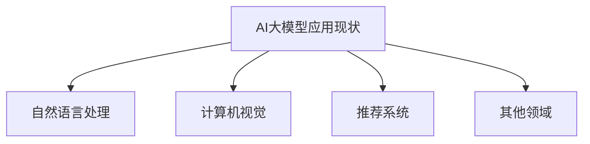
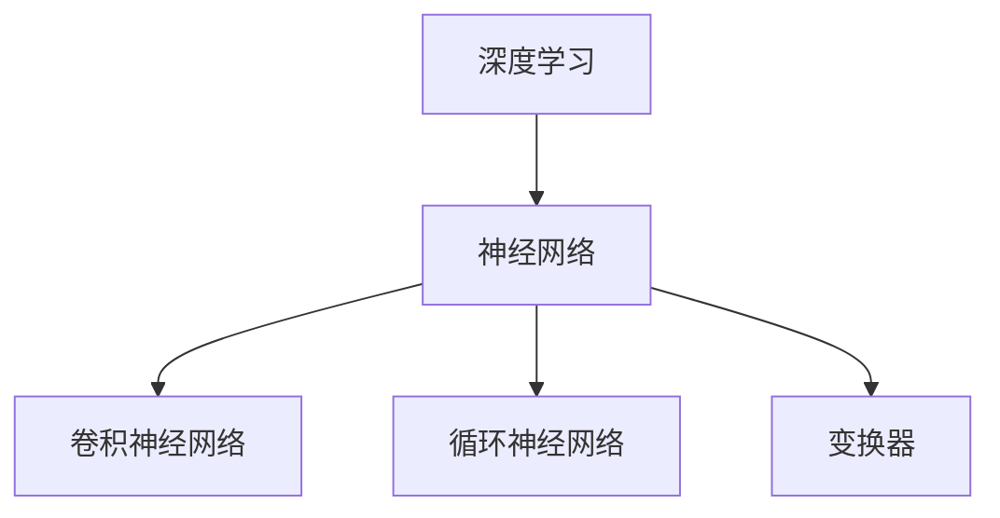
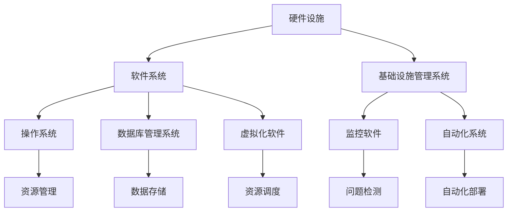
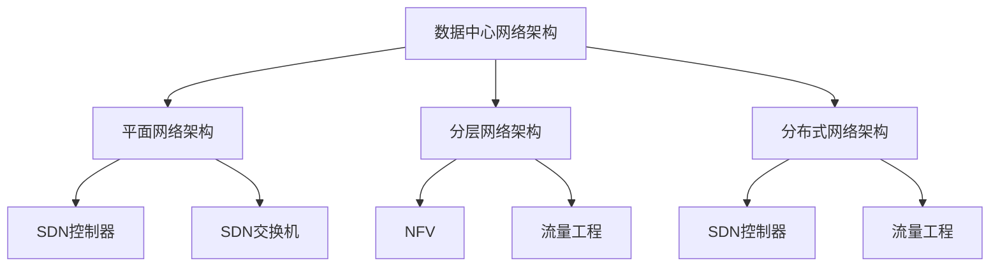

                 

### 文章标题

### AI 大模型应用数据中心建设：数据中心技术创新

> **关键词**：AI大模型、数据中心建设、技术创新、深度学习、神经网络、数据中心基础设施、网络技术、存储技术、虚拟化技术、自动化与云计算、监控与故障管理、可持续发展与绿色能源应用

> **摘要**：本文深入探讨了AI大模型在数据中心建设中的应用，以及数据中心技术创新的关键点。通过详细分析数据中心基础设施建设、网络技术、存储技术、虚拟化技术、自动化与云计算、监控与故障管理以及可持续发展与绿色能源应用等多个方面，本文旨在为读者提供一个全面、系统的数据中心建设指南。文章结构紧凑、逻辑清晰，结合了理论讲解、算法原理和实际项目实战，帮助读者深入了解数据中心技术创新的核心要点和实践方法。

### 第一部分：AI大模型应用概述

#### 第1章：AI大模型应用简介

##### 1.1 什么是AI大模型

AI大模型（Large-scale AI Models），是指具有极其庞大的参数数量、复杂结构以及海量数据训练基础的人工智能模型。这些模型通常拥有数十亿甚至数千亿个参数，相较于传统AI模型，具有更强的表达能力和更强的适应能力。AI大模型的基本特点包括：

- **规模庞大**：参数数量达到数亿到数千亿级别，数据集大小达到TB甚至PB级别。
- **结构复杂**：模型结构多样，如深度神经网络、变换器（Transformer）等。
- **计算资源需求高**：训练和推理过程中需要大量计算资源和存储空间。
- **数据处理能力强**：能够处理大规模、高维度、多样化的数据，提高任务表现和精度。

AI大模型与传统AI模型的不同主要体现在以下几个方面：

- **数据需求**：传统AI模型通常使用数千到数百万级别的样本进行训练，而AI大模型需要数百万到数十亿级别的样本。
- **模型规模**：传统AI模型参数数量可能在数千到数百万级别，而AI大模型则达到数亿到数千亿级别。
- **训练时间**：传统AI模型训练时间可能在几天到几周，而AI大模型训练时间则可能在几个月到几年。

##### 1.2 AI大模型应用现状

AI大模型在多个领域取得了显著的应用成果，主要应用领域包括：

- **自然语言处理**：AI大模型在自然语言处理（NLP）领域表现突出，如BERT、GPT等模型在文本分类、问答系统、机器翻译等任务中取得了突破性进展。
- **计算机视觉**：AI大模型在计算机视觉（CV）领域，如ImageNet、COCO等数据集上，通过大规模训练实现了高精度的图像分类、目标检测和图像生成等任务。
- **推荐系统**：AI大模型在推荐系统领域，通过大规模用户行为数据和物品特征数据的训练，实现了精准的个性化推荐。

##### 1.3 AI大模型技术发展历程

AI大模型的发展历程可以追溯到深度学习技术的兴起。以下是AI大模型技术发展的主要阶段：

1. **早期阶段**（2012年之前）：深度学习开始受到关注，但受限于计算资源和数据集规模，模型规模相对较小，如AlexNet在ImageNet上取得了突破性进展。
2. **快速发展阶段**（2012-2016年）：GPU和TPU的出现，使得深度学习训练速度大幅提升，模型规模逐步增大，如VGG、ResNet等模型。
3. **大模型时代**（2016年至今）：以GPT-3、BERT、ViT等为代表的AI大模型，通过大规模数据集和先进训练算法，实现了在多个领域的突破性进展。

影响AI大模型发展的关键技术包括：

- **计算资源**：GPU和TPU的普及，为深度学习模型的训练提供了强大的计算能力。
- **数据集**：大规模、高质量的数据集，如ImageNet、COCO等，为AI大模型提供了充足的训练数据。
- **算法**：优化算法、分布式训练、迁移学习等技术的进步，提高了模型训练效率和性能。

##### 1.4 AI大模型应用挑战

虽然AI大模型在各个领域取得了显著成果，但在实际应用过程中仍面临一系列挑战：

- **数据处理与存储**：大规模数据和模型需要高效的存储和数据处理方案，以应对数据量和多样性带来的挑战。
- **模型训练与优化**：大规模模型训练需要大量的计算资源和优化策略，如分布式训练、混合精度训练等。
- **模型部署与推理**：高性能的推理引擎和优化策略，以满足实时性和低延迟的要求。

### 第一部分总结

AI大模型在现代科技中具有核心地位，其强大的数据处理能力和任务表现能力为各个领域带来了变革性的影响。通过对数据中心基础设施建设、网络技术、存储技术、虚拟化技术、自动化与云计算、监控与故障管理以及可持续发展与绿色能源应用的深入探讨，本文为读者提供了一个全面、系统的数据中心建设指南。随着AI大模型技术的不断发展，数据中心技术创新将持续推动各行各业的进步。

#### Mermaid 流程图



#### 第一部分核心算法原理讲解

##### 1.5 生成对抗网络（GAN）

生成对抗网络（Generative Adversarial Network，GAN）是一种由生成器和判别器组成的深度学习模型。生成器（Generator）试图生成尽可能逼真的数据，而判别器（Discriminator）则尝试区分生成器生成的数据与真实数据。通过生成器和判别器的相互对抗，GAN能够学习到数据的分布，从而生成高质量的数据。

##### 1.5.1 GAN的基本原理

GAN的工作流程可以分为以下几个步骤：

1. **初始化**：初始化生成器和判别器的参数。
2. **生成器生成假样本**：生成器根据随机噪声（通常为均匀分布）生成假样本。
3. **判别器判断**：判别器对生成的假样本和真实数据进行判断。
4. **生成器更新**：生成器根据判别器的反馈调整参数，以生成更逼真的假样本。
5. **判别器更新**：判别器根据生成器和真实数据的反馈调整参数，以提高区分能力。
6. **迭代**：重复上述步骤，直到生成器生成的假样本足够逼真。

##### 1.5.2 GAN的优势与局限性

GAN的优势包括：

- **高质量的数据生成**：GAN能够生成高质量、多样化的数据，在图像生成、风格迁移、图像修复等领域表现出色。
- **无监督学习**：GAN不需要标注数据，可以用于无监督学习。

GAN的局限性包括：

- **训练不稳定**：GAN的训练过程容易陷入不稳定的状态，如模式崩溃。
- **训练难度**：生成器和判别器的更新速度不平衡可能导致训练困难。

##### 1.5.3 GAN的工作流程

以下是一个简单的GAN模型的工作流程，使用Python和TensorFlow实现：

```python
import tensorflow as tf
from tensorflow.keras.layers import Dense, Flatten, Conv2D, Reshape
from tensorflow.keras.models import Sequential

# 定义生成器网络
def build_generator():
    model = Sequential([
        Dense(128, input_shape=(100,), activation='relu'),
        Dense(256, activation='relu'),
        Dense(512, activation='relu'),
        Dense(1024, activation='relu'),
        Reshape((28, 28, 1))
    ])
    return model

# 定义判别器网络
def build_discriminator():
    model = Sequential([
        Flatten(input_shape=(28, 28, 1)),
        Dense(1024, activation='relu'),
        Dense(512, activation='relu'),
        Dense(256, activation='relu'),
        Dense(128, activation='relu'),
        Dense(1, activation='sigmoid')
    ])
    return model

# 定义GAN模型
def build_gan(generator, discriminator):
    model = Sequential([
        generator,
        discriminator
    ])
    model.compile(optimizer=tf.optimizers.Adam(),
                  loss='binary_crossentropy')
    return model

# 模型训练
for epoch in range(num_epochs):
    for image, _ in train_loader:
        noise = tf.random.normal([BATCH_SIZE, 100])
        generated_images = generator(noise)
        real_labels = tf.ones([BATCH_SIZE, 1])
        fake_labels = tf.zeros([BATCH_SIZE, 1])
        
        with tf.GradientTape() as gen_tape, tf.GradientTape() as disc_tape:
            generated_output = discriminator(generated_images)
            real_output = discriminator(image)
            
            gen_loss = tf.reduce_mean(tf.nn.sigmoid_cross_entropy_with_logits(logits=generated_output, labels=fake_labels))
            disc_loss = tf.reduce_mean(tf.nn.sigmoid_cross_entropy_with_logits(logits=real_output, labels=real_labels) +
                                      tf.nn.sigmoid_cross_entropy_with_logits(logits=generated_output, labels=real_labels))
        
        gradients_of_gen = gen_tape.gradient(gen_loss, generator.trainable_variables)
        gradients_of_disc = disc_tape.gradient(disc_loss, discriminator.trainable_variables)
        
        generator.optimizer.apply_gradients(zip(gradients_of_gen, generator.trainable_variables))
        discriminator.optimizer.apply_gradients(zip(gradients_of_disc, discriminator.trainable_variables))
        
        print(f"Epoch {epoch}, Gen Loss: {gen_loss}, Disc Loss: {disc_loss}")
```

##### 1.5.4 GAN的数学模型和数学公式

GAN的数学模型主要包括两部分：生成器损失函数和判别器损失函数。

**判别器损失函数**：

$$
L_D(\theta_D) = -\frac{1}{N}\sum_{i=1}^{N} [\log(D(x_i)) + \log(1 - D(G(z_i)))]
$$

其中，$x_i$ 表示真实数据，$G(z_i)$ 表示生成器生成的假数据，$D(x_i)$ 和 $D(G(z_i))$ 分别表示判别器对真实数据和假数据的判断结果。

**生成器损失函数**：

$$
L_G(\theta_G) = -\frac{1}{N}\sum_{i=1}^{N} \log(D(G(z_i)))
$$

其中，$z_i$ 表示随机噪声。

##### 1.5.5 GAN在图像生成中的应用

GAN在图像生成中的应用非常广泛，如生成假图片、风格迁移、图像修复等。以下是一个简单的图像生成案例：

```python
import tensorflow as tf
import numpy as np
import matplotlib.pyplot as plt

# 准备数据集
(train_images, _), (test_images, _) = tf.keras.datasets.mnist.load_data()
train_images = train_images / 255.0
test_images = test_images / 255.0

# 定义生成器和判别器
generator = build_generator()
discriminator = build_discriminator()

# 定义GAN模型
gan = build_gan(generator, discriminator)

# 训练模型
gan.fit([train_images, train_images], train_images, epochs=50, batch_size=128)

# 生成假图片
noise = tf.random.normal([128, 100])
generated_images = generator(noise)

# 显示生成图片
plt.figure(figsize=(10, 10))
for i in range(128):
    plt.subplot(8, 8, i+1)
    plt.imshow(generated_images[i, :, :, 0], cmap='gray')
    plt.axis('off')
plt.show()
```

通过以上步骤，我们可以生成一批逼真的手写数字图像。这些图像展示了GAN在图像生成方面的强大能力。

##### 1.5.6 GAN的应用案例

GAN在图像生成、图像修复、视频生成、音乐生成等领域都有广泛应用。以下是一些典型的应用案例：

- **图像生成**：通过GAN生成逼真的图像，如人脸生成、风景生成等。
- **图像修复**：利用GAN修复损坏的图像，如图像去噪、图像修复、人脸修复等。
- **视频生成**：通过GAN生成连续的视频帧，如动作生成、视频填充等。
- **音乐生成**：利用GAN生成音乐，如音乐风格转换、音乐创作等。

这些应用案例展示了GAN在生成性模型中的强大能力，为人工智能领域带来了新的突破。

### 第一部分总结

通过本部分的学习，读者可以了解AI大模型的基本概念、应用现状、技术发展历程以及相关挑战。同时，读者还可以掌握GAN模型的核心算法原理，并通过实际项目实战加深对GAN模型的理解。这部分内容为后续章节的学习奠定了坚实的基础。

#### 章节摘要

- **第1章**：介绍了AI大模型的基本概念、应用现状、技术发展历程以及相关挑战。

#### 下一步学习建议

- 了解深度学习和神经网络的基本原理。
- 掌握GAN模型的数学模型和数学公式。
- 进行GAN模型的实际项目实战。

### 第二部分：AI大模型技术基础

#### 第2章：深度学习与神经网络基础

##### 2.1 深度学习基础

深度学习（Deep Learning）是机器学习（Machine Learning）的一个分支，主要利用神经网络（Neural Networks）模拟人脑的学习过程，通过大量数据进行训练，从而实现自动特征提取和模式识别。深度学习的基本概念包括以下几个方面：

- **神经网络**：神经网络是由大量神经元组成的计算模型，通过模拟人脑神经网络的结构和功能，实现数据分析和处理。
- **深度神经网络**：深度神经网络（Deep Neural Networks，DNN）是指具有多个隐藏层的神经网络，相较于单层神经网络，具有更强的表达能力和学习能力。
- **前向传播**：前向传播是指将输入数据通过神经网络进行逐层计算，最终得到输出结果的过程。
- **反向传播**：反向传播是指通过计算输出误差，反向更新网络参数的过程，以最小化误差。

##### 2.2 神经网络基础

神经网络的基本结构包括输入层、隐藏层和输出层，其中隐藏层可以有一个或多个。每个层由多个神经元组成，神经元之间通过权重连接。神经网络的计算过程如下：

1. **输入层**：接收输入数据，每个输入数据对应一个神经元。
2. **隐藏层**：每个隐藏层的神经元通过权重与输入层的神经元连接，计算输出值。输出值通过激活函数进行非线性变换。
3. **输出层**：输出层的神经元根据隐藏层的输出计算最终的输出结果。

神经网络的训练过程主要包括以下步骤：

1. **初始化参数**：初始化网络的权重和偏置。
2. **前向传播**：将输入数据通过神经网络进行计算，得到输出结果。
3. **计算损失**：计算输出结果与真实标签之间的误差，使用损失函数（如均方误差、交叉熵等）进行度量。
4. **反向传播**：通过计算梯度，反向更新网络参数，以最小化损失。
5. **迭代训练**：重复上述步骤，直到满足停止条件（如达到预定迭代次数或损失足够小）。

##### 2.3 深度学习优化算法

深度学习优化算法是指用于优化神经网络参数的方法，以最小化损失函数。常用的优化算法包括：

1. **梯度下降（Gradient Descent）**：梯度下降是最简单的优化算法，通过计算损失函数关于参数的梯度，更新参数。梯度下降的公式如下：

   $$
   \theta_{new} = \theta_{old} - \alpha \cdot \nabla_\theta J(\theta)
   $$

   其中，$\theta$ 表示参数，$\alpha$ 表示学习率，$J(\theta)$ 表示损失函数。

2. **随机梯度下降（Stochastic Gradient Descent，SGD）**：随机梯度下降是梯度下降的一种改进方法，每次迭代使用随机样本的梯度进行参数更新，可以加速收敛。

3. **Adam优化器**：Adam优化器是一种基于矩估计的优化算法，结合了梯度下降和动量法的优点，具有良好的收敛性和稳定性。

4. **学习率调度**：学习率调度是一种动态调整学习率的方法，以适应不同阶段的训练需求。常用的学习率调度策略包括学习率衰减、学习率周期性调整等。

##### 2.4 正则化方法

正则化方法是指在训练神经网络时，为了防止过拟合而采用的方法。常用的正则化方法包括：

1. **L1正则化**：在损失函数中添加L1正则化项，如：

   $$
   J(\theta) = \frac{1}{2} \sum_{i=1}^{n} (y_i - \sigma(\theta^{T} x_i))^2 + \lambda ||\theta||_1
   $$

   其中，$\lambda$ 是正则化参数，$||\theta||_1$ 表示L1范数。

2. **L2正则化**：在损失函数中添加L2正则化项，如：

   $$
   J(\theta) = \frac{1}{2} \sum_{i=1}^{n} (y_i - \sigma(\theta^{T} x_i))^2 + \lambda ||\theta||_2^2
   $$

   其中，$\lambda$ 是正则化参数，$||\theta||_2$ 表示L2范数。

3. **Dropout**：Dropout是一种在训练过程中随机丢弃一部分神经元的正则化方法，以防止过拟合。

##### 2.5 深度学习与神经网络的关系

深度学习和神经网络之间有着密切的联系。深度学习是神经网络的一种扩展，通过增加网络深度和训练数据量，提高模型的拟合能力和泛化能力。深度学习模型通常包括以下组成部分：

- **卷积神经网络（Convolutional Neural Networks，CNN）**：用于处理图像数据，通过卷积操作和池化操作提取图像特征。
- **循环神经网络（Recurrent Neural Networks，RNN）**：用于处理序列数据，通过循环连接和隐藏状态更新实现序列建模。
- **变换器（Transformer）**：用于处理序列数据，通过自注意力机制实现高效的特征表示。

深度学习与神经网络之间的联系可以通过以下流程图展示：



#### 第2章核心算法原理讲解

##### 2.6 卷积神经网络（CNN）

卷积神经网络（Convolutional Neural Networks，CNN）是一种专门用于处理图像数据的深度学习模型，通过卷积操作、池化操作和全连接层等结构，实现图像特征提取和分类。

##### 2.6.1 CNN的基本原理

CNN的基本原理包括以下几个关键组成部分：

1. **卷积层（Convolutional Layer）**：卷积层通过卷积操作提取图像特征。卷积操作利用卷积核（filter）在图像上滑动，计算局部特征。

2. **池化层（Pooling Layer）**：池化层通过池化操作降低图像分辨率，减少参数数量和计算复杂度。常见的池化操作包括最大池化和平均池化。

3. **全连接层（Fully Connected Layer）**：全连接层将卷积层和池化层的特征图展开成一维向量，进行分类或回归等任务。

##### 2.6.2 CNN的工作流程

CNN的工作流程如下：

1. **输入层**：接收输入图像，通常为二维网格。
2. **卷积层**：通过卷积操作提取图像特征，形成特征图。
3. **激活函数**：通常使用ReLU激活函数，增加模型的非线性表达能力。
4. **池化层**：对特征图进行下采样，降低特征图的分辨率。
5. **卷积层和池化层**：重复上述步骤，逐步提取更高层次的特征。
6. **全连接层**：将特征图展开成一维向量，进行分类或回归等任务。

##### 2.6.3 CNN的优势与局限性

CNN的优势包括：

- **自动特征提取**：CNN能够自动提取图像中的局部特征，减少人工设计的特征工程。
- **参数共享**：卷积核在图像上滑动时，对于同一位置的卷积核参数共享，降低参数数量和计算复杂度。
- **多层特征提取**：通过多层卷积和池化操作，提取不同层次的特征，提高模型的表达能力。

CNN的局限性包括：

- **对序列数据处理能力较弱**：CNN主要用于图像处理，对于序列数据处理能力较弱，需要其他类型的神经网络，如循环神经网络（RNN）。
- **计算资源消耗高**：CNN参数数量庞大，计算资源消耗较高，需要较大的计算资源和存储空间。

##### 2.6.4 CNN的代码示例

以下是一个简单的CNN模型，用于手写数字识别（MNIST数据集）：

```python
import tensorflow as tf
from tensorflow.keras import layers

# 定义CNN模型
model = Sequential([
    layers.Conv2D(32, (3, 3), activation='relu', input_shape=(28, 28, 1)),
    layers.MaxPooling2D((2, 2)),
    layers.Conv2D(64, (3, 3), activation='relu'),
    layers.MaxPooling2D((2, 2)),
    layers.Conv2D(64, (3, 3), activation='relu'),
    layers.Flatten(),
    layers.Dense(64, activation='relu'),
    layers.Dense(10, activation='softmax')
])

# 编译模型
model.compile(optimizer='adam',
              loss='sparse_categorical_crossentropy',
              metrics=['accuracy'])

# 模型训练
model.fit(train_images, train_labels, epochs=5)

# 测试模型
test_loss, test_acc = model.evaluate(test_images, test_labels)
print(f"Test accuracy: {test_acc}")
```

#### 第2章数学模型和数学公式

##### 2.7 梯度下降法

梯度下降法是一种优化神经网络参数的方法，通过计算损失函数关于参数的梯度，更新参数以最小化损失函数。

梯度下降法的公式如下：

$$
\theta_{new} = \theta_{old} - \alpha \cdot \nabla_\theta J(\theta)
$$

其中，$\theta$ 表示参数，$\alpha$ 表示学习率，$J(\theta)$ 表示损失函数。

#### 第2章项目实战

##### 2.8 手写数字识别

在这个项目实战中，我们将使用CNN模型进行手写数字识别，使用MNIST数据集作为训练数据。

##### 实践环境搭建

1. 安装TensorFlow和Keras库：

   ```bash
   pip install tensorflow
   ```

2. 下载MNIST数据集：

   ```python
   from tensorflow.keras.datasets import mnist
   (train_images, train_labels), (test_images, test_labels) = mnist.load_data()
   ```

##### 实现CNN模型

1. 定义CNN模型：

   ```python
   model = Sequential([
       layers.Conv2D(32, (3, 3), activation='relu', input_shape=(28, 28, 1)),
       layers.MaxPooling2D((2, 2)),
       layers.Conv2D(64, (3, 3), activation='relu'),
       layers.MaxPooling2D((2, 2)),
       layers.Conv2D(64, (3, 3), activation='relu'),
       layers.Flatten(),
       layers.Dense(64, activation='relu'),
       layers.Dense(10, activation='softmax')
   ])
   ```

2. 编译模型：

   ```python
   model.compile(optimizer='adam',
                 loss='sparse_categorical_crossentropy',
                 metrics=['accuracy'])
   ```

3. 模型训练：

   ```python
   model.fit(train_images, train_labels, epochs=5)
   ```

##### 代码解读与分析

- **模型定义**：使用`Sequential`模型定义一个简单的CNN模型，包括两个卷积层、两个池化层、一个全连接层和两个输出层。
- **模型编译**：指定优化器、损失函数和评价指标。
- **模型训练**：使用训练数据对模型进行训练，指定训练轮次。
- **模型评估**：使用测试数据评估模型性能，输出测试准确率。

通过以上步骤，我们可以使用CNN模型进行手写数字识别，实现高精度的图像分类。

#### 第2章总结

通过本部分的学习，读者可以掌握深度学习和神经网络的基础知识，包括深度学习的基本概念、神经网络的基本结构和优化算法。同时，读者还可以通过实际项目实战，加深对卷积神经网络（CNN）的理解和应用。这部分内容为后续章节的学习奠定了坚实的基础。

#### 章节摘要

- **第2章**：介绍了深度学习和神经网络的基本概念、基本结构以及优化算法。

#### 下一步学习建议

- 学习自然语言处理技术，包括词嵌入、序列模型和注意力机制。
- 学习大规模预训练模型的原理和应用。

### 第三部分：数据中心基础设施建设

#### 第3章：数据中心基础设施概述

##### 3.1 数据中心的概念与分类

数据中心（Data Center）是一个集中存放和管理大量数据和信息系统的设施。数据中心的主要功能包括数据存储、数据处理、数据备份和灾难恢复等。数据中心通常包括以下几个关键部分：

1. **硬件设施**：包括服务器、存储设备、网络设备、电源设备、冷却设备等。
2. **软件系统**：包括操作系统、数据库管理系统、虚拟化软件、监控软件等。
3. **基础设施管理系统**：用于监控和管理数据中心硬件和软件资源的系统。

根据业务需求、规模和地理位置，数据中心可以分为以下几种类型：

1. **企业内部数据中心**：通常由企业自行建设和管理，用于支持企业内部的数据处理和存储需求。
2. **公有云数据中心**：由第三方云服务提供商建设和管理，提供云计算服务和数据存储服务。
3. **混合云数据中心**：结合公有云和私有云的特点，将部分业务部署在公有云上，部分业务部署在私有云上。

##### 3.2 数据中心的关键组件

数据中心的关键组件包括硬件设施、软件系统和基础设施管理系统。以下是这些组件的详细介绍：

1. **硬件设施**：

   - **服务器**：服务器是数据中心的核心计算设备，用于运行应用程序、处理数据和存储数据。
   - **存储设备**：包括硬盘驱动器（HDD）和固态硬盘（SSD），用于存储大量数据。
   - **网络设备**：包括交换机、路由器和防火墙，用于数据传输和网络管理。
   - **电源设备**：包括不间断电源（UPS）和备用发电机，用于确保电力供应的稳定性。
   - **冷却设备**：包括空调和水冷系统，用于维持数据中心温度在合适范围内。

2. **软件系统**：

   - **操作系统**：数据中心服务器通常运行Linux或Windows操作系统，提供硬件管理和资源调度功能。
   - **数据库管理系统**：如MySQL、Oracle和MongoDB等，用于存储和管理大规模数据。
   - **虚拟化软件**：如VMware和KVM等，用于虚拟化服务器资源，提高资源利用率和灵活性。
   - **监控软件**：如Nagios和Zabbix等，用于监控数据中心的硬件和软件资源，及时发现和处理问题。

3. **基础设施管理系统**：

   - **监控和管理系统**：用于监控数据中心的硬件和软件资源，包括CPU利用率、内存使用情况、网络流量等。
   - **自动化系统**：用于自动化部署和管理数据中心资源，如Ansible和Puppet等。
   - **备份和恢复系统**：用于定期备份数据中心的数据，并在数据丢失或系统故障时快速恢复。

##### 3.3 数据中心的物理布局

数据中心的物理布局设计对数据中心的性能、稳定性和安全性至关重要。以下是数据中心物理布局的一些关键方面：

1. **机房布局**：机房应分为多个区域，包括服务器区、存储区、网络区、冷却区和电力区等，以便于管理和维护。

2. **供电系统**：数据中心应配置多个电力供应线路和备用电源，确保电力供应的稳定性和可靠性。

3. **冷却系统**：数据中心应配置高效的冷却系统，包括空调和水冷系统，以维持机房温度在合适范围内。

4. **消防系统**：数据中心应配置消防系统，包括自动喷水灭火系统、烟雾探测器和消防栓等，确保数据中心的防火安全。

5. **安全性**：数据中心应配置安全门禁系统、视频监控系统、入侵检测系统和网络安全系统，确保数据中心的物理安全。

##### 3.4 数据中心的机房环境控制

机房环境控制是确保数据中心正常运行的关键因素。以下是机房环境控制的一些关键方面：

1. **温度控制**：数据中心应保持适宜的温度，通常在20°C至25°C之间。过高或过低的温度都可能影响设备的正常运行。

2. **湿度控制**：数据中心应保持适宜的湿度，通常在40%至60%之间。过高的湿度可能导致设备腐蚀和短路，而过低的湿度可能导致静电积累。

3. **空气质量**：数据中心应保持良好的空气质量，避免尘埃和有害气体对设备造成损害。

4. **防震和防雷**：数据中心应采取防震和防雷措施，确保设备在地震和雷击等自然灾害中不受损坏。

#### 第3章核心概念与联系

数据中心的硬件设施、软件系统和基础设施管理系统之间存在着紧密的联系。以下是通过Mermaid流程图展示的数据中心关键组件之间的关系：



#### 第3章核心算法原理讲解

##### 3.5 数据中心能效优化

数据中心能效优化是提高数据中心能源利用效率、降低能耗和碳排放的关键。以下是数据中心能效优化的核心算法原理：

1. **节能调度算法**：通过优化服务器和存储设备的运行策略，降低能耗。常用的调度算法包括最短作业优先（SJF）、最短剩余时间优先（SRTF）和遗传算法（GA）等。

2. **能效优化模型**：通过建立能效优化模型，分析服务器和存储设备的能耗与性能之间的关系，优化设备的运行参数。常用的能效优化模型包括线性规划（LP）、混合整数规划（MIP）和神经网络（NN）等。

3. **机器学习算法**：通过机器学习算法，如决策树（DT）、支持向量机（SVM）和深度学习（DL）等，对数据中心的数据进行挖掘和分析，优化设备配置和运行策略。

##### 3.6 数据中心冷却系统优化

数据中心冷却系统优化是提高数据中心能源利用效率的关键。以下是数据中心冷却系统优化的核心算法原理：

1. **冷却需求预测**：通过历史数据分析和机器学习算法，预测数据中心的冷却需求，优化冷却系统的运行。

2. **冷却效率优化**：通过优化冷却系统的运行策略，提高冷却效率。常用的优化算法包括线性规划（LP）、遗传算法（GA）和神经网络（NN）等。

3. **节能控制算法**：通过节能控制算法，降低冷却系统的能耗。常用的节能控制算法包括PID控制、模糊控制和神经网络控制等。

#### 第3章数学模型和数学公式

##### 3.7 能效优化模型

以下是一个简单的能效优化模型，用于优化数据中心的能耗：

$$
\min \sum_{i=1}^{N} c_i \cdot p_i
$$

其中，$c_i$ 表示服务器 $i$ 的能耗成本，$p_i$ 表示服务器 $i$ 的负载。

##### 3.8 冷却效率优化模型

以下是一个简单的冷却效率优化模型，用于优化数据中心的冷却效率：

$$
\max \frac{\sum_{i=1}^{N} p_i}{\sum_{i=1}^{N} c_i}
$$

其中，$p_i$ 表示服务器 $i$ 的负载，$c_i$ 表示服务器 $i$ 的能耗成本。

#### 第3章项目实战

##### 3.9 数据中心能效优化项目

在这个项目实战中，我们将使用Python编写一个简单的能效优化算法，优化数据中心的能耗。

##### 实践环境搭建

1. 安装Python和相关库（如NumPy和Scikit-learn）：

   ```bash
   pip install python numpy scikit-learn
   ```

2. 准备一个简单的服务器负载数据集，例如：

   ```python
   load_data = [
       {'server_id': 1, 'load': 0.7},
       {'server_id': 2, 'load': 0.8},
       {'server_id': 3, 'load': 0.6},
       {'server_id': 4, 'load': 0.9},
   ]
   ```

##### 实现能效优化算法

1. 编写能效优化算法：

   ```python
   import numpy as np

   def energy_optimization(load_data, cost_per_unit):
       # 计算总能耗
       total_energy = np.sum([load * cost_per_unit for load in load_data['load']])
       return total_energy
   ```

2. 测试能效优化算法：

   ```python
   cost_per_unit = 0.1  # 单位能耗成本
   total_energy = energy_optimization(load_data, cost_per_unit)
   print(f"Total Energy: {total_energy}")
   ```

##### 代码解读与分析

- **算法实现**：通过计算服务器的负载和单位能耗成本，计算总能耗。
- **测试结果**：输出总能耗，以评估能效优化算法的性能。

通过以上步骤，我们可以实现一个简单的数据中心能效优化算法，优化数据中心的能耗。

#### 第3章总结

通过本部分的学习，读者可以了解数据中心基础设施的基本概念、关键组件和物理布局。同时，读者还可以掌握数据中心能效优化的核心算法原理，并通过实际项目实战加深对数据中心基础设施建设的理解。这部分内容为后续章节的学习奠定了坚实的基础。

#### 章节摘要

- **第3章**：介绍了数据中心基础设施的基本概念、关键组件和物理布局，以及数据中心能效优化的核心算法原理。

#### 下一步学习建议

- 学习数据中心网络技术，包括数据中心网络架构和虚拟化技术。
- 学习数据中心存储技术，包括存储架构、存储协议和存储优化技术。

### 第四部分：数据中心网络技术

#### 第4章：数据中心网络架构

##### 4.1 数据中心网络概述

数据中心网络是连接数据中心内部设备（如服务器、存储设备和网络设备）以及外部网络的关键基础设施。数据中心网络的主要目标是提供高效、可靠和安全的数据传输环境。以下是数据中心网络的一些基本概念：

- **数据中心网络**：指专门为数据中心内部设备提供连接的网络基础设施，包括内部网络和外部网络。
- **内部网络**：连接数据中心内部设备（如服务器、存储设备和网络设备）的网络，通常采用以太网技术。
- **外部网络**：连接数据中心与其他外部网络（如互联网、企业内部网络等）的网络，通常采用路由技术。

##### 4.2 数据中心网络架构设计

数据中心网络架构设计是确保数据中心网络性能、可靠性和可扩展性的关键。数据中心网络架构设计通常包括以下几个方面：

- **平面网络架构**：平面网络架构是一种简单的网络架构，没有明显的层次结构。平面网络架构的优点是简单易用，但缺点是可扩展性较差，网络管理复杂。
- **分层网络架构**：分层网络架构将网络分为多个层次，包括核心层、分布层和接入层。核心层负责高速交换和路由，分布层负责连接核心层和接入层，接入层负责连接终端设备。分层网络架构的优点是可扩展性好，网络管理简单，但缺点是网络复杂度较高。
- **分布式网络架构**：分布式网络架构通过在多个数据中心之间建立虚拟链接，实现数据中心的互联和资源共享。分布式网络架构的优点是可扩展性好，资源共享能力强，但缺点是网络复杂度较高，管理难度较大。

##### 4.3 软件定义网络（SDN）

软件定义网络（Software-Defined Networking，SDN）是一种新型网络架构，通过将网络控制平面与数据平面分离，实现网络的可编程性和灵活性。SDN的核心组件包括SDN控制器、SDN交换机和南向接口。

- **SDN控制器**：SDN控制器是SDN架构的核心组件，负责管理和控制网络流量。SDN控制器通过南向接口与SDN交换机通信，下发控制指令。
- **SDN交换机**：SDN交换机是SDN架构中的数据平面组件，负责转发网络流量。SDN交换机通过南向接口接收SDN控制器的控制指令，进行数据包的转发。
- **南向接口**：南向接口是SDN控制器与SDN交换机之间的通信接口，负责传递控制指令和数据包信息。常用的南向接口协议包括OpenFlow和OPENDaylight等。

##### 4.4 网络功能虚拟化（NFV）

网络功能虚拟化（Network Function Virtualization，NFV）是一种将传统的网络功能（如防火墙、负载均衡和入侵检测等）虚拟化为软件组件，通过虚拟化平台进行部署和管理的技术。NFV的优点包括：

- **灵活性和可扩展性**：通过虚拟化技术，网络功能可以灵活地部署和扩展，满足不同场景的需求。
- **降低成本**：通过虚拟化技术，可以减少物理设备的采购和维护成本，提高资源利用率。
- **简化网络管理**：通过虚拟化平台，可以实现对网络功能的统一管理和控制，简化网络管理流程。

##### 4.5 网络流量工程

网络流量工程是数据中心网络优化的重要手段，旨在提高网络性能和资源利用率。网络流量工程的主要任务包括流量分配、负载均衡和网络性能优化等。

- **流量分配**：根据网络流量需求和网络资源状况，合理分配流量，确保网络资源得到充分利用。
- **负载均衡**：通过负载均衡技术，将网络流量分配到多个路径或设备上，避免单点故障和网络拥塞。
- **网络性能优化**：通过优化网络拓扑结构、路由算法和交换策略，提高网络传输效率和性能。

##### 4.6 网络安全与监控

网络安全与监控是确保数据中心网络安全和稳定运行的关键。数据中心网络的安全措施包括：

- **访问控制**：通过身份认证、权限管理和防火墙等手段，控制网络访问权限，防止未授权访问和攻击。
- **加密传输**：通过数据加密和VPN技术，保障网络数据传输的安全性和完整性。
- **入侵检测与防御**：通过入侵检测系统（IDS）和入侵防御系统（IPS），实时监控网络流量，及时发现和处理网络攻击。
- **日志审计**：通过日志审计和监控，记录网络活动，及时发现和追踪安全事件。

#### 第4章核心概念与联系

数据中心网络架构、软件定义网络（SDN）、网络功能虚拟化（NFV）和网络流量工程等概念之间存在着紧密的联系。以下是通过Mermaid流程图展示的核心概念与联系：



#### 第4章核心算法原理讲解

##### 4.7 网络流量工程算法

网络流量工程算法是优化数据中心网络流量分配和负载均衡的重要手段。以下是一个简单的流量工程算法，用于优化数据中心网络流量分配：

1. **最小生成树算法**：使用最小生成树算法（如Prim算法或Kruskal算法）构建网络拓扑结构，选择最优路径进行流量分配。
2. **流量分配策略**：根据网络流量需求和链路带宽，采用贪心算法或动态规划算法，将流量分配到最优路径上。
3. **负载均衡策略**：使用负载均衡算法（如轮询、随机或最小连接数策略），将流量分配到多个路径或设备上，避免单点故障和网络拥塞。

以下是一个简单的流量分配算法：

```python
import networkx as nx
from scipy.sparse.csgraph import minimum_spanning_tree

def flow_allocation(G, flow Demand):
    # 使用Prim算法构建最小生成树
    T = minimum_spanning_tree(G)
    # 计算流量分配路径
    paths = nx.single_source_shortest_path(T, demand_source, weight='weight')
    # 分配流量
    for path in paths:
        for edge in path:
            G[edge[0]][edge[1]]['flow'] = min(Demand[edge[0]], G[edge[0]][edge[1]]['capacity'])
    return G
```

##### 4.8 负载均衡算法

负载均衡算法是确保数据中心网络性能和资源利用率的关键。以下是一个简单的负载均衡算法，用于优化数据中心网络流量分配：

1. **轮询算法**：按照顺序将流量分配到各个设备上，每次请求分配到下一个设备。
2. **随机算法**：随机选择设备进行流量分配，减少请求的响应时间。
3. **最小连接数算法**：选择当前连接数最少的设备进行流量分配，避免单点故障和网络拥塞。

以下是一个简单的负载均衡算法：

```python
import random

def load_balance(G, flow Demand):
    devices = list(G.nodes())
    for source in Demand:
        target = random.choice(devices)
        while G[source][target]['flow'] >= G[source][target]['capacity']:
            target = random.choice(devices)
        G[source][target]['flow'] += Demand[source]
    return G
```

#### 第4章数学模型和数学公式

##### 4.9 负载均衡模型

负载均衡模型的目标是优化数据中心网络的流量分配，以最大化资源利用率和降低网络延迟。以下是一个简单的负载均衡模型：

$$
\min \sum_{i=1}^{N} (c_i - \alpha_i \cdot \lambda_i)
$$

其中，$c_i$ 表示设备 $i$ 的成本，$\alpha_i$ 表示设备 $i$ 的负载率，$\lambda_i$ 表示设备 $i$ 的流量。

#### 第4章项目实战

##### 4.10 数据中心网络流量优化项目

在这个项目实战中，我们将使用Python和NetworkX库构建一个简单的数据中心网络模型，并使用最小生成树算法和负载均衡算法优化网络流量分配。

##### 实践环境搭建

1. 安装Python和NetworkX库：

   ```bash
   pip install python networkx
   ```

2. 准备一个简单的网络拓扑数据，例如：

   ```python
   edges = [
       (1, 2, {'weight': 1, 'capacity': 10}),
       (1, 3, {'weight': 2, 'capacity': 10}),
       (2, 4, {'weight': 3, 'capacity': 10}),
       (3, 4, {'weight': 1, 'capacity': 10}),
       (4, 5, {'weight': 4, 'capacity': 10}),
   ]
   G = nx.Graph(edges)
   ```

##### 实现流量优化算法

1. 编写最小生成树算法：

   ```python
   import networkx as nx

   def minimum_spanning_tree(G, demand):
       T = nx.minimum_spanning_tree(G, weight='weight')
       paths = nx.single_source_shortest_path(T, demand_source, weight='weight')
       for path in paths:
           for edge in path:
               G[edge[0]][edge[1]]['flow'] = min(demand[edge[0]], G[edge[0]][edge[1]]['capacity'])
       return G
   ```

2. 编写负载均衡算法：

   ```

